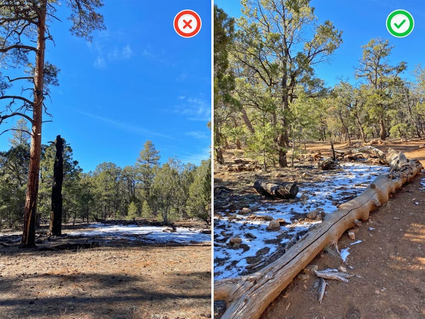
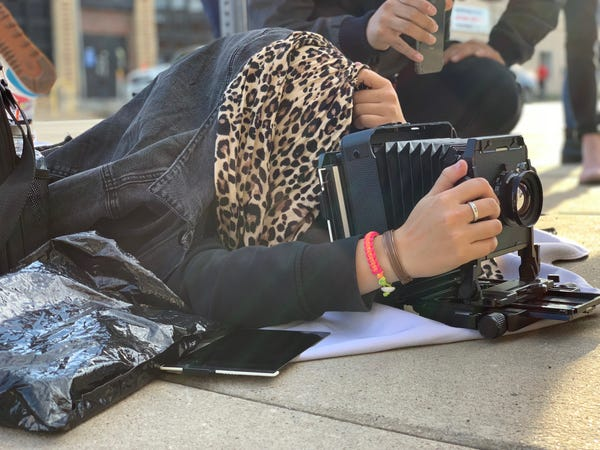
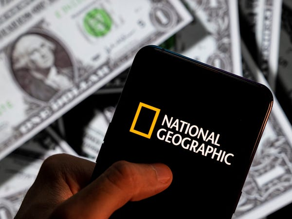
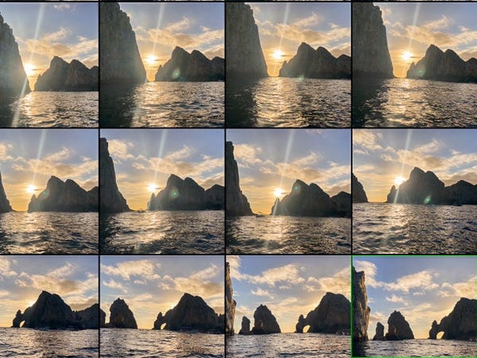
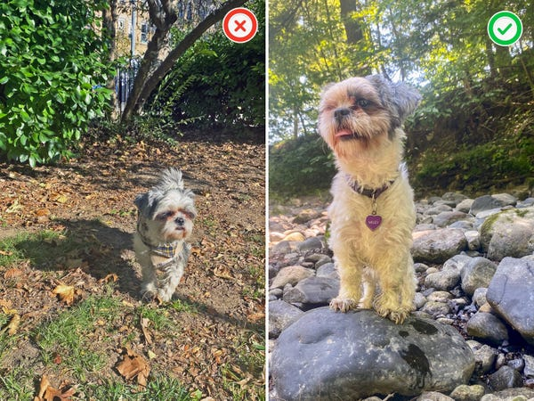
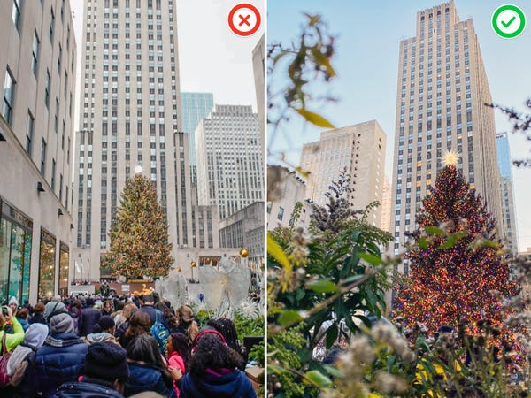
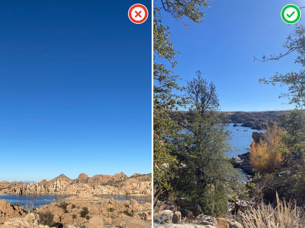
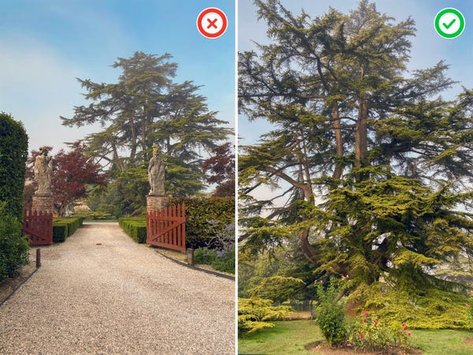
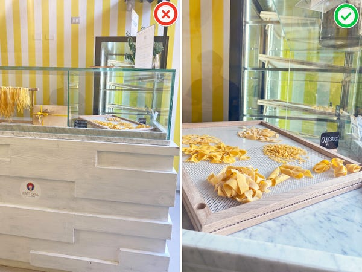
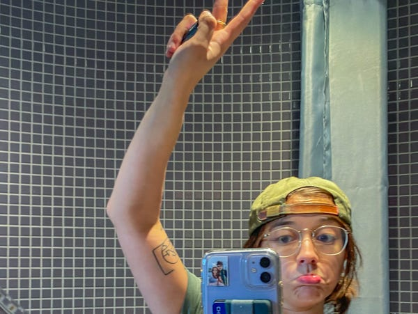

## A National Geographic photographer gave me 4 tips for taking better pictures with my phone. I tried them and the results blew me away.  

一位《国家地理》杂志的摄影师给了我4个用手机拍摄更好照片的建议。我试了一下，结果让我大吃一惊。

An Insider reporter's phone photos from a hike in Arizona show how to use a National Geographic photographer's tips.  

Insider记者在亚利桑那州徒步旅行时拍摄的手机照片展示了如何使用国家地理摄影师的提示。

Joey Hadden/Insider  

Joey Hadden/Insider

-   National Geographic photographer Kiliii Yüyan shared his best tips for phone photography.   
    
    国家地理摄影师Kiliii Yüyan分享了他对手机摄影的最佳建议。
-   To take better pictures on your phone, Yüyan suggested getting closer and trying new angles.   
    
    为了在手机上拍出更好的照片，玉燕建议走得更近，并尝试新的角度。
-   Above all, Yüyan said it's important to stick around and immerse yourself in the environment.   
    
    最重要的是，玉燕说，重要的是坚持下去，让自己沉浸在环境中。

## I've been taking photos on film and digital cameras for nearly a decade. But now that I travel more than ever before, I thought it was time to learn about my smallest, most nimble camera — my phone.  

我用胶片和数码相机拍照已经有近十年了。但现在我的旅行比以往任何时候都多，我想是时候了解我最小、最灵活的相机了--我的手机。

The author shoots on a large-format film camera in Dallas in 2018.  

2018年，作者在达拉斯用大画幅胶片相机进行拍摄。

Joey Hadden/Insider  

Joey Hadden/Insider

I went to school for photography, which made me great with most cameras, from digital to film. But I rarely took pictures on my phone until I graduated and started traveling more.   

我在学校学习摄影，这使我对大多数相机都很在行，从数码到胶片。但我很少用手机拍照，直到我毕业并开始更多的旅行。

Now that I'm a travel reporter, I take four trips a year where my work revolves around documenting the places I'm visiting, and I often rely on my phone for some of that imagery.  

现在我是一名旅游记者，我每年有四次旅行，我的工作围绕着记录我所访问的地方，而我经常依靠我的手机来获得一些图像。

## To improve my phone-photography skills, I recently talked to a National Geographic photographer about how to take mobile-phone pictures that truly stand out.  

为了提高我的手机摄影技巧，我最近和一位国家地理杂志的摄影师讨论了如何拍出真正引人注目的手机照片。

A photo illustration of the National Geographic logo displayed on a smartphone.  

在智能手机上显示的国家地理标志的照片插图。

Budrul Chukrut/SOPA Images/LightRocket via Getty Images  

Budrul Chukrut/SOPA Images/LightRocket via Getty Images

And just like when I was in school, I wanted to learn from a pro.  

就像我在学校时一样，我想向专家学习。

I turned to Kiliii Yüyan, a [National Geographic](http://natgeo.com/photos) photographer who tells stories about how different cultures relate to the environment, from the Amazon to the Arctic seas.  

我求助于国家地理摄影师Kiliii Yüyan，他讲述了从亚马逊到北极海域的不同文化与环境的关系。

The magazine published Yüyan's first work in 2018 and showcased whale hunters in Alaska, he told Insider.   

该杂志在2018年出版了Yüyan的第一部作品，展示了阿拉斯加的捕鲸者，他告诉内幕。

More recently, National Geographic granted Yüyan the [2023 Eliza Scidmore Award for Outstanding Storytelling](https://blog.nationalgeographic.org/2022/11/15/meet-kiliii-yuyan-national-geographic-explorer-and-2023-eliza-scidmore-award-recipient/) for his portfolio showcasing humans and their environments, which includes his 2022 July cover shot for a story documenting the lives of Native Americans.  

最近，《国家地理》杂志因其展示人类及其环境的作品而授予于洋2023年伊丽莎-斯基德莫尔杰出故事奖，其中包括他在2022年7月为记录美国原住民生活的故事拍摄的封面。  

This cover was also featured in the magazine's 2022 [Pictures of the Year issue](https://affiliate.insider.com/?h=e5462394ec330705fb4c42c1b80e52bf9646476f48444cd673b37f732fb65139&postID=63e560d2ba755652987e2387&site=in&u=https%3A%2F%2Fwww.nationalgeographic.com%2Fpages%2Ftopic%2Fbest-of-2022&amazonTrackingID=null&platform=browser&sc=false&disabled=false).   

这张封面也被刊登在该杂志的2022年年度图片中。

Yüyan told Insider that nowadays, people are "drowning in photographs," but there are ways to make yours stand out — even if you're just shooting on your phone.  

尤扬告诉《内幕》，如今人们 "淹没在照片中"，但有一些方法可以让你的照片脱颖而出--即使你只是用手机拍摄。

## Once I put his tips to use, I saw what a big difference they made in making my photos feel more powerful.  

一旦我把他的技巧运用起来，我看到它们在使我的照片感觉更强大方面有多么大的不同。

Photos from the author's camera roll show phone photos from Cabo San Lucas, Mexico, in 2022.  

来自作者相机卷的照片显示了2022年墨西哥卡波圣卢卡斯的手机照片。

Joey Hadden/Insider  

Joey Hadden/Insider

When Yüyan and I chatted about taking stand-out photos on a phone, he mentioned uncommon angles, proximity to the subject, interesting foregrounds, and time spent shooting.  

当尤扬和我聊到用手机拍摄出色的照片时，他提到了不寻常的角度、与拍摄对象的距离、有趣的前景以及拍摄时间。

Here are his best tips for creating powerful pictures with a phone, and examples of their success from my own camera roll.  

以下是他用手机创造强大照片的最佳技巧，以及我自己的相机卷中的成功例子。

## For the best lighting, backgrounds, and immersive shots, Yüyan told me to take my time and shoot a lot. He was right.  

为了获得最佳的灯光、背景和身临其境的拍摄效果，于洋告诉我，要慢慢来，多拍。他是对的。

iPhone snapshots from around the US where the author waited for optimal light and striking backgrounds.  

来自美国各地的iPhone快照，作者在那里等待最佳光线和引人注目的背景。

Joey Hadden/Insider  

Joey Hadden/Insider

From capturing a rainbow in Salt Lake City to rays of sunlight shining through a tree in my Brooklyn neighborhood, I think staying in one location for long periods of time has served me well while shooting with my phone, just as Yüyan advised me.  

从捕捉盐湖城的彩虹到布鲁克林社区的一束阳光，我认为在用手机拍摄时，长时间呆在一个地方对我很有帮助，就像于洋给我的建议。

"The real secret of professional photographers is we shoot a lot, and then edit it down to just one or two " Yüyan told Insider. "You should do the same with your phone."  

"专业摄影师的真正秘密是我们拍了很多，然后把它编辑成只有一两个" 尤扬告诉内幕。"你应该对你的手机做同样的事情。"

According to Yüyan, spending a long time shooting in one location allows you to find optimal lighting and interesting backdrops, as well as to truly immerse yourself in the environment.  

据玉燕说，在一个地方花很长时间拍摄，可以找到最佳的灯光和有趣的背景，也可以让自己真正沉浸在环境中。

In the photos above, I spent between one and five hours at each location.  

在上面的照片中，我在每个地点花了1到5个小时。  

This allowed me to make pictures that had light I found to be stunning, including the rainbow, the sun beaming through the tree, and a shot of a red-hued moon dimed behind a cloud on a rooftop in Brooklyn, New York.   

这使我能够拍出有我认为令人惊叹的光线的照片，包括彩虹、太阳透过树的光芒，以及在纽约布鲁克林的一个屋顶上拍摄的一个在云后变暗的红色月亮。

"Good photographs come from deep observation, and the muses reward those who slow down, stop running from place to place, and immerse themselves in the specific place and moment," he said.  

"他说："好的照片来自于深入的观察，缪斯奖赏那些放慢脚步，停止从一个地方跑到另一个地方，并沉浸在特定地点和时刻的人。

So stick around in one location, take tons of pictures, and "make room for life to unfold in front of your lens," he said.  

因此，坚持在一个地方，拍摄大量的照片，并 "为生活在你的镜头前展开留出空间"，他说。

## Next, Yüyan said to take advantage of how small and lightweight phones are by shooting from angles we don't often see while observing the world, like looking up at your subject from below.  

接下来，于洋说要利用手机的小巧轻便，从我们观察世界时不常看到的角度进行拍摄，比如从下往上看你的对象。

The author photographs her dog from different angles in New York.  

作者在纽约从不同角度拍摄她的狗。

Joey Hadden/Insider  

Joey Hadden/Insider

To find the perfect angle, Yüyan said to start by considering the ways shooting with a lightweight, thin object can open up the realm of possibilities.   

为了找到完美的角度，Yüyan说，首先要考虑用一个轻薄的物体进行拍摄，可以开辟出各种可能性。

"It becomes a habit to use the phone at just eye level, but if you watch someone who is good at selfies you can see they are always moving the phone around — up, down and around to try better angles," he said.  

"他说："在眼睛的高度使用手机已经成为一种习惯，但如果你观察那些擅长自拍的人，你可以看到他们总是在移动手机--向上、向下和周围以尝试更好的角度。  

"The same applies to making any other kind of photo."  

"这同样适用于制作任何其他种类的照片。"

I thought this was an important point that I never thought about before, but it left me wondering how to tell which angle makes the strongest shot.   

我认为这是一个重要的观点，我以前从未想过这个问题，但它让我想知道如何分辨哪个角度能拍出最强的照片。

"One good criterion is seeing how much depth an angle will show in a photograph,"  Yüyan said.  

"一个好的标准是看一个角度会在照片中显示多少深度，"Yüyan说。

For example, he said when photographing a child, an angle looking down at the kid will typically come out flat and boring.  

例如，他说在拍摄儿童时，从一个角度俯视孩子，通常会拍出平淡无奇的效果。  

But shooting from beneath the child's eye level looking up can show the layers of the person and whatever is above them.   

但从孩子的眼睛下方往上拍，可以显示出人的层次和上面的东西。

"We rarely get down below a child's height to look up at the world, and that perspective can be magical."  

"我们很少低于孩子的身高，抬头看世界，而这种视角可能是神奇的。"

Yüyan's example reminded me of how I photograph my small dog when we're outside.  

玉燕的例子让我想起了当我们在外面时，我是如何拍摄我的小狗的。  

When I take pictures of her from above or straight on, I find that I can't get a sense of her expression or personality, which makes the picture look boring to me.   

当我从上方或直面拍摄她时，我发现我无法感受到她的表情或个性，这使照片在我看来很无聊。

But when I've gotten below her and snapped the picture while aiming up, I can see her explorative nature and the way she uses her environment to feel bigger, like perching on top of a rock on the edge of a creek.   

但当我走到她的下面，在向上瞄准时拍下照片时，我可以看到她探索的天性，以及她利用环境来感受更大的方式，比如栖息在小溪边的岩石上面。

## I've also seen how shooting from beneath widely-photographed landmarks makes my pictures stand out more.  

我也看到了从被广泛拍摄的地标下面拍摄如何使我的照片更加突出。

The author photographs the Christmas tree at Rockefeller Center in NYC in 2019, left, and 2021, right.  

作者拍摄的是2019年纽约市洛克菲勒中心的圣诞树，左图，2021年，右图。

Joey Hadden/Insider  

Joey Hadden/Insider

Yüyan's tip of experimenting with angles that add depth reminded me of another subject I've shot on my phone — the iconic Rockefeller Center Christmas tree in NYC.  

Yüyan关于尝试增加深度的角度的建议让我想起了我用手机拍摄的另一个主题--纽约市标志性的洛克菲勒中心的圣诞树。

The first time I photographed the famous tree, I shot from eye level. When I looked at my photo, I thought it looked like any other picture of the famous holiday scene.  

我第一次拍摄这棵著名的树时，我从眼睛的高度拍摄。当我看我的照片时，我认为它看起来就像其他任何一张著名的节日场景的照片。

But when I returned to try a lower angle beneath some foliage, I  thought it made a more unique image.  

但当我回来尝试在一些树叶下的较低角度时，我认为它使图像更加独特。  

I could now see layers of smaller plants in front of the tree and the tops of the buildings surrounding it, giving me a better idea of its scale, which was previously missing.  

我现在可以看到这棵树前面有几层较小的植物，以及它周围的建筑物的顶部，使我对它的规模有了更好的了解，这在以前是没有的。

## Yüyan also told me that I can make photos of epic scenery stand out more by placing something in the foreground.  

尤扬还告诉我，我可以通过在前景放置一些东西来使史诗般的风景照片更加突出。

The author photographs a beach in Santa Cruz, California.  

作者在加州圣克鲁斯的一个海滩上拍照。

Joey Hadden/Insider  

Joey Hadden/Insider

According to Yüyan, pictures of stunning natural landscapes are challenging to make stand out since they've been photographed so much. His best advice is to find a good foreground subject.   

禹岩认为，令人惊叹的自然景观的照片是具有挑战性的，因为它们已经被拍得太多了，要让它们脱颖而出。他最好的建议是找到一个好的前景主题。

"Great backgrounds, such as mountains or waterfalls, are easy to find because we're always looking for them," Yüyan said.  

"伟大的背景，如山脉或瀑布，很容易找到，因为我们一直在寻找它们，"Yüyan说。  

"On the other hand, a good foreground subject, such as blooming wildflowers or a craggy tree, can be much harder to find in the right location."  

"另一方面，一个好的前景主题，如盛开的野花或一棵峭壁上的树，可能更难在正确的位置找到。"

Yüyan recommended searching for a foreground subject and framing your shot so you can see the scenery in the distance.   

尤扬建议寻找一个前景主题，并将你的镜头取景，以便你能看到远处的风景。

"It'll give your images depth, intimacy, and make your photos unique," he said.  

"他说："这将使你的图像有深度，有亲切感，并使你的照片独一无二。

His tip reminded me of when I photographed a beach across the street from mountains in Santa Cruz, California. I started by photographing the beach from the shore.  

他的提示让我想起了我在加州圣克鲁斯拍摄山对面的海滩时的情景。我首先从岸边开始拍摄海滩。  

I thought the mountains looked nice, but there was so much sand that I thought the bottom half of my image looked boring.   

我觉得山看起来不错，但沙子太多，我觉得我的图像的下半部分看起来很无聊。

So I took my phone across some ocean rocks and into the tide pools. I thought the rocks and reflecting water spruced up my foreground by giving my image more layers.  

所以我拿着我的手机穿过一些海中的岩石，进入潮汐池。我认为岩石和反射的水使我的前景变得更有层次。  

To me, this made my image feel more dynamic.  

对我来说，这使我的图像感觉更有活力。

## In my opinion, including foreground subjects in my nature shots has made them feel more immersive.  

在我看来，在我拍摄的自然照片中加入前景主体，使它们更有身临其境的感觉。

The author photographs Prescott, Arizona, in 2022.  

作者在2022年拍摄亚利桑那州的普雷斯科特。

Joey Hadden/Insider  

Joey Hadden/Insider

Yüyan's foreground tip reminded me of some photos I also took during a hike in Prescott, Arizona.   

玉燕的前景提示让我想起了我在亚利桑那州普雷斯科特徒步旅行时也拍的一些照片。

When I first arrived at the Watson Lake parking lot for my hike, I thought it looked stunning with rock formations I hadn't seen before.  

当我第一次到达沃森湖停车场准备徒步旅行时，我觉得这里的岩层看起来很迷人，我以前没有见过。  

So I was surprised when I found that photographing the scene from the lot didn't seem to do it justice.   

因此，当我发现从地段上拍摄这一幕似乎并不公平时，我很惊讶。

But once I immersed myself in the landscape by hiking the trails, I found foreground subjects such as shrubs that better framed the lake scene.  

但是，一旦我通过徒步旅行沉浸在景观中，我就发现了前景主题，如灌木，可以更好地衬托出湖景。

I thought the inclusion of these elements in the second image gave a better sense of what it was really like to be there because it had more layers showing what actually surrounds the lake.  

我认为在第二张图片中加入这些元素，可以更好地感受到那里的真实情况，因为它有更多的层次显示了湖泊周围的实际情况。

## Yüyan's last tip suggested camera phones work best up close.  

禹岩的最后一个建议是，照相手机在近距离内效果最好。

The author photographs a tree outside of Venice, Italy, in 2022.  

作者于2022年在意大利威尼斯城外拍摄一棵树。

Joey Hadden/Insider  

Joey Hadden/Insider

According to Yüyan, making your photos more intimate will often also make them more powerful because the viewer can feel how close you are to your subject.  

根据Yüyan的说法，使你的照片更加亲密往往也会使它们更有力量，因为观众可以感受到你与你的对象有多么接近。

That's why he suggested that when you're shooting with a phone, you should make it feel like you are standing right next to something for "a more human and intimate feeling."  

这就是为什么他建议，当你用手机拍摄时，你应该让人觉得你就站在某个东西旁边，以获得 "更多的人性和亲密的感觉"。

Rather than using the camera's zoom function, Yüyan suggests walking closer to your subject and "really get in close on what's happening," he said.   

尤扬建议不要使用相机的变焦功能，而是走近你的拍摄对象，"真正接近正在发生的事情，"他说。

This tip reminded me of photographing a 250-year-old Lebanon cedar tree on the grounds of Castello de Roncade outside of Venice, Italy.  

这个提示让我想起了拍摄意大利威尼斯郊外龙卡德城堡的一棵250岁的黎巴嫩雪松树。

As soon as I saw the tree, I snapped a photo because I found it alluring. But like my shot of Santa Cruz from the shore, I thought the bottom half of my photo was a bland waste of space.  

我一看到这棵树，就拍了一张照片，因为我觉得它很诱人。但就像我在岸边拍摄的圣克鲁斯一样，我认为照片的下半部分是平淡无奇的浪费。  

And like my shot of Watson Lake from the parking lot in Prescott, I didn't find my image nearly as impressive as the real thing.   

就像我在普雷斯科特的停车场拍摄的沃森湖一样，我觉得我的图像几乎没有真实的东西那样令人印象深刻。

As I walked closer, I realized that the tree was even more breathtaking up close.  

当我走近时，我意识到这棵树在近处更加令人惊叹。  

In my second photograph, I stood right in front of the tree, where I captured the details of its spewing branches and surrounding greenery.  

在我的第二张照片中，我就站在树的前面，在那里我捕捉到了它喷出的树枝和周围绿色植物的细节。

My goal was to make the photo all about the tree, and I think I accomplished this in my second image because every inch of the frame showed its details, giving the shot more intimacy.  

我的目标是让照片全部围绕着树，我认为我在第二张照片中实现了这一点，因为画面的每一寸都显示了它的细节，使拍摄更加亲切。

## When taking close-up shots on my phone, I also find that the results often show a more intimate view of my experience, like when I bought fresh pasta in Italy.  

当用手机拍摄特写镜头时，我还发现结果往往能显示出我的经历的更多细节，就像我在意大利购买新鲜意大利面时一样。

The author photographs fresh pasta in Italy in 2022.  

作者于2022年在意大利拍摄新鲜意大利面。

Joey Hadden/Insider  

Joey Hadden/Insider

Yüyan's advice to shoot up close with phones also reminded me of another experience I had in Italy.   

玉燕关于用手机近距离拍摄的建议也让我想起了我在意大利的另一次经历。

When I went inside a fresh-pasta shop in Vatican City, I was fascinated by the shaped dough on display.  

当我走进梵蒂冈城的一家新鲜面食店时，我被展示的成型面团所吸引。  

Their smooth-looking textures and specks of flour keeping them fresh made me salivate, and I wanted to capture that feeling in a photograph.   

它们光滑的质地和保持新鲜的面粉斑点让我垂涎欲滴，我想在照片中捕捉这种感觉。

But I thought my first photograph of the display case expressed none of this.  

但我认为我的第一张展柜照片没有表达这些内容。  

While I could see a large chunk of the counter, this image was supposed to be about the pasta, and I could hardly capture its texture from this distance.   

虽然我可以看到柜台的一大块地方，但这张照片应该是关于意大利面的，我在这个距离上很难捕捉到它的纹理。

So for my second image, I got right up next to the glass and snapped a shot of the case with the widest variety of pasta shapes.  

因此，为了拍摄第二张图片，我紧挨着玻璃，拍了一张有最多种类的意大利面形状的箱子。  

I lit up as I peeked at the image because it elicited the exact feeling I was hoping for when I made it — a strong craving to taste the pasta, thanks to a front-row view detailing its shapes and textures.   

当我偷看这张图片时，我眼前一亮，因为它引起了我做这张图时所希望的感觉--由于前排的形状和质地的详细介绍，我强烈渴望品尝意大利面。

Even as I view the image almost five months later, I have a hankering for pasta every time I look at it.  

即使在近五个月后，我看到这幅图，每次看到它都会有一种想吃意大利面的冲动。

## Yüyan's tips left me feeling inspired, and I can't wait to apply them to my future travels.  

尤扬的提示让我感到很受启发，我迫不及待地想把它们应用到我未来的旅行中。

The author takes a selfie in Neustrelitz, Germany, in 2022.  

2022年，作者在德国的诺伊斯特雷利茨自拍。

Joey Hadden/Insider  

Joey Hadden/Insider

After getting these tips from Yüyan, I was pleased that I thought some images in my camera roll supported them.  

从Yüyan那里得到这些提示后，我很高兴，我认为我的相机卷中的一些图片支持这些提示。

Now that I've identified what makes some of these pictures stronger than others, I'll go into my next trip feeling more inspired to shoot from my phone.   

现在我已经确定是什么让这些照片中的一些比另一些更强大，我会在下一次旅行中感到更多的灵感，用我的手机拍摄。

Read next

[Features](chrome-extension://jnjmigaoemfcppnkpdafnflfmncgpcpm/category/features) [National Geographic  

国家地理杂志](chrome-extension://jnjmigaoemfcppnkpdafnflfmncgpcpm/category/national-geographic) [Lifestyle](chrome-extension://jnjmigaoemfcppnkpdafnflfmncgpcpm/category/lifestyle)

More...
