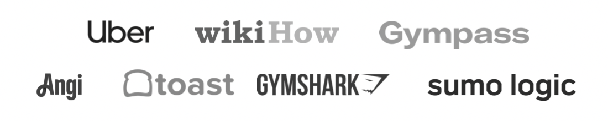
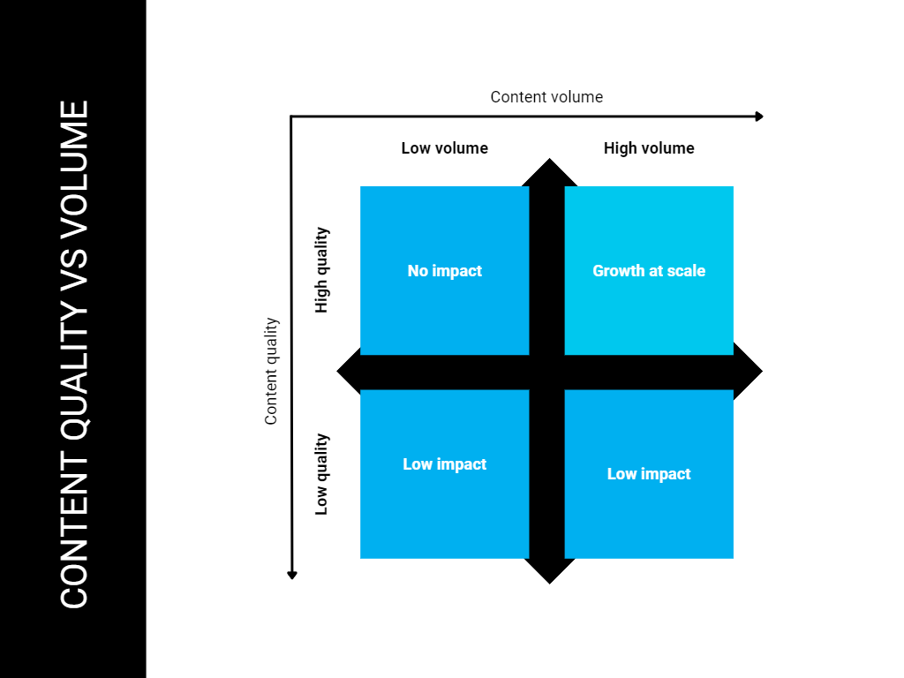
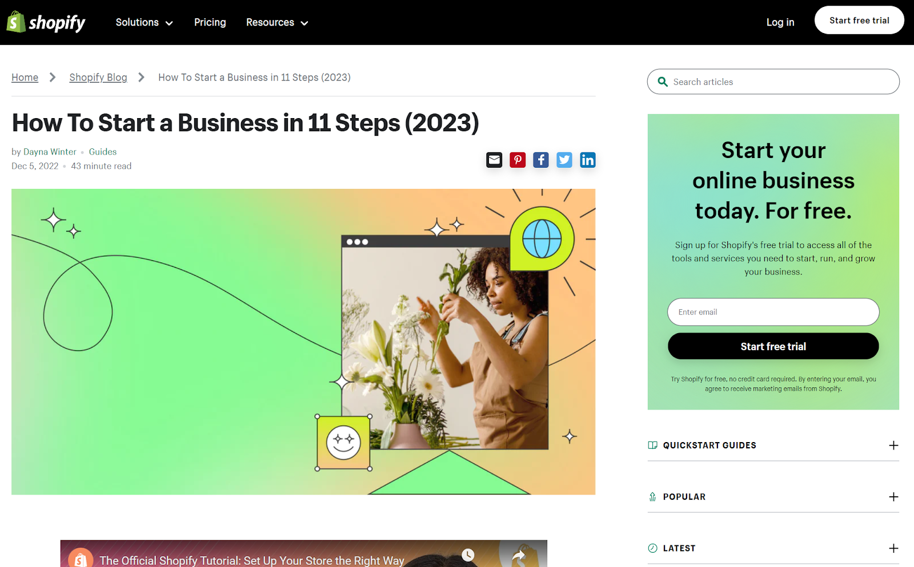
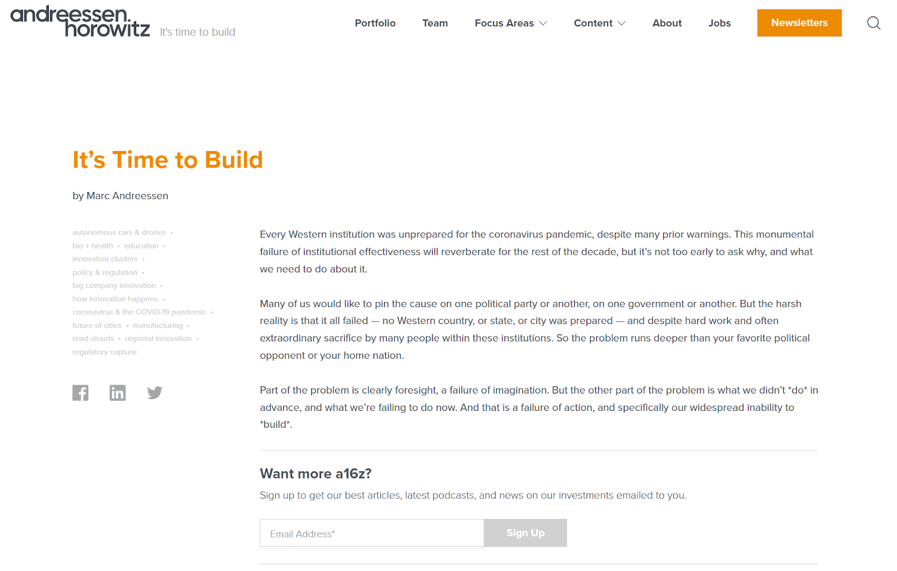
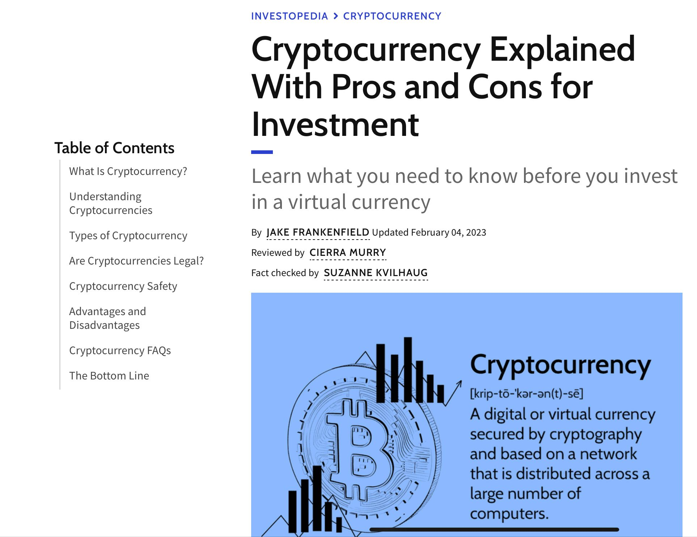
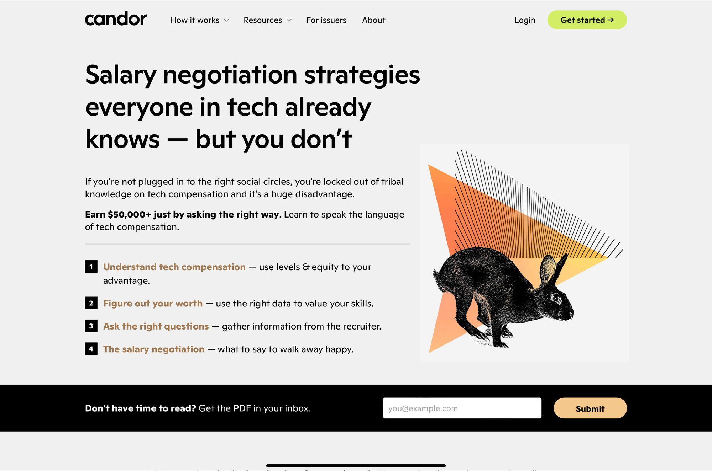
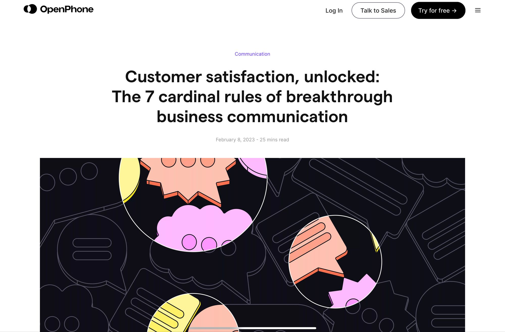
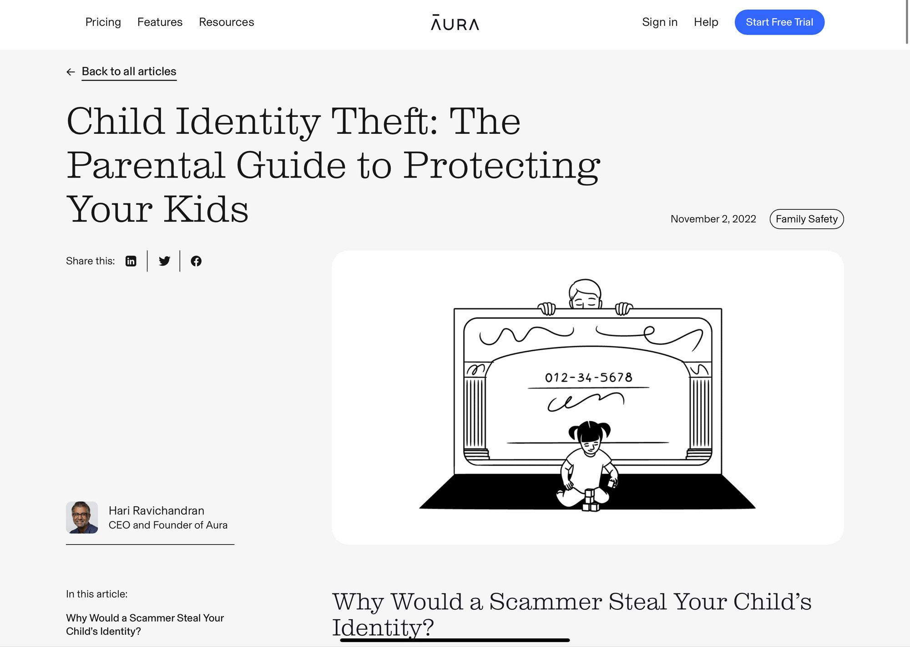
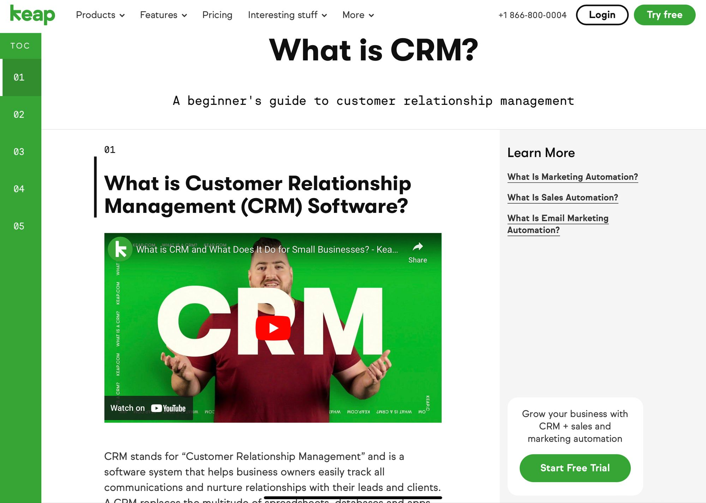

💡

Best practices from UBER, Toast, Angi, Gymshark, WikiHow, Sumo Logic, and Gympass  

来自UBER、Toast、Angi、Gymshark、WikiHow、Sumo Logic和Gympass的最佳实践。

___

Wish you could get more traffic from Google?  

希望你能从谷歌获得更多流量？

Half the battle is understanding WHAT you need to fix on your site.  

战斗的一半是了解你需要在你的网站上修复什么。

This is the power of Ahrefs Webmaster Tools! A cost-friendlier alternative to expensive audits.  

这就是Ahrefs网站管理员工具的力量!比起昂贵的审计，这是一个成本更低的选择。

AWT shows which keywords your pages rank for, how Google sees your content, and what changes can boost your traffic.  

AWT显示了你的网页有哪些关键词排名，谷歌如何看待你的内容，以及哪些变化可以提高你的流量。

Imagine what this could do for your business…  

想象一下，这能为你的业务带来什么？

Visit [ahrefs.com/webmaster-tools](https://ahrefs.com/webmaster-tools?ref=kevin-indig.com) for this free tool.  

请访问ahrefs.com/webmaster-tools获取这一免费工具。

___

The most popular SEO strategy is growing traffic through blog content.  

最受欢迎的SEO策略是通过博客内容增长流量。  

At some point, especially as a venture-backed company, you want to increase the traffic growth rate from content, and the way to do that is to publish more volume.  

在某些时候，特别是作为一个有风险支持的公司，你想提高来自内容的流量增长率，而做到这一点的方法是发布更多的内容。

However, **the inherent risk with higher volume is lower quality**. It’s tough to make more at the same level of quality. Think of a local burger chain that becomes a franchise and can’t serve the same tasty burgers anymore. The same principle applies to content.  

然而，更高的产量所带来的固有风险是质量下降。在相同的质量水平下，要做得更多是很困难的。想想一个当地的汉堡连锁店，如果变成了特许经营，就不能再提供同样美味的汉堡了。这个原则也适用于内容。  

Only few companies achieve high output with high quality.  

只有少数公司实现了高质量的高产出。

How?

By measuring the _right_ metrics. **Writing is a creative pursuit, but scaling content is a science**. We tend to romanticize writing for the web, but good content is the result of a measurable process.  

通过衡量正确的指标。 写作是一种创造性的追求，但扩展内容是一门科学。我们倾向于将网络写作浪漫化，但好的内容是一个可衡量的过程的结果。  

Most metrics marketers look at are too output-focused, don’t lead to meaningful action and miss context.  

营销人员所看重的大多数指标都过于注重产出，没有导致有意义的行动，并且错过了背景。

In my experience of scaling content at Atlassian, G2 or Shopify and working with companies like Ramp or Snapchat, I’ve learned that most companies make **three critical mistakes** with content quality. They:  

根据我在Atlassian、G2或Shopify扩大内容规模的经验，以及与Ramp或Snapchat等公司的合作，我了解到大多数公司在内容质量方面犯了三个关键错误。他们：

1.  miss the performance angle  
    
    错过了表现的角度
2.  measure the wrong metrics  
    
    衡量错误的指标
3.  Don’t tie content quality to business impact  
    
    不要将内容质量与业务影响挂钩

This guide offers solutions to each mistake and a system of quality metrics for each step of the content lifecycle, including the tools to measure them.  

本指南为每个错误提供了解决方案，并为内容生命周期的每个步骤提供了质量指标体系，包括衡量它们的工具。

In this piece, I’m sharing not only my own experience but also the expertise of  

在这篇文章中，我不仅分享了我自己的经验，而且还分享了下列人士的专业知识

-   [Ryan Purtill](https://www.linkedin.com/in/ryan-purtill-ms-7097696/?ref=kevin-indig.com), Chief Growth Officer at WikiHow  
    
    Ryan Purtill , WikiHow的首席增长官
-   [Amy Lecza](https://www.linkedin.com/in/amy-lecza/?ref=kevin-indig.com), Director of Content Marketing & SEO at Toast  
    
    Amy Lecza , Toast公司的内容营销和搜索引擎总监
-   [Caroline Gilbert](https://www.linkedin.com/in/cegilbert/?ref=kevin-indig.com), Director of Content & Editorial at Angi  
    
    卡罗琳-吉尔伯特，安吉的内容和编辑部主任
-   [Christopher Dean](https://www.linkedin.com/in/chrisdeanm/?ref=kevin-indig.com), VP of Content Marketing at Gympass  
    
    克里斯托弗-迪恩，Gympass的内容营销副总裁
-   [Zoe Hawkins](https://www.linkedin.com/in/moonstormer/?ref=kevin-indig.com), Principal Content Manager at SumoLogic  
    
    Zoe Hawkins , SumoLogic的首席内容经理
-   [Jackson Lo](https://www.linkedin.com/in/jacksonlo/?ref=kevin-indig.com), Sr. SEO Manager at UBER  
    
    Jackson Lo , UBER的高级搜索引擎经理
-   [Scott Salter](https://www.linkedin.com/in/scott-salter/?ref=kevin-indig.com), SEO & Content Manager at Gymshark  
    
    Scott Salter , Gymshark的SEO和内容经理

Thank you all for contributing to this piece!  

感谢大家为这篇稿件做出的贡献!

If you don’t have much time, here is the **TL,DR**:  

如果你没有太多时间，这里是TL,DR ：

1.  Don’t confuse performance with editorial content: content for SEO has different requirements than content for positioning or press releases  
    
    不要将性能与编辑内容混为一谈：用于SEO的内容与定位或新闻发布的内容有不同的要求。
2.  Focus on controllable, performance-oriented and contextual metrics  
    
    专注于可控的、以绩效为导向的和有背景的指标
3.  For production quality, measure metrics like SEO editor score, Flesch/readability score, or # spelling/grammatical errors  
    
    对于生产质量，衡量指标如SEO编辑得分，Flesch/可读性得分，或#拼写/语法错误。
4.  For performance quality, measure metrics like # top 3 ranks, Ration of time on page vs. estimated reading time, inverse bounce rate, scroll depth or pipeline value  
    
    对于性能质量，衡量指标如#前3名，页面时间与估计阅读时间的比例，反跳出率，滚动深度或管道值。
5.  For preservation quality, measure performance metrics over time and year-over-year  
    
    对于保存质量，衡量一段时间内和同比的性能指标
6.  Don’t forget the bar for high quality is extremely high - most content simply isn’t good enough  
    
    不要忘记高质量的标准是非常高的--大多数内容根本不够好。

## Why content quality is critical for Growth  

为什么内容质量对增长至关重要

Content quality is critical for three reasons:  

内容质量是至关重要的，原因有三：

**1/ We can create content faster and cheaper than ever before with generative AI**. The most likely scenario for AI content is a vast amount of [mediocre content](https://www.kevin-indig.com/the-content-commodity-trap/) that nobody cares about. Already today, most content doesn’t get SEO traffic, backlinks or any eyeballs. Generative AI amplifies invisible content - unless the right guardrails are in place.  

1/ 我们可以通过生成性人工智能比以往更快、更便宜地创造内容。人工智能内容最可能出现的情况是大量无人问津的平庸内容。今天，大多数内容已经无法获得SEO流量、反向链接或任何眼球。生成式人工智能会放大不可见的内容--除非有正确的护栏。

**2/ Content quality has been critical for a long time in SEO** since there are only so many search results users click on. But the bar for quality rises every year because the competition isn’t sleeping, and everyone wants a piece of the SEO traffic pie.  

2/ 长期以来，内容质量在SEO中一直是至关重要的，因为用户点击的搜索结果只有那么多。但是，质量的标准每年都在提高，因为竞争并没有睡觉，每个人都想从SEO的流量蛋糕中分一杯羹。  

Most marketers underestimate how good content has to be for a shot at the number 1 spot.  

大多数营销人员低估了要想获得第一的位置必须有多好的内容。

**3/ Readers have become a lot more [selective](https://www.kevin-indig.com/content-market-fit/) about where to invest their attention**. The common argument is that attention spans are getting shorter, while the common counterargument is that people binge The Last of Us or watch 3 hour Joe Rogan podcast episodes with Andrew Huberman.  

3/ 读者对于在哪里投资他们的注意力变得更加有选择性。常见的论点是注意力持续时间越来越短，而常见的反驳是人们狂欢《最后的我们》或与安德鲁-休伯曼一起看3小时的乔-罗根播客集。  

The conclusion is that people are much more selective about their consumption because there are so many options. High content quality is the key to mining today’s most valuable mineral: attention.  

结论是，由于有如此多的选择，人们对消费的选择性大大增加。高质量的内容是挖掘当今最宝贵的矿产的关键：注意力。

When I led SEO and Content at G2, we hit a point at which we published 1,000 articles in 6 months, but organic traffic stalled. The content we created was “too shallow”.  

当我在G2领导SEO和内容时，我们达到了一个点，即我们在6个月内发表了1000篇文章，但有机流量停滞不前。我们创建的内容 "太肤浅"。  

When we allowed ourselves to invest the necessary time it takes to produce high quality, organic traffic skyrocketed despite publishing frequency going down by over 80%.  

当我们允许自己投入必要的时间来生产高质量的产品时，尽管发布频率下降了80%以上，但有机流量却直线上升。

The golden lesson for executives is that **more content can only equal more traffic (and conversions) if you can keep the quality constant**. As soon as you have to sacrifice quality for volume, you’re spinning your wheels or they come off.  

高管们的黄金教训是，只有当你能保持质量不变时，更多的内容才能等于更多的流量（和转化率）。一旦你不得不为数量而牺牲质量，你就是在转动你的轮子，或者它们脱落了。

In the same vein, low publishing frequency with high content quality also won't allow you to scale SEO revenue with content. The sweet spot is high quality and high volume.  

同样，内容质量高的低发布频率也不会让你通过内容来扩大SEO收入。甜蜜点是高质量和高数量。

Only high quality and high volume lead to growth at scale  

只有高质量和高数量才能实现规模增长

Quality is the key to scaling growth through content. However, most teams don’t measure quality effectively to understand how to keep it high.  

质量是通过内容扩大增长的关键。然而，大多数团队并没有有效地衡量质量，以了解如何保持高质量。

## 3 reasons why most content quality metrics are flawed  

大多数内容质量指标存在缺陷的3个原因

Common responses to the question “_how do you measure content quality_?” are “_time on site_” or “_traffic_”. Sometimes, you get a “_revenue_”. We can do better!  

对 "你如何衡量内容质量？"这一问题的常见回答是 "在网站上的时间 "或 "流量"。有时，你会得到一个 "收入"。我们可以做得更好!

Most common content quality metrics are flawed for 3 reasons:  

大多数常见的内容质量指标都有缺陷，原因有三：

1/ They’re **reactive**. A metric is useless when a change doesn’t lead to action (read this again). When traffic or time on site goes down, what do you do? It’s unclear!  

1/ 他们是被动的。当一个变化没有导致行动的时候，一个指标是没有用的（再读一遍这个）。当流量或网站上的时间下降时，你会怎么做？这不清楚!  

These numbers don’t tell you much about what’s going on. They’re output metrics.  

这些数字并没有告诉你发生了什么事。它们是产出指标。  

Output metrics are good to know and helpful to report, but only input metrics drive them up (or down) and tell us where things are broken.  

产出指标是很好的了解，对报告也有帮助，但只有输入指标才能推动它们上升（或下降），并告诉我们事情在哪里出了问题。

2/ They’re **not performance-oriented**. Content that has the purpose of driving awareness and revenue should be measured with different numbers than content with the purpose of sharing a worldview, position or announcement.  

2/ 他们不以业绩为导向。以提高知名度和收入为目的的内容与以分享世界观、立场或公告为目的的内容应该用不同的数字来衡量。  

A lot of metrics don’t reflect the performance.  

很多指标并不反映业绩。

3/ They’re **not quantitative**. Qualitative metrics like comprehension or depth are important because they contribute to a good experience, but they are also very hard to measure at scale.  

3/ 它们不是定量的。像理解力或深度这样的定性指标很重要，因为它们有助于获得良好的体验，但它们也很难大规模地测量。

We need better metrics to create better content. To get to better metrics, we first need to know what we’re optimizing for: performance.  

我们需要更好的指标来创造更好的内容。为了获得更好的指标，我们首先需要知道我们要优化的是什么：性能。

### Performance vs. editorial content  

性能与编辑内容

When we think about quality, we first have to differentiate between performance and editorial content.  

当我们考虑质量问题时，我们首先要区分性能和编辑内容。

An example of performance content: Shopify’s “guide to starting a business” ([link](https://www.shopify.com/blog/how-to-start-a-business?ref=kevin-indig.com))  

绩效内容的一个例子：Shopify的 "创业指南" ( 链接 )

**Performance content** has the goal of ranking in search, driving referral traffic through syndication or attracting backlinks.  

绩效内容的目标是在搜索中获得排名，通过辛迪加或吸引反向链接推动推荐流量。  

I call it “performance content” because we can measure impact through hard numbers like MQLs, traffic, ad revenue, etc.  

我称其为 "绩效内容"，因为我们可以通过硬数字来衡量影响，如MQLs、流量、广告收入等等。  

Note that some types of content address queries with higher conversion intent than others.  

请注意，有些类型的内容解决了比其他类型更高的转换意图的查询。  

Performance doesn’t mean every piece of content needs to generate revenue, but it should influence a performance metric.  

绩效并不意味着每件内容都需要产生收入，但它应该影响一个绩效指标。

An example of editorial content: Marc Andreessen’s essay “it’s time to build” ([link](https://a16z.com/2020/04/18/its-time-to-build/?ref=kevin-indig.com))  

一个编辑内容的例子：马克-安德森的文章 "是时候建立"（链接）。

**Editorial content** has the goal of generating attention to a narrative. Essays, press releases, product announcements, and what’s sometimes called “thought leadership” falls into this category.  

编辑性内容的目标是引起人们对某一叙述的注意。论文、新闻稿、产品公告，以及有时被称为 "思想领导力 "的内容都属于这一类。  

We could also call it “content not optimized for search”.  

我们也可以称其为 "未针对搜索进行优化的内容"。

Performance content addresses known problems, editorial content raises awareness of unknown problems. We can define requirements for performance content because known problems typically have search volume, which in return makes it attractive to create content for them.  

性能内容解决已知问题，编辑内容提高对未知问题的认识。我们可以定义性能内容的要求，因为已知的问题通常有搜索量，这反过来使得为它们创建内容具有吸引力。  

In plain terms, because it’s straightforward to find content Google ranks highly for a topic, we can quantify what _good_ looks like before even writing content.  

通俗地说，因为可以直接找到谷歌在某一主题上排名较高的内容，所以我们可以在写内容之前量化好的内容。

## How to measure content quality  

如何衡量内容质量

The word _quality_ can be ambiguous, but Seth Godin offers a great definition:  

质量这个词可能是模棱两可的，但Seth Godin提供了一个伟大的定义：

> _Quality is defined as consistently meeting spec. A_ **_measurable_** _promise made and kept. (bolding mine, [link](https://seths.blog/2021/10/effort-toward-quality/?ref=kevin-indig.com))_  
> 
> 质量被定义为持续符合规格。一个可衡量的承诺，并得到遵守。 (我的粗体字，链接)

**Measuring content quality is about meeting requirements**: topics, sub-topics and pieces of information. Every search query is a question that implies the need for specific information.  

衡量内容质量是为了满足要求：主题、子主题和信息片段。每个搜索查询都是一个问题，意味着对具体信息的需求。  

We can use tools to measure how well a piece of content covers a topic and which information it should provide.  

我们可以用工具来衡量一段内容对一个主题的覆盖程度，以及它应该提供哪些信息。

Requirements vary between content types and stages in the content production lifecycle:  

不同的内容类型和内容生产周期的阶段，要求也不同：

1.  Production
2.  Performance
3.  Preservation

The **production** phase spans the first draft up to a complete piece of content. We can measure the coverage of important sub-topics and how deeply they’re covered through SEO editors (Clearscope, Surfer, Frase, etc.)  

生产阶段横跨初稿，直至完整的内容。我们可以通过SEO编辑（Clearscope、Surfer、Frase等）来衡量重要子主题的覆盖面以及它们被覆盖的深度。

In the **performance** phase, content drives traffic, engagement and conversions (after a brief ramp-up period). The metrics to evaluate at this stage are covered in-depth in the “Metrics for content quality” chapter.  

在绩效阶段，内容推动流量、参与度和转化率（在短暂的上升期之后）。在这个阶段要评估的指标将在 "内容质量的指标 "一章中深入阐述。

The **preservation** phase is all about maintaining and improving performance. We can use performance metrics as a signal to refresh or [“tune” content](https://www.kevin-indig.com/optimizing-for-user-intent-with-content-tuning/) to break through plateaus.  

保存阶段是关于维持和提高性能。我们可以使用性能指标作为刷新或 "调整 "内容的信号，以突破高原状态。

Requirements can change over time and vary between topics. Ryan Purtill, Chief Growth Officer at Wikihow, made a good point when he told me “_it’s dangerous to view content quality as monolithic_”.  

要求可以随着时间的推移而改变，并且在不同的主题之间有所不同。维基百科的首席增长官Ryan Purtill提出了一个很好的观点，他告诉我："将内容质量视为一成不变是很危险的"。

Quality metrics need to consider degrees of conversion intent.  

质量指标需要考虑转换意图的程度。

-   Exploration (“what is x?”) - low intent  
    
    探索（"X是什么？"）--低意向性
-   Inspiration (“x quotes for y”) - low intent  
    
    灵感（"为y引用x"）--低意向性
-   Consideration (“should you buy x”) - medium intent  
    
    考虑（"你应该购买X"）--中度意图
-   Comparison (“x vs y”) - high intent  
    
    比较（"x与y"）--高意向性
-   Conversion (“buy x”) - high intention  
    
    转换（"购买X"）--高意向性

The key to an impactful content strategy is considering quality at each phase. As Ryan goes on: “_Different types of content can serve different user needs, intents, and mindsets, and thus can serve different business needs.  

A well thought out content strategy marries those user and business needs._”  

一个有影响力的内容战略的关键是在每个阶段考虑质量。正如Ryan所言："不同类型的内容可以满足不同的用户需求、意图和心态，因此也可以满足不同的业务需求。一个经过深思熟虑的内容战略会将这些用户和业务需求结合起来。"

### How Google defines content quality  

谷歌如何定义内容质量

It would be a mistake to write about performance content and not cover how Google, likely the biggest source of traffic on the web, defines content quality.  

如果写绩效内容而不涉及谷歌（可能是网络上最大的流量来源）如何定义内容质量，那将是一个错误。  

We can look at two sources for Google’s definition: the [Search Quality Rater Guidelines](https://static.googleusercontent.com/media/guidelines.raterhub.com/en//searchqualityevaluatorguidelines.pdf?ref=kevin-indig.com) and [Google’s SEO Documentation](https://developers.google.com/search/docs/fundamentals/creating-helpful-content?ref=kevin-indig.com).  

我们可以从两个方面来了解谷歌的定义：《搜索质量评测指南》和谷歌的SEO文档。

Google’s quality framework is **EEAT**, which stands for **Experience, Expertise, Authoritativeness and Trustworthiness**. Note that EEAT is an evaluation framework for websites, not an algorithm. However, it’s still useful for us conceptually because we know what _good_ looks like in Google’s eyes.  

谷歌的质量框架是EEAT，它代表着经验、专业知识、权威性和可信度。请注意，EEAT是一个网站的评估框架，而不是一种算法。然而，它在概念上对我们仍然是有用的，因为我们知道在谷歌眼中，好的网站是什么样子。

The rater guidelines mention **positive and** **negative factors** for content quality:  

评分员指南提到了内容质量的积极和消极因素：

<table data-immersive-translate-effect="1"><colgroup data-immersive-translate-effect="1"><col width="329.0"><col width="388.0"></colgroup><tbody data-immersive-translate-effect="1"><tr data-immersive-translate-effect="1"><td data-immersive-translate-effect="1">
Positive
</td><td data-immersive-translate-effect="1">
Negative
</td></tr><tr data-immersive-translate-effect="1"><td data-immersive-translate-effect="1">
Originality
</td><td data-immersive-translate-effect="1">
Harmful content (misleading/spam/offensive/dangerous) 有害的内容（误导性/垃圾邮件/攻击性/危险性）。
</td></tr><tr data-immersive-translate-effect="1"><td data-immersive-translate-effect="1">
Accuracy
</td><td data-immersive-translate-effect="1">
Copied/auto-generated content that makes no sense 抄袭/自动生成的内容，毫无意义
</td></tr><tr data-immersive-translate-effect="1"><td data-immersive-translate-effect="1">
Comprehensiveness
</td><td data-immersive-translate-effect="1">
Misleading title
</td></tr><tr data-immersive-translate-effect="1"><td data-immersive-translate-effect="1">
Clear communication 清晰的沟通
</td><td data-immersive-translate-effect="1">
No information about who is responsible for content 没有关于谁对内容负责的信息
</td></tr><tr data-immersive-translate-effect="1"><td data-immersive-translate-effect="1">
Reflection of expert consensus (as appropriate) 反映专家的共识（视情况而定）
</td><td data-immersive-translate-effect="1"> </td></tr></tbody></table>

Google also measures sitewide criteria, like brand reputation, reviews or ad experience (if applicable) to grade the authority and trustworthiness of a site for specific topics, but it’s very difficult to measure.  

谷歌也会衡量网站的标准，如品牌声誉、评论或广告体验（如果适用），以评定一个网站在特定主题方面的权威性和可信度，但这是非常难以衡量的。

Also in Google’s definition, quality requirements vary by site: “_The standards for Highest quality MC may be **very different depending on the purpose, topic, and type of website**_.” (definition and bolding added by me)  

另外在谷歌的定义中，质量要求因网站而异：" 最高质量MC的标准可能非常不同，这取决于网站的目的、主题和类型。"(定义和粗体字是我加的)

It’s a little hidden in the long document, but the guidelines emphasize the high bar for quality: “_Very high quality MC represents some of the most outstanding content on a topic or type that's available online._”  

这在长长的文件中有些隐蔽，但指导方针强调了对质量的高标准："非常高质量的MC代表了一些在网上可以找到的关于某个主题或类型的最杰出的内容。"

Google’s SEO documentation further clarifies the definition of high-quality content. My summary of the criteria:  

谷歌的SEO文档进一步澄清了高质量内容的定义。我对该标准的总结：

-   original information  
    
    原始信息
-   complete description of the topic  
    
    完整描述该主题
-   insights/interesting information beyond the obvious  
    
    洞察力/有趣的信息，超越明显的信息
-   additional value on top of cited sources (don’t just summarize what others say)  
    
    在引用来源的基础上增加价值（不要只是总结别人说的）。
-   much better than other results  
    
    远胜于其他结果
-   memorable enough to share  
    
    记忆深刻，值得分享
-   clear indication of the author (byline, about page)  
    
    明确指出作者（署名，关于页面）。
-   avoiding factual, spelling or stylistic errors  
    
    避免事实、拼写或文体上的错误
-   no intrusive ads and good mobile experience  
    
    没有干扰性的广告和良好的移动体验
-   demonstrating first-hand knowledge and expertise  
    
    表现出第一手的知识和专长

While these pointers are useful for our conceptual understanding, Google doesn’t provide metrics for content quality. So, how do we turn these requirements into numbers we can measure and improve?  

虽然这些指针对我们的概念理解很有用，但谷歌并没有提供内容质量的衡量标准。那么，我们如何将这些要求变成我们可以衡量和改进的数字呢？

### Metrics for content quality  

内容质量的衡量标准

We learned that metrics need to be controllable, performance-oriented and contextual.  

我们了解到，衡量标准需要是可控的、以绩效为导向的和有背景的。  

Measuring them across the content production lifecycle (production, performance, preservation) and considering different types of content (exploration vs conversion) guarantees the highest level of quality.  

在整个内容生产周期（生产、性能、保存）中衡量它们，并考虑不同类型的内容（探索与转换），可以保证最高水平的质量。

The following metrics have helped me and other executives to measure and improve content quality at various high-performing companies:  

以下指标帮助我和其他高管衡量和提高各高绩效公司的内容质量：

<table data-immersive-translate-effect="1"><colgroup data-immersive-translate-effect="1"><col width="120"><col width="233"><col width="233"><col width="233"><col width="233"></colgroup><tbody data-immersive-translate-effect="1"><tr data-immersive-translate-effect="1"><td data-immersive-translate-effect="1"> </td><td data-immersive-translate-effect="1">
Requirement
</td><td data-immersive-translate-effect="1">
Metrics
</td><td data-immersive-translate-effect="1">
Goal / benchmark 目标/基准
</td><td data-immersive-translate-effect="1">
Tools
</td></tr><tr data-immersive-translate-effect="1"><td data-immersive-translate-effect="1">
Production
</td><td data-immersive-translate-effect="1">
(Deep) coverage of important subtopics and key pieces of information (深度）覆盖重要的分主题和关键信息
</td><td data-immersive-translate-effect="1">
SEO editors score SEO编辑的得分
</td><td data-immersive-translate-effect="1">
Better than competing content 优于竞争性的内容
</td><td data-immersive-translate-effect="1"><ul data-immersive-translate-effect="1"><li dir="ltr" aria-level="1" data-immersive-translate-effect="1">
Clearscope
</li></ul><ul data-immersive-translate-effect="1"><li dir="ltr" aria-level="1" data-immersive-translate-effect="1">
Surfer
</li><li dir="ltr" aria-level="1" data-immersive-translate-effect="1">
Frase
</li><li dir="ltr" aria-level="1" data-immersive-translate-effect="1">
Semrush Writer Assistant Semrush作家助理
</li><li dir="ltr" aria-level="1" data-immersive-translate-effect="1">
Marketmuse
</li></ul></td></tr><tr data-immersive-translate-effect="1"><td data-immersive-translate-effect="1">
Production
</td><td data-immersive-translate-effect="1">
Easy to read and comprehend 易于阅读和理解
</td><td data-immersive-translate-effect="1">
Flesch Score or Readability 弗莱什评分或可读性
</td><td data-immersive-translate-effect="1">
80-90 or “good readability” 80-90或 "良好的可读性"
</td><td data-immersive-translate-effect="1"><ul data-immersive-translate-effect="1"><li dir="ltr" aria-level="1" data-immersive-translate-effect="1">
Clearscope
</li></ul><ul data-immersive-translate-effect="1"><li dir="ltr" aria-level="1" data-immersive-translate-effect="1">
Surfer
</li><li dir="ltr" aria-level="1" data-immersive-translate-effect="1">
Frase
</li><li dir="ltr" aria-level="1" data-immersive-translate-effect="1">
Semrush Writer Assistant Semrush作家助理
</li><li dir="ltr" aria-level="1" data-immersive-translate-effect="1">
Readable
</li></ul></td></tr><tr data-immersive-translate-effect="1"><td data-immersive-translate-effect="1">
Production
</td><td data-immersive-translate-effect="1">
No spelling or grammar errors 没有拼写或语法错误
</td><td data-immersive-translate-effect="1">
# of spelling errors # 拼写错误的数量
</td><td data-immersive-translate-effect="1">
Zero
</td><td data-immersive-translate-effect="1"><ul data-immersive-translate-effect="1"><li dir="ltr" aria-level="1" data-immersive-translate-effect="1">
Grammarly
</li><li dir="ltr" aria-level="1" data-immersive-translate-effect="1">
Word/G Docs
</li><li dir="ltr" aria-level="1" data-immersive-translate-effect="1">
ProWritingAid
</li><li dir="ltr" aria-level="1" data-immersive-translate-effect="1">
Hemingway App
</li><li dir="ltr" aria-level="1" data-immersive-translate-effect="1">
Wordtune
</li></ul></td></tr><tr data-immersive-translate-effect="1"><td data-immersive-translate-effect="1">
Performance
</td><td data-immersive-translate-effect="1">
Search and syndication performance 搜索和辛迪加性能
</td><td data-immersive-translate-effect="1"><ol data-immersive-translate-effect="1"><li dir="ltr" aria-level="1" data-immersive-translate-effect="1">
# top 3 ranks # 排名前三
</li><li dir="ltr" aria-level="1" data-immersive-translate-effect="1">
Content ranks in top 3 for target keyword 内容在目标关键词中排名前三
</li><li dir="ltr" aria-level="1" data-immersive-translate-effect="1">
Referral traffic
</li></ol></td><td data-immersive-translate-effect="1"><ol data-immersive-translate-effect="1"><li dir="ltr" aria-level="1" data-immersive-translate-effect="1">
min 1
</li><li dir="ltr" aria-level="1" data-immersive-translate-effect="1">
Yes
</li><li dir="ltr" aria-level="1" data-immersive-translate-effect="1">
Growth over time 随时间增长
</li></ol></td><td data-immersive-translate-effect="1"><ul data-immersive-translate-effect="1"><li dir="ltr" aria-level="1" data-immersive-translate-effect="1">
Semrush
</li><li dir="ltr" aria-level="1" data-immersive-translate-effect="1">
Ahrefs
</li><li dir="ltr" aria-level="1" data-immersive-translate-effect="1">
Sistrix
</li><li dir="ltr" aria-level="1" data-immersive-translate-effect="1">
Ryte
</li><li dir="ltr" aria-level="1" data-immersive-translate-effect="1">
Similarweb
</li><li dir="ltr" aria-level="1" data-immersive-translate-effect="1">
Google Analytics
</li></ul></td></tr><tr data-immersive-translate-effect="1"><td data-immersive-translate-effect="1">
Performance
</td><td data-immersive-translate-effect="1">
Reader engagement
</td><td data-immersive-translate-effect="1"><ol data-immersive-translate-effect="1"><li dir="ltr" aria-level="1" data-immersive-translate-effect="1">
Time on page vs. estimated reading time 页面上的时间与估计的阅读时间
</li><li dir="ltr" aria-level="1" data-immersive-translate-effect="1">
Scroll depth
</li><li dir="ltr" aria-level="1" data-immersive-translate-effect="1">
Visitors w/ time on page &gt; 30 sec compared to all visitors 与所有访客相比，访客在页面上停留的时间&gt;30秒
</li><li dir="ltr" aria-level="1" data-immersive-translate-effect="1">
Inverse bounce rate = at least one click during a session* 反向跳出率=在一个会话中至少有一次点击*。
</li><li dir="ltr" aria-level="1" data-immersive-translate-effect="1">
Sentiment
</li></ol></td><td data-immersive-translate-effect="1"><ol data-immersive-translate-effect="1"><li dir="ltr" aria-level="1" data-immersive-translate-effect="1">
As close to 100% as possible (min 50%) 尽可能地接近100%（最少50%）。
</li><li dir="ltr" aria-level="1" data-immersive-translate-effect="1">
Min 30% of users scroll to end of content 至少30%的用户滚动到内容的末尾
</li><li dir="ltr" aria-level="1" data-immersive-translate-effect="1">
Min 30%
</li><li dir="ltr" aria-level="1" data-immersive-translate-effect="1">
Min 5%
</li><li dir="ltr" aria-level="1" data-immersive-translate-effect="1">
Positive
</li></ol></td><td data-immersive-translate-effect="1"><ul data-immersive-translate-effect="1"><li dir="ltr" aria-level="1" data-immersive-translate-effect="1">
Custom dimension
</li><li dir="ltr" aria-level="1" data-immersive-translate-effect="1">
Microsoft Clarity
</li><li dir="ltr" aria-level="1" data-immersive-translate-effect="1">
Custom dimension
</li><li dir="ltr" aria-level="1" data-immersive-translate-effect="1">
Google Analytics
</li><li dir="ltr" aria-level="1" data-immersive-translate-effect="1">
Knotch
</li><li dir="ltr" aria-level="1" data-immersive-translate-effect="1">
Hotjar
</li></ul></td></tr><tr data-immersive-translate-effect="1"><td data-immersive-translate-effect="1">
Performance
</td><td data-immersive-translate-effect="1">
Converts visitors
</td><td data-immersive-translate-effect="1"><ol data-immersive-translate-effect="1"><li dir="ltr" aria-level="1" data-immersive-translate-effect="1">
Soft conversion rate from organic traffic (newsletter, next page, webinar) 来自有机流量的软转化率（通讯、下一页、网络研讨会）。
</li><li dir="ltr" aria-level="1" data-immersive-translate-effect="1">
Hard conversion rate from organic traffic (sign-up, buy) 来自有机流量的硬转化率（注册、购买）。
</li><li dir="ltr" aria-level="1" data-immersive-translate-effect="1">
# MQLs
</li><li dir="ltr" aria-level="1" data-immersive-translate-effect="1">
Pipeline value
</li><li dir="ltr" aria-level="1" data-immersive-translate-effect="1">
Sales
</li><li dir="ltr" aria-level="1" data-immersive-translate-effect="1">
Revenue
</li></ol></td><td data-immersive-translate-effect="1"><ol data-immersive-translate-effect="1"><li dir="ltr" aria-level="1" data-immersive-translate-effect="1">
Min 3%
</li><li dir="ltr" aria-level="1" data-immersive-translate-effect="1">
Min 1%
</li><li dir="ltr" aria-level="1" data-immersive-translate-effect="1">
Growth over time 随时间增长
</li><li dir="ltr" aria-level="1" data-immersive-translate-effect="1">
Growth over time 随时间增长
</li><li dir="ltr" aria-level="1" data-immersive-translate-effect="1">
Growth over time 随时间增长
</li><li dir="ltr" aria-level="1" data-immersive-translate-effect="1">
Growth over time 随时间增长
</li></ol></td><td data-immersive-translate-effect="1"><ul data-immersive-translate-effect="1"><li dir="ltr" aria-level="1" data-immersive-translate-effect="1">
Segment
</li><li dir="ltr" aria-level="1" data-immersive-translate-effect="1">
Google Analytics
</li><li dir="ltr" aria-level="1" data-immersive-translate-effect="1">
Hubspot
</li><li dir="ltr" aria-level="1" data-immersive-translate-effect="1">
Salesforce
</li><li dir="ltr" aria-level="1" data-immersive-translate-effect="1">
Shopify
</li><li dir="ltr" aria-level="1" data-immersive-translate-effect="1">
Knotch
</li></ul></td></tr><tr data-immersive-translate-effect="1"><td data-immersive-translate-effect="1">
Preservation
</td><td data-immersive-translate-effect="1">
Keeps quality high 保持高质量
</td><td data-immersive-translate-effect="1">
Performance metrics over time (rolling 30 days, MoM, Y/Y) 随着时间的推移，性能指标（滚动30天，月度，年/月）。
</td><td data-immersive-translate-effect="1">
Grow in line with total traffic 与总流量保持一致的增长
</td><td data-immersive-translate-effect="1"> </td></tr></tbody></table>

\*hat tip to Christopher Dean, VP Content at Gympass, for coming up with this metric  

\*向Gympass的内容副总裁Christopher Dean致敬，他提出了这个指标。

**How many metrics should you measure?** Ideally, all of them! Realistically, not every company can measure every number listed in the table above, and looking at too many numbers can be cognitively overwhelming.  

你应该衡量多少个指标？ 理想的情况是，所有的指标!现实上，不是每家公司都能衡量上表中列出的每一个数字，而且看太多的数字会让人在认知上感到不知所措。  

If that’s you, pick at least one metric per requirement. Most tools listed above measure several metrics. Semrush, for example, gives you a content score, Flesch score, and tracks rankings.  

如果你是这样的人，至少要为每个需求挑选一个指标。上面列出的大多数工具都测量几个指标。例如，Semrush会给你一个内容评分，Flesch评分，并跟踪排名。

**How should you think about preservation?** Measuring preservation is really measuring performance metrics over different time ranges to understand when content performance decays and needs to be updated.  

你应该如何考虑保存问题？ 衡量保存其实就是衡量不同时间范围内的性能指标，以了解内容性能何时衰减并需要更新。  

Clearscope recently launched its inventory feature, which reruns reports and tells you when performance drops.  

Clearscope最近推出了它的库存功能，它可以重新运行报告并在性能下降时告诉你。  

Another alternative is to rerun SEO editor reports every month to see if content keeps its score.  

另一个选择是每月重新运行SEO编辑报告，看内容是否保持其分数。

**How can you tie content quality to business impact?** Reporting how input influence output metrics is the key to showing how content quality impacts business goals.  

如何将内容质量与业务影响联系起来？ 报告输入如何影响输出指标是显示内容质量如何影响业务目标的关键。  

Higher SEO editor scores, for example, should increase organic traffic and pipeline value, high readability should influence conversion rates, etc.  

例如，较高的SEO编辑分数应该增加有机流量和管道价值，高可读性应该影响转换率，等等。  

Being able to see and understand this relationship bridges the gap.  

能够看到和理解这种关系，就能弥补差距。

### Tools for measuring content quality  

衡量内容质量的工具

To quantify content quality, we need tools that show us topic coverage, ranks, readability, user behavior and user satisfaction. Mind you the tool doesn’t matter nearly as much as doing the work.  

为了量化内容质量，我们需要一些工具，向我们展示主题覆盖率、排名、可读性、用户行为和用户满意度。请注意，工具并不像做工作那么重要。  

Don’t obsess over it.  

不要纠结于此。

**SEO editors**

-   [Clearscope](https://www.clearscope.io/?ref=kevin-indig.com)
-   [Surfer](https://surferseo.com/?ref=kevin-indig.com)
-   [Frase](https://frase.io/?ref=kevin-indig.com)
-   [Semrush Writer Assistant  
    
    Semrush作家助理](https://www.semrush.com/swa/?ref=kevin-indig.com)
-   [MarketMuse](https://www.marketmuse.com/?ref=kevin-indig.com)
-   [Sistrix](https://www.sistrix.com/?ref=kevin-indig.com) (just launched a new content optimization tool)  
    
    Sistrix（刚刚推出了一个新的内容优化工具）。
-   [Inlinks](https://inlinks.com/?ref=kevin-indig.com) (just launched a new content optimization tool)  
    
    内联（刚推出一个新的内容优化工具）

**Rank trackers**

-   [Ahrefs](https://ahrefs.com/?ref=kevin-indig.com)
-   [Sistrix](https://www.sistrix.com/?ref=kevin-indig.com)
-   [Ryte](http://ryte.com/?ref=kevin-indig.com)
-   [Similarweb](https://www.similarweb.com/?ref=kevin-indig.com)

**Readability**

-   [Readable](https://readable.com/?ref=kevin-indig.com)
-   [Grammarly](https://grammarly.com/?ref=kevin-indig.com)
-   [Word](https://www.microsoft.com/en-us/microsoft-365/word?activetab=tabs%3Afaqheaderregion3&ref=kevin-indig.com)/[G Docs](https://www.google.com/docs/about/?ref=kevin-indig.com)  
    
    Word / G Docs
-   [ProWritingAid](https://prowritingaid.com/?ref=kevin-indig.com)
-   [Hemingway App](https://hemingwayapp.com/?ref=kevin-indig.com)
-   [Wordtune](https://www.wordtune.com/?ref=kevin-indig.com)

**User behavior**

-   [Google Analytics](https://analytics.google.com/?ref=kevin-indig.com)
-   [Heap](https://www.heap.io/?ref=kevin-indig.com)
-   [Segment](https://segment.com/?ref=kevin-indig.com)
-   [Looker](https://www.looker.com/?ref=kevin-indig.com)
-   [Microsoft Clarity](https://clarity.microsoft.com/?ref=kevin-indig.com)
-   [Knotch](https://knotch.com/?ref=kevin-indig.com)

**Conversions**

-   [Hubspot](https://hubspot.com/?ref=kevin-indig.com)
-   [Salesforce](https://www.salesforce.com/?ref=kevin-indig.com)
-   [Shopify](https://www.shopify.com/?ref=kevin-indig.com)
-   [Knotch](https://knotch.com/?ref=kevin-indig.com)

**User satisfaction**

-   [Knotch](https://knotch.com/?ref=kevin-indig.com)
-   [Hotjar](https://www.hotjar.com/?ref=kevin-indig.com)

### Best-in-class examples of high-quality content  

优质内容的最佳范例

As mentioned in the Google quality rater guidelines, the bar for [outstanding content](https://www.kevin-indig.com/my-checklist-for-outstanding-content/) is exceptionally high. The web holds more content than ever before, and it’s growing. Marketers compete against marketers in the search results and try to 1-up each other constantly.  

正如谷歌质量评级指南中提到的，对优秀内容的要求特别高。网络上的内容比以往任何时候都多，而且还在增加。营销人员在搜索结果中与营销人员竞争，并试图不断提高对方的水平。

To give you a sense of where the bar is today, the five following content examples show what best-in-class readability and search performance looks like:  

为了让你了解今天的情况，下面的五个内容例子显示了一流的可读性和搜索性能是什么样子：

Investopedia's guide to cryptocurrency  

Investopedia的加密货币指南

[https://www.investopedia.com/terms/c/cryptocurrency.asp](https://www.investopedia.com/terms/c/cryptocurrency.asp?ref=kevin-indig.com)

Investopedia’s content has a very high signal to noise ratio. The articles are comprehensive and get to the point. Note how the sub-headings almost anticipate important questions about the main topic.  

Investopedia的内容有一个非常高的信号与噪音比率。这些文章很全面，而且直奔主题。请注意，小标题几乎预示着关于主要议题的重要问题。

Candor's article about salary negotiation strategies  

Candor关于工资谈判策略的文章

[https://candor.co/guides/salary-negotiation](https://candor.co/guides/salary-negotiation?ref=kevin-indig.com)

This piece makes it very easy to comprehend with lots of side comments, boxes and notes. Sections have a clear visual separation from each other.  

这部作品通过大量的旁注、方框和注解使其非常容易理解。各部分之间有明显的视觉分隔。  

Examples come with audio snippets, making the piece more engaging.  

例子中带有音频片段，使作品更有吸引力。

OpenPhone's article about business communication  

OpenPhone关于商业通信的文章

[https://www.openphone.com/blog/breakthrough-communication/](https://www.openphone.com/blog/breakthrough-communication/?ref=kevin-indig.com)

This piece on communication feels like a conversation with a friend who knows a lot about the topic. It hits the right balance between casual and informative tone, while providing meaty solutions.  

这篇关于沟通的文章给人的感觉就像与一个对这个话题非常了解的朋友的谈话。它在休闲和提供信息的语气之间取得了适当的平衡，同时提供了充实的解决方案。  

The article starts with 7 rules for practical communication and then finishes with 5 unexpected but helpful suggestions for applying them.  

这篇文章以7条实用的沟通规则开始，然后以5条出乎意料但有帮助的应用建议结束。

Aura's article about child identity theft  

Aura关于儿童身份盗窃的文章

[https://www.aura.com/learn/child-identity-theft](https://www.aura.com/learn/child-identity-theft?ref=kevin-indig.com)

This article was written by Aura’s CEO and does a good job in structuring the content with lots of bullet points.  

这篇文章是由Aura的CEO写的，在用大量的要点来组织内容方面做得很好。  

Videos and boxes with key takeaways make the piece easy to comprehend and skim for key insights.  

视频和带有关键收获的方框使文章易于理解，并可略读关键见解。

[https://keap.com/product/what-is-crm](https://keap.com/product/what-is-crm?ref=kevin-indig.com)

Keap’s piece on CRMs has a strong structure with key questions, comparison tables and graphs.  

Keap关于客户关系管理的文章有一个强有力的结构，有关键问题、比较表和图表。  

It answers key questions, shows examples of a CRM and walks the audience through the step-by-step process of getting started.  

它回答了关键问题，展示了CRM的例子，并带领听众一步步开始。

Notice how each piece is vibrant and exciting, even though it’s made for performance.  

注意到每件作品是如何充满活力和兴奋的，尽管它是为表演而制作的。  

We often have this image in our head that search-focused content must be sterile or constraints from SEO editors are limiting. The opposite is often the case.  

我们脑海中经常有这样的印象，即以搜索为重点的内容必须是无菌的，或者来自SEO编辑的约束是限制性的。情况往往恰恰相反。

Other sites mentioned that consistently publish high-quality content are [Convertkit](https://convertkit.com/?ref=kevin-indig.com), [The Well](https://thewell.northwell.edu/?ref=kevin-indig.com), and [Influencermarketinghub](https://influencermarketinghub.com/?ref=kevin-indig.com).  

其他提到的持续发布高质量内容的网站有Convertkit、The Well和Influencermarketinghub。

## Conclusion: you can only improve what you measure  

结论：你只能改善你所测量的东西

Many SaaS companies, online stores and consumer startups want to grow revenue with SEO but can’t leverage user-generated content or a product inventory like marketplaces.  

许多SaaS公司、网上商店和消费者创业公司希望通过搜索引擎优化来增加收入，但无法利用用户生成的内容或像市场一样的产品库存。  

They need to create the content themselves, often on a blog or content hub. I call these companies SEO [integrators](https://www.kevin-indig.com/an-introduction-to-integrator-seo-strategies/) with a [marketing-led SEO strategy](https://www.kevin-indig.com/running-seo-on-the-right-operating-system/). The key to success for integrators is publishing the highest possible volume of content with the highest possible quality.  

他们需要自己创造内容，通常是在博客或内容中心。我称这些公司为SEO集成商，以营销为主导的SEO战略。集成商成功的关键是以尽可能高的质量发布尽可能多的内容。

Metrics are the key to high content quality at scale. Marketers can augment them with benchmark articles (hat tip to Amy Lecza) and occasional qualitative research.  

衡量标准是大规模提高内容质量的关键。营销人员可以用基准文章（向Amy Lecza致敬）和偶尔的定性研究来增强它们。  

Collecting a short list of outstanding content and holding it up at the bar to hit helps teams illustrate what [great](https://www.kevin-indig.com/10-factors-that-make-great-content-great/) looks like. Focus groups, surveys, prompts or a few gift cards and phone calls for tight budgets can get you to the AHA moment (thanks, Ryan, for the idea).  

收集一份优秀内容的简短清单，并把它举在酒吧里打，可以帮助团队说明伟大的内容是什么样子。焦点小组、调查、提示或一些礼品卡和预算紧张的电话可以让你进入AHA时刻（感谢瑞安的想法）。

Trying to quantify everything can seem sterile. As marketers, we love the Mad Men idea of creative, genius writing. But that’s not where performance content lives.  

试图量化一切会显得不伦不类。作为营销人员，我们喜欢《广告狂人》中的创意、天才写作的想法。但这并不是绩效内容的所在。

Companies that are serious about growing revenue through content must measure metrics along production, performance, and preservation to be [competitive](https://www.kevin-indig.com/building-content-moats-for-stronger-competitive-advantages/).  

认真对待通过内容增加收入的公司必须衡量生产、性能和保存方面的指标以提高竞争力。

The old Drucker quote, “_you can only improve what you measure_” is worn out but fitting.  

德鲁克的那句老话："你只能改善你所测量的东西"，这句话已经过时了，但很合适。
