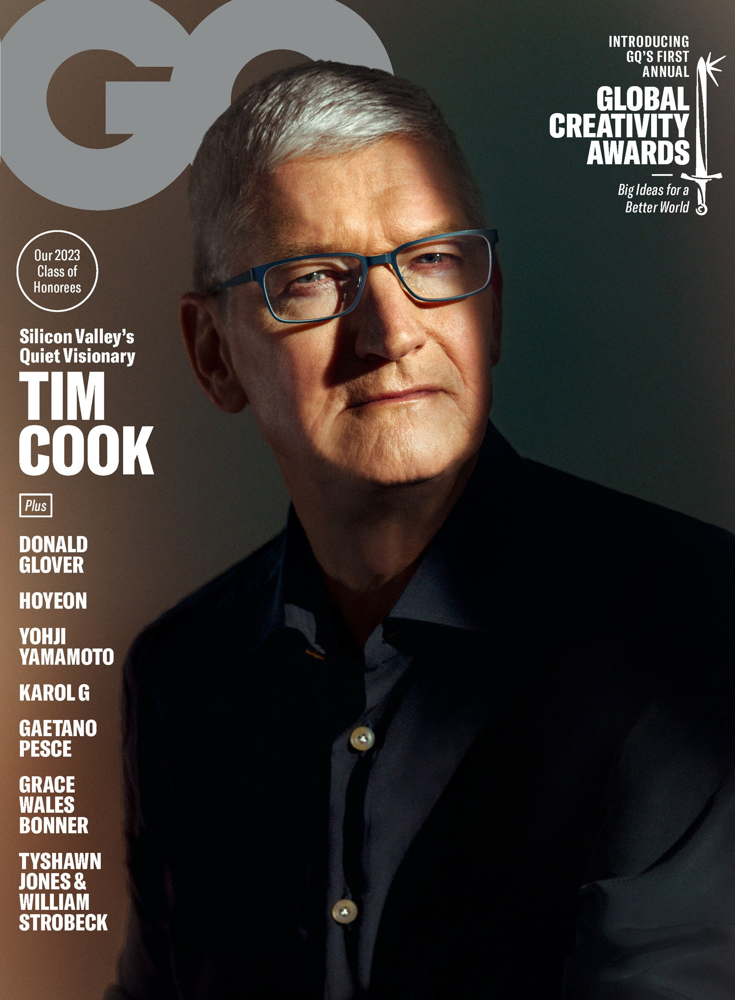
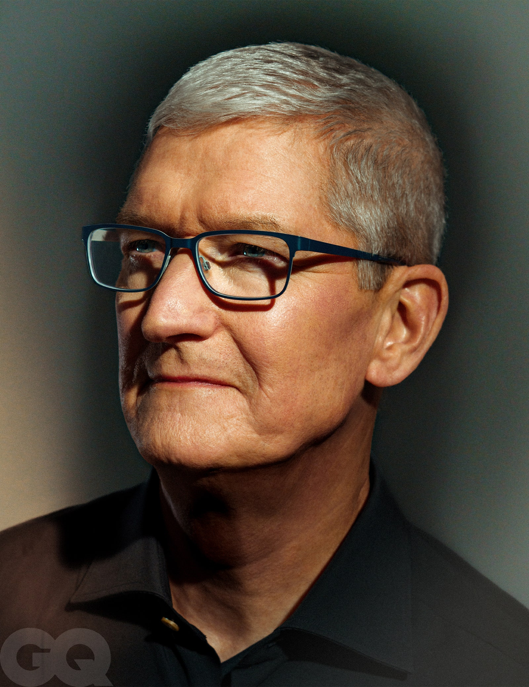

___

**I. By now, nearing 9 a.m. at Apple Park,** he’s long since gotten up and absorbed himself in the morning rituals of the modern CEO: email and exercise.  

I.此时此刻，在苹果园接近上午9点的时候，他早已起床，沉浸在现代CEO的晨练仪式中：发邮件和锻炼。  

Tim Cook takes pride in not hiding his email address, which is readily available on the search engine of your choice. In fact, Cook says, he finds the avalanche of unsolicited emails helpful.  

蒂姆-库克对不隐藏自己的电子邮件地址感到自豪，在你选择的搜索引擎上可以随时找到。事实上，库克说，他发现雪崩式的不请自来的电子邮件很有帮助。  

He rises at around 5 a.m. and reads through all of them.  

他在早上5点左右起床，把所有的书都读完。  

Customers tell him what they think and feel about Apple products, sometimes they tell him stories about their own lives, and this information becomes a source of inspiration.  

客户告诉他他们对苹果产品的看法和感受，有时他们会告诉他他们自己的生活故事，这些信息成为灵感的来源。  

If you work for Cook, you will inevitably wake up one day, wherever you are, to find one of these emails forwarded to you.  

如果你为库克公司工作，你将不可避免地在某一天醒来，无论你在哪里，都会发现这些邮件被转发给你。

Tim Cook covers GQ's Global Creativity Awards 2023 issue. [Subscribe to GQ.](https://subscribe.gq.com/subscribe/gq/150264?source=EDT_GQM_EDIT_IN_ARTICLE_TOUT_0_COVERSTORY_COOK_APRIL_ISSUE_2023_ZZ)  

蒂姆-库克为《GQ》2023年全球创意奖刊发封面。 订阅GQ。

And then, often before the sun has even risen, someone arrives to make him do what Cook describes as “things I would prefer not to do, that I could probably convince myself not to do.” (Weight training, mostly.) And then he heads here, to the corporate headquarters of the company Cook has led since 2011.  

然后，往往在太阳还没有升起的时候，就有人来让他做库克所说的 "我宁愿不做的事情，我也许可以说服自己不做"。(主要是体重训练。)然后他前往这里，前往库克自2011年以来一直领导的公司的公司总部。

He is not a leader who is drawn to crisis or conflict, two climates his predecessor, Steve Jobs, seemed to at times thrive in. “I try not to let the urgent take over the day,” Cook says.  

他不是一个被危机或冲突所吸引的领导者，他的前任史蒂夫-乔布斯似乎有时会在这两种环境中茁壮成长。"库克说："我试着不让紧急的事情占据一天的时间。  

Regular meetings, different standing engagements with different parts of the company. He likes to ask questions. “I’m curious, and I’m curious about how things work,” he says.  

定期开会，与公司的不同部门进行不同的长期约定。他喜欢问问题。"他说："我很好奇，我对事情的运作方式很好奇。  

He does this not to intimidate, though there is perhaps a standard, an expectation of those working for him, lurking there as well: “If something’s really shallow, you find that people can’t explain it very well.” Like Jobs once did, he sometimes takes meetings on the move, walking around the campus.  

他这样做并不是为了恐吓，尽管那里或许也潜伏着一种标准，一种对为他工作的人的期望："如果有些东西真的很浅显，你会发现人们不能很好地解释它。"就像乔布斯曾经做过的那样，他有时会在移动中开会，在校园里散步。

Most days, he leaves the office at 6:30 or 7 p.m.  

大多数日子里，他在晚上6点半或7点离开办公室。  

The overall sensation he attempts to impart is one of normalcy, of proportion, despite the fact that most days, Apple, which employs about 165,000 people, is the most valuable company in the world.  

他试图传授的整体感觉是一种正常的、相称的感觉，尽管在大多数日子里，雇用了约16.5万人的苹果公司是世界上最有价值的公司。  

(As of this writing, it’s worth more than $2 trillion; at one moment last year, that number was $3 trillion, a figure roughly equal to the gross domestic product of the United Kingdom.)  

(截至目前，它的价值超过2万亿美元；去年某一刻，这个数字是3万亿美元，这个数字大约相当于英国的国内生产总值）。

Apple’s inventions—starting with 1976’s Apple I and 1977’s Apple II, and continuing through the iMac, the iPod, the iPhone, the iPad, the Apple Watch, and AirPods—have arguably done more to change the basic way that humans go through their day than those of any other company in the past 50 years.  

苹果公司的发明--从1976年的Apple I和1977年的Apple II开始，一直到iMac、iPod、iPhone、iPad、Apple Watch和AirPods--可以说，在过去50年里，苹果公司在改变人类日常生活的基本方式方面所做的工作比任何其他公司的都要多。  

For these achievements, Jobs, who cofounded Apple and spearheaded the development of most of its signature products, is worshipped like a god, and Jonathan Ive, Apple’s erstwhile design head, is worshipped like a demigod.  

由于这些成就，共同创建了苹果公司并带头开发其大多数标志性产品的乔布斯被像神一样崇拜，而苹果公司以前的设计负责人乔纳森-艾维则被像半神一样崇拜。

But it is Cook who has run the company since Jobs’s death, in 2011, Cook who has presided over the astronomical growth in the value of the stock, and Cook who is shaping the future of Apple today.  

但是，自2011年乔布斯去世后，是库克在管理该公司，是库克主持了该公司股票价值的天文数字增长，也是库克在塑造今天苹果的未来。  

It is his responsibility to protect what the company has already built while presiding over Apple’s next big thing.  

他有责任保护公司已经建立的东西，同时主持苹果的下一个大事件。  

Lately, rumor has coalesced around that thing being a headset, perhaps called the Reality Pro, with capabilities for virtual and augmented reality.  

最近，有传言说那是一个头盔，也许叫Reality Pro，具有虚拟和增强现实的功能。  

Rumor suggests this headset is imminent. (Cook will not, to be clear, confirm or deny the existence of such a thing to a journalist, though he will happily talk about the…_potential_…of such a device.) And yet Cook is, in the wealth of biographies and hagiography that has grown up around Apple since its founding, an enigma still.  

有传言说这种耳机即将问世。(库克不会向记者确认或否认这种东西的存在，尽管他很乐意谈论这种设备的......潜力）。然而，在自苹果公司成立以来围绕其成长起来的大量传记和传颂中，库克仍然是一个谜。  

“He’s very hard to read,” says Eddy Cue, who has been at Apple since 1989 and now leads its services division.  

"他很难读懂，"艾迪-库伊说，他从1989年起就在苹果公司工作，现在领导其服务部门。  

“If you’re looking to make your decision or your beliefs based on reading his facial expressions, you’re probably not going to be good at that.  

"如果你想根据阅读他的面部表情来做出决定或你的信念，你可能不擅长这个。  

I always joke around with him that he’d be a great poker player, because he’d have four aces and no one would know.”  

我总是和他开玩笑说，他将是一个伟大的扑克玩家，因为他有四张A，没有人会知道。"

This suits him: At a moment dense with pathological tech founders who log on daily to pontificate about the collective future of humankind, Cook does not log on all that much.  

这很适合他：在这个充斥着病态科技创始人的时代，他们每天都会登录网站对人类的集体未来进行论证，而库克却不怎么登录。  

He does not move fast and break things.  

他的动作不快，也不打碎东西。  

His even calmness stands as an implicit rebuke to the chaos agents—Elon Musk, Mark Zuckerberg, and so on—who often get called to testify in Congress alongside Cook about the increasingly uncertain state of tech in this country.  

他的平静是对那些经常被叫去和库克一起在国会作证的混乱代理人--埃隆-马斯克、马克-扎克伯格等等--的隐性斥责，他们在这个国家的科技状况越来越不稳定。  

In clubby Silicon Valley, where it appears at times like people are battling to be the first in line on the venture capital–powered spaceship that will carry the Patagonia-clad elite away from the rest of us, Cook seems to side with the rest of us.  

在俱乐部式的硅谷，人们有时似乎在争先恐后地登上由风险资本驱动的飞船，而这艘飞船将载着身着巴塔哥尼亚的精英们离开我们其他人，库克似乎站在我们其他人一边。

In conversation, he sometimes channels the kid from Robertsdale, Alabama, that he once was: slightly wide-eyed and a little surprised to find himself perhaps the world’s most powerful businessman, wealthy and more influential than most actual presidents.  

在谈话中，他有时会把自己曾经是的那个来自阿拉巴马州罗伯茨代尔的孩子的样子说出来：略微睁大眼睛，有点惊讶地发现自己可能是世界上最有权势的商人，比大多数实际的总统还要富有和有影响。  

During our time together, he will go on to talk about succeeding Jobs, he will defend his record as a creative leader in his own right, and he will elaborate on how he deals with his rivals and competitors in and outside Silicon Valley.  

在我们一起的时间里，他将继续谈论接替乔布斯的问题，他将为自己作为创造性领导者的记录进行辩护，他将详细说明他如何处理硅谷内外的对手和竞争者。  

He will coach me on how to keep my phone from destroying my mind and the mind of my child. He will talk freely about the future of Apple and the inventions it is said to have coming.  

他将指导我如何让我的手机不破坏我和我孩子的思想。他将畅谈苹果的未来和据说即将出现的发明。

But his perception of himself, despite the position he has achieved in life, remains that of an outsider: “I’ve never been described as normal,” he says.  A gay man who grew up in the rural South, he has turned his comfort with discomfort into a superpower.  

但他对自己的看法，尽管他在生活中取得了一定的地位，但仍然是一个局外人的看法："他说："我从来没有被描述为正常人。 作为一个在南方农村长大的同性恋者，他把对不适的舒适感变成了一种超级力量。  

“I always hate the word _normal_ in a lot of ways, because what some people use to describe normal equals straight. Some people would use that word in that kind of way.  

"在很多方面，我总是讨厌正常这个词，因为有些人用来描述正常就等于直。有些人会以这种方式使用这个词。  

I don’t know—I’ve been described as a lot of things, but probably normal is not among those.”  

我不知道，我被描述成很多东西，但可能正常不在其中。"

___

**II. Apple Park is** a place that looks like it came out of nowhere that cannot possibly have come out of nowhere.  

二。苹果园是一个看起来不可能凭空出现的地方。  

The building itself, four stories of curved glass and three underground levels that stretch for nearly a mile, has the look of a spaceship that was courteous enough to come down to Earth and land without disturbing the landscape.  

这座建筑本身由四层弧形玻璃和三层地下空间组成，绵延近一英里，看起来就像一艘有礼貌的宇宙飞船，在不影响景观的情况下降落到地球。  

In the middle of the continuous loop, there is a courtyard where in the winter the orchards are skeletal but still: orchards! Vast stands of plum and apple trees. Plus thousands of oaks!  

在连续环路的中间，有一个院子，在冬天，果园是骨架式的，但仍然是：果园!大片的李子和苹果树。还有数以千计的橡树!  

Winding paths that change in elevation.  

蜿蜒曲折的小路，在海拔上有所变化。  

California hills visible in the distance. Outside the ring are basketball courts, soccer pitches, volleyball courts, a fitness center, little piles of communal bikes.  

远处可见加利福尼亚的山丘。圈子外面是篮球场、足球场、排球场、健身中心、小堆的公共自行车。  

When the weather is nice, you can open certain parts of the walls right up.  

天气好的时候，你可以把墙的某些部分直接打开。  

The campus runs completely on renewable energy, powered by solar panels and biogas fuel cells, cost about $5 billion to build, and wears the fingerprints of each of Apple’s saints: Jobs, of course, who conceived of the rough plans before his death; Ive, who realized Jobs’s vision in collaboration with his own team at Apple and architects from Foster + Partners; and Cook himself, who was running the company by the time the thing got finished.  

该园区完全依靠可再生能源运行，由太阳能电池板和沼气燃料电池供电，建造成本约为50亿美元，并带有苹果公司每个圣人的指纹：当然，是乔布斯，他在去世前构思了粗略的计划；是伊夫，他与苹果公司自己的团队和福斯特+合伙人公司的建筑师合作，实现了乔布斯的愿景；还有库克本人，在事情完成时，他已经在管理公司。

Apple Park is conspicuously inconspicuous; a monument to a company that purports to be skeptical of monuments.  

苹果公园显而易见地不显眼；是一个声称对纪念碑持怀疑态度的公司的纪念碑。  

In the Apple way, it’s designed to be both beautiful and useful and unlike other things—better, even—that people have designed for the same purpose.  

以苹果公司的方式，它被设计成既漂亮又有用，与人们为同样目的而设计的其他东西不同--甚至更好。  

“There’s very much an underappreciation of the power of the venue that people work in, I think,” Cook says, gesturing around the third-floor café we’re sitting in.  

库克说："我认为人们对工作场所的力量认识不足，"他指了指我们坐在的三楼咖啡馆。  

“And it does lead the architecture to be these _rectangular blocks_”—emphasis here for the obvious distaste with which he says those two words—“on a campus. You know, we could all architect those fairly easily.  

"而且它确实导致建筑成为这些矩形块"--这里强调的是他说这两个词时明显的厌恶--"在校园里。你知道，我们都可以很容易地设计这些建筑。  

You have to think at a deeper level to come up with something that promotes collaboration and openness and serenity.”  

你必须在更深的层次上思考，才能想出促进合作、开放和宁静的东西。"

His silver hair is neatly cropped; he’s wearing a dark long-sleeve polo and slim anonymous jeans, the same general outfit in which he tends to do Apple public events.  

他的银发剪得整整齐齐；他穿着深色长袖马球衫和修身的匿名牛仔裤，与他在苹果公共活动中倾向于的一般装束相同。  

There is an Apple Watch visible on his wrist, but I never see him check it or otherwise stray from eye contact, which he maintains for the duration of our conversation.  

他的手腕上有一块苹果手表，但我从未看到他查看它或以其他方式偏离目光接触，他在我们谈话的过程中一直保持这种接触。  

Cook is a person who uses your first name in conversation. When he walks into a public space on the Apple campus and sits down, no one scatters. Maybe over time there is a slight ebb, but that’s it.  

库克是一个在谈话中使用你的名字的人。当他走进苹果园区的一个公共空间并坐下来时，没有人散开。也许随着时间的推移，会有一点退潮，但仅此而已。  

When I point this out to Cook, he seems surprised that I’m surprised. “I think generally people feel comfortable approaching me,” he says.  

当我向库克指出这一点时，他似乎对我的惊讶感到惊讶。"他说："我认为一般来说，人们在接近我时感到很舒服。  

When he speaks publicly, or to a journalist, he chooses his words carefully; rarely does his voice rise.  

当他公开讲话时，或对记者讲话时，他谨慎地选择自己的语言；他的声音很少提高。

He has become, over time, more comfortable with the public-facing aspects of the job, which, given the size and influence of Apple, are many—another legacy of Jobs, who personally presented every new Apple product from various stages.  

随着时间的推移，他对面向公众的工作变得更加自如，考虑到苹果公司的规模和影响力，这一点是乔布斯的另一个遗产，他在各个阶段都亲自介绍苹果的每一个新产品。  

“I clearly had to grow into it,” Cook says. “I thought that the public focus on Apple was because of Steve.  

"我显然必须成长为它，"库克说。"我以为公众对苹果的关注是由于史蒂夫。  

And so that was my mentality taking over the CEO role, particularly without him, after his death, I thought the fixation and so forth would go. And it didn’t.”  

因此，这是我接手首席执行官角色的心态，特别是在他去世后，没有他，我以为这种固定性和其他方面会消失。但事实并非如此。"

It is easier to forget now, but at the time Cook succeeded Jobs, much was made of their differences.  

现在很容易忘记，但在库克接替乔布斯的时候，他们的分歧被大肆渲染。  

Cook had already been with Apple for 13 years, but he’d worked in operations, where he’d been single-mindedly focused on the details of supply chains and factory management and procuring materials and squeezing every last ounce of efficiency out of the system that produced Apple’s inventions.  

库克已经在苹果公司工作了13年，但他一直在运营部门工作，在那里他一心一意地专注于供应链和工厂管理的细节，采购材料，从生产苹果发明的系统中榨取每一盎司的效率。  

What he was not known for was being in the room when those inventions were discovered. In his later years at Apple, Jobs took multiple reported leaves of health, leaving Cook in charge each time.  

他不为人知的是，当这些发明被发现时，他就在房间里。在苹果公司的晚年，乔布斯据说多次请假，每次都让库克来负责。  

But, to many, Cook remained a systems expert, an operational tactician—an adult who could be trusted to keep things running until Jobs would come back.  

但是，对许多人来说，库克仍然是一个系统专家，一个运营战术家--一个可以信任的成年人，在乔布斯回来之前，他可以维持事情的运行。  

Then, suddenly, Jobs was not coming back, and Cook was being asked to replace him. If Steve Jobs was Walt Disney or Thomas Edison, who was Tim Cook?  

然后，突然间，乔布斯不回来了，而库克被要求取代他。如果乔布斯是沃尔特-迪斯尼或托马斯-爱迪生，那么蒂姆-库克是谁？  

Even today, Cook is sometimes derided as “not a product guy” by the people who adore product guys, which describes much of Apple’s customer base.  

即使在今天，库克有时也被崇拜产品的人嘲笑为 "不是一个产品人"，而这正是苹果公司大部分客户群的写照。  

(To take just one example of this argument, this is the title of the _New York Times_ tech reporter Tripp Mickle’s recent book about life at the company post-Jobs and Cook’s tenure as leader: _After Steve: How Apple Became a Trillion-Dollar Company and Lost Its Soul.)_  

仅举一例，这是《纽约时报》科技记者特里普-米克尔(Tripp Mickle)最近写的关于乔布斯和库克担任领导后公司生活的书的标题： 史蒂夫之后：苹果如何成为一家价值万亿美元的公司并失去了它的灵魂）。

Cook has had practice talking about this, being asked about Jobs and how the two men differ, about what it was like to take over.  

库克已经有了谈论这个问题的实践，被问及乔布斯和两个人的不同之处，以及接管的感觉。  

“To answer your question,” he says, “in the beginning of that life without Steve, which was six weeks after the CEO thing came up, I just felt totally gutted, totally empty.” What he realized, very quickly, he says, was that “I knew I couldn’t be Steve.  

"回答你的问题，"他说，"在没有史蒂夫的生活之初，也就是首席执行官的事情发生后的六个星期，我只是觉得完全被掏空了，完全空虚。"他说，他很快意识到的是，"我知道我不能成为史蒂夫。  

I don’t think anybody could be Steve. I think he was a once-in-a-hundred-years kind of individual, an original by any stretch of the imagination.  

我不认为任何人可以成为史蒂夫。我认为他是一个百年一遇的人，无论从哪个角度看都是一个原创者。  

And so what I had to do was to be the best version of myself.”  

因此，我必须做的是成为最好的自己。"

But what version would that be? If pressed, Cook will disagree, politely, with the portrait painted by some that he is a spreadsheet guy, a suit running a company built by a man who disdained suits.  

但那会是什么版本呢？如果被追问，库克会礼貌地反对一些人对他的描述，即他是一个做电子表格的人，一个西装革履的人，管理一个由不屑于穿西装的人建立的公司。  

“Steve saw this—one of the things I loved about him was he didn’t expect innovation out of just one group in the company or creativity out of one group,” Cook says.  

"库克说："史蒂夫看到了这一点--我喜欢他的一点是，他不期望公司里只有一个小组有创新，或者一个小组有创造力。  

“He expected it everywhere in the company.” Including in operations, where Cook worked: “When we were running operations, we tried to be innovative in operations and creative in operations, just like we were creative elsewhere.  

"他在公司的任何地方都期望如此。"包括在库克工作的运营部门："当我们管理运营时，我们试图在运营方面进行创新，在运营方面进行创造，就像我们在其他地方进行创造一样。  

We fundamentally had to be in order to build the products that we were designing.”  

我们从根本上必须这样做，以便制造我们所设计的产品。"

Even as Cook has reshaped Apple’s business and grown the company into an even more fearsome juggernaut than it was in Jobs’s day, he is reluctant to supply his own list of creative achievements, which include overseeing not just a decade’s worth of improvements and refinements to the iPhone and the rest of Apple’s preexisting product line, but also the Apple Watch, designed under Ive and launched during Cook’s tenure, and the AirPods, a staple of pandemic and post-pandemic life.  

即使库克重塑了苹果公司的业务，并将该公司发展成为比乔布斯时代更可怕的巨无霸，他也不愿意提供自己的创造性成就清单，其中包括不仅监督了十年来对iPhone和苹果公司其他原有产品线的改进和完善，还包括由艾维设计并在库克任期内推出的苹果手表，以及大流行和大流行后生活的主力产品AirPods。  

“We don’t really look back very much at all in history,” Cook says.  

"在历史上，我们其实根本不怎么回顾，"库克说。  

“We’re always focused on the future and trying to feel like that we’re very much sort of at that starting line where you can really dream and have big ideas that are not constrained by the past in some kind of way.”  

"我们总是专注于未来，并试图感觉到我们在很大程度上是在那个起跑线上，在那里你可以真正有梦想，有大的想法，而不是以某种方式受制于过去。"

And the future is…complicated.  

而未来是......复杂的。  

Today, Apple is both the dominant tech company on the planet, having emerged from the pandemic not just relatively unscathed but more prosperous than ever, and also at a crossroads: perpetually on the brink of the discovery that will change our lives again, while at the same time fending off constant challenges to its existing business.  

今天，苹果公司既是地球上占主导地位的科技公司，从这场大流行中脱颖而出，不仅没有受到影响，而且比以往任何时候都更加繁荣，同时也处于一个十字路口：永远处于将再次改变我们生活的发现的边缘，同时也在抵御对其现有业务的不断挑战。  

In his tenure, Cook has helped pivot the company toward services, like Apple TV+, which have provided new revenue but also new competition.  

在他的任期内，库克帮助公司转向服务，如苹果电视+，这提供了新的收入，但也带来了新的竞争。  

Regulators here and abroad are scrutinizing the company closely over how it manages its App Store.  

国内和国外的监管机构正在密切审查该公司如何管理其应用程序商店。  

And all the while, there is a whole giant future out there—self-driving cars, virtual and augmented reality, one more thing after one more thing—as yet unconquered, and many contenders, some of them just miles from Apple Park, vying to get there before Apple does.  

与此同时，外面还有一个巨大的未来--自动驾驶汽车、虚拟和增强现实、一个又一个的东西--尚未被征服，还有许多竞争者，其中一些离苹果园只有几英里远，他们争先恐后地要到达那里。  

To manage all this takes a type of inventiveness not usually associated with people of Cook’s operations training.  

管理这一切需要一种通常与库克的业务培训人员不相关的创造性。

He takes pride in tuning out skeptical assessments of his creative acumen. “With my background, I am used to people being critical in some ways. I’m used to the attack.  

他对自己的创作能力的怀疑性评估感到自豪。"以我的背景，我已经习惯了人们在某些方面的批评。我已经习惯了攻击。  

I try very hard not to take things personal that I don’t think are meant to be personal. Talking heads critiquing—this kind of stuff kind of goes through me.  

我非常努力地不把那些我认为不是针对个人的事情放在心上。谈话人的批评--这种东西对我来说是一种考验。  

It has to, or I wouldn’t be able to function.” Though, I will notice, he has a keen recollection for slights and doubt: He can recount precisely what people said about the Apple Watch or the iPhone upon release.  

它必须如此，否则我就无法正常工作。"不过，我注意到，他对轻视和怀疑有敏锐的记忆力：他能准确地回忆起人们在苹果手表或iPhone发布时对它的评价。  

“The \[impact of\] the watches has been profound, but you would never know that if you go back and read the press from the launch,” he says.  

"他说："手表的\[影响\]是深远的，但如果你回头看一下发布时的新闻，你永远不会知道。  

(Apple now sells more than 50 million watches a year.) “By the same token, think about the iPhone. When the iPhone came out, people said, ‘This isn’t going to work. It doesn’t have a physical keyboard.  

(苹果现在每年销售超过5000万块手表。) "同样的道理，想想iPhone吧。当iPhone问世时，人们说，'这是不可能的。它没有一个物理键盘。

Everybody wants a physical keyboard.’ ” Et cetera. Cook’s mildness of manner can sometimes conceal a person who is not particularly mild.  

每个人都想要一个物理键盘'。"诸如此类。库克的温和态度有时可以掩盖一个并不特别温和的人。  

“He is deceptive because he’s not what politicians tend to be,” says Lisa Jackson, the former head of the EPA who is now Apple’s vice president of Environment, Policy and Social Initiatives.  

"他具有欺骗性，因为他不是政治家所倾向的那样，"丽莎-杰克逊说，她是环境保护局的前负责人，现在是苹果公司的环境、政策和社会倡议副总裁。  

“He’s not loud.  

"他的声音不大。  

He’s not trying to suck up all the oxygen in the room. But there’s never a question as to his leadership.”  

他没有试图吸走房间里所有的氧气。但对于他的领导力，从来没有疑问。"

Over time, he has developed strategies to relax his mind and let things go through him. For instance, just look around.  

随着时间的推移，他已经制定了一些策略，以放松他的思想，让事情通过他来完成。例如，只是看看周围。  

Cook says all the glass that surrounds us, here in the café we’re talking in, makes him feel like he’s outside, even when he’s inside.  

库克说，在我们谈话的咖啡馆里，围绕着我们的所有玻璃，让他觉得自己在外面，即使他在里面。  

“I always think about hiking and the things that really settle my mind when I’m here,” he says.  

"他说："我在这里的时候，总是想着远足，想着那些真正让我心灵安定的事情。  

After leaving Alabama, he lived for a time in North Carolina, and then Colorado, and fell in love with nature.  

离开阿拉巴马州后，他在北卡罗来纳州生活了一段时间，然后是科罗拉多州，并爱上了大自然。  

“The outdoors were always accessible there, other than some infrequent snowstorm or something,” he says.  

"他说："除了一些不常发生的暴风雪或其他情况外，那里总是可以进入户外。  

Later, walking across the courtyard, the land around us restored to some approximation of pre–Silicon Valley splendor, he elaborates: “I started cycling and hiking, and then I moved to California and it’s like, you can hike so many different places here.  

后来，走过院子，我们周围的土地恢复了硅谷之前的某种近似的辉煌，他阐述道："我开始骑自行车和徒步旅行，然后我搬到加州，就像，你可以在这里徒步旅行这么多不同的地方。  

It’s almost a sin not to go out and enjoy it.” Being out in nature is a “palate cleanser for the mind.” Actually, it’s even more than that, Cook says, casting aside his measured nature for a moment.  

不出去享受它几乎是一种罪过"。走出大自然是一种 "心灵的净化剂"。事实上，它甚至不止于此，库克说，他暂时抛开了他的测量性质。  

“It’s better than any other thing you can possibly do!”  

"这比你可能做的任何其他事情都要好！"

Cook, launching Apple TV+ in 2019.  

库克，在2019年推出苹果电视+。

Michael Short/Getty Images  

迈克尔-肖特/盖蒂图片社

___

**III. It’s a remarkable** story. Remarkable enough that if you’d sat down young Tim Cook and told it to him, he wouldn’t have believed you. The reaction “would’ve been disbelief,” he says.  

三。这是个了不起的故事。值得注意的是，如果你让年轻的蒂姆-库克坐下来告诉他，他也不会相信你。他说，他的反应 "可能是不相信"。  

He was born in Mobile, Alabama, in 1960, and grew up in Robertsdale, where his father worked in a shipyard. Robertsdale was far away from everything.  

他于1960年出生在阿拉巴马州的莫比尔，在罗伯茨代尔长大，他的父亲在那里的一家船厂工作。罗伯茨代尔离一切都很远。  

Something like Cook’s present, his current position—“the imagination wasn’t big enough to dream it,” Cook says.  

像库克的现在，他现在的位置--"想象力还不够大，无法梦想。"库克说。  

Robertsdale was the place that set the template for the way Cook still seems to see himself today, which is as fundamentally _different._ “When I was growing up,” he says, “there was no internet, and therefore you didn’t find a lot of people like you around.”  

罗伯茨代尔是为库克今天似乎仍然看到自己的方式设定模板的地方，这是个根本性的不同。 "当我长大的时候，"他说，"没有互联网，因此你不会发现周围有很多像你这样的人。"

He went to Auburn, studied industrial engineering, fell in love with the football team and the Rolling Stones.  

他去了奥本大学，学习工业工程，爱上了足球队和滚石乐队。  

Then he went to IBM and, in time, revolutionized its supply chain by doing what he’d later do at a company called Intelligent Electronics, and then at Compaq, and then at Apple itself—helping source materials from around the world and cutting the time each company held parts before assembling them into computers.  

然后，他去了IBM，并及时革新了其供应链，做了他后来在一家名为智能电子的公司所做的工作，然后在康柏，然后在苹果公司本身--帮助从世界各地采购材料，并缩短每个公司在将零件组装成计算机之前持有的时间。

The portrait that emerges from these years is a monkish man who worked during Christmas, drove a Honda Accord, and lived in a small one-bedroom apartment, long after he became wealthy.  

这些年出现的画像是一个在圣诞节期间工作的僧侣，开着一辆本田雅阁，住在一个小的一居室公寓里，在他变得富有之后很长时间。  

The story of his recruitment to Apple has been told and retold, often by Cook himself.  

他被招募到苹果公司的故事已经被讲了又讲，常常是由库克自己讲。  

Newly installed as a vice president for corporate materials at Compaq in 1997, he received an invitation to meet with Steve Jobs, who’d recently returned to Apple after an extended exile.  

1997年，他刚被任命为康柏公司负责企业材料的副总裁，就收到了与史蒂夫-乔布斯会面的邀请，乔布斯在长期流亡后最近回到了苹果公司。  

“At the time, Apple was doing very poorly, on the verge of bankruptcy,” Cook says.  

"当时，苹果公司的业绩非常糟糕，处于破产的边缘，"库克说。  

“Michael Dell had said something like, if he were the CEO of Apple, he would shut it down and give the remaining money to the shareholders.  

"迈克尔-戴尔曾说过这样的话，如果他是苹果公司的CEO，他将关闭苹果公司，把剩余的钱给股东。  

And he just had the courage to say what everybody thought.” But Cook met Jobs anyway—out of curiosity, mostly—and “minutes into the conversation I’m thinking, _I want to do this._”  

他只是有勇气说出每个人的想法"。但库克还是见到了乔布斯--主要是出于好奇--"谈话几分钟后，我就在想，我想做这个。"

Cook explains this decision by saying that he found himself compelled to go work for a creative genius once he realized that he was talking to one.  

库克对这一决定的解释是，他发现自己一旦意识到自己在和一个创造性的天才对话，就不得不去为他工作。  

“Most of the CEOs I had met were what I think of as ‘cuff link CEOs,’ ” Cooks says. “They’re so divorced from and isolated from real people who are working and from the products of the company.  

"我遇到的大多数CEO都是我认为的'袖扣CEO'，"库克斯说。"他们与正在工作的真正的人以及公司的产品是如此的脱离和隔离。  

And here was this guy who was so animated about the product.” When I ask Cook _why_ working for a creative genius was something that appealed to him, he brings up something that he’ll return to several times in our conversation, which is that Jobs was the first person he met who “really wanted to change the world,” he says.  

而这里有一个对产品如此热衷的人。"当我问库克为什么为一个创造性的天才工作对他有吸引力时，他提到了他在我们的谈话中多次提到的东西，那就是乔布斯是他遇到的第一个 "真正想改变世界 "的人，他说。  

“And it wasn’t a Silicon Valley magic kind of sprinkling the dust on you. This guy really wanted to change the world. And I’d never seen that in a CEO before.”  

"而且这不是硅谷的魔法，不是在你身上洒下灰尘的那种。这个人真的想改变世界。我以前从未在首席执行官身上看到过这一点。"

It is now de rigueur for leaders of tech companies, even the ones that provide incredibly mundane services, like bed mattresses at discount prices, to talk endlessly about changing the world, but the notion that a computer company might actually do such a thing was still kind of radical in 1998, and Cook was sold.  

现在，科技公司的领导人，即使是那些提供令人难以置信的平凡服务的公司，比如以折扣价格提供床褥的公司，无休止地谈论改变世界已经成为惯例，但一家计算机公司可能真的会做这样的事情，这一概念在1998年仍然有点激进，库克被卖了。  

This was the era of the first candy-colored iMacs, and the job Cook was offered was to make those world-changing aspirations possible in a practical sense, by helping Apple ship products in a faster, more effective way, one that would not make Michael Dell want to sell the company off for parts.  

这是第一个糖果色iMac的时代，而库克得到的工作是使这些改变世界的愿望在实际意义上成为可能，通过帮助苹果以更快、更有效的方式运送产品，这不会让迈克尔-戴尔想把公司卖掉换取零件。  

Within two years of coming aboard, Cook had cut Apple’s unsold inventory on hand from a month’s worth to two days’, beginning his climb to what would ultimately be the top job.  

在上任后的两年内，库克将苹果手头的未售库存从一个月的价值减少到两天的价值，开始了他向最终成为最高职位的攀登。

He did this in a remarkably calm and frictionless way. Even the stories he and other people tell from this time have a kind of studied blankness to them.  

他以一种非常平静和无摩擦的方式做到了这一点。甚至他和其他人从这个时候开始讲述的故事也有一种研究性的空白。  

To take one: Cook is at work one day when an employee, Sabih Khan, informs him about an urgent operations problem in China. About a half-hour later, Cook looks up, sees that Khan is still in the room.  

举一个例子：一天，库克正在工作，一位名叫Sabih Khan的员工向他通报了中国的一个紧急运营问题。大约半小时后，库克抬起头来，看到汗还在房间里。  

“Why are you still here?” he asks. And Khan goes straight to the airport, flies to China, and solves it.  

"你为什么还在这里？"他问道。而可汗直接去了机场，飞往中国，并解决了这个问题。

We are walking around a pond they have on the Apple campus when I ask Cook what this story is supposed to mean. The more times I read it, I say, the less I’m sure I understand it.  

我们在苹果园区的一个池塘边散步，我问库克这个故事应该是什么意思。我说，我读的次数越多，我就越不确定我是否理解它。

“I don’t…I think it’s just, uh, something that occurred,” he says. “I don’t know if it’s the view that I’m _mean_ for doing it or not, but”—he laughs—“I didn’t feel that way. I don’t think he felt that way either. He’s still here. He is running all of operations today.”  

"我不......我认为这只是，呃，发生的事情，"他说。"我不知道这是否是认为我这样做是卑鄙的，但是"--他笑了--"我没有那种感觉。我认为他也没有这种感觉。他仍然在这里。他今天正在管理所有的业务。"

Entertainment

### 5 Things That Inspire Tim Cook  

启发蒂姆-库克的5件事

Other CEOs would hammer this anecdote into their own, polish it up, perhaps append a lesson to it: _In business, you need to get things done by any means necessary._ But here is a fun truth about Cook: He genuinely doesn’t care how he might appear.  

其他首席执行官会把这段轶事锤炼成他们自己的故事，加以润色，也许会给它附加一个教训： 在商界，你需要通过任何必要的手段来完成工作。 但这里有一个关于库克的有趣事实：他真的不在乎他可能出现的情况。  

“I think people get a little bit—they’re not sure, because if they can’t see the emotion part of it, their assumption is, there’s nothing there, or they’re not getting it, or he’s not that emotional,” Cue says.  

"我认为人们会有一点--他们不确定，因为如果他们看不到其中的情感部分，他们的假设是，那里什么都没有，或者他们没有得到，或者他没有那么多情感，"Cue说。  

“Which is far from the truth around it.” But Cook is content to let you believe about him whatever you’d like to believe, even that he’s mean, even if he’s pretty sure he isn’t.  

"这与周围的事实相去甚远。"但库克满足于让你相信任何你愿意相信的关于他的事情，甚至相信他是卑鄙的，即使他非常肯定他不是。  

(The other thing Cue tells people about Cook is this: “You have to engage first.  

(Cue告诉人们关于库克的另一件事是这样的："你必须首先参与。  

And so if you’re sitting around, and you’ve never met him, and you’re waiting for Tim to call you, you might wait a long time.”)  

因此，如果你坐在那里，而你从未见过他，你在等待蒂姆给你打电话，你可能会等待很长时间。")

Cook’s general lack of interest in the stories other people tell about him has not just made him unusually impervious to criticism; it has also, on occasion, allowed him to deal with whoever he needs to deal with to get his job done.  

库克对其他人讲述的关于他的故事普遍缺乏兴趣，这不仅使他对批评异常无动于衷；而且有时还使他能够对付他需要对付的人，以完成他的工作。  

“I think he’s incredibly human,” Jackson says.  

"我认为他是令人难以置信的人类，"杰克逊说。  

“But I think he’s also recognized that that doesn’t need to be brought to every situation.” When I ask Cook about a couple of notorious moments in his tenure—his dealings with then president Donald Trump, who described Cook as a “great executive, because he calls me and others don’t,” and then more recently, Cook’s elegant handling of Elon Musk, who last year went from criticizing Apple on Twitter to touring the campus with Cook in under a week—Cook returns to this idea, that he is comfortable being in places where others might worry about being seen.  

"但我认为他也认识到，不需要把这一点带到每一种情况下。"当我问库克关于他任期内几个臭名昭著的时刻--他与当时的总统唐纳德-特朗普打交道，特朗普形容库克是一个 "伟大的管理者，因为他给我打电话，而其他人没有"，然后最近，库克对埃隆-马斯克的优雅处理，他去年从在Twitter上批评苹果到与库克一起参观校园，在不到一周的时间里，库克回到了这个想法，即他在其他人可能担心被看到的地方很舒服。  

“The philosophy is engagement,” Cook says. “I feel very strongly about engaging with people regardless of whether they agree with you or not.  

"理念是参与，"库克说。"我非常强烈地感觉到要与人们接触，无论他们是否同意你的观点。  

I actually think it’s even more important to engage when there’s disagreement.”  

实际上，我认为在有分歧的情况下，参与其中更为重要。"

Cook smiles. “I’m used to being in a \[room\] with someone who has a different view than I do,” he says. “This is not a unique thing for me.”  

库克笑了。"我已经习惯了和一个与我观点不同的人在一个\[房间\]里，"他说。"这对我来说不是一件独特的事情。"

Streaming entertainment is just one new business that Cook has steered Apple into since succeeding Steve Jobs, as CEO.  

流媒体娱乐只是库克在接替乔布斯担任首席执行官后引导苹果进入的一项新业务。

Monica M Davey/EPA/Shutterstock

___

**IV. On the very** rare occasions where Cook has voluntarily revealed something about himself, he’s done so reluctantly and usually because he judged that not doing so would cause actual harm.  

四。在非常罕见的情况下，库克自愿透露自己的一些情况，他这样做是不情愿的，通常是因为他判断不这样做会造成实际伤害。  

In 2014 he wrote about his sexuality, which had been long but quietly speculated about, for _Bloomberg Businessweek._ This was an uncharacteristic decision for a private man whose discomfort with talking about himself extends all the way to a reluctance to tell you what TV shows he’s currently watching.  

2014年，他为《彭博商业周刊》写了关于他的性行为的文章，这一点已经被长期但悄悄地猜测过了。 对于一个不喜欢谈论自己的人来说，这是一个非同寻常的决定，他不喜欢谈论自己，甚至不愿意告诉你他目前在看什么电视节目。  

And yet: “I was getting notes from kids who had read on the internet somewhere that I was gay,” he says. “And they were at the end of their ropes.  

然而："他说："我收到了一些孩子的纸条，他们在互联网上看到我是同性恋。他说："他们已经走到了尽头。  

They were being pushed out by their families and sort of written out of life in a way. And I felt a responsibility to try to do something. Part of what they need to see is that life doesn’t end.  

他们被他们的家庭排挤，在某种程度上被写进了生活。我感到有责任尝试做一些事情。他们需要看到的部分内容是，生命并没有结束。  

And so I made that trade-off with my own privacy.”  

因此，我用我自己的隐私做了这种权衡。"

There is only one real exception to Cook’s general circumspection, his even keel, that I have noticed, and that is on the subject of what might broadly be called the evils of technology.  

我注意到，库克的一般谨慎，他的平缓，只有一个真正的例外，那就是在广义上可称为技术的邪恶的主题上。  

This is a strange fight for the CEO of Apple to pick, but Cook has now been picking it for years.  

对于苹果公司的CEO来说，这是一场奇怪的战斗，但库克现在已经挑了好几年了。  

In a 2019 Stanford commencement address, in the heart of Silicon Valley, in front of a sea of aspiring incubators and VCs and Steve Jobses, Cook said the following: “In an age of cynicism, this place still believes that the human capacity to solve problems is boundless.  

在2019年斯坦福大学毕业典礼的演讲中，在硅谷的中心地带，在一群有抱负的孵化器和风险投资人以及史蒂夫-乔布斯的面前，库克说了以下的话："在一个愤世嫉俗的时代，这个地方仍然相信人类解决问题的能力是无限的。  

But so, it seems, is our potential to create them.”  

但是，我们创造它们的潜力似乎也是如此。"

In his tenure as CEO, Cook has rarely missed an opportunity to decry, usually with a fair amount of heat in his voice, what he describes as the “data-industrial complex”—a complex built of companies (and Apple competitors) who profit from the use and sale of their consumer’s personal information and data.  

在他担任首席执行官期间，库克很少错过机会谴责他所描述的 "数据工业综合体"--一个由通过使用和销售消费者的个人信息和数据而获利的公司（和苹果公司的竞争对手）组成的综合体，通常他的声音中带有相当大的热量。  

This practice, Cook said in another public moment, “degrades our fundamental right to privacy first, and our social fabric by consequence,” and helps build an ecosystem full of “rampant disinformation and conspiracy theories juiced by algorithms.”  

库克在另一个公开场合说，这种做法 "首先降低了我们的基本隐私权，并因此降低了我们的社会结构"，而且有助于建立一个充满 "猖獗的虚假信息和由算法提供的阴谋论 "的生态系统。

If you ask Cook, a notoriously private person himself, why this subject is so important to him, he will pivot the conversation back to Apple.  

如果你问库克--一个出了名的隐私人士，为什么这个话题对他如此重要，他就会把话题转回苹果。  

“It’s personal for Apple in that we’ve been focused on it from the start of the company,” he told me the first time we met, for an interview in 2021. In Cook’s tenure, Apple has adopted a set of public values and practices that are particularly rigorous around privacy.  

"这对苹果来说是个人问题，因为我们从公司成立之初就一直关注这个问题，"他告诉我，我们第一次见面是在2021年的一次采访。在库克的任期内，苹果公司采用了一套公共价值观和做法，围绕着隐私问题特别严格。  

“We feel privacy is a basic human right,” Cook says.  

"我们觉得隐私是一项基本人权，"库克说。  

“And so we try to design our products to where we collect the minimum kind of data, and as important, that we put the user in the control chair, where it’s the user’s data and they’re deciding what they want to do with it.” Think of, for instance, the recently rolled-out prompt, the tool Apple calls App Tracking Transparency, that allows you to ask not to be tracked while you're using any given app.  

"因此，我们试图设计我们的产品，使我们收集的数据最少，而且同样重要的是，我们把用户放在控制椅上，这是用户的数据，他们决定他们想用它做什么。"例如，想想最近推出的提示，苹果称之为 "应用程序跟踪透明度 "的工具，它允许你在使用任何特定的应用程序时要求不被跟踪。  

Companies like Meta and Google—fellow tech giants and Apple rivals—had been gathering data on their users, and monetizing that data through advertising, for years.  

像Meta和谷歌这样的公司--同为科技巨头和苹果的竞争对手--多年来一直在收集其用户的数据，并通过广告将这些数据货币化。  

Apple has its own unique advertising business, too, and a partnership with Google that makes their search engine the default on Safari, Apple’s web browser.  

苹果也有自己独特的广告业务，并与谷歌合作，使其搜索引擎成为苹果网络浏览器Safari的默认搜索引擎。  

But Cook nevertheless led Apple to give the company’s customers this tool to prevent their data from being harvested and sold.  

但库克还是带领苹果公司给公司的客户提供了这个工具，以防止他们的数据被收集和出售。  

(And in the process, just so happened to deal a blow to the business of its competitors.)  

(而在这个过程中，恰好对其竞争对手的业务造成了打击）。

Under the banner of privacy, Apple has also forbidden companies who use their App Store to direct users out of the Apple ecosystem in order to collect money from them, even as Apple takes a commission on the transactions that happen within the store.  

在隐私的旗帜下，苹果还禁止那些利用其应用程序商店将用户引出苹果生态系统以向他们收钱的公司，即使苹果对商店内发生的交易收取佣金。  

Recently, Apple’s prohibition on what is called “sideloading” has drawn scrutiny from governments all over the world, on the grounds that the practice is anticompetitive. Cook dismisses this critique.  

最近，苹果公司对所谓 "侧写 "的禁止引起了世界各地政府的审查，理由是这种做法是反竞争的。库克驳斥了这种批评。  

“The App Store we developed was about creating a trusted place where developers and users could come together in a two-sided transaction,” Cook says.  

"库克说："我们开发的App Store是为了创造一个值得信赖的地方，让开发者和用户可以在两边的交易中走到一起。  

“And in order for that to happen, in order for the trust to be on the consumer side, we think privacy and security are vital.  

"而为了实现这一点，为了让消费者方面的信任，我们认为隐私和安全是至关重要的。  

And otherwise, people don’t come to a store if they begin to think that their credit cards can be ripped off, if they begin to think their data can be ripped off.  

否则，如果人们开始认为他们的信用卡可能被盗用，如果他们开始认为他们的数据可能被盗用，他们就不会来商店了。  

And if you run a different play in a world which had sideloading, what we believe is you wind up degrading the trust and confidence of users in a significant way.  

如果你在一个有侧载的世界中运行一个不同的游戏，我们认为你最终会以一种重要的方式降低用户的信任和信心。  

You begin having all these security and privacy issues.”  

你开始有所有这些安全和隐私问题。"

Perhaps you think this is unconvincing; perhaps you believe every word.  

也许你认为这没有说服力；也许你相信每一个字。  

But Cook has been uncommonly successful at placing values—the idea that Apple is about more than products, more than share price—at the heart of the public image of the company.  

但是，库克在将价值观--苹果不仅仅是产品，不仅仅是股价--置于公司公众形象的核心方面取得了不寻常的成功。  

Three years ago, Apple announced its intention to be carbon neutral throughout its supply chain by 2030. This announcement, in itself, represented a fundamental change in Apple’s DNA.  

三年前，苹果公司宣布它打算在2030年前实现整个供应链的碳中和。这一宣布本身就代表了苹果公司DNA的根本改变。  

“We are a secretive company,” Cook says. “We like to hold what we do to ourselves until it’s time to come out and talk about it. But we’ve rewired ourselves on the values side.  

"我们是一家神秘的公司，"库克说。"我们喜欢把我们所做的事情藏在心里，直到该出来谈的时候才出来谈。但我们已经在价值观方面重新调整了自己。  

And so now, think about the environment—we talk about what we’re going to look like in 2030. We talk about our road maps to get there.  

所以现在，想想环境--我们谈论我们在2030年将是什么样子。我们谈论我们到达那里的路线图。  

We kind of want those items to be stolen.” Cook does a lot of this work with Jackson. “I met with a lot of CEOs in my day,” Jackson says about her time heading the EPA.  

我们有点希望这些物品被盗。"库克与杰克逊一起做了很多这方面的工作。"在我的日子里，我会见了很多首席执行官，"杰克逊谈到她领导环保局的时间时说。  

“And they all wanted to know what they had to do to make me go away. Occasionally, they wanted me to write a rule that would help them make more money. Or at least make them not lose money.  

"他们都想知道他们必须做什么才能让我离开。偶尔，他们想让我写一条规则，帮助他们赚更多的钱。或者至少让他们不输钱。  

And I respect all of that.  

而我尊重所有这些。  

But I think he’s been incredible in bringing to this task this idea that this is an all-of-Apple endeavor to really figure out how to be, like he always says, a ripple in the pond.”  

但我认为，他为这项任务带来了不可思议的想法，即这是整个苹果公司的努力，真正弄清楚如何成为，就像他总是说的，池塘中的涟漪。"

And Cook’s natural skepticism of technology and sincere love of the natural world make him a credible messenger for a values-led company that, for instance, Steve Jobs, caustic to the core, never could’ve been.  

库克对技术的天然怀疑态度和对自然界的真诚热爱使他成为一个以价值观为主导的公司的可信的信使，例如，史蒂夫-乔布斯，他的核心是苛求，他永远不可能成为这样的人。  

At one point in our conversation, for instance, I raise the prosaic but common concern that my iPhone might be lightly breaking my brain.  

例如，在我们的谈话中，有一次我提出了一个平凡但常见的担忧，即我的iPhone可能会轻而易举地打破我的大脑。  

Cook, in moments like these, is happy to play therapist, and somehow—I can now say this from experience—he is a believable one, despite the part of his day job that is consumed with putting into the world as many new iPhones as possible.  

在这样的时刻，库克很乐意扮演治疗师，而且不知何故，我现在可以根据经验说，他是一个可信的治疗师，尽管他的日常工作有一部分是为了尽可能多地向世界投放新的iPhone手机。

“We try to get people tools in order to help them put the phone down,” Cook says, gently.  

"我们试图让人们获得工具，以帮助他们放下电话，"库克温和地说道。  

“Because my philosophy is, if you’re looking at the phone more than you’re looking in somebody’s eyes, you’re doing the wrong thing. So we do things like Screen Time.  

"因为我的理念是，如果你看手机的时间比看别人的眼睛还多，你就做错了事。所以我们做了像屏幕时间这样的事情。  

I don’t know about you, but I pretty religiously look at my report.”  

我不知道你怎么样，但我很虔诚地看我的报告。"

I have a young child who is, perhaps predictably, obsessed with my phone—he chases it around the room. When I share this with Cook, he nods with something between recognition and reproach.  

我有一个年幼的孩子，也许可以预见，他对我的手机非常着迷--他在房间里追着手机跑。当我和库克分享这一点时，他点头表示认可和责备之间的东西。  

“Kids are born digital, they’re digital kids now,” Cook says. “And it is, I think, really important to set some hard rails around it.  

"库克说："孩子们生来就是数字化的，他们现在是数字化的孩子。"而我认为，围绕着它设置一些硬性规定真的很重要。  

We make technology to empower people to be able to do things they couldn’t do, to create things they couldn’t create, to learn things they couldn’t learn. And I mean, that’s really what drives us.  

我们制造技术是为了让人们能够做他们不能做的事情，创造他们不能创造的东西，学习他们不能学习的东西。我的意思是，这确实是我们的动力。  

We don’t want people using our phones too much. We’re not incentivized for that. We don’t want that. We provide tools so people don’t do that.”  

我们不希望人们过多地使用我们的手机。我们没有这方面的激励。我们不希望这样。我们提供工具，所以人们不会那样做。"

Cook with the cast of _CODA,_ the Apple-distributed film that won last year’s Oscar for best picture.  

库克与《CODA》的演员们在一起，这部由苹果公司发行的电影赢得了去年的奥斯卡最佳影片奖。

Chris Pizzello/Invision/AP/Shutterstock

___

**V.** **It is an odd** condition of leading a company like Apple that you are supposed to upend the basic way we all live every few years or so.  

V.领导像苹果这样的公司的一个奇怪的条件是，你应该每隔几年就颠覆我们所有人的基本生活方式。  

One low-key way Cook has been going about this is through the growth of the company’s services business, a category that includes Apple News, Apple Pay, Apple Music, and Apple TV+.  

库克在这方面的一个低调方式是通过公司服务业务的增长，该类别包括苹果新闻、苹果支付、苹果音乐和苹果电视+。  

This division just set a new revenue record at Apple, bringing in $20.8 billion in its last reported quarter ending in December.  

这个部门刚刚在苹果公司创造了新的收入记录，在截至12月的最后一个报告季度带来了208亿美元的收入。  

“If you look back in time, a decade ago, services were a very small piece of the company,” Cook says. Today, he says, they represent slightly less than 20 percent of Apple’s business. Last year, _CODA,_ a film Apple bought at Sundance for $25 million, won an Oscar. “We’re in our rookie season,” Cook says.  

"如果你回顾一下，十年前，服务是公司的一个非常小的部分，"库克说。他说，今天，它们占苹果公司业务的比例略低于20%。去年，苹果在圣丹斯电影节上以2500万美元购买的电影《CODA》获得了奥斯卡奖。库克说："我们正处于新秀期"。  

“And we’ve already won an Academy Award for Best Picture.” Recently, the company paid Timothée Chalamet to cut a series of ads for Apple TV+ in which he mused about various roles in its burgeoning screen universe that he would’ve loved to take on for himself.  

"而且我们已经赢得了奥斯卡最佳影片奖。"最近，该公司请蒂莫西-查拉梅（Timothée Chalamet）为苹果电视+制作了一系列广告，他在广告中讲述了在其新兴的银幕世界中的各种角色，他很想亲自上阵。  

Cook personally signed off on the project. “I love that ad,” Cook says, grinning.  

库克亲自签署了这个项目。"我喜欢那个广告，"库克说，咧嘴一笑。

But there is still the feeling, in some quarters, that he is one transformative product away from history.  

但在某些方面仍有一种感觉，即他离历史上的一个变革性产品还很远。  

What that product is, in the Apple way, is endlessly speculated about—speculation that has condensed, over time, into the expectation that at some point relatively soon, Apple will launch something in the augmented and virtual reality space (like, say, the aforementioned mixed-reality headset), and then maybe, down the line, something in the automotive space.  

这种产品是什么，以苹果的方式，人们无休止地猜测--随着时间的推移，这种猜测已经凝结成一种期望，即在相对较短的某个时间点，苹果将在增强和虚拟现实领域推出一些产品（比如，上述的混合现实头盔），然后也许，在接下来，在汽车领域推出一些产品。

Longtime followers of Apple will not be shocked to learn that Cook did not choose to announce any of these theoretical products in my presence.  

苹果公司的长期追随者不会对库克没有选择在我面前宣布任何这些理论产品感到震惊。  

But he was willing to explain why Apple might—hypothetically—be interested in something in the world of AR/VR.  

但他愿意解释为什么苹果公司可能--有可能--对AR/VR世界中的一些东西感兴趣。

“If you think about the technology itself with augmented reality, just to take one side of the AR/VR piece, the idea that you could overlay the physical world with things from the digital world could greatly enhance people’s communication, people’s connection,” Cook says.  

"如果你考虑一下增强现实的技术本身，只是拿AR/VR这一块的一个方面来说，你可以用数字世界的东西叠加物理世界的想法可以大大增强人们的沟通，人们的联系，"库克说。  

“It could empower people to achieve things they couldn’t achieve before.  

"它可以增强人们的能力，实现他们以前无法实现的事情。  

We might be able to collaborate on something much easier if we were sitting here brainstorming about it and all of a sudden we could pull up something digitally and both see it and begin to collaborate on it and create with it.  

如果我们坐在这里集思广益，突然间我们可以调出一些数字化的东西，并看到它，然后开始合作，用它进行创作，我们可能会更容易合作。  

And so it’s the idea that there is this environment that may be even better than just the real world—to overlay the virtual world on top of it might be an even better world. And so this is exciting.  

所以它的想法是，有这样的环境，可能比现实世界更好--在它上面叠加虚拟世界可能是一个更好的世界。所以这很令人兴奋。  

If it could accelerate creativity, if it could just help you do things that you do all day long and you didn’t really think about doing them in a different way.”  

如果它能加速创造力，如果它能帮助你做那些你整天都在做的事情，而你并没有真正想过以不同的方式做这些事情。"

Cook gestures at a glass pane nearby. We could measure it, he says, if we wanted to. We could put some art up on the wall, take a look at it right now.  

库克指了指旁边的一块玻璃窗。他说，如果我们愿意，我们可以测量它。我们可以把一些艺术品挂在墙上，现在就看一看。  

These were some of the very first AR uses people dreamed up, Cook says—imagine, in other words, what else might be possible, what else might already be invented and underway.  

库克说，这些是人们最早梦想的一些AR用途，换句话说，想象一下，还有什么可能，还有什么可能已经被发明和正在进行。

Years ago, when asked about the possibility of Apple manufacturing glasses, in the mold of Google Glass, an early AR product, Cook told _The New Yorker_’s Ian Parker that he was skeptical of the enterprise: “We always thought that glasses were not a smart move, from a point of view that people would not really want to wear them.  

几年前，当被问及苹果以早期AR产品谷歌眼镜的模式制造眼镜的可能性时，库克告诉《纽约客》的伊恩-帕克，他对这个企业持怀疑态度："我们一直认为，从人们不会真的想戴眼镜的角度来看，眼镜不是一个明智之举。  

They were intrusive, instead of pushing technology to the background, as we’ve always believed.” He said then: “We always thought it would flop, and, you know, so far it has.”  

他们是侵入性的，而不是像我们一直认为的那样把技术推到后台。"他接着说："我们一直认为它会失败，而且，你知道，到目前为止，它已经失败了。"

When I raise this with Cook, he laughs. “My thinking always evolves. Steve taught me well: never to get married to your convictions of yesterday.  

当我向库克提出这个问题时，他笑了。"我的想法总是在不断变化。史蒂夫很好地教导我：永远不要与你昨天的信念结婚。  

To always, if presented with something new that says you were wrong, admit it and go forward instead of continuing to hunker down and say why you’re right.”  

要始终如一，如果遇到新的东西说你错了，就承认它并向前走，而不是继续蜷缩在一起说你为什么是对的。"

I ask Cook if the fact that neither Google Glass nor, more recently, Meta’s Quest have made much of a dent in the marketplace might make him wary of attempting to try to manufacture something in that same space.  

我问库克，无论是谷歌眼镜还是最近的Meta's Quest都没有在市场上取得什么进展，这一事实是否会使他对试图在这一领域制造一些东西感到警惕。  

He pauses, and then steers the conversation back to Apple’s own history of success in areas where people might have doubted its chances.  

他停顿了一下，然后把话题引回到苹果公司自己在人们可能怀疑其机会的领域的成功历史。  

“Pretty much everything we’ve ever done, there were loads of skeptics with it,” Cook says.  

库克说："我们所做的几乎所有事情，都有大量的怀疑者，"。  

“If you do something that’s on the edge, it will always have skeptics.” Cook says when Apple decides to enter a market, he asks himself the following questions: “Can we make a significant contribution, in some kind of way, something that other people are not doing?  

"如果你做的是边缘的事情，它总是会有怀疑者"。库克说，当苹果决定进入一个市场时，他会问自己以下问题："我们能否以某种方式做出重大贡献，做出其他人没有做的事情？  

Can we own the primary technology? I’m not interested in putting together pieces of somebody else’s stuff. Because we want to control the primary technology. Because we know that’s how you innovate.”  

我们可以拥有主要的技术吗？我对把别人的东西拼在一起不感兴趣。因为我们想控制主要技术。因为我们知道那是你创新的方式。"

___

**VI.** **In January**, Apple announced that Cook, at his own request, would be taking just over a 40 percent pay cut, to $49 million.  

六。1月，苹果公司宣布，应库克自己的要求，他将减薪40%多一点，至4900万美元。  

Over time, Apple has made Cook very wealthy (Forbes estimates his net worth at around $1.8 billion; in 2015, he said he intends to donate his fortune—minus whatever it takes to pay for his nephew’s college education—to charity).  

随着时间的推移，苹果公司使库克变得非常富有（《福布斯》估计他的净资产约为18亿美元；2015年，他说他打算将他的财富--除去支付他侄子的大学教育所需的费用--捐给慈善机构）。  

But in a murky economic climate, Cook says, he thought it best to make a little less for the moment. “It’s a combination of leading by example in the environment that we’re in—uh, not that _we_ are in, but the world is in—and just feeling like it was the right thing to do. And so I did suggest it. It’s those couple things.  

但库克说，在一个阴暗的经济环境中，他认为目前最好少做一点。"这是在我们所处的环境中以身作则的一种结合--呃，不是我们所处的环境，而是世界所处的环境--只是觉得这是一件正确的事情。所以我确实建议这样做。这就是这两件事。  

There’s no mystery behind it.” Apple is still hiring despite the uncertain environment, Cook says, but maybe less so for the moment. Still investing, but ditto.  

这背后没有什么神秘的东西"。库克说，尽管环境不确定，但苹果仍在招聘，但目前可能不那么重要。仍然在投资，但同上。  

Mostly, Cook says, “we are very much focused on the long term.”  

库克说，大多数情况下，"我们非常注重长期发展"。

And the long term has been good to this place: All you have to do is look outside to see that. Cook offers a walk across campus. I ask him if I need the badge that I’d been given upon entering.  

而长期以来，这个地方一直很好：你所要做的就是看看外面就知道了。库克提议在校园里走走。我问他是否需要我进入时得到的徽章。  

He laughs—“They might stop both of us,” he says, raising an eyebrow.  

他笑了--"他们可能会阻止我们两个人，"他说，扬起眉毛。

Down two floors and outside, a sort of oscillating net of polite communications folks leading the way, Cook exchanges neutral hellos with whomever we pass.  

下了两层楼，到了外面，一种由礼貌的通讯员带路的振荡网，库克与我们经过的人交换中性的问候。  

He says he does this walk daily, more or less—“If you have something like this at your disposal, and you can walk and talk about things, it’s not like you’re playing hooky or something.” he says.  

他说，他每天都做这种散步，或多或少--"如果你有这样的东西可以使用，而且你可以边走边谈事情，那就不像是在逃学或什么。"他说。  

On the Apple campus, there are some golf carts available. “And I always like to walk,” he says, pointedly. “I’m not a _cart_ person.”  

在苹果园区，有一些高尔夫球车可以使用。"而我总是喜欢走路，"他尖锐地说道。"我不是一个推车的人。"

The sun is out. Behind glass, in the building that encircles this inner courtyard, you can see groups of people in twos and threes, drawing Apple-ish curves on dry erase boards.  

太阳出来了。在玻璃后面，在环绕这个内院的建筑里，你可以看到三三两两的人，在干擦板上画着苹果式的曲线。  

By the pond, Cook is intercepted, gently separated from me, and guided to his next meeting.  

在池塘边，库克被拦截下来，轻轻地与我分开，并被引导到他的下一个会议。  

He waves goodbye, leaving me to a perfect day here in Cupertino, the weather region that my iPhone has always defaulted to.  

他挥手告别，把我留在库珀蒂诺这里的完美一天，我的iPhone一直默认的天气区域。

**Zach Baron** _is_ GQ’_s senior staff writer._  

扎克-巴伦是《GQ》的高级职员作家。

_A version of this story originally appeared in the April/May 2023 issue of GQ with the title “Tim Cook Thinks Different ”  

本故事的一个版本最初出现在2023年4月/5月的《GQ》杂志上，标题为 "蒂姆-库克的不同思维"_

Celebrities

### GQ Global Creativity Awards: Tim Cook  

GQ全球创意奖：蒂姆-库克

___

**PRODUCTION CREDITS:  

生产信贷：**  

_Photographs by **Mark Mahaney  

摄影：马克-马哈尼**_  

_Styled by **Marcus Allen  

造型师：Marcus Allen**_  

_Photographed on location in **Apple Park  

在苹果公园拍摄的现场**_

**FASHION CREDITS:**  

_From top: (1.) Jacket, by Tom Ford. Shirt, by Brioni. Jeans, by Levi’s. Glasses (throughout), his own. Watch, Apple Watch Ultra. (2.) Shirt by Kiton. (3.) Shirt, by Kiton. (4.) Shirt, by Kiton.  

Pants, by Paige. Belt, by Nordstrom. Boots, by Berluti. Watch, Apple Watch Series 8.  

从头开始：(1.) 外套，由Tom Ford设计。衬衫，由Brioni设计。牛仔裤，由Levi's提供。眼镜（全程），他自己的。手表，Apple Watch Ultra。(2.) 衬衫，Kiton出品。(3.) 衬衫，由Kiton提供。(4.) 衬衫，Kiton出品。裤子，Paige公司。腰带，由Nordstrom提供。靴子，Berluti出品。手表，Apple Watch Series 8。_
