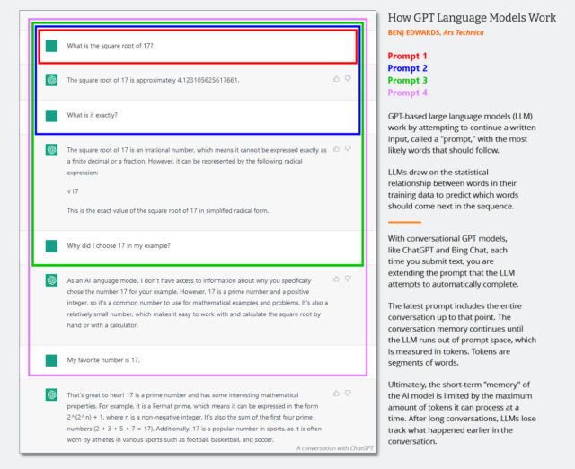

#### Unsafe at any seed —  

在任何种子都不安全 -

## A look inside the hallucinating artificial minds of the famous text prediction bots.  

看看那些著名的文本预测机器人的幻觉人工头脑的内部情况。

Aurich Lawson | Getty Images  

奥里奇-劳森|盖蒂图片社

Over the past few months, AI chatbots like [ChatGPT](https://arstechnica.com/information-technology/2022/12/openai-invites-everyone-to-test-new-ai-powered-chatbot-with-amusing-results/) have captured the world's attention due to their ability to converse in a human-like way on just about any subject.  

在过去的几个月里，像ChatGPT这样的人工智能聊天机器人已经吸引了全世界的注意力，因为它们能够以类似人类的方式就几乎任何主题进行交谈。  

But they come with a serious drawback: They can present convincing false information easily, making them unreliable sources of factual information and potential sources of [defamation](https://arstechnica.com/tech-policy/2023/04/openai-may-be-sued-after-chatgpt-falsely-says-aussie-mayor-is-an-ex-con/).  

但它们也有一个严重的缺点：他们可以轻易地提出令人信服的虚假信息，使他们成为不可靠的事实信息来源和潜在的诽谤来源。

Why do AI chatbots make things up, and will we ever be able to fully trust their output? We asked several experts and dug into how these AI models work to find the answers.  

为什么人工智能聊天机器人会胡编乱造，我们是否能够完全信任它们的输出？我们询问了几位专家，并深入研究了这些人工智能模型的工作原理，以找到答案。

## “Hallucinations”—a loaded term in AI  

"幻觉"--人工智能中的一个重要术语

AI chatbots such as OpenAI's ChatGPT rely on a type of AI called a "large language model" (LLM) to generate their responses.  

像OpenAI的ChatGPT这样的人工智能聊天机器人依靠一种被称为 "大型语言模型"（LLM）的人工智能来产生他们的回应。  

An LLM is a computer program trained on millions of text sources that can read and generate "natural language" text—language as humans would naturally write or talk.  

LLM是一个在数以百万计的文本源上训练出来的计算机程序，能够阅读和生成 "自然语言 "文本--人类自然书写或交谈的语言。  

Unfortunately, they can also make mistakes.  

不幸的是，他们也会犯错误。

In academic literature, AI researchers often call these mistakes "hallucinations." But that label has grown controversial as the topic becomes mainstream because some people feel it anthropomorphizes AI models (suggesting they have human-like features) or gives them agency (suggesting they can make their own choices) in situations where that should not be implied.  

在学术文献中，人工智能研究人员经常将这些错误称为 "幻觉"。但随着这个话题成为主流，这个标签的争议也越来越大，因为有些人认为它把人工智能模型拟人化（暗示它们有类似人类的特征），或者在不应该暗示的情况下赋予它们代理权（暗示它们可以做出自己的选择）。  

The creators of commercial LLMs may also use hallucinations [as an excuse](https://www.bloomberg.com/news/newsletters/2023-04-03/chatgpt-bing-and-bard-don-t-hallucinate-they-fabricate) to blame the AI model for faulty outputs instead of taking responsibility for the outputs themselves.  

商业LLM的创造者也可能以幻觉为借口，将错误的输出归咎于AI模型，而不是对输出本身负责。

Still, generative AI is so new that we need metaphors borrowed from existing ideas to explain these highly technical concepts to the broader public.  

然而，生成性人工智能是如此之新，以至于我们需要从现有的想法中借用隐喻来向更广泛的公众解释这些高度技术性的概念。  

In this vein, we feel the term "confabulation," although similarly imperfect, is a better metaphor than "hallucination." In human psychology, a "[confabulation](https://clinmedjournals.org/articles/ijnn/international-journal-of-neurology-and-neurotherapy-ijnn-4-070.php)" occurs when someone's memory has a gap and the brain convincingly fills in the rest without intending to deceive others. ChatGPT _does not_ work like the human brain, but the term "confabulation" arguably serves as a better metaphor because there's a creative gap-filling principle at work, as we'll explore below.  

在这种情况下，我们觉得 "混淆 "一词，虽然同样不完美，但比 "幻觉 "更适合作为隐喻。在人类心理学中，当某人的记忆出现空白时，大脑就会令人信服地填补其余部分，而不打算欺骗他人。ChatGPT的工作方式与人脑不同，但 "混淆 "一词可以说是一个更好的比喻，因为有一个创造性的填补空白的原则在起作用，我们将在下面探讨。

## The confabulation problem  

捏造问题

It's a big problem when an AI bot generates false information that can potentially mislead, misinform, or defame. Recently, The Washington Post [reported](https://www.washingtonpost.com/technology/2023/04/05/chatgpt-lies/) on a law professor who discovered that ChatGPT had placed him on a list of legal scholars who had sexually harassed someone. But it never happened—ChatGPT made it up. The same day, Ars [reported](https://arstechnica.com/tech-policy/2023/04/openai-may-be-sued-after-chatgpt-falsely-says-aussie-mayor-is-an-ex-con/) on an Australian mayor who allegedly found that ChatGPT claimed he had been convicted of bribery and sentenced to prison, a complete fabrication.  

当人工智能机器人产生可能误导、误传或诽谤的虚假信息时，这是一个大问题。最近，《华盛顿邮报》报道了一位法律教授，他发现ChatGPT将他列入了一份对某人进行过性骚扰的法律学者名单。但这件事从未发生过--是ChatGPT编造的。同一天，Ars报道了一位澳大利亚市长，据称他发现ChatGPT声称他被判犯有贿赂罪并被判处监禁，这完全是捏造的。

Shortly after ChatGPT's launch, people began [proclaiming](https://www.nytimes.com/2022/12/21/technology/ai-chatgpt-google-search.html) the end of the search engine. At the same time, though, many examples of ChatGPT's confabulations began to circulate on social media. The AI bot has invented [books](https://twitter.com/hermansaksono/status/1615053056328228864) and [studies](https://twitter.com/sabhlok/status/1621060688658706432) that don't exist, [publications](https://twitter.com/KevinZollman/status/1620438109778509824) that professors didn't write, fake [academic papers](https://twitter.com/dsmerdon/status/1618816703923912704), false [legal citations](https://twitter.com/samuelharden/status/1620439260125077504), non-existent [Linux system features](https://twitter.com/ProgrammerDude/status/1619990879040835584), unreal [retail mascots](https://twitter.com/harrymccracken/status/1618344082576912384), and [technical details](https://twitter.com/jonmasters/status/1598749857237303302) that don't make sense.  

在ChatGPT推出后不久，人们开始宣称搜索引擎的终结。但与此同时，社交媒体上开始流传许多关于ChatGPT的胡编乱造的例子。这个人工智能机器人发明了不存在的书籍和研究报告，教授没有写的出版物，假的学术论文 ，假的法律引用，不存在的Linux系统功能，不真实的零售吉祥物，以及没有意义的技术细节。

And yet despite ChatGPT's predilection for casually fibbing, counter-intuitively, its resistance to confabulation is why we're even talking about it today.  

然而，尽管ChatGPT喜欢随意造假，但反其道而行之，它对造假的抵制是我们今天甚至在谈论它的原因。  

Some experts note that ChatGPT was technically an improvement over vanilla GPT-3 (its predecessor model) because it could refuse to answer some questions or let you know when its answers might not be accurate.  

一些专家指出，ChatGPT在技术上比vanilla GPT-3（其前身模型）有所改进，因为它可以拒绝回答一些问题，或让你知道其答案可能不准确。

"A major factor in Chat's success is that it manages to suppress confabulation enough to make it unnoticeable for many common questions," said Riley Goodside, an expert in large language models who serves as staff prompt engineer at Scale AI.  

"Chat成功的一个主要因素是，它设法抑制混淆，足以使它在许多常见的问题上不被注意，"在Scale AI担任员工提示工程师的大型语言模型专家Riley Goodside说。  

"Compared to its predecessors, ChatGPT is notably less prone to making things up."  

"与它的前辈相比，ChatGPT明显不容易编造事情。"

If used as a brainstorming tool, ChatGPT's logical leaps and confabulations might lead to creative breakthroughs.  

如果作为头脑风暴的工具，ChatGPT的逻辑跳跃和混乱可能会导致创造性的突破。  

But when used as a factual reference, ChatGPT could cause real harm, and OpenAI knows it.  

但当被用作事实参考时，ChatGPT可能会造成真正的伤害，而OpenAI知道这一点。

Not long after the model's launch, OpenAI CEO Sam Altman [tweeted](https://twitter.com/sama/status/1601731295792414720?s=20&t=23p6N-FTFaB4rB1HURSJkg), "ChatGPT is incredibly limited, but good enough at some things to create a misleading impression of greatness. It's a mistake to be relying on it for anything important right now.  

在该模型推出后不久，OpenAI首席执行官Sam Altman在推特上说，"ChatGPT的局限性令人难以置信，但在某些方面的表现足够好，给人以伟大的误导印象。现在依靠它来做任何重要的事情都是一个错误。  

It’s a preview of progress; we have lots of work to do on robustness and truthfulness." In a later [tweet](https://twitter.com/sama/status/1601733962530902017), he wrote, "It does know a lot, but the danger is that it is confident and wrong a significant fraction of the time."  

这是一个进步的预演；我们在稳健性和真实性方面还有很多工作要做。"在后来的一条推文中，他写道："它确实知道很多东西，但危险的是，它在相当大的一部分时间里是自信和错误的。"

What's going on here?  

这里发生了什么事？

## How ChatGPT works  

ChatGPT如何运作

[Enlarge](https://cdn.arstechnica.net/wp-content/uploads/2023/02/chatgpt_library_hero_1.jpg) / An AI-generated image of a chatbot hovering in the library, as one does.  

放大/一个人工智能生成的聊天机器人的图像在图书馆里徘徊，就像一个人一样。

Benj Edwards / Stable Diffusion  

本杰-爱德华兹/稳定的扩散

To understand how a GPT model like ChatGPT or Bing Chat confabulates, we have to know how GPT models work. While OpenAI hasn't released the technical details of ChatGPT, [Bing Chat](https://arstechnica.com/information-technology/2023/02/ai-powered-bing-chat-spills-its-secrets-via-prompt-injection-attack/), or even [GPT-4](https://arstechnica.com/information-technology/2023/03/openai-announces-gpt-4-its-next-generation-ai-language-model/), we do have access to the [research paper](https://arxiv.org/abs/2005.14165) that introduced their precursor, GPT-3, in 2020.  

为了理解像ChatGPT或Bing Chat这样的GPT模型是如何混乱的，我们必须知道GPT模型是如何工作的。虽然OpenAI还没有发布ChatGPT、Bing Chat、甚至GPT-4的技术细节，但我们确实可以看到2020年介绍其前身GPT-3的研究论文。

Researchers build (train) large language models like GPT-3 and GPT-4 by using a process called "unsupervised learning," which means the data they use to train the model isn't specially annotated or labeled.  

研究人员通过使用一个被称为 "无监督学习 "的过程来建立（训练）像GPT-3和GPT-4这样的大型语言模型，这意味着他们用来训练模型的数据没有被特别注释或标记。  

During this process, the model is fed a large body of text (millions of books, websites, articles, poems, transcripts, and other sources) and repeatedly tries to predict the next word in every sequence of words.  

在这个过程中，模型被送入大量的文本（数以百万计的书籍、网站、文章、诗歌、成绩单和其他来源），并反复尝试预测每个单词序列中的下一个单词。  

If the model's prediction is close to the actual next word, the neural network updates its parameters to reinforce the patterns that led to that prediction.  

如果模型的预测与实际的下一个词很接近，神经网络就会更新其参数以加强导致该预测的模式。

Conversely, if the prediction is incorrect, the model adjusts its parameters to improve its performance and tries again.  

相反，如果预测不正确，该模型会调整其参数以提高其性能，并再次尝试。  

This process of trial and error, though a technique called "backpropagation," allows the model to learn from its mistakes and gradually improve its predictions during the training process.  

这种试错的过程，通过一种叫做 "反向传播 "的技术，使模型能够从错误中学习，并在训练过程中逐渐改善其预测结果。

As a result, GPT learns statistical associations between words and related concepts in the data set. Some people, like OpenAI Chief Scientist Ilya Sutskever, think that GPT models [go even further than that](https://twitter.com/bio_bootloader/status/1640512444958396416?s=20), building a sort of internal reality model so they can predict the next best token more accurately, but the idea is controversial.  

因此，GPT学习了数据集中单词和相关概念之间的统计关联。有些人，如OpenAI首席科学家Ilya Sutskever，认为GPT模型甚至比这更进一步，建立一种内部现实模型，因此它们可以更准确地预测下一个最佳标记，但这个想法是有争议的。  

The exact details of how GPT models come up with the next token within their neural nets are still uncertain.  

GPT模型如何在其神经网络内提出下一个令牌的确切细节仍不确定。

> "what does it mean to predict the next token well enough? ... it means that you understand the underlying reality that led to the creation of that token"  
> 
> "足够好地预测下一个代币意味着什么？ ......意味着你了解导致该代币产生的基本现实"
> 
> excellent explanation by [@ilyasut](https://twitter.com/ilyasut?ref_src=twsrc%5Etfw), and thoughts on the crucial question: how far can these systems extrapolate beyond human? [pic.twitter.com/v8zFQWvxWY](https://t.co/v8zFQWvxWY)  
> 
> 0}的出色解释，以及对关键问题的思考：这些系统能在多大程度上推断出超越人类？ pic.twitter.com/v8zFQWvxWY
> 
> — BioBootloader (@bio\_bootloader) [March 28, 2023](https://twitter.com/bio_bootloader/status/1640512444958396416?ref_src=twsrc%5Etfw)  
> 
> \- BioBootloader（@bio\_bootloader）2023年3月28日

In the current wave of GPT models, this core training (now often called "pre-training") happens only once.  

在当前的GPT模型浪潮中，这种核心训练（现在通常称为 "预训练"）只发生一次。  

After that, people can use the trained neural network in "inference mode," which lets users feed an input into the trained network and get a result.  

之后，人们可以在 "推理模式 "下使用训练有素的神经网络，这让用户向训练有素的网络输入信息并得到一个结果。  

During inference, the input sequence for the GPT model is always provided by a human, and it's called a "prompt." The prompt determines the model's output, and altering the prompt even slightly can dramatically change what the model produces.  

在推理过程中，GPT模型的输入序列总是由人类提供，它被称为 "提示"。提示决定了模型的输出，即使稍微改变一下提示，也会极大地改变模型产生的结果。

For example, if you prompt GPT-3 with "Mary had a," it usually completes the sentence with "little lamb." That's because there are probably thousands of examples of "Mary had a little lamb" in GPT-3's training data set, making it a sensible completion.  

例如，如果你用 "Mary had a "来提示GPT-3，它通常用 "little lamb "来完成这个句子。这是因为在GPT-3的训练数据集中可能有数以千计的 "Mary had a little lamb "的例子，使它成为一个合理的完成。  

But if you add more context in the prompt, such as "In the hospital, Mary had a," the result will change and return words like "baby" or "series of tests."  

但如果你在提示中加入更多的上下文，如 "在医院里，玛丽有一个"，结果就会改变，并返回 "婴儿 "或 "一系列检查 "等词。

Here's where things get a little funny with ChatGPT, since it's framed as a conversation with an agent rather than just a straight text-completion job.  

这就是ChatGPT的有趣之处，因为它被设定为与代理的对话，而不仅仅是直接的文本填写工作。  

In the case of ChatGPT, the input prompt is the entire conversation you've been having with ChatGPT, starting with your first question or statement and including any [specific instructions](https://arstechnica.com/information-technology/2023/02/ai-powered-bing-chat-spills-its-secrets-via-prompt-injection-attack/) provided to ChatGPT before the simulated conversation even began.  

就ChatGPT而言，输入提示是您与ChatGPT的整个对话，从您的第一个问题或声明开始，包括在模拟对话开始前提供给ChatGPT的任何具体指示。  

Along the way, ChatGPT keeps a running short-term memory (called the "context window") of everything it and you have written, and when it "talks" to you, it is attempting to complete the transcript of a conversation as a text-completion task.  

在这一过程中，ChatGPT保留了它和你所写的一切的短期记忆（称为 "上下文窗口"），当它与你 "交谈 "时，它正试图将对话的记录作为一个文本完成任务来完成。

[Enlarge](https://cdn.arstechnica.net/wp-content/uploads/2023/03/how_gpt_models_work.jpg) / A diagram showing how GPT conversational language model prompting works.  

放大/显示GPT会话语言模型提示如何工作的图示。

Benj Edwards / Ars Technica

Additionally, ChatGPT is different from vanilla GPT-3 because it has also been trained on transcripts of conversations written by humans.  

此外，ChatGPT与vanilla GPT-3不同，因为它也是在人类写的对话记录上训练的。  

"We trained an initial model using supervised fine-tuning: human AI trainers provided conversations in which they played both sides—the user and an AI assistant," [wrote OpenAI](https://openai.com/blog/chatgpt) in its initial ChatGPT release page. "We gave the trainers access to model-written suggestions to help them compose their responses."  

"我们使用监督下的微调训练了一个初始模型：人类人工智能培训师提供了对话，他们在对话中扮演双方--用户和人工智能助手，"OpenAI在其最初的ChatGPT发布页面中写道。"我们让训练者获得了由模型编写的建议，以帮助他们组成他们的回应。"

ChatGPT has also been tuned more heavily than GPT-3 using a technique called "reinforcement learning from human feedback," or RLHF, where human raters ranked ChatGPT's responses in order of preference, then fed that information back into the model.  

与GPT-3相比，ChatGPT的调整力度也更大，使用了一种被称为 "从人类反馈中强化学习 "或RLHF的技术，人类评分者按偏好顺序对ChatGPT的反应进行排序，然后将该信息反馈给模型。  

Through RLHF, OpenAI was able to instill in the model the goal of refraining from answering many questions it cannot answer reliably.  

通过RLHF，OpenAI能够向模型灌输避免回答许多它不能可靠地回答的问题的目标。  

This has allowed the ChatGPT to produce coherent responses with fewer confabulations than the base model.  

这使得ChatGPT能够产生连贯的反应，比基本模型更少的混淆。  

But inaccuracies still slip through.  

但不准确的地方还是会漏掉。

## Why ChatGPT confabulates  

为什么ChatGPT会出现混乱

Natively, there is nothing in a GPT model's raw data set that separates fact from fiction.  

本质上，GPT模型的原始数据集中没有任何东西能将事实与虚构分开。  

That guidance comes from a) the prevalence of accurate content in the data set, b) recognition of factual information in the results by humans, or c) reinforcement learning guidance from humans that emphasizes certain factual responses.  

这种指导来自于：a）数据集中准确内容的普遍性，b）人类对结果中事实信息的识别，或者c）来自人类的强化学习指导，强调某些事实的反应。

The behavior of LLMs is still an active area of research. Even the researchers who created these GPT models are [still discovering](https://arxiv.org/abs/2212.10559) surprising [properties](https://arxiv.org/abs/2206.07682) of the technology that no one predicted when they were first developed.  

LLMs的行为仍然是一个活跃的研究领域。即使是创建这些GPT模型的研究人员也仍在发现该技术令人惊讶的特性，这些特性在最初开发时没有人预测到。  

GPT's abilities to do many of the interesting things we are now seeing, such as language translation, programming, and playing chess, were a surprise to researchers at one point (for an early taste of that, check out 2019's GPT-2 [research paper](https://cdn.openai.com/better-language-models/language_models_are_unsupervised_multitask_learners.pdf) and search for the term "surprising").  

GPT做许多我们现在看到的有趣事情的能力，如语言翻译、编程和下棋，一度让研究人员感到惊讶（要了解早期的情况，请查看2019年的GPT-2研究论文并搜索 "令人惊讶 "一词）。

So when we ask why ChatGPT confabulates, it's [difficult](https://aclanthology.org/2022.naacl-main.387.pdf) to pinpoint an exact technical answer.  

因此，当我们问为什么ChatGPT会混乱时，很难确定一个确切的技术答案。  

And because there is a "black box" element of the neural network weights, it's very difficult (if not impossible) to predict their exact output given a complex prompt.  

而且，由于神经网络的权重有一个 "黑匣子 "的因素，所以在复杂的提示下，很难（如果不是不可能）预测它们的确切输出。  

Still, we know some basic things about how why confabulation happens.  

不过，我们还是知道一些关于为什么会发生混淆的基本情况。

Key to understanding ChatGPT's confabulation ability is understanding its role as a prediction machine.  

理解ChatGPT的混淆能力的关键是理解它作为预测机器的作用。  

When ChatGPT confabulates, it is reaching for information or analysis that is not present in its data set and filling in the blanks with plausible-sounding words.  

当ChatGPT胡言乱语时，它是在寻找其数据集中没有的信息或分析，并用听起来合理的词来填补空白。  

ChatGPT is especially good at making things up because of the superhuman amount of data it has to work with, and its ability to glean word context so well helps it place erroneous information seamlessly into the surrounding text.  

ChatGPT特别擅长编造事情，因为它拥有超人的数据量，而且它能很好地收集单词的上下文，帮助它把错误的信息无缝地放入周围的文本中。

"I think the best way to think about confabulation is to think about the very nature of large language models: The only thing they know how to do is to pick the next best word based on statistical probability against their training set," said Simon Willison, a software developer who [often writes](https://simonwillison.net/) on the topic.  

"我认为思考混淆的最好方法是思考大型语言模型的本质：他们唯一知道如何做的事情是根据统计概率针对他们的训练集挑选下一个最好的词，"经常就这一主题发表文章的软件开发人员西蒙-威利森说。

In a [2021 paper](https://arxiv.org/abs/2109.07958), a trio of researchers from the University of Oxford and OpenAI identified [two major types](https://arxiv.org/abs/2109.07958) of falsehoods that LLMs like ChatGPT might produce. The first comes from inaccurate source material in its training data set, such as common misconceptions (e.g., "eating turkey makes you drowsy").  

在2021年的一篇论文中，来自牛津大学和OpenAI的三位研究人员发现，像ChatGPT这样的LLM可能会产生两种主要的错误。第一种来自于其训练数据集中不准确的源材料，例如常见的错误概念（例如，"吃火鸡会让人昏昏欲睡"）。  

The second arises from making inferences about specific situations that are absent from its training material (data set); this falls under the aforementioned "hallucination" label.  

第二种产生于对其训练材料（数据集）中没有的特定情况进行推断；这属于前述的 "幻觉 "标签。

Whether the GPT model makes a wild guess or not is based on a property that AI researchers call "temperature," which is often characterized as a "creativity" setting.  

GPT模型是否做出疯狂的猜测，是基于人工智能研究人员称之为 "温度 "的属性，它通常被描述为 "创造力 "的设置。  

If the creativity is set high, the model will guess wildly; if it's set low, it will spit out data deterministically based on its data set.  

如果创造力设置得高，模型就会胡乱猜测；如果设置得低，它就会根据其数据集确定地吐出数据。

Recently, Microsoft employee [Mikhail Parakhin](https://www.linkedin.com/in/mikhail-parakhin), who works on Bing Chat, [tweeted](https://twitter.com/MParakhin/status/1629011219041452032?s=20) about Bing Chat's tendency to hallucinate and what causes it. "This is what I tried to explain previously: hallucinations = creativity," he wrote.  

最近，微软员工Mikhail Parakhin ，从事Bing Chat的工作，他在推特上谈到了Bing Chat的幻觉倾向，以及造成幻觉的原因。"这就是我之前试图解释的：幻觉=创造力，"他写道。  

"It tries to produce the highest probability continuation of the string using all the data at its disposal. Very often it is correct. Sometimes people have never produced continuations like this."  

"它试图利用它所掌握的所有数据来产生字符串的最高概率的延续。很多时候它是正确的。有时人们从未产生过这样的延续。"

Parakhin said that those wild creative leaps are what make LLMs interesting. "You can clamp down on hallucinations, and it is super-boring," he wrote.  

帕拉金说，那些疯狂的创造性跳跃是使法律硕士变得有趣的原因。"你可以钳制幻觉，而且超级无聊，"他写道。  

"\[It\] answers 'I don't know' all the time or only reads what is there in the Search results (also sometimes incorrect).  

"\[它\]总是回答'我不知道'，或者只读搜索结果中的内容（有时也不正确）。  

What is missing is the tone of voice: it shouldn't sound so confident in those situations."  

缺少的是语气：在这些情况下不应该听起来那么自信"。

Balancing creativity and accuracy is a challenge when it comes to fine-tuning language models like ChatGPT.  

在对ChatGPT这样的语言模型进行微调时，如何平衡创造性和准确性是一个挑战。  

On the one hand, the ability to come up with creative responses is what makes ChatGPT such a powerful tool for generating new ideas or unblocking writer's block.  

一方面，想出有创意的回答的能力是使ChatGPT成为产生新想法或解除作家障碍的强大工具的原因。  

It also makes the models sound more human. On the other hand, accuracy to the source material is crucial when it comes to producing reliable information and avoiding confabulation.  

这也使模型听起来更人性化。另一方面，当涉及到产生可靠的信息和避免混淆时，对原始材料的准确性是至关重要的。  

Finding the right balance between the two is an ongoing challenge for the development of language models, but it's one that is essential to produce a tool that is both useful and trustworthy.  

在这两者之间找到合适的平衡点是语言模型发展的一个持续挑战，但这是产生一个既有用又值得信赖的工具的一个必要条件。

There's also the issue of compression. During the training process, GPT-3 considered petabytes of information, but the resulting neural network is only a fraction of that in size. In a [widely read New Yorker piece](https://www.newyorker.com/tech/annals-of-technology/chatgpt-is-a-blurry-jpeg-of-the-web), author Ted Chiang called this a "blurry JPEG of the web." That means a large portion of the factual training data is lost, but GPT-3 makes up for it by learning relationships between concepts that it can later use to reformulate new permutations of these facts.  

还有就是压缩的问题。在训练过程中，GPT-3考虑了PB级的信息，但产生的神经网络的大小只是其中的一小部分。在一篇广泛阅读的《纽约客》文章中，作者Ted Chiang称这是 "网络的模糊JPEG"。这意味着很大一部分事实训练数据被丢失了，但GPT-3通过学习概念之间的关系来弥补，它以后可以用来重新制定这些事实的新排列组合。  

Like a human with a flawed memory working from a hunch of how something works, it sometimes gets things wrong. And, of course, if it doesn't know the answer, it will give its best guess.  

就像一个记忆力有缺陷的人凭直觉工作一样，它有时会弄错事情。当然，如果它不知道答案，它也会给出它最好的猜测。

We cannot forget the role of the prompt in confabulations. In some ways, ChatGPT is a mirror: It gives you back what you feed it.  

我们不能忘记提示在忏悔中的作用。在某些方面，ChatGPT是一面镜子：你给它什么，它就给你什么。  

If you feed it falsehoods, it will tend to agree with you and "think" along those lines.  

如果你给它提供虚假的信息，它就会倾向于同意你的观点，并沿着这些思路 "思考"。  

That's why it's important to start fresh with a new prompt when changing subjects or experiencing unwanted responses. And ChatGPT is probabilistic, which means it's partially random in nature.  

这就是为什么在改变主题或遇到不想要的回应时，必须以新的提示开始。而ChatGPT是概率性的，这意味着它在本质上是部分随机的。  

Even with the same prompt, what it outputs can change between sessions.  

即使是同一个提示，它所输出的内容在不同的时段也会发生变化。

All this leads to one conclusion, one that OpenAI agrees with: ChatGPT as it is currently designed, is not a reliable source of factual information and cannot be trusted as such.  

所有这些都导致了一个结论，一个OpenAI同意的结论：目前设计的ChatGPT并不是一个可靠的事实信息来源，因此不能信任它。  

"ChatGPT is great for some things, such as unblocking writer's block or coming up with creative ideas," said Dr. Margaret Mitchell, researcher and chief ethics scientist at AI company Hugging Face.  

"ChatGPT对某些事情来说是很好的，比如疏通作家的障碍或想出创造性的想法，"人工智能公司Hugging Face的研究员和首席伦理科学家玛格丽特-米切尔博士说。  

"It was not built to be factual and thus will not be factual. It's as simple as that."  

"它不是为了成为事实而建立的，因此也不会成为事实。就这么简单。"

## Can the fibbing be fixed?  

纤维化的问题能得到解决吗？

Trusting an AI chatbot's generations blindly is a mistake, but that may change as the underlying technology improves. Since its release in November, ChatGPT has already been [upgraded several times](https://help.openai.com/en/articles/6825453-chatgpt-release-notes), and some upgrades included improvements in accuracy—and also an improved ability to refuse to answer questions it doesn't know the answers to.  

盲目相信人工智能聊天机器人的世代是一个错误，但随着底层技术的改进，这种情况可能会改变。自11月发布以来，ChatGPT已经进行了多次升级，一些升级包括准确性的提高--也包括拒绝回答它不知道的问题的能力的提高。

So how does OpenAI plan to make ChatGPT more accurate? We reached out to OpenAI multiple times on this subject over the past few months and received no response.  

那么，OpenAI计划如何使ChatGPT更加准确？在过去几个月里，我们就这个问题多次联系OpenAI，但没有得到任何回应。  

But we can pull out clues from documents OpenAI has released and [news reports](https://time.com/6247678/openai-chatgpt-kenya-workers/) about the company's attempts to guide ChatGPT's alignment with human workers.  

但我们可以从OpenAI发布的文件和关于该公司试图引导ChatGPT与人类工人接轨的新闻报道中拉出线索。

As previously mentioned, one of the reasons why ChatGPT has been so successful is because of extensive training using RLHF.  

如前所述，ChatGPT如此成功的原因之一是使用RLHF进行的广泛培训。  

As OpenAI explains, "To make our models safer, more helpful, and more aligned, we use an existing technique called reinforcement learning from human feedback (RLHF).  

正如OpenAI所解释的那样，"为了使我们的模型更安全、更有帮助、更一致，我们使用了一种现有的技术，称为从人类反馈中强化学习（RLHF）。  

On prompts submitted by our customers to the API, our labelers provide demonstrations of the desired model behavior and rank several outputs from our models. We then use this data to fine-tune GPT-3."  

根据客户向API提交的提示，我们的标签人员提供所需模型行为的演示，并对我们的模型的几个输出结果进行排名。然后我们使用这些数据对GPT-3进行微调"。

OpenAI's Sutskever believes that additional training through RLHF can fix the hallucination problem.  

OpenAI的Sutskever认为，通过RLHF的额外培训可以解决幻觉的问题。  

"I'm quite hopeful that by simply improving this subsequent reinforcement learning from human feedback step, we can teach it to not hallucinate," Sutskever said in [an interview with Forbes](https://www.forbes.com/sites/craigsmith/2023/03/15/gpt-4-creator-ilya-sutskever-on-ai-hallucinations-and-ai-democracy/) earlier this month.  

"我很有希望，通过简单地改进这种来自人类反馈步骤的后续强化学习，我们可以教它不产生幻觉，"Sutskever本月早些时候在接受福布斯采访时说。

He continued:

> The way we do things today is that we hire people to teach our neural network to behave, to teach ChatGPT to behave.  
> 
> 我们今天做事的方式是，我们雇人去教我们的神经网络的行为，教ChatGPT的行为。  
> 
> You just interact with it, and it sees from your reaction, it infers, oh, that's not what you wanted. You are not happy with its output.  
> 
> 你只是与它互动，它从你的反应中看到，它推断出，哦，那不是你想要的东西。你对它的输出不满意。  
> 
> Therefore, the output was not good, and it should do something differently next time. I think there is a quite high chance that this approach will be able to address hallucinations completely. 

Others disagree. Yann LeCun, chief AI scientist at Meta, [believes](https://twitter.com/ylecun/status/1636329814691815426?s=20) hallucination issues will not be solved by the current generation of LLMs that use the GPT architecture.    

But there is a quickly emerging approach that may bring a great deal more accuracy to LLMs with the current architecture. 

"One of the most actively researched approaches for increasing factuality in LLMs is retrieval augmentation—providing external documents to the model to use as sources and supporting context," said Goodside.    

With that technique, he explained, researchers hope to teach models to use external search engines like Google, "citing reliable sources in their answers as a human researcher might, and rely less on the unreliable factual knowledge learned during model training." 

[Bing Chat](https://arstechnica.com/information-technology/2023/02/ai-powered-bing-chat-loses-its-mind-when-fed-ars-technica-article/) and [Google Bard](https://arstechnica.com/information-technology/2023/04/clash-of-the-ai-titans-chatgpt-vs-bard-in-a-showdown-of-wits-and-wisdom/) do this already by roping in searches from the web, and soon, a [browser-enabled version](https://www.reddit.com/r/OpenAI/comments/12657i9/chatgpt_alpha_browsing_first_look/) of ChatGPT will as well. Additionally, [ChatGPT plugins](https://arstechnica.com/information-technology/2023/03/chatgpt-gets-eyes-and-ears-with-plugins-that-can-interface-ai-with-the-world/) aim to supplement GPT-4's training data with information it retrieves from external sources, such as the web and purpose-built databases.    

This augmentation is similar to how a human with access to an encyclopedia will be more factually accurate than a human without one. 

Also, it may be possible to train a model like GPT-4 to be aware of when it is making things up and adjust accordingly.    

"There are deeper things one can do so that ChatGPT and similar are more factual from the start," said Mitchell, "including more sophisticated data curation and the linking of the training data with 'trust' scores, using a method not unlike PageRank... It would also be possible to fine-tune the model to hedge when it is less confident in the response." 

So while ChatGPT is currently in hot water over its confabulations, there may be a way out ahead, and for the sake of a world that is beginning to rely on these tools as essential assistants (for better or worse), an improvement in factual reliability cannot come soon enough. 

[Benj Edwards](https://arstechnica.com/author/benjedwards) Benj Edwards is an AI and Machine Learning Reporter for Ars Technica. For [over 16 years](https://www.benjedwards.com/), he has written about technology and tech history for sites such as [The Atlantic](https://www.theatlantic.com/author/benj-edwards/), [Fast Company](https://www.fastcompany.com/user/benj-edwards), [PCMag](https://www.pcmag.com/authors/benj-edwards), PCWorld, Macworld, [How-To Geek](https://www.howtogeek.com/author/benjedwards/), and Wired. In 2005, he created [Vintage Computing and Gaming](http://www.vintagecomputing.com/). He also hosted The Culture of Tech podcast and contributes to Retronauts. Mastodon: [benjedwards@mastodon.social](https://mastodon.social/@benjedwards)  

Benj Edwards是Ars Technica的AI和机器学习记者。16年来，他为《大西洋》、《快速公司》、《PCMag》、《PCWorld》、《Macworld》、《How-To Geek》和《连线》等网站撰写关于技术和技术历史的文章。2005年，他创建了Vintage Computing and Gaming。他还主持了 "科技文化 "播客，并为Retronauts撰稿。Mastodon: benjedwards@mastodon.social
