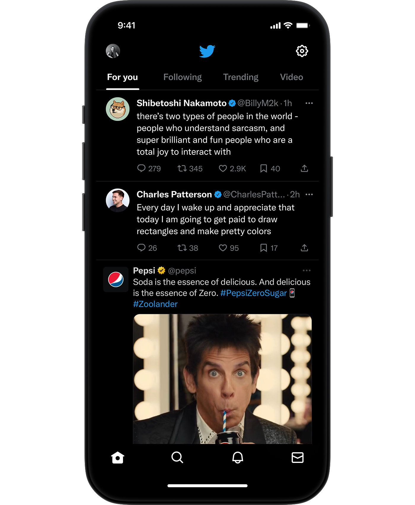

#### Open source

By

Friday, 31 March 2023  

2023年3月31日，星期五

Twitter aims to deliver you the best of what’s happening in the world right now.  

推特旨在为您提供当前世界上发生的最好的事情。  

This requires a recommendation algorithm to distill the roughly 500 million Tweets posted daily down to a handful of top Tweets that ultimately show up on your device’s **For You** timeline. This blog is an introduction to how the algorithm selects Tweets for your timeline.  

这需要一种推荐算法，将每天发布的大约5亿条推文提炼成少数几条顶级推文，最终显示在你的设备的 "为你服务 "时间线上。这篇博客介绍了该算法如何为你的时间线选择推文。

Our recommendation system is composed of many interconnected services and jobs, which we will detail in this post.  

我们的推荐系统是由许多相互关联的服务和工作组成的，我们将在这篇文章中详细介绍。  

While there are many areas of the app where Tweets are recommended—Search, Explore, Ads—this post will focus on the home timeline’s For You feed.  

虽然应用程序中有许多地方推荐推文--搜索、探索、广告--但这篇文章将重点关注主时间线的 "为你服务 "栏目。

## How do we choose Tweets?  

我们如何选择推文？

The foundation of Twitter’s recommendations is a set of core models and features that extract latent information from Tweet, user, and engagement data.  

推特推荐的基础是一套核心模型和功能，从推特、用户和参与数据中提取潜在的信息。  

These models aim to answer important questions about the Twitter network, such as, _“What is the probability you will interact with another user in the future?”_ or, _“What are the communities on Twitter and what are trending Tweets within them?”_ Answering these questions accurately enables Twitter to deliver more relevant recommendations.  

这些模型旨在回答关于Twitter网络的重要问题，例如，"你未来与另一个用户互动的概率是多少？"或者，"Twitter上有哪些社区，其中有哪些流行的推文？"准确地回答这些问题使Twitter能够提供更相关的推荐。

The recommendation pipeline is made up of three main stages that consume these features:   

推荐管道由三个主要阶段组成，它们消耗这些功能：

1.  Fetch the best Tweets from different recommendation sources in a process called **candidate sourcing**.  
    
    从不同的推荐来源中获取最好的推文，这个过程被称为候选人采购。
2.  **Rank** each Tweet using a machine learning model.  
    
    使用机器学习模型对每条Tweet进行排名。
3.  Apply **heuristics and filters**, such as filtering out Tweets from users you’ve blocked, NSFW content, and Tweets you’ve already seen.  
    
    应用启发式方法和过滤器，例如过滤掉你已经屏蔽的用户的推文、NSFW内容以及你已经看过的推文。

The service that is responsible for constructing and serving the For You timeline is called Home Mixer.  

负责构建和服务 "为你 "时间线的服务被称为 "家庭混合器"。  

Home Mixer is built on Product Mixer, our custom Scala framework that facilitates building feeds of content.  

Home Mixer是建立在Product Mixer之上的，这是我们定制的Scala框架，便于建立内容的feeds。  

This service acts as the software backbone that connects different candidate sources, scoring functions, heuristics, and filters.  

这项服务作为软件主干，连接了不同的候选人来源、评分功能、启发式方法和过滤器。

This diagram below illustrates the major components used to construct a timeline:  

下图说明了用于构建时间线的主要组成部分：

Let’s explore the key parts of this system, roughly in the order they’d be called during a single timeline request, starting with retrieving candidates from **Candidate Sources**.  

让我们来探讨一下这个系统的关键部分，大致按照它们在一次时间轴请求中被调用的顺序，从从候选人来源中检索出候选人开始。

## Candidate Sources

Twitter has several Candidate Sources that we use to retrieve recent and relevant Tweets for a user.  

Twitter有几个候选源，我们用它们来检索用户最近的相关推文。  

For each request, we attempt to extract the best 1500 Tweets from a pool of hundreds of millions through these sources. We find candidates from people you follow (**In-Network**) and from people you don’t follow (**Out-of-Network**). Today, the For You timeline consists of 50% In-Network Tweets and 50% Out-of-Network Tweets on average, though this may vary from user to user.  

对于每个请求，我们试图通过这些来源从数以亿计的信息库中提取最好的1500条推特。我们从你关注的人（网络内）和你不关注的人（网络外）中找到候选人。今天，"为了你 "的时间线平均由50%的网络内推文和50%的网络外推文组成，尽管这可能因用户而异。

### In-Network Source

The In-Network source is the largest candidate source and aims to deliver the most relevant, recent Tweets from users you follow.  

网络内来源是最大的候选来源，旨在提供您所关注的用户的最相关、最新的推文。  

It efficiently ranks Tweets of those you follow based on their relevance using a logistic regression model. The top Tweets are then sent to the next stage.  

它使用逻辑回归模型，根据相关性对你关注的人的推文进行有效排名。排名靠前的推文随后被送入下一阶段。

The most important component in ranking In-Network Tweets is [Real Graph](https://www.ueo-workshop.com/wp-content/uploads/2014/04/sig-alternate.pdf). Real Graph is a model which predicts the likelihood of engagement between two users. The higher the Real Graph score between you and the author of the Tweet, the more of their tweets we'll include.  

对网络内推文进行排名的最重要的组成部分是Real Graph。真实图谱是一个预测两个用户之间接触的可能性的模型。你和推文作者之间的Real Graph得分越高，我们就会收录更多他们的推文。

The In-Network source has been the subject of recent work at Twitter.  

网络内源是Twitter最近工作的主题。  

We recently stopped using Fanout Service, a 12-year old service that was previously used to provide In-Network Tweets from a cache of Tweets for each user.  

我们最近停止使用Fanout服务，这是一项有12年历史的服务，以前用于从每个用户的推文缓存中提供网络内推文。  

We’re also in the process of redesigning the logistic regression ranking model which was last updated and trained several years ago!  

我们也正在重新设计逻辑回归排名模型，该模型最后一次更新和训练是在几年前

### Out-of-Network Sources  

网络外来源

Finding relevant Tweets outside of a user’s network is a trickier problem: _How can we tell if a certain Tweet will be relevant to you if you don’t follow the author?_ Twitter takes two approaches to addressing this.  

在用户网络之外寻找相关的推文是一个比较棘手的问题：如果你不关注作者，我们怎么能知道某条推文是否与你有关？Twitter采取了两种方法来解决这个问题。

#### Social Graph

Our first approach is to estimate what you would find relevant by analyzing the engagements of people you follow or those with similar interests.  

我们的第一个方法是通过分析你所关注的人或有类似兴趣的人的参与情况，来估计你会发现什么是相关的。

We traverse the graph of engagements and follows to answer the following questions:  

我们遍历约定的图谱，并在此基础上回答以下问题：

-   _What Tweets did the people I follow recently engage with?  
    
    我关注的人最近参与了哪些推文？_
-   _Who likes similar Tweets to me, and what else have they recently liked?  
    
    谁喜欢和我类似的推文，他们最近还喜欢什么？_

We generate candidate Tweets based on the answers to these questions and rank the resulting Tweets using a logistic regression model.  

我们根据这些问题的答案生成候选推文，并使用逻辑回归模型对生成的推文进行排名。  

Graph traversals of this type are essential to our Out-of-Network recommendations; we developed [GraphJet](https://www.vldb.org/pvldb/vol9/p1281-sharma.pdf), a graph processing engine that maintains a real-time interaction graph between users and Tweets, to execute these traversals.  

这种类型的图形遍历对我们的网外推荐至关重要；我们开发了GraphJet ，这是一个图形处理引擎，维护用户和推文之间的实时互动图形，以执行这些遍历。  

While such heuristics for searching the Twitter engagement and follow network have proven useful (these currently serve about 15% of Home Timeline Tweets), embedding space approaches have become the larger source of Out-of-Network Tweets.  

虽然这种搜索Twitter参与和关注网络的启发式方法已被证明是有用的（这些方法目前为大约15%的主页时间线推文提供服务），但嵌入空间方法已成为网络外推文的更大来源。

#### Embedding Spaces

Embedding space approaches aim to answer a more general question about content similarity: _What Tweets and Users are similar to my interests?_  

嵌入空间方法旨在回答一个关于内容相似性的更普遍的问题：哪些推文和用户与我的兴趣相似？

Embeddings work by generating numerical representations of users’ interests and Tweets’ content.  

嵌入的工作方式是对用户的兴趣和推文的内容产生数字表示。  

We can then calculate the similarity between any two users, Tweets or user-Tweet pairs in this embedding space.  

然后，我们可以计算这个嵌入空间中任何两个用户、推文或用户-推文对之间的相似度。  

Provided we generate accurate embeddings, we can use this similarity as a stand-in for relevance.  

只要我们产生准确的嵌入，我们就可以用这种相似性作为相关性的替身。

One of Twitter’s most useful embedding spaces is [SimClusters](https://dl.acm.org/doi/10.1145/3394486.3403370). SimClusters discover communities anchored by a cluster of influential users using a [custom matrix factorization algorithm](https://github.com/twitter/sbf). There are 145k communities, which are updated every three weeks. Users and Tweets are represented in the space of communities, and can belong to multiple communities.  

Twitter最有用的嵌入空间之一是SimClusters。SimClusters使用自定义的矩阵因子化算法，发现由有影响力的用户集群固定的社区。这里有145k个社区，每三周更新一次。用户和推文在社区的空间中被表示出来，并且可以属于多个社区。  

Communities range in size from a few thousand users for individual friend groups, to hundreds of millions of users for news or pop culture. These are some of the biggest communities:  

社区的规模从个人朋友圈的几千名用户，到新闻或流行文化的数亿名用户不等。这些是一些最大的社区：

We can embed Tweets into these communities by looking at the current popularity of a Tweet in each community.  

我们可以通过查看一条Tweet在每个社区的当前流行度，将Tweet嵌入到这些社区。  

The more that users from a community like a Tweet, the more that Tweet will be associated with that community.  

一个社区的用户越是喜欢一条推文，该推文就越是与该社区相关。

## Ranking

The goal of the For You timeline is to serve you relevant Tweets. At this point in the pipeline, we have ~1500 candidates that may be relevant.  

为你服务 "时间轴的目标是为你提供相关的推文。在管道的这一点上，我们有大约1500个可能相关的候选人。  

Scoring directly predicts the relevance of each candidate Tweet and is the primary signal for ranking Tweets on your timeline.  

分数直接预测每个候选推文的相关性，是在你的时间线上对推文进行排名的主要信号。  

At this stage, all candidates are treated equally, without regard for what candidate source it originated from.  

在这个阶段，所有的候选人都被平等对待，不考虑它来自哪个候选人的来源。

Ranking is achieved with a ~48M parameter neural network that is continuously trained on Tweet interactions to optimize for positive engagement (e.g. Likes, Retweets, and Replies).  

排名是通过一个约4800万个参数的神经网络实现的，该网络对Tweet互动进行持续训练，以优化积极的参与（例如，赞、转发和回复）。  

This ranking mechanism takes into account thousands of features and outputs ten labels to give each Tweet a score, where each label represents the probability of an engagement.  

这种排名机制考虑到了成千上万的特征，并输出十个标签，给每条推特打分，其中每个标签代表参与的概率。  

We rank the Tweets from these scores.   

我们根据这些分数对推文进行排名。

## Heuristics, Filters, and Product Features  

启发式方法、过滤器和产品特性

After the Ranking stage, we apply heuristics and filters to implement various product features. These features work together to create a balanced and diverse feed. Some examples include:  

在排名阶段之后，我们应用启发式方法和过滤器来实现各种产品功能。这些特点共同作用于创造一个平衡和多样化的饲料。一些例子包括：

-   **Visibility Filtering**: Filter out Tweets based on their content and your preferences. For instance, remove Tweets from accounts you block or mute.    
    
    可见度过滤：根据推文的内容和你的喜好，过滤掉推文。例如，删除来自你屏蔽或静音的账户的推文。
-   **Author Diversity**: Avoid too many consecutive Tweets from a single author.  
    
    作者的多样性：避免过多的连续推文来自一个作者。
-   **Content Balance**: Ensure we are delivering a fair balance of In-Network and Out-of-Network Tweets.  
    
    内容平衡：确保我们提供的网络内和网络外推文的公平平衡。
-   **Feedback-based Fatigue**: Lower the score of certain Tweets if the viewer has provided negative feedback around it.  
    
    基于反馈的疲劳：如果观众围绕某些推文提供了负面的反馈，则降低该推文的得分。
-   **Social Proof**: Exclude Out-of-Network Tweets without a second degree connection to the Tweet as a quality safeguard. In other words, ensure someone you follow engaged with the Tweet or follows the Tweet’s author.  
    
    社会证明：排除网络外的推文，如果没有与该推文有第二层关系，作为质量保障。换句话说，确保你关注的人参与了该推文或关注该推文的作者。
-   **Conversations**: Provide more context to a Reply by threading it together with the original Tweet.  
    
    对话：通过将回复与原始Tweet串联起来，为回复提供更多背景。
-   **Edited Tweets**: Determine if the Tweets currently on a device are stale, and send instructions to replace them with the edited versions.  
    
    编辑过的推文：判断当前设备上的推文是否已经过时，并发送指示，用编辑过的版本替换它们。

## Mixing and Serving  

搅拌和上菜

At this point, Home Mixer has a set of Tweets ready to send to your device.  

在这一点上，Home Mixer有一组准备好的推文，可以发送到你的设备上。  

As the last step in the process, the system blends together Tweets with other non-Tweet content like Ads, Follow Recommendations, and Onboarding prompts, which are returned to your device to display.   

作为这个过程的最后一步，系统将推文与其他非推文内容混合在一起，如广告、关注建议和入职提示，这些内容会返回到你的设备上显示。

The pipeline above runs approximately 5 billion times per day and completes in under 1.5 seconds on average.  

上述管道每天运行约50亿次，平均在1.5秒内完成。  

A single pipeline execution requires 220 seconds of CPU time, nearly 150x the latency you perceive on the app.  

一个管道的执行需要220秒的CPU时间，几乎是你在应用程序上感知到的延迟的150倍。

The goal of our open source endeavor is to provide full transparency to you, our users, about how our systems work. We’ve released the code powering our recommendations that you can view [here](https://github.com/twitter/the-algorithm) (and [here](https://github.com/twitter/the-algorithm-ml)) to understand our algorithm in greater detail, and we are also working on several features to provide you greater transparency within our app. Some of the new developments we have planned include:   

我们的开源努力的目标是向你，我们的用户，提供关于我们的系统如何工作的完全透明度。我们已经发布了为我们的建议提供动力的代码，你可以在这里（和这里）查看，以更详细地了解我们的算法，我们也在努力开发一些功能，在我们的应用程序中为你提供更大的透明度。我们计划的一些新发展包括：

-   A better Twitter analytics platform for creators with more information on reach and engagement  
    
    为创作者提供更好的推特分析平台，提供更多关于影响力和参与度的信息
-   Greater transparency into any safety labels applied to your Tweets or accounts  
    
    对应用于你的推文或账户的任何安全标签的透明度更高
-   Greater visibility into why Tweets appear on your timeline  
    
    对推文出现在你的时间线上的原因有更多的了解

## What’s Next?  

下一步是什么？

Twitter is the center of conversations around the world. Every day, we serve over 150 billion Tweets to people’s devices.  

推特是全世界对话的中心。每天，我们向人们的设备提供超过1500亿条推文。  

Ensuring that we’re delivering the best content possible to our users is both a challenging and an exciting problem.  

确保我们向用户提供尽可能好的内容，既是一个具有挑战性的问题，也是一个令人兴奋的问题。  

We’re working on new opportunities to expand our recommendation systems—new real-time features, embeddings, and user representations—and we have one of the most interesting datasets and user bases in the world to do it with.  

我们正在努力寻找新的机会来扩展我们的推荐系统--新的实时特征、嵌入和用户代表--我们有世界上最有趣的数据集和用户群来做这件事。  

We are building the town square of the future. If this interests you, please consider [joining us](mailto:careers@twitter.com).  

我们正在建设未来的城市广场。如果你对此感兴趣，请考虑加入我们。

_Written by the Twitter Team.  

由推特团队撰写。_

Twitter

[@Twitter](https://www.twitter.com/Twitter)@Twitter  

Your official source for what’s happening.  

你的官方消息来源，了解正在发生的事情。
