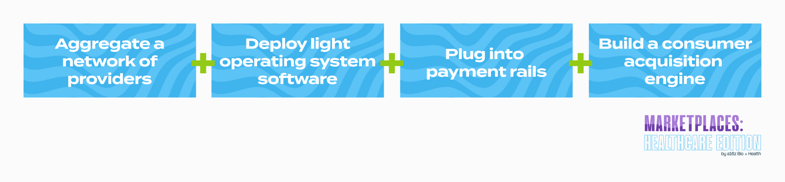
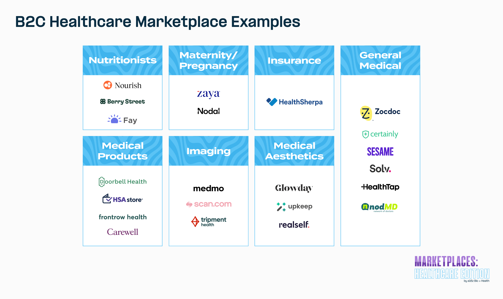

  

At a16z, marketplaces represent one of our favorite business models. Our annual [Marketplace 100](https://a16z.com/marketplace-100/) provides insight into the latest consumer marketplace trends across industries.  

在a16z，市场平台代表了我们最喜欢的商业模式之一。我们的年度市场100强提供了对各行业最新消费市场趋势的洞察力。

But we on the healthcare team have long lamented: why are there so few scaled consumer marketplace businesses in healthcare?  

但我们医疗保健团队长期以来一直感叹：为什么医疗保健领域的规模化消费者市场业务如此之少？  

There were four on the Marketplace 100 list this year (a record!)…but healthcare represents on average [12%](https://www.kff.org/health-costs/press-release/interactive-calculator-estimates-both-direct-and-hidden-household-spending/#:~:text=The%20typical%20non%2Delderly%20family,of%20insurance%2C%20and%20health%20status.) of [household spend](https://www.bankrate.com/banking/savings/average-household-budget/). So shouldn’t we have more consumer health companies on this list?  

今年的市场100强名单上有四家公司（创纪录！）......但医疗保健平均占家庭支出的12%。因此，我们不应该有更多的消费者健康公司在这个名单上吗？

Interestingly, all four healthcare marketplaces on the list focus on finding therapists. In fact, mental health was the fastest growing category by increase in spend on this year’s Marketplace 100. We thought we’d double click on this to understand: a) why mental health has emerged as a viable consumer marketplace category; and b) what other categories of healthcare may be conducive to big consumer marketplaces.  

有趣的是，名单上的所有四个医疗保健市场都专注于寻找治疗师。事实上，在今年的市场100强中，心理健康是支出增长最快的类别。我们认为我们应该双击这一点，以了解：a）为什么心理健康已经成为一个可行的消费者市场类别；以及b）还有哪些医疗保健类别可能有利于大型消费者市场。

## The healthcare industry’s laws of physics  

医疗保健行业的物理定律

First it’s worth unpacking why marketplaces might be harder to build and scale in healthcare than in other industries.  

首先，值得解读的是，为什么市场平台在医疗保健领域可能比在其他行业更难建立和扩大。  

We often talk about the unique “laws of physics” of healthcare, which certainly apply here. These include:  

我们经常谈论医疗保健的独特 "物理定律"，这当然适用于此。这些规律包括：

-   The three-sided nature of healthcare (patient, provider, payor), and the related difficulty of integrating comprehensively with insurance across multiple carriers and provider networks  
    
    医疗保健的三面性（病人、提供者、支付者），以及在多个运营商和提供者网络中与保险全面整合的相关困难。
-   The lack of price and scheduling transparency, and the unwillingness of a broad enough set of providers to publish prices and real-time appointment availability for all of their services  
    
    价格和时间安排缺乏透明度，而且有足够多的供应商不愿意公布其所有服务的价格和实时预约情况。
-   The infrequent use of healthcare for the majority of consumers, making it harder to have LTV to justify the CAC  
    
    大多数消费者不经常使用医疗服务，因此很难有LTV来证明CAC的合理性。
-   Challenges around qualification of customers, given the inherent information asymmetry between consumers and providers in terms of exactly what diagnosis a consumer might have, and therefore, what specific service they might need  
    
    围绕客户资格的挑战，因为消费者和供应商之间在消费者可能有的确切诊断方面存在固有的信息不对称，因此，他们可能需要什么样的具体服务。
-   Relatedly, the importance of referral behavior between providers, which can even be a requirement for insurance reimbursement; this can make the provider discovery problem less relevant in some specialties  
    
    与此相关的是，医疗机构之间转诊行为的重要性，这甚至可能是保险报销的要求；这可能使医疗机构的发现问题在某些专科中不那么重要。

Robust marketplaces match high volume consumer demand with dedicated supply, giving both sides the ability to transact in a self-service manner.  

强大的市场平台将大量的消费者需求与专门的供应相匹配，使双方都有能力以自我服务的方式进行交易。  

But thus far, we’ve seen more “middleman” models in healthcare–where an intermediary helps match supply and demand, but without true self-service transactions.  

但到目前为止，我们在医疗保健领域看到了更多的 "中间人 "模式--中介机构帮助匹配供应和需求，但没有真正的自我服务交易。

Health insurance is an example of this.  

健康保险就是这方面的一个例子。  

Insurance carriers maintain proprietary networks of providers with pre-contracted rates–but they do little to help consumers actually find the right provider, book appointments with them, and pay them for their services.  

保险公司保持着专有的医疗服务提供者网络，并有预先签约的费率，但他们很少帮助消费者真正找到合适的医疗服务提供者，与他们预约，并为他们的服务付费。

## So what is it about mental health?  

那么，关于心理健康是什么呢？

All four companies that made the Marketplace 100 list–Headway, Alma, Sondermind, and Path–are helping mental health professionals take insurance, and connecting them to consumers who need their services.  

进入市场100强名单的所有四家公司--Headway、Alma、Sondermind和Path--都在帮助心理健康专业人士购买保险，并将他们与需要他们服务的消费者联系起来。

Most mental health providers historically have not accepted insurance.  

大多数心理健康服务提供者在历史上都不接受保险。  

They’re often solo practitioners who don’t have the bandwidth to contract with each insurance company, and basic insurance contracts pay less than the provider could make by charging consumers directly.  

他们通常是独行侠，没有足够的带宽与每家保险公司签订合同，而基本的保险合同支付的费用低于医疗机构直接向消费者收费的费用。

New mental health marketplace companies propose to handle the complex logistics around insurance contracting and billing, and negotiate better payment rates than providers could get on their own.  

新的心理健康市场公司建议处理与保险合同和账单有关的复杂后勤工作，并与供应商谈判，以获得比他们自己能得到的更好的支付率。  

On the backend, these marketplaces are structured as MSOs (Managed Service Organizations) that deal with the logistics of insurance and other back office support services.  

在后台，这些市场平台的结构是MSO（管理服务组织），处理保险的物流和其他后台支持服务。

In mental health, the drivers of successful growth have been:  

在心理健康方面，成功增长的驱动力是：

-   Very high consumer demand driven by increased incidence of mental health issues during Covid, and the cultural destigmatization of therapy  
    
    由于科维德期间心理健康问题的发生率增加，以及文化上对治疗的轻视，消费者的需求非常高。
-   Widespread adoption of telehealth, propelled by both necessity during the pandemic, and favorable regulatory changes  
    
    在大流行病期间的必要性和有利的监管变化的推动下，远程医疗得到广泛的采用。
-   A historical dearth of therapists who take insurance, which has resulted in…  
    
    历史上缺乏接受保险的治疗师，这导致了...
-   …insurance companies that are desperate to expand their mental health provider networks, and are therefore willing to pay competitive rates to platforms that can expand their network coverage  
    
    ......保险公司急于扩大他们的心理健康提供者网络，因此愿意向能够扩大其网络覆盖面的平台支付有竞争力的价格。

The key element that makes these marketplaces work is the fact that they offer deep supply-side services that benefit both the provider (by diversifying their revenue stream beyond cash pay clients) and consumer (reduces out-of-pocket costs per appointment).  

使这些市场运作的关键因素是，它们提供深入的供应方服务，使提供者（通过使他们的收入来源多样化，而不是现金支付的客户）和消费者（减少每次预约的自费费用）都受益。

In a space where the consumer matches with one provider whom they see repeatedly, there is increased risk of disintermediation, absent any other reasons to stay with the marketplace platform.  

在一个空间里，消费者与他们反复看到的一个供应商相匹配，在没有任何其他理由留在市场平台上的情况下，脱媒的风险会增加。  

But in the case of mental health, the therapist and consumer are unlikely to cut out the platform because that would mean losing the ability to get insurance coverage, as the insurance contracting, billing, and payment operations are managed by the marketplace companies.  

但就心理健康而言，治疗师和消费者不太可能切断平台，因为这意味着失去获得保险的能力，因为保险合同、账单和支付业务由市场公司管理。

There’s also a network effect that drives stickiness; as the marketplace onboards more supply (and therefore demand), they can contract with more insurance carriers and negotiate better rates with them–making the platform more compelling for all sides.  

还有一个网络效应，推动了粘性；随着市场上更多的供应（和因此的需求），他们可以与更多的保险公司签约，并与他们谈判更好的费率，使平台对各方都更有吸引力。

## What will make other consumer healthcare marketplaces thrive?  

什么会使其他消费者医疗保健市场蓬勃发展？

The mental health market naturally exhibits many of the conditions that we believe will drive successful consumer healthcare marketplaces.  

心理健康市场自然表现出许多条件，我们相信这些条件将推动消费保健市场的成功。  

Those include the following (note that not all are needed for success):  

这些包括以下内容（注意不是所有的成功都需要）：

On the execution side, the following playbook for building a marketplace has worked in mental health, and we believe it can be replicated in other specialties:  

在执行方面，以下建立市场的游戏规则在心理健康领域已经奏效，我们相信它可以在其他专业领域得到复制：

1.  **Aggregating a network of providers:** This can be accomplished by providing value-added services that hit a key pain point for the providers, and by offering a network effect benefit that could otherwise not be achieved without being part of a marketplace.  
    
    聚集一个供应商网络：这可以通过提供增值服务来实现，这些服务可以击中供应商的关键痛点，并提供网络效应的好处，否则，如果不成为市场的一部分就无法实现。
2.  **Deploying light “operating system” software:** Marketplaces can provide software tools to providers and consumers that assist with things like scheduling, virtual visits, communications, referrals, and clinical data collection.  
    
    部署轻型 "操作系统 "软件：市场平台可以向供应商和消费者提供软件工具，协助安排时间、虚拟访问、通信、转诊和临床数据收集等工作。
3.  **Plugging into payment rails:** This includes payor network contracting and credentialing, negotiating strong rates that could include capitation or bundles, processing claims and payment collection, or offering financing plans for the demand and/or the supply side.  
    
    融入支付轨道：这包括支付方网络的签约和认证，谈判强有力的费率，可能包括按人头计算或捆绑，处理索赔和付款收集，或为需求方和/或供应方提供融资计划。
4.  **Building a consumer acquisition engine:** This can be done through advertising, building a referral network, or creating a strong consumer-facing experience that organically attracts demand-side users.  
    
    建立一个消费者获取引擎：这可以通过广告、建立一个推荐网络或创造一个强大的面向消费者的体验来有机地吸引需求方的用户来实现。

These frameworks can also be applied to medical products. We’ve seen a few consumer healthcare marketplaces that are aimed at specific product verticals with fairly high repeat behavior, like in the [senior care items space](https://www.carewell.com/), and for over-the-counter health and wellness products that qualify as [HSA expenditures](https://hsastore.com/). Marketplaces can work well here when physical inventory is distributed across a wider set of suppliers, which makes it more difficult for one seller to hold and offer a wide SKU mix alone.  

这些框架也可以应用于医疗产品。我们已经看到了一些消费者医疗保健市场，它们针对的是具有相当高重复行为的特定产品垂直领域，比如在老年护理项目领域，以及符合HSA支出条件的非处方健康和保健产品。当实体库存分布在更多的供应商中时，市场平台可以在这里很好地发挥作用，这使得一个卖家更难单独持有和提供广泛的SKU组合。  

This also often implies that the inventory is specialized (non-commodity items), so the marketplace can help aggregate and even provide additional fulfillment services, such as expanding the supplier’s shipping range or helping them activate automatic reorders.  

这也往往意味着库存是专门的（非商品项目），所以市场可以帮助汇总，甚至提供额外的履行服务，如扩大供应商的运输范围或帮助他们激活自动再订购。

We see consumer healthcare marketplaces as directly matching supply and demand in a way that the provider primarily owns the patient relationship.  

我们认为消费者医疗保健市场是直接匹配供应和需求的方式，供应商主要拥有病人关系。  

This means we’ve excluded platforms where the patient onboards to and pays for the service, and then is matched with or is able to select a provider after the fact.  

这意味着我们已经排除了病人上船并支付服务费用，然后在事后被匹配或能够选择供应商的平台。

## Learnings from consumer marketplaces  

从消费者市场学习的经验

A number of lessons from general consumer marketplaces apply to healthcare. Perhaps the most important is how to get both the demand and supply sides excited about participating in a marketplace.  

一般消费者市场的一些经验适用于医疗保健。也许最重要的是如何让需求方和供应方都对参与市场感到兴奋。

Patients are worried about adverse selection, and may believe the best providers wouldn’t participate in a marketplace.  

病人担心逆向选择，并可能认为最好的供应商不会参与市场。  

And providers may feel they don’t need the additional demand, or are concerned about the quality of patient “leads” they’d be getting.  

而供应商可能觉得他们不需要额外的需求，或者担心他们会得到的病人 "线索 "的质量。  

We see three potential solutions here that might unlock a successful marketplace model, depending on the dynamics of the specific category.  

我们在这里看到三个潜在的解决方案，可能会开启一个成功的市场模式，这取决于具体类别的动态。

### **Category type #1  

分类类型#1**

Quality of supply matters up to a certain standard. No healthcare marketplace has quite the same dynamics as a platform like Uber, where supply has been essentially commoditized.  

在一定的标准下，供应的质量很重要。没有一个医疗市场的动态与Uber这样的平台完全相同，在那里，供应基本上已经商品化了。  

Beyond a base level of safety and reliability, the quality of the driver is somewhat marginal in terms of passenger experience–ETA and price matter more.  

除了基本的安全性和可靠性，司机的质量在乘客体验方面有些微不足道--ETA和价格更重要。

However, there are likely some healthcare categories that live close to this end of the spectrum, where patients are looking for a provider that is qualified enough to solve their problem, but the difference in experience between the median provider and the 90th percentile provider is less stark.  

然而，很可能有一些医疗类别接近这一端，病人正在寻找一个有足够资格解决他们问题的医疗服务提供者，但中位数医疗服务提供者和第90百分位数医疗服务提供者之间的经验差异并不明显。  

Lab tests and urgent care might fall into this bucket.  

实验室测试和紧急护理可能属于这一桶。  

It’s important to have these services done in a safe and certified environment, but beyond that, availability, location, and cost likely matter more to the patient.  

在一个安全和经过认证的环境中进行这些服务是很重要的，但除此之外，可用性、地点和成本可能对病人更重要。

In these scenarios, a marketplace’s role is to show the demand side that the supply meets that basic qualification bar, and offer transparent availability and pricing information.  

在这些情况下，市场的作用是向需求方展示供应符合基本资格标准，并提供透明的可用性和价格信息。  

Uber background checks their drivers and displays a driver’s rating and number of trips completed to the passenger.  

Uber对他们的司机进行背景调查，并向乘客显示司机的评级和完成的旅行次数。  

For a healthcare marketplace, this will likely involve confirming credentials, but also might involve displaying reviews from patients, average wait times, and percentage of fulfilled appointments.  

对于一个医疗市场来说，这可能涉及到确认证书，但也可能涉及到显示病人的评论、平均等待时间和完成预约的百分比。

### **Category type #2  

分类类型#2**

Quality of supply is paramount–and these suppliers can be brought online.  

供应的质量是最重要的，而且这些供应商可以被带到网上。  

In some categories, having the best provider does matter, as the marginal difference between the median and 90th percentile provider is much larger.  

在某些类别中，拥有最好的提供者确实很重要，因为中位数和第90百分位数的提供者之间的边际差异要大得多。  

And getting these best providers to list themselves online is much more achievable than it might initially appear, because the service selection motion is highly elective, or consumer-driven, versus physician referral-driven.  

让这些最好的供应商在网上列出他们自己，比最初看起来更容易实现，因为服务选择运动是高度选择性的，或者说是消费者驱动的，而不是医生推荐驱动的。  

An example would be certain elective surgical procedures, like hip replacements or cosmetic surgery; mental health therapy falls into this category as well.  

一个例子是某些选择性的外科手术，如髋关节置换或整容手术；心理健康治疗也属于这一类别。

The challenge, then, is to convince patients of their quality.  

那么，面临的挑战是如何说服病人相信它们的质量。  

On traditional consumer marketplaces, quality is often conveyed in three ways: (1) objective data, (2) subjective reviews, and (3) the platform’s own (sometimes manual) credentialing of the top sellers.  

在传统的消费市场上，质量通常通过三种方式来传达：（1）客观数据，（2）主观评论，以及（3）平台自身（有时是人工）对顶级卖家的认证。  

A classic example is Airbnb.  

一个典型的例子是Airbnb。  

A seller’s profile typically includes their response rate and response time (objective data), feedback from past guests (subjective reviews), and, if they qualify for it, the “stamp” of being an Airbnb Plus host who meets extra criteria and quality bars (the platform’s own credentialing).  

卖家的资料通常包括他们的回应率和回应时间（客观数据）、过去客人的反馈（主观评价），如果他们有资格的话，还包括符合额外标准和质量标准的Airbnb Plus房东的 "印章"（该平台自己的认证）。

For healthcare marketplaces, this might include things like special qualifications, reviews or testimonials from other doctors they’ve worked with, or the platform’s own assessment of the provider’s procedure volume and quality of outcomes.  

对于医疗市场来说，这可能包括诸如特殊资质、他们合作过的其他医生的评论或推荐，或平台自己对提供者的手术量和结果质量的评估。  

For recurring services such as therapy, objective data could include benchmarking around the percentage of patients who rebook or retain with the provider (over a reasonable time period).  

对于经常性的服务，如治疗，客观数据可以包括围绕重新预订或保留在医疗机构的病人的百分比（在一个合理的时间段内）的基准。

### Category type #3  

分类类型#3

Quality of supply is paramount–but these suppliers are reluctant to come online.  

供应质量是最重要的，但这些供应商不愿意上线。  

In this last category, quality of supply is also crucial, but quality suppliers are less likely to want to join a marketplace.  

在这最后一类中，供应质量也很关键，但优质供应商不太可能愿意加入市场。  

This can be for a few reasons, some of which are more “fixable” than others:  

这可能有几个原因，其中一些原因比其他原因更 "容易解决"：

#### **Lack of demand generation need  

缺少创造需求的需要**

Some providers are consistently overwhelmed with demand–and they will likely be the hardest to get onboard a new marketplace.  

一些供应商一直被需求压得喘不过气来，他们可能是最难加入新市场的。  

One wedge is to approach them with SaaS tools to manage their practice (scheduling, automating follow-ups, procurement) or financial services (factoring, BNPL) that can improve their existing business.  

一个楔子是用SaaS工具接近他们，以管理他们的业务（日程安排、自动跟进、采购）或金融服务（保理、BNPL），可以改善他们的现有业务。

Over time, a marketplace may be able to “drip” in new patient leads that they source once they are already embedded in the provider’s practice workflows.  

随着时间的推移，市场可能能够 "滴 "入新的病人线索，一旦他们已经嵌入到提供者的实践工作流程中。

#### **Brand perception**

Some high-quality suppliers may be reluctant to list on marketplaces as it feels like a negative stamp on their brand, especially if they are displayed alongside what they perceive to be lower quality providers.  

一些高质量的供应商可能不愿意在市场上挂牌，因为这感觉像是给他们的品牌打上了负面的印记，特别是如果他们与他们认为的低质量的供应商摆在一起。  

An example of this in traditional marketplaces is Amazon, which many premium brands have historically avoided.  

传统市场上的一个例子是亚马逊，许多高端品牌历来都避开了这个市场。

In these cases, it almost always comes down to the branding and curation standards of the marketplace itself. Can the marketplace commit to vetting and onboarding only the best providers?  

在这些情况下，它几乎总是归结为市场本身的品牌和策划标准。市场能否承诺只审查和录用最好的供应商？  

If so, there are ways to give providers confidence around this? One example is only onboarding new supply (especially in the early days) via referrals from providers who are already in the network.  

如果是这样，有什么方法可以让提供者对此有信心？一个例子是只通过已经在网络中的医疗服务提供者的推荐来接纳新的供应（特别是在早期）。

#### **Concerns around demand quality  

围绕需求质量的关注**

Some providers may be concerned that a marketplace will provide them with lower quality leads, or leads who no-show.  

一些供应商可能担心市场会给他们提供质量较低的线索，或不出现的线索。  

From the consumer marketplace world, an example of this is high-end sneaker merchants experiencing fraud on the buyer side of eBay, as described in the [Marketplace 100 podcast](https://a16z.simplecast.com/episodes/marketplace-100-2023-6njvE8Hi). These merchants would successfully ship an order–but then get chargebacks on (fake) claims that the sneakers were knockoffs!  

在消费市场领域，一个例子是高端运动鞋商家在eBay的买家端遭遇欺诈，正如Marketplace 100播客中描述的那样。这些商家会成功发送订单--但随后就会收到关于运动鞋是山寨货的（虚假）退款！这就是所谓的欺诈！

A version of this in healthcare has to do with information asymmetry–consumers may not know exactly what kind of doctor or service they need for their condition, and end up booking with the wrong type of doctor, thus wasting a visit (and, potentially, fees) while needing to rebook with a different provider.  

在医疗保健领域，这种情况的一个版本与信息不对称有关--消费者可能不知道他们的病情到底需要什么样的医生或服务，最终预订了错误的医生类型，从而浪费了一次访问（以及可能的费用），同时需要重新预订不同的提供者。  

A marketplace can add value here via “vetting” demand, either manually (ex. a quick call with the prospective patient) or in an automated way (ex. a self-service triage app).  

市场可以通过 "审查 "需求来增加价值，可以是手动的（例如，与潜在的病人快速通话），也可以是自动的（例如，自助服务分流应用程序）。

There are likely other supplier protections to be built specifically for healthcare, similar to what StockX did for sneakers in inspecting each pair themselves.  

很可能还有其他的供应商保护措施要专门为医疗保健而建立，类似于StockX为运动鞋所做的那样，自己检查每双鞋。  

This might include not charging the provider for leads that end up needing to be referred elsewhere.  

这可能包括不向供应商收取最终需要转到其他地方的线索。  

Marketplaces could also implement no-show fees to discourage that behavior on the consumer side, as well as features that notify consumers with future appointments who may want to take a sooner slot that gets canceled, so that the provider’s schedule stays dense and productive.  

市场平台还可以实施不露面的费用，以阻止消费者方面的行为，以及通知有未来预约的消费者，他们可能想采取较早的插槽被取消的功能，使供应商的时间表保持密集和生产。

## Conclusion

We strongly believe there is a [trillion dollar opportunity in becoming the front door to healthcare](https://a16z.com/2022/12/06/consumer-health-areas-of-opportunity/)—**the** marketplace where consumers go to find and book appointments across multiple conditions and specialties, buy the lowest cost drugs, and even shop for insurance.  

我们坚信，成为医疗保健的前门有一万亿美元的机会--消费者在这里寻找和预约多种疾病和专科的治疗，购买最低成本的药物，甚至购买保险。  

We’re optimistic that upstarts with the characteristics described above could break out and achieve this in a way that mirrors the success of those that have landed on Marketplace 100. We look forward to seeing more than 4 consumer healthcare marketplaces on the list in the years to come!  

我们乐观地认为，具有上述特点的新兴企业可以突围而出，并以反映那些已经登陆市场100强的成功的方式实现这一目标。我们期待着在未来几年看到超过4个消费者医疗保健市场上榜!

\*\*\*

_The views expressed here are those of the individual AH Capital Management, L.L.C. (“a16z”) personnel quoted and are not the views of a16z or its affiliates.  

Certain information contained in here has been obtained from third-party sources, including from portfolio companies of funds managed by a16z.  

While taken from sources believed to be reliable, a16z has not independently verified such information and makes no representations about the enduring accuracy of the information or its appropriateness for a given situation.  

In addition, this content may include third-party advertisements; a16z has not reviewed such advertisements and does not endorse any advertising content contained therein.  

这里所表达的观点是AH Capital Management, L.L.C.（"a16z"）人员个人的观点，而不是a16z或其关联公司的观点。这里包含的某些信息是从第三方来源获得的，包括来自a16z管理的基金的投资组合公司。虽然取自被认为是可靠的来源，但a16z并没有独立核实这些信息，也不对信息的持久准确性或其对特定情况的适当性做出任何陈述。此外，这些内容可能包括第三方广告；a16z没有审查这些广告，也不认可其中的任何广告内容。_

_This content is provided for informational purposes only, and should not be relied upon as legal, business, investment, or tax advice. You should consult your own advisers as to those matters.  

References to any securities or digital assets are for illustrative purposes only, and do not constitute an investment recommendation or offer to provide investment advisory services.  

Furthermore, this content is not directed at nor intended for use by any investors or prospective investors, and may not under any circumstances be relied upon when making a decision to invest in any fund managed by a16z. (An offering to invest in an a16z fund will be made only by the private placement memorandum, subscription agreement, and other relevant documentation of any such fund and should be read in their entirety.) Any investments or portfolio companies mentioned, referred to, or described are not representative of all investments in vehicles managed by a16z, and there can be no assurance that the investments will be profitable or that other investments made in the future will have similar characteristics or results.  

A list of investments made by funds managed by Andreessen Horowitz (excluding investments for which the issuer has not provided permission for a16z to disclose publicly as well as unannounced investments in publicly traded digital assets) is available at https://a16z.com/investments/.  

本内容仅用于提供信息，不应作为法律、商业、投资或税务建议来依赖。你应该就这些问题咨询你自己的顾问。对任何证券或数字资产的提及仅用于说明目的，并不构成投资建议或提供投资咨询服务的提议。此外，这些内容不针对也不打算供任何投资者或潜在投资者使用，在任何情况下，在作出投资于a16z管理的任何基金的决定时，不得依赖这些内容。 (投资于A16Z基金的要约将仅由任何此类基金的私募备忘录、认购协议和其他相关文件作出，并应阅读其全部内容）。所提到、提及或描述的任何投资或投资组合公司并不代表a16z管理的所有投资，而且不能保证这些投资将是有利可图的，也不能保证未来进行的其他投资将有类似的特点或结果。Andreessen Horowitz管理的基金所做的投资清单（不包括发行人未允许a16z公开披露的投资以及未公布的公开交易的数字资产投资）可在https://a16z.com/investments/。_

_Charts and graphs provided within are for informational purposes solely and should not be relied upon when making any investment decision. Past performance is not indicative of future results.  

The content speaks only as of the date indicated.  

Any projections, estimates, forecasts, targets, prospects, and/or opinions expressed in these materials are subject to change without notice and may differ or be contrary to opinions expressed by others.  

Please see https://a16z.com/disclosures for additional important information.  

其中提供的图表仅用于提供信息，在做出任何投资决定时不应依赖这些图表。过去的业绩并不代表未来的结果。这些内容只代表截至所示日期的情况。这些材料中表达的任何预测、估计、预报、目标、前景和/或意见都可能在没有通知的情况下发生变化，并可能与其他人表达的意见不同或相反。其他重要信息请见https://a16z.com/disclosures。_
