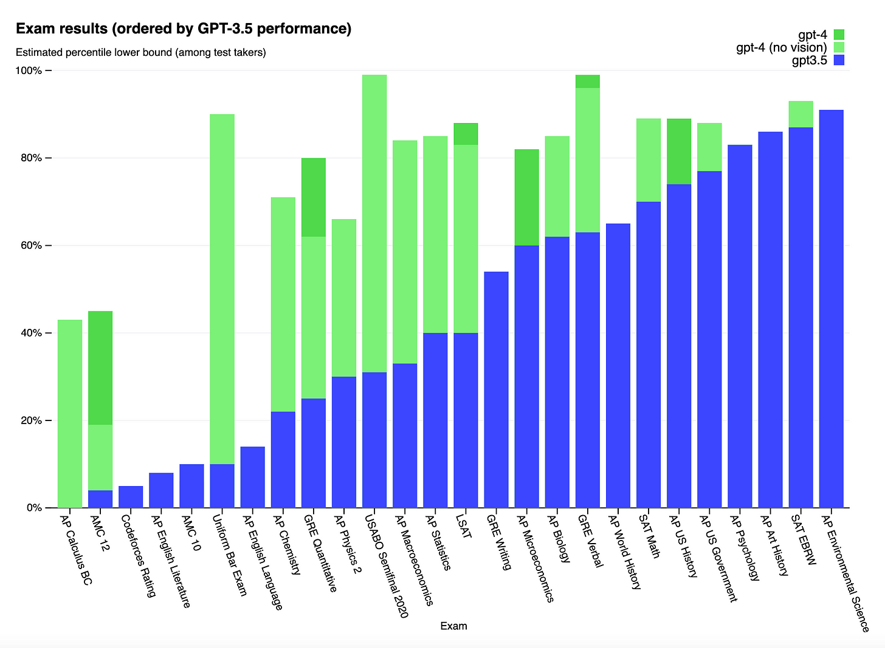

In a matter of months, a new type of artificial intelligence (AI) has gone from a fun toy to beating humans at many tasks:  

在短短几个月内，一种新型的人工智能（AI）已经从一个有趣的玩具变成了在许多任务中击败人类：

This graph shows the improvement in performance of the recently released GPT-4. These are percentiles of humans, so when this shows that GPT-4 passes the bar at the 90 percent percentile, it means it’s better than 90% of candidates!  

You can see in blue the ability of GPT-3.5, and in green the improvement of GPT-4 on top of that. In just 6 months! [Source](https://openai.com/research/gpt-4).  

这张图显示了最近发布的GPT-4的性能改进。这些是人类的百分位数，所以当这显示GPT-4在90%的百分位数上通过时，这意味着它比90%的考生都要好！！你可以看到蓝色的是GPT-3.5的能力，而绿色的是GPT-4在此基础上的改进。在短短6个月内! 来源.

Naturally, many people fear for their job. But this fear is not new. It’s been here since the Industrial Revolution. Ten years ago, Frey and Osborne rekindled it when [they claimed](https://www.oxfordmartin.ox.ac.uk/downloads/academic/future-of-employment.pdf) that nearly half of jobs were at risk of automation. In the last few months, this fear has exploded with the arrival of AIs like those of ChatGPT. [New papers](https://deliverypdf.ssrn.com/delivery.php?ID=098115008081070094091116072104019090008027046078024071069076074124100103011120081118041001120035023028110097004089069028015069029091024062067114081104117067075093064035047007090104085122099090001002028124031116028093087105024027019026064013116005085&EXT=pdf&INDEX=TRUE) [suggest](https://arxiv.org/pdf/2303.10130.pdf) that these technologies spell danger for telemarketers, teachers, lawyers, psychologists, mathematicians, accountants, proofreaders, assistants…  

自然，许多人担心他们的工作。但这种恐惧并不新鲜。自工业革命以来，它就一直存在。十年前，弗雷和奥斯本声称近一半的工作面临着自动化的风险，重新点燃了这种恐惧。在过去的几个月里，这种恐惧随着像ChatGPT这样的人工智能的到来而爆发出来。 新的论文表明，这些技术对电话销售员、教师、律师、心理学家、数学家、会计师、校对员、助理等都意味着危险。

Which jobs are really going to suffer? How can we know?  

哪些工作真的会受到影响？我们怎么能知道呢？

Cristiano Ronaldo makes 100 times more money than Pelé did in his prime. This dynamic is at the core of automation. If you understand it, you’ll know when to expect an AI to take your job.  

克里斯蒂亚诺-罗纳尔多赚的钱比佩莱在他的黄金时期多100倍。这种动态是自动化的核心。如果你了解它，你就会知道什么时候会有人工智能来抢你的工作。

In this article, we’ll cover:  

在这篇文章中，我们将介绍：

1.  What jobs will disappear  
    
    哪些工作将消失
    
2.  Which ones will grow  
    
    哪些人将会成长
    
3.  How you can deduce it for yourself (TL;DR: it depends on the speed of demand saturation)  
    
    你可以如何自己推断（TL;DR：这取决于需求饱和的速度。）
    

In the next articles I’ll cover:  

在接下来的文章中，我将介绍：

4.  How fast it will it happen (TL;DR: very)  
    
    它将以多快的速度发生（TL;DR：非常）。
    
5.  Why we haven’t been able to see the impact of automation in the economic statistics yet  
    
    为什么我们还没能在经济统计中看到自动化的影响？
    

Let’s go!  

我们走吧!

When computers appeared, followed by spreadsheets, accountants feared for their livelihoods. Then this happened:  

当计算机出现时，接着是电子表格，会计师们担心他们的生计。然后发生了这件事：

_Say what?_ Anybody can use Excel! And yet the number of accountants as a share of the population has increased by over 2x in 50 years?!  

说什么？任何人都可以使用Excel!然而，会计人员的数量占人口的比例在50年内增加了2倍以上！？

Meanwhile, this has been the evolution of farmers in the US:  

同时，这也是美国农民的演变过程：

We interviewed horses, and this is what they had to say:  

我们采访了马匹，这就是他们要说的：

And then this happened:  

然后发生了这件事：

_This is just farm horses, but they accounted for the vast majority of horses. We can see a [similar pattern in Europe](https://www.mdpi.com/2076-2615/10/1/106). The nail in the coffin for horses was cars. We’ll see later why the number of horses grew so much in the 19th century.  

这只是农场马，但它们占了马匹的绝大部分。我们可以在欧洲看到类似的模式。钉在马匹棺材上的钉子是汽车。我们以后会看到为什么马的数量在19世纪会有如此大的增长。_

How can we tell which jobs will be like accountants (they increase with automation) and which jobs will suffer the fate of farmers and horses?  

我们如何判断哪些工作会像会计师一样（他们会随着自动化而增加），哪些工作会遭受农夫和马匹的命运？

According to _[Automation and jobs: when technology boosts employment](https://academic.oup.com/economicpolicy/article-abstract/34/100/589/5709812?redirectedFrom=fulltext)_, this is the history of employment between 1800 and 2000 in three US industries:  

根据《自动化和就业：当技术促进就业》，这是1800年至2000年期间美国三个行业的就业历史：

_Source: Automation and Jobs: When Technology Boosts Employment, Bessen 2019  

来源：《中国新闻周刊》：自动化与就业：当技术促进就业，贝森2019年_

The first two jobs, textile and iron/steel workers, grew for nearly a century, and then dropped.  

Meanwhile, in vehicle manufacturing—which started much later—workers grew fast until the 1950s, but have decreased slowly since  

前两种工作，即纺织和钢铁工人，增长了近一个世纪，然后下降。同时，在汽车制造业--开始得更晚--工人们在20世纪50年代之前增长迅速，但自此以后缓慢下降。

. Why? 

Let’s look at the improvement in productivity:  

让我们来看看生产力的提高：

_Source: Automation and Jobs: When Technology Boosts Employment, Bessen 2019  

来源：《中国新闻周刊》：自动化与就业：当技术促进就业，贝森2019年_

We can see the productivity of workers just kept increasing consistently across all three industries. Notice these are logarithmic graphs, which really means productivity grew exponentially.  

我们可以看到，工人的生产力只是在所有三个行业中不断持续增长。注意这些是对数图，这实际上意味着生产力是以指数形式增长的。  

This is the power of technology.  

这就是技术的力量。

The message of both sets of graphs together is that early on, both employment and productivity of these workers grow. Numbers of employees grow linearly, and their productivity grows exponentially.  

这两组图的信息是，在早期，这些工人的就业和生产力都在增长。雇员的数量呈线性增长，而他们的生产力则呈指数级增长。

Now let’s project that into the future: What do you think happens if you’re employing more people who’re more productive? You will end up flooding the market.  

现在，让我们把它投射到未来：你认为如果你雇用更多的人，而这些人的生产力更高，会发生什么？你最终会淹没在市场中。  

This causes tougher and tougher competition, which translates into higher quality and lower prices.  

这造成了越来越激烈的竞争，从而转化为更高的质量和更低的价格。  

This means demand keeps growing until the quantity and prices are so good that increasing them won’t make a massive difference anymore. It tapers out.  

这意味着需求不断增长，直到数量和价格都非常好，增加它们不会再有巨大的差异。它渐渐消失了。

_Source: Automation and Jobs: When Technology Boosts Employment, Bessen 2019  

来源：《中国新闻周刊》：自动化与就业：当技术促进就业，贝森2019年_

This graph shows productivity in the horizontal axis and demand in the vertical axis. Look what happened here: As productivity increased, demand initially followed. But after some time, it plateaued.   

这张图的横轴是生产力，纵轴是需求。看看这里发生了什么：随着生产力的提高，需求最初也跟着提高。但在一段时间后，它趋于平稳。

If you focus for example on the textile workers, automation dramatically reduced the cost of producing clothing.  

例如，如果你专注于纺织工人，自动化大大降低了生产服装的成本。  

Early on, workers needed many days to produce a piece of clothing, so they were very expensive and most people couldn’t afford them.  

早期，工人需要很多天来生产一件衣服，所以它们非常昂贵，大多数人买不起。  

As automation reduced the human time needed to produce a piece of clothing, the cost dropped, and the price dropped too.  

随着自动化减少了生产一件衣服所需的人力时间，成本下降，价格也随之下降。  

People could suddenly buy many more articles of clothing, which they did, and the overall demand increased so much that the industry employed more workers.  

人们突然可以购买更多的衣服，他们也这样做了，总体需求大大增加，该行业雇用了更多的工人。

For example, if early on it took 10 work days to make a piece, and after automation it takes only three days, the labor cost has dropped by 70%, and the overall cost might have dropped by 50%.  

If there’s competition, the price will follow the cost. At a 50% cheaper price, customers might buy _four_ times as many pieces, spending more overall, and the number of workers needed would have increased by 20%.  

例如，如果早期做一件东西需要10个工作日，而自动化之后只需要3天，那么劳动力成本就下降了70%，总体成本可能下降了50%。如果有竞争，价格就会跟着成本变化。在价格便宜50%的情况下，客户可能会购买四倍的作品，总体上花费更多，而需要的工人数量会增加20%。

Generalizing, this is the story:   

概括地说，这是一个故事：

1.  Automation arrives and increases productivity by eliminating some human tasks (=lower labor costs).  
    
    自动化的到来，通过消除一些人类任务来提高生产力（=降低劳动力成本）。
    
2.  This reduces the cost of the product.  
    
    这降低了产品的成本。
    
3.  If there is competition, this increases quality and reduces prices.   
    
    如果有竞争，这就会提高质量，降低价格。
    
4.  Demand soars.
    
5.  This increase in demand creates so much more work that  
    
    这种需求的增加创造了如此多的工作，以至于
    
    companies need to hire people to do the tasks that are not yet automated.   
    
    公司需要雇用人员来完成尚未自动化的任务。
6.  But at some point, this improvement in quality and price saturates demand. People don’t want more products. They stop buying much more.  
    
    但在某些时候，这种质量和价格的改善使需求饱和。人们不想要更多的产品了。他们停止购买更多的产品。
    
7.  But productivity keeps improving. More and more tasks are automated, but the volume of sales doesn’t grow as much.  
    
    但生产力不断提高。越来越多的任务被自动化，但销售量却没有那么大的增长。
    
8.  Employment drops.
    

This explains why lots of agricultural jobs disappeared—and the horses: People prioritize food.  

这解释了为什么很多农业工作消失了--以及马匹的消失：人们把食物放在首位。  

If you increase productivity, you’ll produce more food, and people will buy a bit more if they just couldn’t afford it before. But once their hunger is covered, they don’t want more quantity.  

如果你提高生产力，你会生产更多的食物，如果人们以前只是买不起，他们会多买一点。但是一旦他们的饥饿感得到满足，他们就不想要更多的数量了。  

They want more quality. This can only create so much more work. You won’t buy 30 avocados because they’re 30 times cheaper.  

他们想要更多的质量。这只能创造这么多的工作。你不会因为鳄梨便宜30倍而买30个鳄梨。

Meanwhile, accounting is surprisingly useful!  

同时，会计工作出人意料地有用！这也是我的工作！  

The more you can understand what your money does, the better you can manage it, communicate about it better, optimize expenses… Automation has eliminated the more menial tasks, freeing accountants to do more interesting and useful tasks, creating more value that customers are happy to pay for.    

你越能理解你的钱是做什么的，你就能更好地管理它，更好地沟通它，优化支出......自动化消除了更多琐碎的任务，使会计人员能够做更多有趣和有用的任务，创造更多客户乐意支付的价值。

At least until now.  

至少到现在为止。

_What will happen with accountants as their productivity keeps improving? Will they taper latent demand?  

Will AIs answer most accounting questions, reserving the very hardest parts of the job for the most elite accountants?  

随着会计人员的生产力不断提高，他们会发生什么？他们会不会减少潜在的需求？AI是否会回答大多数会计问题，而将工作中最难的部分留给最精英的会计人员？_

If all this is true, here are two fundamental forces that drive the job creation and destruction of automation:  

如果所有这些都是真的，这里有两种基本的力量推动了自动化的工作创造和破坏：

-   How fast productivity increases  
    
    生产力提高的速度有多快
    
-   How much latent demand there is  
    
    有多少潜在的需求
    

If there’s a lot of latent demand, you can keep flooding the market with higher productivity, it will eat it all.  

如果有大量的潜在需求，你可以不断地用更高的生产力来充斥市场，它就会把这些需求都吃掉。

If there’s little latent demand, the increase in productivity will cover it.  

如果没有什么潜在的需求，生产力的提高会覆盖它。

If productivity grows very very fast, it will drown latent demand and get into job destruction mode.  

如果生产力增长得非常非常快，就会淹没潜在的需求，并进入就业破坏模式。

Now we can go back to Ronaldo and Pelé:  

现在我们可以回到罗纳尔多和佩莱：

> _Pelé, the Brazilian named by many as one of the greatest football  
> 
> 佩雷，这位被许多人称为最伟大的足球运动员之一的巴西人。_
> 
> _player of all time, made his World Cup debut in Sweden in 1958, when he was only 17. He became an instant star, coveted by every team on the planet.  
> 
> By 1960, his team, Santos, reportedly paid him $150,000 a year — about $1.1 million in today’s money._—[How Superstars’ Pay Stifles Everyone Else](https://www.nytimes.com/2010/12/26/business/26excerpt.html)  
> 
> 他于1958年在瑞典完成了他的世界杯首秀，当时他只有17岁。他立即成为了一个明星，被地球上的每支球队所垂涎。据报道，到1960年，他所在的桑托斯队每年付给他15万美元--按今天的货币计算约110万美元。

Meanwhile, Cristiano Ronaldo made $93 million in 2017 when he was playing for Real Madrid.  

与此同时，克里斯蒂亚诺-罗纳尔多在2017年为皇家马德里效力时赚了9300万美元。  

The average pay of the Spanish football championship was around $850k, or less than 1% of what Cristiano Ronaldo made.   

西班牙足球冠军的平均工资约为85万美元，或不到克里斯蒂亚诺-罗纳尔多收入的1%。

How is this possible? Is Ronaldo 10 times better than the average player? Does he score 10 times more? Run 10 times faster? He doesn’t. Nor is he much better than Pelé was  

这怎么可能呢？罗纳尔多比普通球员强10倍吗？他的得分是10倍吗？跑得快10倍？他没有。他也不比佩莱好多少

. Yet there is a nearly 100x difference in compensation between them. Why?  

.然而，他们之间的补偿有近100倍的差异。为什么？

For Real Madrid, an improvement of even 1% in its performance might mean a score at the right time. It might be the difference between winning championships or not.  

对于皇马来说，其表现哪怕是1%的改善，都可能意味着在正确的时间内的得分。这可能是赢得冠军与否的区别。  

And if Real Madrid didn’t spend that money on Ronaldo, maybe its arch-nemesis Barcelona would, switching the edge to the main competitor.   

如果皇马不在罗纳尔多身上花这笔钱，也许它的宿敌巴塞罗那会，把优势转给主要竞争对手。

Followed by millions across the globe, winning more games and titles means much more revenue.  

受到全球数百万人的关注，赢得更多的游戏和冠军意味着更多的收入。  

The team must be the best, so even small improvements are worth millions, especially to make sure that the best players won’t go to competing clubs.  

球队必须是最好的，所以即使是小的改进也价值数百万，特别是要确保最好的球员不会去竞争的俱乐部。

Meanwhile, there’s only so much football you can consume. There’s already much more supply than demand. Enough of La Liga? Watch the Premier League. Enough of that?  

同时，你能消费的足球只有这么多。供应已经远远超过了需求。看够了西甲？看英超联赛吧。看够了吗？  

Follow the German one, or the Italian one, the French, Brazilian, Argentinian… And when you’re done, you can start with lower divisions.  

跟随德国的，或意大利的，法国的，巴西的，阿根廷的......当你完成后，你可以从低级别的开始。  

And then you have American football, baseball, basketball, golf, handball, rugby, archery, curling…  

然后你有美式足球、棒球、篮球、高尔夫、手球、橄榄球、射箭、冰壶......。

Automation has brought infinite supply.  

自动化带来了无限的供应。

In olden days, you had to get your ass through the door, get in your car, into the traffic, and go to the stadium to see _your local team_. Whenever they played. Each team had a captive market—the neighbors.  

在过去，你必须让你的屁股穿过门，进入你的车，进入交通，然后去体育场看你的当地球队。每当他们比赛的时候。每支球队都有固定的市场--邻居们。

Since then, we’ve automated _the distribution of sports content._ First, with radio.  

Then, with TV, satellite, Internet, live, pre-recorded… Now, when you go to the stadium, you can post the pic on Insta while you watch the replay because you missed the touchdown that happened five hundred feet away because of your myopia, your hotdog’s mustard falling on your shoes, and the guy in front of you who’s going on and on about his aunt.  

从那时起，我们就实现了体育内容的自动化传播。首先是广播。现在，当你去体育场的时候，你可以一边看回放一边在Insta上发照片，因为你错过了500英尺外发生的触地得分，因为你的近视，你的热狗的芥末掉在你的鞋子上，以及你前面的人在不停地谈论他的阿姨。

Now, the distribution cost of high-quality sports content is near zero. What’s expensive is producing it, [mainly](https://www.palco23.com/clubes/el-madrid-rebasara-por-primera-vez-los-600-millones-de-gasto-en-plantilla-tras-el-freno-post-cr7) the salaries of the few dozen guys galloping on grass for an hour or two.  

现在，高质量体育内容的发行成本几乎为零。贵的是制作，主要是几十个人在草地上驰骋一两个小时的工资。

If it’s expensive to create something, but not distribute it, there is a strong incentive to distribute to every corner of the globe.  

如果创造某样东西的成本很高，但却不能分发，那么就会有强烈的动机将其分发到全球的每一个角落。  

Since every team of every sport is in the same predicament, you have a sudden avalanche of sports games at every hour of the day.   

由于每项运动的每支球队都处于同样的困境中，你在一天中的每一个小时都会突然出现雪崩式的体育比赛。

Because, OK, you’re a fan. You can gobble up a bit more American Football. A couple of games a week. Three. **Four**. But, I mean… At some point you’re like PLEASE NO MORE! Or in other words, the demand doesn’t grow with productivity.  

因为，好吧，你是个球迷。你可以狼吞虎咽地多吃一点美式足球。一周几场比赛。三场。四场。但是，我的意思是......在某些时候，你会觉得 "请不要再来了！"！或者换句话说，需求并没有随着生产力的提高而增长。

And since now you have access to all the sports in the world, you want the best. You replace the regional championship with global leagues.  

由于现在你可以接触到世界上所有的运动，你想要最好的。你用全球联赛取代了地区锦标赛。  

If you want to make money, you better belong to the elite—or do it for love.  

如果你想赚钱，你最好属于精英阶层，或者为了爱而做。

Maybe if you’re the best in the world in curling over rocks you’ll have a small niche market covered by megafans from Iceland, Indonesia, and Lesotho.  

也许如果你是世界上最好的冰壶运动员，你会有一个小的利基市场，由来自冰岛、印度尼西亚和莱索托的大粉丝覆盖。  

But if you don’t create top quality or niche content, good luck.  

但是，如果你不创造顶级质量或利基内容，那就祝你好运。

Sports is just one type of content industry. Once you understand its behavior, you can apply it to other content industries.  

体育只是内容产业的一种类型。一旦你理解了它的行为，你就可以把它应用于其他内容产业。

Up until the early 20th century, if you wanted to listen to music, you had to go see the local musicians play, or tap on the table yourself. Bands existed around the world to fulfill that need.  

直到20世纪初，如果你想听音乐，你必须去看当地音乐家的表演，或者自己敲打桌子。世界各地都有乐队来满足这一需求。

Then came recordings and the radio, which rocked the world of music  

随后，录音和广播的出现，震撼了音乐世界。

in the 1920s. Suddenly, you didn’t need to hear mediocre music live. You could just put the radio on, or the phonograph, and listen to some of the best music ever performed.  

The result is that live music crashed. For example, Vaudeville theaters in the US went from about 1,500 in the early 1920s to a few hundred by the end of the decade  

在20世纪20年代。突然间，你不需要听平庸的音乐现场。你只需打开收音机或留声机，就可以听到一些有史以来最好的音乐。其结果是，现场音乐崩溃了。例如，美国的杂耍剧院从20世纪20年代初的约1500家减少到10年末的几百家。

.

Here we have the same mechanics as for sports:  

在这里，我们有和体育一样的机制：

-   Recordings and radio exploded supply productivity: With one recording session, you could have infinite listening sessions everywhere on Earth.   
    
    录音和广播爆发了供应生产力：通过一次录音，你可以在地球上的任何地方拥有无限的收听机会。
    
-   This tapped out the latent demand for music.  
    
    这挖掘出了对音乐的潜在需求。
    
-   As a result, most live musicians disappeared, replaced by the top ones—or niche ones.  
    
    因此，大多数现场音乐人消失了，取而代之的是顶级音乐人--或小众音乐人。
    

This continues to this day, as more technology makes music even more available.  

这种情况一直持续到今天，因为更多的技术使音乐更加普及。

> _In 1982, the top 1 percent of pop stars, in terms of pay, raked in 26 percent of concert ticket revenue.  
> 
> In 2003, that top percentage of stars — names like Justin Timberlake, Christina Aguilera or 50 Cent — was taking 56 percent of the concert pie._—[How Superstars’ Pay Stifles Everyone Else](https://www.nytimes.com/2010/12/26/business/26excerpt.html)  
> 
> 1982年，就薪酬而言，排名前1%的流行音乐明星赚取了26%的音乐会门票收入。2003年，最高比例的明星--如贾斯汀-汀布莱克、克里斯蒂娜-阿奎莱拉或50美分--占据了56%的音乐会蛋糕。

Even with more ubiquitous music every day, with tens of millions of songs at our fingertips through half a dozen music services, listening time barely grows.  

即使每天都有更多无处不在的音乐，通过半打音乐服务，有数千万首歌曲在我们的指尖，听歌时间也几乎没有增长。

We see the same pattern in music: Dramatic increase in productivity, much lower increase in demand, wealth concentration (because now you give your money to the best musicians in the world), and employment reduction (both live musicians and those who lived off that service).  

我们在音乐方面也看到了同样的模式：生产力的大幅提高，需求的增加要低得多，财富集中（因为现在你把钱给了世界上最好的音乐家），而就业减少（包括现场音乐家和那些靠这种服务生活的人）。

So demand is tapped out.  

所以需求被挖掘出来了。  

Employment shrinks.  

就业萎缩。

Only the best content and business providers win.  

只有最好的内容和业务提供者才能获胜。  

They make more money.  

他们赚了更多的钱。  

The rest disappear in the land of the forgotten.  

其余的则消失在被遗忘的土地上。

Film is another good example. So far, movie supply has been limited by productivity: It still takes five years and hundreds or thousands of people to produce the best films and videogames.   

电影是另一个很好的例子。到目前为止，电影供应一直受到生产力的限制：制作最好的电影和电子游戏仍然需要五年时间和数百或数千人。

> _Studios such as Pixar have 600 or more creative people working on a movie for three to four years. They need to be housed and provided a creative environment and tools to do their creation.—_[Source](https://slate.com/human-interest/2013/06/pixar-and-monsters-university-why-do-animated-movies-cost-so-much.html#:~:text=Studio%20costs%3A%20Studios%20such%20as,a%20highly%20computing%2Dintensive%20task.).  
> 
> 像皮克斯这样的工作室有600名或更多的创意人员，为一部电影工作了三到四年。他们需要被安置，并为其提供创作环境和工具来进行创作。

Now, Generative AI will streamline many of these processes.  

现在，生成性人工智能将简化许多这些流程。  

AI will be able to help conceive stories, iterate on the plot, come up with great concept art, create videos from sentences, edit them to look amazing on the fly, add the right AI-generated music…   

人工智能将能够帮助构思故事，迭代情节，提出伟大的概念艺术，从句子中创建视频，在飞行中编辑它们，使其看起来令人惊叹，添加正确的人工智能生成的音乐......

_The creator recorded the video above, added the images for style below, and RunwayML generated the video in the middle.  

This is still not working perfectly, but it’s not a big stretch to imagine where this will be in a few months.  

创作者录制了上面的视频，在下面添加了风格的图片，RunwayML在中间生成了视频。这仍然不是完美的工作，但想象一下这在几个月后的情况也不为过。_

The best creators will be able to churn out amazing art pieces unhindered by the need for money or coordination with other people. This _increase in audiovisual productivity_ will allow anybody to craft extraordinary movies. The next Scorsese might be a teenager from Jodhpur tinkering with AI tools right now.  

最优秀的创作者将能够不受金钱或与其他人协调的需要的阻碍，搅动出惊人的艺术作品。这种视听生产力的提高将使任何人都能制作出非凡的电影。下一个斯科塞斯可能是一个来自焦特布尔的少年，现在正在修补人工智能工具。

We know what happens in these situations: We’ve seen it with music, but also with YouTube. Distribution is even cheaper than on platforms like Netflix.  

Anybody can create and publish a video, and we’ve seen the result: Billions of videos, most of them trash, but with a few gems. Now imagine if the productivity increase is not just on distribution, but also on _production_. People like Mr Beast have created billion-dollar media empires. What will happen when people like him can create videos a hundred times more easily and cheaply?  

我们知道在这些情况下会发生什么：我们在音乐上看到过这种情况，但在YouTube上也看到过。发行费用甚至比Netflix等平台还便宜。任何人都可以创建和发布视频，我们已经看到了结果：数以亿计的视频，其中大部分是垃圾，但也有少数精品。现在想象一下，如果生产力的提高不仅仅是在发布上，也包括在制作上。像Beast先生这样的人已经创造了价值数十亿美元的媒体帝国。当像他这样的人可以更容易和更便宜地制作视频时，会发生什么？

The result is that even more people will create quality audiovisual content, but since demand can’t grow much—people already watch many hours a day—some audiovisual creators will increase their productivity and make amazing works, while the rest will scrape by.  

其结果是，更多的人将创造高质量的视听内容，但由于需求不可能增长很多--人们每天已经看了很多小时--一些视听创作者将提高他们的生产力，做出惊人的作品，而其余的人将勉强维持。

This mechanism is soon going to pervade every corner of the content industry. We’re seeing it with drawings and Generative AI right now.  

这种机制很快就会渗透到内容产业的每个角落。我们现在正看到它与绘画和生成性人工智能的关系。  

Tech like Stable Diffusion or Midjourney is still super early, and yet many people reckon that artists are doomed.  

像稳定扩散或Midjourney这样的技术仍然是超级早期的，然而许多人估计艺术家是注定要失败的。

> _My partner, an artist, has adopted the use of Midjourney exactly as described and is churning out artwork with the AI completing the task of composition of the piece for her.  
> 
> However she fears that we’re months away from AI advancing to the point of ironing out the weird kinks like the extra fingers and other uncanny valley aspects.  
> 
> At that point, surely any paying customer will just source their artwork straight from the AI?_—[Osprey22](https://noahpinion.substack.com/p/generative-ai-autocomplete-for-everything/comment/10835817).  
> 
> 我的伙伴是一位艺术家，她完全按照描述使用了Midjourney，并在人工智能的帮助下完成了作品的创作任务。然而，她担心，我们还有几个月的时间，人工智能就会发展到熨平那些奇怪的问题，如额外的手指和其他不可思议的方面。到那时，任何付费客户肯定会直接从人工智能中获取他们的作品。

Same thing: Productivity increases mean more work in the short term, but if productivity increases so fast that it saturates demand, things move quickly to the job destruction phase.  

同样的事情：生产力的提高在短期内意味着更多的工作，但如果生产力提高得如此之快，以至于使需求饱和，事情就会迅速进入破坏工作的阶段。

The main winners of these trends will be all of us consumers, with access to much better content.  

这些趋势的主要赢家将是我们所有的消费者，他们可以获得更好的内容。  

Also, the best creators, who will use these tools to generate lots of great content and rake in its benefits.  

另外，最好的创作者，会利用这些工具产生大量的优秀内容，并在其中捞取好处。

Some companies will make millions assisting these creators with tools, or helping demand wade through the oversupply.  

一些公司将用工具协助这些创作者，或帮助需求者涉足过剩的市场，从而赚取数百万美元。  

The losers will be all the average content creators: average illustrators, average lighting specialists, average editors, average singers, average journalists, average writers…  

失败者将是所有普通的内容创造者：普通的插画师、普通的照明专家、普通的编辑、普通的歌手、普通的记者、普通的作家......。

_Wondering if I prefer the fingers, the scary-laughing faces, or the rows of teeth. Apparently, Midjourney 5, released a few days ago, doesn’t make these mistakes anymore.  

I made all these illustrations with [Midjourney](https://www.midjourney.com/app/).  

想知道我是喜欢手指、可怕的笑脸，还是喜欢那一排排的牙齿。显然，几天前发布的Midjourney 5不会再犯这些错误。我用Midjourney制作了所有这些插图。_

We just covered content industries. But what does “content” mean? It’s information produced for mass consumption: books, movies, YouTube videos, songs…  

我们刚刚报道了内容产业。但 "内容 "是什么意思？它是为大众消费而生产的信息：书籍、电影、YouTube视频、歌曲......

Now, AI can do something new: _Personalize information._ This opens the door of automation to industries previously protected, like education, healthcare, or law.  

现在，人工智能可以做一些新的事情：使信息个性化。这为以前受保护的行业打开了自动化的大门，如教育、医疗保健或法律。

A big chunk of education is content: curricula, learning objectives, readings, lessons, study books, testing materials, etc.  

教育的一大块是内容：课程、学习目标、读物、课程、学习书籍、测试材料等等。  

It’s not a coincidence that this part of education is already better in places like YouTube or Khan Academy.  

这并不是一个巧合，这部分教育在YouTube或可汗学院等地方已经比较好了。

Then why hasn’t education been disrupted by automation yet? For two reasons: The core of learning, and other education services.  

那么为什么教育还没有被自动化所颠覆呢？有两个原因：学习的核心，以及其他教育服务。

The holy grail of education is solving [Bloom’s Two Sigma Problem](https://en.wikipedia.org/wiki/Bloom%27s_2_sigma_problem). The best way to help students learn is with a personal tutor—it can get almost anyone to the 98th percentile in performance. But it’s impossible to give a tutor to every student.  

教育的圣杯是解决布卢姆的两个西格玛问题。帮助学生学习的最好方法是个人辅导--它几乎可以让任何人的成绩达到98分。但是，不可能给每个学生都配备一个导师。

Or rather, it used to be impossible.  

或者说，这在过去是不可能的。

AI is not far from allowing this. As foundation models improve, along with fine-tuning and prompt engineering, this will become possible. We’re months or years away, not decades.  

人工智能离允许这样做并不遥远。随着基础模型的改进，再加上微调和及时的工程，这将成为可能。我们还有几个月或几年的时间，而不是几十年。

Can you imagine asking your personal tutor anything about any topic, and it helps you learn everything easily, in an entertaining way, and in depth? The quality and speed of learning will explode.  

你能想象向你的个人导师询问有关任何主题的任何事情，它能帮助你轻松地、以娱乐的方式、深入地学习一切吗？学习的质量和速度将会爆炸性增长。

What does this mean for education jobs? AIs will soon be much more productive than humans for the _learning component_ of education; humans simply can’t compete with personalized education. The best educators will create content, improve AI products, or tutor rich children.   

这对教育工作意味着什么？在教育的学习部分，人工智能很快就会比人类更有成效；人类根本无法与个性化教育竞争。最好的教育工作者将创造内容，改进人工智能产品，或辅导富有的孩子。

But education has more components than learning: childcare, having a human being that cares about you, certification… Some of these components will likely be automated out—like certification.  

但是，教育有比学习更多的组成部分：儿童保育、有一个关心你的人、认证......其中一些组成部分可能会被自动淘汰--如认证。  

Others, like childcare, still have a lot of untapped demand, and that will be hard to automate. We’ll talk about this later.  

其他方面，如儿童保育，仍然有很多未开发的需求，这将很难实现自动化。我们将在后面讨论这个问题。

All of this means that the nature of education will change drastically, even if the number of education jobs might not shrink accordingly.  

所有这些都意味着，教育的性质将发生巨大变化，即使教育工作的数量可能不会相应缩减。

We can also break down healthcare into its components: diagnostics, tests, treatment decisions, treatment execution, patient care, pharma…  

我们还可以将医疗保健分解为以下组成部分：诊断、测试、治疗决策、治疗执行、病人护理、制药。

Some of these components are not made of information, like patient care or handling a human to take a blood sample. Those won’t be automated too soon. Nurses are probably safe.  

其中一些组件不是由信息构成的，比如病人护理或处理人取血样。这些不会很快被自动化。护士可能是安全的。

But diagnostics and therapy plans are information, as is a chunk of pharma. We’re already witnessing how [AlphaFold](https://en.wikipedia.org/wiki/AlphaFold) is transforming the pharmaceutical industry. Meanwhile, many companies have been trying to beat humans in diagnostics.  

They don’t always succeed, but they’re close, and it’s very likely they will prevail: It’s impossible for a human to keep abreast of all the scientific papers in their field, calculate complex probabilities, weigh their personal experience with patients, make sure it’s not weighed more than data on papers, incorporate real-time data on local epidemics… But AIs can.  

It’s simply a matter of teaching them.  

但诊断和治疗计划是信息，一大块制药业也是如此。我们已经见证了AlphaFold是如何改变制药业的。同时，许多公司一直在试图在诊断学方面击败人类。他们并不总是成功，但他们已经很接近了，而且很有可能他们会获胜：人类不可能及时了解他们领域的所有科学论文，计算复杂的概率，权衡他们对病人的个人经验，确保其权重不超过论文上的数据，纳入当地流行病的实时数据......但人工智能可以。这只是一个教他们的问题。

Paradoxically, this will likely _increase_ healthcare employment in the coming years. Do you already have access to all the healthcare you ever wanted? Probably not.  

Today, to get a diagnosis, you need to google your symptoms, swallow a xanax to reduce your tachycardia from the cancer you’ve concluded you have, go to the doctor, pay your $500 deductible, get naked, get a piece of wood in your mouth (“_Say_ _aaaaaaaah_”), lights in your eyes, a hand on your stomach, a pat on the shoulder, and an RX for Azitromicin in your hands because “_Who knows what you have, take this and if in seven days you’re still feeling bad, come back_  

矛盾的是，这可能会在未来几年增加医疗保健的就业。你已经获得了你想要的所有医疗服务了吗？可能没有。今天，为了得到诊断，你需要用谷歌搜索你的症状，吞下一片赞安诺，以减少你所断定的癌症引起的心动过速，去看医生，支付你的500美元免赔额，脱光衣服，嘴里含着一块木头（"说啊"），眼睛里有光，手放在肚子上，拍拍肩膀，手里拿着一张阿奇霉素的处方，因为 "谁知道你得了什么病，吃这个，如果七天后你仍然感觉不好，再来吧

_.”_ Since at this point you know this, you wait to go to the doctor when you’re about to die or have lost a limb.  

."既然此时你知道这些，你就等着在你即将死亡或失去肢体时去看医生。

Instead, if a personalized AI had years of your biometric data, all the scientific papers in the world, all their underlying data, and it was connected to the Internet to know in real time what’s happening around the world, it could tell you: “_You have a 68% chance of having a picornavirus. 93% of the time, it resolves by itself in 48h.  

You have a 23% chance of meningitis, which can be severe, but you can wait 48h before a diagnosis, so you can wait and see if you get better in the next 48h or go to the hospital once your temperature goes beyond 102ºF, at which point you’ll need a CAT scan or an MRI if it’s available_  

相反，如果一个个性化的人工智能拥有你多年的生物识别数据，世界上所有的科学论文，他们所有的基础数据，并且它与互联网连接，实时了解世界各地发生的事情，它可以告诉你："你有68%的机会感染皮卡病毒。93%的时间，它在48小时内自行解决。你有23%的机会患脑膜炎，这可能是严重的，但你可以在诊断前等待48小时，所以你可以等待，看看你在接下来的48小时内是否会好转，或者一旦你的体温超过102ºF就去医院，这时你需要做CAT扫描或MRI（如果有）。

_._”

Today, this is not possible, so diagnostics and treatment decisions are very hard and frequently wrong. This means patients waste lots of time and money.  

But with this type of information, doctors will be in a much better position to make better decisions faster, which will reduce costs, make healthcare more affordable, and increase quality.  

As we’ve seen, improvements in costs and quality will lead to more demand, because we’re a long way from saturating healthcare demand. This increase in demand will likely create more jobs  

今天，这是不可能的，所以诊断和治疗决定是非常困难的，而且经常是错误的。这意味着病人浪费了大量的时间和金钱。但是，有了这种信息，医生将处于一个更好的位置，可以更快地做出更好的决定，这将降低成本，使医疗保健更容易负担，并提高质量。正如我们所看到的，成本和质量的改善将导致更多的需求，因为我们离医疗需求的饱和还有很长的路要走。这种需求的增加将可能创造更多的就业机会

.

Something similar will happen in law. Today, hiring a lawyer is not something you do mindlessly like opening your water tap or ordering a burrito.  

类似的事情也会发生在法律领域。今天，聘请律师不是像打开水龙头或订购卷饼那样无意识地做的事情。  

They’re very expensive—which is logical, since it’s very hard to become a lawyer, and each case takes a lot of work.   

他们非常昂贵--这是合乎逻辑的，因为要成为一名律师非常困难，而且每个案件都需要大量的工作。

But what if each case did not take a lot of work?  

但是，如果每个案例都不需要花费大量的工作呢？

Imagine that you could tell an AI all the details of your situation, which it can access easily through your phone and email information.  

想象一下，你可以告诉人工智能你的情况的所有细节，它可以通过你的电话和电子邮件信息轻松获得这些信息。  

It can study the laws, precedents, tell you accurately your chances of winning, what evidence you should provide, how and where to submit to claims…  

它可以研究法律、先例，准确地告诉你获胜的机会，你应该提供什么证据，如何以及在哪里提交索赔......

Would that eliminate the need for lawyers? No, because as the system stands, we still need human lawyers to defend the case in court, sign papers personally, interact with other humans…   

那会消除对律师的需求吗？不会，因为就目前的系统而言，我们仍然需要人类律师在法庭上为案件辩护，亲自签署文件，与其他人类互动......

Maybe in the future we will reform the system, but today only humans can do these tasks. So AIs will eliminate the other tasks—especially the preliminary work  

也许将来我们会改革这个系统，但今天只有人类可以做这些工作。因此，人工智能将消除其他任务--特别是前期工作

. I’m not sure how expensive that part is, but if it’s 80% of work, automating it out would mean lawyers could take five times more cases.  

If they reduce their prices by 60% due to competition, lawyers will make more than before, more people will be able to afford lawyers, the total demand would increase, and we would have more law employment.   

.我不确定这部分有多贵，但如果是80%的工作，把它自动化掉就意味着律师可以接五倍的案子。如果他们因竞争而降低60%的价格，律师将比以前赚得更多，更多的人将能够负担得起律师，总需求将增加，我们将有更多的法律就业。

Conversely, if what limits justice is not lawyer time, but rather judge time, lawyers won’t be able to get 5x more cases. They won’t be able to take any new cases.  

相反，如果限制司法的不是律师的时间，而是法官的时间，那么律师将无法获得5倍的案件。他们将无法接受任何新的案件。  

And yet costs would still go down by 80%. In that situation, prices will likely go down due to competition, but demand will still not be able to be met due to waiting times.  

而成本却仍然会下降80%。在这种情况下，由于竞争，价格可能会下降，但由于等待时间，需求仍将无法得到满足。  

The best lawyers will take the market, and the rest will lose their jobs.   

最优秀的律师将进入市场，而其他人将失去工作。

We can see the same pattern at play in all these industries of personalized information: AI will automate the information component quickly; work, costs, and prices will shrink; quality will increase, and demand with it.  

我们可以看到同样的模式在所有这些行业的个性化信息中发挥作用：人工智能将迅速实现信息部分的自动化；工作、成本和价格将缩小；质量将提高，需求也随之增加。  

But these industries have other components that aren’t information and can hardly be automated. Depending on the specifics of these other tasks, the number of jobs might grow or shrink.  

但这些行业还有其他不是信息的部分，很难实现自动化。根据这些其他任务的具体情况，工作岗位的数量可能会增加或缩减。

I received this note from a reader (slightly edited for anonymity):  

我收到了一位读者的留言（为匿名而略作编辑）：

> _My oldest son works for Amazon as a distribution facility manager. He recently shared with me that he is struggling mightily to retain employees.  
> 
> At his facility, Amazon’s entry-level 100-day retention rate has gone from—approximately—75% to a startling 30% in the last two years. He says this is typical across the country for Amazon.  
> 
> Worker conditions are so repugnant and Orwellian that pay raises no longer entice.  
> 
> Even worse, the jobs are so mindless and repetitive that even the most dedicated worker soon loses focus and motivation.   
> 
> 我的大儿子在亚马逊工作，是一名分销设施经理。他最近与我分享说，他正在为留住员工而努力奋斗。在他的工厂，亚马逊的入门级100天保留率在过去两年里从大约75%下降到惊人的30%。他说这是亚马逊在全国的典型情况。工人的条件是如此令人厌恶和奥威尔式的，以至于加薪不再有诱惑力。更糟糕的是，这些工作是如此无意识和重复，即使是最敬业的工人也很快失去了注意力和动力。_
> 
> _In my son’s facility, the robots and artificial intelligence now handle the most complicated and demanding order picking jobs (flawlessly, mind you), and the human workers are sidelined with increasingly menial tasks (i.e.  
> 
> package A and B fall from a chute and are combined in to a single box and shoved along the conveyor.) Despite the simplicity of the tasks, every single issue that his team has to sort out in the course of the typical day can be traced back to human error.  
> 
> Even the most attentive human will botch one order out of a thousand.  
> 
> 在我儿子的工厂里，机器人和人工智能现在可以处理最复杂和最苛刻的订单拣选工作（注意，是完美无缺的），而人类工人则被排挤到越来越琐碎的任务中（例如，包裹A和B从滑道上掉下来，被合并到一个盒子里，然后被推到传送带上）。尽管任务很简单，但他的团队在典型的一天中所必须解决的每一个问题都可以追溯到人为错误上。即使是最细心的人，也会在一千个订单中弄错一个。_
> 
> _He says that in the last year his budget for employee bonuses, incentives and motivational prizes has been slashed. Amazon seems to be making no effort to keep workers, and/or keep workers happy.  
> 
> My son says that Amazon received considerable multi-year tax incentives for hiring X number of employees when his facility was built—but these incentives are scheduled to phase out in the next couple years.  
> 
> In my opinion, once the tax incentives have expired, we will see Amazon begin to aggressively thin the entry-level employee herd, followed by many managers with no one left to manage.  
> 
> Obviously, Amazon wouldn’t apply this approach to a single distribution facility.  
> 
> I suspect that this is their plan for the bulk of their workforce in the coming years; expiring tax incentives followed by workers replaced by more reliable automation.   
> 
> 他说，在去年，他用于员工奖金、奖励和激励性奖品的预算已经被削减。亚马逊似乎没有努力留住工人，和/或让工人高兴。我的儿子说，亚马逊在建造他的设施时，因为雇用了X数量的员工而获得了相当多的多年期税收优惠--但这些优惠计划在未来几年内逐步取消。在我看来，一旦税收优惠政策过期，我们将看到亚马逊开始积极地稀释初级员工群，接着是许多管理人员没有人可以管理。很明显，亚马逊不会将这种方法应用于单一的分销设施。我怀疑这就是他们在未来几年对大部分劳动力的计划；税收优惠政策到期后，工人会被更可靠的自动化取代。_
> 
> _What is different now is that the transition has gone from something that may happen in the future, to something that is happening now—and it’s accelerating_.  
> 
> 现在不同的是，转型已经从未来可能发生的事情，变成了现在正在发生的事情，而且正在加速。

This perfectly describes what we discussed earlier: As productivity grows early on, employment increases: Amazon automation allowed two-day delivery at no additional cost, which everybody wanted, so Amazon grew extremely fast.  

It didn’t know how to automate everything upfront, so it hired 1.6 million workers around the world. But now, demand is slowing down. Automation is catching up.  

Just a few years after hiring all these people, their numbers have already started [dwindling](https://www.statista.com/statistics/1324557/quarterly-number-of-amazon-employees/) in 2022  

这完美地描述了我们之前讨论的情况：随着早期生产力的增长，就业率也在增加：亚马逊的自动化允许在不增加成本的情况下实现两天送达，这是每个人都想要的，所以亚马逊增长得非常快。它不知道如何在前期实现一切自动化，所以它在世界各地雇用了160万工人。但现在，需求正在放缓。自动化正在迎头赶上。在雇佣了所有这些人之后短短几年，他们的人数已经在2022年开始减少了

. We moved from the jobs growth phase to the jobs destruction phase quite fast.  

.我们从就业增长阶段进入就业破坏阶段的速度相当快。

A complement to fulfillment center operators is truck driving. Up to 2017, nobody thought it would ever be automated.  

Then, between 2017 and 2019, everybody turned around and thought automation would be imminent.  

Now we’ve realized it’s much easier to get to 99.99% reliability than 99.999999% reliability, and on the road you want the latter to avoid accidents.  

It turns out that humans are quite good at this level of reliability for this type of task, and AI is not there yet for tasks that require very high reliability.  

That doesn’t mean it won’t happen, as AI consistently improves. There are [already](https://en.wikipedia.org/wiki/Robotaxi#Current_status) robo-taxi services in some cities, and the long haul part of truck driving will soon be standard:  

履行中心操作员的一个补充是卡车驾驶。直到2017年，没有人认为它将被自动化。然后，在2017年至2019年期间，每个人都转过身来，认为自动化将迫在眉睫。现在我们已经意识到，达到99.99%的可靠性比99.999999%的可靠性要容易得多，而在路上，你希望后者能避免事故。事实证明，对于这种类型的任务，人类相当擅长这种水平的可靠性，而对于需要非常高的可靠性的任务，人工智能还没有达到。这并不意味着它不会发生，因为人工智能持续改进。在一些城市已经有了机器人出租车服务，卡车驾驶的长途运输部分很快就会成为标准：

> _In March, a self-driving eighteen-wheeler spent more than five straight days hauling goods between Dallas and Atlanta.  
> 
> Running around the clock, it traveled more than 6,300 miles, making four round trips and delivering eight loads of freight.  
> 
> A traditional truck, whose lone driver must stop and rest each day, would need more than 10 days to deliver the same freight._—[The Long Road to Driverless Trucks](https://www.nytimes.com/2022/09/28/business/driverless-trucks-highways.html).  
> 
> 3月，一辆自驾游的十八轮车连续五天在达拉斯和亚特兰大之间运输货物。它昼夜不停地运行，行驶了6300多英里，往返4次，运送了8批货物。一辆传统的卡车，其唯一的司机每天必须停下来休息，需要10多天才能运送同样的货物。

[Email clipped? Continue here  

电子邮件被剪掉了？在此继续](https://unchartedterritories.tomaspueyo.com/when-will-ai-take-your-job)

Driving on highways is easier than in cities, so trucking will be automated there first. This might drive costs down, so that demand for overall transportation increases.  

在高速公路上驾驶比在城市里更容易，所以卡车运输将首先在那里实现自动化。这可能会推动成本下降，从而使整体运输的需求增加。  

As a result, employment in last-mile delivery might increase in the short term—until automation catches up there too and eliminates these jobs altogether.  

因此，最后一英里送货的就业在短期内可能会增加--直到自动化也赶上了，并完全消除了这些工作。

What industries still have untapped demand that could be unlocked with Generative AI?  

哪些行业仍有未开发的需求，可以用生成性人工智能来释放？

_Evolution of prices across different industries since 1997. We can see that industries like education, childcare, housing, or healthcare have increased in price, making them targets for automation, but also highlighting how they’ve been good at avoiding automation so far. [Source](https://www.aei.org/carpe-diem/chart-of-the-day-or-century/).  

1997年以来不同行业的价格演变。我们可以看到，像教育、儿童保育、住房或医疗保健等行业的价格都在上升，使它们成为自动化的目标，但也突出了它们到目前为止如何很好地避免了自动化。资料来源。_

Construction has resisted automation for over a century. [It’s surprisingly hard to automate any part of the construction process](https://constructionphysics.substack.com/p/where-are-the-robotic-bricklayers).  

一个多世纪以来，建筑业一直在抵制自动化。 令人惊讶的是，建筑过程中的任何部分都很难实现自动化。

But even if we did succeed, prices would only go down marginally, because the biggest driver of real estate cost is not [human work](https://www.researchgate.net/figure/Breakdown-of-construction-costs-for-each-cost-category_tbl1_263339131), but rather land, materials, financing, permitting, commissions… So improvements in construction automation wouldn’t drive prices down by much, which means demand wouldn’t increase.  

Employment would probably go down  

但即使我们真的成功了，价格也只会小幅下降，因为房地产成本的最大驱动力不是人力工作，而是土地、材料、融资、许可、佣金......所以建筑自动化的改进不会使价格下降很多，这意味着需求不会增加。就业率可能会下降

.

Childcare, meanwhile, is about to get a serious productivity boost. Pre-K children are overseen by parents, family members, childcare centers, [Cocomelon](https://www.youtube.com/channel/UCbCmjCuTUZos6Inko4u57UQ), or [Blippi](https://www.youtube.com/@Blippi). None of these can provide children all the personalized attention they require—as we saw with Bloom’s Two Sigma problem  

与此同时，托儿所也将获得严重的生产力提升。幼儿园的孩子由父母、家庭成员、托儿所、Cocomelon或Blippi监督。这些都不能为儿童提供他们所需要的所有个性化关注--正如我们在布鲁姆的二西格玛问题上看到的那样

.

AI could do it: Follow children’s curiosity, answer their questions patiently, play mind-numbingly boring games for hours  

人工智能可以做到这一点：跟随孩子们的好奇心，耐心回答他们的问题，玩几个小时令人头疼的无聊游戏

, push them a little every day… This would increase childcare center productivity through the roof.  

But in many places, regulation limits the number of children that a childcare business can take care of. The ratio of employees to children couldn’t go down, and neither would costs.  

So these jobs might not disappear directly.  

每天推他们一下......这将使托儿所的生产力提高到屋顶。但在许多地方，法规限制了托儿所可以照顾的孩子的数量。雇员与儿童的比例不可能下降，成本也不可能下降。因此，这些工作可能不会直接消失。

However, now parents who stay at home or family members would be in a much better position to oversee children while their AIs take care of the early education. This would allow parents  

然而，现在留在家里的父母或家庭成员将处于一个更好的位置，在他们的人工智能照顾早期教育的同时监督孩子。这将允许父母

to work who wouldn’t otherwise be able to. They would make more money while their children get a better education.  

If this happened, childcare centers would have lower demand, and their jobs would disappear  

他们可以工作，否则就无法工作。他们会赚更多的钱，而他们的孩子会得到更好的教育。如果这种情况发生，托儿所的需求将减少，他们的工作将消失。

.

So people might bypass this service altogether, and have children stay home—better educated and taken care of by the AI.  

Parents and family members might cut the need to take children to childcare, and work remotely while the AI watches the children.  

In any case, this is unlikely to drive an increase in employment for childcare workers  

因此，人们可能会完全绕过这项服务，让孩子呆在家里，由人工智能提供更好的教育和照顾。父母和家庭成员可能会减少带孩子去托儿所的需要，在人工智能看护孩子的时候远程工作。在任何情况下，这都不太可能推动儿童保育员就业的增加。

.

There’s been a recent update to the graph above, suggesting other industries that any productivity entrepreneur would try to automate:  

最近对上图进行了更新，提出了任何生产力企业家都会尝试自动化的其他行业：

_As [Mike Konczal explains](https://mikekonczal.substack.com/p/a-better-aei-graphic-of-inflation), prices have dropped in the last 20 years most in goods, and they’ve increased the most in services.  

正如Mike Konczal所解释的，在过去的20年里，商品的价格下降最多，而服务的价格上升最多。_

Goods have seen the most deflation. I assume that’s because it’s easier to automate and offshore their production, and there’s economies of scale in their distribution.  

货物的通货紧缩最严重。我想这是因为它们的生产更容易实现自动化和离岸化，而且它们的销售也有规模经济。

Services, meanwhile, have been harder to automate. As we saw, some of them will—for example parts of education, healthcare, and logistics.  

与此同时，服务行业则更难实现自动化。正如我们所看到的，其中一些会实现--例如部分教育、医疗保健和物流。  

Others might take a long time, because they would need advanced robotics—things like water and sewage maintenance, or nursing.  

其他的可能需要很长的时间，因为它们需要先进的机器人--像水和污水维护，或护理。

So far, we’ve talked about existing industries. Many will see increases in productivity that will be so fast that they will kill jobs.  

到目前为止，我们已经谈到了现有的产业。许多人将看到生产力的提高，其速度之快，将扼杀就业机会。  

In other cases, there will be limitations to this growth—frequently legal—which will make that hard. But what will happen with new industries? Will their employment fill the hole? Let’s see.  

在其他情况下，这种增长会有限制--经常是法律上的限制--这将使这种增长变得很困难。但是，新产业会发生什么？他们的就业会不会填补这个漏洞？让我们来看看。

It’s easier than ever to create a business: The cost of coding is dropping, the cost of design, analytics, hosting, content generation, marketing, sales, customer service… Anybody can spin up a business and rake in millions.  

现在创建一个企业比以往任何时候都容易：编码的成本正在下降，设计、分析、托管、内容生成、营销、销售、客户服务的成本......任何人都可以创建一个企业并赚取数百万的利润。  

This is thanks to the immense productivity gains we’ve seen in technology in the last few decades.  

这要归功于我们在过去几十年中看到的技术方面的巨大生产力的提高。

But these businesses aren’t likely to employ lots of people, given how productive they will be: If they can start the business alone, it’s because all these functions are automatable in the first place.  

但是这些企业不可能雇用很多人，因为他们的生产力会很高：如果他们能独自创业，那是因为所有这些功能首先都是可自动化的。  

It might still be valuable to hire others to scale, but not hundreds of thousands of people.   

雇佣其他人来扩大规模可能仍有价值，但不是几十万人。

What we’ll end up having is many more billionaire founders, more millionaire early employees, and not much more than that.  

We won’t even get the distribution of wealth that companies like Google, Facebook, or Microsoft have enabled, employing tens of thousands of people and compensating at a $200k _median_ salary. We’re getting to a world of evermore superstar founders and employees.  

我们最终会有更多的亿万富翁的创始人，更多的百万富翁的早期员工，而除此之外就没有什么了。我们甚至不会得到像谷歌、脸书或微软这样的公司所实现的财富分配，这些公司雇用了数以万计的人，并以20万美元的中位数工资进行补偿。我们将进入一个由越来越多的超级明星创始人和雇员组成的世界。

If your job is mostly intellectual and not regulated, it’s at risk.  

如果你的工作主要是知识性的，不受管制，那就有风险。

So if you have a mostly unregulated, intellectual job, you can either get in the bandwagon of AI, start using the tools, explode your productivity, and even create your companies; or you can wait for the AI to take your job.  

因此，如果你有一份大部分不受管制的智力工作，你可以加入人工智能的行列，开始使用这些工具，爆发你的生产力，甚至创造你的公司；或者你可以等待人工智能夺走你的工作。

How fast are we getting to this world? Two rules:  

我们到这个世界的速度有多快？两条规则：

1.  How fast automation happens  
    
    自动化发生的速度有多快
    
2.  What human tasks resist automation  
    
    哪些人类任务抵制自动化
    

We’ll answer these two questions in this week’s premium article, _How Fast Will Automation Arrive_. In two words: extremely fast because it’s riding several exponential trends_._ It’s likely a matter of years, at most decades, in some cases months.  

我们将在本周的高级文章《自动化会以多快的速度到来》中回答这两个问题。用两个词来形容：非常快，因为它正处于几个指数级的趋势中。这很可能是几年，最多是几十年，在某些情况下是几个月的问题。

_Next week, the free article will cover why it’s hard to see this emerging trend of AI unemployment in the statistics.  

下周，这篇免费文章将介绍为什么在统计数据中很难看到这种新兴的人工智能失业趋势。_

_I hope you enjoyed this article! If you think of anybody who might be worried about losing their job to automation (or should!) share with them this article.  

It’s also the best way you can help Uncharted Territories!  

我希望你喜欢这篇文章!如果你想到任何可能担心因自动化而失去工作的人（或应该担心！），请与他们分享这篇文章。这也是你能帮助未知领域的最好方式!_

[Share](https://unchartedterritories.tomaspueyo.com/p/when-will-ai-take-your-job?utm_source=substack&utm_medium=email&utm_content=share&action=share)
