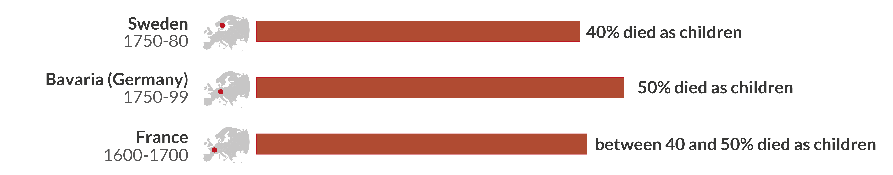
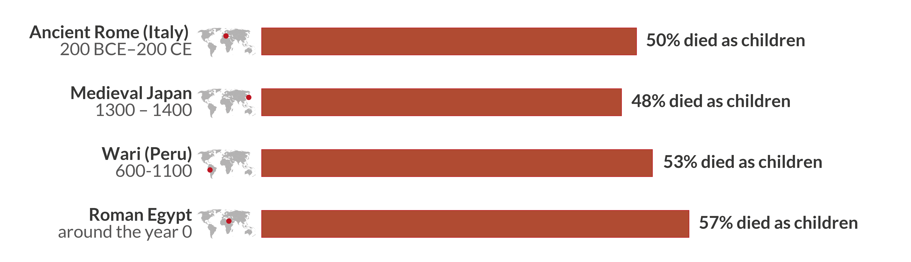
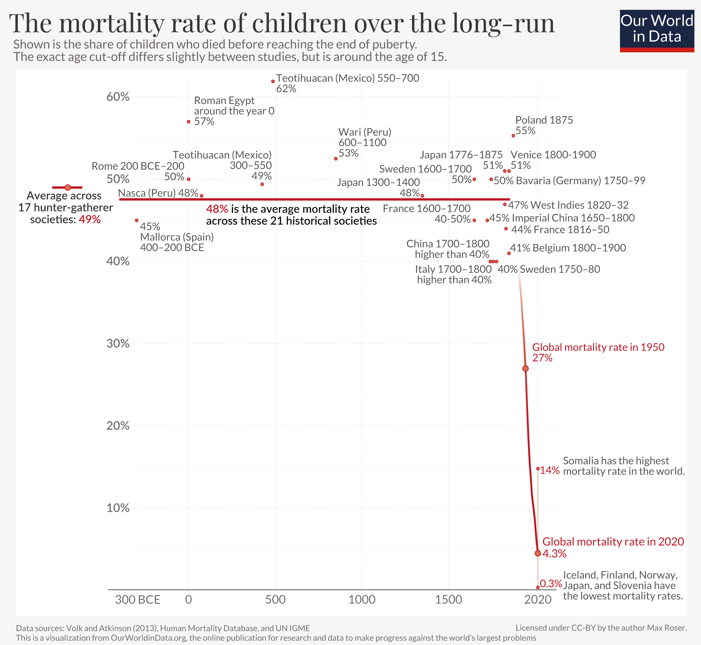

The chances that a newborn survives childhood have increased from 50% to 96% globally.  

在全球范围内，新生儿在儿童期存活的几率已从50%增加到96%。  

This article asks how we know about the mortality of children in the past and what we can learn from it for our future.  

这篇文章问道，我们如何了解过去儿童的死亡率，以及我们可以从中为我们的未来学习什么。

April 11, 2023  

2023年4月11日

A child dying is one of the most dreadful tragedies one can imagine. We all know that child deaths were more common in the past. But how common? How do we know? And what can we learn from our history?  

儿童死亡是人们可以想象的最可怕的悲剧之一。我们都知道，儿童死亡在过去比较常见。但是有多普遍？我们怎么知道？我们又能从我们的历史中学到什么？

Archeologists and historians have brought together data from many places and time periods across the world which lets us piece together a picture of our past.  

考古学家和历史学家将来自世界各地许多地方和时间段的数据汇集在一起，这让我们能够拼凑出一幅我们的过去。

Sweden is a country that has particularly good historical, demographic data. It was the first country to establish an office for population statistics: the Tabellverket, founded in 1749. Looking at the statistical records for the first three decades – the period from 1750 to 1780 – we find that 40% of children died before the age of 15.[1](https://ourworldindata.org/child-mortality-in-the-past#note-1)  

瑞典是一个拥有特别好的历史和人口数据的国家。它是第一个建立人口统计办公室的国家：1749年成立的Tabellverket。看看前三十年的统计记录--从1750年到1780年--我们发现，40%的儿童在15岁之前就已经死亡。

During the same period about half of all children died in Bavaria (Germany), and in France the mortality rate was about 45%.  

在同一时期，巴伐利亚（德国）约有一半的儿童死亡，而在法国，死亡率约为45%。  

At that time the average couple would have more than 5, 6, or even 7 children, which meant that most parents saw several of their children die.[2](https://ourworldindata.org/child-mortality-in-the-past#note-2)  

在那个时候，一般的夫妇会有超过5、6，甚至7个孩子，这意味着大多数父母看到他们的几个孩子死亡。 2

Was this unusual? Was the death rate in Europe particularly high at that specific time?   

这是否不寻常？在那个特定时期，欧洲的死亡率是否特别高？

We can look at research for other places and time periods.  

我们可以看一下其他地方和时间段的研究。

Based on skeletons found in the South of modern-day Peru, paleodemographers can estimate the mortality of children who were born two millennia ago.  

根据在现代秘鲁南部发现的骨骼，古人口学家可以估计两千年前出生的儿童的死亡率。  

The records suggest a similar figure: almost half of children died before the end of puberty.[3](https://ourworldindata.org/child-mortality-in-the-past#note-3)  

记录显示了一个类似的数字：几乎一半的儿童在青春期结束前就已经死亡。 3

A burial site on the Spanish island of Mallorca offers us a view on child mortality in Europe during the Iron Age.  

西班牙马洛卡岛上的一个墓穴为我们提供了一个关于铁器时代欧洲儿童死亡率的观点。  

Based on the skeletons found in Mallorca researchers again found that about half of all children did not survive.[4](https://ourworldindata.org/child-mortality-in-the-past#note-4)根据在马洛卡发现的骨架，研究人员再次发现，约有一半的儿童没有存活。 4  

And the same is also true in very different regions and different periods.   

而在非常不同的地区和不同时期也是如此。

Researchers also collected data about hunter-gatherer societies. The 17 different societies include paleolithic and modern-day hunter-gatherers and the mortality rate was high in all of them.  

研究人员还收集了关于狩猎-采集者社会的数据。这17个不同的社会包括旧石器时代和现代的狩猎采集者，所有这些社会的死亡率都很高。  

On average 49% of all children died.[5](https://ourworldindata.org/child-mortality-in-the-past#note-5) At the end of this article you can find more detail about the available evidence for the mortality rates of children in hunter-gatherer societies.  

平均而言，所有儿童中有49%死亡。 5 在这篇文章的末尾，你可以找到更多关于狩猎-采集社会中儿童死亡率的现有证据的细节。

#### The mortality of children over the long-run  

长期以来，儿童的死亡率 。

Let’s take all the historical estimates of child mortality and combine them with global data for recent decades to see what this tells us about humanity’s history.[6](https://ourworldindata.org/child-mortality-in-the-past#note-6)  

让我们把所有历史上对儿童死亡率的估计，与最近几十年的全球数据结合起来，看看这对人类的历史有何启示。 6

What is striking about the historical research is how similar child mortality rates were across a wide range of very different historical cultures: No matter where in the world a child was born, about half of them died.  

历史研究的惊人之处在于，在广泛的、非常不同的历史文化中，儿童死亡率是多么相似：无论孩子出生在世界哪个地方，都有大约一半的孩子死亡。

#### _Everyone_ failed to make progress  

每个人都没能取得进展 。

Tens of billions of children died.[7](https://ourworldindata.org/child-mortality-in-the-past#note-7) Billions of parents [mourned helplessly](https://ourworldindata.org/parents-losing-their-child) when they saw their children dying.  

数以百亿计的儿童死亡。 7 数十亿的父母在看到他们的孩子死去时，无助地哀悼。

Despite the relentless suffering no one was able to do much about it.  

尽管遭受了无情的苦难，但没有人能够对此做什么。

The chart speaks about societies that lived thousands of kilometers away from each other, separated by thousands of years of history, and yet they all suffered the same pain.  

这张图说的是彼此生活在几千公里之外的社会，被几千年的历史隔开，但他们都遭受了同样的痛苦。  

Whether in Ancient Rome, in hunter-gatherer-societies, in the pre-Columbian Americas, in Medieval Japan or Medieval England, in the European Renaissance, or in Imperial China, every second child died.  

无论是在古罗马、狩猎-采集社会、前哥伦布时代的美洲、中世纪的日本或中世纪的英国、欧洲文艺复兴时期，还是在帝国中国，每第二个孩子都会死亡。

While some societies were better off than others, the differences were small.  

虽然有些社会的情况比其他社会好，但差异很小。  

Generation after generation was born into societies that struggled against poverty, hunger, and disease and there is no indication that any society made any substantial and sustained progress against those problems. Substantial progress against child mortality is a recent achievement everywhere.  

一代又一代人出生在与贫困、饥饿和疾病作斗争的社会中，没有迹象表明任何社会在解决这些问题方面取得了任何实质性的持续进展。在解决儿童死亡率方面取得实质性的进展是各地最近的成就。

It is not that people in the past didn’t try to make progress against early death and disease. They tried, of course.[8](https://ourworldindata.org/child-mortality-in-the-past#note-8)  Healers and doctors had a high status in societies. And people often took on great pain and costs in the hope of improving their children’s health.  

这并不是说过去的人们没有努力在对抗早期死亡和疾病方面取得进展。他们当然也尝试过。{医护人员和医生在社会上有很高的地位。而且人们经常承受巨大的痛苦和代价，希望能改善他们孩子的健康。

The “most common procedure performed by surgeons for almost two thousand years” in Europe [was](https://web.archive.org/web/20090415024002/http://www.sciencemuseum.org.uk/broughttolife/techniques/bloodletting.aspx) bloodletting. The pain this practice caused makes clear just how desperate people were to achieve any health improvements.  

在欧洲，"近两千年来外科医生最常做的手术 "是放血。这种做法所造成的痛苦清楚地表明，人们是多么迫切地想要获得任何健康改善。  

The fact that it not only offered no benefits, but that it was indeed harmful to the patients, makes clear just how unsuccessful humanity was for most of its history.  

它不仅没有提供任何好处，而且确实对病人有害，这一事实清楚地表明，人类在其历史上的大部分时间里是多么不成功。

All were suffering as they saw their children die, yet none of them were able to do anything about it.  

所有的人都很痛苦，因为他们看到自己的孩子死了，然而他们没有一个人能够做任何事情。

The key insight for me is that progress is not natural. It is hard.  

对我来说，关键的见解是，进步不是自然的。它是艰难的。  

Even against some of the largest problems – the unrelenting death of children – thousands of generations failed to make any progress.  

即使是针对一些最大的问题--儿童无情的死亡--几千代人都没能取得任何进展。

#### Are these high historical mortality rates plausible?  

这些历史上的高死亡率是否合理？

The historical studies of child mortality don’t provide a full picture of our ancestors’ past. They are snapshots of some moments in the long history of our species.  

对儿童死亡率的历史研究并没有提供我们祖先过去的全貌。它们是我们人类漫长历史中某些时刻的快照。  

Could they mislead us to believe that mortality rates were higher than they actually were?  

他们会不会误导我们，让我们相信死亡率比实际情况要高？

There is another piece of evidence to consider that suggests the mortality of children was in fact very high: birth rates were high, but population growth was close to zero.  

还有一个证据需要考虑，表明儿童的死亡率实际上非常高：出生率很高，但人口增长接近零。

If every couple has on average four children, the population size would double each generation. But while we know that couples had on average many more children than four, the population did _not_ double with each generation.[9](https://ourworldindata.org/child-mortality-in-the-past#note-9) In fact population sizes barely changed at all.  

如果每对夫妇平均有四个孩子，那么人口数量每一代都会翻一番。但是，虽然我们知道夫妇平均有比四个孩子多得多的孩子，但人口并没有随着每一代人而翻倍。 9 事实上，人口规模几乎没有任何变化。

A high number of births without a rapid increase of the population can only be explained by one sad reality: a high share of children died before they could have children themselves.  

在人口没有快速增长的情况下，大量的出生只能用一个可悲的现实来解释：大量的儿童在他们自己能够生育之前就已经死亡。

If anything, the mortality rates shown in the chart above underestimate the true mortality of children.  

如果有的话，上图中显示的死亡率低估了儿童的真实死亡率。  

Volk and Atkinson, the two researchers who gathered most of these studies, caution that these historical mortality rates “should be viewed as conservative estimates that generally err toward underestimating actual historic rates”.[10](https://ourworldindata.org/child-mortality-in-the-past#note-10) A first reason is that death records were often not produced for children, especially if children died soon after birth.  

沃尔克和阿特金森是收集这些研究报告的两位研究人员，他们告诫说，这些历史死亡率 "应被视为保守的估计，通常会错误地低估实际的历史比率"。{第一个原因是，儿童的死亡记录往往没有产生，特别是如果儿童出生后不久就死亡。  

A second reason is that child burial remains, another important source, are often incomplete “due to the more rapid decay of children’s smaller physical remains and the lower frequency of elaborate infant burials”.[11](https://ourworldindata.org/child-mortality-in-the-past#note-11)  

第二个原因是，作为另一个重要来源的儿童墓葬遗骸往往是不完整的，"因为儿童较小的身体遗骸腐烂得更快，而且精心设计的婴儿墓葬的频率较低"。 11

#### The mortality of children today  

今天儿童的死亡率

The chart above also shows the dramatic progress that was recently achieved. Most children in the world still died at extremely high rates well into the 20th century.  

上面的图表还显示了最近取得的巨大进展。进入20世纪以来，世界上的大多数儿童仍然以极高的比率死亡。  

Even as recently as 1950 – a time that some readers might well remember – one in four children died globally.   

即使在最近的1950年--一些读者可能很清楚地记得这个时间--全球每四个儿童中就有一个死亡。

More recently, during our lifetimes, the world has achieved an entirely unprecedented improvement. In a brief episode of human history the global death rate of children declined from around 50% to 4%.   

最近，在我们的有生之年，世界已经实现了完全前所未有的改善。在人类历史上的一个短暂插曲中，全球儿童的死亡率从大约50%下降到4%。

After millennia of suffering and failure, the progress against child mortality is for me one of the greatest achievements of humanity.  

在经历了数千年的痛苦和失败之后，消除儿童死亡率的进展对我来说是人类最伟大的成就之一。

This is not an improvement that is only achieved by a few countries. The rate has declined in every single country in the world.  

这并不是只有少数几个国家才有的改善。世界上每一个国家的这一比率都有所下降。

The map shows the latest available data for mortality up to the age of 15. In several countries the rate has declined to about 0.3%, a mortality rate that is more than 100-times lower than in the past.  

该地图显示了15岁以前的最新可用的死亡率数据。在一些国家，这一比率已经下降到约0.3%，这一死亡率比过去低100多倍。  

This was achieved in just a few generations. Progress can be fast.  

这是在短短几代人的时间里实现的。进步可以是快速的。

In the richest parts of the world child deaths have become very rare, but differences across countries are high.  

在世界最富裕的地区，儿童死亡已变得非常罕见，但各国之间的差异很大。  

Somalia – on the Horn of Africa – is the country with the highest rate, 14% of newborns die as children.  

索马里--位于非洲之角--是比率最高的国家，14%的新生儿死于儿童。

The fact that several countries show that it is possible for 99.7% of children to survive shows us what the world can aspire to. Global health has improved, and [it is on us](https://ourworldindata.org/much-better-awful-can-be-better) to make sure that this progress continues to bring the daily tragedy of child deaths to an end.  

有几个国家显示，99.7%的儿童有可能存活下来，这一事实向我们展示了世界可以向往的东西。全球健康状况已经得到改善，我们有责任确保这一进展继续下去，结束每天的儿童死亡悲剧。

Our ancestors could have surely not imagined what is reality today, let’s make it our goal to give children everywhere the chance to live a long and healthy life.  

我们的祖先肯定无法想象今天的现实，让我们把让各地儿童有机会健康长寿作为我们的目标。
