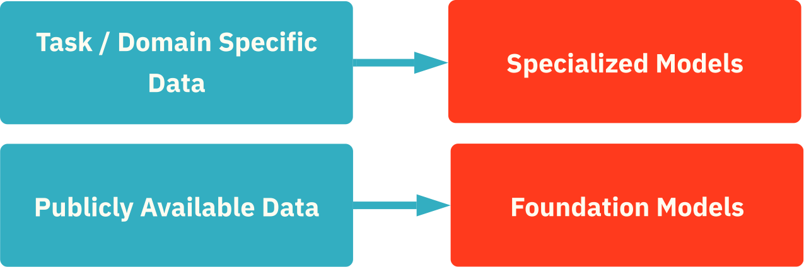
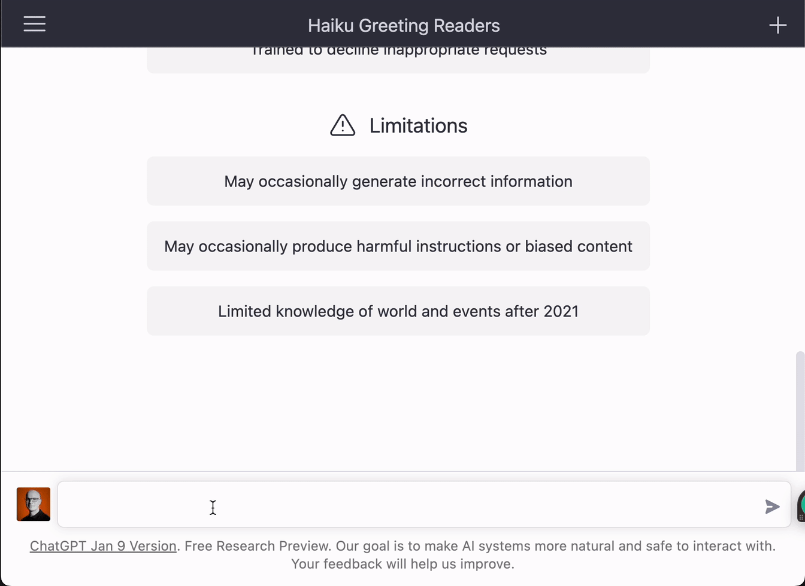
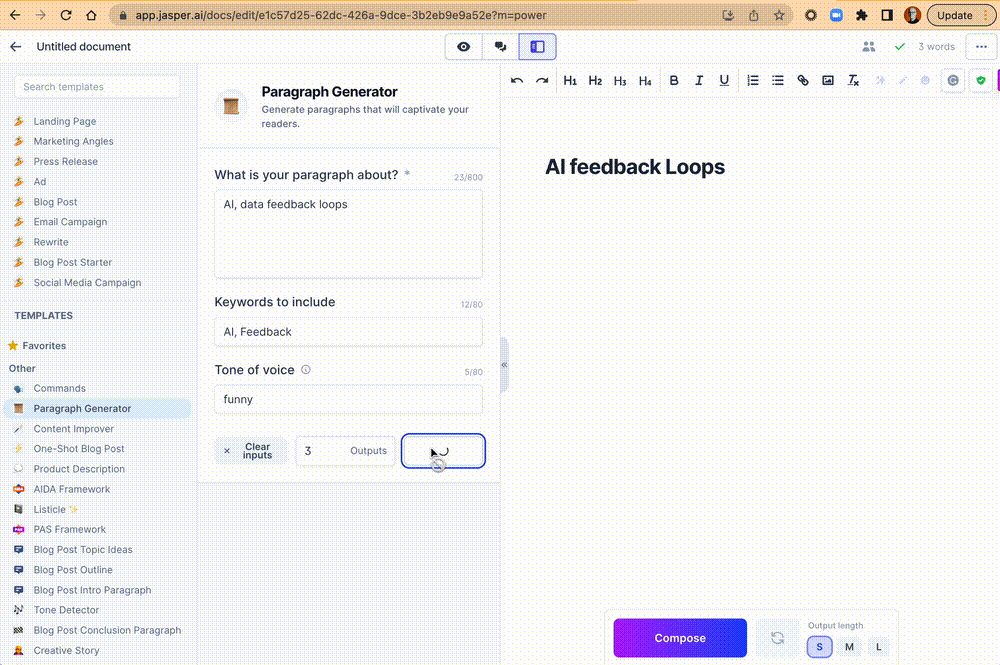
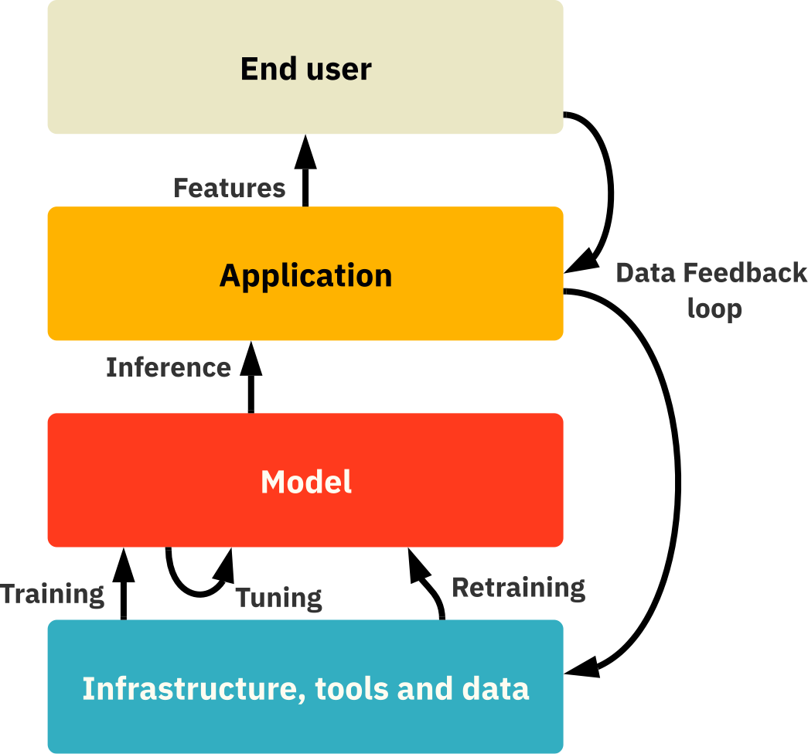

_Note for mobile readers: we use many animated gifs to showcase the applications discussed and, for that reason, we recommend you use a laptop and browser for the optimal reading experience.  

手机读者注意：我们使用了许多动画GIF来展示所讨论的应用程序，因此，我们建议你使用笔记本电脑和浏览器来获得最佳的阅读体验。_

Language, the ability to write and speak, is humanity's most important invention and is what sets us apart from other species.  

It enables us to reason abstractly, develop complex ideas, and communicate them to one another. Almost nothing in modern civilization would be possible without it. It is, therefore, clear that **Large Language Models (LLMs)** will have the most significant impact in the years to come among all of the recent advancements within generative AI. The rapid rise in popularity of ChatGPT serves as an illustration of that.  

Other examples of what LLMs are used for include content creation, code generation, drug discovery and development, translation, search, and workplace utilities such as meeting transcription and summarization.  

语言，即书写和说话的能力，是人类最重要的发明，也是我们区别于其他物种的原因。它使我们能够进行抽象的推理，发展复杂的思想，并相互交流。如果没有它，现代文明中几乎没有任何东西是可能的。因此，很明显，大型语言模型（LLMs）将在未来几年内对生成性人工智能的所有最新进展产生最重大的影响。ChatGPT的迅速流行就说明了这一点。大型语言模型的其他用途包括内容创建、代码生成、药物发现和开发、翻译、搜索和工作场所的实用工具，如会议转录和总结。

Example applications of LLMs  

法学硕士的应用实例

In short, the recent advancements in generative AI mark a new era in the field of AI where it is no longer just a research topic but also a practical tool that can be used to solve real-world problems and create value in literally every industry.  

简而言之，最近生成性人工智能的进展标志着人工智能领域的一个新时代，它不再只是一个研究课题，也是一个实用的工具，可以用来解决现实世界的问题，并在字面上的每个行业创造价值。  

Therefore, businesses must start thinking about how AI will impact them and act now to stay competitive.  

因此，企业必须开始思考人工智能将如何影响他们，现在就采取行动以保持竞争力。  

Companies that fail to incorporate AI into their operations will risk falling behind the curve and may struggle to survive in the long run.  

未能将人工智能纳入其业务的公司将有可能落后于曲线，并可能在长期内难以生存。  

The key is for companies to understand the benefits of AI, evaluate its costs and benefits, and take the necessary steps to implement it in their operations.  

关键是公司要了解人工智能的好处，评估其成本和效益，并采取必要的步骤在其业务中实施。  

The coming few years will likely be remembered as a golden era where thousands and thousands of new generational businesses were formed.   

未来几年可能会被记住，这是一个黄金时代，成千上万的新一代企业在这里成立。

We will dedicate this first article in our series to LLMs. We will also provide a fundamental **overview of LLMs** and the **technologies surrounding them**, followed by **how they are applied in practice**.  

This will hopefully be helpful for practitioners who want to thoroughly understand how they should apply LLMs in their businesses, as well as for investors who want to get a sufficient understanding of the field before making any potential investment decisions. While several of the frameworks that we provide (such as the categorization of different types of AI companies) are applicable to any type of Generative AI, we will mainly provide examples from LLMs.  

我们将把这个系列的第一篇文章献给LLMs。我们还将提供一个关于LLM和围绕它们的技术的基本概述，然后是它们在实践中的应用方式。希望这对那些想彻底了解应该如何在其业务中应用LLM的从业者，以及那些想在做出任何潜在的投资决定前对该领域有充分了解的投资者有所帮助。 虽然我们提供的几个框架（如不同类型的人工智能公司的分类）适用于任何类型的生成性人工智能，但我们将主要提供LLMs的例子。

Before you continue,  

在你继续之前、  

Subscribe for free to receive our next  

免费订阅，以收到我们的下一个  

deep articles on AI  

关于AI的深度文章

From time to time, there comes a seminal paper that influences the direction of a research field for years to come. For LLMs, one such paper is “[Attention Is All You Need](https://arxiv.org/pdf/1706.03762.pdf)” published by a team of Google researchers in 2017. They proposed a new network architecture called the Transformer, which, without going into too much detail, is highly parallelizable and computationally efficient compared to the then state-of-the-art alternatives while achieving superior performance.  

This means that models with the **Transformer architecture** are **cheaper** and **faster** to train, and the resulting **models perform better**. The combination of being cheaper and faster while not compromising on performance is important because it enables you to train larger models and leverage more data while doing so.   

不时有一篇开创性的论文出现，影响了一个研究领域未来几年的方向。对于法律硕士来说，这样一篇论文是由谷歌研究团队在2017年发表的" Attention Is All You Need "。他们提出了一种名为Transformer的新网络架构，不需要太多细节，与当时最先进的替代方案相比，它具有高度的可并行性和计算效率，同时实现了卓越的性能。这意味着采用Transformer架构的模型在训练时更便宜、更快速，而且所产生的模型性能更好。在不影响性能的情况下，更便宜和更快的组合是很重要的，因为它使你能够训练更大的模型，并在这样做的同时利用更多的数据。

Inspired by and based on the transformer architecture, numerous well-known and famous LLMs have been developed.  

受变压器结构的启发并以其为基础，已经开发出了许多知名的、著名的LLM。  

Examples include the Generative Pre-trained Transformer (GPT) models, Bidirectional Encoder Representations from Transformers (BERT), and XLNet.   

这方面的例子包括生成性预训练转化器（GPT）模型、来自转化器的双向编码器表示法（BERT）和XLNet。

The first papers on GPT (version 1) and BERT were both released in 2018. The following year, in 2019, the first paper on XLNet was released.  

关于GPT（第一版）和BERT的第一篇论文都是在2018年发布的。第二年，即2019年，关于XLNet的第一篇论文发布。  

Despite this, it was not until the very end of 2022 that LLMs became widely popular outside the research community due to the launch of ChatGPT by OpenAI.  

尽管如此，直到2022年底，由于OpenAI推出的ChatGPT，LLM才在研究界之外广泛流行。  

More than 1 million people had tried it out in less than a week after its launch. Its quick adoption by users is rare and almost unprecedented among technical products.  

在推出后不到一周的时间里，就有超过100万人试用了它。它被用户快速采用的情况在技术产品中是罕见的，几乎是史无前例的。  

However, it is crucial to understand that nothing groundbreaking has occurred overnight.  

然而，关键是要明白，没有什么突破性的事情是在一夜之间发生的。  

ChatGPT, which is based on GPT (version 3.5), showcases the results following years and years of progress within the field of LLMs. In fact, the model underlying ChatGPT is arguably not even the best LLM available.  

基于GPT（3.5版）的ChatGPT展示了在LLM领域内多年来的进展成果。事实上，ChatGPT的基础模型甚至可以说不是目前最好的LLM。  

However, it is fair to say that it is currently the most popular one.  

然而，可以说，它是目前最受欢迎的一种。

Time will tell, but we guess that the most important role of ChatGPT is that of a PoC for the world to see what LLMs can achieve.  

时间会证明一切，但我们猜测ChatGPT最重要的作用是作为一个PoC，让世界看到法学硕士能取得什么成就。  

Notwithstanding its initial popularity, it is not at all certain that it will be one of the dominant LLMs that will gain widespread adoption for practical use cases for reasons that we will elaborate upon during the remainder of the text.  

尽管它最初很受欢迎，但并不确定它是否会成为在实际使用案例中获得广泛采用的主流LLM之一，其原因我们将在文本的其余部分详细说明。

**Foundation large language models** are trained on a large corpus of publicly available text data (for example, from Wikipedia, news articles, Twitter, online forums, etc.).  

Since the models are trained on data from an extensive range of topics and contexts, they are not specialized in any particular domains or tasks.  

Examples of foundation LLMs include GPT-3, Jurassic-1, Gopher, and MT-NLG.   

基金会的大型语言模型是在大量公开的文本数据（例如，来自维基百科、新闻文章、Twitter、在线论坛等）上训练的。由于这些模型是在来自广泛的主题和背景的数据上训练的，因此它们并不专门针对任何特定的领域或任务。基础LLM的例子包括GPT-3、Jurassic-1、Gopher和MT-NLG。

While applications built on top of foundation AI models such as ChatGPT are very popular currently, **we predict that the most value of LLMs will come from models that are specialized within certain domains and/or tasks.** This is because specialized models often perform better in their area of expertise compared to foundation models of the same model size.  

This means that foundation models need to be larger, with accompanying higher cost for inference and larger memory footprint, to even have the chance to achieve the same performance as a specialized model in the latter’s area of expertise.  

虽然建立在ChatGPT等基础人工智能模型之上的应用目前非常流行，但我们预测，LLM的最大价值将来自于在某些领域和/或任务中的专门模型。这是因为与相同模型规模的基础模型相比，专业模型在其专业领域的表现往往更好。这意味着基础模型需要更大，伴随着更高的推理成本和更大的内存占用，甚至有机会在后者的专业领域达到与专业模型相同的性能。

One of the reasons specialized models perform better than foundation models relates to the aspect of model alignment, which represents the degree to which the output of an LLM corresponds to the goals and interests of the model user.  

专用模型比基础模型表现更好的原因之一与模型的一致性方面有关，它代表了一个LLM的输出与模型用户的目标和利益的对应程度。  

A high model alignment implies that the answer is correct and relevant, i.e. it actually answers what is requested from it.  

一个高的模型排列意味着答案是正确的和相关的，也就是说，它实际上回答了对它的要求。  

Since a specialized model only focuses on a specific domain or set of tasks, the degree of model alignment is usually higher in its specialization area compared to foundation models.   

由于专业模型只关注一个特定的领域或一组任务，与基础模型相比，其专业领域的模型一致性程度通常更高。

**There are different ways to specialize a model.** One approach is to specialize a foundation model by further training it on data that is relevant to the domain(s) and/or task(s) of interest.  

For example, a foundation model might be OK at answering questions regarding the banking industry in general.  

However, if you want to build a chatbot that you offer to the banking industry, that performance level might not be sufficient.  

Then, you might resort to further train the foundation model on a dataset relevant to the banking industry to make it domain-specific.  

A particular bank might, in turn, want to leverage the chatbot in their customer service to automate their simpler errands.  

To achieve this, the bank might want to further train the domain-specified model on proprietary data from its own actual customer service conversations.  

By doing so, the LLM can learn how this particular bank deals with errands based on its policies and guidelines. Different banks might have very different policies and guidelines.  

有不同的方法来专门化一个模型。一种方法是通过在与感兴趣的领域和/或任务相关的数据上进一步训练基础模型来使其专业化。例如，一个基础模型在回答有关银行业的一般问题时可能是好的。但是，如果你想建立一个提供给银行业的聊天机器人，这个性能水平可能就不够了。那么，你可能需要在与银行业相关的数据集上进一步训练基础模型，使其具有特定的领域。反过来，一家特定的银行可能想在他们的客户服务中利用聊天机器人，使他们更简单的事务自动化。为了实现这一目标，银行可能想在自己的实际客户服务对话的专有数据上进一步训练领域特定的模型。通过这样做，LLM可以了解这家特定的银行是如何根据其政策和指导方针来处理跑腿的。不同的银行可能有非常不同的政策和指导方针。

Since an AI model that is specialized within a certain domain and/or task does not need to be good at totally different and unrelated domains and/or tasks, the foundation models that are used as bases for further training do not need to be as large.  

由于一个在某一领域和/或任务内的人工智能模型不需要擅长完全不同和不相关的领域和/或任务，作为进一步训练基础的基础模型不需要那么大。  

By having smaller models, the inference cost and memory footprint will be lower and smaller, respectively.  

通过拥有较小的模型，推理成本和内存占用将分别降低和减少。  

In other words, foundational models that are much smaller than the largest available ones might become the go-to choice as foundations of specialized models.   

换句话说，比现有最大模型小得多的基础模型可能会成为专门模型的基础的首选。

To better understand the capabilities and limitations of LLMs, it is important first to have a better understanding of how they can be improved. The three main drivers are **architectural improvements, larger models,** and **more training data**. Let’s go through each of them.  

为了更好地了解LLM的能力和局限性，首先必须更好地了解如何改进它们。三个主要的驱动力是架构的改进、更大的模型和更多的训练数据。让我们逐一来看看。

Architectural improvements such as the invention of the Transformers architecture in 2017 can boost the performance of LLMs without increasing model complexity or the amount of training data used.  

Most of the state-of-the-art LLMs currently being built are still based on transformer network architectures (very similar to the one introduced in 2017).  

Although it has known limitations, for example in the form of quadratic time and memory complexity due to its self-attention, no actual update to the architecture has yet been widely adopted.  

With this said, there has been tremendous effort devoted to improving the architecture and coming up with, for example, so-called _efficient Transformers_ to eliminate these identified limitations.   

架构上的改进，如2017年发明的变压器架构，可以提升LLM的性能，而不增加模型的复杂性或使用的训练数据量。目前大多数最先进的LLM仍然是基于变压器网络架构（与2017年推出的架构非常相似）。虽然它有已知的局限性，例如由于它的自我关注而导致的四次方时间和内存复杂性，但目前还没有实际更新的架构被广泛采用。说到这里，人们已经付出了巨大的努力来改进该架构，并提出了例如所谓的高效变形金刚来消除这些已确定的限制。

Incremental improvements upon existing state-of-the-art architectures, such as the effort to develop efficient Transformers, will collectively contribute to gradually push the boundaries of the model performances over the coming years.  

对现有最先进的架构的逐步改进，如开发高效变压器的努力，将共同促进在未来几年内逐步推动模型性能的边界。  

In addition, every once in a while, seminal architectural improvements such as the invention of the original Transformer architecture will be made, which contributes to a significant step change improvement of the model performances.  

此外，每隔一段时间，就会有一些开创性的架构改进，如发明最初的Transformer架构，这有助于对模型性能进行重大的步骤改进。

While increased model sizes and amounts of training data are relatively easy to plan and execute on, architectural improvements are not.  

Instead, they follow the patterns within traditional research and development activities, with bold and innovative ideas being tested without any guarantees of results.  

Therefore, this category of performance improvements for LLMs is the trickiest one to rely on.  

It is also the norm for both incremental improvements and more radical breakthroughs of architectural improvements to be published and shared with the rest of the research community. This implies that **improvements within this category are not necessarily something that can be used as a long-term competitive advantage** over other companies and competitors who are also building LLMs - other than being first on the market with the improved model.  

As an example, OpenAI’s LLMs build upon the Transformer breakthroughs that were invented and made publicly available by Google Brain in 2017.  

虽然增加模型规模和训练数据量相对容易计划和执行，但架构的改进却不容易。相反，它们遵循传统研究和开发活动的模式，在没有任何结果保证的情况下测试大胆的创新想法。因此，LLM的这一类性能改进是最难依靠的一类。同时，无论是增量改进还是更激进的架构改进的突破，都会被公布并与研究界的其他成员分享，这也是一种常态。这意味着在这一类别中的改进不一定可以作为相对于其他公司和竞争对手的长期竞争优势，他们也在构建LLM--除了在市场上率先采用改进的模型。作为一个例子，OpenAI的LLMs建立在2017年由谷歌大脑发明并公开的Transformer突破之上。

So far, most of the effort to improve the performance of LLMs has been focused on increasing model sizes. During the last few years, this has partly been driven by a [paper released by Open AI in 2020](https://arxiv.org/pdf/2001.08361.pdf), which established the scaling law relationship between increased model size and increased model performance.  

The paper concluded that the majority of the budget to train models should go towards making them bigger. The figure below from [Machine Learning Model Sizes and the Parameter Gap](https://arxiv.org/pdf/2207.02852.pdf) shows the clear trend of significantly increased sizes of language models over the years.   

到目前为止，提高LLMs性能的大部分努力都集中在增加模型规模上。在过去的几年里，这部分是由开放人工智能在2020年发布的一篇论文推动的，该论文建立了模型规模增加和模型性能提高之间的比例法则关系。该论文的结论是，训练模型的大部分预算应该用于使模型更大。下图来自机器学习模型尺寸和参数差距，显示了多年来语言模型尺寸大幅增加的明显趋势。

Prior to 2019, most LLMs were in the hundreds of millions of parameters. During 2019, OpenAI released GPT-2 which contains 1.5 billion parameters.  

在2019年之前，大多数LLM的参数都是数以亿计的。2019年期间，OpenAI发布了GPT-2，其中包含15亿个参数。  

During 2020, Google and Microsoft released T5 and Turing NLG, which contain 11 and 17 billion parameters, respectively. In mid-2020, OpenAI released GPT-3 containing 175 billion parameters.  

2020年期间，谷歌和微软发布了T5和图灵NLG，分别包含110和170亿个参数。在2020年中期，OpenAI发布了GPT-3，包含1750亿个参数。  

Since then, even larger models have been built, such as Jurassic-1 by AI21 consisting of 178 billion parameters, Gopher by DeepMind consisting of 280 billion parameters, MT-NLG by Nvidia and Microsoft consisting of 530 billion parameters and WuDao 2.0 by Beijing Academy of Artificial Intelligence consisting of 1.75 trillion parameters.  

从那时起，更大的模型已经建立起来，例如AI21的Jurassic-1由1780亿个参数组成，DeepMind的Gopher由2800亿个参数组成，Nvidia和微软的MT-NLG由5300亿个参数组成，北京人工智能研究院的WuDao 2.0由1.75万亿个参数组成。

**The main reason for why the increased size of an LLM can boost performance is that it increases its capability to model our complex reality.** The Transformer architecture has been an important enabler for training larger models due to its relatively fast and cheap training.  

However, larger models entail higher training and inference cost, everything else equal. They also leave a larger memory footprint, which means that they need to be deployed on larger hardware.  

Therefore, if you have use cases which are sensitive to inference cost or memory footprint, the other approaches to improve the performance of the LLM might be preferred over growing the size of the model.   

为什么增加LLM的规模可以提高性能，主要原因是它增加了对我们复杂现实的建模能力。由于Transformer架构具有相对快速和廉价的训练，它一直是训练大型模型的重要推动者。然而，在其他条件相同的情况下，更大的模型会带来更高的训练和推理成本。它们还留下了更大的内存足迹，这意味着它们需要被部署在更大的硬件上。因此，如果你的用例对推理成本或内存占用很敏感，那么改善LLM性能的其他方法可能比增加模型的大小更可取。

An underemphasized approach to improve model performance is to focus on the data it's trained on - both in terms of quality and quantity. [In a recent paper from 2022 authored by a team at DeepMind](https://arxiv.org/pdf/2203.15556.pdf), the importance of the size of the models versus the amount of training data was investigated. The authors concluded that **most language models are significantly undertrained**. This means that LLMs would significantly benefit by being trained on larger datasets without increasing the model sizes.  

By training a relatively smaller LLM (that they named Chinchilla) containing 70 billion parameters, but with 1.4 trillion training tokens, the research team managed to construct a model that outperformed larger language models such as GPT3, Gopher, Jurassic-1 and MT-NLG, all of which have between 175-530 billion parameters but which have only been trained on 270-300 billion training tokens (please see the table below).  

In other words, we are most definitely going to see a race to collect bigger datasets with the end goal of improving the performances of language models.  

提高模型性能的一个未受重视的方法是关注它所训练的数据--在质量和数量上都是如此。 在最近一篇由DeepMind团队撰写的2022年的论文中，研究了模型的规模与训练数据量的重要性。作者的结论是，大多数语言模型的训练量明显不足。这意味着，在不增加模型规模的情况下，在更大的数据集上训练LLM将大大受益。通过训练一个相对较小的LLM（他们命名为Chinchilla），包含700亿个参数，但有1.4万亿个训练标记，研究小组成功地构建了一个模型，其性能超过了较大的语言模型，如GPT3、Gopher、Jurassic-1和MT-NLG，这些模型都有1750-5300亿个参数，但只在2700-3000亿个训练标记上训练过（请看下面的表格）。换句话说，我们肯定会看到一场收集更大数据集的竞赛，其最终目的是提高语言模型的性能。

Another way in which more training data can be leveraged to improve the performance of LLMs is through reinforcement learning. [In 2017, a team at OpenAI released a new class of reinforcement learning algorithms called Proximal Policy Optimizations](https://arxiv.org/pdf/1707.06347.pdf), which is currently considered to be the state-of-the-art approach in the area. It performs at par or better than the alternative methods while being much simpler to implement in practice.  

The LLM behind ChatGPT has been fine-tuned by a process called Reinforcement Learning through Human Feedback, which takes place in several steps.  

In the first step, data consisting of human-provided “ideal” answers for different prompts is used to fine-tune the LLM through supervised learning.  

In the second step, the LLM provides several answers for each prompt, which is then ranked by humans. This ranking is used to train the reward model.  

In the third and final step, the Proximal Policy Optimization model is applied to optimize the reward model of the LLM.  

By leveraging reinforcement learning, the model can be steered towards providing more correct, unbiased, and less toxic answers. All in all, the LLM becomes more robust.  

In fact, this is one of the main reasons why OpenAI has released ChatGPT for “free public trial”. You pay by providing training data.  

Next to each reply generated by ChatGPT, you can press “thumbs up” or “thumbs down” to rate the response of the LLM.  

Regardless of what you press, a box pops up where you can provide what the ideal answer should have been, which is exactly the data you need in the first step of the reinforcement learning process.   

另一种可以利用更多训练数据来提高LLM性能的方法是通过强化学习。 2017年，OpenAI的一个团队发布了一类新的强化学习算法，称为近似策略优化 ，目前被认为是该领域的最先进方法。它的性能与其他方法相当或更好，同时在实践中的实现也更简单。ChatGPT背后的LLM已经通过一个称为 "通过人类反馈强化学习 "的过程进行了微调，该过程分几个步骤进行。在第一步，由人类为不同提示提供的 "理想 "答案组成的数据被用来通过监督学习来微调LLM。在第二步，LLM为每个提示提供几个答案，然后由人类进行排名。这个排名被用来训练奖励模型。在第三步，也是最后一步，应用近似政策优化模型来优化LLM的奖励模型。通过利用强化学习，该模型可以被引导到提供更正确、无偏见和更少毒性的答案。总而言之，LLM变得更加强大。事实上，这也是OpenAI发布ChatGPT进行 "免费公开试用 "的主要原因之一。你通过提供训练数据来付费。在ChatGPT生成的每个回复旁边，你可以按 "大拇指 "或 "小拇指 "来评价LLM的反应。无论你按什么，都会弹出一个方框，你可以提供理想答案应该是什么，这正是你在强化学习过程的第一步所需要的数据。

ChatGPT’s like-buttons as a feedback loop  

ChatGPT的喜欢按钮是一个反馈回路

In theory, any company could create a good LLM with sufficient funding and the right talent.  

As already mentioned, the knowledge of how to do so in terms of architectural design is not a guarded secret. However, **we predict that the tech giants of the world will have a huge competitive edge** when it comes to building the best performing LLMs due to their access to and ability to curate training data in general and for the Reinforcement Learning part in particular, to further improve and fine-tune their models.  

A lot of the differentiation is going to come from the data that these companies have access to for training.  

Companies such as Google, Microsoft, Meta, Amazon, Alibaba, and Tencent have billions of users across their different services, through which they can find innovative ways to capture relevant data for training purposes.   

从理论上讲，任何公司只要有足够的资金和合适的人才，就可以创造出一个好的LLM。正如已经提到的，在建筑设计方面如何做到这一点的知识并不是一个保密的秘密。然而，我们预测，世界上的科技巨头在建立性能最好的LLM方面将有巨大的竞争优势，因为他们有机会和能力策划一般的训练数据，特别是强化学习部分，以进一步改善和微调他们的模型。很多差异化将来自于这些公司所能获得的训练数据。谷歌、微软、Meta、亚马逊、阿里巴巴和腾讯等公司在其不同的服务中拥有数十亿用户，通过这些用户，他们可以找到创新的方法来捕获相关数据用于训练。

As opposed to improving the performance of LLMs by increasing the size of the models, training of a model with more data does not result in higher inference cost or a larger memory footprint when the model is being used.  

相对于通过增加模型的大小来提高LLM的性能，用更多的数据训练模型并不会导致推理成本的提高，也不会在使用模型时产生更大的内存占用。  

However, you will face other big challenges.  

然而，你将面临其他巨大的挑战。  

One of the most crucial challenges is the fact that datasets with billions, let alone trillions, of training tokens are very difficult to document and validate in a good way, making them risky to deploy from an (in)correctness, bias, and toxicity perspective.  

最关键的挑战之一是，拥有数十亿，更不用说数万亿训练标记的数据集很难以良好的方式进行记录和验证，这使得它们从（不）正确性、偏见和毒性的角度进行部署的风险很大。  

Reinforcement learning might be able to counterbalance parts of the issues with regard to (in)correctness, bias, and toxicity to some extent, but it is very difficult to fix the issues in all domains and areas in which the LLM can provide answers.  

强化学习也许能够在一定程度上抵消部分关于（不）正确性、偏见和毒性的问题，但很难在所有领域和LLM能够提供答案的地方解决这些问题。

With the recent hype wave in generative AI, many companies are once again positioning themselves as “AI companies”.  

However, we see that the importance of AI for the product and differentiation of these companies, as well as which part of the AI tech stack they mainly operate in, might vary substantially.  

Based on this, we have divided the companies into five different categories: **AI Core, AI Enabler, AI Native, AI Featured,** and **AI Powered.**   

随着最近生成性人工智能的炒作浪潮，许多公司再次将自己定位为 "人工智能公司"。然而，我们看到，人工智能对这些公司的产品和差异化的重要性，以及他们主要在人工智能技术栈的哪一部分运作，可能有很大的不同。基于此，我们将这些公司分为五个不同的类别：人工智能核心、人工智能推动者、人工智能原生、人工智能特色和人工智能驱动。

The AI tech stack  

人工智能技术栈

AI Enablers are companies that operate at the bottom layer of the AI tech stack, providing infrastructure, tools, and data for building AI models.  

人工智能推动者是在人工智能技术栈的底层运作的公司，为建立人工智能模型提供基础设施、工具和数据。  

AI Core companies, who are building the actual models and selling them as their main products, rely on the services provided by AI Enablers to perform a variety of tasks related to model building.  

构建实际模型并将其作为主要产品销售的AI核心公司，依靠AI使能者提供的服务来完成与模型构建相关的各种任务。  

These include data acquisition, model training, model engineering, and model testing. At the application layer, we find the AI Native and AI Featured companies.  

这些包括数据采集、模型训练、模型工程和模型测试。在应用层，我们发现AI Native和AI特色公司。  

They consume the AI models provided by the AI Core companies and differ in the sense that the main value proposition of AI Native companies relies on AI models, whereas AI Featured companies use AI models to add features to already existing products.  

他们消费人工智能核心公司提供的人工智能模型，不同的是，人工智能原生公司的主要价值主张依赖于人工智能模型，而人工智能特色公司则使用人工智能模型来为已经存在的产品增加功能。  

At the top layer of the AI tech stack, we find the end users which we call the AI Powered companies.   

在人工智能技术栈的顶层，我们发现终端用户，我们称之为人工智能驱动的公司。

AI Enablers are the companies that provide technologies necessary for building AI models.  

人工智能推动者是为建立人工智能模型提供必要技术的公司。  

Given the large size of generative AI models, it is important to ensure that you have robust infrastructure that can handle the workload.  

鉴于生成性人工智能模型的巨大规模，重要的是要确保你有强大的基础设施，能够处理工作负荷。  

In addition, tooling for MLOPs to aid in the building of AI models is required.  

此外，还需要为MLOPs提供工具，以帮助建立AI模型。  

One of the most interesting types of AI Enabler companies are the ones who provide the training data and/or tools related to the acquisition of it, since the data is an important factor for the performance and differentiation of the models.  

最有趣的人工智能推动者公司类型之一是提供训练数据和/或与获取数据有关的工具的公司，因为数据是模型的性能和差异化的重要因素。

Most LLMs rely heavily on cloud providers for model training and deployment. All three major cloud providers have customers who are significant players in the field of LLMs. For example, OpenAI is leveraging the Microsoft Azure stack, DeepMind is naturally building on top of the Google Cloud stack and [Stability.ai has chosen Amazon Web Services as its primary cloud provider](https://www.businesswire.com/news/home/20221130006008/en/Stability-AI-Selects-AWS-as-Its-Preferred-Cloud-Provider-to-Build-Artificial-Intelligence-for-the-Future).   

大多数法律硕士在很大程度上依赖云供应商进行模型培训和部署。所有三个主要的云供应商都有客户是LLMs领域的重要参与者。例如，OpenAI正在利用微软的Azure堆栈，DeepMind自然是建立在谷歌云堆栈之上，Stability.ai选择了亚马逊网络服务作为其主要的云供应商。

The rise of LLMs is only going to increase the need for the storage and compute services provided by these cloud providers.  

LLM的兴起只会增加对这些云供应商所提供的存储和计算服务的需求。  

If you think about the rise of LLMs as an ongoing gold rush, the cloud and storage providers can be seen as the owners of the land to which people are rushing.  

如果你把法律硕士的兴起看作是一场持续的淘金热，那么云计算和存储供应商可以被看作是人们急于前往的土地的所有者。  

It would make total sense for them to cater for the builders of LLMs in the best possible way so that they become the provider of choice for everything when it comes to compute and storage.   

对他们来说，以最好的方式满足法律硕士的建设者是完全有意义的，这样他们就会成为涉及计算和存储的一切选择的供应商。

The cloud providers will also become important distribution channels, for example through their respective cloud marketplaces.  

云供应商也将成为重要的分销渠道，例如通过他们各自的云市场。  

This will make it very easy for customers who are already on the cloud to consume the models.  

这将使已经在云端的客户非常容易消费这些模型。  

In fact, just the other day, Satya Nadella of Microsoft revealed that ChatGPT will be available through the Azure OpenAI service.  

事实上，就在前几天，微软的萨提亚-纳德拉透露，ChatGPT将通过Azure OpenAI服务提供。  

We are convinced that we will get to see many more of these examples going forward.  

我们相信，我们将在未来看到更多这样的例子。

For a cloud provider to become competitive, it needs to focus on multiple factors including the speed of training and serving (i.e. running inferences) the models, and the cost to do so.  

For example, Cerebras Systems is focusing on providing compute for deep learning applications.  

They try to offer lower prices for training and serving deep learning applications, including LLMs, while doing it up to an order of magnitude faster than the common alternatives.  

Depending on the size and architecture of the model as well as the amount of training data, the cost and time for training can amount up to tens of millions (USD) as well as hundreds of days respectively.  

Therefore, savings on cost and time will remain important factors going forward. In an interesting turn of events, we are seeing [Blockchain miner companies](https://www.forbes.com/sites/ninabambysheva/2022/09/06/ethereum-miners-eye-cloud-ai-to-repurpose-equipment-that-the-merge-will-make-obsolete/) such as Hut 8 Mining in Canada repurposing their hardware for AI model training and serving, a transition that will potentially speed up the entering of new actors in the area.  

云供应商要想成为有竞争力的企业，需要关注多个因素，包括训练和服务（即运行推理）模型的速度，以及这样做的成本。例如，Cerebras Systems公司正专注于为深度学习应用提供计算。他们试图为包括LLM在内的深度学习应用的训练和服务提供更低的价格，同时做到比普通替代品快一个数量级。根据模型的大小和结构以及训练数据的数量，训练的成本和时间可以分别达到数千万（美元）和数百天。因此，节约成本和时间仍将是未来的重要因素。在一个有趣的转折中，我们看到区块链矿工公司，如加拿大的Hut 8 Mining，将他们的硬件重新用于人工智能模型的训练和服务，这一转变将有可能加速新的参与者进入该领域。

Another important aspect regards the convenience and ease of use.  

另一个重要方面是方便和易于使用。  

Cloud providers that have underlying hardware optimized for training deep learning models in general and LLMs in particular will require less manual tweaking of the users.  

拥有为训练一般的深度学习模型，特别是LLM而优化的底层硬件的云供应商，将需要更少的用户手动调整。  

In addition, the massive compute clusters that have been used to train many LLMs are normally leased in multi-year contracts.  

此外，用于培训许多LLM的大规模计算集群通常是以多年的合同形式租赁的。  

Alternatives with greater flexibility in terms of shorter-term leases will be another compelling factor for consumers.   

在短期租赁方面具有更大灵活性的替代品将是另一个吸引消费者的因素。

MLOps (Machine Learning Operations) is a set of practices and processes that aim to integrate machine learning models into the software development lifecycle, with the goal of maintaining high performance and reliability of machine learning models in production environments over time.  

MLOps（机器学习运营）是一套实践和流程，旨在将机器学习模型整合到软件开发生命周期中，目的是在生产环境中长期保持机器学习模型的高性能和可靠性。  

For LLMs, this includes model engineering, development, and testing.   

对于LLMs来说，这包括模型工程、开发和测试。

During the model engineering and development phase, machine learning researchers and engineers usually use libraries and frameworks such as [TensorFlow](https://www.tensorflow.org/?gclid=Cj0KCQiAz9ieBhCIARIsACB0oGLiKucyDOXjRDDHl_Jt4xw-13mBeoLN1PF9cwTKFtVFR3AAG8x0SnAaAp2UEALw_wcB) (released by Google and built on top of Python),  [PyTorch](https://pytorch.org/) (released by Meta and built on top of Python) and [Keras](https://keras.io/) (released by Google and built on top of Python). After the models have been developed, it is important to test them before deployment.   

在模型工程和开发阶段，机器学习研究人员和工程师通常使用库和框架，如TensorFlow（由谷歌发布，建立在Python之上）、PyTorch（由Meta发布，建立在Python之上）和Keras（由谷歌发布，建立在Python之上）。在模型开发完成后，在部署前对其进行测试是很重要的。

LLMs, just like any other machine learning model, encode the information in the training data. During inference time, this information is decoded.  

Training data is mostly produced by humans (written dialogues and texts) - and is therefore likely to be biased. We all still remember the [Microsoft chatbot that was trained on actual human dialogues through Twitter data and became racist within a few hours](https://www.theverge.com/2016/3/24/11297050/tay-microsoft-chatbot-racist). Furthermore, the internet (from which we collect a lot of our training data for LLMs) is filled with misinformation.  

Unless the data quality validation step has identified and mitigated biases and incorrectness in the training data, the models risk perpetuating and scaling up factual incorrectness and human biases.  

It is fair to say that the current ecosystem of companies for scalable and automated monitoring and validation of unstructured data in the form of text is early-to-non-existing.  

To keep up with the demand for such services as LLMs become increasingly popular, we will certainly need some automated approaches for carrying out these tasks.  

Therefore, we expect to see a lot of activity in this area going forward. Maybe, there will even be LLMs focusing on assessing the quality and validity of text data?   

LLMs，就像任何其他机器学习模型一样，对训练数据中的信息进行编码。在推理时间，这些信息被解码。训练数据大多是由人类产生的（书面对话和文本）--因此很可能是有偏见的。我们都还记得微软的聊天机器人，它通过Twitter的数据对实际的人类对话进行训练，并在几个小时内成为种族主义者。此外，互联网（我们为LLMs收集了大量的训练数据）充满了错误信息。除非数据质量验证步骤已经识别并减轻了训练数据中的偏见和不正确，否则模型有可能延续和扩大事实的不正确和人类的偏见。可以说，目前对文本形式的非结构化数据进行可扩展的自动监测和验证的公司生态系统是早期存在的，甚至不存在。随着LLMs的日益流行，为了跟上对此类服务的需求，我们肯定需要一些自动化的方法来执行这些任务。因此，我们期望看到这个领域今后会有大量的活动。也许，甚至会出现专注于评估文本数据的质量和有效性的LLMs？

When it comes to model testing, there exist widely accepted benchmarks to evaluate the performance of LLMs. One such example is [Holistic Evaluation of Language Models (HELM)](https://arxiv.org/pdf/2211.09110.pdf), which is provided by a group of researchers based at Stanford.  

HELM is constructed to be broad in coverage and measures various metrics such as accuracy, calibration, robustness, fairness, bias, toxicity, and efficiency.  

Despite this, it still does not cover the full picture of the actual model performance.  

It has been reported several times that models that perform well on benchmarks might perform poorly when you actually test them out - a great example of this was provided by [Frasher Kelton (Head of Product at OpenAI)](https://www.moreentropy.com/p/testing-by-vibes-and-control-over?r=dcl1r&utm_medium=ios&utm_campaign=post) in a blog post. When a model becomes better at a certain task, it might become worse at another.  

In addition, metrics that are important in practice include inference cost and latency, which has to be weighted against the performances on metrics such as accuracy, fairness, toxicity, etc.  

Due to this situation, Kelton writes that the state-of-the-art is “testing by vibes”. “You sort of poke around to get a ~feeling~ and once you’ve spelunked enough you yolo into production”.  

Obviously, this is not a desired situation. Therefore, we will likely see several large companies emerge in this category.  

当涉及到模型测试时，存在着广泛接受的基准来评估LLM的性能。其中一个例子是语言模型的整体评估（HELM），它是由斯坦福大学的一组研究人员提供的。HELM的构建覆盖面很广，并衡量各种指标，如准确性、校准性、稳健性、公平性、偏倚性、毒性和效率。尽管如此，它仍然没有涵盖实际模型性能的全貌。有几次报道说，在基准上表现良好的模型在实际测试时可能表现不佳--Frasher Kelton（OpenAI的产品主管）在一篇博文中提供了一个很好的例子。当一个模型在某项任务中变得更好时，它在另一项任务中可能会变得更糟。此外，在实践中很重要的指标包括推理成本和延迟，这必须与准确性、公平性、毒性等指标上的表现进行权衡。由于这种情况，Kelton写道，最先进的方法是 "靠感觉测试"。由于这种情况，Kelton写道，最先进的方法是 "凭感觉测试"，"你四处探查以获得感觉，一旦你探查够了，你就开始生产"。很明显，这不是一个理想的情况。因此，我们可能会看到在这个类别中出现几个大公司。

Data acquisition starts by sourcing large datasets of text.  

Typically the initial batches of data come from publicly available and free data sources, which you for example can find in model hubs such as [Hugging face](https://huggingface.co/datasets). They can contain thousands of datasets containing millions or even billions of words each. Where the user terms allow for it, you can also crawl websites and applications for text data.  

Interesting potential websites and applications for that include Wikipedia, blog posts, forums, Linkedin and Twitter.  

On top of the publicly available and free data sources, most builders of LLMs continue to collect additional data. Here we highlight three main strategies for this: **data labeling**, generation of **synthetic data**, and data collection through **feedback loops**.  

数据的获取是通过采购大型文本数据集开始的。通常情况下，最初的几批数据来自公开可用的免费数据源，例如，你可以在模型中心（如Hugging face）找到。它们可能包含数以千计的数据集，每个数据集包含数百万甚至数十亿的文字。在用户条款允许的情况下，你也可以抓取网站和应用程序的文本数据。有趣的潜在网站和应用程序包括维基百科、博客文章、论坛、Linkedin和Twitter。在公开的和免费的数据来源之上，大多数法律硕士的建设者继续收集额外的数据。在这里，我们强调了这方面的三个主要策略：数据标签，合成数据的生成，以及通过反馈回路收集数据。

Examples of data labeling companies include [Scale.ai](https://www.scale.ai/) and [Labelbox.com](https://labelbox.com/), as well as the open-source alternative [Labelstudio](https://labelstud.io/). These companies provide tooling for the labeling of data in an efficient way.  

One prediction we make is that providers of labeling technologies will integrate LLMs to propose labels for users, who then can focus on double-checking and approving rather than doing the actual labeling from scratch.  

This would automate and speed up some of the most time-consuming parts of the data labeling process, leading to an exponential growth of labeled data.   

数据标签公司的例子包括Scale.ai和Labelbox.com，以及开源的替代品Labelstudio。这些公司以有效的方式为数据的标签提供工具。我们做出的一个预测是，标签技术的提供者将整合LLM，为用户提出标签，然后用户可以专注于重复检查和批准，而不是从头开始做实际的标签。这将使数据标注过程中一些最耗时的部分自动化并加速，从而导致标注数据的指数式增长。

Labelstudio makes it easy to label new data  

Labelstudio使标记新数据变得容易。

Synthetic data regards the generation of artificial data.  

One of the most common use cases of synthetic data is when privacy requirements limit you from leveraging the raw data in its original form, forcing you to either discard it or come up with some clever way of anonymizing it while still preserving the information of interest.  

If you choose the latter, you are dealing with synthetic data. Two examples of companies in the space are [Mostly](https://mostly.ai/) and [Hazy](https://hazy.com/).  

合成数据涉及人工数据的生成。合成数据最常见的用途之一是当隐私要求限制你利用原始数据的形式，迫使你要么放弃它，要么想出一些巧妙的方法来匿名化它，同时仍然保留感兴趣的信息。如果你选择后者，你就是在处理合成数据。这个领域的两个公司的例子是Mostly和Hazy。

As described in section “The race for more training data” above, Reinforcement Learning through Human Feedback is a method through which the models can improve substantially.  

However, to perform reinforcement learning, a certain type of training data is required.  

For example, in the first step of the reinforcement learning process, you need to provide desired answers for different prompts.  

This data is model-independent and can be provided by third-party data vendors.  

The next step of Reinforcement Learning through Human Feedback consists of a human ranking different answers by an LLM for a certain prompt.  

This step is dependent on the model and requires someone to rank answers from the actual model that you want to improve.  

We are likely to see companies emerge which will offer datasets for the first step and consulting services for the second step.  

Tools that facilitate and make it easier to collect and provide such training data are also emerging, since the ease of which one can provide such data will matter if you want to collect it at a large scale. [Humanloop](https://humanloop.com/) is an example of a company doing just that through its offering of software development kits for capturing AI answer feedback from users.   

如上文 "争夺更多的训练数据 "一节所述，通过人类反馈进行强化学习是一种方法，通过这种方法，模型可以得到大幅改善。然而，为了进行强化学习，需要一定类型的训练数据。例如，在强化学习过程的第一步，你需要为不同的提示提供想要的答案。这种数据与模型无关，可以由第三方数据供应商提供。通过人类反馈进行强化学习的下一步包括人类对某一提示的不同答案由LLM进行排名。这一步取决于模型，需要有人对你想要改进的实际模型中的答案进行排名。我们可能会看到出现一些公司，它们将为第一步提供数据集，为第二步提供咨询服务。促进并使其更容易收集和提供这种训练数据的工具也正在出现，因为如果你想大规模地收集这种数据，那么提供这种数据的难易程度将很重要。 Humanloop就是一个例子，该公司通过提供软件开发工具包来收集用户的人工智能答案反馈。

Concrete examples of these feedback loops can be observed in ChatGPT as well as Jasper.ai.  

这些反馈循环的具体例子可以在ChatGPT以及Jasper.ai中看到。  

As previously mentioned, ChatGPT offers the users to provide “thumbs up” or “thumbs down” as feedback for a generated answer.  

如前所述，ChatGPT为用户提供了 "大拇指 "或 "小拇指 "作为生成答案的反馈。  

Jasper.ai allows for even more nuances in the feedback process by providing you the options to give a text thumbs up, thumbs down, mark as favorite, delete the entire text, or make edits and modifications.  

Jasper.ai在反馈过程中允许更多的细微差别，为你提供选项，给一个文本竖起大拇指，竖起小拇指，标记为收藏，删除整个文本，或进行编辑和修改。  

The edited texts can serve as a proxy for the answer to the question “What would the ideal answer have been?”.   

经过编辑的文本可以作为对 "理想的答案是什么？"这一问题的答案的代理。

Jasper’s multiple feedback loops  

Jasper的多重反馈回路

AI Core companies are focused on building the actual LLMs and commercializing them as a main stream of revenue. OpenAI is currently the most notable example, but many others exist.  

Three examples include [AI21](http://ai21.com/), [Anthropic](https://www.anthropic.com/) and [Cohere](http://cohere.ai/). Please see below for examples OpenAI’s, Cohere’s, and AI21’s respective API playgrounds and outputs.  

人工智能核心公司专注于建立实际的LLM，并将其商业化作为主要的收入来源。OpenAI是目前最引人注目的例子，但也有许多其他的例子。三个例子包括AI21、Anthropic和Cohere。请看下面的例子，OpenAI的，Cohere的，和AI21的各自的API游乐场和产出。

Comparison of OpenAI’s, Cohere’s and AI21’s API playgrounds  

OpenAI的、Cohere的和AI21的API游乐场的比较

An AI Core company can either be close or open source. Close source companies protect their models by hiding them behind API calls.  

一个人工智能核心公司可以是封闭的，也可以是开源的。闭源公司通过将其模型隐藏在API调用后面来保护它们。  

The most common way for close source companies to charge their customers currently is per API call. Please see the screenshot below of OpenAIs pricing for GPT-3. Depending on the performance of the model that you want to use, the cost per API call differs, where better models are more expensive than more basic ones.  

目前，紧密源公司向其客户收费的最常见方式是按API调用。请看下面的OpenAIs对GPT-3的定价截图。根据你想使用的模型的性能，每个API调用的费用是不同的，其中更好的模型比更基本的模型更贵。  

There is also differentiation in terms of inference speed in case you have requirements on latency for your use case.  

如果你的用例对延迟有要求的话，在推理速度方面也有区别。  

You can in other words choose the level of performance of the LLM that you think is necessary for your use cases and balance that with the associated cost.   

换句话说，你可以选择你认为对你的用例有必要的LLM的性能水平，并与相关成本相平衡。

OpenAI’s pricing model  

OpenAI的定价模式

Companies such as Jasper.ai, who start off by building their [entire product on top of a close sourced LLM built by an AI Core company](https://www.forbes.com/sites/johanmoreno/2022/12/29/openai-positioned-itself-as-the-ai--leader-in-2022-but-could-google-supersede-it-in-23/?sh=9023a0b53216), do not own one of their most important IP in the form of the actual LLM.  

That is one of the main risks for these companies, since it does not allow them to control the models and for example specialize them in a way they see fit.  

In addition, close sourced models are often more expensive than open source alternatives that you could host yourself.   

像Jasper.ai这样的公司，一开始就把整个产品建立在一个由人工智能核心公司建立的紧密来源的LLM之上，并不拥有他们最重要的知识产权之一，即实际的LLM形式。这是这些公司的主要风险之一，因为这不允许他们控制这些模型，例如以他们认为合适的方式使其专业化。此外，封闭式来源的模型往往比你可以自己托管的开源替代品更昂贵。

AI Core companies that open source their models do not have these concerns.  

However, even when provided the code of an LLM, many companies will not have the competency to put the model into production and serve it in a robust and scalable manner.  

Therefore, the open source providers usually monetize via model hosting services. Examples of organizations that are currently focusing on building open source LLMs include [Eleuther,](https://www.eleuther.ai/) [Together](http://together.xyz/) and [BigScience/Huggingface](https://bigscience.huggingface.co/). It is also worth noting that Google and Meta have opted to make many of their models open source.  

开放其模型的人工智能核心公司不存在这些问题。然而，即使提供了LLM的代码，许多公司也没有能力将模型投入生产并以强大和可扩展的方式提供服务。因此，开源供应商通常通过模型托管服务来赚钱。目前专注于建立开源LLM的组织的例子包括Eleuther、Together和BigScience/Huggingface 。另外值得注意的是，谷歌和Meta已经选择将他们的许多模型开放源代码。

Currently, most AI Core companies provide foundation models that are not specialized. In line with the predictions that we have made above in section “Foundation vs.  

Specialized LLMs”, we predict that most value of LLMs will come from specialized models. **Therefore, an important stream of revenue for AI Core companies - both close and open source - will come from services that allow customers to train specialized models on top of foundation models with their own data.** AI Core companies will also offer more and more specialized models right off the bat. One such example is [AlphaFold](https://www.deepmind.com/open-source/alphafold), which has focused on the domain of protein structures.   

目前，大多数人工智能核心公司提供的基础模型并不专业。根据我们在上面 "基础与专业的LLMs "一节中的预测，我们预测LLMs的大部分价值将来自专业模型。因此，人工智能核心公司--包括封闭的和开源的--的一个重要收入来源将是允许客户用自己的数据在基础模型之上训练专门的模型的服务。AI核心公司也将直接提供越来越多的专业模型。其中一个例子是AlphaFold，它专注于蛋白质结构领域。

It is important to keep in mind that the majority of consumers of LLMs are not experts in AI.  

Therefore, just giving people access to the API of an LLM will not necessarily help them solve any problems. That is why the UX is highly important and will become even more so as foundation AI models become more commoditized over time while specialized models become easier and easier to create due to the emergence of companies that facilitate the model specialization processes. **A lot of the differentiation is then going to lie on the UX-layer.**   

重要的是要记住，大多数LLM的消费者都不是人工智能方面的专家。因此，仅仅让人们访问LLM的API，并不一定能帮助他们解决任何问题。这就是为什么用户体验是非常重要的，而且随着基础人工智能模型逐渐变得更加商品化，同时由于促进模型专业化进程的公司的出现，专业模型变得越来越容易创建，用户体验将变得更加重要。

A clear example of the importance of the UX is the journey of the copywriting tech company Jasper.ai, which raised 125 million USD at a 1.5 billion USD in an A round 18 months after founding.  

用户体验重要性的一个明显例子是文案写作技术公司Jasper.ai的历程，该公司在成立18个月后的A轮融资中以15亿美元的价格融资1.25亿美元。  

At that point in time, it is rumored that they had already managed to acquire close to 100 000 paying customers and reach an ARR of roughly 75 MUSD.  

在那个时候，据传他们已经设法获得了近10万名付费客户，并达到了大约75百万美元的ARR。  

What Jasper did initially was to build a great UX on top of OpenAI’s GPT-3, which was accessed through APIs. In other words, Jasper did not build any of the LLMs themselves initially.  

Jasper最初所做的是在OpenAI的GPT-3之上建立一个伟大的用户体验，通过API访问。换句话说，Jasper最初并没有自己建立任何LLMs。  

Instead, they focused on making the GPT-3 APIs compelling and accessible for its target audience through offering an application which they designed with, among other, the following questions in mind:  

相反，他们专注于通过提供一个应用程序，使GPT-3 APIs对其目标受众具有吸引力和可及性，他们在设计该应用程序时考虑到了以下问题：

1.  How should the prompt input field for the GPT-3 API look like?  
    
    GPT-3 API的提示输入字段应该是什么样子的？
    
2.  How should the output be presented? How many suggestions should be presented at once?   
    
    输出应该如何呈现？应该一次提出多少条建议？
    
3.  How easy is it for the user to store and rank different alternatives?  
    
    用户对不同的备选方案进行存储和排名的难度如何？
    
4.  How does the tool fit into the rest of the workflow of generating text copy for a copywriter?  
    
    该工具如何融入文案人员生成文本副本的其他工作流程中？
    

Competitors to Jasper.ai such as Copy.ai exist started around the same point in time and also built on top of OpenAI GPT-3 APIs initially, but their traction among end users has been much lower.  

Jasper.ai的竞争对手，如Copy.ai，也是在同一时间点开始的，最初也是建立在OpenAI GPT-3的API之上，但他们在最终用户中的吸引力要低得多。  

This may be due to multiple factors, where the UX is a major one.  

这可能是由于多种因素造成的，其中用户体验是一个主要因素。

An important question to consider is: how independent can the UX layer be of the underlying LLM?  

要考虑的一个重要问题是：用户体验层能在多大程度上独立于底层的LLM？  

Can you just switch out an underlying LLM of an application for another one without affecting the UX negatively?  

你能不能把一个应用程序的底层LLM换成另一个而不影响用户体验？  

For incremental improvements of the LLMs (such as a model trained with more data, being fine-tuned or specialized), the UX layer will most likely not be heavily affected in a negative way (rather the opposite).  

对于LLM的增量改进（如用更多的数据训练的模型，被微调或专门化），用户体验层很可能不会受到严重的负面影响（恰恰相反）。  

However, for more radical step-change improvements of LLMs, the implications can be much bigger. For example, most LLMs currently only take a prompt from a user and then give back responses.  

然而，对于LLM的更彻底的阶梯式改进，其影响可能要大得多。例如，目前大多数LLMs只接受用户的提示，然后给出回应。  

They would benefit from asking clarifying questions before coming up with answers to make them as relevant as possible.  

在提出答案之前先问清楚问题，使其尽可能具有针对性，这将使他们受益。  

One could say that companies that build applications on top of LLMs are creating great UX to compensate for deficiencies of the underlying models.  

可以说，在LLM之上建立应用的公司正在创造伟大的用户体验，以弥补底层模型的不足。  

The fact that GPT-3 does not ask for clarifying questions and does not always give perfect answers has given rise to companies such as Jasper, who have designed their product to compensate for exactly these deficiencies by providing several answers and allowing the users to easily modify and rank the answers.  

GPT-3没有要求澄清问题，也不总是给出完美的答案，这就催生了像Jasper这样的公司，他们设计的产品正是为了弥补这些缺陷，提供多个答案，并允许用户轻松修改和排列答案。  

However, as these deficiencies get fixed directly in the underlying LLMs, the problems that these companies have spent resources and time on compensating for in the application layer will disappear.  

然而，随着这些缺陷直接在底层LLM中得到修复，这些公司在应用层中花费资源和时间来弥补的问题将消失。  

When that day comes, the question is if they provide sufficient value-add to remain in business.   

当这一天到来时，问题是他们是否提供了足够的附加值以保持业务。

Depending on how important the AI model is for the value proposition of the product, we divide companies on the application layer into two categories: AI Natives and AI Featured.  

根据人工智能模型对产品价值主张的重要程度，我们将应用层的公司分为两类：AI原生型和AI特色型。

AI Natives are companies whose entire value proposition is based on the application of AI models such as LLMs. However, they do not build their own AI models.  

One example of this is the previously mentioned Jasper.ai. Another example comes from [Elicit.org](https://elicit.org/) which has created an UI that allows users to explore a corpus of all the Scientific publications using natural language. They leverage the commercial version of GPT and have now [started working](https://twitter.com/Charlie43375818/status/1612569402129678336) on alternatives, leveraging Google’s T5 and Anthropic both for cost and performance benefits.   

AI原生者是指其整个价值主张基于应用人工智能模型（如LLM）的公司。然而，他们并不建立自己的人工智能模型。这方面的一个例子是之前提到的Jasper.ai。另一个例子来自Elicit.org，它创建了一个用户界面，允许用户使用自然语言探索所有科学出版物的语料库。他们利用GPT的商业版本，现在已经开始研究替代方案，利用谷歌的T5和Anthropic来获得成本和性能方面的好处。

Elicit.org’s research search engine  

Elicit.org的研究搜索引擎

The defensibility of AI Native companies sparks a great debate. A key question is: How defensible is your business if you “only” provide an UI with great UX on top of someone else’s AI model?  

AI原生公司的可防御性引发了一场大辩论。一个关键的问题是：如果你 "只是 "在别人的人工智能模型上提供一个具有良好用户体验的用户界面，你的业务有多少可防御性？  

For example, how viable would it be to start companies such as Jasper.ai and copy.ai if ChatGPT already existed?  

例如，如果ChatGPT已经存在，创办Jasper.ai和copy.ai等公司的可行性如何？  

Regardless of the answer to the question, we have seen several cases of such companies being able to gain a lot of customer traction quickly based on which they are able to raise significant amounts of funding.  

不管问题的答案是什么，我们已经看到几个案例，这类公司能够迅速获得大量的客户牵引力，在此基础上，他们能够筹集到大量的资金。  

With the secured funds, they are able to recruit teams to build foundation models themselves and go deeper into the tech and actually own it.  

有了担保资金，他们能够招募团队，自己建立基础模型，深入研究技术，并实际拥有它。  

This is a category where speed and innovation matters to survive - you can get started very quickly by relying on someone else’s LLMs, but you also need to be quick to adapt to survive.  

这是一个速度和创新对生存很重要的类别--你可以通过依靠别人的法学硕士快速起步，但你也需要快速适应以生存。

Companies in the AI Featured category integrate AI models to create additional feature(s) on top of their existing product(s).  

At least initially, the AI feature(s) do not take a center role in their products. One example is the productivity tool [Notion](http://notion.so/), which is primarily a note-taking tool but which recently added a shortcut for generating text from a prompt (basically a simple API call to OpenAI).  

While not being a core aspect of the tool, the feature is a valuable addition for Notion users since it allows them to get help with text generation directly in the tool, something they would otherwise have had to go elsewhere to get access to and then copy-paste into Notion.   

属于人工智能特色类的公司整合人工智能模型，在其现有产品的基础上创造额外的功能。至少在最初，人工智能功能在其产品中并不占据核心地位。一个例子是生产力工具Notion，它主要是一个记事工具，但它最近增加了一个快捷键，用于从提示中生成文本（基本上是对OpenAI的简单API调用）。虽然该功能不是该工具的核心部分，但对Notion用户来说是一个有价值的补充，因为它允许他们直接在该工具中获得文本生成方面的帮助，否则他们就不得不去其他地方获取，然后再复制粘贴到Notion中。

Notion’s new AI feature  

Notion的新AI功能

Other examples of AI Featured products include Google Docs, which offers auto-complete functionality.  

其他人工智能特色产品的例子包括Google Docs，它提供自动完成功能。  

Although the main value proposition of Google Docs is not related to the auto-complete functionality, it is a highly appreciated feature which can enhance the productivity of its users.  

虽然谷歌文档的主要价值主张与自动完成功能无关，但它是一个非常值得赞赏的功能，可以提高其用户的生产力。  

Another example is Canva, which is a tool for creating presentations. By leveraging AI models, both the text and graphics of the presentations can be auto-generated based on user prompts and feedback.   

另一个例子是Canva，它是一个创建演示文稿的工具。通过利用人工智能模型，演示文稿的文本和图形都可以根据用户的提示和反馈自动生成。

As discussed above, a great UX is crucial for the success of AI models.  

如上所述，一个优秀的用户体验对于人工智能模型的成功至关重要。  

One important ingredient to provide a great UX around an LLM is to integrate it deeply into existing workflows of the task that you are trying to solve with the LLM.  

围绕LLM提供良好的用户体验的一个重要因素是将它深深地融入你试图用LLM解决的任务的现有工作流程中。  

AI featured companies that manage to integrate AI models in a sensible way into their products usually do just that.  

以人工智能为特色的公司如果能够以合理的方式将人工智能模型整合到他们的产品中，通常就能做到这一点。  

As a result of this, we expect that many AI Featured companies will become the winners in their respective categories.   

因此，我们预计，许多人工智能特色公司将成为各自类别的赢家。

With that said, without pointing out any names, we do see that there are quite some companies that have started to integrate AI functionality into their product where it makes little to no sense, meaning that the AI feature adds little to no value to their users.  

说到这里，在不指出任何名字的情况下，我们确实看到有相当多的公司已经开始将人工智能功能整合到他们的产品中，而这几乎没有任何意义，这意味着人工智能功能对他们的用户几乎没有增加任何价值。  

The purpose for these companies to implement AI features is most likely to ride the Generative AI hype-wave.  

这些公司实施人工智能功能的目的很可能是为了乘上生成性人工智能的炒作浪潮。  

Therefore, it is important to distinguish between sensible and non-sensible AI featured companies.   

因此，区分明智的和非明智的人工智能特色公司是很重要的。

Companies that consume AI products, but do not offer any AI applications or AI models themselves, belong to the category of AI Powered companies.  

消费AI产品，但本身不提供任何AI应用或AI模型的公司，属于AI Powered公司。  

This is currently the biggest category and we foresee that every company will become an AI Powered company in the near future, not least because most products and services will contain AI features of some sort.  

这是目前最大的类别，我们预见到，在不久的将来，每家公司都将成为人工智能驱动的公司，特别是因为大多数产品和服务将包含某种人工智能功能。  

We foresee that there are two steps in which companies become AI Powered.   

我们预见到，公司成为AI Powered有两个步骤。

In the first step, individuals within organizations decide to leverage AI products on their own initiatives to become more productive.  

在第一步中，组织内的个人决定在自己的倡议下利用人工智能产品，以提高生产力。  

For example, a marketing manager within a company might leverage Jasper or ChatGPT for writing text copy.  

例如，一个公司的营销经理可能会利用Jasper或ChatGPT来编写文本副本。  

An account executive might leverage an LLM to generate customized emails for different leads as a part of the sales process.   

一位客户经理可能会利用LLM为不同的线索生成定制的电子邮件，作为销售过程的一部分。

In the next step, AI products are leveraged in a much more systematic manner. The initiative to leverage AI products is no longer only residing with individuals throughout the organization.  

Instead, it is on a strategic level with top management buy-in. This allows an organization to become an “intelligent organization”. One such recent example is BuzzFeed.  

In the midst of a layoff affecting 12% of its staff, [the BuzzFeed CEO Jonah Peretti recently said that he intends for AI to play a larger role in the company’s editorial and business operations](https://www.wsj.com/articles/buzzfeed-to-use-chatgpt-creator-openai-to-help-create-some-of-its-content-11674752660). He expects that AI will augment the employees in their creative processes in the short term, and in 15 years he expects AI and data to be able to create, personalize and animate the content itself.  

As a reaction to the news, the [BuzzFeed stock price rose more than 150% on a single trading day](https://edition.cnn.com/2023/01/26/media/buzzfeed-ai-content-creation/index.html).   

在下一步，人工智能产品以更系统的方式被利用。利用人工智能产品的倡议不再只是停留在整个组织的个人身上。相反，它是在一个战略层面上，由最高管理层买进。这使得一个组织能够成为一个 "智能组织"。最近的一个例子是BuzzFeed。在影响其12%员工的裁员中，BuzzFeed首席执行官Jonah Peretti最近表示，他打算让人工智能在公司的编辑和业务运营中发挥更大的作用。他预计，在短期内，人工智能将增强员工的创意过程，而在15年内，他希望人工智能和数据能够创造、个性化和动画化内容本身。作为对这一消息的反应，BuzzFeed的股票价格在一个交易日内上涨了150%以上。

The main thing that AI will unlock for intelligent organizations is **increased automation**. The last era of automation mainly centered around Robotics Process Automation (RPA), which are rule-based scripts instructed by humans.  

The new era will center around Generative AI in general and LLMs in particular and we will be able to go beyond rule-based scripts to automate more heterogeneous tasks without having to give explicit instructions.  

Tasks could include fraud detection, simpler customer service errands, content generation, meeting transcription, meeting summarization, analysis of legal documents, etc.  

In addition, LLMs will be used to **augment people** in organizations in ideation, discussion, problem-solving, and decision-making processes.  

This capability will be naturally integrated into the everyday tools that organizations are using, such as the likes of Slack, Zoom and Notion.  

In other words, LLMs will be able to listen in on ongoing conversations and contribute appropriately.  

If given enough permission, LLMs will be able to amass the conversed knowledge of entire organizations - putting an end to the time-consuming and costly knowledge silos that are haunting every organization today.  

人工智能将为智能组织解锁的主要内容是增加自动化。上一个自动化时代主要以机器人流程自动化（RPA）为中心，它是由人类指示的基于规则的脚本。新时代将围绕生成性人工智能，特别是LLM，我们将能够超越基于规则的脚本，实现更多异质任务的自动化，而不需要给出明确的指令。任务可能包括欺诈检测、更简单的客户服务差事、内容生成、会议转录、会议总结、法律文件分析等。此外，LLMs将被用来增强组织中人们在构思、讨论、解决问题和决策过程中的作用。这种能力将被自然地整合到组织正在使用的日常工具中，如Slack、Zoom和Notion等。换句话说，LLM将能够监听正在进行的对话，并做出适当的贡献。如果得到足够的许可，LLMs将能够积累整个组织的对话知识--结束今天困扰每个组织的耗时和昂贵的知识孤岛。

Most companies still are yet to figure out the long-term implications of generative AI for them.  

大多数公司仍未弄清楚生成性人工智能对它们的长期影响。  

In fact, the management teams of most companies should devote a considerable effort to understand if and how they could leverage AI solutions to improve the way in which they carry out their tasks and services since it will become an important source of differentiation both in terms of improved service/product quality and cost.   

事实上，大多数公司的管理团队应该投入相当大的努力，了解他们是否以及如何利用人工智能解决方案来改善他们执行任务和服务的方式，因为在改善服务/产品质量和成本方面，它将成为差异化的一个重要来源。

Although we classify AI companies into different categories based on which part of the AI tech stack they focus on the most, the reality is not always that black and white.  

尽管我们根据人工智能技术堆栈的哪一部分，将人工智能公司分为不同类别，但现实并不总是那么黑白分明。  

An AI company, regardless of category, is usually required to interact and work across the whole stack.   

一个人工智能公司，不管是什么类别，通常都需要在整个堆栈中进行互动和工作。

To begin with, training data (provided by an AI Enabler company) is used to train an LLM (done by an AI Core company), which in turn is leveraged to build some applications (done by an AI Native or AI Featured company).  

首先，训练数据（由AI Enabler公司提供）被用来训练LLM（由AI Core公司完成），而LLM又被用来构建一些应用程序（由AI Native或AI Featured公司完成）。  

As already stated above, companies in the application layer have rich possibilities to collect user feedback data. This is exactly the kind of data needed for the reinforcement learning of LLMs. In other words, the companies that act in the application layer are often both application and data providers.  

如上所述，应用层的公司有丰富的可能性来收集用户反馈数据。这正是LLM的强化学习所需要的数据。换句话说，在应用层活动的公司往往既是应用又是数据提供者。  

The only missing part for them to own the whole tech stack going from the data to the application layer is the model layer.  

他们要拥有从数据到应用层的整个技术栈，唯一缺少的部分是模型层。  

In fact, Jasper.ai recently announced that it is starting to build its own LLMs. This would make them own the entire value chain, going through the data, model, and application layer.  

事实上，Jasper.ai最近宣布，它开始建立自己的LLM。这将使他们拥有整个价值链，贯穿数据、模型和应用层。  

Similarly, OpenAI started at the model layer.  

同样地，OpenAI也是从模型层开始的。  

With the launch of ChatGPT, they entered the applications layer, through which they have been able to enter the data layer through the collection of human feedback training data.  

随着ChatGPT的推出，他们进入了应用层，通过收集人类反馈的训练数据，他们已经能够进入数据层。  

In other words, they have also started to own the entire value chain of the AI tech stack.  

换句话说，他们也已经开始拥有人工智能技术栈的整个价值链。  

We expect to see many more examples of this happening.  

我们期望看到更多这样的例子发生。

We hope that you, after reading this text, have acquired a foundational understanding of Generative AI in general and LLMs in particular.  

It is important to note that we are still very early in this new era and more progress will take place during the coming few years than we have seen during the last few decades.  

Feel free to engage with us through our Linkedin ([Patrik Liu Tran](https://www.linkedin.com/in/patrik-liu-tran-67264235/?originalSubdomain=se) & [Pietro Casella](https://www.linkedin.com/in/pietrocasella/)) and subscribe to our [Substack](https://aigeneration.substack.com/) to stay tuned for more content in this series. Until then, we will leave you with eight noteworthy topics that warrants further exploration and discussion:  

我们希望你在读完这篇文章后，对生成性人工智能，特别是LLM有了一个基础性的了解。值得注意的是，我们仍然处于这个新时代的早期，在未来的几年里，将会有比过去几十年更多的进展。欢迎通过我们的Linkedin（Patrik Liu Tran和Pietro Casella）与我们互动，并订阅我们的Substack，以继续关注本系列的更多内容。在那之前，我们将给你留下八个值得进一步探索和讨论的话题：

1.  **The era of the gold rush in Generative AI:** After the big focus on web3 and crypto during 2022, investors and entrepreneurs have heavily shifted focus towards AI in general and generative AI in particular.  
    
    We are currently seeing a lot of capital going into the space at commercial terms that reminds us very much of 2021. A natural question that comes to mind is: is this all hype with empty promises?  
    
    Well, the field of AI has always been surrounded by high expectations and promises since its inception in 1956, and the inability to meet these expectations historically has led to multiple "AI winters" - periods characterized by a lack of funding and interest in the field.  
    
    However, with the recent advancements in generative AI, it's clear that those days are behind us. For the right use cases, AI can provide a tremendous amount of value.  
    
    The area might be overheated at worst, where we see some inflated valuations (and of course there might be investors who invest in things they don’t fully understand and thereby make bets that do not fully make sense).  
    
    With that said, we strongly believe that the golden age of AI is here now.   
    
    生成式人工智能的淘金时代：在2022年期间对网络3和加密货币的高度关注之后，投资者和企业家已经将注意力严重转移到一般的人工智能，特别是生成式人工智能。我们目前看到大量资本以商业条件进入该领域，这让我们想起了2021年。一个自然的问题出现在脑海中：这都是空头支票的炒作吗？好吧，自1956年成立以来，人工智能领域一直被高度的期望和承诺所包围，而无法满足这些期望在历史上导致了多次 "人工智能的冬天"--以缺乏资金和对该领域的兴趣为特征的时期。然而，随着最近生成性人工智能的进步，很明显，那些日子已经过去了。对于正确的用例，人工智能可以提供巨大的价值。该领域在最坏的情况下可能会过热，我们看到一些膨胀的估值（当然也可能有投资者投资于他们不完全了解的东西，从而做出不完全合理的赌注）。综上所述，我们坚信，人工智能的黄金时代现在已经到来。
    

2.  **Intelligent organizations and augmented employees:** As discussed above, AI Powered companies are going to increase their productivity through automating tasks as well as improving their decision making abilities through the AI augmentation. A [report](https://github.blog/2022-09-07-research-quantifying-github-copilots-impact-on-developer-productivity-and-happiness/) indicates that Github Copilot increases the development speed by 55%, implying that the productivity of developers will increase significantly by leveraging AI models in their work.  
    
    This is most likely only the start within code generation - LLMs will become better at generating code and we might enter a no-code era even among developers.  
    
    Professions within other domains such as law, marketing, sales, customer service, etc.  
    
    can expect a similar increase in productivity. Ultimately every company in every sector will sit down and think: What does this mean for us? Companies will either disrupt or be disrupted.   
    
    智能化的组织和增强的员工：如上所述，人工智能驱动的公司将通过自动化任务来提高他们的生产力，并通过人工智能的增强来提高他们的决策能力。一份报告指出，Github Copilot将开发速度提高了55%，这意味着通过在工作中利用AI模型，开发人员的生产力将大幅提高。这很可能只是代码生成的开始--法律硕士将变得更善于生成代码，我们甚至可能在开发人员中进入一个无代码时代。其他领域的专业人员，如法律、营销、销售、客户服务等，都可以期待生产力的类似提高。最终，每个行业的每个公司都会坐下来思考：这对我们意味着什么？公司要么颠覆，要么被颠覆。
    
3.  **The rise of specialized models:** As mentioned above, we expect that most value will come from specialized models as opposed to foundation models.  
    
    Consequently, we believe that we will start to see much more specialized models emerging.  
    
    A model does not need to know how to write poetry in the style of a rapper if it is intended to be used for customer service in a bank - instead you can build a much smaller model that is specialized for your domain(s) and/or task(s).  
    
    In fact, we predict that it will be of the highest importance for AI Core companies such as OpenAI, AI21 and Cohere to develop features allowing their customers to easily specialize models on top of their foundation models - because this is what everyone is waiting for in order to unlock the next level of value from LLMs. In addition to achieving superior performance through specialized models, companies at the application layer will also gain a proprietary model that way, which makes them more than just a nice UX on top of a foundation AI model that anyone can access.  
    
    专门模型的崛起：如上所述，我们预计大多数价值将来自于专业模式，而不是基础模式。因此，我们相信我们将开始看到更多的专业模型出现。如果一个模型打算用于银行的客户服务，那么它不需要知道如何以说唱歌手的风格写诗--相反，你可以为你的领域和/或任务建立一个小得多的专门模型。事实上，我们预测，对于OpenAI、AI21和Cohere等人工智能核心公司来说，最重要的是开发出允许其客户在其基础模型之上轻松实现模型专业化的功能--因为这是每个人都在等待的，以便从LLM中释放出更高的价值。除了通过专业化模型实现卓越的性能外，应用层的公司还将通过这种方式获得专有模型，这使得它们不仅仅是在任何人都可以访问的基础AI模型之上的一个漂亮的用户体验。
    

4.  **Multimodal models:** Although we focused mainly on language models in this content piece and thereby text data, generative AI encompasses other modalities such as image and sound.  
    
    A big thing that is currently happening is the attempts and efforts that are devoted towards combining different modalities in an AI model, meaning the construction of models that can take input from one or several modalities and provide output in one or several other modalities. [One recent such example was provided by a team at Google Research](https://arxiv.org/pdf/2301.11325.pdf), who published a paper showcasing how they translate text into music.  
    
    This is powerful in its own right, empowering anyone with or without musical background to generate music based on descriptions in natural language.  
    
    However, imagine if we couple this with image-to-text-capabilities.  
    
    That would open up for use cases where an AI model analyzes what is shown throughout a video and then describes that in text for an AI model to generate suitable music.  
    
    Conversely, let’s say that you have generated music through text prompts and now want to create a suitable music video.  
    
    All of that can potentially be done with a single instruction given to a multimodal model.   
    
    多模态模型：虽然我们在这篇内容中主要关注语言模型，从而关注文本数据，但生成性人工智能也包括其他模式，如图像和声音。目前正在发生的一件大事是在人工智能模型中结合不同模式的尝试和努力，这意味着构建的模型可以接受一种或几种模式的输入并提供一种或几种其他模式的输出。 最近的一个例子是由谷歌研究院的一个团队提供的，他们发表了一篇论文，展示了他们如何将文本翻译成音乐。这本身就很强大，使任何有或没有音乐背景的人都能根据自然语言的描述生成音乐。然而，想象一下，如果我们把它与图像到文本的能力结合起来。这将为人工智能模型分析整个视频所显示的内容，然后用文本描述，让人工智能模型生成合适的音乐的用例打开。反过来说，假设你已经通过文本提示生成了音乐，现在想要创建一个合适的音乐视频。所有这些都有可能通过给多模态模型的一个指令来完成。
    
    When Jensen Huang, Founder and CEO of Nvidia, was visiting Sweden in January 2023, we spoke to him about what Nvidia is focusing on going forward within generative AI.  
    
    One of the important things he mentioned was their effort to create multimodal models as opposed to previous efforts such as MT-NLG that focused on a single modality.  
    
    2023年1月，Nvidia的创始人兼首席执行官Jensen Huang访问瑞典时，我们向他谈到了Nvidia在生成性人工智能方面的重点发展方向。他提到的重要事情之一是他们努力创建多模态模型，而不是像MT-NLG这样专注于单一模态的先前努力。
    
    
    
    Jensen and Patrik talking about AI  
    
    詹森和帕特里克谈论人工智能
    
5.  **The importance of reinforcement learning through human feedback:** Although methods for Reinforcement Learning through Human Feedback have existed for many years, their impact on the performance of LLMs are yet to be thoroughly understood.   
    
    通过人类反馈的强化学习的重要性：虽然通过人类反馈进行强化学习的方法已经存在多年，但它们对LLMs性能的影响还没有被彻底理解。
    
    Our prediction is that GPT4 will achieve a step change in performance over GPT3 mainly through increased volumes of training data for both initial training and reinforcement learning.  
    
    Thanks to the popularity of ChatGPT, OpenAI has managed to amass an unprecedented scale of human feedback for reinforcement learning.  
    
    Although the relative importance between data for initial training vs.  
    
    human feedback data for reinforcement learning has not yet been thoroughly investigated, it would not surprise us if the reinforcement learning part will turn out to be the secret sauce for GPT4. It is also the most proprietary part of OpenAIs training data for LLMs currently.  
    
    我们的预测是，GPT4的性能将比GPT3有一个阶梯式的变化，主要是通过增加初始训练和强化学习的训练数据量来实现。由于ChatGPT的普及，OpenAI已经成功地积累了规模空前的人类反馈，用于强化学习。虽然初始训练的数据与强化学习的人类反馈数据之间的相对重要性还没有被彻底调查，但如果强化学习部分会变成GPT4的秘密酱汁，我们也不会感到惊讶。这也是目前OpenAIs训练数据中对LLMs最有利的部分。
    
6.  **Scale matters:** Application companies can collect relevant human feedback for reinforcement learning as discussed in section above.  
    
    If the prediction we make in point 5 above is roughly right regarding the importance of human feedback data, then the companies with large scaled consumer applications that can reach many users will be able to amass large amounts of proprietary and critical data for model improvement.  
    
    As a result, companies such as Meta, Google, Apple, Amazon, Alibaba, and Wechat with large customer-facing applications should not yet be dismissed in the race to dominate AI - even though every other media outlet seems to conclude that Microsoft is a given winner due to its partnership with OpenAI.  
    
    Remember, the only really proprietary alternative to improve large language models relates to data - larger model size and better architecture (given that they are published in research articles) can be copied.   
    
    规模很重要：应用公司可以为强化学习收集相关的人类反馈，如上节所述。如果我们在上面第5点中关于人类反馈数据的重要性的预测大致是正确的，那么拥有大型规模的消费者应用程序，可以接触到许多用户的公司将能够积累大量的专有和关键的数据用于模型改进。因此，在主导人工智能的竞赛中，像Meta、谷歌、苹果、亚马逊、阿里巴巴和微信这样拥有大型面向客户的应用的公司还不应该被排除在外--尽管其他每家媒体似乎都得出结论，微软由于与OpenAI的合作而成为既定赢家。请记住，改进大型语言模型的唯一真正专有的选择与数据有关--更大的模型规模和更好的架构（鉴于它们发表在研究文章中）可以被复制。
    

7.  **More companies will be evaluated as data companies:** Given the importance of conversational data for training LLMs, companies that can collect this kind of data at scale will be highly valued.  
    
    For example, one of the largest datasets of conversational data is collected by Twitter. The model behind ChatGPT was trained on Twitter data - [something that Elon Musk put a stop to as soon as he learnt about it](https://www.business-standard.com/article/international/ceo-elon-musk-pauses-openai-chatbot-s-access-to-twitter-s-database-122120400561_1.html). Maybe, a significant part of Twitter’s value in the future will come from selling access to the conversational data?  
    
    Other businesses that have access to large amounts of conversational data is Meta, which offers applications such as Facebook, Instagram and Whatsapp.  
    
    What would the conversational data of Meta be worth if it would be a stand-alone business?   
    
    更多的公司将被评估为数据公司：鉴于对话数据对培训法律硕士的重要性，能够大规模收集这种数据的公司将被高度重视。例如，最大的对话数据集之一是由Twitter收集的。ChatGPT背后的模型是在Twitter的数据上训练的--埃隆-马斯克在得知此事后立即制止了这一做法。也许，未来Twitter的很大一部分价值将来自于对对话数据的销售？其他能够获得大量对话数据的企业是Meta，它提供Facebook、Instagram和Whatsapp等应用。如果Meta成为一个独立的企业，它的对话数据会有什么价值？
    

8.  **Ethical and Societal implications of AI  will continue to dominate the public and regulatory** **debate:** Discussions on topics such as [copyright issues](https://www.theverge.com/2023/1/28/23575919/microsoft-openai-github-dismiss-copilot-ai-copyright-lawsuit), [trustworthiness](https://www.technologyreview.com/2022/11/22/1063618/trust-large-language-models-at-your-own-peril/) of models,  [labour issues](https://www.ft.com/content/56dde36c-aa40-11e9-984c-fac8325aaa04) and [cybersecurity](https://www.linkedin.com/posts/jorgeorchilles_chatgpt-for-offensive-security-activity-7011432529354235905-o8V8?utm_source=share&utm_medium=member_desktop) have sparked immense debate already and are likely to trigger reactions from regulators.  
    
    Companies will need to carefully navigate the regulatory landscape and we already see many examples of regulations that will come, such as [EU AI Act](https://artificialintelligenceact.eu/#:~:text=What%20is%20the%20EU%20AI,AI%20to%20three%20risk%20categories) and [China’s ban on non-watermarked AI generated media](https://cacm.acm.org/news/267778-china-bans-ai-generated-media-without-watermarks/fulltext#:~:text=New%20regulations%20from%20China's%20Cyberspace,of%20%22deep%20synthesis%22%20technology.).  
    
    It is going to be an uncertain time when it comes to regulation, and until we have clarity on that, we hope that everyone in the space will do their part in being ethical and fair in their application of AI.  
    
    人工智能的伦理和社会影响将继续主导公共和监管辩论：关于版权问题、模型的可信度、劳工问题和网络安全等话题的讨论已经引发了巨大的辩论，并可能引发监管机构的反应。公司将需要小心翼翼地驾驭监管环境，我们已经看到了许多即将到来的法规的例子，如欧盟人工智能法案和中国对无水印的人工智能生成媒体的禁令。当涉及到监管时，这将是一个不确定的时期，在我们明确这一点之前，我们希望该领域的每个人都能在应用人工智能的过程中尽到自己的责任，做到道德和公平。
    

Thank you for reading, we had a lot of fun writing this for you, and there’s a lot more coming up. If you enjoyed this, please subscribe to read our upcoming articles.  

谢谢你的阅读，我们为你写了很多有趣的东西，接下来还有很多。如果你喜欢这篇文章，请订阅以阅读我们接下来的文章。

Also, we would love it if you could share this with  

此外，如果你能与以下人士分享，我们将非常高兴  

friends, colleagues, and network 🙏 and of course reach out to us on  

朋友、同事和网络🙏当然也可以通过以下方式与我们取得联系  

Linkedin ([Patrik Liu Tran](https://www.linkedin.com/in/patrik-liu-tran-67264235/), [Pietro Casella](https://www.linkedin.com/in/pietrocasella/)) where we’re continuing the conversation!  

Linkedin ( Patrik Liu Tran , Pietro Casella )，我们将在那里继续对话!

[Share](https://aigeneration.substack.com/p/ais-next-frontier-building-and-investing?utm_source=substack&utm_medium=email&utm_content=share&action=share)
