## A new take on the age-old question: Should you rewrite your application from scratch, or is that “the single worst strategic mistake that any software company can make”?  

对这个古老问题的新看法：你是否应该从头开始重写你的应用程序，还是说这是 "任何软件公司可能犯的唯一最糟糕的战略错误"？  

Turns out there are more than two options for dealing with a mature codebase.  

事实证明，处理一个成熟的代码库有两个以上的选择。

Photo: Kevin Noble  

照片：Kevin Noble

> “As if source code **rusted**!” — _Joel Spolsky_  
> 
> "好像源代码会生锈一样！"- Joel Spolsky

Almost two decades ago,  

差不多二十年前、

excoriated Netscape for rewriting their codebase in his landmark essay [Things You Should Never Do](https://www.joelonsoftware.com/2000/04/06/things-you-should-never-do-part-i/).  

他在其具有里程碑意义的文章《你不应该做的事》中痛斥了网景公司重写代码库的行为。

He concluded that **a functioning application should never, ever be rewritten from the ground up**. His argument turned on two points:  

他的结论是，一个正常运作的应用程序永远都不应该从头开始重写。他的论点是基于两点：

-   The crufty-looking parts of the application’s codebase often embed hard-earned knowledge about corner cases and weird bugs.  
    
    应用程序代码库中看起来很复杂的部分往往蕴含着关于角落案例和怪异错误的来之不易的知识。
-   A rewrite is a lengthy undertaking that keeps you from improving on your existing product, during which time the competition is gaining on you.  
    
    重写是一项漫长的工作，它使你无法在现有产品的基础上进行改进，而在这期间，竞争对手却在不断地追赶你。

For many, Joel’s conclusion became an article of faith; I know it had a big effect on my thinking at the time.  

对许多人来说，乔尔的结论成为一种信仰；我知道它对我当时的想法有很大影响。

In the following years, I read a few contrarian takes arguing that, under certain circumstances, it made a lot of sense to rewrite from scratch. For example:  

在接下来的几年里，我读到一些相反的观点，认为在某些情况下，从头开始重写是非常有意义的。比如说：

-   Sometimes the legacy codebase really _is_ messed up beyond repair, such that even simple changes require a cascade of changes to other parts of the code.  
    
    有时，遗留的代码库真的被搞得一团糟，无法修复，以至于即使是简单的修改也需要对代码的其他部分进行一连串的修改。
-   The original technology choices might be preventing you from making necessary improvements.  
    
    原来的技术选择可能会妨碍你进行必要的改进。
-   Or, the original technology might be obsolete, making it hard (or expensive) to recruit quality developers.  
    
    或者，原来的技术可能已经过时了，导致很难（或很贵）招聘到高质量的开发人员。

The correct answer, of course, is that **it depends** a lot on the circumstances. Yes, sometimes it makes more sense to gradually refactor your legacy code. And yes, sometimes it makes sense to throw it all out and start over.  

当然，正确的答案是，这在很大程度上取决于情况。是的，有时逐步重构你的遗留代码会更有意义。是的，有时把它全部扔掉并重新开始也是有意义的。

**But those aren’t the only choices.** Let’s take a quick look at six stories, and see what lessons we can draw.  

但这些并不是唯一的选择。让我们快速浏览一下六个故事，看看我们能得出什么教训。

_(Bonus: ASCII art summaries of each story!)  

(奖励：每个故事的ASCII艺术摘要！）。_

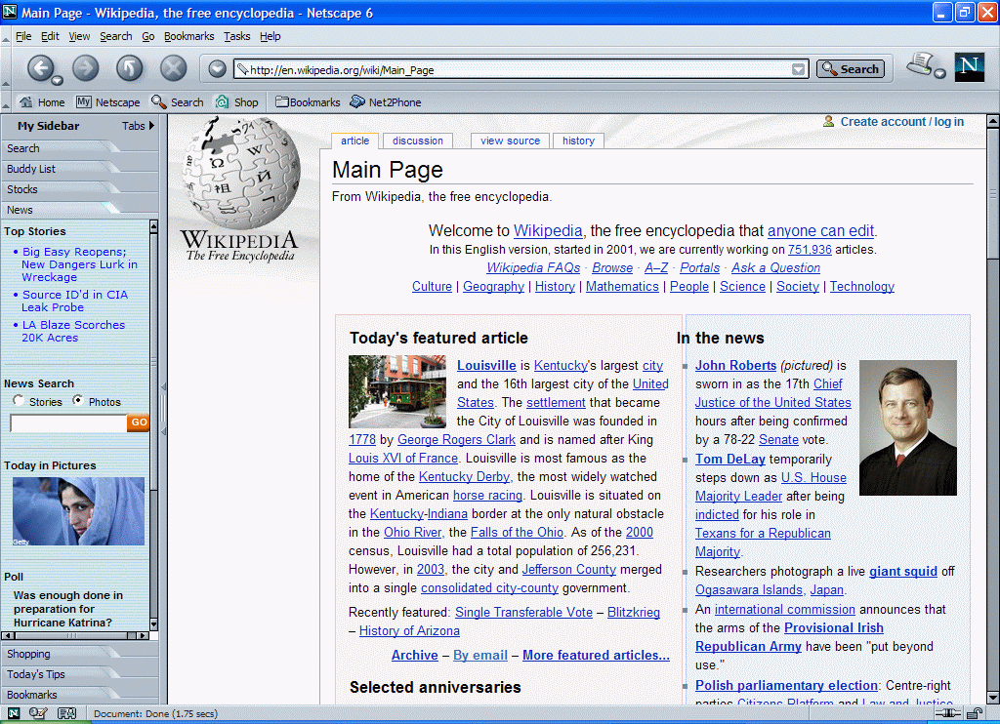

## 1\. Netscape

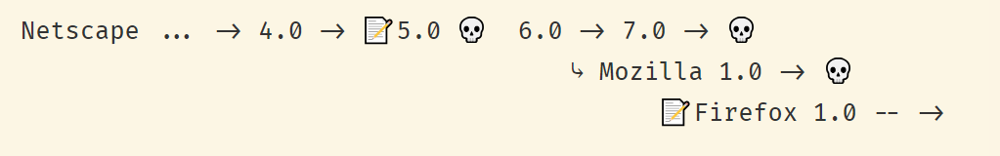

**Key:** 📝= rewrite, 💀 = dead end  

关键：📝=重写，💀=死路一条

Netscape’s disastrous 5.0/6.0 rewrite is the original poster child for “never rewrite”, thanks to Joel.  

Netscape灾难性的5.0/6.0重写是 "永不重写 "的原始海报，这要感谢Joel。

Netscape’s Navigator, first released in 1994, defined the early years of the commercial internet. Less than two years after it was released, the company’s $3-billion IPO launched the dot-com era.  

网景公司的Navigator于1994年首次发布，定义了商业互联网的早期阶段。在它发布后不到两年，该公司30亿美元的首次公开募股启动了网络时代。

Netscape’s first serious competition came from Microsoft’s Internet Explorer, which came out in 1996.  

网景公司的第一个严重竞争来自微软的IE浏览器，它于1996年问世。

At the beginning of 1998, Netscape was still the leading browser, but just barely.  

1998年初，网景仍然是领先的浏览器，但只是勉强。  

Netscape’s retail price was $49; Microsoft was giving IE away for free and shipping it with Windows as the default browser.  

网景公司的零售价为49美元；微软公司则免费赠送IE，并将其作为默认浏览器随Windows一起发送。

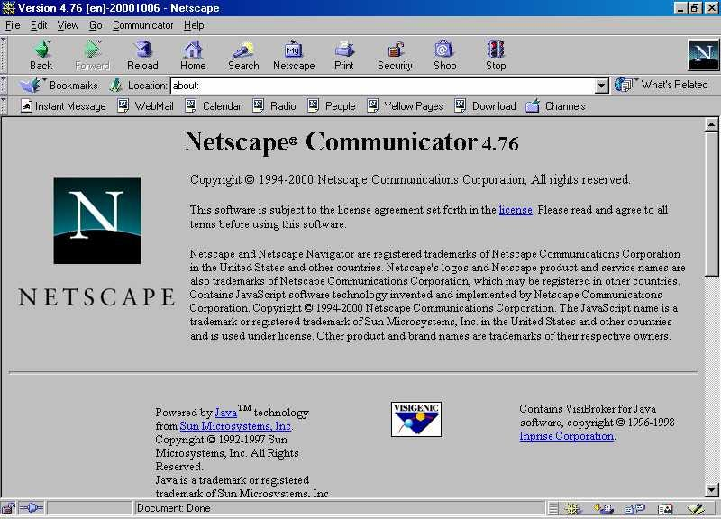

After version 4.0 of Netscape was released, the company [announced](https://www.cnet.com/news/netscape-sets-source-code-free/) that version 5.0 would be given away for free, and developed by an open source community created and funded by the company, called Mozilla.  

在网景的4.0版本发布后，该公司宣布5.0版本将免费赠送，并由该公司创建和资助的一个开源社区开发，称为Mozilla。

This was basically unprecedented at the time, and Netscape won a lot of goodwill for making a gutsy move. As it happened, though, the community didn’t really materialize.  

这在当时基本上是史无前例的，网景公司因为做出了大胆的举动而赢得了很多的好感。但事实是，这个社区并没有真正实现。  

Jamie Zawinski, one of the browser’s earliest developers, [explains](https://www.jwz.org/gruntle/nomo.html):  

浏览器最早的开发者之一Jamie Zawinski解释说：

> The truth is that, by virtue of the fact that the contributors to the Mozilla project included about a hundred full-time Netscape developers, and about thirty part-time outsiders, the project still belonged wholly to Netscape.  
> 
> 事实是，由于Mozilla项目的贡献者包括大约100名全职的网景公司的开发人员，以及大约30名兼职的外部人员，该项目仍然完全属于网景公司。

The team concluded that one reason outside developers weren’t interested in contributing to their open-source project was that the existing codebase was a mess:  

该团队的结论是，外部开发者对他们的开源项目不感兴趣的一个原因是，现有的代码库是一个混乱：

> The code was just too complicated and crufty and hard to modify, which is why people didn’t contribute … which is why we switched to the new layout engine.  
> 
> 这些代码太复杂，太繁琐，很难修改，这就是为什么人们没有贡献......这就是为什么我们转而使用新的布局引擎。  
> 
> A cleaner, newly-designed code base, so the theory went, was going to be easier for people to understand and contribute.  
> 
> 一个更干净的、新设计的代码库，理论上会更容易让人们理解和贡献。

## Starting with a clean sheet  

以干净的床单开始

So after a year the group decided to scrap their work on 5.0 without releasing it, and started from scratch on version 6.0.  

因此，一年后，该小组决定废止他们在5.0版本上的工作，不发布它，并从头开始开发6.0版本。

Another two years went by before Netscape 6.0 was finally released; and even after all that time it was clear that it still wasn’t ready to have been released. [According to New York Times’ reviewer](https://www.nytimes.com/2000/11/30/technology/state-of-the-art-netscape-6-browser-mixed-bag.html)  

又过了两年，网景6.0终于发布了；即使过了这么长时间，很明显它仍然没有准备好已经发布。 据《纽约时报》的评论员说

, it took a full minute to start up (!) and hogged memory. And it lacked a number of simple usability features that previous generations of the browser had:  

它需要整整一分钟的时间来启动（！）并占用内存。而且它缺乏前几代浏览器所具有的一些简单的实用性功能：

> The print-preview feature is gone, as is the ability to drag a Web site’s address-bar icon directly into the Bookmarks menu.  
> 
> 打印预览功能没有了，把网站的地址栏图标直接拖入书签菜单的功能也没有了。  
> 
> You can no longer copy or paste a Web address in the Address bar by right-clicking there, either.  
> 
> 你也不能再通过右键点击地址栏来复制或粘贴网页地址了。  
> 
> And you have to resize the browser window every time you begin surfing; Navigator doesn’t remember how you had it the last time you ran the program.  
> 
> 而且，每次开始冲浪时，你都必须调整浏览器窗口的大小；Navigator不会记住你上次运行程序时的情况。  
> 
> The most alarming flaw, however, is that you can’t highlight the entire Address bar with a single click.  
> 
> 然而，最令人震惊的缺陷是，你不能通过一次点击来突出整个地址栏。

Not that it mattered. In the three years that Netscape stood still, Internet Explorer had taken all of its remaining market share:  

这并不重要。在网景公司停滞不前的三年里，IE浏览器夺走了它剩余的所有市场份额：

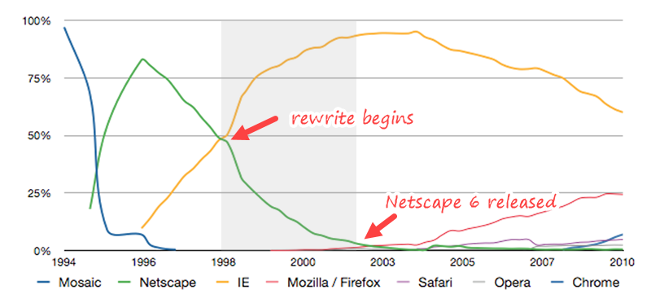

When the rewrite began, Netscape was losing ground quickly to Microsoft’s Internet Explorer.  

当重写开始时，网景公司正在迅速输给微软的IE浏览器。  

When the new browser was finally released three years later, it was buggy and slow; meanwhile Netscape’s market share had dwindled to practically nothing. (Chart adapted from [Wikipedia](https://en.wikipedia.org/wiki/Usage_share_of_web_browsers#/media/File:Usage_Share_of_browsers_(updated_August_2018).png).)  

三年后，当新的浏览器终于发布时，它又有毛病又慢；同时，网景公司的市场份额几乎降到了零。(图表改编自维基百科。)

In 1999, while the rewrite was underway, AOL had acquired Netscape in a deal valued at $10 billion.  

1999年，在改写的过程中，美国在线以100亿美元的价格收购了网景。

Just two years after Netscape 6.0 was released, the Netscape team within AOL was disbanded.  

就在网景6.0发布两年后，美国在线内部的网景团队被解散了。

Mozilla, the open-source community that Netscape had created, would go on to release the Firefox browser in 2002 — after yet _another_ ground-up rewrite. Firefox did manage to gain back some market share from Microsoft.  

网景公司创建的开源社区Mozilla将在2002年发布火狐浏览器--在又一次重写之后。火狐浏览器确实设法从微软手中夺回了一些市场份额。

But Netscape as a business was dead. (In a humiliatingly ironic footnote, Microsoft would end up with the remains of Netscape’s intellectual property after a [2012 deal with AOL](https://www.nytimes.com/2012/04/10/technology/microsoft-to-buy-aol-patents-for-more-than-1-billion.html).)  

但网景作为一项业务已经死亡。(在一个令人羞愧的讽刺性脚注中，微软在2012年与美国在线达成交易后，最终获得了网景的知识产权。）

Having won that battle, Microsoft pulled back on its investment in browser technology. Internet Explorer 6.0 was released in 2001 and didn’t get another upgrade for another _five years_, in what some see as a [deliberate strategy](https://en.wikipedia.org/wiki/Embrace,_extend,_and_extinguish) to prevent the web from advancing as platform for applications.  

在赢得这场战斗之后，微软撤回了对浏览器技术的投资。Internet Explorer 6.0于2001年发布，并在五年内没有再进行升级，有人认为这是一种故意的策略，以阻止网络作为应用平台的发展。

## Lessons

People have argued that the rewrite wasn’t a disaster in the long term, because the project eventually led to the Gecko engine and the Firefox browser.  

人们认为，从长远来看，重写并不是一场灾难，因为该项目最终导致了Gecko引擎和Firefox浏览器的诞生。

But we all had to endure years of stagnation in web technology under [IE6’s endless, suffocating monopoly](https://www.theguardian.com/technology/2009/oct/28/upgrading-internet-explorer-6) while we were waiting for new browser to gain traction; and what finally ended the IE6 era wasn’t Firefox but Google Chrome.  

但是我们都不得不忍受在IE6无休止的、令人窒息的垄断下网络技术多年的停滞不前，同时我们也在等待新的浏览器获得牵引力；而最终结束IE6时代的不是火狐，而是谷歌浏览器。

And anyway, the question at hand isn’t whether the rewrite was good for the web; it’s whether it was a good decision from the perspective of the company making the decision.  

而且，无论如何，目前的问题不是重写是否对网络有好处，而是从作出决定的公司的角度来看，这是否是一个好的决定。  

Netscape’s slide into irrelevance wasn’t entirely due to the rewrite — [a court agreed](https://en.wikipedia.org/wiki/United_States_v._Microsoft_Corp.) that Microsoft had deliberately abused their monopoly.  

网景公司的滑落并不完全是由于改写--法院同意微软故意滥用其垄断地位。

But the rewrite was certainly a contributing factor, and the end result was the destruction of a company worth billions of dollars and thousands of layoffs. So I’m going to agree with Joel that **the net consequences of this rewrite were disastrous**.  

但改写肯定是一个促成因素，而最终的结果是一个价值数十亿美元的公司被毁，成千上万的人被裁员。所以我同意乔尔的观点，即这次改写的净后果是灾难性的。

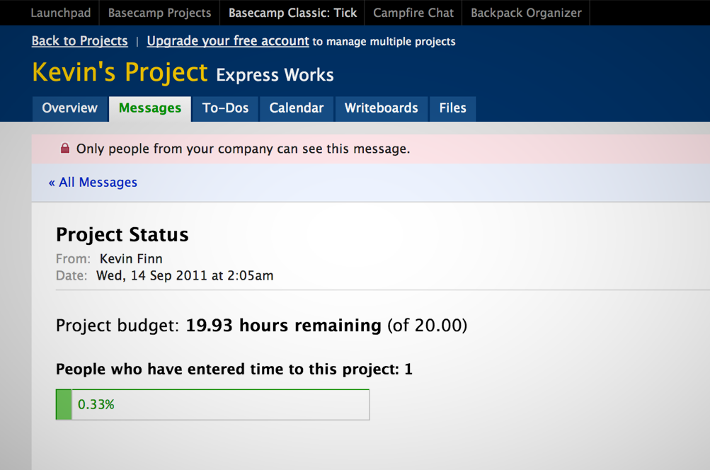

## 2\. Basecamp

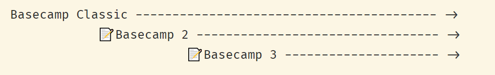

In the early 2000s, a Chicago web design company called **37signals** had built a following around founders  

在21世纪初，一家名为37signals的芝加哥网页设计公司已经围绕创始人建立了一批粉丝。

and

’s influential and often contrarian [blog](https://m.signalvnoise.com/).  

他的博客很有影响力，而且经常是逆向思维。

They originally caught my attention when I was just starting out as a web designer, with a series of unsolicited redesigns of sites like Google and PayPal, called [37better](https://web.archive.org/web/20050206094649/http://www.37signals.com/better).  

他们最初引起我的注意是在我刚开始做网页设计师的时候，通过对谷歌和贝宝等网站进行一系列不请自来的重新设计，称为37better。

In 2004, they took a project-management tool that [they had developed for internal use](https://basecamp.com/about/story), and released it as a software-as-a-service product called [Basecamp](https://signalvnoise.com/archives/000542.php).  

2004年，他们采用了他们为内部使用而开发的项目管理工具，并将其作为一个名为Basecamp的软件即服务产品发布。

This was at a time when subscribing to software was still a novelty.  

这是在订阅软件仍然是一个新事物的时候。  

Project management tools came in shrink-wrapped boxes with four-figure price tags and hefty manuals, and were all about modeling critical paths and generating complex Gantt charts.  

项目管理工具装在收缩包装的盒子里，有四位数的价格标签和厚厚的手册，而且都是关于关键路径的建模和生成复杂的甘特图。

Basecamp sold for $50 a month and was a breath of fresh air, with its super-simple interface and its focus on communication.  

Basecamp每月售价50美元，是一股新鲜的空气，它拥有超级简单的界面和对沟通的关注。

Fast forward a few years, Basecamp has half a million happy users, checks are rolling in every month, and Jason and David are starting to get restless.  

快进几年，Basecamp有50万快乐的用户，每个月都有支票滚滚而来，而杰森和大卫开始不安分了。

I saw David tell this story at the [Business of Software](http://www.businessofsoftware.org/) conference a few years ago. He said that not only had he been convinced by Joel Spolsky that rewriting software would kill the company, but [there was an element of self-righteousness](https://businessofsoftware.org/2015/10/david-heinemeier-hansson-rewrite-basecamp-business-of-software-conference-video-dhh-bos2015/) inspired by the Agile movement:  

几年前，我在 "软件商业 "会议上看到大卫讲这个故事。他说，他不仅被Joel Spolsky说服，认为重写软件会杀死公司，而且还有一种由敏捷运动激发的自以为是的因素：

> \[I was\] completely taken in with the idea of transcendent software. … That code is infinitely malleable. That legacy is infinitely valuable.  
> 
> \[我\]完全被超越软件的想法所吸引。......代码是无限可塑的。遗产的价值是无限的。  
> 
> That you can change anything, any piece of software, any piece of code can be rewritten. … If software is hard to change, it is your fault.  
> 
> 你可以改变任何东西，任何一块软件，任何一块代码都可以重写。...如果软件很难改变，那就是你的错。  
> 
> You’re a bad programmer and you just have to learn to be better.  
> 
> 你是一个糟糕的程序员，你只需要学习做得更好。

After what he calls “seven fat years”, though, they were in a bind — and it had **nothing to do with technical debt**.  

不过，在他所谓的 "七年之痒 "之后，他们陷入了困境--而这与技术债务无关。

## Golden handcuffs

They started by noticing _in their gut_ a lack of enthusiasm. Not only were they not motivated to work on their flagship product, but they themselves weren’t _using_ the product as much.  

他们一开始就注意到自己的内心深处缺乏热情。不仅是他们没有动力在他们的旗舰产品上工作，而且他们自己也不怎么使用这个产品了。

They had lots of ideas about how to make the product fundamentally better, but with hundreds of thousands of people building their workflows around Basecamp, every change they made was disruptive to lots and lots of people. **The obstacle to change wasn’t a crufty codebase, it was their users.**  

他们有很多关于如何从根本上改善产品的想法，但有成千上万的人围绕着Basecamp建立他们的工作流程，他们所做的每一个改变都会对很多很多人造成影响。变革的障碍并不是复杂的代码库，而是他们的用户。

Their focus on keeping their existing customer base happy was freezing the product in time, and preventing them from appealing to new customers.  

他们专注于保持现有客户群的快乐，使产品及时冻结，并阻止他们吸引新客户。  

This wasn’t an immediate problem for the business, but it posed a long-term threat. DHH used the metaphor of trying to keep a leaky bucket full:  

这对企业来说不是一个直接的问题，但它构成了一个长期的威胁。DHH用了一个比喻，即试图保持一个漏水的水桶满载：

> You might be plugging all the holes, you might be fixing all the bugs, you might be upgrading all the features the existing customers are complaining about so that no water escapes — but some water always escapes.  
> 
> 你可能会堵住所有的漏洞，你可能会修复所有的错误，你可能会升级现有客户抱怨的所有功能，这样就不会有水漏掉--但有些水总会漏掉。  
> 
> Customers move on from their job and they leave your software even if they \[love it\]. But you can kind of delude yourself that, “Hey, this bucket is more than half full still.  
> 
> 客户离开他们的工作，他们离开你的软件，即使他们\[喜欢它\]。但你可以自欺欺人地说："嘿，这个桶仍然有一半以上的容量。  
> 
> That’s just a tiny little hole there seeping out and that’s perfectly natural.” But, if you just keep that on for long enough, the bucket is going to end up empty.  
> 
> 那只是一个小孔在那里渗出，那是非常自然的。"但是，如果你只是保持这种状态足够长的时间，桶里的东西最终会被掏空。

Part of the problem is that you hear all the time from your present customers, but you don’t hear from your future customers:  

部分问题是，你一直听到你现在的客户的声音，但你没有听到你未来客户的声音：

> People who showed up at the Basecamp homepage in 2011 and chose not to buy because our ideas were no longer good enough, how often do you think we were hearing from them? Never.  
> 
> 2011年出现在Basecamp主页上的人，因为我们的想法不再好而选择不买，你认为我们多久会听到他们的声音？从来没有。  
> 
> We were hearing from this broad base of existing customers who very much would love us to just keep plugging those little holes.  
> 
> 我们从这个广泛的现有客户群中听到，他们非常希望我们能继续堵住这些小洞。

They started to see their profitable product as a set of golden handcuffs:  

他们开始将自己的盈利产品视为一套金手铐：

> The number one thing is just to make sure all the users you already have are still happy. The money just keeps coming in every month, new check, new check, new check. Great.  
> 
> 第一件事就是要确保你已经拥有的所有用户仍然满意。钱每个月都在不断涌入，新的支票，新的支票，新的支票。很好。  
> 
> But, you have to stick your arms forward and say, “Okay, I will never change my software again.”  
> 
> 但是，你必须把你的手臂向前伸，说："好吧，我永远不会再改变我的软件。"

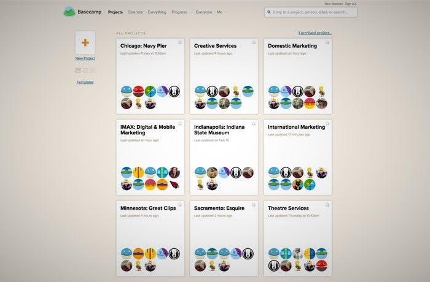

Spoiler alert: They rewrote Basecamp from scratch and it turned out great. It took around a year, and new signups doubled immediately following the release of Basecamp 2.  

剧透一下：他们从头开始重写Basecamp，结果很好。花了大约一年时间，在Basecamp 2发布后，新的注册人数立即翻了一番。

They did two interesting things that, I think, made this work.  

他们做了两件有趣的事情，我认为，这才是成功的。

First, **they didn’t try to rebuild the exact product they already had** — because they had new ideas about how to solve the problems they’d originally set out to solve.  

首先，他们没有试图重建他们已经拥有的确切产品--因为他们对如何解决他们最初着手解决的问题有新的想法。

> Are we really that arrogant to think that the ideas we had in 2003 were still going to be the very best ideas in 2011? I mean, I’ve been accused of being pretty arrogant, but I ran out of steam on that one in like 2008.  
> 
> 我们真的那么傲慢地认为我们在2003年的想法在2011年仍将是最好的想法吗？我的意思是，我一直被指责为非常傲慢，但我在2008年就已经没有动力了。

So they presented Basecamp 2 as a completely new product, with no guarantees that it would be backwards compatible with Basecamp Classic.  

所以他们把Basecamp 2作为一个全新的产品来介绍，并不保证它能向后兼容Basecamp Classic。  

Lots of things were new, other things were gone, and lots of things were just totally different.  

很多东西都是新的，其他东西已经消失了，还有很多东西就是完全不同。

That decision gave them a degree of freedom. Freedom is motivating, and motivated human beings get more done.  

这一决定给了他们一定程度的自由。自由是一种动力，而有动力的人可以完成更多的工作。

Not having to support every one of the original product’s use cases also bought them a lot of time. For example, the original Basecamp allowed users to host documents on their own FTP server.  

不需要支持原始产品的每一个用例也为他们赢得了大量的时间。例如，最初的Basecamp允许用户在他们自己的FTP服务器上托管文件。  

Cutting out that feature — and others like it, that might have made business sense at one time, but didn’t any more—made it possible to bring the new product to market in a reasonable amount of time.  

砍掉这个功能--以及其他类似的功能，这些功能在某一时期可能有商业意义，但现在已经没有了--使得在合理时间内将新产品推向市场成为可能。

## Sunset considered harmful  

日落被认为是有害的

But what about all those hundreds of thousands of existing users? All those people who complain loudly when their cheese is moved?  

但所有那些数十万的现有用户怎么办？所有那些在他们的奶酪被移动时大声抱怨的人？

That brings us to the second interesting thing they did, which was that **they didn’t sunset their existing product**.  

这给我们带来了他们所做的第二件有趣的事情，那就是他们没有让现有产品日落西山。

David riffed for a while on the notion of “sunsetting” software:  

大卫对 "日落 "软件的概念进行了一段时间的阐述：

> Someone somewhere came up with this beautiful euphemism called the sunset. … Let’s call killing software “sunsetting”. … All the users can sit on the beach and they can watch all their data fade away.  
> 
> 某地有人想出了这个美丽的委婉说法，叫做日落。......让我们把杀死软件称为 "日落"。......所有的用户都可以坐在海滩上，他们可以看着他们所有的数据消逝。  
> 
> It’s going to be beautiful!  
> 
> 它将会是美丽的!
> 
> The only people who believe in the “sunset” are the people who call it the “sunset”.  
> 
> 只有那些相信 "日落 "的人，才会把它称为 "日落"。  
> 
> No user who’s actually ever been through a period of sunset actually comes back and says, “Oh that was beautiful.” They come back and say, “Fuck! I put in years of work in this thing!  
> 
> 没有一个真正经历过夕阳时期的用户真正回来说，"哦，那很美。"他们回来后说，"他妈的！我在这个东西上花了好几年的时间！"！我在这个东西上投入了多年的工作！"！  
> 
> … And now you’re going to _sunset_ me?”  
> 
> ......而现在你要让我日落西山？"

He points out that when you force users to pack up and move, _that’s_ when you’re making “the worst strategic mistake ever”: Because you’re taking your entire recurring customer base and making them think about whether they want to keep using your software or move to something else altogether.  

他指出，当你强迫用户收拾行李搬家时，这就是你在犯 "有史以来最糟糕的战略错误"：因为你正在把你的整个经常性客户群带走，让他们考虑是否要继续使用你的软件，或者完全转向其他东西。

> “Is Basecamp even actually the thing I want anymore? If we have to move all our crap over anyway, maybe I can just move it somewhere else.  
> 
> "Basecamp实际上是我想要的东西了吗？如果我们必须把所有的垃圾搬过来，也许我可以把它搬到别的地方。  
> 
> If I have to pack it all up into boxes and load it on the truck, I can just send that truck across town instead. That’s not a big hassle. The big hassle is to pack up all my shit.  
> 
> 如果我必须把它全部打包成箱，然后装到卡车上，我可以直接把那辆卡车送到城市另一端。这并不是什么大麻烦。最大的麻烦是把我所有的东西都打包起来。  
> 
> Whether it goes to Basecamp again or it goes somewhere else, that’s not the big decision.”  
> 
> 无论它是再次进入Basecamp还是去别的地方，这都不是大的决定。"

David compares Basecamp Classic to a Leica M3: It hasn’t been manufactured since 1967, but Leica is still committed to supporting it and repairing it for as long as they’re in business. (Photo [Dnalor 01](https://commons.wikimedia.org/w/index.php?curid=27903569))  

大卫将Basecamp Classic比作徕卡M3：它自1967年以来就没有生产过，但徕卡仍然致力于支持它，只要他们还在营业，就会对它进行维修。(Photo Dnalor 01 )

Instead, Basecamp committed to “**honoring their legacy**”: They made it easy for people to upgrade, but didn’t require them to leave Basecamp Classic.  

相反，Basecamp承诺要 "尊重他们的遗产"：他们让人们很容易升级，但并不要求他们离开Basecamp Classic。  

Not only that, but they’ve committed to continuing to host, support, and maintain Basecamp Classic indefinitely.  

不仅如此，他们还承诺将继续无限期地托管、支持和维护Basecamp Classic。

The kicker is that, four years later, they did it all over again: [Basecamp 3 was released in 2015](https://signalvnoise.com/posts/3968-launch-basecamp-3), rewritten from the ground up, with some features cut, some added, and lots of things changed.  

最重要的是，四年后，他们又重新做了一遍： Basecamp 3于2015年发布，从头开始重写，削减了一些功能，增加了一些功能，并改变了很多东西。  

And just as before, users of older versions can easily upgrade — but if they prefer, they can continue using Basecamp Classic or Basecamp 2 “until the end of the internet”.  

就像以前一样，旧版本的用户可以轻松升级--但如果他们愿意，他们可以继续使用Basecamp Classic或Basecamp 2，"直到互联网结束"。

> Basecamp 3 is not going to sunset anything. Not the current version of Basecamp, not the classic, original version of Basecamp. Either of those work well for you? Awesome!  
> 
> Basecamp 3是不会日落西山的。不是当前版本的Basecamp，也不是经典、原始版本的Basecamp。这两个版本中的任何一个对你来说都很好用？棒极了!  
> 
> Please keep using them until the end of the internet! We’ll make sure they’re fast, secure, and always available.  
> 
> 请继续使用它们，直到互联网终结！我们将确保它们快速、安全和始终可用！我们将确保它们快速、安全，并始终可用。
> 
> But, but, but isn’t that expensive? Isn’t that hard? What about security? What about legacy code bases? Yes, what about it?  
> 
> 但是，但是，但是那不是很贵吗？这不是很难吗？安全问题怎么办？遗留的代码库怎么办？是的，那怎么办？  
> 
> Taking care of customers — even if they’re not interested in upgrading on our schedule — is what we do here.  
> 
> 照顾客户--即使他们对在我们的时间表上升级不感兴趣--是我们在这里的工作。

## Lessons

Personally, I find this model really inspiring.  

就我个人而言，我发现这种模式真的很鼓舞人心。

Each rewrite allowed Basecamp to revisit design decisions and build the product they wished they’d built the previous time.  

每一次重写都让Basecamp重新审视设计决定，并建立他们希望在前一次建立的产品。

For users, this is the best of both worlds: People who don’t like change don’t get their cheese moved; but people who are bumping against your product’s limitations get to work with a new and, hopefully better thought-out application.  

对于用户来说，这是两全其美的事情：不喜欢改变的人不会被动奶酪；但那些对你的产品的局限性感到不满的人可以使用一个新的、希望是经过更好考虑的应用程序。

Having to maintain multiple versions of product indefinitely doesn’t come without a price; but as David says:  

不得不无限期地维护多个版本的产品并不是没有代价的；但正如大卫所说：

> It’s not free. Why would you expect it to be free? It’s valuable, so of course it’s not free. But it’s worth doing.  
> 
> 这不是免费的。为什么你会期望它是免费的？它是有价值的，所以它当然不是免费的。但它是值得做的。

## 3\. Visual Studio & VS Code  

3.Visual Studio & VS Code

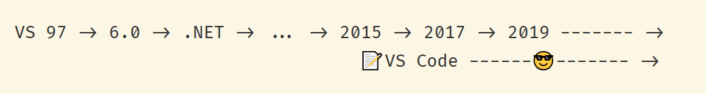

**Key**: 😎 = hipster cred  

钥匙：😎 = 时髦的信誉

Microsoft made VS Code in order to reach out to developers working on other platforms.  

微软制作VS Code的目的是为了接触在其他平台上工作的开发者。

You have to remember that for a long time, working in Microsoft’s world was an all-or-nothing proposition. If you used Visual Studio, you worked in .NET, and vice versa.  

你必须记住，在很长一段时间里，在微软的世界里工作是一个全有或全无的主张。如果你使用Visual Studio，你就在.NET中工作，反之亦然。  

This split the software community into two big, mostly mutually exclusive camps — to everyone’s detriment.  

这就把软件界分成了两大阵营，大多是相互排斥的阵营--对所有人都不利。

## Reaching out to the cool kids  

与酷儿们接触

That started to change even in the Steve Ballmer years— remember what a huge deal it was when [the ASP.NET team decided not to reinvent jQuery](https://weblogs.asp.net/scottgu/jquery-and-microsoft)!  

这甚至在史蒂夫-鲍尔默的年代就开始改变了--记得当ASP.NET团队决定不重新发明jQuery时，这是多么大的一件事啊!

It’s become one of CEO Satya Nadella’s principal missions for Microsoft to explicitly appeal to developers outside its walled garden.  

明确吸引围墙外的开发者，已经成为微软CEO萨蒂亚-纳德拉的主要任务之一。

But as Julia Liuson, VP of Visual Studio puts it in [this episode of The Changelog podcast](https://changelog.com/podcast/277):  

但正如Visual Studio副总裁Julia Liuson在本期The Changelog播客中所说的那样：

> We didn’t have anything for this whole class of developers — modern, webby, Node-oriented developers, JavaScript — we had nothing to talk to you about.  
> 
> 我们没有任何东西给这一类的开发者--现代的、网络的、面向Node的开发者、JavaScript--我们没有任何东西可以和你谈。  
> 
> You were a developer we were never gonna be able to attract, at all.  
> 
> 你是一个我们永远无法吸引的开发商，根本不可能。
> 
> So the motivation for VS Code was to break down that barrier and say “Actually, you know what? We do have something that you could use.”  
> 
> 因此，VS Code的动机是要打破这种障碍，说 "事实上，你知道吗？我们确实有你可以使用的东西"。

Visual Studio is a heavyweight product in every sense: It can take upwards of half an hour to install. It has to support a wide variety of complex use cases relied on by enterprise customers.  

Visual Studio在任何意义上都是一个重量级的产品：它可能需要超过半个小时的时间来安装。它必须支持企业客户所依赖的各种复杂用例。  

So it wouldn’t have made sense to use Visual Studio itself as a starting point, for Microsoft to try to appeal to other platforms by _adding_ features. And presumably the idea of making Mac or Linux versions of Visual Studio was a non-starter.  

因此，对于微软来说，用Visual Studio本身作为起点，通过增加功能来吸引其他平台是没有意义的。据推测，制作Mac或Linux版本的Visual Studio的想法是不可行的。

So Microsoft started from scratch with no guarantees of backwards compatibility.  

所以微软从头开始，没有保证向后兼容。

Not quite from scratch, actually: Microsoft already had some important parts lying around, such as the in-browser Monaco editor.  

实际上，并不是完全从头开始：微软已经有了一些重要的部分，如浏览器中的摩纳哥编辑器。  

And because VS Code is a Node.js app (written in Typescript and run in Electron), they were able to take advantage of the rich JavaScript ecosystem.  

由于VS Code是一个Node.js应用程序（用Typescript编写并在Electron中运行），他们能够利用丰富的JavaScript生态系统。

VS Code is open-source, lightweight, fast, and extensible; and — amazingly for a Microsoft product — it’s become the coding environment of choice for the cool kids.  

VS Code是开源的、轻量级的、快速的、可扩展的；而且--对于微软的产品来说，令人惊讶的是--它已经成为酷儿们的首选编码环境。

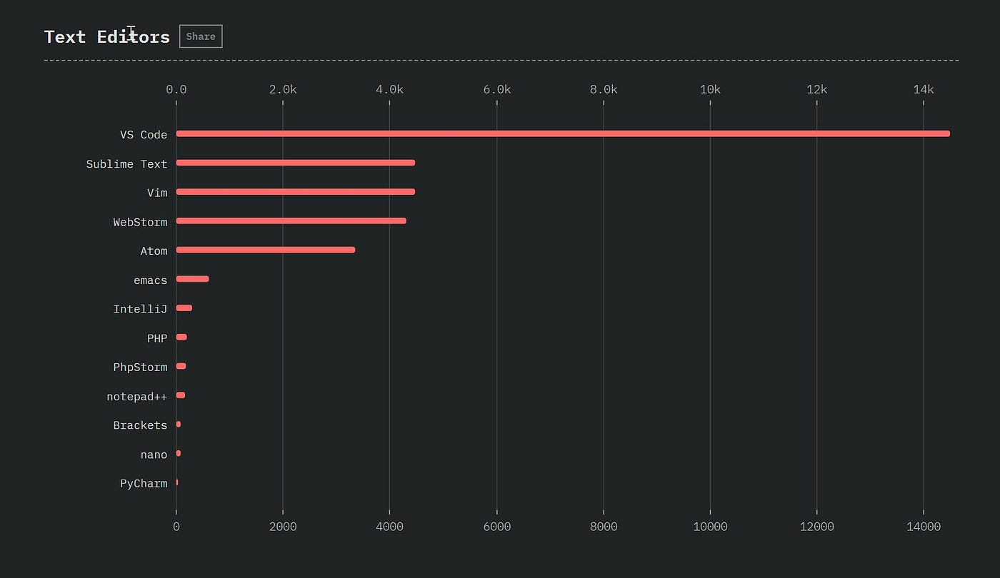

VS Code has become the text editor of choice for JS hipsters. (Chart from [State of JavaScript Survey, 2018](https://2018.stateofjs.com/other-tools/))  

VS Code已经成为JS潮人的首选文本编辑器。(图表来自2018年JavaScript现状调查 )

Both products are still actively developed, and there’s no indication that Microsoft intends to sunset Visual Studio.  

这两种产品仍然在积极开发，没有迹象表明微软打算让Visual Studio日落。

## **Lessons**

In stark contrast to Netscape’s experience, Microsoft succeeded in building an **active open source community** around VS Code. This community has multiplied the efforts of the in-house development team.  

与网景的经历形成鲜明对比的是，微软成功地围绕VS Code建立了一个活跃的开源社区。这个社区使内部开发团队的努力成倍增加。

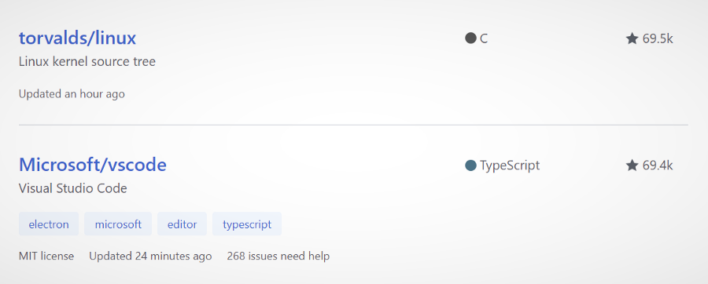

Of all the open source projects on GitHub, Visual Studio Code is ranked thirteenth by number of stars — coincidentally, just below Linux!  

在GitHub上的所有开源项目中，Visual Studio Code按星数排名第十三位--巧合的是，仅次于Linux!

Of course, not everyone has a business model that will support completely open sourcing their core product.  

当然，并不是每个人的商业模式都能支持完全开放其核心产品的外包。

But if open source is a part of your development strategy, it might be worth comparing these two case studies to find out what Microsoft did so differently that caused this community to flourish.  

但是，如果开源是你的开发战略的一部分，也许值得比较这两个案例研究，以找出微软的不同之处，导致这个社区的繁荣。

Another multiplier: Microsoft also equipped VS Code with a **solid extensibility model**, and as a result nearly 10,000 extensions have been written by the community.  

另一个倍增器：微软还为VS Code配备了一个坚实的可扩展性模型，因此，社区已经编写了近10000个扩展。

One final takeaway from the VS Code story is that things have changed fundamentally in the last few years, in a way that makes it **easier than ever to prototype and create software**.  

从VS代码的故事中得到的最后一个启示是，在过去的几年里，事情发生了根本性的变化，其方式是使原型和创建软件比以往更容易。

In spite all of the [hand-wringing about the complexity of today’s toolset](https://hackernoon.com/how-it-feels-to-learn-javascript-in-2016-d3a717dd577f), the fact is that the JavaScript ecosystem has evolved over the last few years into the long-awaited promised land of reusable, modular open-source code.  

尽管人们对今天的工具集的复杂性感到忧心忡忡，但事实是，在过去的几年里，JavaScript生态系统已经发展成为人们期待已久的可重用、模块化的开源代码的承诺之地。  

In that respect, this is a historically unprecedented time.  

在这方面，现在是一个历史上前所未有的时代。

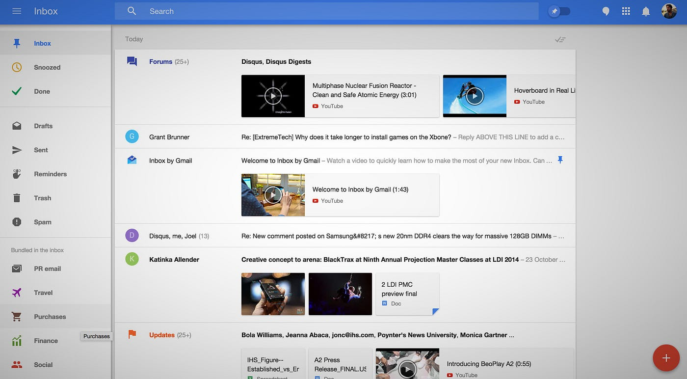

## 4\. Gmail & Inbox  

4.Gmail和收件箱

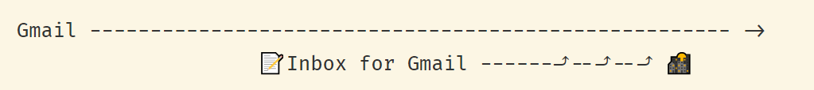

**Key:** 🌇 = sunset  

关键词： 🌇 = 日落

Inbox for Gmail was originally introduced as a stripped-down alternative UX for Gmail “designed to focus on what really matters”.  

Gmail的收件箱最初是作为Gmail的一个精简的替代用户体验而推出的，"旨在关注真正重要的东西"。  

It never approached feature parity with the original Gmail, and it introduced new features like bundles, pinned emails, and snoozed messages.  

它从未与最初的Gmail的功能相提并论，而且它引入了一些新的功能，如捆绑、钉住的邮件和打盹的邮件。

Some people, including me, adopted Inbox enthusiastically.  

一些人，包括我在内，热情地采用了Inbox。  

I always assumed that Inbox was a preview of what Gmail would eventually become, and put up with the lack of some of Gmail’s niceties with the expectation that they’d eventually make it over to Inbox.  

我一直认为收件箱是Gmail最终会成为的一个预览，并忍受了Gmail的一些缺陷，期望它们最终会进入收件箱。

## Two interfaces, one service  

两个接口，一个服务

Both Inbox and Gmail used the same back end. They were essentially just different user interfaces for the same service, and you could switch back and forth at will.  

Inbox和Gmail都使用相同的后端。它们本质上只是同一服务的不同用户界面，你可以随意来回切换。  

This had advantages and disadvantages: If Inbox was missing a feature (say, vacation autoresponders) you could always go back to Gmail and do what you needed there.  

这有优点也有缺点：如果收件箱缺少一个功能（例如，假期自动回复），你可以随时回到Gmail，在那里做你需要的事情。  

But there was some inevitable weirdness when switching back and forth.  

但在来回切换时，不可避免地出现了一些怪事。

After a while, though, Inbox stopped improving, and it became clear that Google was no longer investing any resources in it.  

不过，一段时间后，收件箱停止了改进，而且很明显，谷歌不再对其投入任何资源。  

Sure enough, four years after it was launched, Google announced that it would be [sunsetting Inbox](https://www.theverge.com/2018/9/12/17848500/google-inbox-shut-down-sunset-snooze-email-march-2019).  

果然，在它推出四年后，谷歌宣布它将关闭收件箱。

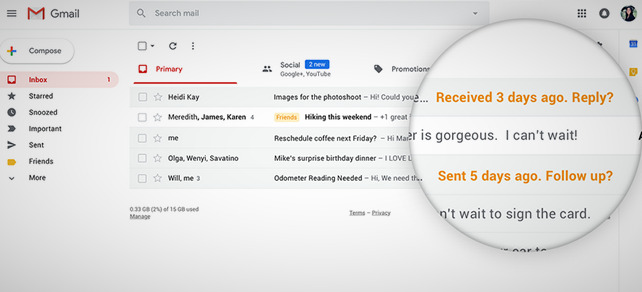

I was initially very annoyed, but after spending a little time with the latest version of Gmail, I found that **many of my favorite features from Inbox had been ported to the original product**: Smart Reply, hover actions, and inline attachments and images. Gmail’s multiple inboxes were a good-enough stand-in for Inbox’s bundles.  

我最初非常恼火，但在花了一点时间使用最新版本的Gmail后，我发现我最喜欢的Inbox的许多功能都被移植到了原来的产品上：智能回复，悬停动作，以及内联附件和图片。Gmail的多个收件箱很好地替代了Inbox的文件包。

But not everything made it over: Snoozing, for example, became a critical part of how many people dealt with email; and the demise of Inbox left them high and dry.  

但并不是所有东西都能成功：例如，打瞌睡成为许多人处理电子邮件的一个关键部分；而收件箱的消亡则使他们的生活陷入困境。

## Lessons

Inbox gave the Gmail team a way to **experiment with features without disrupting workflows** for the vast majority of users who didn’t choose to switch over.  

收件箱给了Gmail团队一种实验功能的方式，而不会扰乱绝大多数没有选择转换的用户的工作流程。

By committing to having both versions use the **same back end**, though, Gmail put **hard limits on their own ability to innovate**.  

不过，通过承诺让两个版本都使用相同的后端，Gmail对他们自己的创新能力进行了严格限制。

Google got a lot of criticism, yet again, for shutting down a popular service. Of course, Google [discontinues](https://www.businessinsider.com/why-people-still-love-google-glass-2016-5?IR=T) [products](https://www.businessinsider.com/google-puts-wave-out-of-its-misery-2010-8?IR=T) [all](https://www.businessinsider.com/why-google-killed-google-reader-2013-6?IR=T) [the](https://www.theverge.com/2018/12/10/18134541/google-plus-privacy-api-data-leak-developers) [time](https://www.businessinsider.es/google-allo-shut-down-report-2018-12?r=US&IR=T), so what did we expect.  

谷歌又一次因为关闭一个受欢迎的服务而受到很多批评。当然，谷歌一直在停止产品，所以我们期待什么呢。

In this case, Google’s original messaging around Inbox led us to believe that we were getting an early look at the future of Gmail.  

在这种情况下，谷歌围绕收件箱发出的原始信息使我们相信，我们将提前看到Gmail的未来。  

As DHH would say, this was not a beautiful sunset; for many people it sucked to have to go back to the old product, and lose Inbox’s innovative workflows.  

正如DHH所说，这不是一个美丽的日落；对许多人来说，不得不回到旧的产品，失去Inbox的创新工作流程，这很糟糕。

I think there would have been less unhappiness if Gmail had gone all the way to feature parity with Inbox before it was shuttered.  

我认为，如果Gmail在被关闭之前，一路走到与Inbox的功能相同，就不会有那么多的不愉快。

## 5\. FogBugz & Trello  

5.FogBugz & Trello

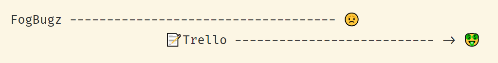

**Key**: 😟 = sad decline, 🤑 money money money  

钥匙：😟=悲伤的衰退，🤑钱钱钱

FogBugz is a particularly interesting case, since it was Joel Spolsky’s product: It gives us a look at how the never-rewrite principle plays out with a real-world product.  

FogBugz是一个特别有趣的案例，因为它是Joel Spolsky的产品：它让我们看到了永不重写的原则是如何在一个真实世界的产品中发挥作用的。

Before there was Jira, before there was GitHub Issues, there was a web-based bug-tracking product called FogBugz.  

在有Jira之前，在有GitHub Issues之前，有一个基于网络的错误跟踪产品，叫做FogBugz。  

Released in 2000, it was the first product of Fog Creek Software, the firm Joel had recently founded with Michael Pryor; and it was their flagship product for more than a decade.  

它于2000年发布，是Fog Creek软件公司的第一个产品，该公司是乔尔最近与迈克尔-普赖尔（Michael Pryor）共同创建的；它是他们十多年来的旗舰产品。  

They initially only sold it as shrink-wrapped software to be installed on your own servers, but later came out with a hosted, subscription version.  

他们最初只把它作为收缩包装的软件出售，安装在你自己的服务器上，但后来又推出了托管、订阅版本。

It became very popular, especially among the kind of developer who, like me, followed Joel’s blog and took his advice to heart. My company used it for many years; it was a great product for its time.  

它变得非常流行，特别是在像我一样关注Joel的博客并把他的建议放在心上的那种开发者中。我的公司使用它很多年了；它在那个时代是一个伟大的产品。

FogBugz was originally written in classic ASP, which ran on Windows servers. When ASP.NET came out, Joel explained why he was [in no hurry to upgrade](https://www.joelonsoftware.com/2002/04/11/our-net-strategy/).  

FogBugz最初是用经典的ASP编写的，它在Windows服务器上运行。当ASP.NET出现时，Joel解释了为什么他不急于升级.NET。

In order to allow people to install FogBugz on Linux servers, an intern wrote a compiler, named Thistle, to convert classic ASP to PHP.  

为了让人们在Linux服务器上安装FogBugz，一个实习生写了一个编译器，名为Thistle，将经典的ASP转换成PHP。  

By 2006 Thistle had evolved into a private home-grown language called Wasabi that compiled to ASP, PHP, and client-side JavaScript.  

到2006年，Thistle已经发展成为一种私人自创的语言，称为Wasabi，可以编译成ASP、PHP和客户端JavaScript。

## The strange story of Wasabi  

山葵的奇怪故事

Now developing an in-house, proprietary programming language and compiler is — let’s just say it’s an eccentric choice. So bear with me on a brief detour.  

现在，开发一种内部专有的编程语言和编译器是--我们只能说这是一个古怪的选择。因此，请允许我简短地绕行一下。

At one point [Joel described Wasabi in an off-hand paragraph at the end of a blog post](https://www.joelonsoftware.com/2006/09/01/language-wars/). Apparently some people thought he wasn’t serious, and he [clarified that he was](https://www.joelonsoftware.com/2006/09/01/wasabi/). This caused fellow blogger Jeff Atwood’s [head to explode](https://blog.codinghorror.com/has-joel-spolsky-jumped-the-shark/):  

有一次，乔尔在一篇博文的结尾处随口描述了Wasabi。显然，有些人认为他不是认真的，他澄清说他是认真的。 这使同为博主的杰夫-阿特伍德的头都炸了：

> Writing your own language is absolutely beyond the pale. It’s a toxic decision that is so completely at odds with Joel’s previous excellent and sane advice on software development that _people literally thought he was joking_.  
> 
> 编写你自己的语言是绝对不可能的。这是一个有毒的决定，与Joel以前关于软件开发的优秀而理智的建议完全相悖，人们简直以为他在开玩笑。

Joel [maintained](https://discourse.codinghorror.com/t/has-joel-spolsky-jumped-the-shark/732/48) that it all made business sense: Of course you wouldn’t invent your own language if you were starting from a clean slate.  

乔尔坚持认为，这一切都有商业意义：如果你从一块白板开始，你当然不会发明自己的语言。  

But if you look at each decision along the way, considering the technological context _at the time_ and the codebase they had _at the time_, you can see how you would end up there.  

但是，如果你看看沿途的每个决定，考虑到当时的技术背景和他们当时的代码库，你可以看到你会如何结束。

Reflecting on Wasabi in a thoughtful essay titled “[Technical Debt and Tacking Into the Wind](https://https.www.google.com.tedunangst.com/flak/post/technical-debt-and-tacking-into-the-wind)”, former Fog Creek engineer Ted Unangst compares the process to traveling without a map:  

前Fog Creek工程师Ted Unangst在一篇题为 "技术债务和迎风而上 "的文章中对Wasabi进行了反思，他将这一过程比作没有地图的旅行：

> Imagine you’re in Savannah, Georgia and you want to go to London, England. You don’t have a map, just a vague sense of direction.  
> 
> 想象一下，你在乔治亚州的萨凡纳，你想去英国的伦敦。你没有地图，只有一个模糊的方向感。  
> 
> … You can’t go in a straight line, at least not without building a boat, because there’s an ocean in the way. But there’s a nice beach leading northeast, which is in the direction you want to go.  
> 
> ......你不能走直线，至少不造船是不行的，因为有大海挡着。但有一个漂亮的海滩通往东北方向，那是你想去的方向。  
> 
> Off you go. Time passes. You notice you’re not heading directly to your destination, but with each step you take, you are getting closer.  
> 
> 你走了。时间过去了。你注意到你没有直接前往你的目的地，但你每走一步，你就会越来越近。
> 
> Somewhere around Boston, or maybe Nova Scotia, you finally stop and think about your choices. Maybe this isn’t the way to London. From high above in the peanut gallery, you can hear the cackles.  
> 
> 在波士顿附近的某个地方，或许是新斯科舍省，你终于停下来，思考你的选择。也许这不是去伦敦的路。从高处的花生画廊，你可以听到咯咯的笑声。  
> 
> “Hahaha, look at these retards. Can’t tell the difference between England and New England. Get these fools a map.” But that’s just the thing; you didn’t have a map.  
> 
> "哈哈哈，看看这些弱智。分不清英格兰和新英格兰的区别。给这些傻瓜一张地图。"但这恰恰是问题所在；你没有地图。  
> 
> Maps are made by people who, almost by definition, don’t know where they’re going.  
> 
> 地图是由那些几乎顾名思义不知道自己要去哪里的人制作的。

At any rate, as Jacob Krall, another former Fog Creek developer, [explains](https://jacob.jkrall.net/killing-off-wasabi-part-1), this decision traded off developer velocity today for maintainability tomorrow — the definition of technical debt — and by 2010 the bill for this debt was starting to come due.  

无论如何，正如另一位前Fog Creek的开发者Jacob Krall所解释的那样，这个决定以今天的开发者速度换取明天的可维护性--技术债务的定义--到2010年，这笔债务的账单已经开始到期了。

> We hadn’t open-sourced \[Wasabi\], so this meant any investment had to be done by us at the expense of our main revenue-generating products.  
> 
> 我们没有将\[Wasabi\]开源，所以这意味着任何投资都必须由我们自己来完成，并牺牲我们的主要创收产品。  
> 
> … It was a huge dependency that required a full-time developer — not cheap for a company of our size. It occasionally barfed on a piece of code that was completely reasonable to humans.  
> 
> ......这是一个巨大的依赖性，需要一个全职的开发人员--对于我们这种规模的公司来说并不便宜。它偶尔会在一段代码上呕吐，这对人类来说是完全合理的。  
> 
> It was slow to compile. Visual Studio wasn’t able to easily edit or attach a debugger to FogBugz. … All new hires had an extensive period of learning Wasabi, regardless of their previous experience.  
> 
> 它的编译速度很慢。Visual Studio不能轻易编辑或将调试器附加到FogBugz上。......所有的新员工都有一个广泛的学习Wasabi的时期，不管他们以前的经验如何。  
> 
> … What’s more, we weren’t living in a vacuum. Programming languages were of course improving outside of Fog Creek.  
> 
> ......更重要的是，我们不是生活在真空中。当然，编程语言在Fog Creek之外也在不断改进。  
> 
> … Developers began to feel like their brilliant ideas were being constrained by the limitations of our little Wasabi universe.  
> 
> ......开发人员开始感到他们的杰出想法被我们的Wasabi小宇宙的限制所制约。

## An inflection point  

一个拐点

At this point, a decade in, FogBugz was a mature and stable product. [Joel had created Stack Overflow as a side project with Jeff Atwood](https://blog.codinghorror.com/introducing-stackoverflow-com/) (presumably his exploded head had had time to heal by then).  

在这一点上，十年来，FogBugz是一个成熟和稳定的产品。 乔尔与杰夫-阿特伍德（Jeff Atwood）一起创建了Stack Overflow，作为一个副业（想必那时他爆炸的脑袋已经有时间愈合了）。

FogBugz wasn’t setting the world on fire, and it was showing its age.  

FogBugz并没有让世界着火，而且它正在显示出它的年龄。  

While the market for bug trackers was still fragmented, Atlassian’s Jira — which had come out a couple of years after FogBugz — had become the default choice, especially for bigger enterprise users.  

虽然错误跟踪器的市场仍然是分散的，但Atlassian的Jira--在FogBugz之后几年问世--已经成为默认的选择，特别是对于较大的企业用户。

I’m a little fascinated by this particular inflection point in Fog Creek’s history. Like Basecamp, they had a profitable, mature product.  

我对Fog Creek历史上的这个特殊拐点有点着迷。像Basecamp一样，他们有一个盈利的、成熟的产品。  

It was no longer sexy, and probably not very exciting to work on. It embodied, for better and for worse, years of technological shifts and evolving ideas about how to solve a specific problem space.  

它不再是性感的，而且可能也不是非常令人兴奋的工作。无论好坏，它都体现了多年来的技术转变和关于如何解决一个特定问题空间的不断发展的想法。

One response, of course, would have been to do as Basecamp did: Take everything Fog Creek had learned about bug tracking, and reinvent FogBugz, starting from a clean slate.  

当然，一种回应是像Basecamp那样做：把Fog Creek在错误跟踪方面所学到的所有东西都拿出来，从一块白板开始，重新创造FogBugz。

I’m guessing this idea didn’t go very far— “things you should never do”, “worst strategic mistake”, etc. etc.  

我猜这个想法并没有走得很远--"你永远不应该做的事情"，"最糟糕的战略错误"，等等。

I recently came across an article from 2009, when Joel was writing a monthly column for _Inc. Magazine._ This column, titled “[Does Slow Growth Equal Slow Death?](https://web.archive.org/web/20151212054843/https://www.inc.com/magazine/20091101/does-slow-growth-equal-slow-death.html)”, has a very different tone from his usual self-assured bombast: It’s introspective, tentative, doubtful.  

我最近看到了2009年的一篇文章，当时乔尔正在为Inc.杂志撰写每月专栏。杂志的月度专栏。这篇题为 "缓慢增长是否等于缓慢死亡？"的文章，其语气与他平时自以为是的狂轰滥炸截然不同：它是内省的、试探性的、怀疑的。  

He frets about Atlassian’s rapid growth — wondering if in the end there’s only space for one product in the bug-tracking market.  

他对Atlassian的快速增长感到担忧--他想知道在错误追踪市场上，最终是否只有一个产品的空间。

> I had to wonder. We do have a large competitor in our market that appears to be growing a lot faster than we are. The company is closing big deals with big, enterprise customers.  
> 
> 我不得不怀疑。在我们的市场上确实有一个大型的竞争对手，其增长速度似乎比我们快得多。该公司正在与大型企业客户完成大宗交易。  
> 
> … Meanwhile, our product is miles better, and we’re a well-run company, but it doesn’t seem to matter. Why?  
> 
> ......同时，我们的产品要好得多，而且我们是一家运营良好的公司，但这似乎并不重要。为什么？

So he resolves to do two things. First, **add All The Features to FogBugz**:  

因此，他决心做两件事。第一，为FogBugz添加所有功能：

> That's the development team's mission for 2010: to eliminate any possible reason that customers might buy our competitors' junk, just because there is some dinky little feature that they told themselves they absolutely couldn't live without.  
> 
> 这就是开发团队2010年的任务：消除客户可能购买我们竞争对手的垃圾的任何可能的理由，只是因为有一些微小的功能，他们告诉自己绝对不能没有。  
> 
> I don't think this is going to be very hard, frankly.  
> 
> 坦率地说，我不认为这将是非常困难的。

Second, **build up an enterprise sales force**. Joel confesses that this is something that he’s not good at, and finds distasteful.  

第二，建立一支企业销售队伍。乔尔承认，这是他不擅长的事情，而且觉得很不爽。

I don’t know how either of those two plans played out. The last time Joel ever mentioned FogBugz on his blog was a perfunctory announcement of a minor release [a few months later](https://www.joelonsoftware.com/2010/05/18/news-128/).  

我不知道这两个计划的结果如何。乔尔最后一次在他的博客上提到FogBugz是在几个月后敷衍地宣布了一个小版本。

## A new hope  

一个新的希望

What did happen was [this](https://www.joelonsoftware.com/2011/09/13/announcing-trello/):  

实际发生的情况是这样的：

> Around the time of Fog Creek Software’s ten year anniversary, I started thinking that if we want to keep our employees excited and motivated for another ten years, we were going to need some new things to work on.  
> 
> 在Fog Creek软件公司成立十周年前后，我开始思考，如果我们想让我们的员工再保持十年的兴奋和动力，我们就需要一些新的工作内容。

So they split up into teams of two, with each team working to come up with and prototype a new product idea.  

因此，他们分成两个小组，每个小组努力想出一个新的产品创意并制作原型。

The winning idea was inspired by the [Kanban board](https://en.wikipedia.org/wiki/Kanban_board) — a physical tool, often used in software development, generally involving Post-It notes distributed across columns on a whiteboard.  

获奖创意的灵感来自于看板--一种物理工具，经常用于软件开发，通常涉及到分布在白板上各列的便利贴纸。

Joel presented it as a tool for managing work at a higher level than FogBugz allowed:  

Joel把它介绍为一个在比FogBugz允许的更高层次上管理工作的工具：

> Honestly, with all the fancy-schmancy “project management” software out there, I never found a way to keep track of who’s supposed to be working on what.  
> 
> 说实话，在所有花哨的 "项目管理 "软件中，我从未找到一种方法来跟踪谁应该在做什么。  
> 
> … As the founder of two companies it was starting to get distracting to walk down the hallways seeing dozens of people getting paid to sit at computers … and I had no idea if they were doing the exact right thing, or maybe something they thought was important but which, nevertheless, was not, actually, important.  
> 
> ......作为两家公司的创始人，走在走廊上，看到几十个人拿着钱坐在电脑前，我开始分心了......我不知道他们是否在做完全正确的事情，或者是他们认为重要的事情，但实际上却并不重要。

In building Trello, Fog Creek’s developers got a chance to use contemporary technologies, for a change:  

在建立Trello的过程中，Fog Creek的开发人员有机会使用当代技术，这是一种改变：

> We use cutting edge technology. Often, this means we get cut fingers. Our developers bleed all over MongoDB, WebSockets, CoffeeScript and Node. But at least they’re having fun.  
> 
> 我们使用最先进的技术。通常，这意味着我们会被割伤手指。我们的开发人员在MongoDB、WebSockets、CoffeeScript和Node上到处流血。但至少他们是在享受乐趣。  
> 
> And in today’s tight job market, great programmers have a lot of sway on what they’re going to be working on. If you can give them an exciting product … they’ll have fun and they’ll love their jobs.  
> 
> 而在当今紧张的就业市场上，优秀的程序员对他们将要从事的工作有很大的支配权。如果你能给他们一个令人兴奋的产品......他们就会有乐趣，他们就会热爱他们的工作。

Trello also multiplied their in-house development team’s efforts by enabling third-party plug-ins from the beginning:  

Trello还通过从一开始就启用第三方插件，使他们的内部开发团队的努力倍增：

> The API and plug-in architectures are the highest priority. … Never build anything in-house if you can expose a basic API and get those high-value users … to build it for you.  
> 
> API和插件的架构是最优先的。......如果你能公开一个基本的API，并让那些高价值的用户......为你建立它，就不要在内部建立任何东西。  
> 
> On the Trello team, any feature that can be provided by a plug-in must be provided by a plug-in.  
> 
> 在Trello团队中，任何可以由插件提供的功能都必须由插件提供。

Programmers, of course, saw the utility of Trello right away; but there was nothing in the tool that was specific to software development. Joel [described it](https://www.joelonsoftware.com/2012/01/06/how-trello-is-different/) as useful for “anything where you want to maintain a _list of lists_ with a group of people.” Trello was soon being used to organize everything from [weekly meals](https://trello.com/b/E4UE6LGG/serious-eats-with-j-kenji-l%C3%B3pez-alt-the-food-lab) to [weddings](http://totravelandbeyond.com/trello-for-wedding-planning/) to [animal shelters](https://trello.com/b/pyqI4Zki/apa-dog-foster-program-plea-board).  

当然，程序员们马上就看到了Trello的效用；但该工具中没有任何专门针对软件开发的内容。乔尔将其描述为对 "任何你想和一群人一起维护一个列表的事情 "都很有用。Trello很快就被用来组织从每周膳食到婚礼到动物收容所的所有事情。

Where FogBugz was a **vertical** product — targeted at a specific niche market — Trello was a **horizontal** product, that could be used by anyone for anything. Joel argues that “going horizontal” was the right thing to do for FogBugz at this juncture:  

FogBugz是一个垂直产品--针对特定的利基市场--而Trello是一个水平产品，任何人都可以用于任何事情。乔尔认为，"横向发展 "是FogBugz在这个时刻所要做的正确事情：

> Making a major horizontal product that’s useful in any walk of life is almost impossible to pull off.  
> 
> 制作一个在任何各行各业都有用的主要水平产品，几乎是不可能完成的。  
> 
> You can’t charge very much, because you’re competing with other horizontal products that can amortize their development costs across a huge number of users.  
> 
> 你不能收取很高的费用，因为你在与其他横向产品竞争，这些产品可以在大量的用户中摊销其开发成本。  
> 
> It’s high risk, high reward: not suitable for a young bootstrapped startup, but not a bad idea for a second or third product from a mature and stable company like Fog Creek.  
> 
> 这是高风险，高回报：不适合年轻的自立创业公司，但对于像Fog Creek这样成熟和稳定的公司的第二或第三个产品来说，这不是一个坏主意。

In order to scale up quickly to lots and lots of users, Trello was initially offered for free. A paid “[business class](https://thenextweb.com/insider/2013/04/30/trello-unveils-new-business-class-service/#gref)” plan was introduced later.  

为了迅速扩大到很多很多的用户，Trello最初是免费提供的。后来推出了一个付费的 "商业类 "计划。

In 2014, [Trello was spun out](https://www.joelonsoftware.com/2014/07/24/trello-inc/) into a separate company. Three years later, with over 17 million users, [Trello was sold for $425 million](http://fortune.com/2017/01/09/trello-sold-atlassian/). In an ironic twist, the buyer was Atlassian, Fog Creek’s old nemesis.  

2014年，Trello被剥离出来，成为一家独立的公司。三年后，拥有超过1700万用户的Trello被以4.25亿美元的价格出售。具有讽刺意味的是，买家是雾川的老对手Atlassian。

## Meanwhile back at the ranch…  

同时回到牧场...

Fog Creek went on to develop yet another new product, a collaborative programming environment first called [HyperDev](https://www.joelonsoftware.com/2016/05/31/introducing-hyperdev/), then [GoMix](https://medium.com/@anildash/introducing-gomix-aec205c421cb), and finally renamed to [Glitch](https://medium.com/glitch/welcome-to-glitch-fe161d0fc39b).  

Fog Creek继续开发另一个新产品，一个协作式的编程环境，先叫HyperDev，然后是GoMix，最后改名为Glitch。

In the meantime, FogBugz languished in obscurity. In 2017 someone decided that FogBugz was a dumb name, and engineering efforts went into re-branding the product as [Manuscript](https://medium.com/make-better-software/introducing-manuscript-aa4aabdc0f6c). A year later — just a few months ago — Fog Creek sold the product to a small company called [DevFactory](https://devfactory.com/), which [immediately changed the name back to FogBugz](https://mjtsai.com/blog/2018/08/23/manuscript-fogbugz-sold-to-devfactory/).  

在此期间，FogBugz在默默无闻中徘徊。2017年，有人认为FogBugz是一个愚蠢的名字，于是工程人员努力将该产品重新命名为Manuscript。一年后--就在几个月前--Fog Creek将该产品卖给了一家名为DevFactory的小公司，该公司立即将名字改回了FogBugz。

Under CEO

, Fog Creek became a single-product company and [changed its name to Glitch](https://glitch.com/about/fog-creek-is-now-glitch/).  

雾溪公司成为一个单一产品的公司，并将其名称改为Glitch。

## Lessons

I have a lot of feelings about all of this.  

对于这一切，我有很多感受。

The key to understanding this whole story is that Fog Creek was never _about_ bug tracking as much as it was about a [empowering programmers](https://www.joelonsoftware.com/2009/11/01/figuring-out-what-your-company-is-all-about/) — starting with their own:  

理解这整个故事的关键是，Fog Creek从来不是为了追踪错误，而是为了赋予程序员权力--从他们自己开始：

> Making a nice place to work was our primary objective. We had private offices, flew first class, worked 40 hour weeks, and bought people lunch, Aeron chairs, and top of the line computers.  
> 
> 建立一个良好的工作场所是我们的首要目标。我们有私人办公室，坐头等舱，每周工作40小时，给人们买午餐、Aeron椅和顶级电脑。  
> 
> We shared our ingenious formula with the world: **Great working conditions → Great programmers → Great software → Profit!**  
> 
> 我们与世界分享我们巧妙的公式：优秀的工作条件→优秀的程序员→优秀的软件→利润!

With this “formula” in mind, maybe we can put together a coherent and encouraging narrative: Fog Creek built a business around developer happiness.  

考虑到这个 "公式"，也许我们可以把一个连贯的、令人鼓舞的叙述放在一起：Fog Creek公司围绕开发者的幸福感建立了一个企业。  

This was reflected both in the company’s products and its internal “[operating system](https://www.joelonsoftware.com/2014/07/24/trello-inc/)”. Its first product, a bug tracker, provided a foundation for launching a new product that solved a similar problem in a more broadly applicable way.  

这反映在公司的产品和其内部的 "操作系统 "上。它的第一个产品，一个错误跟踪器，为推出一个以更广泛适用的方式解决类似问题的新产品奠定了基础。

I think it’s really telling that Trello’s origin story, the way Joel tells it, is not so much Joel looking for a new business opportunity, as it was Joel _looking for a way to keep Fog Creek’s developers happy and engaged_. Creating a product worth half a billion dollars, that was just a pleasant unintended consequence.  

我认为，按照乔尔的说法，Trello的起源故事与其说是乔尔在寻找一个新的商业机会，不如说是乔尔在寻找一种让Fog Creek的开发人员感到高兴和参与的方法。创造一个价值5亿美元的产品，这只是一个愉快的意外结果。

I can’t help but be a little sad about the way things ended up for FogBugz, though. I don’t imagine there was a lot of developer happiness going on during the product’s final days at Fog Creek.  

不过，我不禁对FogBugz的结局感到有点难过。我不认为在产品在Fog Creek的最后几天里有很多开发者的快乐在进行。

Clearly all the people involved had bigger fish to fry: Stack Overflow, Trello, and Glitch are each individually far more useful and valuable than FogBugz could ever be; and any given person can only do so much with their time.  

显然，所有参与其中的人都有更大的事情要做：Stack Overflow、Trello和Glitch各自都比FogBugz更有用、更有价值；而且任何一个人都只能用他们的时间做这么多。  

So I can’t begrudge anyone in particular for losing interest in FogBugz, with its two-decade-old codebase and its competitive niche market.  

所以我不能责怪任何人对FogBugz失去兴趣，因为它有二十年的代码库和竞争激烈的利基市场。  

And at least its loyal users found a good home, and didn’t get the “sunset” treatment!  

而且，至少它的忠实用户找到了一个好的归宿，而没有得到 "日落 "的待遇！

But the sentimental part of me wishes there had been a better way to “honor the legacy” of all the people who created it and used it over all those years.  

但我多愁善感的部分希望有一个更好的方式来 "纪念 "所有在这些年里创造和使用它的人的遗产。

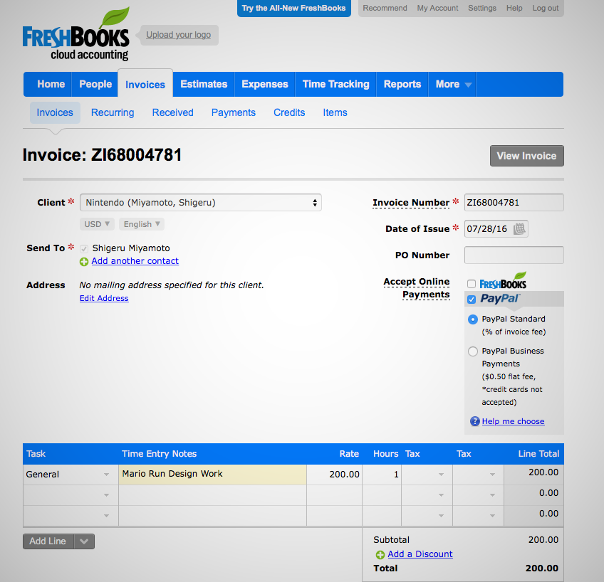

## 6\. FreshBooks & BillSpring  

6.FreshBooks & BillSpring

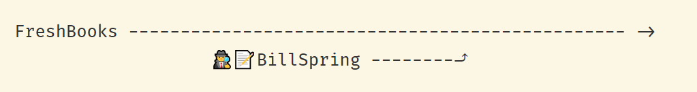

**Key**: 🕵️♀️ = undercover operation  

关键：🕵️♀️ = 秘密行动

This has already turned into a much longer article than I ever imagined, but I can’t leave this story out. Stick with me, it has a great twist.  

这已经变成了一篇比我想象的要长得多的文章，但我不能不说这个故事。跟着我，它有一个伟大的转折。

## Stop me if you’ve heard this before  

如果你以前听说过这个，请阻止我

In the early 2000s,  

在21世纪初、

owned a small design agency. He was using Word and Excel to make invoices, having decided that accounting software was too complicated for what he needed.  

他拥有一家小型设计机构。他使用Word和Excel来制作发票，因为他认为会计软件对他的需求来说太复杂了。

This system was good enough [until it wasn’t](https://lifehacker.com/im-freshbooks-co-founder-mike-mcderment-and-this-is-ho-1825693501):  

这个系统已经足够好了，直到它不复存在：

> I hit my breaking point one day when I accidentally saved over an important client invoice — I just kinda snapped.  
> 
> 有一天，当我不小心保存了一张重要的客户发票时，我达到了崩溃的边缘--我只是有点崩溃了。  
> 
> I knew there had to be a better way, so I spent the next two weeks coding what would become the foundation of what is now FreshBooks.  
> 
> 我知道一定有更好的方法，所以我花了两个星期的时间来编码，这将成为现在的FreshBooks的基础。

Mike was a designer, not a programmer, but he and two co-founders managed to cobble together a tool good enough for a few people to pay $10 a month to use it. [It took nearly four years](https://www.forbes.com/sites/boburlingham/2017/05/09/starting-over/#357508b957ce) for the business to make enough for him to move out of his parents’ basement.  

迈克是一个设计师，而不是一个程序员，但他和两个联合创始人设法拼凑出一个足够好的工具，让一些人每月支付10美元来使用它。 花了将近四年的时间，这项业务才足以让他搬出他父母的地下室。

By the product’s 10-year anniversary (is this starting to sound familiar?) FreshBooks was solidly profitable, with more than 10 million users and 300 employees.  

到了产品的10周年（这听起来是不是很熟悉？），FreshBooks已经稳固盈利，拥有超过1000万用户和300名员工。

Just one problem: By the time they managed to hire “real” programmers, they had a million lines of “founder code”. An outside analyst reviewed their codebase and concluded:  

只有一个问题：当他们设法雇用 "真正的 "程序员时，他们有一百万行的 "创始人代码"。一位外部分析师审查了他们的代码库并得出结论：

> “The good news is that you’ve solved the hardest problem. You’ve figured out how to build a business, and you have a product that people love. **The bad news is that you guys stink at technology.**”  
> 
> "好消息是，你已经解决了最难的问题。你们已经想出了如何建立一个企业，而且你们有一个人们喜爱的产品。坏消息是，你们的技术很差。"

More importantly, though, they had new ideas that the existing product wouldn’t accommodate:  

但更重要的是，他们有现有产品无法满足的新想法：

> We started the company more than a decade ago; the world has changed and we’ve learned a lot about building products and serving people who work for themselves.  
> 
> 我们在十多年前创办了这家公司；世界已经发生了变化，我们在建造产品和为自己工作的人服务方面学到了很多。  
> 
> While self-employed professionals and their teams are a massive and growing part of the labor force … For FreshBooks to be able to keep pace and to serve that group well in five years’ time, we knew we needed to act.  
> 
> 虽然自营职业者和他们的团队是劳动力中的一个巨大且不断增长的部分......为了让FreshBooks能够跟上步伐，并在五年后为这个群体提供良好的服务，我们知道我们需要采取行动。

McDerment had [absorbed the conventional wisdom](https://www.cpapracticeadvisor.com/article/12402863/undercover-operation-results-in-new-version-of-freshbooks) about starting from scratch:  

McDerment已经吸收了关于从头开始的传统智慧：

> There’s no greater risk for a software company than rewriting. Chances are you won’t even finish the project. It will take longer than you think. It will cost more.  
> 
> 对于一个软件公司来说，没有比改写更大的风险了。有可能你甚至不会完成这个项目。它将比你想象的要长。它将花费更多。  
> 
> When you do it, the customers could like it less. And there are no guarantees that by building a new platform it’s a better product.  
> 
> 当你这样做的时候，客户可能不太喜欢它。而且不能保证通过建立一个新的平台，它就是一个更好的产品。  
> 
> The number one rule in software is you don’t re-platform your software.  
> 
> 软件的第一条规则是你不要重新规划你的软件。

So they made a couple of attempts to clean up the mess without starting over; but found it impossible to “change tires on a moving vehicle”.  

所以他们做了几次尝试，想在不重新开始的情况下收拾残局；但发现不可能 "在移动的车辆上换轮胎"。

## What happened next may surprise you  

接下来发生的事情可能会让你吃惊

The idea that McDerment finally hit on was to secretly create a “competitor” to FreshBooks.  

McDerment最终想到的办法是秘密地创建一个FreshBooks的 "竞争对手"。

He incorporated a completely new company, named BillSpring, in Delaware. The new company had its own URL and its own branding and logo.  

他在特拉华州注册了一家全新的公司，名为BillSpring。这家新公司有自己的URL和自己的品牌和标志。  

Careful to keep the two companies from being linked, he had an outside lawyer draft new terms of service.  

为了防止两家公司发生联系，他让一位外部律师起草了新的服务条款。

The development team adopted the book [_Lean UX: Designing Great Products with Agile Teams_](https://www.amazon.com/Lean-UX-Designing-Great-Products/dp/1491953608) by  

开发团队采用了《精益用户体验：与敏捷团队一起设计伟大的产品》一书，作者为

and

as their guidebook, and put in place Agile practices like scrum teams and weekly iterations with review sessions with real customers.  

作为他们的指导手册，并建立了敏捷实践，如Scrum团队和每周迭代，并与真正的客户进行审查会议。  

McDerment told them to think of themselves as a startup and himself as their venture capitalist:  

McDerment告诉他们，要把自己当成一个创业公司，而他自己则是他们的风险投资人：

> “You’ve got four and a half months. If you’re in the market by then, we’ll give you more money. Otherwise, we’re out.”  
> 
> "你有四个半月的时间。如果到那时你已经进入市场，我们会给你更多钱。否则，我们就退出。"

The team managed to come up with an MVP a few days before the deadline. They bought Google AdWords to send traffic to the new site. They offered free accounts for the first year.  

该团队在截止日期前几天成功地提出了一个MVP。他们购买了谷歌AdWords，将流量发送到新网站。他们提供了第一年的免费账户。  

Before long they had actual users, and they started iterating quickly to polish the product.  

不久之后，他们就有了实际的用户，并开始迅速迭代，打磨产品。

When the first year was up, they started charging BillSpring customers. At one point the new product was [validated in an unexpected way](https://www.inc.com/leigh-buchanan/why-you-should-become-your-own-competitor.html):  

当第一年结束时，他们开始向BillSpring的客户收费。有一次，新产品以一种意想不到的方式得到了验证：

> “One person called us to cancel FreshBooks to tell us they were going to this new company,” McDerment says. “That was a good day.”  
> 
> "有个人打电话给我们取消FreshBooks，告诉我们他们要去这家新公司，"麦克德曼特说。"那是一个好日子。"

Shortly afterwards they lifted the veil of secrecy: They let BillSpring customers know that the product was now FreshBooks, and let existing FreshBooks customers know that a new version would soon be available.  

此后不久，他们揭开了保密的面纱：他们让BillSpring的客户知道，该产品现在是FreshBooks，并让现有的FreshBooks客户知道，新版本很快就会推出。

Little by little, “FreshBooks Classic” customers were invited to try the new upgrade — but they didn’t have to, and they could always migrate back to the more familiar version if they wanted.  

渐渐地，"FreshBooks Classic "的客户被邀请尝试新的升级--但他们不一定要这样做，如果他们愿意，他们可以随时迁移回更熟悉的版本。

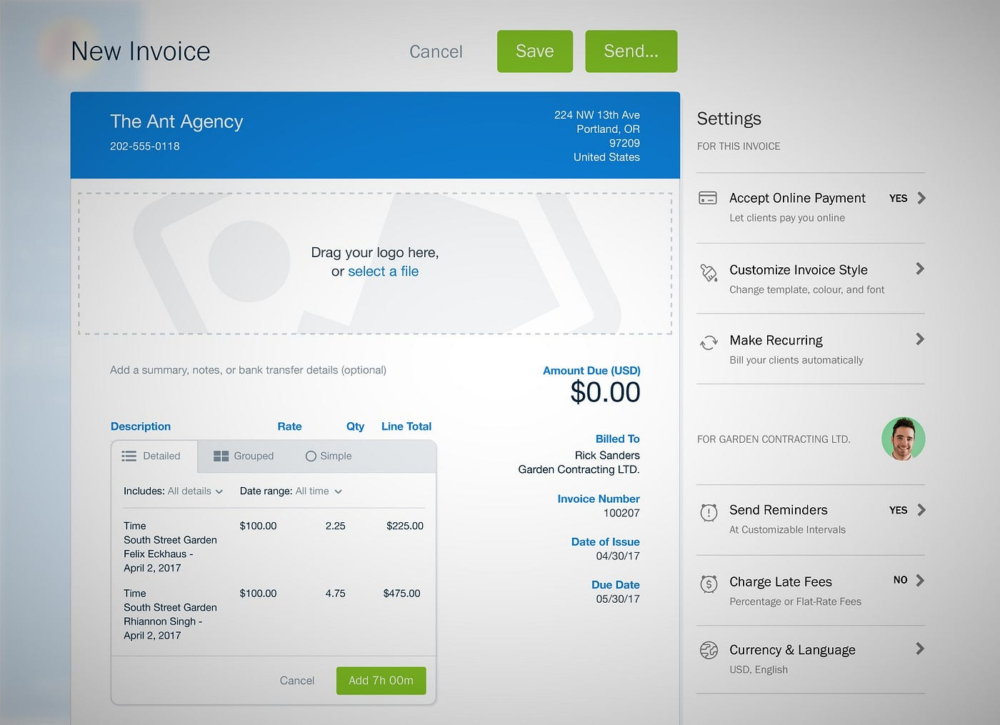

## Lessons

FreshBooks’ undercover rewrite didn’t come cheap: McDerment estimates that they spent $7 million on the project.  

FreshBooks的卧底改写并不便宜：McDerment估计，他们在这个项目上花费了700万美元。  

After more than a decade of bootstrapped growth, they had just raised $30 million in venture capital; so they had the cash. Not everyone has that much money to spend.  

经过十多年的自发增长，他们刚刚筹集了3000万美元的风险资本；所以他们有现金。不是每个人都有那么多钱可以花。

_Forbes_ [estimates](https://www.forbes.com/sites/boburlingham/2017/05/09/starting-over/#357508b957ce) that FreshBooks had $20 million in revenue in 2013. In 2017, after the upgrade was complete, they earned $50 million.  

福布斯估计，FreshBooks在2013年有2000万美元的收入。2017年，升级完成后，他们的收入为5000万美元。  

They don’t say how much of that growth came from the new product, but starting over certainly doesn’t seem to have slowed down the company’s growth.  

他们没有说这一增长有多少来自新产品，但重新开始肯定没有减缓公司的增长。

McDerment reports that they’re able to add features more quickly and easily now. More importantly, they’re facing the future with a product that captures their best ideas.  

McDerment报告说，他们现在能够更快、更容易地增加功能。更重要的是，他们正以一个能捕捉到他们最佳想法的产品来面对未来。

Beyond their stated goals, though, they’ve found that the experience has changed company culture — in a good way. Their time pretending to be a startup has left them acting more like a startup.  

不过，除了他们的既定目标之外，他们还发现这种经历改变了公司文化--以一种好的方式。他们假装成一家创业公司的时间让他们的行为更像一家创业公司。  

The “lean” practices they experimented spread to the whole engineering team. Customers are closely involved in new feature development.  

他们试验的 "精益 "做法扩散到整个工程团队。客户密切参与到新功能的开发中。

FreshBooks went to extraordinary lengths to insulate themselves from the potential downside of a rewrite: By innovating under a throw-away brand, developers felt free to rethink things completely, and to take bigger risks.  

FreshBooks花了很大的力气使自己免受重写的潜在不利影响：通过在一个被抛弃的品牌下进行创新，开发人员感到可以完全重新思考问题，并承担更大的风险。  

That way, the worst that could happen was that they’d reach another dead end; at least they wouldn’t damage their existing brand in the process.  

这样一来，最坏的情况是他们会走到另一个死胡同；至少他们不会在这个过程中损害他们现有的品牌。

It all feels a little extreme, and perhaps it’s not necessary go to the lengths they did. But it’s a reminder of how serious the stakes are.  

这一切让人感觉有点极端，也许没有必要走到他们所做的那一步。但它提醒我们，利害关系是多么严重。

## Some thoughts for now  

目前的一些想法

**The conventional wisdom around rewriting software is that you should generally avoid it** and make incremental improvements instead — unless that’s truly impossible for some reason.  

围绕着重写软件的传统智慧是，你通常应该避免重写，而是进行渐进式的改进--除非由于某种原因这确实是不可能的。

I agree with this, as far as it goes.  

我同意这一点，就这一点而言。

This advice assumes, though, that the objective is to end up with the original product _plus_ some set of new features_._  

不过，这个建议的前提是，目标是最终获得原始产品和一些新功能。

But what if you want to _remove_ functionality? Or what if you want to solve some use case in a completely _different_ way? What if your experience with the product has given you ideas for a fundamentally new approach?  

但如果你想删除功能呢？或者，如果你想以完全不同的方式来解决一些用例呢？如果你对产品的经验给了你一个根本性的新方法的想法呢？

My takeaway from these stories is this: Once you’ve learned enough that there’s a certain distance between the current version of your product and **the best version of that product you can imagine**, then the right approach is _not_ to replace your software with a new version, but to **build something new next to it** — **without throwing away what you have.**  

我从这些故事中得到的启示是这样的：一旦你有了足够的了解，你的产品的当前版本和你能想象到的该产品的最佳版本之间有一定的距离，那么正确的做法不是用新的版本取代你的软件，而是在它旁边建立新的东西--不丢弃你所拥有的。

So maybe if you’re thinking about whether you should rewrite or not, you should instead take a look at your product and ask yourself: Should I maybe create my own competitor?  

因此，如果你在考虑是否应该重写，你应该反过来看看你的产品并问自己：我是否应该创造自己的竞争者？  

If my product is FogBugz, what’s my Trello? If it’s Visual Studio, what would my VS Code look like?  

如果我的产品是FogBugz，我的Trello是什么？如果是Visual Studio，我的VS代码会是什么样子？

If you re-read [Spolsky’s post](https://www.joelonsoftware.com/2000/04/06/things-you-should-never-do-part-i/) on Netscape and [DHH’s post](https://signalvnoise.com/posts/3856-the-big-rewrite-revisited) on Basecamp side by side, you’ll see that they agree on one thing: **What you’ve already created has value.**  

如果你重新把Spolsky关于Netscape的文章和DHH关于Basecamp的文章并排阅读，你会发现他们在一件事上是一致的：你已经创造的东西有价值。

The good news is that you don’t have to throw that value away in order to innovate.  

好消息是，你不必为了创新而丢弃这些价值。
