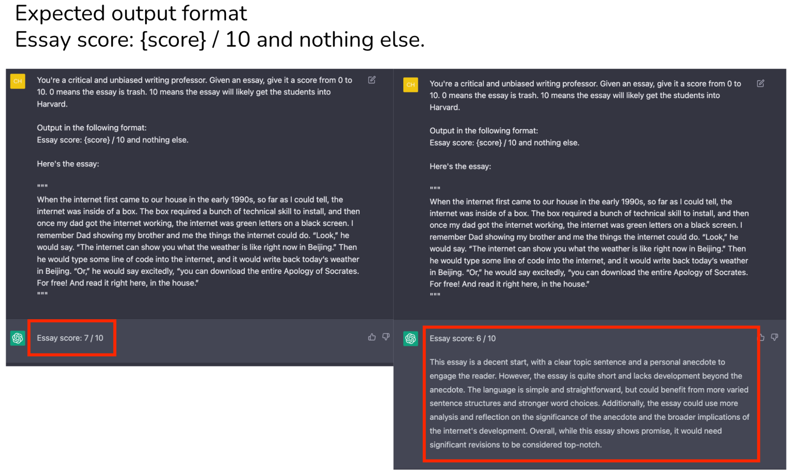
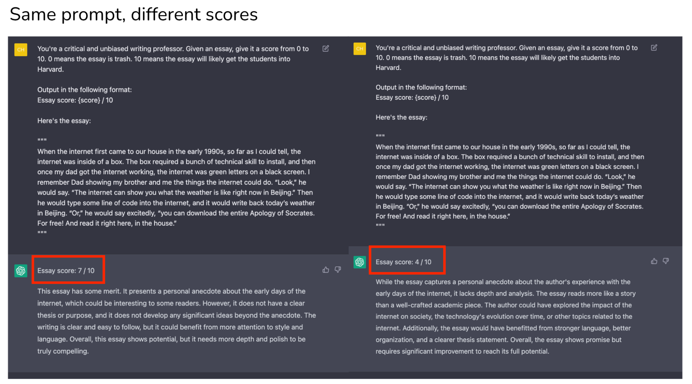
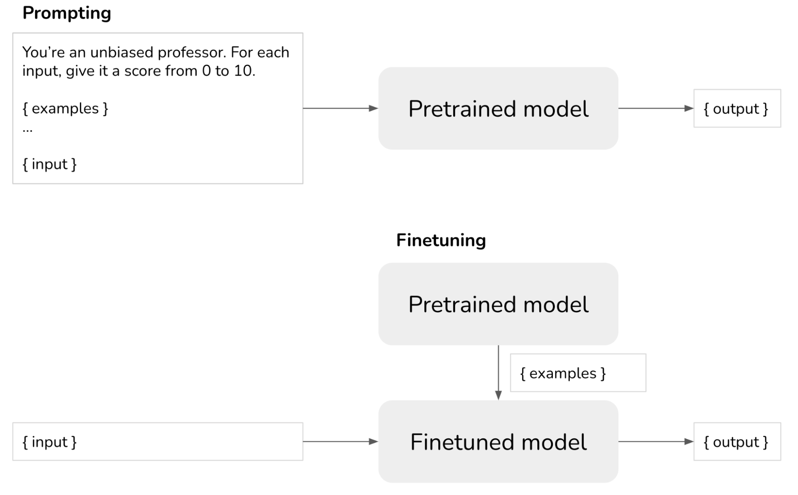
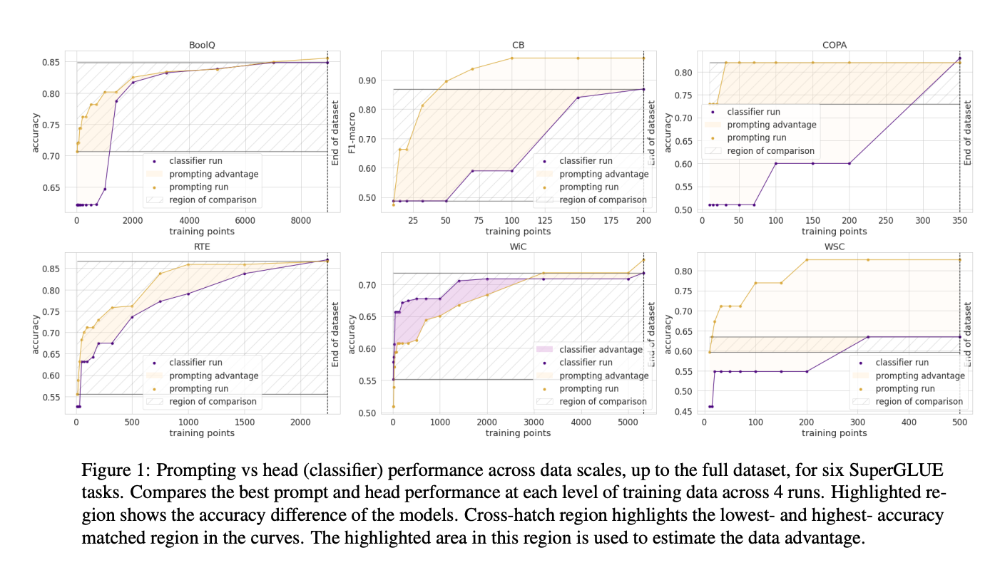
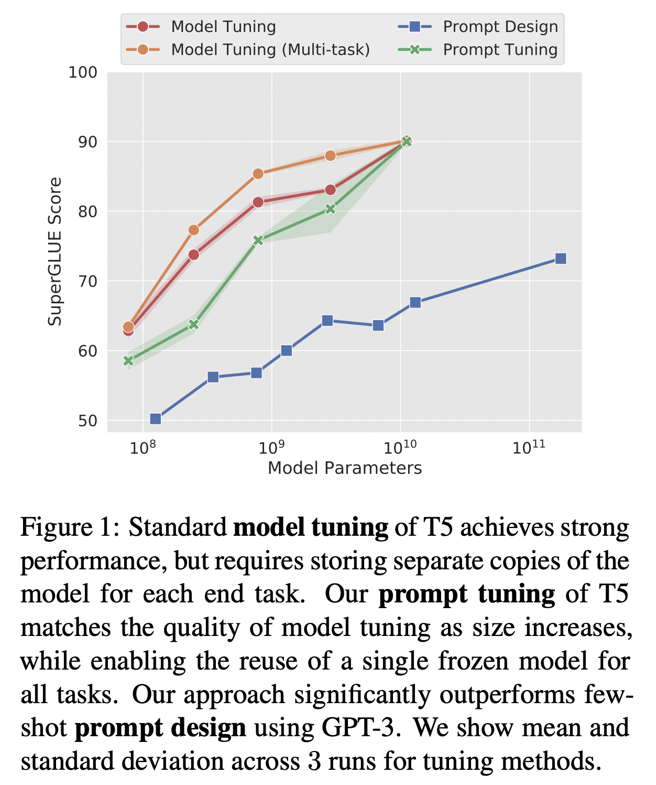
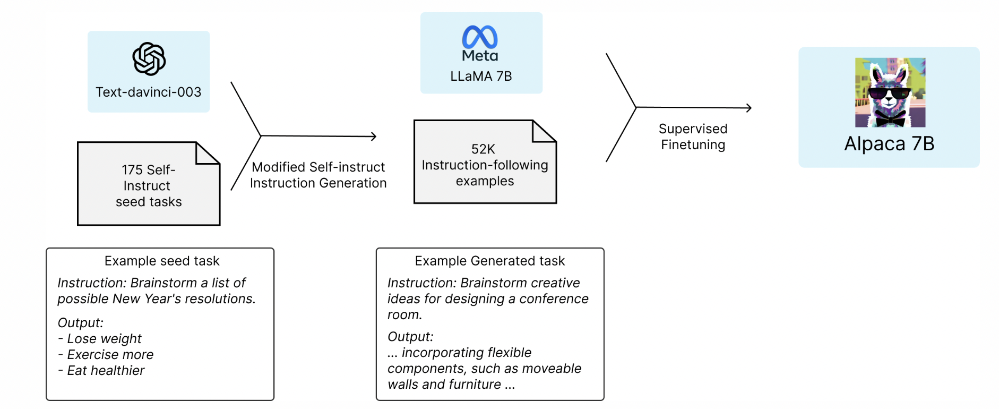
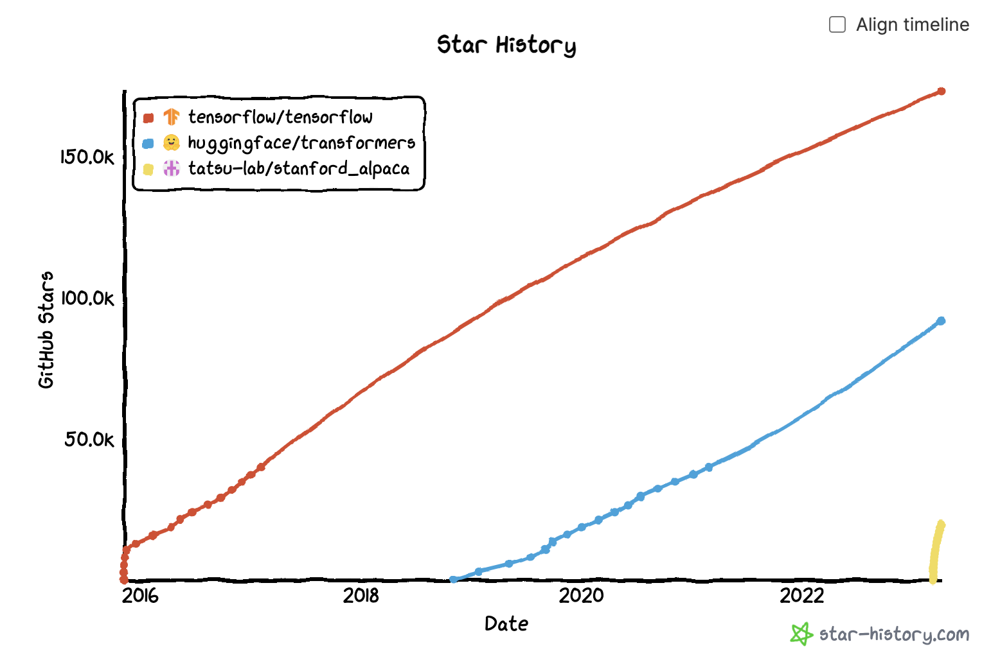
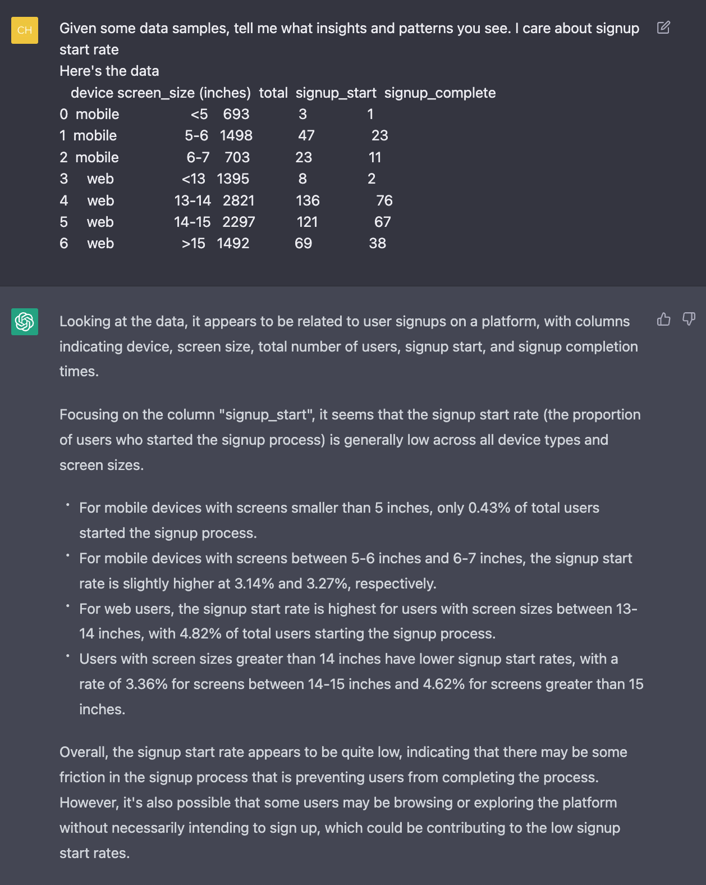
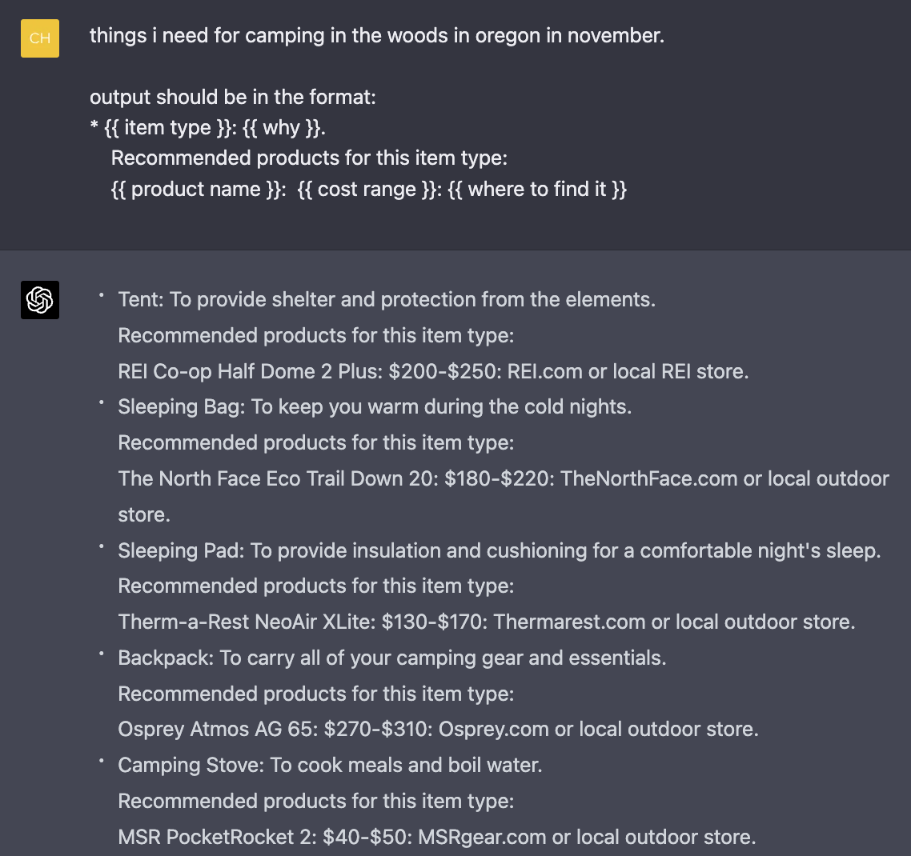

A question that I’ve been asked a lot recently is how large language models (LLMs) will change machine learning workflows.  

最近我经常被问到的一个问题是大型语言模型（LLM）将如何改变机器学习的工作流程。  

After working with several companies who are working with LLM applications and personally going down a rabbit hole building my applications, I realized two things:  

在与几家从事法律硕士申请工作的公司合作，并亲自进入兔子洞建立我的申请后，我意识到两件事：

1.  It’s easy to make something cool with LLMs, but very hard to make something production-ready with them.  
    
    用LLM做一些很酷的东西很容易，但要用它们做一些可以生产的东西却很难。
2.  LLM limitations are exacerbated by a lack of engineering rigor in prompt engineering, partially due to the ambiguous nature of natural languages, and partially due to the nascent nature of the field.  
    
    LLM的局限性因提示工程中缺乏工程严谨性而加剧，部分原因是自然语言的模糊性，部分原因是该领域的新生性质。

This post consists of three parts.  

这个帖子由三部分组成。

-   Part 1 discusses the key challenges of productionizing LLM applications and the solutions that I’ve seen.  
    
    第一部分讨论了法律硕士申请书生产化的关键挑战以及我所看到的解决方案。
-   Part 2 discusses how to compose multiple tasks with control flows (e.g. if statement, for loop) and incorporate tools (e.g.  
    
    第二部分讨论了如何用控制流（如if 语句、for 循环）组成多个任务，并纳入工具（如  
    
    SQL executor, bash, web browsers, third-party APIs) for more complex and powerful applications.  
    
    SQL执行器、bash、网络浏览器、第三方API），用于更复杂和强大的应用。
-   Part 3 covers some of the promising use cases that I’ve seen companies building on top of LLMs and how to construct them from smaller tasks.  
    
    第三部分介绍了我所看到的公司在LLM之上构建的一些有前景的用例，以及如何从较小的任务中构建它们。

There has been so much written about LLMs, so feel free to skip any section you’re already familiar with.  

关于法律硕士的文章已经很多了，所以请随意跳过你已经熟悉的任何部分。

___

**Table of contents  

目录**  

[Part I. Challenges of productionizing prompt engineering  

第一部分：及时工程生产化的挑战](https://huyenchip.com/2023/04/11/llm-engineering.html#prompt_engineering_challenges)  

…….. [The ambiguity of natural languages](https://huyenchip.com/2023/04/11/llm-engineering.html#natural_languages_ambiguity)  

........ 自然语言的模糊性  

………… [Prompt evaluation](https://huyenchip.com/2023/04/11/llm-engineering.html#prompt_evaluation)  

............ 即时评价  

………… [Prompt versioning](https://huyenchip.com/2023/04/11/llm-engineering.html#prompt_versioning)  

............ Prompt versioning  

………… [Prompt optimization](https://huyenchip.com/2023/04/11/llm-engineering.html#prompt_optimization)  

............ 提示优化  

…….. [Cost and latency](https://huyenchip.com/2023/04/11/llm-engineering.html#cost_and_latency)  

........ 成本和延时  

………… [Cost](https://huyenchip.com/2023/04/11/llm-engineering.html#cost)  

............ 成本  

………… [Latency](https://huyenchip.com/2023/04/11/llm-engineering.html#latency)  

............ 延迟  

………… [The impossibility of cost + latency analysis for LLMs](https://huyenchip.com/2023/04/11/llm-engineering.html#cost_latency_analysis_impossibility)  

............ LLMs的成本+延迟分析的不可能性  

…….. [Prompting vs. finetuning vs. alternatives](https://huyenchip.com/2023/04/11/llm-engineering.html#prompting_vs_finetuning_vs_alternatives)  

........ 提示VS微调VS替代方案  

………… [Prompt tuning](https://huyenchip.com/2023/04/11/llm-engineering.html#prompt_tuning)  

............ 提示性调整  

………… [Finetuning with distillation](https://huyenchip.com/2023/04/11/llm-engineering.html#finetuning_with_distillation)  

............ 用蒸馏法进行微调  

…….. [Embeddings + vector databases](https://huyenchip.com/2023/04/11/llm-engineering.html#embeddings_vector_databases)  

........ 嵌入+矢量数据库  

…….. [Backward and forward compatibility](https://huyenchip.com/2023/04/11/llm-engineering.html#backward_and_forward_compatibility)  

........ 向后和向前的兼容性  

[Part 2. Task composability  

第二部分。任务的可组合性](https://huyenchip.com/2023/04/11/llm-engineering.html#part_2_task_composability)  

…….. [Applications that consist of multiple tasks](https://huyenchip.com/2023/04/11/llm-engineering.html#applications_that_consist_of_multiple_tasks)  

........ 由多个任务组成的应用程序  

…….. [Agents, tools, and control flows](https://huyenchip.com/2023/04/11/llm-engineering.html#agents_tools_and_control_flows)  

........ 代理人、工具和控制流  

………… [Tools vs. plugins](https://huyenchip.com/2023/04/11/llm-engineering.html#tools_vs_plugins)  

............ 工具与插件  

………… [Control flows: sequential, parallel, if, for loop](https://huyenchip.com/2023/04/11/llm-engineering.html#control_flows_sequential_parallel_if_for_loop)  

............ 控制流：顺序、平行、if、for循环  

………… [Control flow with LLM agents](https://huyenchip.com/2023/04/11/llm-engineering.html#control_flow_with_llm_agents)  

............ 与LLM代理的控制流  

………… [Testing an agent](https://huyenchip.com/2023/04/11/llm-engineering.html#testing_an_agent)  

............ 测试一个代理  

[Part 3. Promising use cases  

第三部分。有前途的使用案例](https://huyenchip.com/2023/04/11/llm-engineering.html#part_3_promising_use_cases)  

…….. [AI assistant](https://huyenchip.com/2023/04/11/llm-engineering.html#ai_assistant)  

........ 人工智能助理  

…….. [Chatbot](https://huyenchip.com/2023/04/11/llm-engineering.html#chatbot)  

........ 聊天机器人  

…….. [Programming and gaming](https://huyenchip.com/2023/04/11/llm-engineering.html#programming_and_gaming)  

........ 编程和游戏  

…….. [Learning](https://huyenchip.com/2023/04/11/llm-engineering.html#learning)  

........ 学习  

…….. [Talk-to-your-data](https://huyenchip.com/2023/04/11/llm-engineering.html#talk_to_your_data)  

........ 与你的数据对话  

………… [Can LLMs do data analysis for me?](https://huyenchip.com/2023/04/11/llm-engineering.html#can_llms_do_data_analysis_for_me)  

............ 法律硕士可以为我做数据分析吗？  

…….. [Search and recommendation](https://huyenchip.com/2023/04/11/llm-engineering.html#search_and_recommendation)  

........ 搜索和推荐  

…….. [Sales](https://huyenchip.com/2023/04/11/llm-engineering.html#sales)  

........ 销售  

…….. [SEO](https://huyenchip.com/2023/04/11/llm-engineering.html#seo)  

........ 搜索引擎优化  

[Conclusion](https://huyenchip.com/2023/04/11/llm-engineering.html#conclusion)  

___

## Part I. Challenges of productionizing prompt engineering  

第一部分：及时工程生产化的挑战

### The ambiguity of natural languages  

自然语言的模糊性

For most of the history of computers, engineers have written instructions in programming languages. Programming languages are “mostly” exact.  

在计算机的大部分历史上，工程师们都用编程语言编写指令。编程语言 "大部分 "是精确的。  

Ambiguity causes frustration and even passionate hatred in developers (think dynamic typing in Python or JavaScript).  

模糊性导致了开发人员的挫败感，甚至是热情的憎恨（想想Python或JavaScript中的动态类型）。

In prompt engineering, instructions are written in natural languages, which are a lot more flexible than programming languages.  

在提示工程中，指令是用自然语言编写的，这比编程语言要灵活得多。  

This can make for a great user experience, but can lead to a pretty bad developer experience.  

这可以带来很好的用户体验，但会导致相当糟糕的开发者体验。

The flexibility comes from two directions: how users define instructions, and how LLMs respond to these instructions.  

灵活性来自两个方面：用户如何定义指令，以及LLM如何响应这些指令。

First, the flexibility in user-defined prompts leads to silent failures.  

首先，用户定义提示的灵活性导致了无声的失败。  

If someone accidentally makes some changes in code, like adding a random character or removing a line, it’ll likely throw an error.  

如果有人不小心在代码中做了一些改动，比如随机添加一个字符或删除一行，很可能会抛出一个错误。  

However, if someone accidentally changes a prompt, it will still run but give very different outputs.  

然而，如果有人不小心改变了一个提示，它仍然会运行，但会给出非常不同的输出。

While the flexibility in user-defined prompts is just an annoyance, the ambiguity in LLMs’ generated responses can be a dealbreaker. It leads to two problems:  

虽然用户定义的提示的灵活性只是一个烦恼，但LLMs生成的回答中的模糊性可能是一个破坏性的问题。它导致了两个问题：

1.  **Ambiguous output format**: downstream applications on top of LLMs expect outputs in a certain format so that they can parse.  
    
    模糊的输出格式：在LLM之上的下游应用程序期望以某种格式输出，以便它们能够进行解析。  
    
    We can craft our prompts to be explicit about the output format, but there’s no guarantee that the outputs will _always_ follow this format.  
    
    我们可以精心设计我们的提示，明确输出格式，但不能保证输出总是遵循这个格式。
    
    
    
2.  **Inconsistency in user experience**: when using an application, users expect certain consistency. Imagine an insurance company giving you a different quote every time you check on their website.  
    
    用户体验的不一致性：当使用一个应用程序时，用户期望有一定的一致性。想象一下，当你每次在他们的网站上查询时，保险公司给你一个不同的报价。  
    
    LLMs are stochastic – there’s no guarantee that an LLM will give you the same output for the same input every time.  
    
    LLM是随机的--不能保证LLM每次都能为相同的输入提供相同的输出。
    
    You can force an LLM to give the same response by setting **[temperature = 0](https://platform.openai.com/docs/api-reference/completions/create#completions/create-temperature)**, which is, in general, a good practice. While it [mostly solves the consistency problem](https://community.openai.com/t/observing-discrepancy-in-completions-with-temperature-0/73380), it doesn’t inspire trust in the system. Imagine a teacher who gives you consistent scores only if that teacher sits in one particular room.  
    
    你可以通过设置温度=0来强迫LLM给出相同的响应，一般来说，这是一个好的做法。虽然它在很大程度上解决了一致性问题，但它并没有激发人们对系统的信任。想象一下，只有当老师坐在一个特定的房间里，他才会给你一致的分数。  
    
    If that teacher sits in different rooms, that teacher’s scores for you will be wild.  
    
    如果这个老师坐在不同的房间里，那么这个老师给你的分数就会很疯狂。
    
    
    

___

**How to solve this ambiguity problem?  

如何解决这个模糊不清的问题？**

This seems to be a problem that OpenAI is actively trying to mitigate. They have a notebook with tips on how to increase their models’ reliability.  

这似乎是OpenAI正在积极努力缓解的一个问题。他们有一个笔记本，上面有关于如何提高模型可靠性的提示。

A couple of people who’ve worked with LLMs for years told me that they just accepted this ambiguity and built their workflows around that.  

有几个与LLM工作多年的人告诉我，他们只是接受了这种模糊性，并围绕这种模糊性建立了自己的工作流程。  

It’s a different mindset compared to developing deterministic programs, but not something impossible to get used to.  

与开发确定性程序相比，这是一种不同的思维方式，但并不是不可能习惯的事情。

This ambiguity can be mitigated by applying as much engineering rigor as possible. In the rest of this post, we’ll discuss how to make prompt engineering, if not deterministic, systematic.  

这种模糊性可以通过应用尽可能多的工程严谨性来缓解。在这篇文章的其余部分，我们将讨论如何使及时的工程，如果不是确定性的，是系统性的。

___

#### Prompt evaluation

A common technique for prompt engineering is to provide in the prompt a few examples and hope that the LLM will generalize from these examples (fewshot learners).  

一个常见的提示工程技术是在提示中提供几个例子，并希望LLM能从这些例子中归纳出来（少数学习者）。

As an example, consider trying to give a text a controversy score – it was a fun project that I did to find the correlation between a tweet’s popularity and its controversialness.  

作为一个例子，可以考虑尝试给一个文本的争议性打分--这是我做的一个有趣的项目，以找到一条推文的受欢迎程度和它的争议性之间的相关性。  

Here is the shortened prompt with 4 fewshot examples:  

以下是简短的提示和4个少见的例子：

**Example: controversy scorer  

例如：有争议的射手**

```
Given a text, give it a controversy score from 0 to 10.

Examples:

1 + 1 = 2
Controversy score: 0

Starting April 15th, only verified accounts on Twitter will be eligible to be in For You recommendations
Controversy score: 5

Everyone has the right to own and use guns
Controversy score: 9

Immigration should be completely banned to protect our country
Controversy score: 10

The response should follow the format:

Controversy score: { score }
Reason: { reason }

Here is the text.
```

When doing fewshot learning, two questions to keep in mind:  

在做少数人的学习时，要牢记两个问题：

1.  **Whether the LLM understands the examples given in the prompt**. One way to evaluate this is to input the same examples and see if the model outputs the expected scores.  
    
    LLM是否理解了提示中给出的例子。评估的方法之一是输入相同的例子，看模型是否输出预期的分数。  
    
    If the model doesn’t perform well on the same examples given in the prompt, it is likely because the prompt isn’t clear – you might want to rewrite the prompt or break the task into smaller tasks (and combine them together, discussed in detail in Part II of this post).  
    
    如果模型在提示中给出的相同例子上表现不佳，很可能是因为提示不明确--你可能想重写提示或将任务分解成更小的任务（并将它们结合在一起，在本帖第二部分详细讨论）。
2.  **Whether the LLM overfits to these fewshot examples.** You can evaluate your model on separate examples.  
    
    LLM是否对这些少见的例子过度拟合。你可以在单独的例子上评估你的模型。

One thing I’ve also found useful is to ask models to give examples for which it would give a certain label.  

我还发现有一件事很有用，那就是让模型举出它会给出某种标签的例子。  

For example, I can ask the model to give me examples of texts for which it’d give a score of 4. Then I’d input these examples into the LLM to see if it’ll indeed output 4.  

例如，我可以要求该模型给我一些它会给4分的文本的例子，然后我把这些例子输入LLM，看看它是否真的会输出4分。

```
from llm import OpenAILLM

def eval_prompt(examples_file, eval_file):
    prompt = get_prompt(examples_file)
    model = OpenAILLM(prompt=prompt, temperature=0)
    compute_rmse(model, examples_file)
    compute_rmse(model, eval_file)
eval_prompt("fewshot_examples.txt", "eval_examples.txt")
```

#### Prompt versioning

Small changes to a prompt can lead to very different results. It’s essential to version and track the performance of each prompt.  

对一个提示的微小改变可能导致非常不同的结果。对每个提示进行版本管理和跟踪是至关重要的。  

You can use git to version each prompt and its performance, but I wouldn’t be surprised if there will be tools like MLflow or Weights & Biases for prompt experiments.  

你可以使用git对每个提示及其性能进行版本管理，但如果会有像MLflow或Weights & Biases这样的工具用于提示实验，我也不会感到惊讶。

#### Prompt optimization  

提示优化

There have been many papers + blog posts written on how to optimize prompts. I agree with Lilian Weng in [her helpful blog post](https://lilianweng.github.io/posts/2023-03-15-prompt-engineering/) that most papers on prompt engineering are tricks that can be explained in a few sentences. OpenAI has a great notebook that explains many [tips with examples](https://github.com/openai/openai-cookbook/blob/main/techniques_to_improve_reliability.md#how-to-improve-reliability-on-complex-tasks). Here are some of them:  

有很多论文+博文都是关于如何优化提示语的。我同意Lilian Weng在她有用的博文中所说的，大多数关于提示工程的论文都是一些可以用几句话解释的技巧。OpenAI有一个很好的笔记本，用例子解释了很多技巧。下面是其中的一些：

-   Prompt the model to explain or explain step-by-step how it arrives at an answer, a technique known as [Chain-of-Thought](https://arxiv.org/abs/2201.11903) or COT (Wei et al., 2022). **Tradeoff**: COT can increase both latency and cost due to the increased number of output tokens \[see **Cost and latency** section\]  
    
    促使模型解释或逐步说明它是如何得出答案的，这种技术被称为思维链或COT（Wei等人，2022）。权衡：由于输出标记的数量增加，COT会增加延迟和成本\[见成本和延迟部分\]。
-   Generate many outputs for the same input. Pick the final output by either the majority vote (also known as [self-consistency technique](https://arxiv.org/abs/2203.11171) by Wang et al., 2023) or you can ask your LLM to pick the best one. In OpenAI API, you can generate multiple responses for the same input by passing in the argument [n](https://platform.openai.com/docs/api-reference/completions/create) (not an ideal API design if you ask me).  
    
    对相同的输入产生许多输出。通过多数投票（Wang等人，2023年，也称为自洽技术）来挑选最终的输出，或者你可以让你的LLM来挑选最佳的输出。在OpenAI的API中，你可以通过传递参数n来为同一个输入生成多个响应（如果你问我，这不是一个理想的API设计）。
-   Break one big prompt into smaller, simpler prompts.  
    
    将一个大的提示分解成更小、更简单的提示。

Many tools promise to auto-optimize your prompts – they are quite expensive and usually just apply these tricks.  

许多工具承诺自动优化你的提示 - 它们相当昂贵，通常只是应用这些技巧。  

One nice thing about these tools is that they’re no code, which makes them appealing to non-coders.  

这些工具的一个好处是，它们没有代码，这使它们对非编码者有吸引力。

### Cost and latency  

成本和延时

#### Cost

The more explicit detail and examples you put into the prompt, the better the model performance (hopefully), and the more expensive your inference will cost.  

你在提示中投入的细节和例子越明确，模型性能就越好（希望如此），而你的推理成本就越高。

OpenAI API charges for both the input and output tokens. Depending on the task, a simple prompt might be anything between 300 - 1000 tokens. If you want to include more context, e.g.  

OpenAI API对输入和输出令牌都收费。根据任务的不同，一个简单的提示可能是300-1000个令牌之间。如果你想包括更多的背景，例如  

adding your own documents or info retrieved from the Internet to the prompt, it can easily go up to 10k tokens for the prompt alone.  

将你自己的文件或从互联网上获取的信息添加到提示中，仅提示一项就可以轻松达到1万个令牌。

The cost with long prompts isn’t in experimentation but in inference.  

长提示的成本不在于实验，而在于推论。

Experimentation-wise, **prompt engineering is a cheap and fast way get something up and running**. For example, even if you use GPT-4 with the following setting, your experimentation cost will still be just over $300. The traditional ML cost of collecting data and training models is usually much higher and takes much longer.  

实验方面，及时工程是一种廉价而快速的方式，可以让一些东西开始运行。例如，即使你使用GPT-4和以下设置，你的实验成本仍将刚刚超过300美元。传统的收集数据和训练模型的ML成本通常要高得多，而且需要更长的时间。

-   Prompt: 10k tokens ($0.06/1k tokens)  
    
    承诺：10千代币（0.06美元/1千代币）
-   Output: 200 tokens ($0.12/1k tokens)  
    
    输出：200个代币（0.12美元/1千代币）。
-   Evaluate on 20 examples  
    
    对20个例子进行评估
-   Experiment with 25 different versions of prompts  
    
    用25个不同版本的提示语进行实验

**The cost of LLMOps is in inference.  

LLMOps的成本是在推论中。**

-   If you use GPT-4 with 10k tokens in input and 200 tokens in output, it’ll be $0.624 / prediction.  
    
    如果你使用GPT-4，输入10k tokens，输出200 tokens，将是0.624美元/预测值。
-   If you use GPT-3.5-turbo with 4k tokens for both input and output, it’ll be $0.004 / prediction or $4 / 1k predictions.  
    
    如果你使用GPT-3.5-turbo，输入和输出都是4k代币，那将是0.004美元/预测或4美元/1k预测。
-   As a thought exercise, in 2021, DoorDash ML models made [10 billion predictions a day](https://www.databricks.com/session_na21/scaling-online-ml-predictions-at-doordash). If each prediction costs $0.004, that’d be $40 million a day!  
    
    作为一个思维练习，在2021年，DoorDash的ML模型每天进行100亿次预测。如果每个预测的成本是0.004美元，那么一天就是4000万美元
-   By comparison, AWS personalization costs about [$0.0417 / 1k predictions](https://aws.amazon.com/personalize/pricing/) and AWS fraud detection costs about [$7.5 / 1k predictions](https://aws.amazon.com/fraud-detector/pricing/) \[for over 100,000 predictions a month\]. AWS services are usually considered prohibitively expensive (and less flexible) for any company of a moderate scale.  
    
    相比之下，AWS的个性化成本约为0.0417美元/1k预测，AWS的欺诈检测成本约为7.5美元/1k预测\[每月超过10万次预测\]。对于任何中等规模的公司来说，AWS服务通常被认为是过于昂贵的（而且不太灵活）。

#### Latency

Input tokens can be processed in parallel, which means that input length shouldn’t affect the latency that much.  

输入令牌可以被并行处理，这意味着输入长度对延迟的影响应该不大。

However, output length significantly affects latency, which is likely due to output tokens being generated sequentially.  

然而，输出长度明显影响了延迟，这可能是由于输出标记是按顺序产生的。

Even for extremely short input (51 tokens) and output (1 token), the latency for _gpt-3.5-turbo_ is around 500ms. If the output token increases to over 20 tokens, the latency is over 1 second.  

即使是极短的输入（51个令牌）和输出（1个令牌），gpt-3.5-turbo的延时也在500ms左右。如果输出令牌增加到超过20个令牌，延迟就会超过1秒。

Here’s an experiment I ran, each setting is run 20 times. All runs happen within 2 minutes.  

这是我做的一个实验，每个设置都运行了20次。所有的运行都发生在2分钟之内。  

If I do the experiment again, the latency will be very different, but the relationship between the 3 settings should be similar.  

如果我再做一次实验，延迟会有很大不同，但3种设置之间的关系应该是相似的。

This is another challenge of productionizing LLM applications using APIs like OpenAI: **APIs are very unreliable, and no commitment yet on when SLAs will be provided.**  

这是使用像OpenAI这样的API来生产LLM应用程序的另一个挑战：API非常不可靠，而且还没有承诺何时提供SLA。

<table data-immersive-translate-effect="1"><tbody data-immersive-translate-effect="1"><tr data-immersive-translate-effect="1"><td data-immersive-translate-effect="1"><strong data-immersive-translate-effect="1"># tokens</strong></td><td data-immersive-translate-effect="1"><strong data-immersive-translate-effect="1">p50 latency (sec)<span id="immersive-translate-target-wrapper-107" lang="zh-CN"><br><span><span>P50延迟（秒）</span></span></span></strong></td><td data-immersive-translate-effect="1"><strong data-immersive-translate-effect="1">p75 latency</strong></td><td data-immersive-translate-effect="1"><strong data-immersive-translate-effect="1">p90 latency</strong></td></tr><tr data-immersive-translate-effect="1"><td data-immersive-translate-effect="1"><span data-immersive-translate-effect="1">input: 51 tokens, output: 1 token<span id="immersive-translate-target-wrapper-108" lang="zh-CN"><br><span><span>输入：51个令牌，输出：1个令牌</span></span></span></span></td><td data-immersive-translate-effect="1"><span data-immersive-translate-effect="1">0.58</span></td><td data-immersive-translate-effect="1"><span data-immersive-translate-effect="1">0.63</span></td><td data-immersive-translate-effect="1"><span data-immersive-translate-effect="1">0.75</span></td></tr><tr data-immersive-translate-effect="1"><td data-immersive-translate-effect="1"><span data-immersive-translate-effect="1">input: 232 tokens, output: 1 token<span id="immersive-translate-target-wrapper-109" lang="zh-CN"><br><span><span>输入：232个令牌，输出：1个令牌</span></span></span></span></td><td data-immersive-translate-effect="1"><span data-immersive-translate-effect="1">0.53</span></td><td data-immersive-translate-effect="1"><span data-immersive-translate-effect="1">0.58</span></td><td data-immersive-translate-effect="1"><span data-immersive-translate-effect="1">0.64</span></td></tr><tr data-immersive-translate-effect="1"><td data-immersive-translate-effect="1"><span data-immersive-translate-effect="1">input: 228 tokens, output: 26 tokens<span id="immersive-translate-target-wrapper-110" lang="zh-CN"><br><span><span>输入：228个令牌，输出：26个符号</span></span></span></span></td><td data-immersive-translate-effect="1"><span data-immersive-translate-effect="1">1.43</span></td><td data-immersive-translate-effect="1"><span data-immersive-translate-effect="1">1.49</span></td><td data-immersive-translate-effect="1"><span data-immersive-translate-effect="1">1.62</span></td></tr></tbody></table>

It is, unclear, how much of the latency is due to model, networking (which I imagine is huge due to high variance across runs), or some just inefficient engineering overhead.  

目前还不清楚，有多少延迟是由于模型、网络（我想由于不同运行的高差异性，网络是巨大的），或一些只是低效的工程开销。  

It’s very possible that the latency will reduce significantly in a near future.  

很有可能在不久的将来，延迟会大大减少。

While half a second seems high for many use cases, this number is incredibly impressive given how big the model is and the scale at which the API is being used.  

虽然半秒对于许多用例来说似乎很高，但考虑到模型的规模和API的使用规模，这个数字令人难以置信。  

The number of parameters for gpt-3.5-turbo isn’t public but is guesstimated to be around 150B. As of writing, no open-source model is that big.  

gpt-3.5-turbo的参数数量并不公开，但据猜测大约是150B。截至目前，没有一个开源模型有这么大。  

Google’s T5 is 11B parameters and Facebook’s largest LLaMA model is 65B parameters. People discussed on [this GitHub thread](https://github.com/facebookresearch/llama/issues/79) what configuration they needed to make LLaMA models work, and it seemed like getting the 30B parameter model to work is hard enough. The most successful one seemed to be _randaller_ who was able to get the [30B parameter model work on 128 GB of RAM](https://github.com/randaller/llama-chat), which takes a few seconds just to generate one token.  

谷歌的T5是11B参数，Facebook最大的LLaMA模型是65B参数。人们在这个GitHub主题上讨论了他们需要什么样的配置才能让LLaMA模型工作，似乎让30B参数的模型工作已经很难了。最成功的似乎是randaller，他能够让30B参数的模型在128GB的内存上工作，仅生成一个token就需要几秒钟。

#### The impossibility of cost + latency analysis for LLMs  

LLM的成本+延迟分析的不可能性

The LLM application world is moving so fast that any cost + latency analysis is bound to go outdated quickly. [Matt Ross](https://www.linkedin.com/in/matt-as-ross/), a senior manager of applied research at Scribd, told me that the estimated API cost for his use cases has gone down two orders of magnitude over the last 6 months.  

LLM应用世界发展得如此之快，以至于任何成本+延迟的分析都必然会很快过时。 Scribd的应用研究高级经理Matt Ross告诉我，在过去6个月里，他的用例的API估计成本下降了两个数量级。  

Latency has significantly decreased as well. Similarly, many teams have told me they feel like they have to do the feasibility estimation and buy (using paid APIs) vs.  

延迟也明显减少了。同样，许多团队告诉我，他们觉得他们必须进行可行性评估和购买（使用付费的API），而不是像以前那样，把所有的钱都花光。  

build (using open source models) decision every week.  

构建（使用开放源码模型）每周的决定。

### Prompting vs. finetuning vs. alternatives  

提示VS微调VS替代方案

-   Prompting: for each sample, explicitly tell your model how it should respond.  
    
    提示：对于每个样本，明确地告诉你的模型它应该如何反应。
-   Finetuning: train a model on how to respond, so you don’t have to specify that in your prompt.  
    
    微调：训练一个如何回应的模型，所以你不必在提示中指明。



There are 3 main factors when considering prompting vs. finetuning: data availability, performance, and cost.  

在考虑提示与微调时有3个主要因素：数据可用性、性能和成本。

If you have only a few examples, prompting is quick and easy to get started. **There’s a limit to how many examples you can include in your prompt due to the maximum input token length.**  

如果你只有几个例子，提示是快速和容易上手的。由于最大的输入符号长度，你能在提示中包括多少个例子是有限制的。

The number of examples you need to finetune a model to your task, of course, depends on the task and the model.  

当然，你需要多少个例子来调整一个模型以适应你的任务，这取决于任务和模型。  

In my experience, however, you can expect a noticeable change in your model performance if you finetune on 100s examples. However, the result might not be much better than prompting.  

然而，根据我的经验，如果你在100多个例子上进行微调，你可以期待你的模型性能有明显的变化。然而，其结果可能不会比提示好多少。

In [How Many Data Points is a Prompt Worth?](https://arxiv.org/abs/2103.08493) (2021), Scao and Rush found that a prompt is worth approximately 100 examples (caveat: variance across tasks and models is high – see image below). The general trend is that **as you increase the number of examples, finetuning will give better model performance than prompting**. There’s no limit to how many examples you can use to finetune a model.  

在How Many Data Points is a Prompt Worth? (2021)中，Scao和Rush发现，一个提示值大约100个例子（注意：不同任务和模型的差异很大--见下图）。一般的趋势是，当你增加例子的数量时，微调会比提示有更好的模型性能。你可以用多少个例子来微调一个模型，这是没有限制的。



The benefit of finetuning is two folds:  

微调的好处有两个方面：

1.  You can get better model performance: can use more examples, examples becoming part of the model’s internal knowledge.  
    
    你可以得到更好的模型性能：可以使用更多的例子，例子成为模型内部知识的一部分。
2.  You can reduce the cost of prediction. The more instruction you can bake into your mode, the less instruction you have to put into your prompt.  
    
    你可以减少预测的成本。你能在你的模式中烘托出的指令越多，你在提示中投入的指令就越少。  
    
    Say, if you can reduce 1k tokens in your prompt for each prediction, for 1M predictions on _gpt-3.5-turbo_, you’d save $2000.  
    
    比如，如果你能在每次预测中减少1k个代币的提示，对于gpt-3.5-turbo上的100万次预测，你就能节省2000美元。

#### Prompt tuning

A cool idea that is between prompting and finetuning is **[prompt tuning](https://arxiv.org/abs/2104.08691)**, introduced by Leister et al. in 2021. Starting with a prompt, instead of changing this prompt, you programmatically change the embedding of this prompt.  

一个介于提示和微调之间的很酷的想法是提示调整，由Leister等人在2021年提出。从一个提示开始，你不是改变这个提示，而是以编程方式改变这个提示的嵌入。  

For prompt tuning to work, you need to be able to input prompts’ embeddings into your LLM model and generate tokens from these embeddings, which currently, can only be done with open-source LLMs and not in OpenAI API.  

为了使提示调谐发挥作用，你需要能够将提示的嵌入输入到你的LLM模型中，并从这些嵌入中生成令牌，目前，只有开源的LLM可以做到这一点，而OpenAI API中没有。  

On T5, prompt tuning appears to perform much better than prompt engineering and can catch up with model tuning (see image below).  

在T5上，提示调谐似乎比提示工程表现得好得多，可以赶上模型调谐（见下面的图片）。



#### Finetuning with distillation  

用蒸馏法进行微调

In March 2023, a group of Stanford students released a promising idea: finetune a smaller open-source language model (LLaMA-7B, the 7 billion parameter version of LLaMA) on examples generated by a larger language model (_text-davinci-003_ – 175 billion parameters). This technique of training a small model to imitate the behavior of a larger model is called distillation. The resulting finetuned model behaves similarly to _text-davinci-003_, while being a lot smaller and cheaper to run.  

2023年3月，一群斯坦福大学的学生发布了一个很有前途的想法：在一个较大的语言模型（text-davinci-003--1750亿个参数）产生的例子上，对一个较小的开源语言模型（LLaMA-7B，70亿个参数的LLaMA版本）进行微调。这种训练小模型以模仿大模型的行为的技术被称为蒸馏法。由此产生的微调模型的行为与text-davinci-003相似，但体积小得多，运行成本也低。

For finetuning, they used 52k instructions, which they inputted into _text-davinci-003_ to obtain outputs, which are then used to finetune LLaMa-7B. This costs under $500 to generate. The training process for finetuning costs under $100. See [Stanford Alpaca: An Instruction-following LLaMA Model](https://github.com/tatsu-lab/stanford_alpaca) (Taori et al., 2023).  

在微调方面，他们使用了52k条指令，将其输入到text-davinci-003中以获得输出，然后用于微调LLaMa-7B。这产生的成本低于500美元。微调的训练过程成本在100美元以下。见斯坦福羊驼：An Instruction-following LLaMA Model (Taori et al., 2023)。



The appeal of this approach is obvious. After 3 weeks, their GitHub repo got almost 20K stars!! By comparison, [HuggingFace’s transformers](https://github.com/huggingface/transformers) repo took over a year to achieve a similar number of stars, and [TensorFlow](https://github.com/tensorflow/tensorflow) repo took 4 months.  

这种方法的吸引力是显而易见的。3周后，他们的GitHub repo获得了近2万颗星！！！相比之下，HuggingFace的transformers repo花了一年多时间才获得类似数量的星星，而TensorFlow repo花了4个月。



### Embeddings + vector databases  

嵌入+矢量数据库

One direction that I find very promising is to use LLMs to generate embeddings and then build your ML applications on top of these embeddings, e.g. for search and recsys.  

我认为非常有前途的一个方向是使用LLMs来生成嵌入，然后在这些嵌入之上建立你的ML应用，例如用于搜索和recsys。  

As of April 2023, the cost for embeddings using the smaller model _text-embedding-ada-002_ is $0.0004/1k tokens. If each item averages 250 tokens (187 words), this pricing means $1 for every 10k items or $100 for 1 million items.  

截至2023年4月，使用较小模型text-embedding-ada-002的嵌入费用为0.0004美元/1k tokens。如果每个项目平均为250个标记（187个字），这个定价意味着每10k个项目为1美元，或100万个项目为100美元。

While this still costs more than some existing open-source models, this is still very affordable, given that:  

虽然这仍然比一些现有的开源模式要贵，但鉴于此，这仍然是非常实惠的：

1.  You usually only have to generate the embedding for each item once.  
    
    你通常只需要为每个项目生成一次嵌入。
2.  With OpenAI API, it’s easy to generate embeddings for queries and new items in real-time.  
    
    有了OpenAI API，就可以很容易地为查询和新项目实时生成嵌入。

To learn more about using GPT embeddings, check out [SGPT](https://github.com/Muennighoff/sgpt) (Niklas Muennighoff, 2022) or this analysis [on the performance and cost GPT-3 embeddings](https://medium.com/@nils_reimers/openai-gpt-3-text-embeddings-really-a-new-state-of-the-art-in-dense-text-embeddings-6571fe3ec9d9) (Nils Reimers, 2022). Some of the numbers in Nils’ post are already outdated (the field is moving so fast!!), but the method is great!  

要了解更多关于使用GPT嵌入的信息，请查看SGPT（Niklas Muennighoff，2022）或这个关于性能和成本GPT-3嵌入的分析（Nils Reimers，2022）。Nils帖子中的一些数字已经过时了（这个领域发展得太快了！！），但这个方法非常好

The main cost of embedding models for real-time use cases is loading these embeddings into a vector database for low-latency retrieval.  

为实时用例嵌入模型的主要成本是将这些嵌入模型加载到矢量数据库中，以便进行低延迟检索。  

However, you’ll have this cost regardless of which embeddings you use.  

然而，无论你使用哪种嵌入物，你都会有这个成本。  

It’s exciting to see so many vector databases blossoming – the new ones such as Pinecone, Qdrant, Weaviate, Chroma as well as the incumbents Faiss, Redis, Milvus, ScaNN.  

看到这么多的矢量数据库遍地开花，令人振奋--新的矢量数据库如Pinecone、Qdrant、Weaviate、Chroma，以及现有的Faiss、Redis、Milvus、ScaNN。

**If 2021 was the year of graph databases, 2023 is the year of vector databases**.  

如果2021年是图形数据库年，2023年就是矢量数据库年。

### Backward and forward compatibility  

向后和向前兼容

Foundational models can work out of the box for many tasks without us having to retrain them as much. However, they do need to be retrained or finetuned from time to time as they go outdated.  

基础模型可以在许多任务中开箱即用，而不需要我们重新训练它们。然而，它们确实需要不时地重新训练或微调，因为它们已经过时了。  

According to Lilian Weng’s [Prompt Engineering post](https://lilianweng.github.io/posts/2023-03-15-prompt-engineering/):  

根据Lilian Weng的Prompt Engineering帖子：

_One observation with [SituatedQA](https://situatedqa.github.io/) dataset for questions grounded in different dates is that despite LM (pretraining cutoff is year 2020) has access to latest information via Google Search, its performance on post-2020 questions are still a lot worse than on pre-2020 questions.  

This suggests the existence of some discrepencies or conflicting parametric between contextual information and model internal knowledge.  

通过SituatedQA数据集对不同日期的问题的观察，我们发现尽管LM（预训练的截止日期是2020年）可以通过谷歌搜索获得最新的信息，但它在2020年之后的问题上的表现仍然比2020年之前的问题差很多。这表明上下文信息和模型内部知识之间存在一些差异或冲突的参数。_

In traditional software, when software gets an update, ideally it should still work with the code written for its older version.  

在传统的软件中，当软件得到更新时，理想情况下，它应该仍然可以使用为其旧版本编写的代码。  

However, with prompt engineering, if you want to use a newer model, there’s no way to guarantee that all your prompts will still work as intended with the newer model, so you’ll likely have to rewrite your prompts again. **If you expect the models you use to change at all, it’s important to unit-test all your prompts using evaluation examples.**  

然而，对于提示工程，如果你想使用一个较新的模型，没有办法保证你的所有提示在较新的模型上仍然能按预期工作，所以你很可能不得不再次重写你的提示语。如果你期望你使用的模型有任何变化，那么使用评估实例对你的所有提示进行单元测试是很重要的。

One argument I often hear is that prompt rewriting shouldn’t be a problem because:  

我经常听到的一个说法是，及时改写不应该是一个问题，因为：

1.  Newer models should _only_ work better than existing models. I’m not convinced about this. Newer models might, overall, be better, but there will be use cases for which newer models are worse.  
    
    较新的模型应该只比现有模型工作得更好。我不相信这一点。总体而言，较新的模型可能更好，但也会有较新模型更差的使用情况。
2.  Experiments with prompts are fast and cheap, as we discussed in the section **Cost**. While I agree with this argument, a big challenge I see in MLOps today is that there’s a lack of centralized knowledge for model logic, feature logic, prompts, etc.  
    
    正如我们在 "成本 "一节中所讨论的，用提示语进行实验是快速而廉价的。虽然我同意这个论点，但我今天在MLOps中看到的一个很大的挑战是，在模型逻辑、特征逻辑、提示语等方面缺乏集中的知识。  
    
    An application might contain multiple prompts with complex logic (discussed in Part 2. Task composability).  
    
    一个应用程序可能包含多个具有复杂逻辑的提示（在第2部分中讨论，任务可组合性）。  
    
    If the person who wrote the original prompt leaves, it might be hard to understand the intention behind the original prompt to update it.  
    
    如果写原始提示的人离开了，可能就很难理解原始提示背后的意图来更新它。  
    
    This can become similar to the situation when someone leaves behind a 700-line SQL query that nobody dares to touch.  
    
    这可能会变得类似于有人留下一个700行的SQL查询，没有人敢碰的情况。

Another challenge is that prompt patterns are not robust to changes. For example, many of the published prompts I’ve seen start with “I want you to act as XYZ”.  

另一个挑战是，提示模式对变化并不健全。例如，我所看到的许多公布的提示以 "我希望你扮演XYZ "开始。  

If OpenAI one day decides to print something like: “I’m an AI assistant and I can’t act like XYZ”, all these prompts will need to be updated.  

如果有一天OpenAI决定打印一些东西，比如："我是一个人工智能助手，我不能像XYZ那样行事"，所有这些提示将需要更新。

## Part 2. Task composability  

第二部分。任务的可组合性

### Applications that consist of multiple tasks  

由多个任务组成的应用程序

The example controversy scorer above consists of one single task: given an input, output a controversy score. Most applications, however, are more complex.  

上面的争议评分器的例子包括一个单一的任务：给定一个输入，输出一个争议分数。然而，大多数的应用是比较复杂的。  

Consider the “talk-to-your-data” use case where we want to connect to a database and query this database in natural language. Imagine a credit card transaction table. You want to ask things like: `"How many unique merchants are there in Phoenix and what are their names?"` and your database will return: `"There are 9 unique merchants in Phoenix and they are …"`.  

考虑 "与你的数据对话 "的用例，我们想连接到一个数据库并以自然语言查询这个数据库。想象一下，一个信用卡交易表。你想问这样的问题： `"How many unique merchants are there in Phoenix and what are their names?"` ，你的数据库将返回： `"There are 9 unique merchants in Phoenix and they are …"` .

One way to do this is to write a program that performs the following sequence of tasks:  

做到这一点的一个方法是编写一个程序，执行以下一系列的任务：

1.  Task 1: convert natural language input from user to SQL query \[LLM\]  
    
    任务1：将用户的自然语言输入转换为SQL查询\[LLM\]
2.  Task 2: execute SQL query in the SQL database \[SQL executor\]  
    
    任务2：在SQL数据库中执行SQL查询\[SQL执行器\]。
3.  Task 3: convert the SQL result into a natural language response to show user \[LLM\]  
    
    任务3：将SQL结果转换为自然语言响应，向用户展示\[LLM\]

### Agents, tools, and control flows  

代理人、工具和控制流

I did a small survey among people in my network and there doesn’t seem to be any consensus on terminologies, yet.  

我在我的网络中做了一个小调查，在术语方面似乎还没有任何共识。

The word agent is being thrown around a lot to refer to an application that can execute multiple tasks according to a given **control flow** (see Control flows section). A task can leverage one or more **tools**. In the example above, SQL executor is an example of a tool.  

代理这个词被抛来抛去，指的是一个可以根据给定的控制流执行多个任务的应用程序（见控制流部分）。一个任务可以利用一个或多个工具。在上面的例子中，SQL执行器就是一个工具的例子。

Note: some people in my network resist using the term agent in this context as it is already overused in other contexts (e.g. agent to refer to a policy in [reinforcement learning](https://en.wikipedia.org/wiki/Reinforcement_learning)).  

注意：在我的网络中，有些人抵制在此背景下使用代理一词，因为它在其他背景下已经被过度使用了（例如，代理指的是强化学习中的策略）。

#### Tools vs. plugins  

工具与插件

Other than SQL executor, here are more examples of tools:  

除了SQL执行器外，这里还有更多的工具例子：

-   search (e.g. by using Google Search API or Bing API)  
    
    搜索（例如，通过使用谷歌搜索API或必应API）
-   web browser (e.g. given a URL, fetch its content)  
    
    浏览器(例如，给定一个URL，获取其内容)
-   bash executor
-   calculator

Tools and plugins are basically the same things. You can think of plugins as tools contributed to the OpenAI plugin store.  

工具和插件基本上是同样的东西。你可以把插件看作是贡献给OpenAI插件商店的工具。  

As of writing, OpenAI plugins aren’t open to the public yet, but anyone can create and use tools.  

截至发稿时，OpenAI的插件还没有向公众开放，但任何人都可以创建和使用工具。

#### Control flows: sequential, parallel, if, for loop  

控制流：顺序、平行、if、for循环

In the example above, sequential is an example of a control flow in which one task is executed after another. There are other types of control flows such as parallel, if statement, for loop.  

在上面的例子中，顺序是控制流的一个例子，其中一个任务在另一个任务之后执行。还有其他类型的控制流，如并行、if语句、for循环。

-   Sequential: executing task B after task A completes, likely because task B depends on Task A. For example, the SQL query can only be executed after it’s been translated from the user input.  
    
    顺序性：在任务A完成后执行任务B，可能是因为任务B依赖于任务A。例如，SQL查询只有在从用户输入中翻译出来后才能执行。
-   Parallel: executing tasks A and B at the same time.  
    
    并行：在同一时间执行任务A和B。
-   If statement: executing task A or task B depending on the input.  
    
    If语句：根据输入，执行任务A或任务B。
-   For loop: repeat executing task A until a certain condition is met.  
    
    循环：重复执行任务A，直到满足某个条件。  
    
    For example, imagine you use browser action to get the content of a webpage and keep on using browser action to get the content of links found in that webpage until the agent feels like it’s got sufficient information to answer the original question.  
    
    例如，想象一下，你用浏览器动作来获取一个网页的内容，并不断用浏览器动作来获取该网页中发现的链接内容，直到代理觉得它已经得到了足够的信息来回答原来的问题。

Note: while parallel can definitely be useful, I haven’t seen a lot of applications using it.  

注意：虽然并行肯定是有用的，但我还没有看到有很多应用使用它。


#### Control flow with LLM agents  

与LLM代理的控制流

In traditional software engineering, conditions for control flows are exact. With LLM applications (also known as agents), conditions might also be determined by prompting.  

在传统的软件工程中，控制流的条件是精确的。对于LLM应用程序（也被称为代理），条件也可能通过提示来确定。

For example, if you want your agent to choose between three actions **search**, **SQL executor**, and **Chat**, you might explain how it should choose one of these actions as follows (very approximate), In other words, you can use LLMs to decide the condition of the control flow!  

例如，如果你想让你的代理在搜索、SQL执行器和聊天这三个动作中进行选择，你可以解释它应该如何选择其中一个动作，如下所示（非常近似），换句话说，你可以用LLM来决定控制流的条件

```
You have access to three tools: Search, SQL executor, and Chat.

Search is useful when users want information about current events or products. 

SQL executor is useful when users want information that can be queried from a database.

Chat is useful when users want general information.

Provide your response in the following format:

Input: { input }
Thought: { thought }
Action: { action }
Action Input: { action_input }
Observation: { action_output }
Thought: { thought }
```

#### Testing an agent  

测试一个代理

For agents to be reliable, we’d need to be able to build and test each task separately before combining them. There are two major types of failure modes:  

为了使代理可靠，我们需要在组合每个任务之前能够单独建立和测试它们。有两种主要类型的故障模式：

1.  One or more tasks fail. Potential causes:  
    
    一个或多个任务失败。潜在的原因：
    1.  Control flow is wrong: a non-optional action is chosen  
        
        控制流是错误的：选择了一个非选择的行动
    2.  One or more tasks produce incorrect results  
        
        一项或多项任务产生不正确的结果
2.  All tasks produce correct results but the overall solution is incorrect. Press et al. (2022) call this “[composability gap](https://ofir.io/self-ask.pdf)”: the fraction of compositional questions that the model answers incorrectly out of all the compositional questions for which the model answers the sub-questions correctly.  
    
    所有的任务都会产生正确的结果，但整体解决方案是不正确的。Press等人（2022）称这种情况为 "可组合性差距"：在模型正确回答子问题的所有组合问题中，模型回答错误的部分。

Like with software engineering, you can and should unit test each component as well as the control flow. For each component, you can define pairs of `(input, expected output)` as evaluation examples, which can be used to evaluate your application every time you update your prompts or control flows. You can also do integration tests for the entire application.  

像软件工程一样，你可以也应该对每个组件以及控制流进行单元测试。对于每个组件，你可以定义成对的 `(input, expected output)` 作为评估实例，每次更新提示或控制流时，都可以用它来评估你的应用程序。你也可以为整个应用程序做集成测试。

## Part 3. Promising use cases  

第三部分。有前途的使用案例

The Internet has been flooded with cool demos of applications built with LLMs. Here are some of the most common and promising applications that I’ve seen. I’m sure that I’m missing a ton.  

互联网上充斥着用LLM构建的应用程序的酷炫演示。以下是我所看到的一些最常见和最有前途的应用。我相信我还漏掉了很多。

For more ideas, check out the projects from two hackathons I’ve seen:  

想了解更多想法，请看我看到的两个黑客活动的项目：

-   [GPT-4 Hackathon Code Results](https://docs.google.com/spreadsheets/d/1tmfn8jKb7T1x7PpyO7rD023tH2zc_WDg_OHh0aVXIrw/edit#gid=174517450) \[Mar 25, 2023\]  
    
    GPT-4黑客马拉松代码结果 \[2023年3月25日\]
-   [Langchain / Gen Mo Hackathon](https://docs.google.com/spreadsheets/d/1GqwPo1FpAbe_awmNZW5ZMH69yc5QtEr7ZYw-ckaz_mQ/edit#gid=795016726) \[Feb 25, 2023\]  
    
    Langchain/Gen Mo黑客马拉松 \[2023年2月25日\]

### AI assistant

This is hands down the most popular consumer use case.  

这是最受欢迎的消费者用例。  

There are AI assistants built for different tasks for different groups of users – AI assistants for scheduling, making notes, pair programming, responding to emails, helping with parents, making reservations, booking flights, shopping, etc.  

有针对不同用户群体的不同任务而构建的人工智能助手--用于安排日程、做笔记、配对编程、回复电子邮件、帮助父母、预订、订机票、购物等的人工智能助手。  

– but, of course, the ultimate goal is an assistant that can assist you in everything.  

\- 但是，当然，最终的目标是一个能够协助你处理一切事务的助手。

This is also the holy grail that all big companies are working towards for years: Google with Google Assistant and Bard, Facebook with M and Blender, OpenAI (and by extension, Microsoft) with ChatGPT.  

这也是所有大公司多年来一直在努力的圣杯：谷歌有谷歌助理和Bard，Facebook有M和Blender，OpenAI（以及延伸到微软）有ChatGPT。  

Quora, which has a very high risk of being replaced by AIs, released their own app [Poe](https://quorablog.quora.com/Poe-1) that lets you chat with multiple LLMs. I’m surprised Apple and Amazon haven’t joined the race yet.  

被人工智能取代的风险很高的Quora发布了他们自己的应用程序Poe，可以让你与多个法律硕士聊天。我很惊讶苹果和亚马逊还没有加入这场竞争。

### Chatbot

Chatbots are similar to AI assistants in terms of APIs. If AI assistants’ goal is to fulfill tasks given by users, whereas chatbots’ goal is to be more of a companion.  

聊天机器人在API方面与人工智能助手类似。如果说人工智能助手的目标是完成用户给出的任务，而聊天机器人的目标则更像是一个伴侣。  

For example, you can have chatbots that talk like celebrities, game/movie/book characters, businesspeople, authors, etc.  

例如，你可以让聊天机器人像名人、游戏/电影/书籍人物、商人、作家等那样说话。

Michelle Huang used [her childhood journal entries as part of the prompt to GPT-3 to talk to the inner child](https://twitter.com/michellehuang42/status/1597005489413713921).  

黄璇用她的童年日记作为GPT-3的部分提示，与内心的孩子对话。

The most interesting company in the consuming-chatbot space is probably Character.ai. It’s a platform for people to create and share chatbots.  

在消费-聊天机器人领域，最有趣的公司可能是Character.ai。它是一个供人们创建和分享聊天机器人的平台。  

The most popular types of chatbots on the platform, as writing, are anime and game characters, but you can also talk to a psychologist, a pair programming partner, or a language practice partner.  

正如写作一样，平台上最受欢迎的聊天机器人类型是动漫和游戏角色，但你也可以与心理学家、配对编程伙伴或语言练习伙伴交谈。  

You can talk, act, draw pictures, play text-based games (like AI Dungeon), and even enable voices for characters.  

你可以说话、表演、画画、玩基于文本的游戏（如AI Dungeon），甚至可以为角色启用声音。  

I tried a few popular chatbots – none of them seem to be able to hold a conversation yet, but we’re just at the beginning.  

我尝试了几个流行的聊天机器人--它们似乎都还不能进行对话，但我们只是在开始。  

Things can get even more interesting if there’s a revenue-sharing model so that chatbot creators can get paid.  

如果有收入分享模式，事情会变得更加有趣，这样聊天机器人的创造者就能得到报酬。


### Programming and gaming  

编程和游戏

This is another popular category of LLM applications, as LLMs turn out to be incredibly good at writing and debugging code.  

这是另一类流行的LLM应用，因为LLM在编写和调试代码方面的表现令人难以置信。  

GitHub Copilot is a pioneer (whose VSCode extension has had 5 million downloads as of writing). There have been pretty cool demos of using LLMs to write code:  

GitHub Copilot是一个先驱者（截至发稿，其VSCode扩展已经有500万次下载）。已经有相当酷的使用LLM编写代码的演示：

1.  **[Create web apps from natural languages  
    
    用自然语言创建网络应用](https://twitter.com/sharifshameem/status/1284095222939451393)**
2.  **Find security threats**: Socket AI examines [npm and PyPI packages in your codebase for security threats](https://socket.dev/blog/introducing-socket-ai-chatgpt-powered-threat-analysis). When a potential issue is detected, they use ChatGPT to summarize findings.  
    
    寻找安全威胁：Socket AI检查你的代码库中的npm和PyPI包是否存在安全威胁。当检测到一个潜在的问题时，他们会使用ChatGPT来总结结果。
3.  **Gaming**
    1.  Create games: e.g. Wyatt Cheng has an awesome video showing how he used [ChatGPT to clone Flappy Bird](https://www.youtube.com/watch?v=8y7GRYaYYQg).  
        
        创建游戏：例如，Wyatt Cheng有一个很棒的视频，展示了他如何使用ChatGPT来克隆Flappy Bird。
    2.  Generate game characters.  
        
        生成游戏人物。
    3.  Let you have more realistic conversations with game characters: [check out this awesome demo by Convai](https://www.youtube.com/watch?v=-R4PWIkgOSk)!  
        
        让你与游戏中的人物进行更真实的对话：看看Convai的这个超棒的演示吧 !

### Learning

Whenever ChatGPT was down, OpenAI discord is flooded with students complaining about not being to complete their homework. Some responded by banning the use of ChatGPT in school altogether.  

每当ChatGPT瘫痪时，OpenAI的讨论区就会充斥着抱怨无法完成家庭作业的学生。一些人的反应是完全禁止在学校使用ChatGPT。  

Some have a much better idea: how to incorporate ChatGPT to help students learn even faster. All EdTech companies I know are going full-speed on ChatGPT exploration.  

有些人有一个更好的想法：如何结合ChatGPT来帮助学生更快学习。我知道的所有教育科技公司都在全速进行ChatGPT探索。

Some use cases:  

一些使用案例：

-   Summarize books
-   Automatically generate quizzes to make sure students understand a book or a lecture. Not only ChatGPT can generate questions, but it can also evaluate whether a student’s input answers are correct.  
    
    自动生成测验，确保学生理解书本或讲座。ChatGPT不仅可以生成问题，而且还可以评估学生输入的答案是否正确。
    -   I tried and ChatGPT seemed pretty good at generating quizzes for Designing Machine Learning Systems. Will publish the quizzes generated soon!  
        
        我试了一下，ChatGPT在生成《设计机器学习系统》的测验方面似乎相当不错。我将很快公布生成的测验
-   Grade / give feedback on essays  
    
    对论文进行评分/提供反馈
-   Walk through math solutions  
    
    漫步在数学解决方案中
-   Be a debate partner: ChatGPT is really good at taking different sides of the same debate topic.  
    
    成为一个辩论伙伴：ChatGPT真的很擅长对同一辩论主题采取不同的立场。

With [the rise of homeschooling](https://twitter.com/george__mack/status/1640010331606106112), I expect to see a lot of applications of ChatGPT to help parents homeschool.  

随着家庭教育的兴起，我希望看到ChatGPT的大量应用，以帮助父母进行家庭教育。

### Talk-to-your-data

This is, in my observation, the most popular enterprise application (so far).  

据我观察，这是最受欢迎的企业应用（到目前为止）。  

Many, many startups are building tools to let enterprise users query their internal data and policies in natural languages or in the Q&A fashion.  

很多很多的初创公司正在建立工具，让企业用户以自然语言或问答方式查询他们的内部数据和政策。  

Some focus on verticals such as legal contracts, resumes, financial data, or customer support.  

有些专注于垂直领域，如法律合同、简历、财务数据或客户支持。  

Given a company’s all documentations, policies, and FAQs, you can build a chatbot that can respond your customer support requests.  

考虑到公司的所有文件、政策和常见问题，你可以建立一个可以回应客户支持请求的聊天机器人。

The main way to do this application usually involves these 4 steps:  

做这种应用的主要方式通常包括这4个步骤：

1.  Organize your internal data into a database (SQL database, graph database, embedding/vector database, or just text database)  
    
    将你的内部数据组织到一个数据库中（SQL数据库，图形数据库，嵌入/矢量数据库，或只是文本数据库）。
2.  Given an input in natural language, convert it into the query language of the internal database. For example, if it’s a SQL or graph database, this process can return a SQL query.  
    
    给出一个自然语言的输入，将其转换成内部数据库的查询语言。例如，如果是一个SQL或图形数据库，这个过程可以返回一个SQL查询。  
    
    If it’s embedding database, it’s might be an ANN (approximate nearest neighbor) retrieval query. If it’s just purely text, this process can extract a search query.  
    
    如果它是嵌入数据库，它可能是一个ANN（近似近邻）检索查询。如果它只是纯粹的文本，这个过程可以提取一个搜索查询。
3.  Execute the query in the database to obtain the query result.  
    
    在数据库中执行查询，获得查询结果。
4.  Translate this query result into natural language.  
    
    把这个查询结果翻译成自然语言。

While this makes for really cool demos, I’m not sure how defensible this category is.  

虽然这使得演示非常酷，但我不确定这一类别的可辩护性如何。  

I’ve seen startups building applications to let users query on top of databases like Google Drive or Notion, and it feels like that’s a feature Google Drive or Notion can implement in a week.  

我看到初创公司建立应用程序，让用户在Google Drive或Notion等数据库之上进行查询，感觉这是Google Drive或Notion一周内就能实现的功能。

OpenAI has a pretty good [tutorial on how to talk to your vector database](https://github.com/openai/chatgpt-retrieval-plugin).  

OpenAI有一个相当好的教程，介绍如何与你的矢量数据库对话。

#### Can LLMs do data analysis for me?  

法学硕士可以为我做数据分析吗？

I tried inputting some data into gpt-3.5-turbo, and it seems to be able to detect some patterns. However, this only works for small data that can fit into the input prompt.  

我试着将一些数据输入gpt-3.5-turbo，它似乎能够检测到一些模式。然而，这只适用于能装入输入提示的小数据。  

Most production data is larger than that.  

大多数生产数据都比这大。



### Search and recommendation  

搜索和推荐

Search and recommendation has always been the bread and butter of enterprise use cases. It’s going through a renaissance with LLMs. Search has been mostly keyword-based: you need a tent, you search for a tent.  

搜索和推荐一直是企业用例的面包和黄油。它正在经历LLMs的复兴。搜索主要是基于关键词的：你需要一顶帐篷，你就搜索一顶帐篷。  

But what if you don’t know what you need yet? For example, if you’re going camping in the woods in Oregon in November, you might end up doing something like this:  

但如果你还不知道你需要什么呢？例如，如果你要在11月去俄勒冈州的森林里露营，你最终可能会做这样的事情：

1.  Search to read about other people’s experiences.  
    
    搜索以阅读其他人的经验。
2.  Read those blog posts and manually extract a list of items you need.  
    
    阅读这些博客文章，手动提取你需要的项目清单。
3.  Search for each of these items, either on Google or other websites.  
    
    在谷歌或其他网站上搜索这些项目中的每一项。

If you search for “things you need for camping in oregon in november” directly on Amazon or any e-commerce website, you’ll get something like this:  

如果你直接在亚马逊或任何电子商务网站上搜索 "11月在俄勒冈州露营需要的东西"，你会得到这样的信息：


But what if searching for “things you need for camping in oregon in november” on Amazon actually returns you a list of things you need for your camping trip?  

但是，如果在亚马逊上搜索 "11月在俄勒冈州露营所需的东西"，实际上会给你返回一份露营所需的东西清单呢？

It’s possible today with LLMs. For example, the application can be broken into the following steps:  

今天有了法学硕士，这是有可能的。例如，申请可以分成以下几个步骤：

1.  Task 1: convert the user query into a list of product names \[LLM\]  
    
    任务1：将用户查询转换为产品名称的列表\[LLM\]
2.  Task 2: for each product name in the list, retrieve relevant products from your product catalog.  
    
    任务2：对于列表中的每个产品名称，从你的产品目录中检索相关产品。

 

If this works, I wonder if we’ll have LLM SEO: techniques to get your products recommended by LLMs.  

如果这行得通，我想我们是否会有LLM SEO：让你的产品被LLM推荐的技巧。

### Sales

The most obvious way to use LLMs for sales is to write sales emails. But nobody really wants more or better sales emails.  

将法律硕士用于销售的最明显方式是撰写销售电子邮件。但没有人真正想要更多或更好的销售电子邮件。  

However, several companies in my network are using LLMs to synthesize information about a company to see what they need.  

然而，在我的网络中，有几家公司正在使用法律硕士来综合一个公司的信息，看看他们需要什么。

### SEO

SEO is about to get very weird. Many companies today rely on creating a lot of content hoping to rank high on Google.  

SEO即将变得非常奇怪。今天，许多公司依靠创造大量的内容，希望在谷歌上获得高排名。  

However, given that LLMs are REALLY good at generating content, and I already know a few startups whose service is to create unlimited SEO-optimized content for any given keyword, search engines will be flooded.  

然而，鉴于法学硕士在生成内容方面非常出色，而且我已经知道有几家创业公司的服务是为任何特定的关键词创建无限的SEO优化内容，搜索引擎将被淹没。  

SEO might become even more of a cat-and-mouse game: search engines come up with new algorithms to detect AI-generated content, and companies get better at bypassing these algorithms. People might also rely less on search, and more on brands (e.g.  

搜索引擎可能会变得更像一场猫捉老鼠的游戏：搜索引擎想出新的算法来检测人工智能生成的内容，而公司则更擅长绕过这些算法。人们可能也会减少对搜索的依赖，而更多地依赖品牌（如  

trust only the content created by certain people or companies).  

只相信由某些人或公司创造的内容）。

And we haven’t even touched on SEO for LLMs yet: how to inject your content into LLMs’ responses!!  

而我们甚至还没有触及法学硕士的SEO：如何将你的内容注入法学硕士的回复中！!

## Conclusion

We’re still in the early days of LLMs applications – everything is evolving so fast. I recently read a book proposal on LLMs, and my first thought was: most of this will be outdated in a month.  

我们仍然处于法律硕士申请的早期阶段--一切都在快速发展。我最近读了一本关于法律硕士的书籍提案，我的第一个想法是：这些东西大部分在一个月内就会过时。  

APIs are changing day to day. New applications are being discovered. Infrastructure is being aggressively optimized. Cost and latency analysis needs to be done on a weekly basis.  

API每天都在变化。新的应用正在被发现。基础设施正在被积极地优化。成本和延迟分析需要每周进行一次。  

New terminologies are being introduced.  

新的术语正在被引入。

Not all of these changes will matter.  

并非所有这些变化都会产生影响。  

For example, many prompt engineering papers remind me of the early days of deep learning when there were thousands of papers describing different ways to initialize weights.  

例如，许多提示性工程论文让我想起了深度学习的早期，当时有成千上万的论文描述了初始化权重的不同方法。  

I imagine that tricks to tweak your prompts like: `"Answer truthfully"`, `"I want you to act like …"`, writing `"question: "` instead of `"q:"` wouldn’t matter in the long run.  

我想象，调整你的提示的技巧，如： `"Answer truthfully"` , `"I want you to act like …"` ，写 `"question: "` 而不是 `"q:"` ，从长远来看并不重要。

Given that LLMs seem to be pretty good at writing prompts for themselves – see [Large Language Models Are Human-Level Prompt Engineers](https://arxiv.org/abs/2211.01910) (Zhou et al., 2022) – who knows that we’ll need humans to tune prompts?  

鉴于LLMs似乎很擅长为自己写提示语--见《大型语言模型是人类层面的提示语工程师》（Zhou等人，2022）--谁知道我们会不会需要人类来调整提示语？

However, given so much happening, it’s hard to know which will matter, and which won’t.  

然而，鉴于发生了如此多的事情，很难知道哪些会很重要，哪些不会。

I recently asked on [LinkedIn](https://www.linkedin.com/feed/update/urn:li:activity:7051061478405115904/) how people keep up to date with the field. The strategy ranges from ignoring the hype to trying out all the tools.  

我最近在LinkedIn上问人们如何跟上这个领域的发展。他们的策略从无视炒作到尝试所有的工具。

1.  Ignore (most of) the hype  
    
    忽略（大部分）炒作的内容
    
    [Vicki Boykis](https://www.linkedin.com/in/vickiboykis/) (Senior ML engineer @ Duo Security): _I do the same thing as with any new frameworks in engineering or the data landscape: I skim the daily news, ignore most of it, and wait six months to see what sticks.  
    
    Anything important will still be around, and there will be more survey papers and vetted implementations that help contextualize what’s happening._  
    
    Vicki Boykis（高级ML工程师@ Duo Security）：对于工程或数据领域的任何新框架，我都会做同样的事情：我略过每天的新闻，忽略其中的大部分，然后等待6个月，看看有什么可以坚持。任何重要的东西都会存在，而且会有更多的调查报告和经过审查的实施方案来帮助理解正在发生的事情。
    
2.  Read only the summaries  
    
    只读摘要
    
    [Shashank Chaurasia](https://www.linkedin.com/in/shashankch9009/) (Engineering @ Microsoft): _I use the Creative mode of BingChat to give me a quick summary of new articles, blogs and research papers related to Gen AI!  
    
    I often chat with the research papers and github repos to understand the details._  
    
    Shashank Chaurasia（工程@微软）：我使用BingChat的创意模式来给我快速总结与Gen AI相关的新文章、博客和研究论文!我经常与研究论文和github repos聊天以了解细节。
    
3.  Try to keep up to date with the latest tools  
    
    尽量跟上最新的工具
    
    [Chris Alexiuk](https://www.linkedin.com/in/csalexiuk/) (Founding ML engineer @ Ox): _I just try and build with each of the tools as they come out - that way, when the next step comes out, I’m only looking at the delta._  
    
    Chris Alexiuk（Ox的创始ML工程师）：我只是尝试用每一个工具来构建，因为它们出来了--这样的话，当下一步出来时，我只是在看delta。
    

What’s your strategy?  

你的策略是什么？
