Many beginners make the mistake of typing a single word and hoping for a miracle. Despite impressive advances in AI models, mind-reading is still beyond our reach.  

许多初学者都会犯这样的错误，即输入一个字就希望出现奇迹。尽管人工智能模型取得了令人印象深刻的进展，但读心术仍然是我们无法企及的。

To achieve satisfying outputs, it's crucial to understand how to write effective prompts.  

要实现令人满意的产出，关键是要了解如何写出有效的提示语。

## Understanding the Base Model  

了解基础模型

Consider the below input photo to train your model in BoostPixels.  

考虑用下面的输入照片来训练你在BoostPixels中的模型。

Upon completion of the training process, providing an empty prompt to the BoostPixels model generates an image that closely resembles the input photograph used during the training phase.  

训练过程完成后，向BoostPixels模型提供一个空的提示，就会生成一个与训练阶段使用的输入照片非常相似的图像。

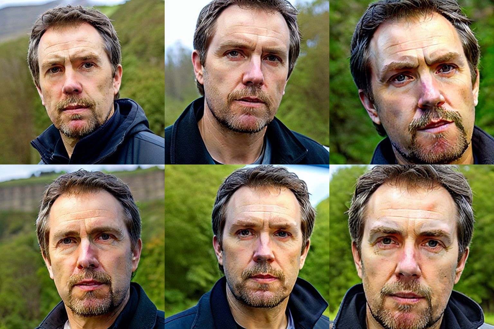

Prompt "" (empty)  

提示""（空）。

This remarkable accomplishment indicates that our 512x512 image has been successfully encoded into the AI model's latent space, which doesn't store pixel data but relies on weights within its structure.  

这一了不起的成就表明，我们的512x512的图像已经成功地被编码到人工智能模型的潜在空间，它不存储像素数据，而是依靠其结构中的权重。  

The underlying AI model, which is Stable Diffusion, involves a diffusion process for encoding and decoding data.  

底层的人工智能模型，也就是稳定扩散，涉及编码和解码数据的扩散过程。

In diffusion AI models, data is converted into points or vectors by introducing noise to the original data and learning to remove it.  

在扩散型人工智能模型中，通过向原始数据引入噪声并学习去除噪声，将数据转换为点或向量。  

The AI model features a network of interconnected nodes with connections of varying strengths, known as "weights." By adjusting these weights, the AI model identifies patterns in the data, enabling it to transform the points in the latent space back into high-dimensional images using its acquired knowledge.  

人工智能模型的特点是一个由相互连接的节点组成的网络，这些节点的连接强度不同，被称为 "权重"。通过调整这些权重，人工智能模型可以识别数据中的模式，使它能够利用其获得的知识将潜在空间中的点转化回高维图像。

It is also worth noting that the default word the input is trained on is "**ftpdnx**". This word is already included when selecting the model, so there's no need to input it manually every time in your prompt.  

还值得注意的是，输入的默认词是 "ftpdnx"。这个词在选择模型时就已经包含了，所以没有必要每次都在提示中手动输入。  

However, repeating this word can provide additional weight, as it influences the AI's output. The process of adjusting weights to guide the AI's output will be explained further in this guide.  

然而，重复这个词可以提供额外的权重，因为它影响了AI的输出。调整权重以指导人工智能的输出的过程将在本指南中进一步解释。

## Word Weight

The most frequent error is typing a single word, such as "bald," and expecting the model to comprehend and produce an image of a bald person.  

最常见的错误是输入一个词，如 "秃头"，并期望模型能理解并产生一个秃头的图像。

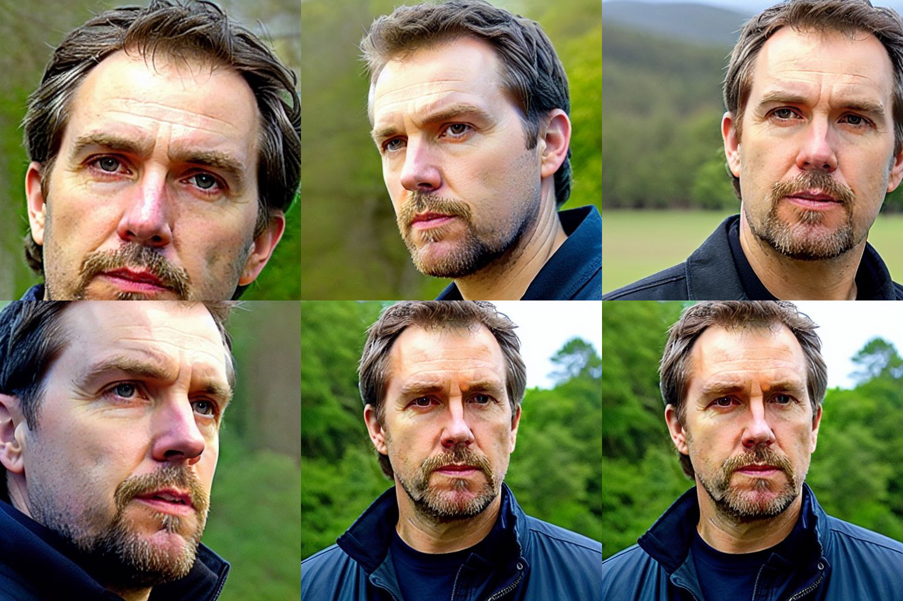

Prompt: "bald"

This is where people often get disappointed, questioning if these shortcomings are specific to BoostPixels or the current state of AI advancement.  

这就是人们经常感到失望的地方，质疑这些缺点是BoostPixels特有的，还是目前人工智能的发展状况。  

The key issue is that users aren't specific enough about their desired output. In prompt writing, understanding the "weight" concept and being explicit is crucial for better results.  

关键问题是，用户对他们所期望的产出不够具体。在提示语写作中，理解 "重量 "的概念并加以明确是取得更好结果的关键。

It's essential to structure the prompt so that the most critical words appear at the beginning. Each subsequent word carries less weight than the previous one.  

构建提示的结构，使最关键的词出现在开头，这是至关重要的。之后的每一个词的分量都比前一个词少。  

To give more weight to a word later in the prompt, you can use parentheses "()" to emphasize its importance.  

为了在后面的提示中给一个词更多的权重，你可以用括号"（）"来强调它的重要性。  

This approach guides the noise elimination process, ensuring that the model focuses on the key aspects of the prompt.  

这种方法指导消除噪音的过程，确保该模型集中在提示的关键方面。

Imagine distributing a total of 100 points among words in a prompt. We can illustrate it like this:  

想象一下，将总共100分的分数分配给一个提示中的单词。我们可以这样来说明：

Thus, the generated image will primarily reflect the original trained input word, along with the supplementary instructions we provide.  

因此，生成的图像将主要反映原始训练的输入词，以及我们提供的补充指令。  

However, this may not achieve the desired balance for generating a bald person image.  

然而，这可能无法实现生成秃头人图像的理想平衡。

By enclosing a word in parentheses "()", we can alter the weight it receives, as demonstrated below:  

通过将一个词用括号"() "括起来，我们可以改变它的权重，如下所示：

In most cases, this adjustment may still be insufficient to generate an image of an actual bald person.  

在大多数情况下，这种调整可能仍然不足以生成一个实际的秃头者的图像。  

To further modify the balance, we can add "((()))" additional parentheses around the word, like this:  

为了进一步修改平衡，我们可以在这个词周围添加"(()) "的附加括号，像这样：

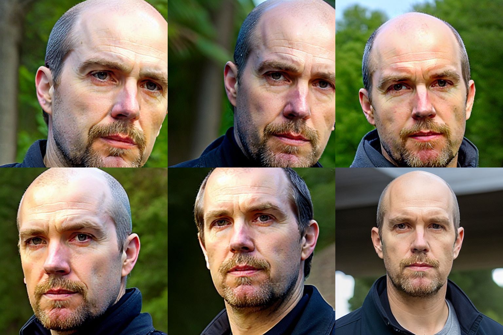

Prompt: "(((bald)))"  

提示："((秃头))"

However, simply adding all weight to a single word isn't effective, as it causes the model to focus solely on that word, ignoring the input image.  

然而，简单地把所有的权重加到一个词上并不有效，因为它导致模型只关注这个词，而忽略了输入图像。

If we use 6 parentheses "(((((())))))", the weight distribution will look like this:  

如果我们使用6个括号"(((((())))))"，重量分布将看起来像这样：

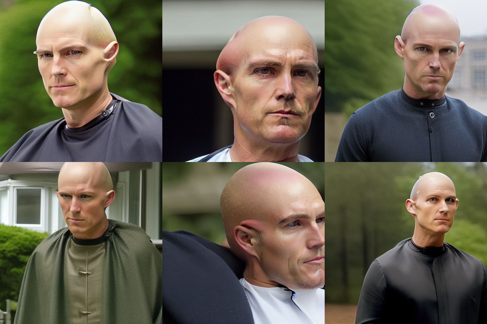

Prompt: "((((((bald))))))"  

提示："((((((bald))))))"

When unbalanced emphasis is placed on a specific term during input processing, the model tends to disproportionately focus on that term.  

在输入处理过程中，如果对某一特定术语的强调不平衡，模型往往会不成比例地集中在该术语上。  

Consequently, the resulting generated images may exhibit anomalous or unexpected features, deviating from the intended output.  

因此，所生成的图像可能表现出异常或意外的特征，偏离了预期的输出。

The initial weights assigned to words can vary depending on their frequency in the training dataset.  

分配给单词的初始权重可以根据它们在训练数据集中的频率而变化。  

High-frequency words possess greater influence due to their prevalence, and thus, it is essential to carefully calibrate the significance of distinct words in your input to ensure an accurate representation of the intended meaning.  

高频词由于其普遍性而拥有更大的影响力，因此，在你的输入中仔细校准明显的词的意义，以确保准确表达预期的含义是至关重要的。

If the generated image does not resemble the desired subject, consider appending the token "(ftpdnx)" to your prompt.  

如果生成的图像与所需的主题不相似，可以考虑在提示中附加"(ftpdnx) "标记。  

This token signals to the AI model that it should reference the specific photograph utilized during its training phase, thereby improving the model's ability to generate a more accurate image.  

这个标志向人工智能模型发出信号，表明它应该参考在其训练阶段利用的特定照片，从而提高模型生成更准确图像的能力。

Utilizing repetition of a keyword rather than parentheses in a prompt can provide comparable guidance to an AI model.  

在提示中利用关键词的重复而不是括号，可以为人工智能模型提供类似的指导。  

For instance, the prompt "bald bald bald bald bald bald bald bald" conveys a similar emphasis as the parenthesized version "((bald))".  

例如，提示语 "光头光头光头光头光头光头 "与括号内的版本"((光头)) "所表达的重点相似。  

However, this repetition-based approach may be considered less preferable, as it demands greater effort to discern the weight assigned to a word and is less convenient for adjustment.  

然而，这种基于重复的方法可能被认为不太可取，因为它需要付出更大的努力来辨别分配给一个词的权重，而且不便于调整。

Another option, rather than using parentheses in the prompt, is to include synonyms and extra descriptions to steer the model towards generating the desired output image.  

另一个选择，而不是在提示中使用括号，是包括同义词和额外的描述来引导模型生成所需的输出图像。  

For instance, using a prompt like "bald hairless baldheaded shaven shaved glabrous" can achieve comparable or even superior results.  

例如，使用像 "秃头无发秃头剃头无毛 "这样的提示可以达到相当的甚至更高的效果。

Under the hood, this approach modifies the weight distribution, enabling a more effective influence on the output image.  

在引擎盖下，这种方法修改了权重分布，使得对输出图像的影响更加有效。

<table data-immersive-translate-effect="1"><tbody data-immersive-translate-effect="1"><tr data-immersive-translate-effect="1"><td data-immersive-translate-effect="1">ftpdnx</td><td data-immersive-translate-effect="1">person</td><td data-immersive-translate-effect="1">bald</td><td data-immersive-translate-effect="1">hairless</td><td data-immersive-translate-effect="1">baldheaded</td><td data-immersive-translate-effect="1">shaven</td><td data-immersive-translate-effect="1">shaved</td><td data-immersive-translate-effect="1">glabrous</td></tr><tr data-immersive-translate-effect="1"><td data-immersive-translate-effect="1">40</td><td data-immersive-translate-effect="1">20</td><td data-immersive-translate-effect="1">12</td><td data-immersive-translate-effect="1">9</td><td data-immersive-translate-effect="1">7</td><td data-immersive-translate-effect="1">6</td><td data-immersive-translate-effect="1">4</td><td data-immersive-translate-effect="1">2</td></tr></tbody></table>

So the words to influence the output image have still a total of 40.  

因此，影响输出图像的词仍然共有40个。

## Beyond Universal Prompts: Harnessing Contextual Awareness   

超越通用提示：利用语境意识

In the world of AI image generation, it is crucial to recognize that there is no one-size-fits-all formula that can cater to every individual's specific needs and desired outcomes.  

在人工智能图像生成的世界里，关键是要认识到，没有一个放之四海而皆准的公式可以满足每个人的具体需求和期望的结果。  

The sheer diversity of use cases and objectives demands a more nuanced, context-dependent approach when it comes to crafting prompts and applying techniques.  

使用案例和目标的纯粹多样性要求在制作提示和应用技术时采取更细微的、取决于背景的方法。

Each person's goals and expectations for their desired output image are shaped by their unique personal context.  

每个人的目标和对他们所期望的输出形象的期望是由他们独特的个人背景形成的。  

As such, it is essential to consider the specific context when determining the appropriate balance and distribution of weights in the image generation process.  

因此，在确定图像生成过程中权重的适当平衡和分配时，必须考虑具体的环境。

For instance, some users may only be interested in making minor adjustments to their input image, such as adding or removing hair while preserving the original photo's visual style.  

例如，一些用户可能只对对他们的输入图片进行细微的调整感兴趣，例如在保留原始照片的视觉风格的同时，增加或去除头发。  

In these cases, leveraging a powerful tool like BoostPixels can lead to impressive results, enabling image manipulation that surpasses the capabilities of even the most skilled professional image editors.  

在这些情况下，利用像BoostPixels这样的强大工具可以带来令人印象深刻的结果，使图像处理甚至超过了最熟练的专业图像编辑的能力。

On the other hand, there are those who seek to transform the medium and style of their original image entirely.  

另一方面，也有一些人试图完全改变其原始图像的媒介和风格。  

To accommodate these varying objectives, it is important to explore and experiment with various prompts, specifically tailored to the desired outcome.  

为了适应这些不同的目标，重要的是要探索和尝试各种提示，特别是针对预期的结果。

## Medium and Style  

媒介和风格

Specifying medium and style is crucial in image generation. If the AI lacks specific information about the desired style and medium, it defaults to the style of the input image.  

指定媒介和风格是图像生成的关键。如果人工智能缺乏关于所需风格和媒介的具体信息，它将默认为输入图像的风格。  

To optimize outcomes, it is advisable to provide a well-chosen style and medium, as they considerably impact the resulting image corresponding to the subject.  

为了优化结果，建议提供一个精心选择的风格和媒介，因为它们在很大程度上影响了与主题相对应的结果图像。

Examples of some commonly used styles and medium:  

一些常用的风格和媒介的例子：

Styles:

1.  Hyperrealistic
2.  Surrealistic
3.  Cartoon
4.  Watercolour
5.  Sketch
6.  Concept art

Mediums:

1.  Photography
2.  Illustration
3.  Painting
4.  3D rendering

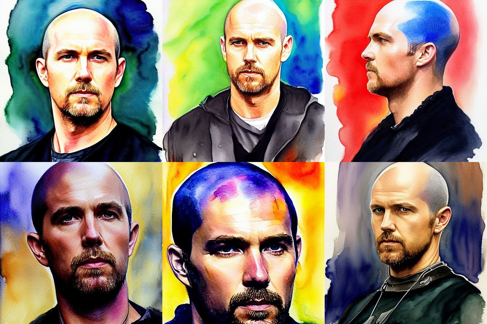

Prompt: "(((bald))) watercolour painting"  

提示："((秃头))水彩画"

Think about the weight distribution of the words in this prompt.  

思考一下这个提示中的单词的重量分布。

<table data-immersive-translate-effect="1"><tbody data-immersive-translate-effect="1"><tr data-immersive-translate-effect="1"><td data-immersive-translate-effect="1">ftpdnx</td><td data-immersive-translate-effect="1">person</td><td data-immersive-translate-effect="1">bald</td><td data-immersive-translate-effect="1">watercolour</td><td data-immersive-translate-effect="1">painting</td></tr><tr data-immersive-translate-effect="1"><td data-immersive-translate-effect="1">35</td><td data-immersive-translate-effect="1">15</td><td data-immersive-translate-effect="1">35</td><td data-immersive-translate-effect="1">10</td><td data-immersive-translate-effect="1">5</td></tr></tbody></table>

## Adding an Artist  

添加艺术家

Incorporating an artist's name in your prompt can effectively generate images that appeal to a broad audience.  

在你的提示中加入艺术家的名字可以有效地产生吸引广大观众的图像。  

For instance, to create an image with a particular style, include "painting by Rembrandt" in the prompt.  

例如，要创建一个具有特定风格的图像，在提示中包括 "伦勃朗的绘画"。

Prompt: "((bald)) painting by Rembrandt"  

提示：伦勃朗的"（秃头）画"。

I've selected Rembrandt as an example to vividly demonstrate the application of a famous artist's style. You can incorporate the names of various renowned artists to adopt their distinctive styles.  

我选择了伦勃朗作为例子，生动地展示了著名艺术家的风格的应用。你可以结合各种著名艺术家的名字，采用他们独特的风格。  

You can even experiment by merging the styles of multiple artists, giving birth to a truly unique and captivating visual experience.  

你甚至可以通过合并多个艺术家的风格来进行实验，诞生一个真正独特和迷人的视觉体验。

Here are some examples of popular artist styles combined to create a unique visual style:  

这里有一些流行的艺术家风格的例子，结合起来创造一个独特的视觉风格：

## Quality Attributes  

质量属性

It is important to consider quality attributes when writing prompts as they have a direct impact on the quality of the generated outputs.  

在编写提示时，考虑质量属性很重要，因为它们对生成的产出的质量有直接影响。  

A well-written prompt with strong quality attributes can increase the likelihood of producing desired outputs because it tells the model to guide the noise elimination process involving also these weights.   

一个写得很好的具有强大质量属性的提示可以增加产生理想输出的可能性，因为它告诉模型指导消除噪音的过程也涉及这些权重。

Resolution:

1.  1080 HD
2.  4K UHD
3.  8K UHD

Details:

1.  Detailed
2.  Sharp Focus

Lighting:

1.  Natural light
2.  Fluorescent light
3.  LED light
4.  Incandescent light  
    
    白炽灯

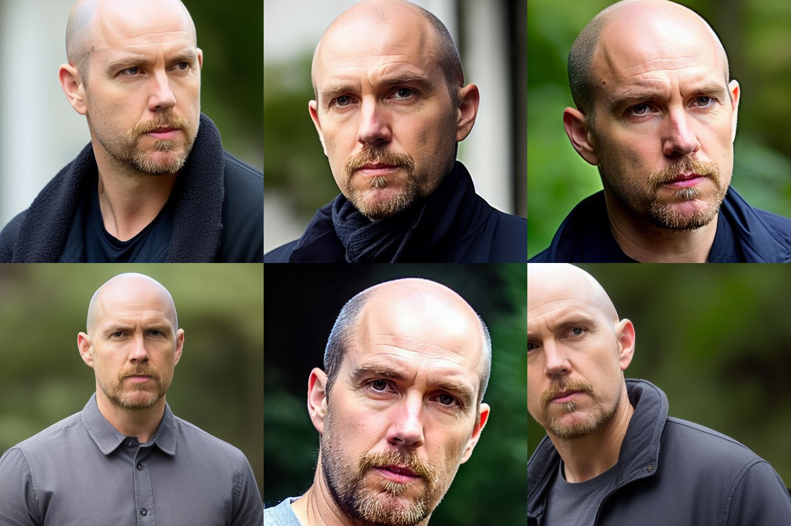

Prompt: "(((bald))) photo Hyperrealistic 4K UHD Sharp Focus LED light"  

承诺："((光头))照片 超现实的4K UHD锐聚焦LED灯"

## Context

Now comes the fun part. Because the intention is often to place the subject also in a different context. This creates often the desired funny or interesting images.  

现在，有趣的部分来了。因为我们的目的往往是要把主题放在不同的背景下。这往往会创造出所需的有趣的或有意义的图像。

Here are some examples of placing a person in Venice:  

下面是一些将人安置在威尼斯的例子：

Prompt: "((portrait)) photo hyperrealistic 4K UHD sharp focus LED light intricate Venice background"  

承诺："((人像))照片超现实的4K UHD锐聚焦LED灯复杂的威尼斯背景"

Here are some examples of placing a person in Paris:  

下面是一些将人安置在巴黎的例子：

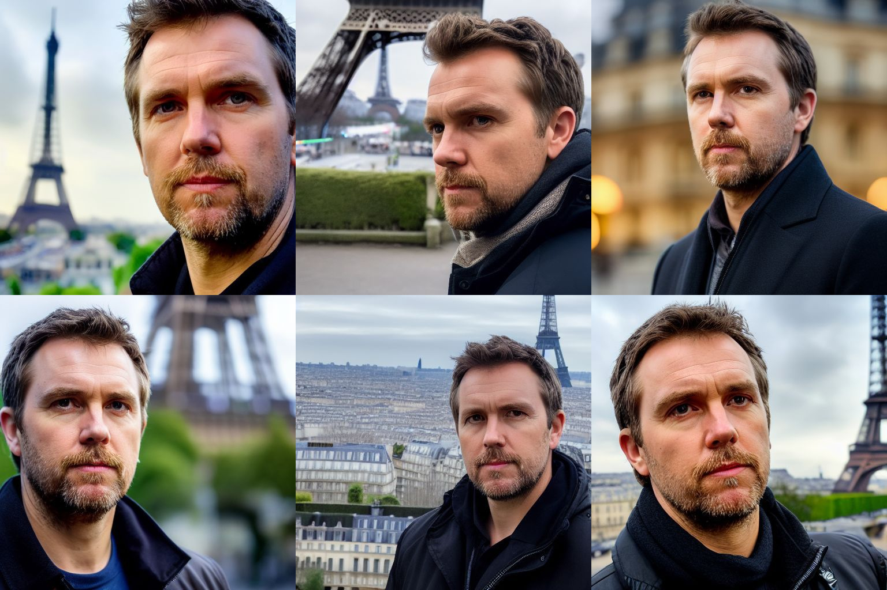

Prompt: "((portrait)) photo hyperrealistic 4K UHD sharp focus LED light intricate Paris background"  

承诺："((肖像))照片超现实的4K UHD锐聚焦LED灯错综复杂的巴黎背景"

Of course, context is not limited to the background. Another powerful concept is the "as" construction.  

当然，背景并不局限于背景。另一个强大的概念是 "作为 "结构。

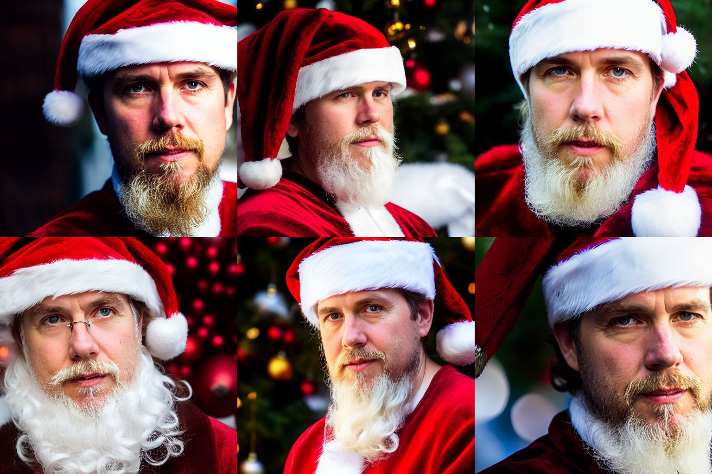

Prompt: "as (santa claus) photo hyperrealistic 4K UHD sharp focus LED light intricate background"  

提示："作为（圣诞老人）照片超现实的4K UHD锐聚焦LED灯复杂的背景"

Here are some examples of representing a person as a superhero:  

这里有一些将一个人表现为超级英雄的例子：

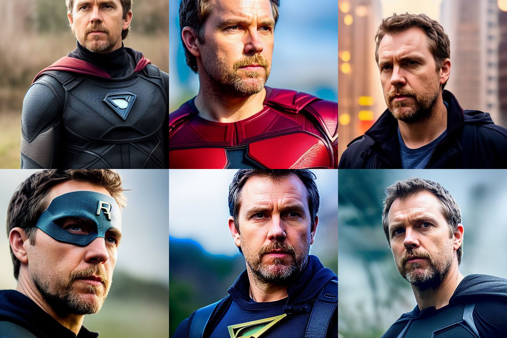

Prompt: "as (super hero) photo hyperrealistic 4K UHD sharp focus LED light intricate background"  

承诺："作为（超级英雄）的照片超现实的4K UHD锐聚焦LED灯复杂的背景"

Here are some examples of representing the subject wearing a puffy jacket:  

这里有一些表现主体穿蓬松外套的例子：

Prompt: "wearing a ((white puffy)) fashion jacket full body shot photo hyperrealistic 4K UHD sharp focus LED light streetscape, polycount, antipodeans, maximalist, ultra hd, stylish"  

提示："穿着（（白色蓬松的））时尚外套全身拍摄的照片超现实的4K UHD锐聚焦LED灯街景，多维数，反传统的，最大的，超高清的，时尚"

The AI model lacks any understanding of Boolean logic. Therefore, writing phrases like "a person riding a horse, beneath an elephant" won't be processed logically.  

人工智能模型缺乏对布尔逻辑的任何理解。因此，写 "一个人骑着马，在大象下面 "这样的短语不会被逻辑地处理。  

Keep in mind that the words in prompts simply influence the weights in latent space, without any logical, rational or social concepts.  

请记住，提示语中的词语只是影响潜伏空间的权重，没有任何逻辑、理性或社会概念。

## Color

Incorporating a color in a prompt generally affects the entire image.  

在提示中加入一种颜色一般会影响到整个画面。  

This occurs because the AI model often interprets the specified color as a dominant theme, resulting in the color being applied broadly across the image.  

出现这种情况是因为人工智能模型经常将指定的颜色解释为主要的主题，导致该颜色被广泛地应用于整个图像。  

Isolating the color to a specific object within the image can be quite challenging, as the model's understanding of the prompt may not be precise enough to localize the color application accurately.  

将颜色隔离到图像中的特定对象可能是相当具有挑战性的，因为模型对提示的理解可能不够精确，无法准确定位颜色的应用。

## Emotions

Emotional words play a vital role in influencing the image generation process, as they help convey the intended mood or atmosphere of the image.  

情感词在影响图像生成过程中起着至关重要的作用，因为它们有助于传达图像的预期情绪或氛围。

1.  Positive Emotions: Use words that evoke uplifting or pleasant feelings. Examples: joyful, cheerful, peaceful, enchanting, or vibrant.  
    
    积极的情绪：使用能唤起令人振奋或愉快情绪的词语。例如：快乐的、欢快的、和平的、迷人的或充满活力的。
2.  Negative Emotions: Use words that convey darker or more somber moods. Examples: melancholic, eerie, ominous, gloomy, or unsettling.  
    
    负面的情绪：使用能表达黑暗或阴郁情绪的词语。例如：忧郁的、阴森的、不祥的、阴沉的、或令人不安的。
3.  Calm Emotions: Use words that suggest a sense of tranquility or serenity. Examples: serene, tranquil, soothing, or calming.  
    
    平静情绪：使用暗示宁静或安详感的词语。例如：宁静的、安详的、舒缓的或平静的。
4.  Energetic or Dynamic Emotions: Use words that imply movement, activity, or excitement. Examples: bustling, lively, dynamic, or energetic.  
    
    有活力的或动态的情绪：使用暗示运动、活动或兴奋的词语。例如：熙熙攘攘、热闹非凡、充满活力或精力充沛。
5.  Mysterious or Enigmatic Emotions: Use words that hint at an air of mystery or intrigue. Examples: mysterious, intricate, enigmatic, cryptic, or mystic.  
    
    神秘或神秘的情感：使用暗示神秘或阴谋气息的词语。例如：神秘的、复杂的、神秘的、隐秘的或神秘的。

## Perspective and Distance  

视角和距离

When prompting the AI to generate an image, it's important to specify the desired proximity and distance.  

当提示人工智能生成图像时，指定所需的接近和距离是很重要的。  

For a full-body depiction, use terms like "jacket," "belt," and "shoes" to capture the entire figure.  

对于全身的描写，使用 "夹克"、"腰带 "和 "鞋子 "等术语来捕捉整个人物。

Incorporating keywords related to the intended style, such as renowned photographers' names, can also help convey the desired distance and perspective.  

纳入与预期风格相关的关键词，如著名摄影师的名字，也可以帮助传达所需的距离和视角。

Prompt: "wearing a brown leather jacket and belt and shoes, forest background, in the style of Brandon Stanton, Humans of New York"  

提示："穿着棕色皮夹克、腰带和鞋子，森林背景，按照《纽约人类》的布兰登-斯坦顿的风格"

## Faces

Generating accurate faces of far-distant persons is currently one of the most challenging tasks for generative AI models.  

生成远距离人员的准确面孔是目前生成性人工智能模型最具挑战性的任务之一。  

While it is relatively easy to generate satisfying images that are similar to the reference image in terms of distance, it is very hard to generate accurate faces of a person who is far away.  

虽然生成与参考图像在距离上相似的满意图像相对容易，但要生成远处的人的准确面孔则非常困难。

However, there is an effective way to achieve this. The trick is to generate the image in a higher resolution.  

然而，有一个有效的方法来实现这一点。诀窍是以更高的分辨率生成图像。

Under the hood, it is applying the high resolution fix that helps to correct faces.  

在引擎盖下，它正在应用有助于纠正面部的高分辨率修复。  

BoostPixels also applies the upscale algorithm Real-ESRGAN to improve images making them look sharper, clearer, and more visually appealing.  

BoostPixels还应用了Real-ESRGAN升级算法来改善图像，使它们看起来更清晰，更明确，更具有视觉吸引力。

"Enhance face" uses CodeFormer to generate high-quality, natural-looking faces to obtain visually appealing results.  

"增强脸部 "使用CodeFormer来生成高质量、自然的脸部，以获得具有视觉吸引力的结果。

The disadvantage is that generating a high-resolution image takes considerably longer.  

其缺点是，生成高分辨率图像需要相当长的时间。  

At the moment, generating a high-resolution 1024 px image takes around 8 seconds, compared to 2 seconds for a 512 px image. This is also the reason that it costs 4 credits.  

目前，生成一个高分辨率的1024 px图像需要大约8秒，而生成一个512 px图像只需要2秒。这也是它需要花费4个信用点的原因。

<table data-immersive-translate-effect="1"><tbody data-immersive-translate-effect="1"><tr data-immersive-translate-effect="1"><td data-immersive-translate-effect="1">1024 pixels + Enhace face 1024像素+增强面部</td><td data-immersive-translate-effect="1"><figure role="group" data-immersive-translate-effect="1">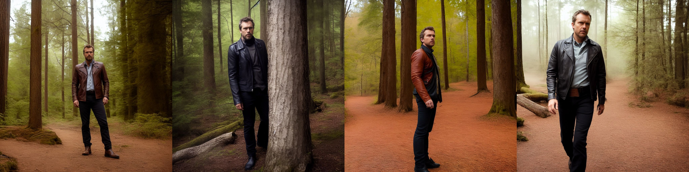<figcaption data-immersive-translate-effect="1">Prompt: "detailed photograph of a man wearing a old grey leather jacket and belt, waist shot, forest background, in the style of Brandon Stanton, Humans of New York" 提示："一个穿灰色旧皮夹克和皮带的男人的详细照片，腰部拍摄，森林背景，布兰登-斯坦顿的风格，纽约的人类"</figcaption></figure></td></tr><tr data-immersive-translate-effect="1"><td data-immersive-translate-effect="1">1024 pixels</td><td data-immersive-translate-effect="1"><figure role="group" data-immersive-translate-effect="1">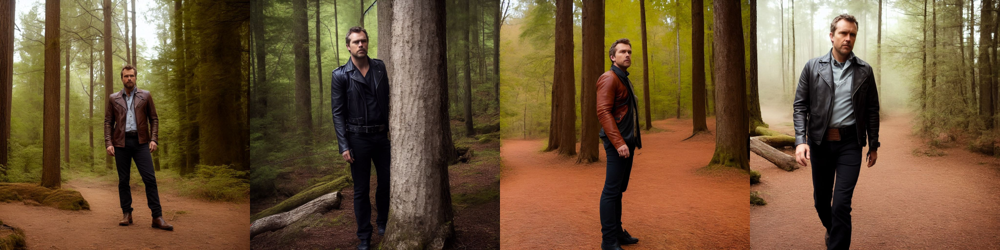<figcaption data-immersive-translate-effect="1">Prompt: "detailed photograph of a man wearing a old grey leather jacket and belt, waist shot, forest background, in the style of Brandon Stanton, Humans of New York" 提示："一个穿灰色旧皮夹克和皮带的男人的详细照片，腰部拍摄，森林背景，布兰登-斯坦顿的风格，纽约的人类"</figcaption></figure></td></tr><tr data-immersive-translate-effect="1"><td data-immersive-translate-effect="1">512 pixels</td><td data-immersive-translate-effect="1"><figure role="group" data-immersive-translate-effect="1">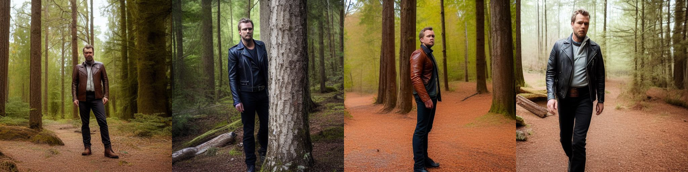<figcaption data-immersive-translate-effect="1">Prompt: "detailed photograph of a man wearing a old grey leather jacket and belt, waist shot, forest background, in the style of Brandon Stanton, Humans of New York" 提示："一个穿灰色旧皮夹克和皮带的男人的详细照片，腰部拍摄，森林背景，布兰登-斯坦顿的风格，纽约的人类"</figcaption></figure></td></tr></tbody></table>

It is clear that generating at 1024 pixels with Enhance face is adding much more accuracy to the face, which is desperately needed.  

很明显，以1024像素生成的增强型人脸，为人脸增加了更多的准确性，这是我们迫切需要的。

## Negative prompts

By default, BoostPixels uses the negative prompt "cartoon 3d hands deformed ugly" to assist beginners in easily achieving satisfactory results.  

默认情况下，BoostPixels使用负面提示 "卡通3D手部变形的丑陋 "来帮助初学者轻松获得满意的结果。  

Users can opt for an alternative or input their own custom negative prompt.  

用户可以选择替代方案或输入自己的自定义负面提示。

It's important to note that negative prompts don't directly remove an object from a generated image.  

值得注意的是，负面提示并不能直接从生成的图像中删除一个物体。  

Instead, they assign negative weight to certain words, making positive words more prominent in comparison.  

相反，他们给某些词赋予负面的权重，使正面的词在比较中更加突出。  

It's better to think in terms of points and vectors in latent space, rather than treating the prompt like a 3D model or a pixel-based raster image description.  

最好是用潜伏空间中的点和矢量来思考，而不是把提示当作三维模型或基于像素的光栅图像描述。

<table data-immersive-translate-effect="1"><tbody data-immersive-translate-effect="1"><tr data-immersive-translate-effect="1"><td data-immersive-translate-effect="1">No negative prompt 没有负面提示</td><td data-immersive-translate-effect="1"><figure role="group" data-immersive-translate-effect="1"><figcaption data-immersive-translate-effect="1">Prompt: "digital illustration of a man wearing a leather jacket, Victorian aesthetics, waist shot, forest background, in the style of Magali Villeneuve" 提示："一个穿皮夹克的男人的数字插图，维多利亚时代的美学，腰部拍摄，森林背景，Magali Villeneuve的风格"</figcaption></figure></td></tr><tr data-immersive-translate-effect="1"><td data-immersive-translate-effect="1">cartoon 3d hands deformed ugly 卡通3D手部畸形丑陋</td><td data-immersive-translate-effect="1"><figure role="group" data-immersive-translate-effect="1"><figcaption data-immersive-translate-effect="1">Prompt: "digital illustration of a man wearing a leather jacket, Victorian aesthetics, waist shot, forest background, in the style of Magali Villeneuve" 提示："一个穿皮夹克的男人的数字插图，维多利亚时代的美学，腰部拍摄，森林背景，Magali Villeneuve的风格"</figcaption></figure></td></tr><tr data-immersive-translate-effect="1"><td data-immersive-translate-effect="1">lowres, text, error, cropped, worst quality, low quality, jpeg artifacts, ugly, duplicate, morbid, mutilated, out of frame, extra fingers, mutated hands, poorly drawn hands, poorly drawn face, mutation, deformed, blurry, dehydrated, bad anatomy</td><td data-immersive-translate-effect="1"><figure role="group" data-immersive-translate-effect="1"><figcaption data-immersive-translate-effect="1">Prompt: "digital illustration of a man wearing a leather jacket, Victorian aesthetics, waist shot, forest background, in the style of Magali Villeneuve" 提示："一个穿皮夹克的男人的数字插图，维多利亚时代的美学，腰部拍摄，森林背景，Magali Villeneuve的风格"</figcaption></figure></td></tr></tbody></table>

A practical approach to understanding the influence of negative prompts is to generate an image using the negative prompt itself.  

了解负面提示的影响的一个实际方法是使用负面提示本身生成一个图像。  

By doing this, you can observe the content that the model is likely being guided away from when generating images based on your original prompt.  

通过这样做，你可以观察到模型在根据你的原始提示生成图像时可能被引导离开的内容。

## Power of repetition and relentlessly trying again and again   

重复的力量和不屈不挠的一次又一次尝试

Generating the perfect image often requires some trial and error, so don't be disheartened if your first attempt doesn't quite match your vision.  

生成完美的图像往往需要一些试验和错误，所以如果你的第一次尝试与你的设想不完全一致，也不要灰心。  

It's common to create multiple images and select the best one. Remember, you're not alone or lacking in skill if your prompt doesn't consistently produce the desired results.  

创建多个图像并选择最好的一个是很常见的。请记住，如果你的提示不能持续产生预期的结果，你并不孤单，也不缺乏技能。

This variability is inherent in the diffusion AI model, where outcomes are heavily influenced by random noise.  

这种变异性是扩散型人工智能模型所固有的，其结果受到随机噪音的严重影响。  

Just like life itself, sometimes you strike gold, and other times you need a bit more persistence.  

就像生活本身一样，有时你会淘到金子，而其他时候你需要更多的坚持。  

Embrace the process and enjoy the journey, knowing that each iteration increases your chance to generate that ideal image you're imagining.  

拥抱这个过程，享受这个旅程，知道每一次迭代都会增加你产生你所想象的理想形象的机会。

Sometimes, it can be more effective to repeatedly generate images using the existing prompt, essentially "rolling the dice" many times, instead of trying to perfect the prompt.  

有时，利用现有的提示反复生成图像，基本上是多次 "掷骰子"，而不是试图完善提示，可能会更有效。  

This approach relies on brute force and a certain degree of luck to produce the desired image, rather than refining the prompt.  

这种方法依靠蛮力和一定程度的运气来产生所需的图像，而不是提炼提示。

This idea is reminiscent of the "infinite monkey theorem," which posits that given infinite time, a monkey randomly hitting keys on a typewriter would eventually produce the complete works of Shakespeare.  

这个想法让人想起了 "无限猴子定理"，该定理认为，如果有无限的时间，一只猴子在打字机上随机敲打键盘，最终会产生莎士比亚的全部作品。  

Similarly, by generating a large number of images using the same prompt, there's a chance you'll eventually obtain the desired output.  

同样，通过使用相同的提示生成大量的图像，有机会最终获得所需的输出。  

However, it's important to balance the reliance on brute force and luck with thoughtful prompt design to achieve optimal results in a reasonable amount of time.  

然而，重要的是要平衡对蛮力和运气的依赖与周到的提示设计，以便在合理的时间内取得最佳结果。

## Length of prompts  

提示语的长度

BoostPixels sets a limit of 256 characters for prompts, even though its underlying AI model can handle up to 380 characters.  

BoostPixels为提示设置了256个字符的限制，尽管它的底层AI模型可以处理多达380个字符。  

This constraint is designed to encourage users to create concise and effective prompts, as longer prompts don't necessarily lead to better results.  

这一限制旨在鼓励用户创建简明有效的提示，因为较长的提示不一定能带来更好的结果。

Users sometimes create lengthy prompts filled with incongruous elements in an attempt to explain or justify the unexpected images generated by the AI.  

用户有时会创建冗长的提示，其中充满不协调的元素，试图解释或证明人工智能产生的意外图像。  

As a result, they may attribute the outcomes to esoteric reasons or even create myths, seeking explanations within their prompt writing.  

因此，他们可能会把结果归结为深奥的原因，甚至创造神话，在他们的提示写作中寻求解释。  

By focusing on crafting clear and succinct prompts, users can avoid this pitfall and improve their chances of obtaining the desired output.  

通过专注于制作清晰简洁的提示，用户可以避免这种陷阱，并提高他们获得预期输出的机会。

It is crucial to structure prompts by placing the most significant words at the forefront, as the impact of each word decreases with its position.  

将最重要的词放在最前面来构造提示语是至关重要的，因为每个词的影响会随着位置的变化而减少。  

Keep in mind that the influence of words in the latter part of the prompt wanes, leading to a reduced effect on the final outcome.  

请记住，在提示的后半部分，词语的影响会减弱，导致对最终结果的影响降低。

## Punctuation

Modifying punctuation in a prompt can significantly influence generative AI models' outputs, as every character, including punctuation, is crucial in determining the generated result.  

修改提示语中的标点符号可以显著影响生成式人工智能模型的输出，因为每一个字符，包括标点符号，都是决定生成结果的关键。  

This is due to tokenization - the process of breaking text data into smaller units called tokens, such as words, characters, or subwords.  

这是由于标记化--将文本数据分解成更小的单位，称为标记，如单词、字符或子词的过程。

Altered punctuation changes token interactions, leading to different outputs. The AI model, trained on diverse data, is sensitive to these variations in token or punctuation arrangements.  

改动的标点符号改变了令牌的相互作用，导致了不同的输出。在不同的数据上训练出来的人工智能模型，对这些标记或标点符号排列的变化很敏感。  

The tokenized input undergoes "self-attention" during processing, where each token, represented by neural network weights, interacts with surrounding tokens across multiple layers.  

在处理过程中，标记化的输入经历了 "自我关注"，其中每个标记，由神经网络权重代表，与周围的标记在多个层次上互动。  

These layers are compressed into a compact latent representation, combined with random image noise using dot product operations, and iteratively refined by the diffusion network to generate coherent outputs based on the model's training data.  

这些层被压缩成一个紧凑的潜在表征，使用点乘运算与随机图像噪声相结合，并由扩散网络反复完善，以产生基于模型训练数据的一致性输出。

## Character Set and Case Insensitivity         

字符集和大小写不敏感

It's advisable to phrase your prompt in English, as the majority of the training data set consists of English image-text pairs.   

建议你用英语来表述你的提示，因为大多数训练数据集由英语图像-文本对组成。

Keep in mind that prompts are case-insensitive, so using all lowercase letters might be more convenient and consistent.  

请记住，提示是不分大小写的，所以使用所有小写字母可能更方便和一致。

## Classifier-Free Guidance Scale  

无分类指导量表

Classifier-free guidance is a method that generates images without requiring an extra classifier.  

无分类指导是一种不需要额外分类器就能生成图像的方法。  

In traditional methods, a diffusion model's score estimate is mixed with the input gradient of a classifier to improve image quality.  

在传统方法中，扩散模型的分数估计与分类器的输入梯度混合，以提高图像质量。  

However, this requires training an extra classifier, which can be challenging.   

然而，这需要训练一个额外的分类器，这可能是一个挑战。

To address this, classifier-free guidance combines conditional and unconditional diffusion model scores to enhance image quality and balance sample diversity.  

为了解决这个问题，无分类指导结合了条件和无条件的扩散模型得分，以提高图像质量和平衡样本多样性。  

This method enables better control over output images, generating high-quality results that closely match input prompts while maintaining diversity.  

这种方法能够更好地控制输出图像，产生与输入提示密切相关的高质量结果，同时保持多样性。

## Seed

The seed is a numeric value that initializes the random number generator used by the AI model during the image generation process.  

种子是一个数字值，用于初始化人工智能模型在图像生成过程中使用的随机数发生器。

The default seed value on BoostPixels is set to -1 to ensure that you'll get a unique generated image every time you run the process, without the need to manually change the seed value.  

BoostPixels的默认种子值被设置为-1，以确保你每次运行该程序时都能得到一个独特的生成图像，而不需要手动改变种子值。  

However, if you prefer, you can set a specific seed value other than -1.   

然而，如果你愿意，你可以设置一个特定的种子值，而不是-1。

By setting a specific seed value, you can reproduce the same generated image multiple times, given the same other input parameters.  

通过设置一个特定的种子值，在其他输入参数相同的情况下，你可以多次复制相同的生成图像。  

This is useful when you want to share your results with others, compare different settings, or revisit a particular output.  

当你想与他人分享你的结果，比较不同的设置，或重新审视一个特定的输出时，这很有用。

## Limitations and challenges  

限制和挑战

Text generation is not possible due to the inherent discrete and structured nature of textual data, which consists of individual symbols arranged in a specific order.  

由于文本数据固有的离散性和结构性，它由按特定顺序排列的单个符号组成，因此不可能进行文本生成。  

This characteristic distinguishes it from image generation.  

这一特点使它与图像生成有所区别。

One prevalent challenge is accurately generating hands. The current state of images produced by AI models is often misshapen or appears unnatural.  

一个普遍的挑战是准确地生成手。目前由人工智能模型产生的图像的状态往往是错位的或显得不自然的。  

The primary reason for this issue is because hands are composed of numerous bones, joints, and muscles that work together to enable a wide range of complex motions and gestures.  

造成这一问题的主要原因是，手是由众多的骨骼、关节和肌肉组成的，它们共同作用于各种复杂的动作和姿态。

To improve the generation of hands in AI-generated images, models need to be trained on more diverse and representative datasets, capturing the complexity of hands in various poses, orientations, and gestures.  

为了改善人工智能生成的图像中的手的生成，需要在更多样化和有代表性的数据集上训练模型，捕捉各种姿势、方向和手势中的手的复杂性。  

This could involve incorporating more detailed annotations or even 3D models.  

这可能涉及纳入更详细的注释，甚至是3D模型。

Controlling the specific characteristics or features of images generated by diffusion models can be challenging.  

控制由扩散模型生成的图像的具体特征或特点可能是一个挑战。  

While latent space guidance by text prompts can offer some level of control, achieving fine-grained control over the output (e.g., specific attributes, styles, or content) can be difficult.  

虽然文本提示的潜空间指导可以提供某种程度的控制，但要实现对输出的精细控制（例如，特定的属性、风格或内容）是很困难的。

Diffusion models are non-deterministic, meaning that they can produce different outputs for the same input due to their inherent randomness.  

扩散模型是非确定性的，这意味着由于其固有的随机性，它们可以对相同的输入产生不同的输出。  

This characteristic can fuel superstition and lead people to attribute successful image outputs to unrelated factors.  

这一特点会助长迷信，导致人们把成功的形象产出归因于无关的因素。  

The phenomenon is reminiscent of Skinner's operant conditioning experiment, where subjects developed superstitious behaviors by associating random events with reinforcement.  

这一现象让人想起斯金纳的操作性条件反射实验，受试者通过将随机事件与强化物联系起来而形成迷信行为。
