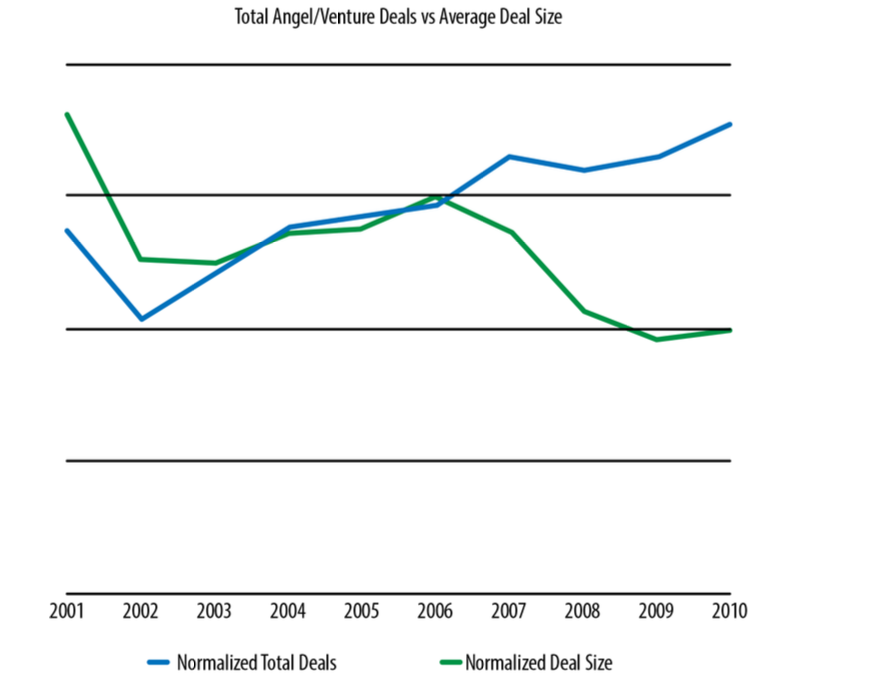

OpenAI is the gateway platform to our industry’s next major revolution, leading to a massive increase in individual, team and company productivity.  

OpenAI是我们行业下一次重大革命的门户平台，将带来个人、团队和公司生产力的巨大提升。

If you’re trying to understand the impact of Large Language Models on developer productivity you should definitely be following [recent work by Simon Willison](https://simonwillison.net/), creator of Datasette, and Django OG. He’s documenting his AI assisted code journey, and it’s fascinating.  

如果你想了解大型语言模型对开发者生产力的影响，你一定要关注Simon Willison最近的工作，他是Datasette和Django OG的创建者。他正在记录他的人工智能辅助代码之旅，这很吸引人。

He recently wrote a post – [AI-enhanced development makes me more ambitious with my projects](https://simonwillison.net/2023/Mar/27/ai-enhanced-development/) – which is canon.  

他最近写了一篇文章--人工智能增强的开发使我对我的项目更有雄心--这就是大炮。

> As an experienced developer, ChatGPT (and GitHub Copilot) save me an enormous amount of “figuring things out” time.  
> 
> 作为一个有经验的开发者，ChatGPT（和GitHub Copilot）为我节省了大量的 "搞清楚 "的时间。  
> 
> For everything from writing a for loop in Bash to remembering how to make a cross-domain CORS request in JavaScript—I don’t need to even look things up any more, I can just prompt it and get the right answer 80% of the time.  
> 
> 从在Bash中写一个for循环到记住如何在JavaScript中进行跨域CORS请求，我甚至不需要再去查找东西，我可以直接提示它，并在80%的情况下得到正确的答案。
> 
> This doesn’t just make me more productive: it lowers my bar for when a project is worth investing time in at all.  
> 
> 这不仅使我更有效率：它降低了我对一个项目是否值得投入时间的标准。
> 
> In the past I’ve had plenty of ideas for projects which I’ve ruled out because they would take a day—or days—of work to get to a point where they’re useful. I have enough other stuff to build already!  
> 
> 在过去，我有很多项目的想法，但都被我排除了，因为它们需要花一天或几天的时间才能达到有用的程度。我已经有足够多的其他东西要做了！
> 
> But if ChatGPT can drop that down to an hour or less, those projects can suddenly become viable.  
> 
> 但如果ChatGPT能将这一时间降至一小时或更短，这些项目就能突然变得可行。

An hour or less. Viability. We have spent the last few years talking about code to cloud, but the next revolution is about idea to code.  

一个小时或更少。可行性。在过去的几年里，我们一直在讨论从代码到云的问题，但下一次革命是关于从想法到代码。  

What happens when time to learn a new technology is no longer a constraint for building something new? Of course the software still needs debugging. The developer can’t expect perfect results.  

当学习一项新技术的时间不再是构建新事物的制约因素时，会发生什么？当然，软件仍然需要调试。开发者不能期待完美的结果。  

Hallucinations happen. Security and prompt injection is going to be an issue. But the power is there. It’s been unleashed.  

幻觉的发生。安全和及时注射将是一个问题。但力量就在那里。它已经被释放出来了。

In trying to understand the impact of a new technology or process on the industry it’s always worth looking back to history in order to better model and understand what’s actually happening now, and what’s likely to happen in future.  

在试图了解一项新技术或工艺对行业的影响时，总是值得回顾历史，以便更好地模拟和了解现在实际发生的事情，以及未来可能发生的事情。  

In trying to understand the likely impact of Large Language Models (LLMs) and AI then on the practice of tech I have therefore been considering how we got here.  

在试图了解大型语言模型（LLMs）和人工智能对技术实践的可能影响时，我一直在考虑我们是如何走到这一步的。

I have been thinking about the trend my colleague Stephen O’Grady described in his seminal work [The New Kingmakers](https://thenewkingmakers.com/), namely the increasing influence of software developers and engineering teams on businesses, their associated increasing influence on decisions about the tech used to build apps and digital services, and indeed, to create and sustain companies.  

我一直在思考我的同事斯蒂芬-奥格雷迪（Stephen O'Grady）在他的开创性作品《新造物主》中描述的趋势，即软件开发人员和工程团队对企业的影响越来越大，他们对用于构建应用程序和数字服务的技术决策的影响也越来越大，事实上，对创建和维持公司也是如此。  

The three megatrends underpinning the New Kingmakers phenomenon were Open Source, The Cloud and Online Learning and Sharing. Well now a fourth has arrived – AI assisted code.  

支撑新王者现象的三个大趋势是开源、云和在线学习与共享。现在第四个已经到来--人工智能辅助代码。

Some years ago we had a conversation with a guy called Chris Tacy which really struck us.  

几年前，我们与一个叫克里斯-泰西的人进行了一次谈话，这让我们非常震惊。  

Chris had been tracking investment deals in tech and he showed us this chart, which later found its way into Stephen’s book.  

克里斯一直在跟踪科技领域的投资交易，他给我们看了这张图表，后来这张图进入了斯蒂芬的书。

We’re looking at venture deals against average deal size from 2001 to 2010.  

我们正在研究2001年至2010年的风险交易与平均交易规模。

The classic package of people and technology required to build a startup is worth tracking – which maps to average deal size.  

建立一个初创企业所需的人员和技术的经典组合是值得追踪的--这与平均交易规模相一致。  

Leading into the year 2000 timeframe, before the Dotcom Crash – Big Vendors were still in the game.  

进入2000年的时间框架，在Dotcom崩溃之前--大供应商仍在游戏中。  

With venture funding looking something like EMC for storage, Oracle for database, Cisco for networking, BEA Weblogic for application server and 10 million dollars for marketing.  

风险投资看起来像存储的EMC、数据库的Oracle、网络的Cisco、应用服务器的BEA Weblogic和1000万美元的营销费用。  

So 50 million dollars to start scaling your startup. eBay relied on Oracle database for the longest time. So did Salesforce.  

因此，5000万美元可以开始扩大你的创业公司。 eBay在很长一段时间内依赖Oracle数据库。Salesforce也是如此。  

So you would have to ask for permission, which is to say a lot of money, persuading VCs to make a reasonably big bet on you.  

因此，你必须请求许可，也就是要花很多钱，说服风险投资公司在你身上下一个合理的大赌注。

Open Source was already in place and was making an impact. YouTube launched on MySQL in 2005. But the arrival of AWS in 2006 was a truly game-changing disruption.  

当时开源已经到位，并且正在产生影响。2005年，YouTube在MySQL上推出。但2006年AWS的到来是一个真正改变游戏规则的颠覆。

VC as an industry was maturing so until 2006 of course the number of deals was increasing. Finance was getting more interested in VC lead tech innovation. We were founding more startups.  

VC作为一个行业正在走向成熟，所以直到2006年，交易的数量当然在增加。金融界对VC领导的科技创新越来越感兴趣。我们创办了更多的初创企业。  

But what happens in the chart in 2006 is a sudden divergence.  

但在2006年的图表中发生的是一个突然的分歧。

The cost of creating a startup goes down dramatically. Deal sizes crater. The number of startups being funded significantly increases.  

创建一个初创企业的成本急剧下降。交易规模骤减。被资助的初创企业的数量显著增加。  

With AWS in play the cost of creating a startup was no longer not what it was. We could try things in a way that we never could before.  

在AWS的作用下，创建一个初创企业的成本不再是原来的样子。我们可以以一种前所未有的方式进行尝试。

The need to ask for permission to create new businesses was to an extent removed. There was also an industrialisation of the company creation process through accelerators. [Y Combinator was a great model for creating lots of small trees](https://redmonk.com/sogrady/2012/02/14/startup-boom/). Lots of trees, some of which would bear flowers and then fruit.  

在一定程度上取消了创建新企业需要申请许可的规定。通过加速器，公司创建过程也被工业化了。 Y Combinator是一个创造大量小树的伟大模式。大量的树，其中一些会开花，然后结果。

So we got really excited as an industry. In fact, we over-rotated. A new breed of VCs, led by Andreessen Horowitz leaned into the new opportunity.  

所以我们作为一个行业真的很兴奋。事实上，我们过度轮换了。由安德森-霍洛维茨（Andreessen Horowitz）领导的一批新的风险投资公司倾向于这个新的机会。  

Seed funding became routine as people made their exits and started investing in others. We moved into the era of Software Eating The World.  

随着人们的退出并开始投资他人，种子资金成为常规。我们进入了 "软件吞噬世界 "的时代。  

We were pouring money into more companies with smaller initial deal sizes.  

我们将资金投入到更多的公司，初始交易规模较小。

Of course we then went big again, and deal sizes became outlandish, but the ability to write software, and create a new digital service, and scale it, with much less permission required?  

当然，我们后来又做大了，交易规模变得很离谱，但编写软件的能力，创建一个新的数字服务，并扩大其规模，所需的许可要少得多？  

There was no going back.  

已经没有回头路了。

So let’s look at where we are in 2023 and why Simon Willison is a bellwether, and how Copilot and ChatGPT are changing his working methods. Simon is protective of his time.  

因此，让我们看看2023年的情况，为什么西蒙-威利森是一个风向标，以及Copilot和ChatGPT是如何改变他的工作方法。西蒙很珍惜自己的时间。  

I’m not a big fan of Full Stack engineer as a term, but if anyone is Full Stack, then Simon is. But of course he doesn’t know everything. But he knows how things fit together.  

我不太喜欢全栈工程师这个词，但如果有人是全栈，那么西蒙就是。但当然，他并不是什么都懂。但他知道事情是如何结合在一起的。  

He understands scaffolding, integration, and core engineering patterns. He always has a list of things in his mind he’d like to try.  

他了解脚手架、集成和核心工程模式。他的脑海中总是有一个他想尝试的事情的清单。

But learning new things has an overhead, like an activation energy in a chemical reaction. It needs a catalyst. Apparently that agent has now arrived.  

但学习新事物有一个开销，就像化学反应中的活化能。它需要一个催化剂。显然，这种药剂现在已经到来。

> My plan was to have my intercepting fetch() call POST the JSON data to my own Datasette Cloud instance, similar to how I record scraped Hacker News listings as described in this post about Datasette’s new write API.  
> 
> 我的计划是让我的拦截fetch()调用将JSON数据发送到我自己的Datasette云实例，类似于我记录Hacker News列表的方式，如这篇关于Datasette新写API的文章中所述。
> 
> One big problem: this means that code running on the chat.openai.com domain needs to POST JSON to another server. And that means the other server needs to be serving CORS headers.  
> 
> 有一个大问题：这意味着在chat.openai.com域名上运行的代码需要向另一台服务器发送JSON。而这意味着另一个服务器需要提供CORS头信息。
> 
> Datasette Cloud doesn’t (yet) support CORS—and I wasn’t about to implement a new production feature there just so I could solve a problem for this prototype.  
> 
> Datasette Cloud（目前）不支持CORS--我不打算为了解决这个原型的问题而在那里实现一个新的生产功能。
> 
> What I really needed was some kind of CORS proxy… a URL running somewhere which forwards traffic on to Datasette Cloud but adds CORS headers to enable it to be called from elsewhere.  
> 
> 我真正需要的是某种CORS代理......一个在某处运行的URL，它将流量转发到Datasette Cloud，但添加了CORS头信息，使其能够从其他地方被调用。
> 
> This represents another potential blocking point: do I really want to implement an entire proxy web application just for this little project?  
> 
> 这代表了另一个潜在的阻塞点：我真的想仅仅为这个小项目实现整个代理网络应用吗？
> 
> Here’s my next ChatGPT prompt:  
> 
> 这是我的下一个ChatGPT提示：
> 
> “Write a web app in python Starlette which has CORS enabled—including for the auth header—and forwards all incoming requests to any path to another server host specified in an environment variable”  
> 
> "用Python Starlette编写一个网络应用，它启用了CORS--包括auth头，并将所有传入的请求转发给环境变量中指定的另一个服务器主机的任何路径"
> 
> I like Starlette and I know it has CORS support and is great for writing proxies. I was hopeful that GPT-4 had seen its documentation before the September 2021 cut-off date.  
> 
> 我喜欢Starlette，我知道它有CORS支持，而且很适合写代理。我希望GPT-4能在2021年9月的截止日期前看到它的文件。
> 
> ChatGPT wrote me some very solid code!  
> 
> ChatGPT给我写了一些非常扎实的代码!

Which is to say we’re now in a completely new environment. We’ve now got this new toolset. If we think about the previous era of the New Kingmakers. AWS, Open Source and GitHub.  

这就是说，我们现在处于一个全新的环境中。我们现在已经有了这个新的工具集。如果我们考虑一下以前的新王者时代。AWS、开源和GitHub。  

All of that stuff came together to help people learn and build. We’re at that point again.  

所有这些东西汇集在一起，帮助人们学习和建设。我们又到了这个地步。

In a recent post [The future just happened: Developer Experience and AI are now inextricably linked](https://redmonk.com/jgovernor/2023/01/06/the-future-just-happened-developer-experience-and-ai-are-now-inextricably-linked/) I described the huge change in developer experience driven by the new tools  

在最近的一篇文章《未来刚刚发生：开发者体验和人工智能现在是密不可分的，我描述了由新工具驱动的开发者体验的巨大变化

> 2022 everything changed. We woke up and developer experience was mediated by AI.  
> 
> 2022年，一切都改变了。我们一觉醒来，开发者的经验由人工智能来调解。  
> 
> It turns out that AI isn’t going mainstream because enough developers know how to program using it, but rather it’s becoming evenly distributed because it’s fundamental to how developers are going to work going forward.  
> 
> 事实证明，人工智能之所以成为主流，并不是因为有足够多的开发者知道如何使用它进行编程，而是因为它成为开发者未来工作的根本，所以才会均匀分布。  
> 
> GitHub Copilot went generally available in June 2022. OpenAI launched ChatGPT in November 2022. We’ve had the decade of software eating the world. Now it’s AI’s turn.  
> 
> GitHub Copilot在2022年6月开始普遍使用。OpenAI在2022年11月推出了ChatGPT。我们已经经历了软件吞噬世界的十年。现在轮到人工智能了。

While there are some folks out there worried that developers will be replaced by AIs I tend to think we’ll instead see an acceleration.  

虽然有一些人担心开发者会被AI取代，但我倾向于认为我们反而会看到加速发展。  

Spreadsheets didn’t get rid of the need for calculations in business. The golden era for developers isn’t over. AI makes it easier than ever to learn new skillsets.  

电子表格并没有摆脱商业中的计算需求。开发人员的黄金时代并没有结束。人工智能使学习新的技能组合比以往任何时候都容易。

Developers are going to be freed up to do incredible work in a way they never have before. Another permission blocker – their own time to learn – is being removed.  

开发人员将被解放出来，以他们以前从未做过的方式做令人难以置信的工作。另一个权限障碍--他们自己的学习时间--正在被移除。  

If they want to do something they can build it.  

如果他们想做什么，他们可以建造它。

If you have an idea you can create a tool. If you have an idea for an application, you can build that application and the price of making new working applications has cratered.  

如果你有一个想法，你可以创造一个工具。如果你有一个应用程序的想法，你可以建立该应用程序，而且制作新的工作应用程序的价格已经缩水。

The costs associated with doing a new thing, creating a new thing, developing a new app are increasingly eliminated.  

做一件新的事情，创造一个新的东西，开发一个新的应用程序，相关的成本越来越被消除。

So what about infrastructure? You said OpenAI is the new AWS right?  

那么，基础设施呢？你说OpenAI是新的AWS，对吗？

Ok just to be clear, in this post I am arguing that OpenAI, and LLMs and Generative AI more broadly, are the next big revolution to make developers more productive.  

好吧，我想说的是，在这篇文章中，我认为OpenAI，以及更广泛的LLM和生成性人工智能，是让开发者更有生产力的下一场大革命。  

It’s not that ChatGPT and associated tools compete directly with AWS. Yet.  

这并不是说ChatGPT和相关工具与AWS直接竞争。然而。

If we think about the Tacy chart above, I expect to see changes in how projects and companies are founded and scaled.  

如果我们思考一下上面的泰西图，我期望看到项目和公司的创立和规模的变化。  

We’re going to see more startups, probably with smaller teams, doing more impactful work. But then I also argued that [serverless could see the creation of the first billion dollar single person startup](https://redmonk.com/jgovernor/2016/07/01/the-serverless-economy-why-you-should-care-about-serverless/), for very similar reasons to those in this post. AI could be what gets us there.  

我们将看到更多的初创公司，可能是更小的团队，做更有影响力的工作。但我也认为，无服务器可能会创造出第一家价值10亿美元的单人创业公司，原因与本篇文章中的原因非常相似。人工智能可能是让我们达到目的的因素。

So about infrastructure. There is absolutely no doubt that LLMs and ChatGPT are going to reinforce the moat that Microsoft has established with its ownership of GitHub and Visual Studio Code.  

那么关于基础设施。毫无疑问，LLMs和ChatGPT将加强微软通过拥有GitHub和Visual Studio Code建立的护城河。  

Microsoft owns where developers work. With the addition of AI things get even more interesting. Because while developers love those properties, the same can’t be said of Microsoft Azure.  

微软拥有开发者工作的地方。随着人工智能的加入，事情变得更加有趣。因为虽然开发者喜欢这些属性，但微软的Azure就不是这样了。  

And yet… the epic opportunity for Microsoft is to make Azure a fait accompli. Which is happening now with OpenAI. Everyone using ChatGPT is using services running on Azure.  

然而......微软的史诗般的机会是使Azure成为既成事实。现在OpenAI正在发生。每个使用ChatGPT的人都在使用Azure上运行的服务。

So what about a toolchain that eliminated Azure as a gating factor for developers building apps in GitHub and Code?  

那么，对于在GitHub和Code中构建应用程序的开发人员来说，消除Azure这一门槛因素的工具链又如何呢？  

Which is to say, Microsoft has the opportunity to create a once and future developer experience which finally and properly brings the pain to AWS.  

也就是说，微软有机会创造一个曾经和未来的开发者体验，最终适当地把痛苦带给AWS。  

No other vendor has remotely the developer assets to pull this off. GitHub was the ultimate bargain for what comes next.  

没有其他供应商有远程的开发者资产来完成这个任务。GitHub是接下来的最终交易。

Stephen has written a lot about primitives and opinions, and recently [asked](https://redmonk.com/sogrady/2023/02/01/ai-paas/) whether a cloud provider would be able to offer a PaaS-like experience, but more flexible, less opinionated, offering the best of both IaaS and PaaS, mediated by large language models and generative techniques for infrastructure deployment and management.  

斯蒂芬写了很多关于基元和意见的文章，最近他问道，云供应商是否能够提供类似于PaaS的体验，但更灵活，更少意见，提供IaaS和PaaS的优点，由大型语言模型和基础设施部署和管理的生成技术调解。  

Azure security issues notwithstanding. Yes it could be that Microsoft significantly benefits.  

尽管有Azure的安全问题。是的，这可能是微软显著受益。

AWS, unusually, finds itself on the back foot. Now it wants to lead a coalition of the models. Just today this happened [Announcing New Tools for Building with Generative AI on AWS](https://aws.amazon.com/blogs/machine-learning/announcing-new-tools-for-building-with-generative-ai-on-aws/) with a focus on Foundation Models (FMs) \[that don’t come from OpenAI.\] Multi-model is the new multi-cloud.  

AWS，不同寻常地发现自己处于劣势。现在它想领导一个模型联盟。就在今天，它宣布了在AWS上使用生成性人工智能的新工具，重点是基础模型（FMs）\[这不是来自OpenAI。

> The potential of FMs is incredibly exciting. But, we are still in the very early days.  
> 
> 调频的潜力是令人难以置信的。但是，我们仍然处于非常早期的阶段。  
> 
> While ChatGPT has been the first broad generative AI experience to catch customers’ attention, most folks studying generative AI have quickly come to realize that several companies have been working on FMs for years, and there are several different FMs available—each with unique strengths and characteristics.  
> 
> 虽然ChatGPT是第一个吸引客户注意的广泛的生成性人工智能体验，但大多数研究生成性人工智能的人很快就意识到，有几家公司已经在调频方面工作了多年，而且有几种不同的调频--每种都有独特的优势和特点。  
> 
> As we’ve seen over the years with fast-moving technologies, and in the evolution of ML, things change rapidly.  
> 
> 正如我们多年来看到的快速发展的技术，以及在ML的演变中，事情变化很快。  
> 
> We expect new architectures to arise in the future, and this diversity of FMs will set off a wave of innovation. We’re already seeing new application experiences never seen before.  
> 
> 我们预计未来会出现新的架构，而这种调频的多样性将掀起创新的浪潮。我们已经看到了以前从未见过的新的应用体验。  
> 
> AWS customers have asked us how they can quickly take advantage of what is out there today (and what is likely coming tomorrow) and quickly begin using FMs and generative AI within their businesses and organizations to drive new levels of productivity and transform their offerings.  
> 
> AWS的客户问我们，他们如何能够迅速利用今天的东西（以及明天可能会出现的东西），并迅速开始在他们的企业和组织内使用FM和生成性人工智能，以推动新的生产力水平，并改变他们的产品。

It will be interesting to see what developers make of AWS new services in this arena. It’s code assistant CodeWhisperer also went GA today, alongside new dedicated instances for machine learning.  

看看开发者如何利用AWS在这一领域的新服务将是很有趣的。它的代码助手CodeWhisperer也在今天上市，同时还有新的机器学习专用实例。

In the final analysis then, we stand at quite the industry crossroads. Developers remain the new kingmakers, and good ones will be more productive than ever.  

归根结底，我们站在了行业的十字路口。开发者仍然是新的决策者，而好的开发者将比以往任何时候都更有生产力。  

I expect the new era to be industrialised in terms of creating new products, projects and companies.  

我期望新时代在创造新产品、新项目和新公司方面实现工业化。  

Incumbents won’t stand still, but in late 2022 everything changed, and now it’s about watching and building, as the change shakes out.  

现任者不会停滞不前，但在2022年末，一切都发生了变化，现在是观察和建设，随着变化的摇摆。  

And right now endlessly fascinating new AI companies, products, and services are indeed being created on a seemingly hourly basis.  

而现在，无穷无尽的迷人的新人工智能公司、产品和服务确实正在创建，似乎每小时都在进行。

disclosure: AWS, GitHub and Microsoft are all clients. This post was not sponsored.  

披露：AWS、GitHub和微软都是客户。这篇文章没有得到赞助。
