## Profound physics

(Image credit: [Image](https://shutterstock.7eer.net/c/221109/42119/1305?subId1=livescience-bg-1120584597442618900&sharedId=livescience-bg&u=http%3A%2F%2Fimage.shutterstock.com%2Fdisplay_pic_with_logo%2F417469%2F417469%2C1326992676%2C4%2Fstock-photo-old-wooden-treasure-chest-with-strong-glow-from-inside-93112642.jpg) via Shutterstock)  

(图片来源：图片来自Shutterstock)

In 1900, the British physicist Lord Kelvin is said to have pronounced: "There is nothing new to be discovered in physics now.  

1900年，据说英国物理学家开尔文勋爵曾宣称："现在在物理学中没有什么新的发现。  

All that remains is more and more precise measurement." Within three decades, quantum mechanics and Einstein's theory of relativity had revolutionized the field.  

剩下的就是更多更精确的测量"。在三十年内，量子力学和爱因斯坦的相对论已经彻底改变了这个领域。  

Today, no physicist would dare assert that our physical knowledge of the universe is near completion.  

今天，没有一个物理学家敢断言，我们对宇宙的物理知识已经接近完成。  

To the contrary, each new discovery seems to unlock a Pandora's box of even bigger, even deeper physics questions. These are our picks for the most profound open questions of all.  

相反，每一个新的发现似乎都会打开一个更大、更深的物理学问题的潘多拉盒子。这些是我们选出的最深刻的开放性问题。

**Related:** Check out the 14 [biggest historical mysteries](https://www.livescience.com/11361-history-overlooked-mysteries.html) that may never be solved.  

相关的：查看可能永远不会被解开的14个最大的历史谜团。

Inside you’ll learn about parallel universes, why time seems to move in one direction only, and why we don’t understand chaos.  

在里面你会了解到平行宇宙，为什么时间似乎只向一个方向移动，以及为什么我们不理解混沌。

## What is dark energy?  

什么是暗能量？

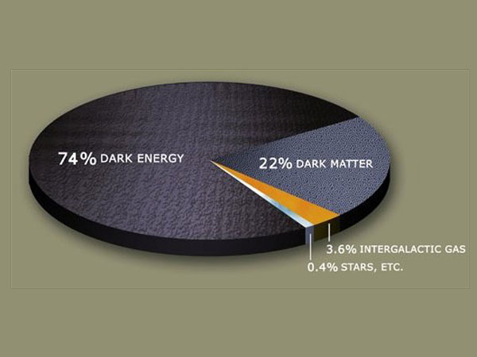

(Image credit: NASA)  

(图片来源: NASA)

No matter how astrophysicists crunch the numbers, the universe simply doesn't add up.  

无论天体物理学家们如何计算数字，宇宙根本不可能加起来。  

Even though gravity is pulling inward on space-time — the "fabric" of the cosmos — it keeps expanding outward faster and faster.  

即使引力向内拉动时空--宇宙的 "结构"--它仍不断向外扩张，速度越来越快。  

To account for this, astrophysicists have proposed an invisible agent that counteracts gravity by pushing space-time apart. They call it [dark energy](https://www.space.com/20929-dark-energy.html). In the most widely accepted model of dark energy, it is a "cosmological constant": an inherent property of space itself, which has "negative pressure" driving space apart.  

为了说明这一点，天体物理学家们提出了一种无形的制剂，通过将时空推开来抵消引力。他们称其为暗能量。在最广泛接受的暗能量模型中，它是一个 "宇宙学常数"：空间本身的一个固有属性，它有 "负压 "将空间分开。  

As space expands, more space is created, and with it, more dark energy.  

随着空间的扩张，更多的空间被创造出来，随之而来的是更多的暗能量。  

Based on the observed rate of expansion, scientists know that the sum of all the dark energy must make up more than 70 percent of the total contents of the universe.  

根据观察到的膨胀速度，科学家们知道，所有暗能量的总和必须占到宇宙总内容的70%以上。  

But no one knows how to look for it. The best researchers have been able to do in recent years is narrow in a bit on where dark energy might be hiding, which was the [topic of a study](http://www.space.com/30321-dark-matter-dark-energy-particles-experiments.html) released in August 2015.  

但是没有人知道如何去寻找它。近年来，研究人员能够做的最好的事情是缩小一点暗能量可能隐藏的地方，这是2015年8月发布的一项研究的主题。

RECOMMENDED VIDEOS FOR YOU...  

为您推荐的视频...

0 seconds of 1 minute, 53 secondsVolume 0%

This video file cannot be played.(Error Code: 232011)

**Next Up: Dark matter** (scroll up to see the "Next" button)  

下一步了：暗物质（向上滚动以查看 "下一步 "按钮）

## What is dark matter?  

什么是暗物质？

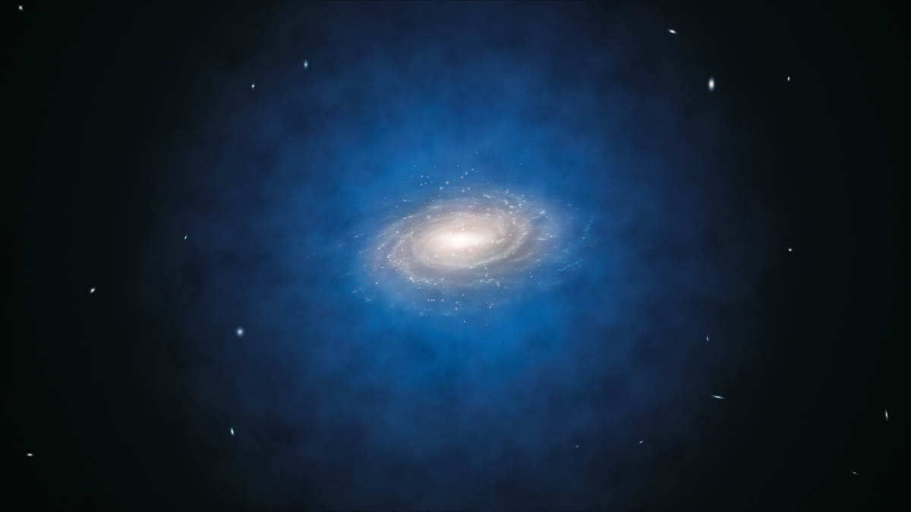

(Image credit: ESO/L. Calçada )  

(图片来源：ESO/L. Calçada )

Evidently, about 84 percent of the matter in the universe does not absorb or emit light.  

显而易见，宇宙中约有84%的物质不吸收或发射光。  

"Dark matter," as it is called, cannot be seen directly, and it hasn't yet been detected by indirect means, either.  

所谓的 "暗物质"，不能直接看到，而且也还没有通过间接手段探测到。  

Instead, dark matter's existence and properties are inferred from its gravitational effects on visible matter, radiation and the structure of the universe.  

相反，暗物质的存在和属性是通过其对可见物质、辐射和宇宙结构的引力作用推断出来的。  

This shadowy substance is thought to pervade the outskirts of galaxies, and may be composed of "weakly interacting massive particles," or WIMPs.  

这种阴暗的物质被认为充斥在星系的外围，并可能由 "弱相互作用的大质量粒子 "或WIMPs组成。  

Worldwide, there are several detectors on the lookout for WIMPs, but so far, not one has been found.  

在世界范围内，有几个探测器在寻找WIMPs，但到目前为止，还没有发现一个。  

One recent study suggests dark mater might form long, fine-grained streams throughout the universe, and that such streams might [radiate out from Earth](http://www.space.com/31200-dark-matter-hairs-earth.html) like hairs. \[Related: [If Not Dark Matter, then What?](https://www.livescience.com/19796-dark-matter-alternatives.html)\]  

最近的一项研究表明，暗物质可能在整个宇宙中形成长而细的流，而且这种流可能像头发一样从地球辐射出去。\[相关链接：如果不是暗物质，那是什么？］

**Next Up: Time's arrow  

下一步了：时间之箭**

## Why is there an arrow of time?  

为什么会有时间之箭？

(Image credit: [Image](https://shutterstock.7eer.net/c/221109/42119/1305?subId1=livescience-bg-1322068084966913300&sharedId=livescience-bg&u=http%3A%2F%2Fimage.shutterstock.com%2Fdisplay_pic_with_logo%2F583555%2F98911175%2Fstock-photo-broken-egg-98911175.jpg) via Shutterstock)  

(图片来源：图片来自Shutterstock)

Time moves forward because a property of the universe called "entropy," roughly defined as the level of disorder, only increases, and so there is no way to reverse a rise in entropy after it has occurred.  

时间向前推移，因为宇宙的一个属性被称为 "熵"，大致定义为无序程度，只会增加，因此在熵的上升发生后，没有办法逆转。  

The fact that entropy increases is a matter of logic: There are more disordered arrangements of particles than there are ordered arrangements, and so as things change, they tend to fall into disarray.  

熵增加这一事实是一个逻辑问题：粒子的无序排列比有序排列多，因此随着事物的变化，它们往往会陷入混乱。  

But the underlying question here is, why was entropy so low in the past?  

但这里的基本问题是，为什么过去的熵会如此之低？  

Put differently, why was the universe so ordered at its beginning, when a huge amount of energy was crammed together in a small amount of space? \[[What's the Total Energy in the Universe?](https://www.livescience.com/33129-total-energy-universe-zero.html)\]  

换句话说，当大量的能量挤在很小的空间里时，为什么宇宙在一开始会如此有序？\[宇宙中的总能量是多少？］

**Next Up: Parallel universes  

下一步：平行宇宙**

## Are there parallel universes?  

是否存在平行宇宙？

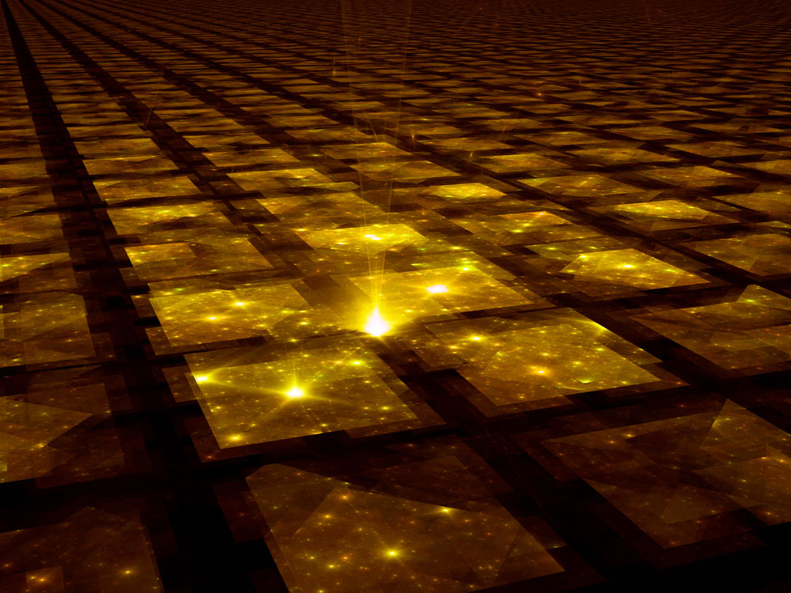

(Image credit: [Image](https://shutterstock.7eer.net/c/221109/42119/1305?subId1=livescience-bg-8980573589743224000&sharedId=livescience-bg&u=http%3A%2F%2Fimage.shutterstock.com%2Fdisplay_pic_with_logo%2F177520%2F177520%2C1218594644%2C2%2Fstock-photo-golden-grid-hub-fractal-illustration-16130800.jpg) via Shutterstock)  

(图片来源：图片来自Shutterstock)

Astrophysical data suggests space-time might be "flat," rather than curved, and thus that it goes on forever.  

天体物理学数据表明，时空可能是 "平的"，而不是弯曲的，因此它将永远持续下去。  

If so, then the region we can see (which we think of as "the universe") is just one patch in an infinitely large "quilted multiverse." At the same time, the laws of quantum mechanics dictate that there are only a finite number of possible particle configurations within each cosmic patch (10^10^122 distinct possibilities). So, with an [infinite number](https://www.livescience.com/18272-infinity-room-ways-imagine-infinity.html) of cosmic patches, the particle arrangements within them are forced to repeat — infinitely many times over.  

如果是这样，那么我们能看到的区域（我们认为是 "宇宙"）只是无限大的 "被子多元宇宙 "中的一个补丁。同时，量子力学定律规定，在每个宇宙补丁中只有有限的可能粒子配置（10^10^122种不同的可能性）。因此，有了无限多的宇宙补丁，其中的粒子排列就被迫重复--无限多次的重复。  

 This means there are infinitely many parallel universes: cosmic patches exactly the same as ours (containing someone exactly like you), as well as patches that differ by just one particle's position, patches that differ by two particles' positions, and so on down to patches that are totally different from ours.  

这意味着存在无限多的平行宇宙：与我们完全相同的宇宙斑块（包含与你一模一样的人），以及只差一个粒子位置的斑块，差两个粒子位置的斑块，等等，直至与我们完全不同的斑块。

Is there something wrong with that logic, or is its bizarre outcome true? And if it is true, how might we ever detect the presence of parallel universes? Check out this excellent [perspective from 2015](http://www.space.com/31465-is-our-universe-just-one-of-many-in-a-multiverse.html) that looks into what "infinite universes" would mean.  

这种逻辑是否有问题，或者其怪异的结果是否真实？如果它是真的，我们怎么可能检测到平行宇宙的存在？请看这个来自2015年的优秀观点，它探讨了 "无限宇宙 "意味着什么。

**Next Up: Matter vs. Antimatter  

下一步：物质与反物质**

## Why is there more matter than antimatter?  

为什么物质比反物质多？

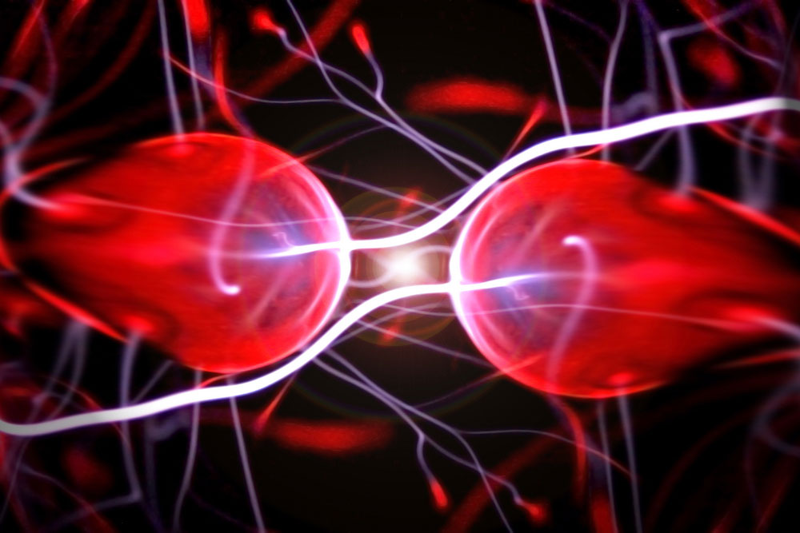

(Image credit: [Image](https://shutterstock.7eer.net/c/221109/42119/1305?subId1=livescience-bg-1373625828341714400&sharedId=livescience-bg&u=http%3A%2F%2Fimage.shutterstock.com%2Fdisplay_pic_with_logo%2F177808%2F177808%2C1223143740%2C1%2Fstock-photo-two-particles-ready-to-collide-to-one-another-artistic-image-18376765.jpg) via Shutterstock)  

(图片来源：图片来自Shutterstock)

The question of why there is so much more matter than its oppositely-charged and oppositely-spinning twin, antimatter, is actually a question of why anything exists at all.  

为什么物质比其带对立电荷和对立旋转的双胞胎--反物质多得多的问题，实际上是一个关于为什么任何东西都存在的问题。  

One assumes the universe would treat matter and antimatter symmetrically, and thus that, at the moment of the Big Bang, equal amounts of matter and antimatter should have been produced.  

人们假设宇宙会对称地对待物质和反物质，因此，在大爆炸的那一刻，应该产生了等量的物质和反物质。  

But if that had happened, there would have been a total annihilation of both: Protons would have canceled with antiprotons, electrons with anti-electrons (positrons), neutrons with antineutrons, and so on, leaving behind a dull sea of photons in a matterless expanse.  

但是，如果发生了这种情况，就会出现两者的完全湮灭：质子会与反质子相抵消，电子会与反电子（正电子）相抵消，中子会与反中子相抵消，等等，在一个无物质的广阔空间里留下一片沉闷的光子海洋。  

For some reason, there was excess matter that didn't get annihilated, and here we are. For this, there is no accepted explanation. The [most detailed test](https://www.livescience.com/51833-matter-and-antimatter-are-mirror-images.html) to date of the differences between matter and antimatter, announced in August 2015, confirm they are mirror images of each other, providing exactly zero new paths toward understanding the mystery of why matter is far more common.  

由于某些原因，有多余的物质没有被湮灭，而我们就在这里。对于这一点，没有公认的解释。2015年8月宣布的迄今为止对物质和反物质之间差异的最详细测试，证实它们是彼此的镜像，为理解为什么物质远为普遍的奥秘提供了恰好零的新路径。

**Next Up: Fate of the universe  

下一步了：宇宙的命运**

## What is the fate of the universe?  

宇宙的命运是什么？

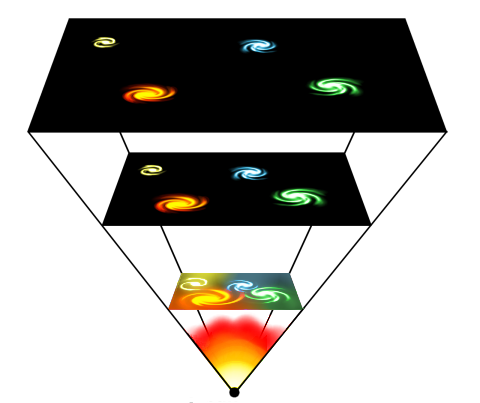

(Image credit: Creative Commons Attribution-Share Alike 3.0 Unported | Bjarmason)  

(图片来源：知识共享 署名-相同方式共享 3.0 未报告 | Bjarmason)

The fate of the universe strongly depends on a factor of unknown value: Ω, a measure of the density of matter and energy throughout the cosmos.  

宇宙的命运在很大程度上取决于一个未知值的因素：Ω，是衡量整个宇宙中物质和能量密度的标准。  

If Ω is greater than 1, then space-time would be "closed" like the surface of an enormous sphere.  

如果Ω大于1，那么时空将像一个巨大球体的表面一样 "封闭"。  

If there is no dark energy, such a universe would eventually stop expanding and would instead start contracting, eventually collapsing in on itself in an event dubbed the "Big Crunch." If the universe is closed but there _is_ dark energy, the spherical universe would expand forever.  

如果没有暗能量，这样的宇宙最终会停止膨胀，而是开始收缩，最终在一个被称为 "大挤压 "的事件中自我坍塌。如果宇宙是封闭的，但存在暗能量，那么这个球形的宇宙将永远膨胀。

Alternatively, if Ω is less than 1, then the geometry of space would be "open" like the surface of a saddle.  

另外，如果Ω小于1，那么空间的几何形状就会像马鞍的表面一样 "开放"。  

In this case, its ultimate fate is the "Big Freeze" followed by the "Big Rip": first, the universe's outward acceleration would tear galaxies and stars apart, leaving all matter frigid and alone.  

在这种情况下，它的最终命运是 "大冻结"，然后是 "大裂变"：首先，宇宙的外向加速度将撕裂星系和恒星，使所有物质变得寒冷和孤独。  

Next, the acceleration would grow so strong that it would overwhelm the effects of the forces that hold atoms together, and everything would be wrenched apart.  

接下来，加速度将变得如此强大，以至于它将压倒将原子固定在一起的力量的影响，而一切都将被撕裂。

If Ω = 1, the universe would be flat, extending like an infinite plane in all directions.  

如果Ω=1，宇宙将是平的，像一个无限的平面一样向各个方向延伸。  

If there is no dark energy, such a planar universe would expand forever but at a continually decelerating rate, approaching a standstill.  

如果没有暗能量，这样的平面宇宙将永远膨胀，但速度持续下降，接近于停滞不前。  

If there is dark energy, the flat universe ultimately would experience runaway expansion leading to the Big Rip. Regardless how it plays out, the universe is dying, a fact [discussed in detail](http://www.space.com/31282-the-universe-is-dying.html) by astrophysicist Paul Sutter in the essay from December, 2015.  

如果存在暗能量，平坦的宇宙最终会经历失控的膨胀，导致大裂变。不管它如何发展，宇宙正在死亡，天体物理学家保罗-萨特在2015年12月的文章中详细讨论了这一事实。

Que sera, sera.  

是啊，是啊。

**Next Up: An even stranger concept  

下一步：一个更奇怪的概念**

## How do measurements collapse quantum wavefunctions?  

测量是如何坍缩量子波函数的？

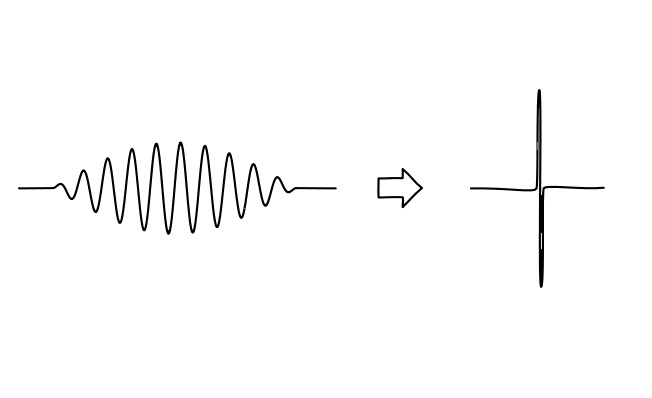

(Image credit: John D. Norton)  

(图片来源: John D. Norton)

In the strange realm of electrons, photons and the other fundamental particles, quantum mechanics is law.  

在电子、光子和其他基本粒子的奇怪领域，量子力学就是法律。  

Particles don't behave like tiny balls, but rather like waves that are spread over a large area.  

粒子的行为并不像小球，而是像传播在大面积上的波。  

Each particle is described by a "wavefunction," or probability distribution, which tells what its location, velocity, and other properties are more likely to be, but not what those properties are.  

每个粒子都由一个 "波函数 "或概率分布来描述，它告诉人们它的位置、速度和其他属性更有可能是什么，但不是这些属性是什么。  

The particle actually has a range of values for all the properties, until you experimentally measure one of them — its location, for example — at which point the particle's wavefunction "collapses" and it adopts just one location. \[[Newborn Babies Understand Quantum Mechanics](https://www.livescience.com/33973-newborn-babies-quantum-mechanics.html)\]  

粒子实际上具有所有属性的数值范围，直到你通过实验测量其中一个属性--例如它的位置--在这一点上，粒子的波函数 "崩溃 "了，它只采用一个位置。\[新生婴儿了解量子力学\] 。

But how and why does measuring a particle make its wavefunction collapse, producing the concrete reality that we perceive to exist?  

但是，测量一个粒子如何以及为什么会使其波函数崩溃，产生我们所感知到的具体现实存在？  

The issue, known as the measurement problem, may seem esoteric, but our understanding of what reality is, or if it exists at all, hinges upon the answer.   

这个问题被称为测量问题，可能看起来很深奥，但我们对现实是什么的理解，或者它是否存在，都取决于答案。

**Next Up: String theory  

下一步：弦理论**

## Is string theory correct?  

弦理论是否正确？

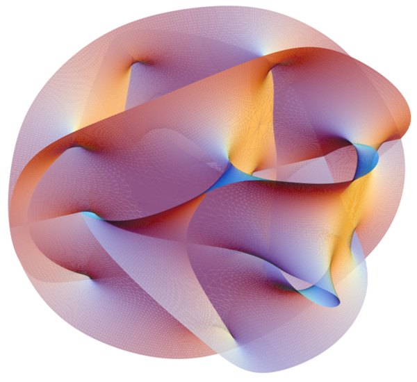

(Image credit: Creative Commons | Lunch)  

(图片来源：创作共用协议 | 午餐)

When physicists assume all the elementary particles are actually one-dimensional loops, or "strings," each of which vibrates at a different frequency, physics gets much easier. [String theory](http://www.space.com/17594-string-theory.html) allows physicists to reconcile the laws governing particles, called quantum mechanics, with the laws governing space-time, called general relativity, and to unify the four [fundamental forces of nature](https://www.livescience.com/the-fundamental-forces-of-nature.html) into a single framework. But the problem is, string theory can only work in a universe with 10 or 11 dimensions: three large spatial ones, six or seven compacted spatial ones, and a time dimension.  

当物理学家假设所有的基本粒子实际上都是一维环状物，或称 "弦"，每一个都以不同的频率振动，物理学就变得容易多了。 弦理论使物理学家能够调和管理粒子的定律（称为量子力学）和管理时空的定律（称为广义相对论），并将自然界的四种基本力量统一到一个框架中。但问题是，弦理论只能在具有10或11个维度的宇宙中发挥作用：三个大空间维度，六个或七个压缩空间维度，以及一个时间维度。  

The compacted spatial dimensions — as well as the vibrating strings themselves — are about a billionth of a trillionth of the size of an atomic nucleus.  

压缩的空间尺寸--以及振动的弦本身--大约是原子核大小的十亿分之一。  

There's no conceivable way to detect anything that small, and so there's no known way to experimentally validate or invalidate string theory.  

没有任何可以想象的方法可以检测到那么小的东西，因此没有任何已知的方法可以从实验上验证或宣告弦理论无效。

**Finally: We end with chaos . . .  

最后：我们以混乱结束......。**

## Is there order in chaos?  

混乱中是否有秩序？

(Image credit: [Image](https://shutterstock.7eer.net/c/221109/42119/1305?subId1=livescience-bg-1253238008836046300&sharedId=livescience-bg&u=http%3A%2F%2Fimage.shutterstock.com%2Fdisplay_pic_with_logo%2F711892%2F711892%2C1309434952%2C1%2Fstock-photo-storm-80185066.jpg) via Shutterstock)  

(图片来源：图片来自Shutterstock)

Physicists can't exactly solve the set of equations that describes the behavior of fluids, from water to air to all other liquids and gases.  

物理学家无法完全解决描述流体行为的一组方程，从水到空气到所有其他液体和气体。  

In fact, it isn't known whether a general solution of the so-called Navier-Stokes equations even exists, or, if there is a solution, whether it describes fluids everywhere, or contains inherently unknowable points called singularities.  

事实上，所谓的纳维-斯托克斯方程的一般解决方案是否存在还不得而知，或者说，如果有一个解决方案，它是否描述了各地的流体，或包含固有的不可知的点，称为奇点。  

As a consequence, the nature of chaos is not well understood. Physicists and mathematicians wonder, is the weather merely difficult to predict, or inherently unpredictable?  

因此，人们对混沌的本质并不十分了解。物理学家和数学家们想知道，天气仅仅是难以预测，还是本质上不可预测的？  

Does turbulence transcend mathematical description, or does it all make sense when you tackle it with [the right math](https://www.livescience.com/26584-5-mind-boggling-math-facts.html)?  

湍流是否超越了数学描述，或者当你用正确的数学方法来处理它时，它是否都是有意义的？

Congratulations on making it through this list of heavy topics. How about something lighter now? **[25 Fun Facts in Science & History](https://www.livescience.com/28170-25-fun-facts.html)**  

祝贺你通过这个沉重的话题清单。现在来点轻松的吧？25个科学和历史方面的有趣事实

## Do the universe's forces merge into one?  

宇宙的力量会不会合二为一？

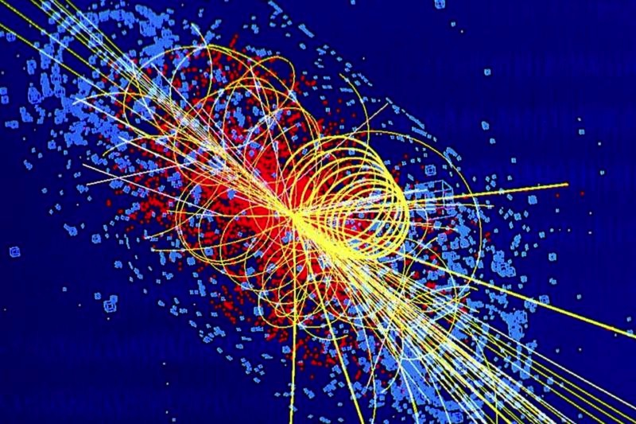

(Image credit: Lucas Taylor/CMS)  

(图片来源：Lucas Taylor/CMS)

The universe experiences four fundamental forces: electromagnetism, [the strong nuclear force](https://www.livescience.com/48575-strong-force.html), the weak interaction (also known as [the weak nuclear force](https://www.livescience.com/49254-weak-force.html)) and [gravity](https://www.livescience.com/37115-what-is-gravity.html). To date, physicists know that if you turn up the energy enough — for example, inside a particle accelerator — three of those forces "unify" and become a single force.  

宇宙有四种基本力：电磁力、强核力、弱相互作用（也被称为弱核力）和引力。迄今为止，物理学家知道，如果你把能量调得足够高--例如，在粒子加速器内--其中三种力就会 "统一"，成为一种单一的力量。  

Physicists have run particle accelerators and unified the electromagnetic force and weak interactions, and at higher energies, the same thing should happen with the strong nuclear force and, eventually, gravity.  

物理学家已经运行粒子加速器并统一了电磁力和弱相互作用，而在更高的能量下，强核力以及最终的引力也应该发生同样的事情。

But even though theories say that _should_ happen, nature doesn't always oblige. So far, no particle accelerator has reached energies high enough to unify the strong force with [electromagnetism](https://www.livescience.com/38169-electromagnetism.html) and the weak interaction. Including gravity would mean yet more energy.  

但是，即使理论上说这应该发生，自然界并不总是顺应。到目前为止，还没有粒子加速器达到足够高的能量来统一强力与电磁力和弱相互作用。包括引力将意味着更多的能量。  

It isn't clear whether scientists could even build one that powerful; the Large Hadron Collider (LHC), near Geneva, can send particles crashing into each other with energies in the trillions of electron volts (about 14 tera-electron volts, or TeV).  

目前还不清楚科学家是否能够建造一个如此强大的对撞机；日内瓦附近的大型强子对撞机（LHC）能够以数万亿电子伏特的能量（约14太电子伏特，或TeV）将粒子相互撞击。  

To reach grand unification energies, particles would need at least a trillion times as much, so physicists are left to hunt for indirect evidence of such theories.   

要达到大统一的能量，粒子至少需要一万亿倍的能量，所以物理学家们只能去寻找这种理论的间接证据。

Besides the issue of energies, Grand Unified Theories (GUTs) still have some problems because they predict other observations that so far haven't panned out.  

除了能量问题，大统一理论（GUTs）仍然有一些问题，因为它们预测的其他观察结果到目前为止还没有得到证实。  

There are several GUTs that say protons, over immense spans of time (on the order of 10^36 years), should turn into other particles.  

有几个GUT说，质子在巨大的时间跨度上（10^36年的数量级），应该变成其他粒子。  

This has never been observed, so either protons last much longer than anyone thought or they really are stable forever.  

这一点从未被观察到，所以要么质子的持续时间比人们想象的要长得多，要么它们真的永远稳定。  

Another prediction of some types of GUT is the existence of magnetic monopoles — isolated "north" and "south" poles of a magnet — and nobody has seen one of those, either.  

某些类型的GUT的另一个预测是磁单极的存在--磁体的孤立的 "北 "和 "南 "两极--也没有人看到其中的一个。  

It's possible we just don't have a powerful enough particle accelerator. Or, physicists could be wrong about how the universe works.   

有可能我们只是没有一个足够强大的粒子加速器。或者，物理学家可能对宇宙的运作方式有误。

## What happens inside a black hole?  

黑洞内会发生什么？

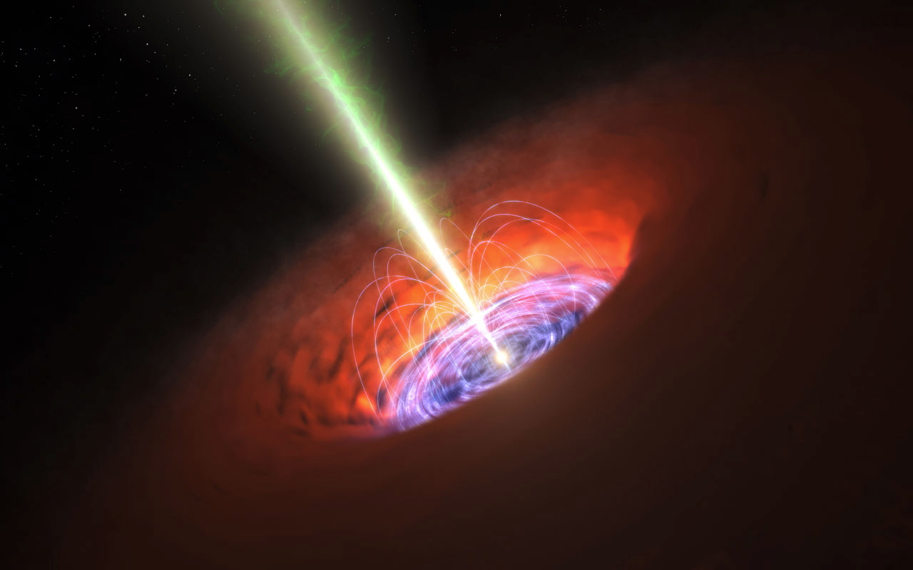

(Image credit: ESO/L. Calçada)  

(图片来源：ESO/L. Calçada)

What happens to an object's information [if it gets sucked into a black hole](https://www.livescience.com/33602-particles-escape-black-holes.html)? According to the current theories, if you were to drop a cube of iron into a black hole, there would be no way to retrieve any of that information.  

如果一个物体被吸进黑洞，它的信息会发生什么？根据目前的理论，如果你把一个铁的立方体扔进黑洞，就没有办法找回任何信息了。  

That's because a black hole's gravity is so strong that its escape velocity is faster than light — and [light is the fastest thing there is](https://www.livescience.com/16211-travel-faster-speed-light.html). However, a branch of science called quantum mechanics says that [quantum information](https://www.livescience.com/49028-farthest-quantum-teleportation.html) can't be destroyed. "If you annihilate this information somehow, something goes haywire," said Robert McNees, an associate professor of physics at Loyola University Chicago. \[[How to Teleoport Info Out of a Black Hole](https://www.livescience.com/53274-quantum-information-retrieval-black-hole.html)\]  

这是因为黑洞的引力非常强大，它的逃逸速度比光还快--而光是最快的东西。 然而，科学的一个分支，即量子力学说，量子信息不能被破坏。"芝加哥洛约拉大学物理学副教授罗伯特-麦克尼斯说："如果你以某种方式湮灭这些信息，就会出现混乱的情况。\[如何将信息从黑洞中远程传输出去\] 。

Quantum information is a bit different from the information we store as 1s and 0s on a computer, or the stuff in our brains.  

量子信息与我们在计算机上以1和0的形式存储的信息，或我们大脑中的东西有点不同。  

That's because quantum theories don't provide exact information about, for instance, where an object will be, like calculating the trajectory of a baseball in mechanics.  

这是因为量子理论不提供确切的信息，例如，一个物体将在哪里，就像在力学中计算一个棒球的轨迹。  

Instead, such theories reveal the most likely location or the most likely result of some action. As a consequence, all of the probabilities of various events should add up to 1, or 100 percent.  

相反，这种理论揭示了最有可能的地点或某些行动最可能的结果。因此，各种事件的所有概率加起来应该是1，或100%。  

(For instance, when you roll a six-sided die, the chances of a given face coming up is one-sixth, so the probabilities of all the faces add up to 1, and you can't be more than 100 percent certain something will happen.) Quantum theory is, therefore, called unitary.  

(例如，当你掷出一个六面骰子时，某个面出现的概率是六分之一，所以所有面的概率加起来是1，你不可能100%确定某事会发生）。因此，量子理论被称为单元论。  

If you know how a system ends, you can calculate how it began.  

如果你知道一个系统如何结束，你就可以计算出它是如何开始的。

To describe a black hole, all you need is mass, angular momentum (if it's spinning) and charge. Nothing comes out of a black hole except a slow trickle of thermal radiation called Hawking radiation.  

要描述一个黑洞，你只需要质量、角动量（如果它在旋转）和电荷。除了被称为霍金辐射的热辐射的缓慢涓流之外，没有任何东西会从黑洞中出来。  

As far as anyone knows, there's no way to do that reverse calculation to figure out what the black hole actually gobbled up. The information is destroyed.  

据任何人所知，没有办法进行反向计算以弄清黑洞实际上吞噬了什么。这些信息被销毁了。  

However, quantum theory says that information can't be completely out of reach. Therein lies the "[information paradox](https://www.livescience.com/53363-stephen-hawking-black-holes-have-hair.html)."  

然而，量子理论说，信息不可能完全遥不可及。这就是 "信息悖论"。

McNees said there has been a lot of work on the subject, notably by Stephen Hawking and Stephen Perry, who suggested in 2015 that, rather than being stored within the deep clutches of a black hole, [the information remains on its boundary](https://www.livescience.com/51980-stephen-hawking-black-hole-mystery.html), called the event horizon. Many others have attempted to solve the paradox. Thus far, physicists can't agree on the explanation, and they're likely to disagree for some time.   

麦克尼斯说，在这个问题上已经有很多工作，特别是斯蒂芬-霍金和斯蒂芬-佩里，他们在2015年提出，信息不是被储存在黑洞的深处，而是留在其边界上，称为事件视界。其他许多人都试图解决这个悖论。到目前为止，物理学家们无法就解释达成一致，而且他们可能会在一段时间内产生分歧。

## Do naked singularities exist?  

裸露的奇点存在吗？

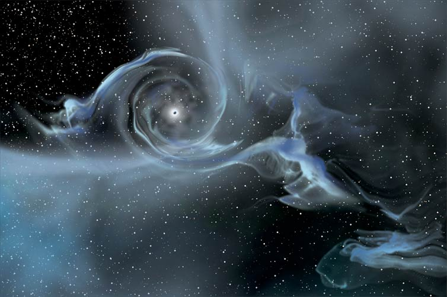

(Image credit: NASA E/PO, Sonoma State University, Aurore Simonnet)  

(图片来源：NASA E/PO, Sonoma State University, Aurore Simonnet)

A [singularity](https://www.livescience.com/23232-smallest-ingredients-universe-physics.html) occurs when some property of a "thing" is infinite, and so the laws of physics as we know them break down. [At the center of black holes](https://www.livescience.com/32662-whats-at-the-center-of-black-holes-.html) lies a point that is infinitely teensy and dense (packed with a finite amount of matter) — a point called a singularity. In [mathematics](https://www.livescience.com/38936-mathematics.html), singularities come up all the time — dividing by [zero](https://www.livescience.com/27853-who-invented-zero.html) is one instance, and a vertical line on a coordinate plane has an "infinite" slope. In fact, the slope of a vertical line is just undefined. But what would a singularity look like?  

当一个 "东西 "的某些属性是无限的时候，奇点就会发生，因此我们所知道的物理学定律就会崩溃。 在黑洞的中心有一个无限密集的点（挤满了有限的物质）--这个点叫做奇点。在数学中，奇点经常出现--除以0就是一个例子，坐标平面上的一条垂直线有一个 "无限 "的斜率。事实上，一条垂直线的斜率是未定义的。但奇点会是什么样子呢？  

And how would it interact with the rest of the universe? What does it mean to say that something has no real surface and is infinitely small?  

它又将如何与宇宙的其他部分互动？说一个东西没有真正的表面，而且是无限小的，这意味着什么？

A ["naked" singularity](https://www.livescience.com/53857-5d-black-holes-break-general-relativity.html) is one that can interact with the rest of the universe. Black holes have event horizons — spherical regions from which nothing, not even light, can escape.  

一个 "赤裸裸的 "奇点是一个可以与宇宙的其他部分相互作用的奇点。黑洞有事件视界--球状区域，没有任何东西，甚至是光，可以从中逃脱。  

At first glance, you might think the problem of naked singularities is partly solved for black holes at least, since nothing can get out of the event horizon and the singularity can't affect the rest of the universe.  

乍一看，你可能会认为裸露的奇点问题至少对于黑洞来说已经部分解决了，因为没有任何东西可以走出事件视界，奇点也不能影响宇宙的其他部分。  

(It is "clothed," so to speak, while a naked singularity is a black hole without an event horizon.)  

(可以这么说，它是有 "衣服 "的，而裸露的奇点是一个没有事件穹界的黑洞）。

But whether singularities can form without an event horizon is still an open question. And if they can exist, then [Albert Einstein's theory of general relativity](http://www.space.com/17661-theory-general-relativity.html) will need a revision, because it breaks down when systems are too close to a singularity. Naked singularities might also function as [wormholes](https://www.livescience.com/51925-magnetic-wormhole-created.html), which would also be time machines — though there's no evidence for this in nature.  

但是，在没有事件视界的情况下，奇点是否能够形成仍然是一个开放的问题。如果它们能够存在，那么阿尔伯特-爱因斯坦的广义相对论将需要修改，因为当系统过于接近奇点时，它就会崩溃。裸露的奇点也可能作为虫洞发挥作用，这也将是时间机器--尽管在自然界中没有这方面的证据。

## Violating charge-parity symmetry  

违反电荷-奇偶对称性

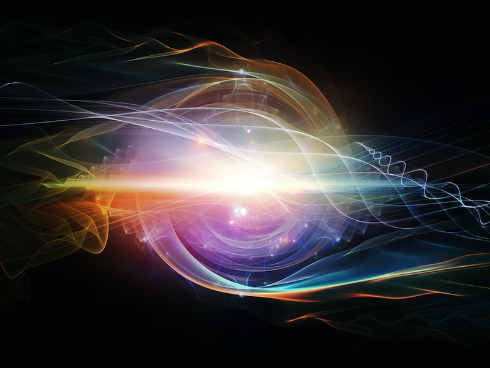

(Image credit: agsandrew | Shutterstock.com)  

(图片来源: agsandrew | Shutterstock.com)

If you swap a particle with its antimatter sibling, the laws of physics should remain the same. So, for example, the positively charged proton should look the same as a negatively charged antiproton.  

如果你把一个粒子与它的反物质兄弟姐妹交换，物理学定律应该保持不变。因此，例如，带正电的质子应该与带负电的反质子看起来一样。  

That's the principle of charge symmetry. If you swap left and right, again, the laws of physics should look the same. That's parity symmetry. Together, the two are called CP symmetry.  

这就是电荷对称的原理。如果你左右互换，同样，物理定律看起来应该是一样的。这就是奇偶性对称。两者合在一起，被称为CP对称性。  

Most of the time, this physics rule is not violated. However, certain exotic particles violate this symmetry. McNees said that's why it's strange.  

大多数情况下，这一物理学规则没有被违反。然而，某些外来的粒子违反了这种对称性。麦克尼斯说，这就是为什么它很奇怪。  

"There shouldn't be any violations of CP in quantum mechanics," he said. "We don't know why that is."  

"在量子力学中不应该有任何违反CP的行为，"他说。"我们不知道为什么会这样。"

## When sound waves make light  

当声波产生光时

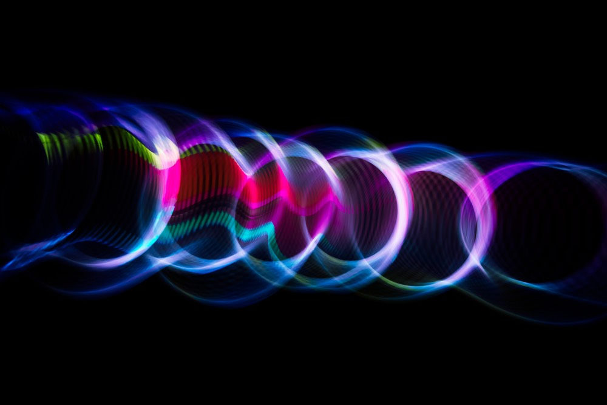

(Image credit: DmitrySteshenko/Shutterstock)  

(图片来源：DmitrySteshenko/Shutterstock)

Though particle-physics questions account for many unsolved problems, some mysteries can be observed on a bench-top lab setup. Sonoluminescence is one of those.  

尽管粒子物理学问题占了许多未解决的问题，但有些谜团可以在一个台式实验室装置上观察到。声发光就是其中之一。  

If you take some water and hit it with sound waves, bubbles will form.  

如果你拿一些水，用声波打它，就会形成气泡。  

Those bubbles are low-pressure regions surrounded by high pressure; the outer pressure pushes in on the lower-pressure air, and the bubbles quickly collapse.  

这些气泡是被高压包围的低压区域；外部压力向低压空气推挤，气泡迅速崩溃。  

When those bubbles collapse, they emit light, in flashes that last trillionths of a second.  

当这些气泡崩溃时，它们会发光，闪烁的时间是万亿分之一秒。

The problem is, it's far from clear what the source of the light is.  

问题是，远远不清楚光的来源是什么。  

Theories range from tiny nuclear fusion reactions to some type of electrical discharge, or even compression heating of the gases inside the bubbles.  

理论范围包括从微小的核聚变反应到某种类型的放电，甚至是气泡内气体的压缩加热。  

Physicists have measured high temperatures inside these bubbles, on the order of tens of thousands of degrees Fahrenheit, and taken numerous pictures of the light they produce.  

物理学家已经测量了这些气泡内部的高温，大约为数万华氏度，并拍摄了许多它们产生的光的照片。  

But there's no good explanation of how sound waves create these lights in a bubble.  

但对于声波如何在气泡中产生这些光，并没有很好的解释。

## What lies beyond the Standard Model?  

标准模型之外还有什么？

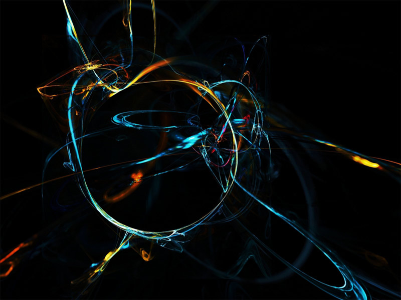

(Image credit: [Robert Spriggs](https://shutterstock.7eer.net/c/221109/42119/1305?subId1=livescience-bg-2410978199813266000&sharedId=livescience-bg&u=http%3A%2F%2Fwww.shutterstock.com%2Fgallery-101458p1.html) | [Shutterstock](https://shutterstock.7eer.net/c/221109/42119/1305?subId1=livescience-bg-2770518570067215400&sharedId=livescience-bg&u=http%3A%2F%2Fwww.shutterstock.com))  

(图片来源: Robert Spriggs | Shutterstock)

The Standard Model is one of the most successful physical theories ever devised. It's been standing up to experiments to test it for four decades, and new experiments keep showing that it is correct.  

标准模型是有史以来最成功的物理理论之一。四十年来，它一直经得起实验的检验，而且新的实验不断表明它是正确的。  

The Standard Model describes the behavior of the particles that make up everything around us, as well as explaining why, for example, particles have mass. In fact, [the discovery of the Higgs boson](https://www.livescience.com/27888-newfound-particle-is-higgs.html) — a particle that gives matter its mass — in 2012 was a historic milestone because it confirmed the long-standing prediction of its existence.   

标准模型描述了构成我们周围一切事物的粒子的行为，同时也解释了为什么，例如，粒子有质量。事实上，2012年希格斯玻色子--一种赋予物质质量的粒子--的发现是一个历史性的里程碑，因为它证实了长期以来对其存在的预测。

But the Standard Model doesn't explain everything.  

但标准模型并不能解释一切。  

The Standard Model has made many successful predictions — for example, the Higgs boson, the W and Z boson (which mediate the weak interactions that govern radioactivity), and quarks among them — so it is difficult to see where physics might go beyond it.  

标准模型已经做出了许多成功的预测--例如希格斯玻色子、W和Z玻色子（调解支配放射性的弱相互作用），以及其中的夸克--因此很难看到物理学可能超越它的地方。  

That said, most physicists agree that the Standard Model is not complete.  

也就是说，大多数物理学家都同意，标准模型并不完整。  

There are several contenders for new, more complete models — string theory is one such model — but so far, none of these have been conclusively verified by experiments.   

有几个新的、更完整的模型的竞争者--弦理论就是这样一个模型--但到目前为止，这些模型都没有得到实验的确证。

## Fundamental constants  

基本常数

(Image credit: [Andreas Guskos](https://shutterstock.7eer.net/c/221109/42119/1305?subId1=livescience-bg-1046642185445476100&sharedId=livescience-bg&u=http%3A%2F%2Fwww.shutterstock.com%2Fgallery-57696p1.html) | [Shutterstock.com](https://shutterstock.7eer.net/c/221109/42119/1305?subId1=livescience-bg-3332528419648915500&sharedId=livescience-bg&u=http%3A%2F%2Fwww.shutterstock.com))  

(图片来源: Andreas Guskos | Shutterstock.com)

Dimensionless constants are numbers that don't have units attached to them. The speed of light, for example, is a [fundamental constant](https://www.livescience.com/43052-fundamental-constants-predict-astronomical-sizes.html) measured in units of meters per second (or 186,282 miles per second).  

无尺寸常数是指没有附加单位的数字。例如，光速是一个以米/秒（或186,282英里/秒）为单位的基本常数。  

Unlike the speed of light, dimensionless constants have no units and they can be measured, but they can't be derived from theories, whereas constants like the speed of light can be.  

与光速不同，无维常数没有单位，它们可以被测量，但它们不能从理论中推导出来，而像光速这样的常数则可以。

In his book "Just Six Numbers: The Deep Forces That Shape the Universe" (Basic Books, 2001), astronomer Martin Rees focuses on certain "dimensionless constants" he considers fundamental to physics.  

在他的书《只有六个数字：塑造宇宙的深层力量"（Basic Books，2001年），天文学家马丁-里斯专注于某些他认为是物理学基础的 "无维常数"。  

In fact, there are many more than six; about 25 exist in the Standard Model. \[[The 9 Most Massive Numbers in Existence](https://www.livescience.com/26869-biggest-numbers-in-universe.html)\]  

事实上，不止六个；标准模型中存在大约25个。\[存在的9个最有质量的数字\]

For example, the fine structure constant, usually written as alpha, governs the strength of magnetic interactions. It is about 0.007297. What makes this number odd is that if it were any different, stable matter wouldn't exist.  

例如，精细结构常数，通常写成α，制约着磁相互作用的强度。它大约是0.007297。使这个数字变得奇怪的是，如果它有任何不同，稳定的物质就不会存在。  

Another is the ratio of the masses of many fundamental particles, such as electrons and quarks, to the Planck mass (which is 1.22 ´1019  GeV/c2). Physicists would love to figure out why those particular numbers have the values they do, because if they were very different, the universe's physical laws wouldn't allow for humans to be here.  

另一个是许多基本粒子的质量，如电子和夸克，与普朗克质量的比率（即1.22 ´10 19  GeV/c 2 ）。物理学家很想弄清楚为什么这些特定的数字会有这样的数值，因为如果它们有很大的不同，宇宙的物理规律就不会允许人类在这里。  

And yet there's still no compelling theoretical explanation for why they have those values.   

然而，对于他们为什么有这些价值，仍然没有令人信服的理论解释。

## What the heck is gravity, anyway?  

重力到底是什么？

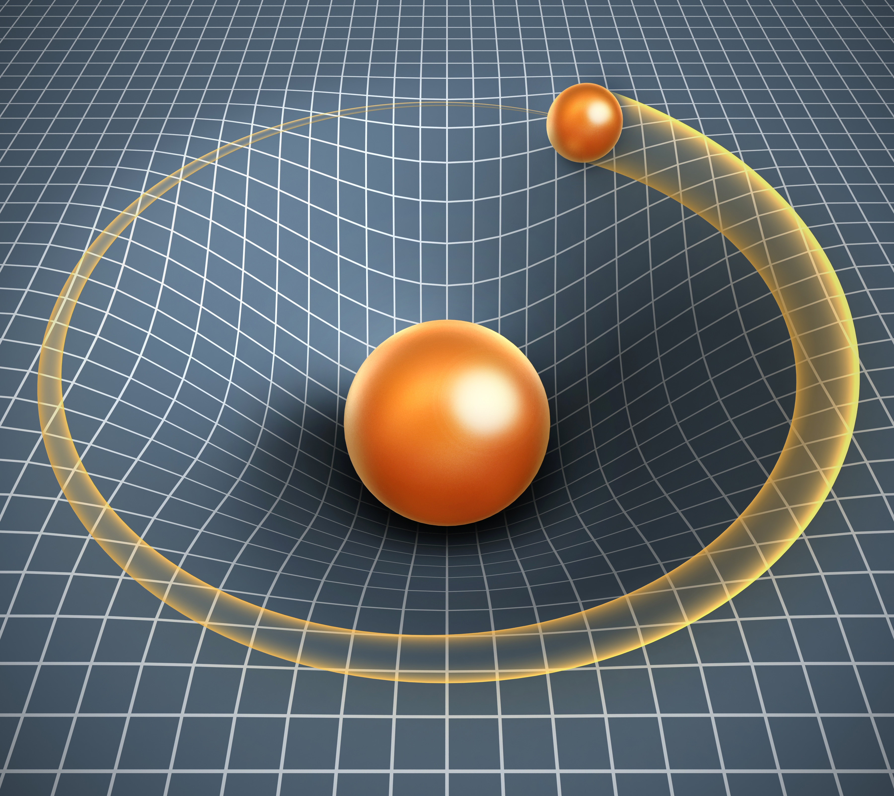

(Image credit: [koya979](https://shutterstock.7eer.net/c/221109/42119/1305?subId1=livescience-bg-6176906273465700000&sharedId=livescience-bg&u=http%3A%2F%2Fwww.shutterstock.com%2Fgallery-587245p1.html) | [Shutterstock](https://shutterstock.7eer.net/c/221109/42119/1305?subId1=livescience-bg-9712216502224243000&sharedId=livescience-bg&u=http%3A%2F%2Fwww.shutterstock.com%2F))  

(图片来源: koya979 | Shutterstock)

[What is gravity](https://www.livescience.com/37115-what-is-gravity.html), anyway? Other forces are mediated by particles. Electromagnetism, for example, is the exchange of photons. The [weak nuclear force](https://www.livescience.com/49254-weak-force.html) is carried by W and Z bosons, and gluons carry the strong nuclear force that holds atomic nuclei together.  

重力到底是什么？其他力量是由粒子介导的。例如，电磁力是光子的交换。弱核力由W和Z玻色子承载，胶子承载强核力，将原子核固定在一起。  

McNees said all of the other forces can be quantized, meaning they could be expressed as individual particles and have noncontinuous values.  

麦克尼斯说，所有其他的力都可以量化，这意味着它们可以被表达为单个粒子，并具有非连续的数值。

Gravity doesn't seem to be like that. Most physical theories say it should be carried by a hypothetical massless particle called a graviton.  

引力似乎并不是这样的。大多数物理理论说，它应该由一个被称为引力子的假想的无质量粒子携带。  

The problem is, nobody has found gravitons yet, and it's not clear that any particle detector that could be built could see them, because if gravitons interact with matter, they do it very, very rarely — so seldom that they'd be invisible against the background noise.  

问题是，目前还没有人发现引力子，也不清楚任何可以建造的粒子探测器能否看到它们，因为如果引力子与物质发生相互作用，它们会做得非常、非常少--少到在背景噪声中看不见它们。  

It isn't even clear that gravitons are massless, though if they have a mass at all, it's very, very small — smaller than that of neutrinos, which are among the lightest particles known.  

甚至不清楚引力子是否无质量，尽管如果它们有质量，那也是非常非常小的--比中微子的质量小，而中微子是已知最轻的粒子之一。  

String theory posits that gravitons (and other particles) are closed loops of energy, but the mathematical work hasn't yielded much insight so far.  

弦理论认为，引力子（和其他粒子）是能量的闭合环路，但迄今为止，数学工作还没有产生多少洞察力。

Because gravitons haven't been observed yet, gravity has resisted attempts to understand it in the way we understand other forces – as an exchange of particles.  

由于引力子还没有被观测到，引力抵制了以我们理解其他力量的方式来理解它的尝试--作为粒子的交换。  

Some physicists, notably Theodor Kaluza and Oskar Klein, posited that gravity may be operating as a particle in extra dimensions beyond the three of space (length, width, and height) and one of time (duration)we are familiar with, but whether that is true is still unknown.   

一些物理学家，特别是西奥多-卡卢扎和奥斯卡-克莱因，假设引力可能作为一个粒子在我们熟悉的三个空间（长、宽、高）和一个时间（持续时间）之外的额外维度上运行，但这是否是真的仍然未知。

## Do we live in a false vacuum?  

我们是否生活在一个虚假的真空中？

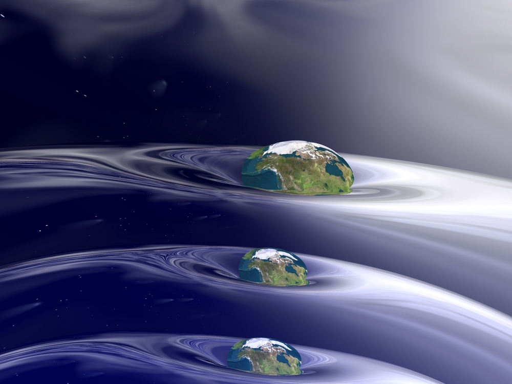

(Image credit: Shutterstock/Sandy MacKenzie)  

(图片来源: Shutterstock/Sandy MacKenzie)

The universe seems relatively stable. After all, it's been around [for about 13.8 billion years](http://www.space.com/24054-how-old-is-the-universe.html). But what if the whole thing were a massive accident?  

宇宙似乎相对稳定。毕竟，它已经存在了大约138亿年。但是，如果整个事情是一个巨大的意外呢？

It all starts with the Higgs and the universe's vacuum. Vacuum, or empty space, should be the lowest possible energy state, because there's nothing in it.  

这一切都始于希格斯和宇宙的真空。真空，或空的空间，应该是最低可能的能量状态，因为其中没有任何东西。  

Meanwhile, the Higgs boson — via the so-called Higgs field — gives everything its mass.  

同时，希格斯玻色子--通过所谓的希格斯场--赋予一切事物以质量。  

Writing in the journal Physics, Alexander Kusenko, a professor of physics and astronomy at the University of California, Los Angeles, said the energy state of the vacuum can be calculated from the potential energy of the Higgs field and the masses of the Higgs and top quark (a fundamental particle).  

加州大学洛杉矶分校物理学和天文学教授亚历山大-库森科在《物理学》杂志上撰文说，真空的能量状态可以通过希格斯场的势能以及希格斯和顶夸克（一种基本粒子）的质量来计算。

So far, those calculations appear to show that the universe's vacuum might not be in the lowest possible energy state. That would mean it's a false vacuum.  

到目前为止，这些计算似乎表明，宇宙的真空可能不处于可能的最低能量状态。这将意味着它是一个假真空。  

If that's true, our universe might not be stable, because a false vacuum can be knocked into a lower energy state by a sufficiently violent and high-energy event.  

如果这是真的，我们的宇宙可能并不稳定，因为一个假的真空可以被一个足够暴力和高能量的事件打入一个较低的能量状态。  

If that were to happen, there would be a phenomenon called bubble nucleation. A sphere of lower-energy vacuum would start growing at the speed of light. Nothing, not even matter itself, would survive.  

如果发生这种情况，就会出现一种叫做气泡成核的现象。一个低能量的真空球体将开始以光速增长。没有任何东西，甚至是物质本身，会存活下来。  

Effectively, we'd be replacing the universe with another one, which might have very different physical laws. \[[5 Reasons We May Live in a Multiverse](https://www.livescience.com/25335-multiple-universes-5-theories.html)\]  

实际上，我们会用另一个宇宙来代替这个宇宙，而这个宇宙可能有非常不同的物理规律。\[我们可能生活在多元宇宙中的5个原因\]

That sounds scary, but given that the universe is still here, clearly there hasn't been such an event yet, and astronomers have seen [gamma-ray bursts](https://www.livescience.com/50215-gamma-rays.html?utm_source=feedburner&utm_medium=feed&utm_campaign=Feed%3A+Livesciencecom+%28LiveScience.com+Science+Headline+Feed%29&utm_content=Google+Feedfetcher), supernovas, and quasars, all of which are pretty energetic. So it's probably unlikely enough that we wouldn't need to worry.  

这听起来很可怕，但考虑到宇宙还在这里，显然还没有出现过这样的事件，而且天文学家已经看到了伽马射线暴、超新星和类星体，所有这些都是相当有能量的。因此，这可能不太可能，我们不需要担心。  

That said, the idea of a false vacuum means that our universe might have popped into existence in just that way, when a previous universe's false vacuum was knocked into a lower energy state.  

也就是说，假真空的想法意味着我们的宇宙可能就是以这种方式突然出现的，当以前的宇宙的假真空被撞到一个较低的能量状态。  

Perhaps we were the result of an accident with a particle accelerator.   

也许我们是一个粒子加速器事故的结果。

_Editor's note: This list was originally published in 2012. It was updated on Feb. 27, 2017, to include newer information and recent studies.  

编者注：这份名单最初发表于2012年。它于2017年2月27日更新，以包括更新的信息和最近的研究。_

Jesse Emspak is a contributing writer for Live Science, Space.com and Toms Guide. He focuses on physics, human health and general science.  

Jesse Emspak是Live Science、Space.com和Toms Guide的特约作家。他专注于物理学、人类健康和一般科学。  

Jesse has a Master of Arts from the University of California, Berkeley School of Journalism, and a Bachelor of Arts from the University of Rochester.  

杰西拥有加利福尼亚大学伯克利分校新闻学院的文学硕士学位，以及罗切斯特大学的文学学士学位。  

Jesse spent years covering finance and cut his teeth at local newspapers, working local politics and police beats.  

杰西花了多年时间报道金融，并在地方报纸上切入，从事地方政治和警察工作。  

Jesse likes to stay active and holds a third degree black belt in Karate, which just means he now knows how much he has to learn.  

杰西喜欢保持活跃，拥有空手道黑带第三级，这只是意味着他现在知道自己要学多少东西。
