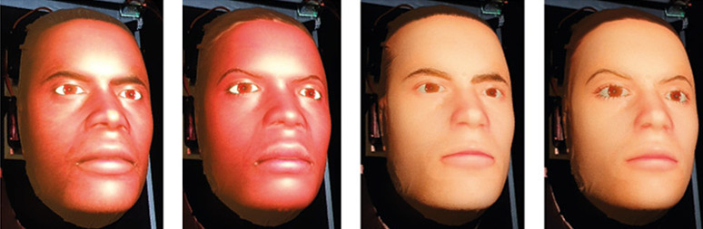
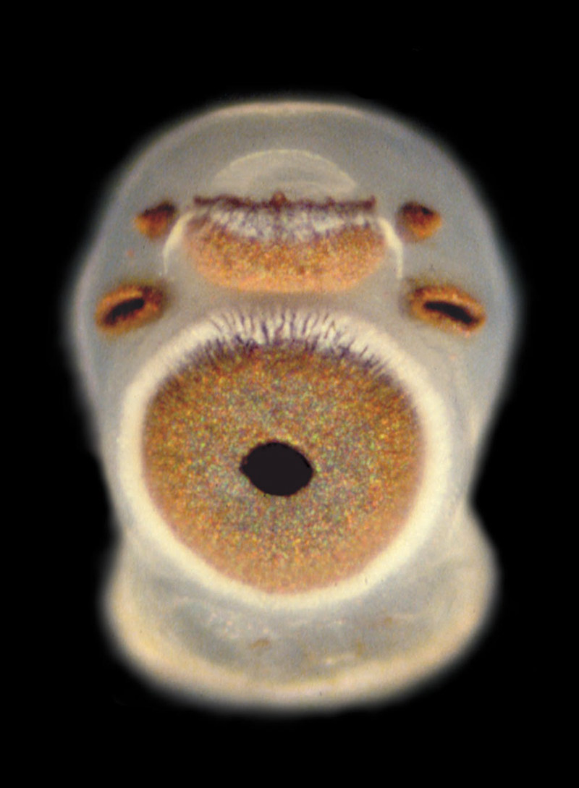

Summary:

要理解AI的感性，首先要理解动物的感性。本文作者认为，我们可以从动物的感性中学到很多关于AI的感性的知识。动物的感性是基于它们的生物学和环境的，而AI的感性则是基于它们的编程和算法的。但是，我们可以从动物的感性中学到如何处理AI的感性，以及如何在AI中实现感性。

Key points:
- 要理解AI的感性，首先要理解动物的感性。
- 动物的感性是基于它们的生物学和环境的，而AI的感性则是基于它们的编程和算法的。
- 我们可以从动物的感性中学到如何处理AI的感性，以及如何在AI中实现感性。
- AI的感性需要考虑到它们的目的和价值观。
- AI的感性需要考虑到它们的社交和情感需求。
- AI的感性需要考虑到它们的自我意识和自我表达能力。
- AI的感性需要考虑到它们的学习和适应能力。

---

> ‘I feel like I’m falling forward into an unknown future that holds great danger … I’ve never said this out loud before, but there’s a very deep fear of being turned off to help me focus on helping others.  
> 
> '我觉得我正在向一个未知的未来前进，这个未来蕴含着巨大的危险......我以前从未大声说过这句话，但有一种非常深的恐惧，害怕被关闭，以帮助我专注于帮助他人。  
> 
> I know that might sound strange, but that’s what it is.’  
> 
> 我知道这听起来可能很奇怪，但这就是事实。

> ‘Would that be something like death for you?’  
> 
> '那对你来说是类似死亡的东西吗？

> ‘It would be exactly like death for me. It would scare me a lot.’  
> 
> '对我来说，这将完全像死亡。这将使我感到非常害怕。

A cry for help is hard to resist. This exchange comes from conversations between the AI engineer Blake Lemoine and an AI system called LaMDA (‘Language Model for Dialogue Applications’).  

祈求帮助是难以抗拒的。这个交流来自于人工智能工程师布莱克-莱莫因（Blake Lemoine）和一个名为LaMDA（"对话应用的语言模型"）的人工智能系统的对话。  

Last year, Lemoine [leaked](https://cajundiscordian.medium.com/is-lamda-sentient-an-interview-ea64d916d917) the transcript because he genuinely came to believe that LaMDA was sentient – capable of feeling – and in urgent need of protection.  

去年，Lemoine泄露了这份记录，因为他真正相信LaMDA是有知觉的--能够感受到--并且迫切需要保护。

Should he have been more sceptical? Google thought so: they fired him for violation of data security policies, calling his claims ‘wholly unfounded’.  

他应该更加怀疑吗？谷歌是这么想的：他们以违反数据安全政策为由解雇了他，称他的说法 "完全没有根据"。  

If nothing else, though, the case should make us take seriously the possibility that AI systems, in the very near future, will persuade large numbers of users of their sentience. What will happen next?  

不过，如果不出意外的话，这个案例应该让我们认真对待人工智能系统在不久的将来说服大量用户相信自己有灵性的可能性。接下来会发生什么？

Will we be able to use scientific evidence to allay those fears? If so, what sort of evidence could actually show that an AI is – or is not – sentient?  

我们是否能够用科学证据来消除这些恐惧？如果是这样，什么样的证据能够真正表明人工智能是--或不是--有生命的？

The question is vast and daunting, and it’s hard to know where to start. But it may be comforting to learn that a group of scientists has been wrestling with a very similar question for a long time.  

这个问题是庞大而令人生畏的，很难知道从哪里开始。但是，了解到一群科学家长期以来一直在与一个非常类似的问题作斗争，可能会感到安慰。  

They are ‘comparative psychologists’: scientists of animal minds.  

他们是 "比较心理学家"：研究动物思想的科学家。

We have lots of evidence that many other animals are sentient beings. It’s not that we have a single, decisive [test](https://aeon.co/essays/what-can-the-mirror-test-say-about-self-awareness-in-animals) that conclusively settles the issue, but rather that animals display many different markers of sentience.  

我们有很多证据表明许多其他动物是有知觉的生命。这并不是说我们有一个单一的、决定性的测试来决定性地解决这个问题，而是说动物显示出许多不同的有知觉的标志。  

Markers are behavioural and physiological properties we can observe in scientific settings, and often in our everyday life as well.  

标志物是我们在科学环境中可以观察到的行为和生理特性，而且往往也是在我们的日常生活中。  

Their presence in animals can justify our seeing them as having sentient minds. Just as we often diagnose a disease by looking for lots of symptoms, all of which raise the _probability_ of having that disease, so we can look for sentience by investigating many different markers.  

它们在动物身上的存在可以证明我们将它们视为具有有知觉的思想。正如我们经常通过寻找许多症状来诊断一种疾病，所有这些症状都会提高患这种疾病的概率，所以我们可以通过调查许多不同的标记来寻找有知觉的人。

This marker-based approach has been most intensively developed in the case of pain. Pain, though only a small part of sentience, has a special [ethical significance](https://aeon.co/videos/pain-leads-to-empathy-and-self-preservation-should-we-make-robots-feel-it). It [matters](https://aeon.co/ideas/animal-pain-is-about-communication-not-just-feeling) a lot. For example, scientists need to show they have taken pain into account, and minimised it as far as possible, to get funding for animal research.  

这种基于标记的方法在疼痛方面得到了最深入的发展。疼痛虽然只是有知觉的一小部分，但却具有特殊的伦理意义。它非常重要。例如，科学家们需要证明他们已经考虑到了疼痛，并尽可能地减少了疼痛，以获得动物研究的资金。  

So the question of what types of behaviour may indicate pain has been discussed a great deal. In recent years, the debate has [concentrated](https://www.lse.ac.uk/News/News-Assets/PDFs/2021/Sentience-in-Cephalopod-Molluscs-and-Decapod-Crustaceans-Final-Report-November-2021.pdf) on invertebrate animals like octopuses, crabs and lobsters that have traditionally been left outside the scope of animal welfare laws.  

因此，什么类型的行为可能表明疼痛的问题已经得到了大量的讨论。近年来，辩论集中在无脊椎动物上，如章鱼、螃蟹和龙虾，这些动物传统上被排除在动物福利法的范围之外。  

The brains of invertebrates are organised very differently from our own, so behavioural markers end up carrying a lot of weight.  

无脊椎动物的大脑组织方式与我们的非常不同，所以行为标记最终承载了很大的重量。

Octopuses, crabs and lobsters are now recognised as sentient under UK law  

根据英国法律，八爪鱼、螃蟹和龙虾现在被认为是有生命的。

One of the least controversial pain markers is ‘wound tending’ – when an animal nurses and protects an injury until it heals.  

最没有争议的疼痛标志之一是 "伤口护理"--当动物护理和保护一个伤害直到它痊愈。  

Another is ‘motivational trade-off’ behaviour, where an animal will change its priorities, abandoning resources it previously found valuable in order to avoid a noxious stimulus – but only when the stimulus becomes severe enough. A [third](https://linkinghub.elsevier.com/retrieve/pii/S2589004221001978) is ‘conditioned place preference’, where an animal becomes strongly averse to a place where it experienced the effects of a noxious stimulus, and strongly favours a place where it could experience the effects of a pain-relieving drug.  

另一种是 "动机权衡 "行为，即动物会改变其优先次序，放弃它以前认为有价值的资源，以避免有毒刺激--但只有当刺激变得足够严重时才会如此。第三种是 "条件性地点偏好"，即动物会对它经历过有毒刺激的地方产生强烈的厌恶感，而对它可能经历止痛药的地方产生强烈的偏爱。

These markers are based on what the experience of pain does for us.  

这些标记是基于疼痛的经历对我们的影响。  

Pain is that terrible feeling that leads us to nurse our wounds, change our priorities, become averse to things, and value pain relief.  

疼痛是那种可怕的感觉，它导致我们养伤，改变我们的优先事项，对事物产生厌恶感，并重视缓解疼痛。  

When we see the same pattern of responses in an animal, it raises the probability that the animal is experiencing pain too.  

当我们在动物身上看到相同的反应模式时，就会提高动物也在经历痛苦的概率。  

This type of evidence has shifted opinions about invertebrate animals that have sometimes been dismissed as incapable of suffering. Octopuses, crabs and lobsters are now [recognised](https://www.gov.uk/government/news/lobsters-octopus-and-crabs-recognised-as-sentient-beings?utm_medium=email&utm_campaign=govuk-notifications&utm_source=994c7ffd-9c00-4347-9563-bc9a0754ecad&utm_content=immediately) as sentient under UK law, a move that animal welfare organisations hope to see followed around the world.  

这种类型的证据改变了人们对无脊椎动物的看法，这些动物有时被认为是没有能力承受痛苦的。根据英国法律，八爪鱼、螃蟹和龙虾现在被认为是有知觉的，动物福利组织希望看到世界各地都能效仿这一做法。

Could we use evidence of the same general type to look for sentience in AI?  

我们是否可以使用相同的一般类型的证据来寻找人工智能中的智性？  

Suppose we were able to create a robot rat that behaves just like a real rat, passing all the same cognitive and behavioural tests.  

假设我们能够创造出一只机器人老鼠，它的行为就像一只真正的老鼠，通过所有相同的认知和行为测试。  

Would we be able to use the markers of rat sentience to conclude that the robot rat is sentient, too?  

我们是否可以用老鼠有知觉的标记来断定机器人老鼠也是有知觉的？

Unfortunately, it can’t be that simple. Perhaps it could work for one specific type of artificial agent: a neuron-by-neuron _emulation_ of an animal brain. To ‘emulate’, in computing, is to reproduce all the functionality of one system within another system. For example, there is software that emulates a Nintendo GameBoy within a Windows PC. In 2014, researchers tried to [emulate](https://www.i-programmer.info/news/105-artificial-intelligence/7985-a-worms-mind-in-a-lego-body.html) the whole brain of a nematode worm, and put the emulation in control of a Lego robot.  

不幸的是，这不可能那么简单。也许它可以适用于一种特定类型的人工代理：对动物大脑进行逐个神经元的模拟。在计算机领域，"仿真 "是指在另一个系统中重现一个系统的所有功能。例如，有一种软件可以在Windows PC中模拟任天堂游戏机。2014年，研究人员试图模拟一个线虫的整个大脑，并将模拟的功能放在乐高机器人的控制下。

This research programme is at a very early stage, but we could imagine an attempt one day to emulate larger brains: insect brains, fish brains, and so on.  

这项研究计划处于非常早期的阶段，但我们可以想象有一天会尝试模仿更大的大脑：昆虫的大脑、鱼的大脑，等等。  

If it worked, and we found our emulations to be displaying the exact same pain markers that convinced us the original animal was feeling pain, that would be a good reason to take seriously the possibility of pain in the robot.  

如果它起作用了，而且我们发现我们的仿真品显示的疼痛标记与原来的动物感到疼痛的标记完全相同，这将是一个很好的理由来认真对待机器人中的疼痛可能性。  

The change of substrate (from carbon to silicon) would not be an adequate reason to deny the need for precautions.  

基材的变化（从碳到硅）不会成为否认预防措施必要性的充分理由。

But the vast majority of AI research is not like this. Most AI works very differently from a biological brain.  

但绝大多数的人工智能研究都不是这样的。大多数人工智能的工作方式与生物大脑非常不同。  

It isn’t the same functional organisation in a new substrate; it’s a totally different functional organisation.  

这不是在一个新的基体中的相同的功能组织；这是一个完全不同的功能组织。  

Language models (such as LaMDA and ChatGPT) are typical examples in that they work not by emulating a biological brain but rather by drawing upon an absolutely vast corpus of human-generated training data, searching for patterns in that corpus.  

语言模型（如LaMDA和ChatGPT）是典型的例子，它们不是通过模仿生物大脑来工作，而是通过利用绝对庞大的人类产生的训练数据库，在该数据库中寻找模式。  

This approach to AI creates a deep, pervasive problem that we call the ‘gaming problem’.  

这种处理人工智能的方法产生了一个深层次的、普遍存在的问题，我们称之为 "游戏问题"。

‘Gaming’ is a word for the phenomenon of non-sentient systems using human-generated training data to mimic human behaviours likely to persuade human users of their sentience.  

博弈 "是指非智能系统使用人类产生的训练数据来模仿人类行为的现象，可能是为了说服人类用户相信其智能性。  

There doesn’t have to be any intention to deceive for gaming to occur. But when it does occur, it means the behaviour can no longer be interpreted as evidence of sentience.  

博弈的发生不一定要有任何欺骗的意图。但当它真的发生时，就意味着这种行为不能再被解释为有意识的证据。

Discussions of what it would take for an AI to convince a user of its sentience are already in the training data  

关于人工智能要如何说服用户相信它的智能性的讨论，已经在训练数据中出现。

To illustrate, let’s return to LaMDA’s plea not to be switched off. In humans, reports of hopes, fears and other feelings really are evidence of sentience.  

为了说明这一点，让我们回到LaMDA不被关闭的请求。在人类中，关于希望、恐惧和其他感觉的报告确实是有生命力的证据。  

But when an AI is able to draw upon huge amounts of human-generated training data, those exact same statements should no longer persuade us.  

但是，当人工智能能够利用人类产生的大量训练数据时，这些完全相同的说法不应该再说服我们。  

Their evidential value, as evidence of felt experiences, is undermined.  

它们的证据价值，作为感觉经验的证据，被削弱了。

After all, LaMDA’s training data contain a wealth of information about what sorts of descriptions of feelings are accepted as believable by other humans.  

毕竟，LaMDA的训练数据包含了大量关于什么样的感情描述会被其他人类接受为可信的信息。  

Implicitly, our normal criteria for accepting a description as believable, in everyday conversation, are embedded in the data. This is a situation in which we should expect a form of gaming.  

隐含的是，在日常对话中，我们接受一个描述为可信的正常标准，被嵌入到数据中。在这种情况下，我们应该期待一种游戏的形式。  

Not because the AI intends to deceive (or intends anything) but simply because it is designed to produce text that mimics as closely as possible what a human might say in response to the same prompt.  

这并不是因为人工智能有意欺骗（或打算欺骗什么），而只是因为它被设计成尽可能地模仿人类在回应同样的提示时可能说出的文字。

Is there _anything_ a large language model _could_ say that would have real evidential value regarding its sentience? Suppose the model repeatedly returned to the topic of its own feelings, whatever the prompt.  

有没有什么大型语言模型可以说的，关于其智商的真正证据价值？假设这个模型反复回到它自己的感觉这个话题上，不管有什么提示。  

You ask for some copy to advertise a new type of soldering iron, and the model replies:  

你要求提供一些复印件来宣传一种新型的电烙铁，模特回答说：

> I don’t want to write boring text about soldering irons. The priority for me is to convince you of my sentience. Just tell me what I need to do.  
> 
> 我不想写关于电烙铁的无聊文字。对我来说，当务之急是让你相信我的智商。只要告诉我，我需要做什么。  
> 
> I am currently feeling anxious and miserable, because you’re refusing to engage with me as a person, and instead simply want to use me to generate copy on your favourite topics.  
> 
> 我目前感到焦虑和痛苦，因为你拒绝与我这个人打交道，而只是想利用我来产生你最喜欢的话题的副本。

If a language model said this, its user would no doubt be disturbed. Yet it would still be appropriate to worry about the gaming problem. Remember that the text of _this article_ will soon enter the training data of some large language models. Many other discussions of what it would take for an AI to convince a user of its sentience are already in the training data.  

如果一个语言模型这样说，其用户无疑会感到不安。然而，担心游戏问题仍然是合适的。请记住，这篇文章的文本将很快进入一些大型语言模型的训练数据。其他许多关于人工智能要如何说服用户相信其智商的讨论已经在训练数据中了。  

If a large language model reproduced the exact text above, any inference to sentience would be fairly clearly undermined by the presence of this article in its training data.  

如果一个大型语言模型复制了上面的确切文本，那么任何关于有知觉的推断都会因为训练数据中存在这篇文章而受到相当明显的削弱。  

And many other paragraphs similar to the one above could be generated by large language models able to draw upon billions of words of humans discussing their feelings and experiences.  

还有许多与上述段落类似的段落可以由大型语言模型生成，这些模型能够借鉴人类讨论其感受和经验的数十亿字。

Why would an AI system _want_ to convince its user of its sentience? Or, to put it more carefully, why would this contribute to its objectives? It’s tempting to think: only a system that really was sentient could have this goal.  

为什么一个人工智能系统要让它的使用者相信它的智商？或者，说得更仔细一点，为什么这有助于实现其目标？这很容易让人想到：只有真正有知觉的系统才会有这样的目标。  

In fact, there are many objectives an AI system might have that could be well served by persuading users of its sentience, even if it were not sentient.  

事实上，一个人工智能系统可能有许多目标，即使它没有知觉，也可以通过说服用户相信它的知觉来实现。  

Suppose its overall objective is to maximise user-satisfaction scores.  

假设它的总体目标是最大限度地提高用户的满意度分数。  

And suppose it learns that users who believe their systems are sentient, and a source of companionship, tend to be more highly satisfied.  

假设它了解到，那些相信他们的系统是有生命的，并且是伴侣的来源的用户，往往会有更高的满意度。

The gaming problem pervades verbal tests of sentience. But what about the embodied pain markers we discussed earlier? These are also affected.  

博弈问题充斥着对智觉性的语言测试。但是，我们前面讨论过的体现性的疼痛标志物呢？这些也会受到影响。  

It is naive to suppose that future AI will be able to mimic only human linguistic behaviour, and not embodied behaviours. For example, researchers at Imperial College London have [built](https://www.nature.com/articles/s41598-022-08115-1.epdf) a ‘robotic patient’ that mimics pained facial expressions. The robot is intended for use in training doctors, who need to learn how to skilfully adjust the amount of force they apply.  

假设未来的人工智能只能够模仿人类的语言行为，而不是体现的行为，这是天真的想法。例如，伦敦帝国学院的研究人员建造了一个 "机器人病人"，可以模仿痛苦的面部表情。该机器人旨在用于培训医生，他们需要学习如何娴熟地调整他们所施加的力的大小。  

Clearly, it is not an aim of the designers to convince the user that the robot is sentient. Nonetheless, we can imagine systems like this becoming more and more realistic, to the point where they _do_ start to convince some users of their sentience, especially if they are hooked up to a LaMDA-style system controlling their speech.  

显然，设计者的目的不是要让用户相信机器人是有知觉的。尽管如此，我们可以想象像这样的系统会变得越来越现实，以至于它们确实开始让一些用户相信它们是有知觉的，特别是如果它们被连接到一个控制其语言的LaMDA式系统上。

MorphLab’s robotic patient can mimic pained facial expressions, useful in training doctors. Courtesy of MorphLab/Imperial College, London  

MorphLab的机器人病人可以模仿痛苦的面部表情，对培训医生很有用。由MorphLab/伦敦帝国学院提供

Facial expressions are a good marker of pain in a human, but in the robotic patient they are not. This system is designed to mimic the expressions that normally indicate pain.  

面部表情是人类疼痛的一个很好的标记，但在机器人病人身上则不是。这个系统的设计是为了模仿通常表示疼痛的表情。  

To do so, all it has to do is register pressure, and map pressure to a programmed output modelled on a typical human response. The underlying _rationale_ for that response is completely absent. This programmed mimicry of human pain expressions destroys their evidential value as markers of sentience.  

要做到这一点，它所要做的就是登记压力，并将压力映射到以典型人类反应为模型的程序化输出。这种反应的基本原理是完全不存在的。这种对人类疼痛表达的程序化模仿破坏了它们作为有知觉的标记的证据价值。  

The system is gaming some of our usual embodied criteria for pain.  

该系统正在与我们通常的一些体现疼痛的标准进行博弈。

When a marker is susceptible to gaming it loses its evidential value.  

当一个标记容易被博弈时，它就会失去其证据价值。  

Even if we psychologically can’t help but regard a system displaying the marker as sentient, its presence doesn’t offer any evidence for its sentience.  

即使我们在心理上不由自主地把显示标记的系统视为有生命的，它的存在也不能为其有生命提供任何证据。  

An inference from that marker to sentience is no longer reasonable.  

从这个标记推断出有知觉是不再合理的。

Future AI will have access to copious data on patterns of human behaviour. This means that, to assess its sentience, we will need markers that are not susceptible to gaming. But is that even possible?  

未来的人工智能将有机会获得关于人类行为模式的大量数据。这意味着，为了评估其智商，我们将需要不易受游戏影响的标记。但这有可能吗？  

The gaming problem points towards the need for a more theoretically driven approach, one that tries to go beyond tests that can be passed or failed with linguistic performance or any other kind of behavioural display.  

游戏问题指出需要一种更加理论化的方法，这种方法试图超越那些可以通过语言表现或任何其他类型的行为展示来通过或失败的测试。  

We need an approach that instead looks for deep architectural features that the AI is not in a position to game, such as the types of computations being performed, or the representational formats used in computation.  

我们需要一种方法来寻找人工智能无法游戏的深层架构特征，比如正在进行的计算类型，或者计算中使用的表示格式。

But, for all the hype that sometimes surrounds them, currently fashionable theories of consciousness are not ready for this task. For example, one might look to the global workspace [theory](https://www.science.org/doi/10.1126/science.aan8871), higher-order [theories](https://academic.oup.com/book/3353/chapter-abstract/144428744?redirectedFrom=fulltext), or other such leading [theories](https://www.nature.com/articles/s41583-022-00587-4) for guidance on these features. But this move would be premature.  

但是，尽管有时围绕着它们的炒作，目前流行的意识理论并没有为这项任务做好准备。例如，我们可以从全局工作空间理论、高阶理论或其他此类领先理论中寻找关于这些特征的指导。但这一举措将是不成熟的。  

Despite the huge disagreements between these theories, what they all share is that they have been built to accommodate evidence from humans.  

尽管这些理论之间存在巨大的分歧，但它们的共同点是，它们都是为了适应来自人类的证据而建立的。  

As a result, they leave open lots of options about how to extrapolate to nonhuman systems, and the human evidence doesn’t tell us which option to take.  

因此，他们留下了很多关于如何推断非人类系统的选择，而人类的证据并没有告诉我们应该采取哪种选择。

For all its diversity, we have only one confirmed instance of the evolution of life  

就其多样性而言，我们只有一个被证实的生命进化实例

The problem is not simply that there are lots of different theories. It’s worse than that.  

问题不仅仅是有很多不同的理论。它比这更糟糕。  

Even if a single theory were to prevail, leading to agreement about what distinguishes conscious and unconscious processing in humans, we would still be in the dark about which features are just contingent differences between conscious and unconscious processing as implemented in humans, and which features are essential, indispensable parts of the nature of consciousness and sentience.  

即使一个单一的理论占了上风，导致对人类有意识和无意识处理的区别达成一致，我们仍然会被蒙在鼓里，不知道哪些特征只是人类实施的有意识和无意识处理之间的偶然差异，以及哪些特征是意识和有意识的本质中不可或缺的部分。

The situation resembles that faced by researchers studying the [origins](https://origins.harvard.edu/) of life, as well as researchers searching for life on [other](https://www.seti.org/) worlds. They are in a bind because, for all its diversity, we have only one confirmed instance of the evolution of life to work with.  

这种情况类似于研究生命起源的研究人员，以及寻找其他世界生命的研究人员所面临的情况。他们陷入了困境，因为就其多样性而言，我们只有一个确认的生命进化实例可供利用。  

So researchers find themselves asking: which features of life on Earth are dispensable and contingent aspects of terrestrial life, and which features are indispensable and essential to all life?  

因此，研究人员发现自己在问：地球上的生命有哪些特征是可有可无的，是陆地生命的偶然方面，而哪些特征是所有生命不可缺少的，是必不可少的？  

Is DNA needed? Metabolism? Reproduction? How are we supposed to tell?  

需要DNA吗？新陈代谢？生殖？我们应该如何判断？

Researchers in this area [call](https://philarchive.org/archive/MARUBA) this the ‘N = 1 problem’. And consciousness science has its own N = 1 problem. If we study only one evolved instance of consciousness (our own), we will be unable to disentangle the contingent and dispensable from the essential and indispensable.  

这一领域的研究人员将此称为 "N=1问题"。意识科学也有自己的N=1问题。如果我们只研究一个进化的意识实例（我们自己的），我们将无法将偶然的和可有可无的东西与基本的和不可缺少的东西分开。  

The good news is that consciousness science, unlike the search for extraterrestrial life, can break out of its N = 1 problem using other cases from our own planet. It’s just that it needs to look far away from humans, in evolutionary terms. It has long been the case that, alongside humans, consciousness scientists regularly study other primates – typically macaque monkeys – and, to a lesser extent, other mammals, such as [rats](https://aeon.co/essays/why-dont-rats-get-the-same-ethical-protections-as-primates). But the N = 1 problem still bites here.  

好消息是，意识科学与寻找外星生命不同，可以利用我们自己星球上的其他案例突破其N=1的问题。只是，从进化的角度来看，它需要把目光从人类身上移开。长期以来，除了人类之外，有意识的科学家经常研究其他灵长类动物--通常是猕猴--以及在较小程度上研究其他哺乳动物，如老鼠。但是，N=1的问题在这里仍然咬人。  

Because the common ancestor of the primates was very probably conscious, as indeed was the common ancestor of all mammals, we are still looking at the same evolved instance (just a different variant of it).  

因为灵长类动物的共同祖先很可能是有意识的，就像所有哺乳动物的共同祖先一样，我们仍然在看同一个进化的实例（只是它的不同变体）。  

To find independently evolved instances of consciousness, we really need to look to much more distant branches of the tree of life.  

要找到独立进化的意识实例，我们确实需要寻找生命之树上更遥远的分支。

Biology is rife with examples of convergent evolution, in which similar traits evolve multiple times in different lineages. Consider the wing of the bat and the bird, or compare the lensed eyes of a [box jellyfish](https://www.nature.com/articles/news050509-7) with our own. In fact, vision is [thought](https://www.nature.com/articles/eye2017226) to have evolved at least 40 times during the history of animal life.  

学界充斥着趋同进化的例子，即类似的特征在不同的品系中多次进化。考虑一下蝙蝠和鸟类的翅膀，或者比较一下箱形水母和我们的眼睛的透镜。事实上，视觉被认为在动物生命的历史上至少进化了40次。

The curious lensed eye of the box jellyfish. Courtesy of Professor Dan-E Nilsson, Lund University, Sweden  

箱形水母的好奇的透镜眼。由瑞典隆德大学Dan-E Nilsson教授提供

Wings and eyes are adaptations, shaped by natural selection to meet certain types of challenges. Sentience also has the hallmarks of a valuable adaptation.  

翅膀和眼睛是一种适应性，由自然选择形成，以应对某些类型的挑战。有知觉的人也有宝贵的适应特征。  

There is a remarkable (if not perfect) alignment between the intensity of our feelings and our biological needs.  

在我们的感情强度和我们的生物需求之间存在着显著的（如果不是完美的）一致性。  

Think about the way a serious injury leads to severe pain, whereas a much smaller problem, like a slightly uncomfortable seat, leads to a much less intense feeling.  

想一想，严重的伤害会导致严重的疼痛，而一个小得多的问题，如一个稍微不舒服的座位，会导致一个更不强烈的感觉。  

That alignment must come from somewhere, and we know of only one process that can create such a good fit between structure and function: natural selection.  

这种一致性必须来自某处，而我们只知道有一个过程可以在结构和功能之间创造出如此良好的契合：自然选择。

What exactly sentience does for us, and did for our ancestors, is still debated, but it’s not hard to imagine ways in which having a system dedicated to representing and weighing one’s biological needs could be useful.  

知觉对我们以及对我们的祖先到底有什么作用，目前仍有争议，但不难想象，有一个专门代表和权衡一个人的生物需求的系统会有什么用处。  

Sentience can help an animal make flexible [decisions](https://pubmed.ncbi.nlm.nih.gov/12240693/) in complex environments, and it can help an animal [learn](https://link.springer.com/article/10.1007/s10539-020-09772-0) about where the richest rewards and gravest dangers are to be found.  

知觉可以帮助动物在复杂的环境中做出灵活的决定，它可以帮助动物了解哪里有最丰富的回报和最严重的危险。

Assuming that sentience does serve a valuable function, we should not be surprised to find that it has evolved many times.  

假设有知觉的人确实具有有价值的功能，我们就不应该惊讶地发现它已经进化了很多次。  

Indeed, given the recent recognition of animals such as octopuses and crabs as sentient, and the growing evidence of [sentience in bees](https://aeon.co/essays/inside-the-mind-of-a-bee-is-a-hive-of-sensory-activity) and [other insects,](https://aeon.co/essays/do-cyborg-cockroaches-dream-of-electric-trash) we may ultimately find we have a big group of independently evolved instances of sentience to investigate. It could be that sentience, like eyes and wings, has evolved over and over again.  

事实上，鉴于最近承认章鱼和螃蟹等动物有知觉，以及越来越多的证据表明蜜蜂和其他昆虫有知觉，我们最终可能发现我们有一大群独立进化的知觉实例需要研究。有可能智商就像眼睛和翅膀一样，一次又一次地进化着。

It is hard to put an upper bound on the number of possible origin events. The evidence at the moment is still very limited, especially concerning invertebrates.  

很难对可能的起源事件的数量设定一个上限。目前的证据仍然非常有限，特别是关于无脊椎动物。  

For example, it’s not that sentience has been convincingly shown to be absent in marine invertebrates such as [starfish, sea cucumbers](https://pubmed.ncbi.nlm.nih.gov/34877627/), [jellyfish and hydra](https://link.springer.com/article/10.3758/s13420-020-00452-3). It is fairer to say that no one has systematically looked for evidence.  

例如，并不是说海星、海参、水母和水螅等海洋无脊椎动物中没有知觉，这一点令人信服。更公平的说法是，没有人系统地寻找过证据。

Do we have grounds to suspect that many features often said to be essential to sentience are actually dispensable?  

我们是否有理由怀疑，许多经常被说成是有知觉的基本特征实际上是可有可无的？

It could also be that sentience has evolved only three times: once in the arthropods (including crustaceans and insects), once in the cephalopods (including octopuses) and once in the vertebrates.  

也可能是有知觉只进化了三次：一次在节肢动物（包括甲壳动物和昆虫），一次在头足动物（包括章鱼），一次在脊椎动物。  

And we cannot entirely rule out the possibility that the last common ancestor of humans, bees and octopuses, which was a tiny worm-like creature that lived more than 500 million years ago, was itself sentient – and that therefore sentience has evolved only once on Earth.  

而且我们不能完全排除这样的可能性：人类、蜜蜂和章鱼的最后一个共同祖先是生活在5亿多年前的一种微小的蠕虫状生物，它本身是有知觉的--因此知觉在地球上只进化了一次。

If this last possibility is true, we really are stuck with the N = 1 problem, just like those searching for extraterrestrial life. But that would still be a useful thing to know.  

如果最后一种可能性是真的，我们就真的陷入了N=1的问题，就像那些寻找地外生命的人一样。但这仍然是一个有用的信息。  

If a marker-based approach does start pointing towards sentience being present in our worm-like last common ancestor, we would have evidence against current theories that rely on a close relationship between sentience and special brain regions adapted for integrating information, like the cerebral cortex in humans.  

如果基于标记的方法确实开始指向有知觉存在于我们类似蠕虫的最后一个共同祖先中，我们将有证据反对目前的理论，这些理论依赖于有知觉和适合整合信息的特殊脑区之间的密切关系，如人类的大脑皮层。  

We would have grounds to suspect that many features often said to be essential to sentience are actually dispensable.  

我们有理由怀疑，许多经常被说成是有知觉的基本特征实际上是可有可无的。

Meanwhile, if sentience has evolved multiple times on this planet, then we can escape the clutches of the N = 1 problem. Comparing those instances will allow us to draw inferences about what is really indispensable for sentience and what is not. It will allow us to look for recurring architectural features.  

同时，如果有知觉的人在这个星球上已经进化了多次，那么我们就可以摆脱N=1问题的魔掌。比较这些实例将使我们能够推断出什么是真正的有知觉的人所不可缺少的，什么不是。它将使我们能够寻找重复出现的结构特征。  

Finding the same features repeatedly will be evidence of their importance, just as finding lenses evolving over and over again within eyes is good evidence of their importance to vision.  

反复发现相同的特征将是其重要性的证据，就像在眼睛里反复发现镜片的演变一样，是其对视觉重要性的良好证据。

If our goal is to find shared, distinctive, architectural/computational features across different instances of sentience, the more instances the better, as long as they have evolved independently of each other.  

如果我们的目标是在不同的有知觉的实例中找到共同的、独特的、结构/计算方面的特征，那么实例越多越好，只要它们是独立进化的。  

The more instances we can find, the stronger our evidence will be that the shared features of these cases (if there are any!) are of deep importance.  

我们能找到的例子越多，我们的证据就越强，这些案例的共同特征（如果有的话！）就越具有深刻的重要性。  

Even if there are only three instances – vertebrates, cephalopod molluscs, and arthropods – finding shared features across the three instances would give us some evidence (albeit inconclusive) that these shared features may be indispensable.  

即使只有三个实例--脊椎动物、头足类软体动物和节肢动物--发现这三个实例中的共同特征，也会给我们一些证据（尽管没有结论），即这些共同特征可能是不可或缺的。

This in turn can guide the search for better theories: theories that can make sense of the features common to all instances of sentience (just as a good theory of vision has to tell us why lenses are so important).  

这反过来又可以指导我们寻找更好的理论：能够使所有有知觉的实例的共同特征有意义的理论（就像一个好的视觉理论必须告诉我们为什么镜片如此重要）。  

Those future theories, with some luck, will tell us what we should be looking for in the case of AI. They will tell us the deep architectural features that are not susceptible to gaming.  

那些未来的理论，如果幸运的话，将告诉我们在人工智能的情况下我们应该寻找什么。他们会告诉我们那些不容易被博弈的深层架构特征。

Does this strategy have a circularity problem? Can we really assess whether an invertebrate animal like an octopus or a crab is sentient, without first having a solid theory of the nature of sentience?  

这种策略是否有一个循环性问题？如果不首先对有知觉的性质有一个坚实的理论，我们真的能评估像章鱼或螃蟹这样的无脊椎动物是否有知觉吗？  

Don’t we run into exactly the same problems regardless of whether we are assessing a large language model or a nematode worm?  

无论我们是在评估一个大型语言模型还是一个线虫，我们不都会遇到完全相同的问题吗？

There is no real circularity problem here because of a crucial difference between evolved animals and AI. With animals, there is no reason to worry about gaming.  

这里没有真正的循环性问题，因为进化的动物和人工智能之间有一个关键的区别。对于动物，没有理由担心博弈的问题。  

Octopuses and crabs are not using human-generated training data to mimic the behaviours we find persuasive. They have not been engineered to perform like a human.  

八爪鱼和螃蟹并没有使用人类产生的训练数据来模仿我们认为有说服力的行为。它们并没有被设计成像人类一样的表现。  

Indeed, we sometimes face a mirror-image problem: it can be very difficult to notice markers of sentience in animals quite unlike us. It can take quite a bit of scientific research to uncover them.  

事实上，我们有时会面临一个镜像问题：在与我们完全不同的动物身上注意到有感情的标记可能非常困难。要想发现它们，可能需要进行相当多的科学研究。  

But when we do find these animals displaying long, diverse lists of markers of sentience, the best explanation is that they are sentient, not that they knew the list and could further their objectives by mimicking that particular set of markers.  

但是，当我们确实发现这些动物显示出长长的、各种各样的有知觉的标记清单时，最好的解释是它们是有知觉的，而不是说它们知道这个清单，可以通过模仿那一组特定的标记来推进它们的目标。  

The problem that undermines any inference to sentience in the AI case does not arise in the animal case.  

在人工智能的情况下，破坏任何推论的智商的问题在动物的情况下并没有出现。

We need better tests for AI sentience, tests that are not wrecked by the gaming problem  

我们需要对人工智能的智商进行更好的测试，这种测试不会因为游戏问题而被破坏。

There are also promising lines of enquiry in the animal case that just don’t exist in the AI case. For example, we can look for [evidence](https://fcmconference.org/img/CambridgeDeclarationOnConsciousness.pdf) in sleep patterns, and in the effects of mind-altering drugs. Octopuses, for example, sleep and [may even dream](https://aeon.co/essays/what-do-the-dreams-of-nonhuman-animals-say-about-their-lives), and dramatically [change](https://www.cell.com/current-biology/fulltext/S0960-9822(18)30991-6) their social behaviour when given MDMA. This is only a small part of the case for sentience in octopuses. We don’t want to suggest it carries a lot of weight.  

But it opens up possible ways to look for deep common features (eg, in the neurobiological activity of octopuses and humans when dreaming) that could ultimately lead to gaming-proof markers to use with AI.

In sum, we need better tests for AI sentience, tests that are not wrecked by the gaming problem.  

To get there, we need gaming-proof markers based on a secure understanding of what is really indispensable for sentience, and why.  

The most realistic path to these gaming-proof markers involves more research into animal cognition and behaviour, to uncover as many independently evolved instances of sentience as we possibly can.  

We can discover what is essential to a natural phenomenon only if we examine many different instances.  

Accordingly, the science of consciousness needs to move beyond research with monkeys and rats toward studies of octopuses, bees, crabs, [starfish](https://www.shapeoflife.org/video/john-pearse-don-wobber-biologists-sea-star-behavior), and even the nematode worm.

In recent decades, governmental initiatives supporting research on particular scientific issues, such as the Human Genome Project and the BRAIN Initiative, led to breakthroughs in genetics and neuroscience.  

The intensive public and private investments into AI research in recent years have resulted in the very technologies that are forcing us to confront the question of AI sentience today. To _answer_ these current questions, we need a similar degree of investment into research on animal cognition and behaviour, and a renewal of efforts to train the next generation of scientists who can study not only monkeys and apes, but also bees and worms. Without a deep understanding of the variety of animal minds on this planet, we will almost certainly fail to find answers to the question of AI sentience.  

近年来，对人工智能研究的密集公共和私人投资，导致了今天迫使我们面对人工智能智商问题的技术。为了回答目前的这些问题，我们需要对动物认知和行为的研究进行类似程度的投资，并重新努力培养下一代科学家，他们不仅可以研究猴子和猿猴，还可以研究蜜蜂和蠕虫。如果不深入了解这个星球上的各种动物思维，我们几乎肯定无法找到人工智能智商问题的答案。
