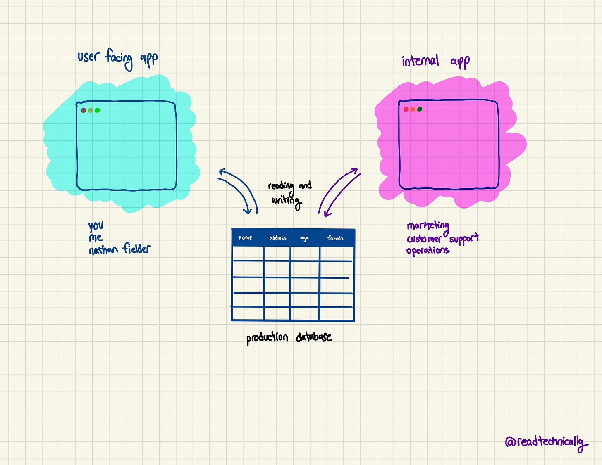

内部工程工具是指公司内部使用的软件和工具，用于帮助工程师更高效地完成工作。这些工具通常是定制化的，以满足公司的特定需求。本文介绍了内部工程工具的一些常见特点和使用场景。

Key points (关键点):

- 内部工程工具通常是定制化的，以满足公司的特定需求。
- 这些工具可以帮助工程师更高效地完成工作，例如自动化测试、代码审查、部署等。
- 内部工程工具的开发和维护需要大量的资源和精力，因此公司需要权衡利弊，决定是否值得投入。
- 一些公司会将内部工程工具开源，以便其他公司或个人也可以使用。
- 内部工程工具的使用场景包括：开发、测试、部署、监控、数据分析等。

---

Most of the stuff we’ve done here at Technically has focused on building applications **for users**: things like Twitter, Gmail, and Salesforce that people like us use most days. But a lot of code – potentially up to 30% of it – gets written for **internal use cases**, i.e. apps built by your teammates for your teammates.  

Those use cases span from basic tools like admin panels for updating your user information all the way to complex build tools for packaging your application before deployment.   

我们在Technically所做的大部分工作都集中在为用户构建应用程序上：像Twitter、Gmail和Salesforce这样像我们这样的人每天都在使用的东西。但是很多代码--可能高达30%--是为内部用例编写的，即由你的团队成员为你的团队成员建立的应用程序。这些用例涵盖了从更新用户信息的管理面板等基本工具，一直到部署前打包应用程序的复杂构建工具。

Chances are you’ve probably used at least one of these tools in your day to day. So what different types of internal tools are there? And how do they get built?  

你很可能在你的日常工作中至少使用过其中一个工具。那么，有哪些不同类型的内部工具？它们又是如何建立的呢？

_Thanks to my former employer [Retool](https://retool.com/?utm_source=sponsor&utm_medium=newsletter&utm_campaign=technically) for sponsoring this post!  

Retool helps teams build better internal tools faster with a drag and drop component editor, easy connections to your databases and APIs, and flexible access controls for companies of all sizes.  

感谢我的前雇主Retool对这篇文章的赞助!Retool帮助团队以更快的速度建立更好的内部工具，它有一个拖放组件编辑器，与你的数据库和API的简单连接，以及对各种规模的公司的灵活访问控制。_

Ah, the prototypical workhorse of internal tools: **the admin panel**.  

啊，内部工具的原型工作：管理面板。

The easiest way to think about the admin panel is as an _internal_ interface to your production database. Recall that most applications are built from two important pieces:  

思考管理面板的最简单的方法是把它作为你的生产数据库的内部接口。回顾一下，大多数应用程序都是由两个重要部分构成的：

1.  A **frontend** of HTML, CSS, and JavaScript that lays out the visual structure and interactivity of your app, and interfaces with the backend  
    
    一个由HTML、CSS和JavaScript组成的前端，奠定了你的应用程序的视觉结构和互动性，并与后端对接。
    
2.  A **backend** comprising the database, API endpoints sitting in front of it, and any other data-related logic hidden from your users  
    
    后台包括数据库、坐在它前面的API端点，以及任何其他对用户隐藏的数据相关逻辑。
    

That frontend is what you’re reading this post in right now if you’re on the web, and the backend is storing the content, your profile information, etc. Underneath it all lies a database, probably [a relational one](https://technically.substack.com/p/whats-a-relational-database), storing and managing all of the data needed to run your app.  

It probably has a users table, a table that stores payment information, and a table for the canonical unit of your app (a tee shirt listing, a post on Substack, etc.).  

如果你是在网络上，那么前端就是你现在正在阅读这篇文章的地方，而后端则是存储内容、你的个人资料信息等。在这一切之下是一个数据库，可能是一个关系型数据库，存储和管理运行你的应用程序所需的所有数据。它可能有一个用户表，一个存储支付信息的表，以及一个你的应用程序的典型单元的表（一件T恤衫的列表，Substack上的帖子，等等）。

The frontend for whatever app you’re using – be it Substack or Gmail – is designed around specific actions that users need to take. For Substack, those actions might be:  

你所使用的任何应用程序的前端--无论是Substack还是Gmail--都是围绕用户需要采取的特定行动而设计的。对于Substack来说，这些行动可能是：

-   Loading a post  
    
    加载一个帖子
    
-   Subscribing to a newsletter  
    
    订阅通讯
    
-   Searching through a newsletter’s archive  
    
    搜索通讯的档案
    
-   Changing your credit card information  
    
    改变你的信用卡信息
    

These are the things you want your users to be able to do, and so the frontend / APIs of your app are designed to facilitate said things.  

这些都是你希望你的用户能够做的事情，因此你的应用程序的前端/API被设计为促进上述事情。  

Loading a post reads post data from the DB, subscribing to a newsletter writes a new row into the DB, etc.   

加载一个帖子会从数据库中读取帖子数据，订阅一个通讯会在数据库中写入一个新行，等等。

In other words, your users need to interact with your database, but in **very specific and limited ways**. We don’t want them to be able to edit the information of other users, or see another user’s credit card info.  

换句话说，你的用户需要与你的数据库进行互动，但要以非常具体和有限的方式。我们不希望他们能够编辑其他用户的信息，或者看到其他用户的信用卡信息。

But that set of things that your users need to do is very different from what other teams at your company might need.  

但是，你的用户需要做的那套东西与你公司其他团队可能需要的东西非常不同。  

Your customer support team needs to be able to refund orders, see a user’s order history, change their address, etc.  

你的客户支持团队需要能够退还订单，看到用户的订单历史，改变他们的地址，等等。  

In other words, they need to interface with the database in different ways than your users, and this is where admin panels come in.  

换句话说，他们需要以不同于你的用户的方式与数据库对接，这就是管理面板的作用。

An **admin panel** is an internal frontend that lets your team members interact with your app’s database, usually to accomplish operational tasks like refunding orders, fixing bugs, changing profile information, seeing up to date sales numbers, etc.  

Here’s an example of an admin panel that lets a support team view and search users and orders, add a new one to the database, and edit their information:  

管理面板是一个内部前端，让你的团队成员与你的应用程序的数据库进行互动，通常是为了完成操作任务，如退款订单、修复错误、更改个人资料信息、查看最新的销售数字等。下面是一个管理面板的例子，让支持团队查看和搜索用户和订单，在数据库中添加一个新的用户，并编辑他们的信息：

This is only accessible to internal team members, so you’d never be able to see or use this as a user of the app.  

这只有内部团队成员可以访问，所以作为应用程序的用户，你永远无法看到或使用这个。

> 🧠 **Jog your memory** 🧠  
> 
> 🧠 唤醒你的记忆 🧠
> 
> [Authentication](https://technically.substack.com/p/how-does-authentication-work) is how you identify yourself to apps and software around the web.  
> 
> If you’re wondering how one might authenticate for an internal tool like this: it could either be gated behind username and password at a publicly accessible URL (e.g.  
> 
> adminpanel.substack.com), or could be hosted on a company’s internal servers inaccessible to the public, and you’d need to be on the company’s [VPN](https://technically.substack.com/p/whats-a-vpn) to access it.  
> 
> 认证是你如何在网络上的应用程序和软件中识别自己。如果你想知道一个人如何对这样的内部工具进行认证：它可以在一个可公开访问的URL（如adminpanel.substack.com）上用用户名和密码来控制，或者可以托管在一个公司的内部服务器上，公众无法访问，你需要在公司的VPN上才能访问它。
> 
> 🧠 **Jog your memory** 🧠  
> 
> 🧠 唤醒你的记忆 🧠

Pretty much every company in the universe has an admin panel like this if they’ve got users.  

宇宙中几乎每家公司如果有用户，都有一个这样的管理面板。  

At DigitalOcean we had a giant admin panel called Atlantis (everything was nautical themed) with literally thousands of actions you could take for each user (shut down their account, give them a discount, etc.).   

在DigitalOcean，我们有一个巨大的管理面板，叫做Atlantis（一切都以航海为主题），你可以为每个用户采取成千上万的行动（关闭他们的账户，给他们一个折扣，等等）。

Though ubiquitous, admin panels are far from the _only_ type of internal tools you’ll see engineers build. Command line tools, buttons to kick off scripts, a [CI/CD server](https://technically.substack.com/p/whats-cicd), you name it – these are all within the fray. I’ve found that a few basic distinctions can help break down all of the different tools you could reasonably expect to see:  

虽然无处不在，但管理面板远不是你看到的工程师建立的唯一类型的内部工具。命令行工具，启动脚本的按钮，CI/CD服务器，你的名字--这些都在战场上。我发现，一些基本的区别可以帮助分解所有不同的工具，你可以合理地期望看到：

Some internal tools are built _by engineers for non-engineers_, while others are built _by engineers for themselves_. Admin panels are usually built by engineers for non-engineers, who can’t interface directly with the database (i.e.  

don’t know SQL), and even if they could, want a cleaner interface for doing common admin tasks. Though the nomenclature is far from precise, another good example of a tool like this is a basic **dashboard** that shows the number of active users on a given day.  

一些内部工具是由工程师为非工程师建立的，而另一些是由工程师为自己建立的。管理面板通常是由工程师为非工程师建立的，他们不能直接与数据库对接（即不懂SQL），即使他们可以，也希望有一个更干净的界面来完成普通的管理任务。虽然名称远不准确，但这样的工具的另一个好例子是一个基本的仪表盘，显示某一天的活跃用户数。

Engineers build tons of internal tools for their own teams, too, and most of those tools will often not have a graphical user interface.  

工程师们也为他们自己的团队建立了大量的内部工具，而这些工具中的大多数往往没有图形用户界面。  

The definition of “tool” has some nuance here, but a few examples:  

在这里，"工具 "的定义有一些细微差别，但有几个例子：

-   CI/CD servers, tests, and workflows  
    
    CI/CD服务器、测试和工作流程
    
-   Scripts for building development environments  
    
    构建开发环境的脚本
    
-   Tools and workflows for access controls  
    
    访问控制的工具和工作流程
    
-   As companies get more advanced: ML model serving platforms, internal [Kubernetes](https://technically.substack.com/p/whats-kubernetes) interfaces, etc.  
    
    随着公司越来越先进：ML模型服务平台、内部Kubernetes接口等。
    

You use these tools via the command line, running scripts, etc. as opposed to navigating to a URL and seeing a bunch of buttons and tables.  

你通过命令行、运行脚本等来使用这些工具，而不是导航到一个URL，看到一堆按钮和表格。  

The bigger the company gets and the more engineers they have, the more of these kinds of tools will start popping up.  

公司越大，拥有的工程师越多，这类工具就会开始涌现。

The admin panel we looked at above is just an interface on top of a company’s database, following that good old frontend/backend paradigm we’ve talked about so much here at Technically.  

我们在上面看到的管理面板只是公司数据库上面的一个界面，遵循我们在《技术》杂志上经常谈到的那种古老的前端/后端范式。  

Other types of related internal tools like dashboards follow the same model.  

其他类型的相关内部工具如仪表盘也遵循同样的模式。

But not all internal tools are just reading from and writing to a database – many relate to **workflows**, where you need to make a few “things” happen in sequence.  

For example, you may have read the nicely formatted bulleted list above and wondered “what the hell is a script for building a development environment?” – and you of course trusted me to explain later. Well now it is later:  

但是，并不是所有的内部工具都只是从数据库中读写--许多工具与工作流程有关，你需要让一些 "事情 "按顺序发生。例如，你可能已经读了上面格式很好的列表，想知道 "构建开发环境的脚本到底是什么？"- 当然，你也相信我以后会解释。 那么现在就是以后了：

-   Developers work on the app and build new features on a local (on their computer) copy of the app, the actual live version of which lives in the cloud  
    
    开发人员在应用程序上工作，并在应用程序的本地（在他们的计算机上）副本上建立新的功能，而实际的实时版本则在云端。
    
-   To get that local app up and running, there’s a good deal of configuration involved  
    
    要使本地应用程序启动和运行，需要进行大量的配置工作
    
-   E.g. spinning up Docker containers, installing packages, making sure everything has the correct version, running tests  
    
    例如，启动Docker容器，安装软件包，确保一切都有正确的版本，运行测试。
    
-   At some point in the early company lifecycle, developers will package all of the requisite commands for the above into a single, nice file that you can run, making this all a lot easier  
    
    在公司早期生命周期的某个阶段，开发人员会将上述所有必要的命令打包成一个单一的、漂亮的文件，你可以运行，使这一切变得容易得多。
    

Is a script with 8 commands in sequence really a “tool?” And if not, what is a “tool?” Who can say for sure – certainly not me.  

一个有8个命令顺序的脚本真的是一个 "工具 "吗？如果不是，什么是 "工具"？谁能说得准呢--当然不是我。

If you’ve gotten this far you’re probably wondering why we’ve spent an entire issue of Technically talking about internal tools, and, my dear reader, your curiosity is valid.  

The answer is that (a) tons, probably somewhere around 30%, of developer time gets spent on these tools, and (b) they carry _very different_ constraints around how they’re built, maintained, and measured.   

如果你读到这里，你可能想知道为什么我们花了整整一期的《技术》杂志来讨论内部工具，亲爱的读者，你的好奇心是有道理的。答案是：（a）大量的，可能是30%左右的开发者时间花在了这些工具上，（b）它们在如何构建、维护和测量方面有着非常不同的限制。

I’ve heard it said that building software is a feedback loop consisting, roughly, of something like:   

我听到有人说，构建软件是一个反馈循环，大致包括以下内容：

We build something → we see what impact it has → we use that information to build something else → and so on and so forth   

我们建造一些东西→我们看看它有什么影响→我们用这些信息来建造其他东西→如此反复。

With internal tools, the mechanics of this loop are all out of whack relative to external facing applications.  

对于内部工具，相对于面向外部的应用，这个循环的机制都是不正常的。

The users of normal applications are external to the company, regular old joes like me or you or your roommate or your mom’s new friend Gary who seems to be around the house a lot.  

普通应用程序的用户是公司的外部人员，像我、你、你的室友或你妈妈的新朋友加里这样的普通老百姓，他似乎经常在家里。  

For internal tools, the users are, you guessed it, internal. This changes how the tools get built:  

对于内部工具，用户是，你猜对了，是内部。这就改变了这些工具的构建方式：

-   Smaller user base → more qualitative feedback, less quantitative  
    
    较小的用户群→更多的定性反馈，较少的定量反馈
    
-   In theory, less money at stake → fewer resources (more on this below)  
    
    从理论上讲，风险较小的资金→较少的资源（下面会有更多这方面的内容）。
    
-   Usually no product managers → engineers working directly with users  
    
    通常没有产品经理→工程师直接与用户工作
    
-   No alternatives → your internal users _must_ use the tool  
    
    没有替代品→你的内部用户必须使用该工具
    

For these and other reasons, internal tools can sometimes get a bad rep internally, i.e. as an engineer you’d hate to get stuck building internal stuff when you could be building external stuff.  

由于这些和其他原因，内部工具有时会在内部得到不好的评价，也就是说，作为一个工程师，当你可以建立外部的东西时，你会讨厌陷入建立内部的东西。  

There are a lot of exceptions to this – especially at larger companies, where internal tools can be groundbreaking and interesting stuff – but I’ve found it generally holds.  

这方面有很多例外--特别是在大公司，内部工具可能是突破性的、有趣的东西--但我发现这一点普遍成立。

Without a direct tie to growth and revenue, internal tools often struggle to get the same level of resourcing, care, and maintenance as your core, external application does.  

由于没有与增长和收入的直接联系，内部工具往往难以获得与你的核心、外部应用相同的资源、关怀和维护。  

If a company only has 120 engineering hours a week to allocate, it’s more likely that time goes to your actual app than the janky tool your customer support team uses to refund orders.  

如果一家公司每周只有120个工程小时可以分配，那么这些时间更有可能用于你的实际应用，而不是你的客户支持团队用来退单的古怪工具。

This creates a (sadly) vicious cycle where internal tools are often the bane of existence for teams that use them.  

这就形成了一个（可悲的）恶性循环，内部工具往往是使用它们的团队的生存祸根。  

Poorly designed UIs, buggy functionality, and slow updates are the norm, not the exception; because engineers are usually working on something else.  

设计不良的用户界面、有缺陷的功能和缓慢的更新是常态，而不是例外；因为工程师们通常在做别的事情。

If I build a new feature and 75% of my existing user base starts using it immediately, that's a decent signal (but not a perfect one) that building the feature was a good idea.  

如果我建立了一个新的功能，而75%的现有用户群立即开始使用它，这就是一个体面的信号（但不是一个完美的信号），表明建立这个功能是一个好主意。  

And maybe I’ll get promoted, and finally be able to afford an apartment with a bathroom!  

也许我会得到晋升，并最终能够买得起有浴室的公寓！"！

But how do you measure the success of your internal tools? Your internal users often have no choice but to use it, as there are no alternatives. Teams use proxies like [NPS](https://www.netpromoter.com/know/), qualitative research, or even amount of time spent using the app. None are perfect.  

但你如何衡量你的内部工具的成功？你的内部用户往往别无选择，只能使用它，因为没有替代品。团队使用NPS等代理，定性研究，甚至使用应用程序的时间量。没有一个是完美的。

Generally (very generally), engineering teams want their user-facing applications to be built with the most cutting edge technology and frameworks – faster, more reliable apps means happier users.  

一般来说（非常普遍），工程团队希望他们面向用户的应用程序是用最前沿的技术和框架构建的--更快、更可靠的应用程序意味着更快乐的用户。  

Today that probably means some combination of React or Vue on the frontend, Node / JavaScript on the backend, and maybe Rust or Go if you’re feeling fancy.  

今天，这可能意味着在前端使用React或Vue，在后端使用Node/JavaScript，如果你觉得花哨，也许还有Rust或Go的一些组合。  

Even if the initial application was built years ago on something older, newer parts will be built with newer frameworks, and sometimes teams will even migrate the entire app to a newer set of technology.  

即使最初的应用程序是在几年前建立在较旧的东西上，较新的部分也会用较新的框架来建立，有时团队甚至会将整个应用程序迁移到较新的技术集合。

For internal tools though, because of the resourcing and priority constraints, they’re often stuck on older tech like PHP, or whatever was around when the tool was built.  

There are also a few internal-admin specific frameworks tied to web frameworks like [DjangoAdmin](https://docs.djangoproject.com/en/4.0/ref/contrib/admin/) that (in theory) provide admin panel-like functionality out of the box. Low code solutions like [Retool](https://retool.com/?utm_source=sponsor&utm_medium=newsletter&utm_campaign=technically) are making it easier for engineers to build these tools faster without needing to set everything up from scratch.   

但对于内部工具来说，由于资源和优先级的限制，他们往往停留在像PHP这样的老技术上，或者是工具建立时的任何东西。也有一些内部管理的特定框架与DjangoAdmin等网络框架相联系，（理论上）提供类似管理面板的功能。像Retool这样的低代码解决方案使工程师更容易快速建立这些工具，而不需要从头开始设置一切。

_For more information and stats about how internal tools get built and what engineers think of them, I’d highly recommend checking out Retool’s [survey and report here](https://retool.com/blog/state-of-internal-tools-2021?utm_source=sponsor&utm_medium=newsletter&utm_campaign=technically). I wrote the first draft :)  

关于内部工具如何建立以及工程师对它们的看法的更多信息和统计资料，我强烈建议你查看Retool的调查和报告。我写了第一稿 :)_
