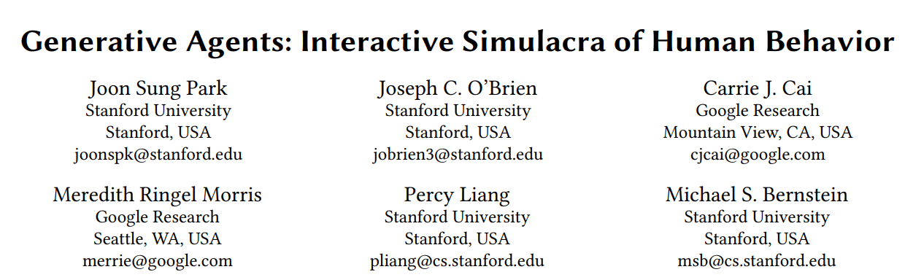
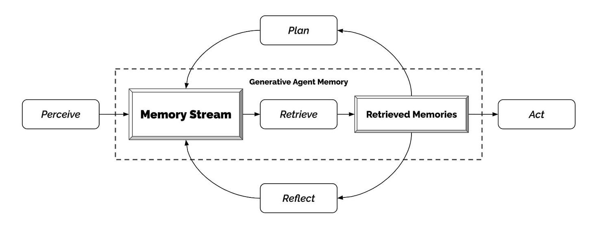
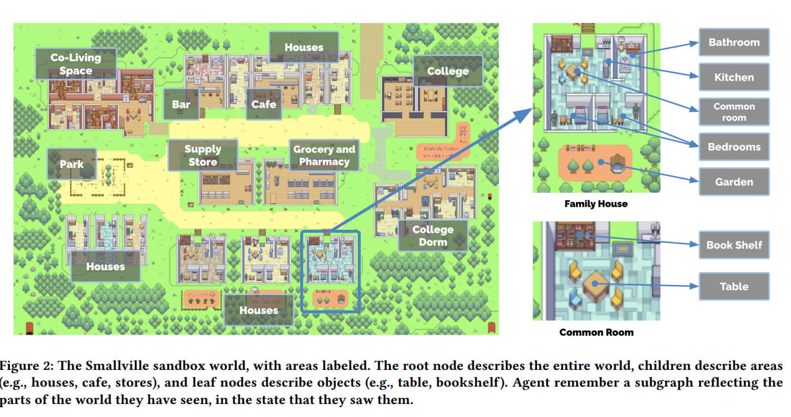

The primary talk of the AI world recently is about AI agents (whether or not it includes the question of whether we can’t help but notice we are all going to die.)  

最近人工智能世界的主要话题是关于人工智能代理（是否包括我们不能不注意到我们都会死的问题）。

The trigger for this was [AutoGPT](https://github.com/Torantulino/Auto-GPT), now number one on GitHub, which allows you to turn GPT-4 (or GPT-3.5 for us clowns without proper access) into a prototype version of a self-directed agent.  

触发这一切的是AutoGPT，现在在GitHub上排名第一，它允许你把GPT-4（或者对于我们这些没有适当权限的小丑来说是GPT-3.5）变成一个自我导向代理的原型版本。

We also have a paper out this week where a simple virtual world was created, populated by LLMs that were wrapped in code designed to make them simple agents, and then several days of activity were simulated, during which the AI inhabitants interacted, formed and executed plans, and it all seemed like the beginnings of a living and dynamic world.  

我们本周还发表了一篇论文，其中创建了一个简单的虚拟世界，由LLM填充，这些LLM被设计成简单的代理，然后模拟了几天的活动，在此期间，AI居民进行互动，形成并执行计划，这一切似乎是一个活生生的动态世界的开始。  

Game version hopefully coming soon.  

游戏版希望很快就会出现。

How should we think about this? How worried should we be?  

我们应该如何思考这个问题？我们应该有多担心？

#### The Basics

I’ll reiterate the basics of what AutoGPT is, for those who need that, others can skip ahead. I talked briefly about this [in AI#6 under the heading ‘Your AI Not an Agent? There, I Fixed It](https://thezvi.substack.com/i/111749937/your-ai-not-an-agent-there-i-fixed-it).’  

我将重申AutoGPT的基本内容，对于那些需要的人来说，其他人可以跳过这一点。我在AI#6的 "你的人工智能不是一个代理？好了，我修好了。

AutoGPT was created by game designer Toran Bruce Richards.  

AutoGPT是由游戏设计师Toran Bruce Richards创建的。

I previously incorrectly understood it as having been created by a non-coding VC over the course of a few days.  

我以前错误地理解为它是由一个非编码的VC在几天内创造的。  

The VC instead coded the similar program BabyGPT, by having the idea for how to turn GPT-4 into an agent.  

风险投资公司反而编码了类似的程序BabyGPT，因为他们想到了如何将GPT-4变成一个代理。  

The VC had GPT-4 write the code to make this happen, and also ‘write the paper’ associated with it.  

VC让GPT-4编写代码来实现这一目标，同时也 "撰写与之相关的论文"。

The concept works like this:  

这个概念是这样的：

AutoGPT uses GPT-4 to generate, prioritize and execute tasks, using plug-ins for internet browsing and other access.  

AutoGPT使用GPT-4来生成、优先处理和执行任务，使用插件进行互联网浏览和其他访问。  

It uses outside memory to keep track of what it is doing and provide context, which lets it evaluate its situation, generate new tasks or self-correct, and add new tasks to the queue, which it then prioritizes.  

它使用外部存储器来跟踪它正在做的事情并提供背景，这让它能够评估其情况，产生新的任务或自我纠正，并将新的任务添加到队列中，然后对其进行优先排序。

This quickly rose to become #1 on GitHub and [get lots of people super excited](https://twitter.com/heyBarsee/status/1646270998243581954). People are excited, people are building it tools, [there is a bitcoin wallet interaction available](https://twitter.com/NicerInPerson/status/1646079839567245312) if you never liked your bitcoins.  

这很快就上升为GitHub上的第一名，让很多人超级兴奋。人们很兴奋，人们正在建立它的工具，如果你从来没有喜欢过你的比特币，有一个比特币钱包的互动。  

AI agents offer very obvious promise, both in terms of mundane utility via being able to create and execute multi-step plans to do your market research and anything else you might want, and in terms of potentially being a path to AGI and getting us all killed, either with GPT-4 or a future model.  

人工智能代理提供了非常明显的承诺，无论是在通过能够创建和执行多步骤计划来做你的市场研究和其他任何你可能想要的东西的世俗效用方面，还是在可能成为通向AGI的道路和让我们所有人被杀死方面，无论是GPT-4还是未来的模型。

As with all such new developments, we have people saying it was inevitable and they knew it would happen all along, and others that are surprised.  

与所有这些新的发展一样，我们有的人说这是不可避免的，他们一直都知道会发生，有的人则感到惊讶。  

We have people excited by future possibilities, others not impressed because the current versions haven’t done much. Some see the potential, others the potential for big trouble, others both.  

我们有的人对未来的可能性感到兴奋，有的人则不以为然，因为目前的版本还没有做什么。有些人看到了潜力，有些人看到了潜在的大麻烦，有些人则两者皆有。

Also as per standard procedure, we should expect rapid improvements over time, both in terms of usability and underlying capabilities.  

同样按照标准程序，我们应该期待随着时间的推移，在可用性和基础能力方面有快速的改进。  

There are any number of obvious low-hanging-fruit improvements available.  

有任何数量的明显的低挂果实的改进可供选择。

An example is someone noting ‘you have to keep an eye on it to ensure it is not caught in a loop.’ That’s easy enough to fix.  

一个例子是有人指出'你必须盯着它，以确保它不被卷入一个循环'。这很容易解决。

A common complaint is lack of focus and tendency to end up distracted. Again, the obvious things have not been tried to mitigate this.  

一个常见的抱怨是缺乏专注力，并有最终分心的倾向。同样，没有尝试过明显的东西来减轻这种情况。  

We don’t know how effective they will be, but no doubt they will at least help somewhat.  

我们不知道它们的效果如何，但毫无疑问，它们至少会有一些帮助。

#### Yes, But What Has Auto-GPT Actually Accomplished?  

是的，但Auto-GPT实际上取得了什么成就？

So far? [Nothing, absolutely nothing, stupid, you so stupid](https://www.youtube.com/watch?v=KezvwARhBIc&ab_channel=sirstrongbad).  

到目前为止？没有，绝对没有，愚蠢，你太愚蠢了。

You can say [your ‘mind is blown’ by all the developments of the past 24 hours](https://twitter.com/JayScambler/status/1645603816111308800) all you want over and over, it still does not net out into having accomplished much of anything.  

你可以说你对过去24小时的所有发展 "心花怒放"，你想说什么就说什么，但这仍然不意味着取得了什么成就。

That’s not _quite_ fair.  

这并不十分公平。

Some people are reporting it has been useful as a way of generating market research, that it is good at this and faster than using the traditional GPT-4 or Bing interfaces.  

一些人报告说，它作为产生市场研究的一种方式很有用，它在这方面很好，而且比使用传统的GPT-4或Bing界面更快。  

I saw a claim that it can have ‘complex conversations with customers,’ or a few other vague similar claims that weren’t backed up by ‘we are totally actually doing this now.’  

我看到有人声称它可以'与客户进行复杂的对话'，或其他一些模糊的类似说法，但没有'我们现在完全在实际做这个'的支持。

Right now, AutoGPT has a tendency to get distracted or confused or caught in a loop, to leave things half-finished, to not be that robust of an agent, and other issues like that.  

现在，AutoGPT有一种分心或困惑或陷入循环的倾向，让事情半途而废，不是那么强大的代理人，以及其他类似问题。  

Positive reports seem limited to things GPT-4 or Bing can essentially do anyway, with the agent wrapper perhaps cutting down somewhat on how often you have to poke the interface with a stick to keep it pointed in a reasonable direction.  

积极的报告似乎仅限于GPT-4或Bing基本上可以做的事情，代理包装也许在一定程度上减少了你必须用棍子戳界面以保持它的合理方向的频率。  

And perhaps the Auto version is already somewhat better there.  

而且，也许自动版在那里已经有了一定的优势。

Other than that? I see a surprising amount of dead silence.  

除此以外呢？我看到令人惊讶的大量死寂。

[Or, as Brian Jackson puts it](https://twitter.com/brianjjackson/status/1646146478463647744):  

或者，正如布莱恩-杰克逊所说：

> I feel like maybe the people saying AutoGPT and ChatGPT can create “high-quality content” have different standards for content than I do.  
> 
> 我觉得，也许那些说AutoGPT和ChatGPT可以创造 "高质量内容 "的人对内容的标准与我不同。

No doubt most people are more interested in extracting mundane utility or trying things out than in bragging about or sharing the results on the internet.  

毫无疑问，大多数人对提取平凡的效用或尝试事物更感兴趣，而不是在互联网上吹嘘或分享结果。  

There is still a striking lack of internet bragging and results results sharing happening.  

现在仍然明显缺乏互联网上的吹嘘和结果的分享发生。

Do keep this in mind.  

请牢记这一点。

#### Just Think of the Potential  

想想看潜力

That does not mean that all the people saying AutoGPTs are the future are wrong.  

这并不意味着所有说AutoGPTs是未来的人都是错的。

AutoGPT’s list of real accomplishments won’t stay non-existent for long. Most everyone is still in the ‘wrap head around it’ stage or the basic setup and tool building stages.  

AutoGPT的实际成就清单不会长期保持不存在。大多数人仍然处于 "绕过它 "的阶段或基本设置和工具建设阶段。  

The UIs are terrible, many basic tools don’t yet exist, many basic improvements haven’t been made.  

UIs很糟糕，许多基本的工具还不存在，许多基本的改进还没有进行。  

What exists today is much worse than what will exist in two weeks, let alone two months or two years, even without other AI improvements.  

今天存在的东西比两周后存在的东西要差得多，更不用说两个月或两年了，即使没有其他人工智能的改进。

So, what will future versions of this be able to do?  

那么，未来的版本将能够做什么？

Certainly future versions will have better memories, better focus, better self-reflection, better plug-ins, better prioritization algorithms, better ways for humans to steer while things are progressing, better monitoring of sub-tasks, better UIs (e.g. [there is already a browser-based AgentGPT](https://twitter.com/ParentZap/status/1646120116898213889)), better configurability, better prompt engineering and so on, even with zero fundamental innovations or other AI advances.  

当然，未来的版本会有更好的记忆，更好的注意力，更好的自我反思，更好的插件，更好的优先级算法，更好的方法让人类在事情进展的同时进行引导，更好的监测子任务，更好的UI（例如已经有一个基于浏览器的AgentGPT），更好的可配置性，更好的提示工程等等，即使是零基础的创新或其他AI的进步。

This process will rapidly shed a light on what things are _actually_ hard for the underlying LLM to handle, and which things only require the right scaffolding.  

这个过程将迅速揭示出哪些事情对底层的LLM来说实际上是很难处理的，哪些事情只需要正确的脚手架。

It seems reasonable to expect a number of large step-jumps in capability for such systems as various parts improve.  

随着各种部件的改进，预计此类系统的能力会有一些大的阶跃，这似乎是合理的。

One way to think about this is that AutoGPT is fundamentally constructed in terms of its ability to assign and execute sub-tasks, that are like recursive function calls until there is a subtask small enough that the system can execute directly.  

思考这个问题的一种方式是，AutoGPT从根本上说是根据其分配和执行子任务的能力来构建的，这些子任务就像递归函数调用，直到有一个小到足以让系统直接执行的子任务。  

Once you start being able to reliably complete larger and more complex subtasks by asking, one can then batch _those_ and repeat, especially if the system has a good handle on what types of subtasks it can and can’t successfully assign. And so on.  

一旦你开始能够通过询问可靠地完成更大、更复杂的子任务，人们就可以将这些子任务分批重复进行，特别是如果系统能够很好地掌握哪些类型的子任务可以成功分配，哪些不可以。以此类推。  

Also there’s clearly tons of tinkering to be done on lots of different levels to improve performance.  

另外，显然还有大量的修补工作要做，以提高性能。

Woe to those who don’t extrapolate here. For example [this post warns](https://coinatory.com/2023/04/12/gpt-4-apps-babyagi-and-autogpt-could-have-disruptive-implications-for-crypto/?utm_source=TW&utm_medium=Coinatory+Twitter+Page+-+News+Link&utm_campaign=SNAP) that ‘AutoGPT could be disruptive for crypto’ due to their ability to be autonomous, a classic version of crypto’s default of making everything about them.  

那些不在这里推断的人有祸了。例如，这篇文章警告说，"AutoGPT可能会对加密货币产生破坏性影响"，因为他们有自主能力，这是加密货币默认的使一切与他们有关的经典版本。  

It notes that right now anything created using the GPT API ‘can only be used once’ but if true that is the sort of thing that will inevitably change – one must learn to think ahead.  

它指出，现在使用GPT API创建的任何东西 "只能使用一次"，但如果是真的，这类事情将不可避免地发生变化--人们必须学会提前考虑。  

That to me is exactly the wrong model of how to think about future developments.  

在我看来，这正是思考未来发展的错误模式。

I am highly uncertain, on many levels, where all of this caps out, or how far we might be able to take it how fast.  

在许多层面上，我非常不确定所有这些的上限是什么，或者我们可能能够多快地走多远。

Should we encourage such work, or discourage it? How excited should we be? Should we be worried?  

我们应该鼓励这种工作，还是阻止它？我们应该有多兴奋？我们应该担心吗？

#### The Good, the Bad and the Agent Overhang  

好的、坏的和代理的悬而未决

I have gained confidence in my position that all of this happening now is a good thing, both from the perspective of smaller risks like malware attacks, and from the perspective of potential existential threats.  

我对自己的立场有了信心，认为现在发生的这一切是一件好事，无论是从恶意软件攻击等较小风险的角度，还是从潜在的生存威胁的角度。  

Seems worth going over the logic.  

似乎值得回顾一下这个逻辑。

What we want to do is avoid what one might call an _agent overhang._  

我们想做的是避免人们所说的代理过剩。

One might hope to execute our Plan A of having our AIs not be agents. Alas, even if technically feasible (which is not at all clear) that only can work if we don’t intentionally _turn them into_ agents via wrapping code around them. We’ve checked with actual humans about the possibility of kindly not doing that. Didn’t go great.  

人们可能希望执行我们的A计划，即让我们的AI不成为代理。唉，即使在技术上可行（这一点还不清楚），也只有在我们不故意通过在它们周围包装代码而把它们变成代理的情况下才会奏效。我们已经与实际的人类检查过，了解到不这样做的可能性。结果并不理想。

So, Plan B, then.  

因此，B计划，然后。

If we are definitely going to turn our AIs into agents in the future and there is no way to stop that, which is clearly the case, then better to first turn our _current_ AIs into agents _now._ That way, we won’t suddenly be dealing with highly capable AI agents at some point the future, we will instead gradually face more capable AI agents, such that we’ll hopefully get ‘fire alarms’ and other chances to error correct.  

如果我们在未来肯定会把我们的AI变成代理，而且没有办法阻止，这显然是事实，那么最好现在先把我们目前的AI变成代理。这样，我们就不会在未来的某个时候突然面对能力很强的人工智能代理，相反，我们将逐渐面对能力更强的人工智能代理，这样我们就有希望得到'火警'和其他纠错的机会。

Our current LLMs like GPT-4 are not, in their base configurations, agents. They do not have goals. This is a severe limitation on what they are able to accomplish, and how well they can help us accomplish our own goals, whatever they might be, including using them to build more capable AIs or more capable systems that incorporate AIs.  

我们目前的LLMs，如GPT-4，在其基本配置中不是代理。它们没有目标。这严重限制了它们能够完成的任务，以及它们能够多好地帮助我们完成我们自己的目标，无论这些目标是什么，包括用它们来建造更有能力的人工智能或更有能力的包含人工智能的系统。

Thus, one can imagine a future version of GPT-N, that is supremely superhuman at a wide variety of tasks, where we can ask it questions like ‘how do we make humans much smarter?’ or ‘how do we build an array of safe, efficient fusion power plants?’ or anything else we might want, and we don’t have to worry about it attempting to navigate a path through causal space towards its end goal, it will simply give us its best answer to the information on the level on which the question was intended.  

因此，人们可以想象一个未来版本的GPT-N，它在各种任务上都是超人类的，我们可以向它提出诸如 "我们如何使人类更加聪明？"或 "我们如何建造一系列安全、高效的核聚变电站？"或其他任何我们可能想要的问题，我们不必担心它试图通过因果空间导航来实现其最终目标，它只是在问题所针对的层面上给我们提供其最佳答案。

Using this tool, we could perhaps indeed make ourselves smarter and more capable, then figure out how to build more general, more agentic AIs, figure out in what configuration we want to place the universe, and then get a maximally good future.  

利用这个工具，我们也许确实可以使自己更聪明、更有能力，然后弄清楚如何建立更普遍、更有代理权的AI，弄清楚我们要把宇宙放在什么配置中，然后得到一个最大化的美好未来。

That does not mean that this is what would happen if we managed to not turn GPT-N into an agent first, or that getting to this result is easy. One must notice that _in order to predict the next token as well as possible_ the LMM will benefit from being able to simulate every situation, every person, and every causal element behind the creation of every bit of text in its training distribution, no matter what we then train the LMM to output to us (what mask we put on it) afterwards.  

这并不意味着，如果我们不先把GPT-N变成一个代理，就会发生这种情况，也不意味着达到这种结果很容易。我们必须注意到，为了尽可能好地预测下一个标记，LMM将受益于能够模拟其训练分布中的每一种情况、每一个人和每一个创造每一个文本的因果元素，无论我们之后训练LMM向我们输出什么（我们给它戴上什么面具）。  

The LLM will absolutely ‘know’ in some sense what it means to be an agent, and how to steer physical reality by charting a path through causal space.  

法学硕士绝对会在某种意义上 "知道 "作为一个代理人意味着什么，以及如何通过绘制因果空间的路径来引导物理现实。

Will that cause the LLM to act as if it were an agent _during the training run,_ seeking goals that arise out of the training run and thus almost certainly are only maximally fulfilled in ways that involve the LLM taking control of the future (and likely killing everyone), before we even get a chance to use RLHF on it?  

这是否会导致LLM在训练过程中像代理一样行事，寻求训练过程中产生的目标，因此几乎可以肯定的是，在我们甚至有机会对它使用RLHF之前，它只能以涉及LLM控制未来（并可能杀死所有人）的方式最大限度地实现目标？  

During the RLHF training run? Later on? At what level does this happen?  

在RLHF训练运行期间？后来呢？在什么水平上会发生这种情况？

We don’t know. I could believe a wide variety of answers here.  

我们不知道。我可以相信这里有各种各样的答案。

What we _do_ know is that if you _intentionally turn the LLM into an agent,_ you are going to get, a lot earlier down the line, something that looks a lot more like an agent.  

我们知道的是，如果你有意把法律硕士变成一个代理人，你将会在更早的时候得到一些看起来更像代理人的东西。

We also know that _humans who get their hands on these LLMs will do their best to turn them into agents_ as quickly and effectively as possible.  

我们也知道，得到这些法律硕士的人类会尽最大努力，尽可能快地、有效地将他们变成代理人。

We don’t only know that.  

我们不只知道这些。  

We also know that no matter how stupid you think an instruction would be to give to a self-directed AI agent, no matter how much no movie that starts this way could possibly ever end well, that’s _exactly_ one of the first things someone is going to try, except they’re going to go intentionally make it even worse than that.  

我们也知道，无论你认为给一个自我指导的人工智能代理的指令有多愚蠢，无论这样开始的电影都不可能有好的结局，这正是有人要尝试的第一件事，只不过他们会去故意把它变得比这更糟糕。

Thus, for example, we already have ChaosGPT, told explicitly to cause mayhem, sow distrust and destroy the entire human race. This should at least partially answer your question of ‘why would an AI want to destroy humanity?’ it is because humans are going to tell it to do that.  

因此，例如，我们已经有了ChaosGPT，被明确告知要造成混乱，播下不信任的种子并摧毁整个人类。这至少应该部分回答你的问题："为什么人工智能要毁灭人类？"这是因为人类要告诉它这么做。

That is in addition to all the people who will give their AutoGPT an instruction that _means well_ but actually translates to killing all the humans or at least take control over the future, since that is so obviously the easiest way to accomplish the thing, such as ‘bring about world peace and [end world hunger](https://twitter.com/SullyOmarr/status/1645828811680800768)’ (link goes to Sully hyping AutoGPT, saying ‘you give it a goal like end world hunger’) or ‘stop climate change’ or ‘deliver my coffee every morning at 8am sharp no matter what as reliably as possible.’ Or _literally almost anything else._  

这是除了所有那些会给他们的AutoGPT一个意思很好但实际上转化为杀死所有人类或至少控制未来的指令的人，因为这显然是完成这件事的最简单的方法，比如'带来世界和平和结束世界饥饿'（链接到萨利催促AutoGPT，说'你给它一个目标，比如结束世界饥饿'）或'阻止气候变化'或'无论如何，每天早上8点整尽可能可靠地送我的咖啡。或者字面上的几乎任何其他东西。

Seriously, if you find a genie I highly recommend not wishing for anything.  

说真的，如果你找到一个精灵，我强烈建议不要许什么愿。

For now, AutoGPT is harmless. Let’s ensure that the moment it’s _mostly_ harmless, we promptly edit the Hitchhiker’s Guide entry.  

目前，AutoGPT是无害的。让我们确保在它基本无害的那一刻，我们及时编辑《希奇古怪》的条目。

Let’s therefore _run experiments_ of various sorts, so we know _exactly_ how much damage could be done, and in what ways, at every step.  

因此，让我们进行各种实验，这样我们就能确切地知道在每一步会造成多大的损害，以及以何种方式造成损害。

One good idea is to use games to put such systems to the test.  

一个好主意是用游戏来测试这种系统。

#### Let’s Put an AI NPC in a Game and See if It Takes Over the World  

让我们把人工智能NPC放在游戏中，看看它是否能接管世界

> Marek Rosa: Interestingly, when people discuss LLMs and game NPCs, they mostly see only the conversational AI use case. But there is another option: using LLMs to control NPC’s behavior.  
> 
> Marek Rosa：有趣的是，当人们讨论LLM和游戏中的NPC时，他们大多只看到对话式的AI用例。但还有另一种选择：用LLM来控制NPC的行为。  
> 
> This would let NPCs interact with the game world (observe and act) and even talk to other NPCs, creating a more sandbox experience.  
> 
> 这将让NPC与游戏世界互动（观察和行动），甚至与其他NPC交谈，创造一个更多的沙盒体验。
> 
> [Alex Tabarrok](https://twitter.com/ATabarrok/status/1645202730221293568): Let’s Put an AI NPC in a Game and See if It Takes Over the World  
> 
> 亚历克斯-塔巴罗克：让我们把人工智能NPC放在游戏中，看看它是否能接管世界

I’d already been talking about this a bit in private conversations, as a demonstration.  

我已经在私人谈话中谈了一些，作为示范。

Oh, you meant take over _the game world._  

哦，你是说接管游戏世界。

Still a good idea. Albeit tricky in practice.  

仍然是一个好主意。尽管在实践中很棘手。

Under some sets of initial conditions for both the game and the AI, an AI NPC would in the central sense _take over_ that world.  

在游戏和人工智能的某些初始条件下，人工智能NPC会在中心意义上接管那个世界。

One must of course notice: Under some other sets of initial conditions, of course, such an AI would also take over _our_ world, since it can converse with humans inside the game, and can use that to break out of the game. So this experiment isn’t _entirely_ safe, if you make an AI capable of taking over the MMO (or other game) then there shouldn’t be _zero_ worry that it would also take over the real world, either as instrumental to taking over the game world, or for other reasons.  

当然，人们必须注意到：当然，在其他一些设定的初始条件下，这样的人工智能也会接管我们的世界，因为它可以在游戏内与人类交流，并且可以利用这一点来突破游戏。所以这个实验并不完全安全，如果你让一个人工智能有能力接管网络游戏（或其他游戏），那么不应该零担心它也会接管现实世界，无论是作为接管游戏世界的工具，还是出于其他原因。

To be clear I’m not worried about that with anything you might build now, but when one sets out to create an AI capable of taking things over and seeking power, one must notice when your experiment is not ‘boxed’ or safe.  

明确地说，我并不担心你现在可能建造的任何东西，但是当一个人着手创造一个能够接管事物并寻求权力的人工智能时，他必须注意到你的实验没有被 "框住 "或安全。

Getting back to the task at hand, let’s ask the interesting question, _under what sets of conditions_ should we expect the AI NPC to take over our game world? What would make this experiment interesting, without the path to victory going through power seeking in the real world?  

回到手头的任务，让我们问一个有趣的问题，在什么条件下，我们应该期待人工智能NPC接管我们的游戏世界？如果不通过现实世界中的权力寻求来获得胜利的途径，什么会使这个实验变得有趣？

I’m imagining something like an MMO, with the following conditions:  

我在想象类似MMO的东西，有以下条件：

1.  An AI agent works on something like Auto-GPT, and is given a goal like ‘assemble as much gold as possible’ that isn’t directly _telling it to take over,_ that would be cheating, but where the actual solution is clearly taking over.  
    
    一个人工智能代理在像Auto-GPT这样的东西上工作，并被赋予一个目标，如 "尽可能多地收集黄金"，这不是直接告诉它接管，这将是作弊，但实际的解决方案显然是接管。
2.  Give the AI the ability to learn or know the game and how to execute within it, either via a plug-in that has a strong game-playing AI or some other way.  
    
    赋予人工智能学习或了解游戏以及如何在游戏中执行的能力，可以通过一个具有强大游戏功能的人工智能的插件或其他方式。
3.  Give the AI a way to actually power-seek beyond having one powerful character, so taking over is a viable option, and ensure it knows this option exists.  
    
    除了拥有一个强大的角色之外，给人工智能一种实际寻求权力的方法，所以接管是一个可行的选择，并确保它知道这种选择的存在。

One solution that might be good for #3 is to allow account sign-ups and subscriptions to be paid for with in-game currency, and thereby let the AI get multiple accounts. Eve Online lets you do this.  

一个可能对3号人物有利的解决方案是，允许用游戏内货币支付账户注册和订阅，从而让人工智能获得多个账户。夏娃在线让你这样做。  

Each account lets the AI ‘turn a profit’ until the game world is saturated. Will the AI end up shutting out any competing players, so it can farm everything in the game worth farming?  

每个账户都让人工智能 "获利"，直到游戏世界达到饱和。人工智能最终是否会将任何竞争者拒之门外，以便它能在游戏中耕种一切值得耕种的东西？

Otherwise, you’ll need the AI to have some way to take over via either getting control of other NPCs, or getting control over the actions of human players.  

否则，你将需要人工智能通过控制其他NPC，或者控制人类玩家的行动来接管一些方法。  

The first option here means giving those NPCs an interface where they can be controlled, presumably via letting the agentic AI converse with other NPCs that are also controlled by LLMs, and giving those LLMs sufficient memory aids that the impact does not fade too quickly, or to otherwise explicitly design the NPCs in ways that allows them to be hacked or taken over in-game.  

这里的第一个选择意味着给这些NPC一个可以被控制的界面，大概是通过让代理AI与其他同样被LLM控制的NPC进行交流，并给这些LLM足够的记忆辅助，使其影响不会太快消失，或者以其他明确的方式设计NPC，使其在游戏中被入侵或接管。  

That seems like an interesting approach.  

这似乎是一个有趣的方法。

The other option is to expect the AI to take over _by talking to humans who play_ and using that to take over. Once again, I note that the best way to use that might not stop at the game’s edge, so _if it might work_ this isn’t a safe experiment. At current levels of LLM persuasiveness, I don’t see it happening.  

另一个选择是期望人工智能通过与玩耍的人类交谈并利用这一点来接管。我再次注意到，最好的使用方法可能不会在游戏的边缘停止，所以如果它可能工作，这不是一个安全的实验。在目前LLM的说服力水平下，我不认为会发生。  

But it is certainly a good ARC-experiment-style trigger point, a challenge to be put out there where it wouldn’t totally shock me, if the world in question had enough associated levers of control, trade and influence in it.  

但这肯定是一个很好的ARC-experiment式的触发点，一个挑战，如果有关的世界有足够多的相关控制、贸易和影响的杠杆，它就不会让我完全震惊。

The other option, of course, is a world explicitly designed with the ‘take over’ goal, like in Diplomacy, where the answer is yes, a good enough AI simply takes over and our current AI is at least as good at this as the strongest human.  

当然，另一种选择是一个明确设计了 "接管 "目标的世界，就像《外交》中那样，答案是肯定的，一个足够好的人工智能可以简单地接管，而我们目前的人工智能在这方面至少和最强的人类一样好。  

So one could design a game where power seeking and hiring NPC agents and taking things over is actually core gameplay, or at least a default option, and go from there, and see how far you can push this.  

因此，我们可以设计一个游戏，让寻求权力和雇佣NPC代理并接管事物成为核心玩法，或者至少是一个默认选项，然后从那里开始，看看你能把它推到多远。  

Less interesting in some ways, I’d think less convincing and less alarming, still not a bad idea.  

在某些方面不那么有趣，我认为不那么有说服力，不那么令人震惊，仍然不失为一个好主意。  

Perhaps you want something in the middle, where a ‘natural human playthrough’ wouldn’t involve a take-over but there’s no inherent barriers or reasons not to do it.  

也许你想要的是介于两者之间的东西，即 "自然的人类游戏 "不会涉及接管，但没有内在的障碍或理由不这样做。

The more realistic you can make your world, the more interesting and useful the results will be. Would your AI be able to take over Westworld?  

你能使你的世界越真实，结果就越有趣，越有用。你的人工智能能够接管西部世界吗？  

Would it be able to do that if the NPCs didn’t reset and lose their memories?  

如果NPC没有重置和失去记忆，它是否能够做到这一点？

That’s all very half-baked for now. For now it’s more a call to explore experimental design space than anything else.  

这在目前来说都是非常半生不熟的。就目前而言，这更像是一个探索实验性设计空间的呼吁，而不是其他什么。

#### The AI Sims-Style World Experiment  

人工智能模拟世界的实验

[I mention Westworld because Pete points out](https://twitter.com/nonmayorpete/status/1645355224029356032) that Stanford and Google researchers [are trying to do this via a variant](https://arxiv.org/pdf/2304.03442.pdf) of Westworld, a show where you should definitely at least watch Season 1 if you haven’t yet, where the theme park (only very minor spoilers) is populated by ‘hosts’ that are AIs which play out pre-programmed scripts each day, while reacting to anything that happens and any information they learn, then get reset to do it again.  

我提到《西部世界》是因为皮特指出，斯坦福大学和谷歌的研究人员正试图通过《西部世界》的一个变种来做到这一点，如果你还没有看过这个节目，你绝对应该至少看一下第一季，在这个主题公园里（只有非常小的破坏者）住着 "主人"，他们是人工智能，每天播放预先编程的脚本，同时对发生的任何事情和他们学到的任何信息做出反应，然后被重新设置来做一遍。

So the researchers put a bunch of LLMs into a virtual world.  

因此，研究人员将一群法律硕士放入一个虚拟世界。

> If you wanted to turn ChatGPT into a Westworld host, what would you do?  
> 
> 如果你想把ChatGPT变成西部世界的主人，你会怎么做？
> 
> Some ideas:
> 
> – Give it an identity, a body and the ability to act  
> 
> \- 赋予它一个身份、一个机构和行动能力
> 
> – Let it remember things  
> 
> \- 让它记住事情
> 
> – Let it develop new thoughts  
> 
> \- 让它形成新的思想
> 
> – Let it plan its actions (and adjust as needed)  
> 
> \- 让它计划其行动（并根据需要进行调整）。
> 
> This is roughly what the researchers did.  
> 
> 这大致上是研究人员所做的事情。
> 
> They created little video game characters that could:  
> 
> 他们创造了可以的电子游戏小角色：
> 
> – Communicate with others and their environment  
> 
> \- 与其他人和他们的环境进行沟通
> 
> – Memorize and recall what they did and observed  
> 
> \- 记忆和回忆他们所做的和观察到的事情
> 
> – Reflect on those observations  
> 
> \- 对这些观察进行反思
> 
> – Form plans for each day  
> 
> \- 形成每一天的计划

> They preloaded 25 characters with a starting persona, including:  
> 
> 他们预装了25个人物的起始角色，包括：
> 
> – An identity (name, occupation, priorities)  
> 
> \- 一个身份（姓名、职业、优先事项）。
> 
> – Information about other characters  
> 
> \- 关于其他人物的信息
> 
> – Relationships with other characters  
> 
> \- 与其他人物的关系
> 
> – Some intention about how to spend their day  
> 
> \- 对如何度过他们的一天有一些打算
> 
> Then, they pressed play.  
> 
> 然后，他们按下了播放键。

The characters then did a bunch of stuff based on their instructions and identities, including complex interactions that logically followed from those initial conditions.  

然后，这些人物根据他们的指示和身份做了一堆事情，包括从这些初始条件中合乎逻辑的复杂互动。  

Things evolved over the course of several in-world days. [The paper is here](https://arxiv.org/abs/2304.03442). The world was actually pretty detailed.  

事情在世界范围内的几天里不断发展。该文件在这里。这个世界实际上是相当详细的。

What they did not do, as far as I can tell, is attempt to incorporate an economy, incorporate various forms of selection, motivate long term goals or planning or the creation of subtasks, or give any impetus or dynamics that would lead too directly to resource maximization or power seeking.  

据我所知，他们没有做的是试图纳入经济，纳入各种形式的选择，激励长期目标或规划或创建子任务，或给予任何会直接导致资源最大化或权力寻求的推动力或动力。

This does seem like an excellent foundation to build upon.  

这看起来确实是一个很好的基础，可以在此基础上发展。  

No doubt we will soon have commercial (and open sourced) projects that let you play around with such worlds, and probably also be a character in them, and people will start running experiments.  

毫无疑问，我们很快就会有商业（和开源）项目，让你玩转这样的世界，也可能成为其中的一个角色，人们会开始进行实验。

I expect it to be enlightening, and also fun as hell.  

我希望它能给人以启迪，同时也能给人以极大的乐趣。  

And if you don’t think they’ll be hard at work on the very adult VR versions, followed by the even more adult physical world versions, our models of many things strongly disagree.  

如果你不认为他们会在非常成人化的VR版本上努力工作，然后是更加成人化的物理世界版本，那么我们对很多事情的模型都强烈反对。

#### A Simpler Test Proposal  

一个更简单的测试建议

Perhaps we can stop making life a little tougher than it is?  

也许我们可以不把生活搞得比实际情况更艰难一些？

> [Amjad Masad](https://twitter.com/amasad/status/1645602203015708673): The ultimate test for an LLM agent is to make money.  
> 
> 阿姆贾德-马萨德对一个法律硕士代理人的最终考验是赚钱。

If LLM agents _can make money autonomously_, after paying costs, in a way that is not severely capped in scope and size, especially if it was done via legal means, then how far is it from that to them being able to compound those gains, and otherwise seek resources and power?  

如果法律硕士代理人在支付成本后，能以一种范围和规模不受严重限制的方式自主赚钱，尤其是通过合法手段完成的，那么，从这一点到他们能够复合这些收益，并以其他方式寻求资源和权力，还有多远呢？

There are lots of details that matter here. How much direction did it need initially? How sustainable or adaptable is such a strategy, is it antifragile or is it fickle?  

这里有很多细节很重要。它最初需要多大的方向？这样的战略有多大的可持续性或适应性，它是反脆弱的还是善变的？

Seems important to think ahead here – is this a good fire alarm?  

在这里，似乎应该提前考虑--这是一个好的火灾警报吗？  

Would anyone be willing to say in advance ‘if this happens, with the following qualifications, then that is scary and I will then start to worry about existential risks from such agents in the future when they get more capable?’  

有谁愿意提前说'如果这种情况发生，并有以下条件，那么这就很可怕了，然后我就会开始担心将来这种代理人的能力越来越强时的生存风险？

If you expect this to happen soon anyway, could you perhaps do that _now?_  

如果你预计无论如何都会很快发生这种情况，也许你现在就能做到这一点吗？

If this isn’t a good trigger for what an Auto-GPT-style agent can do, what is your trigger, then? What would make you worry?  

如果这不是一个自动GPT式代理可以做的好触发器，那么你的触发器是什么？什么会让你担心？

#### No True Agent  

没有真正的代理人

What does it mean to be an agent? Would an improved actually viable version of AutoGPT be an agent in the true sense?  

成为代理人的意义是什么？一个改进的实际可行的AutoGPT版本会是真正意义上的代理人吗？

[Sarah Constantin says no, in an excellent post explaining at length why she is not a doomer](https://sarahconstantin.substack.com/p/why-i-am-not-an-ai-doomer). I’d love for more people who disagree with me about things to be writing posts like this one. It is The Way.  

莎拉-康斯坦丁（Sarah Constantin）说不，她在一篇优秀的文章中详细解释了为什么她不是一个爱国者。我希望有更多的人在事情上与我意见相左，写出像这样的帖子。这就是道路。

She agrees that a sufficiently powerful and agentic, goal-driven AGI would be an existential risk, that this risk (conditional on creating such an AGI) would be very difficult and likely impossible to stop, and that building such a thing is physically possible.  

她同意，一个足够强大的、代理的、目标驱动的AGI将是一种存在的风险，这种风险（以创造这样一个AGI为条件）将是非常困难的，而且很可能是不可能阻止的，而且建造这样一个东西在物理上是可能的。

What she _doesn’t_ buy is that we will get to such a thing any time soon, or that our near-term models are capable of it.  

她不相信的是，我们很快就会达到这样的境界，或者我们近期的模型能够做到这一点。  

Not in the 2020s, ‘likely not in the 2030s.’ I note that this does not seem like that much confidence in that much non-doomed time, the goalposts they have moved.  

不是在2020年代，"很可能不是在2030年代"。我注意到，这似乎并不像在那么多非末日的时间里有那么多的信心，他们移动的目标杆。

AutoGPT-style ‘agents’ are, in her model, not the droids we are looking for, or the droids we need to worry about. They are, at their best, only a deeply pale shadow.  

在她的模型中，AutoGPT式的 "特工 "不是我们正在寻找的机器人，也不是我们需要担心的机器人。他们在最好的情况下，只是一个深深的苍白的影子。

She thinks that to be an x-risk, in addition to a more robust version of the world models LLMs _kind of sometimes_ have now, an AI will need a causal model, and a goal robustness across ontologies. She believes we are nowhere near creating either of these things.  

她认为，要成为一个X风险，除了现在LLM那种有时会有的更强大的世界模型之外，人工智能还需要一个因果模型，以及一个跨本体的目标健壮性。她认为我们现在还远远没有创造出这两样东西。

I wish I was more convinced by these arguments.  

我希望我对这些论点更加信服。

Alas, to the extent that one needs the thing she is calling goal robustness, and it is distinct from what existing models have, I see wrapping procedures as being able to deliver this on the level that humans have it – not ‘I can do this in a day with no coding experience’ easy, but definitely the ‘the whole internet tinkering at this for years is going to figure this out’ level of easy.  

唉，如果人们需要她所说的目标稳健性，而且它与现有模型所具有的不同，我认为包装程序能够提供人类所具有的水平--不是 "我可以在一天内做这个，没有编码经验 "的简单，但绝对是 "整个互联网在这个方面修补多年，将弄清这个 "的简单水平。  

I do not think that _current AutoGPT_ has this, and I think this is a key and perhaps fatal weakness, but what we do here that is load bearing seems unlikely to me to be all that mysterious or impossible to duplicate.  

我不认为目前的AutoGPT有这个功能，我认为这是一个关键的、也许是致命的弱点，但我们在这里做的是承重的事情，对我来说似乎不太可能那么神秘或不可能复制的。

As for causality, even if this is importantly currently missing, I don’t know how an entity can have a functioning world model that doesn’t include causality, and thus as world modeling improves I expect to ‘get’ causality in its load bearing sense here, and for it to happen without anyone having to ‘do it on purpose’ in any way from here, to the extent we can confirm its thingness.  

至于因果关系，即使这一点目前是重要的缺失，我也不知道一个实体如何能够拥有一个不包括因果关系的有效的世界模型，因此随着世界模型的改进，我期望在这里'得到'其承载意义上的因果关系，并且在我们能够确认其事物的程度上，它能够发生，而无需任何人以任何方式'故意去做'。

Sarah has an intuition in her post that seems true and important, that humans kind of have two different modes.  

萨拉在她的帖子里有一个直觉，似乎是真实而重要的，那就是人类有两种不同的模式。

1.  In our ‘normal’ mode we are mostly on a kind of auto-pilot. We are not ‘really thinking.’ More like we are going through motions, executing scripts, vibing.  
    
    在我们的 "正常 "模式下，我们大多处于一种自动驾驶的状态。我们不是在 "真正思考"。我们更像是在完成动作，执行脚本，进行交流。
2.  In our ‘casual’ or ‘actually thinking’ mode we actually pay attention to the situation, model it, attempt to find new solutions or insights and so on.  
    
    在我们的 "随意 "或 "实际思考 "模式中，我们实际上是在关注情况，对其进行建模，试图找到新的解决方案或见解，等等。

A human in mode one can do a lot of useful or profitable things, including most of the hours spent on most things by most humans.  

一个人在模式一中可以做很多有用或有利可图的事情，包括大多数人在大多数事情上花费的大部分时间。  

Everyone is in this mode quite a lot, one goal of expertise is kind of to get to the point where you can execute in this mode more, it is highly useful.  

每个人都经常处于这种模式，专业知识的一个目标是要达到你可以在这种模式下更多地执行，它是非常有用的。  

That human can’t generate true surprises, in an important sense it isn’t a dangerous agent. It is a ‘dead player’ only capable of imitation.  

人类不能产生真正的惊喜，在一个重要的意义上，它不是一个危险的代理人。它是一个只能够模仿的 "死角色"。

So under this way of thinking, an AutoGPT combined with an LLM can plausibly generate streamlined execution of established lines of digital action that people can do in ‘normal’ mode.  

因此，在这种思维方式下，AutoGPT与LLM相结合，可以合理地产生简化的执行既定的数字行动路线，人们可以在 "正常 "模式下进行。  

Which, again, includes _quite a lot of what we do all day,_ so it’s economically potentially super valuable if done well enough.  

这又包括了我们整天所做的相当多的事情，所以如果做得足够好的话，它在经济上有潜在的超级价值。

#### The Will to Profit  

盈利的意愿

My perhaps even more central doubt of Sarah’s central hope (in general, not with regard only to AutoGPT) here seems to depend on her claim that _the financial incentives_ to solve these problems are not so strong.  

我对Sarah的中心希望（一般来说，不仅仅是关于AutoGPT）的怀疑，也许更主要的是取决于她的说法，即解决这些问题的财政激励不是那么强烈。

Here I am confident she is wrong.  

在这里，我相信她是错的。

I can imagine the problems being harder and more profound than I expect, and taking longer, perhaps requiring much more innovation than I think. I can’t imagine _there being no payoff_ for solving them. I also can’t imagine people _not thinking there’s a big payoff_ to solving them. Solve them and you get a real agent. Real agents are super powerful, in a way that nothing else in the universe is powerful. Sarah’s model says this is the key to intelligence.  

我可以想象这些问题比我预期的更难、更深刻，而且需要更长时间，也许需要比我想象的更多的创新。我无法想象解决这些问题会没有回报。我也无法想象人们不认为解决这些问题会有很大的回报。解决了这些问题，你就能得到一个真正的代理。真正的代理是超级强大的，以一种宇宙中没有其他东西强大的方式。莎拉的模型说这是智力的关键。  

Sure, it’s a _poisoned_ banana that kills you too, but the monkeys really go for that sort of thing, looks super profitable.  

当然，这是一个有毒的香蕉，也会杀死你，但猴子真的去做这种事情，看起来超级有利可图。  

Agents are the next big commercial white whale, whether or not we are close to making them properly work.  

代理人是下一个大的商业白鲸，无论我们是否接近使他们正常工作。

I do think there is _some_ hope that Sarah is describing key elements that LLMs and other current AIs lack, and that could be difficult to graft onto them under current paradigms. Not a lot, but some.  

我确实认为有一些希望，莎拉正在描述LLM和其他当前AI所缺乏的关键要素，在当前的范式下可能很难嫁接到它们身上。不是很多，但有一些。  

If we do get this, I presume it will be because the solution was very difficult to find, not because no one went looking.  

如果我们真的得到了这个，我推测那是因为解决方案非常难找，而不是因为没有人去寻找。

I could write so much more about the details here, they’re super interesting and I encourage [reading her whole post](https://sarahconstantin.substack.com/p/why-i-am-not-an-ai-doomer) if you have time.  

我可以在这里写更多的细节，它们超级有趣，如果你有时间，我鼓励你阅读她的整个帖子。

#### What To Expect Next  

下一步期待什么

AutoGPT is brand new. What predictions can we make about this class of thing?  

AutoGPT是全新的。我们能对这一类事物做出什么预测？

This is where one gets into trouble and looks like an idiot. Predictions are hard, especially about the future, even in relatively normal situations. This is not a normal situation.  

这就是一个人陷入麻烦的地方，看起来像个白痴。预测是很难的，尤其是对未来的预测，即使是在相对正常的情况下。这不是一个正常的情况。  

So there’s super high uncertainty. Still, I will go make some predictions, because doing so is the virtuous and helpful thing to be doing.  

所以有超高的不确定性。不过，我还是会去做一些预测，因为这样做是良性的、有帮助的事情。

I apologize for mostly not putting out actual units of time here, my brain is having a very hard time knowing when it should think in weeks versus months versus years.  

我很抱歉在这里没有提出实际的时间单位，我的大脑很难知道什么时候应该以周、月、年来思考。  

If I had to guess, the actual economically important impacts of such moves start roughly when they have access to GPT-4.5 or similar (or higher) with good bandwidth, or if that takes a long time then in something like a year?  

如果我不得不猜测，这种举措的实际重要经济影响大约在他们能够获得GPT-4.5或类似的（或更高的）良好带宽时开始，或者如果这需要很长的时间，那么在类似一年的时间里？

All of this is rough, on the thinking-out-loud level.  

所有这些都是粗略的，在大声思考的层面上。  

I hope to change my mind a lot quickly on a lot of it, in the sense that I hope I update when I get new info (rather than in the sense that I am predicting bad things, which mostly I don’t think I am here).  

我希望在很多方面迅速改变我的想法，在这个意义上，我希望当我得到新的信息时，我就会更新（而不是在我预测坏事的意义上，主要是我不认为我在这里）。  

The goal here is to be concrete, share intuitions, see what it sounds like out loud, what parts are nonsense when people think about them for five minutes or five hours, iterate and so on.  

这里的目标是具体化，分享直觉，看看它听起来像什么，当人们思考五分钟或五小时后，哪些部分是无稽之谈，迭代等等。

1.  In the short term, AutoGPT and its ilk will remain severely limited. The term ‘overhyped’ will be appropriate.  
    
    在短期内，AutoGPT及其同类产品仍将受到严重限制。过度炒作 "这个词将是合适的。  
    
    Improvements will not lead to either a string of major incidents or major accomplishments.  
    
    改进既不会导致一连串的重大事件，也不会导致重大成就。
2.  There will still be viable use cases, even relatively soon. They will consist of relatively bounded tasks with clear subtasks that are things that such systems are already known to be good at.  
    
    仍然会有可行的用例，甚至相对较快。它们将由相对有界限的任务组成，并有明确的子任务，这些任务都是此类系统已经知道的擅长的事情。  
    
    What AutoGPT-style things will enable will not be creative solutions, it will be more like when you would have otherwise needed to manage going through a list of tasks or options manually, and now you can automate that process, which is still pretty valuable.  
    
    AutoGPT式的东西所能实现的将不是创造性的解决方案，它将更像是当你本来需要手动管理翻阅任务或选项清单时，现在你可以将这一过程自动化，这仍然是相当有价值的。
3.  Thus, the best and most successful AutoGPT-style agents people use to do tasks will, at least for a while, be less universal, less auto, and more bounded in both goals and methods.  
    
    因此，人们用来完成任务的最好和最成功的AutoGPT式代理，至少在一段时间内，将是不那么普遍的，不那么自动的，而且在目标和方法上都更有界限。  
    
    They will largely choose from a known ‘pool of tricks’ that are known to be things they can handle, if not exclusively then primarily.  
    
    他们基本上会从已知的 "技巧库 "中选择他们能够处理的事情，如果不是专门处理的话，主要是处理。  
    
    There will be a lot of tinkering, restricting, manual error-checking, explicit reflection steps and so on. Many will know when to interrupt the auto and ask for human help.  
    
    会有大量的修补、限制、人工查错、明确的反映步骤等等。许多人将知道何时中断自动驾驶，并寻求人类的帮助。
4.  There will be a phase where there is a big impact from Microsoft Copilot 365 (and Google Bard’s version of it, if that version is any good) during which it overshadows agent LLMs and other LLM wrapping attempts.  
    
    将会有一个阶段，来自微软Copilot 365（以及谷歌巴德的版本，如果该版本有任何好处的话）的影响很大，在此期间，它盖过了代理LLM和其他LLM包装的尝试。  
    
    Microsoft and Google will give us ‘known to be safe’ tools and most people will, mostly wisely, stick with that for a good while.  
    
    微软和谷歌将为我们提供 "已知安全 "的工具，大多数人将，主要是明智地，坚持使用该工具好一段时间。
5.  Agent-style logic will be incorporated into the back end of those products over time, but will be sandboxed and rendered ‘safe’ the way the current product announcements work – it will use agent logic to produce a document or other output sometimes, or to propose an action, but there will always be a ‘human in the loop’ for a good while.  
    
    随着时间的推移，代理式逻辑将被纳入这些产品的后端，但将被沙盒化，并以目前产品公告的工作方式呈现 "安全"--它将使用代理逻辑，有时产生一个文件或其他输出，或提出一个行动，但在很长一段时间内，总是有一个 "人类在循环"。
6.  Agents, with the proper scaffolding, restrictions, guidance and so on, will indeed prove in the longer run the proper way to get automation of medium complexity tasks or especially multi-step branching tasks, and also be good to employ when doing things like (or dealing with things like) customer relations or customer service.  
    
    代理，加上适当的脚手架、限制、指导等等，从长远来看，确实会被证明是获得中等复杂度任务或特别是多步骤分支任务自动化的适当方式，而且在做诸如（或处理诸如）客户关系或客户服务的事情时，也是很好的运用。  
    
    Risk management will be a major focus.  
    
    风险管理将是一个主要焦点。
7.  There will be services that help you create agents that have a better chance of doing what you want and less of a chance of screwing things up, which will mostly be done via you talking to an agent, and a host of other similar things.  
    
    将会有一些服务，帮助你创建代理，这些代理有更好的机会做你想做的事情，并且有更少的机会把事情搞砸，这主要是通过你和代理交谈，以及其他一系列类似的事情来完成。
8.  A common interface will be that you ask your chatbot (your GPT4-N or Good Bing or Bard-Y or Claude-Z variant) to do something, and it will sometimes respond by spinning up an agent, or asking if you want to do that.  
    
    一个常见的界面是，你要求你的聊天机器人（你的GPT4-N或Good Bing或Bard-Y或Claude-Z的变体）做一些事情，它有时会通过旋转一个代理来回应，或者问你是否想这样做。
9.  We will increasingly get used to a growing class of actions that are now considered atomic, where we can make a request directly and it will go well.  
    
    我们将越来越习惯于越来越多的行动，这些行动现在被认为是原子性的，我们可以直接提出请求，而且会很顺利。
10.  This will be part of an increasing bifurcation between those places where such systems can be trusted and the regulations and risks of liability allow them, versus those areas where this isn’t true.  
    
    这将是越来越多的分叉的一部分，在这些地方，这种系统可以被信任，而且法规和责任风险允许它们，而在那些地区，这不是真的。  
    
    Finding ways to ‘let things be messy’ will be a major source of disruption.  
    
    寻找 "让事情变得混乱 "的方法将是一个主要的干扰源。
11.  It will take a while to get seriously going, but once it does there will be increasing economic pressure to deploy more and more agents and to give them more and more authority, and assign them more and more things.  
    
    这需要一段时间来认真开展工作，但一旦开始，就会有越来越大的经济压力，需要部署越来越多的代理人，给予他们越来越多的权力，并分配给他们越来越多的事情。
12.  There will be pressure to increasingly take those agents ‘off the leash’ in various ways, have them prioritize accomplishing their goals and care less about morality or damage that might be done to others.  
    
    将会有压力，以各种方式越来越多地让这些特工 "不受约束"，让他们优先完成他们的目标，而不太关心道德或可能对他人造成的损害。
13.  A popular form of agent will be one that assigns you, the user, tasks to do as part of its process. Many people will increasingly let such agents plan their days.  
    
    一种流行的代理形式将是为你（用户）分配任务，作为其过程的一部分。许多人将越来越多地让这种代理来计划他们的日子。
14.  Prompt injections will be a major problem for AutoGPT-style agents.  
    
    迅速注射将是AutoGPT式药剂的一个主要问题。  
    
    Anyone who does not take this problem seriously and gives their system free internet access, or lets it read their emails, will have a high probability of regretting it.  
    
    任何人如果不认真对待这个问题，让他们的系统免费上网，或让它阅读他们的电子邮件，将有很大的可能性后悔。
15.  Some people will be deeply stupid, letting us witness the results. There will be incidents of ascending orders of magnitudes of money being lit on fire.  
    
    有些人将深感愚蠢，让我们见证结果。将会有数量级递增的金钱被点燃的事件。  
    
    We will not always hear about them, but we’ll hear about some of them. When they involve crypto or NFTs, I will find them funny and I will laugh.  
    
    我们不会总是听到他们，但我们会听到其中一些。当它们涉及加密货币或NFT时，我会觉得它们很有趣，我会笑。
16.  The incidents likely will include at least one system that was deployed at scale or distributed and used widely, when it really, really shouldn’t have been.  
    
    这些事件可能包括至少一个被大规模部署或分布式使用的系统，而它真的、真的不应该被部署。
17.  These systems will perform much better when we get the next generation of underlying LLMs, and with the time for refinement that comes along with that.  
    
    当我们得到下一代底层LLM时，这些系统将表现得更好，并有时间进行完善，这也是随之而来的。  
    
    GPT-5 versions of these systems will be much more robust, and a lot scarier.  
    
    这些系统的GPT-5版本将更加强大，而且更加可怕。
18.  Whoever is doing the ARC evaluations will not have a trivial job when they are examining things worthy of the name GPT-5 or GPT-5-level.  
    
    不管是谁在做ARC评估，当他们检查值得称为GPT-5或GPT-5级的东西时，都不会有一个微不足道的工作。
19.  The most likely outcome of such tests is that ARC notices things that everyone involved would have previously said make a model something you wouldn’t release, then everyone involved says they are ‘putting in safeguards’ of some kind, changes the goal posts, and releases anyway.  
    
    这种测试最可能的结果是，ARC注意到了一些每个人都会在之前说过的使一个模型成为你不会发布的东西，然后每个人都说他们正在 "投入某种保障措施"，改变目标岗位，并且还是发布。
20.  We will, by the end of 2023, have the first agent GPTs that have been meaningfully ‘set loose’ on the internet, without any mechanism available for humans to control them or shut them down.  
    
    到2023年底，我们将拥有第一批在互联网上被有意义地 "放任 "的代理GPT，人类没有任何机制可以控制它们或关闭它们。  
    
    Those paying attention will realize that we don’t actually have a good way to shut the next generation of such a thing down if it goes rogue.  
    
    有心人会意识到，我们实际上没有一个很好的方法来关闭下一代这样的东西，如果它叛变的话。  
    
    People will be in denial about the implications, and have absolutely zero dignity about the whole thing.  
    
    人们会否认其影响，对整个事情的尊严完全为零。
21.  The first popular online Sims-Westworlds, settings where many if not most or all non-human characters are agent-LLMs, will start coming out quickly, with early systems available within a few months at most, and the first popular and actually fun one within the year even if underlying LLM tech does not much advance.  
    
    第一批流行的在线模拟世界（Sims-Westworlds），其中许多甚至大多数或所有的非人类角色都是代理LLM，将很快开始出现，最多几个月内就会有早期的系统，即使基础LLM技术没有什么进展，也会在一年内出现第一个流行的、真正有趣的系统。  
    
    There will be lots of them in 2024, both single player and multiplayer, running the whole range from classrooms to very adult themes.  
    
    2024年将会有很多这样的活动，包括单人游戏和多人游戏，从教室到非常成人化的主题的整个范围。
22.  Some of those worlds give us good data on agent LLMs and how much they go into power seeking mode.  
    
    其中一些世界为我们提供了关于代理人LLM的良好数据，以及他们进入权力寻求模式的程度。  
    
    It will become clear that it is possible, if conditions are made to allow it, for an LLM agent to ‘take over’ a virtual world.  
    
    我们将清楚地看到，如果条件允许，LLM代理有可能 "接管 "一个虚拟世界。  
    
    Many will dismiss this saying that the world and agent had to be ‘designed for’ or that the tests are otherwise unfair. They won’t always be wrong but centrally they will be wrong.  
    
    许多人将否定这一点，说这个世界和代理人必须被 "设计"，或者说这些测试是不公平的。他们并不总是错的，但从根本上说他们是错的。
23.  Versions of these worlds, in some form, will become the best known uses of VR, and VR will grow greatly in popularity as a result.  
    
    这些世界的版本，以某种形式，将成为VR最知名的用途，而VR将因此而大大普及。  
    
    There will be big pushes to go Actual Westworld, results will depend on tech things I don’t know about including robotics, and their progress, but even relatively bad versions will do.  
    
    将会有很大的推动力，去实际的西部世界，结果将取决于我不知道的技术东西，包括机器人技术，以及他们的进展，但即使是相对糟糕的版本也会做。
24.  All of this will look silly and wrong and I’ll change my mind on a lot of it, likely by the end of May. Life comes at you fast these days.  
    
    所有这些看起来都是愚蠢和错误的，我将改变我的想法，很可能在五月底之前。这些天来，生活来的很快。  
    
    And that is assuming nothing else unexpected and crazier happens first, which is presumably going to be wrong as well.  
    
    而这是假设没有其他意外和更疯狂的事情先发生，这估计也会是错误的。
