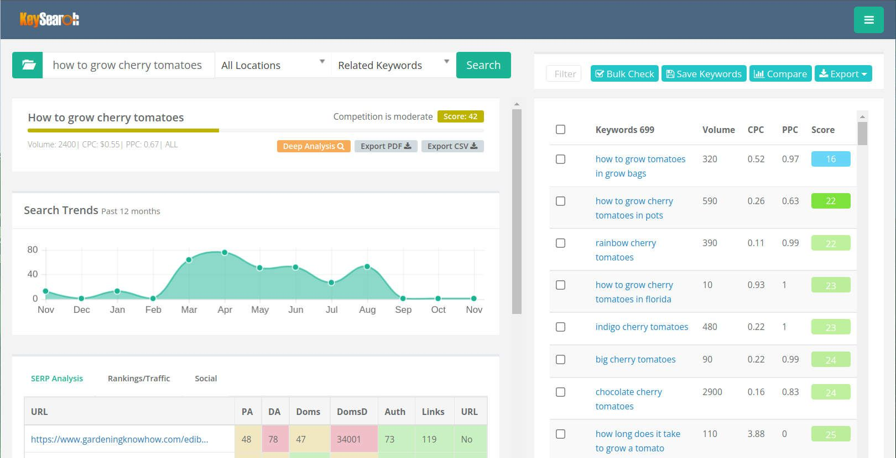
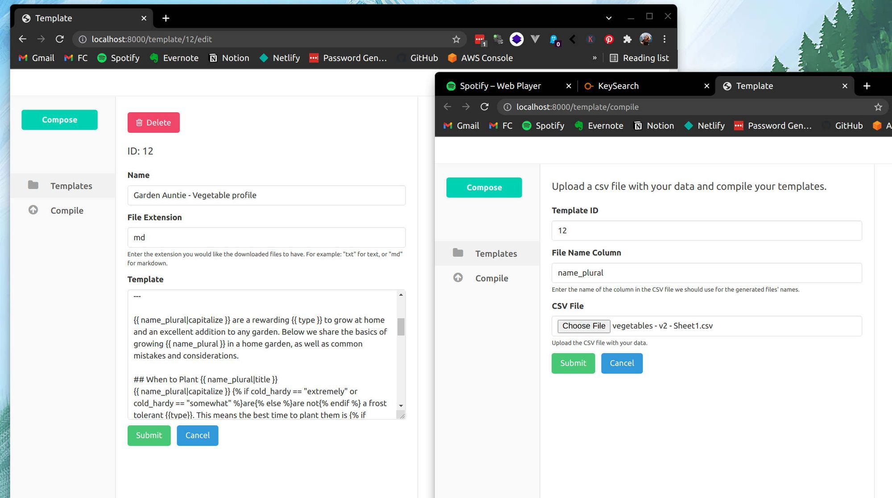
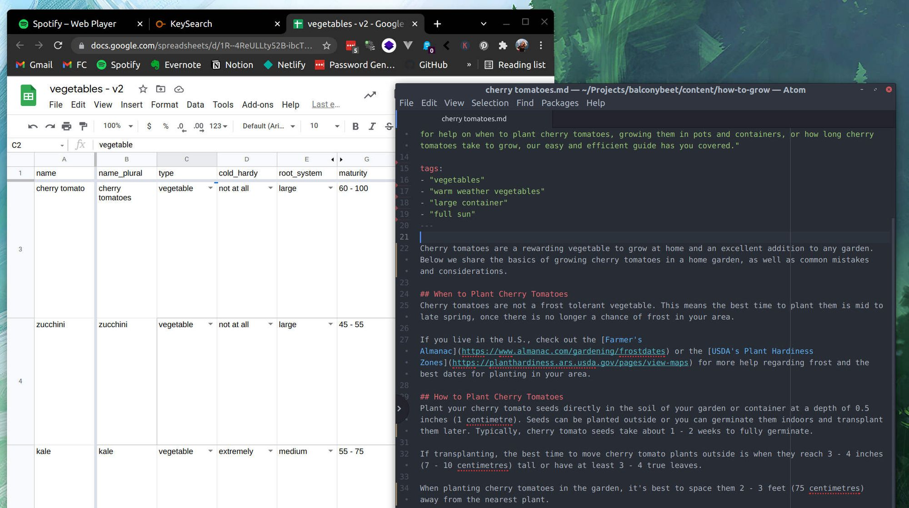

As somewhat of a novice digital marketer, I can't tell you how excited I am by the idea of programmatic SEO.  

作为一个数字营销的新手，我无法告诉你我对程序化搜索引擎的想法有多兴奋。

For the uninitiated, programmatic SEO is the process of generating content from a set of data, usually as part of an automated process.  

对于不熟悉的人来说，程序化搜索引擎是指从一组数据中生成内容的过程，通常是作为一个自动化过程的一部分。  

Information is sewn together in a human readable format that targets long tail, low volume keywords. If you have enough data you can generate hundreds or even thousands of landing pages in seconds.  

信息以人类可读的格式缝合在一起，目标是长尾、低容量的关键词。如果你有足够的数据，你可以在几秒钟内生成数百甚至数千个着陆页。  

And since you're aiming for keywords with less than stellar search volume, there's probably little to no competition.  

由于你的目标是搜索量不大的关键词，所以可能几乎没有竞争。

Imagine having 100 pages, that rank #1 for 100 different queries, that get roughly 100 - 50 searches a month. A good portion of those searches should result in a click through to the website right?  

想象一下，有100个网页，在100个不同的查询中排名第一，每个月大约有100-50次搜索。在这些搜索中，有相当一部分应该导致点击进入该网站，对吗？  

Even with low search volume, enough of these pages could easily generate _several thousand_ new visitors to your website.  

即使搜索量很低，足够多的这些网页也能轻易地为你的网站带来几千个新的访问者。

I think most marketers would agree that getting traffic through search is a gold mine, but creating content is a huge pain. The idea of automating the most painful part of content creation, i.e.  

我想大多数营销人员都会同意，通过搜索获得流量是一个金矿，但创建内容是一个巨大的痛苦。将内容创作中最痛苦的部分自动化的想法，即。  

writing the content, would make SEO marketing 10x easier to scale than it is currently.  

撰写内容，将使SEO营销的规模比目前要容易10倍。

Imagine, an audience to put your product in front of that's easy to build and grow. _Cha-ching._  

想象一下，把你的产品放在一个容易建立和发展的观众面前。恰恰相反。

I've spent some time toying with programmatic SEO, and the more I learn about it the more I see untapped potential.  

我已经花了一些时间来玩弄程序化搜索引擎，我对它了解得越多，就越能看到未开发的潜力。

So, I decided to take a deep dive into the concept with a little experiment. One purely designed to test the limits and potential of automated SEO.  

因此，我决定用一个小实验来深入了解这个概念。这个实验纯粹是为了测试自动SEO的极限和潜力。

## Setting Up a Programmatic SEO Website  

建立一个程序化的SEO网站

Initially I was drawn to programmatic SEO because my project, [Fantasy Congress](https://fantasycongress.com/), collects _tons_ of data, and I wanted to find a way to re-use that data for marketing purposes. But, as I eventually learned, the subject matter around this project just isn't conducive to SEO.    

最初，我被吸引到程序化搜索引擎，因为我的项目 "幻想国会 "收集了大量的数据，我想找到一种方法来重新使用这些数据用于营销目的。但是，正如我最终了解到的，围绕这个项目的主题并不利于SEO。

If I wanted to do more with programmatic SEO, I'd have to start fresh with entirely different content.  

如果我想在程序化搜索引擎方面做得更多，我就必须用完全不同的内容重新开始。

So I began to wonder: Could I create a new website that gets traffic purely from programmatic SEO? Could it get enough traffic to generate revenue?  

于是我开始思考：我能否创建一个新的网站，纯粹从程序化的SEO中获得流量？它能否获得足够的流量来创造收入？  

And if so, what's stopping me from making a small army of these little passive income generators?  

如果是这样，是什么阻止了我建立一支由这些小的被动收入生成器组成的小部队？

With those questions in mind, the experiment was born.  

带着这些问题，实验诞生了。

### Introducing Garden Auntie  

介绍花园大妈

I bought gardenauntie.com from [Namecheap](https://www.namecheap.com/) for $10/yr, and set up a basic website with my favorite static site generator, [Hugo](https://gohugo.io/). The website is currently hosted for free on GitHub pages.  

我以10美元/年的价格从Namecheap购买了gardenauntie.com，并使用我最喜欢的静态网站生成器Hugo建立了一个基本网站。该网站目前在GitHub页面上免费托管。

I chose gardening because it interests me, and there is _lots_ of data that can be collected about plants. Most of all, people are searching for this information quite a bit.  

我选择园艺是因为我对它感兴趣，而且有很多关于植物的数据可以收集。最重要的是，人们对这些信息的搜索相当多。

My idea was to create a template for a blog post that targets low-volume search queries shared across most homegrown produce. I used [Keysearch](https://www.keysearch.co/) to figure out which searches  were the easiest to target across the board, and structured my "blog post" around them.  

我的想法是为一篇博文创建一个模板，针对大多数自产产品共有的低流量搜索查询。我使用Keysearch来计算出哪些搜索是最容易的目标，并围绕这些搜索来组织我的 "博文"。

I designed a template to answer common questions such as "how to grow \[insert vegetable here\] in pots", or "how much sunlight does \[insert vegetable here\] need." With the template ready to go, it was time to generate some content.  

我设计了一个模板来回答常见的问题，如 "如何在花盆中种植\[此处插入蔬菜\]"，或"\[此处插入蔬菜\]需要多少阳光"。模板准备好后，是时候产生一些内容了。

### A short detour  

短暂的迂回

Like most CMS systems, the static site generator I use expects content to be "fully baked" in the form of sentences and paragraphs.  

像大多数CMS系统一样，我使用的静态网站生成器希望内容以句子和段落的形式 "完全出炉"。  

It has a template system for putting the look and feel together, but this system is not well suited for taking lots of tiny data points and stringing them together into readable content.  

它有一个模板系统，可以把外观和感觉放在一起，但这个系统不太适合把大量微小的数据点串联起来，成为可读的内容。

I thought I could build a different system better suited to my needs. And after a few hours of hacking, I had a simple templating app.  

我想我可以建立一个更适合我需要的不同系统。经过几个小时的黑客攻击，我有了一个简单的模板化应用。

In the app, I can create a template, save it, then upload a spreadsheet of data to it. When data is fed to a template, a file is generated for each row in the spreadsheet.  

在该应用程序中，我可以创建一个模板，保存它，然后向它上传一个电子表格的数据。当数据被送入模板时，电子表格中的每一行都会生成一个文件。

The app processes templates using [Jinja2](https://jinja2docs.readthedocs.io/en/stable/), a template language for python. This allows me to implement extra functionality like conditional statements and filters, which helps create more variety between the generated pages.  

该应用程序使用Jinja2处理模板，这是一种python的模板语言。这使我能够实现额外的功能，如条件语句和过滤器，这有助于在生成的页面之间创造更多的多样性。

The image above shows my spreadsheet entry for "cherry tomatoes" and the final product created by the app: a Markdown file with a "blog post" about cherry tomatoes.  

上图显示了我在电子表格中输入的 "樱桃番茄 "和该应用程序创建的最终产品：一个带有关于樱桃番茄的 "博客文章 "的Markdown文件。  

I chose to make Markdown files from each spreadsheet row, since Markdown is what my CMS system uses to handle content.  

我选择将每个电子表格的行做成Markdown文件，因为Markdown是我的CMS系统用来处理内容的。

### Want to try it yourself?  

想自己试试吗？

I've put the app I created for this experiment online so that others can try programmatic SEO as well! Check it out at [PageFactory.app](https://pagefactory.app/).  

我已经把我为这个实验创建的应用程序放在网上，以便其他人也可以尝试程序化的SEO！请在PageFactory.app上查看！请到PageFactory.app查看。

### Putting it all together  

把它放在一起

I uploaded my spreadsheet of plant data to the app and created 27 pages of content in seconds. After downloading the files and uploading them to my site, [Garden Auntie](http://gardenauntie.com/) was ready to go!  

我把我的植物数据电子表格上传到应用程序，并在几秒钟内创建了27页的内容。在下载文件并将其上传到我的网站后，花园大妈就可以开始工作了

## What's Next for Programmatic SEO?  

程序化SEO的下一步是什么？

The next step in this project involves a lot of waiting. Hopefully Google will begin indexing my site, and in a few months, the pages will start appearing in search results.  

这个项目的下一步涉及大量的等待。希望谷歌将开始对我的网站进行索引，几个月后，这些网页将开始出现在搜索结果中。  

If not, I'll have to try tweaking some things.  

如果没有，我就得尝试调整一些东西。

I hope to add more content to the site in that time, but this brings up the first of a few glaring issues I've noticed with the experiment so far.  

我希望在这段时间内为网站增加更多内容，但这带来了我迄今为止注意到的实验中的几个明显问题中的第一个。

### The sourcing problem  

源头问题

First, I didn't have a spreadsheet or database of information on common garden vegetables before I started this project. This means I've gathered all the data manually from the internet.  

首先，在我开始这个项目之前，我没有一个电子表格或数据库来记录常见的花园蔬菜的信息。这意味着我从互联网上手动收集了所有的数据。  

Which, to be honest, is almost as much of a pain as writing.  

说实话，这几乎是和写作一样的痛苦。

And this has lead to another issue. In order to streamline my data collection process, I need to collect less data.  

而这也导致了另一个问题。为了简化我的数据收集过程，我需要收集更少的数据。

Most potential sources for information have basic info like how much sunlight a plant needs or how far apart to space plants from each other.  

大多数潜在的信息来源都有基本信息，如植物需要多少阳光或植物之间的间距有多远。  

But more in depth information, like optimum soil ph or how much produce a single plant can yield, would require a lot more research.  

但更深入的信息，如最佳土壤PH值或一株植物能生产多少产品，则需要更多的研究。

A small data set that isn't very unique creates a few issues. It limits the amount of keywords I can target, and the keywords I can use are probably being targeted by other people.  

一个不是很独特的小数据集会产生一些问题。它限制了我可以锁定的关键词数量，而且我可以使用的关键词可能被其他人锁定。

What concerns me most though, is that less data makes it difficult to create substantial differences between pages of content.  

不过，我最关心的是，较少的数据使其很难在各页内容之间产生实质性的差异。  

Right now, it's very obvious where I switched out information in each "post". This creates minor differences between the pages, but is it enough so Google doesn't recognize each page as a duplicate?  

现在，我在每个 "帖子 "中调换了信息，这是非常明显的。这在各页之间产生了微小的差异，但这足以让谷歌不把每页都当作重复的内容吗？  

I have no idea.  

我不知道。

If I had more data, it would be easier to "customize" each page. Data collection was never a problem with my first project, Fantasy Congress.  

如果我有更多的数据，就会更容易 "定制 "每个页面。在我的第一个项目《幻想国会》中，数据收集从来不是问题。  

And it totally slipped my mind when thinking about a new content topic for this experiment.  

而在为这个实验考虑新的内容主题时，我完全没有想到这一点。

If I try experimenting with another programmatic SEO website, figuring out where to source the data will be one of my first steps.  

如果我尝试试验另一个程序化的SEO网站，找出数据来源将是我的首要步骤之一。

### The Google problem

Of course, in order for my site to get indexed and rise in search rankings, I need to do all the traditional SEO things like get backlinks, submit a sitemap,  optimize web performance, etc.  

当然，为了使我的网站被索引并在搜索排名中上升，我需要做所有传统的SEO工作，如获得反向链接、提交网站地图、优化网页性能等。

Most of these I've already taken care of. Garden Auntie pages are currently getting a green Lighthouse score close to 100.    

其中大部分我已经处理好了。花园大妈的页面目前正在获得接近100分的绿色灯塔分数。

But backlinks trouble me. I had the initial idea of looking up gardening forums and submitting the pages as answers to basic questions. Not sure if that will be enough though, or even work.  

但反向链接让我很烦恼。我最初的想法是查找园艺论坛并提交网页作为基本问题的答案。但不确定这是否足够，甚至是否有效。  

I want to avoid coming off as spammy.  

我想避免让人觉得是垃圾邮件。

But, we'll see. I plan on waiting a while to ensure the pages are getting indexed first, before tackling bigger problems.    

但是，我们将拭目以待。我打算先等一段时间，以确保网页被索引，然后再处理更大的问题。

At the end of the day, this is an experiment. I'm not tied to a specific outcome, but to learning more about SEO and potential marketing strategies involving it.  

在一天结束时，这是一个实验。我并不拘泥于一个具体的结果，而是要学习更多关于SEO和涉及它的潜在营销策略。  

In 6 - 9 months, we'll check back in and see how it's progressed.  

6-9个月后，我们会再来检查，看看进展如何。

### Like this content?  

喜欢这个内容吗？

Check out my newsletter!  

请看我的通讯

If you like building things, you'll love my monthly [retrospectives](https://allisonseboldt.com/tag/retrospective/).  

如果你喜欢建造东西，你会喜欢我的每月回顾。  

Once a month, get the latest news about my most recent articles, experiments, and projects right in your inbox.  

每月一次，在你的收件箱中获得关于我最近的文章、实验和项目的最新消息。
