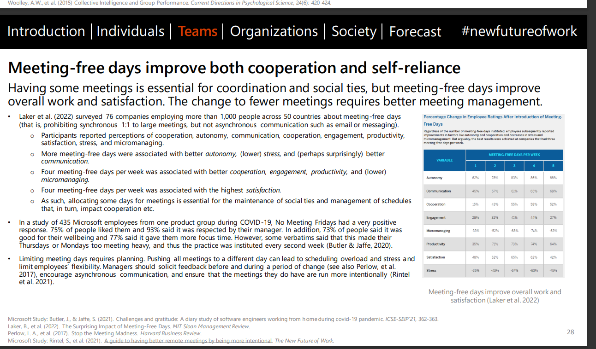

摘要：会议可能会降低你的生产力。会议可能会占用你的时间，使你无法完成其他任务。此外，会议可能会导致信息过载和决策延迟。因此，要确保只参加必要的会议，并尽可能减少会议时间。

关键点：

- 会议可能会占用你的时间，使你无法完成其他任务。
- 会议可能会导致信息过载和决策延迟。
- 要确保只参加必要的会议，并尽可能减少会议时间。

---

For years, we in tech have grumbled about meetings. According to [a study from SurveyMonkey](https://www.surveymonkey.com/curiosity/virtual-meetings/), 32% of people think “this meeting could have been an email” all or most of the time. Sometimes we get roped into meetings with a dozen or more people without really knowing why we’re there.  

多年来，我们科技界人士一直对会议心存抱怨。根据SurveyMonkey的一项研究，32%的人在所有或大部分时间里都认为 "这个会议本可以是一封电子邮件"。有时，我们被拖进有十几个人的会议，却不知道自己为什么会在那里。  

And when we get out, we often have just minutes before our next meeting.   

而当我们出去后，我们往往在下一次会议前只有几分钟的时间。

At the beginning of the year, [Shopify took drastic steps to reduce their meeting burden](https://www.bloomberg.com/news/articles/2023-01-03/shopify-ceo-tobi-lutke-tells-employees-to-just-say-no-to-meetings). They automatically canceled all meetings of three or more people, a total of around 12,000 calendar series and events that would have taken up roughly 322,000 person hours. Chaotic and drastic?  

在今年年初，Shopify采取了激烈的措施来减少他们的会议负担。他们自动取消了所有三人以上的会议，总共约有12,000个日历系列和活动，大约占用了322,000个人小时。混乱和剧烈？  

Maybe. But as Kaz Nejatian, Shopify’s COO and VP product wrote in the email announcing the change to employees, “We’ve unleashed the ‘chaos monkey’ before and have always come away faster—faster at shipping, at making great decisions, at getting to results and impact.  

也许吧。但正如Shopify的首席运营官兼产品副总裁Kaz Nejatian在向员工宣布这一变化的邮件中写道："我们以前也释放过'混乱的猴子'，但总是走得更快--在发货、做出伟大的决定、取得成果和影响方面更快。No one joined Shopify to sit in meetings.”  

没有人加入Shopify是为了坐着开会。"

Chances are that no matter where you work, you didn’t join that company for the meetings. You wanted to build software.  

有可能的是，无论你在哪里工作，你都不是为了开会而加入该公司。你想构建软件。  

But the meetings became part of that, and the more senior you are, the more meetings you probably get asked to attend.   

但会议成为其中的一部分，你的级别越高，你可能被要求参加的会议就越多。

In this article, we’re going to take a look at the productivity impact of meetings, reevaluate why we have meetings at all, and consider ways to make meetings better (or avoid them altogether).   

在这篇文章中，我们将审视会议对生产力的影响，重新评估我们为什么要开会，并考虑如何使会议变得更好（或完全避免）。

## One third of meetings are unnecessary  

三分之一的会议是不必要的

Unless we’re actively multitasking during a meeting ([which humans do badly](https://www.ncbi.nlm.nih.gov/pmc/articles/PMC7075496/#:~:text=We%20have%20a%20hard%20time,has%20evolved%20to%20single%20task.)), we’re blocked from other parts of our work: writing code, debugging processes, or designing new features. So if we’re asking for our coworkers’ time, that time should be spent productively. Professor Thomas Fritz of the University of Zurich ran several studies about how software developers perceive their own productivity across their activities. Perceptions across [all](https://ieeexplore.ieee.org/document/9793555/) [three](https://www.zora.uzh.ch/id/eprint/143089/) [studies](http://www.merlin.uzh.ch/publication/show/9943) found that developers view slightly more than half of their meetings negatively. For more from Prof. Fritz, check out our recent podcast with him:  

除非我们在会议期间积极地进行多任务处理（人类做得很糟糕），否则我们就会被挡在工作的其他部分之外：写代码、调试流程或设计新功能。因此，如果我们要求我们同事的时间，这些时间应该被有效地利用。苏黎世大学的Thomas Fritz教授进行了几项关于软件开发人员如何看待他们自己在各项活动中的生产力的研究。所有三项研究的看法都发现，开发人员对他们的会议的看法略微超过一半是消极的。有关弗里茨教授的更多信息，请查看我们最近与他的播客：

Plenty of things about meetings can make attendees feel they’re wasting their time: guest lists that spiral out of control, overwhelmingly negative participants, and meeting participants who [stray off-topic](https://workplace.stackexchange.com/questions/9283/how-can-i-tell-people-to-get-to-the-point). [Otter.ai and Stephen G. Rogelberg](https://otter.ai/blog/one-third-of-meetings-are-unnecessary-costing-companies-millions-and-no-one-is-happy-about-it), Professor of Organizational Science, Management at UNC Charlotte, found that developers in bad meetings report feeling “frustrated” and “annoyed.” Even good meetings can turn bad if run poorly.   

很多关于会议的事情会让与会者觉得他们在浪费时间：失去控制的嘉宾名单、压倒性的消极参与者，以及偏离主题的会议参与者。 Otter.ai和Stephen G. Rogelberg , 联合国大学夏洛特分校的组织科学和管理学教授发现，在糟糕的会议中，开发人员报告说感到 "沮丧 "和 "烦躁"。即使是好的会议，如果运行得不好也会变坏。

In that same study, they found that developers see about one-third of all meetings as unnecessary—they want to decline 31% of meetings, but only nix 14%.  

在同一项研究中，他们发现，开发人员认为大约三分之一的会议是不必要的--他们想拒绝31%的会议，但只取消了14%的会议。  

Worse yet, bad meetings not only affect how developers feel about their jobs, they [cost organizations money](https://20067454.fs1.hubspotusercontent-na1.net/hubfs/20067454/Report_The%20Cost%20of%20Unnecessary%20Meeting%20Attendance.pdf)—an estimated $25,000 per employee per year. You can estimate how much any given meeting costs your company with [this calculator](https://hbr.org/2016/01/estimate-the-cost-of-a-meeting-with-this-calculator). And that’s just the direct costs of the meeting, regardless of how disruptive it is to the rest of a developer’s day.   

更糟糕的是，糟糕的会议不仅影响了开发人员对其工作的感受，还让企业损失惨重--估计每个员工每年损失25,000美元。你可以用这个计算器估计任何特定的会议给你的公司带来多少成本。而这只是会议的直接成本，不管它对开发人员一天的其他时间有多大的破坏性。

Meetings don’t happen in a vacuum; often they happen back-to-back with other meetings. Microsoft’s Human Factors Lab found that [back-to-back meetings cause a great deal of stress](https://www.microsoft.com/en-us/worklab/work-trend-index/brain-research) and make people worse at meetings.   

会议不是在真空中发生的；往往是与其他会议背靠背地发生。微软的人类因素实验室发现，背靠背的会议会造成很大的压力，并使人们在会议上变得更糟。

This wasn’t just a subjective perception.  

这不仅仅是一种主观的看法。  

They strapped an EEG cap that measured brain waves to 14 volunteers and either set them up with four consecutive meetings or four meetings with a ten minute meditation break in between.  

他们在14名志愿者身上绑上了测量脑电波的脑电图帽，并为他们安排了四次连续的会议或四次会议之间有十分钟的冥想休息。  

They found that back-to-back meetings caused stress to build up and caused attendees to lose focus and engage worse over time.  

他们发现，背靠背的会议造成了压力的积累，并使与会者失去了注意力，而且随着时间的推移，参与度越来越差。  

Surprisingly, one of the biggest sources of stress came from the transition between meetings, as participants tried to switch gears without adequate time.   

令人惊讶的是，最大的压力来源之一来自于会议之间的过渡，因为与会者试图在没有足够时间的情况下进行换挡。

These factors combine to drag down the company as a whole. In [a study of 20 organizations in manufacturing sectors](https://www.researchgate.net/publication/258187597_Meetings_Matter_Effects_of_Team_Meetings_on_Team_and_Organizational_Success), Simone Kauffeld of Technische Universität Braunschweig and Nale Lehmann-Willenbrock of the University of Amsterdam found that bad meeting behaviors were associated with lower levels of market share, innovation, and employment stability.  

这些因素结合起来，拖累了整个公司。在对制造业的20个组织的研究中，布伦瑞克工业大学的西蒙娜-考菲尔德和阿姆斯特丹大学的纳勒曼-维伦布洛克发现，不良会议行为与较低的市场份额、创新和就业稳定性有关。  

A company that doesn’t have meeting discipline may soon find their best employees fleeing to greener pastures as their balance sheets slowly drift into the red.   

一个没有会议纪律的公司可能很快就会发现他们最好的员工在资产负债表慢慢陷入亏损的情况下逃往更广阔的领域。

All these downsides to meetings may make you wonder why we have meetings at all.   

所有这些会议的弊端可能会让你怀疑我们为什么要举行会议。

## Wait, why _do_ we have meetings at all?  

等等，我们为什么要开会？

Obviously, nobody schedules a meeting to torture their coworkers. [Meetings are the standard tool for collaboration](https://www.researchgate.net/publication/349120600_Integrating_TA_concepts_into_team_meetings_through_micro-learning_approaches) in companies, ways to find consensus and make a decision, share knowledge, or brainstorm solutions—essentially, they are pop-up communities of practice. Get everyone in a room and talk it out.   

很明显，没有人安排会议来折磨他们的同事。 会议是公司合作的标准工具，是寻求共识和做出决定的方式，分享知识，或集思广益的解决方案--基本上，它们是突发的实践社区。让每个人都在一个房间里，把它说出来。

The [_Harvard Business Review_ quotes](https://hbr.org/2017/07/stop-the-meeting-madness) an unnamed pharmaceutical executive who sums up the pro-meeting bias that many people in leadership positions hold: “Our abundance of meetings at our company is the cultural tax we pay for the inclusive learning environment that we want to foster…and I’m OK with that.  

哈佛商业评论》引用了一位不愿透露姓名的制药业高管的话，他总结了许多担任领导职务的人所持有的支持会议的偏见："我们公司大量的会议是我们为我们想要培养的包容性学习环境所支付的文化税......而我对此没有意见。  

If the alternative to more meetings is more autocratic decision-making, less input from all levels throughout the organization, and fewer opportunities to ensure alignment and communication by personal interaction, then give me more meetings any time!”  

如果更多会议的替代方案是更多的专制决策，更少的来自整个组织各个层面的投入，以及更少的通过个人互动来确保一致和沟通的机会，那么随时给我更多会议！"

In fact, these are all things that I’d wager every one of us wants from a job. We may lionize the [enlightened dictator CEOs](https://qz.com/701895/the-best-companies-in-the-world-are-run-by-enlightened-dictators) of the past, but those who attract praise for their decisive style are a perfect example of [survivorship bias](https://thedecisionlab.com/biases/survivorship-bias). Those successful autocratic leaders still need to inspire and motivate their workforce to do the work behind their decisions.  

事实上，这些都是我敢打赌，我们每个人都希望从一份工作中得到的东西。我们可能会对过去那些开明的独裁者CEO大加赞赏，但那些因其果断的风格而招致赞誉的人，是幸存者偏差的一个完美例子。那些成功的专制领导人仍然需要鼓舞和激励他们的员工来完成他们决策背后的工作。  

If you’ve ever worked for a determined and bull-headed leader who gave orders instead of direction, then you know how painful it is to work in a culture without collaboration.   

如果你曾经为一个意志坚定、牛头不对马嘴的领导工作过，他发号施令而不是指明方向，那么你就知道在一个没有合作的文化中工作是多么痛苦的事情。

Many people see reluctance to attend meetings or [outright rejection of a meeting as an insult](https://workplace.stackexchange.com/questions/174620/people-reacting-with-anger-to-my-trying-to-get-rid-of-meetings-that-should-be-em). They hold the attitude of our mystery pharma exec: by rejecting the meeting, you are rejecting an opportunity to collaborate.  

许多人认为不愿意参加会议或直接拒绝会议是一种侮辱。他们持有我们这位神秘的制药业执行官的态度：拒绝会议，就等于拒绝了合作的机会。  

For one person, maybe that meeting would have been better as an email—you want something done, so send me the requirements/brief so I can do the thing.  

对于一个人来说，也许那次会议以电子邮件的形式进行会更好--你想做一件事，所以把要求/简报发给我，我就可以做这件事了。  

But another person may see the meeting as a way to feel out an idea, to get a better solution by working with an expert—you.   

但是，另一个人可能会把会议看作是一种摸索想法的方式，通过与专家--你的合作，获得更好的解决方案。

Those meetings that come during points in the software development lifecycle when collaboration is most important—planning, designing, and setting scope—end up being [the ones that feel the least disruptive](https://ieeexplore.ieee.org/document/8666786). At these moments, meetings aren’t taking you away from other work; [they are the work](https://resources.stackoverflow.co/topic/productivity-tips/reclaim-your-flow-state-3-developer-distractions-to-eliminate/?utm_source=so-owned&utm_medium=blog&utm_campaign=teams-signups&utm_content=meetings-less-productive). Without all stakeholders coming together and determining what needs to be done, engineering orgs would be coding solutions blind.   

那些在软件开发生命周期中合作最重要的时间点--规划、设计和设定范围--召开的会议，最终是那些感觉最不具破坏性的。在这些时刻，会议并没有把你从其他工作中带走，它们就是工作。如果没有所有的利益相关者聚集在一起，确定需要做什么，工程小组就会盲目地编码解决方案。

## Finding ways to have better meetings (or skip them altogether)  

找到更好的会议方式（或完全跳过会议）。

But let’s put some big asterisks on “all stakeholders” and “what needs to be done.” The right attendees can make a meeting feel productive for everyone.  

但让我们在 "所有利益相关者 "和 "需要做什么 "上打上一些大的星号。正确的与会者可以使会议对每个人来说都感到富有成效。  

“I have heard in our studies that there are often meetings that have a lot of participants yet require only a few,” said Professor Fritz.  

"我在我们的研究中听说，经常有一些会议有很多参与者，却只需要几个人，"弗里茨教授说。  

“In my opinion, the most important part of a meeting is to take the time and reflect on who is really necessary for a meeting and even examine whether or not I should participate, and provide an environment in which it is OK to make that decision yourself.” Everyone at the meeting should have a sense of what to do next: [Only 56% of participants](https://www.surveymonkey.com/curiosity/virtual-meetings/) leave meetings knowing what actions they need to take.  

"在我看来，会议最重要的部分是花时间，反思谁才是真正需要开会的人，甚至审视自己是否应该参加，并提供一个环境，让你自己做出这个决定是可以的。"参加会议的每个人都应该对接下来要做的事情有一个认识： 只有56%的与会者在离开会议时知道他们需要采取什么行动。

If you need to call a meeting, the research suggests that you need to [be a good steward of the meeting](https://sloanreview.mit.edu/article/the-surprising-science-behind-successful-remote-meetings/), same as you would any other project. [More than half of SurveyMonkey participants](https://www.surveymonkey.com/curiosity/virtual-meetings/) say two things would make meetings better: a clear agenda and a short meeting time. All participants can improve meetings by being direct, clear, and communicating in a way [that leads to a decision](https://stackoverflow.blog/2020/04/30/have-better-meetings-in-person-or-remote/). While we all have different communication styles, understanding [which ones work best for video calls](https://stackoverflow.blog/2021/02/11/why-are-video-calls-so-tiring-you-might-be-misreading-cultural-styles/) can make those better, too.   

如果你需要召开会议，研究表明，你需要成为会议的好管家，就像你对任何其他项目一样。 超过一半的SurveyMonkey参与者说有两件事可以让会议变得更好：一个清晰的议程和一个简短的会议时间。所有的参与者都可以通过直接、清晰和以导致决定的方式进行沟通来改善会议。虽然我们都有不同的沟通方式，但了解哪些方式最适合视频通话，也可以使这些方式变得更好。

When meetings happen can also make a huge difference in whether people see them as valuable or not.  

会议何时举行也会对人们是否认为会议有价值产生巨大影响。  

One of the big changes that came with Shopify’s meeting-ageddon was that Wednesdays became meeting-free and Thursday had a block allocated for meetings of 50+ people.  

随着Shopify的会议末日的到来，其中一个很大的变化是，周三变成了无会议，周四有一个区块分配给50人以上的会议。  

In a statement, Nejatian said, “Uninterrupted time is the most precious resource of a craftsperson, and we are giving our people a no judgment zone to subtract, reject meetings, and focus on what is most valuable.”  

内贾蒂安在一份声明中说："不受干扰的时间是手艺人最宝贵的资源，我们正在给我们的人一个没有判断力的区域，以做减法，拒绝会议，并专注于最有价值的东西。"

As the Human Factors Lab research above showed, breaks between meetings are absolutely necessary. But they also found that [days without meetings improve overall collaboration](https://www.microsoft.com/en-us/research/uploads/prod/2022/04/Microsoft-New-Future-Of-Work-Report-2022.pdf), which is the whole reason we have meetings in the first place. And Professor Fritz and his students found that self-reported productivity declined if a developer had more than two meetings in a day.   

正如上述人类因素实验室的研究表明，会议之间的休息是绝对必要的。但他们也发现，没有会议的日子可以提高整体协作，而这正是我们召开会议的全部原因。弗里茨教授和他的学生发现，如果开发人员在一天内开了两次以上的会议，其自我报告的生产力就会下降。

All this research is a great excuse to have fewer meetings. Meetings will still occasionally be necessary, but limiting them improves developers’ lives.  

所有这些研究是减少会议的一个很好的借口。会议仍然偶尔是必要的，但限制会议可以改善开发者的生活。  

Dropbox uses a framework to identify when something needs a meeting that they call [the 3 Ds: decisions, debates, and discussion](https://aem.dropbox.com/cms/content/dam/dropbox/dmep/en-us/assets/pdfs/Virtual_First_Toolkit_Effectiveness_Meetings_101.pdf). These are the business actions that need people to collaborate in order to get them done. Everything else can be served in other ways.   

Dropbox使用一个框架来确定什么时候需要开会，他们称之为3 D：决策、辩论和讨论。这些是需要人们合作才能完成的业务行动。其他一切都可以通过其他方式进行。

It’s worth thinking about how we can use other tools to take the place of those meetings we call reflexively.  

值得思考的是，我们如何使用其他工具来取代我们反射性地召集的那些会议。  

Status check-ins like the standup meeting have traditionally been served by actual meetings where everyone reports the status of their projects one at a time.  

像Standup会议这样的状态检查，传统上是由实际的会议来进行的，每个人都会逐一报告他们项目的状态。  

But if companies genuinely want to embrace remote options (and preferably, [asynchronous working](https://stackoverflow.blog/2023/03/27/building-a-collaborative-asynchronous-work-environment/)), there are plenty of tools that will let you do that without turning on your camera. Better yet, there are tools that can [automate status updates](https://stackoverflow.blog/2021/09/29/automate-away-your-boring-standup-meetings/) for you.   

但是，如果公司真的想接受远程选项（最好是异步工作），有很多工具可以让你在不打开相机的情况下做到这一点。更好的是，还有一些工具可以为你自动更新状态。

Especially for companies with remote options, finding ways to replace the visibility of office life can make a lot of the pushes for video meetings moot. [Working in public](https://futureforum.com/2022/06/10/normalize-a-culture-of-learning-and-experimentation/#do-your-work-in-public-and-bring-your-managers-along-for-the-ride) as much as possible can help share information across teams and give everyone access to the company’s domain experts.  

特别是对于有远程选择的公司来说，找到替代办公室生活的可见性的方法可以使很多对视频会议的推崇变得没有意义。 尽可能地在公开场合工作可以帮助各团队分享信息，让每个人都能接触到公司的领域专家。  

Greater transparency reduces the need for meetings, which can build trust and improve overall morale. When [we spoke with the folks at 84.51°](https://resources.stackoverflow.co/topic/client-stories/8451-case-study/?utm_source=so-owned&utm_medium=blog&utm_campaign=teams-signups&utm_content=meetings-less-productive) about how they use [Stack Overflow for Teams](https://try.stackoverflow.co/free-teams/?utm_source=so-owned&utm_medium=blog&utm_campaign=teams-signups&utm_content=meetings-less-productive), Michael Carrico, director of data science, told us, “It’s a way to help spread institutional knowledge through that entry point person and make connections.  

更大的透明度减少了对会议的需求，这可以建立信任并提高整体士气。当我们与84.51°的人们谈论他们如何使用Stack Overflow for Teams时，数据科学总监Michael Carrico告诉我们，"这是一种通过入口点人员帮助传播机构知识和建立联系的方式。  

Otherwise it would have been seen as more intrusive to directly ping or email somebody.”  

否则，直接向某人发送Ping或电子邮件会被视为更有侵扰性"。

Meetings, especially post-pandemic as more people have gone remote, have become the de facto way we collaborate, and it’s making us all more stressed, less productive, and worse at actually collaborating.   

会议，尤其是在大流行之后，随着越来越多的人走向远程，已经成为我们事实上的合作方式，它使我们的压力更大，效率更低，而且更不善于实际合作。

There is hope, but it takes thought, care, and the right tools. We have meetings for genuinely good reasons, but they take a toll on us and our organizations.  

希望是存在的，但这需要思考、关心和正确的工具。我们举行会议的原因确实很好，但它们对我们和我们的组织造成了损失。  

You don’t have to nuke the calendars from orbit, but finding alternative ways to collaborate will win out in the end.  

你不必从轨道上核爆日历，但找到替代的合作方式最终会胜出。  

And if you’re interested in improving our overall understanding of meetings, providing the data we need to change company cultures for the better, well [Professor Fritz would like to speak to you](https://hasel.dev/meeting-tool-cfp/).   

如果你有兴趣提高我们对会议的整体理解，提供我们所需的数据以改变公司文化，那么弗里茨教授想和你谈谈。

Tags: [meetings](https://stackoverflow.blog/tag/meetings/), [productivity](https://stackoverflow.blog/tag/productivity/)  

标签： 会议 ， 生产力
