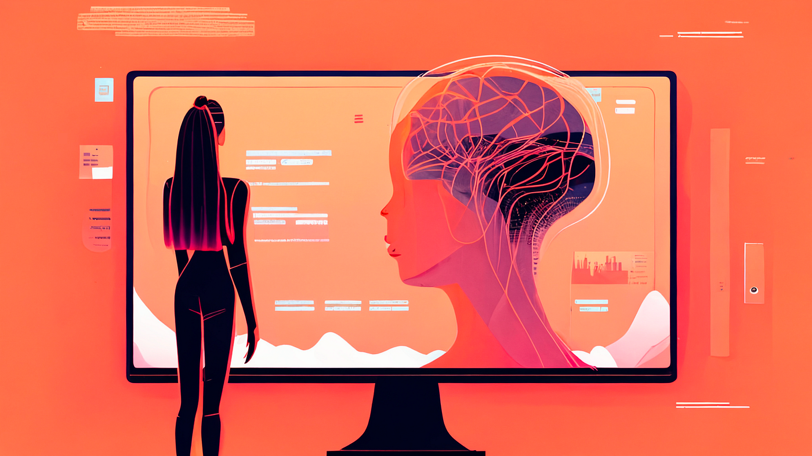
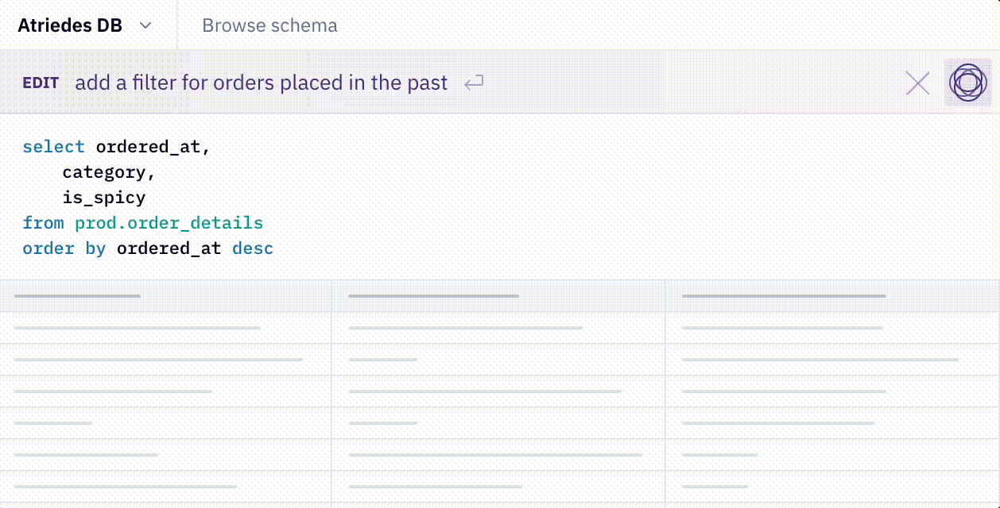
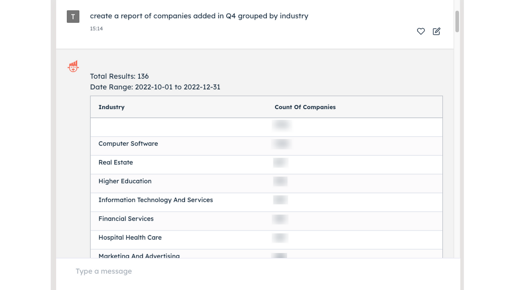
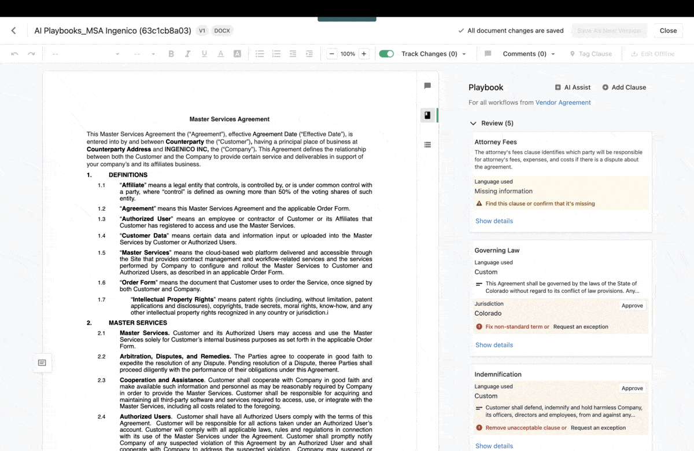
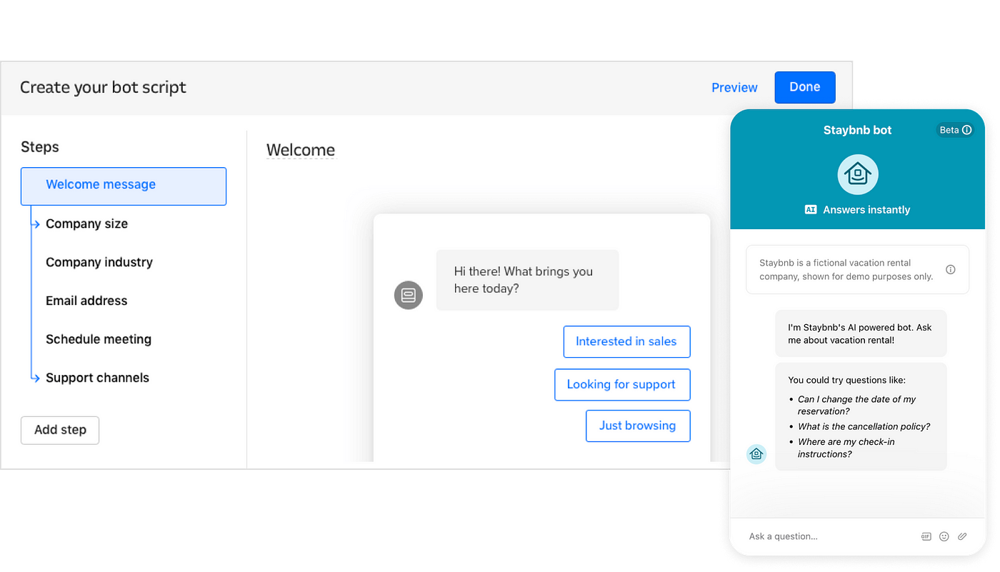
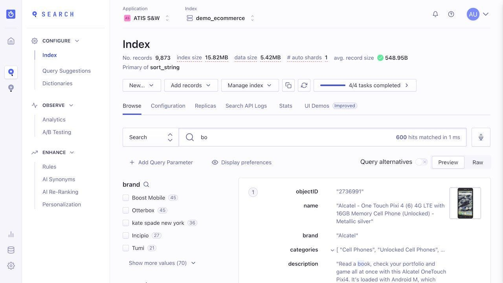
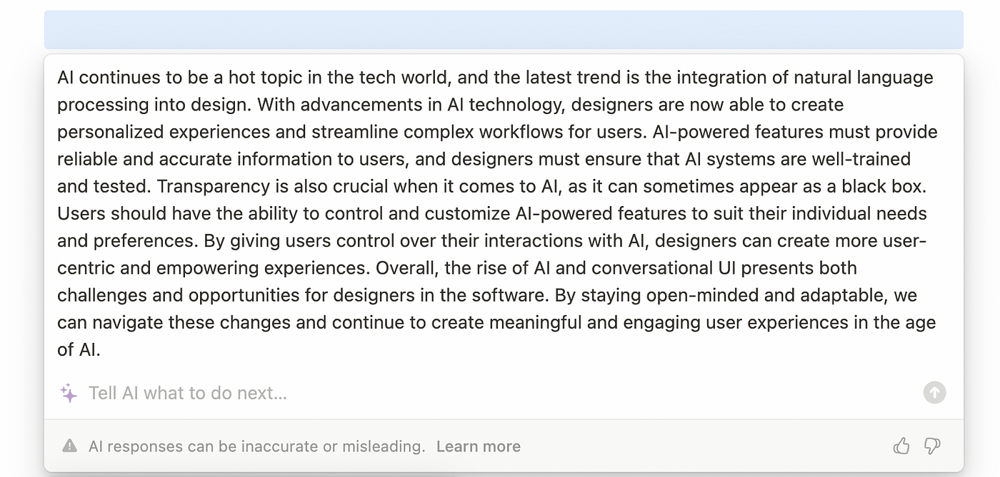
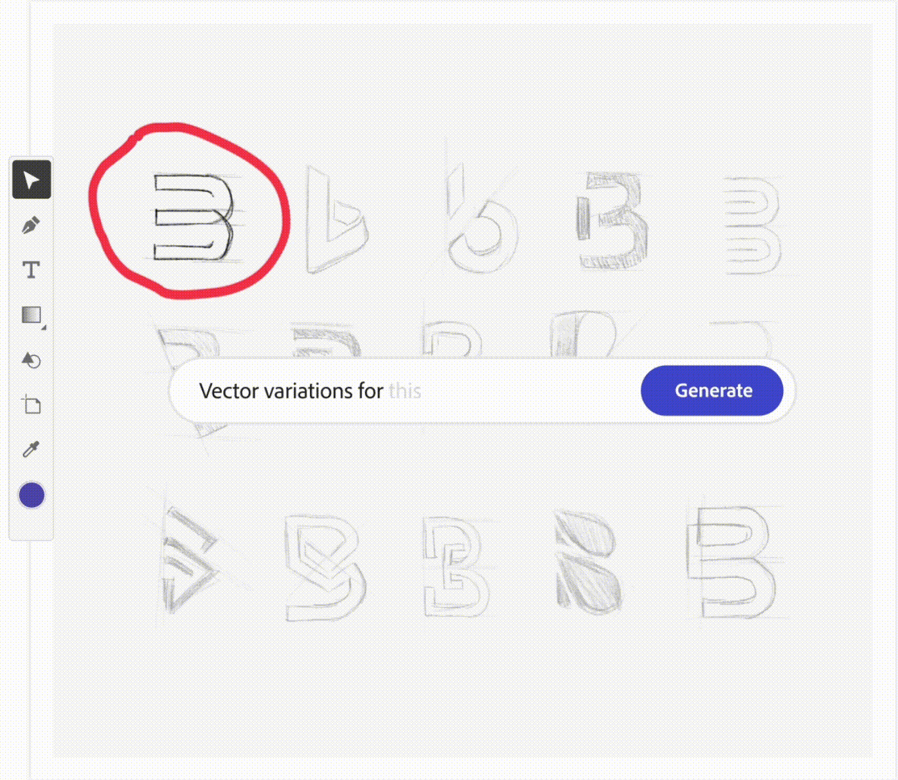
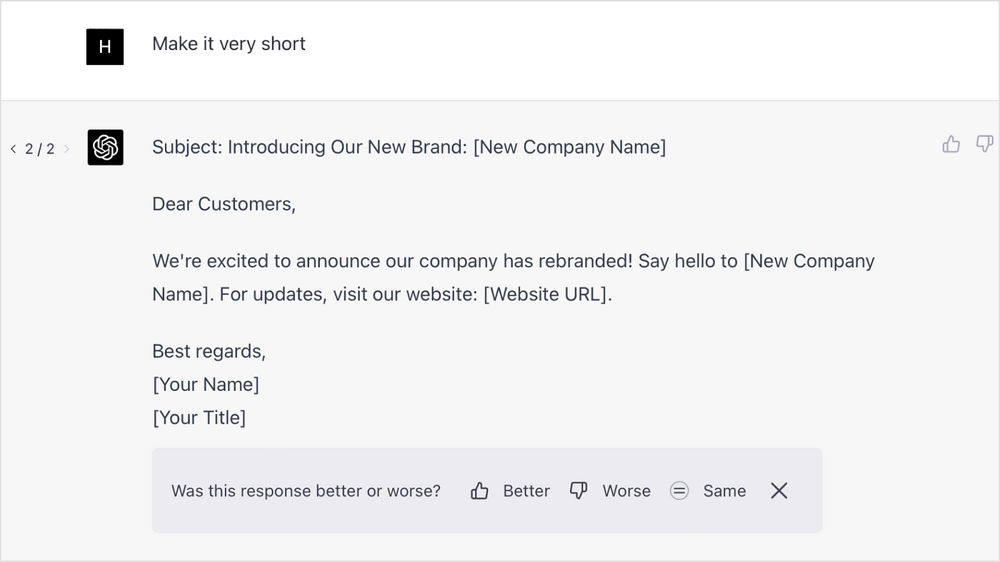

Summary：

未来软件用户体验的趋势是人工智能的影响。人工智能将改变软件的设计和交互方式，提高用户体验。人工智能将帮助设计师更好地理解用户需求，提供更好的个性化体验。人工智能还将改变软件的交互方式，例如语音识别和自然语言处理。人工智能将成为软件设计的重要组成部分，提高用户体验和效率。

Key points：
- 人工智能将改变软件的设计和交互方式
- 人工智能将帮助设计师更好地理解用户需求
- 人工智能将提供更好的个性化体验
- 人工智能将改变软件的交互方式，例如语音识别和自然语言处理
- 人工智能将成为软件设计的重要组成部分，提高用户体验和效率。

---

## How Artificial Intelligence might shape the next generation of software UX  

人工智能如何塑造下一代的软件用户体验

Illustration created by me using Midjourney v5  

我使用Midjourney v5创作的插图

As I contemplate the recent advancements in natural language AI, particularly GPT, I feel both excited and a little nervous about what the future holds for software and humanity. Like many of us, I’ve been pondering how AI will impact and reshape our software user experiences. While it’s possible that AI might replace jobs in the future, I choose to view this as an opportunity to learn and adapt.  

当我思考最近在自然语言人工智能方面的进展，特别是GPT，我对软件和人类的未来感到既兴奋又有点紧张。像我们许多人一样，我一直在思考人工智能将如何影响和重塑我们的软件用户体验。虽然人工智能有可能在未来取代工作，但我选择将其视为一个学习和适应的机会。  

Based on my early observations and reflections, I’d like to share some thoughts on how software UX might evolve with AI, specifically in the area of natural language processing. Although these insights may apply to consumer products, my focus here is on B2B SaaS products.  

基于我早期的观察和思考，我想分享一些关于软件用户体验如何随人工智能发展的想法，特别是在自然语言处理领域。尽管这些见解可能适用于消费者产品，但我在这里的重点是B2B SaaS产品。

## AI augments the existing experience  

人工智能增强了现有的经验

It’s still early days when it comes to integrating AI directly into products, but we’re all witnessing exponential growth in its capabilities.  

当涉及到将人工智能直接整合到产品中时，这仍然是早期的事情，但我们都见证了其能力的指数式增长。 Many companies have already attempted to incorporate AI capabilities into their applications.  

许多公司已经尝试将人工智能能力纳入其应用程序。  

AI advancement offers a vast opportunity to get to know your users, the tasks they care about, and their behavior.  

人工智能的发展为了解你的用户、他们关心的任务以及他们的行为提供了一个巨大的机会。

While a universal conversational UI may still be out of reach, AI is already making significant strides in enhancing existing user experiences.  

虽然普遍的对话式用户界面可能仍然遥不可及，但人工智能已经在增强现有用户体验方面取得了重大进展。 By analyzing user behavior and preferences, AI can generate personalized recommendations, streamline complex workflows, and help users navigate software more efficiently. As designers, our goal is to seamlessly integrate AI into software, creating intuitive interfaces that allow users to fully utilize these intelligent systems.  

通过分析用户行为和偏好，人工智能可以产生个性化的建议，简化复杂的工作流程，并帮助用户更有效地浏览软件。作为设计师，我们的目标是将人工智能无缝整合到软件中，创造出直观的界面，让用户能够充分利用这些智能系统。

## Content creation

Four images created by Midjourney v5  

四张由Midjourney v5创作的图片

AI has become a valuable tool for content creators.  

人工智能已经成为内容创作者的一个有价值的工具。 By using AI’s ability to analyze data and generate human-like text, writers and marketers can save time and produce high-quality drafts.  

通过使用人工智能分析数据和生成类似人类的文本的能力，作家和营销人员可以节省时间并产生高质量的草稿。  

With AI, content creators can focus on refining the narrative and improving readability, while still exploring new topics and approaches. GPT, for instance, can help extract relevant information and generate creative ideas or headlines. It’s no wonder why AI has become one of the most popular tools for content creation.  

有了人工智能，内容创作者可以专注于完善叙事，提高可读性，同时仍然探索新的主题和方法。例如，GPT可以帮助提取相关信息，产生创造性的想法或标题。这就难怪人工智能已经成为内容创作最受欢迎的工具之一。

AI advancements have also impacted music and artwork creation. Although models like [OpenAI DALL·E](https://openai.com/product/dall-e-2), [Stable Diffusion](https://stablediffusionweb.com/), [Midjourney](https://midjourney.com/), and [Adobe Sensei GenAI](https://www.adobe.com/sensei.html) cannot yet entirely replace the conventional creation process, they have enabled designers and non-designers alike to create inspiring works of art with unprecedented quality and speed.  

人工智能的进步也影响了音乐和艺术作品的创作。尽管像OpenAI DALL-E、稳定扩散、Midjourney和Adobe Sensei GenAI这样的模型还不能完全取代传统的创作过程，但它们使设计师和非设计师都能以前所未有的质量和速度创造出鼓舞人心的艺术作品。

## **Query/script generation  

查询/脚本生成**

AI is making coding more efficient and less prone to errors.  

人工智能正在使编码更有效率，更不容易出错。Tools like [GitHub’s Copilot](https://github.com/features/copilot) are already demonstrating how AI can assist developers with code generation.  

像GitHub的Copilot这样的工具已经在展示人工智能如何协助开发者进行代码生成。 GPT analyzes existing code repositories and provides context-aware suggestions, helping developers streamline the coding process while reducing errors. By understanding the intent behind the code, GPT can also generate relevant documentation and comments, making the codebase more accessible and maintainable. Additionally, GPT can offer insights into coding best practices and potential optimizations, fostering an environment of continuous improvement and learning for software developers.  

GPT分析现有的代码库并提供上下文感知的建议，帮助开发人员简化编码过程，同时减少错误。通过了解代码背后的意图，GPT还可以生成相关的文档和注释，使代码库更容易访问和维护。此外，GPT可以提供对编码最佳实践和潜在优化的见解，为软件开发人员培养一个持续改进和学习的环境。

Moreover, products like [HEX Magic](https://hex.tech/magic/) have extended the reach of GPT further to data scientists and analysts alike, making writing queries a breeze using natural language.  

此外，像HEX Magic这样的产品已经将GPT的范围进一步扩大到数据科学家和分析师，使使用自然语言编写查询变得轻而易举。

HEX Magic SQL query generation  

HEX Magic SQL查询生成

Tools like CoPilot and HEX Magic are making it easier for engineers and data scientists to switch between programming languages, regardless of their level of expertise. With these tools, the learning curve for a new programming language or SQL is much less steep. Engineers can now write queries using natural language, which blurs the line between different job functions.  

像CoPilot和HEX Magic这样的工具使工程师和数据科学家更容易在编程语言之间切换，无论他们的专业水平如何。有了这些工具，新编程语言或SQL的学习曲线就不那么陡峭了。工程师现在可以使用自然语言编写查询，这模糊了不同工作职能之间的界限。

However, we should keep in mind that the technology still hasn’t matured and could lead to erroneous and cost-prohibitive queries, as a [recent study by Single Origin](https://blog.singleorigin.tech/the-limits-of-llms-for-now-gpt-4-and-sql/) suggested:  

然而，我们应该记住，该技术仍未成熟，可能会导致错误的和成本高昂的查询，正如Single Origin公司最近的一项研究表明：

> When it comes to SQL analysis, cost and accuracy requirements make the current publicly available GPT-4 model not suitable for production environments. LLMs have a way to go yet in the SQL domain.  
> 
> 当涉及到SQL分析时，成本和准确性的要求使得目前公开的GPT-4模型不适合生产环境。LLMs在SQL领域还有一段路要走。

## AI will disrupt established patterns  

人工智能将颠覆既定模式

With the introduction of new and enhanced experiences, and as AI continues to evolve, traditional design patterns are being disrupted, and some may become obsolete. More advanced and context-aware AI-driven solutions will replace some of these patterns, and we are barely scratching the surface of what is possible. Designers will need to stay agile and adapt to these changes, rethinking established design principles and embracing new approaches that cater to the evolving needs of users in this AI-driven era.  

随着新的和增强的体验的引入，以及人工智能的不断发展，传统的设计模式正在被颠覆，有些可能已经过时。更加先进的、具有上下文感知能力的人工智能驱动的解决方案将取代其中的一些模式，而我们对可能发生的事情还只是蜻蜓点水而已。设计师将需要保持敏捷并适应这些变化，重新思考既定的设计原则并接受新的方法，以迎合用户在这个人工智能驱动的时代不断发展的需求。

## **Data entry**

A significant portion of enterprise SaaS workflows involves cleaning and updating spreadsheets, as well as moving them from one system to another. These tasks can be some of the most tedious and frustrating workflows in any SaaS. One example of complex manual or semi-automated data mapping processes is Tableau’s data mapping tool.  

企业SaaS工作流程的很大一部分涉及清理和更新电子表格，以及将它们从一个系统转移到另一个系统。这些任务可能是任何SaaS中最乏味和令人沮丧的工作流程。复杂的手动或半自动数据映射过程的一个例子是Tableau的数据映射工具。

Tableau manual data mapping  

Tableau手动数据映射

High-quality automated data mapping was implemented using complex algorithms in the past and is limited to advanced data tools, and now could be made possible for every software.  

高质量的自动数据映射在过去是利用复杂的算法实现的，而且仅限于先进的数据工具，现在可以使每个软件都能实现。

Despite not being initially designed for comprehensive data preparation, AI technologies like large language models (LLMs) have demonstrated their capacity to handle a significant portion of these tasks effectively. As we move towards artificial general intelligence (AGI), manual data mapping between systems will likely be replaced by AI-driven solutions.  

尽管最初不是为全面的数据准备而设计的，但像大型语言模型（LLMs）这样的人工智能技术已经证明了它们有能力有效地处理这些任务中的很大一部分。随着我们走向人工通用智能（AGI），系统之间的手动数据映射将可能被人工智能驱动的解决方案所取代。

By tackling tasks such as data mapping, identifying missing fields, and fixing typos, AI is reshaping the data entry landscape and delivering remarkable efficiency gains.  

通过处理诸如数据映射、识别缺失字段和修复错别字等任务，人工智能正在重塑数据输入的格局，并带来显著的效率提升。  

This evolution enables teams to prioritize high-impact tasks and make more informed decisions, ultimately driving productivity.  

这种演变使团队能够对高影响的任务进行优先排序，并做出更明智的决定，最终推动生产力。

As an example, [UiPath Clipboard AI](https://www.uipath.com/product/clipboard-ai) enables users to highlight a table in your spreadsheet, then simply point Clipboard AI toward the destination — a form, another app, or another table. Clipboard AI determines where the data should go and pastes it.  

例如，UiPath Clipboard AI使用户能够在电子表格中突出显示一个表格，然后简单地将Clipboard AI指向目的地--一个表格、另一个应用程序或另一个表格。Clipboard AI会决定数据的去向并将其粘贴。

UiPath Clipboard AI

This shift in focus is transforming users from task performers to supervisors who concentrate on reviewing and verifying information, redefining the way software applications approach data entry and enhancing the overall user experience.  

这种关注点的转移正在将用户从任务执行者转变为专注于审查和核实信息的监督者，重新定义了软件应用程序处理数据输入的方式，并增强了整个用户体验。

## Data exploration and analysis  

数据探索和分析

Professionals often struggle with finding and linking the right data to gain insights. Fortunately, AI technologies like GPT have made this task easier. For example, mastering the interactions in Coda was not easy, which limited its perceived value to users, even though it is one of the most powerful document applications.  

专业人士经常在寻找和连接正确的数据以获得洞察力方面进行斗争。幸运的是，像GPT这样的人工智能技术使这项任务变得更容易。例如，掌握Coda中的互动并不容易，这限制了它对用户的感知价值，尽管它是最强大的文档应用程序之一。  

However, by integrating with GPT, [Coda AI](https://coda.io/product/ai-alpha) now allows you to link multiple software and create an aggregate data view using natural language. This has made the whole process more approachable and user-friendly, allowing professionals to work more effectively and efficiently.  

然而，通过与GPT的整合，Coda AI现在允许你连接多个软件，并使用自然语言创建一个汇总数据视图。这使整个过程更加平易近人，对用户更加友好，使专业人士能够更有效地工作。

Coda AI

Salesforce has also introduced a new feature called Einstein GPT, which serves as a personal assistant for Salesforce app users. With just a simple request for data, the assistant can deliver insights in real time. The possibility of having a central control panel that connects to all your applications, not just Salesforce, is exciting.  

Salesforce还推出了一项名为Einstein GPT的新功能，作为Salesforce应用程序用户的个人助理。只需一个简单的数据请求，该助手就能实时提供见解。拥有一个连接到你所有应用程序（不仅仅是Salesforce）的中央控制面板的可能性是令人兴奋的。

Salesforce Eintein GPT  

销售人员Eintein GPT

In fact, products like [HubSpot’s ChatSpot](https://chatspot.ai/) have already made it effortless for users to perform tasks like adding a new contact through the conversational interface. It’s amazing to see how AI technologies like GPT are simplifying our day-to-day tasks, making our work lives more efficient and productive.  

事实上，像HubSpot的ChatSpot这样的产品已经让用户毫不费力地执行任务，如通过对话界面添加一个新的联系人。看到像GPT这样的人工智能技术如何简化我们的日常任务，使我们的工作生活更加高效和富有成效，真是令人惊讶。

HubSpot ChatSpot

While it’s true that some may argue that AI technologies like GPT-4 aren’t the best fit for browsing, as content switching can be cumbersome, I can envision a future where every connected app is linked to a central dashboard. Users would get an embedded snippet for every question or task they perform and would only need to click through the links when they need to browse and explore. This would work similarly to Google, but the difference is that you can ask questions and perform tasks.  

虽然有些人可能认为像GPT-4这样的人工智能技术并不是浏览的最佳选择，因为内容切换可能很麻烦，但我可以设想一个未来，每个连接的应用程序都与一个中央仪表板相连。用户将为他们执行的每一个问题或任务得到一个嵌入式片段，只需要在他们需要浏览和探索时点击链接。这将类似于谷歌的工作，但不同的是，你可以提出问题和执行任务。

Zapier’s OpenAI plugin  

Zapier的OpenAI插件

## Data and information validation  

数据和信息验证

Handling invalid, incomplete data or grappling with error-ridden materials presents a significant challenge for both users and software developers.  

处理无效的、不完整的数据或抓紧时间处理有错误的材料，对用户和软件开发者来说都是一个重大挑战。  

These issues frequently give rise to complications such as imprecise tax withholdings in HR/payroll software, suboptimal marketing expenditures aimed at inappropriate customer segments, and legal agreements that unjustly disadvantage one party.  

这些问题经常引起一些复杂的问题，如人力资源/工资软件中不精确的预扣税款，针对不适当的客户群的次优营销支出，以及对一方不公正的不利的法律协议。

By utilizing the capabilities of artificial intelligence, users can receive timely notifications or suggestions to address any data discrepancies. For example, [Ironclad AI](https://ironcladapp.com/product/ai-based-contract-management/) simplifies the contract review process by highlighting the most important elements for users to examine and identifying any clauses that require human attention.  

通过利用人工智能的能力，用户可以及时收到通知或建议来解决任何数据差异。例如，Ironclad人工智能通过突出显示最重要的内容供用户检查和识别任何需要人工关注的条款，简化了合同审查过程。  

This approach strikes an ideal balance between automation and user oversight, creating a more efficient and reliable experience for everyone involved.  

这种方法在自动化和用户监督之间取得了理想的平衡，为每个参与者创造了更高效和可靠的体验。

Ironclad AI Assist  

铁打的人工智能辅助

## Chatbot

Although chatbots are here to stay, it is likely that the setup and workings of the technology will be simplified in the future.  

尽管聊天机器人将继续存在，但该技术的设置和运作在未来很可能会被简化。 Companies such as Intercom are already embracing this new AI bot world and have [introduced AI bots](https://www.intercom.com/blog/announcing-intercoms-new-ai-chatbot/) to their platform. Previously, creating a script in Intercom was a cumbersome process for setting up chatbots, and all the scripts needed to be actively maintained.  

像Intercom这样的公司已经在拥抱这个新的人工智能机器人世界，并将人工智能机器人引入他们的平台。以前，在Intercom中创建脚本是设置聊天机器人的繁琐过程，而且所有的脚本都需要积极维护。  

However, with the introduction of AI bots, this process will likely become a thing of the past.  

然而，随着人工智能机器人的引入，这一过程将可能成为过去。

Old Intercom script setup wizard (left) and new AI Bot (right)  

旧的对讲机脚本设置向导（左）和新的AI机器人（右）。

## Search

One area that has been heavily disrupted is navigation in software and documentation sites.  

一个被严重干扰的领域是软件和文件网站的导航。  

Due to the complexity of such systems, users often struggle to find information or capabilities and perform tasks efficiently. Search solutions like Algolia aim to address these pain points.  

由于这类系统的复杂性，用户往往难以找到信息或能力并有效地执行任务。像Algolia这样的搜索解决方案旨在解决这些痛点。  

However, extensive customization is typically necessary to achieve optimal flexibility and performance. The integration of new AI models, such as GPT, has significantly shortened the path to value.  

然而，为了实现最佳的灵活性和性能，通常需要进行广泛的定制。新的人工智能模型的整合，如GPT，大大缩短了实现价值的途径。  

As Algolia’s CTO, Sean Mullaney, has said:  

正如Algolia的首席技术官Sean Mullaney所言：

> LLMs are fundamentally changing the way search algorithms work.  
> 
> LLMs正在从根本上改变搜索算法的工作方式。Traditional search engines match individual words from a query with the words in a large index of content, but LLMs effectively understand the meaning of words, and can retrieve more relevant content.  
> 
> 传统的搜索引擎将查询中的单个单词与大型内容索引中的单词相匹配，但LLM能有效地理解单词的含义，并能检索到更多相关内容。

Algolia search setup page  

Algolia搜索设置页面

## **Professional tool**

Companies such as Adobe and Autodesk have developed complex and powerful tools that enable designers to achieve anything and have precise control.  

像Adobe和Autodesk这样的公司已经开发了复杂而强大的工具，使设计师能够实现任何事情，并拥有精确的控制。  

While the value of these tools is undeniable, it’s likely that an increasing number of non-designer users will begin to adopt AI-generated content.  

虽然这些工具的价值是不可否认的，但可能越来越多的非设计师用户将开始采用人工智能生成的内容。  

Even professional designers will increasingly use AI-enabled versions to explore visual directions and expedite processes.  

即使是专业的设计师也会越来越多地使用人工智能的版本来探索视觉方向和加快流程。

Adobe Photoshop

## Personalization

AI can generate personalized recommendations and streamline complex workflows, enabling designers to create more intuitive and efficient user experiences.  

人工智能可以产生个性化的建议，并简化复杂的工作流程，使设计师能够创造更直观和高效的用户体验。  

AI-powered systems can adapt to user behavior and preferences, necessitating designers to re-evaluate traditional design patterns, such as dashboards, and develop context-aware solutions. As [detailed by Nicole Gallardo](https://uxdesign.cc/the-birth-of-the-superhuman-ux-designer-how-ai-is-changing-the-game-249d34c03840):  

由人工智能驱动的系统可以适应用户的行为和偏好，这使得设计者必须重新评估传统的设计模式，如仪表盘，并开发上下文感知的解决方案。正如Nicole Gallardo所详述的：

> AI algorithms learn from user behavior and preferences, allowing for more personalized and tailored design solutions.  
> 
> 人工智能算法从用户的行为和偏好中学习，允许更多个性化和定制的设计方案。  
> 
> Designers can do things like create more accurate and nuanced user profiles that are based on real data and insights, which in turn helps them create more targeted and effective designs.  
> 
> 设计师可以做的事情包括：根据真实的数据和洞察力，创建更准确和细微的用户档案，这反过来又帮助他们创建更有针对性和有效的设计。

## Embracing the challenges of AI-Powered UX  

迎接AI驱动的用户体验的挑战

As AI-powered products become more widespread and reach users with varying levels of technical knowledge, new capabilities bring new challenges.  

随着人工智能驱动的产品变得更加广泛，并接触到具有不同技术知识水平的用户，新的能力带来了新的挑战。  

Designers need to reconsider guiding principles to ensure that these products are reliable and valuable to users.  

设计师需要重新考虑指导原则，以确保这些产品的可靠性和对用户的价值。

**Reliability:** AI-powered features should provide accurate and dependable information to users, particularly in fields such as healthcare and education where misinformation can have serious consequences.  

可靠性：人工智能驱动的功能应该为用户提供准确和可靠的信息，特别是在医疗保健和教育等领域，错误的信息可能会产生严重的后果。  

Designers should aim to ensure that AI systems are well-trained and tested, and consider incorporating verification processes to maintain a high level of accuracy.  

设计者应致力于确保人工智能系统得到良好的训练和测试，并考虑纳入验证过程以保持高水平的准确性。

In some cases, AI systems may also require human oversight. An AI companion may be safe for doctors to use, but not for patients. Google’s [People+AI Guidebook](https://pair.withgoogle.com/guidebook/patterns#automate-more-when-risk-is-low) provides some useful guidance on designing AI systems that are both effective and ethical:  

在某些情况下，人工智能系统可能还需要人类的监督。一个人工智能伴侣对医生来说可能是安全的，但对病人来说却不是。谷歌的《人+AI指南》为设计有效和符合道德的人工智能系统提供了一些有用的指导：

> When determining how much to automate your product flows, think about the stakes of your product, and the level of comfort that users may have with your type of product.  
> 
> 当决定将你的产品流程自动化到什么程度时，要考虑到你的产品的利害关系，以及用户对你的产品类型可能有的舒适程度。
> 
> In low-risk, well-established products, like content recommendation systems, you might choose to prioritize a more heavily automated product flow where user control is available but optional.  
> 
> 在低风险、成熟的产品中，如内容推荐系统，你可能会选择优先考虑一个更严重的自动化产品流程，在这个流程中，用户的控制是可用的，但也是可选的。
> 
> However, when onboarding to a new type of product, or in high-stakes situations, errors can be particularly problematic, and can corrode user trust and potentially cause dangerous situations.  
> 
> 然而，当入职一个新类型的产品时，或在高风险的情况下，错误可能是特别有问题的，并可能腐蚀用户的信任，并可能导致危险的情况。  
> 
> In such cases, design your system to give users more control over the system.  
> 
> 在这种情况下，设计你的系统，让用户对系统有更多的控制。

It’s important to recognize that even for non-critical tasks, using AI inappropriately could have negative impacts.  

重要的是要认识到，即使对于非关键性任务，不适当地使用人工智能也可能产生负面影响。  

For example, while auto-generating SQL queries might seem convenient, it’s vital to keep in mind that this could potentially result in less optimized queries, which in turn could lead to negative user perceptions about the product.  

例如，虽然自动生成SQL查询可能看起来很方便，但至关重要的是要记住，这有可能导致优化程度较低的查询，这反过来又可能导致用户对产品的负面看法。  

Therefore, it’s crucial to carefully consider the trade-offs and make informed decisions to ensure the best possible outcomes.  

因此，仔细考虑权衡并做出明智的决定以确保最佳结果是至关重要的。

**Transparency:** Being forthright about the capabilities and limitations of AI is crucial.  

透明度：直言不讳地说明人工智能的能力和限制是至关重要的。  

Since AI can be complex and challenging to comprehend, it is vital to inform users about any uncertainties or unknowns related to its operation.  

由于人工智能可能是复杂和具有挑战性的，因此，告知用户与它的运作有关的任何不确定性或未知数是至关重要的。  

This approach can help manage users’ expectations and enhance their experience. For instance, Notion AI has a disclaimer that states, “AI responses can be inaccurate or misleading.”  

这种方法可以帮助管理用户的期望，提高他们的体验。例如，Notion AI有一个免责声明，称 "AI的反应可能是不准确的或误导性的"。

Notion AI

**Trust and Privacy**: To ensure that users feel comfortable with the AI-powered system, it’s essential that they understand how their data is being used, stored, and protected.  

信任和隐私：为了确保用户对人工智能驱动的系统感到舒适，他们必须了解他们的数据是如何被使用、存储和保护的。  

As AI becomes more mainstream, enterprises are increasingly concerned with safety and compliance, and they will likely demand greater clarity in privacy policies and vendor agreements.  

随着人工智能变得更加主流，企业越来越关注安全和合规性，他们可能会要求隐私政策和供应商协议更加明确。  

To address these concerns, we must communicate clearly about obtaining user consent, anonymizing data, and setting data retention policies.  

为了解决这些问题，我们必须就获得用户同意、匿名化数据和制定数据保留政策进行明确沟通。

Notion AI’s privacy disclaimer  

Notion AI的隐私免责声明

**User control:** It’s important to empower users by giving them control over AI-powered features.  

用户控制：通过让用户控制人工智能驱动的功能来授权给他们是很重要的。  

This includes options to adjust settings, provide feedback on AI-generated suggestions, or choose between manual and AI-assisted options.  

这包括调整设置的选项，对人工智能生成的建议提供反馈，或在手动和人工智能辅助的选项之间进行选择。  

By prioritizing user needs and providing them with customizable experiences, designers can create more user-centric and empowering products. As Google’s [People+AI Guidebook](https://pair.withgoogle.com/guidebook/patterns#automate-more-when-risk-is-low) advised:  

通过优先考虑用户需求并为他们提供可定制的体验，设计师可以创造出更多以用户为中心和授权的产品。正如谷歌的《人+AI指南》所建议的那样：

> Allow your users to supervise automation and take back control when needed, rather than automating across the board.  
> 
> 允许你的用户监督自动化，并在需要时收回控制权，而不是全面自动化。
> 
> This is helpful to users in a number of ways, including:  
> 
> 这在很多方面对用户有帮助，包括：
> 
> Building comfort in new or high-stakes situations with the support of controls to override the system if needed.  
> 
> 在新的或高风险的情况下建立舒适的环境，并在需要时支持控制，以推翻系统。
> 
> Giving them a way to complete their task when the system doesn’t work as intended.  
> 
> 当系统不能按预期工作时，给他们提供一个完成任务的方法。

[Adobe Firefly](https://www.adobe.com/sensei/generative-ai/firefly.html) is an excellent example of a design tool that incorporates the latest AI capabilities while still retaining a high level of vector control.  

Adobe Firefly是一个优秀的设计工具的例子，它融合了最新的人工智能能力，同时仍然保留了高水平的矢量控制。  

This empowers professional designers to achieve the perfect balance between artistry and precision, resulting in the outstanding final artwork.  

这使专业设计师能够在艺术性和精确性之间实现完美的平衡，从而获得出色的最终艺术品。

Adobe Firefly Demo  

Adobe Firefly演示

Midjourney’s content curation method primarily relies on trial and error, which makes it a useful tool for exploring the visual direction and brainstorming.  

Midjourney的内容策划方法主要依靠试验和错误，这使得它成为探索视觉方向和头脑风暴的有用工具。  

However, it may not be as effective for refining work due to its lack of pinpoint accuracy.  

然而，由于缺乏精确性，它对精炼工作可能不那么有效。  

Nonetheless, this approach can still provide valuable insights and inspiration, especially when combined with other methods of content curation.  

尽管如此，这种方法仍然可以提供有价值的见解和灵感，特别是在与其他内容策划方法相结合时。

**Reversibility:** Users should feel empowered when using AI-driven applications, with the ability to undo changes or return to previous states if needed.  

可逆性：在使用人工智能驱动的应用程序时，用户应该感到有权力，如果需要，可以撤销变化或返回到以前的状态。  

Designers must thoughtfully implement safeguards and clear mechanisms for users to backtrack and correct AI-generated results.  

设计师必须深思熟虑地实施保障措施和明确机制，让用户回溯和纠正人工智能生成的结果。This ensures that users maintain control over their data and workflows.  

这确保用户保持对其数据和工作流程的控制。 A great example of a product that does this well is OpenAI’s ChatGPT client, which keeps all historical versions to make it easier to compare.  

OpenAI的ChatGPT客户端就是一个很好的例子，它保留了所有的历史版本，使其更容易比较。  

By focusing on user needs and preferences, designers can create more inclusive and adaptable AI-powered products that are accessible to users with diverse abilities and needs.  

通过关注用户需求和偏好，设计师可以创造出更具包容性和适应性的人工智能产品，让不同能力和需求的用户都能使用。

ChatGPT Client

**Accessibility:** In order to make AI-powered products more user-friendly for everyone, it’s important for designers to consider the needs of users with diverse abilities and preferences.  

可访问性：为了使人工智能驱动的产品对每个人都更加友好，设计师必须考虑具有不同能力和喜好的用户的需求。By incorporating inclusive design principles and keeping accessibility requirements in mind throughout the design process, designers can create more adaptable and welcoming experiences.  

通过纳入包容性设计原则并在整个设计过程中牢记无障碍要求，设计师可以创造出更多的适应性和温馨的体验。

Different users might have different preferences when it comes to interacting with a product. Some might prefer traditional visual interfaces, while others might prefer conversational interactions.  

当涉及到与产品的互动时，不同的用户可能有不同的偏好。有些人可能喜欢传统的视觉界面，而有些人可能喜欢对话式的互动。  

To create products that are truly inclusive, designers must strike a balance between these different preferences.  

为了创造真正具有包容性的产品，设计师必须在这些不同的偏好之间取得平衡。

## **Crossing the chasm  

跨越鸿沟**

Adjusting to the new norm won’t be easy for users and designers alike.  

对于用户和设计师来说，适应新的规范并不容易。  

During this paradigm shift, it’s crucial for designers to guide users through the transition, making sure they feel comfortable and confident with the changes that AI brings to their digital experiences.  

在这一范式转变过程中，设计师引导用户完成过渡是至关重要的，确保他们对人工智能给他们的数字体验带来的变化感到舒适和自信。  

By being mindful of the learning curve and providing appropriate support, the shift can be made easier for users while maintaining their trust and fostering positive relationships between users and the AI-powered tools they interact with.  

通过注意学习曲线和提供适当的支持，可以使用户更容易转变，同时保持他们的信任，促进用户与他们互动的人工智能工具之间的积极关系。

The rise of AI and conversational UI presents both challenges and opportunities for designers in the enterprise space.  

人工智能和对话式用户界面的兴起为企业领域的设计师带来了挑战和机遇。  

It is acknowledged that squeezing the entire software stack into a central dashboard that allows users to interact with all connected apps is still a far-fetched dream for the foreseeable future.  

人们承认，将整个软件栈挤进一个中央仪表板，让用户与所有连接的应用程序互动，在可预见的未来仍然是一个牵强的梦想。  

Despite that, the journey to that future promises to be an interesting one.  

尽管如此，通往这个未来的旅程有望成为一个有趣的旅程。  

By staying open-minded and adaptable, designers can navigate these changes and continue to create meaningful and engaging user experiences in the age of AI.  

通过保持开放的心态和适应性，设计师可以驾驭这些变化，并继续在人工智能时代创造有意义和有吸引力的用户体验。
