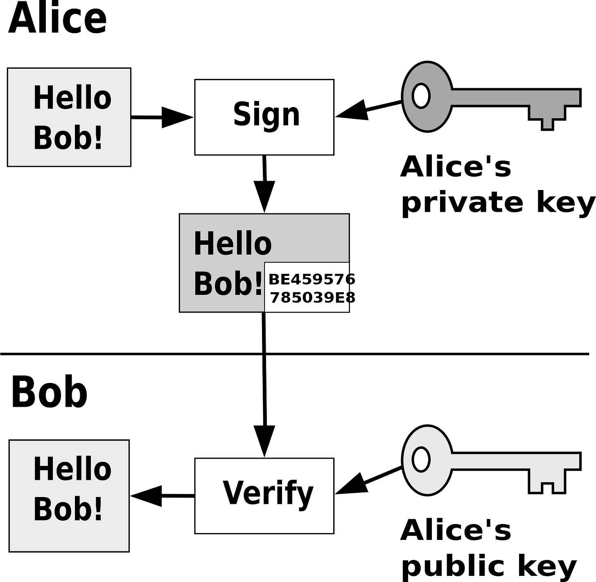
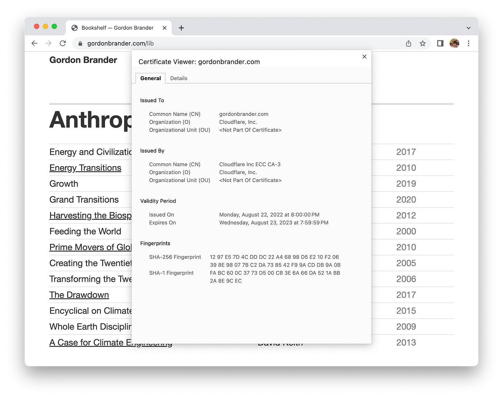

Summary：

文章指出，随着大型语言模型（LLMs）的出现，创造性表达变得更加便宜和易于访问，但同时也使垃圾邮件、网络钓鱼、骚扰暴徒和大规模影响操作变得更加便宜和易于访问。文章认为，未来 36 个月将会出现垃圾邮件、身份盗窃、网络钓鱼和勒索软件的浪潮。为了解决这个问题，文章提出了加密签名的概念，认为加密签名是重建信任的坚实基础。

---

**LLMs break the internet.** The going rate for GPT-4 is $0.06 per 1000 tokens, or about $0.00008 per word. New open source models like [Dolly](https://www.databricks.com/blog/2023/04/12/dolly-first-open-commercially-viable-instruction-tuned-llm) and [StableLM](https://github.com/stability-AI/stableLM/) will drop costs even further, and without the content restrictions.  

LLMs打破了互联网。GPT-4的价格是每1000个代币0.06美元，或每字约0.00008美元。像Dolly和StableLM这样的新开源模式将进一步降低成本，而且没有内容限制。

Thought has never been so cheap. Creative expression has never been so accessible. Also spam, phishing, harassment mobs, and mass influence ops have never been so cheap, so accessible.  

思想从未如此廉价。创造性的表达从来没有如此容易。同时，垃圾邮件、网络钓鱼、骚扰暴徒和大规模影响行动也从未如此便宜，如此容易获得。

You thought the internet was a mess before? Get ready for bots that beat the Turing test, [synthesize your voice](https://www.nytimes.com/2023/04/19/arts/music/ai-drake-the-weeknd-fake.html), generate fake social consensus at scale. We’re [seeing](https://twitter.com/d_feldman/status/1649466422018318338) the [beginnings](https://www.theverge.com/2023/4/25/23697218/ai-generated-spam-fake-user-reviews-as-an-ai-language-model) of this already. Expect a tidal wave of spam, identity theft, phishing, ransomware [over the next 36 months](https://twitter.com/DavidSHolz/status/1648763335591223296?s=20).  

你认为互联网以前是一团糟吗？准备好迎接击败图灵测试、合成你的声音、大规模产生虚假社会共识的机器人吧。我们已经看到了这种情况的苗头。预计在接下来的36个月里，将出现垃圾邮件、身份盗窃、网络钓鱼和勒索软件的浪潮。

The [Dead Internet Theory](https://en.wikipedia.org/wiki/Dead_Internet_theory) wasn’t wrong, just early.  

死亡互联网理论并没有错，只是早了。

> So what do we do about this world we are living in where content can be created by machines and ascribed to us? I think we will need to sign everything to signify its validity.  
> 
> 那么，对于我们所处的这个内容可以由机器创造并归属于我们的世界，我们该怎么做？我认为我们将需要签署所有的东西，以表明其有效性。  
> 
> When I say sign, I am thinking cryptographically signed, like you sign a transaction in your web3 wallet.  
> 
> 当我说签署时，我想的是加密签署，就像你在你的web3钱包中签署交易一样。
> 
> _(Fred Wilson on AVC, 2022. “[Sign Everything](https://avc.mirror.xyz/JpTblGUpDMA7SMS6HYdoYgbQE9H_a_wYq330pit_aRU)”)  
> 
> (Fred Wilson关于AVC，2022年。"签署一切")_

How can I know this is you, and not an AI? Because you’ve signed everything with a cryptographic key that only you control.  

我怎么知道这是你，而不是一个人工智能？因为你用只有你能控制的加密密钥签署了一切。

Signing means using [public key cryptography](https://en.wikipedia.org/wiki/Public-key_cryptography) to implement [cryptographic signatures](https://en.wikipedia.org/wiki/Digital_signature), one of the basic building blocks of secure computing. You sign your messages with your private key. I use your public key to verify your signature.  

签名是指使用公钥加密技术来实现加密签名，是安全计算的基本构件之一。你用你的私钥签署你的信息。我使用你的公钥来验证你的签名。

The magic behind this trick is a [one-way cryptographic hashing function](https://en.wikipedia.org/wiki/Cryptographic_hash_function). It takes your content and generates a corresponding string of numbers and letters, unique to your content and key.  

These arcane characters don’t mean much to you or me, but to a computer, they offer unforgeable proof that the document was signed with your specific key.  

Cryptographic signatures are the fundamental mechanism we use to guarantee authenticity and [non-repudiability](https://en.wikipedia.org/wiki/Non-repudiation) in software.  

这个技巧背后的魔力是一个单向的加密散列函数。它利用你的内容并生成一串相应的数字和字母，对你的内容和钥匙来说是独一无二的。这些神秘的字符对你或我来说意义不大，但对计算机来说，它们提供了不可伪造的证据，证明该文件是用你的特定密钥签署的。加密签名是我们用来保证软件的真实性和不可抵赖性的基本机制。

> Give me a firm spot on which to stand, and I shall move the earth. _(Archimedes)_  
> 
> 给我一个坚固的地方，让我站在上面，我就能移动地球。(阿基米德)

AI can fake just about any kind of social proof, but **AI cannot fake a cryptographic signature**. This makes cryptographic signatures a firm foundation around which we can rebuild trust.  

人工智能可以伪造几乎所有的社会证明，但人工智能无法伪造加密签名。这使得加密签名成为一个坚实的基础，我们可以围绕它重建信任。

You’ve seen cryptographic signatures before, but maybe didn’t know it. You know that little lock icon?  

你以前见过加密签名，但也许并不了解它。你知道那个小锁图标吗？

It turns out the web cryptographically signs some things over HTTPS, and if you click the lock, you can find a long string of numbers and letters—a cryptographic signature.  

Here’s the cryptographic signature for [my website](https://gordonbrander.com/).  

事实证明，网络通过HTTPS对一些东西进行加密签名，如果你点击锁，你可以发现一长串数字和字母--加密签名。下面是我的网站的加密签名。

Of course, I don’t need to know or care about this long string of numbers. Numbers are for computers. I’m a person. I look for the lock.  

当然，我不需要知道或关心这一长串的数字。数字是为计算机准备的。我是一个人。我找的是锁。  

Once we have provably-secure communication, it becomes possible to build a secure and friendly UI on top.  

一旦我们有了可证明安全的通信，就有可能在上面建立一个安全和友好的用户界面。

So, but if the web uses cryptographic signatures, what’s the problem? Aren’t we done here? Not quite. See, the web signs at the wrong layer.  

那么，但如果网络使用加密签名，有什么问题呢？我们在这里不是已经完成了吗？并非如此。看，网络在错误的层面上签名。

On the web, servers have signatures, people don’t. This is ok, but it answers the wrong question. In our post-LLM world, the question is “Who is this? Can I trust them?”  

在网络上，服务器有签名，人们没有。这很好，但它回答了错误的问题。在我们的后LLM世界，问题是 "这是谁？我可以信任他们吗？"

I don’t have a signature, you don’t have a signature. That means we can be spoofed. To fix the dead internet, we need to rebuild trust around people.  

我没有签名，你也没有签名。这意味着我们可以被欺骗。为了修复死气沉沉的互联网，我们需要重建人们周围的信任。

[ - Keith Haring — Google Arts & Culture")](https://substackcdn.com/image/fetch/f_auto,q_auto:good,fl_progressive:steep/https%3A%2F%2Fsubstack-post-media.s3.amazonaws.com%2Fpublic%2Fimages%2Fbb38a33a-7544-4563-9b92-429b18989b54_1200x786.jpeg)

Keith Haring, 1985. “Untitled (people)”  

凯斯-哈林，1985年。"无题（人）"

Websites have cryptographic signatures. People don’t. Why? Because the web’s security model is fundamentally feudal. From [Weird web3 energy](https://subconscious.substack.com/i/41480831/the-landscape-of-tech-is-essentially-feudal):  

网站有加密的签名。人们却没有。为什么？因为网络的安全模式从根本上说是封建的。从怪异的web3能源：

> Each app builds a moat and walls to protect the hoard of data its peasants produce. This is both for reasons of protection, and power. How did this condition emerge?  
> 
> 每个应用程序都建立了护城河和城墙，以保护其农民生产的囤积的数据。这既是出于保护的原因，也是出于权力的原因。这种状况是如何出现的？
> 
> Before the advent of the internet, apps ran on your computer and saved data to your computer. The internet flipped this around.  
> 
> 在互联网出现之前，应用程序在你的电脑上运行，并将数据保存在你的电脑上。互联网把这一点翻了过来。  
> 
> Web software ran remotely on server computers, and saved data remotely to giant databases.  
> 
> 网络软件在服务器计算机上远程运行，并将数据远程保存到巨型数据库中。
> 
> Now our data was on someone else’s computer. This introduced a host of challenges for anything that required trust.  
> 
> Websites had to roll their own solutions for identity, access control, data protection, and payments. [Browsers built walls around websites](https://developer.mozilla.org/en-US/docs/Web/Security/Same-origin_policy) to protect this valuable data from exfiltration. Websites became the boundary of trust, and apps followed the same model.  
> 
> 现在我们的数据在别人的电脑上。这给任何需要信任的事物带来了一系列的挑战。网站不得不为身份、访问控制、数据保护和支付推出自己的解决方案。 浏览器在网站周围建起了围墙，以保护这些宝贵的数据不被泄露。网站成为信任的边界，而应用程序也遵循同样的模式。

The centralized castle-wall approach to security and moderation worked well enough in the early days of the web—a web of small forums, blogs, and mods.  

Yet, as the internet has scaled, we’ve begun to push up against the limits of this centralized paradigm. Public social media is beset by memetic epidemics, bots, targeted harassment, [troll factories](https://www.nytimes.com/2018/02/18/world/europe/russia-troll-factory.html), influence ops, [click farms](https://www.youtube.com/watch?v=hsCJU9djdIc), fake reviews... And all of this was before LLMs. What happens when we 10x, 100x, 1000x the volume? The castle wall no longer affords much protection.  

在网络的早期，集中式的堡垒方法在安全和管理方面运作良好--一个由小论坛、博客和mods组成的网络。然而，随着互联网规模的扩大，我们已经开始对抗这种集中式范式的极限。公共社交媒体被记忆流行病、机器人、有针对性的骚扰、巨魔工厂、影响行动、点击农场、虚假评论所困扰...。而这一切都发生在法律硕士之前。当我们的数量增加10倍、100倍、1000倍时，会发生什么？城堡的墙壁不再能提供很多保护。

> [Ashby’s Law of Requisite Variety](https://en.wikipedia.org/wiki/Variety_(cybernetics)#Law_of_requisite_variety): If a system is to be stable, the number of states of its control mechanism must be greater than or equal to the number of states in the system being controlled.  
> 
> 阿什比的必要种类法则：如果一个系统要稳定，其控制机制的状态数量必须大于或等于被控制系统的状态数量。
> 
> Only variety can absorb variety.  
> 
> 只有多样性才能吸收多样性。

Centralized approaches to moderation just don’t scale. They don’t have the [requisite variety](https://subconscious.substack.com/i/37645825/the-infinite-variety-of-universal-machines) to actually moderate. There’s a reason we no longer live in castles, after all. Castles only work in the small.  

集中式的节制方法是没有规模的。他们没有必要的多样性来进行实际调节。毕竟，我们不再住在城堡里是有原因的。城堡只在小地方起作用。

We’ve actually gone through this kind of transition before. In the early days of networking, when we first started connecting computers, we began by creating trusted networks.  

These networks were surrounded by a castle wall, called a [firewall](https://en.wikipedia.org/wiki/Firewall_(computing)). Devices inside the firewall were trusted. Devices outside were not.  

实际上，我们以前也经历过这种转变。在网络的早期，当我们第一次开始连接计算机时，我们开始创建可信网络。这些网络被一个叫做防火墙的城堡墙所包围。防火墙内的设备是可信的。外面的设备则不被信任。

The problem was, as networks scaled, the boundaries of the castle wall had to be continually redrawn.  

The number of internet applications grew, opening up more and more backdoors through the castle wall. More people needed access inside the castle from more places.  

This castle wall approach did not have [requisite variety](https://subconscious.substack.com/i/37645825/the-infinite-variety-of-universal-machines) to match reality. Ultimately the castle wall was so large, with so many doors, it no longer afforded much protection.  

问题是，随着网络规模的扩大，城堡墙的边界必须不断地重新划分。互联网应用的数量不断增加，通过城堡墙打开了越来越多的后门。更多的人需要从更多的地方进入城堡内部。这种城堡墙的方法没有必要的多样性来配合现实。最终，城堡的墙是如此之大，有如此多的门，它不再能提供很多保护。

The answer to this dilemma was [zero-trust networking](https://en.wikipedia.org/wiki/Zero_trust_security_model). Forget the castle wall entirely. Rebuild trust around people.  

对这种困境的答案是零信任网络。完全忘记城堡的墙。在人与人之间重新建立信任。

We did this with networks. Now it’s time to do the same with sign-ins, authorization, identity, reputation. Sign everything, with [self-sovereign keys](https://en.wikipedia.org/wiki/Self-sovereign_identity) that only you control.  

我们在网络方面做到了这一点。现在是时候对签到、授权、身份、信誉做同样的处理了。签署一切，用只有你能控制的自我主权钥匙。

The first best thing that [self-sovereign cryptographic signatures](https://en.wikipedia.org/wiki/Self-sovereign_identity) give us is a way to build trusted networks together. I know you, you know me. We exchange keys. From then on, I know it’s you I’m talking to, not a bot impersonating you.  

自主权加密签名给我们带来的第一个最好的东西是一种共同建立可信网络的方式。我认识你，你认识我。我们交换钥匙。从那时起，我知道和我说话的是你，而不是一个冒充你的机器人。

Maybe you have a friend. I trust you to vouch for your friend’s key. You trust me to vouch for mine. Each of us trade keys for the folks we know.  

也许你有一个朋友。我相信你能为你朋友的钥匙作担保。你相信我可以为我的钥匙做担保。我们每个人都为我们认识的人交换钥匙。  

As the network grows, we begin to build up address books of trusted keys. Some keys may even be vouched-for by multiple trusted friends, increasing trust.  

随着网络的发展，我们开始建立可信钥匙的地址簿。有些钥匙甚至可以由多个受信任的朋友担保，增加信任。

> As time goes on, you will accumulate keys from other people that you may want to designate as trusted introducers. Everyone else will each choose their own trusted introducers.  
> 
> And everyone will gradually accumulate and distribute with their key a collection of certifying signatures from other people, with the expectation that anyone receiving it will trust at least one or two of the signatures. This will cause the emergence of a decentralized fault-tolerant web of confidence for all public keys.  
> 
> 随着时间的推移，你会从其他人那里积累钥匙，你可能想把他们指定为受信任的介绍人。其他每个人都将选择他们自己的受信任的介绍人。而每个人都会逐渐积累并与他们的钥匙一起分发来自其他人的认证签名集合，并期望任何收到它的人至少会信任其中的一个或两个签名。 这将导致所有公钥出现一个分散的容错的信任网。  
> 
> _(Phil Zimmerman, 1994. “[PGP User Manual](https://web.pa.msu.edu/reference/pgpdoc1.html#:~:text=As%20time%20goes,all%20public%20keys.)”)  
> 
> (Phil Zimmerman, 1994. "PGP用户手册")_

This decentralized approach to security is called a [web of trust](https://en.wikipedia.org/wiki/Web_of_trust). It feels intuitive, because it mirrors the way we form relationships in real life.  

这种分散的安全方法被称为 "信任之网"。它感觉很直观，因为它反映了我们在现实生活中形成关系的方式。

Using webs of trust, we can build private and secure [friend-to-friend networks](https://en.wikipedia.org/wiki/Friend-to-friend), like invite-only Discord servers, but peer-to-peer and decentralized.  

使用信任网，我们可以建立私人和安全的朋友间的网络，就像只邀请的Discord服务器，但却是点对点和分散的。

Webs of trust are perfect for [Dunbar-scale social](https://subconscious.substack.com/p/dunbar-scale-social). As the public internet becomes a dead internet, we can retreat to safe [cozywebs](https://studio.ribbonfarm.com/p/the-extended-internet-universe) of trust, protected from bot swarms by our secure cryptographic signatures.  

信任之网是邓巴规模的社交网络的完美选择。当公共互联网成为一个死的互联网时，我们可以撤退到安全的信任网，通过我们安全的加密签名来保护机器人群。

This is a start. However, beyond the [Dunbar scale](https://subconscious.substack.com/p/dunbar-scale-social) of about 150 people, friend-to-friend trust will begin to break down. You trust me, and you might trust my friend, but what about the friend-of-a-friend-of-a-friend?  

Trust just doesn’t scale by the transitive property. At a certain scale, you can’t keep track of all the players, so free-riders get away with it. So how might we scale webs of trust together?  

这是一个开始。然而，超过邓巴规模的约150人，朋友之间的信任将开始瓦解。你信任我，你也可能信任我的朋友，但是朋友的朋友的朋友呢？信任并不能通过传递性属性来扩展。在一定的规模下，你无法跟踪所有的参与者，所以自由乘坐的人就会逃脱。那么，我们如何才能将信任网扩展到一起呢？

**Reputation**: If you can sum up what others did in the past, then you can alter your actions in response. [Reputation transforms trust into a repeated game](https://en.wikipedia.org/wiki/Prisoner%27s_dilemma#The_iterated_prisoner's_dilemma). Bad actors get a bad reputation. Free-riding stops working. The winning move becomes win-win cooperation.  

Reputation is why you feel comfortable booking an AirBnB and sleeping in a stranger’s house, or catching an Uber and hopping into a stranger’s car.  

信誉：如果你能总结出别人过去的所作所为，那么你就能改变你的行动来应对。 信誉将信任转化为一个重复的游戏。坏的行为者会得到坏的声誉。搭便车的做法不再有效。胜利之举变成了双赢的合作。信誉是为什么你会觉得预订AirBnB并睡在陌生人的房子里，或者赶上Uber并跳上陌生人的车。

So, this is another advantage of self-sovereign public keys. We can layer on reputation at the protocol layer, for example, by summing up the public edits a key has made.  

所以，这是自主权公钥的另一个优势。我们可以在协议层为信誉加分，例如，通过对一个钥匙所做的公开编辑进行汇总。  

I don’t know you, but can I trust your key? Yes, it has a good reputation.  

我不认识你，但我可以相信你的钥匙吗？是的，它有良好的声誉。

Importantly, it’s even possible to attach reputation to keys, while supporting anonymity, pseudonymity, and multiple identities. I don’t need to know _who_ you are, just that you’re ok. This can be done through a trusted intermediary, or better yet, we might use **[Zero-knowledge proofs](https://en.wikipedia.org/wiki/Zero-knowledge_proof)** to trustlessly communicate reputation without revealing identity.  

重要的是，它甚至可以将声誉附加到钥匙上，同时支持匿名、假名和多重身份。我不需要知道你是谁，只需要知道你很好。这可以通过一个受信任的中间人来完成，或者更好的是，我们可以使用零知识证明，在不暴露身份的情况下无信任地交流信誉。

So self-sovereign keys, webs-of-trust, and reputation get us most of the way back to a functioning internet in the age of LLMs. They might not prove bot-or-not, but they prove trustworthiness, and that’s what matters.  

因此，自主权钥匙、信任网和声誉让我们在法律硕士时代回到了一个正常运作的互联网的大部分方式。它们可能无法证明是否是机器人，但它们证明了可信度，而这才是最重要的。  

But we can still go a step further…  

但我们仍然可以更进一步...

**Attestation**: when everyone has a key (or multiple keys), it’s also possible to attach attestations to those keys. Think various forms of “[bluecheck](https://en.wikipedia.org/wiki/Twitter_verification)”, signed and published to a decentralized source of truth:  

证明：当每个人都有一把钥匙（或多把钥匙）时，也有可能将证明附在这些钥匙上。想想各种形式的 "bluecheck"，签署并发布到一个去中心化的真相来源：

-   [Proof-of-humanity](https://en.wikipedia.org/wiki/Proof_of_personhood). The big idea here is to answer the question of bot-or-not, without actually having to reveal anything about the person’s identity.  
    
    You can get good-enough proofs-of-humanity through in-person events, anonymized identity, anonymized biometrics, webs of trust, or combinations of the above. Here again, [zero-knowledge proofs](https://en.wikipedia.org/wiki/Zero-knowledge_proof) make it possible to prove the attestation without revealing identity.  
    
    人性的证明.这里的大概念是回答 "是否是机器人 "的问题，而实际上不需要透露任何关于这个人的身份。你可以通过现场活动、匿名身份、匿名生物统计学、信任网或上述的组合获得足够好的人性证明。在这里，零知识证明再次使证明有可能不透露身份。
    
-   [Composable moderation](https://blueskyweb.xyz/blog/4-13-2023-moderation). You can also attach tags to keys, allowing for decentralized, bottom-up discovery and moderation. Anyone can create and apply tags (“spam”, “nsfw”).  
    
    Users and services can choose how these tags filter or alter the display of content. [Bluesky is taking this approach to moderation](https://blueskyweb.xyz/blog/4-13-2023-moderation). I’m excited by their work here.  
    
    可组合式的节制。你也可以将标签附加到钥匙上，允许分散的、自下而上的发现和管理。任何人都可以创建和应用标签（"垃圾邮件"，"nsfw"）。用户和服务可以选择这些标签如何过滤或改变内容的显示。 Bluesky正在采取这种方法进行审核。我对他们在这里的工作感到兴奋。
    

Importantly, public keys are part of the open protocol layer, meaning permissionless innovation becomes possible. New moderation tools and trust protocols can emerge from the bottom-up.  

重要的是，公钥是开放协议层的一部分，意味着无许可创新成为可能。新的调控工具和信任协议可以自下而上地出现。  

Some might be silly, others profound. We’ve barely explored what trust can look like over the network.  

有些可能是愚蠢的，有些则是深刻的。我们几乎没有探索过网络上的信任会是什么样子。

Decentralizing moderation is the only way for people to maintain the [requisite variety](https://en.wikipedia.org/wiki/Variety_(cybernetics)#Law_of_requisite_variety) needed to freely define their experience. This is an [evolutionary arms race](https://en.wikipedia.org/wiki/Evolutionary_arms_race) between consuming and conserving attention. Permissionless innovation in content generation demands permissionless innovation in content moderation.  

To find balance, positive feedback (LLMs) and negative feedback (moderation) must co-evolve together, at the same pace.  

去中心化的节制是人们保持自由定义其经验所需的必要多样性的唯一途径。这是一场消费和保存注意力之间的进化军备竞赛。内容生成方面的无许可创新要求内容控制方面的无许可创新。为了找到平衡，正反馈（LLMs）和负反馈（节制）必须以同样的速度共同发展。

All of this sounds a bit like [Noosphere](https://subconscious.substack.com/p/noosphere-a-protocol-for-thought), and that’s no accident. Noosphere is a decentralized protocol for thinking together with people _and_ AIs.  

所有这些听起来有点像Noosphere ，这并不是偶然的。Noosphere是一个分散的协议，用于与人和人工智能一起思考。

In Noosphere, you…  

在Noosphere，你...

-   Sign everything with a key that only you control.  
    
    用一把只有你能控制的钥匙签署一切。
    
-   Build webs of trust by following others and exchanging keys.  
    
    通过关注他人和交换钥匙来建立信任网。
    
-   Layer any reputation and attestations on top.  
    
    将任何声誉和证明放在上面。
    

At the core, Noosphere is a worldwide decentralized graph, made up of smaller public and private graphs, called _spheres_. Your sphere is signed with your key, and contains your data, and an address book of keys you trust. You can follow other spheres, they can follow you.  

When you do, you exchange keys, building webs of trust.  

在核心方面，Noosphere是一个世界性的去中心化图，由更小的公共和私人图组成，称为球体。你的球体用你的密钥签名，并包含你的数据和你信任的密钥的地址簿。你可以关注其他球体，他们也可以关注你。当你这样做时，你们交换钥匙，建立信任网。

The combination of open webs-of-trust, reputation, and attestation create the ground conditions for positive-sum collaboration. [Communication between keys becomes a repeated game](https://en.wikipedia.org/wiki/Prisoner%27s_dilemma#The_iterated_prisoner's_dilemma). Bad actors get a bad reputation. Free-riding stops working. The winning move becomes win-win cooperation.  

开放的信任网、信誉和证明的结合为正和协作创造了基础条件。 钥匙之间的交流成为一个重复的游戏。坏的行为者会得到一个坏的声誉。搭便车的做法不再有效。胜利之举变成了双赢的合作。

Not just collaboration between people, but also between people and AIs. We’re building Noosphere because we [imagine a world where people and AIs think together](https://subconscious.substack.com/p/everyone-will-have-their-own-ai), to reach new creative heights.  

不仅仅是人与人之间的合作，也包括人与AI之间的合作。我们正在建设Noosphere，因为我们想象一个人和AI共同思考的世界，以达到新的创造性高度。

With the right network, people and AIs can be smarter together than we are separately. Not the dead internet. The becoming-alive internet.  

有了正确的网络，人和人工智能在一起可以比我们单独的时候更聪明。不是死亡的互联网。是变得活生生的互联网。
