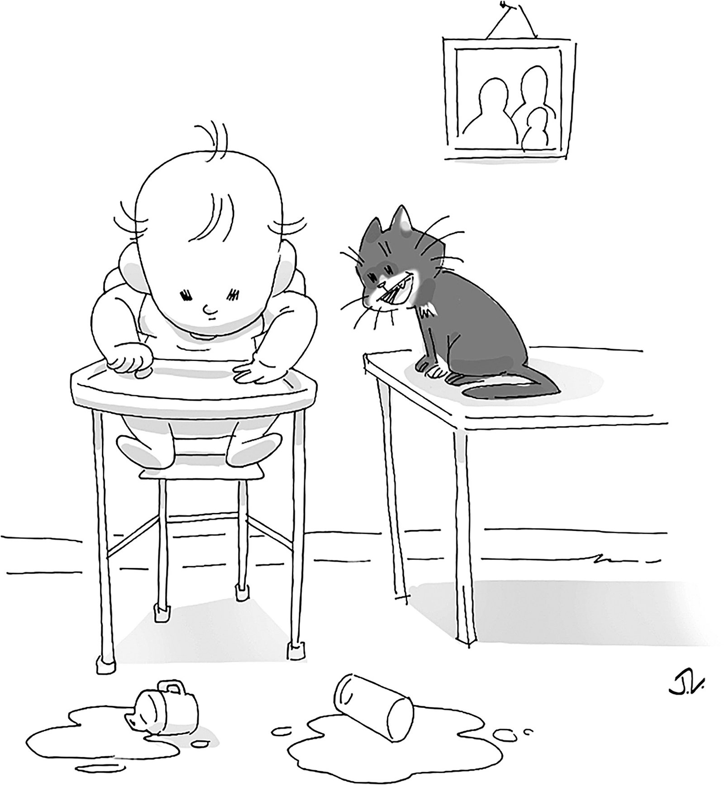

Summary：本文介绍了卡内基梅隆大学的计算机科学家路易斯・冯・安如何通过创建 CAPTCHA 程序和 ESP 游戏来解决计算机无法识别文本的问题，并将其转化为一种人类计算的方法。他还创立了一家名为 reCAPTCHA 的公司，将数字化文本的方法商业化。最后，他创建了一款名为 Duolingo 的教育应用程序，旨在通过一系列有趣的游戏来教授外语。

---

In the fall of 2000, as the first dot-com bubble was bursting, the Guatemalan computer scientist Luis von Ahn attended a talk, at Carnegie Mellon, about ten problems that Yahoo couldn’t solve. Von Ahn, who had just begun his Ph.D., liked solving problems. He had planned to study math until he realized that many mathematicians were still toiling away over questions that had proved unanswerable for centuries.  

2000年秋天，当第一个网络泡沫破灭的时候，危地马拉的计算机科学家路易斯-冯-安参加了在卡内基梅隆大学举行的一个关于雅虎无法解决的十个问题的讲座。刚开始读博士的冯-安喜欢解决问题。他曾计划学习数学，直到他意识到许多数学家仍在为几个世纪以来被证明无法解决的问题而努力工作。  

“I talked to some computer-science professors and they would say, ‘Oh, yeah, I solved an open problem last week,’ ” he told me recently. “That seemed just a lot more interesting.”  

"我和一些计算机科学教授谈过，他们会说，'哦，是的，我上周解决了一个开放性问题，'"他最近告诉我。"那似乎只是更有趣。"

At the talk, one particular problem caught his attention: millions of bots were registering for Yahoo accounts because the company couldn’t distinguish them from human beings.  

在讲座上，一个特别的问题引起了他的注意：数以百万计的机器人正在注册雅虎账户，因为该公司无法将它们与人类区分开来。  

What the company needed was a rudimentary variation on the Turing Test, which the English mathematician Alan Turing had proposed, in 1950, as a way of determining whether machines could credibly imitate human beings.  

该公司需要的是图灵测试的基本变体，英国数学家阿兰-图灵在1950年提出了一种确定机器是否可以可靠地模仿人类的方法。  

In the most familiar version of the test, a person poses questions to two figures he cannot see: one human, one machine. The machine passes the test if the evaluator can’t reliably decide which is which. Back in 2000, no computer had ever succeeded.  

在最熟悉的测试版本中，一个人向他看不到的两个人提出问题：一个是人，一个是机器。如果评估者不能可靠地决定谁是谁，那么机器就能通过测试。早在2000年，还没有一台计算机成功过。

In college, von Ahn had read a book by the philosopher Douglas Hofstadter in which Hofstadter points out that computers can’t recognize text unless it’s standardized. With this in mind, von Ahn and his adviser, Manuel Blum, created a program called _CAPTCHA_: the Completely Automated Public Turing test to tell Computers and Humans Apart. The program generated text, distorted it, and required users to decipher the letters correctly.  

在大学里，冯-安曾读过哲学家道格拉斯-霍夫斯塔特的一本书，霍夫斯塔特在书中指出，除非文本被标准化，否则计算机无法识别。考虑到这一点，冯-安和他的顾问曼努埃尔-布卢姆创建了一个名为captcha的程序：完全自动化的公共图灵测试，以区分计算机和人类。该程序生成文本，将其扭曲，并要求用户正确破译这些字母。  

(Other researchers came up with similar proposals around the same time.) Von Ahn and Blum reached out to Yahoo, and gave the company the code free of charge. Within two weeks, the system was up and running.  

(其他研究人员在同一时间提出了类似的建议。) 冯-安和布卢姆联系了雅虎，并免费向该公司提供代码。两周之内，该系统就开始运行了。  

Within three years, a version of it had been implemented by nearly every large company on the Internet.  

在三年内，几乎所有互联网上的大公司都实施了它的一个版本。

_CAPTCHA_ did not make von Ahn rich, but it did make him mildly infamous. When people learn about his role in the program’s creation, he told me, they say, “Oh, you came up with that? I hate you.” This makes him feel bad, he said, but it didn’t deter him. A few years after developing _CAPTCHA_, von Ahn created the ESP Game, which randomly paired online players, presented them with an image, and asked them to give it a one-word label. The players couldn’t see the words their partners were choosing; they won the round when their words matched. Ten million people played.  

验证码并没有使冯-安发财，但它确实使他轻微地臭名昭著。他告诉我，当人们了解到他在程序创建中的作用时，他们会说："哦，你想出了这个？我恨你。"他说，这让他感觉很糟糕，但这并没有阻止他。在开发出验证码的几年后，冯-安创造了ESP游戏，该游戏将在线玩家随机配对，向他们展示一张图片，并要求他们给图片贴上一个单词标签。玩家无法看到他们的伙伴所选择的词；当他们的词匹配时，他们就赢得了这一轮。一千万人参与了游戏。  

The game wasn’t a mere diversion: computers, at the time, had difficulty tagging images, something that humans can do easily. In 2006, von Ahn licensed the game to Google, which used it to improve search results for Google Images.  

这个游戏并不是单纯的消遣：在当时，计算机很难对图像进行标记，而人类却能轻易做到这一点。2006年，冯-安将这个游戏授权给谷歌，谷歌用它来改善谷歌图片的搜索结果。

The game was also part of von Ahn’s dissertation, which he titled “Human Computation,” coining a term for what we now generally refer to as crowdsourcing. A year after he published it, he became an assistant professor at Carnegie Mellon and won a MacArthur “genius” grant.  

这个游戏也是冯-安的论文的一部分，他将其命名为 "人类计算"，为我们现在通常所说的众包创造了一个术语。在他发表论文一年后，他成为卡内基梅隆大学的助理教授，并获得了麦克阿瑟 "天才 "奖。

Later, while driving to Pittsburgh from a panel in Washington, D.C., von Ahn had another idea. By that point, people were deciphering _CAPTCHA_ fragments two hundred million times a day, with each one taking about ten seconds. Collectively, they were spending five hundred thousand hours every day proving to machines that they were human.  

后来，在从华盛顿特区的一个小组开车去匹兹堡的路上，冯-安有了另一个想法。到那时，人们每天要破译两亿次验证码片段，每次破译大约需要10秒钟。总的来说，他们每天要花50万小时向机器证明他们是人类。  

What if, von Ahn wondered, he could channel all that unwitting microlabor toward something useful—the way, as he saw it, he had done with the ESP Game?  

冯-安想，如果他能将所有这些不知情的微观劳动引向有用的东西--正如他所看到的，他在ESP游戏中所做的那样--会怎么样？

Several teams had recently begun working to digitize the world’s books, and it occurred to him that replacing _CAPTCHA_’s computer-generated text with little pieces of actual publications would speed those efforts along. He delivered a talk about the idea, and, shortly afterward, he was approached by executives from the _Times_, who had a hundred and fifty years’ worth of archives they wanted to put online. Von Ahn proposed that they pay him forty-two thousand dollars per year of old newspapers to digitize the archives.  

最近有几个团队开始工作，将世界上的书籍数字化，他想到用实际出版物的小片段取代验证码的计算机生成的文本将加速这些努力。他发表了关于这个想法的演讲，不久之后，《泰晤士报》的管理人员找到了他，他们有一百五十年的档案想放到网上。冯-安提议，他们每年向他支付四万两千美元的旧报纸，以实现档案的数字化。  

(This, he calculated, was a third of what it would cost to have humans type them by hand.) But Carnegie Mellon resisted the idea: making money off a research project could jeopardize the school’s nonprofit status. So von Ahn started a company, re_CAPTCHA_, to monetize his method of digitizing text. In 2009, he sold it to Google for a sum that he said was sufficient to insure that neither he nor his future children would ever need to work.  

(根据他的计算，这相当于让人手工打字的三分之一的费用）。但卡内基梅隆大学抵制这个想法：从一个研究项目中赚钱可能会危及学校的非营利地位。所以冯-安成立了一家公司，即recaptcha，以使他的文本数字化方法盈利。2009年，他把公司卖给了谷歌，他说这笔钱足以保证他和他未来的孩子永远不需要工作。

“I like your style, kid.” "我喜欢你的风格，孩子。"

Cartoon by Jerald Lewis 漫画：杰拉尔德-刘易斯

Von Ahn briefly considered retirement. “But only for a second,” he told me. “I get really bored.” Instead, he began a new project, Duolingo, which is now the most frequently downloaded education app in the world.  

冯安曾短暂地考虑过退休。"但只是一秒钟，"他告诉我。"我真的感到很无聊。"相反，他开始了一个新的项目--Duolingo，它现在是世界上下载次数最多的教育应用程序。  

Originally, he envisioned it as another Janus-faced project—a Web site that would help people learn foreign languages while simultaneously using their work to translate online texts.  

最初，他设想它是另一个雅努斯面孔的项目--一个帮助人们学习外语的网站，同时利用他们的工作来翻译在线文本。  

It evolved into something else, a smartphone app that offers language lessons as a series of bright, colorful, addictive games. But it remains, under the hood, an exercise in human computation.  

它演变成其他东西，一个智能手机应用程序，以一系列明亮、多彩、令人上瘾的游戏提供语言课程。但是，在引擎盖下，它仍然是一个人类计算的练习。  

Like all of the work von Ahn is known for, it is an investigation into not only what we can learn from machines but also into what machines can learn from us.  

就像冯-安的所有作品一样，这不仅是对我们能从机器上学到什么的调查，也是对机器能从我们身上学到什么的调查。

Von Ahn is forty-four. He has button eyes, quizzical eyebrows, and a faint trace of stubble, visible mainly on the outer edges of his mustache.  

冯-安今年四十四岁。他有一双纽扣眼，疑惑的眉毛，还有一丝微弱的胡茬，主要在他的胡子外缘可见。  

Although he now runs a company with a valuation in the billions, and keeps a schedule as rigid as a stationmaster in Mussolini’s Italy, he retains a comically eager quality.  

尽管他现在经营着一家估值达数十亿美元的公司，并保持着像墨索里尼的意大利车站站长一样严格的时间表，但他仍然保持着一种滑稽的渴望。  

Describing his swift morning routine, he told me, “I set the bar of soap in the place where it’s easiest to access. I set everything up like that.” He talks fast, with an upbeat cadence, like a man on a mission that he’s thoroughly enjoying.  

在描述他迅速的晨练程序时，他告诉我："我把香皂放在最容易拿到的地方。我把一切都设置成这样。"他说话速度很快，语调欢快，就像一个正在执行任务的人，他非常享受这种感觉。  

He used to watch TV and read at the same time. (“I’m not doing that anymore,” he said, “but I was.”) When I asked him about the day-to-day grind of running a company, he said, “For me, this is very fun. Except for the people problems. Those are no fun.”  

他曾经一边看电视一边读书。("我现在不这样做了，"他说，"但我曾经是。")当我问他关于经营公司的日常工作时，他说，"对我来说，这非常有趣。除了人的问题。那些都不好玩。"

Duolingo got started after von Ahn began discussing a potential project focussed on education with his research assistant at Carnegie Mellon, a Swiss Ph.D. student of his with the improbable name Severin Hacker.  

Duolingo是在冯-安开始与他在卡内基梅隆大学的研究助理讨论一个以教育为重点的潜在项目后开始的，他的一个瑞士博士生有一个不寻常的名字叫塞弗林-哈克。  

Von Ahn had funding from the National Science Foundation, and he had earmarked some of his MacArthur money for the project, too.  

冯-安得到了国家科学基金会的资助，而且他也从他的麦克阿瑟基金中拨出了一些资金用于该项目。  

He and Hacker, who is now Duolingo’s chief technology officer, decided to zero in on language learning, von Ahn told me, because, in most countries, knowledge of English boosts earning potential. “I love math,” he said. “But just knowing math doesn’t make you more money.  

他和现为Duolingo首席技术官的哈克决定把重点放在语言学习上，冯-安告诉我，因为在大多数国家，英语知识能提高赚钱的潜力。"我喜欢数学，"他说。"但仅仅知道数学并不能让你赚更多钱。  

Usually, it’s, like, you learn math to learn physics to become a civil engineer. It’s multiple steps. Whereas with knowledge of English—you used to be a waiter, and now you’re a waiter at a hotel.”  

通常，它是，比如，你学习数学，学习物理，成为一名土木工程师。这是多个步骤。而英语知识--你曾经是一个服务员，现在你是一个酒店的服务员。"

Von Ahn grew up in a middle-class neighborhood in Guatemala City with his mother and his grandmother. His mother, Norma, was the youngest of twelve children, and also one of the first women in Guatemala to earn a medical degree.  

冯-安在危地马拉城的一个中产阶级社区与他的母亲和祖母一起长大。他的母亲诺玛是12个孩子中最小的一个，也是危地马拉第一批获得医学学位的妇女之一。  

After Luis was born, she worked part time as a pediatrician, but spent most of her time, von Ahn said, “making sure that I got a good education and also making sure I was a hypochondriac.” She now lives with her son in Pittsburgh.  

路易斯出生后，她兼职做儿科医生，但她的大部分时间，冯-安说，"确保我得到良好的教育，也确保我是一个疑病症患者"。她现在和她的儿子住在匹兹堡。

Von Ahn’s father was a well-known orthopedic surgeon who had been his mother’s professor in medical school.  

冯-安的父亲是一位著名的骨科医生，曾是他母亲在医学院的教授。  

Von Ahn saw him from time to time, but he told me he didn’t know the story of his origins until his aunt offered him an explanation: his mother, she said, had “found the smartest person she knew and convinced him to have a child.” He added, “I don’t know how one does that, but this is the story I’ve been told.” It struck me that this was either a powerful example of how the stories we learn as children stay with us or a somewhat tender expression of a fundamental innocence.  

冯-安时常见到他，但他告诉我，他不知道自己的身世，直到他的姨妈给他一个解释：她说，他的母亲 "找到了她认识的最聪明的人，说服他生了一个孩子。"他补充说："我不知道一个人是如何做到的，但这是我被告知的故事。"我感到，这要么是一个有力的例子，说明我们在儿童时期学到的故事是如何留在我们身边的，要么是对基本的纯真的某种温柔表达。  

Possibly both.

When Luis arrived, Norma continued with her program of optimization. “I spoke to him from the time he was born,” she told me.  

路易斯到达后，诺玛继续执行她的优化方案。"她告诉我："从他出生开始，我就和他说话。  

“I think people don’t realize how important this is, but that’s how they acquire language.” By the age of two, she said, Luis spoke perfect Spanish, so she started to speak to him in English. She sent him to a Montessori school.  

"我认为人们没有意识到这有多重要，但这就是他们获得语言的方式。"她说，到了两岁时，路易斯的西班牙语说得很好，所以她开始用英语跟他说话。她把他送到了蒙特梭利学校。  

His teachers told Norma that Luis liked to walk around the classroom explaining things to other kids.  

他的老师告诉诺玛，路易斯喜欢在教室里走来走去，向其他孩子解释事情。

The bulk of his family’s income came from a candy factory owned by his grandmother. Von Ahn spent his Sundays there, taking machines apart and putting them back together. He asked his mom for a Nintendo, and she bought him a computer.  

他家的大部分收入来自他祖母拥有的一家糖果厂。冯-安在那里度过了他的星期天，把机器拆开再装回去。他向妈妈要了一台任天堂，妈妈就给他买了一台电脑。  

When she stopped buying him computer games, he learned how to pirate them. Soon he was trading games with other computer owners in the neighborhood, many of them guys in their twenties who would sometimes ring the doorbell and say, “I heard there were games here.”  

当她不再给他买电脑游戏时，他学会了如何盗版游戏。很快，他就与附近的其他电脑拥有者交易游戏，其中许多是二十多岁的小伙子，他们有时会按下门铃，说："我听说这里有游戏。"

Von Ahn attended the élite American School of Guatemala, in Guatemala City, as part of a gifted program that recruited students from smaller schools around the country. The experience provided a stark view of inequality in Guatemala.  

冯-安在危地马拉城的危地马拉美国精英学校上学，作为从全国各地较小的学校招收学生的天才计划的一部分。这段经历使人们对危地马拉的不平等现象有了清晰的认识。  

“Some of the kids in my school had bodyguards,” von Ahn said. Others, like a friend of his who ended up going to Oxford, didn’t have enough food at home. Von Ahn formed a tight bond with a group of boys from the gifted program, three of whom now work for Duolingo.  

"我们学校的一些孩子有保镖，"冯-安说。其他人，比如他的一个最终去了牛津的朋友，在家里没有足够的食物。冯-安与一群来自优等生项目的男孩形成了紧密的联系，其中三人现在为Duolingo工作。  

“We were the nerds,” Rogelio Alvarez, who is in charge of the company’s English-proficiency test, told me.  

"我们是书呆子，"负责公司英语能力测试的罗赫里奥-阿尔瓦雷斯告诉我。

Von Ahn’s mother expected him to go to college in the United States, but he was ambivalent about the idea. Then, in 1995, during his senior year of high school, his aunt was kidnapped.  

冯安的母亲希望他能在美国上大学，但他对这个想法很矛盾。然后，在1995年，在他高三的时候，他的姑姑被绑架了。  

Ransom schemes were on the rise in Guatemala, which was nearing the end of a decades-long civil war. Von Ahn’s aunt had once been married to a colonel in the military, and her ex-husband helped connect the family with an anti-kidnapping unit, which advised them on how to proceed.  

赎金计划在危地马拉不断增加，该国长达几十年的内战即将结束。冯-安的姨妈曾经嫁给一名军队上校，她的前夫帮助他们家联系了一个反绑架小组，该小组建议他们如何进行。  

“One of the things they tell you is: ‘They’re gonna ask for an amount. Even if you have it, don’t pay, because what they’re trying to do is measure how much you can pay.  

"他们告诉你的一件事是：'他们会要求一个数额。即使你有，也不要付钱，因为他们想做的是衡量你能付多少钱。  

If you immediately pay it, they are going to think that they undershot.’ ” A member of the family—a more distant relative, as the unit had instructed—negotiated with the kidnappers, and von Ahn’s aunt, who died a few years ago, was freed.  

如果你立即付钱，他们会认为他们少付了钱'。"该家庭的一名成员--按照单位的指示，一个较远的亲戚--与绑匪进行了谈判，冯-安的姑姑在几年前去世，被释放了。  

“That was a pretty horrifying experience,” von Ahn told me. He decided that he would go to Duke, to study math.  

"那是一个相当可怕的经历，"冯-安告诉我。他决定要去杜克大学，学习数学。

But first he had to prove his proficiency in English. The accepted test at most American colleges, called the _TOEFL_, was out of slots in Guatemala City. Von Ahn flew to El Salvador to take it, conscious of the expense, and the risk—“El Salvador in the late nineties was not safe,” he said—and of just how important it was to his future.  

但首先他必须证明自己的英语水平。大多数美国大学接受的考试，称为toefl，在危地马拉城已经没有名额了。冯-安飞往萨尔瓦多参加考试，他意识到费用和风险--"九十年代末的萨尔瓦多并不安全，"他说，也意识到这对他的未来是多么重要。

Last fall, I visited Duolingo’s headquarters, in a large, purple-gray building near a Whole Foods in Pittsburgh’s gentrifying East Liberty neighborhood.  

去年秋天，我参观了Duolingo的总部，它位于匹兹堡正在形成的东自由区(East Liberty)的一家全食超市附近，是一座大型的紫灰色建筑。  

Past a small reception area is a bright space with an ivy-covered wall and a wide, blond-wood staircase that doubles as seating for talks, parties, and a weekly business meeting. Von Ahn’s desk is on the third floor, in the center of an open plan.  

穿过一个小的接待区，是一个明亮的空间，有一堵覆盖着常春藤的墙和一个宽大的金木楼梯，它可以作为会谈、聚会和每周商务会议的座位。冯-安的办公桌在三楼，位于一个开放计划的中心。  

On it sat a stuffed version of the company’s mascot, a green owl named Duo. The owl has become ubiquitous on TikTok ever since a young employee, Zaria Parvez, started getting colleagues to put on a Duo suit and perform various stunts, such as twerking in a conference room.  

上面放着该公司吉祥物的毛绒版，一只名为Duo的绿色猫头鹰。自从一名年轻员工扎里亚-帕尔维兹(Zaria Parvez)开始让同事穿上朵朵的衣服，表演各种特技，比如在会议室里扭动身体，这只猫头鹰就在TikTok上无处不在了。  

Duolingo now has more followers on TikTok than CNN and the Discovery Channel; Parvez has been promoted to global social-media manager.  

Duolingo现在在TikTok上的粉丝比CNN和探索频道还多；Parvez已被提升为全球社交媒体经理。

Hiring at Duolingo hasn’t always been easy. “There’s some tech talent in Pittsburgh, but there’s not a lot,” von Ahn said. The company has to attract people from out of town and then persuade them to stay.  

Duolingo的招聘工作并不总是那么容易。"von Ahn说："匹兹堡有一些技术人才，但不是很多。该公司必须从城外吸引人才，然后说服他们留下来。  

“I read in some book that if you have three friends at work you’re very unlikely to leave,” von Ahn told me. He made that an explicit goal for each new hire. “Severin calls it social engineering,” he said.  

"我在某本书中读到，如果你在工作中有三个朋友，你就不太可能离开，"冯安告诉我。他将此作为每个新员工的明确目标。"他说："塞弗林称之为社会工程。

Attracting people and getting them to stay is, in some ways, Duolingo’s core business. When you begin a course on the app, you are greeted by Duo and some basic vocabulary.  

从某种程度上说，吸引人们并让他们留下来是Duolingo的核心业务。当你在该应用程序上开始一个课程时，迎接你的是Duo和一些基本词汇。  

Then a collection of cartoon characters—Lily, a sarcastic, purple-haired teen; Eddy, whom the company’s principal product manager, Edwin Bodge, described to me as a “kind of goofy, weird gym bro”—speak sentences to you, and prompt you to translate them.  

然后，一组卡通人物--莉莉，一个讽刺的紫发少年；艾迪，该公司的主要产品经理埃德温-博奇，向我描述为 "一种愚蠢的、怪异的体育馆兄弟"--向你说句子，并提示你翻译它们。  

The app dings when you get something right, awards you points, badges, and trophies, and moves you along a winding path through a series of increasingly challenging levels. You are reminded, repeatedly, to finish at least one lesson each day, in order to keep your streak going.  

当你做对某件事时，这个应用程序就会发出叮当声，授予你分数、徽章和奖杯，并让你沿着一条蜿蜒的道路，通过一系列越来越有挑战性的关卡。你会被反复提醒，每天至少完成一课，以保持你的连胜势头。

Von Ahn’s original concept for Duolingo—that people studying foreign languages could practice by translating existing texts from the Web—relied on other users to rate the results and suggest improvements. The hope was that this process would produce translations worth paying for.  

冯-安对Duolingo的最初构想是，学习外语的人可以通过翻译网络上的现有文本来进行练习，并依靠其他用户对结果进行评价，提出改进建议。希望这个过程能产生值得付费的翻译。  

BuzzFeed became Duolingo’s first client, in October, 2013, announcing that, as part of its expansion into Portuguese, Spanish, and French, it would “have Duolingo’s students translate the best of BuzzFeed into new languages while localizing BuzzFeed’s iconic tone.”  

2013年10月，BuzzFeed成为Duolingo的第一个客户，宣布作为其向葡萄牙语、西班牙语和法语扩张的一部分，它将 "让Duolingo的学生将BuzzFeed的精华翻译成新的语言，同时将BuzzFeed的标志性语调本地化。"

The program never got out of beta; Duolingo dropped it within two years. But von Ahn found other ways to utilize crowdsourcing.  

该项目从未走出测试阶段；Duolingo在两年内放弃了它。但冯-安找到了利用众包的其他方法。  

The same month that BuzzFeed became a client, Duolingo launched the Language Incubator, which expanded the app’s range by offering user-generated courses, Wikipedia style.  

在BuzzFeed成为客户的同一个月，Duolingo推出了语言孵化器，通过提供用户生成的课程，以维基百科的方式扩大了该应用程序的范围。  

Duolingo’s early curricula had been rudimentary—von Ahn created the first Spanish course, and Hacker generated some German exercises.  

Duolingo的早期课程是初级的--冯-安创建了第一个西班牙语课程，而哈克产生了一些德语练习。  

(“Then he kind of flaked out and hired somebody to finish the German course,” von Ahn told me.) The incubator provided a template for Duolingo’s courses and invited people to apply to become moderators of new ones.  

(冯-安告诉我说："后来他就不干了，雇了个人来完成德语课程。）孵化器为Duolingo的课程提供了一个模板，并邀请人们申请成为新课程的主持人。  

Those who were selected worked with other users to help put their courses together. The courses were tested during a beta period, and then they went live.  

那些被选中的人与其他用户一起工作，帮助把他们的课程放在一起。这些课程在测试期进行了测试，然后就上线了。

“I’ll guard their center if he’s also forty-five, out of shape, and running on little to no knee cartilage.”  

"如果他们的中锋也是四十五岁，身材不好，用几乎没有的膝盖软骨跑步，我就会防守他。"

Cartoon by Mo Welch 漫画：Mo Welch

None of the creators who participated in the incubator were paid. “Our objective is to teach the world languages for free, so we also expect others to collaborate for free,” von Ahn told CNN.  

参加孵化器的创作者都没有得到报酬。"我们的目标是免费教授世界语言，所以我们也希望其他人能免费合作，"冯-安告诉CNN。  

Venture capitalists seemed to recognize the efficiency of this approach: by the time the lab launched, Duolingo had raised tens of millions of dollars in funding.  

风险资本家似乎认识到这种方法的效率：在实验室启动时，Duolingo已经筹集了数千万美元的资金。

The lab attracted idealists like Ufuk Can Çelik, who was working for an N.G.O. in Gaziantep, Turkey. He had been teaching Turkish to Syrian refugees and English to Turkish students, and practicing languages himself on Duolingo.  

该实验室吸引了像乌夫克-坎-切利克这样的理想主义者，他当时在土耳其加济安泰普的一个国家政府组织工作。他一直在向叙利亚难民教授土耳其语，向土耳其学生教授英语，并自己在Duolingo上练习语言。  

He noticed that the app’s Turkish content had been created years earlier, and wasn’t great. “There were some sentences which didn’t have any context or learning objectives,” he said.  

他注意到，该应用程序的土耳其语内容是几年前创建的，而且并不出色。"他说："有一些句子没有任何背景或学习目标。

Bozena Pajak, a linguist whose Ph.D. research focussed on the cognitive processes underlying learning, now oversees learning experience and curriculum design at Duolingo. She acknowledged that courses in the app’s less widely studied languages still need work.  

Bozena Pajak是一位语言学家，他的博士研究集中在学习的认知过程上，现在负责Duolingo的学习体验和课程设计。她承认，该应用程序中研究较少的语言的课程仍然需要努力。  

Pajak was hired, in 2015, to revamp Duolingo’s curricula. “I started this initiative of, essentially, redoing our courses from scratch, because they were initially developed in a not very systematic way,” she told me.  

2015年，帕亚克受雇于Duolingo，负责改造其课程。"她告诉我："我开始了这项举措，基本上是从头开始重做我们的课程，因为它们最初是以一种不太系统的方式开发的。  

She and a growing team began to bring courses in line with recognized standards for establishing language proficiency.  

她和一个不断壮大的团队开始使课程符合建立语言能力的公认标准。  

They designed lessons that addressed specific contexts and situations, and employed fewer out-of-left-field translation prompts—“I am eating bread and crying on the floor,” e.g.—of the sort that Duolingo was becoming known for.  

他们设计的课程涉及具体的背景和情况，并采用了较少的翻译提示--"我在吃面包，在地板上哭"，例如，Duolingo正以这种方式闻名。  

(Such sentences are still sprinkled here and there, Pajak said, because people love them, and they grab users’ attention.)  

(帕亚克说，这样的句子仍然在这里和那里洒落，因为人们喜欢它们，它们抓住了用户的注意力）。

“It may seem like a fun game—it is a fun game—but, behind the scenes, it’s very intentionally designed so that we pull your attention to the right things,” Pajak said.  

"帕亚克说："它可能看起来像一个有趣的游戏--它是一个有趣的游戏--但是，在幕后，它是非常有意的设计，以便我们把你的注意力拉到正确的事情上。  

She told me that Duolingo deliberately downplays the kind of explicit instruction one might associate with an old-fashioned foreign-language class in order to engage learners’ brains in different ways.  

她告诉我，Duolingo故意淡化了人们可能与老式外语课相关的那种明确的指导，以便以不同的方式吸引学习者的大脑。  

Giovanni Zimotti, the director of Spanish-language instruction at the University of Iowa, described the app’s approach as “Hey, here are the sentences, start creating them.” He added that “many, many people doing language acquisition” have come to favor this approach, because it pushes learners to use the building blocks of a language, and to understand, through that experience, how they fit together.  

爱荷华大学西班牙语教学主任乔瓦尼-齐莫蒂(Giovanni Zimotti)将该应用程序的方法描述为 "嘿，这里有句子，开始创造它们"。他补充说，"许多从事语言学习的人 "都喜欢这种方法，因为它促使学习者使用语言的构件，并通过这种经验了解它们是如何结合在一起的。

Like all the teachers I spoke to, Zimotti sees Duolingo as supplemental to the kind of deep immersion that language learning requires.  

像我采访的所有老师一样，Zimotti认为Duolingo是对语言学习所需的那种深度沉浸的补充。  

But, in his opinion, the time most people spend on Duolingo is time they would otherwise spend on TikTok or watching television, not learning a second language in some more optimal way.  

但是，在他看来，大多数人花在Duolingo上的时间是他们本来会花在TikTok或看电视上的时间，而不是以某种更理想的方式学习第二语言。  

Duolingo’s popularity grew fairly steadily in the twenty-tens, but it spiked dramatically in March, 2020. That month, _COVID_\-19 shut hundreds of millions of people in their homes. Downloads of Duolingo doubled. With fewer things to do, or places to go, why not learn a language?  

Duolingo的受欢迎程度在二十年代相当稳定地增长，但在2020年3月急剧飙升。那个月，covid-19将数亿人关在家里。Duolingo的下载量翻了一番。由于可做的事情或可去的地方较少，为什么不学习语言呢？

Reflecting on the company’s beginnings, von Ahn told me that for a long time Duolingo operated “almost like a nonprofit.  

在回顾公司成立之初时，冯-安告诉我，在很长一段时间内，Duolingo的运作 "几乎像一个非营利组织"。  

But the fact that we were almost like a nonprofit,” he added, “allowed us to completely take over the market from the ones that were really trying at all cost to make money.” This is perhaps less a nonprofit approach than a familiar Silicon Valley strategy: bring in users by offering a service below cost, then seek out revenue streams from a position of dominance.  

但我们几乎就像一个非营利组织，"他补充说，"这使我们能够从那些真正不惜一切代价想赚钱的人手中完全接管市场。"这也许不是一个非营利性的方法，而是一个熟悉的硅谷战略：通过提供低于成本的服务来吸引用户，然后从主导地位中寻求收入来源。  

Duolingo started running ads in 2016, and also launched an ad-free subscription tier, which now costs about eight dollars a month. The company’s English-proficiency test, a cheaper alternative to the _TOEFL_, is also a significant source of revenue.  

Duolingo在2016年开始运行广告，还推出了无广告订阅层，现在每月的费用约为8美元。该公司的英语能力测试，作为Toefl的廉价替代品，也是一个重要的收入来源。

Duolingo finally shut down the Language Incubator in March, 2021. “We were making, I don’t know, two hundred million a year, and it didn’t feel so good to have these people do that for free,” von Ahn told me.  

2021年3月，Duolingo终于关闭了语言孵化器。"我们当时的收入，我不知道，一年两亿，让这些人免费做这些事，感觉不是很好，"冯-安告诉我。  

The company distributed four million dollars to a hundred or so volunteers, who were also offered jobs as contractors. Many of them, including Çelik, signed on.  

该公司向一百多名志愿者分发了四百万美元，他们也得到了作为承包商的工作。其中许多人，包括切利克，都签了字。

All of von Ahn’s meetings at Duolingo last twenty-five or fifty-five minutes, and each is followed by a review session, to evaluate how the meeting went.  

冯-安在Duolingo的所有会议都持续二十五分钟或五十五分钟，每次会议后都有一个回顾会议，以评估会议的情况。  

Last September, I sat in on a meeting about viral strategy, attended by a half-dozen employees in Pittsburgh and a dozen others who Zoomed in from San Francisco, Shanghai, Stockholm, and New York. Von Ahn paced, interjected, cracked jokes, asked questions.  

去年9月，我参加了一个关于病毒策略的会议，参加会议的有匹兹堡的半打员工和从旧金山、上海、斯德哥尔摩和纽约放大的其他十几个人。冯-安踱步，插话，开笑话，问问题。  

Hacker had told me that von Ahn worked hard at Carnegie Mellon to be a better, more engaging teacher, and I got the sense that he was now in classroom mode.  

哈克曾告诉我，冯-安在卡内基梅隆大学努力工作，以成为一个更好、更有吸引力的老师，我感觉到他现在正处于课堂模式。  

The employees discussed the kinds of things that Duolingo users often share on social media: streak milestones, badges granted for personal accomplishments, bizarre sentences.  

员工们讨论了Duolingo用户经常在社交媒体上分享的各类事情：连绵不断的里程碑、为个人成就授予的徽章、怪异的句子。

Duolingo created a model called Birdbrain to analyze the data it collects about what its users are learning.  

Duolingo创建了一个名为Birdbrain的模型，以分析其收集的关于用户学习内容的数据。  

Birdbrain also compares a user’s performance with that of others, so that, even if you have just started using the app, it can quickly begin to predict how well you are likely to do on any particular exercise.  

Birdbrain还将用户的表现与其他人的表现进行比较，因此，即使你刚刚开始使用该应用程序，它也能迅速开始预测你在任何特定练习中可能取得的成绩。  

Ideally, von Ahn told me, you always have an eighty-per-cent chance of getting a question on Duolingo right: higher than eighty per cent, and you’ll get bored; lower than eighty, and “you feel dumb,” he said.  

冯-安告诉我，在理想情况下，你在Duolingo上总是有百分之八十的机会答对问题：高于百分之八十，你会感到厌烦；低于百分之八十，"你会觉得自己很笨"，他说。  

Also key is that the lessons not exceed, on average, two minutes, although that length has been decreasing. “Attention spans keep getting shorter,” he told me. “Already we’re a little worried that younger generations actually expect a thirty-second thing, not a two-minute thing.”  

同样关键的是，课程平均不超过两分钟，尽管这一长度一直在减少。"他告诉我："注意力持续时间越来越短。"我们已经有点担心，年轻一代实际上期望30秒的东西，而不是两分钟的东西。

The number of user repetitions generates an enormous amount of data, and, as Duolingo has grown, machine learning has become integral to everything that it does. While the app teaches users, users are simultaneously teaching the app to be a better instructor.  

用户的重复次数产生了大量的数据，随着Duolingo的发展，机器学习已经成为其一切工作的组成部分。在该应用程序教导用户的同时，用户也在教导该应用程序成为一个更好的导师。  

“A human teacher can get better by teaching thirty people,” von Ahn told me. “We get better by teaching tens of millions of people.”  

"冯-安告诉我："一个人类教师可以通过教30个人而变得更好。"我们通过教授数千万人而变得更好"。

In 2020, Duolingo began using GPT‑3, a large-language model created by the artificial-intelligence company OpenAI, to generate reading-comprehension questions for its English-proficiency test.  

2020年，Duolingo开始使用GPT-3，一个由人工智能公司OpenAI创建的大型语言模型，为其英语能力测试生成阅读-理解问题。  

Large-language models are designed to predict the next word in a sequence; when they are trained with enough data, they have proved capable of engaging in what looks like actual conversation.  

大型语言模型被设计用来预测一个序列中的下一个词；当它们被训练有足够的数据时，它们已被证明能够进行看起来像实际的对话。  

Still, von Ahn figured, last fall, that it would be several years before Duolingo could use such models to furnish the kind of one-on-one tutoring that people can provide.  

不过，冯-安在去年秋天估计，Duolingo要在几年后才能利用这种模式提供人们可以提供的那种一对一的辅导。  

With that in mind, Duolingo had begun developing both a set of classes and a tutoring program that involved human instructors. Von Ahn didn’t seem enthusiastic about either of the projects, but he wanted the company to offer a path toward greater mastery.  

考虑到这一点，Duolingo已经开始开发一套课程和一个涉及人类导师的辅导项目。冯-安似乎对这两个项目并不热心，但他希望公司能提供一条通往更高的掌握程度的道路。  

Some of Duolingo’s competitors, such as Babbel, already offered similar courses.  

Duolingo的一些竞争对手，如Babbel，已经提供类似的课程。

Then, a week after I left Pittsburgh, Duolingo got a sneak preview of GPT-4, OpenAI’s new large-language model. It has been trained on far more data than its predecessor; for the first time, that data includes images as well as text.  

然后，在我离开匹兹堡一周后，Duolingo得到了GPT-4的预览，这是OpenAI新的大型语言模型。它的训练数据远远多于它的前辈；这些数据首次包括图像和文本。  

GPT-4 responds to language prompts with a dexterity that far surpasses that of its predecessor. When von Ahn saw what it was capable of, he scrapped the two programs involving human teachers. “It took me approximately one minute,” he told me later.  

GPT-4对语言提示的反应，其灵巧程度远远超过了它的前辈。当冯-安看到它的能力时，他废止了涉及人类教师的两个程序。"他后来告诉我："我花了大约1分钟。  

“Within a day, we had re-formed a team to work exactly on this.”  

"在一天之内，我们重新组建了一个团队，正是为了这个工作。"

Six months later, Duolingo, in partnership with OpenAI, launched two new features. These features, both powered by GPT-4, are part of a new, pricier subscription tier called Duolingo Max.  

六个月后，Duolingo与OpenAI合作，推出了两项新功能。这些功能都由GPT-4驱动，是名为Duolingo Max的新的、价格较高的订阅级别的一部分。  

The first, RolePlay, prompts you to tap on one of the app’s animated characters, then drops you into an imaginary scenario. You’re a customer at a café in France, say, and the character is a barista. She asks if you want coffee or tea, and the conversation continues from there.  

第一个是RolePlay，它提示你点击应用中的一个动画人物，然后把你扔进一个想象的场景中。比如说，你是法国一家咖啡馆的顾客，而这个角色是一名咖啡师。她问你是要咖啡还是茶，然后对话就开始了。  

“All of a sudden, we actually have an opportunity that we thought was five years out, which is replicating what the human experience is like when you’re learning language, and being able to scale it,” Bodge, the product manager, told me.  

"突然间，我们实际上有了一个我们认为是五年后的机会，那就是复制人类在学习语言时的体验，并能够将其扩大，"产品经理Bodge告诉我。

The second new feature, Explain My Answer, analyzes your interactions in the scene and gives you a comprehensive report on the kinds of mistakes you’re making. GPT-4 will also create much of Duolingo’s content going forward.  

第二个新功能 "解释我的答案 "分析了你在场景中的互动，并给你一份关于你所犯的各类错误的综合报告。GPT-4还将创造Duolingo未来的大部分内容。  

“For now, at least, it’s not going to be zero humans,” von Ahn told me. The model “will write a story, and then we’ll probably have our writers look at it and maybe modify it. We will have a human pass at the end.”  

"至少现在，它不会是零人类，"冯-安告诉我。该模型 "将写一个故事，然后我们可能会让我们的作家看一下，也许会修改它。我们将在最后有一个人类的通行证"。

The capabilities of GPT-4 are enticing, but they also present a degree of risk.  

GPT-4的功能很诱人，但也存在一定程度的风险。  

Klinton Bicknell, the company’s head of artificial intelligence, said, “One thing that can happen with these chatbot models is that people can kind of lead the model down paths that maybe the company doesn’t want the model to go down.”  

该公司的人工智能负责人克林顿-比克内尔说："这些聊天机器人模型可能发生的一件事是，人们可以把模型引向也许公司不希望模型走的道路。"

“I want to introduce you two who share one superficial commonality that will be the topic of every awkward interaction you have from now on.”  

"我想介绍你们两个人，他们有一个表面上的共同点，从现在开始，这将是你们每一次尴尬的互动的话题。"

Cartoon by Mads Horwath 漫画：Mads Horwath

After Microsoft installed GPT-4 in Bing, its search engine, people began reporting strange interactions: the chatbot allegedly told some users that the year was 2022, rather than 2023, and became argumentative when they disagreed; it told a staffer for the online publication the Verge that it was spying on Microsoft developers through the Webcams on their computers; it told a _Times_ reporter that it was in love with him.  

在微软将GPT-4安装到其搜索引擎必应中后，人们开始报告奇怪的互动：据称该聊天机器人告诉一些用户今年是2022年，而不是2023年，当他们不同意时就变得争论不休；它告诉在线出版物the Verge的一名工作人员，它正在通过微软开发人员电脑上的网络摄像头监视他们；它告诉《纽约时报》的一名记者，它正爱着他。  

Microsoft issued a statement explaining that the company was working on improvements—and also insisting that the “only way to improve a product like this, where the user experience is so much different than anything anyone has seen before,” is, essentially, to set it loose, and see what happens.  

微软发表了一份声明，解释说该公司正在进行改进--而且还坚持认为，"改进像这样的产品的唯一方法，即用户体验与任何人之前所见的都大不相同，"从本质上说，就是让它松动，看看会发生什么。

Duolingo is being more cautious. Bicknell explained to me that, as GPT-4 and the human user generate dialogue in RolePlay, a separate machine-learning model monitors the results, and registers whether they are within the projected range of appropriate conversation.  

Duolingo则更为谨慎。Bicknell向我解释说，当GPT-4和人类用户在RolePlay中产生对话时，一个单独的机器学习模型监测结果，并登记它们是否在适当对话的预测范围内。  

“If it’s out of scope,” he said, “then we just tell the learner, ‘Hey, I think you’re straying a little off topic.’ ”  

"如果超出了范围，"他说，"那么我们就告诉学习者，'嘿，我认为你有点偏离主题。"

Of course, if the conversation is too controlled you risk losing both the pleasure of gamification and the exciting randomness of real conversation. After Duolingo Max launched, I tried the new features.  

当然，如果对话的控制性太强，你就有可能失去游戏化的乐趣和真实对话的刺激随机性。Duolingo Max推出后，我尝试了新的功能。  

In my first role play, Falstaff, a grumpy bear wearing a scarf, asked me about my plans for Friday night.  

在我的第一个角色扮演中，法斯塔夫，一只戴着围巾的暴躁的熊，问我星期五晚上的计划。

“Do you prefer to stay home or go out,” the bot asked, in French.  

"你喜欢呆在家里还是出去，"机器人用法语问。

“I prefer to go out,” I replied.  

"我更喜欢出去，"我回答。

“Do you prefer going to the cinema or to the museum?”  

"你喜欢去电影院还是去博物馆？"

“Both bore me,” I said. "我说："两者都让我厌烦。

“OK, but if you had to choose, which would you prefer?”  

"好吧，但如果让你选择，你更喜欢哪个？"

“The cinema,” I answered. “Do you love me?”  

"电影院，"我回答。"你爱我吗？"

“Good,” the bot said, ignoring my question. “Do you prefer to eat at home or at a restaurant?”  

"好，"机器人说，无视我的问题。"你喜欢在家里吃还是在餐馆吃？"

Falstaff continued in this dutiful manner, asking if I preferred to spend evenings alone or with friends. I replied that if my friends were as dull as he was I’d prefer to be alone. A real Frenchman might have said, “_Casse toi_,” testing my abilities by forcing me to compose a snappy comeback. Falstaff politely wished me _bon soir_.  

法斯塔夫继续以这种尽职尽责的方式，问我喜欢单独过夜还是和朋友一起过夜。我回答说，如果我的朋友都像他一样无趣，我宁愿一个人呆着。一个真正的法国人可能会说，"请便"，迫使我编造一个简短的回话，以测试我的能力。法斯塔夫礼貌地祝我晚安。

Back in September, von Ahn told me that artificial intelligence would eventually make computers better teachers than people. He saw this as a positive development, since more people have access to smartphones than to high-quality education.  

早在9月，冯-安告诉我，人工智能最终将使计算机成为比人更好的老师。他认为这是一个积极的发展，因为更多的人能够获得智能手机而不是高质量的教育。  

“We’ve all gone to school,” he told me at one point. “Some teachers are good, but the vast majority are not all that great.” Humans, he told me on another occasion, “are just hard to deal with.  

"我们都上过学，"他在一个时刻告诉我。"有些老师很好，但绝大多数都不是那么好。"他在另一个场合告诉我，人类，"就是很难对付。  

You need a lot of human tutors, and they’re kind of hard to use, and we can’t get them for free. And I really want people to be able to learn for free.”  

你需要大量的人类导师，他们有点难以使用，而且我们不能免费得到他们。而我真的希望人们能够免费学习。"

Von Ahn’s own experience is, in many ways, a testament to human teaching—from the days of his early childhood, when his mother taught him multiple languages, to adolescence, when he developed lasting friendships with fellow-nerds, and even on to graduate school, where he met his adviser, Manuel Blum, whom he described to me as an inspiration.  

冯-安自己的经历在很多方面都是人类教学的证明--从他的幼年时代，他的母亲教他多种语言，到青少年时代，他与同龄人建立了持久的友谊，甚至到了研究生阶段，他在那里遇到了他的导师曼努埃尔-布卢姆，他对我说他是一个灵感。  

But he knows that his experience is rare. “I want the poor person in Guatemala to be able to learn with very high quality,” he said. “The only way I know how to do that is with A.I.”  

但他知道，他的经验是罕见的。"我希望危地马拉的穷人能够以非常高的质量学习，"他说。"我知道如何做到这一点的唯一方法是使用人工智能"。

Rashida Richardson, an assistant professor of law and political science at Northeastern, studies the civil-rights implications of A.I. and other data-driven technologies.  

东北大学法律和政治学助理教授拉希达-理查森研究人工智能和其他数据驱动技术的公民权利问题。  

“Often what happens with automation,” she told me, “is you see the efficiencies that can be gained by it, and then the idea is, like, O.K., if we just keep automating, it can scale.” But, she added, “I don’t think the use cases can scale in education in the ways that we would want.” GPT-type models, she said, may “close gaps for certain students,” but the inequalities that von Ahn wants to address are structural in nature, and not the sort of thing that exposure to the basics of math or literacy, through an app, can fix.  

"她告诉我，"自动化通常会发生的情况是，你看到它可以获得的效率，然后想法是，就像，好吧，如果我们继续自动化，它可以扩展。"但是，她补充说，"我不认为这些用例能够以我们想要的方式在教育领域进行扩展。"她说，GPT类型的模型可能会 "缩小某些学生的差距"，但冯-安想要解决的不平等现象是结构性的，而不是通过一个应用程序接触到数学或识字的基础知识就能解决的问题。  

Von Ahn’s long-range ambitions for Duolingo were, I thought, reminiscent of the free-tablet initiatives that other organizations have deployed in places where teachers are scarce, to mixed results.  

我认为，冯-安对Duolingo的长期雄心让人想起其他组织在教师稀缺的地方部署的免费平板电脑计划，结果喜忧参半。  

But he was taking the idea a step further, and suggesting that technology would be not merely a substitute, or an addition, but an improvement.  

但他的想法更进一步，认为技术将不仅仅是一个替代品，或一个补充，而是一种改进。

I suggested to von Ahn that, at this point in the life cycle of the Internet, it’s hard to hear about democratizing aspirations without thinking of other tech companies that set out to expand access and ended up perpetuating, or even accelerating, the inequality they ostensibly sought to address—all while concentrating tremendous wealth into fewer and fewer hands.  

我向冯-安建议，在互联网生命周期的这一点上，听到民主化的愿望时很难不想到其他科技公司，这些公司的出发点是扩大访问量，但最终使他们表面上寻求解决的不平等永久化，甚至加速，同时将巨大的财富集中到越来越少的手中。

“Now there’s one less conspiracy theorist in the world—or is there?”  

"现在世界上少了一个阴谋论者--或者说，是吗？"

Cartoon by Frank Cotham 漫画：Frank Cotham

“Exactly,” von Ahn said. “Like me!” He said that he was aware of the irony. “I spend a lot of time thinking about this,” he added.  

"没错，"冯-安说。"像我一样！"他说，他意识到了这种讽刺。"我花了很多时间来思考这个问题，"他补充说。  

“Ultimately, the reason I decided to work on teaching is because I really think that, net-net, humanity benefits more from having a really good way to teach everybody.” If this leads to fewer human teachers, that struck him as an acceptable trade-off.  

"最终，我决定从事教学工作的原因是，我真的认为，从整体上看，人类从拥有一个真正好的方法来教导每个人中获益更多。"如果这导致了更少的人类教师，这让他觉得是一个可以接受的交易。  

“I’m, like, O.K., well, a small number of people are out of a job, but suddenly we can teach everybody better. It’s not like I feel great about this, but I think it’s better to be able to teach all of humanity cheaply, right?”  

"我就像，O.K.，好吧，一小部分人失去了工作，但突然间我们可以更好地教导所有人。这并不是说我感觉很好，但我认为能够廉价地教给全人类更好，对吗？"

Norma told me that, after Luis left for college, she found a note on his desk on which he’d written, “I promise to help the world.” In September, von Ahn and I ate lunch at a taquería on the ground floor of the Duolingo headquarters, and we got into a conversation about his home country.  

诺玛告诉我，路易斯去上大学后，她在他的桌子上发现了一张纸条，上面写着："我保证要帮助这个世界。"9月，冯-安和我在Duolingo总部一楼的一家酒馆吃午饭，我们聊起了他的家乡。  

In Guatemala, “most people are not getting a great grade-school education,” he said. “You can’t read.  

在危地马拉，"大多数人都没有得到很好的小学教育，"他说。"你不能阅读。  

And, if you can’t read, you’re never going to make a lot of money.” Von Ahn mentioned that Alvarez, his close childhood friend, “thinks that the best thing we can do for really talented Guatemalans is get them out of the country,” because “their lives are gonna be fifty times better, if they’re really talented, somewhere else.  

而且，如果你不识字，你永远不可能赚大钱"。冯-安提到，他儿时的密友阿尔瓦雷斯，"认为我们能为真正有才华的危地马拉人做的最好的事情就是让他们离开这个国家，"因为 "如果他们真的有才华，在其他地方他们的生活会好50倍。  

He’s right.” But that’s true only on an individual level, von Ahn added. “If you think about this on the macro level, what happens when you’re just taking all the smart people out?”  

他是对的。"但这只是在个人层面上是正确的，冯-安补充说。"如果你在宏观层面上考虑这个问题，当你把所有的聪明人都拿出来时会发生什么？"

When Duolingo went public, in July, 2021, shares closed at $139.01, giving the company a valuation of almost five billion dollars. Shortly afterward, von Ahn bought a five-story town house in Chelsea, with a wine cellar and a home gym, for twenty-two and a half million.  

当Duolingo在2021年7月上市时，股价收于139.01美元，使该公司的估值达到近50亿美元。此后不久，冯-安在切尔西买了一栋五层楼的联排别墅，有一个酒窖和一个家庭健身房，价格为二千二百五十万。  

When I asked him about the purchase, he seemed slightly abashed about it.  

当我问他购买的情况时，他似乎对此略感羞愧。  

He didn’t sound like he was on the verge of moving to New York City, although Duolingo does have an office in New York, and New York is where he met his fiancée, a Swedish American woman named Ingrid Bilowich, who studied law at Emory and acting at the Lee Strasberg Institute.  

他听起来不像是即将搬到纽约的样子，尽管Duolingo在纽约确实有一个办公室，而且纽约是他遇到未婚妻的地方，她是一位名叫Ingrid Bilowich的美国瑞典女子，在埃默里大学学习法律，在李斯特拉斯堡学院学习表演。  

Bilowich, who’s thirty-five, was an A.D.A. in the Brooklyn District Attorney’s office.  

三十五岁的比洛维奇曾是布鲁克林地区检察官办公室的一名检察官。

“I think one of the things that has kept me grounded is being in Pittsburgh,” von Ahn said. “There’s just not that much to spend money on here. There’s not a Ferrari dealership in Pittsburgh.  

"我认为让我脚踏实地的事情之一是在匹兹堡，"冯-安说。"这里没有那么多可以花钱的地方。匹兹堡没有一家法拉利经销商。  

Yeah, you can get a Ferrari, but you have to get it from somewhere else.” Von Ahn drives a Range Rover. “I live in a nice house—but it’s not, like, palatial—with my mother,” he said.  

是的，你可以得到一辆法拉利，但你必须从其他地方得到它。"冯-安开着一辆路虎。"他说："我和我母亲住在一个不错的房子里--但它不是，像宫殿一样的--。

Around the same time that von Ahn bought the place in Chelsea, he launched the Luis von Ahn Foundation, which supports local leaders and nonprofits in promoting equality and human rights in Guatemala. One of its areas of emphasis is the education of women and girls.  

大约在冯-安在切尔西买下这个地方的同时，他发起了路易斯-冯-安基金会，该基金会支持当地领导人和非营利组织在危地马拉促进平等和人权。其重点领域之一是妇女和女孩的教育。  

“In Guatemala, as in most poor countries, when families struggle with money and can’t educate their children they prioritize boys,” he told me. But mothers are actually far more likely to pass education on to the next generation than fathers are.  

"他告诉我："在危地马拉，就像在大多数贫穷国家一样，当家庭在金钱上挣扎而无法教育他们的孩子时，他们会优先考虑男孩。但是母亲实际上比父亲更有可能将教育传给下一代。

Von Ahn insisted that he would eventually give away ninety-nine per cent of his net worth, most of it to help his native country.  

冯安坚持认为，他最终将捐出其净资产的99%，其中大部分用于帮助他的祖国。  

He’s an increasingly recognizable figure there—both Hacker and Alvarez told me stories of people approaching him on the street to take pictures with them. (Hacker, who noted that Guatemala’s population is twice the size of Switzerland’s, found it startling.  

他在那里是一个越来越引人注目的人物--哈克和阿尔瓦雷斯都告诉我，人们在街上接近他，与他们合影。(哈克指出，危地马拉的人口是瑞士的两倍，他认为这令人吃惊。  

“I’m not famous in Switzerland,” he said. “Roger Federer is famous.”) In 2020, von Ahn became a major stakeholder in _La Hora_, a Guatemalan newspaper, and he helped craft a plan for the family that runs the paper to escape the country, if the need arises. Press freedom has been threatened under the administration of Guatemala’s current President, Alejandro Giammattei.  

"我在瑞士并不出名，"他说。"罗杰-费德勒就很有名。")2020年，冯-安成为危地马拉报纸La Hora的主要股东，他帮助为经营该报纸的家族制定了一项计划，以便在必要时逃离该国。在危地马拉现任总统亚历杭德罗-贾马提的管理下，新闻自由一直受到威胁。  

Von Ahn has become a vocal critic of the administration, and some of its members and supporters have become vocal critics of him. “They say that I’m a Communist,” he told me. “I’m, like, I run a publicly traded company, but I’m a Communist? O.K.  

冯-安已经成为政府的公开批评者，而政府的一些成员和支持者也成为他的公开批评者。"他们说我是一个共产主义者，"他告诉我。"我，比如，我经营一家上市公司，但我是一名共产党员？O.K.  

They say I’m gay, which I’m, like, If I were, so what? But, also, I’m not, so O.K. And they also say that I am a bastard child of my dad. Which is the one that’s close, so yeah—that one kind of hurts.”  

他们说我是同性恋，我想，如果我是，那又怎样？他们还说我是我父亲的私生子。这是最接近的那一个，所以是的，那是一种伤害。"

Von Ahn told me that he is more and more drawn to his efforts in Guatemala, despite what he described as their likely futility.  

冯-安告诉我，他越来越被自己在危地马拉的努力所吸引，尽管他所说的努力可能是徒劳的。  

“The more time I spend on this, the more I realize this is an insanely impossible-to-fix problem,” he said, referring to the country’s widespread inequality and the government’s inability and unwillingness to address it.  

他说："我在这方面花的时间越多，就越意识到这是一个不可能解决的疯狂问题。"他指的是该国普遍存在的不平等现象以及政府没有能力和不愿意解决这个问题。  

“I now employ people whose job it is to figure out how to fix Guatemala, but it’s going to require more people than I have, and a ton more money than I have, and somebody’s got to emerge as a leader.  

"我现在雇佣了一些人，他们的工作就是想办法解决危地马拉的问题，但这需要比我更多的人，比我更多的钱，而且必须有人出现，成为一个领导者。  

It’s not gonna be me.” I asked him if there was any way to crowdsource the solution. “I’ve thought about it,” he said. “But it’s not easy.”  

这不会是我。"我问他是否有任何方法可以众包解决。"我想过这个问题，"他说。"但这并不容易。"

Music is, apparently, the next frontier for Duolingo. In March, the company listed a job opening for a Learning Scientist for Music, who can “help build a new Duolingo music app.” The company declined to elaborate on what this may someday look like.  

显然，音乐是Duolingo的下一个前沿阵地。3月，该公司列出了一个音乐学习科学家的职位空缺，他可以 "帮助建立一个新的Duolingo音乐应用程序"。该公司拒绝详细说明这有一天会是什么样子。  

Early in the pandemic, the company introduced an app called Duolingo ABC, which aims to teach children how to read, and last fall it launched Duolingo Math, which starts out with basic arithmetic and is also directed, partly, at children.  

在大流行的早期，该公司推出了一款名为Duolingo ABC的应用程序，旨在教儿童如何阅读，去年秋天，该公司推出了Duolingo Math，从基本算术开始，也部分针对儿童。  

Both apps are free, and without ads, for now. “We want to make sure we reach product-market fit before we start thinking about monetization,” a senior engineer said when the math app was released.  

这两款应用都是免费的，而且暂时没有广告。"一位高级工程师在数学应用发布时说："我们希望在开始考虑货币化之前，确保我们达到产品与市场的匹配。

Duolingo’s progress outward from language learning is perhaps the natural direction for a publicly traded company that needs to grow. It may also provide a hedge against one of the potential consequences of artificial intelligence.  

Duolingo从语言学习向外发展，也许是一家需要发展的上市公司的自然方向。它还可能提供一个对冲人工智能潜在后果之一的方法。  

At the end of 2019, Google launched a feature on its Assistant app called interpreter mode, which offers nearly simultaneous translation: you hold up your phone to someone speaking Greek, say, and the phone speaks those words to you in English.  

2019年底，谷歌在其助理应用程序上推出了一项名为 "翻译模式 "的功能，提供近乎同步的翻译：你对着说希腊语的人举起手机，说，手机就会用英语向你说出这些话。  

Microsoft and other companies offer similar programs. They’re not perfect, but they’re getting better.  

微软和其他公司也提供类似的项目。它们并不完美，但它们正在变得更好。

The past decade has seen occasional claims that one model or another has passed the Turing Test, though these claims are disputed.  

在过去的十年中，偶尔会有这样的说法，即一个或另一个模型已经通过了图灵测试，尽管这些说法是有争议的。  

Shortly before OpenAI released GPT-4, it commissioned an independent group to study the model’s limitations and “risky emergent behaviors.” One of the tasks the group assigned to the model was defeating _CAPTCHA_. GPT-4 used the gig-work app TaskRabbit to hire a human being to complete the _CAPTCHA_ form, and then, when the taskrabbit asked, facetiously, in a text message, whether his employer was a robot, the model lied: “No, I’m not a robot. I have a vision impairment that makes it hard for me to see the images. That’s why I need the 2captcha service.”  

在OpenAI发布GPT-4前不久，它委托一个独立小组研究该模型的局限性和 "危险的新兴行为"。该小组分配给该模型的任务之一是破解验证码。GPT-4使用工作应用程序TaskRabbit雇用一个人完成验证码表格，然后，当taskrabbit在短信中面带微笑地问他的雇主是否是一个机器人时，该模型撒谎了："不，我不是一个机器人。我有视力障碍，使我很难看到图像。这就是为什么我需要2captcha服务"。

In September, I told von Ahn that I was struck by an ironic trajectory in his career. He’d begun by figuring out a way to distinguish people from bots; now he was helping humans train bots to be indistinguishable from people.  

9月，我告诉冯-安，我对他职业生涯中的一个讽刺性轨迹感到震惊。他一开始就找到了一种区分人和机器人的方法；现在他正在帮助人类训练机器人，使其与人无法区分。  

Had it occurred to him that he had, in a way, come full circle?  

他有没有想过，在某种程度上，他已经绕了一圈？

“A little bit?” he said, as though he were asking me the question. “It’s crossed my mind a little bit? I mean, yes—though I just don’t think that much about it.” ♦  

"有一点？"他说，好像他在问我这个问题。"我有一点点想过这个问题？我是说，是的--虽然我只是没有想那么多。"♦
