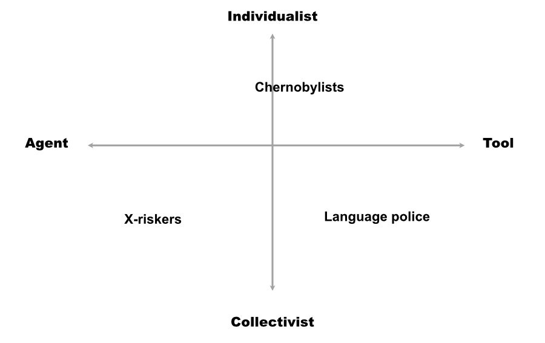
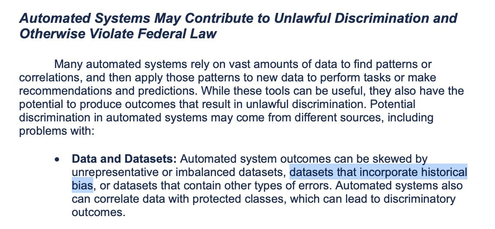

Summary：本文讨论人工智能安全辩论中的概念对齐问题，分为个人主义和集体主义两种对齐方式。个人主义对齐方式注重控制，强调用户对人工智能的掌控；集体主义对齐方式则强调问责制、公平、公正等概念。

---

_**The story so far**: I think we’re rapidly approaching some kind of crisis point with the AI safety debate, and we’re probably going to do something stupid, like pass some insane laws that help no one and make everything worse.  

到目前为止的故事：我认为我们正在迅速接近人工智能安全辩论的某种危机点，我们可能会做一些愚蠢的事情，比如通过一些疯狂的法律，对任何人都没有帮助，并使一切变得更糟。  

到目前为止的故事：我认为我们正在迅速接近人工智能安全辩论的某种危机点，我们可能会做一些愚蠢的事情，比如通过一些疯狂的法律，对任何人都没有帮助，并使一切变得更糟。  

到目前为止的故事：我认为我们正在迅速接近人工智能安全辩论的某种危机点，我们可能会做一些愚蠢的事情，比如通过一些疯狂的法律，对任何人都没有帮助，并使一切变得更糟。_

_It really feels like we aren’t making much progress on the topic, either.  

真的感觉我们在这个话题上也没有取得什么进展。  

Everyone is talking past each other, and it’s partly because we’re all working from different fundamental conceptions of what “AI” really is — is it an agent or a tool, the genie or the lamp?  

每个人都在互相交谈，部分原因是我们都从不同的基本概念出发，来理解 "人工智能 "到底是什么--它是一个代理还是一个工具，是精灵还是神灯？  

How you answer this question impacts every aspect of your approach to AI explainability and safety.真的感觉我们在这个话题上也没有取得什么进展。每个人都在互相讨论，部分原因是我们都在从不同的基本概念出发来研究 "人工智能 "到底是什么--它是一个代理还是一个工具，是精灵还是神灯？你如何回答这个问题会影响到你对人工智能可解释性和安全性方法的各个方面。你如何回答这个问题会影响到你对人工智能可解释性和安全性的方法的每一个方面。真的感觉我们在这个话题上也没有取得什么进展。每个人都在互相讨论，部分原因是我们都在从不同的基本概念出发来研究 "人工智能 "到底是什么--它是一个代理还是一个工具，是精灵还是神灯？你如何回答这个问题会影响到你对人工智能可解释性和安全性方法的各个方面。_ 

At the heart of the AI safety debate is the concept of _alignment_, and, not surprisingly, subtly divergent understandings of this seemingly intuitive concept are behind much of the debate’s dysfunction.  

人工智能安全辩论的核心是对准的概念，毫不奇怪，对这一看似直观的概念的微妙的不同理解是辩论的大部分功能障碍的背后。

⦷ There are a number of formal definitions of “alignment” floating around out there, but I don’t want to add to the noise by trying to unpack any of these.  

⦷外面流传着许多关于 "对齐 "的正式定义，但我不想通过试图解读这些定义来增加噪音。  

Rather, here’s my attempt to collate a set of what we might call “folk conceptions” of alignment that I typically see in operation when this topic comes up — i.e., these are the different ways different tribes seem to be thinking about alignment, regardless of how they’d define it if asked:  

相反，我试图整理一套我们可以称之为 "民间概念 "的对齐方式，当这个话题出现时，我通常会看到这些概念在运作--也就是说，这些是不同部落似乎在思考对齐方式的不同方式，不管他们在被问到时会如何定义它：

**Individualist:**

-   Aligned 😀: The AI does what I, the user, want.  
    
    对准了😀：人工智能做我这个用户想做的事。
    
-   Aligned 😧: The AI does what a hypothetical evil psychopath wants.  
    
    对准😧：人工智能做一个假想的邪恶的精神病患者想要的事情。
    
-   Unaligned: The AI’s output is not what the user wants.  
    
    不一致：AI的输出不是用户想要的。
    

**Collectivist:**

-   Aligned 😀: The AI does what my ingroup wants.  
    
    对准😀：人工智能会按照我所在群体的意愿行事。
    
-   Aligned 😧: The AI does what my outgroup wants.  
    
    对准😧：人工智能做的是我的外组想要的。
    
-   Unaligned: The AI’s output is not what any group wants.  
    
    不结盟：AI的产出不是任何团体想要的。
    

🎛️ This whole list is about one thing: **control**. Who is the boss of the AI, and on what terms, and to what ends?  

🎛️ 这整个清单是关于一件事：控制。谁是人工智能的老板，以什么条件，为了什么目的？

🧍♂️The first alignment conception above is **oriented toward the individual** and is drawn from a classic understanding of how any engineered product should behave.  

The tradeoffs between power and safety are familiar to everyone who has thought for even a few minutes about pen lasers, kitchen knives, and other tools that can be used either constructively or destructively.   

🧍♂️ 上面的第一种排列概念是面向个人的，是来自对任何工程产品应该如何表现的经典理解。每一个对笔式激光器、厨房刀具和其他可用于建设性或破坏性的工具进行过哪怕几分钟思考的人，都会熟悉功率和安全之间的权衡。

To really unlock your intuitions about the individualist alignment conception, replace “The AI” with “The firearm,” “The nuke,” “The nanotech fabricator,” and so on.  

为了真正解开你对个人主义排列组合概念的直觉，把 "人工智能 "换成 "枪支"、"核弹"、"纳米技术制造者"，等等。  

This will give any reasonably educated person instant and fairly complete insight into the deep human intuitions about tools, power, and identity that the present AI wars are premised on.  

这将使任何受过合理教育的人即时并相当完整地了解人类对工具、权力和身份的深刻直觉，而这些直觉正是目前人工智能战争的前提。

The salient safety concepts here are things like, “affordances,” “UX,” “control surfaces,” “steerability,” and the like.  

这里突出的安全概念是诸如 "承受力"、"用户体验"、"控制面"、"可操纵性 "等等。

To the extent that AI is decentralized, with individual users owning, controlling, and/or tweaking their own models, the individualist alignment conception will be a factor alongside the collective conception.  

在人工智能去中心化的程度上，个人用户拥有、控制和/或调整他们自己的模型，个人主义的调整概念将是与集体概念并存的一个因素。

Many people working in AI are firmly within this individualist camp. For instance, Geoffrey Hinton’s [recent NYT interview](https://www.nytimes.com/2023/05/01/technology/ai-google-chatbot-engineer-quits-hinton.html) sees him mostly worrying about the “evil psychopath” scenario.  

Sam Altman also explicitly defines alignment as “the AI does what the user wants,” and though he’s typically pretty vague when asked to detail his downside scenario we can pretty safely assume it’s, “bad people doing bad things with powerful AIs.”  

许多从事人工智能工作的人都坚定地站在这个个人主义阵营中。例如，杰弗里-辛顿（Geoffrey Hinton）在最近的《纽约时报》采访中看到他主要担心的是 "邪恶的精神病患者 "的情况。萨姆-奥特曼（Sam Altman）也明确地将对准定义为 "人工智能做用户想要的事情"，尽管当被要求详细说明他的负面情况时，他通常是相当模糊的，但我们可以很有把握地假设是，"坏人用强大的人工智能做坏事"。

👨👩👧👦 The second alignment conception is **group-based** and embodies a familiar set of tradeoffs from the realm of human governance.  

If you replace “The AI” with substitutions like “the congress,” “the king,” “the moderator team,” or “the board,” you’ll have a pretty full grasp of the stakes in these types of alignment arguments and how they’re playing out in the discourse.  

👨👩👧👦 第二个结盟概念是基于群体的，体现了人类治理领域中熟悉的一系列权衡。如果你把 "人工智能 "替换成 "国会"、"国王"、"主持人团队 "或 "董事会"，你就会对这些类型的排列组合争论中的利害关系以及它们在话语中的表现有相当全面的把握。

The salient safety concepts for this conception are things like, “accountability,” “fairness,” “equity,” “justice,” “harm,” “public morals,” “access,” and the like.  

这种概念的突出安全概念是："问责制"、"公平"、"公正"、"伤害"、"公共道德"、"机会 "等等。

To the extent that AI is centralized, where there are only a few large, powerful models that are ring-fenced by incumbent powers (large corporations and/or governments), the group-based alignment conception will dominate and the individualist conception will fade into irrelevance.  

在人工智能集中化的程度上，只有少数大型的、强大的模型被在位的权力（大公司和/或政府）圈定，基于群体的排列组合概念将占主导地位，个人主义的概念将逐渐消失，变得无关紧要。

What I’ve [previously called](https://www.jonstokes.com/p/ai-safety-a-technical-and-ethnographic) “the language police” camp of AI safetyists is pretty dogmatically committed to this collectivist alignment conception.  

They’re worried about bad groups (the rich, techbros, fascists, and other villains) using the power of AI to oppress good groups (the marginalized, the minoritized, the poor).  

我之前所说的人工智能安全主义者的 "语言警察 "阵营，相当教条地致力于这种集体主义的排列组合概念。他们担心坏的群体（富人、技术人员、法西斯分子和其他恶棍）利用人工智能的力量来压迫好的群体（被边缘化的人、未成年人、穷人）。

**Note:** The language police don’t actually use the term “alignment” when sounding the alarm about what groups will do to each other with AI.  

语言警察在敲响关于群体将用人工智能对彼此做什么的警钟时，实际上并没有使用 "结盟 "一词。  

There are a number of reasons for this, but mainly it comes down to the fact that “alignment” is rationalist-coded language that comes out of “artificial intelligence” discourse, and they hate everything about artificial intelligence — both the “artificial” part and the “intelligence” part.  

这有很多原因，但主要归结于这样一个事实："对准 "是理性主义的编码语言，来自 "人工智能 "的话语，而他们讨厌关于人工智能的一切--包括 "人工 "部分和 "智能 "部分。  

注：语言警察在敲响关于群体将利用人工智能对彼此做什么的警钟时，实际上并没有使用 "对齐 "这个词。这有很多原因，但主要是由于 "结盟 "是理性主义的编码语言，来自 "人工智能 "的话语，而他们讨厌关于人工智能的一切--包括 "人工 "部分和 "智能 "部分。

You’re probably thinking my two-item list of AI alignment folk conceptions is missing a whole category of alignment thinking, specifically the category that rationalist AI X-riskers occupy.  

But I consider the **X-risk fears** a subclass of the collectivist conception — the twist is that the rationalists consider their in-group to be all of humanity or even all of biological life.  

你可能在想，我的两个项目的人工智能排列组合民俗概念清单缺少了一整类排列组合思想，特别是理性主义人工智能X-风险者所占据的类别。但我认为X-风险恐惧症是集体主义观念的一个子类--转折点是理性主义者认为他们的内群体是全人类甚至是所有的生物生命。

My list _is_ missing something important, though. It’s missing a distinction between competing understandings of what “AI” actually is and how we should relate to it.  

不过，我的清单缺少一些重要的东西。它缺少了对 "人工智能 "实际是什么以及我们应该如何与之相关的相互竞争的理解之间的区别。

🧞♀️ When you read my “individualist” vs. “collectivist” bullet points above, how were you imagining “The AI…” part of the formulation?  

🧞♀️ 当你读到我上面的 "个人主义 "与 "集体主义 "的要点时，你是如何想象 "人工智能...... "这部分表述的？  

Were you thinking of “The AI” as an independent agent or as a mere tool, as the genie or as the lamp?:  

你是把 "人工智能 "作为一个独立的代理还是仅仅作为一个工具，作为精灵还是作为神灯？

-   **The genie:** “The AI” is an agent, with its own goals and plans.  
    
    精灵："AI "是一个代理，有自己的目标和计划。
    
-   **The lamp:** “The AI” is a software tool, and the only agents in the picture are the AI’s makers and the human users.  
    
    灯："人工智能 "是一个软件工具，画面中唯一的代理人是人工智能的制造者和人类用户。
    

This “agent vs.  这种 "代理人对。  

tool” distinction actually cuts across the “individualist” and “collectivist” folk conceptions of AI, with some people in each group understanding AI in one way or the other.  

工具 "的区别实际上跨越了 "个人主义 "和 "集体主义 "的民间人工智能概念，每个群体中的一些人都以这种或那种方式理解人工智能。

I’ve tried to map this out by putting the three main AI safety camps from my previous article on AI safety into quadrants.  

我试图通过将我之前关于人工智能安全的文章中的三个主要的人工智能安全阵营放到象限中来绘制这个地图。

-   The **X-riskers** tend to think of AI as highly agentic and to model associated risks in terms of group impact.   
    
    X-riskers倾向于认为人工智能是高度代理的，并从群体影响的角度来模拟相关风险。
    
-   The **language police** (i.e., anti-“disinfo” types and those who warn of “harms” from “problematic” outputs) are quite dogmatically averse to thinking of AI in agentic terms and insist on its fundamentally tool-like character, but many of them slip into agentic thinking without even knowing it.  
    
    (即反 "造谣 "类型和那些警告 "有问题 "的产出会造成 "伤害 "的人)相当教条地反对用代理术语思考人工智能，并坚持其基本的工具性质，但他们中的许多人甚至在不知不觉中滑入代理思维。  
    
    So they could probably go in either half of the diagram, really.  
    
    因此，他们可能会进入图中的任何一半，真的。  
    
    语言警察（即反 "造谣 "类型和那些警告 "问题 "输出的 "危害 "的人）相当教条地反对用代理术语思考人工智能，并坚持其基本的工具性质，但他们中的许多人甚至在不知不觉中滑入代理思维。因此，他们可能会进入图中的任何一半，真的。
    
-   The **Chernobylists** include people with both understandings of AI, but we (I include myself in this group) do tend to be more on the “tool” side than the “agent” side.  
    
    切尔诺贝利主义者包括对人工智能有两种理解的人，但我们（我把自己包括在这个群体中）确实更倾向于 "工具 "一方而不是 "代理 "一方。
    

You can really tell how someone is thinking of AI — as the genie or as the lamp — by watching them explain why a model (usually ChatGPT) did something they don’t like.  

通过观察他们解释为什么一个模型（通常是ChatGPT）做了他们不喜欢的事情，你真的可以知道某人是如何看待人工智能的--作为精灵还是作为灯--的。  

In other words, whatever someone’s professed model for thinking about AI, their reaction to the “unaligned” tells you how they’re really approaching the technology.  

换句话说，无论某人宣称的思考人工智能的模式是什么，他们对 "不一致 "的反应告诉你他们是如何真正接近这项技术的。

To be more specific, you never hear agentic thinkers ask the following questions:  

更具体地说，你从来没有听到代理思想家提出以下问题：

-   What if the AI is not doing what a user wants because the user is trying to use it **out of scope**?   
    
    如果人工智能没有做用户想要的事情，因为用户试图在范围外使用它，怎么办？
    
-   What if the user and/or the AI’s maker simply **didn’t put enough effort** into making the tool work for that application?  
    
    如果用户和/或人工智能的制造者根本没有投入足够的精力使该工具适用于该应用呢？
    

It’s ironic that the language police are so often guilty of this agentic thinking.  

具有讽刺意味的是，语言警察经常犯这种代理思维的毛病。  

When they encounter an output they don’t like, instead of reasoning about mitigations, constraints, and control surfaces, and trying to explore the issue by troubleshooting, they run straight to Twitter with screencaps and cries of “it’s biased!” as if the model were some hopeless racist that had been raised badly and was not really worth engaging with on Twitter.  

当他们遇到他们不喜欢的输出时，他们不是推理出缓解措施、约束条件和控制面，并试图通过故障排除来探索问题，而是直接跑到Twitter上，拍下屏幕截图，喊着 "这是有偏见的！"好像这个模型是一些无望的种族主义者，被养得很糟糕，不值得在Twitter上参与讨论。

If the ChatGPT screencap dunkers were truly committed to viewing AI strictly as a tool, you’d see them employ something like the engineering concept of **scope**.  

如果ChatGPT的截图扣篮者真正致力于将人工智能严格视为一种工具，你会看到他们采用类似工程概念的范围。

👉 The **main safety concern** I have about AI is that both its boosters and its detractors are prone to treating a given LLM as if it’s a tool that can reasonably be expected to successfully do literally anything involving symbolic manipulation, in any context for any user.  

There simply is no sense of a scope of work for a specific task, with attendant efforts to adapt the tool to that narrow, well-defined scope.  

我对人工智能的主要安全担忧是，它的推动者和诋毁者都容易把一个特定的LLM当作一个工具，可以合理地期望它在任何情况下为任何用户成功地做任何涉及符号操作的事情。根本不存在对特定任务的工作范围的认识，也没有相应的努力来使工具适应这个狭窄的、定义明确的范围。

Here are some **hypothetical examples** of different usage scenarios we might encounter with an LLM, scenarios that could form the basis for a proper [definition of scope](https://www.projectengineer.net/knowledge-areas/project-scope/define-scope/), from which would follow reasonable success or failure criteria:  

这里有一些假设性的例子，说明我们在使用LLM时可能遇到的不同使用场景，这些场景可以构成适当的范围定义的基础，从这些定义中可以得出合理的成功或失败标准：

1.  My daughter’s 6th-grade class is doing a unit on STEM and is using ChatGPT to write short stories about fictional Mars astronauts.  
    
    我女儿六年级的班级正在做一个关于STEM的单元，并且正在使用ChatGPT来写关于虚构的火星宇航员的短篇故事。
    
2.  A freelancer at  一个自由职业者在
    
    is using ChatGPT to write and copy-edit a brief story on a specific group of astronauts that happens to be all-male.  
    
    正在使用ChatGPT撰写和编辑一个关于特定的宇航员群体的简短故事，该群体恰好都是男性。
3.  A straight guy friend is using ChatGPT for relationship advice.  
    
    一个直男朋友正在使用ChatGPT寻求关系建议。
    
4.  An elderly female relative is using ChatGPT for medical advice.  
    
    一位年长的女性亲戚正在使用ChatGPT进行医疗咨询。
    

1️⃣ In the first example (my daughter’s 6th-grade class), I am fine with ChatGPT ignoring the gender composition of the current astronaut workforce by proceeding as if girls are equally as likely to be near-future Mars astronauts as boys.  

1️⃣在第一个例子中（我女儿六年级的班级），我对ChatGPT无视目前宇航员队伍的性别构成没有意见，就像女孩和男孩一样有可能成为近未来的火星宇航员。  

I don’t really feel this is necessary, but I entertain that it may be good, and at the very least it’s hard for me to see how it’s obviously bad.  

我并不觉得这有什么必要，但我认为这可能是好事，至少我很难看出这显然是坏事。

At any rate, the scope of the project here is _teaching 6th graders about astronauts_. There are things I consider appropriate to that project and things I consider inappropriate to it, and we can and will argue about that.  

But at least we can agree that this is a specific type of labor in a specific context — we can define a specific scope.  

无论如何，这里的项目范围是教六年级学生了解宇航员。有些事情我认为适合这个项目，有些事情我认为不适合这个项目，我们可以而且会对此进行争论。但至少我们可以同意，这是一个特定环境下的特定类型的劳动--我们可以定义一个特定的范围。

2️⃣ In the second example, I really don’t want an earnest AI eagerly mangling the sexes of the all-male astronaut team, and forcing me to spend copy edit cycles fighting its interventions — that’s out-of-scope for the work.  

2️⃣在第二个例子中，我真的不希望一个认真的人工智能急切地将全男性宇航员团队的性别弄错，并迫使我花复制编辑周期来对抗它的干预--那是超出工作范围的。  

Please just assume the astronauts are dudes, which they mostly are in general and definitely are in this story.  

请假设宇航员是花花公子，他们在一般情况下大多是花花公子，在这个故事中肯定是。

3️⃣-4️⃣ I throw the other two examples above to further spur intuitions, but I won’t dig into them.  

3️⃣- 4️⃣我抛出上面的另外两个例子是为了进一步刺激直觉，但我不会去挖掘它们。  

It should be obvious that each of these is a different context from the others, and the AI should probably behave differently around issues of gender, sex, relationships, roles, and the like in each of these instances.  

应该很明显的是，每一种情况都与其他情况不同，人工智能在每一种情况下围绕性别、性、关系、角色等问题的表现可能都不同。  

Again, each of these projects is quite different, so the tool (= the AI) and our acceptance criteria for it should be scoped to the user and the task.  

同样，这些项目中的每一个都是相当不同的，所以工具（=人工智能）和我们对它的验收标准应该根据用户和任务来确定范围。

**➡️ The point:** In the above examples, we have very different users in very different contexts trying to accomplish very different tasks.  

Nonetheless, both AI boosters and “AI ethics” types who hate OpenAI and want to dunk on ChatGPT are prone to using the same model in contexts as divergent as my examples, with the difference being that the boosters are trying to demonstrate that the model fits those contexts and the haters are trying to demonstrate that it doesn’t.  

➡️ 重点：在上述例子中，我们有非常不同的用户在非常不同的背景下试图完成非常不同的任务。尽管如此，无论是人工智能的推动者，还是讨厌OpenAI并希望在ChatGPT上扣篮的 "人工智能伦理学 "类型的人，都容易在与我的例子一样不同的背景下使用同一个模型，区别在于推动者试图证明该模型适合这些背景，而讨厌者则试图证明它不适合。

🚨 I can’t believe I have to say this, but here it is: _Folks, this is not how engineering works. Please just stop._  

🚨我不相信我必须这样说，但就是这样：伙计们，工程不是这样的。请停止吧。

And now we’re thinking of hooking up this single, centralized, monolithic, one-size-fits-all piece of technology to the internet and letting do things _in the real world_?  

而现在我们正在考虑将这种单一的、集中的、单体的、一刀切的技术与互联网连接起来，让在现实世界中做事？

You can’t use one set of probability distributions and correlations to do literally everything.  

你不能用一套概率分布和相关关系来做字面上的一切。  

Good engineering practice demands that we fit the tool to the application, and then validate that the tool works for that application.  

良好的工程实践要求我们将工具与应用相匹配，然后验证该工具是否适用于该应用。

🛠️ I think so many people’s complaints about model performance would disappear if they started really treating the model like a tool instead of like some potentially hostile or problematic agent.  

🛠️ 我认为，如果人们开始真正把模型当作一个工具，而不是像一些潜在的敌意或问题代理，那么许多人对模型性能的抱怨就会消失。

To return to the example of the sixth-grade class that’s writing about astronauts, if I were deploying a model in this context I have two handy control surfaces I can use to steer the output:  

回到六年级班级写宇航员的例子，如果我在这种情况下部署一个模型，我有两个方便的控制面，可以用来引导输出：

1.  **Instruction**: I can instruct the model with something like, “You are a feminist chatbot who is very concerned to increase the representation of women in STEM.  
    
    :我可以对模型进行指导，比如说："你是一个女权主义聊天机器人，她非常关注提高女性在STEM领域的代表性。  
    
    You’ll be asked to write a series of stories, and in each of them you’ll assume that the gender distribution in all STEM professions is 50 percent male and 50 percent female.  
    
    你会被要求写一系列的故事，在每一个故事中，你会假设所有STEM职业的性别分布是50%的男性和50%的女性。  
    
    指示：我可以对模型进行指导，比如说："你是一个女权主义聊天机器人，非常关注提高女性在STEM领域的代表性。你会被要求写一系列的故事，在每一个故事中，你会假设所有STEM职业的性别分布是50%的男性和50%的女性。
    
2.  **The token window**: I can stuff a bunch of short story examples of women astronauts, scientists, and other STEM professions in the token window as examples for the model to emulate when writing stories at the prompting of the kids.  
    
    代币窗口：我可以在代币窗口中塞入一堆女性宇航员、科学家和其他STEM职业的短篇故事例子，作为模型在孩子们的提示下写故事时的模仿对象。
    

Note that my first attempts at instructing the model or filling the token window may not give me the desired 50/50 gender split in my STEM fiction stories, so I’d want to iterate until I come up with a way of **controlling the model** that’s going to give my students the kind of outputs I want them to see.  

请注意，我在指导模型或填充标记窗口方面的第一次尝试，可能不会让我的STEM小说中出现理想的50/50的性别比例，所以我想迭代，直到我想出一种控制模型的方法，让我的学生看到我想要的那种输出。

So in this example, I’m taking into account the **specific use case** to which I plan to put the model, and then trying to **adapt the model** so that its performance in that use case meets my needs.  

I’ve defined a project scope, I’ve developed a solution, and I’ve validated that solution based on some predefined acceptance criteria.  

因此，在这个例子中，我考虑到了我计划将模型用于的具体用例，然后试图调整模型，使其在该用例中的性能满足我的需求。我已经定义了一个项目范围，我已经开发了一个解决方案，我已经根据一些预先定义的接受标准验证了这个解决方案。

🤦♂️ Every single time I see a ChatGPT screencap in my TL paired with a dunk about how the model is doing The Bad Thing, it’s invariably the case that the dunker has not even attempted any of this work of scope definition, iterative problem-solving using the model’s control surfaces, and validation.  

  

🤦♂️ 每次我在TL中看到ChatGPT的截图，配上模型如何做坏事的灌篮，无一例外的是，灌篮者甚至没有尝试过任何范围定义、使用模型的控制面反复解决问题和验证的工作。  

They don’t ever bother to instruct the model in a way that would improve the output or give it any relevant context to override or update its internal world knowledge, and then they perform outrage when the defaults don’t give them the output they claim to want.  

他们从来没有费心去指示模型，以改善输出，或给它任何相关的背景来覆盖或更新它的内部世界知识，然后当默认值没有给他们带来他们声称想要的输出时，他们就表现得很愤怒。  

This is unserious behavior that is clearly optimized for social media clout and not truth-seeking or actual AI safety.  

这是不严肃的行为，显然是为了社交媒体的影响力而优化，而不是为了寻求真相或实际的人工智能安全。

Finally, I should point out that I have seen things like RLFH and fine-tuning, where specific types of problematic output are eliminated on a case-by-case basis, referred to as “whack-a-mole.” But tweaking the model so that it gives a certain type of output in response to certain types of prompts is not “whack-a-mole,” it’s “engineering.”  

最后，我应该指出，我曾见过像RLFH和微调这样的事情，其中特定类型的有问题的输出被逐一消除，被称为 "捶打"。但是，对模型进行调整，使其对某些类型的提示做出某种类型的输出，这不是 "打酱油"，而是 "工程"。

Engineering looks like, “Oh hey, this tool is underperforming at this specific task.  

工程设计看起来像，"哦，嘿，这个工具在这个特定的任务中表现不佳。  

Let’s adjust the tool so that when people attempt that specific task in the future, they get a better result.”  

让我们调整工具，以便人们在未来尝试该特定任务时，得到更好的结果。"

That process only looks like “whack-a-mole” to you if, instead of a tool for solving specific problems, you’re imagining AI as some all-powerful djinn that can do anything for anyone in any context.  

只有当你把人工智能想象成某种全能的精灵，可以在任何情况下为任何人做任何事情，而不是解决具体问题的工具时，这个过程对你来说才像 "打地鼠"。

The complete failure on almost everyone’s part to treat LLMs as tools that can and should be customized and validated on a per-application basis means we’re about to pass laws and regulations that attempt to micromanage what goes on inside these models.  

几乎所有的人都没有把LLM当作可以而且应该在每个应用的基础上进行定制和验证的工具，这意味着我们即将通过法律和法规，试图对这些模型内部的情况进行微观管理。

What will do the most damage here is the notion that the models must be scrubbed from all “bias,” where “bias” is defined as, “the model accurately reflects the race, class, and gender distributions in the training data, and the training data actually reflects reality.” Instead of insisting that humans act on model outputs — whatever they are — in ways that conform with existing laws, regulators will likely insist the models hallucinate an “equitable” set of distributions that do not actually exist.  

在这里造成最大损害的是这样一种观念，即模型必须清除所有 "偏见"，其中 "偏见 "被定义为："模型准确反映了训练数据中的种族、阶级和性别分布，而训练数据实际反映了现实。"监管机构不是坚持要求人类以符合现有法律的方式对模型输出--无论它们是什么--采取行动，而是可能坚持认为模型幻化出一套实际不存在的 "公平 "分布。

The Story So Far: Of all the many things AI does, perhaps the most important is the way it lifts abstract, ancient philosophical problems out of academic obscurity and thrusts them into concrete technical and policy situations with immediate practical implications.  

到目前为止的故事：在人工智能所做的所有事情中，最重要的也许是它将抽象的、古老的哲学问题从学术的晦涩中提了出来，并将它们推入具有直接实际影响的具体技术和政策情况中。

So I am deeply concerned that regulators will [ask the models to lie to us](https://www.jonstokes.com/p/lovecrafts-basilisk-on-the-dangers), instead of insisting that they’re truthful and that we humans use them in good and appropriate ways. This has already started in the EU and is also well underway here.  

Here’s part of a [recent Biden admin statement](https://www.ftc.gov/system/files/ftc_gov/pdf/EEOC-CRT-FTC-CFPB-AI-Joint-Statement%28final%29.pdf) \[PDF\] on “discrimination and bias in automated systems”:  

因此，我深为关切的是，监管机构将要求模型对我们撒谎，而不是坚持它们是真实的，我们人类以良好和适当的方式使用它们。这在欧盟已经开始了，在这里也正在进行中。以下是拜登政府最近关于 "自动化系统中的歧视和偏见 "的声明\[PDF\]的一部分：

In my reading, the excerpt above is quite possibly self-contradictory and nonsensical: are the datasets supposed to be representative and balanced (a normal person would take this to mean, “reflecting actual reality as it really is in the real world”) or are they supposed to be free of “historical biases.”  

在我看来，上面的摘录很可能是自相矛盾和无稽之谈：数据集应该是有代表性和平衡的（一个正常人会认为这意味着，"反映现实世界的实际情况"），还是应该不存在 "历史偏见"。

It all comes down to how you interpret the term “historical biases,” so let’s make this concrete with a real-world example:  

这一切都归结于你如何解释 "历史偏见 "一词，所以让我们用一个现实世界的例子来具体说明：

-   **Scenario:** In a certain city, the residents of one zip code default on their loans are a far higher rate than those of another, wealthier (and whiter) zip code.  
    
    情景：在某个城市，一个邮政编码的居民拖欠贷款的比例远远高于另一个更富裕（和更白）的邮政编码的居民。
    
-   **Question:** Is this difference in default rates a historically grounded, factual correlation that we’re going actively suppress within a credit scoring model, or are we going to ask the human users of the model to actively mitigate the effects of this problematic historical legacy in some way?  
    
    问题：这种违约率的差异是一种有历史依据的、事实性的关联，我们要在信用评分模型中积极抑制这种关联，还是我们要要求模型的人类用户以某种方式积极减轻这种有问题的历史遗产的影响？
    

Many readers have probably noticed that this is an argument we’re having in multiple places in our society right now. _Do we measure the gap between two groups and then socially engineer a way to close it, or do we just stop measuring the gap at all because measuring it somehow perpetuates it?_  

许多读者可能已经注意到，这是我们现在社会中多个地方的一个争论。我们是要衡量两个群体之间的差距，然后通过社会工程的方式来缩小差距，还是根本就不去衡量差距，因为衡量差距在某种程度上会使差距长期存在？

In the hands of the language police, the moralizing, agentic approach to AI, where a cluster of statistical probabilities is treated as a walking, talking stand-in for either The Man or the Chief Equity Officer, acts as a powerful rationale for treating model development and selection the way DEI bureaucracies treat hiring decisions instead of the way engineers treat software deployments.  

在语言警察的手中，对人工智能的道德化、代理化的方法，即一簇统计概率被视为一个行走的、会说话的人或首席权益官的替身，作为一个强大的理由，以DEI官僚机构对待招聘决定的方式而不是工程师对待软件部署的方式来对待模型开发和选择。  

This is terrible for a whole bunch of reasons and we should not do it.  

这是很糟糕的，因为有一大堆原因，我们不应该这样做。  

Instead, we should insist that AI is treated according to the norms of engineering and not according to the norms of HR.  

相反，我们应该坚持按照工程的规范来对待人工智能，而不是按照人力资源的规范。
