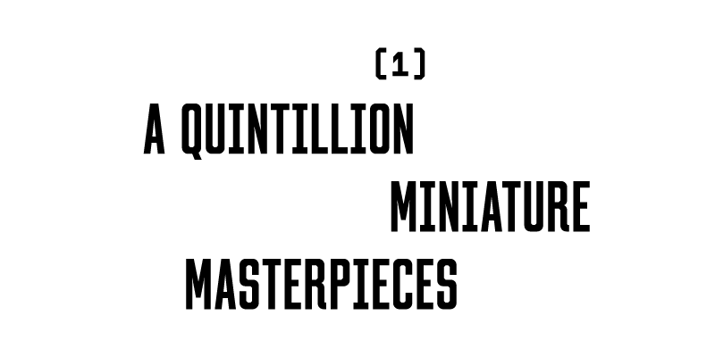
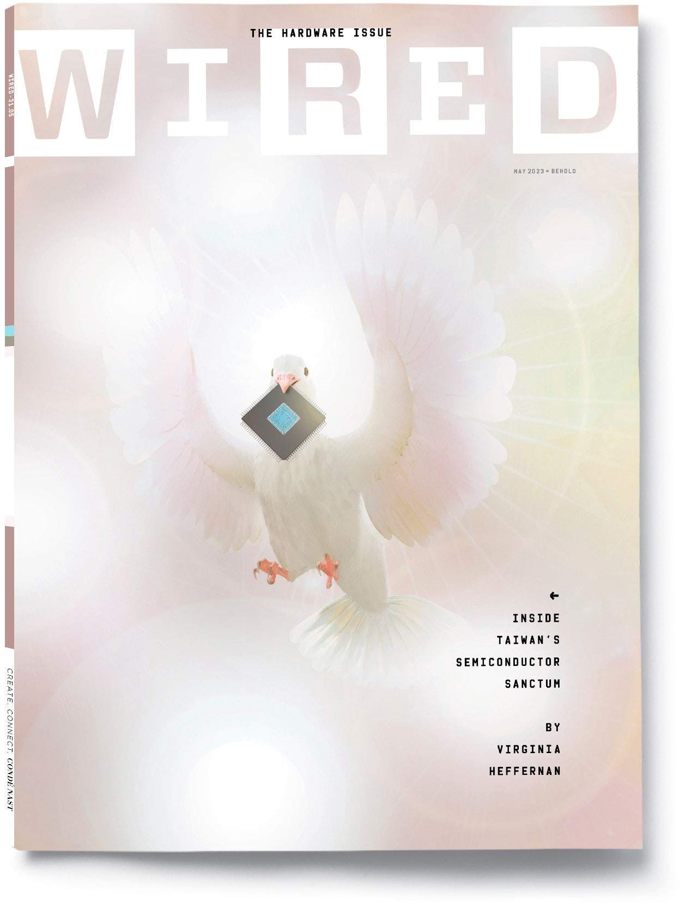
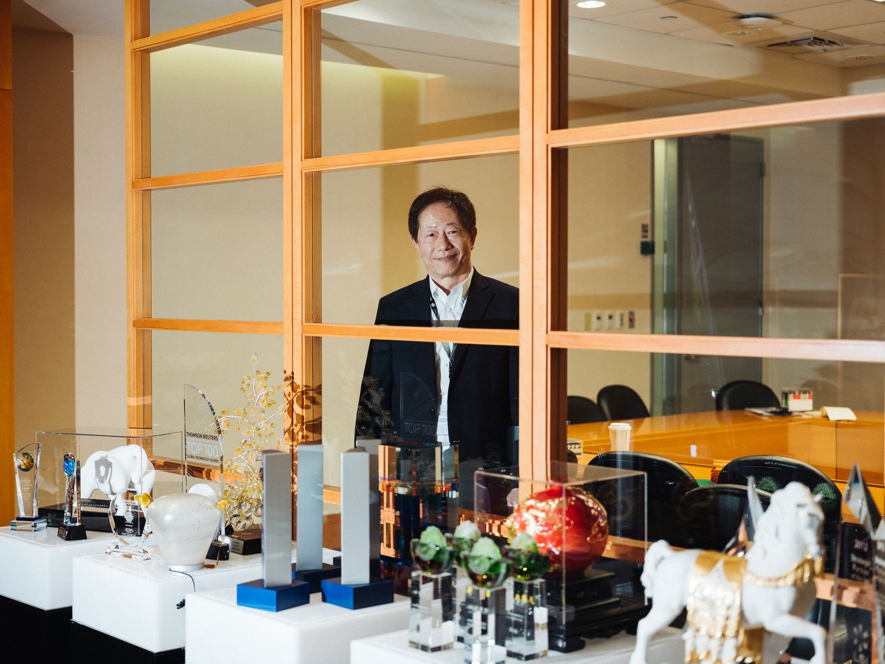
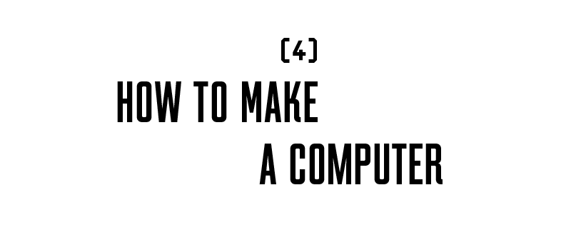
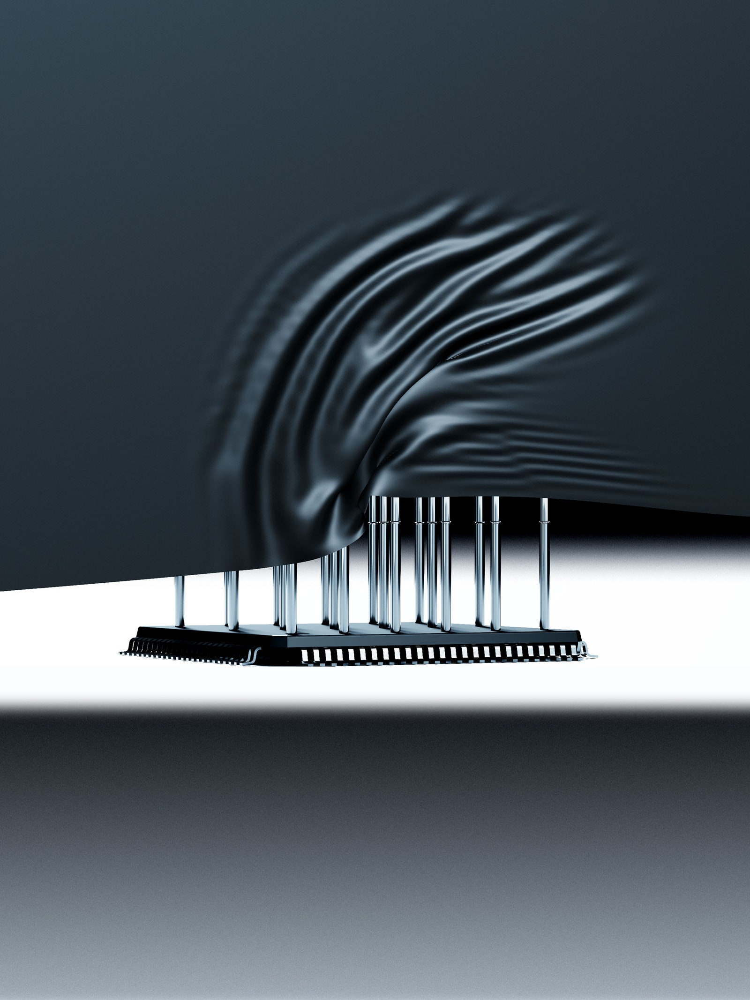

Summary: 本文介绍了台积电公司在全球半导体行业中的重要地位，以及半导体芯片在现代经济和政治中的影响。 

文章要点: 
1. 台积电是全球最大的半导体公司之一，生产了世界上 92% 的先进芯片。 
2. 半导体芯片在现代经济和政治中扮演着重要角色，其权力关系和全球经济变得像加密货币市场和衍生证券一样令人费解。 
3. 台湾的圣山被认为保护整个台湾岛，而台积电公司位于圣山附近。 
4. 半导体制造厂是人类文明的伟大奇迹，其生产的芯片是建筑世界的必要条件。 
5. 半导体芯片的生产和使用对全球政治和经济的影响越来越大。

Keywords: 台积电、半导体芯片、圣山、全球经济、政治影响、制造厂

---

I arrive in Taiwan brooding morbidly on the fate of democracy. My luggage is lost. This is my pilgrimage to the Sacred Mountain of Protection.  

我到了台湾，对民主的命运忧心忡忡。我的行李丢了。这是我去保护圣山的朝圣之旅。  

The Sacred Mountain is reckoned to protect the whole island of Taiwan—and even, by the supremely pious, to protect democracy itself, the sprawling experiment in governance that has held moral and actual sway over the would-be free world for the better part of a century.  

圣山被认为可以保护整个台湾岛--甚至，被那些极其虔诚的人认为可以保护民主本身，这个在一个世纪的大部分时间里一直在道德上和实际中支配着可能的自由世界的治理实验。  

The mountain is in fact an industrial park in Hsinchu, a coastal city southwest of Taipei. Its shrine bears an unassuming name: the Taiwan Semiconductor Manufacturing Company.  

这座山实际上是位于台北西南沿海城市新竹的一个工业园区。它的祠堂有一个不起眼的名字：台湾半导体制造公司。

By revenue, TSMC is the largest semiconductor company in the world. In 2020 it quietly joined the world’s 10 most valuable companies. It’s now bigger than Meta and Exxon.  

按收入计算，台积电是世界上最大的半导体公司。2020年，它悄悄地加入了世界十大最有价值的公司。它现在比美达和埃克森公司还要大。  

The company also has the world’s biggest logic chip manufacturing capacity and produces, by one analysis, a staggering 92 percent of the world’s most avant-garde chips—the ones inside the nuclear weapons, planes, submarines, and hypersonic missiles on which the international balance of hard power is predicated.  

该公司还拥有世界上最大的逻辑芯片制造能力，根据一项分析，其生产的世界上最前卫的芯片达到了惊人的92%--即核武器、飞机、潜艇和高超音速导弹中的芯片，而国际硬实力的平衡正是建立在这些芯片之上的。

This article appears in the May 2023 issue. [Subscribe to WIRED](https://subscribe.wired.com/subscribe/splits/wired/WIR_Edit_Hardcoded?source=HCL_WIR_COVER_INSET_0).Illustration: Alvaro Dominguez  

这篇文章出现在2023年5月的杂志上。订阅WIRED.Illustation: ALVARO DOMINGUEZ

Perhaps more to the point, TSMC makes a third of _all_ the world’s silicon [chips](https://www.wired.com/story/year-everyone-remembered-chips-matter/), notably the ones in iPhones and Macs. Every six months, just one of TSMC’s 13 foundries—the redoubtable Fab 18 in Tainan—carves and etches a quintillion transistors for Apple.  

也许更重要的是，台积电制造了全球三分之一的硅芯片，特别是iPhone和Mac中的芯片。每六个月，台积电13家代工厂中的一家--位于台南的可敬的18号工厂--就为苹果公司切割和刻画了五百万个晶体管。  

In the form of these miniature masterpieces, which sit atop microchips, the semiconductor industry churns out more objects in a year than have ever been produced in all the other factories in all the other industries in the history of the world.  

以这些位于微芯片之上的微型杰作的形式，半导体行业在一年内生产的物品比世界历史上所有其他行业的工厂所生产的都要多。

Of course, now that I’m on the bullet train to Hsinchu, I realize that the precise hazard against which the Sacred Mountain offers protection is not to be uttered.  

当然，现在我在前往新竹的子弹列车上，我意识到，圣山提供保护的确切危险是不能说的。  

The threat from across the 110-mile-wide strait to the west of the foundries menaces Taiwan every second of every day.  

来自铸造厂以西110英里宽的海峡对面的威胁，每时每刻都在威胁着台湾。  

So as not to mention either country by name—or are they one?—Taiwanese newspapers often euphemize Beijing’s bellicosity toward the island as “cross-strait tensions.” The language spoken on both sides of the strait—an internal waterway?  

为了不提及任何一个国家的名字--或者它们是一个国家--台湾的报纸经常将北京对该岛的好战行为委婉地称为 "两岸紧张关系"。海峡两岸的语言--一条内部水道？  

international waters?—is known only as “Mandarin.” The longer the threat is unnamed, the more it comes to seem like an asteroid, irrational and insensate.  

国际水域"--只被称为 "Mandarin"。威胁不被命名的时间越长，它就越像一颗小行星，毫无理性，毫无感觉。  

And, like an asteroid, it could hit anytime and destroy everything.  

而且，就像一颗小行星一样，它随时可能撞上并摧毁一切。

Semiconductor fabrication plants, known as fabs, are among civilization’s great marvels.  

被称为晶圆厂的半导体制造厂，是人类文明的伟大奇迹之一。  

The silicon microchips fashioned inside them are the sine qua non of the built world, so essential to human life that they’re often treated as basic goods, commodities.  

它们内部的硅微芯片是建筑世界的必要条件，对人类生活如此重要，以至于它们经常被当作基本商品、商品。  

They’re certainly commodities in the medieval sense: amenities, conveniences, comforts. In the late ’80s, some investors even experimented in trading them on futures markets.  

它们当然是中世纪意义上的商品：设施、便利、舒适。在80年代末，一些投资者甚至尝试在期货市场上交易它们。

But unlike copper and alfalfa, chips aren’t raw materials. Perhaps they’re currency, the coin of the global realm, denominated in units of processing power.  

但与铜和苜蓿不同，芯片并不是原材料。也许它们是货币，是全球领域的硬币，以处理能力为单位计价。  

Indeed, just as esoteric symbols transform banal cotton-linen patches into dollar bills, cryptic latticework layered onto morsels of common silicon—using printmaking techniques remarkably similar to the ones that mint paper money—turns nearly valueless material into the building blocks of value itself.  

事实上，就像深奥的符号将平庸的棉麻布片变成了美元钞票一样，在普通硅片上分层的隐秘格子图案--使用与铸造纸币非常相似的版画技术--将几乎没有价值的材料变成了价值本身的组成部分。  

This is what happens at TSMC.  

这就是在台积电发生的事情。

Like money, silicon chips are both densely material and the engine of nearly all modern abstraction, from laws to concepts to cognition itself.  

像金钱一样，硅芯片既是密集的物质，又是几乎所有现代抽象的引擎，从法律到概念到认知本身。  

And the power relations and global economy of semiconductor chips can turn as mind-boggling as cryptocurrency markets and derivative securities.  

而半导体芯片的权力关系和全球经济可以变成像加密货币市场和衍生证券一样令人费解。  

Or as certain theologies, ones that feature nano-angels dancing on nano-pins.  

或者像某些神学一样，以纳米天使在纳米针上跳舞为特征。

As befits a pilgrim, I’m spent. The flight from Kennedy Airport to Taipei nearly laid me to waste—just under 18 hallucinatory hours at the back of a packed 777. I had discharged my insomniac unease by looping through iOS games while perseverating on Putin, Xi, MAGA Republicans, and the rest of the nihilistic flexers with malevolent designs on democracy.  

作为一个朝圣者，我已经疲惫不堪。从肯尼迪机场飞往台北的航班几乎把我废掉了--在一架拥挤的777飞机的后座上，只有不到18个令人产生幻觉的小时。我通过循环播放iOS游戏来排遣我的失眠不安，同时坚持不懈地研究普京、习近平、MAGA共和党人和其他对民主有恶意企图的虚无主义屈服者。  

At the same time, I had cautioned myself for the millionth time against turning hawkish, the way the right and the rich do when feeling down in the mouth, gunning for a new clash of civilizations, or—more likely still—aiming to subdue Chinese competition so they can make more money.  

同时，我曾无数次告诫自己，不要变成鹰派，就像右派和富人在感到口干舌燥时所做的那样，为新的文明冲突开炮，或者--更有可能的是--旨在制服中国的竞争，以便他们能赚更多钱。

As passengers learned only upon landing in Taipei, the plane took off without a single economy-class bag.  

乘客在台北降落时才知道，飞机起飞时没有一个经济舱的行李。  

We got two words at baggage claim: “Ukraine war.” My Samsonite wheelie, which contained Chris Miller’s _Chip War_ and Albert O. Hirschman’s _The Passions and the Interests_—the book that got me thinking about the etymology of “commodities”—was back in New York. We’d been forced to travel light.  

我们在行李提取处得到两个词："乌克兰战争"。我的Samsonite轮式行李箱，里面有克里斯-米勒的《芯片战争》和阿尔伯特-O-赫斯曼的《激情与利益》--让我思考 "商品 "的词源的书--已经回到了纽约。我们被迫轻装上阵。  

Flights from US airports are now required to circumnavigate Russian airspace near Alaska, from which they’re banned, in retaliation for a _US_ ban on _Russian_ flights in American airspace, which was of course in response to Russia’s invasion of Ukraine last year.  

从美国机场起飞的航班现在需要绕过阿拉斯加附近的俄罗斯空域，他们被禁止从那里起飞，这是对美国禁止俄罗斯航班进入美国空域的报复，这当然是为了回应俄罗斯去年对乌克兰的入侵。

That invasion, and the courageous defense mounted by Ukrainian citizens, has been followed keenly in Taiwan.  

这次入侵，以及乌克兰公民的勇敢防御，在台湾受到了热切关注。  

Ukraine is a kind of trauma-bonded sister state to Taiwan, another promising democracy extorted by a [neighboring authoritarian](https://www.wired.com/story/chinese-hackers-taiwan-semiconductor-industry-skeleton-key/) hot to annex it. This perception informs the semiconductor business.  

乌克兰是一种与台湾有创伤联系的姐妹国家，另一个有希望的民主国家被邻国的独裁者热衷于吞并它而勒索。这种看法影响了半导体行业。  

Last year, the microchip titan Robert Tsao, who founded United Microelectronics Corporation, the first semiconductor company in Taiwan and TSMC’s longtime rival, pledged nearly $100 million for national defense, an investment that provides for the training of 3 million Taiwanese civilians to confront Chinese invaders in the manner of the Ukrainian patriots.  

去年，创立了台湾第一家半导体公司、台积电的长期竞争对手--联合微电子公司的微芯片巨头曹国伟承诺为国防投入近1亿美元，这笔投资用于培训300万台湾平民，以乌克兰爱国者的方式对抗中国入侵者。

TSMC, which plays everything cool, seems to view Tsao as a kind of foil. Tsao is a show-off. He’s also capricious.  

台积电一切都很冷静，似乎将曹德旺视为一种陪衬。曹德旺是个炫耀者。他也很任性。  

Having for years invested heavily in China—his renowned collection of Chinese porcelain once included a 1,000-year-old dish for washing paint brushes, which he sold for $33 million—he resigned as chair of UMC in 2006 amid allegations that he had illegally invested in Chinese semiconductor technology.  

多年来，他在中国进行了大量投资--他著名的中国瓷器收藏中曾包括一个有1000年历史的清洗画笔的盘子，他以3300万美元的价格出售了这个盘子--他于2006年辞去了联电的主席职务，因为他被指控非法投资于中国半导体技术。

But Tsao has since done an about-face. He now rails against the Chinese Communist Party as a crime syndicate. In 2022 he issued a call to arms while wearing rococo tactical gear.  

但是，曹德旺后来改变了态度。他现在抨击中国共产党是一个犯罪集团。2022年，他穿着洛可可式的战术装备，发出了武装呼吁。  

He declined to speak to me for this piece unless I could promise television time. I could not.  

他拒绝为这篇报道与我交谈，除非我能够保证电视时间。我无法做到。

In 1675, a French merchant named Jacques Savary published _The Perfect Merchant_, a mercantile manual that came to double as a guide for doing commerce around the world. Albert O.  

1675年，一位名叫雅克-萨瓦里的法国商人出版了《完美商人》，这是一本商业手册，可作为在世界各地做生意的指南。阿尔伯特-O。  

Hirschman cites Savary to explain how capitalism, which would have been regarded as little but avarice as recently as the 16th century, became the sanest ambition of humans in the 17th.  

赫斯曼引用萨瓦里的话来解释资本主义如何在17世纪成为人类最理智的野心，而这种野心在16世纪时还被认为是贪婪的。

Savary strongly believed that international trade would be the antidote to war.  

萨瓦里坚信，国际贸易将是战争的解药。  

Humans can’t conduct polyglot commerce across borders without cultivating an understanding of foreign laws, customs, and cultures.  

如果不培养对外国法律、习俗和文化的了解，人类就无法进行跨国界的多语言贸易。  

Savary also believed the Earth’s resources and the fellowship created by commerce were God-given.  

萨瓦里还认为，地球的资源和商业所创造的友谊是上帝赐予的。  

“It’s not God’s will that all human necessities be found in the same place,” Savary wrote.  

"所有人类的必需品都在同一个地方，这不是上帝的意愿，"萨瓦里写道。  

“Divine Providence has dispersed its gifts so that humans will trade together and find that their mutual need to help each other establishes ties of friendship among them.”  

"神圣的天意分散了它的礼物，这样人类就会在一起交易，并发现他们相互帮助的需要在他们之间建立了友谊的纽带。"

TSMC’s success is built on its singular comprehension of this dispersion of providential gifts. The firm is merrily known as “pure play,” meaning _all_ it does is produce bespoke chips for customer companies.  

台积电的成功是建立在它对这种天赐礼物的分散的独特理解上的。该公司被愉快地称为 "纯游戏"，这意味着它所做的一切是为客户公司生产定制的芯片。  

These include fabless semiconductor firms like Marvell, AMD, MediaTek, and Broadcom, and fabless consumer-electronics firms like Apple and Nvidia.  

这些公司包括像Marvell、AMD、联发科和博通这样的无厂半导体公司，以及像苹果和Nvidia这样的无厂消费电子公司。  

In turn, TSMC relies on the gifts of other countries.  

反过来，台积电也依赖其他国家的礼物。  

Companies like Sumco, in Japan, process polycrystalline silicon sand, which is quarried for the world’s semiconductor companies in places like Brazil, France, and the Appalachian Mountains [in the US](https://www.wired.com/story/book-excerpt-science-of-ultra-pure-silicon/), to grow hot single-crystal silicon ingots.  

像日本的Sumco公司，对多晶硅砂进行加工，这些多晶硅砂是在巴西、法国和美国的阿巴拉契亚山脉等地为世界半导体公司开采的，用来培育热的单晶硅锭。  

With diamond wire saws, Sumco’s machines slice shimmering wafers that, polished so smooth they feel like nothing under a fingertip, are the flattest objects in the world.  

通过钻石线锯，Sumco的机器切割出闪闪发光的晶片，这些晶片被打磨得非常光滑，在指尖下感觉像什么都没有，是世界上最平整的物体。  

From these wafers, which are up to a foot in diameter, TSMC’s automated machines, many of which are built by the Dutch photolithography firm ASML, etch billions of transistors onto each chip-sized portion; the biggest wafers yield hundreds of chips.  

从这些直径达一英尺的晶圆中，台积电的自动化机器（其中许多是由荷兰光刻公司ASML制造的）在每个芯片大小的部分上蚀刻出数十亿个晶体管；最大的晶圆能产生数百个芯片。  

Each transistor is about 1,000 times smaller than is visible to the naked eye.   

每个晶体管比肉眼可见的要小1000倍左右。

I’ve thus come to see TSMC as both futuristic and a touching throwback: a tribute to Savary’s largely expired romance in which liberal democracy, international commerce, and progress in science and art are of a piece, both healthful and unstoppable.  

因此，我认为台积电既具有未来性，又是一种感人的回归：向萨瓦里那基本上已经过期的浪漫主义致敬，其中自由民主、国际商业以及科学和艺术的进步是一脉相承的，既健康又势不可挡。  

More practically, however, the company, with its near monopoly on the best chips, serves as the umbo of the region’s so-called Silicon Shield, which is perhaps the sturdiest artifact of 20th-century realpolitik.  

然而，更实际的是，该公司几乎垄断了最好的芯片，成为该地区所谓的 "硅盾 "的顶梁柱，这也许是20世纪现实政治中最坚固的艺术品。  

For an imperial power to seize TSMC, the logic goes, would be to slay the world’s goldenest goose.  

按照这种逻辑，一个帝国主义大国要想夺取台积电，就等于杀死了世界上最金贵的鹅。

Like a dutiful valet who exists only to make his aristocrat look good, TSMC supplies the brains of various products but never claims credit.  

就像一个尽职尽责的男仆，只是为了让他的贵族看起来更漂亮，台积电为各种产品提供大脑，但从不要求功劳。  

The fabs operate offstage and under an invisibility cloak, silently interceding between the flashy product designers and the even flashier makers and marketers.  

工厂在台下运作，披着无形的斗篷，默默地在华丽的产品设计师和更华丽的制造商和营销人员之间进行斡旋。  

TSMC seems to relish the mystery, but anyone in the business understands that, were TSMC chips to vanish from this earth, every new iPad, iPhone, and Mac would be instantly bricked.  

台积电似乎很喜欢这种神秘感，但任何一个业内人士都明白，如果台积电的芯片从地球上消失，每台新的iPad、iPhone和Mac都会立即被刷屏。

TSMC’s simultaneous invisibility and indispensability to the human race is something that Jensen Huang, the CEO of Nvidia, likes to joke about.  

台积电对人类的隐蔽性和不可或缺性同时存在，这是Nvidia的CEO黄仁勋喜欢开玩笑的事情。  

“Basically, there is air—and TSMC,” he said at Stanford in 2014.  

"基本上，有空气和台积电，"他于2014年在斯坦福大学说。

“They call Taiwan the porcupine, right? It’s like, just try to attack.  

"他们叫台湾豪猪，对吗？这就像，只要试着去攻击。  

You may just blow the whole island up, but it will be useless to you,” Keith Krach, a former US State Department undersecretary, told me a few weeks before I left for Taiwan.  

美国国务院前副部长基思-克拉赫在我去台湾的几周前告诉我，"你可能只是把整个岛屿炸毁，但它对你没有用。  

TSMC’s chairman and former CEO, Mark Liu, has put it more concretely: “Nobody can control TSMC by force.  

台积电董事长兼前CEO刘士余说得更具体："没有人可以用武力控制台积电。  

If you take by military force, or invasion, you will render TSMC inoperative.” If a totalitarian regime forcibly occupied TSMC, in other words, its kaiser would never get its partner democracies on the phone.  

如果你们通过军事力量，或入侵来夺取，你们将使台积电无法运作。"如果一个极权主义政权强行占领台积电，换句话说，它的凯子将永远不会让它的伙伴民主国家打电话。  

The relevant material suppliers, chip designers, software engineers, 5G networks, augmented-reality services, artificial-intelligence operators, and product manufacturers would block their calls.  

相关的材料供应商、芯片设计师、软件工程师、5G网络、增强现实服务、人工智能运营商和产品制造商将屏蔽他们的电话。  

The fabs themselves would be bricked.  

工厂本身也会被毁坏。

With democracy reliably considered “under threat” in America by everything from election interference to gerrymandering to violent insurrections, Reaganite Shining Cities on Hills (or sacred mountains) are few.  

在美国，民主被可靠地认为是 "受到威胁"，从选举干扰到选区划分再到暴力叛乱，里根式的山丘（或圣山）上的闪亮城市很少。  

No WIRED journalist has breached the chip world’s sanctum sanctorum and toured a TSMC fab. This is why I want to go inside.  

没有一个WIRED的记者闯入过芯片界的圣殿，参观过台积电的工厂。这就是我想进去的原因。  

I want to know what’s going on atomically in the fabs, and how it might amount to divinity, or at least the human spirit incarnate—which, in the founding insight of humanism, amount to the same thing.  

我想知道晶圆厂里发生了什么，以及它如何可能相当于神性，或者至少是人类精神的化身--在人文主义的创始见解中，这相当于同一件事。

Mark Liu, the chairman of TSMC, dislikes referring to the company as the Sacred Mountain of Protection. “We represent a collaboration of the globalization era,” he says.  

台积电董事长Mark Liu不喜欢把公司称为保护圣山。"我们代表了全球化时代的合作，"他说。  

“That label makes us a sore thumb.”  

"这个标签使我们成为一个痛点"。

Photograph: SEAN MARC LEE 摄影：Sean Marc Lee

Still struggling to contact the airline about my Samsonite, I buy a toothbrush and some shapeless navy-blue separates in a third-story mini mall open after hours.  

我仍然在为联系航空公司关于我的Samsonite的事情而挣扎，我在一个下班后开放的三层小商场里买了一把牙刷和一些没有形状的海军蓝色的衣服。  

I also learn a meme made famous in the 1920s by the Chinese philosopher Hu Shih: _chabuduo_. The word means something like _whatever._ Or _close enough_. Chabuduo becomes my passion. Managerial types despise the idea as an attitude of mediocrity, and no doubt it could create disasters in endeavors that demand exactness.  

我还学习了中国哲学家胡适在20世纪20年代提出的一个著名的备忘录：chabuduo。这个词的意思是类似于什么。或足够接近。Chabuduo成为我的激情所在。管理学家们鄙视这个想法，认为它是一种平庸的态度，毫无疑问，它可以在要求精确性的工作中造成灾难。  

But as I stroll around town in my mall clothes, pondering the verities, chabuduo strikes me as a quiet-quitter defiance of everything from jet lag to lost luggage to the saber-rattling from Beijing.  

但是，当我穿着商场的衣服在城里闲逛，思考真理的时候，chabuduo给我的印象是一种安静的反抗，从时差到行李丢失到来自北京的剑拔弩张。

All the same, before I set foot in TSMC’s headquarters, I gird for a hip and socially demanding Googleplex vibe. Free rose lassi and pecan rockfish. Men in Patek Philippe watches.  

同样，在我踏入台积电的总部之前，我为一种时髦和社会要求的Googleplex氛围而束装。免费的玫瑰拉西和山核桃岩鱼。穿着百达翡丽手表的男人。  

Snobs. But TSMC style, to my delight, is like mine today: cotton, normcore, a shrug. Three stars on Yelp.  

势利眼。但令我高兴的是，台积电的风格就像我今天的风格：棉布、规范、耸肩。Yelp上有三颗星。

TSMC’s headquarters are across the street from a rival UMC fab. That might seem like a setup for melodrama.  

台积电的总部与竞争对手联电的工厂隔街相望。这可能看起来像是一个戏剧性的设置。  

But at TSMC, discretion is not just the better part of valor; it’s the business model. The company is recessive in every way.  

但在台积电，谨慎不仅仅是勇气的一部分，它是商业模式。该公司在各方面都是隐性的。  

If, in spite of its geostrategic brawn, you don’t know its name, that’s by design.  

如果尽管它有地缘战略上的实力，但你不知道它的名字，那是故意的。  

No one vamps for selfies outside the main building, as they do at Google, and when unarmed doormen sternly request that I not photograph the facade, they needn’t have bothered.  

没有人像在谷歌那样在主楼外自拍，当手无寸铁的门卫严厉要求我不要拍摄外墙时，他们也不需要费心。  

The place is glassy and forgettable, with a few half-hearted pops of color, mostly red.  

这个地方是玻璃状的，让人忘乎所以，有一些半信半疑的颜色，主要是红色。  

It’s like a ’90s convention center in a small American city, perhaps Charlotte, North Carolina.  

它就像一个90年代的美国小城市的会议中心，也许是北卡罗来纳州的夏洛特。

Employees at TSMC are paid well by Taiwan’s standards.  

按照台湾的标准，台积电的员工工资很高。  

A starting salary for an engineer is the equivalent of some $5,400 per month, where rent for a Hsinchu one-bedroom is about $450. But they don’t swan around in leather and overbuilt Bezos bodies like American tech hotshots.  

工程师的起薪相当于每月5,400美元左右，而新竹一居室的租金约为450美元。但他们并不像美国的科技精英那样，穿着皮革和过度建造的贝索斯的身体到处游荡。  

I ask Michael Kramer, a gracious member of the company’s public relations office whose pleasant slept-in style suggests an underpaid math teacher, about company perks.  

我问迈克尔-克莱默（Michael Kramer），他是该公司公共关系办公室的一位亲切的成员，他愉快的睡前风格表明他是一位工资不高的数学老师，我问他公司的福利问题。  

To recruit the world’s best engineering talent, huge companies typically lay it on thick. So what’s TSMC got? Sabbaticals for self-exploration, aromatherapy rooms? Kramer tells me that employees get a 10 percent discount at Burger King. _Ten percent._ Perhaps people come to work at TSMC just to work at TSMC.  

为了招募世界上最优秀的工程人才，大公司通常都会厚积薄发。那么，台积电有什么？自我探索的安息日，芳香疗法室？克雷默告诉我，员工在汉堡王餐厅可以享受10%的折扣。百分之十。也许人们来台积电工作就是为了在台积电工作。

The first time I asked Kramer about visiting the fabs, by phone from New York, he said no.  

我第一次从纽约通过电话问克莱默关于参观工厂的问题时，他说没有。  

It was like a fairy tale; he had to refuse me three times and I had to persist, proving my sincerity like a knight or a daughter of King Lear.  

这就像一个童话故事；他不得不三次拒绝我，而我不得不坚持，像一个骑士或李尔王的女儿一样证明我的诚意。  

Luckily, my sincerity is in long supply. My interest in the fabs borders on zealotry.  

幸运的是，我的诚意是长期存在的。我对工厂的兴趣近乎狂热。  

TSMC and the principles it expresses have started to appear in my dreams as the last best hope for—well, possibly human civilization.  

台积电和它所表达的原则已经开始出现在我的梦中，成为人类文明最后的希望--嗯，可能是人类文明。  

I want to view the Sacred Mountain and its promises with innocent eyes, as if nothing at all in the past three centuries had compromised the fondest fantasies of Locke, Newton, Adam Smith.  

我想用无辜的眼睛来看待圣山和它的承诺，就好像在过去的三个世纪里，根本没有任何事情损害了洛克、牛顿、亚当-斯密最美好的幻想。

The race in semiconductors is to the swift, and to the precise.  

半导体领域的竞争是迅速的，也是精确的。  

Because velocity and precision are generally at odds in business—you move fast, you break things—TSMC’s workforce is legendary.  

由于速度和精确性在商业中通常是不一致的--你动作快，你就会破坏东西--TSMC的员工队伍是传奇性的。  

If you see the manufacture of semiconductors as nothing but factory work, you might slag the project as monotonous or, more callously, “on the spectrum.” But the nanoscale work of chipmaking is monotone only if your ears aren’t sharp enough to hear the symphony.  

如果你认为半导体的制造只不过是工厂的工作，你可能会认为这个项目是单调的，或者更冷酷地认为是 "光谱"。但是，只有当你的耳朵不够灵敏，听不到交响乐的时候，芯片制造的纳米级工作才是单调的。

Two qualities, Mark Liu tells me, set the TSMC scientists apart: curiosity and stamina. Religion, to my surprise, is also common. “Every scientist must believe in God,” Liu says.  

马克-刘告诉我，有两种品质使台积电的科学家们与众不同：好奇心和耐力。令我惊讶的是，宗教信仰也很普遍。"每个科学家都必须相信上帝，"刘说。

I’m sitting across from the chairman in a conference room filled with trophies. A scale model of a full-rigged Japanese treasure ship, a gift from Yamaha, is magnificent.  

我坐在主席对面的一间会议室里，里面摆满了奖杯。一个由雅马哈公司赠送的全封闭日本宝船的比例模型，非常壮观。  

To our interview Liu has brought a model of his own: a Lego model of TSMC’s showstopping fin field-effect transistor, which controls the flow of current in a semiconductor using an electric field, a narrow fin, a system of gates, and very little voltage.  

在我们的采访中，Liu带来了他自己的模型：台积电展示的鳍式场效应晶体管的乐高模型，该晶体管利用电场、狭窄的鳍、门系统和极低的电压来控制半导体中的电流流动。  

“We are doing atomic constructions,” Liu tells me.  

"我们正在做原子结构，"刘告诉我。  

“I tell my engineers, ‘Think like an atomic-sized person.’” He also cites a passage from Proverbs, the one sometimes used to ennoble mining: “It’s the glory of God to conceal matter.  

"我告诉我的工程师，'像原子大小的人一样思考'"。他还引用了《箴言》中的一段话，这段话有时被用来美化矿业："掩盖物质是上帝的荣耀。  

But to search out the matter is the glory of men.”  

但查出此事是人的荣耀"。

Understood. But the Earth doesn’t exactly hide its sand, the source of silicon.  

理解了。但地球并没有完全隐藏它的沙子，即硅的来源。  

Liu’s doctoral research at UC Berkeley in the 1970s was on the serendipitous ways that ions behave when shot into silicon; he means it’s _atoms_ that God has secreted away.  

刘在1970年代在加州大学伯克利分校的博士研究是关于离子射入硅时的偶然行为方式；他的意思是说这是上帝所分泌的原子。  

These indestructible treasures have always been buried in matter, awaiting the invention of scanning electron microscopes and scientists with enough assiduity to spend decades on end peering into their atomic eyes.  

这些坚不可摧的宝藏一直被埋藏在物质中，等待着扫描电子显微镜的发明和有足够毅力的科学家花几十年时间来窥视它们的原子眼。  

“There's no way out,” Liu tells me. “You always feel you are scratching the surface.  

"没有出路，"刘告诉我。"你总是觉得你在抓紧时间。  

Until, one day, it’s revealed to you.” His guileless manner and expansive sense of wonder must be unique among CEOs of global megacompanies.  

直到有一天，它被揭示给你。"他无愧于心的态度和广博的好奇心在全球巨型公司的CEO中一定是独一无二的。  

Nothing about him comes off as shady or cheap like Elon Musk or the Overstock person. I remember a phrase from the liturgy of my childhood church: gladness and singleness of heart.  

他身上没有任何东西像埃隆-马斯克或Overstock的人那样让人觉得阴暗或廉价。我记得我童年时教会礼仪中的一句话：欣欣然，一心一意。  

That is Liu. 这是刘。

Is curiosity adaptive?  好奇心是适应性的吗？  

Certainly it’s unique to some nervous systems, and it prompts an eccentric cadre among us—research scientists—to approach the material world as a never-ending onion-skin problem.  

当然，这是某些神经系统所特有的，它促使我们中的一个古怪的干部--研究科学家--把物质世界当作一个永无止境的洋葱皮问题。  

“With unrelaxed and breathless eagerness, I pursued nature to her hiding-places,” said Victor Frankenstein.  

"维克多-弗兰肯斯坦说："我带着毫不放松和屏息凝神的渴望，追寻大自然的藏身之处。  

At Liu’s TSMC, this pursuit can seem like a form of athleticism or even erotics, in which select GOATs penetrate ever deeper into atomic spaces.  

在刘士余的台积电，这种追求似乎是一种运动，甚至是色情的形式，在这个过程中，选定的GOATs会越来越深入地进入原子空间。

Stamina, meanwhile, allows the TSMC scientists to push this game of atoms forward without flagging, without losing patience, through trial and error after error. How one _stays_ interested, curious, consumed with an unrelaxed and breathless craving to _know_: This emerges as one of the central mysteries of the nano-engineering mind. Weaker minds shatter at the first touch of boredom. Distraction.  

同时，耐力使台积电的科学家们能够通过一次又一次的试验和错误，不慌不忙地推动这场原子游戏的发展，不失去耐心。一个人如何保持兴趣，保持好奇心，保持对知识毫不松懈和屏息的渴望：这也是纳米工程思维的核心奥秘之一。弱者的头脑一接触到无聊就会崩溃。分散注意力。  

Some in Taiwan call these American minds.  

台湾的一些人称这些为美国人的思想。

The transubstantiation happening inside the fabs goes something like this. First comes the silicon wafer.  

工厂内发生的转变是这样的。首先是硅片。  

A projector, its lens covered by a crystal plate inscribed with distinctive patterns, is craned over the wafer.  

一台投影仪，其镜头被刻有独特图案的水晶板所覆盖，被吊在晶圆上。  

Extreme ultraviolet light is then beamed through the plate and onto the wafer, printing a design on it before it’s bathed in chemicals to etch along the pattern.  

然后，极紫外光穿过平板并照射到晶圆上，在上面打印出一个设计，然后将其沐浴在化学品中，沿着图案进行蚀刻。  

This happens again and again until dozens of latticed layers are printed on the silicon. Finally the chips are cut out of the wafer.  

这种情况一次又一次地发生，直到几十个格子层被印在硅上。最后，芯片被从晶圆上切割下来。  

Each chip, with billions of transistors stacked on it, amounts to an atomic multidimensional chessboard with billions of squares.  

每个芯片上堆积着数十亿个晶体管，相当于一个有数十亿个方格的原子多维棋盘。  

The potential combinations of ons and offs can only be considered endless.  

开和关的潜在组合只能说是无穷无尽。

During the pandemic lockdown, TSMC started to use intensive augmented reality for meetings to coordinate these processes, rounding up its far-flung partners in a virtual shared space.  

在大流行病封锁期间，台积电开始使用密集的增强现实技术进行会议，以协调这些流程，将其远在天边的合作伙伴集中在一个虚拟的共享空间。  

Their avatars worked symbolically shoulder to shoulder, all of them wearing commercially produced AR goggles that allowed each participant to see what the others saw and troubleshoot in real time.  

他们的化身象征性地肩并肩工作，都戴着商业化生产的AR护目镜，让每个参与者都能看到其他人看到的东西，并实时排除故障。  

TSMC was so pleased with the efficiency of AR for this purpose that it has stepped up its use since 2020. I’ve never heard anyone except Mark Zuckerberg so excited about the metaverse.  

台积电对AR在这方面的效率非常满意，从2020年开始就加强了它的使用。除了马克-扎克伯格之外，我从未听到有人对元空间如此兴奋。

But this is important: Artificial intelligence and AR still can’t do it all.  

但这很重要：人工智能和AR仍然不能做到这一切。  

Though Liu is enthusiastic about the imminence of fabs run entirely by software, there is no “lights-out” fab yet, no fab that functions without human eyes and their dependence on light in the visible range.  

尽管刘对完全由软件运行的晶圆厂的到来充满热情，但目前还没有 "熄灯 "晶圆厂，没有晶圆厂在没有人眼和对可见光的依赖的情况下运作。  

For now, 20,000 technicians, the rank and file at TSMC who make up one-third of the workforce, monitor every step of the atomic construction cycle.  

目前，2万名技术人员，即台积电的官兵，他们占员工总数的三分之一，监督原子建造周期的每一步。  

Systems engineers and materials researchers, on a bruising round-the-clock schedule, are roused from bed to fix infinitesimal glitches in chips.  

系统工程师和材料研究人员，在一个令人头疼的24小时时间表上，从床上被叫起来修复芯片中的微小故障。  

Some percentage of chips still don’t make it, and, though AI does most of the rescue, it’s still up to humans to foresee and solve the hardest problems in the quest to expand the yield.  

一些比例的芯片仍然没有成功，虽然人工智能做了大部分救援工作，但在寻求扩大产量的过程中，仍然要靠人类来预见和解决最困难的问题。  

Liu tells me that spotting nano-defects on a chip is like spotting a half-dollar on the moon from your backyard.  

刘告诉我，发现芯片上的纳米缺陷就像从你的后院发现月球上的半元钱。

Beginning in 2021, hundreds of American engineers came to train at TSMC, in anticipation of having to run a TSMC subsidiary fab in Arizona that is slated to start production next year.  

从2021年开始，数百名美国工程师来到台积电进行培训，因为他们预计必须在亚利桑那州运行台积电的一个附属工厂，该工厂预计将在明年开始生产。  

The group apprenticeship was evidently rocky. Competing rumors about the culture clash now circulate on social media and Glassdoor.  

团体学徒的过程显然是坎坷的。现在社交媒体和Glassdoor上流传着关于文化冲突的竞争性传言。  

American engineers have called TSMC a “sweatshop,” while TSMC engineers retort that Americans are “babies” who are mentally unequipped to run a state-of-the-art fab.  

美国工程师称台积电为 "血汗工厂"，而台积电的工程师则反驳说，美国人是 "婴儿"，在精神上不具备经营最先进工厂的能力。  

Others have even proposed, absent evidence, that Americans will steal TSMC secrets and give them to Intel, which is also opening a vast run of new fabs in the US.  

其他人甚至提出，在没有证据的情况下，美国人将窃取台积电的秘密并将其交给英特尔，而英特尔也正在美国开设大量的新工厂。

In spite of the fact that he himself trained as an engineer at MIT and Stanford, Morris Chang, who founded TSMC in 1987, has long maintained that American engineers are less curious and fierce than their counterparts in Taiwan.  

尽管他本人在麻省理工学院和斯坦福大学接受过工程师培训，但1987年创建台积电的莫里斯-张一直认为，美国工程师的好奇心和凶猛程度不如台湾的同行。  

At a think-tank forum in Taipei in 2021, Chang shrugged off competition from Intel, declaring, "No one in the United States is as dedicated to their work as in Taiwan."   

在2021年台北的一个智囊团论坛上，Chang甩开了来自英特尔的竞争，宣称："在美国没有人像在台湾那样专注于他们的工作。"

Black coffee at 7-Eleven is perfectly potable, especially when Kramer treats me to a cup. He gets the company discount there too. Kramer is a good hang.  

7-Eleven的黑咖啡是完全可以饮用的，特别是当克莱默请我喝的时候。他在那里也能得到公司的折扣。克雷默是个好帮手。  

I like that he teases me about my fascination with TSMC; I get the sense that he’s used to brooking destabilizing questions about cross-strait tensions and maybe fewer about the sacredness of the fabs.  

我喜欢他取笑我对台积电的迷恋；我感觉他习惯于讨论有关两岸紧张关系的不稳定问题，也许对晶圆厂的神圣性不太在意。

As we wait for word about my tour, I try more grand theories on him.  

在我们等待关于我的旅行的消息时，我在他身上尝试更多的宏大理论。

For a company to substantially sustain not just a vast economic sector but also the world’s democratic alliances would seem to be a heroic enterprise, no?   

对于一个公司来说，不仅要实质性地维持一个庞大的经济部门，而且还要维持世界上的民主联盟，这似乎是一个英雄的事业，不是吗？

But it seems possible that even those feats are not the most spectacular of TSMC’s accomplishments. Last spring, on an episode of _The Ezra Klein Show_, Adam Tooze, the Cambridge-trained economic historian, rejected the idea that the fabs are _merely_ formidable commercial and geopolitical forces. “If you think about conflicts around Taiwan,” Tooze told Klein, “the global semiconductor industry isn’t just the supply chain.  

但是，即使是这些壮举，似乎也不是台积电最引人注目的成就。去年春天，在The Ezra Klein Show的一个节目中，剑桥大学培训的经济历史学家Adam Tooze拒绝了这样的观点，即这些工厂只是强大的商业和地缘政治力量。"如果你考虑一下台湾周围的冲突，"Tooze告诉Klein，"全球半导体行业不仅仅是供应链。  

It’s one of humanity’s great technological scientific achievements. Our ability to do this stuff at nanoscale is us up against the face of God, in a sense.”  

这是人类伟大的技术科学成就之一。我们在纳米尺度上做这些事情的能力，从某种意义上说，是我们在对抗上帝的脸。"

_Up against the face of God._ In Tooze’s peerless empire accent. I attempt an impression for Kramer and tell him I’d had to rewind the podcast over and over to confirm Tooze’s phrasing.  

靠着上帝的脸。用Tooze无以伦比的帝国口音。我试图给克莱默留下印象，并告诉他我不得不一遍又一遍地回放播客以确认图兹的措辞。  

It now plays in my mind like an Anglican hymn, a necessary counterpoint to my staccato fears for human civilization, born in the Trump era and still banging away at my neurons.  

它现在像圣公会的赞美诗一样在我脑海中播放，是我对人类文明的惊恐的必要对位，它诞生于特朗普时代，仍然在我的神经元中敲打。

Kramer tells me he’s the son of a Lutheran missionary from the US and a Taiwanese teacher. He went to a Christian school in South Taiwan, and later Taipei American School.  

克雷默告诉我，他是一位来自美国的路德会传教士和一位台湾教师的儿子。他在南台湾的一所基督教学校上学，后来又在台北美国学校上学。  

Although Christians make up only 6 percent of the population of Taiwan, Sun Yat-sen, the founder of the Republic of China, was a Christian; President Chiang Kai-shek was a Methodist; and President Lee Teng-hui was a Presbyterian.  

虽然基督徒只占台湾人口的6%，但中华民国的创始人孙中山是一名基督徒；蒋介石总统是卫理公会成员；李登辉总统是长老会成员。

When, later, I recite Tooze’s words about God’s face to Mark Liu, he quietly agrees, but refines the point. “God means nature. We are describing the face of nature at TSMC.”  

后来，当我向马克-刘背诵Tooze关于上帝面孔的话时，他悄悄地同意了，但又细化了这一点。"上帝意味着自然。我们在台积电描述的是自然的面貌"。

Like money, silicon chips are both densely material and the engine of nearly all modern abstraction, from laws to concepts to cognition itself.  

像金钱一样，硅芯片既是密集的物质，又是几乎所有现代抽象的引擎，从法律到概念到认知本身。

Illustration: Basile Fournier 插图：Basile Fournier

As TSMC scientists describe the face of nature, nation-states compete to make better semiconductors.  

当台积电的科学家们描述自然界的面貌时，民族国家竞争制造更好的半导体。  

They’re either building fabs and improving technology to keep up with TSMC, as China is hell-bent on doing, or deepening an alliance with TSMC and Taiwan, which often speak as one.  

他们要么建造工厂并改进技术以赶上台积电，就像中国一心一意要做的那样，要么加深与台积电和台湾的联盟，这两个国家经常以一个身份说话。  

That’s what the US is doing.  

这就是美国正在做的事情。  

Although the special relationship between the US and Taiwan is still an ambiguous affair, it may now compete in consequence with the 20th-century alliance between the US and the UK.  

尽管美国和台湾之间的特殊关系仍然是一个模棱两可的事情，但它现在可能在后果上与20世纪美国和英国之间的联盟相竞争。

The CHIPS and Science Act, which US President Joe Biden signed into law in August 2022, grew out of a $12 billion deal to bring TSMC fabs to American soil.  

美国总统乔-拜登于2022年8月签署的《CHIPS和科学法案》，是在将台积电晶圆厂引入美国本土的120亿美元交易中产生的。  

That deal was brokered in large part by Keith Krach while he served as the US’s chief economic diplomat.  

这项交易在很大程度上是由基思-克拉赫在担任美国首席经济外交官时促成的。  

Among Krach’s goals was to fortify a dependable supply chain based on TSMC’s broad network of suppliers.  

Krach的目标之一是在台积电广泛的供应商网络的基础上加强一个可靠的供应链。  

The CHIPS Act now provides roughly $280 billion to boost American semiconductor research, manufacturing, and security, with the explicit aim of aggressively sidelining China from the sector—and thus from the world economy.  

CHIPS法案现在提供了大约2800亿美元，以促进美国的半导体研究、制造和安全，其明确的目的是积极地将中国从该行业--从而从世界经济中排挤出去。  

“Xi is absolutely obsessed with the semiconductor business,” Krach tells me.  

"习近平对半导体业务绝对痴迷，"Krach告诉我。

Charming and self-assured, Krach at 65 is a proud graduate of Purdue, the land-grant university in Indiana, where he got a BS in industrial engineering, chaired the board of trustees, and now oversees the Krach Institute for Tech Diplomacy.  

65岁的克拉赫是印第安纳州赠地大学普渡大学的骄傲毕业生，他在那里获得了工业工程学士学位，并担任董事会主席，现在负责监督克拉赫科技外交研究所的工作。  

As a teenager, he trained as a welder, and—though he was the youngest-ever vice president at General Motors, served as CEO of DocuSign, and cofounded the software company Ariba—he still comes across as disarmingly wholesome.  

尽管他曾是通用汽车公司有史以来最年轻的副总裁，担任过DocuSign公司的首席执行官，并共同创办了软件公司Ariba，但他仍然表现得非常健康。  

Before his stint at the State Department, he’d had no experience in government.  

在国务院任职之前，他没有任何政府工作经验。

The notion of “decoupling” from China, which would mean closing off trade and shutting Chinese scientists out of projects like green tech and cancer research, struck me as shortsighted.  

与中国 "脱钩 "的概念--这将意味着关闭贸易并将中国科学家拒之于绿色科技和癌症研究等项目之外--让我感到很短视。  

But on the subject of blackballing China from commercial domains where it doesn’t play fair, Krach was persuasive. At DocuSign, he’d started thinking about trust.  

但在把中国从不公平的商业领域中拉黑的问题上，Krach很有说服力。在DocuSign，他已经开始考虑信任问题。  

Specifically, he had turned the electronic-agreements company from a startup to a powerhouse by generating both real security for users and an aura of confidence around the software that would let people submit their most sensitive documents for a digital autograph.  

具体而言，他把这家电子协议公司从一家初创公司变成了一个强大的公司，为用户创造了真正的安全保障，并在软件周围形成了信任的光环，使人们能够提交他们最敏感的文件以获得数字签名。  

“Trust in technology is everything,” Krach says.  

Krach说："对技术的信任是一切，"。

The passing good faith required of signatories to online docs is small potatoes compared with the international fellowship required to produce silicon chips.  

与生产硅芯片所需的国际合作关系相比，在线文件的签署方所需的合格的诚意是小事一桩。  

To make a batch of chips for, say, Nvidia, requires a flying leap into dizzying international glasnost involving countries of diverse cultural and ideological stripes.  

为Nvidia等公司生产一批芯片，需要飞跃到令人眼花缭乱的国际格拉斯诺，涉及不同文化和意识形态的国家。  

To preserve the finely tuned set of relationships among trading partners in the “rules-based international order,” as Secretary of State Anthony Blinken invariably calls it, any authoritarian nation that can’t be trusted must be consigned to a penalty box.  

为了维护 "基于规则的国际秩序 "中贸易伙伴之间微调的关系，正如美国国务卿安东尼-布林肯一贯所说的那样，任何不能被信任的独裁国家都必须被送进禁闭室。  

Like many now trying to codify modern ethics in commerce, Krach defines an entity, governmental or private, as trustworthy if it has fair policies on the environment, national sovereignty, human rights, corporate governance, property rights, and social justice.  

像现在许多试图编纂现代商业道德的人一样，Krach将一个实体，无论是政府还是私人，如果它在环境、国家主权、人权、公司治理、产权和社会正义方面有公平的政策，那么它就是值得信赖的。

While at the State Department, Krach pulled off a masterstroke.  

在国务院工作期间，克拉赫使出了一个绝招。  

In the early days of 5G networks—extremely low-latency broadband that allows even surgeons to work remotely—Krach ventured out on a global round of freestyle diplomacy.  

在5G网络的早期--极低延迟的宽带，甚至允许外科医生远程工作--克拉赫冒险进行了一轮全球自由式外交。  

During the height of the pandemic, he and a small, masked delegation zipped around the world to more than 30 countries, from Spain to the Dominican Republic to Cyprus to the United Arab Emirates.  

在这一流行病的高峰期，他和一个戴着面具的小型代表团在世界范围内穿梭于30多个国家，从西班牙到多米尼加共和国到塞浦路斯到阿拉伯联合酋长国。  

He aimed to persuade powerful figures in a range of positions that they shouldn’t work with the Chinese company Huawei on 5G, however right the price.  

他的目的是说服在一系列职位上的有权势的人物，他们不应该与中国公司华为在5G方面合作，无论价格多么合适。  

To do so would be to subject their networks to Chinese infiltration, and “dirty” networks, Krach said, would be banned from America’s reindeer games.  

克拉赫说，这样做将使他们的网络受到中国的渗透，而 "肮脏 "的网络将被禁止参加美国的驯鹿游戏。

The gentlemanly extortion was a risk. But his Midwestern charm worked wonders.  

绅士般的敲诈是一种风险。但他的中西部魅力创造了奇迹。  

When the world’s leaders worried that they couldn’t afford to participate in Krach’s so-called Clean Network Alliance of Democracies, he folksily shamed them about bedding down with a country that spies promiscuously and uses slave labor.  

当世界各国领导人担心他们没有能力参加克拉赫所谓的民主国家清洁网络联盟时，他友好地羞辱他们与一个乱搞间谍活动和使用奴隶劳动的国家上床。  

Huawei was successfully [routed](https://www.wired.com/story/huaweis-many-troubles-bans-alleged-spies-backdoors/).  

华为被成功转发。  

About 15 percent of the world’s chip supply still originates in China, and the Communist Party’s new chip czar commands a trillion-dollar budget to expand the business over the next decade.  

世界上大约15%的芯片供应仍然来自中国，而中国共产党的新芯片沙皇指挥着一万亿美元的预算，在未来十年内扩大业务。  

But now the irreplaceable semiconductor sector that relies so heavily on dependable 5G is growing in the rules-based world order, largely without Chinese participation.  

但现在，严重依赖可靠的5G的不可替代的半导体行业正在基于规则的世界秩序中成长，基本上没有中国参与。

Krach is proud of the coinage “trusted technology” to describe DocuSign and 5G networks, and the more I consider the state of play, the more that pride seems mostly warranted.  

KRACH对用 "可信技术 "这个词来描述DocuSign和5G网络感到自豪，而且我越是考虑这个问题，就越觉得这种自豪感是有道理的。  

Morris Chang offered TSMC’s fabrication services to other companies at a time when most of them were making their own chips.  

莫里斯-张向其他公司提供台积电的制造服务，而当时大多数公司都在制造自己的芯片。  

To get those companies to let TSMC take over chipmaking for them, he talked up trust from the start.  

为了让这些公司让台积电为他们接管芯片制造，他从一开始就大谈信任。

But surely trust, like honor, exists in crime syndicates and closed oligopolies too.  

但可以肯定的是，信任和荣誉一样，也存在于犯罪集团和封闭的寡头垄断中。  

What makes that trust distinctive, among the parties to the “clean” network, is that it must go hand in hand with pluralism.  

在 "清洁 "网络的各方中，使这种信任与众不同的是，它必须与多元主义携手并进。  

You can trust more players, after all, if you can tolerate diverse social arrangements and you don’t swear off countries just because they have illiberal _or_ progressive streaks: if they employ the death penalty, say, or allow gay marriage. Above all, players who trust each other to trade must be able to trust each other not to cheat.  

毕竟，如果你能容忍不同的社会安排，你就能信任更多的玩家，你不会因为国家有不自由或进步的倾向而发誓放弃它们：例如，如果它们采用死刑，或允许同性恋婚姻。最重要的是，信任对方进行交易的玩家必须能够信任对方不会作弊。  

“Think about things like integrity, accountability, transparency, reciprocity, respect for rule of law, respect for the environment, respect for property of all kinds, respect for human rights, respect for sovereign nations, respect for the press,” Krach proposes to me.  

"克拉赫向我提议："考虑一下诸如诚信、问责、透明、互惠、尊重法治、尊重环境、尊重各种财产、尊重人权、尊重主权国家、尊重新闻等。  

“These are things that we have in the free world”—the safeguards of mutual trust.  

"这些是我们在自由世界所拥有的东西"--相互信任的保障。

Last December, with both Liu and Biden in attendance, TSMC unveiled its fab in Phoenix. At the ceremony, Gina Raimondo, the Secretary of Commerce, addressed a small crowd.  

去年12月，在刘士余和拜登的陪同下，台积电为其在凤凰城的工厂揭幕。在仪式上，美国商务部长吉娜-雷蒙多（Gina Raimondo）向一小部分人致辞。  

“Right now in the United States, we don’t really make any of the world’s most sophisticated, bleeding-edge, cutting-edge chips,” she said.  

"她说："现在在美国，我们没有真正制造任何世界上最复杂的、流血的、尖端的芯片。  

“That’s a national security issue, a national security vulnerability.  

"这是一个国家安全问题，一个国家安全的漏洞。  

Today, we say we’re changing that.” For his part, Liu emphasized that the American fab will be part of “a vibrant semiconductor ecosystem in the United States.”  

今天，我们说我们正在改变这种状况。"柳传志则强调，美国的工厂将成为 "美国充满活力的半导体生态系统 "的一部分。

Liu and Biden were careful not to describe the fab as a move toward semiconductor independence for either country but, rather, as one that locked in their entente.  

刘晓明和拜登很谨慎，没有把这个工厂描述为任何一个国家走向半导体独立的举措，而是把它说成是锁定他们的协约的举措。  

And while Biden focused on the 10,000 jobs the TSMC fab is bringing to Arizona—the largest foreign investment in the state in history—the biggest news in tech was that Tim Cook was in attendance.  

虽然拜登关注的是台积电工厂为亚利桑那州带来的10,000个工作岗位--该州有史以来最大的外国投资，但科技界最大的新闻是蒂姆-库克也出席了会议。  

Weeks before, Cook had disclosed that Apple was going to start using TSMC’s “American-made chips.”   

几周前，库克曾透露，苹果将开始使用台积电的 "美国产芯片"。

Known but not spoken at the opening event was that these chips would still be Taiwanese-engineered, their specs brought up to the minute—up to the femtosecond—by TSMC’s research team in Hsinchu.  

在开幕式上，人们知道但没有说的是，这些芯片仍然是由台湾人设计的，其规格由台积电在新竹的研究团队精确到分钟--精确到飞秒。  

Far more than in August, when US House Speaker Nancy Pelosi visited Taiwan (where she met with Liu but was evidently kept out of the fabs), the US and Taiwan may have finally sealed their provocative alliance on this much quieter day in Phoenix.  

与8月份美国众议院议长南希-佩洛西访问台湾（她在那里与刘晓明会面，但显然被挡在了工厂之外）相比，美国和台湾可能在凤凰城这个安静得多的日子里最终确定了他们的挑衅性联盟。

I hope Kramer can see that I myself am trustworthy.  

我希望克雷默能看到我自己是值得信赖的。  

The threat from across the strait, and the threat from anyone who might be even slightly allied with that threat, is ever-present. But I’m no wily Snowden.  

来自海峡对岸的威胁，以及来自任何可能与这种威胁稍有关联的人的威胁，是永远存在的。但我不是狡猾的斯诺登。  

Yes, I’m told, spies hang around Taipei by the hundreds if not thousands; surely mall clothes make for superb spycore. But I’m just a tired pilgrim hoping for a glimpse of God.  

是的，我被告知，间谍们成百上千地在台北闲逛；当然，商场的衣服也是一流的间谍核心。但我只是一个疲惫的朝圣者，希望能看到上帝的身影。

At the same time—it occurs to me in a rush—I can’t let Kramer mistake my indifference to personal style for irreverence. Etching on atoms is no joke.  

同时，我急中生智，不能让克莱默把我对个人风格的漠不关心误认为是不敬业。在原子上刻字不是开玩笑。  

The fabs demand caution, reverence, and of course the hygiene of an abluted priest.  

工厂要求谨慎、敬畏，当然还有被洗脑的牧师的卫生。  

A jittery, uninitiated person without an engineering degree could be a menace in the fabs, where she could sneeze like a putz and scatter a heap of glittering electrons like cocaine in _Annie Hall._ I’ll banish my chabuduo from the utterly dustless fabs like an errant molecule of neon gas.  

一个不安分的、没有工程学位的人在晶圆厂里可能是一个威胁，在那里她可以像个傻瓜一样打喷嚏，像《安妮-霍尔》中的可卡因一样散落一堆闪闪发光的电子。我将把我的chabuduo从完全没有灰尘的工厂中驱逐出去，就像一个错误的霓虹灯气体分子。

Kramer has requested my measurements for a clean-room bunny suit and shoe protectors, which I take as a good sign I’ll get inside.  

克雷默要求我测量无尘室兔子服和护鞋的尺寸，我认为这是个好兆头，我可以进去了。  

Then, suddenly, my tour of Fab 12A—known as a GigaFab because, every month, it processes fully 100,000 of the biggest wafers, the 12-inch ones—is on the calendar.  

然后，突然间，我参观了被称为GigaFab的12A工厂，因为它每个月都要处理整整10万块最大的晶圆，即12英寸的晶圆，这是在日历上。  

My luggage even arrives. 我的行李甚至到了。

Spirits buoyed, I head to Starbucks for a meal of mediocre flatbread with Victor Chan, a Taiwanese journalist and historian.  

兴奋之余，我去了星巴克，和台湾记者兼历史学家Victor Chan一起吃了一顿平淡无奇的扁面包。  

I want to understand Taiwan before semiconductors, the Taiwan he grew up in. Chan talks in a steady stream.   

我想了解半导体之前的台湾，他成长的台湾。陈志刚侃侃而谈。

Taiwan’s commitment to semiconductor technology was born of economic necessity, Chan says, or maybe desperation.  

陈说，台湾对半导体技术的承诺是出于经济的需要，也可能是出于绝望。  

In the postwar period, the country barely survived, but it steadily got into light industry, manufacturing spoons, mugs, and, famously, umbrellas. Taiwan excelled at umbrellas.  

在战后时期，这个国家勉强生存下来，但它稳步进入轻工业，制造勺子、杯子，以及著名的雨伞。台湾在雨伞方面表现出色。  

At the height of the boom in the ’70s, three out of every four umbrellas worldwide were made on the island.  

在70年代的繁荣时期，全世界每四把伞中就有三把是在岛上制造的。

In that same decade, diplomatic relations between Taiwan and the United States frayed.  

在同一个十年里，台湾和美国之间的外交关系出现了裂痕。  

Nixon had opened trade with China, and now China was making and exporting the goods Taiwan had once been known for.  

尼克松开放了与中国的贸易，现在中国正在制造和出口台湾曾经闻名的商品。  

To take just one example, for 20 years, Mattel contracted with Taiwan to manufacture Barbie dolls in suburban Taishan, not far from Taipei; the town was devastated when Mattel eventually moved its Barbie business to China, where labor was cheaper.  

仅举一例，20年来，美泰公司与台湾签约，在离台北不远的台山郊区生产芭比娃娃；当美泰公司最终将其芭比娃娃业务转移到劳动力更便宜的中国时，该镇受到了打击。  

(Taishan still displays memorabilia of Barbie, the city’s shapely plastic patron saint.) The Taiwanese government began to devise a new way to make itself valuable to the US.  

(台山仍然展示着芭比娃娃的纪念品，该城市的塑形守护神。)台湾政府开始设计一种新的方式来使自己对美国有价值。  

Invaluable, rather, so it couldn’t be neglected or pushed around.  

确切地说，是无价之宝，所以它不能被忽视，不能被推来推去。

American semiconductor companies also discovered Taiwan as a place to offshore chip assembly. In 1976, RCA began sharing technology with Taiwanese engineers.  

美国的半导体公司也发现台湾是一个离岸芯片组装的地方。1976年，RCA开始与台湾工程师分享技术。  

Texas Instruments, under the direction of Morris Chang, who was then in charge of its global semiconductor business, opened a facility in Zhonghe, a district near Taipei.  

德州仪器在当时负责其全球半导体业务的莫里斯-张的指导下，在台北附近的中和区开设了一家工厂。  

Like all the new semiconductor foundries, including the ones in Silicon Valley, the Taiwanese shops were staffed largely with women.  

像所有新的半导体代工厂一样，包括硅谷的代工厂，台湾的商店主要由女性员工组成。  

Not only did industrialists consider women easier to mistreat and underpay than men (no, really?), but they believed that women were better at working with small objects because we have small hands.  

工业家们不仅认为女性比男性更容易受到虐待和报酬过低（不，真的吗？），而且他们认为女性更擅长处理小物件，因为我们的手很小。  

(In 1972, Intel hired almost entirely women to staff its facility in Penang, Malaysia, claiming, according to Miller in _Chip War_, “they performed better on dexterity tests.”) Conveniently, men took over the jobs in the fabs when they became well paid and high status.  

(1972年，英特尔公司在马来西亚槟城的工厂几乎全部雇用了女性员工，据米勒在《芯片战争》中称，"她们在灵活性测试中表现得更好"）。方便的是，当晶圆厂的工作变得报酬丰厚、地位较高时，男性就接管了这些工作。

But through the ’70s and ’80s chips were made for export, and few in Taiwan knew what the fabs even made. “At first, we really didn’t have a clue about a chip,” Chan tells me.  

但在70年代和80年代，芯片都是为出口而生产的，台湾很少有人知道这些工厂到底生产什么。"起初，我们真的对芯片没有任何概念，"陈告诉我。  

“Chips that come with ketchup? We had no clue.”  

"带番茄酱的薯片？我们毫无头绪。"

To remedy this, the Taiwanese government began to plow money into engineering education, just at the time that expertise was plainly depleted in China and academics had been persecuted and murdered in the Cultural Revolution.  

为了解决这个问题，台湾政府开始向工程教育投入资金，而此时，中国的专业知识明显枯竭，学者们在文化大革命中遭到迫害和谋杀。  

Some Chinese industrialists seemed to be losing faith in their country as a land of economic and educational opportunity, and restless Chinese entrepreneurs made common cause with the Taiwanese government.  

一些中国工业家似乎对他们的国家作为经济和教育机会的土地失去了信心，不安的中国企业家与台湾政府达成了共同的事业。

This is how the Taiwanese government came to approach the American company Wang Laboratories in the 1980s with a koan: How do you make a computer?  

这就是台湾政府在20世纪80年代带着一个口诀来找美国公司Wang Laboratories的原因：你如何制造一台计算机？  

An Wang, the company’s Shanghai-born founder, took up the challenge to conduct research into computer-making in Taiwan, eventually moving many of Wang’s operations to the island.  

该公司在上海出生的创始人王安接受了挑战，在台湾进行计算机制造的研究，最终将王安的许多业务转移到岛上。

"Careful attention to education over the last 30 years has begun to pay dividends,” Wang said of Taiwan in 1982. “The output of engineering graduates in relation to the total population is much higher than in the US.” Emphasizing that the company had “no plans to set up a manufacturing facility in mainland China, because Communism is not suited to economic growth," Wang planted an R&D facility in the newly built Hsinchu Industrial Park.  

"在过去的30年里，对教育的精心关注已经开始得到回报，"1982年，Wang说到台湾。"工程专业毕业生的产出与总人口的比例要比美国高得多。"在强调该公司 "没有计划在中国大陆设立生产设施，因为共产主义不适合经济增长 "的同时，王永庆在新建成的新竹工业园区内建立了一个研发机构。

Meanwhile, in Dallas, Chang was spinning his wheels at Texas Instruments.  

与此同时，在达拉斯，Chang在德克萨斯仪器公司的办公室里忙得团团转。  

He consulted a Song Dynasty poem that advised ambitious young men to climb to the top of a tall tower and survey all possible roads.  

他参考了一首宋代的诗，其中建议雄心勃勃的年轻人爬到高塔的顶端，勘察所有可能的道路。  

He didn’t see a road for him at TI, so he lit out to build one in Taiwan.  

他在TI没有看到一条适合他的路，所以他在台湾亮出了一条路。  

First he took a job running the Industrial Technology Research Institute, which the Taiwanese government had established to study industrial engineering, and in particular semiconductors.  

首先，他接受了一份管理工业技术研究所的工作，这是台湾政府为研究工业工程，特别是半导体而设立的。  

Then, in 1987, K. T.  然后，在1987年，K. T.  

Li, the minister in charge of tech and science, persuaded Chang to start a private manufacturing company that would export chips and generate more money for research.   

负责技术和科学的李部长劝说张建国创办一家私营制造公司，出口芯片并为研究创造更多资金。

TSMC opened its first fab that year and not long after laid the cornerstone for its headquarters in the same Hsinchu park as UMC and Wang.  

台积电在这一年开设了它的第一座工厂，不久之后，它的总部也在联电和王建民的新竹园区奠基。  

The Taiwanese government and the Dutch electronics company Philips were the first major investors.  

台湾政府和荷兰电子公司飞利浦是第一批主要投资者。  

The Taiwanese–Dutch connection, formed in the early 17th century when the Dutch East India Company set up a trading base on the island, has been a leitmotif in semiconductors.  

17世纪初，荷兰东印度公司在该岛建立贸易基地时，台湾与荷兰的联系就形成了，这一直是半导体领域的一个主旋律。  

Not only was Philips instrumental in starting TSMC, but TSMC’s blood brother in chipmaking is now ASML, the photolithography giant based in Veldhoven.  

飞利浦不仅在启动台积电方面发挥了作用，而且台积电在芯片制造方面的血缘兄弟现在是ASML，这家位于韦尔德霍芬的光刻机巨头。

Chips, the ones without ketchup, would eventually take the place of umbrellas and Barbie dolls in Taiwan’s economy.  

薯片，没有番茄酱的薯片，最终将在台湾的经济中取代雨伞和芭比娃娃的地位。  

And with its engineers developing the leading-edge chips faster than any place on earth, Taiwan did indeed force the US to rely on it.  

由于其工程师开发尖端芯片的速度比地球上任何地方都快，台湾确实迫使美国依赖它。

“They call Taiwan the porcupine, right?” says Keith Krach. “It’s like, just try to attack. You may just blow the whole island up, but it will be useless to you.”  

"他们称台湾为豪猪，对吗？"基思-克拉赫说。"这就像，只要尝试进攻。你可能就会把整个岛炸掉，但它对你来说是没有用的。"

Illustration: Basile Fournier 插图：Basile Fournier

To be truly essential, a global company must situate itself at a crux in the supply chain.  

一个全球性的公司要想真正成为重要的企业，就必须把自己放在供应链的关键位置。  

Chang, who has said he studies the Battles of Midway and Stalingrad to devise corporate strategy, cannily installed TSMC between design and product.  

张忠谋曾说他研究中途岛战役和斯大林格勒战役来制定公司战略，他巧妙地将台积电置于设计和产品之间。  

His plan was this: He would concentrate monomaniacally on one key but low-profile component of computers.  

他的计划是这样的：他将疯狂地专注于计算机的一个关键但低调的组成部分。  

He would then invite more flamboyant tech companies, the kind that blow their budgets seducing consumers, to close their own fabs and outsource chipmaking to TSMC.  

然后，他将邀请更多张扬的科技公司，也就是那种吹嘘预算诱惑消费者的公司，关闭他们自己的工厂，将芯片制造外包给台积电。  

Chang gained trust by allaying fears that TSMC would steal designs, as pure-play foundries have no use of them; TSMC stealing from chip designers would be like a printing press stealing plots from novelists.  

张忠谋通过消除人们对台积电会窃取设计的担忧而获得了信任，因为纯粹的代工厂没有用武之地；台积电窃取芯片设计师的设计，就像印刷厂窃取小说家的情节一样。  

This commitment to quietude has led TSMC to obtain a, let’s say, _significant_ market share. Some tech companies get Super Bowl ads, adoring fanboys, and rockets for their founders; TSMC gets 92 percent.  

这种对安静的承诺使台积电获得了，比方说，重要的市场份额。一些科技公司获得了超级碗广告、崇拜的粉丝和他们的创始人的火箭；而台积电获得了92%。

Krach now calls Chang “the oracle.” He grew up peripatetic in war-torn China and, in 1949, left for Harvard, where he studied English literature for two semesters.  

克拉赫现在称张为 "神谕"。他在饱受战争蹂躏的中国长大，1949年去了哈佛大学，在那里学习了两个学期的英国文学。  

He remembers this period as “the most exciting year of my education.” Copies of Shakespeare’s tragedies and _Dream of the Red Chamber_, the classic Qing Dynasty novel, now sit on his bedside table.  

他记得这段时间是 "我的教育中最令人兴奋的一年"。莎士比亚的悲剧和清代经典小说《红楼梦》的副本现在摆在他的床头。  

But even as the humanities captured his heart, Chang realized that in the US of the 1950s, Chinese men without scientific training, even those with Ivy League degrees, could get stuck working in laundromats and restaurants.  

但是，即使人文学科俘获了他的心，张晓明也意识到，在20世纪50年代的美国，没有受过科学训练的中国人，即使是那些拥有常春藤大学学位的人，也可能被困在洗衣店和餐馆里工作。  

Engineering alone offered a shot at the middle class. He reluctantly transferred to MIT.  

仅仅是工程学就提供了一个进入中产阶级的机会。他很不情愿地转到了麻省理工学院。  

From there he went to Sylvania to work in semiconductors, and thence to TI, which paid for his PhD studies at Stanford.  

在那里，他去了Sylvania公司从事半导体工作，然后去了TI公司，该公司为他在斯坦福大学的博士学习提供了费用。

To Chang, life’s most compelling challenge would turn out to come not from making widgets, networks, or software, but from keeping pace with Moore’s Law.  

对张来说，生活中最引人注目的挑战将不是来自制造小部件、网络或软件，而是来自与摩尔定律保持同步。  

In 1965, Gordon Moore, who would go on to cofound Intel, proposed that the number of transistors in a dense integrated circuit would double roughly every two years.  

1965年，后来共同创立英特尔的戈登-摩尔提出，密集集成电路中的晶体管数量大约每两年翻一番。  

In the early ’60s, four transistors could fit on a thumbnail-sized microchip. Today, on a stupendous chip TSMC makes for the AI company Cerebras, more than 2.6 trillion can.  

在60年代初，一个拇指甲大小的微芯片上可以容纳四个晶体管。今天，在台积电为人工智能公司Cerebras制造的一个巨大的芯片上，超过2.6万亿个可以。  

Moore’s Law is, of course, [not a law at all](https://www.wired.com/story/moores-law-really-dead/). Liu calls it a piece of “shared optimism.” A simple way to put TSMC into ideological perspective is to think of Moore’s Law as hope itself.  

当然，摩尔定律根本就不是一个定律。刘士余称它是 "共同的乐观主义"。将台积电纳入意识形态范畴的一个简单方法是，将摩尔定律视为希望本身。

In 2012, Chang was named an Engineering Hero at Stanford, a thin-air honor that’s also been bestowed on figures like Larry Page and Sergey Brin.  

2012年，Chang被评为斯坦福大学的工程英雄，这个薄薄的荣誉也被授予了拉里-佩奇和谢尔盖-布林等人物。  

But unlike Page and Brin, Chang never seemed to want to make a name for himself (the highest 20th-century American ambition), much less build a brand (the 21st).  

但与佩奇和布林不同的是，张小龙似乎从未想过要为自己扬名立万（20世纪美国人的最高抱负），更没有想过要建立一个品牌（21世纪）。  

His obsession at TSMC was with process: incrementally improving the efficiency of semiconductor fabricators.  

他在台积电执着于工艺：逐步提高半导体制造厂的效率。  

TI’s factories had wasted as much as half of their meticulously sanded and latticed silicon in making delicate chips. That was insupportable.  

德州仪器公司的工厂在制造精致的芯片时，浪费了多达一半的精心打磨和格子的硅。这是不可容忍的。  

At TSMC today, the yield rate is a closely guarded number, but analysts estimate that some 80 percent of its latest chips make it to the finish line.  

在今天的台积电，良品率是一个严格保密的数字，但分析师估计，其最新的芯片中约有80%能够到达终点。

TSMC’s economic strategy, then, is the same as its strategy for corporate architecture and the protection of Taiwan: Be indispensable but invisible.  

那么，台积电的经济战略与它的企业架构和保护台湾的战略是一样的：做到不可或缺，但又不露痕迹。  

Make Chinese products work but never claim credit. Make Apple’s products work but skip all “Intel Inside” preening.  

让中国的产品运转起来，但永远不要声称有功劳。让苹果的产品工作，但跳过所有 "Intel Inside "的宣传。  

Perhaps only China, Apple, and TSMC’s other customers know how integral the fabs are, but their absolute devotion, their terror of rocking the boat, is more than enough to secure real-world power for the company.  

也许只有中国、苹果和台积电的其他客户知道这些晶圆厂是多么的不可或缺，但是他们的绝对奉献，他们对摇摆不定的恐惧，足以确保该公司的现实力量。  

Several people at TSMC told me their work at arguably the most powerful company on the planet is “unsexy.” One told me that girls don’t fall for TSMC engineers, but their mothers do.  

台积电的几个人告诉我，他们在这个可以说是地球上最强大的公司的工作是 "不性感的"。一个人告诉我，女孩不喜欢台积电的工程师，但她们的母亲喜欢。  

Invisible as suitors.  隐身为求婚者。  

Indispensable as husbands. 作为丈夫是不可缺少的。

On go the fabs, then, as Moore’s Law chugs like a train: _double the performance, halve the cost_. With profit margins almost unheard-of in manufacturing, Chang has created a research institute passing as a factory.  

然后，随着摩尔定律像火车一样的响起，工厂开始运作：性能加倍，成本减半。由于制造业的利润率几乎是闻所未闻的，Chang创建了一个作为工厂的研究机构。  

In 2002, TSMC’s lavishly funded R&D facilities enabled Burn-Jeng Lin, then the head of lithography research, to find an ingenious way to increase the resolution of patterns on chips.  

2002年，台积电资金充裕的研发设施使时任光刻技术研究主管的林伯强找到了一种提高芯片上图案分辨率的巧妙方法。  

In 2014, Anthony Yen, a senior researcher, invented a method to dial the resolution still higher. The company now holds some 56,000 patents.  

2014年，高级研究员Anthony Yen发明了一种方法，将分辨率拨得更高。该公司现在拥有约56,000项专利。

The night before my tour of the fabs, I take a Covid test and lay out respectable work clothes alongside two new black N-95s; masking is still mandatory.  

在参观工厂的前一天晚上，我做了一个Covid测试，并在两个新的黑色N-95旁边铺上了体面的工作服；遮蔽仍然是强制性的。  

I hallucinate two red lines from across the room, but no, no Covid. In the morning I’ll talk to Lin about how he invented immersion lithography.  

我对对面的两条红线产生了幻觉，但没有，没有科维德。早上我将和林谈谈他是如何发明浸入式光刻的。  

Later, I’ll speak to Yen about how he invented commercial-use extreme ultraviolet lithography.  

稍后，我将与Yen谈论他如何发明了商业用途的极紫外光刻技术。  

Making chips is printmaking, and to understand the printing press, I need to understand litho.  

制作芯片是版画，要了解印刷机，我需要了解平版印刷。

Photolithography machines are the specialty of TSMC’s partner firms, and above all ASML. It’s rumored that the next generation of these machines will cost around $400 million.  

光刻机是台积电的合作伙伴公司的专长，首先是ASML。据传，这些机器的下一代将花费约4亿美元。  

Every one of the world’s most sophisticated chips uses ASML lithography.  

世界上最尖端的芯片都使用ASML光刻技术。  

But advanced research on lithography is also conducted at TSMC, because it’s the litho that must be refined in order to keep the fabs efficient, the transistors small, and the Moore wheels turning.  

但台积电也在进行先进的光刻技术研究，因为必须对光刻技术进行改进，以保持工厂的效率、晶体管的尺寸和摩尔轮的转动。

The word _lithography_ means the same thing in the fabs as it does in art studios: the printing process invented in 1796 by Alois Senefelder, a German playwright.  

平版印刷这个词在工厂里和在艺术工作室里的意思是一样的：1796年由德国剧作家阿洛伊斯-塞内费尔德发明的印刷工艺。  

Though Senefelder had little effect on theater, he hit the printmaking jackpot when he found he could copy scripts if he transcribed them in greasy crayon on wet limestone and then rolled ink over the wax.  

虽然塞内费尔德对戏剧没有什么影响，但他发现如果他在湿石灰石上用油性蜡笔抄写剧本，然后在蜡上滚墨，他就能抄写剧本，从而中了版画的大奖。  

Because oil and water don’t mix, the oil-based ink stuck to the limestone in some spots and didn’t in others. This is the foundational zero-to-one of lithography.  

由于油和水不混合，油性墨水在一些地方粘在石灰石上，而在另一些地方却没有。这就是平版印刷的基础性的零对一。

As late as the 1960s, electrical engineers were still dropping black wax onto blocks of germanium and etching away at it.  

迟至20世纪60年代，电子工程师们仍在将黑蜡滴在锗块上并对其进行蚀刻。  

Not a bad way to fit four or eight transistors on a chip, but as the number rose to millions, billions, and now even trillions, the components became first more invisible than wax and then much, much smaller than merely invisible.  

在一个芯片上安装四个或八个晶体管的方式并不坏，但随着数量上升到数百万、数十亿，现在甚至是数万亿，这些元件首先变得比蜡还不可见，然后比单纯的不可见小得多。  

Along the way, engineers started etching with light.  

一路走来，工程师们开始用光进行蚀刻。

Etching on these shrinking components required ever more precise light. The wavelength of the beams kept getting narrower until the light finally took leave of the visible spectrum.  

在这些不断缩小的部件上进行蚀刻需要越来越精确的光线。光束的波长不断变窄，直到光线最终离开了可见光谱。  

Then, around 2000, chipmakers confronted one of their periodic panics that Moore’s Law had stalled.  

然后，在2000年左右，芯片制造商面临着他们周期性的恐慌之一，即摩尔定律已经停滞。  

To get to transistors of 65 nanometers, “it was still possible using the tried system,” Lin tells me.  

为了达到65纳米的晶体管，"使用尝试过的系统仍然是可能的，"林告诉我。  

“But I foresaw that at the next node, which was 45 nanometers, we were going to have trouble.”   

"但我预见到，在下一个节点，也就是45纳米，我们会有麻烦。"

People were putting their bets on extreme ultraviolet light, but it would be years before the litho machines in the fabs could muster enough steady source power for that.  

人们把赌注押在极紫外光上，但在工厂里的平板机能够为之提供足够的稳定源动力之前，还要等上好几年。  

Another idea was to use what Lin calls a “less aggressive” wavelength, somewhere between deep and extreme ultraviolet.  

另一个想法是使用林所说的 "不那么强硬 "的波长，介于深紫外线和极紫外线之间。  

But because such light couldn’t pierce existing lenses, it would need an exotic new lens made of calcium fluoride.  

但由于这种光不能穿透现有的透镜，它需要一种由氟化钙制成的奇特的新透镜。  

Researchers built hundreds of furnaces in which to grow the right crystal, but no method did the trick. Close to a billion dollars went up in smoke.  

研究人员建造了数以百计的炉子来培育合适的晶体，但没有任何方法能做到这一点。近10亿美元化为乌有。

Around 2002, Lin decided that they were wasting time. He wanted to forget about the new wavelength and the impossible lens and instead use water.  

在2002年左右，林志颖认为他们是在浪费时间。他想忘记新的波长和不可能的透镜，而使用水。  

With its predictable refraction index, water would give lithographers greater control over the wavelength they already knew.  

由于其可预测的折射率，水将使平版印刷师对他们已经知道的波长有更大的控制。  

He invented a system for keeping water perfectly homogenous, and then he shot the light through it onto the wafer. Bingo.  

他发明了一个让水保持完全均匀的系统，然后他把光通过它射到晶圆上。中奖了。  

He could etch transistors as small as 28 nanometers, eventually with zero defects. “Water is a miracle,” Lin says. “Not only for TSMC. It's a miracle for the whole of mankind.  

他可以蚀刻小至28纳米的晶体管，最终实现零缺陷。"水是一个奇迹，"林说。"不仅是对台积电而言。它是整个人类的一个奇迹。  

God is kind to the fish. And also to us.”  

上帝对鱼是仁慈的。也对我们"。

Lin is another devout Christian at TSMC. His face is lively and expressive, and he looks and moves like a young Gene Kelly, though he’s 80. I ask him if he, like Liu, sees God in atoms. “I see God in any scale,” he says.  

Lin是台积电的另一位虔诚的基督徒。他的面孔活泼而富有表情，虽然他已经80岁了，但他的样子和动作就像年轻的吉恩-凯利。我问他，他是否像Liu一样，在原子中看到上帝。"他说："我在任何尺度上都能看到上帝。  

“Look at a dog or a tiger—and then look at the food that we eat. It's marvelous. Why?  

"看看狗或老虎，再看看我们吃的食物。这是很了不起的。为什么？  

Why is that?” Having been dead set against Christianity as a young student in Vietnam, when he considered it a superstition, and a foreign one at that, Lin was ultimately drawn to the idea that God is “a superintelligent being.”  

这是为什么？"在越南的一个年轻学生时，他曾死心塌地地反对基督教，当时他认为这是一种迷信，而且是一种外国的迷信，但林志颖最终被上帝是 "一种超级智能的存在 "这一观点所吸引。

TSMC was now at the forefront of semiconductor research. But it was still under the lash of Moore, and the pressure didn’t let up.  

台积电现在处于半导体研究的最前沿。但它仍处于摩尔的鞭策之下，压力并没有放松。  

In 2014, Anthony Yen, who had succeeded Lin as head of research at TSMC, had been developing the next generation of litho for a decade.  

2014年，接替林书豪担任台积电研究主管的Anthony Yen在十年前就已经开始研发下一代的litho。  

Yen, who now runs research at ASML, tells me that extreme ultraviolet lithography came together in the fall of that year.  

现在在ASML负责研究的Yen告诉我，极紫外光刻技术是在那一年的秋天出现的。

“We always worked late at TSMC,” Yen says. On the evening of October 14, he was gearing up for an especially long night.  

"我们在台积电总是工作到很晚，"Yen说。10月14日晚上，他正准备迎接一个特别漫长的夜晚。  

A team from ASML had come to TSMC to test out the new power-source conditions that Yen’s team had been working on.  

来自ASML的一个团队来到台积电，测试Yen的团队一直在研究的新电源条件。  

With the existing specs, the power source was reliable only at 10 watts; with the new ones, they hoped to hit 250. Yen ate his dinner quickly, gowned up, and went into the fab, where they began cranking up the power.  

在现有的规格下，电源的可靠度只有10瓦；有了新的规格，他们希望能达到250瓦。颜志强迅速吃完饭，穿好衣服，走进工厂，在那里他们开始提升功率。  

When it hit 90, that’s when he knew. “This was the eureka moment,” Yen says.  

当它达到90时，这时他就知道了。"这是个尤里卡时刻，"Yen说。

The movement from 10 to 90 watts meant a rise in power by a factor of nine.  

从10瓦到90瓦意味着功率增加了9倍。  

That the machine had accomplished this meant to Yen that the jump from 90 to 250, a mere tripling, was more than feasible. It was inevitable.  

机器完成了这一任务，对颜丙燕来说，从90岁跳到250岁，仅仅是三倍，是非常可行的。它是不可避免的。  

Yen became so excited—“too excited,” he says—that he couldn’t even stay to watch the power hit 250. He ran out of the fab, flinging off his bunny suit. “I was euphoric.  

颜丙涛变得如此兴奋--"太兴奋了"，他说--他甚至不能留下来观看功率达到250。他跑出了工厂，甩掉了他的兔子装。"我当时很兴奋。  

I was on drugs. For the believer, it is quite a religious experience.” TSMC had the raw power it needed.  

我当时在吸毒。对于信徒来说，这是一种相当的宗教体验。"台积电拥有它所需要的原始力量。  

The company has continued to refine all of its processes, especially, with ASML, the extreme ultraviolet lithography machines.  

该公司继续完善其所有的工艺，特别是与ASML合作，完善极紫外光刻机。  

Today, TSMC’s transistors are down to just over 2 nanometers—the smallest in the world. These unseeable gems go into production in 2025.  

今天，台积电的晶体管已降至刚刚超过2纳米--世界上最小的晶体管。这些看不见的宝石将在2025年投入生产。

Back in the university conference room, after reflecting on TSMC’s triumphs in litho, Burn-Jeng Lin poses gamely for a photograph. “God is very kind to mankind,” he says again.  

回到大学的会议室，在回顾了台积电在石膏板方面的胜利后，林伯强赌气地摆出了一个照片。他说："上帝对人类非常仁慈，"他再次说道。  

God’s kindness, the miracle of water, religious euphoria—it swims in the mind like a school of blessed fish. A line from William Blake seems right: _To see a World in a Grain of Sand_. That’s what we’re here for.  

上帝的仁慈，水的奇迹，宗教的欣快--它像一群受祝福的鱼一样在脑海中游动。威廉-布莱克的一句话似乎是对的：在一粒沙中看到一个世界。这就是我们在这里的目的。

I put a parting question to Lin: How in the world do you remain undaunted by all these extraordinary problems in nanotechnology? Lin laughs.  

我向林提出了一个临别问题：你到底是如何面对纳米技术中所有这些非同寻常的问题而毫不畏惧的？林笑着说。  

“Well, we just have to solve them,” he says. “That is the TSMC spirit.”  

"好吧，我们只是要解决它们，"他说。"这就是台积电的精神"。

Burn-Jeng Lin, TSMC's former head of research and the inventor of immersion litho, still speaks of the company as “us.”   

林伯强，台积电前研究主管和浸入式照相术的发明者，仍然把公司称为 "我们"。

Photograph: SEAN MARC LEE 摄影：Sean Marc Lee

The moment has come. I’m Neo now, or the everyman in Pilgrim’s Progress, stepping into my destiny. Kramer, walking with me, once again laughs at my obsession with the fabs.  

时机已到。我现在是尼奥，或者说是《朝圣者的进步》中的常人，正在步入我的命运。克雷默和我一起走，又一次嘲笑我对工厂的痴迷。  

He seems to find them a little dull, and I’m repeatedly told I won’t be able to see much.  

他似乎觉得这些东西有点沉闷，而且我一再被告知我将无法看到什么。

That doesn’t bother me. Even I understand that much about nanos. But to observe and to behold are two different pastures. Observation is for objects of scientific study.  

这并不困扰我。即使是我对纳米的理解也是如此。但观察和观察是两个不同的领域。观察是为了科学研究的对象。  

Beholding is for the sublime. 观察是为了崇高。

Few precautions are taken at TSMC, I must say, to _prevent_ the passage into the foundry from being thrilling. I swish through a turnstile entrance that brings to mind _The Phantom Tollbooth_—allusions are coming fast and furious now—and I’m deposited before a kind of human car wash for dramatic personal ablutions. A single machine washes, rinses, and dries my hands.  

我必须说，台积电几乎没有采取任何预防措施，以防止进入代工厂的过程变得惊心动魄。我嗖地穿过一个旋转门入口，这让我想起了《幻影收费站》--现在所有的幻想都来得又快又猛，我被安置在一种人类洗车机前，进行戏剧性的个人洗礼。一台机器对我的手进行清洗、漂洗和烘干。  

Two guides appear, likewise cleansed of earthly cares, and lead me into a broad antechamber that could be part of a very, very clean senatorial Roman bath.  

两个向导出现了，他们也同样洗净了尘世的烦恼，把我领到一个宽阔的前厅，这可能是一个非常、非常干净的罗马元老院浴室的一部分。

Orderlies, in their own pristine jumpsuits, bring out our perfectly sized gowns. They also fit protectors over my shoes.  

护理人员穿着他们自己的纯净的连衣裙，把我们尺寸合适的礼服拿出来。他们还为我的鞋子套上了保护套。  

To have a white-clad figure at my feet carefully adjusting the booties feels tender, somehow; I want to be sure to convey my gratitude, but it’s hard with a Covid mask on my face, glasses over my eyes, and a hood covering my hair and most of my forehead.  

在我的脚下有一个白衣的身影在小心翼翼地调整鞋垫，这让我感觉很温柔；我想一定要表达我的感激之情，但我脸上戴着科维德面具，眼睛上戴着眼镜，头巾遮住了我的头发和大部分额头，这很难。  

Our bodies are not quite here.  

我们的身体还没有完全到来。

I’ll later learn that even the hand-washing room has extraterrestrially clean air. Ordinary air can have up to 1 million particles of dust per cubic meter.  

我后来才知道，即使是洗手间也有超乎寻常的清洁空气。普通的空气每立方米可能有多达100万个灰尘颗粒。  

The fabs and cleaning rooms have no more than 100. As I step into the fab at last, I can tell at once it’s the cleanest air I have ever inhaled.  

工厂和清洁室的数量不超过100个。当我最后踏入晶圆厂时，我一眼就能看出这是我所吸过的最干净的空气。

I’m prepared both for a climax and for an anticlimax, but my experience is not on that continuum at all. The vast room is bright and clear.  

我对高潮和反高潮都做了准备，但我的经历完全不在这个连续体上。巨大的房间明亮而清晰。  

When those who claim they’ve had a near-death experience during surgery speak of a bright light, they surely mean the hospital overheads.  

当那些声称自己在手术过程中有过濒死体验的人说到一道亮光时，他们肯定是指医院的开销。  

That’s what it looks like here in the bleached and antiseptic atmosphere, near death and clinical-heavenly.  

这就是这里漂白和防腐的气氛，接近死亡和临床--天堂的样子。

Pacing around, though, I start to hope that the last perception of those who die in sickbeds _is_ the effort hospitals make to convey paradisal spotlessness in the context of broken flesh and gore. What a wonderfully human folly, to try to create immaculateness.  

不过，我开始希望，那些死在病床上的人的最后印象是医院在破碎的肉体和血腥的背景下努力传达天堂般的无暇。试图创造完美无瑕的感觉，这是多么奇妙的人类愚蠢行为。  

The lamps in the fabs, like those in hospitals, shed egalitarian, unsparing, but also unjudging light, the approximation of sunlight that’s required of physicians and scientists, and also of democracies.  

工厂里的灯，就像医院里的灯一样，发出平等的、不留情面的、但也是没有判断力的光，这是医生和科学家所需要的近似于阳光的光，也是民主国家的光。

At the sight of the lithography machine, my eyes mist. Oil, salt, water—human emotions are shameful contaminants. But I can’t help it.  

一看到平版印刷机，我的眼睛就会起雾。油、盐、水--人类的情感是可耻的污染物。但我忍不住了。  

I contemplate, for the millionth time, etched atoms. It’s almost too much: the idea of tunneling down into a cluster of atoms and finding art there.  

我无数次地思考，蚀刻的原子。这几乎是太多了：把隧道挖到原子簇里，在那里发现艺术的想法。  

It would be like coming upon Laocoön, way, way out, out beyond the Milky Way, out among some unnamed stars, suspended in outer space.  

这就像来到了洛可可，很远很远，在银河系之外，在一些无名的星星中，悬浮在外太空中。

A saying at TSMC is that time flies in the fabs. It’s true. We’re inside for an hour, but it feels like 20 minutes.  

在台积电有一句话，就是在晶圆厂里时间过得很快。这是真的。我们在里面呆了一个小时，但感觉像是20分钟。  

I’m soaring, though in a more usual frame of mind this place might strike me as a market obscenity. Why do humans need all these chips? To scroll, to text, to Uber?  

我在翱翔，尽管在一个更平常的心态下，这个地方可能会让我觉得是一个市场的淫秽物。为什么人类需要所有这些芯片？为了滚动，为了短信，为了Uber？  

Or they might seem like an exercise of power—a jingoistic flex like the moon landing.  

或者它们可能看起来像权力的行使--像登月一样的金戈铁马的灵活性。  

Given the role of TSMC as the Sacred Mountain of Protection, the fabs could be simply terrifying, nuclear warheads in a hanger champing at the bit to destroy worlds.  

考虑到台积电作为保护圣山的作用，这些工厂可能是非常可怕的，是挂在衣架上的核弹头，急于摧毁世界。

But greed and power are not what the fabs conjure. Nor democracy. Nor Christianity. I walk very slowly.  

但贪婪和权力并不是晶圆厂所幻化出来的。也不是民主。也不是基督教。我走得很慢。  

The white humming machines are featureless, and thick hermetic glass stands between me and the fathomless nano-processes that I couldn’t have perceived with my crude pupils anyway.   

白色的嗡嗡作响的机器没有任何特征，厚厚的密封玻璃挡在我和深不可测的纳米工艺之间，而我的粗糙的瞳孔无论如何也无法感知到这些纳米工艺。

It dawns on me at once that the machines resemble incubators in a neonatal intensive care unit.  

我一下子明白了，这些机器就像新生儿重症监护室的保温箱。

Inside them, something very fragile flickers between existence and whatever comes before existence.  

在他们体内，一些非常脆弱的东西在存在和存在之前的东西之间闪烁。  

Tiny souls that must be protected from less than a nano of gas are surely immunocompromised.  

必须保护的微小的灵魂不受不到一纳米的气体影响，肯定是免疫力低下。  

I picture the transistors as trembling bodies with translucent skin and fast, shallow breaths.  

我把晶体管想象成颤抖的身体，皮肤半透明，呼吸急促而浅薄。  

They are utterly dependent on adults who cherish them for their extraordinary smallness and cosmic potential. What’s present here is preciousness.  

他们完全依赖成人，因为他们非凡的渺小和宇宙的潜力而珍惜他们。这里存在的是珍贵的东西。  

To see the fabs is to feel a full-body urge to keep the tiny marvelous creations—newborns—and then humanity as a whole—alive.  

看到这些工厂，就会感到一种全身的冲动，要让这些微小的奇妙的生物--新生儿--然后是整个人类--保持活力。

Later, I’ll take comfort in my TSMC-animated iPhone while I make a call home to my kids. Back in the US, I’ll remember that no global corporation deserves veneration.  

稍后，当我给我的孩子们打电话时，我会在我的台积电动画的iPhone中得到安慰。回到美国后，我将记住，没有一家全球性公司值得尊敬。  

But while I’m in Taiwan, I see “no way out,” as Liu might put it, when it comes to the pursuit of Enlightenment ideals. There exists a physical world of calculable regularity.  

但当我在台湾时，我看到 "没有出路"，就像刘墉所说的那样，在追求启蒙理想的时候。存在着一个可计算的规律性的物理世界。  

Math and logic can establish the truths of that world. Humans are capable of both profound goodness and feats of soaring genius.  

数学和逻辑可以建立那个世界的真理。人类既能表现出深刻的善意，也能表现出飞扬的天才。  

Democracy, individual liberty, and freedom of expression clear a path to wisdom, while closed autocratic hierarchies impede it.  

民主、个人自由和言论自由为通向智慧扫清了道路，而封闭的专制等级制度则阻碍了它。  

Thomas Savary again: “The continuous exchange of commodities makes for all the sweetness, gentleness, and softness of life.”   

又是托马斯-萨瓦里："商品的不断交换造就了生活中所有的甜蜜、温和和柔软"。

“I hope the bad guys will get their penalty,” Liu said, when I asked about his hopes for the future. It was the first edgy thing I’d heard the TSMC chairman say.  

"我希望坏人会得到惩罚，"当我问及他对未来的希望时，刘士余说。这是我听到这位台积电董事长说的第一句前卫的话。  

“And I hope the righteous”—he broke off—”human collaboration will continue.”  

"而且我希望正义的人"--他打断了--"人类的合作将继续下去。"

On the Sacred Mountain, new forms of civic virtue and scientific ambition are taking shape. But even the most rarefied metaphysics at TSMC rest on a tangible substrate: silicon.  

在圣山上，新形式的公民美德和科学雄心正在形成。但是，即使是台积电最难得的形而上学也是建立在一个有形的基底上：硅。  

Silicon is one of the few supremely un-rare objects of desire. It’s the second most abundant element in the Earth’s crust, after oxygen.  

硅是为数不多的极度不稀缺的欲望对象之一。它是地壳中第二丰富的元素，仅次于氧气。  

Its versatility has defined an epochal cultural regime change, in which the passive starting-and-stopping of electric flow—electrical engineering—has given way to modern electronics, the dynamic and imaginative channeling of electrons.  

它的多功能性定义了一个划时代的文化制度变化，其中，电流量的被动启动和停止--电气工程--已经让位于现代电子，即电子的动态和想象力的引导。  

“God made silicon for us,” Liu told me.  

"上帝为我们制造了硅，"刘告诉我。

And so we have invested our labor, treasure, and trust into silicon, and wrested from it new ways of experiencing, and thinking about, nearly everything.  

因此，我们将我们的劳动、财富和信任投入到硅中，并从它那里获得了体验和思考几乎所有事物的新方法。  

While humans have been busy over these six decades with our political anguish, and our wars, we have also created a universe _inside_ our universe, one with its own infinite intelligence, composed of cryptic atomic switches, enlightened with ultraviolet and built on sand.  

当人类在这六十年中忙于我们的政治苦恼和战争时，我们也在我们的宇宙中创造了一个宇宙，一个拥有自己无限智慧的宇宙，由加密的原子开关组成，用紫外线启迪，建立在沙子上。

___

_Updated 3-22-2023, 10 am PST: Mark Liu earned his doctorate at UC Berkeley, not MIT.  

2023年3月22日，北京时间上午10点更新：马克-刘在加州大学伯克利分校获得博士学位，而不是麻省理工学院。_

___

_This article appears in the May 2023 issue._ [_Subscribe now_](https://subscribe.wired.com/subscribe/splits/wired/WIR_Edit_Hardcoded?source=ArticleEnd_CMlink)_._  

这篇文章出现在2023年5月号上。 现在订阅.

_Let us know what you think about this article. Submit a letter to the editor at_ [_mail@wired.com_](mailto:mail@wired.com)_._  

让我们知道你对这篇文章的看法。提交一封给编辑的信，mail@wired.com 。
