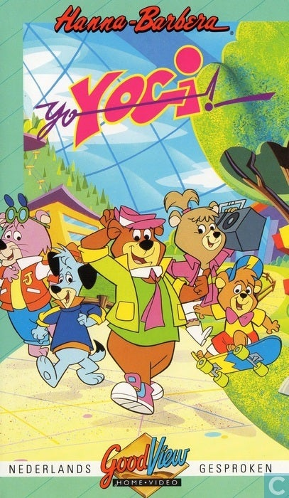
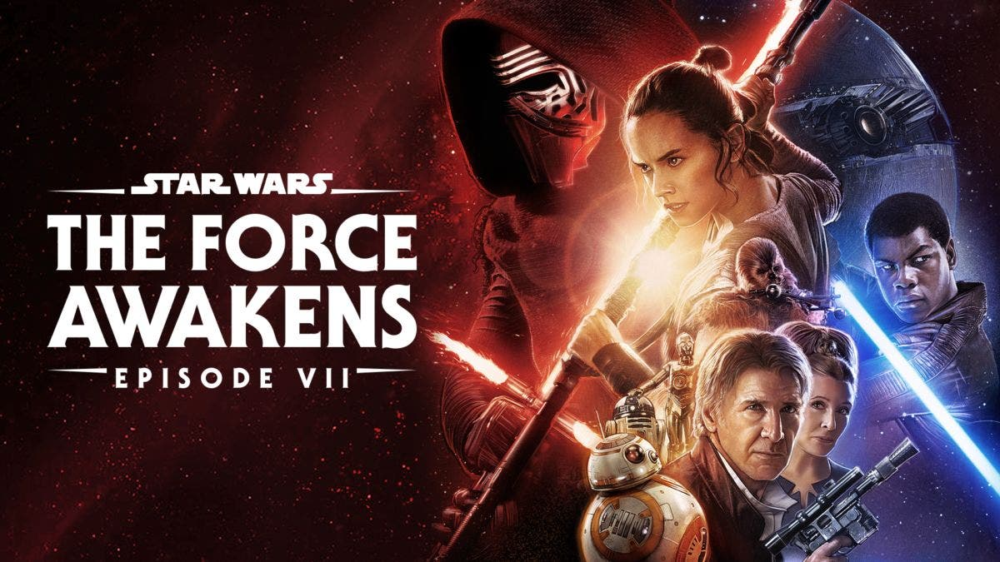
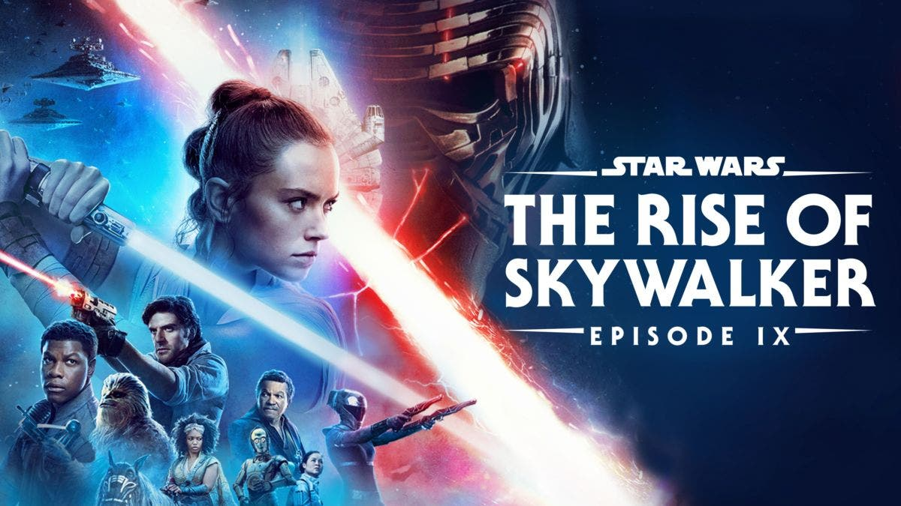

WebGPU 是新的 WebGL，可以在网络浏览器中绘制 3D 的新方法。它可能取代 Canvas 成为新的绘制 2D 的方式，并成为标准绘画方式。WebGPU 已经在 Chrome 113 中上线，到年底将在每个浏览器中无处不在。本文介绍了图形 API 的历史，以及 WebGPU 的使用和优势。

文章要点:
1. WebGPU 是新的 WebGL，可以在网络浏览器中绘制 3D 的新方法。
2. WebGPU 可能取代 Canvas 成为新的绘制 2D 的方式，并成为标准绘画方式。
3. WebGPU 已经在 Chrome 113 中上线，到年底将在每个浏览器中无处不在。
4. 本文介绍了图形 API 的历史，以及 WebGPU 的使用和优势。
5. WebGPU 的优势在于它可以更好地利用 GPU 的性能，提高渲染速度和质量。

Keywords: WebGPU、WebGL、Canvas、绘画、图形 API、渲染速度

WebGPU is the new WebGL. That means it is the new way to draw 3D in web browsers. It is, in my opinion, very good actually.  

WebGPU是新的WebGL。这意味着它是在网络浏览器中绘制3D的新方法。在我看来，它实际上是非常好的。  

It is so good I think it will also replace Canvas and become the new way to draw 2D in web browsers. In fact it is _so_ good I think it will replace _Vulkan_ as well as normal OpenGL, and become just the standard way to draw, in any kind of software, from any programming language. This is pretty exciting to me.  

它是如此之好，我认为它也将取代Canvas，成为网络浏览器中绘制2D的新方式。事实上，它是如此之好，我认为它将取代Vulkan以及普通的OpenGL，并成为任何一种软件、任何一种编程语言中的标准绘画方式。这对我来说是非常令人兴奋的。  

WebGPU is a little bit irritating— but only a _little_ bit, and it is massively less irritating than any of the things it replaces.  

WebGPU有一点令人恼火--但只是一点，而且它比它所取代的任何东西的恼火程度都低。

WebGPU goes live… today, actually. Chrome 113 shipped in the final minutes of me finishing this post and should be available in the "About Chrome" dialog right this second. If you [click here](https://data.runhello.com/j/wgpu/1/), and you see a rainbow triangle, your web browser has WebGPU. By the end of the year WebGPU will be everywhere, in every browser. (All of this refers to desktop computers.  

WebGPU上线了...实际上是今天。在我写完这篇文章的最后几分钟，Chrome 113已经发货了，现在应该可以在 "关于Chrome "对话框中看到。如果你点击这里，看到一个三角形的彩虹，你的浏览器就有WebGPU。到今年年底，WebGPU将在每个浏览器中无处不在。(所有这些都是指台式电脑。  

On phones, it won't be in Chrome until later this year; and Apple I don't know. Maybe one additional year after that.)  

在手机上，它要到今年晚些时候才会出现在Chrome中；而苹果我不知道。也许在那之后还要再过一年）。

If you are not a programmer, this probably doesn't affect you.  

如果你不是一个程序员，这可能不会影响你。  

It might get us closer to a world where you can just play games in your web browser as a normal thing like you used to be able to with Flash.  

它可能会让我们更接近一个世界，在那里你可以在你的网络浏览器中作为一个正常的事情玩游戏，就像你过去能够使用Flash一样。  

But probably not because WebGL wasn't the only problem there.  

但可能不是，因为WebGL并不是那里唯一的问题。

If you are a programmer, let me tell you what I think this means for you.  

如果你是一个程序员，让我告诉你我认为这对你意味着什么。

Sections below:

-   A history of graphics APIs (You can skip this)  
    
    图形API的历史（你可以跳过这部分）
-   What's it like? 它是什么样子的？
-   How do I use it?  我如何使用它？
    -   Typescript / NPM world
    -   I don't know what a NPM is I Just wanna write CSS and my stupid little script tags  
        
        我不知道什么是NPM，我只想写CSS和我那愚蠢的小脚本标签。
    -   Rust / C++ / Posthuman Intersecting Tetrahedron  
        
        Rust / C++ / 后人类交错四面体

___

### A history of graphics APIs (You can skip this)  

图形API的历史（你可以跳过这部分）

_1991_

Back in the dawn of time there were two ways to make 3D on a computer: You did a bunch of math; or you bought an SGI machine.  

在过去，有两种方法可以在计算机上制作3D：你做了一堆的数学题；或者你买了一台SGI机器。  

SGI were the first people who were designing circuitry to do the rendering parts of a 3D engine for you. They had this C API for describing your 3D models to the hardware.  

SGI是第一个设计电路来为你做3D引擎的渲染部分的人。他们有这样的C语言API，用于向硬件描述你的3D模型。  

At some point it became clear that people were going to start making plugin cards for regular desktop computers that could do the same acceleration as SGI's big UNIX boxes, so SGI released a public version of their API so it would be possible to write code that would work both on the UNIX boxes and on the hypothetical future PC cards.  

在某一时刻，人们开始为普通的台式电脑制作插件卡，这些插件卡可以和SGI的大型UNIX盒子做同样的加速，所以SGI发布了他们的API的公开版本，这样就有可能写出既能在UNIX盒子上工作又能在假设的未来PC卡上工作的代码。  

This was OpenGL. \`color()\` and \`rectf()\` in IRIS GL became \`glColor()\` and \`glRectf()\` in OpenGL.  

这就是OpenGL。IRIS GL中的\`color()\`和\`rectf()\`在OpenGL中成为\`glColor()\`和\`glRectf()\`。

_1995_

When the PC 3D cards actually became a real thing you could buy, things got real messy for a bit.  

当PC 3D卡真正成为你可以买到的东西时，事情变得非常混乱了。  

Instead of signing on with OpenGL Microsoft had decided to develop their own thing (Direct3D) and some of the 3D card vendors also developed their _own_ API standards, so for a while certain games were only accelerated on certain graphics cards and people writing games had to write their 3D pipelines like four times, once as a software renderer and a separate one for each card type they wanted to support.  

微软决定开发他们自己的东西（Direct3D），而不是与OpenGL签约，一些3D卡供应商也开发了他们自己的API标准，所以有一段时间，某些游戏只能在某些显卡上加速，编写游戏的人不得不写四次3D管道，一次作为软件渲染器，另一次为他们想要支持的每一种卡类型写。  

My perception is it was Direct3D, not OpenGL, which eventually managed to wrangle all of this into a standard, which really sucked if you were using a non-Microsoft OS at the time.  

我的看法是，是Direct3D，而不是OpenGL，它最终设法将所有这些东西纳入一个标准，如果你当时使用的是非微软的操作系统，这真的很糟糕。  

It really seemed like DirectX (and the "X Box" standalone console it spawned) were an attempt to lock game companies into Microsoft OSes by getting them to wire Microsoft exclusivity into their code at the lowest level, and for a while it really worked.  

看起来DirectX（以及它所产生的 "X Box "独立控制台）确实是一种试图将游戏公司锁定在微软的操作系统上，让他们在最底层的代码中加入微软的独占性，而且有一段时间它确实起了作用。

_2000_

It _is_ the case though it wasn't very long into the Direct3D lifecycle before you started hearing from Direct3D users that it was much, much nicer to use than OpenGL, and OpenGL quickly got to a point where it was literally _years_ behind Direct3D in terms of implementing critical early features like shaders, because the Architecture Review Board of card vendors that defined OpenGL would spend forever bickering over details whereas Microsoft could just implement stuff and expect the card vendor to work it out.  

事实是，在进入Direct3D生命周期不久，你就开始听到Direct3D用户说它比OpenGL好用得多，而且OpenGL很快就到了一个地步，在实现关键的早期功能（如着色器）方面，它简直比Direct3D晚了好几年，因为定义OpenGL的卡供应商的架构审查委员会会永远为细节争吵，而微软可以直接实现东西并期望卡供应商能解决它。

Let's talk about shaders. The original OpenGL was a "fixed function renderer", meaning someone had written down the steps in a 3D renderer and it performed those steps in order.  

让我们来谈谈着色器。最初的OpenGL是一个 "固定功能的渲染器"，这意味着有人写下了3D渲染器的步骤，它按顺序执行这些步骤。

![[API] → Primitive Processing → (1) Transform and Lighting → Primitive Assembly → Rasterizer → (2) Texture Environment → (2) Color sum → (2) Fog → (2) Alpha Test → Depth/Stencil → Color-buffer Blend → Dither → [Frame Buffer]](FIXED-FUNCTION-FIXED.png "[API] → Primitive Processing → (1) Transform and Lighting → Primitive Assembly → Rasterizer → (2) Texture Environment → (2) Color sum → (2) Fog → (2) Alpha Test → Depth/Stencil → Color-buffer Blend → Dither → [Frame Buffer]")

_Modified Khronos Group image 修改后的Khronos集团图片_

Each box in the "pipeline" had some dials on the side so you could configure how each feature behaved, but you were pretty much limited to the features the card vendor gave you.  

管道 "中的每个盒子边上都有一些转盘，所以你可以配置每个功能的行为方式，但你几乎被限制在卡片供应商给你的功能上。  

If you had shadows, or fog, it was because OpenGL or an extension had exposed a feature for drawing shadows or fog. What if you want some _other_ feature the ARB didn't think of, or want to do shadows or fog in a unique way that makes your game look different from other games? Sucks to be you.  

如果你有阴影或雾气，那是因为OpenGL或一个扩展暴露了一个绘制阴影或雾气的功能。如果你想要一些ARB没有想到的其他功能，或者想要以一种独特的方式做阴影或雾，使你的游戏看起来与其他游戏不同，怎么办？你真糟糕。  

This was obnoxious, so eventually "programmable shaders" were introduced. Notice some of the boxes above are yellow? Those boxes became _replaceable._ The (1) boxes got collapsed into the "Vertex Shader", and the (2) boxes became the "Fragment Shader"².  

这很令人厌恶，所以最终 "可编程着色器 "被引入。注意到上面的一些盒子是黄色的吗？这些盒子是可以替换的。(1)方框被折叠成 "顶点着色器"，(2)方框成为 "片段着色器"²。  

The software would upload a computer program in a simple C-like language (upload the actual text of the program, you weren't expected to compile it like a normal program)³ into the video driver at runtime, and the driver would convert that into configurations of ALUs (or whatever the card was actually doing on the inside) and your program would _become_ that chunk of the pipeline. This opened things up a lot, but more importantly it set card design on a kinda strange path.  

该软件会在运行时将一个简单的类似C语言的计算机程序（上传程序的实际文本，你不需要像普通程序那样编译它）³上传到视频驱动，驱动会将其转换为ALU的配置（或任何卡在内部实际做的事情），你的程序会成为管道的那块内容。这使事情变得更加开放，但更重要的是它使显卡设计走上了一条奇怪的道路。  

Suddenly video cards weren't specialized rendering tools anymore. They ran _software_.  

突然间，显卡不再是专门的渲染工具了。它们运行的是软件。

_2004_

Pretty shortly after this was another change.  

在这之后不久，又发生了另一个变化。  

Handheld devices were starting to get to the point it made sense to do 3D rendering on them (or at least, to do 2D compositing using 3D video card hardware like desktop machines had started doing).  

手持设备开始达到在其上进行3D渲染的意义（或者至少，像台式机开始做的那样，使用3D显卡硬件进行2D合成）。  

DirectX was never in the running for these applications. But implementing OpenGL on mid-00s mobile silicon was _rough_. OpenGL was kind of… large, at this point.  

对于这些应用来说，DirectX从来没有被考虑过。但在00年代中期的移动芯片上实现OpenGL是很困难的。在这一点上，OpenGL有点...大。  

It had all these leftover functions from the SGI IRIX era, and then it had this new shiny OpenGL 2.0 way of doing things with the shaders and everything and not only did this mean you basically had two unrelated APIs sitting side by side in the same API, but also a lot of the OpenGL 1.x features were _traps_. The spec said that every video card had to _support_ every OpenGL feature, but it didn't say it had to support them _in Hardware_, so there were certain early-90s features that 00s card vendors had decided nobody really uses, and so if you used those features the driver would _render the screen, copy the entire screen into regular RAM, perform the feature on the CPU and then copy the results back to the video card_. Accidentally activating one of these trap features could easily move you from 60 FPS to 1 FPS.  

它有SGI IRIX时代遗留下来的所有功能，然后又有新的闪亮的OpenGL 2.0方式来处理着色器和所有东西，这不仅意味着你基本上有两个不相关的API并列在同一个API中，而且还有很多OpenGL 1.x的功能是陷阱。规范说每块显卡都必须支持每一个OpenGL功能，但它并没有说它必须在硬件中支持这些功能，所以有一些90年代早期的功能，00年代的显卡供应商已经决定没有人真正使用，所以如果你使用这些功能，驱动程序会渲染屏幕，将整个屏幕复制到常规RAM中，在CPU上执行该功能，然后将结果复制到显卡上。不小心激活这些陷阱功能之一，很容易使你从60FPS变成1FPS。  

All this legacy baggage promised a lot of extra work for the manufacturers of the new mobile GPUs, so to make it easier Khronos (which is what the ARB had become by this point) introduced an OpenGL "ES", which stripped out everything except the features you absolutely needed.  

所有这些传统的包袱给新的移动GPU制造商带来了很多额外的工作，所以为了使它更容易，Khronos（这时ARB已经变成了什么）引入了OpenGL "ES"，除了你绝对需要的功能，它剥离了所有的东西。  

Instead of being able to call a function for each polygon or each vertex you had to use the newer API of giving OpenGL a list of coordinates in a block in memory⁴, you had to use _either_ the fixed function or the shader pipeline with no mixing (depending on whether you were using ES 1.x or ES 2.x), etc.  

你不能为每个多边形或每个顶点调用一个函数，而必须使用较新的API，在内存⁴块中给OpenGL一个坐标列表，你必须使用固定函数或没有混合的着色器管道（取决于你是使用ES 1.x还是ES 2.x），等等。  

This partially made things simpler for programmers, and partially prompted some annoying rewrites.  

这部分地使程序员的工作更简单，部分地促使一些恼人的重写。  

But as with shaders, what's most important is the long-term strange-ing this change presaged: _Starting at this point, the decisions of Khronos increasingly were driven entirely by the needs and wants of hardware manufacturers, not programmers._  

但是和着色器一样，最重要的是这一变化所预示的长期的陌生化：从这一点开始，Khronos的决定越来越多地完全由硬件制造商而不是程序员的需求和愿望驱动。

_2008_

With OpenGL ES devices in the world, OpenGL started to graduate from being "that other graphics API that exists, I guess" and actually take off.  

随着OpenGL ES设备的出现，OpenGL开始从 "其他存在的图形API，我想 "毕业，并真正起飞。  

The iPhone, which used OpenGL ES, gave a solid mass-market reason to learn and use OpenGL. Nintendo consoles started to use OpenGL or something like it.  

使用OpenGL ES的iPhone给了大众市场一个坚实的理由来学习和使用OpenGL。任天堂游戏机开始使用OpenGL或类似的东西。  

OpenGL had more or less caught up with DirectX in features, especially if you were willing to use extensions.  

OpenGL在功能上或多或少地赶上了DirectX，特别是如果你愿意使用扩展。  

Browser vendors, in that spurt of weird hubris that gave us the original WebAudio API, adapted OpenGL ES into JavaScript as "WebGL", which makes _no sense_ because as mentioned OpenGL ES was all about packing bytes into arrays full of geometry and JavaScript doesn't have direct memory access or even _integers_, but they [added packed binary arrays to the language](https://web.dev/webgl-typed-arrays/#history-of-typed-arrays) and did it anyway. So with all this activity, sounds like things are going great, right?  

浏览器供应商在给我们提供了最初的WebAudio API之后，又将OpenGL ES改编为JavaScript的 "WebGL"，这毫无意义，因为如前所述，OpenGL ES是将字节打包成充满几何图形的数组，而JavaScript没有直接的内存访问，甚至没有整数，但他们还是将打包的二进制数组添加到语言中，并且照做了。所以，在所有这些活动中，听起来事情进展得很好，对吗？

_2013_

_No!_ Everything was terrible! As it matured, OpenGL fractured into a variety of slightly different standards with varying degrees of cross-compatibility.  

不！一切都很糟糕随着它的成熟，OpenGL分裂成各种略有不同的标准，具有不同程度的交叉兼容性。  

OpenGL ES 2.0 was the same as OpenGL 3.3, somehow. WebGL 2.0 is _very almost_ OpenGL ES 3.0 but not quite.  

OpenGL ES 2.0与OpenGL 3.3是一样的，不知为何。WebGL 2.0非常接近OpenGL ES 3.0，但不完全是。  

Every attempt to resolve OpenGL's remaining early mistakes seemed to wind up duplicating the entire API as new functions with slightly different names and slightly different signatures.  

解决OpenGL早期剩余错误的每一次尝试，似乎都是将整个API复制成新的函数，名称略有不同，签名也略有不同。  

A big usability issue with OpenGL was even after the 2.0 rework it had a _lot_ of shared global state, but the add-on systems that were supposed to resolve this (VAOs and VBOs) only wound up being _even more_ global state you had to keep track of.  

OpenGL的一个很大的可用性问题是，即使在2.0重做之后，它也有很多共享的全局状态，但本来应该解决这个问题的附加系统（VAO和VBO）最后却变成了更多你必须跟踪的全局状态。  

A big trend in the 10s was "GPGPU" (General Purpose GPU); programmers started to realize that graphics cards worked as well as, but were slightly easier to program than, a CPU's vector units, so they just started accelerating random non-graphics programs by doing horrible hacks like stuffing them in pixel shaders and reading back a texture containing an encoded result.  

10年代的一个大趋势是 "GPGPU"（通用GPU）；程序员们开始意识到，显卡和CPU的矢量单元一样好用，但比CPU的矢量单元更容易编程，所以他们开始通过可怕的黑客手段来加速随机的非图形程序，比如把它们塞进像素着色器中，并读回含有编码结果的纹理。  

Before finally resolving on compute shaders (in other words: before giving up and copying DirectX's solution), Khronos's original steps toward actually catering to this were either poorly adopted (OpenCL) or just plain bad ideas (geometry shaders).  

在最终解决计算着色器的问题之前（换句话说：在放弃和复制DirectX的解决方案之前），Khronos最初为真正迎合这个问题而采取的措施要么是拙劣的采用（OpenCL），要么就是纯粹的坏主意（几何着色器）。  

It all built up.  这一切都建立起来了。  

Just like in the pre-ES era, OpenGL had basically become several unrelated APIs sitting in the same header file, some of which only worked on some machines. Worse, _nothing_ worked quite as well as you wanted it to; different video card vendors botched the complexity, implementing features slightly differently (especially tragically, implementing slightly different versions of the shader language) or just badly, especially in the infamously bad Windows OpenGL drivers.  

就像在前ES时代，OpenGL基本上变成了几个不相关的API，放在同一个头文件中，其中一些只在一些机器上工作。更糟糕的是，没有任何东西能像你希望的那样工作；不同的显卡供应商把复杂性搞得一团糟，实现的功能略有不同（尤其是悲剧性的，实现的着色器语言的版本略有不同），或者就是很糟糕，尤其是在臭名昭著的Windows OpenGL驱动中。

The way out came from, this is how I see it anyway, a short-lived idea called "[AZDO](https://www.youtube.com/watch?v=GiDsLRQg_g4)".  

出路来自于，反正我是这么看的，一个叫做 "AZDO "的短暂的想法。  

This technically consisted of a single GDC talk⁵, and I have no reason to believe the GDC talk originated the idea, but what the talk did do is give a name to the idea that underlies Vulkan, DirectX 12, and Metal.  

从技术上讲，这只包括一个GDC讲座，我没有理由相信GDC讲座是这个想法的起源，但这个讲座确实为支撑Vulkan、DirectX 12和Metal的想法起了一个名字。  

"Approaching Zero Driver Overhead".  

"接近零驾驶员开销"。  

Here is the idea: By 2015 video cards had pretty much standardized on a particular way of working and that way was known and that way wasn't expected to change for ten years at least.  

这里有一个想法：到2015年，显卡已经在某种特定的工作方式上基本实现了标准化，而且这种方式是众所周知的，而且这种方式预计至少在十年内不会改变。  

Graphics APIs were originally designed around the _functionality_ they exposed, but that functionality hadn't been a 1:1 map to how GPUs look on the inside for ten years at least.  

图形API最初是围绕它们所暴露的功能而设计的，但这些功能与GPU的内部外观至少有十年时间没有1:1的映射。  

Drivers had become complex beasts that rather than just doing what you told them tried to intuit what you were _trying_ to do and then do that in the most optimized way, but often they guessed wrong, leaving software authors in the ugly position of trying to intuit what the driver would intuit in any one scenario.  

驱动程序已经成为复杂的野兽，而不是只做你告诉他们的事情，试图直觉你想做什么，然后以最优化的方式做，但他们经常猜错，让软件作者处于丑陋的位置，试图直觉驱动程序在任何一种情况下会直觉什么。  

AZDO was about threading your way through the needle of the graphics API in such a way your function calls happened to align precisely with what the hardware was actually doing, such that the driver had nothing to do and stuff just _happened_.  

AZDO是在图形API的针尖上穿针引线，使你的函数调用恰好与硬件的实际操作相一致，这样，驱动程序就没有什么可做的了，事情就这样发生了。

_2016_

Or we could just design the graphics API to be AZDO from the start. That's Vulkan. (And DirectX 12, and Metal.) The modern generation of graphics APIs are about basically _throwing out the driver_, or rather, letting your program _be_ the driver. The API primitives map directly to GPU internal functionality⁶, and the GPU does what you ask without second guessing. This gives you an _incredible_ amount of power and control. Remember that "pipeline" diagram up top?  

或者我们可以从一开始就把图形API设计成AZDO。这就是Vulkan。(还有DirectX 12和Metal。)现代的图形API基本上是抛弃了驱动程序，或者说，让你的程序成为驱动程序。API基元直接映射到GPU的内部功能⁶，而GPU会按照你的要求去做，不需要再猜测。这为您提供了巨大的权力和控制力。还记得上面那张 "管道 "图吗？  

The modern APIs let you define "pipeline objects"; while graphics shaders let you replace boxes within the diagram, and compute shaders let you replace the diagram with one big shader program, pipeline objects let you _draw your own diagram_. You decide what blocks of GPU memory are the sources, and which are the destinations, and how they are interpreted, and what the GPU does with them, and what shaders get called.  

现代API让你定义 "管道对象"；图形着色器让你替换图中的方框，计算着色器让你用一个大的着色器程序替换图，而管道对象让你绘制自己的图。你决定GPU内存的哪些块是来源，哪些是目的地，以及如何解释它们，GPU用它们做什么，以及哪些着色器被调用。  

All the old sources of confusion get resolved. State is bound up in neatly defined objects instead of being global.  

所有旧的混乱来源都得到了解决。状态被整齐地定义在对象中，而不是全局性的。  

Card vendors always designed their shader compilers different, so we'll replace the textual shader language with a bytecode format that's unambiguous to implement and easier to write compilers for.  

卡片供应商总是对他们的着色器编译器进行不同的设计，因此我们将用一种字节码格式取代文本着色器语言，这种格式实现起来毫不含糊，而且更容易编写编译器。  

Vulkan goes so far as to allow⁷ you to write your own allocator/deallocator for GPU memory.  

Vulkan甚至允许⁷你为GPU内存编写自己的分配器/去分配器。

So this is all very cool. There is only one problem, which is that with all this fine-grained complexity, Vulkan winds up being basically impossible for humans to write.  

所以这一切都非常酷。只有一个问题，那就是所有这些细粒度的复杂性，Vulkan最终基本上不可能由人类来编写。  

Actually, that's not really fair. DX12 and Metal offer more or less the same degree of fine-grained complexity, and by all accounts they're not so bad to write.  

实际上，这并不公平。DX12和Metal提供了或多或少相同程度的细粒度复杂度，而且从各方面来看，它们的编写并不差。  

The actual problem is that _Vulkan is not designed for humans to write_. Literally. Khronos does not _want_ you to write Vulkan, or rather, they don't want you to write it directly.  

实际的问题是，Vulkan不是为人类编写的。从字面上讲。Khronos不希望你写Vulkan，或者说，他们不希望你直接写它。  

I was in the room when Vulkan was announced, across the street from GDC in 2015, and what they explained to our faces was that game developers were increasingly not actually targeting the gaming API itself, but rather targeting high-level middleware, Unity or Unreal or whatever, and so Vulkan was an API designed for writing middleware.  

Vulkan宣布的时候我就在房间里，就在2015年GDC的对面，他们当着我们的面解释的是，游戏开发者实际上越来越不针对游戏API本身，而是针对高级中间件，Unity或Unreal或其他什么，所以Vulkan是为编写中间件设计的API。  

The middleware developers were also in the room at the time, the Unity and Epic and Valve guys. They were beaming as the Khronos guy explained this.  

当时中间件的开发者也在房间里，Unity、Epic和Valve的人。当Khronos的人解释这个问题时，他们满脸笑容。  

Their lives were about to get much, much easier.  

他们的生活即将变得更加轻松。

My life was about to get harder. Vulkan is _weird_— but it's weird in a way that makes a certain sort of horrifying machine sense.  

我的生活即将变得更加艰难。Vulkan很奇怪--但它的奇怪之处在于使某种可怕的机器有了意义。  

Every Vulkan call involves passing in one or two huge structures which are themselves a forest of other huge structures, and every structure and sub-structure begins with a little protocol header explaining what it is and how big it is.  

每个Vulkan调用都涉及到传入一个或两个巨大的结构，这些结构本身就是其他巨大结构的森林，每个结构和子结构都以一个小的协议头开始，解释它是什么以及它有多大。  

Before you allocate memory you have to fill out a structure to get back a structure that tells you what structure you're supposed to structure your memory allocation request in.  

在你分配内存之前，你必须填写一个结构，得到一个结构，告诉你应该用什么结构来构造你的内存分配请求。  

None of it makes any sense— unless you've designed a programming language before, in which case everything you're reading jumps out to you as "oh, this is contrived like this because it's designed to be easy to bind to from languages with weird memory-management techniques" "this is a way of designing a forward-compatible ABI while making no assumptions about programming language" etc.  

这一切都没有任何意义--除非你以前设计过一种编程语言，在这种情况下，你读到的一切都会让你跳出来，"哦，这是被设计成这样的，因为它被设计成容易与具有奇怪内存管理技术的语言绑定""这是一种设计向前兼容的ABI的方法，同时不对编程语言进行假设 "等等。  

The docs are written in a sort of alien English that fosters no understanding— but it's also written exactly the way a hardware implementor would want in order to remove all ambiguity about what a function call does.  

文档是用一种陌生的英语写的，让人无法理解--但它也正是硬件实现者想要的写法，以消除关于函数调用的所有歧义。  

In short, Vulkan is not _for_ you. It is a byzantine contract between hardware manufacturers and middleware providers, and people like… well, me, are just not part of the transaction.  

简而言之，Vulkan不适合你。它是硬件制造商和中间件供应商之间的一个错综复杂的合同，而像......嗯，我这样的人，只是没有参与交易。

Khronos did not _forget_ about you and me.  

克罗诺斯并没有忘记你和我。  

They just made a judgement, and this actually does make a sort of sense, that they were never going to design the perfectly ergonomic developer API anyway, so it would be better to not even try and instead make it as easy as possible for the perfectly ergonomic API to be written _on top_, as a library.  

他们只是做了一个判断，这实际上是有一定道理的，那就是他们无论如何都不会设计出完美的符合人体工程学的开发者API，所以最好不要尝试，而是尽可能地让完美的符合人体工程学的API写在上面，作为一个库。  

Khronos thought within a few years of Vulkan⁸ being released there would be a bunch of high-quality open source wrapper libraries that people would use instead of Vulkan directly.  

Khronos认为，在Vulkan⁸发布的几年内，会有一堆高质量的开源包装库，人们会直接使用这些包装库而不是Vulkan。  

These libraries basically did not materialize. It turns out writing software is work and open source projects do not materialize just because people would like them to⁹.  

这些库基本上没有实现。事实证明，编写软件是一项工作，开放源码项目不会因为人们希望它们实现而实现⁹。

_2019_

This leads us to the other problem, the one Vulkan developed after the fact. The Apple problem.  

这把我们引向另一个问题，即Vulkan事后开发的问题。苹果的问题。  

The theory on Vulkan was it would change the balance of power where Microsoft continually released a high-quality cutting-edge graphics API and OpenGL was the sloppy open-source catch up.  

关于Vulkan的理论是它将改变力量的平衡，即微软不断发布高质量的尖端图形API，而OpenGL则是马虎的开源追赶者。  

Instead, the GPU vendors themselves would provide the API, and Vulkan would be the universal standard while DirectX would be reduced to a platform-specific oddity.  

相反，GPU供应商将自己提供API，Vulkan将成为通用标准，而DirectX将沦为一个特定平台的怪胎。  

But then Apple said no.  但后来苹果公司说不行。  

Apple (who had already launched their own thing, Metal) announced not only would they never support Vulkan, they would not support _OpenGL_, anymore¹⁰.  

苹果公司（已经推出了他们自己的东西，Metal）宣布，他们不仅不会支持Vulkan，也不会支持OpenGL，不再支持。  

From my perspective, this is just DirectX again; the dominant OS vendor of our era, as Microsoft was in the 90s, is pushing proprietary graphics tech to foster developer lock-in.  

在我看来，这又是DirectX；我们这个时代的主导操作系统供应商，就像微软在90年代那样，正在推动专有的图形技术以促进开发者的锁定。  

But from Apple's perspective it probably looks like— well, the way DirectX probably looked from Microsoft's perspective in the 90s.  

但从苹果的角度来看，它可能看起来像--好吧，从微软的角度来看，DirectX在90年代可能是这样的。  

They're ignoring the jagged-metal thing from the hardware vendors and shipping something their developers will actually want to use.  

他们无视硬件供应商提供的锯齿状金属的东西，并提供他们的开发人员真正想要使用的东西。

With Apple out, the scene looked different. Suddenly there was a next-gen API for Windows, a next-gen API for Mac/iPhone, and a next-gen API for Linux/Android.  

随着苹果公司的退出，场面看起来有所不同。突然间，Windows有了新一代的API，Mac/iPhone有了新一代的API，Linux/Android也有了新一代的API。  

Except Linux has a severe driver problem with Vulkan and a lot of the Linux devices I've been checking out don't support Vulkan _even now_ after it's been out seven years. So really the only platform where Vulkan runs natively is Android. This isn't _that_ bad. Vulkan does work on Windows and there are _mostly_ no problems, though people who have the resources to write a DX12 backend seem to prefer doing so.  

除了Linux在Vulkan方面有严重的驱动问题，而且我一直在检查的很多Linux设备都不支持Vulkan，即使在它已经推出七年之后。因此，真正能让Vulkan原生运行的平台只有Android。这还不算太糟。Vulkan确实可以在Windows上运行，而且大多没有问题，尽管那些有资源编写DX12后端的人似乎更喜欢这样做。  

The entire point of these APIs is that they're flyweight things resting very lightly on top of the hardware layer, which means they aren't really that _different_, to the extent that a Vulkan-on-Metal emulation layer named MoltenVK exists and reportedly adds almost no overhead.  

这些API的全部意义在于，它们是非常轻地停留在硬件层之上的重量级东西，这意味着它们实际上并没有什么不同，以至于存在一个名为MoltenVK的Vulkan-on-Metal仿真层，据说几乎没有增加开销。  

But if you're an open source kind of person who doesn't have the resources to pay three separate people to write vaguely-similar platform backends, this isn't great. Your code can _technically_ run on all platforms, but you're writing in the least pleasant of the three APIs to work with and you get the advantage of using a true-native API on _neither_ of the two major platforms. You _might_ even have an easier time just writing DX12 and Metal and forgetting Vulkan (and Android) altogether.  

但是如果你是一个开源的人，没有资源去支付三个独立的人去写隐约相似的平台后端，这不是很好。你的代码在技术上可以在所有的平台上运行，但你是在三个API中最不讨人喜欢的平台上编写的，而且你在两个主要平台上都没有得到使用真正的原生API的好处。你甚至可以更容易地编写DX12和Metal，而完全忘记Vulkan（和Android）。  

In short, Vulkan solves all of OpenGL's problems at the cost of making something that no one wants to use and no one has a reason to use.  

简而言之，Vulkan解决了OpenGL的所有问题，但代价是做出了一个没有人愿意使用、没有人有理由使用的东西。

The way out turned out to be something called ANGLE. Let me back up a bit.  

出路原来是一个叫ANGLE的东西。让我倒退一下。

_2010, again_

WebGL was designed around OpenGL ES. But it was never _exactly_ the same as OpenGL ES, and also technically OpenGL ES never really ran on desktops, and also regular OpenGL on desktops had Problems. So the browser people eventually realized that if you wanted to ship an OpenGL compatibility layer on Windows, it was actually easier to _write an OpenGL emulator in DirectX_ than it was to use OpenGL directly and have to negotiate the various incompatibilities between OpenGL implementations of different video card drivers.  

WebGL是围绕OpenGL ES设计的。但它与OpenGL ES并不完全相同，而且从技术上讲，OpenGL ES从未真正在台式机上运行过，而且台式机上的常规OpenGL也有问题。因此，浏览器制造商最终意识到，如果你想在Windows上提供一个OpenGL兼容层，用DirectX编写一个OpenGL模拟器实际上要比直接使用OpenGL和不得不协商不同显卡驱动的OpenGL实现之间的各种不兼容问题更容易。  

The browser people also realized that if slight compatibility differences between different OpenGL drivers was hell, _slight incompatibility differences between four different browsers times three OSes times different graphics card drivers_ would be the worst thing ever.  

浏览器们也意识到，如果说不同的OpenGL驱动之间的轻微兼容性差异是地狱，那么四个不同的浏览器乘以三个操作系统乘以不同的显卡驱动之间的轻微不兼容性差异将是最糟糕的事情。  

From what I can only assume was desperation, the most successful example I've ever seen of true cross-company open source collaboration emerged: ANGLE, a BSD-licensed OpenGL emulator originally written by Google but with honest-to-goodness contributions from both Firefox and Apple, which is used for WebGL support in _literally every web browser_.  

我只能认为这是一种无奈，我所见过的真正的跨公司开源合作的最成功的例子出现了：ANGLE，一个由BSD授权的OpenGL模拟器，最初由谷歌编写，但火狐和苹果都做出了诚实的贡献，它被用于支持所有网络浏览器中的WebGL。

But nobody _actually_ wants to use WebGL, right? We want a "modern" API, one of those AZDO thingies. So a W3C working group sat down to make Web Vulkan, which they named WebGPU.  

但实际上没有人想使用WebGL，对吗？我们想要一个 "现代 "API，一个AZDO的东西。因此，一个W3C工作组坐下来制定了Web Vulkan，他们将其命名为WebGPU。  

I'm not sure my perception of events is to be trusted, but my perception of how this went from afar was that Apple was the most demanding participant in the working group, and also the participant everyone would naturally by this point be most afraid of just spiking the entire endeavor, so reportedly Apple just got absolutely everything they asked for and WebGPU really looks a lot like Metal.  

我不确定我对事件的看法是否可信，但我从远处对这件事的看法是，苹果是工作组中要求最高的参与者，也是大家到这时自然最害怕的参与者，因为他们会把整个努力都搞砸，所以据说苹果刚刚得到了他们要求的一切，WebGPU看起来真的很像金属。  

But Metal was always reportedly the nicest of the three modern graphics APIs to use, so that's… good?  

但据说Metal一直是三个现代图形API中最适合使用的，所以这......是好事？  

Encouraged by the success with ANGLE (which by this point was starting to see use as a standalone library in non-web apps¹¹), and mindful people would want to use this new API with [WebASM](https://webassembly.org/), they took the step of defining the standard simultaneously as a JavaScript IDL and a C header file, so non-browser apps could use it as a library.  

在ANGLE成功的鼓舞下（此时ANGLE已经开始作为一个独立的库在非网络应用中使用¹¹），并且考虑到人们会想用WebASM来使用这个新的API，他们采取了同时将标准定义为JavaScript IDL和C头文件的措施，所以非浏览器应用可以将其作为一个库来使用。

_2023_

WebGPU is the child of ANGLE and Metal. WebGPU is the missing open-source "ergonomic layer" for Vulkan. WebGPU is in the web browser, and Microsoft and Apple are _on the browser standards committee_, so they're "bought in", not only does WebGPU work good-as-native on their platforms but anything WebGPU can do will _remain_ perpetually feasible on their OSes regardless of future developer lock-in efforts.  

WebGPU是ANGLE和Metal的孩子。WebGPU是Vulkan缺少的开源 "人体工程学层"。WebGPU在网络浏览器中，而微软和苹果是浏览器标准委员会的成员，所以他们 "买账"，不仅WebGPU在他们的平台上运行良好，而且WebGPU能做的任何事情在他们的操作系统上都将永远可行，无论未来的开发者锁定努力如何。  

(You don't have to worry about feature drift like we're already seeing with MoltenVK.) WebGPU will be on _day one_ (today) available with perfectly equal compatibility for JavaScript/TypeScript (because it was designed for JavaScript in the first place), for C++ (because the Chrome implementation is in C, and it's open source) and for Rust (because the Firefox implementation is in Rust, and it's open source).  

(你不必担心像我们在MoltenVK上已经看到的功能漂移）。WebGPU将在第一天（今天）对JavaScript/TypeScript（因为它首先是为JavaScript设计的）、C++（因为Chrome的实现是C语言，而且是开源的）和Rust（因为Firefox的实现是Rust语言，而且是开源的）具有完全平等的兼容性。

I feel like WebGPU is what I've been waiting for this entire time.  

我觉得WebGPU是我一直在等待的东西。

___

### What's it like? 它是什么样子的？

I can't compare to DirectX or Metal, as I've personally used neither. But _especially_ compared to OpenGL and Vulkan, I find WebGPU really refreshing to use. I have tried, really tried, to write Vulkan, and been defeated by the complexity each time.  

我无法与DirectX或Metal相比，因为我个人都没有使用过。但是，特别是与OpenGL和Vulkan相比，我发现WebGPU使用起来真的很新鲜。我曾经尝试过，真的尝试过，编写Vulkan，但每次都被其复杂性所击败。  

By contrast WebGPU does a good job of adding complexity only when the complexity adds something. There _are_ a lot of different objects to keep track of, especially during initialization (see below), but every object represents some Real Thing that I don't think you could eliminate from the API without taking away a useful ability.  

相比之下，WebGPU在增加复杂度方面做得很好，只有当复杂度增加时才会增加一些东西。有很多不同的对象需要跟踪，特别是在初始化过程中（见下文），但每个对象都代表了一些真实的东西，我认为你不能从API中消除这些东西而不带走有用的能力。  

(And there is at least the nice property that you can stuff all the complexity into init time and make the process of actually drawing a frame very terse.) WebGPU caters to the kind of person who thinks it might be fun to write their own raymarcher, without requiring every programmer to be the kind of person who thinks it would be fun to write their own implementation of `malloc`.  

(至少有一个很好的特性，就是你可以把所有的复杂性都塞进init时间里，让实际绘制帧的过程变得非常简洁）。WebGPU迎合了那种认为编写自己的光线采集器可能很有趣的人，而不要求每个程序员都是那种认为编写自己的 `malloc` 的实现会很有趣的人。

#### The Problems

There are three Problems. I will summarize them thusly:  

有三个问题。我将这样总结它们：

-   Text
-   Lines
-   The Abomination

Text and lines are basically the same problem. WebGPU kind of doesn't… have them. It _can_ draw lines, but they're only really for debugging– single-pixel width and you don't have control over antialiasing.  

文本和线条基本上是同一个问题。WebGPU并没有......拥有它们。它可以画线，但它们只能用于调试--单像素宽度，而且你不能控制抗锯齿。  

So if you want a "normal looking" line you're going to be doing some complicated stuff with small bespoke meshes and an SDF shader.  

因此，如果你想要一个 "看起来很正常 "的线条，你就要用小型定制网格和SDF着色器做一些复杂的事情。  

Similarly with text, you will be getting no assistance– you will be parsing OTF font files yourself and writing your own MSDF shader, or more likely finding a library that does text for you.  

同样，对于文本，你将得不到任何帮助--你将自己解析OTF字体文件并编写你自己的MSDF着色器，或者更可能找到一个为你做文本的库。

This (no lines or text unless you implement it yourself) is a totally normal situation for a low-level graphics API, but it's a little annoying to me because the web browser already has a sophisticated anti-aliased line renderer (the original Canvas API) and the most advanced text renderer in the world. (There _is_ some way to render text into a Canvas API texture and then transfer the Canvas contents into WebGPU as a texture, which should help for some purposes.)  

这（没有线条或文本，除非你自己实现）对于低级图形API来说是完全正常的情况，但对我来说有点恼火，因为网络浏览器已经有一个复杂的反锯齿线条渲染器（最初的Canvas API）和世界上最先进的文本渲染器。(有一些方法可以将文本渲染到Canvas API的纹理中，然后将Canvas的内容作为纹理传输到WebGPU中，这对某些用途应该有帮助)。

Then there's WGSL, or as I think of it, The Abomination. You will probably not be as annoyed by this as I am.  

然后是WGSL，或者按照我的想法，是 "憎恶"。你可能不会像我一样对这个问题感到恼火。  

Basically: One of the benefits of Vulkan is that you aren't required to use a particular shader language. OpenGL uses GLSL, DirectX uses HLSL.  

基本上是这样：Vulkan的一个好处是，你不需要使用一种特定的着色器语言。OpenGL使用GLSL，DirectX使用HLSL。  

Vulkan used a bytecode, called SPIR-V, so you could target it from any shader language you wanted. WebGPU was going to use SPIR-V, but then Apple said no¹².  

Vulkan使用一个字节码，叫做SPIR-V，所以你可以从任何你想要的着色器语言中瞄准它。WebGPU本来打算使用SPIR-V，但后来苹果说不行。  

So now WebGPU uses WGSL, a new thing developed just for WebGPU, as its only shader language. As far as shader languages go, it is fine. Maybe it is even good.  

所以现在WebGPU使用WGSL，一个专门为WebGPU开发的新东西，作为其唯一的着色器语言。就着色器语言而言，它很好。也许它甚至是好的。  

I'm sure it's better than GLSL.  

我确信它比GLSL好。  

For pure JavaScript users, it's probably objectively an improvement to be able to upload shaders as text files instead of having to compile to bytecode.  

对于纯粹的JavaScript用户来说，能够以文本文件的形式上传着色器，而不是必须编译成字节码，这可能是客观上的一种改进。  

But gosh, it would have been nice to have that choice! (The "desktop" versions of WebGPU still keep SPIR-V as an option.)  

但天哪，如果能有这样的选择就好了！（WebGPU的 "桌面版 "仍然保留SPIR-V作为选项！(WebGPU的 "桌面 "版本仍然保留SPIR-V作为选项。)

___

### How do I use it? 我如何使用它？

You have three choices for using WebGPU: Use it in JavaScript in the browser, use it in Rust/C++ in WebASM inside the browser, or use it in Rust/C++ in a standalone app.  

你有三个选择来使用WebGPU：在浏览器中使用JavaScript，在浏览器内的WebASM中使用Rust/C++，或者在独立的应用程序中使用Rust/C++。  

The Rust/C++ APIs are as close to the JavaScript version as language differences will allow; the in-browser/out-of-browser APIs for Rust and C++ are _identical_ (except for standalone-specific features like SPIR-V).  

在语言差异允许的范围内，Rust/C++的API与JavaScript版本非常接近；Rust和C++的浏览器内/浏览器外API是相同的（除了SPIR-V这样的单机特定功能）。  

In standalone apps you embed the WebGPU components from Chrome or Firefox as a library; your code doesn't need to know if the WebGPU library is a real library or if it's just routing through your calls to the browser.  

在独立的应用程序中，你将Chrome或Firefox的WebGPU组件作为一个库嵌入；你的代码不需要知道WebGPU库是否是一个真正的库，或者它只是通过你对浏览器的调用进行路由。

Regardless of language, the [official WebGPU spec document](https://www.w3.org/TR/webgpu/) on w3.org is a clear, readable reference guide to the language, suitable for just _reading_ in a way standard specifications sometimes aren't. (I haven't spent as much time looking at the [WGSL spec](https://www.w3.org/TR/WGSL/) but it seems about the same.) If you get lost while writing WebGPU, I really do recommend checking the spec.  

不管是哪种语言，w3.org上的官方WebGPU规范文件都是一个清晰、可读的语言参考指南，适合于直接阅读，而标准规范有时并不适合。(我没有花那么多时间看WGSL规范，但似乎也差不多。)如果你在编写WebGPU时迷失了方向，我真的建议你看看这个规范。

Most of the "work" in WebGPU, other than writing shaders, consists of the construction (when your program/scene first boots) of one or more "pipeline" objects, one per "pass", which describe "what shaders am I running, and what kind of data can get fed into them?"¹³.  

除了编写着色器之外，WebGPU中的大部分 "工作 "包括构建一个或多个 "管道 "对象（当你的程序/场景首次启动时），每个 "通道 "一个，描述 "我正在运行什么着色器，什么样的数据可以输入它们？"¹³。  

You can chain pipelines end-to-end within a queue: have a compute pass generate a vertex buffer, have a render pass render into a texture, do a final render pass which renders the computed vertices with the rendered texture.  

你可以在一个队列中端对端地链接管道：让一个计算通道生成一个顶点缓冲区，让一个渲染通道渲染成一个纹理，做一个最后的渲染通道，将计算的顶点与渲染的纹理一起渲染。

Here, in diagram form, are all the things you need to create to initially set up WebGPU and then draw a frame. This might look a little overwhelming. Don't worry about it!  

这里以图表的形式列出了你需要创建的所有东西，以初步设置WebGPU，然后绘制一个框架。这可能看起来有点让人不知所措。不要担心  

In practice you're just going to be copying and pasting a big block of boilerplate from some sample code. _However_ at some point you're going to need to go back and _change_ that copypasted boilerplate, and then you'll want to come back and look up what the difference between any of these objects is.  

在实践中，你只是在复制和粘贴一些样本代码中的一大块模板。然而，在某些时候，你会需要回去修改这些复制的模板，然后你会想回来看看这些对象之间有什么区别。

**At init:**

![Context: One <canvas> or window. Exists at boot.
WebGPU instance: navigator.gpu. Exists at boot.
Adapter: If there’s more than one video card, you can pick one. Feed this to Canvas Configuration. Vends a Device. Vends a Queue.
Canvas Configuration: You make this. Feed to Context.
Queue: Executes work batches in order. You’ll use this later.
Device: An open connection to the adapter. Gives color format to the Canvas Configuration. Vends Buffers, Textures, and Pipelines and compiles code to Shaders.
Buffer: A chunk of GPU memory. You’ll use this later.
Texture:GPU memory formatted as an image. You’ll use this later.
Shader: Vertex, Fragment, or Compute program. Feed to Pipeline.
Buffer Layout: Describes how to interpret bytes in a Buffer. Like a C Struct definition. Describes a Buffer. Feed to Pipeline.
Vertex Layout: Buffer layout specialized for meshes/triangle lists. Describes a Buffer. Feed to Pipeline.](wgpu1-2.0.png "Context: One <canvas> or window. Exists at boot.
WebGPU instance: navigator.gpu. Exists at boot.
Adapter: If there’s more than one video card, you can pick one. Feed this to Canvas Configuration. Vends a Device. Vends a Queue.
Canvas Configuration: You make this. Feed to Context.
Queue: Executes work batches in order. You’ll use this later.
Device: An open connection to the adapter. Gives color format to the Canvas Configuration. Vends Buffers, Textures, and Pipelines and compiles code to Shaders.
Buffer: A chunk of GPU memory. You’ll use this later.
Texture:GPU memory formatted as an image. You’ll use this later.
Shader: Vertex, Fragment, or Compute program. Feed to Pipeline.
Buffer Layout: Describes how to interpret bytes in a Buffer. Like a C Struct definition. Describes a Buffer. Feed to Pipeline.
Vertex Layout: Buffer layout specialized for meshes/triangle lists. Describes a Buffer. Feed to Pipeline.")

**For each frame: 对于每一个框架：**

![Step one:
Take a Buffer which you wish to update this frame. This will vend a Mapped Range, which is a Typed array that can read/write data from part of a GPU buffer. When you "unmap" the mapped range, the changes are automatically synchronized with the appropriate queue at that moment
Step two:
Device vends a Command Encoder.
Context vends the Current Texture for this frame. Feed this to the Command Encoder and get a Render Pass. (The Command Encoder can also vend Compute Passes.
Feed Viewport and Scissor rects (these are just numbers) to the Render Pass. Feed a Pipeline to the scissor rect. Feed Buffers (uniforms, vertices, indices) to the Render Pass. Feed Textures (inputs to shaders) to the Render Pass.
Feed Render Passes and Compute Passes to the Queue.](wgpu2-2.0.png "Step one:
Take a Buffer which you wish to update this frame. This will vend a Mapped Range, which is a Typed array that can read/write data from part of a GPU buffer. When you \"unmap\" the mapped range, the changes are automatically synchronized with the appropriate queue at that moment
Step two:
Device vends a Command Encoder.
Context vends the Current Texture for this frame. Feed this to the Command Encoder and get a Render Pass. (The Command Encoder can also vend Compute Passes.
Feed Viewport and Scissor rects (these are just numbers) to the Render Pass. Feed a Pipeline to the scissor rect. Feed Buffers (uniforms, vertices, indices) to the Render Pass. Feed Textures (inputs to shaders) to the Render Pass.
Feed Render Passes and Compute Passes to the Queue.")

Some observations in no particular order:  

一些没有特定顺序的观察：

-   When describing a "mesh" (a 3D model to draw), a "vertex" buffer is the list of points in space, and the "index" is an optional buffer containing the order in which to draw the points.  
    
    当描述一个 "网格"（要绘制的三维模型）时，"顶点 "缓冲区是空间中的点的列表，而 "索引 "是一个可选的缓冲区，包含绘制这些点的顺序。  
    
    Not sure if you knew that.  
    
    不知道你是否知道这一点。
-   Right now the "queue" object seems a little pointless because there's only ever one global queue. But someday WebGPU will add threading and then there might be more than one.  
    
    现在，"队列 "对象似乎有点无意义，因为只有一个全局队列。但总有一天WebGPU会增加线程，那时可能会有多个。
-   A command encoder can only be working on one pass at a time; you have to mark one pass as complete before you request the next one.  
    
    命令编码器每次只能在一个通道上工作；你必须在要求下一个通道之前将一个通道标记为完成。  
    
    But you can make more than one command encoder and submit them all to the queue at once.  
    
    但你可以制作一个以上的命令编码器，并一次将它们全部提交给队列。
-   Back in OpenGL when you wanted to set a uniform, attribute, or texture on a shader, you did it by name.  
    
    在OpenGL中，当你想在着色器上设置统一、属性或纹理时，你可以通过名称来实现。  
    
    In WebGPU you have to assign these things numbers in the shader and you address them by number.¹⁴  
    
    在WebGPU中，你必须在着色器中为这些东西分配编号，并通过编号对它们进行寻址。
-   Although textures and buffers are two different things, you can instruct the GPU to just turn a texture into a buffer or vice versa.  
    
    虽然纹理和缓冲区是两种不同的东西，但你可以指示GPU直接将纹理变成缓冲区，反之亦然。
-   I do not list "pipeline layout" or "bind group layout" objects above because I honestly don't understand what they do. I've only ever set them to default/blank.  
    
    我没有在上面列出 "管道布局 "或 "绑定组布局 "对象，因为我真的不明白它们的作用。我只把它们设置为默认/空白。
-   In the Rust API, a "Context" is called a "Surface". I don't know if there's a difference.  
    
    在Rust API中，一个 "Context "被称为 "Surface"。我不知道这其中是否有区别。

Getting a little more platform-specific:  

越来越多的特定平台：

#### TypeScript / NPM world

The best way to learn WebGPU for TypeScript I know is [Alain Galvin's "Raw WebGPU" tutorial](https://alain.xyz/blog/raw-webgpu). It is a little friendlier to someone who hasn't used a low-level graphics API before than my sandbag introduction above, and it has a list of further resources at the end.  

据我所知，学习TypeScript的WebGPU的最好方法是Alain Galvin的 "Raw WebGPU "教程。与我上面的沙袋介绍相比，它对没有使用过低级图形API的人来说更友好一些，而且它在最后有一个进一步的资源清单。

Since code snippets don't get you something runnable, Alain's tutorial links a completed source repo with the tutorial code, and also [I have a sample repo](https://github.com/mcclure/ts-hello/tree/canvas-gpu) which is based on Alain's tutorial code and adds simple animation as well as Preact¹⁵. Both my and Alain's examples use NPM and WebPack¹⁶.  

由于代码片段并不能让你得到可运行的东西，Alain的教程链接了一个带有教程代码的完整源码 repo，同时我也有一个基于Alain教程代码的样本 repo，并添加了简单的动画以及Preact¹⁵。我和阿兰的例子都使用了NPM和WebPack¹⁶。

If you don't like TypeScript: _I would recommend using TypeScript anyway_ for WGPU. You don't _actually_ have to add types to anything except your WGPU calls, you can type everything "any".  

如果你不喜欢TypeScript：我建议在WGPU中使用TypeScript。除了你的WGPU调用，你实际上不需要给任何东西添加类型，你可以把所有东西都打成 "任意"。  

But building that pipeline object involves big trees of descriptors containing other descriptors, and it's all just plain JavaScript dictionaries, which is nice, until you misspell a key, or forget a key, or accidentally pass the GPUPrimitiveState table where it wanted the GPUVertexState table.  

但是建立管道对象涉及到包含其他描述符的描述符大树，而且都是普通的JavaScript字典，这很好，直到你拼错了一个键，或者忘记了一个键，或者不小心把GPUPrimitiveState表传到了它想要的GPUVertexState表。  

Your choices are to let TypeScript tell you what errors you made, or be forced to reload over and over watching things break one at a time.  

你的选择是让TypeScript告诉你你犯了什么错误，或者被迫一遍又一遍地重新加载，看着事情一次次地被破坏。

#### I don't know what a NPM is I Just wanna write CSS and my stupid little script tags  

我不知道什么是NPM，我只想写CSS和我那愚蠢的小脚本标签。

If you're writing simple JS embedded in web pages rather than joining the NPM hivemind, honestly you might be happier using something like [three.js](https://threejs.org/)¹⁷ in the first place, instead of putting up with WebGPU's (relatively speaking) hyper-low-level verbosity. You can include three.js directly in a script tag using [existing CDNs](https://cdnjs.com/libraries/three.js) (although I would recommend putting in a [subresource SHA hash](https://developer.mozilla.org/en-US/docs/Web/Security/Subresource_Integrity) to protect yourself from the CDN going rogue).  

如果你写的是嵌入网页的简单JS，而不是加入NPM蜂巢，说实话，你可能更乐意首先使用类似three.js的东西¹⁷，而不是忍受WebGPU的（相对而言）超低级别的冗长语言。你可以在使用现有CDN的脚本标签中直接包含three.js（尽管我建议在子资源中加入SHA哈希值，以保护自己免受CDN的恶意攻击）。

But! If you want to use WebGPU, Alain Galvin's [tutorial](https://alain.xyz/blog/raw-webgpu), or renderer.ts from his sample code, still gets you what you want. Just go through and anytime there's a little `: GPUBlah` wart on a variable delete it and the TypeScript is now JavaScript. And as I've said, the complexity of WebGPU is mostly in pipeline init. So I could imagine writing a single `<script>` that sets up a pipeline object that is good for various purposes, and then including that script in a bunch of small pages that each import¹⁸ the pipeline, feed some floats into a buffer mapped range, and draw.  

但是！如果你想使用WebGPU，Alain Galvin的教程，或者他的示例代码中的renderer.ts，仍然可以得到你想要的东西。只要浏览一下，只要在变量上有一个小的 `: GPUBlah` 疣，就把它删除，TypeScript现在就是JavaScript。正如我所说，WebGPU的复杂性主要体现在管道启动上。所以我可以想象写一个 `<script>` 来设置一个适合各种用途的管道对象，然后把这个脚本包含在一堆小的页面中，每个页面都导入管道，把一些浮点数送入一个缓冲区映射的范围，然后绘制。  

You could do the whole client page in like ten lines probably.  

你可以用大约十行来完成整个客户页。

#### Rust

So as I've mentioned, one of the most exciting things about WebGPU to me is you can seamlessly cross-compile code that uses it without changes for either a browser or for desktop.  

因此，正如我所提到的，WebGPU对我来说最令人兴奋的事情之一是，你可以无缝地交叉编译使用它的代码，而不需要为浏览器或桌面进行修改。  

The desktop code uses library-ized versions of the actual browser implementations so there is low chance of behavior divergence.  

桌面代码使用实际浏览器实现的库化版本，因此出现行为分歧的可能性很小。  

If "include part of a browser in your app" makes you think you're setting up for a code-bloated headache, not in this case; I was able to get my Rust "Hello World" down to 3.3 MB, which isn't much worse than SDL, without even trying.  

如果 "在你的应用程序中包含浏览器的一部分 "让你觉得你在为代码臃肿而头疼，那么在这种情况下就不会；我能够把我的Rust "Hello World "降低到3.3 MB，这并不比SDL差多少，甚至不用尝试。  

(The browser hello world is like 250k plus a 50k autogenerated loader, again before I've done any serious minification work.)  

(浏览器的hello world大概是25万，加上一个5万的自动生成的加载器，这还是在我做了任何认真的减法工作之前）。

If you want to write WebGPU in Rust¹⁹, I'd recommend checking out [this official tutorial from the wgpu project](https://sotrh.github.io/learn-wgpu/), or the [examples in the wgpu source repo](https://github.com/gfx-rs/wgpu/tree/trunk/wgpu/examples/).  

如果你想用Rust编写WebGPU¹⁹，我建议你看看wgpu项目的这个官方教程，或者wgpu源码库中的例子。  

As of this writing, it's actually a lot easier to use Rust WebGPU on desktop than in browser; the libraries seem to mostly work fine on web, but the Rust-to-wasm build experience is still a bit rough.  

截至目前，在桌面上使用Rust WebGPU实际上比在浏览器中使用要容易得多；这些库在网络上似乎大多工作正常，但Rust-to-wasm的构建体验仍然有点粗糙。  

I did find a pretty good [tutorial for wasm-pack here](https://developer.mozilla.org/en-US/docs/WebAssembly/Rust_to_wasm)²⁰. However most Rust-on-web developers seem to use (and love) something called "[Trunk](https://trunkrs.dev/)". I haven't used Trunk yet but it replaces wasm-pack as a frontend, and seems to address all the specific frustrations I had with wasm-pack.  

我确实在这里找到了一个相当不错的wasm-pack的教程 ²⁰。然而，大多数Rust-on-web开发者似乎都在使用（并且喜欢）一个叫 "Trunk "的东西。我还没有使用Trunk，但它取代了wasm-pack作为一个前端，而且似乎解决了我对wasm-pack的所有具体挫折。

I do have [also a sample Rust repo I made for WebGPU](https://github.com/mcclure/rs-hello), since the examples in the wgpu repo don't come with build scripts.  

我也有一个为WebGPU制作的Rust样本 repo，因为wgpu repo中的例子并没有附带构建脚本。  

My sample repo is very basic²¹ and is just the "hello-triangle" sample from the wgpu project but with a Cargo.toml added. It _does_ come with working single-line build instructions for web, and when run on desktop with `--release` it minimizes disk usage.  

我的样本库是非常基本的，只是wgpu项目中的 "hello-triangle "样本，但添加了一个Cargo.toml。它确实带有用于网络的单行构建说明，当在桌面上以 `--release` 运行时，可以最大限度地减少磁盘的使用。  

(It also prints an error message when run on web without WebGPU, which the wgpu sample doesn't.) You can see this sample's compiled form running in a browser [here](https://data.runhello.com/j/wgpu/2/).  

(当在没有WebGPU的网络上运行时，它也会打印出错误信息，而wgpu的样本则不会)。你可以在这里看到这个样本的编译后的形式在浏览器中运行。

#### C++

If you're using C++, the library you want to use is called "Dawn". I haven't touched this but [there's an excellently detailed-looking Dawn/C++ tutorial/intro here](https://eliemichel.github.io/LearnWebGPU/). Try that first.  

如果你使用的是C++，你要使用的库叫做 "Dawn"。我还没有接触过这个，但这里有一个看起来非常详细的Dawn/C++教程/介绍。先试试这个吧。

#### Posthuman Intersecting Tetrahedron  

后人类相交四面体

I have [strange, chaotic daydreams of the future](https://pbs.twimg.com/media/E7Rqz1CXMBYcbOD?format=jpg&name=medium). There's an experimental project called [rust-gpu](https://github.com/EmbarkStudios/rust-gpu) that can compile Rust to SPIR-V.  

我对未来有奇怪的、混乱的白日梦。有一个叫rust-gpu的实验性项目，可以将Rust编译成SPIR-V。  

SPIR-V to WGSL compilers already exist, so in principle it should already be possible to write WebGPU shaders in Rust, it's just a matter of writing build tooling that plugs the correct components together.  

SPIR-V到WGSL的编译器已经存在，所以原则上应该已经可以用Rust编写WebGPU着色器了，只是需要编写构建工具，将正确的组件塞到一起而已。  

(I do feel, and complained above, that the WGSL requirement creates a roadblock for use of alternate shader languages in _dynamic_ languages, or languages like C++ with a broken or no build system— but Rust is pretty good at complex pre-build processing, so as long as you're not literally constructing shaders on the fly then probably it could make this easy.)  

(我确实感觉到，并在上面抱怨过，WGSL的要求为使用动态语言中的替代着色器语言，或像C++这样的构建系统被破坏或没有构建系统的语言制造了一个障碍--但Rust在复杂的预构建处理方面相当出色，所以只要你不是真的在飞行中构建着色器，那么可能它就能使这变得简单。)

I imagine a pure-Rust program where certain functions are tagged as compile-to-shader, and I can share math helper functions between my shaders and my CPU code, or I can quickly toggle certain functions between "run this as a filter before writing to buffer" or "run this as a compute shader" depending on performance considerations and whim.  

我想象一个纯粹的Rust程序，其中某些函数被标记为编译到着色器，我可以在我的着色器和我的CPU代码之间共享数学辅助函数，或者我可以根据性能考虑和心血来潮，在 "在写入缓冲区之前作为过滤器运行这个 "或 "作为计算着色器运行这个 "之间快速切换某些函数。  

I have an existing project that uses compute shaders and answering the question "would this be faster on the CPU, or in a compute shader?"²² involved writing all my code _twice_ and then writing complex scaffold code to handle switching back and forth. That could have all been automatic. Could I make things even weirder than this?  

我有一个使用计算着色器的现有项目，回答 "这在CPU上会更快，还是在计算着色器中会更快？"²涉及到把我所有的代码写两次，然后写复杂的支架代码来处理来回切换。这些本来都是可以自动完成的。我可以让事情变得比这更奇怪吗？  

I like Rust for low-level engine code, but sometimes I'd prefer to be writing TypeScript for business logic/"game" code. In the browser I can _already_ mix Rust and TypeScript, there's copious example code for that. Could I mix Rust and TypeScript on desktop too?  

我喜欢用Rust来编写低级别的引擎代码，但有时我更喜欢用TypeScript来编写商业逻辑/"游戏 "代码。在浏览器中，我已经可以混合使用Rust和TypeScript了，有大量的示例代码可以使用。我也可以在桌面上混合使用Rust和TypeScript吗？  

If wgpu is already my graphics engine, I could shove in Servo or QuickJS or something, and write a cross-platform program that runs in browser as TypeScript with wasm-bindgen Rust embedded inside or runs on desktop as Rust with a TypeScript interpreter inside.  

如果wgpu已经是我的图形引擎，我可以把Servo或QuickJS之类的东西塞进去，然后写一个跨平台的程序，在浏览器中以TypeScript的形式运行，里面嵌入wasm-bindgen Rust，或者在桌面上以Rust的形式运行，里面有TypeScript解释器。  

Most Rust GUI/game libraries work in wasm already, and there's this [pure Rust WebAudio implementation](https://github.com/orottier/web-audio-api-rs) (it's currently _not_ a drop-in replacement for wasm-bindgen WebAudio but that could be fixed).  

大多数Rust GUI/游戏库已经可以在wasm中工作了，还有这个纯Rust的WebAudio实现（目前它还不能替代wasm-bindgen WebAudio，但这可以被修复）。  

I imagine creating a tiny faux-web game engine that is all the benefits of Electron without any the downsides. Or I could just use [Tauri](https://tauri.app/) for the same thing and that would work now without me doing any work at all.  

我想象着创建一个微小的假网络游戏引擎，它具有Electron的所有优点而没有任何缺点。或者我可以用Tauri来做同样的事情，这样就可以不用我做任何工作了。

Could I make it weirder than _that_? WebGPU's spec is available as a machine-parseable WebIDL file; would that make it unusually easy to generate bindings for, say, Lua?  

我可以让它变得更奇怪吗？WebGPU的规范是以机器可解析的WebIDL文件的形式提供的；这是否会使生成Lua等的绑定变得异常容易？  

If I can compile Rust to WGSL and so write a pure-Rust-including-shaders program, could I compile _TypeScript_, or AssemblyScript or something, to WGSL and write a pure-TypeScript-including-shaders program? Or if what I care about is _not having to write my program in two languages_ and not so much which language I'm writing, why not go the other way?  

如果我可以把Rust编译成WGSL，从而写出一个纯Rust-including-shaders的程序，那么我是否可以把TypeScript，或者AssemblyScript什么的编译成WGSL，写出一个纯TypeScript-including-shaders的程序？或者，如果我关心的是不必用两种语言写程序，而不是我写的是哪种语言，为什么不反其道而行之？  

Write an LLVM backend for WGSL, compile it to native+wasm and write an entire-program-including-shaders in WGSL. If the w3 thinks WGSL is supposed to be so great, then why not?  

为WGSL写一个LLVM后端，把它编译成native+wasm，然后用WGSL写一个完整的程序--包括shaders。如果w3认为WGSL应该是如此伟大，那么为什么不呢？

Okay that's my blog post. 好了，这就是我的博文。

___

¹ 113 or newer

² "Fragment" is OpenGL for "Pixel".

³ I am still trying to figure out whether modern video cards are simply based on the internal architecture of Quake 3.

⁴ And those coordinates HAD to describe triangles, now. Want to draw a rectangle? Fuck you, apparently!

⁵ (And a series of OpenGL techniques and extensions no one seems to have really got the chance to use before OpenGL was sunset.)

⁶ Why is a "push constant" different from a "uniform", in Vulkan/WebGPU? Well, because those are two different things inside of the GPU chip.  

Why would you use one rather than the other? Well, learn what the GPU chip is doing, and then you'll understand why either of these might be more appropriate in certain situations.  

Does this sound like a lot of mental overhead? Well, sometimes, but honestly, it's less mental overhead than trying to understand whatever "VAO"s were.

⁷ Require

⁸ By the way, have you noticed the cheesy Star Trek joke yet? The companies with seats on the Khronos board have a combined market capitalization of 6.1 trillion dollars.  

This is the sense of humor that 6.1 trillion dollars buys you.

⁹ There are decent Vulkan-based OSS _game engines_, though. [LÖVR](https://lovr.org/), the Lua-based game engine I use for my [job](https://mermaid.industries/), has a very nice pared-down Lua frontend on top of its Vulkan backend that is usable by beginners but exposes most of the GPU flexibility you actually care about.  

(The Lua API is also itself a thin wrapper atop a LÖVR-specific C API, and the graphics module is designed to be separable from LÖVR in principle, so if I didn't have WebGPU I'd actually probably be using LÖVR's C frontend even outside Lua now.)

¹⁰ This made OpenGL's fragmentation problem even worse, as the "final" form of OpenGL is basically version 4.4-4.6 somewheres, whereas Apple got to 4.1 and simply stopped.  

So if you want to release OpenGL software on a Mac, for however longer that's allowed, you are targeting something that is _almost_, but not _quite_, the final full-featured version of the API. This sucks! There is some important stuff in 4.3.

¹¹ Microsoft shipped ANGLE in Windows 11 as the OpenGL component of their Android compatibility layer, and ANGLE has also been shipped as the graphics engine in a small number of games such as, uh… \[checking Wikipedia\] Shovel Knight?!  

You might see it used more if ANGLE had been designed for library reuse from day one like WebGPU was, or if anyone wanted to use OpenGL.

¹² If I were a cynical, paranoid conspiracy theorist, I would float the theory here that Apple at some point decided they wanted to leave open the capability to sue the other video card developers on the Khronos board, so they are aggressively refusing to let their code touch anything that has touched the Vulkan patent pool to insulate themselves from counter-suits.  

Or that is what I would say if I were a cynical, paranoid conspiracy theorist. Hypothetically.

¹³ If you pay close attention here you'll notice something weird: Pipelines combine buffer _interfaces_ with _specific_ shaders, so you can use a single pipeline with many different buffers but only one shader or shader pair.  

What early users of both WebGPU and Vulkan have found is that you wind up needing a _lot_ of pipeline objects in a fair-sized program, and although the pipeline objects themselves are lightweight, _creating_ the pipeline objects can be kind of slow, especially if you have to create more than one of them on a single frame. So this is an identified pain point, having to think ahead to _all_ the pipeline objects you'll need and cache them ahead of time, and Vulkan has already tried to address this by introducing something called "shader objects" like one month ago.  

Hopefully the WebGPU WG will look into doing something similar in the next revision.

¹⁴ This annoys me, but I've talked to people who like it better, I guess because they had problems with typo'ing their uniform names.

¹⁵ This sample is a little less complete than I hoped to have it by the time I posted this.  

Known problems as of this second: It comes with a Preact Canvas wrapper that enforces aspect ratio and integer-multiple size requirements for the canvas, but it doesn't have an option to run full screen; there are unnecessary scroll bars that appear if you open the sample in a non-WebGPU browser (and possibly under other circumstances as well); there is an unused file named "canvas2image.ts", which was supposed to be used to let you download the state as a PNG and ought to be either wired up or removed; if you do add canvas2image back in it doesn't work, and I don't know if the problem is at my end or [Chrome's](https://bugs.chromium.org/p/chromium/issues/detail?id=1431714&q=&can=4); the comments refer to some concepts from 2021 WebGPU, like swapchains.

¹⁶ If you don't like WebPack, that implies you know enough about JavaScript you already know how to replace the WebPack in the example with something else.

¹⁷ Not a specific three.js endorsement. I've never used it. People seem to like it. [There](https://www.babylonjs.com/) (BabylonJS) [are](https://github.com/redcamel/RedGPU) (RedGPU) [alternatives](https://playcanvas.com/) (PlayCanvas, which by the way is incredibly cool).

¹⁸ Wait, do JS modules/`import` just work in browsers now? I don't even know lol

¹⁹ If you're using Rust, it's quite possible that _you are using WebGPU already_. The Rust library quickly got far ahead of its Firefox parent software and has for some time now already been adopted as the base graphics layer in emerging GUI libraries such as [Iced](https://iced.rs/). So you could maybe just use Iced or Bevy for high-level stuff and then do additional drawing in raw WebGPU. I haven't tried.

²⁰ Various warnings if you go this way: If you're on Windows I recommend [installing the wasm-pack binary package](https://rustwasm.github.io/wasm-pack/installer/) instead of trying to install it through cargo. If you're making a web build from scratch instead of using my sample, note the [slightly alarming "as of 2022-9-20" note here](https://github.com/gfx-rs/wgpu/wiki/Running-on-the-Web-with-WebGPU-and-WebGL) in the wgpu wiki.

²¹ This sample also has as of this writing some caveats: It can _only_ fill the window, it can't do aspect ratios or integer-multiple restrictions; it has no animation; in order to get the fill-the-window behavior, I had to base it on [a winit PR](https://github.com/rust-windowing/winit/pull/2074), so the version of winit used is a little older than it could be; there are outstanding warnings; I am unclear on the license status of the wgpu sample code I used, so until I can get clarification or rewrite it you should probably follow the wgpu MIT license even when using this sample on web.  

I plan to eventually expand this example to include controller support and sound.  

¹ 113或更新的版本² "Fragment "是OpenGL的 "Pixel"。³我还在试图弄清楚现代显卡是否只是基于《Quake 3》的内部架构。 ⁴而这些坐标必须描述三角形，现在。想画一个矩形？去你妈的，很明显⁵ （还有一系列的OpenGL技术和扩展，在OpenGL日落之前似乎没有人真正有机会使用。）⁶ 为什么在Vulkan/WebGPU中，"push constant "与 "uniform "不同？嗯，因为那是GPU芯片内的两个不同的东西。为什么你要使用一个而不是另一个？那么，了解了GPU芯片的作用，你就会明白为什么在某些情况下，这两种东西可能更合适。这听起来是不是很费脑筋？嗯，有时是的，但说实话，这比试图理解什么 "VAO "的心理开销要少。⁷ 要求 ⁸ 顺便说一下，你注意到那个俗气的《星际迷航》笑话了吗？在Khronos董事会有席位的公司的总市值为6.1万亿美元。这就是6.1万亿美元给你带来的幽默感。⁹ 不过，也有不错的基于Vulkan的OSS游戏引擎。 LÖVR，我在工作中使用的基于Lua的游戏引擎，在其Vulkan后端之上有一个非常好的精简的Lua前端，初学者可以使用，但暴露了你真正关心的大部分GPU灵活性。(Lua API本身也是LÖVR专用的C API上的一个精简包装，而且图形模块的设计原则上是可以与LÖVR分离的，所以如果我没有WebGPU，即使现在不使用Lua，我也可能会使用LÖVR的C前端。)¹⁰这使得OpenGL的碎片化问题更加严重，因为OpenGL的 "最终 "形式基本上是4.4-4.6版本的某个地方，而苹果则到了4.4版本。因此，如果你想在Mac上发布OpenGL软件，不管允许的时间有多长，你的目标是几乎是，但不完全是，API的最终全功能版本的东西。这很糟糕4.3中还有一些重要的东西。微软在Windows 11中把ANGLE作为其Android兼容层的OpenGL组件，ANGLE也被作为少数游戏的图形引擎，比如......\[查看维基百科\]铲子骑士？如果ANGLE从一开始就像WebGPU那样被设计为库重用，或者如果有人想使用OpenGL，你可能会看到它被更多地使用。如果我是一个愤世嫉俗、偏执的阴谋论者，我会在这里提出这样的理论：苹果公司在某个时候决定他们想留下起诉Khronos董事会其他显卡开发商的能力，所以他们积极地拒绝让他们的代码接触任何已经接触到Vulkan专利池的东西，以使自己免受反诉。假设一下。¹³ 如果你仔细注意这里，你会注意到一些奇怪的东西：管道将缓冲区接口与特定的着色器结合起来，因此你可以用一条管道使用许多不同的缓冲区，但只有一个着色器或着色器对。WebGPU和Vulkan的早期用户发现，你在一个相当大的程序中需要大量的管道对象，虽然管道对象本身是轻量级的，但创建管道对象可能有点慢，特别是如果你必须在一个单一的框架中创建一个以上的对象。 因此，这是一个已经确定的痛点，必须提前考虑你需要的所有管道对象，并提前缓存它们，Vulkan已经试图通过引入名为 "着色器对象 "的东西来解决这个问题，就像一个月前一样。希望WebGPU工作组能在下一次修订中考虑做类似的事情。这让我很恼火，但我和一些人谈过，他们更喜欢这种做法，我猜是因为他们在输入统一名称时遇到了问题。截至目前已知的问题有：它带有一个Preact Canvas包装器，可以执行画布的长宽比和整数倍大小的要求，但它没有全屏运行的选项；如果你在非WebGPU浏览器中打开样本，会出现不必要的滚动条（也可能是在其他情况下）；有一个未使用的文件名为 "canvas2image.ts "的文件，它应该是用来让你把状态下载为PNG的，应该把它连起来或者删除；如果你把canvas2image加回去，它就不工作了，我不知道这个问题是在我这里还是在Chrome里；评论里提到了2021年WebGPU的一些概念，比如交换链。¹⁶ 如果你不喜欢WebPack，这意味着你对JavaScript有足够的了解，你已经知道如何用其他东西来替换例子中的WebPack。¹⁷ 不是对three.js的特别认可。我从来没有使用过它。人们似乎很喜欢它。 有（BabylonJS）也有（RedGPU）替代品（PlayCanvas，顺便说一句，它非常酷）。¹⁸ 等等，JS模块/ `import` 现在只是在浏览器中工作吗？我甚至不知道 lol ¹⁹ 如果你在使用Rust，很有可能你已经在使用WebGPU。 Rust库很快就远远领先于它的Firefox母体软件，并且在一段时间内已经被作为新兴GUI库的基础图形层，如Iced。所以你也许可以只用Iced或Bevy来做高级的东西，然后在原始WebGPU中做额外的绘图。我还没试过。⁰如果你采用这种方式，会有各种警告：如果你在Windows上，我建议安装wasm-pack二进制包，而不是通过cargo来安装。如果你要从头开始进行网络构建，而不是使用我的样本，请注意wgpu维基中的 "截至2022-9-20 "的说明，这有点令人震惊。²¹ 这个样本也有一些注意事项：它只能填充窗口，不能做长宽比或整数倍的限制；它没有动画；为了获得填充窗口的行为，我不得不以winit PR为基础，所以使用的winit版本比它可能的要老一些；有未解决的警告；我不清楚我使用的wgpu示例代码的许可状态，所以在我得到澄清或重写之前，即使在网上使用这个示例，你也应该遵循wgpu MIT许可。我计划最终将这个例子扩展到包括控制器支持和声音。

²² Horrifyingly, the answer turned out to be "it depends on which device you're running on".  

² 恐怖的是，答案竟然是 "这取决于你在哪个设备上运行"。
