本文介绍了 “转换界面的 7 个特征”，帮助优化用户体验，提高产品指标。文章提供了一些实用的技巧，如减少认知负荷、预测用户需求、提供相关的、高影响力的内容等方面。同时，文章强调了界面阻力对产品指标的影响，提出了 “高收益率” 等 7 个特征，帮助减轻阻力，提高转换率。

文章要点:
1. 介绍了 “转换界面的 7 个特征”，帮助优化用户体验，提高产品指标。
2. 提供了一些实用的技巧，如减少认知负荷、预测用户需求、提供相关的、高影响力的内容等方面。
3. 强调了界面阻力对产品指标的影响，提出了 “高收益率” 等 7 个特征，帮助减轻阻力，提高转换率。
4. 通过实例说明了如何优化界面，如 IMDB 电影卡和 Localie 旅游指南搜索页面。
5. 提出了 “工作故事” 作为概括产品价值的模板，强调了掌握产品价值对于优化界面的重要性。

Keywords: 转换界面、用户体验、产品指标、界面阻力、收益率、工作故事。 

--

## **Any interface is a roadblock on the user’**s **journey to getting the value from your product. The** “7 Qualities of a Conversion Interface” help clear the way: reduce resistance and thus increase your product metrics.  

任何界面都是用户从你的产品中获得价值的过程中的一个障碍。转换界面的7个特征 "有助于扫清障碍：减少阻力，从而提高你的产品指标。

12 min read 12分钟阅读

2 days ago 2天之前

This in-depth guide provides a step-by-step approach to optimising user experience, covering aspects such as reducing cognitive load, anticipating user needs, and delivering relevant, high-impact content.  

这本深入的指南提供了一个逐步优化用户体验的方法，涵盖了诸如减少认知负荷、预测用户需求以及提供相关的、高影响力的内容等方面。  

As a comprehensive resource for professionals working with interfaces, the “7 Quantities” framework streamlines the development process, creating interfaces that require minimal time and effort from users and ultimately driving the success of business objectives.  

作为从事界面工作的专业人员的综合资源，"7量 "框架简化了开发过程，创建的界面需要用户花费最少的时间和精力，最终推动商业目标的成功。

Hi there! I’m [Yura Turivny](https://www.turivny.com/), a product interface designer with over 12 years of experience under my belt. Throughout my career, I have honed numerous techniques for crafting effective interfaces.  

大家好!我是Yura Turivny，一个拥有超过12年经验的产品界面设计师。在我的职业生涯中，我已经磨练出了许多制作有效界面的技巧。  

However, keeping track of them all can be challenging. To make things easier, I have compiled this straightforward guide titled “7 Qualities of a Conversion Interface”.  

然而，保持对它们的跟踪可能是一种挑战。为了使事情变得更容易，我编制了这份题为 "转换界面的7个特征 "的直截了当的指南。  

Here they are: 在这里，他们是：

1.  High benefit ratio; 效益比高；
2.  Low logic ratio; 低逻辑率；
3.  Familiarity;
4.  Transparency;
5.  Farsightedness;
6.  Legibility;
7.  Comfortability.

I’ve selected these terms for their simplicity and ease of application in your daily work.  

我选择这些术语是因为它们的简单性和在你的日常工作中易于应用。  

Additionally, I’ve provided examples and a redesign of the main search page for the travel guide [Localie.co](http://localie.co/) to illustrate each quality.  

此外，我还提供了一些例子和重新设计的旅游指南Localie.co的主要搜索页面，以说明每个质量。

Rest assured, I will keep things brief and engaging without overwhelming you with excessive definitions.  

请放心，我将保持简短和引人入胜，不会用过多的定义压倒你。  

Moreover, I will share insights on how I incorporate these qualities in practice. So, let’s get started!  

此外，我还将分享我如何在实践中融入这些品质的见解。那么，让我们开始吧!

## Why any Interface is a Pain in the Butt  

为什么任何接口都是一个痛苦的问题

Before delving into the qualities, let’s address the concept of “interface resistance” and its impact on a product’s metrics.  

在深入研究这些品质之前，让我们先谈谈 "界面阻力 "的概念及其对产品指标的影响。

A seemingly perfect interface is ultimately futile if the product itself lacks value for the user.  

如果产品本身缺乏对用户的价值，一个看似完美的界面最终也是徒劳的。  

Consider a faucet — if it doesn’t provide water, it’s simply a useless piece of metal. The value of a product is defined by its _positive and measurable impact_ on someone’s life, whereas the interface simply facilitates interaction with the product to obtain that value.  

考虑一个水龙头--如果它不提供水，它只是一块无用的金属。一个产品的价值是由它对某人的生活产生的积极和可衡量的影响来定义的，而界面只是促进了与产品的互动以获得这种价值。

> An interface cannot hold value on its own.  
> 
> 一个接口不能单独持有价值。

Users must overcome the obstacles presented by the interface to access the product’s value — this is known as “interface resistance”.  

用户必须克服界面带来的障碍来获取产品的价值--这被称为 "界面阻力"。  

Fortunately, the “7 qualities” outlined in this guide can help mitigate this resistance and ultimately enhance conversion rates.  

幸运的是，本指南中概述的 "7种品质 "可以帮助减轻这种阻力，并最终提高转换率。

Now, let’s delve into the first quality: “High Benefit Ratio”.  

现在，让我们深入研究第一个质量："高收益率"。

## 01\. High Benefit Ratio 01.高受益率

_—Hey, there’s a bunch of stuff on the screen that’s not really helping us out. Let’s tidy it up to boost that benefit ratio, shall we?  

\-嘿，屏幕上有一堆东西，并没有真正帮助我们。让我们把它整理一下，提高受益率，好吗？_

The “benefit ratio” refers to the proportion of helpful to unhelpful information displayed on a screen.  

效益比 "是指屏幕上显示的有用信息与无用信息的比例。  

Any content that doesn’t guide users towards making a decision or taking action reduces the benefit ratio.  

任何不能引导用户做出决定或采取行动的内容都会降低收益率。

The objective is to minimize the amount of information needed for users to make a decision, ideally narrowing it down to three or four key elements.  

其目的是尽量减少用户做出决定所需的信息量，最好是将其缩小到三或四个关键要素。  

For example, on IMDB movie cards, they only display the movie poster, title, and rating. Keep in mind, images matter too!  

例如，在IMDB电影卡上，他们只显示电影海报、标题和评级。请记住，图像也很重要!

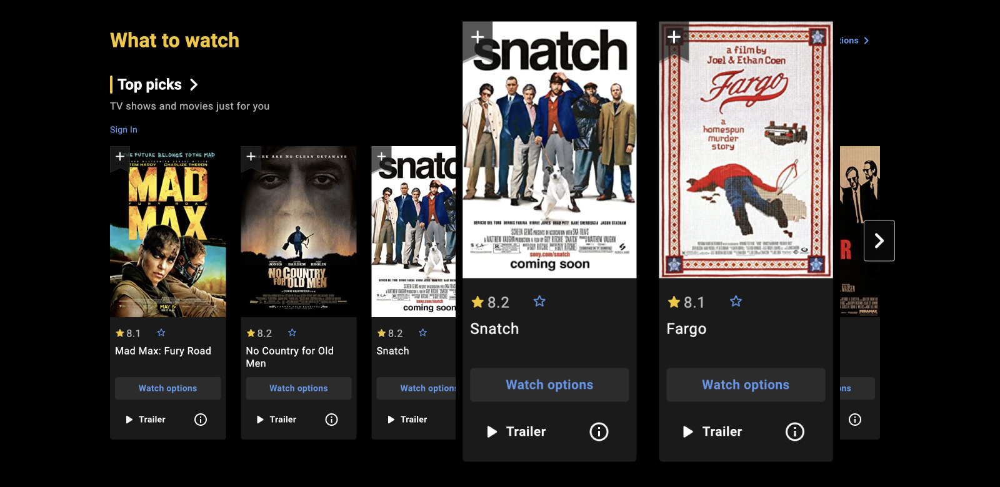

Movie cards on the main IMDB page  

IMDB主页面上的电影卡

Grasping your product’s value is crucial when working on the benefit ratio. When I collaborated with Localie, we began with a workshop to create a “[Hero Face](https://www.figma.com/community/file/987271370750126125)” and formulated a job story based on that:  

掌握你的产品的价值是在利益比率方面工作的关键。当我与Localie合作时，我们从一个创造 "英雄面孔 "的研讨会开始，并在此基础上制定了一个工作故事：

> When I travel to a completely unfamiliar country, I want to have someone who can help me with any questions, so I feel safer, less lonely, learn more about the place, and create more memorable experiences.  
> 
> 当我到一个完全陌生的国家旅行时，我希望有人能帮助我解决任何问题，这样我就会感到更安全，不那么孤独，了解更多的地方，并创造更多难忘的经历。

A job story serves as an excellent template to encapsulate your product’s value. It’s worth noting that 34% of startups fail due to lack of demand for their product.  

一个工作故事可以作为一个很好的模板来概括你的产品的价值。值得注意的是，34%的初创企业失败的原因是对其产品缺乏需求。  

So, if you struggle to create an honest job story, it might be time to reconsider working on the interface. That’s why the benefit ratio tops the quality checklist.  

因此，如果你努力创造一个诚实的工作故事，可能是时候重新考虑在界面上工作了。这就是为什么效益比在质量检查表上居于首位。

Now, let’s move on to the next quality and dive into some practical tips!  

现在，让我们进入下一个质量，并深入研究一些实用的技巧!

## Related Reading:

-   [Hick’s Law 希克定律](https://lawsofux.com/hicks-law/)
-   [Startup Failure Rate 启动失败率](https://www.failory.com/blog/startup-failure-rate)

## 02\. Low Logic Ratio 02.低逻辑比率

_—How about we keep things breezy and reduce the logic ratio? It’ll help our users stay focused and engaged!  

\-我们保持轻松的状态，减少逻辑比例如何？这将有助于我们的用户保持专注和参与!_

The “logic ratio” refers to the balance between essential and non-essential actions on a screen.  

逻辑比率 "指的是屏幕上必要和非必要的动作之间的平衡。  

Prioritizing crucial actions that contribute to the core value of a product is vital.  

对有助于产品核心价值的关键行动进行优先排序是至关重要的。

For example, many users favor Apple interfaces for their low logic ratio, while they may perceive Windows interfaces as more complex.  

例如，许多用户喜欢苹果的界面，因为其逻辑比率低，而他们可能认为Windows的界面更复杂。  

To illustrate, MacOS Monterey’s Finder header features 14 controls, whereas Windows 11’s contains 26.  

举例来说，MacOS Monterey的Finder头有14个控件，而Windows 11的Finder头则包含26个。

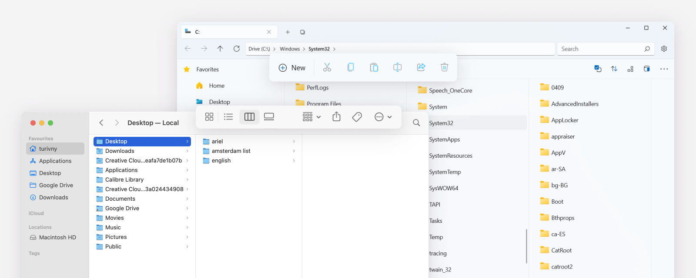

“Logic ratio” comparison of the MacOS Monterey and Windows 11  

MacOS Monterey和Windows 11的 "逻辑比率 "比较

Despite their simplicity, MacOS interfaces are not functionally inferior to Windows.  

尽管MacOS的界面很简单，但在功能上并不逊于Windows。  

Apple designers employ the “progressive disclosure” principle, showcasing only primary actions and concealing secondary ones.  

苹果公司的设计师采用了 "渐进式披露 "原则，只展示主要行动，隐藏次要行动。  

Aiming for a set of three or four actions can help reduce “interface resistance”.  

以一套三或四个行动为目标，可以帮助减少 "界面阻力"。

Take a look at the button layout in YouTube Music below:  

看看下面YouTube音乐中的按钮布局：

-   Shuffle and Radio take center stage, as they play music and deliver the main value of the product.  
    
    Shuffle和Radio占据中心位置，因为它们播放音乐并提供产品的主要价值。
-   Subscribe is a secondary function but can enhance the listening experience.  
    
    订阅是一个次要的功能，但可以增强听觉体验。
-   Share is discreetly tucked away under the three-dot button.  
    
    分享是谨慎地藏在三点式按钮下面。

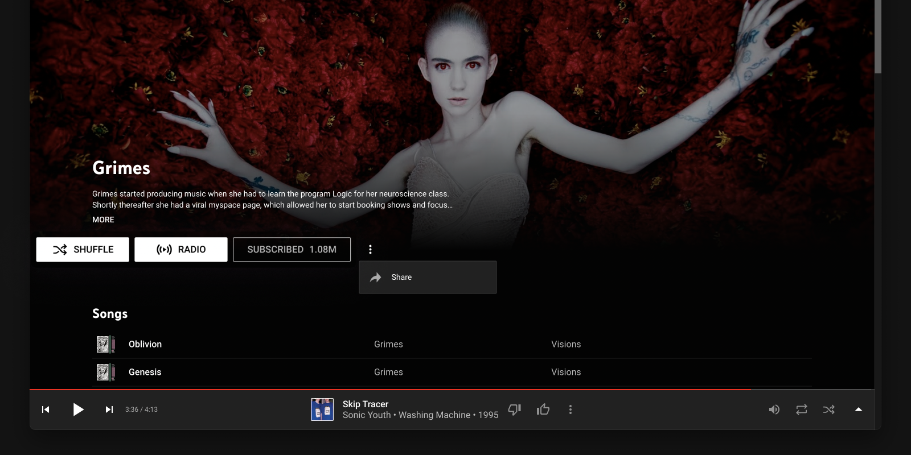

Artist’s home screen on Youtube Music with low “logic ratio”  

艺术家在Youtube音乐上的主屏幕，"逻辑率 "很低

It’s intriguing to see how groups of three elements frequently appear in everyday interfaces.  

有趣的是，三个元素的组合经常出现在日常界面中。  

For instance, each email in Gmail’s list displays only three actions and three informational objects.  

例如，在Gmail的列表中，每封电子邮件只显示三个行动和三个信息对象。

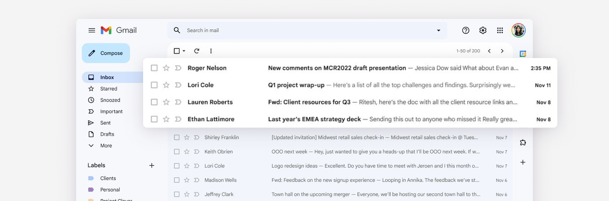

High “benefit ratio” and low “logic ratio” in GMail email list  

GMail电子邮件列表中的 "效益比 "高，"逻辑比 "低

Now, let’s examine how the “logic ratio” and “benefit ratio” operate in real-world scenarios.  

现在，让我们研究一下 "逻辑比率 "和 "效益比率 "在现实世界中是如何运作的。  

I’ll redesign Localie’s main page in a prototype to emphasize its essential elements, and then progressively refine it.  

我将在原型中重新设计Localie的主页面，以强调其基本要素，然后逐步完善它。

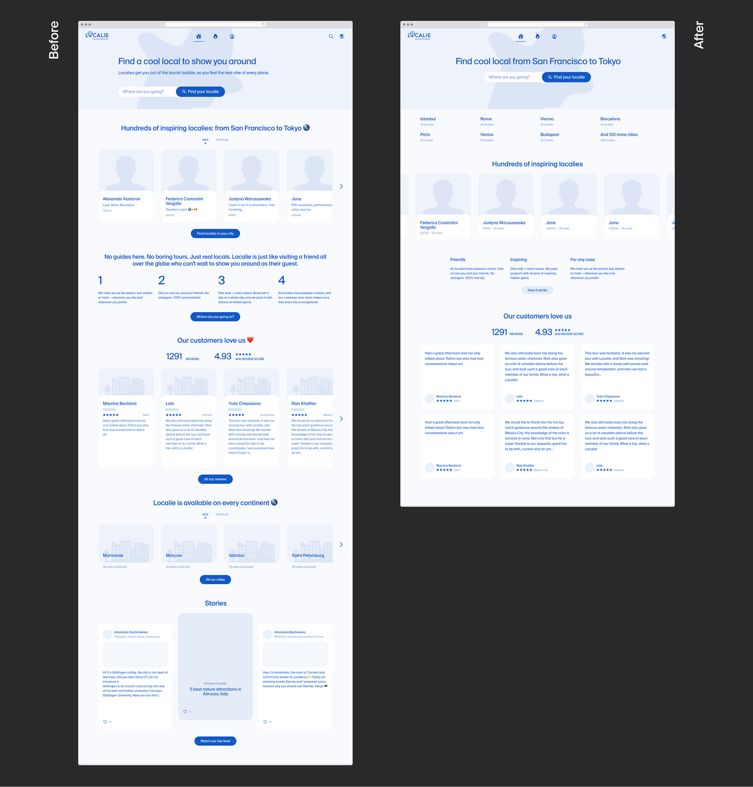

## Benefit Ratio Improvements: 效益比的提高：

1.  Increased the number of cities, the list is raised above;  
    
    增加了城市的数量，名单在上面提出；
2.  Reduced the amount of text in the main screen and description block;  
    
    减少了主屏幕和描述块中的文字量；
3.  Reduced amount of information in the feedback and people cards;  
    
    减少了反馈和人情卡中的信息量；
4.  Stories block removed; 拆除的故事块；
5.  Redesigned the how it works block.  
    
    重新设计了 "如何工作 "部分。

## Logic Ratio Improvements: 逻辑比率的改进：

1.  Duplicate search in the main screen is removed;  
    
    主屏幕中的重复搜索被删除；
2.  Repetitive Search buttons removed;  
    
    删除了重复的搜索按钮；
3.  Sliders and tabs removed. 滑块和标签被移除。

Next we will move on to the next three qualities and continue to work on the interface.  

接下来我们将进入下一个三个品质，继续在界面上下功夫。

## Related Reading:

-   [Progressive Disclosure 渐进式披露](https://www.nngroup.com/articles/progressive-disclosure/)
-   [Designing for iOS 为iOS设计](https://developer.apple.com/design/human-interface-guidelines/platforms/designing-for-ios)

## 03\. Familiarity

_—A bit too out there, huh? Let’s make it a bit more familiar so people can relate and feel at ease!  

\-有点太离谱了，是吧？让我们把它变得更熟悉一些，这样人们就能感同身受，感到安心了_

People often resist change and may feel uneasy about the unfamiliar. Adapting to something new demands effort.  

人们经常抵制变化，并可能对不熟悉的事物感到不安。适应新事物需要努力。  

The more familiar an interface is, the more intuitive and “invisible” it becomes.  

一个界面越是熟悉，它就越是直观和 "隐形"。

Imagine a well-organized kitchen: everything is easy to find and in its proper place. You don’t need to waste time searching for items, as everything is arranged.  

想象一下，一个组织良好的厨房：所有东西都很容易找到，而且都在其适当的位置。你不需要浪费时间去寻找物品，因为一切都安排好了。  

And now remember how long it take to find something in a new kitchen. That’s why a familiar, easy-to-use interface is so crucial.  

现在还记得在一个新的厨房里找东西需要多长时间。这就是为什么一个熟悉的、易于使用的界面是如此关键。

> “Users spend most of their time on other sites. This means that users prefer your site to work the same way as all the other sites they already know.” Jacob’s Law  
> 
> "用户把大部分时间花在其他网站上。这意味着用户更希望你的网站与他们已经知道的所有其他网站的工作方式相同"。雅各布定律

Consider the now-defunct Hipmunk flight search. It aspired to be “convenient” and “unique” but shut down in 2020. While other factors likely contributed, its departure from familiarity may have played a role in its demise.  

考虑一下现已倒闭的Hipmunk航班搜索。它渴望做到 "方便 "和 "独特"，但在2020年关闭了。虽然其他因素可能起到了作用，但它对熟悉的事物的偏离可能在其消亡中起到了作用。

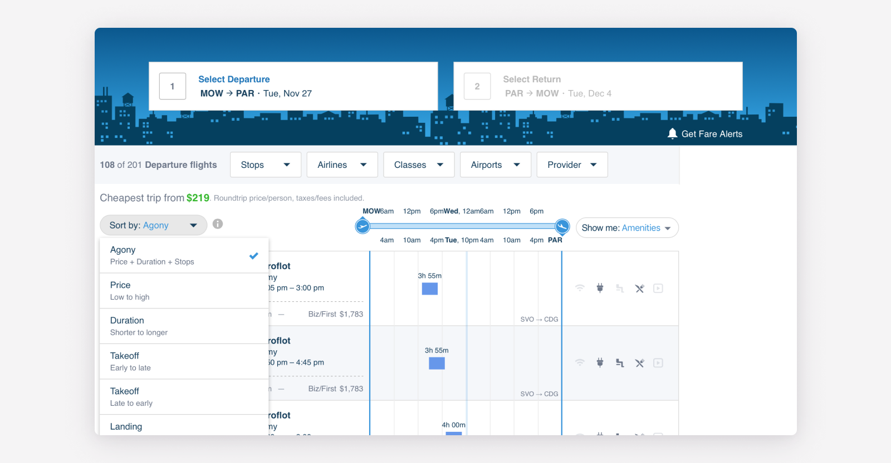

The unique flight search interface of Hipmunk  

Hipmunk独特的航班搜索界面

Familiarity in interface design can be categorized into two types: external and internal.  

界面设计中的熟悉度可以分为两种类型：外部和内部。

## External Familiarity Encompasses:  

外部熟悉度包括：：

-   Common industry interaction patterns;  
    
    常见的行业互动模式；
-   Global interaction patterns; 全球互动模式；
-   Familiar terminology; 熟悉的术语；
-   Established mental models. 既定的心智模式。

For example, the tabs on the Dutch government website appears as a series of links, deviating from the familiar design. This divergence can confuse and disorient users.  

例如，荷兰政府网站上的标签以一系列链接的形式出现，偏离了熟悉的设计。这种偏离会使用户感到困惑和迷失方向。

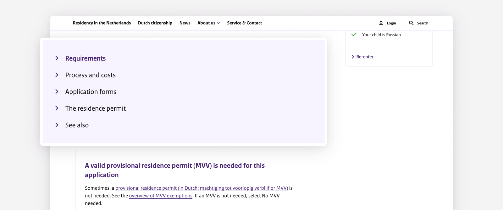

The unfamiliar look of the tabs on the Dutch government website  

荷兰政府网站上陌生的标签外观

## Internal Familiarity 内部熟悉度

Internal familiarity, or consistency, focuses on maintaining uniform interaction patterns, controls, terminology, and so on within a single product.  

内部熟悉性，或者说一致性，主要是指在一个产品中保持统一的交互模式、控制、术语等。  

Design systems are excellent tools for achieving consistency, which can help increase conversion rates.  

设计系统是实现一致性的优秀工具，可以帮助提高转换率。

Experiment with familiarity if you’re an experienced designer.  

如果你是一个有经验的设计师，可以在熟悉的情况下进行实验。  

Introducing a new design pattern can be challenging, but if it simplifies a task, users may find it difficult to switch back to a less efficient product.  

引入一个新的设计模式可能具有挑战性，但如果它简化了一项任务，用户可能会发现很难再转回一个效率较低的产品。

Let’s go over two more qualities and get back to practice.  

让我们再看一下两个品质，然后回到实践中去。

## Related Reading:

-   [Thinking, Fast and Slow  
    
    思考，快与慢](https://a.co/d/idOejne)
-   [Maintain Consistency and Adhere to Standards  
    
    保持一致，坚持标准](https://www.nngroup.com/articles/consistency-and-standards/)

## 04\. Transparency

_—Hey, what if we make that icon more transparent? Adding a label should clear things up!  

\-嘿，如果我们让这个图标更透明呢？添加一个标签，应该可以把事情弄清楚!_

A transparent interface ensures that nothing is hidden from the user, providing maximum responsiveness.  

透明的界面确保没有任何东西可以瞒过用户，提供最大的响应能力。  

It’s akin to a conversation between close friends: each friend communicates honestly and clearly, enabling the other to easily comprehend the message and its intention.  

这类似于亲密朋友之间的对话：每个朋友都诚实而清晰地交流，使对方能够轻松理解信息及其意图。

To assess an interface’s transparency, view it as if encountering it for the first time.  

要评估一个界面的透明度，要像第一次遇到它那样来看待它。  

If every aspect is comprehensible — from the interface states to the meanings of icons and terms — then it has achieved transparency.  

如果每一个方面都是可理解的--从界面状态到图标和术语的含义--那么它就实现了透明。

Consider the following poor example, where the Ecovacs robot vacuum interface conceals functions behind ambiguous icons:  

考虑一下下面这个可怜的例子，Ecovacs机器人吸尘器的界面将功能隐藏在模糊的图标后面：

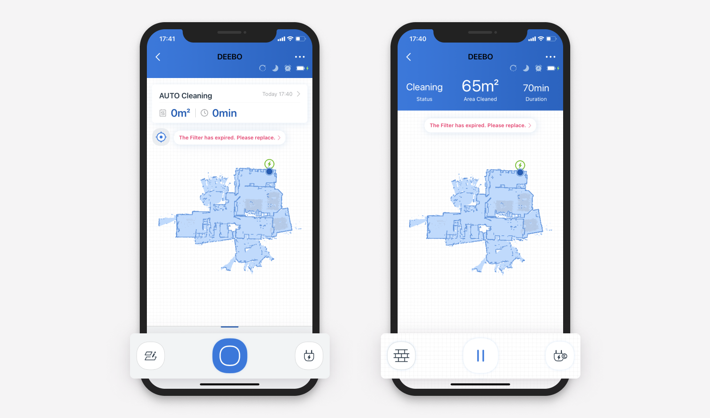

iOS app interface of the Ecovacs robot vacuum cleaner  

Ecovacs机器人吸尘器的iOS应用界面

Transparency is particularly crucial when a system encounters errors.  

当一个系统遇到错误时，透明度尤其关键。  

Avoid using obscure jargon like “Error 550” — instead, explain the issue in plain language and offer guidance on the next steps.  

避免使用 "Error 550 "等晦涩难懂的行话--相反，用平实的语言解释问题，并提供下一步的指导。

Additionally, the interface should clearly convey what’s happening on the other side of the screen in response to user actions.  

此外，界面应该清楚地传达出屏幕另一边正在发生的对用户行为的反应。  

This can be achieved through methods such as using animations to explain screen changes, responding to hover actions, or displaying loaders during loading processes.  

这可以通过一些方法来实现，例如使用动画来解释屏幕的变化，对悬停动作做出反应，或者在加载过程中显示加载器。

> Failing to provide feedback within 400 milliseconds surpasses the Doherty threshold, potentially resulting in user churn.  
> 
> 如果不能在400毫秒内提供反馈，就会超过Doherty阈值，可能会导致用户流失。

Next, we will delve into the concept of “farsightedness” and examine how it can enhance the experience.  

接下来，我们将深入探讨 "远见 "的概念，并研究它如何能够提高经验。

## Related Reading:

-   [Doherty Threshold](https://lawsofux.com/doherty-threshold/)
-   [Visibility of System Status  
    
    系统状态的可见性](https://www.nngroup.com/articles/visibility-system-status/)

## 05\. Farsightedness 05.远视

_—Ever accidentally deleted something and wished for a comeback? That’s where farsightedness saves the day.  

\-是否曾经不小心删除了一些东西，并希望能重新恢复？这就是有远见的人拯救的地方。_

Farsightedness, at its core, involves thinking ahead and anticipating user needs or actions.  

远见，其核心是指提前思考和预测用户需求或行动。  

A foresightful interface saves users time and effort by proactively offering helpful suggestions or options.  

一个有预见性的界面通过主动提供有用的建议或选项来节省用户的时间和精力。

Imagine you’re on a road, encountering a series of road signs that inform you about upcoming exits, rest areas, gas stations, and restaurants.  

想象一下，你在路上，遇到了一系列的路标，告诉你即将到来的出口、休息区、加油站和餐馆。  

Similarly, a foresightful interface guides you towards your goal and makes you feel safer.  

同样，一个有预见性的界面引导你走向你的目标，并使你感到更安全。

A prime example of a foresightful interface is the search form for booking flights.  

有远见的界面的一个主要例子是预订航班的搜索表格。  

It guides you through the process, nudging you toward the next step, providing suggestions, and correcting errors.  

它在整个过程中引导你，鼓励你走向下一步，提供建议，并纠正错误。

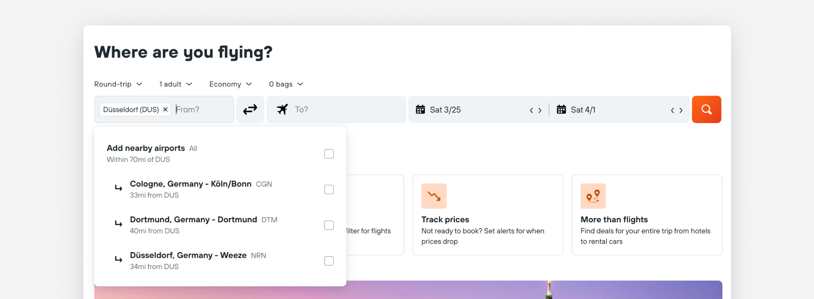

Kayak’s search form exemplifies exceptional “foresight”  

Kayak的搜索表格体现了非凡的 "预见性"

A farsightedness in an interface not only streamlines the path to the main value but also addresses secondary scenarios.  

界面上的远见不仅简化了通向主要价值的路径，而且还解决了次要场景的问题。  

Observe the numerous additional features that Airbnb’s designers thoughtfully incorporated into the booking page:  

观察一下Airbnb的设计师们在预订页面上周到地融入的众多附加功能：

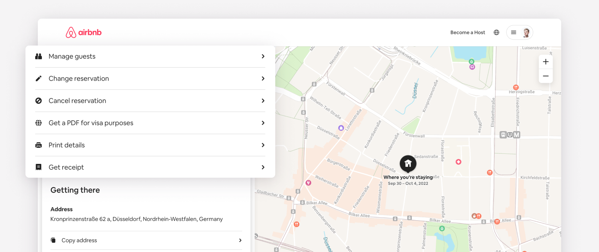

Foresightful Airbnb interface 有先见之明的Airbnb界面

Moreover, it’s essential to avoid straining users’ memory. Displaying search histories and highlighting visited links can help.  

此外，必须避免使用户的记忆变得紧张。显示搜索历史记录和突出显示访问过的链接可以帮助。  

Finally, designers should protect users from making mistakes, such as inadvertently deleting an item from their cart.  

最后，设计者应该保护用户不犯错误，比如不经意地从他们的购物车中删除一个项目。

Now that we’ve explored the qualities of familiarity, transparency, and farsightedness, let’s see how they come together in practice.  

现在我们已经探讨了熟悉性、透明度和远见的品质，让我们看看它们在实践中是如何结合起来的。

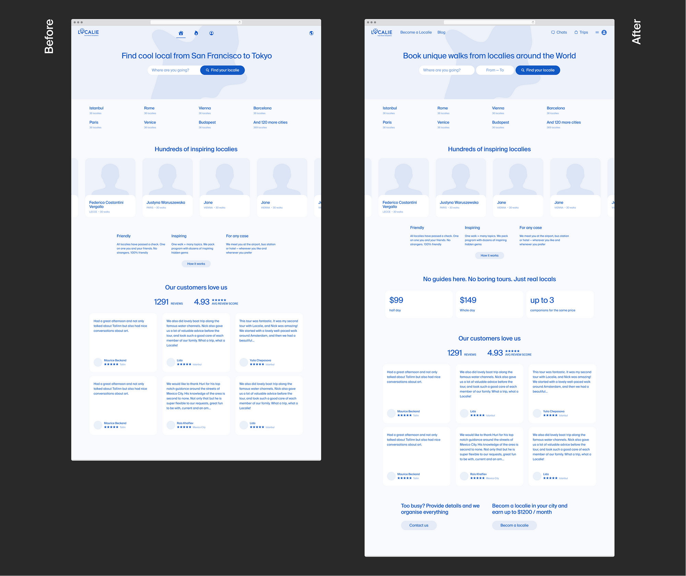

## Familiarity Improvements: 熟悉程度的提高：

1.  Header controls are organised according to industry standards;  
    
    页眉控制是根据行业标准组织的；
2.  Key sections are highlighted in the header.  
    
    关键部分在标题中得到强调。

## **Transparency Improvements: 透明度的提高：**

1.  Labels have been added to the icons in the header;  
    
    标签已被添加到页眉的图标中；
2.  The main heading has been changed to a more understandable one.  
    
    主标题已改为更容易理解的标题。

## Foresight Improvements: 预见性的改进：

1.  Date selection has been added to the search form;  
    
    日期选择已被添加到搜索表格中；
2.  Price information has been added;  
    
    价格信息已被添加；
3.  Links to secondary cases have been added at the bottom of the page.  
    
    在页面底部增加了二级案例的链接。

Only two more qualities to go! Let’s move on.  

只剩下两个品质了！我们继续前进！让我们继续前进。

## Related Reading:

-   [Memory Recognition and Recall  
    
    记忆识别和回忆](https://www.nngroup.com/articles/recognition-and-recall/)
-   [Preventing User Errors 防止用户出错](https://www.nngroup.com/articles/slips/)

## 06\. Legibility

_—Hey, the font’s a bit tough to read, right? How about we boost that legibility with some contrast and a larger size?  

\-嘿，这个字体有点难看，对吗？我们用一些对比度和更大的尺寸来提高其可读性如何？_

Attaining clarity in visual elements revolves around “legibility”.  

视觉元素的清晰度是围绕着 "可读性 "来实现的。  

This factor depends on the contrast with the background and the contrast and position of objects in relation to each other. Let’s delve deeper incrementally.  

这个因素取决于与背景的对比以及物体之间的对比和位置。让我们逐步深入研究一下。

## Background Contrast 背景对比度

As we cannot anticipate where, how, or with what eyesight users will engage with our product, it’s essential to optimise the contrast of the interface graphics.  

由于我们无法预测用户将在何处、如何或以何种视力接触我们的产品，因此必须优化界面图形的对比度。

Consider Uber’s interface, for example.  

以Uber的界面为例，考虑一下。  

Although the typography and controls may seem somewhat coarse, they fulfill a purpose: imagine trying to request a taxi on a bright day with a smeared screen.  

尽管排版和控制可能看起来有些粗糙，但它们实现了一个目的：想象一下，在一个明亮的日子里，试图在一个污浊的屏幕上请求一辆出租车。

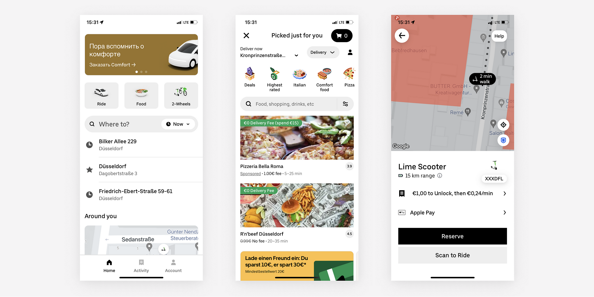

Contrasting Uber UI graphics 对比鲜明的Uber用户界面图形

## Object Contrast and Position 物体对比度和位置

Users typically scan interfaces for vital information instead of reading them like books.  

Consequently, high-priority objects should be more contrasting and eye-catching compared to other content.  

用户通常是通过扫描界面来获取重要的信息，而不是像书本一样去阅读它们。因此，与其他内容相比，高优先级的对象应该有更强的对比性和醒目性。

Take Amazon’s product page, for instance.  

以亚马逊的产品页面为例。  

It has numerous layers of information with weak contrast, resulting in a cluttered appearance and making it difficult to skim through quickly:  

它有许多层信息，对比度很弱，导致外观杂乱无章，难以快速浏览：

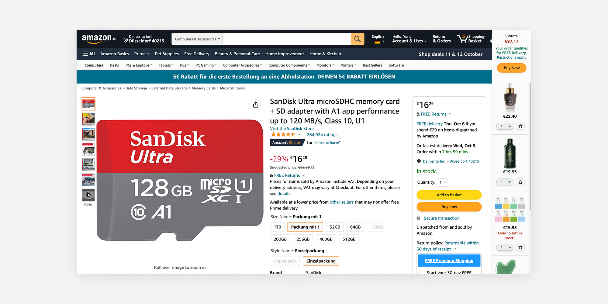

Visually cluttered Amazon product page  

视觉上杂乱无章的亚马逊产品页面

Aligning objects relative to each other also affects legibility. Bear these three fundamental principles in mind:  

对象之间的相对排列也会影响到可读性。牢记这三个基本原则：

1.  Proximity Rule — objects positioned closer together are perceived as more closely related in meaning.  
    
    靠近规则--位置较近的物体被认为在意义上关系更密切。
2.  Continuity Rule — objects on a single visual line are perceived as more closely related in meaning.  
    
    连续性规则--在一条视觉线上的物体被认为在意义上关系更密切。
3.  Hierarchy Rule — objects of greater importance should be positioned above or appear more prominent than secondary objects.  
    
    层次规则--更重要的对象应被置于次要对象之上或显得更突出。

In short, the arrangement of objects should correspond with the semantic structure of the information.  

简而言之，对象的安排应与信息的语义结构相对应。

Yay, we’re almost done! Let’s proceed to the final quality — comfortability.  

耶，我们几乎完成了!让我们继续进行最后的质量--舒适性。

## Related Reading:

-   [Law of Proximity 近似法则](https://lawsofux.com/law-of-proximity/)
-   [Law of Uniform Connectedness  
    
    统一连接法](https://lawsofux.com/law-of-uniform-connectedness/)

## 07\. Comfortability 07.舒适性

_— How about we amp up the button size for some extra comfort?  

\- 我们把纽扣的尺寸放大一些，以获得额外的舒适感如何？_

“Comfortability” focuses on creating interfaces that are physically easy and comfortable to use. Here’s how you can enhance this aspect of your design:  

"舒适性 "的重点是创建物理上容易使用和舒适的界面。下面是你如何加强这方面的设计：

## Applying Fitts’ Law 应用菲茨法则

Fitts’ Law suggests that the smaller and farther away an element is, the more challenging it is to click on it.  

菲茨定律表明，一个元素越小、越远，点击它就越有挑战性。  

Therefore, when designing interfaces for desktop or mobile devices, place important buttons closer where fingers naturally rest, and make them larger for easier interaction.  

因此，在为桌面或移动设备设计界面时，要把重要的按钮放在靠近手指自然停留的地方，并把它们变大，以方便互动。

## Optimising for Focus 优化聚焦

Furthermore, ensure that the actions you want users to take are easy to focus on and comfortably located:  

此外，确保你希望用户采取的行动容易被关注，并且位置舒适：

-   For example, position the primary action in the most prominent spot on the home page;  
    
    例如，将主要行动定位在主页上最突出的位置；
-   Or place the button to access all list items next to the slider buttons, as demonstrated in the Youtube Music example below.  
    
    或者把访问所有列表项目的按钮放在滑块按钮旁边，就像下面Youtube音乐的例子所演示的那样。

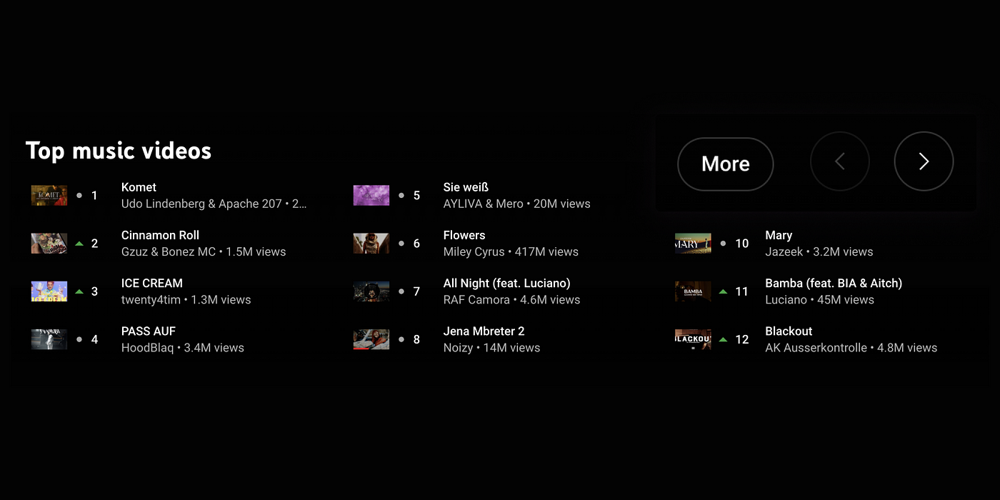

Youtube Music “Top music videos” slider  

Youtube音乐 "顶级音乐视频 "滑块

The “More” button is foresightedly and comfortably positioned in focus if the user has not found satisfactory artists by clicking through the slider.  

如果用户通过点击滑块没有找到满意的艺术家，"更多 "按钮就会被有预见性地、舒适地定位在焦点上。

## Inclusivity for Users with Disabilities  

对残疾用户的包容性

Don’t overlook the importance of enhancing comfortability for users with disabilities:  

不要忽视提高残疾用户的舒适性的重要性：

-   Ensure that all interface elements can be accessed using only the keyboard;  
    
    确保所有的界面元素都可以只用键盘访问；
-   Provide a clear visual indication of focus on the current element to assist those with visual impairments;  
    
    在当前元素上提供明确的视觉指示，以帮助那些有视觉障碍的人的焦点；
-   Offer alternative text descriptions for all non-text elements, such as images or videos.  
    
    为所有非文本元素，如图片或视频，提供替代性的文本描述。

The UK government portal serves as an excellent example of an ergonomic interface.  

英国政府的门户网站是人体工程学界面的一个优秀范例。

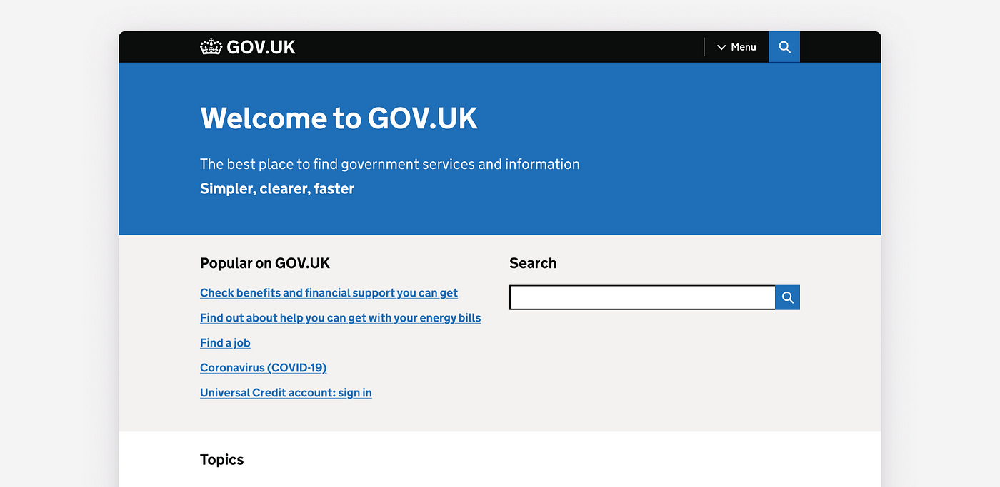

The UK government portal 英国政府门户网站

Congratulations! You’ve now covered all the essential aspects of reducing interface resistance. Take a moment to review the latest improvements and compare the before and after.  

祝贺你！你现在已经涵盖了降低接口电阻的所有重要方面！你现在已经涵盖了减少界面阻力的所有基本方面。花点时间回顾一下最新的改进，并比较一下改进前和改进后的情况。

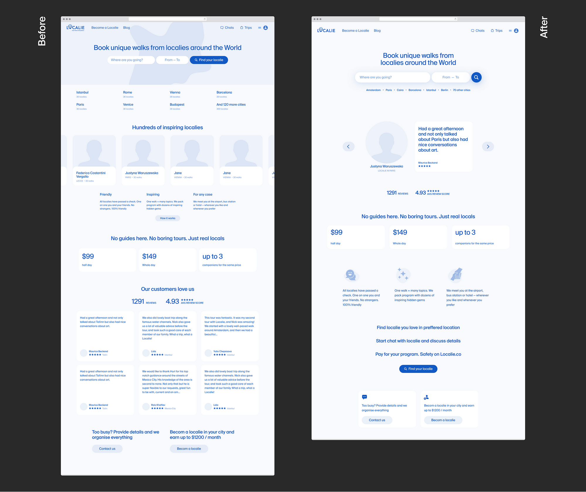

## Legibility Improvements: 提高可读性：

-   Removed small text in the logo;  
    
    删除了标志中的小文字；
-   Removed background image behind the form;  
    
    删除了表格后面的背景图片；
-   Added graphics to the benefits section;  
    
    在利益部分增加了图形；
-   Expanded the section about how the service works.  
    
    扩大了关于服务如何运作的部分。

## Comfortability Improvements: 舒适性的提高：

-   Enlarged the search form; 扩大了搜索表格；
-   Moved cities closer to the search form;  
    
    将城市移至更靠近搜索表格的位置；
-   Combined Locales and review section;  
    
    合并地域和审查部分；
-   Added a search button after the section about how the service works.  
    
    在关于服务如何运作的章节后增加了一个搜索按钮。

## Related Reading:

-   [Fitt’s Law 菲特法则](https://lawsofux.com/fittss-law/)
-   [Dos and don’ts on designing for accessibility  
    
    无障碍设计的应做和不应做的事](https://accessibility.blog.gov.uk/2016/09/02/dos-and-donts-on-designing-for-accessibility/)

Complete before and after: 完成之前和之后：

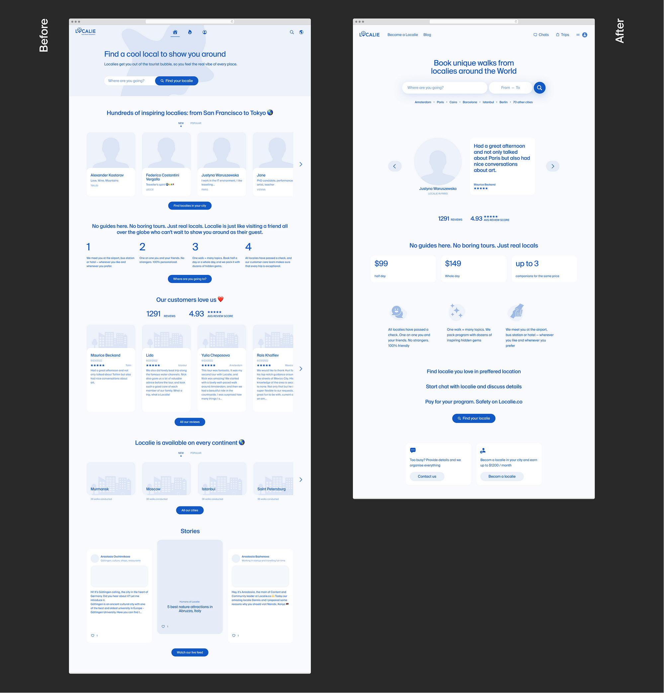

Interface elaborated by the “7 qualities of conversion interface”  

由 "转换界面的7种品质 "阐述的界面

## Applying the 7 Qualities in Practice  

在实践中应用7种品质

As a designer, I frequently use the “7 Qualities” as a checklist throughout my design process, consistently identifying areas for improvement.  

作为一名设计师，我在整个设计过程中经常使用 "七大特质 "作为检查表，不断发现需要改进的地方。  

For example, I utilize Miro tables to pinpoint and outline any errors related to each quality in detail.  

例如，我利用米罗表来精确指出并详细列出与每个质量有关的任何错误。  

This comprehensive analysis significantly reduces the need for expensive usability tests, delivering outstanding outcomes in a short time.  

这种全面的分析大大减少了对昂贵的可用性测试的需求，在短时间内提供出色的结果。

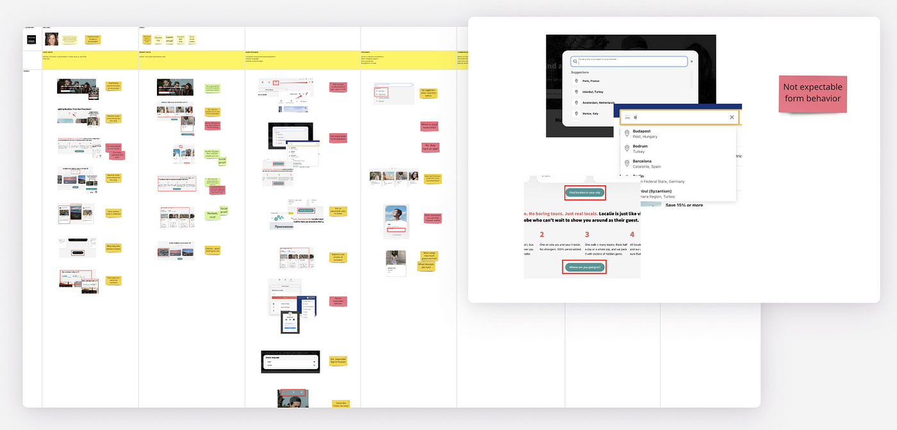

Using Miro to review the interface by the “7 Qualities”  

使用Miro按 "7种品质 "审查界面

The “7 Qualities” can also benefit product managers and art directors by enabling them to provide more constructive feedback on a designer’s work.  

7种品质 "也可以使产品经理和艺术总监受益，使他们能够对设计师的工作提供更具建设性的反馈。  

Furthermore, programmers can develop more user-friendly interfaces even without a designer’s guidance.  

此外，即使没有设计师的指导，程序员也能开发出更多的用户友好界面。

I hope that the “7 Qualities” will contribute to interfaces requiring less time and energy from users, allowing for more real-life experiences.  

我希望这 "7大特质 "能有助于开发出需要用户花费更少时间和精力的界面，从而获得更多真实的体验。  

That’s the product value of this article, while the article itself serves as the interface for that.  

这就是这篇文章的产品价值，而文章本身则是这个的接口。

Thank you for reading, and please don’t hesitate to give this article a clap if you found it helpful and easy to understand. Happy designing!  

谢谢你的阅读，如果你觉得这篇文章有帮助，容易理解，请不要犹豫，给这篇文章拍手。祝你设计愉快!

## Yura Turivny, 2023 Yura Turivny, 2023年

-   [turivny.com](http://turivny.com/)
-   [Hero Face Framework 英雄面孔框架](https://www.figma.com/community/file/987271370750126125)
