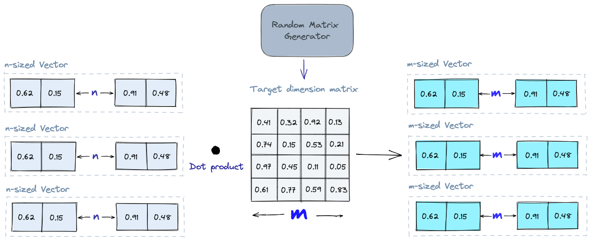
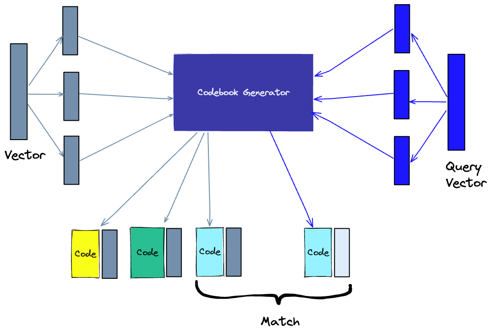
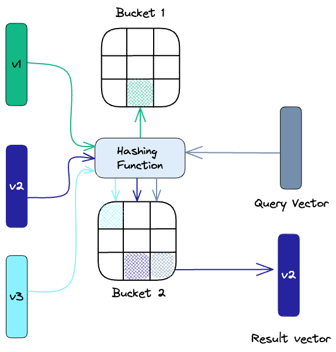
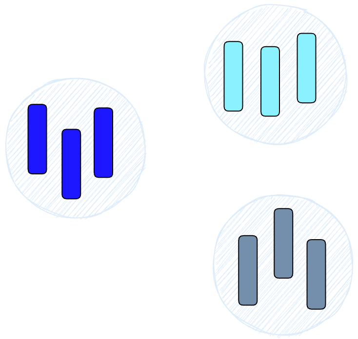
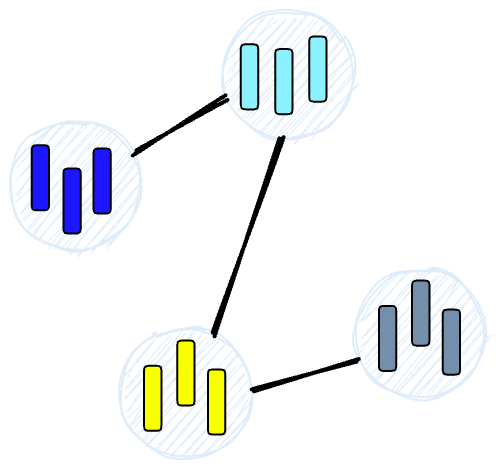
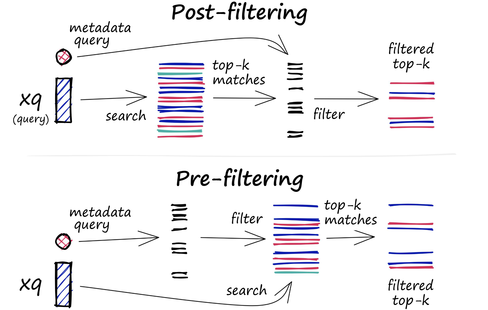
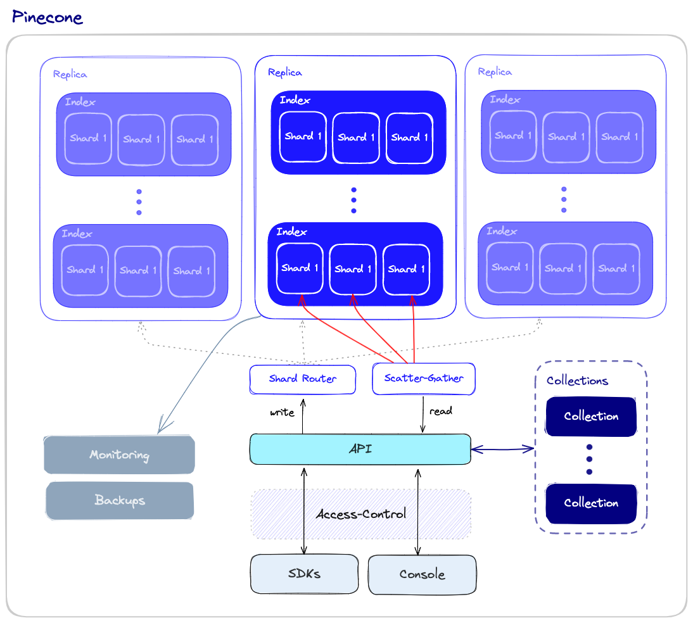

Summary: 本文介绍了矢量数据库的概念和作用，以及与独立矢量索引的区别。矢量数据库是专门为处理向量嵌入而设计的数据库，具有数据管理、元数据存储和过滤、可扩展性等优势，可以为人工智能应用程序提供更好的性能和灵活性。

文章要点:
1. 向量嵌入是一种数据表示，包含语义信息，对于人工智能应用程序的理解和长期记忆至关重要。
2. 矢量数据库是专门为处理向量嵌入而设计的数据库，具有数据管理、元数据存储和过滤、可扩展性等优势。
3. 矢量数据库可以为人工智能应用程序提供更好的性能和灵活性，如语义信息检索、长期记忆等。
4. 独立矢量索引如 FAISS 可以显着改进矢量嵌入的搜索和检索，但缺乏数据管理、元数据存储和过滤、可扩展性等功能。
5. 矢量数据库可以为大型语言模型、生成式 AI 和语义搜索等应用程序提供高效的数据处理能力。

Keywords: 矢量数据库、向量嵌入、人工智能、数据管理、可扩展性、元数据存储和过滤。

---

We’re in the midst of the AI revolution. It’s upending any industry it touches, promising great innovations - but it also introduces new challenges.  

我们正处于人工智能革命之中。它正在颠覆它所触及的任何行业，有望带来伟大的创新——但它也带来了新的挑战。  

Efficient data processing has become more crucial than ever for applications that involve large language models, generative AI, and semantic search.  

对于涉及大型语言模型、生成式 AI 和语义搜索的应用程序，高效的数据处理变得比以往任何时候都更加重要。

All of these new applications rely on **[vector embeddings](https://www.pinecone.io/learn/vector-embeddings-for-developers/)**, a type of data representation that carries within it semantic information that’s critical for the AI to gain understanding and maintain a long-term memory they can draw upon when executing complex tasks.  

所有这些新应用程序都依赖于向量嵌入，这是一种数据表示，其中包含语义信息，这对于 AI 获得理解和维持它们在执行复杂任务时可以利用的长期记忆至关重要。

**Embeddings** are generated by AI models (such as Large Language Models) and have a large number of attributes or features, making their representation challenging to manage.  

嵌入是由 AI 模型（例如大型语言模型）生成的，并且具有大量属性或特征，这使得它们的表示难以管理。  

In the context of AI and machine learning, these features represent different dimensions of the data that are essential for understanding patterns, relationships, and underlying structures.  

在人工智能和机器学习的背景下，这些特征代表了数据的不同维度，这些维度对于理解模式、关系和底层结构至关重要。

That is why we need a specialized database designed specifically for handling this type of data. **Vector databases** like [Pinecone](https://www.pinecone.io/) fulfill this requirement by offering optimized storage and querying capabilities for embeddings.  

这就是为什么我们需要专门为处理此类数据而设计的专用数据库。像 Pinecone 这样的矢量数据库通过为嵌入提供优化的存储和查询功能来满足这一要求。  

Vector databases have the capabilities of a traditional database that are absent in standalone vector indexes and the specialization of dealing with vector embeddings, which traditional scalar-based databases lack.  

矢量数据库具有传统数据库的功能，而独立矢量索引中没有这些功能，并且具有处理矢量嵌入的专业性，这是传统的基于标量的数据库所缺乏的。

The challenge of working with vector embeddings is that traditional scalar-based databases can’t keep up with the complexity and scale of such data, making it difficult to extract insights and perform real-time analysis.  

使用矢量嵌入的挑战在于，传统的基于标量的数据库无法跟上此类数据的复杂性和规模，因此难以提取见解和执行实时分析。  

That’s where vector databases come into play – they are intentionally designed to handle this type of data and offer the performance, scalability, and flexibility you need to make the most out of your data.  

这就是矢量数据库发挥作用的地方——它们专门设计用于处理此类数据，并提供充分利用数据所需的性能、可扩展性和灵活性。

With a vector database, we can add advanced features to our AIs, like semantic information retrieval, long-term memory, and more.  

借助矢量数据库，我们可以为 AI 添加高级功能，例如语义信息检索、长期记忆等。  

The diagram below gives us a better understanding of the role of vector databases in this type of application:  

下图让我们更好地理解矢量数据库在此类应用中的作用：

Let’s break this down: 让我们分解一下：

1.  First, we use the **embedding model** to create **vector embeddings** for the **content** we want to index.  
    
    首先，我们使用嵌入模型为我们要索引的内容创建向量嵌入。
2.  The **vector embedding** is inserted into the **vector database**, with some reference to the original **content** the embedding was created from.  
    
    矢量嵌入被插入到矢量数据库中，并参考了创建嵌入的原始内容。
3.  When the **application** issues a query, we use the same **embedding model** to create embeddings for the query, and use those embeddings to query the **database** for _similar_ vector embeddings. And as mentioned before, those similar embeddings are associated with the original **content** that was used to create them.  
    
    当应用程序发出查询时，我们使用相同的嵌入模型为查询创建嵌入，并使用这些嵌入在数据库中查询类似的向量嵌入。如前所述，那些相似的嵌入与用于创建它们的原始内容相关联。

## What’s the difference between a vector index and a vector database?  

矢量索引和矢量数据库有什么区别？

Standalone vector indices like [FAISS](https://www.pinecone.io/learn/faiss/) (Facebook AI Similarity Search) can significantly improve search and retrieval of vector embeddings, but they lack capabilities that exist in any database.  

像 FAISS（Facebook AI 相似性搜索）这样的独立矢量索引可以显着改进矢量嵌入的搜索和检索，但它们缺乏任何数据库中存在的功能。  

Vector databases, on the other hand, are purpose-built to _manage_ vector embeddings, providing several advantages over using standalone vector indices:  

另一方面，矢量数据库是专门为管理矢量嵌入而构建的，与使用独立矢量索引相比具有以下优势：

1.  **Data management:** Vector databases offer well-known and easy-to-use features for data storage, like inserting, deleting, and updating data.  
    
    数据管理：矢量数据库提供众所周知且易于使用的数据存储功能，例如插入、删除和更新数据。  
    
    This makes managing and maintaining vector data easier than using a standalone vector _index_ like FAISS, which requires additional work to integrate with a storage solution.  
    
    这使得矢量数据的管理和维护比使用像 FAISS 这样的独立矢量索引更容易，后者需要额外的工作才能与存储解决方案集成。
2.  **Metadata storage and filtering:** Vector databases can store metadata associated with each vector entry. Users can then query the database using additional metadata filters for finer-grained queries.  
    
    元数据存储和过滤：矢量数据库可以存储与每个矢量条目相关联的元数据。然后，用户可以使用额外的元数据过滤器来查询数据库，以进行更细粒度的查询。
3.  **Scalability:** Vector databases are designed to scale with growing data volumes and user demands, providing better support for distributed and parallel processing.  
    
    可扩展性：矢量数据库旨在随着数据量和用户需求的增长而扩展，为分布式和并行处理提供更好的支持。  
    
    Standalone vector indices may require custom solutions to achieve similar levels of scalability (such as deploying and managing them on Kubernetes clusters or other similar systems).  
    
    独立矢量索引可能需要自定义解决方案来实现类似级别的可扩展性（例如在 Kubernetes 集群或其他类似系统上部署和管理它们）。
4.  **Real-time updates:** Vector databases often support real-time data updates, allowing for dynamic changes to the data, whereas standalone vector indexes may require a full re-indexing process to incorporate new data, which can be time-consuming and computationally expensive.  
    
    实时更新：矢量数据库通常支持实时数据更新，允许对数据进行动态更改，而独立矢量索引可能需要完整的重新索引过程来合并新数据，这可能非常耗时且计算量大。
5.  **Backups and collections:** Vector databases handle the routine operation of backing up all the data stored in the database.  
    
    备份和收集：向量数据库处理备份数据库中存储的所有数据的例行操作。  
    
    Pinecone also allows users to selectively choose specific indexes that can be backed up in the form of “collections,” which store the data in that index for later use.  
    
    Pinecone 还允许用户有选择地选择特定的索引，这些索引可以以“集合”的形式进行备份，将数据存储在该索引中以备后用。
6.  **Ecosystem integration:** Vector databases can more easily integrate with other components of a data processing ecosystem, such as ETL pipelines (like Spark), analytics tools (like [Tableau](https://www.tableau.com/) and [Segment](https://segment.com/)), and visualization platforms (like [Grafana](https://grafana.com/)) – streamlining the data management workflow. It also enables easy integration with other AI related tools like [LangChain](https://python.langchain.com/en/latest/index.html), [LlamaIndex](https://gpt-index.readthedocs.io/) and [ChatGPT’s Plugins](https://openai.com/blog/chatgpt-plugins).  
    
    生态系统集成：矢量数据库可以更轻松地与数据处理生态系统的其他组件集成，例如 ETL 管道（如 Spark）、分析工具（如 Tableau 和 Segment）和可视化平台（如 Grafana）——简化数据管理工作流程。它还可以轻松集成其他 AI 相关工具，如 LangChain、LlamaIndex 和 ChatGPT 的插件。
7.  **Data security and access control:** Vector databases typically offer built-in data security features and access control mechanisms to protect sensitive information, which may not be available in standalone vector index solutions.  
    
    数据安全和访问控制：矢量数据库通常提供内置的数据安全功能和访问控制机制来保护敏感信息，这在独立的矢量索引解决方案中可能不可用。

In short, a vector database provides a superior solution for handling vector embeddings by addressing the limitations of standalone vector indices, such as scalability challenges, cumbersome integration processes, and the absence of real-time updates and built-in security measures, ensuring a more effective and streamlined data management experience.  

简而言之，矢量数据库通过解决独立矢量索引的局限性（例如可扩展性挑战、繁琐的集成过程以及缺乏实时更新和内置安全措施），为处理矢量嵌入提供了卓越的解决方案，确保了更多有效和简化的数据管理体验。

## How does a vector database work?  

矢量数据库如何工作？

We all know how traditional databases work (more or less)—they store strings, numbers, and other types of scalar data in rows and columns.  

我们都知道传统数据库的工作原理（或多或少）——它们将字符串、数字和其他类型的标量数据存储在行和列中。  

On the other hand, a vector database operates on vectors, so the way it’s optimized and queried is quite different.  

另一方面，矢量数据库对矢量进行操作，因此其优化和查询方式大不相同。

In traditional databases, we are usually querying for rows in the database where the value usually exactly matches our query.  

在传统数据库中，我们通常在数据库中查询值通常与我们的查询完全匹配的行。  

In vector databases, we apply a similarity metric to find a vector that is the **most similar** to our query.  

在矢量数据库中，我们应用相似性度量来找到与我们的查询最相似的矢量。

A vector database uses a combination of different algorithms that all participate in Approximate Nearest Neighbor (ANN) search.  

矢量数据库使用不同算法的组合，这些算法都参与近似最近邻 (ANN) 搜索。  

These algorithms optimize the search through hashing, quantization, or graph-based search.  

这些算法通过散列、量化或基于图形的搜索来优化搜索。

These algorithms are assembled into a pipeline that provides fast and accurate retrieval of the neighbors of a queried vector. Since the vector database provides **approximate** results, the main trade-offs we consider are between accuracy and speed. The more accurate the result, the slower the query will be.  

这些算法被组装成一个管道，可以快速准确地检索查询向量的邻居。由于矢量数据库提供了近似结果，我们考虑的主要权衡是在准确性和速度之间。结果越准确，查询速度就越慢。  

However, a good system can provide ultra-fast search with near-perfect accuracy.  

然而，一个好的系统可以提供具有近乎完美准确性的超快速搜索。

Here’s a common pipeline for a vector database:  

这是矢量数据库的常见管道：

1.  **Indexing**: The vector database indexes vectors using an algorithm such as PQ, LSH, or HNSW (more on these below).  
    
    索引：矢量数据库使用 PQ、LSH 或 HNSW 等算法对矢量进行索引（更多信息见下文）。  
    
    This step maps the vectors to a data structure that will enable faster searching.  
    
    此步骤将向量映射到数据结构，以加快搜索速度。
2.  **Querying**: The vector database compares the indexed query vector to the indexed vectors in the dataset to find the nearest neighbors (applying a similarity metric used by that index)  
    
    查询：向量数据库将索引查询向量与数据集中的索引向量进行比较，以找到最近的邻居（应用该索引使用的相似性度量）
3.  **Post Processing**: In some cases, the vector database retrieves the final nearest neighbors from the dataset and post-processes them to return the final results.  
    
    后处理：在某些情况下，矢量数据库从数据集中检索最终的最近邻，并对它们进行后处理以返回最终结果。  
    
    This step can include re-ranking the nearest neighbors using a different similarity measure.  
    
    此步骤可以包括使用不同的相似性度量重新排列最近的邻居。

In the following sections, we will discuss each of these algorithms in more detail and explain how they contribute to the overall performance of a vector database.  

在接下来的部分中，我们将更详细地讨论这些算法中的每一个，并解释它们如何影响矢量数据库的整体性能。

### Algorithms

Several algorithms can facilitate the creation of a vector index. Their common goal is to enable fast querying by creating a data structure that can be traversed quickly.  

有几种算法可以促进矢量索引的创建。他们的共同目标是通过创建可以快速遍历的数据结构来实现快速查询。  

They will commonly transform the representation of the original vector into a compressed form to optimize the query process.  

他们通常会将原始向量的表示形式转换为压缩形式以优化查询过程。

However, as a user of Pinecone, you don’t need to worry about the intricacies and selection of these various algorithms. Pinecone is designed to handle all the complexities and algorithmic decisions behind the scenes, ensuring you get the best performance and results without any hassle.  

不过，作为 Pinecone 的用户，您不必担心这些算法的复杂性和选择。 Pinecone 旨在处理幕后的所有复杂性和算法决策，确保您轻松获得最佳性能和结果。  

By leveraging Pinecone’s expertise, you can focus on what truly matters – extracting valuable insights and delivering powerful AI solutions.  

通过利用 Pinecone 的专业知识，您可以专注于真正重要的事情——提取有价值的见解并提供强大的 AI 解决方案。

The following sections will explore several algorithms and their unique approaches to handling vector embeddings.  

以下部分将探讨几种算法及其处理向量嵌入的独特方法。  

This knowledge will empower you to make informed decisions and appreciate the seamless performance Pinecone delivers as you unlock the full potential of your application.  

这些知识将使您能够做出明智的决定，并在您释放应用程序的全部潜力时欣赏 Pinecone 提供的无缝性能。

#### Random Projection

The basic idea behind random projection is to project the high-dimensional vectors to a lower-dimensional space using a **random projection matrix**. We create a matrix of random numbers. The size of the matrix is going to be the target low-dimension value we want.  

随机投影背后的基本思想是使用随机投影矩阵将高维向量投影到低维空间。我们创建一个随机数矩阵。矩阵的大小将是我们想要的目标低维值。  

We then calculate the dot product of the input vectors and the matrix, which results in a **projected matrix** that has fewer dimensions than our original vectors but still preserves their similarity.  

然后我们计算输入向量和矩阵的点积，得到一个投影矩阵，它的维数比我们的原始向量少，但仍然保持它们的相似性。

When we query, we use the same projection matrix to project the query vector onto the lower-dimensional space.  

当我们查询时，我们使用相同的投影矩阵将查询向量投影到低维空间上。  

Then, we compare the projected query vector to the projected vectors in the database to find the nearest neighbors.  

然后，我们将投影查询向量与数据库中的投影向量进行比较，以找到最近的邻居。  

Since the dimensionality of the data is reduced, the search process is significantly faster than searching the entire high-dimensional space.  

由于数据降维，搜索过程明显比搜索整个高维空间要快。

Just keep in mind that random projection is an approximate method, and the projection quality depends on the properties of the projection matrix.  

请记住，随机投影是一种近似方法，投影质量取决于投影矩阵的属性。  

In general, the more random the projection matrix is, the better the quality of the projection will be.  

一般来说，投影矩阵越随机，投影质量越好。  

But generating a truly random projection matrix can be computationally expensive, especially for large datasets. [Learn more about random projection.](https://www.pinecone.io/learn/locality-sensitive-hashing-random-projection/)  

但是生成真正随机的投影矩阵可能需要大量计算，尤其是对于大型数据集。了解有关随机投影的更多信息。

#### Product Quantization 产品量化

Another way to build an index is product quantization (PQ), which is a _lossy_ compression technique for high-dimensional vectors (like vector embeddings).  

另一种构建索引的方法是乘积量化 (PQ)，这是一种用于高维向量（如向量嵌入）的有损压缩技术。  

It takes the original vector, breaks it up into smaller chunks, simplifies the representation of each chunk by creating a representative “code” for each chunk, and then puts all the chunks back together - without losing information that is vital for similarity operations.  

它采用原始向量，将其分解成更小的块，通过为每个块创建一个具有代表性的“代码”来简化每个块的表示，然后将所有块放回一起 - 而不会丢失对相似性操作至关重要的信息。  

The process of PQ can be broken down into four steps: splitting, training, encoding, and querying.  

PQ的过程可以分解为四个步骤：分裂、训练、编码和查询。

1.  **Splitting** -The vectors are broken into segments.  
    
    分裂——向量被分成几段。
2.  **Training** - we build a “codebook” for each segment. Simply put - the algorithm generates a pool of potential “codes” that could be assigned to a vector.  
    
    训练——我们为每个片段建立一个“密码本”。简而言之 - 该算法生成一个可以分配给向量的潜在“代码”池。  
    
    In practice - this “codebook” is made up of the center points of clusters created by performing k-means clustering on each of the vector’s segments.  
    
    实际上——这个“密码本”是由通过对向量的每个片段执行 k 均值聚类而创建的聚类的中心点组成的。  
    
    We would have the same number of values in the segment codebook as the value we use for the k-means clustering.  
    
    我们将在段码本中拥有与用于 k-means 聚类的值相同数量的值。
3.  **Encoding** - The algorithm assigns a specific code to each segment. In practice, we find the nearest value in the codebook to each vector segment after the training is complete.  
    
    编码 - 该算法为每个段分配一个特定的代码。在实践中，我们在训练完成后找到码本中最接近每个向量段的值。  
    
    Our PQ code for the segment will be the identifier for the corresponding value in the codebook.  
    
    我们的段 PQ 代码将是代码本中相应值的标识符。  
    
    We could use as many PQ codes as we’d like, meaning we can pick multiple values from the codebook to represent each segment.  
    
    我们可以使用任意多的 PQ 代码，这意味着我们可以从代码本中选择多个值来表示每个片段。
4.  **Querying** - When we query, the algorithm breaks down the vectors into sub-vectors and quantizes them using the same codebook.  
    
    查询 - 当我们查询时，算法将向量分解为子向量并使用相同的码本对它们进行量化。  
    
    Then, it uses the indexed codes to find the nearest vectors to the query vector.  
    
    然后，它使用索引代码找到最接近查询向量的向量。

The number of representative vectors in the codebook is a trade-off between the accuracy of the representation and the computational cost of searching the codebook.  

码本中代表性向量的数量是表示精度与搜索码本的计算成本之间的权衡。  

The more representative vectors in the codebook, the more accurate the representation of the vectors in the subspace, but the higher the computational cost to search the codebook.  

码本中的代表性向量越多，向量在子空间中的表示就越准确，但搜索码本的计算成本也越高。  

By contrast, the fewer representative vectors in the codebook, the less accurate the representation, but the lower the computational cost. [Learn more about PQ](https://www.pinecone.io/learn/product-quantization/).  

相比之下，码本中的代表性向量越少，表示的准确性就越低，但计算成本越低。了解更多关于 PQ 的信息。

#### Locality-sensitive hashing 局部敏感散列

Locality-Sensitive Hashing (LSH) is a technique for indexing in the context of an approximate nearest-neighbor search.  

局部敏感散列 (LSH) 是一种在近似最近邻搜索的上下文中进行索引的技术。  

It is optimized for speed while still delivering an approximate, non-exhaustive result. LSH maps similar vectors into “buckets” using a set of hashing functions, as seen below:  

它针对速度进行了优化，同时仍提供近似的、非详尽的结果。 LSH 使用一组哈希函数将相似的向量映射到“桶”中，如下所示：

To find the nearest neighbors for a given query vector, we use the same hashing functions used to “bucket” similar vectors into hash tables.  

为了找到给定查询向量的最近邻居，我们使用与将相似向量“存储”到哈希表中相同的哈希函数。  

The query vector is hashed to a particular table and then compared with the other vectors in that same table to find the closest matches.  

查询向量被散列到一个特定的表，然后与同一个表中的其他向量进行比较以找到最接近的匹配项。  

This method is much faster than searching through the entire dataset because there are far fewer vectors in each hash table than in the whole space.  

这种方法比搜索整个数据集快得多，因为每个哈希表中的向量比整个空间中的向量少得多。

It’s important to remember that LSH is an approximate method, and the quality of the approximation depends on the properties of the hash functions.  

重要的是要记住 LSH 是一种近似方法，近似的质量取决于哈希函数的属性。  

In general, the more hash functions used, the better the approximation quality will be.  

通常，使用的散列函数越多，近似质量就越好。  

However, using a large number of hash functions can be computationally expensive and may not be feasible for large datasets. [Learn more about LSH](https://www.pinecone.io/learn/locality-sensitive-hashing/).  

然而，使用大量哈希函数的计算成本可能很高，并且对于大型数据集可能不可行。了解更多关于 LSH 的信息。

#### Hierarchical Navigable Small World (HSNW)  

分层导航小世界 (HSNW)

HSNW creates a hierarchical, tree-like structure where each node of the tree represents a set of vectors. The edges between the nodes represent the **similarity** between the vectors. The algorithm starts by creating a set of nodes, each with a small number of vectors.  

HSNW 创建了一个分层的树状结构，其中树的每个节点代表一组向量。节点之间的边表示向量之间的相似性。该算法首先创建一组节点，每个节点都有少量向量。  

This could be done randomly or by clustering the vectors with algorithms like k-means, where each cluster becomes a node.  

这可以随机完成，也可以通过使用 k-means 等算法对向量进行聚类来完成，其中每个聚类都成为一个节点。

The algorithm then examines the vectors of each node and draws an edge between that node and the nodes that have the most similar vectors to the one it has.  

该算法然后检查每个节点的向量，并在该节点和具有与其所具有的向量最相似的向量的节点之间绘制一条边。

When we query an HSNW index, it uses this graph to navigate through the tree, visiting the nodes that are most likely to contain the closest vectors to the query vector. [Learn more about HSNW](https://www.pinecone.io/learn/hnsw/).  

当我们查询 HSNW 索引时，它使用此图在树中导航，访问最有可能包含最接近查询向量的向量的节点。了解更多关于 HSNW 的信息。

### Similarity Measures 相似性措施

Building on the previously discussed algorithms, we need to understand the role of similarity measures in vector databases.  

基于前面讨论的算法，我们需要了解向量数据库中相似性度量的作用。  

These measures are the foundation of how a vector database compares and identifies the most relevant results for a given query.  

这些度量是矢量数据库如何比较和识别给定查询的最相关结果的基础。

Similarity measures are mathematical methods for determining how similar two vectors are in a vector space.  

相似性度量是确定向量空间中两个向量相似程度的数学方法。  

Similarity measures are used in vector databases to compare the vectors stored in the database and find the ones that are most similar to a given query vector.  

向量数据库中使用相似性度量来比较存储在数据库中的向量，并找到与给定查询向量最相似的向量。

Several similarity measures can be used, including:  

可以使用几种相似性度量，包括：

-   **Cosine similarity:** measures the cosine of the angle between two vectors in a vector space.  
    
    余弦相似度：度量向量空间中两个向量之间夹角的余弦值。  
    
    It ranges from -1 to 1, where 1 represents identical vectors, 0 represents orthogonal vectors, and -1 represents vectors that are diametrically opposed.  
    
    它的范围从-1到1，其中1代表相同的向量，0代表正交向量，-1代表完全相反的向量。
-   **Euclidean distance:** measures the straight-line distance between two vectors in a vector space.  
    
    欧氏距离：度量向量空间中两个向量之间的直线距离。  
    
    It ranges from 0 to infinity, where 0 represents identical vectors, and larger values represent increasingly dissimilar vectors.  
    
    它的范围从 0 到无穷大，其中 0 表示相同的向量，较大的值表示越来越不相似的向量。
-   **Dot product:** measures the product of the magnitudes of two vectors and the cosine of the angle between them.  
    
    点积：测量两个向量的大小与它们之间夹角的余弦值的乘积。  
    
    It ranges from -∞ to ∞, where a positive value represents vectors that point in the same direction, 0 represents orthogonal vectors, and a negative value represents vectors that point in opposite directions.  
    
    它的范围从-∞到∞，其中正值表示指向相同方向的向量，0表示正交向量，负值表示指向相反方向的向量。

The choice of similarity measure will have an effect on the results obtained from a vector database.  

相似性度量的选择将对从矢量数据库获得的结果产生影响。  

It is also important to note that each similarity measure has its own advantages and disadvantages, and it is important to choose the right one depending on the use case and requirements. [Learn more about similarity measures](https://www.pinecone.io/learn/vector-similarity/).  

同样重要的是要注意，每种相似性度量都有其自身的优点和缺点，根据用例和要求选择正确的度量很重要。了解有关相似性度量的更多信息。

### Filtering

Every vector stored in the database also includes metadata.  

存储在数据库中的每个矢量还包括元数据。  

In addition to the ability to query for similar vectors, vector databases can also filter the results based on a metadata query.  

除了查询相似矢量的能力外，矢量数据库还可以根据元数据查询过滤结果。  

To do this, the vector database usually maintains two indexes: a vector index and a metadata index.  

为此，矢量数据库通常维护两个索引：矢量索引和元数据索引。  

It then performs the metadata filtering either before or after the vector search itself, but in either case, there are difficulties that cause the query process to slow down.  

然后，它会在矢量搜索本身之前或之后执行元数据过滤，但无论哪种情况，都存在导致查询过程变慢的困难。

The filtering process can be performed either before or after the vector search itself, but each approach has its own challenges that may impact the query performance:  

过滤过程可以在矢量搜索本身之前或之后执行，但每种方法都有其自身的挑战，可能会影响查询性能：

-   **Pre-filtering:** In this approach, metadata filtering is done before the vector search.  
    
    预过滤：在这种方法中，元数据过滤在矢量搜索之前完成。  
    
    While this can help reduce the search space, it may also cause the system to overlook relevant results that don’t match the metadata filter criteria.  
    
    虽然这有助于减少搜索空间，但也可能导致系统忽略与元数据过滤条件不匹配的相关结果。  
    
    Additionally, extensive metadata filtering may slow down the query process due to the added computational overhead.  
    
    此外，由于增加了计算开销，广泛的元数据过滤可能会减慢查询过程。
-   **Post-filtering:** In this approach, the metadata filtering is done after the vector search.  
    
    后过滤：在这种方法中，元数据过滤在矢量搜索之后完成。  
    
    This can help ensure that all relevant results are considered, but it may also introduce additional overhead and slow down the query process as irrelevant results need to be filtered out after the search is complete.  
    
    这有助于确保考虑所有相关结果，但它也可能会引入额外的开销并减慢查询过程，因为在搜索完成后需要过滤掉不相关的结果。

To optimize the filtering process, vector databases use various techniques, such as leveraging advanced indexing methods for metadata or using parallel processing to speed up the filtering tasks.  

为了优化过滤过程，矢量数据库使用各种技术，例如利用元数据的高级索引方法或使用并行处理来加速过滤任务。  

Balancing the trade-offs between search performance and filtering accuracy is essential for providing efficient and relevant query results in vector databases. [Learn more about vector search filtering](https://www.pinecone.io/learn/vector-search-filtering/).  

平衡搜索性能和过滤准确性之间的权衡对于在矢量数据库中提供高效且相关的查询结果至关重要。了解有关矢量搜索过滤的更多信息。

### Database Operations 数据库操作

Unlike vector indexes, vector databases are equipped with a set of capabilities that makes them better qualified to be used in high scale production settings.  

与矢量索引不同，矢量数据库配备了一组功能，使其更适合在大规模生产环境中使用。  

Let’s take a look at an overall overview of the components that are involved in operating the database.  

让我们看一下操作数据库所涉及的组件的总体概述。

#### Performance and Fault tolerance 性能和容错

Performance and fault tolerance are tightly related. The more data we have, the more nodes that are required - and the bigger chance for errors and failures.  

性能和容错是紧密相关的。我们拥有的数据越多，所需的节点就越多——错误和失败的可能性就越大。  

As is the case with other types of databases, we want to ensure that queries are executed as quickly as possible even if some of the underlying nodes fail.  

与其他类型的数据库一样，我们希望确保即使某些底层节点出现故障也能尽快执行查询。  

This could be due to hardware failures, network failures, or other types of technical bugs. This kind of failure could result in downtime or even incorrect query results.  

这可能是由于硬件故障、网络故障或其他类型的技术错误造成的。这种故障可能导致停机甚至不正确的查询结果。

To ensure both high performance and fault tolerance, vector databases use sharding and replication apply the following:  

为确保高性能和容错性，矢量数据库使用分片和复制应用以下内容：

1.  **Sharding** - partitioning the data across multiple nodes.  
    
    分片 - 跨多个节点对数据进行分区。  
    
    There are different methods for partitioning the data - for example, it can be partitioned by the similarity of different clusters of data so that similar vectors are stored in the same partition.  
    
    对数据进行分区有不同的方法——例如，可以根据不同数据簇的相似性进行分区，使相似的向量存储在同一个分区中。  
    
    When a query is made, it is sent to all the shards and the results are retrieved and combined. This is called the “scatter-gather” pattern.  
    
    进行查询时，它会发送到所有分片，并检索和组合结果。这称为“分散-聚集”模式。
2.  **Replication** - creating multiple copies of the data across different nodes. This ensures that even if a particular node fails, other nodes will be able to replace it.  
    
    复制——跨不同节点创建数据的多个副本。这确保即使某个特定节点发生故障，其他节点也能够替代它。  
    
    There are two main consistency models: _eventual_ consistency and _strong_ consistency.  
    
    主要有两种一致性模型：最终一致性和强一致性。  
    
    Eventual consistency allows for temporary inconsistencies between different copies of the data which will improve availability and reduce latency but may result in conflicts and even data loss.  
    
    最终一致性允许数据的不同副本之间暂时不一致，这将提高可用性并减少延迟，但可能会导致冲突甚至数据丢失。  
    
    On the other hand, strong consistency requires that all copies of the data are updated before a write operation is considered complete.  
    
    另一方面，强一致性要求在写入操作被视为完成之前更新所有数据副本。  
    
    This approach provides stronger consistency but may result in higher latency.  
    
    这种方法提供了更强的一致性，但可能会导致更高的延迟。

#### Monitoring

To effectively manage and maintain a vector database, we need a robust monitoring system that tracks the important aspects of the database’s performance, health, and overall status.  

为了有效地管理和维护矢量数据库，我们需要一个强大的监控系统来跟踪数据库性能、健康状况和整体状态的重要方面。  

Monitoring is critical for detecting potential problems, optimizing performance, and ensuring smooth production operations.  

监控对于检测潜在问题、优化性能和确保顺利生产操作至关重要。  

Some aspects of monitoring a vector database include the following:  

监测矢量数据库的一些方面包括：

1.  **Resource usage** - monitoring resource usage, such as CPU, memory, disk space, and network activity, enables the identification of potential issues or resource constraints that could affect the performance of the database.  
    
    资源使用情况——监控资源使用情况，例如 CPU、内存、磁盘空间和网络活动，可以识别可能影响数据库性能的潜在问题或资源限制。
2.  **Query performance** - query latency, throughput, and error rates may indicate potential systemic issues that need to be addressed.  
    
    查询性能——查询延迟、吞吐量和错误率可能表明需要解决的潜在系统问题。
3.  **System health** - overall system health monitoring includes the status of individual nodes, the replication process, and other critical components.  
    
    系统健康——整体系统健康监控包括各个节点的状态、复制过程和其他关键组件。

#### Access-control

Access control is the process of managing and regulating user access to data and resources.  

访问控制是管理和规范用户对数据和资源的访问的过程。  

It is a vital component of data security, ensuring that only authorized users have the ability to view, modify, or interact with sensitive data stored within the vector database.  

它是数据安全的重要组成部分，确保只有授权用户才能查看、修改矢量数据库中存储的敏感数据或与之交互。

Access control is important for several reasons:  

访问控制很重要，原因如下：

1.  **Data protection:** As AI applications often deal with sensitive and confidential information, implementing strict access control mechanisms helps safeguard data from unauthorized access and potential breaches.  
    
    数据保护：由于人工智能应用程序经常处理敏感和机密信息，实施严格的访问控制机制有助于保护数据免受未经授权的访问和潜在的破坏。
2.  **Compliance:** Many industries, such as healthcare and finance, are subject to strict data privacy regulations.  
    
    合规性：医疗保健和金融等许多行业都受到严格的数据隐私法规的约束。  
    
    Implementing proper access control helps organizations comply with these regulations, protecting them from legal and financial repercussions.  
    
    实施适当的访问控制有助于组织遵守这些法规，保护他们免受法律和财务影响。
3.  **Accountability and auditing:** Access control mechanisms enable organizations to maintain a record of user activities within the vector database.  
    
    问责制和审计：访问控制机制使组织能够在矢量数据库中维护用户活动的记录。  
    
    This information is crucial for auditing purposes, and when security breaches happen, it helps trace back any unauthorized access or modifications.  
    
    此信息对于审计目的至关重要，当发生安全漏洞时，它有助于追溯任何未经授权的访问或修改。
4.  **Scalability and flexibility:** As organizations grow and evolve, their access control needs may change.  
    
    可扩展性和灵活性：随着组织的成长和发展，他们的访问控制需求可能会发生变化。  
    
    A robust access control system allows for seamless modification and expansion of user permissions, ensuring that data security remains intact throughout the organization’s growth.  
    
    强大的访问控制系统允许无缝修改和扩展用户权限，确保数据安全在组织的整个发展过程中保持不变。

#### Backups and collections 备份和收藏

When all else fails, vector databases offer the ability to rely on regularly created backups.  

当所有其他方法都失败时，矢量数据库提供了依赖定期创建的备份的能力。  

These backups can be stored on external storage systems or cloud-based storage services, ensuring the safety and recoverability of the data.  

这些备份可以存储在外部存储系统或基于云的存储服务上，确保数据的安全性和可恢复性。  

In case of data loss or corruption, these backups can be used to restore the database to a previous state, minimizing downtime and impact on the overall system.  

在数据丢失或损坏的情况下，这些备份可用于将数据库恢复到以前的状态，从而最大限度地减少停机时间和对整个系统的影响。  

With Pinecone, users can choose to back up specific indexes as well and save them as “collections,” which can later be used to populate new indexes.  

使用 Pinecone，用户也可以选择备份特定的索引，并将它们保存为“集合”，稍后可用于填充新索引。

#### API and SDKs API 和 SDK

This is where the rubber meets the road: Developers who interact with the database want to do so with an easy-to-use API, using a toolset that is familiar and comfortable.  

这是遇到困难的地方：与数据库交互的开发人员希望使用易于使用的 API，使用熟悉且舒适的工具集。  

By providing a user-friendly interface, the vector database API layer simplifies the development of high-performance vector search applications.  

通过提供用户友好的界面，矢量数据库 API 层简化了高性能矢量搜索应用程序的开发。

In addition to the API, vector databases would often provide programming language specific SDKs that wrap the API.  

除了 API 之外，矢量数据库通常会提供封装 API 的特定于编程语言的 SDK。  

The SDKs make it even easier for developers to interact with the database in their applications.  

SDK 使开发人员可以更轻松地在其应用程序中与数据库进行交互。  

This allows developers to concentrate on their specific use cases, such as semantic text search, generative question-answering, hybrid search, image similarity search, or product recommendations, without having to worry about the underlying infrastructure complexities.  

这使开发人员可以专注于他们的特定用例，例如语义文本搜索、生成式问答、混合搜索、图像相似性搜索或产品推荐，而不必担心底层基础设施的复杂性。

## Summary

The exponential growth of vector embeddings in fields such as NLP, computer vision, and other AI applications has resulted in the emergence of vector databases as the computation engine that allows us to interact effectively with vector embeddings in our applications.  

矢量嵌入在 NLP、计算机视觉和其他 AI 应用等领域呈指数级增长，导致矢量数据库作为计算引擎出现，使我们能够在应用程序中与矢量嵌入进行有效交互。

Vector databases are purpose-built databases that are specialized to tackle the problems that arise when managing vector embeddings in production scenarios.  

矢量数据库是专门构建的数据库，专门用于解决在生产场景中管理矢量嵌入时出现的问题。  

For that reason, they offer significant advantages over traditional scalar-based databases and standalone vector indexes.  

因此，与传统的基于标量的数据库和独立矢量索引相比，它们具有显着优势。

In this post, we reviewed the key aspects of a vector database, including how it works, what algorithms it uses, and the additional features that make it operationally ready for production scenarios.  

在这篇文章中，我们回顾了矢量数据库的关键方面，包括它的工作原理、它使用的算法，以及使其在生产场景中做好操作准备的附加功能。  

We hope this helps you understand the inner workings of vector databases. Luckily, this isn’t something you must know to use Pinecone.  

我们希望这有助于您了解矢量数据库的内部工作原理。幸运的是，这不是使用 Pinecone 必须知道的事情。  

Pinecone takes care of all of these considerations (and then some) and frees you to focus on the rest of your application.  

Pinecone 会处理所有这些注意事项（以及一些），让您可以专注于应用程序的其余部分。
