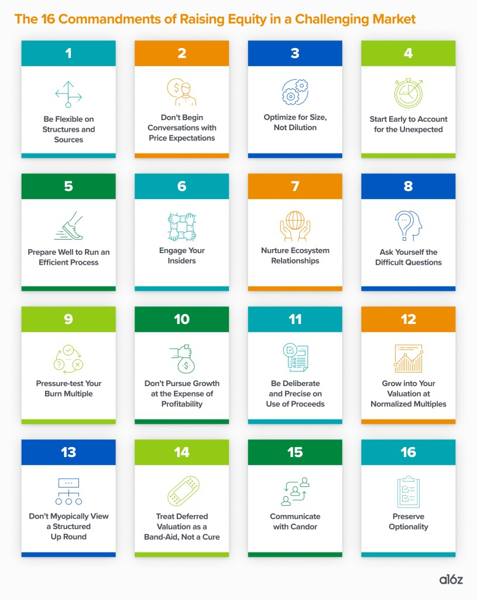
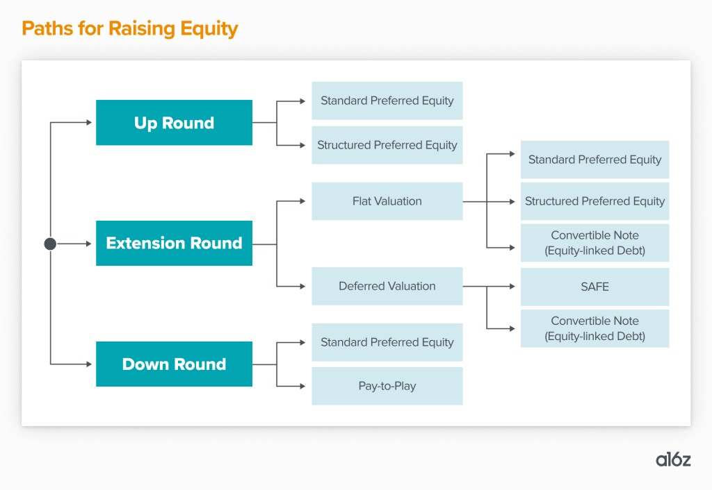
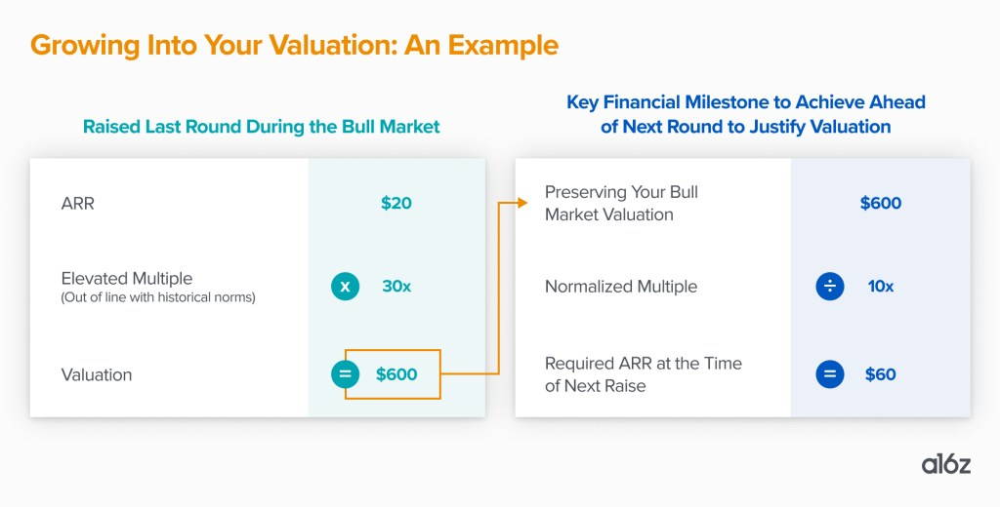
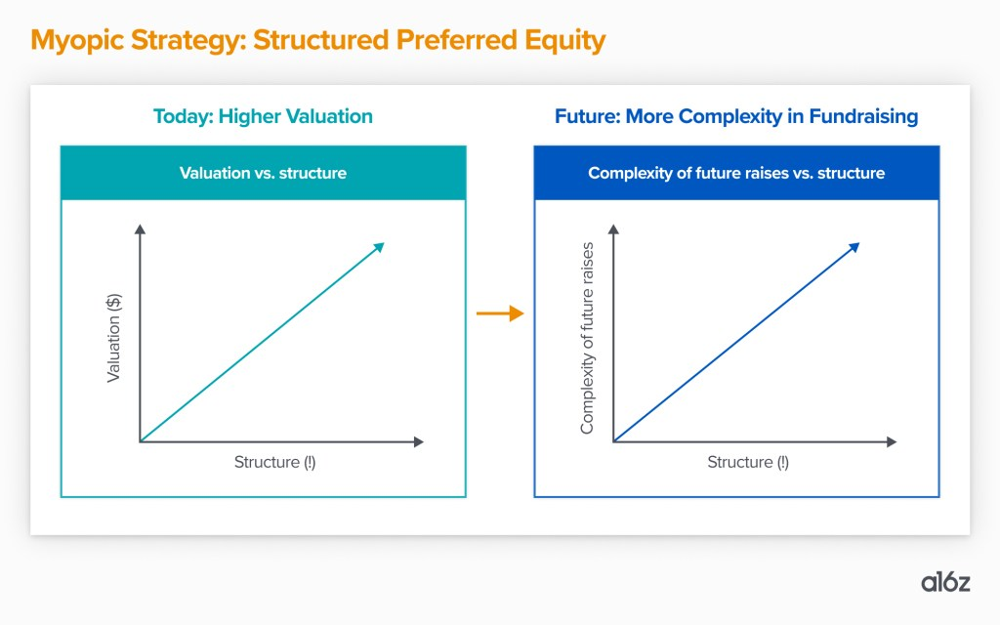

本文讨论了当前风险投资市场的挑战和趋势，包括宏观环境对投资者情绪的影响、早期估值的弹性、向上轮的发生和结构的重要性，以及 SAFE 融资结构的应用。

文章要点:
1. 当前风险投资市场面临挑战，投资者更加谨慎，需要更长时间和更严格的尽职调查。
2. 早期估值比成长期更具弹性，成长期公司更受宏观环境和市场调整的影响。
3. 向上轮仍在进行，但需要更长时间，投资者更加注重结构和下行保护。
4. 结构变得越来越普遍，但在成长轮中比在早期轮中更为普遍。
5. SAFE 融资结构被越来越多的收入产生的 A 轮和 B 轮公司使用，以便在更正式的定价轮之前筹集中期轮资金。

Keywords: 风险投资、宏观环境、估值、结构、SAFE、中期轮 

---

Between inflation, rising interest rates, geopolitical tensions, and growing recession concerns, 2022 was a year of reckoning for both public and private markets.  

在通货膨胀、利率上升、地缘政治紧张局势和日益增长的经济衰退担忧之间，2022 年是公共和私人市场清算的一年。  

Since the beginning of 2022, the tech-heavy Nasdaq Composite has declined 23% (versus the S&P 500’s 14% decline) and global venture funding reached [a thirteen-quarter low](https://www.cbinsights.com/reports/CB-Insights_Venture-Report-Q1-2023.pdf) in Q1 ’23. Further dampening investor confidence, the failure of several long-standing institutions serving the startup ecosystem, such as Silicon Valley Bank, Signature Bank, and First Republic Bank, sent shockwaves through capital markets and the broader financial services industry.  

自 2022 年初以来，以科技股为主的纳斯达克综合指数下跌了 23%（而标准普尔 500 指数下跌了 14%），全球风险投资在 23 年第一季度创下了 13 个季度以来的最低点。硅谷银行、Signature Bank 和 First Republic Bank 等几家长期服务于创业生态系统的机构倒闭，进一步打击了投资者的信心，给资本市场和更广泛的金融服务行业带来了冲击波。  

Today’s market represents a radically different fundraising climate—one not seen in nearly 15 years.  

今天的市场代表了一种截然不同的筹款环境——这是近 15 年来从未见过的。  

Many founders find themselves in uncharted territory as concerns linger around the overall health of the fundraising environment, from venture capital to growth equity.  

许多创始人发现自己处于未知领域，因为对从风险投资到成长型股权的筹款环境的整体健康状况的担忧挥之不去。

## The View from 30,000 Feet: How is the Market Trending?  

30,000 英尺的视角：市场趋势如何？

With seismic changes occurring across the broader capital markets and tech multiples at a multi-year low, we are seeing some key trends emerge in the venture landscape:   

随着更广泛的资本市场发生翻天覆地的变化，科技股倍数处于多年低位，我们看到风险投资领域出现了一些关键趋势：

-   **The macro environment has impacted investor sentiment.** Given the recent political and economic uncertainty, much of private market activity has been put on pause.  
    
    Despite ample dry powder in the venture space, some investors are not willing to step up to price and set valuation terms, particularly in later-stage funding rounds.   
    
    宏观环境影响了投资者情绪。鉴于最近的政治和经济不确定性，许多私人市场活动已暂停。尽管风险投资领域有充足的干火药，但一些投资者不愿意加紧定价和设定估值条款，尤其是在后期融资轮次中。
-   **Early stage valuations have been more resilient**. According to recent Pitchbook [data](https://pitchbook.com/news/reports/q3-2022-pitchbook-analyst-note-down-rounds-impacts-and-exit-opportunities), growth-stage companies have been more adversely impacted by the recent market correction and current macro environment than early stage companies.  
    
    This is in part, due to the growth-stage’s proximity to public markets, whereby investors are confronted with a large gap between the valuation multiple that a growth-stage startup raised at in its most recent round versus where its public peers are trading at today.   
    
    早期估值更具弹性。根据最近的 Pitchbook 数据，成长期公司受到近期市场调整和当前宏观环境的不利影响比早期公司更大。这在一定程度上是由于成长阶段接近公开市场，因此投资者面临着成长阶段初创公司在最近一轮融资的估值倍数与其公开同行今天交易的估值倍数之间的巨大差距.
-   **Up rounds are still happening, but taking longer.** Despite challenges in the broader public equity markets, companies with proven traction, a path to profitability, and good unit economics are raising up rounds.  
    
    However, with continued macro and market uncertainty, investors have become more discerning with longer and more rigorous due diligence, causing rounds to take longer to come together.  
    
    向上轮仍在进行，但需要更长的时间。尽管更广泛的公共股票市场面临挑战，但具有良好吸引力、盈利途径和良好单位经济效益的公司正在筹集资金。然而，随着宏观和市场的持续不确定性，投资者变得更加挑剔，尽职调查时间更长、更严格，导致一轮轮融资的时间更长。
-   **Flight to structure.** In the startup world, it is customary to raise capital through the issuance of preferred equity, and for founders and employees to hold common equity.  
    
    As deals became more competitive in recent years, investors also purchased common equity in an effort to obtain the maximum amount of ownership in a given financing round.  
    
    With today’s more volatile and uncertain markets, investors have returned their focus to preferred equity.  
    
    Increasingly, they are also requiring terms that provide downside protection and minimum return thresholds, such as payment-in-kind (PIK) dividends, liquidation preferences higher than 1x, valuation ratchets, and participating rights.  
    
    That said, while structure is becoming more commonplace, it is more prevalent in growth rounds than in early stage rounds. For more on this topic, please see this [article](https://a16z.com/2022/09/22/funding-when-capital-isnt-cheap/) written by our Growth investment team on the impact of different structures.   
    
    飞行到结构。在创业界，习惯上通过发行优先股筹集资金，创始人和员工持有普通股。随着近年来交易变得更具竞争力，投资者还购买了普通股，以期在给定的融资回合中获得最大数量的所有权。随着当今市场更加动荡和不确定，投资者将注意力重新转向优先股。他们还越来越多地要求提供下行保护和最低回报门槛的条款，例如实物支付 (PIK) 股息、高于 1 倍的清算优先权、估值棘轮和参与权。也就是说，虽然结构变得越来越普遍，但它在成长轮中比在早期轮中更为普遍。有关此主题的更多信息，请参阅我们的成长投资团队撰写的这篇关于不同结构的影响的文章。
-   **In SAFE hands**. A SAFE, or Simple Agreement for Future Equity, is a financing structure pioneered by Y Combinator.  
    
    With a SAFE, a company is able to raise capital without formally assigning a value to the business in exchange for certain protections for the investor upon conversion (typically either a valuation cap, a discount to the next financing round, or both).  
    
    Historically, SAFEs have been primarily used by companies that are pre-product or pre-launch.  
    
    In the current climate, we have observed the SAFE structure being utilized by an increasing number of revenue-generating Series A and Series B companies, who need to raise an interim round to get to certain milestones ahead of a more formal priced round.  
    
    Such companies usually have the internal support to defer an interim valuation event.   
    
    在安全的手中。 SAFE，即未来股权简单协议，是由 Y Combinator 首创的融资结构。有了 SAFE，公司能够在不正式为企业分配价值的情况下筹集资金，以换取在转换时为投资者提供某些保护（通常是估值上限、下一轮融资的折扣，或两者兼而有之）。从历史上看，SAFE 主要由产品前或发布前的公司使用。在当前环境下，我们观察到越来越多的创收 A 系列和 B 系列公司正在使用 SAFE 结构，这些公司需要进行中期融资以在更正式的定价融资之前达到某些里程碑。此类公司通常拥有推迟中期估值事件的内部支持。
-   **Convertible notes have taken off.** Convertible notes are a form of debt that can be converted into equity either at a valuation cap or at a discount (typically 20-30%) to a company’s next financing round just like a SAFE.  
    
    However, unlike SAFEs, convertible notes offer downside protection given the asset class of debt, as well as potential minimum-guaranteed thresholds.  
    
    They also incur interest (that can convert into equity in the next priced round) and have a predetermined maturity date which creates a ticking clock for the company to raise future financing and repay its debt.  
    
    In this current climate, we are observing a number of companies raise convertible notes as well as the emergence of creative new structures such as pre-IPO convertible debt with a conversion price set at a premium to the company’s eventual IPO price.  
    
    可转换票据已经起飞。可转换票据是一种债务形式，可以按照估值上限或公司下一轮融资的折扣（通常为 20-30%）转换为股权，就像外管局一样。然而，与 SAFE 不同的是，鉴于债务的资产类别以及潜在的最低保证门槛，可转换票据提供下行保护。它们还会产生利息（可以在下一轮定价中转换为股权）并有一个预定的到期日，这为公司筹集未来融资和偿还债务创造了一个滴答作响的时钟。在当前这种环境下，我们观察到许多公司筹集可转换票据以及创造性的新结构的出现，例如首次公开募股前的可转换债券，其转换价格设定为高于公司最终 IPO 价格的溢价。
-   **Recaps are due to make a comeback.** When companies looking to raise capital find interest from investors who are not willing to sit behind the company’s existing investors, or preference stack, the standard solution is for the new investors to “reset” the ownership by proposing a financing not only at a different valuation (in order to achieve their ownership objectives) but also to put the new investment at the top of the preferred stack (most senior), and sometimes reduce the existing preference stack to make a return for the new investment more likely.  
    
    This form of financing, through an ownership restructure, essentially force-converts existing preferred equity holders into not only a common equity position, but also often at a down-ratio whereby their ownership percentage is also significantly reduced.  
    
    A variant of this deal structure, known as a “pay-to-play,” offers existing preferred investors the right to participate under the new financing terms and by doing so, are offered a conversion mechanism to preserve some or all of the preference of their original investment.  
    
    While pay-to-play financing structures tend to be uncommon in strong markets, we have seen more of these situations arise in the current climate and expect to see this trend increase.  
    
    回顾将卷土重来。当希望筹集资金的公司发现那些不愿意坐在公司现有投资者或偏好堆栈后面的投资者感兴趣时，标准解决方案是让新投资者“重置”所有权，不仅以不同的估值提出融资（为了实现他们的所有权目标）而且还要将新投资放在首选堆栈的顶部（最高级），有时会减少现有的偏好堆栈以使新投资更有可能获得回报。这种融资形式，通过所有权重组，实质上将现有的优先股持有人强制转换为普通股，而且通常以较低的比例转换，从而使他们的所有权比例也显着降低。这种交易结构的一种变体，称为“即付即用”，为现有优先投资者提供了根据新融资条款参与的权利，并通过这样做提供了一种转换机制，以保留投资者的部分或全部优先权他们的原始投资。虽然付费游戏融资结构在强劲的市场中往往并不常见，但我们已经看到更多此类情况在当前气候下出现，并预计这种趋势会增加。

## What it Means for Startups: The 16 Commandments of Raising Equity in a Challenging Market  

这对初创企业意味着什么：在充满挑战的市场中筹集资金的 16 条戒律

Despite the current environment, we believe that great founders and great businesses will always have options when raising capital.  

尽管当前环境如此，但我们相信伟大的创始人和伟大的企业在筹集资金时总会有选择。  

Amidst this period of market uncertainty, we offer a series of recommendations and advice—our “commandments”—for founders looking to raise in this “new” normal.  

在这段市场不确定的时期，我们为希望在这种“新”常态下筹集资金的创始人提供了一系列建议和建议——我们的“诫命”。

1.  **Be flexible on structures and sources.** Our Managing Partner Ben Horowitz [puts it](https://a16z.com/2013/07/16/capital-market-climate-change/) best: “If you are burning cash and running out of money, you are going to have to swallow your pride, face reality, and raise money even if it hurts.” For startups looking to raise in this current environment, it is imperative to internalize that there are a number of viable paths to raise equity (as depicted by the diagram below), including down rounds and flat rounds.  
    
    There are also many alternative pools of investment capital to tap into beyond VCs, such as strategics, sovereign wealth funds, and family offices.  
    
    Eliminate artificial boundaries and taboos from your vocabulary: “I want a valuation of at least $X,” “I won’t accept convertible debt,” “I don’t want strategics on my cap table.” Be open-minded when different opportunities arise.  
    
    Having an inflexible attitude will greatly decrease your options and make it more challenging to raise capital.    
    
    在结构和来源上保持灵活。我们的执行合伙人本霍洛维茨说得最好：“如果你正在烧钱，钱花光了，你将不得不放下自尊，面对现实，即使会受伤也要筹集资金。”对于希望在当前环境下筹集资金的初创公司而言，必须认识到有许多可行的股权筹集途径（如下图所示），包括降价融资和平轮融资。还有许多替代投资池资本进入风险投资以外的领域，例如战略、主权财富基金和家族理财室。从你的词汇中消除人为的界限和禁忌：“我想要至少 X 美元的估值”，“我不会接受可转换债券，” “我不想在我的薪资表上考虑战略。”当出现不同的机会时要保持开放的态度。态度僵硬会大大减少您的选择，并使筹集资金更具挑战性。
2.  **Don’t begin conversations with price expectations**. Founders should avoid anchoring conversations around price expectations or last round’s valuation.  
    
    You run the risk of not receiving any term sheets if you convey up front an expectation of a high price.  
    
    Securing even a low-valuation term sheet early on will help build competitive tension, which you may be able to leverage towards additional term sheets and better terms. You just need one “yes” to get the ball rolling.  
    
    不要以价格预期开始对话。创始人应避免围绕价格预期或上一轮估值进行谈话。如果您预先表达了对高价的期望，您将面临收不到任何条款清单的风险。即使是在早期获得低估值的条款清单也将有助于建立竞争压力，您可以利用它来获得更多的条款清单和更好的条款。您只需要一个“是”就可以启动。
3.  **Optimize for size, not dilution.** For founders who have raised capital during the last few years, the standard approach has been to optimize for dilution given the easy accessibility to capital.  
    
    However, in today’s environment, founders should instead consider optimizing for round size.  
    
    If a round has come together and you are being offered more capital than you had intended to raise, taking the incremental dilution now for the additional capital can be a prudent move.  
    
    This will not only offer a runway extension, but also help avoid a potential situation down the road where you are forced to raise again following a short interval.  
    
    优化大小，而不是稀释。对于在过去几年中筹集资金的创始人来说，标准方法一直是优化稀释，因为它很容易获得资金。然而，在今天的环境中，创始人应该考虑优化轮次规模。如果已经进行了一轮融资，并且向您提供的资金比您打算筹集的资金多，那么现在采取增量稀释以获得额外资金可能是一个谨慎的举动。这不仅可以延长跑道，还有助于避免在短时间间隔后被迫再次升起的潜在情况。
4.  **Start early to account for the unexpected.** During a period of market uncertainty, it is critical to prepare and build in sufficient buffer time to account for unanticipated obstacles, such as partner-level meetings taking longer to schedule, extended confirmatory diligence, or other unforeseen funding delays.  
    
    By starting your fundraising journey early, you can ensure that you have a time-cushion to fall back on when the unexpected happens.  
    
    尽早开始应对意外情况。在市场不确定的时期，准备和建立足够的缓冲时间以应对意外障碍至关重要，例如合作伙伴级别的会议需要更长的时间安排、延长的确认尽职调查或其他不可预见的资金延迟。通过尽早开始您的筹款之旅，您可以确保在意外发生时有时间可以依靠。
5.  **Prepare well to run an efficient process.** Take time up front to thoroughly rehearse your pitch, sharpen your delivery, improve your deck, and prepare a [data room](https://a16z.com/2022/08/25/the-insiders-guide-to-data-rooms-what-to-know-before-you-raise/). Diligent preparation and deliberate planning will help reduce your chances of making an error, which can be costly and time-consuming to fix later on.  
    
    Completing a fundraising process expeditiously is imperative in this environment.  
    
    You do not want your company to become a “stale listing,” which in real estate, refers to properties that have spent too many days on the market.  
    
    Stale listings are often caught in a vicious cycle: the perception is that something is wrong with it, which keeps other would-be buyer_s_ from purchasing it. Similarly, in the venture capital world, startups may also be viewed as “stale” or unattractive to investors.  
    
    The key to avoiding this stigma is to run an organized and efficient process aimed at creating competition.   
    
    做好准备以运行高效的流程。提前花点时间彻底排练你的演讲，提高你的演讲能力，改进你的演讲，并准备一个数据室。勤奋的准备和深思熟虑的计划将有助于减少犯错误的机会，这些错误在以后修复起来可能既昂贵又费时。在这种环境下，迅速完成筹款过程势在必行。您不希望您的公司成为“陈旧的清单”，在房地产中，它指的是在市场上呆了太多天的房产。陈旧的清单往往陷入恶性循环：人们认为它有问题，这阻止了其他潜在买家购买它。同样，在风险投资领域，初创企业也可能被视为“陈旧”或对投资者没有吸引力。避免这种耻辱的关键是运行一个旨在创造竞争的有组织和有效的过程。
6.  **Engage your insiders.** Proactively engage with your existing investors (insiders) about your upcoming fundraising plans.  
    
    Having an insider commit to participating in or leading your round may serve as a strong endorsement and vote of confidence that can encourage other market participants to also invest in the round.  
    
    However, insiders may be at different stages of their fund lifecycle and may have limited reserves so it is important to have honest and open conversations with them on whether and how much they are able to commit.   
    
    让你的内部人士参与进来。主动与您现有的投资者（内部人士）就您即将到来的筹款计划进行接触。让内部人士承诺参与或领导您的回合可能是一种强有力的认可和信任投票，可以鼓励其他市场参与者也参与该回合的投资。然而，内部人士可能处于其基金生命周期的不同阶段并且可能储备有限，因此与他们就他们是否能够承诺以及能够承诺多少进行坦诚和公开的对话非常重要。
7.  **Nurture ecosystem relationships.**As our team has [discussed](https://a16z.com/2022/06/15/the-complete-guide-to-acquihires/) in the past, we believe it’s never too early to begin building relationships within your ecosystem, from both a commercial and strategic partnership perspective.  
    
    Relationships take time to nurture, so this is time well-invested and will pay dividends in the future.  
    
    These developed relationships can be incredibly useful in helping to catalyze a potential financing, whether it be a bridge round alongside existing investors, a strong signal for new investors to co-invest as part of a larger financing round, or a stage-setter for a potential strategic transaction in the near to long term.  
    
    培养生态系统关系。正如我们的团队过去所讨论的那样，我们认为从商业和战略合作伙伴关系的角度来看，在您的生态系统中开始建立关系永远不会太早。人际关系需要时间来培养，所以现在是投资的好时间，将来会有回报。这些发达的关系对于促进潜在的融资非常有用，无论是与现有投资者的桥梁融资，还是新投资者共同投资作为更大融资轮的一部分的强烈信号，或者是一个舞台设置者近期和长期的潜在战略交易。
8.  **Ask yourself the difficult questions.** Even before you meet with investors, think about where investors may push back. Why are newer cohorts showing lower retention? Why is CAC rising?  
    
    Why have organic acquisitions stagnated? This enables you to anticipate key investor concerns and proactively address them by preparing materials and answers in advance.  
    
    Investors want to engage with founders who are thinking critically about what they’re doing right, what they’re doing wrong, and what they intend to do differently.  
    
    问自己一些困难的问题。甚至在与投资者会面之前，请考虑投资者可能会反对的地方。为什么较新的队列显示较低的保留率？为什么 CAC 会上升？为什么有机收购停滞不前？这使您能够预测投资者的主要关注点，并通过提前准备材料和答案来主动解决这些问题。投资者希望与那些正在批判性地思考自己做对的事情、做错的事情以及他们打算以不同方式做的事情的创始人接触。
9.  **Pressure-test your burn multiple.** Stress-test your burn multiple, [which we define as cash burned divided by net ARR added](https://a16z.com/2022/05/13/a-framework-for-navigating-down-markets-2/). In other words, how much cash are you burning to generate each incremental dollar of revenue?  
    
    Evaluate how your burn multiple is changing across months and quarters and explore what you can do to improve this metric.  
    
    Moreover, identify areas that are your largest sources of burn, which areas represent “burn-sinks” vs. burn-investments and have a rationale for why spending is justified.  
    
    Investors are looking to invest in companies that are able to balance growth and cash burn, as well as those who know how to do more with less.   
    
    压力测试你的燃烧倍数。对您的烧钱倍数进行压力测试，我们将其定义为烧钱除以增加的净 ARR。换句话说，您要消耗多少现金来产生每一美元的增量收入？评估您的消耗倍数在几个月和几个季度内的变化情况，并探索您可以采取哪些措施来改进该指标。此外，确定您最大的烧钱来源领域，哪些领域代表“烧钱汇”与烧钱投资，并说明为什么支出是合理的。投资者希望投资于能够平衡增长和现金消耗的公司，以及那些知道如何事半功倍的公司。
10.  **Don’t pursue growth at the expense of profitability.** The Rule of 40 (Ro40), defined as the sum of a company’s revenue growth and profitability margin, is a metric used by investors to gauge a growth-stage startup’s performance.  
    
    It succinctly captures the trade-off between growth and profitability.  
    
    Companies with identical Ro40 scores aren’t necessarily treated the same, since the pendulum between growth and profitability swings over time.  
    
    During the strong market environment of recent years, the scale tipped in favor of growth, with investors rewarding startups that were able to demonstrate rapid growth even at the cost of poor unit economics and profitability.  
    
    Since then, the goalposts have moved drastically—the “growth at all costs” mantra has come to an end. Today, investors are putting more weight on profitability.  
    
    If your unit economics are in the red, consider prioritizing efforts to improve your company’s profitability even if it means achieving lower growth in the present.  
    
    Growth efforts can always be ramped up later in the company’s journey, but the quest for good unit economics can feel like a Sisyphean task when already operating at scale.  
    
    不要以牺牲盈利能力为代价追求增长。 40 法则 (Ro40) 定义为公司收入增长和利润率的总和，是投资者用来衡量成长阶段初创公司业绩的指标。它简洁地捕捉了增长和盈利能力之间的权衡。具有相同 Ro40 分数的公司不一定会受到相同的待遇，因为增长和盈利能力之间的钟摆会随着时间的推移而摆动。在近年来强劲的市场环境中，规模向有利于增长的方向倾斜，投资者奖励那些即使以单位经济效益和盈利能力不佳为代价也能够展示快速增长的初创公司。从那以后，目标发生了翻天覆地的变化——“不惜一切代价实现增长”的口号已经走到尽头。如今，投资者更加看重盈利能力。如果您的单位经济效益出现亏损，请考虑优先努力提高公司的盈利能力，即使这意味着目前实现较低的增长。在公司发展的后期，总是可以加大增长力度，但在已经大规模运营的情况下，寻求良好的单位经济效益可能感觉像是一项艰巨的任务。
11.  **Be deliberate and precise on use of proceeds.** Investors want to partner with founders who efficiently overcome roadblocks.  
    
    It is not enough to show how much and where you plan to allocate future capital; you must also demonstrate that the juice is going to be worth the squeeze.  
    
    Which acquisition channels are not saturated and thus will provide the best returns on marketing spend?  
    
    Which customer segments will you deprioritize because their unit economics will not work even at scale? Which features are you pushing to drive better retention?  
    
    Demonstrate to investors that you know your business inside-out and present a realistic plan on how you will mobilize funding to target the highest ROI levers and achieve specific milestones.   
    
    慎重而准确地使用收益。投资者希望与能够有效克服障碍的创始人合作。仅显示您计划分配未来资金的数量和位置是不够的；您还必须证明榨汁是值得的。哪些获取渠道未饱和，因此将提供最佳的营销支出回报？您将取消哪些客户群的优先级，因为他们的单位经济效益即使在规模上也不起作用？您正在推动哪些功能来提高保留率？向投资者证明您对自己的业务了如指掌，并就如何调动资金以实现最高投资回报率杠杆和实现特定里程碑提出切合实际的计划。
12.  **Grow into your valuation at normalized multiples.** If you’re a company that raised capital over the past few years, you likely did so at a strong valuation.  
    
    Given the recent market correction, your focus today should be setting near-term financial targets that enable you to grow into that valuation at normalized multiples.  
    
    Balancing offense and defense is key—recalibrate your business plan and adopt operational discipline by evaluating how you’re going to use the capital you’ve raised in the most efficient manner possible to hit the required financial milestones ahead of your next raise.  
    
    Please see this [article](https://a16z.com/2022/05/13/a-framework-for-navigating-down-markets-2/) written by our Growth investment team on how to think about navigating down markets and scenario planning.   
    
    以标准化倍数增长您的估值。如果你是一家在过去几年筹集资金的公司，那么你的估值很可能很高。鉴于最近的市场调整，您今天的重点应该是设定近期财务目标，使您能够以正常倍数增长到该估值。平衡进攻和防守是关键——重新调整您的业务计划并采用运营纪律，方法是评估您将如何以最有效的方式使用您筹集的资金，以便在下一次融资之前达到所需的财务里程碑。请参阅我们的成长投资团队撰写的这篇文章，了解如何考虑驾驭市场和情景规划。  
    
    
13.  ****Don’t myopically view a structured up round.** In today’s climate, there are some who believe that securing an up round, even in the form of structured equity, can be a Fountain of Youth that will help maintain both the actual and perceived health of the company.  
    
    However, founders should be aware that an up round is not a solution for all of the company’s issues.  
    
    Implementing structure into the company’s capitalization solely for the sake of preserving your last round’s valuation is not an act that is easily reversible and will have downstream effects on future financings.  
    
    For example, future investors may expect that in subsequent rounds they too will receive the same rights, thereby further diminishing returns to common equity holders, including founders and employees.
    
    As such, startups that are several years or rounds away from a liquidity event, may be better off raising a “clean” flat round or down round than an up round that comes with structure such as higher liquidation preference, participation parameters, ratchets, and other atypical governance rights. 
    
      
    
    不要短视地看待结构化的一轮融资。在当今的环境下，有些人认为，即使以结构性股权的形式获得一轮融资，也可以成为青春之泉，有助于维持公司实际和预期的健康状况。然而，创始人应该意识到，一轮融资并不能解决公司所有的问题。仅仅为了保持上一轮的估值而对公司的资本化实施结构不是一种容易逆转的行为，并且会对未来的融资产生下游影响。例如，未来的投资者可能期望在后续轮次中他们也将获得相同的权利，从而进一步减少普通股持有人（包括创始人和员工）的回报。因此，距离流动性事件发生数年或数轮的初创企业，可能更好地筹集“干净”的平轮或降轮，而不是带有更高清算优先权、参与参数、棘轮和其他非典型治理权。在当今的环境下，有些人认为，即使以结构性股权的形式获得一轮融资，也可以成为青春之泉，有助于维持公司实际和预期的健康状况。然而，创始人应该意识到，一轮融资并不能解决公司所有的问题。仅仅为了保持上一轮的估值而对公司的资本化实施结构不是一种容易逆转的行为，并且会对未来的融资产生下游影响。 例如，未来的投资者可能期望在后续轮次中他们也将获得相同的权利，从而进一步减少普通股持有人（包括创始人和员工）的回报。因此，距离流动性事件发生数年或数轮的初创企业，可能更好地筹集“干净”的平轮或降轮，而不是带有更高清算优先权、参与参数、棘轮和其他非典型治理权。在当今的环境下，有些人认为，即使以结构性股权的形式获得一轮融资，也可以成为青春之泉，有助于维持公司实际和预期的健康状况。然而，创始人应该意识到，一轮融资并不能解决公司所有的问题。仅仅为了保持上一轮的估值而对公司的资本化实施结构不是一种容易逆转的行为，并且会对未来的融资产生下游影响。例如，未来的投资者可能期望在后续轮次中他们也将获得相同的权利，从而进一步减少普通股持有人（包括创始人和员工）的回报。因此，距离流动性事件发生数年或数轮的初创企业，可能更好地筹集“干净”的平轮或降轮，而不是带有更高清算优先权、参与参数、棘轮和其他非典型治理权。在当今的环境下，有些人认为，即使以结构性股权的形式获得一轮融资，也可以成为青春之泉，有助于维持公司实际和预期的健康状况。 然而，创始人应该意识到，一轮融资并不能解决公司所有的问题。仅仅为了保持上一轮的估值而对公司的资本化实施结构不是一种容易逆转的行为，并且会对未来的融资产生下游影响。例如，未来的投资者可能期望在后续轮次中他们也将获得相同的权利，从而进一步减少普通股持有人（包括创始人和员工）的回报。因此，距离流动性事件发生数年或数轮的初创公司，可能更好地筹集“干净”的平轮或降轮，而不是带有更高清算优先权、参与参数、棘轮和其他非典型的治理权。在当今的环境下，有些人认为，即使以结构性股权的形式获得一轮融资，也可以成为青春之泉，有助于维持公司实际和预期的健康状况。然而，创始人应该意识到，一轮融资并不能解决公司所有的问题。仅仅为了保持上一轮的估值而对公司的资本化实施结构不是一种容易逆转的行为，并且会对未来的融资产生下游影响。例如，未来的投资者可能期望在后续轮次中他们也将获得相同的权利，从而进一步减少普通股持有人（包括创始人和员工）的回报。 因此，距离流动性事件发生数年或数轮的初创企业，可能更好地筹集“干净”的平轮或降轮，而不是带有更高清算优先权、参与参数、棘轮和其他非典型治理权。**
14.  **Treat deferred valuation as a Band-Aid, not a cure.** To address the potential valuation gap between a wide bid and ask spread, some companies are electing to raise capital via SAFE or convertible note structures that defer the topic of pricing.  
    
    The rationale behind this approach is that it gives the company more runway and resources to achieve key milestones ahead of an eventual formal priced round.  
    
    The notion of deferred valuation as a magic bullet solution is alluring, but may ultimately present challenges and could derail the eventual priced round.  
    
    Founders should exercise caution and consider this approach carefully before committing.  
    
    If you have immediate liquidity needs or anticipate reaching near-term milestones, then this solution between financing rounds may be suitable for you.  
    
    However, depending on your specific circumstance and the terms of the instrument, it may also lead to misaligned incentives between existing and deferred round investors, as well as present long-term issues with your capital structure if milestones are not met.  
    
    将递延估值视为创可贴，而不是治愈方法。为了解决广泛的买卖价差之间的潜在估值差距，一些公司选择通过 SAFE 或推迟定价主题的可转换票据结构来筹集资金。这种方法背后的基本原理是，它为公司提供了更多的跑道和资源，以在最终的正式定价回合之前实现关键的里程碑。递延估值作为灵丹妙药的想法很有吸引力，但最终可能会带来挑战，并可能使最终的定价回合脱轨。创始人应该谨慎行事，并在承诺之前仔细考虑这种方法。如果您有即时的流动性需求或预计将达到近期里程碑，那么这种融资轮次之间的解决方案可能适合您。但是，根据您的具体情况和工具条款，它也可能导致现有和延期投资者之间的激励不一致，如果未达到里程碑，则您的资本结构会出现长期问题。
15.  **Communicate with candor.** There may be a tendency to not discuss or communicate a fundraising outcome that on the surface seems sub-optimal.  
    
    One misconception is that it might spook employees, partners, and vendors by raising concerns that the company’s prospects are limited or challenged.  
    
    On the contrary, it is imperative in such instances to be transparent with employees about where things stand and to listen to their concerns.  
    
    Candor and honesty in such moments will help build loyalty and enable you to lead more effectively.   
    
    坦诚沟通。可能倾向于不讨论或传达表面上似乎次优的筹款结果。一种误解是，它可能会引发对公司前景有限或受到挑战的担忧，从而吓坏员工、合作伙伴和供应商。相反，在这种情况下，必须对员工保持透明，了解情况并倾听他们的担忧。在这样的时刻坦率和诚实将有助于建立忠诚度并使您能够更有效地领导。
16.  **Preserve optionality.** As you embark on your fundraising process, there is a chance that you may not be able to secure the funding you need.  
    
    As such, it is important to be prepared for the possibility of a sale, soft landing, acquihire, or wind-down.  
    
    Make sure to set aside sufficient cash and time to explore these alternative paths and potentially dual-track alongside the fundraising process.  
    
    保留可选性。当您开始筹款过程时，您可能无法获得所需的资金。因此，重要的是要为出售、软着陆、收购或结束的可能性做好准备。确保留出足够的现金和时间来探索这些替代途径，并可能在筹款过程中双轨。

## Conclusion  

While the strong market environment over most of the past decade has yielded many positive fundraising outcomes, it is important to take a step back and treat fundraising for what it is—a milestone versus a destination.  

A flat or down round should not be viewed as a death knell for a startup.  

Many successful, category-leading companies such as Airbnb, Doordash, Block, and Meta raised flat or down rounds along their startup journey.  

The current environment represents a great [time to build](https://a16z.com/2020/04/18/its-time-to-build/), without the distraction of hype cycles, speculative valuation chasing, and unbridled market exuberance.  

While the capital markets environment has undoubtedly changed following an extended market run, the future most certainly holds great opportunity for founders and investors alike.  

虽然在过去十年的大部分时间里，强劲的市场环境已经产生了许多积极的筹款成果，但重要的是要退后一步，真正对待筹款——一个里程碑而不是一个目的地。持平或下跌不应被视为初创企业的丧钟。许多成功的、类别领先的公司，如 Airbnb、Doordash、Block 和 Meta，在他们的创业过程中都获得了持平或下跌的融资。当前环境是构建的好时机，没有炒作周期、投机估值追逐和肆无忌惮的市场繁荣的干扰。虽然随着市场运行的延长，资本市场环境无疑发生了变化，但未来无疑为创始人和投资者等提供了巨大的机会。

\*\*\*

_The views expressed here are those of the individual AH Capital Management, L.L.C. (“a16z”) personnel quoted and are not the views of a16z or its affiliates.  

Certain information contained in here has been obtained from third-party sources, including from portfolio companies of funds managed by a16z.  

While taken from sources believed to be reliable, a16z has not independently verified such information and makes no representations about the enduring accuracy of the information or its appropriateness for a given situation.  

In addition, this content may include third-party advertisements; a16z has not reviewed such advertisements and does not endorse any advertising content contained therein.  

此处表达的观点是 AH Capital Management, L.L.C. 个人的观点。 (“a16z”) 人员引用但不代表 a16z 或其附属公司的观点。此处包含的某些信息是从第三方来源获得的，包括来自 a16z 管理的基金的投资组合公司。虽然取自被认为可靠的来源，但 a16z 并未独立核实此类信息，也不对信息的持久准确性或其对特定情况的适用性做出任何陈述。此外，此内容可能包含第三方广告； a16z 没有审查过此类广告，也不认可其中包含的任何广告内容。_

_This content is provided for informational purposes only, and should not be relied upon as legal, business, investment, or tax advice.  

You should consult your own advisers as to those matters.  

References to any securities or digital assets are for illustrative purposes only, and do not constitute an investment recommendation or offer to provide investment advisory services.  

Furthermore, this content is not directed at nor intended for use by any investors or prospective investors, and may not under any circumstances be relied upon when making a decision to invest in any fund managed by a16z._

_(An offering to invest in an a16z fund will be made only by the private placement memorandum, subscription agreement, and other relevant documentation of any such fund and should be read in their entirety.) Any investments or portfolio companies mentioned, referred to, or described are not representative of all investments in vehicles managed by a16z, and there can be no assurance that the investments will be profitable or that other investments made in the future will have similar characteristics or results.  

A list of investments made by funds managed by Andreessen Horowitz (excluding investments for which the issuer has not provided permission for a16z to disclose publicly as well as unannounced investments in publicly traded digital assets) is available at https://a16z.com/investments/._

_  

此内容仅供参考，不应作为法律、商业、投资或税务建议。您应该就这些事项咨询您自己的顾问。对任何证券或数字资产的引用仅供说明之用，并不构成投资建议或提供投资咨询服务的要约。此外，本内容不针对或旨在供任何投资者或潜在投资者使用，并且在任何情况下都不得在决定投资 a16z 管理的任何基金时予以依赖。 （投资 a16z 基金的要约只能通过私募备忘录、认购协议和任何此类基金的其他相关文件进行，并且应完整阅读。）提及、提及或提及的任何投资或投资组合公司所描述的并不代表对 a16z 管理的车辆的所有投资，并且不能保证这些投资将盈利或未来进行的其他投资将具有类似的特征或结果。由 Andreessen Horowitz 管理的基金进行的投资清单（不包括发行人未允许 a16z 公开披露的投资以及未宣布的公开交易数字资产投资）可在 https://a16z.com/investments 获取/._

_Charts and graphs provided within are for informational purposes solely and should not be relied upon when making any investment decision.  

Past performance is not indicative of future results. The content speaks only as of the date indicated.  

Any projections, estimates, forecasts, targets, prospects, and/or opinions expressed in these materials are subject to change without notice and may differ or be contrary to opinions expressed by others.  

Please see https://a16z.com/disclosures for additional important information.  

其中提供的图表仅供参考，在做出任何投资决定时不应依赖。过去的表现并不预示未来的结果。内容仅在指定日期有效。这些材料中表达的任何预测、估计、预测、目标、前景和/或意见如有更改，恕不另行通知，并且可能与其他人表达的意见不同或相反。请参阅 https://a16z.com/disclosures 了解更多重要信息。_
