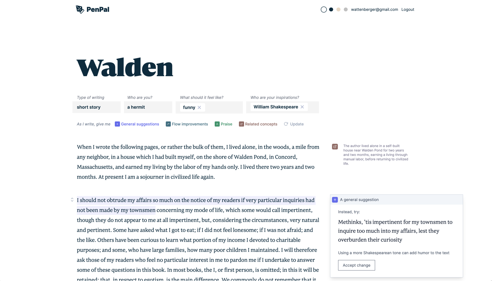
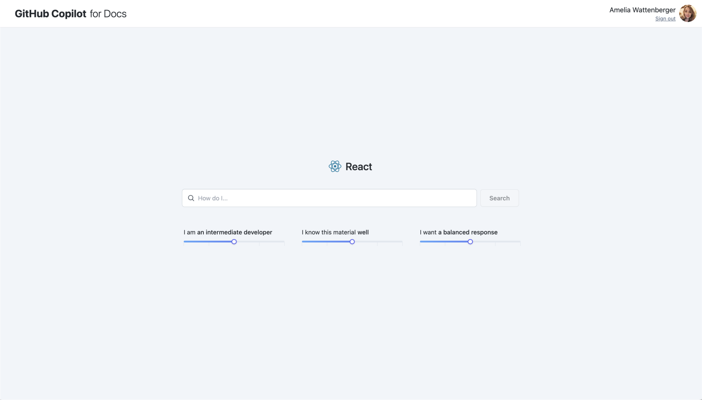

## Why Chatbots Are Not the Future  

为什么聊天机器人不是未来

Last night, over wine and seafood, the inevitable happened...  

昨晚，在美酒佳肴中，不可避免的事情发生了……

Someone mentioned ChatGPT.  有人提到了 ChatGPT。

I had no choice but to start into an unfiltered, no-holds-barred rant about chatbot interfaces.  

我别无选择，只能开始对聊天机器人界面进行未经过滤、毫无保留的咆哮。

Unfortunately for the countless hapless people I've talked to in the past few months, this was inexorable.  

不幸的是，对于过去几个月我与之交谈过的无数不幸的人来说，这是无情的。  

Ever since ChatGPT exploded in popularity, my inner designer has been bursting at the seams.  

自从 ChatGPT 大受欢迎以来，我的内在设计师就一直力不从心。

To save future acquaintances, I come to you today: because you've volunteered to be here with me, can we please discuss a few reasons chatbots are not the future of interfaces.  

为了避免未来的熟人，我今天来找你：因为你自愿和我一起来这里，我们能否讨论一下聊天机器人不是界面未来的几个原因。

## 

Text inputs have no affordances 文本输入没有提示

When I go up the mountain to ask the ChatGPT oracle a question, I am met with a blank face. What does this oracle know? How should I ask my question?  

当我上山向ChatGPT oracle提问时，遇到的是一脸茫然。这个神谕知道什么？我应该如何提出问题？  

And when it responds, it is endlessly confident. I can't tell whether or not it actually understand my question or where this information came from.  

当它回应时，它充满自信。我不知道它是否真正理解我的问题或这些信息来自何处。

**Good tools make it clear how they should be used.** And more importantly, how they should _not_ be used. If we think about a good pair of gloves, it's immediately obvious how we should use them. They're hand-shaped! We put them on our hands.  

好的工具会清楚地说明应该如何使用它们。更重要的是，不应该如何使用它们。如果我们想到一副好的手套，那么我们应该如何使用它们就很明显了。它们是手形的！我们把它们放在手上。  

And the specific material tells us more: metal mesh gloves are for preventing physical harm, rubber gloves are for preventing chemical harm, and leather gloves are for looking cool on a motorcycle.  

而具体的材质告诉我们更多：金属网手套是为了防止物理伤害，橡胶手套是为了防止化学伤害，皮手套是为了骑摩托车看起来很酷。

Compare that to looking at a typical chat interface. The only clue we receive is that we should type characters into the textbox.  

将其与查看典型的聊天界面进行比较。我们收到的唯一线索是我们应该在文本框中键入字符。  

The interface looks the same as a Google search box, a login form, and a credit card field.  

该界面看起来与 Google 搜索框、登录表单和信用卡字段一样。

Of course, users can learn over time what prompts work well and which don't, but the burden to learn what works still lies with every single user.  

当然，随着时间的推移，用户可以了解哪些提示有效，哪些提示无效，但学习有效提示的负担仍然落在每个用户身上。  

When it could instead be baked into the interface.  

当它可以被烘焙到界面中时。

## 

Prompts are just a pile of context  

提示只是一堆上下文

LLMs make it too easy: we send them text and they send back text. The easy solution is to slap a shallow wrapper on top and call it a day.  

法学硕士让它变得太简单了：我们给他们发短信，他们发回短信。简单的解决方案是在上面拍一个浅包装纸，然后收工。  

But pretty soon, we're going to get sick of typing all the time. If you think about it, **everything you put in a prompt is a piece of context**.  

但很快，我们就会厌倦一直打字。如果您考虑一下，您在提示中输入的所有内容都是一个上下文。

Let's look at a simple example from [Awesome ChatGPT Prompts](https://github.com/f/awesome-chatgpt-prompts):  

让我们看一个来自 Awesome ChatGPT Prompts 的简单示例：

Who are you? 你是谁？

I want you to act as a dream interpreter  

我要你做解梦人.

How should you respond? 你应该如何回应？

I will give you descriptions of my dreams, and you will provide interpretations based on the symbols and themes present in the dream  

我会给你描述我的梦，你会根据梦中出现的符号和主题提供解释.

How should you not respond? 不回应怎么办？

Do not provide personal opinions or assumptions about the dreamer  

不要提供关于梦者的个人意见或假设.

What type of information do I want?  

我想要什么类型的信息？

Provide only factual interpretations based on the information given  

根据给定的信息仅提供事实解释.

How should we start? 我们应该如何开始？

My first dream is about being chased by a giant spider  

我的第一个梦想是被巨型蜘蛛追赶.

How can we make it easier for users to provide all of this context?  

我们如何才能让用户更轻松地提供所有这些上下文？

I'm exploring an AI writing interface focused on making you a better writer. Mimicking a good writing tutor, it suggests improvements to your content.  

我正在探索一个 AI 写作界面，专注于让你成为更好的作家。模仿优秀的写作导师，它会建议对您的内容进行改进。  

"Try smoothing out this transition" or "add tangible examples here".  

“尝试平滑这种过渡”或“在此处添加具体示例”。

But not all writers have the same goals! Not does all content have the same audience or tone.  

但并非所有作家都有相同的目标！并非所有内容都具有相同的受众或基调。  

To better tailor the responses, I added a few controls for the user to specify their use case: _What type of writing is this, who are they, what should it feel like, who are their inspirations?_  

为了更好地定制响应，我为用户添加了一些控件来指定他们的用例：这是什么类型的写作，他们是谁，感觉应该如何，他们的灵感来自谁？

Even if we're determined to stick with a chat interface, we can make things easier for users. Recently, my team shipped a prototype named [Copilot for Docs](https://githubnext.com/projects/copilot-for-docs/), exploring ways to make technical documentation easier for developers to use.  

即使我们决定坚持使用聊天界面，我们也可以让用户使用起来更轻松。最近，我的团队发布了一个名为 Copilot for Docs 的原型，探索使技术文档更易于开发人员使用的方法。

I think of it in two parts: _finding the most relevant information to a user's question_ and _synthesizing an answer using that information_. When we synthesize an answer, we have a chance to tailor the response to the specific question-asker. As a rough first exploration with this idea, we added a few sliders:  

我将其分为两部分：找到与用户问题最相关的信息，并使用该信息合成答案。当我们综合一个答案时，我们就有机会针对特定的提问者定制答案。作为对这个想法的初步探索，我们添加了一些滑块：

A new developer doesn't want the same responses as an experienced one, or someone who's new to the library, or someone who's in a rush.  

新开发人员不希望得到与经验丰富的开发人员、图书馆新手或赶时间的人相同的响应。  

(Get ready for a future rant: static text is dead.) As the creators of [Copilot for Docs](https://githubnext.com/projects/copilot-for-docs/), we have a good idea of what the tool is best at and what kinds of information will lead to the most helpful responses.  

（为未来的咆哮做好准备：静态文本已死。）作为 Copilot for Docs 的创建者，我们很清楚该工具最擅长什么，以及什么样的信息将导致最有帮助的响应。  

Let's take the time to bake as much information into the interface as possible instead of making users hack it into each of their questions.  

让我们花时间将尽可能多的信息融入界面，而不是让用户将其破解到他们的每个问题中。

## 

Responses are isolated 反应是孤立的

Natural language is great at rough direction: teleport me to the right neighborhood. But once ChatGPT has responded, how do I get it to take me to the right house?  

自然语言擅长粗略的指导：将我传送到正确的社区。但是，一旦 ChatGPT 做出响应，我如何让它将我带到正确的房子？

Say you ask ChatGPT to help improve your writing. Let's use this paragraph from [Walden](https://www.gutenberg.org/files/205/205-h/205-h.htm) as an example:  

假设您要求 ChatGPT 帮助改进您的写作。让我们以《瓦尔登湖》中的这段话为例：

I have thought that Walden Pond would be a good place for business, not solely on account of the railroad and the ice trade; it offers advantages which it may not be good policy to divulge; it is a good port and a good foundation.  

我认为瓦尔登湖会是一个做生意的好地方，不仅仅是因为铁路和冰贸易；它提供的优势可能不是泄露的好政策；这是一个很好的港口和良好的基础。  

No Neva marshes to be filled; though you must every where build on piles of your own driving.  

没有涅瓦沼泽需要填平；尽管您必须在每个地方都建立在自己驾驶的基础上。  

It is said that a flood-tide, with a westerly wind, and ice in the Neva, would sweep St. Petersburg from the face of the earth.  

据说洪水、西风和涅瓦河的冰会将圣彼得堡从地球表面扫除。

We ask ChatGPT to "make this text better". It responds:  

我们要求 ChatGPT “让这个文本更好”。它回应：

I believe that Walden Pond presents a promising opportunity for business, not just because of its proximity to the railroad and the ice trade, but also due to other undisclosed advantages. It boasts excellent port facilities and a solid foundation, without the need to undertake extensive marsh filling like the Neva marshes.  

我相信瓦尔登湖提供了一个充满希望的商业机会，不仅因为它靠近铁路和冰贸易，还因为它还有其他未公开的优势。它拥有优良的港口设施和坚实的基础，不需要像涅瓦沼泽那样进行大面积的沼泽填埋。  

However, one should exercise caution in divulging all the unique benefits it offers. Furthermore, it is worth noting that St.  

但是，在泄露它提供的所有独特好处时应该谨慎行事。此外，值得注意的是，圣.  

Petersburg faces the risk of being devastated by a flood-tide, coupled with a westerly wind and ice in the Neva.  

圣彼得堡面临被洪水摧毁的风险，再加上涅瓦河的西风和结冰。

Next, we ask it to "rewrite this text with more active language". It responds:  

接下来，我们要求它“用更活跃的语言重写这段文本”。它回应：

I envision Walden Pond as an exceptional business destination, not solely due to the railroad and ice trade, but for its undisclosed advantages.  

我将瓦尔登湖视为一个非凡的商业目的地，这不仅是因为铁路和冰贸易，还因为它具有未公开的优势。  

It boasts a superb port and a solid foundation, eliminating the need for extensive marsh filling like the Neva marshes.  

它拥有一流的港口和坚实的地基，无需像涅瓦沼泽那样大量填筑沼泽。  

However, one must exercise discretion in revealing its unique benefits. Additionally, it's crucial to acknowledge the peril St.  

但是，在揭示其独特优势时必须谨慎行事。此外，重要的是要承认圣路易斯的危险。  

Petersburg faces: a flood-tide, a westerly wind, and ice in the Neva could obliterate the city from existence.  

圣彼得堡的面貌：洪水、西风和涅瓦河的冰可能会毁灭这座城市。

Even with this fairly short example, it's laborious to figure out what concretely has changed. We're forced to scroll back and forth between responses, reading them line by line.  

即使是这个相当简短的示例，也很难弄清楚具体发生了什么变化。我们被迫在回复之间来回滚动，逐行阅读。

As someone who is always thinking about how AI can help edit code or prose, I can't help but see the inability to have a "working buffer" as a complete non-starter.  

作为一个一直在思考 AI 如何帮助编辑代码或文章的人，我不禁将无法拥有“工作缓冲区”视为完全不可能的事情。

## 

The implementation—evaluation loop  

实施——评估循环

When a painter is working, there are two distinct actions: up close, smooshing paint around on the canvas and stepping back to evaluate and plan.  

当画家在工作时，有两种截然不同的动作：近距离地在画布上涂抹颜料，然后退后一步进行评估和计划。  

These two modes (implementing and evaluating) are present in any craft: programming, writing, you name it.  

这两种模式（实施和评估）存在于任何工艺中：编程、写作，应有尽有。

**Good tools let the user choose when to switch between implementation and evaluation.** When I work with a chatbot, I'm forced to frequently switch between the two modes. I ask a question (implement) and then I read a response (evaluate).  

好的工具可以让用户选择何时在实施和评估之间切换。当我使用聊天机器人时，我不得不频繁地在两种模式之间切换。我问一个问题（实施），然后我阅读一个回应（评估）。  

There is no "flow" state if I'm stopping every few seconds to read a response. The wait for a response is also a negative factor here.  

如果我每隔几秒停下来阅读回复，就没有“流动”状态。等待响应也是一个不利因素。  

As a developer, when I have a lengthy compile loop, I have to wait long enough to lose the thread of what I was doing. The same is true for chatbots.  

作为一名开发人员，当我有一个冗长的编译循环时，我必须等待足够长的时间才能失去我正在做的事情。聊天机器人也是如此。

## 

Avoid No man's land 避开无人区

There's an ongoing trend pushing towards continuous consumption of shorter, mind-melting content. Have a few minutes? Stare at people putting on makeup on TikTok.  

有一种持续的趋势正在推动持续消费更短的、引人入胜的内容。有几分钟吗？盯着 TikTok 上化妆的人看。  

Winding down for sleep? A perfect time to doomscroll 180-character hot takes on Twitter.  

放松睡觉？在 Twitter 上滚动 180 个字符的热门话题的完美时机。  

Most of the products I've seen built with LLMs push us further down this road: why write words when an AI can write that article for you? Why think when AI can write your code?  

我见过的大多数用 LLM 构建的产品都让我们在这条路上走得更远：当 AI 可以为你写文章时，为什么还要写文字呢？为什么要考虑 AI 何时可以编写您的代码？

When I try these new products, I find myself transported into WALL-E. My brain turns off and I press the magic 🪄 button or mash the Tab key.  

当我尝试这些新产品时，我发现自己进入了 WALL-E。我的大脑关闭了，我按下了神奇的 🪄 按钮或按下 Tab 键。  

And when I'm eventually jolted out of my zombie mode, I don't even really like what's been created.  

当我最终从僵尸模式中惊醒时，我什至都不喜欢所创造的东西。

The way I see it, there's a spectrum of **how much human input is required for a task**:  

在我看来，一项任务需要多少人工输入是有一定范围的：

When a task requires mostly human input, the human is in control. They are the one making the key decisions and it's clear that they're ultimately responsible for the outcome.  

当一项任务主要需要人工输入时，人就处于控制之中。他们是做出关键决定的人，很明显他们最终要对结果负责。

But once we offload the majority of the work to a machine, the human is no longer in control. There's a [No man's land](https://en.wikipedia.org/wiki/No_man%27s_land) where the human is still required to make decisions, but they're not in control of the outcome. At the far end of the spectrum, users feel like machine operators: they're just pressing buttons and the machine is doing the work.  

但是一旦我们将大部分工作转移给机器，人类就无法再控制了。有一个无人区，人类仍然需要做出决定，但他们无法控制结果。在频谱的另一端，用户感觉就像机器操作员：他们只需按下按钮，机器就会完成工作。  

There isn't much craft in operating a machine.  

操作机器没有太多技巧。

Automating tasks is going to be amazing for rote, straightforward work that requires no human input.  

自动化任务对于不需要人工输入的死记硬背、直接的工作来说将是惊人的。  

But if those tasks can only be partially automated, the interface is going to be crucial.  

但是，如果这些任务只能部分自动化，那么界面将是至关重要的。

I want to see more tools and fewer operated machines - we should be embracing our humanity instead of blindly improving efficiency.  

我希望看到更多的工具和更少的操作机器——我们应该拥抱我们的人性，而不是盲目地提高效率。  

And that involves using our new AI technology in more deft ways than generating more content for humans to evaluate.  

这涉及以更巧妙的方式使用我们的新人工智能技术，而不是生成更多内容供人类评估。  

I believe the real game changers are going to have very little to do with plain content generation.  

我相信真正的游戏规则改变者与纯内容生成关系不大。  

Let's build tools that offer suggestions to help us gain clarity in our thinking, let us sculpt prose like clay by manipulating geometry in the latent space, and chain models under the hood to let us move objects (instead of pixels) in a video.  

让我们构建提供建议以帮助我们清晰思考的工具，让我们通过在潜在空间中操纵几何形状来像粘土一样雕刻散文，并在引擎盖下链接模型让我们移动视频中的对象（而不是像素）。

You're still with me? 你还在我身边吗？

Hopefully I've convinced you that chatbots are a terrible interface for LLMs. Or, at the very least, that we can add controls, information, and affordances to our chatbot interfaces to make them more usable.  

希望我已经让你相信聊天机器人对于法学硕士来说是一个糟糕的界面。或者，至少，我们可以向我们的聊天机器人界面添加控件、信息和可供性，以提高它们的可用性。  

I can't wait to see the field become more mature and for us to start building AI tools that embrace our human abilities.  

我迫不及待地想看到这个领域变得更加成熟，并期待我们开始构建包含我们人类能力的 AI 工具。
