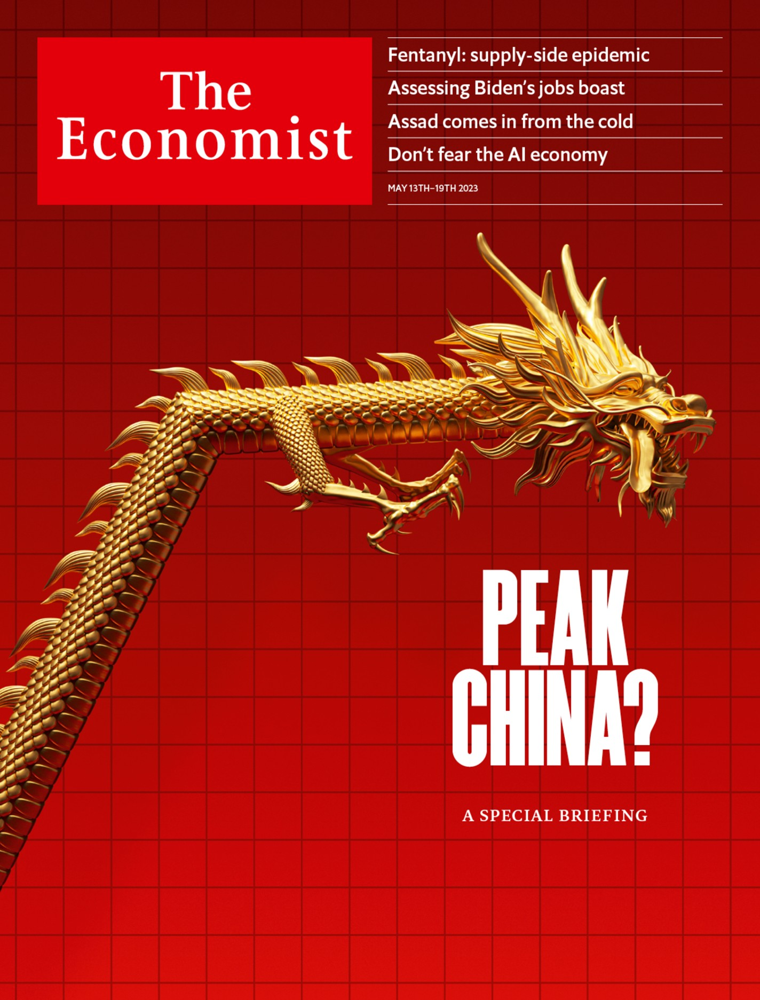

## Why predictions of an imminent economic revolution are overstated  

为什么对即将到来的经济革命的预测被夸大了

May 7th 2023 | San Francisco  

2023 年 5 月 7 日 |旧金山

The age of [“generative” artificial intelligence](https://www.economist.com/interactive/science-and-technology/2023/04/22/large-creative-ai-models-will-transform-how-we-live-and-work) has well and truly arrived. Openai’s chatbots, which use large-language-model (llm) technology, got the ball rolling in November. Now barely a day goes by without some [mind-blowing advance](https://www.economist.com/business/2023/01/30/the-race-of-the-ai-labs-heats-up). An ai\-powered song featuring a fake “Drake” and “The Weeknd” recently shook the music industry. Programs which convert text to video are making fairly convincing content.  

“生成式”人工智能时代已经真正到来。 Openai 的聊天机器人使用大型语言模型 (llm) 技术，在 11 月推出。现在几乎没有一天没有一些令人兴奋的进步。一首以假“Drake”和“The Weeknd”为特色的人工智能歌曲最近震撼了音乐界。将文本转换为视频的程序正在制作相当有说服力的内容。  

Before long consumer products such as Expedia, Instacart and OpenTable will plug into Openai’s bots, allowing people to order food or book a holiday by typing text into a box.  

不久之后，Expedia、Instacart 和 OpenTable 等消费产品将接入 Openai 的机器人，允许人们通过在框中键入文本来订餐或预订假期。  

A recently leaked presentation, reportedly from a Google engineer, suggests the tech giant is worried about how easy it is for rivals to make progress.  

据报道，谷歌工程师最近泄露的一份演示文稿表明，这家科技巨头担心竞争对手取得进步的难易程度。  

There is more to come—probably a lot more.  

还有更多——可能更多。

Listen to this story. 听听这个故事。

Enjoy more audio and podcasts on [iOS](https://economist-app.onelink.me/d2eC/bed1b25) or [Android](https://economist-app.onelink.me/d2eC/7f3c199).  

在 iOS 或 Android 上享受更多音频和播客。

Your browser does not support the <audio> element.  

您的浏览器不支持 <audio> 元素。

Listen to this story 听听这个故事

Save time by listening to our audio articles as you multitask  

在处理多项任务时通过收听我们的音频文章来节省时间

The development of ai raises profound questions. Perhaps most pressing, though, is a straightforward one. What does this mean for the economy? Many have grand expectations.  

人工智能的发展提出了深刻的问题。不过，也许最紧迫的是一个直截了当的问题。这对经济意味着什么？许多人抱有远大的期望。  

New research by Goldman Sachs, a bank, suggests that “widespread ai adoption could eventually drive a 7% or almost $7trn increase in annual global gdp over a ten-year period.” Academic studies point to a three-percentage-point rise in annual labour-productivity growth in firms that adopt the technology, which would represent a huge uplift in incomes compounded over many years.  

高盛银行的新研究表明，“人工智能的广泛采用最终可能会在十年内推动全球年度 GDP 增长 7% 或近 7 万亿美元。”学术研究表明，采用该技术的公司的劳动生产率年增长率提高了三个百分点，这意味着多年来复合收入的巨大增长。  

A study published in 2021 by Tom Davidson of Open Philanthropy, a grantmaking outfit, puts a more than 10% chance on “explosive growth”—defined as increases in global output of more than 30% a year—sometime this century.  

捐赠机构 Open Philanthropy 的汤姆·戴维森 (Tom Davidson) 于 2021 年发表的一项研究显示，本世纪某个时候出现“爆炸性增长”（定义为全球产出每年增长 30% 以上）的可能性超过 10%。  

A few economists, only half-jokingly, hold out the possibility of global incomes becoming infinite.  

一些经济学家半开玩笑地认为全球收入有可能变得无限大。

Financial markets, however, point to rather more modest outcomes. In the past year share prices of companies involved in ai have done worse than the global average, although they have risen in recent months (see chart 1). Interest rates are another clue.  

然而，金融市场指出的结果更为温和。过去一年，人工智能相关公司的股价表现低于全球平均水平，尽管最近几个月有所上涨（见图 1）。利率是另一条线索。  

If people thought that the technology was going to make everyone richer tomorrow, rates would rise because there would be less need to save. Inflation-adjusted rates and subsequent gdp growth are strongly correlated, notes research by Basil Halperin of the Massachusetts Institute of Technology (mit) and colleagues. Yet since the hype about ai began in November, long-term rates have fallen. They remain very low by historical standards. Financial markets, the researchers conclude, “are not expecting a high probability of…ai\-induced growth acceleration…on at least a 30-to-50-year time horizon.”  

如果人们认为这项技术明天会让每个人都变得更富有，那么利率就会上升，因为储蓄的需求会减少。麻省理工学院 (mit) 的 Basil Halperin 及其同事的研究指出，通货膨胀调整后的利率与随后的 GDP 增长密切相关。然而，自去年 11 月开始大肆宣传人工智能以来，长期利率已经下降。按照历史标准，它们仍然很低。研究人员得出结论，金融市场“预计……至少在 30 到 50 年的时间范围内……人工智能引起的增长加速的可能性不大。”

To judge which group is right, it is helpful to consider the history of previous technological breakthroughs. This provides succour to investors.  

要判断哪一组是正确的，考虑以前技术突破的历史是有帮助的。这为投资者提供了帮助。  

For it is difficult to make the case that a single new technology by itself has ever radically changed the economy, either for good or ill.  

因为很难证明一项新技术本身曾经从根本上改变了经济，无论是好的还是坏的。  

Even the industrial revolution of the late 1700s, which many people believe was the result of the invention of the spinning jenny, was actually caused by all sorts of factors coming together: increasing use of coal, firmer property rights, the emergence of a scientific ethos and much more besides.  

即使是 1700 年代后期的工业革命，许多人认为是珍妮纺纱机的发明，实际上也是多种因素共同作用的结果：煤炭使用的增加、产权的巩固、科学精神的出现还有更多。

Perhaps most famously, in the 1960s Robert Fogel published work about America’s railways that would later win him a Nobel Prize in economics.  

也许最著名的是，罗伯特·福格尔 (Robert Fogel) 在 1960 年代发表了有关美国铁路的著作，后来为他赢得了诺贝尔经济学奖。  

Many thought that rail transformed America’s prospects, turning an agricultural society into an industrial powerhouse.  

许多人认为铁路改变了美国的前景，将农业社会变成了工业强国。  

In fact, it had a very modest impact, Fogel found, because it replaced technology—such as canals—that would have done just about as good a job.  

Fogel 发现，事实上，它的影响非常有限，因为它取代了技术（例如运河），而这些技术本来可以做得很好。  

The level of per-person income that America achieved by January 1st 1890 would have been reached by March 31st 1890 if railways had never been invented.  

如果从未发明铁路，美国人到 1890 年 1 月 1 日达到的人均收入水平将在 1890 年 3 月 31 日达到。

Of course, no one can predict with any certainty where a technology as fundamentally unpredictable as ai will take humans. Runaway growth is not impossible; nor is technological stagnation. But you can still think through the possibilities.  

当然，没有人能够确切地预测像人工智能这样从根本上不可预测的技术将把人类带向何方。失控的增长并非不可能。技术停滞也不是。但是您仍然可以考虑各种可能性。  

And, so far at least, it seems as though Fogel’s railways are likely to be a useful blueprint. Consider three broad areas: monopolies, labour markets and productivity.  

而且，至少到目前为止，福格尔的铁路似乎很可能是一个有用的蓝图。考虑三大领域：垄断、劳动力市场和生产力。

A new technology sometimes creates a small group of people with vast economic power. John D. Rockefeller won out with oil refining and Henry Ford with cars.  

一项新技术有时会造就一小群拥有巨大经济实力的人。约翰·D·洛克菲勒 (John D. Rockefeller) 凭借炼油赢得了胜利，而亨利·福特 (Henry Ford) 凭借汽车赢得了胜利。  

Today Jeff Bezos and Mark Zuckerberg are pretty dominant thanks to tech.  

今天杰夫贝佐斯和马克扎克伯格由于科技而占据主导地位。

Many pundits expect that before long the ai industry will generate huge profits. In a recent paper Goldman’s analysts estimate in a best-case scenario generative ai could add about $430bn to annual global enterprise-software revenues. Their calculation assumes that each of the world’s 1.1bn office workers will adopt a few ai gizmos, paying around $400 in total each.  

许多权威人士预计，不久之后人工智能行业将产生巨额利润。在最近的一篇论文中，高盛的分析师估计，在最佳情况下，生成式人工智能可以为全球企业软件年收入增加约 4300 亿美元。他们的计算假设全球 11 亿上班族中的每一个人都会采用一些人工智能小玩意儿，每人总共支付约 400 美元。

Any business would be glad to capture some of this cash. But in macroeconomic terms $430bn simply does not move the dial.  

任何企业都会很高兴获得这些现金中的一部分。但从宏观经济角度来看，4300 亿美元根本没有改变表盘。  

Assume that all of the revenue turns into profits, which is unrealistic, and that all of these profits are earned in America, which is a tad more realistic.  

假设所有的收入都变成利润，这是不现实的，而所有这些利润都在美国赚取，这更现实一点。  

Even under these conditions, the ratio of the country’s pre-tax corporate profits to its gdp would rise from 12% today to 14%. That is far above the long-run average, but no higher than it was in the second quarter of 2021.  

即使在这种情况下，该国税前企业利润占国内生产总值的比率也会从今天的 12% 上升到 14%。这远高于长期平均水平，但不高于 2021 年第二季度的水平。

These profits could go to one organisation—maybe Openai. Monopolies often arise when an industry has high fixed costs or when it is hard to switch to competitors.  

这些利润可能会流向一个组织——也许是 Openai。当一个行业的固定成本很高或很难转向竞争对手时，通常会出现垄断。  

Customers had no alternative to Rockefeller’s oil, for instance, and could not produce their own. Generative ai has some monopolistic characteristics. gpt\-4, one of Openai’s chatbots, reportedly cost more than $100m to train, a sum few firms have lying around.  

例如，客户无法替代洛克菲勒的石油，也无法生产自己的石油。生成式人工智能具有一些垄断特征。 gpt-4 是 Openai 的聊天机器人之一，据报道其训练成本超过 1 亿美元，很少有公司能做到这一点。  

There is also a lot of proprietary knowledge about data for training the models, not to mention user feedback.  

还有很多关于训练模型的数据的专有知识，更不用说用户反馈了。

There is, however, little chance of a single company bestriding the entire industry.  

然而，一家公司超越整个行业的可能性很小。  

More likely is that a modest number of big firms compete with one another, as happens in aviation, groceries and search engines. No ai product is truly unique since all use similar models. This makes it easier for a customer to switch from one to another.  

更有可能的是，少数大公司相互竞争，就像在航空、杂货和搜索引擎领域发生的那样。没有任何人工智能产品是真正独一无二的，因为它们都使用相似的模型。这使客户更容易从一个切换到另一个。  

The computing power behind the models is also fairly generic.  

模型背后的计算能力也相当通用。  

Much of the code, as well as tips and tricks, is freely available online, meaning that amateurs can produce their own models—often with strikingly good results.  

大部分代码以及提示和技巧都可以在线免费获得，这意味着业余爱好者可以制作自己的模型——通常效果非常好。

“There don’t appear, today, to be any systemic moats in generative ai,” a team at Andreessen Horowitz, a venture-capital firm, has argued.  

“如今，生成式人工智能似乎没有任何系统性的护城河，”风险投资公司安德森霍洛维茨基金的一个团队表示。  

The recent leak purportedly from Google reaches a similar conclusion: “The barrier to entry for training and experimentation has dropped from the total output of a major research organisation to one person, an evening, and a beefy laptop.” Already there are a few generative-ai firms worth more than $1bn. The biggest corporate winner so far from the new ai age is not even an ai company. At [Nvidia](https://www.economist.com/business/2021/08/01/will-nvidias-huge-bet-on-artificial-intelligence-chips-pay-off), a computing firm which powers AI models, revenue from data centres is soaring.  

最近据称来自谷歌的泄密事件得出了类似的结论：“进入培训和实验的门槛已经从一个主要研究机构的总产出下降到一个人、一个晚上和一台功能强大的笔记本电脑。”已经有几家市值超过 10 亿美元的生成式人工智能公司。迄今为止，新人工智能时代最大的企业赢家甚至都不是人工智能公司。在为人工智能模型提供支持的计算公司 Nvidia，来自数据中心的收入正在飙升。

## Yeah, but what about me? 是的，但我呢？

Although generative ai might not create a new class of robber barons, to many people that will be cold comfort.  

虽然生成式人工智能可能不会创造出一个新的强盗大亨阶层，但对许多人来说，这将是一种冷酷的安慰。  

They are more concerned with their own economic prospects—in particular, whether their job will disappear. Terrifying predictions abound. Tyna Eloundou of OpenAI and colleagues have estimated that “around 80% of the us workforce could have at least 10% of their work tasks affected by the introduction of llms”. Edward Felten of Princeton University and colleagues conducted a similar exercise.  

他们更关心自己的经济前景——尤其是他们的工作是否会消失。可怕的预言比比皆是。 Openai 的 Tyna Eloundou 及其同事估计，“大约 80% 的美国劳动力至少有 10% 的工作任务会受到 LLMS 的影响”。普林斯顿大学的 Edward Felten 及其同事进行了类似的研究。  

Legal services, accountancy and travel agencies came out at or near the top of professions most likely to face disruption.  

法律服务、会计和旅行社在最有可能面临颠覆的行业中名列前茅或接近前列。

Economists have issued gloomy predictions before. In the 2000s many feared the impact of outsourcing on rich-world workers.  

经济学家此前曾发布过悲观的预测。在 2000 年代，许多人担心外包对富裕世界工人的影响。  

In 2013 two at Oxford University issued a widely cited paper that suggested automation could wipe out 47% of American jobs over the subsequent decade or so.  

2013 年，牛津大学的两人发表了一篇被广泛引用的论文，指出自动化可能会在接下来的十年左右消灭 47% 的美国工作岗位。  

Others made the case that, even without widespread unemployment, there would be “hollowing out”, where rewarding, well-paid jobs disappeared and mindless, poorly paid roles took their place.  

其他人则认为，即使没有普遍失业，也会出现“空心化”，即有回报、高薪的工作消失，取而代之的是无脑、低薪的工作。

What actually happened took people by surprise. In the past decade the average rich-world unemployment rate has roughly halved (see chart 2).  

实际发生的事情让人们大吃一惊。在过去十年中，发达国家的平均失业率大约减半（见图 2）。  

The share of working-age people in employment is at an all-time high.  

工作年龄人口的就业比例处于历史最高水平。  

Countries with the highest rates of automation and robotics, such as Japan, Singapore and South Korea, have the least unemployment.  

日本、新加坡和韩国等自动化和机器人技术普及率最高的国家失业率最低。  

A recent study by America’s Bureau of Labour Statistics found that in recent years jobs classified as “at risk” from new technologies “did not exhibit any general tendency toward notably rapid job loss”.  

美国劳工统计局最近的一项研究发现，近年来被归类为新技术“有风险”的工作“没有表现出任何明显快速失业的普遍趋势”。  

Evidence for “hollowing out” is mixed. Measures of job satisfaction rose during the 2010s.  

“掏空”的证据好坏参半。工作满意度指标在 2010 年代有所上升。  

For most of the past decade the poorest Americans have seen faster wage growth than the richest ones.  

在过去十年的大部分时间里，最贫穷的美国人的工资增长速度快于最富有的人。

This time could be different. The share price of Chegg, a firm which provides homework help, recently fell by half after it admitted Chatgpt was “having an impact on our new customer growth rate”. The chief executive of ibm, a big tech firm, said that the company expects to pause hiring for roles that could be replaced by AI in the coming years. But are these early signs a tsunami is about to hit? Perhaps not.  

这次可能会有所不同。提供家庭作业帮助的公司 Chegg 的股价最近下跌了一半，因为它承认 Chatgpt “对我们的新客户增长率产生了影响”。大型科技公司 IBM 的首席执行官表示，该公司预计将在未来几年暂停招聘可能被人工智能取代的职位。但这些是海啸即将袭击的早期迹象吗？也许不是。

Imagine a job disappears when ai automates more than 50% of the tasks it encompasses. Or imagine that workers are eliminated in proportion to the total share of economywide tasks that are automated.  

想象一下，当 AI 将超过 50% 的任务自动化时，工作就会消失。或者想象一下，工人被淘汰的比例与经济范围内自动化任务的总份额成正比。  

In either case this would, following Ms Eloundou’s estimates, result in a net loss of around 15% of American jobs.  

在任何一种情况下，根据 Eloundou 女士的估计，这将导致美国约 15% 的工作岗位净流失。  

Some folk could move to industries experiencing worker shortages, such as hospitality.  

一些人可能会转向工人短缺的行业，例如酒店业。  

But a big rise in the unemployment rate would surely follow—in line, maybe, with the 15% briefly reached in America during the worst of the covid-19 pandemic in 2020.  

但失业率肯定会随之大幅上升——也许与美国在 2020 年 covid-19 大流行最严重期间短暂达到 15% 的水平一致。

Yet this scenario is unlikely to come to pass: history suggests job destruction happens far more slowly.  

然而，这种情况不太可能发生：历史表明，失业发生的速度要慢得多。  

The automated telephone switching system—a replacement for human operators—was invented in 1892. It took until 1921 for the Bell System to install their first fully automated office.  

自动电话交换系统——人工接线员的替代品——于 1892 年发明。直到 1921 年，Bell System 才安装了他们的第一个全自动办公室。  

Even after this milestone, the number of American telephone operators continued to grow, peaking in the mid-20th century at around 350,000. The occupation did not (mostly) disappear until the 1980s, nine decades after automation was invented. ai will take less than 90 years to sweep the labour market: llms are easy to use, and many experts are astonished by the speed at which the general public has incorporated Chatgpt into their lives. But reasons for the slow adoption of technology in workplaces will also apply this time around.  

即使在这一里程碑之后，美国电话接线员的数量仍在继续增长，在 20 世纪中叶达到顶峰，约为 350,000。直到 1980 年代，也就是自动化发明九年后，这项职业才（大部分）消失。人工智能将用不到 90 年的时间席卷劳动力市场：LLMS 易于使用，许多专家对普通大众将 Chatgpt 融入他们生活的速度感到惊讶。但是，这一次在工作场所采用技术缓慢的原因也适用。

In a recent essay Mark Andreessen of Andreessen Horowitz outlined some of them. His argument focuses on regulation.  

在最近的一篇文章中，Andreessen Horowitz 的 Mark Andreessen 概述了其中的一些。他的论点侧重于监管。  

In bits of the economy with heavy state involvement, such as education and health care, technological change tends to be pitifully slow.  

在国家大量参与的经济领域，例如教育和医疗保健，技术变革往往缓慢得可怜。  

The absence of competitive pressure blunts incentives to improve.  

缺乏竞争压力会削弱改进的动力。  

Governments may also have public-policy goals, such as maximising employment levels, which are inconsistent with improved efficiency.  

政府也可能有公共政策目标，例如最大化就业水平，这与提高效率不一致。  

These industries are also more likely to be unionised—and unions are good at preventing job losses.  

这些行业也更有可能成立工会——工会擅长防止失业。

Examples abound.  

Train drivers on London’s publicly run Underground network are paid close to twice the national median, even though the technology to partially or wholly replace them has existed for decades.  

伦敦公共运营的地铁网络的火车司机的工资接近全国中位数的两倍，尽管部分或全部取代他们的技术已经存在了几十年。  

Government agencies require you to fill in paper forms providing your personal information again and again. In San Francisco, the global centre of the ai surge, real-life cops are still employed to direct traffic during rush hour.  

政府机构要求您一次又一次地填写纸质表格以提供您的个人信息。在人工智能浪潮的全球中心旧金山，现实生活中的警察仍然在高峰时段受雇指挥交通。

## Au revoir!

Many of the jobs at risk from ai are in heavily regulated sectors. Return to the paper by Mr Felten of Princeton University. Fourteen of the top 20 occupations most exposed to ai are teachers (foreign-language ones are near the top; geographers are in a slightly stronger position). But only the bravest government would replace teachers with ai. Imagine the headlines. The same goes for cops and crime-fighting ai. The fact that Italy has already temporarily blocked Chatgpt over privacy concerns, with France, Germany and Ireland said to be considering the option, shows how worried governments are about the job-destructive effects of ai.  

许多面临人工智能风险的工作都在受到严格监管的行业。回到普林斯顿大学 Felten 先生的论文。在接触人工智能最多的前 20 个职业中，有 14 个是教师（外语职业接近榜首；地理学家处于稍强的位置）。但只有最勇敢的政府才会用人工智能取代教师。想象一下头条新闻。警察和打击犯罪的人工智能也是如此。事实上，意大利已经出于隐私问题暂时阻止了 Chatgpt，据称法国、德国和爱尔兰正在考虑这一选择，这表明政府对人工智能破坏就业的影响有多么担忧。

Perhaps, in time, governments will allow some jobs to be replaced.  

或许，政府最终会允许更换一些工作。  

But the delay will make space for the economy to do what it always does: create new types of jobs as others are eliminated.  

但延迟将为经济腾出空间来做它一直在做的事情：在其他人被淘汰的同时创造新的工作类型。  

By lowering costs of production, new tech can create more demand for goods and services, boosting jobs that are hard to automate. A paper published in 2020 by David Autor of mit and colleagues offered a striking conclusion. About 60% of the jobs in America did not exist in 1940. The job of “fingernail technician” was added to the census in 2000. “Solar photovoltaic electrician” was added just five years ago. The ai economy is likely to create new occupations which today cannot even be imagined.  

通过降低生产成本，新技术可以创造更多的商品和服务需求，增加难以自动化的工作。麻省理工学院的 David Autor 及其同事在 2020 年发表的一篇论文给出了一个惊人的结论。美国大约60%的工作岗位在1940年还不存在。2000年人口普查中增加了“指甲技师”的工作，五年前才增加了“太阳能光伏电工”。人工智能经济很可能会创造出今天甚至无法想象的新职业。

Modest labour-market effects are likely to translate into a modest impact on productivity—the third factor.  

适度的劳动力市场影响可能会转化为对生产率的适度影响——第三个因素。  

Adoption of electricity in factories and households began in America towards the end of the 19th century. Yet there was no productivity boom until the end of the first world war.  

美国于 19 世纪末开始在工厂和家庭中采用电力。然而，直到第一次世界大战结束后，生产力才出现繁荣。  

The personal computer was invented in the 1970s. This time the productivity boom followed more quickly—but it still felt slow at the time.  

个人电脑是在 20 世纪 70 年代发明的。这一次生产力的繁荣来得更快——但当时感觉仍然很慢。  

In 1987 Robert Solow, an economist, famously declared that the computer age was “everywhere except for the productivity statistics”.  

1987 年，经济学家罗伯特·索洛 (Robert Solow) 著名地宣称，计算机时代“无处不在，除了生产力统计数据”。

The world is still waiting for a productivity surge linked to recent innovations.  

世界仍在等待与近期创新相关的生产力激增。  

Smartphones have been in widespread use for a decade, billions of people have access to superfast internet and many workers now shift between the office and home as it suits them.  

智能手机已经广泛使用了十年，数十亿人可以访问超高速互联网，许多员工现在可以根据自己的需要在办公室和家里之间转换。  

Official surveys show that well over a tenth of American employees already work at firms using ai of some kind, while unofficial surveys point to even higher numbers. Still, though, global productivity growth remains weak.  

官方调查显示，超过十分之一的美国员工已经在使用某种人工智能的公司工作，而非官方调查表明这一数字更高。尽管如此，全球生产率增长仍然疲软。

ai could eventually make some industries vastly more productive. A paper by Erik Brynjolfsson of Stanford University and colleagues examines customer-support agents. Access to an ai tool raises the number of issues resolved each hour by 14% on average. Researchers themselves could also become more efficient: gpt\-x may give them an unlimited number of almost-free research assistants. Others hope ai will eliminate administrative inefficiencies in health care, reducing costs.  

人工智能最终可以使一些行业的生产力大大提高。斯坦福大学的 Erik Brynjolfsson 及其同事撰写的一篇论文研究了客户支持代理。使用人工智能工具可以使每小时解决的问题数量平均增加 14%。研究人员本身也可以变得更有效率：gpt-x 可以为他们提供无限数量的几乎免费的研究助理。其他人则希望人工智能能够消除医疗保健领域的行政低效，降低成本。

But there are many things beyond the reach of ai. Blue-collar work, such as construction and farming, which accounts for about 20% of rich-world gdp, is one example. An llm is of little use to someone picking asparagus. It could be of some use to a plumber fixing a leaky tap: a widget could recognise the tap, diagnose the fault and advise on fixes.  

但是有很多事情是人工智能无法企及的。建筑业和农业等蓝领工作约占发达国家 GDP 的 20%，就是一个例子。 LLM 对于采摘芦笋的人来说用处不大。它可能对修理漏水水龙头的水管工有用：一个小部件可以识别水龙头、诊断故障并提出修复建议。  

Ultimately, though, the plumber still has to do the physical work.  

但最终，水管工仍需完成体力劳动。  

So it is hard to imagine that, in a few years’ time, blue-collar work is going to be much more productive than it is now.  

所以很难想象，在几年后，蓝领工作的生产力会比现在高得多。  

The same goes for industries where human-to-human contact is an inherent part of the service, such as hospitality and medical care.  

人与人之间的接触是服务固有部分的行业也是如此，例如酒店和医疗保健。

ai also cannot do anything about the biggest thing holding back rich-world productivity growth: [misfiring planning systems](https://www.economist.com/special-report/2020/01/16/housing-is-at-the-root-of-many-of-the-rich-worlds-problems). When the size of cities is constrained and housing costs are high, people cannot live and work where they are most efficient.  

人工智能对阻碍富裕世界生产力增长的最大因素也无能为力：计划系统失灵。当城市规模受限且住房成本高昂时，人们无法在最有效率的地方生活和工作。  

No matter how many brilliant new ideas your society may have, they are functionally useless if you cannot build them in a timely manner. It is up to governments to defang nimbys. Technology is neither here nor there. The same goes for energy, where permitting and infrastructure are what keep costs uncomfortably high.  

无论你的社会有多少绝妙的新想法，如果你不能及时建立它们，它们在功能上都是无用的。消除邻避的责任取决于政府。技术既不存在也不存在。能源也是如此，许可和基础设施使成本高得令人不安。

It is even possible that the ai economy could become less productive. Look at some recent technologies. Smartphones allow instant communication, but they can also be a distraction.  

人工智能经济甚至有可能变得不那么高效。看看最近的一些技术。智能手机允许即时通信，但它们也可能会分散注意力。  

With email you are connected 24/7, which can make it hard to focus. A paper in 2016 by researchers at the University of California at Irvine, Microsoft Research and mit found that “the longer daily time spent on email, the lower was perceived productivity”.  

使用电子邮件，您可以 24/7 全天候连接，这会让您难以集中注意力。加州大学尔湾分校、微软研究院和麻省理工学院的研究人员在 2016 年发表的一篇论文发现，“每天花在电子邮件上的时间越长，人们的工作效率就越低”。  

Some bosses now believe that working from home, once seen as a productivity-booster, gives too many people the excuse to slack off.  

一些老板现在认为，曾经被视为提高生产力的在家工作给了太多人懈怠的借口。

Generative ai itself could act as a drain on productivity. What happens, for instance, if ai can create entertainment perfectly tailored to your every desire?  

生成式人工智能本身可能会消耗生产力。例如，如果人工智能可以根据你的每一个愿望创造完美的娱乐活动，会发生什么？  

Moreover, few people have thought through the implications of a system that can generate vast amounts of text instantly. gpt\-4 is a godsend for a nimby facing a planning application. In five minutes he can produce a well written 1,000-page objection. Someone then has to respond to it. Spam emails are going to be harder to detect.  

此外，很少有人想过可以立即生成大量文本的系统的含义。 gpt-4 是面向规划应用程序的 nimby 的天赐之物。他可以在五分钟内提出一份长达 1,000 页的书面反对意见。然后必须有人回应它。垃圾邮件将更难检测。  

Fraud cases could soar. Banks will need to spend more on preventing attacks and compensating people who lose out.  

欺诈案件可能会激增。银行将需要花更多的钱来防止攻击和补偿遭受损失的人。

## Just what we need 正是我们所需要的

In an ai\-heavy world lawyers will multiply.  

在人工智能繁多的世界里，律师会成倍增加。  

“In the 1970s you could do a multi-million-dollar deal on 15 pages because retyping was a pain in the ass,” says Preston Byrne of Brown Rudnick, a law firm. “ai will allow us to cover the 1,000 most likely edge cases in the first draft and then the parties will argue over it for weeks.” A rule of thumb in America is that there is no point suing for damages unless you hope for $250,000 or more in compensation, since you need to spend that much getting to court.  

“在 1970 年代，你可以在 15 页纸上做一笔价值数百万美元的交易，因为重新打字是一件很痛苦的事情，”律师事务所 Brown Rudnick 的普雷斯顿伯恩说。 “人工智能将使我们能够在初稿中涵盖 1,000 个最有可能的边缘案例，然后双方将为此争论数周。”美国的一个经验法则是，除非您希望获得 250,000 美元或更多的赔偿，否则没有必要起诉损害赔偿，因为您需要花那么多钱去法庭。  

Now the costs of litigation could fall to close to zero. Meanwhile, teachers and editors will need to check that everything they read has not been composed by an ai. Openai has released a program that allows you to do this. It is thus providing the world a solution to a problem that its technology has created.  

现在，诉讼成本可能降至接近于零。同时，教师和编辑需要检查他们阅读的所有内容是否由人工智能编写。 Openai 发布了一个程序，允许您执行此操作。因此，它为世界提供了解决其技术造成的问题的方法。

ai may change the world in ways that today are impossible to imagine. But this is not quite the same thing as turning the economy upside down.  

人工智能可能会以今天无法想象的方式改变世界。但这与扭转经济局面并不完全相同。  

Fogel wrote that his argument was “aimed not at refuting the view that the railroad played a decisive role in American development during the 19th century, but rather at demonstrating that the empirical base on which this view rests is not nearly so substantial as is usually presumed”.  

福格尔写道，他的论点“不是为了驳斥铁路在 19 世纪美国发展中发挥决定性作用的观点，而是为了证明这一观点所依据的经验基础并不像通常假定的那样可靠”。  

Some time in the mid-21st century a future Nobel prizewinner, examining generative ai, may well reach the same conclusion. ■  

在 21 世纪中叶的某个时候，一位未来的诺贝尔奖获得者在研究生成式人工智能时，很可能会得出相同的结论。 ■

_For more expert analysis of the biggest stories in economics, finance and markets, sign up to [Money Talks](https://www.economist.com/moneytalks/&amp;source=gmail&amp;ust=1628284234418000&amp;usg=AFQjCNGviR-zkpwefPKZAIJbeHx5M_SGCQ%22%20data-analytics=), our weekly subscriber-only newsletter.  

如需对经济、金融和市场重大新闻的更多专家分析，请订阅我们的仅限订阅者的每周时事通讯 Money Talks。_

This article appeared in the Finance & economics section of the print edition under the headline "Your new colleague"  

这篇文章出现在印刷版的财经版块，标题为“你的新同事”

### From the May 13th 2023 edition  

从 2023 年 5 月 13 日起

Discover stories from this section and more in the list of contents  

发现本节中的故事以及目录中的更多内容

[Explore the edition  探索版本](https://www.economist.com/printedition/2023-05-13)
