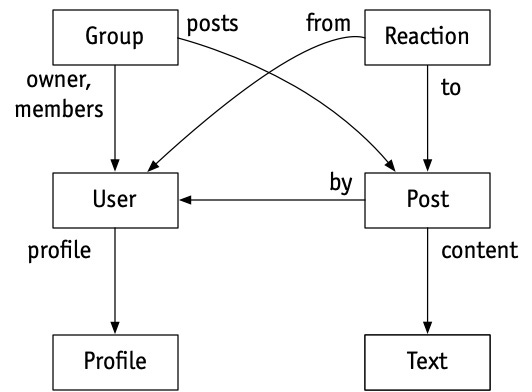
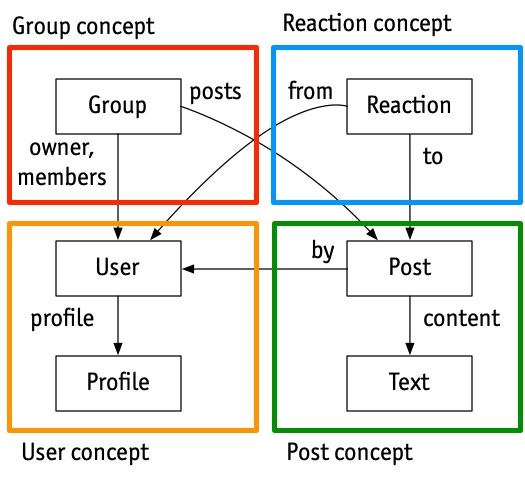
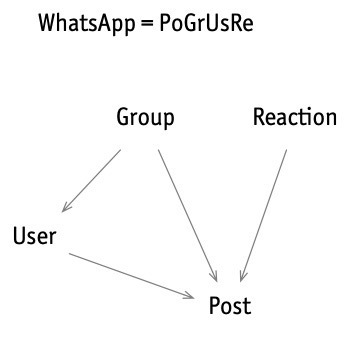

## Concept design in three easy steps  

三步轻松完成概念设计

### A semi-formal way to think about software  

一种考虑软件的半正式方式

[](https://substack.com/profile/108798544-daniel-jackson)

_A couple of months ago, I discovered a fascinating book, **[The Essence of Software](https://essenceofsoftware.com/)** by **[Prof. Daniel Jackson](http://people.csail.mit.edu/dnj/).** It describes a semi-formal method called “concept design”.  

几个月前，我发现了一本引人入胜的书，丹尼尔·杰克逊教授的《软件的本质》。它描述了一种称为“概念设计”的半正式方法。_

_The concept design method is adjacent to many of the themes that inspire me—Christopher Alexander’s [design patterns](https://en.wikipedia.org/wiki/Design_pattern), the [design science movement](https://en.wikipedia.org/wiki/Design_science), [category theory](https://arxiv.org/abs/1803.05316), [design grammars](https://subconscious.substack.com/p/provoking-emergence-with-alphabets), methods as tools for thought…  

概念设计方法与许多启发我的主题密切相关——Christopher Alexander 的设计模式、设计科学运动、类别理论、设计语法、作为思维工具的方法……_

_I’ve been chatting back and forth with Daniel and am delighted to have him share a couple of guest posts. This week Daniel will share the concepts method.  

Next, we’ll build a concept map of the [Noosphere protocol](https://subconscious.substack.com/p/noosphere-a-protocol-for-thought). I hope you enjoy it!  

我一直在和 Daniel 来回聊天，很高兴让他分享一些客座帖子。本周大牛将分享概念方法。接下来，我们将构建一个 Noosphere 协议的概念图。我希望你喜欢它！_

I’m a big fan of Gordon’s work and writings, so I’m delighted to have the chance to contribute a post about my own work to his blog and to engage with you, his readers.  

我是 Gordon 的作品和著作的忠实粉丝，所以我很高兴有机会在他的博客上发表一篇关于我自己作品的文章，并与你，他的读者互动。

I’ve spent the last ten years or so looking at hundreds of apps, trying to figure out what software design is all about. The result of my explorations is _concept design_: a new lens for thinking about software, how it’s designed, constructed and used.  

在过去十年左右的时间里，我研究了数百个应用程序，试图弄清楚软件设计到底是什么。我探索的结果是概念设计：一种思考软件及其设计、构造和使用方式的新视角。

Viewing software design through this lens can improve the quality of the software you build, for both developers and users, and bridge the gap between UX and engineering (which are often [siloed](https://essenceofsoftware.com/posts/ux-design-silo/) into different roles). You can think of it as a computational take on UX design.  

从这个角度来看软件设计可以为开发人员和用户提高您构建的软件的质量，并弥合用户体验和工程（通常被分为不同的角色）之间的差距。您可以将其视为对 UX 设计的计算。

I call it a “new” lens, because adopting it dramatically changes the way most software design happens. But in some sense it’s not new at all.  

我称之为“新”镜头，因为采用它会极大地改变大多数软件设计的方式。但从某种意义上说，它一点也不新鲜。  

It makes explicit what I suspect the best designers have always done, and it distills and combines some ideas that have been floating around for a long time.  

它明确了我认为最好的设计师一直在做的事情，它提炼并结合了一些长期存在的想法。

I’ll explain concept design in three stages, each of which suggests adopting a different perspective on design from the conventional one.  

我将分三个阶段解释概念设计，每个阶段都建议采用与传统设计不同的设计视角。

Stage One is the least radical, but it’s important to grasp it before moving on: _view the design of software as the shaping of its functionality_.  

第一阶段是最不激进的，但在继续之前掌握它很重要：将软件设计视为其功能的塑造。

This might sound obvious, but it’s not what people actually do.  

Functionality is what the software does, not how it does it (which is what software architecture is about), or how it’s presented (which is what UI design is about).  

It’s the most basic starting point, because you can’t think about code until you know what function it should implement, and you can’t think about a UI until you know what functions the UI should support.  

In practice, the functionality is often implicit and apps are “designed” by starting with code fragments or wireframes. Being explicit about what we’re actually [designing](https://essenceofsoftware.com/tutorials/design-general/design-vs-engineering/) is the first stage.  

这听起来很明显，但这并不是人们实际做的。功能是软件做什么，而不是它如何做（这是软件架构的重点），或者它是如何呈现的（这是 UI 设计的重点）。这是最基本的出发点，因为只有知道代码应该实现什么功能才能考虑代码，只有知道 UI 应该支持什么功能才能考虑 UI。在实践中，功能通常是隐式的，应用程序是从代码片段或线框图开始“设计”的。明确我们实际设计的是第一阶段。

So imagine we’re designing a social media app—call it _WhatsUp_—that lets users post in groups. As we’re evolving the design, we’ll need a way to describe the functionality we have in mind. How do we do that?  

因此，想象一下我们正在设计一款社交媒体应用程序（称之为 WhatsUp），让用户可以分组发帖。随着我们不断改进设计，我们需要一种方法来描述我们想到的功能。我们该怎么做？

We could start by defining the set of states: there are users, groups and posts; posts are by users and divided into groups; users can be members of multiple groups.  

我们可以从定义一组状态开始：有用户、组和帖子；帖子按用户分组；用户可以是多个组的成员。  

We can explore these states more precisely by considering candidate invariants (“integrity constraints” in database lingo) as design questions: Must a post belong to exactly one group?  

我们可以通过将候选不变量（数据库术语中的“完整性约束”）视为设计问题来更精确地探索这些状态：帖子必须属于一个组吗？  

Must a post be from a member of the group it’s in?  

帖子必须来自其所在组的成员吗？

[](https://substackcdn.com/image/fetch/f_auto,q_auto:good,fl_progressive:steep/https%3A%2F%2Fsubstack-post-media.s3.amazonaws.com%2Fpublic%2Fimages%2F62ad45c4-eefb-4214-8616-c37bbb7f14e1_532x392.jpeg)

_The state space of WhatsUp, shown as an ER diagram  

WhatsUp 的状态空间，显示为 ER 图_

Then we can list the actions that users can perform: _create_, _delete_, _join_ and _leave_ a group; _add_ a post to a group; _reply_ to a post; etc.  

然后我们可以列出用户可以执行的操作：创建、删除、加入和离开群组；向群组添加帖子；回复帖子； ETC。

The beauty of this scheme is that just by writing down the state and invariants you’re describing a whole (infinite!) _set_ of possible behaviors.  

A good designer can see through a seemingly straightforward invariant to the impacts it will have on the behavior (and even the software architecture), so the design of the state becomes a powerful design tool in its own right.  

Suppose we say that the posts _in_ a group must be _by_ members of that same group. Then what happens if a user leaves a group?  

Presumably their posts will have to be deleted, and that will have complicated consequences if there are replies.  

这个方案的美妙之处在于，只需写下状态和不变量，您就可以描述一整套（无限！）可能的行为。一个好的设计者可以看穿一个看似简单的不变量对行为（甚至软件架构）的影响，因此状态设计本身就成为了一个强大的设计工具。假设我们说群组中的帖子必须由同一群组的成员发表。那么如果用户离开群组会怎样？据推测，他们的帖子将不得不被删除，如果有回复，这将产生复杂的后果。

The state also acts as a measure of complexity: sometimes you’ll consider some behavior and realize it needs a richer state.  

For example, we might want to ensure that users can only see posts in a group that were added _after_ they joined. If so, the state will have to include not only dates for posts but also dates of joining for users.  

状态还可以作为复杂性的衡量标准：有时您会考虑某些行为并意识到它需要更丰富的状态。例如，我们可能希望确保用户只能看到他们加入后添加的群组中的帖子。如果是这样，该州不仅必须包括帖子的日期，还必须包括用户的加入日期。

Describing an app in terms of [states and actions](https://essenceofsoftware.com/tutorials/concept-basics/apps-are-state-machines/) is pretty challenging, and the work is often worth it. But doing it for the whole app still seems like a daunting task. Is there any way to break the task down and make it simpler?  

用状态和动作来描述应用程序非常具有挑战性，但这项工作通常是值得的。但是为整个应用程序做这件事似乎仍然是一项艰巨的任务。有什么方法可以分解任务并使其更简单吗？

Stage Two involves the most fundamental move, in which we bring some modular structure to an app’s functionality.  

第二阶段涉及最基本的举措，我们将一些模块化结构引入应用程序的功能。

When I introduced _WhatsUp_, I described it as an app that “lets users post in groups.” You may wonder: Why isn’t that enough? You understood what I meant because you’re already familiar with the [concepts](https://essenceofsoftware.com/tutorials/concept-basics/apps-made-of-concepts/) I’m alluding to. The concept of _Group_, for example, is present in many social media apps, and goes back to the earliest chat apps (such as IRC). I could have called it _ChatRoom_ instead.  

当我介绍 WhatsUp 时，我将其描述为“让用户在群组中发帖”的应用程序。您可能想知道：为什么这还不够？你明白我的意思，因为你已经熟悉我提到的概念。例如，Group 的概念出现在许多社交媒体应用程序中，并且可以追溯到最早的聊天应用程序（例如 IRC）。我本可以将其称为 ChatRoom。

What kind of “concept” is _Group_? To a philosopher, a concept is a kind of category or classification: the concept of _Dog_ corresponds to the set of all things that are dogs. Applied to software, this line of thinking leads to concept lattices and ontologies.  

It’s useful, but I don’t believe it’s what matters most. To a software design, a concept is about _behavior_: a _Group_ is something you join and leave and post to.  

Group是个什么“概念”？对于哲学家来说，概念是一种类别或分类：狗的概念对应于所有狗的集合。应用于软件，这种思路导致概念格和本体论。它很有用，但我认为这不是最重要的。对于软件设计，概念是关于行为的：组是您加入、离开和发布的东西。

In my approach to concept design, a concept is a small service with its own API defined by its actions.  

在我的概念设计方法中，概念是一种小型服务，具有由其操作定义的自己的 API。  

I sometimes use the term “nanoservice” because a concept is like a microservice but smaller and more tightly focused.  

我有时会使用“纳米服务”这个术语，因为一个概念就像微服务，但更小，更专注。  

(And, as we’ll see, unlike a microservice, a concept is designed to be independent of other concepts.)  

（而且，正如我们将看到的，与微服务不同，概念被设计为独立于其他概念。）

At the same time, a concept is a social protocol describing the rules of the game for the users: that you have to join the group before you can post in it, for example.  

All software concepts are inventions. Some of them were designed within software, and so they impose protocols on users; the _Password_ concept, for example. May of them were designed first as social protocols in the world, and were then adopted by software; the _Reservation_ concept, for example, (at least as applied to restaurants) was invented in the 19th century, long before OpenTable!  

同时，概念是为用户描述游戏规则的社交协议：例如，您必须先加入群组才能在群组中发帖。所有软件概念都是发明。其中一些是在软件中设计的，因此它们将协议强加给用户；例如，密码概念。其中可能首先被设计为世界上的社交协议，然后被软件采用；例如，预订概念（至少应用于餐厅）是在 19 世纪发明的，远早于 OpenTable！

How to define the behavior of a concept? States and actions, just as we might have done for the app as a whole.  

But the difference is that now we have some structure: each concept has its _own_ local state and actions. So the grouping of posts is part of the _Group_ concept state, and the content of posts can be part of _Post_, a different concept. Joining and leaving are actions of _Group_; editing a post is an action of _Post_. Different designers (or different teams) can work on different concepts, allowing modular design of the functionality.  

如何定义一个概念的行为？状态和动作，就像我们可能对整个应用程序所做的那样。但不同的是，现在我们有了一些结构：每个概念都有自己的局部状态和动作。所以帖子的分组是Group概念状态的一部分，帖子的内容可以是Post的一部分，一个不同的概念。加入和离开是Group的动作；编辑帖子是 Post 的一个动作。不同的设计师（或不同的团队）可以处理不同的概念，从而允许功能的模块化设计。

[](https://substackcdn.com/image/fetch/f_auto,q_auto:good,fl_progressive:steep/https%3A%2F%2Fsubstack-post-media.s3.amazonaws.com%2Fpublic%2Fimages%2F85e16d9d-84cf-4cd1-abf1-a485c2f8d560_525x487.jpeg)

_The state of WhatsUp factored into concepts: each concept has its own state space.  

WhatsUp 的状态会影响概念：每个概念都有自己的状态空间。_

Now here’s where concept design diverges from current perspectives on design (such as “design thinking”).  

现在这里是概念设计与当前设计观点（例如“设计思维”）不同的地方。  

My claim is that if you look at most apps, you’ll find that they are composed of conventional concepts that appear in many other apps.  

我的主张是，如果你查看大多数应用程序，你会发现它们由出现在许多其他应用程序中的常规概念组成。  

That’s how we’re able to switch so easily from one social media app to another, for example.  

例如，这就是我们能够如此轻松地从一个社交媒体应用程序切换到另一个应用程序的原因。

This means that design, for the most part, isn’t about inventing a completely new set of behaviors from whole cloth.  

这意味着设计在很大程度上并不是要从整块布料中发明一套全新的行为。  

Rather, it’s about deciding which standard concepts to use, and then how to fit them together.  

相反，它是关于决定使用哪些标准概念，然后如何将它们组合在一起。  

Novelty comes from putting existing concepts together in new ways, and occasionally from introducing brand new concepts.  

新颖性来自于以新的方式将现有概念组合在一起，偶尔也来自于引入全新的概念。

Apps are like molecules that have different characteristics but are built from the same atoms. So we can think of WhatsApp as the molecule PoGrUsRe (_Post_ + _Group_ + _User_ + _Reaction_); Facebook as PoFrUsUpRe (_Post_ + _Friend_ + _User_ + _Upvote_ + _Reaction_); Twitter as PoFoUsUpHa (_Post_ + _Follower_ + _User_ + _Upvote_ + _Hashtag_); and so on.  

应用程序就像具有不同特性但由相同原子构建的分子。所以我们可以把 WhatsApp 看作分子 PoGrUsRe (Post + Group + User + Reaction)； Facebook 作为 PoFrUsUpRe（发帖 + 好友 + 用户 + 投票 + 反应）； Twitter 作为 PoFoUsUpHa（帖子 + 关注者 + 用户 + 赞成 + 标签）；等等。

[](https://substackcdn.com/image/fetch/f_auto,q_auto:good,fl_progressive:steep/https%3A%2F%2Fsubstack-post-media.s3.amazonaws.com%2Fpublic%2Fimages%2F3cfb8127-aaaf-47af-ba3b-ca2a05100f96_352x340.jpeg)

_The WhatsApp molecule and its structure: the [graph](https://essenceofsoftware.com/posts/distillation/#concept-dependence-diagrams) defines a family of apps, with an arrow from concept A to concept B meaning that any (subset) app in the family that contains A will contain B too_.  

WhatsApp 分子及其结构：该图定义了一个应用程序家族，从概念 A 到概念 B 的箭头意味着包含 A 的家族中的任何（子集）应用程序也将包含 B。

How does this change the design process? It means that your first step is to figure out if some existing concepts will do the job.  

这如何改变设计过程？这意味着您的第一步是弄清楚一些现有的概念是否可以完成这项工作。  

You might want to adjust them, or even add some new concepts. You won’t need to elaborate the states and actions of most of the concepts because you know them already.  

您可能想要调整它们，甚至添加一些新概念。您不需要详细说明大多数概念的状态和操作，因为您已经知道它们。

You might wonder if this makes design less creative. I’d argue that it makes it _more_ creative, because you spend less time reinventing the wheel and more time focusing on the aspects that are truly novel.  

When you put concepts together in creative ways, magical things can happen. Two examples: [Yellkey](http://www.yellkey.com/) takes two familiar concepts—let’s call them _LinkShortener_ and _ExpiringService_—and puts them together, and by ensuring that links expire quickly, can offer common words as links, completely changing the user’s experience. And the [Arc](https://arc.net/) browser makes tabs more manageable by joining the _Tab_ and _Bookmark_ concepts in a new way.  

您可能想知道这是否会降低设计的创意。我认为它使它更有创意，因为你花更少的时间重新发明轮子，更多的时间专注于真正新颖的方面。当您以创造性的方式将概念组合在一起时，神奇的事情就会发生。两个例子：Yellkey 将两个熟悉的概念——我们称之为 LinkShortener 和 ExpiringService——放在一起，通过确保链接快速过期，可以提供常用词作为链接，彻底改变用户体验。 Arc 浏览器通过以新方式加入选项卡和书签概念，使选项卡更易于管理。

Concept design helps you identify what makes apps distinct, and what a company’s true assets are. Photoshop succeeded because of the _Layer_ concept; TBL’s invention of the web rests not on hypertext or markup or HTTP (none of which were novel) but on the _URL_ concept; Microsoft Word introduced _Style_, the concept that almost defines desktop publishing; Dan Bricklin’s VisiCalc had _RelativeReference_, the concept that makes spreadsheets work.  

概念设计可帮助您确定是什么让应用与众不同，以及公司的真正资产是什么。 Photoshop 的成功是因为 Layer 的概念； TBL 对网络的发明不是基于超文本、标记或 HTTP（都不是新颖的），而是基于 URL 概念； Microsoft Word 引入了 Style，这个概念几乎定义了桌面出版； Dan Bricklin 的 VisiCalc 有 RelativeReference，这是使电子表格工作的概念。

The full benefit of concepts comes when they can be designed (and even implemented) fully independently of one another.  

当概念可以完全独立于彼此设计（甚至实施）时，概念的全部好处就会显现出来。

Although the concepts within an app work together and interact with each other, users understand them independently. HackerNews combines _Post_ and _Upvote_ so that posts to be upvoted, and the state of the _Upvote_ concept will (at runtime) contain references to posts, which are created within the _Post_ concept. But in the user’s mind, the _Upvote_ concept is the same one the New York Times uses for ranking _Comments_.  

尽管应用程序中的概念协同工作并相互影响，但用户可以独立理解它们。 HackerNews 结合了 Post 和 Upvote 以便对帖子进行投票，并且 Upvote 概念的状态将（在运行时）包含对在 Post 概念中创建的帖子的引用。但在用户心目中，Upvote 概念与纽约时报用于对评论进行排名的概念相同。

So we need to describe a concept like _Upvote_ without any dependence on any other concept. This means first that its types can’t refer to the types of other concepts. It must be _polymorphic_, so that the items being voted can have any type, whether they’re posts, newspaper articles, comments, or even users.  

所以我们需要在不依赖任何其他概念的情况下描述像 Upvote 这样的概念。这首先意味着它的类型不能引用其他概念的类型。它必须是多态的，以便被投票的项目可以有任何类型，无论它们是帖子、报纸文章、评论，甚至是用户。

Second, independence requires that the actions of one concept can’t call those of another. Consider Facebook’s (controversial) integration of _Upvote_ and _Reaction_. We’d like to say that when a user reacts to a post, it gets upvoted too. The conventional way to do something like this would be with a function call, so that the action _Reaction.react(u, r, p)_ (which means that user u adds reaction r to post p) is modeled as some code that call the action _Upvote.upvote(u, p)_.  

其次，独立性要求一个概念的动作不能调用另一个概念的动作。考虑 Facebook 对 Upvote 和 Reaction 的（有争议的）整合。我们想说的是，当用户对帖子做出反应时，它也会被点赞。执行此类操作的传统方法是使用函数调用，因此动作 Reaction.react(u, r, p)（这意味着用户 u 将反应 r 添加到帖子 p）被建模为调用动作 Upvote.upvote(u, p)。

But embedding a call to an action of the Upvote concept inside the Reaction concept would couple the concepts together. So what to do?  

但是，在 Reaction 概念中嵌入对 Upvote 概念的操作调用会将这些概念结合在一起。那么该怎么办？  

The standard programming trick would be to use callbacks (or objects), but that’s complicated and takes us away from simple state and actions into the world of higher-order functions.  

标准的编程技巧是使用回调（或对象），但这很复杂，使我们从简单的状态和动作进入高阶函数的世界。

Concept design uses a much simpler approach, inspired by Tony Hoare’s [CSP](https://en.wikipedia.org/wiki/Communicating_sequential_processes). Instead of modifying the _Reaction_ concept itself, we _synchronize_ it with the _Upvote_ concept by saying that whenever one action happens the other one should happen too:  

概念设计使用了一种更简单的方法，灵感来自 Tony Hoare 的 CSP。我们没有修改 Reaction 概念本身，而是将其与 Upvote 概念同步，说只要一个动作发生，另一个动作也应该发生：

```
sync Reaction.react(u, r, p)
  Upvote.upvote (u, p)
```

Synchronizations are like transactions: either all the actions happen or none of them. So this sync  

同步就像事务：要么所有操作都发生，要么一个都不发生。所以这个同步

```
sync Group.post (u, p)
  Karma.permit (u, 20)
```

might enforce the requirement that a user can post to a _Group_ only when the _permit_ action of the _Karma_ concept can occur (with 20 karma points).  

可能会强制要求用户只有在 Karma 概念的允许操作可以发生时（具有 20 个业力点）才能发布到组。

In many apps, especially those composed of standard concepts, much of the design challenge is figuring out how the concepts fit together.  

Concept design factors this out into separate synchronizations, and lets you focus on this aspect independently. Many usability problems can be traced to problematic syncs.  

In Google’s calendar app, for example, _Event_ and _Invitation_ are synchronized so that deleting an invitation sends a declining message to the inviter, which may be unwanted.  

(In fact, problems with this particular sync go back a long way, with users of Apple’s iCal complaining that spam events could not be deleted without notifying the spammer that the account was valid!).  

在许多应用程序中，尤其是那些由标准概念组成的应用程序，大部分设计挑战在于弄清楚这些概念如何组合在一起。概念设计将其分解为单独的同步，并让您独立地专注于这一方面。许多可用性问题都可以追溯到有问题的同步。例如，在谷歌的日历应用程序中，事件和邀请是同步的，因此删除邀请会向邀请者发送一条拒绝消息，这可能是不需要的。 （事实上 ，这个特定同步的问题可以追溯到很久以前，Apple iCal 的用户抱怨垃圾邮件事件无法在不通知垃圾邮件发送者该帐户有效的情况下删除！）。

And sometimes even clever syncs can’t make a concept composition work. Gmail’s composition of _Label_ and _Conversation_ is ingenious but troubled: you’ll understand this if you know why searching for messages with the label _sent_ includes messages that were instead received.  

有时即使是巧妙的同步也无法使概念组合发挥作用。 Gmail 的 Label 和 Conversation 组合巧妙但麻烦：如果您知道为什么搜索标签为 sent 的邮件会包含已收到的邮件，您就会明白这一点。

Finally, in some cases, a synchronization is so powerful that it enables all kinds of new workflows. Photoshop, for example, syncs _Channel_, _Selection_ and _Image_ in a way that only experts fully understand but which brings amazing opportunities (you’ll know what I mean if you’ve ever extracted the edges from an image and applied sharpening just to them).  

最后，在某些情况下，同步非常强大，可以支持各种新的工作流程。例如，Photoshop 以一种只有专家才能完全理解的方式同步通道、选择和图像，但它带来了惊人的机会（如果你曾经从图像中提取边缘并对其应用锐化，你就会明白我的意思） .

As an **individual designer**, a concept design lens can change how you work:  

作为个人设计师，概念设计镜头可以改变您的工作方式：

-   **App = concepts**. Viewing apps as compositions of concepts brings a new clarity: now you can explain how a word processor differs from a text editor (it has _Paragraph_, _Style_ and _Format_ concepts, but usually no robust _Line_ concept) and from a desktop publishing app (it has a _TextFlow_ concept and a real _Page_ concept).  
    
    应用=概念。将应用程序视为概念的组合带来了新的清晰度：现在您可以解释文字处理器与文本编辑器（它具有段落、样式和格式概念，但通常没有强大的行概念）和桌面出版应用程序（它具有一个 TextFlow 概念和一个真正的 Page 概念）。
    
-   **Design = reuse (90% of the time)**. Designing an app is now mostly about combining existing concepts in creative ways. Gordon’s Noosphere takes concepts like _Notebook_, _ContentAddressableStorage_, _PublicKeyNaming_, _ImmutableDocument_, _Version_, etc and makes an entirely new platform for peer-to-peer knowledge sharing.  
    
    设计 = 重用（90% 的时间）。设计应用程序现在主要是以创造性的方式组合现有概念。 Gordon 的 Noosphere 采用了 Notebook、ContentAddressableStorage、PublicKeyNaming、ImmutableDocument、Version 等概念，并为点对点知识共享打造了一个全新的平台。
    
-   **Behavior = state + actions**. Sketching behavior as a tentative UI is very evocative, but it only goes so far.  
    
    If you think about behavior as states and actions, with the help of concepts to modularize it, you can go a lot further and still avoid the complexities of code.  
    
    行为=状态+动作。草图行为作为一个暂定的 UI 是非常令人回味的，但它仅此而已。如果您将行为视为状态和动作，并借助概念将其模块化，您可以走得更远，并且仍然可以避免代码的复杂性。
    

Concepts can help you **think more deeply** about design:  

概念可以帮助您更深入地思考设计：

-   **Synergies**. The best concept compositions bring [synergies](https://essenceofsoftware.com/posts/distillation/#concept-synergy). Making the Macintosh _Trash_ a _Folder_ was not inevitable, and it has some complex consequences (if you understand both concepts, you’ll be able to construct a scenario in which emptying the trash doesn’t delete the items in it).  
    
    协同作用。最好的概念组合会带来协同效应。将 Macintosh 废纸篓变成文件夹并非不可避免，它会产生一些复杂的后果（如果您理解这两个概念，您将能够构建一个清空废纸篓不会删除其中的项目的场景）。
    
-   **Design moves**. You can think about design in steps that correspond to a repertoire of known [design moves](https://essenceofsoftware.com/posts/design-moves/), with analogies in physical design. Creating synergy by tightening the synchronization of two concepts is an example.  
    
    设计动作。您可以按照与一系列已知设计动作相对应的步骤来考虑设计，并在物理设计中进行类比。通过加强两个概念的同步来创造协同效应就是一个例子。
    
-   **Overloading**. Every concept should have exactly one [purpose](https://essenceofsoftware.com/posts/distillation/#concept-purposes). You can diagnose subtle flaws by analyzing concepts that are [“overloaded”](https://essenceofsoftware.com/posts/distillation/#concept-design-principles) with more than one purpose (see my [analysis](https://essenceofsoftware.com/posts/smooth-software/) of Zoom’s _Reaction_ concept).  
    
    超载。每个概念都应该有一个明确的目的。您可以通过分析出于多个目的而“超载”的概念来诊断细微缺陷（请参阅我对 Zoom 的 Reaction 概念的分析）。
    
-   **Radical independence**. We’re used to letting our concepts depend on each other. But what if you made them truly independent? How would file systems change if names were disentangled from identities?  
    
    For one, Git would know when you renamed a file.  
    
    激进的独立性。我们习惯于让我们的概念相互依赖。但是如果你让他们真正独立呢？如果名称与身份分离，文件系统将如何改变？首先，Git 会知道您何时重命名文件。
    

**At the organizational level**, concept design can have even bigger impacts:  

在组织层面，概念设计可以产生更大的影响：

-   **Cataloging assets**. Your products’ concepts are your key assets, differentiators (and [liabilities](https://essenceofsoftware.com/posts/missing-concept/)).  
    
    编目资产。您的产品概念是您的关键资产、差异化因素（和负债）。
    
-   **Alignment across products**. Many companies have a family of products that drift apart over time. Aligning concepts helps users have a more uniform experience, and saves dev effort.  
    
    跨产品对齐。许多公司都有一系列产品，随着时间的推移逐渐分离。对齐概念有助于用户获得更统一的体验，并节省开发工作。
    
-   **Shared language**. Concepts offer a way to [bridge between engineers and designers](https://essenceofsoftware.com/posts/ux-design-silo/), and to bring your whole [organization](https://arxiv.org/abs/2304.14975) (marketing, strategy, IP) together around a clear understanding of your products.  
    
    共同语言。概念提供了一种在工程师和设计师之间架起桥梁的方式，并将您的整个组织（营销、战略、IP）围绕对您的产品的清晰理解聚集在一起。
    

And this is just the beginning. There are lots of **exciting things** to apply concepts to, such as  

而这仅仅是个开始。有很多令人兴奋的事情可以应用概念，例如

-   **Dark patterns**. [Deviation](https://essenceofsoftware.com/posts/facebook/) from known concepts can offer a more solid way to identify dark patterns, and what Cory Doctorow calls the “[enshittification](https://pluralistic.net/2023/01/21/potemkin-ai/)” of apps can be explained in terms of [dark concepts](https://essenceofsoftware.com/posts/dark-concepts/).  
    
    深色图案。偏离已知概念可以提供一种更可靠的方法来识别黑暗模式，而 Cory Doctorow 所说的应用程序的“enshittification”可以用黑暗概念来解释。
    
-   **New modularization**. Concepts suggest a new way to structure code that avoids some of the entanglements of OOP.  
    
    新的模块化。概念提出了一种结构代码的新方法，避免了一些 OOP 的纠缠。
    
-   **Using LLMs**. We’re looking at using LLMs to help with concept design. A catalog of concepts may also help an LLM generate better code.  
    
    使用法学硕士。我们正在考虑使用 LLM 来帮助进行概念设计。概念目录也可以帮助 LLM 生成更好的代码。
    

My book [The Essence of Software](https://essenceofsoftware.com/) explains the fundamental ideas of concept design with examples from familiar apps. The website includes a bunch of [blog posts](https://essenceofsoftware.com/posts/) (including several cited throughout this piece), [tutorials](http://essenceofsoftware.com/tutorials/) (under development), a [talk](https://essenceofsoftware.com/posts/acm-tech-talk/), and more.  

我的书 The Essence of Software 通过熟悉的应用程序中的示例解释了概念设计的基本思想。该网站包括大量博客文章（包括本文中引用的几篇文章）、教程（正在开发中）、演讲等。

**Hot off the press**: a [paper](http://arxiv.org/abs/2304.14975) I wrote with colleagues at Palantir describing how they organized their development process around concepts.  

热门新闻：我与 Palantir 的同事写的一篇论文，描述了他们如何围绕概念组织开发过程。

Reactions, comments, questions? Post a message on the concept design [forum](https://forum.softwareconcepts.io/) or [email](mailto:dnj@mit.edu) me. I am especially happy to offer advice on how concept design might be applied to your problem!  

反应、评论、问题？在概念设计论坛上发布消息或给我发电子邮件。我特别乐意就如何将概念设计应用于您的问题提供建议！
