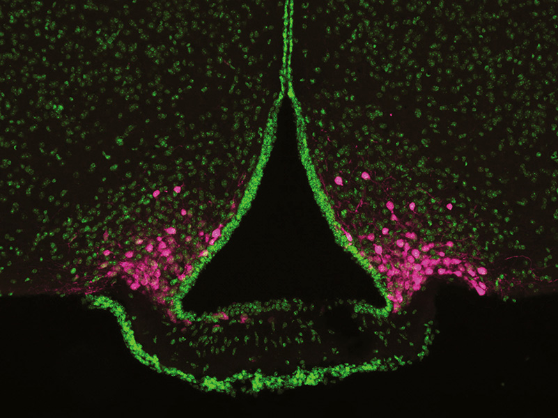

Maybe it starts with a low-energy feeling, or maybe you’re getting a little cranky. You might have a headache or difficulty concentrating. Your brain is sending you a message: You’re hungry. Find food.  

也许它始于一种低能量的感觉，或者你可能变得有点暴躁。您可能会头痛或难以集中注意力。你的大脑正在向你发送信息：你饿了。找食物。

Studies in mice have pinpointed a cluster of cells called AgRP neurons near the underside of the brain that may create this unpleasant hungry, [even “hangry,” feeling](https://www.health.com/nutrition/what-is-hangry). They sit near the brain’s blood supply, giving them access to hormones arriving from the stomach and fat tissue that indicate energy levels. When energy is low, they act on a variety of other brain areas to promote feeding.  

对老鼠的研究已经确定了靠近大脑底部的一组称为 AgRP 神经元的细胞，这些细胞可能会产生这种令人不快的饥饿感，甚至是“饥肠辘辘”的感觉。它们靠近大脑的血液供应，使它们能够接触到来自胃和脂肪组织的荷尔蒙，这些荷尔蒙可以指示能量水平。当能量低时，它们会作用于各种其他大脑区域以促进进食。

By eavesdropping on AgRP neurons in mice, scientists have begun to untangle how these cells switch on and encourage animals to seek food when they’re low on nutrients, and how they sense [food landing in the gut](https://knowablemagazine.org/article/health-disease/2018/gut-feelings) to turn back off. Researchers have also found that the activity of AgRP neurons goes awry in mice with symptoms akin to those of anorexia, and that activating these neurons can help to restore normal eating patterns in those animals.  

通过窃听小鼠体内的 AgRP 神经元，科学家们已经开始弄清楚这些细胞如何在动物营养不足时启动并鼓励动物寻找食物，以及它们如何感知食物落入肠道以关闭。研究人员还发现，AgRP 神经元的活动在出现类似于厌食症症状的小鼠身上出现问题，激活这些神经元可以帮助这些动物恢复正常的饮食模式。

Understanding and manipulating AgRP neurons might lead to new treatments for both anorexia and overeating. “If we could control this hangry feeling, we might be better able to control our diets,” says Amber Alhadeff, a neuroscientist at the Monell Chemical Senses Center in Philadelphia.  

理解和操纵 AgRP 神经元可能会导致厌食症和暴饮暴食的新疗法。 “如果我们能控制这种饥饿感，我们可能就能更好地控制我们的饮食，”费城 Monell 化学感官中心的神经科学家 Amber Alhadeff 说。

## To eat or not to eat  

吃还是不吃

AgRP neurons appear to be key players in appetite: Deactivating them in adult mice causes the animals to [stop eating](https://www.nature.com/articles/nn1548) — they may even [die of starvation](https://www.science.org/doi/full/10.1126/science.1115524). Conversely, if researchers activate the neurons, mice hop into their food dishes and [gorge themselves](https://www.nature.com/articles/nn.2739).  

AgRP 神经元似乎是食欲的关键参与者：在成年小鼠中停用它们会导致动物停止进食——它们甚至可能死于饥饿。相反，如果研究人员激活神经元，老鼠就会跳进它们的食物盘里大快朵颐。

Experiments at several labs in 2015 helped to illustrate what AgRP neurons do. Researchers found that when mice hadn’t had enough to eat, AgRP neurons [fired more frequently](https://elifesciences.org/articles/7122). But just the sight or smell of food — especially something yummy like peanut butter or a Hershey’s Kiss — was enough to [dampen this activity](https://www.cell.com/cell/fulltext/S0092-8674(15)00076-8), within seconds. From this, the scientists concluded that AgRP neurons cause animals to seek out food. Once food has been found, they stop firing as robustly.  

2015 年在几个实验室进行的实验有助于说明 AgRP 神经元的作用。研究人员发现，当老鼠吃不饱时，AgRP 神经元会更频繁地放电。但仅仅是食物的视觉或气味——尤其是像花生酱或好时之吻这样美味的东西——就足以在几秒钟内抑制这种活动。由此，科学家们得出结论，AgRP 神经元会导致动物寻找食物。一旦找到食物，它们就会停止射击。

One research team, led by neuroscientist Scott Sternson at the Janelia Research Campus in Ashburn, Virginia, also showed that AgRP neuron activity appears to [make mice feel bad](https://www.nature.com/articles/nature14416). To demonstrate this, the scientists engineered mice so that the AgRP neurons would start firing when light was shone into the brain with an optical fiber (the fiber still allowed the mice to move around freely). They placed these engineered mice in a box with two distinct areas: one colored black with a plastic grid floor, the other white with a soft, tissue paper floor. If the researchers activated AgRP neurons whenever the mice went into one of the two areas, the mice started avoiding that region.  

由弗吉尼亚州阿什本的 Janelia 研究园区的神经科学家 Scott Sternson 领导的一个研究小组也表明，AgRP 神经元活动似乎会让老鼠感觉不舒服。为了证明这一点，科学家们对小鼠进行了工程改造，使 AgRP 神经元在光线通过光纤照射到大脑时开始放电（光纤仍然允许小鼠自由移动）。他们将这些经过改造的老鼠放在一个有两个不同区域的盒子里：一个是黑色的，地板是塑料网格，另一个是白色的，地板是柔软的薄纸。如果研究人员在小鼠进入两个区域之一时激活 AgRP 神经元，小鼠就会开始避开该区域。

Sternson, now at the University of California San Diego, concluded that AgRP activation felt “mildly unpleasant.” That makes sense in nature, he says: Any time a mouse leaves its nest, it’s at risk from predators, but it must overcome this fear in order to forage and eat. “These AgRP neurons are kind of the push that, in a dangerous environment, you’re going to go out and seek food to stay alive.”  

现在就职于加州大学圣地亚哥分校的斯特恩森得出结论，AgRP 激活感觉“有点不愉快”。他说，这在自然界中是有道理的：只要老鼠离开巢穴，它就会面临捕食者的威胁，但它必须克服这种恐惧才能觅食和进食。 “这些 AgRP 神经元是一种推动力，在危险的环境中，你会出去寻找食物以维持生命。”

Sternson’s 2015 study had shown that while the sight or smell of food quiets AgRP neurons, it’s only temporary: Activity goes right back up if the mouse can’t follow through and eat the snack. Through additional experiments, Alhadeff and colleagues discovered that what turns the AgRP neurons off more reliably is [calories landing in the gut](https://www.cell.com/cell-reports/fulltext/S2211-1247(17)31673-X).  

斯特恩森 2015 年的研究表明，虽然看到食物或闻到食物会使 AgRP 神经元安静下来，但这只是暂时的：如果老鼠不能跟进并吃掉零食，活动就会立即恢复。通过额外的实验，Alhadeff 和他的同事发现，更可靠地关闭 AgRP 神经元的是进入肠道的卡路里。

<iframe src="https://www.youtube.com/embed/aTnI-uoGTcg" title="YouTube video player" allow="accelerometer; autoplay; clipboard-write; encrypted-media; gyroscope; picture-in-picture; web-share" xmlns:xlink="http://www.w3.org/1999/xlink" width="560" height="315" frameborder="0"></iframe>

The sleeping mouse in this video has been engineered so that when blue light shines into its brain, AgRP neurons are activated. The mouse is resting after a night in which it had plenty to eat. When researchers turn on the blue light, the mouse awakens and eats more, even though it’s sated.  

这段视频中睡觉的老鼠经过精心设计，当蓝光照射到它的大脑时，AgRP 神经元就会被激活。老鼠在吃饱了一夜后正在休息。当研究人员打开蓝灯时，老鼠会醒来并吃得更多，即使它已经吃饱了。

CREDIT: DANIEL KROEGER / MICHAEL KRASHES  

图片来源：DANIEL KROEGER / MICHAEL KRASHES

First, Alhadeff’s team fed mice a calorie-free treat: a gel with artificial sweetener. When mice ate the gel, AgRP neuron activity dropped, as expected — but only temporarily. As the mice learned there were no nutrients to be gained from this snack, their AgRP neurons responded less and less to each bite. Thus, as animals learn whether a treat really nourishes them, the neurons adjust the hunger dial accordingly.  

首先，Alhadeff 的团队给老鼠喂了一种无卡路里的食物：一种含有人造甜味剂的凝胶。当老鼠吃下凝胶时，AgRP 神经元活动如预期的那样下降——但只是暂时的。当小鼠了解到这种零食无法获得任何营养时，它们的 AgRP 神经元对每一口的反应都越来越小。因此，当动物了解一种食物是否真的能滋养它们时，神经元会相应地调整饥饿度盘。

Next, the team used a catheter implanted through the abdomen to deliver calories, in the form of the nutritional drink Ensure, directly to the stomach. This bypassed any sensory cues that food was coming. And it resulted in a longer dip in AgRP activity. In other words, it’s the nutrients in food that shut off AgRP neurons for an extended time after a meal, Alhadeff concluded.  

接下来，该团队使用通过腹部植入的导管以营养饮料 Ensure 的形式将卡路里直接输送到胃部。这绕过了食物即将到来的任何感官线索。这导致 AgRP 活动的下降时间更长。 Alhadeff 总结说，换句话说，正是食物中的营养物质在饭后长时间关闭了 AgRP 神经元。

Alhadeff has since begun to decode the [messages that the stomach sends to the AgRP neurons](https://www.cell.com/cell-metabolism/fulltext/S1550-4131(20)30716-6), and found that it depends on the nutrient. Fat in the gut triggers a signal via the vagus nerve, which reaches from the digestive tract to the brain. The simple sugar glucose signals the brain via nerves in the spinal cord.  

Alhadeff 从那以后开始解码胃发送给 AgRP 神经元的信息，并发现它取决于营养素。肠道中的脂肪通过迷走神经触发信号，迷走神经从消化道到达大脑。简单的糖葡萄糖通过脊髓中的神经向大脑发出信号。

Her team is now investigating why these multiple paths exist. She hopes that by better understanding how AgRP neurons drive food-seeking, scientists can eventually come up with ways to help people keep off unhealthy pounds. Though scientists and dieters have been seeking such treatments [for more than a century](https://www.livestrong.com/article/74336-history-diet-pills/), it’s been difficult to identify easy, safe and effective treatments. The [latest class of weight-loss medications](https://www.mayoclinic.org/diseases-conditions/type-2-diabetes/expert-answers/byetta/faq-20057955), such as Wegovy, act in part on AgRP neurons but have unpleasant side effects such as nausea and diarrhea.  

她的团队现在正在调查为什么存在这些多条路径。她希望通过更好地了解 AgRP 神经元如何驱动寻食，科学家们最终可以想出方法来帮助人们避免不健康的体重。尽管一个多世纪以来科学家和节食者一直在寻求此类治疗方法，但一直难以确定简单、安全和有效的治疗方法。最新一类的减肥药，如 Wegovy，部分作用于 AgRP 神经元，但有令人不快的副作用，如恶心和腹泻。

Therapies targeting AgRP neurons alone would likely fail to fully solve the weight problem, because food-seeking is only one component of appetite control, says Sternson, who reviewed the main [controllers of appetite](https://www.annualreviews.org/doi/10.1146/annurev-physiol-021115-104948) in the _Annual Review of Physiology_ in 2017. Other brain areas that sense satiety and [make high-calorie food pleasurable](https://www.cell.com/cell-metabolism/fulltext/S1550-4131(15)00340-X) also play important roles, he says. That’s why, for example, you eat that slice of pumpkin pie at the end of the Thanksgiving meal, even though you’re already full of turkey and mashed potatoes.  

Sternson 说，仅针对 AgRP 神经元的疗法可能无法完全解决体重问题，因为寻找食物只是食欲控制的一个组成部分，他在 2017 年的年度生理学评论中回顾了食欲的主要控制者。其他大脑区域他说，饱腹感和让高热量食物变得愉悦也起着重要作用。这就是为什么，例如，你在感恩节大餐结束时吃了那片南瓜派，即使你已经吃饱了火鸡和土豆泥。

Three different neural systems control the feeling of hunger and the intake of food. If the body is low on energy, AgRP neurons become active, which feels unpleasant and makes an animal seek out food. Food also creates positive feelings regardless of the body’s energy state, maintaining a desire to eat even if the body isn’t in energy deficit. And signals of satiety or nausea tell the brain that the animal isn’t hungry and cause it to stop eating.  

三种不同的神经系统控制饥饿感和食物摄入量。如果身体能量不足，AgRP 神经元会变得活跃，这会让人感到不愉快，并促使动物寻找食物。无论身体的能量状态如何，食物都会产生积极的感觉，即使身体没有能量不足也能保持进食的欲望。饱腹感或恶心的信号会告诉大脑动物不饿，并导致它停止进食。

## Outflanking anorexia  包抄厌食症

The flip side of overeating is [anorexia](https://knowablemagazine.org/article/mind/2021/searching-better-treatment-eating-disorders), and there, too, researchers think that investigating AgRP neurons could lead to new treatment strategies. People with anorexia avoid food, to the point of dangerous weight loss. “Eating food is actually aversive,” says Ames Sutton Hickey, a neuroscientist at Temple University in Philadelphia. There is no medication specific for anorexia; treatment may include psychotherapy, general medications such as antidepressants and, in the most severe cases, force-feeding via a tube threaded through the nose. People with anorexia are also often restless or hyperactive and may exercise excessively.  

暴饮暴食的另一面是厌食症，研究人员也认为研究 AgRP 神经元可能会导致新的治疗策略。厌食症患者避免进食，以至于体重减轻到了危险的地步。 “吃东西实际上是令人厌恶的，”费城坦普尔大学的神经科学家艾姆斯·萨顿·希基 (Ames Sutton Hickey) 说。没有专门针对厌食症的药物；治疗可能包括心理治疗、抗抑郁药等一般药物治疗，以及在最严重的情况下，通过穿过鼻子的管子强制喂食。厌食症患者也经常焦躁不安或过度活跃，并且可能过度运动。

Researchers can study the condition using a mouse model of the disease known as activity-based anorexia, or ABA. When scientists limit the food available to the mice and provide them with a wheel to run on, some mice enter an anorexia-like state, eating less than they’re offered, and running on the wheel even during daylight, when mice are normally inactive. “It’s a remarkable addictive thing that happens to these animals,” says Tamas Horvath, a neuroscientist at the Yale School of Medicine. “They basically get a kick out of not eating and exercising.”  

研究人员可以使用一种称为活动性厌食症 (ABA) 的小鼠模型来研究这种情况。当科学家们限制老鼠可获得的食物并为它们提供一个轮子来跑步时，一些老鼠会进入类似厌食症的状态，吃得比他们提供的少，甚至在白天老鼠通常不活动的时候也会在轮子上跑步.耶鲁大学医学院的神经科学家 Tamas Horvath 说：“发生在这些动物身上的事情非常令人上瘾。” “他们基本上从不吃东西和不锻炼中得到乐趣。”

It’s not a perfect model for anorexia. Mice, presumably, face none of the social pressures to stay thin that humans do; conversely, people with anorexia usually don’t have limits on their access to food. But it’s one of the best anorexia mimics out there, says Alhadeff: “I think it’s as good as we get.”  

这不是厌食症的完美模型。据推测，老鼠不会像人类那样面临任何保持苗条的社会压力；相反，厌食症患者通常不会限制获取食物。但它是最好的厌食症模拟物之一，Alhadeff 说：“我认为它和我们得到的一样好。”

This microscopic image of a portion of the rodent brain highlights a set of cells known as AgRP neurons (stained magenta), which sit at the base of the hypothalamus. The cells are involved in appetite control; their position near the bloodstream allows them to easily to get signals about the body’s metabolic state.  

这张啮齿动物大脑部分的显微图像突出显示了一组称为 AgRP 神经元的细胞（染成洋红色），它们位于下丘脑底部。这些细胞参与食欲控制；它们靠近血流的位置使它们能够轻松获得有关身体新陈代谢状态的信号。

CREDIT: NIDDK

To find out how AgRP neurons might be involved in anorexia, Sutton Hickey carefully monitored the food intake of ABA mice. She compared them to mice that were given a restricted diet, but had a locked exercise wheel and didn’t develop ABA. The ABA mice, she found, ate fewer meals than the other mice. And when they did eat, their AgRP activity didn’t decrease like it should have after they filled their tummies. Something was [wrong with the way the neurons responded to hunger and food cues](https://www.nature.com/articles/s41380-022-01932-w).  

为了解 AgRP 神经元如何参与厌食症，Sutton Hickey 仔细监测了 ABA 小鼠的食物摄入量。她将它们与饮食受限但运动轮锁定且未出现 ABA 的小鼠进行了比较。她发现，ABA 老鼠比其他老鼠吃得少。当他们吃东西时，他们的 AgRP 活动并没有像填饱肚子后那样减少。神经元对饥饿和食物线索的反应方式出了问题。

Sutton Hickey also found that she could fix the problem when she engineered ABA mice so that AgRP neurons would spring into action when researchers injected a certain chemical. These mice, when treated with the chemical, ate more meals and gained weight. “That speaks very much to the importance of these neurons,” says Horvath, who wasn’t involved in the work. “It shows that these neurons are good guys, not the bad guys.”  

Sutton Hickey 还发现，她可以通过改造 ABA 小鼠来解决这个问题，这样当研究人员注射某种化学物质时，AgRP 神经元就会开始行动。这些老鼠在用这种化学物质处理后，吃得更多，体重也增加了。 “这充分说明了这些神经元的重要性，”未参与这项工作的 Horvath 说。 “这表明这些神经元是好人，而不是坏人。”

Sutton Hickey says the next step is to figure out why the AgRP neurons respond abnormally in ABA mice. She hopes there might be some key molecule she could target with a drug to help people with anorexia.  

Sutton Hickey 说下一步是找出 ABA 小鼠中 AgRP 神经元反应异常的原因。她希望可能有一些她可以用药物靶向的关键分子来帮助厌食症患者。

All in all, the work on AgRP neurons is giving scientists a much better picture of why we eat when we do — as well as new leads, perhaps, to medications that might help people change disordered eating, be it consuming too much or too little, into healthy habits.  

总而言之，对 AgRP 神经元的研究让科学家们更好地了解我们吃东西的原因——以及可能帮助人们改变饮食失调的药物的新线索，无论是进食过多还是过少，养成健康的习惯。
