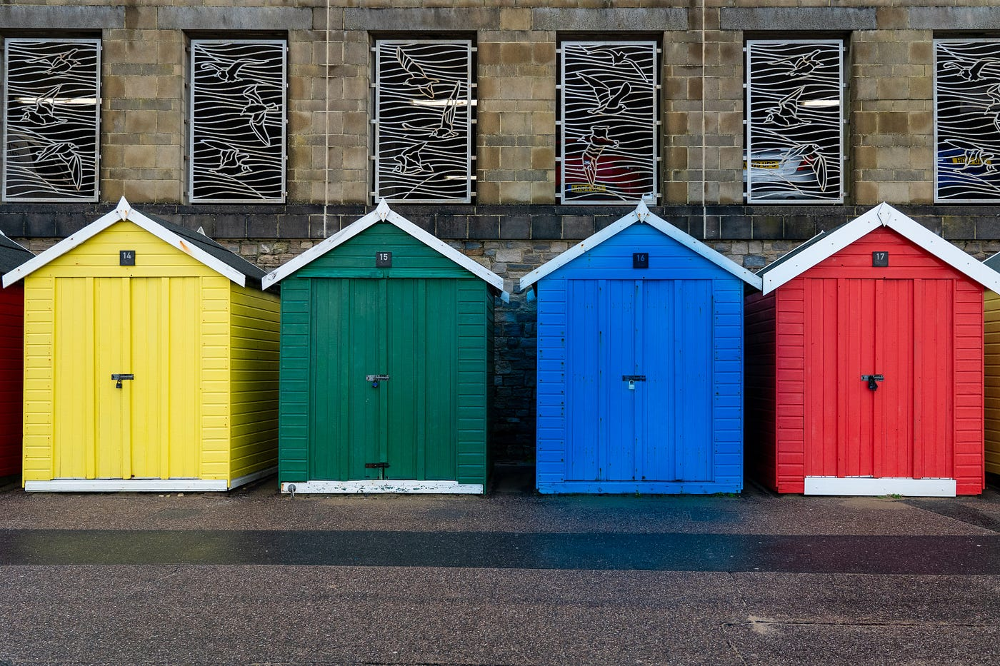
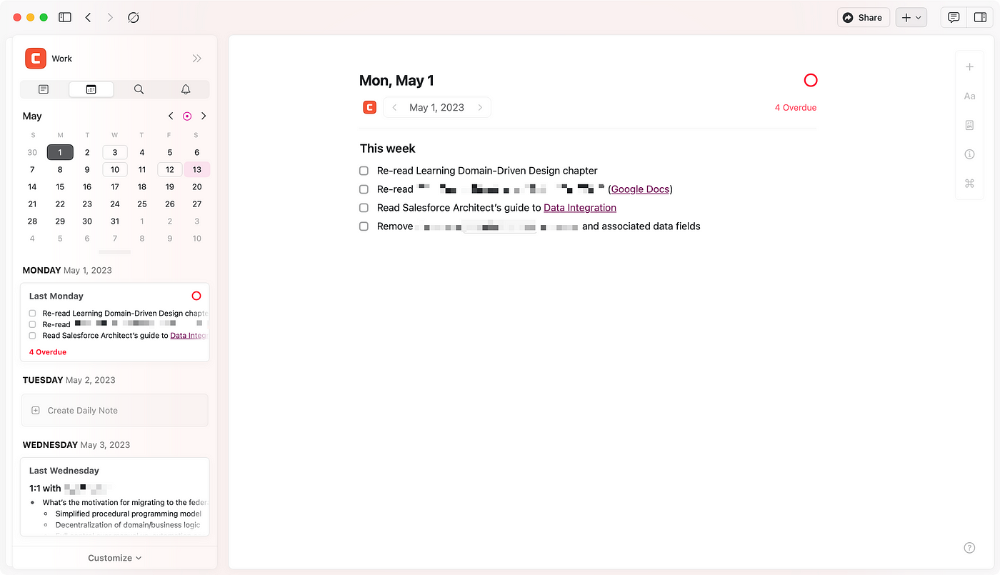
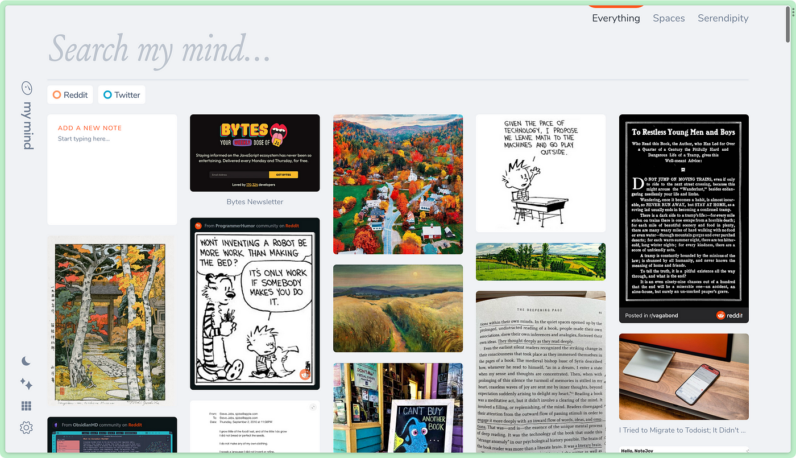
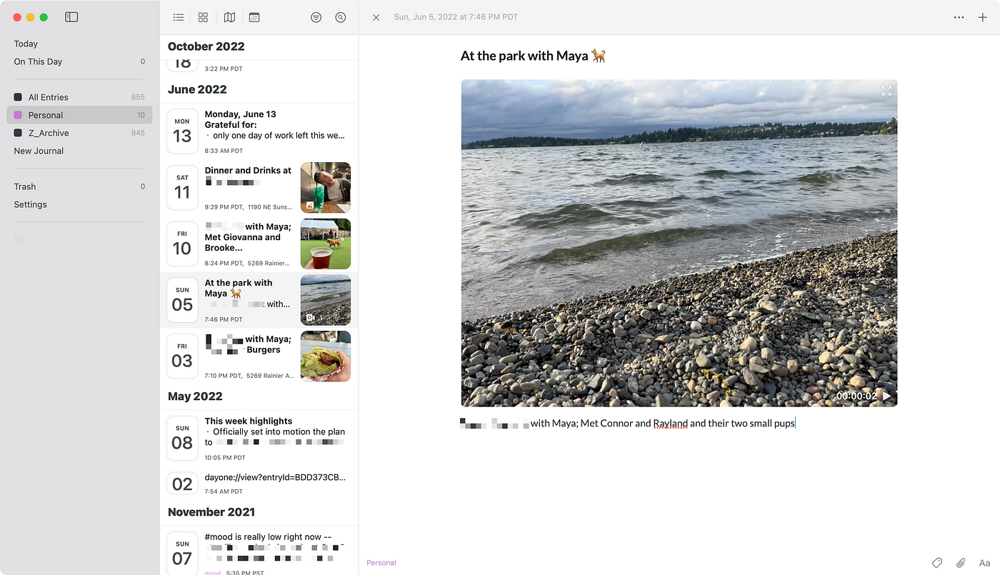

## A simple method for mindfully using note-taking and other productivity tools.  

一种用心使用笔记和其他生产力工具的简单方法。

Photo by [Nick Fewings](https://unsplash.com/@jannerboy62?utm_source=unsplash&utm_medium=referral&utm_content=creditCopyText) on [Unsplash](https://unsplash.com/photos/apdqPYw3z0s?utm_source=unsplash&utm_medium=referral&utm_content=creditCopyText)  

照片由 Nick Fewings 在 Unsplash 上拍摄

How is it that our favorite note-taking applications can **perfectly fit the majority of everyday needs**, and yet frustratingly leave out that “essential” feature or two?  

为什么我们最喜欢的笔记应用程序可以完美满足大多数日常需求，却令人沮丧地遗漏了一两个“基本”功能？  

Why is it that with an assortment of otherwise fantastically powerful note-taking software, we might struggle to build a coherent system?  

为什么使用各种功能强大的笔记软件，我们可能很难构建一个连贯的系统？

Of course we know that different tools cater to different scenarios.  

当然我们知道不同的工具针对不同的场景。  

For example, read-it-later software like Pocket or Instapaper is clearly intended for a different purpose than Google Calendar. **But between, say, Evernote and Notion,** there is a sizable gray area.  

例如，Pocket 或 Instapaper 等稍后阅读软件的目的显然与 Google Calendar 不同。但在 Evernote 和 Notion 之间，存在相当大的灰色区域。  

Amid the constellation of similar-seeming options to choose between and the variety of everyday life, what we’re missing, perhaps, is a straightforward mental model with which to reason about and categorize our tools.  

在众多看似相似的选择和日常生活的多样性中，我们缺少的也许是一个直接的心智模型，可以用来对我们的工具进行推理和分类。

The four categories that I would like to introduce to you are inspired by distinct “moods” or “mindsets.” In this system, there are at least four such mindsets: the _productive_ mindset, the _curious_ mindset, the _imaginative_ mindset, and the _reflective_ mindset. Let’s dive in.  

我想向您介绍的四个类别的灵感来自于不同的“情绪”或“心态”。在这个系统中，至少有四种这样的心态：富有成效的心态、好奇的心态、想象力的心态和反思的心态。让我们开始吧。

## Being productive

[Craft](http://craft.do/) for the productive mindset.  

为富有成效的心态而设计。

The first and most prevalent mindset is the productive one.  

第一种也是最普遍的心态是富有成效的。  

In this mode, I am interested in tracking my everyday responsibilities at work and at home, staying on top of my commitments to myself and to others, keeping lists of priorities, and taking down information that’s required to accomplish my goals.  

在这种模式下，我有兴趣跟踪我在工作和家庭中的日常职责，遵守我对自己和他人的承诺，保留优先事项清单，并记下实现我的目标所需的信息。  

Note that being “productive” doesn’t just have to be about work — one can be intentional about play, too.  

请注意，“高效”不仅仅与工作有关——一个人也可以有意识地玩耍。

Central productivity objects include dates of various granularity (day, week, month, etc.), people, projects, teams, events, meetings, topics, and areas of responsibility.  

中心生产力对象包括各种粒度的日期（日、周、月等）、人员、项目、团队、事件、会议、主题和职责范围。  

The tools that I use for productive note-taking will have capabilities that shine in the area of tracking tasks, taking date-focused notes, and collecting immediately useful resources.  

我用于高效记笔记的工具将具有在跟踪任务、记录日期重点笔记和立即收集有用资源方面大放异彩的功能。

## Being curious

[Roam Research](http://roamresearch.com/) for the curious mindset  

好奇心的漫游研究

The second mindset is the curious one.  

第二种心态是好奇的心态。  

In this mode, I’m keenly interested in keeping track of what I’m learning and doing across all dimensions of life in order to master my craft, be a better-informed citizen, be a loving partner, and so forth.  

在这种模式下，我非常有兴趣跟踪我在生活的各个方面正在学习和做的事情，以便掌握我的手艺、成为一个见多识广的公民、成为一个有爱心的伴侣等等。  

The means of doing so is to collect and connect ideas, synthesizing them by rewriting their essence in my own words.  

这样做的方法是收集和连接想法，通过用我自己的话重写它们的本质来综合它们。

Time is still a relevant dimension to the learning mindset (so that I have a history of my progress), but it’s a secondary organizational feature to the diverse subjects, topics, people of interest, and other domain-specific objects that I collect.  

时间仍然是学习心态的一个相关维度（这样我就有了我的进步历史），但它是我收集的不同主题、主题、感兴趣的人和其他特定领域对象的次要组织特征。  

Over time the information I gather here becomes my prized “knowledge bank.”  

随着时间的推移，我在这里收集的信息变成了我宝贵的“知识库”。

Tools that I use for learning-focused note-taking will have strengths in the areas of information capture, organization of information, and knowledge classification.  

我用于以学习为中心的笔记的工具将在信息捕获、信息组织和知识分类方面具有优势。  

Note-taking software for this purpose benefits from both hierarchical and associative relationships, meaning that affordances like links, tags, and back-references are useful in addition to folders.  

用于此目的的笔记软件受益于层次关系和关联关系，这意味着除了文件夹之外，链接、标签和反向引用等可供性也很有用。

## Being imaginative

[mymind](http://mymind.com/) for the imaginative mindset  

mymind 富有想象力的思维模式

The third mindset is a dream-like one, the area where soul and body meet. In this mode I care the most about collecting items of aesthetic, beauty, and transcendent wisdom.  

第三种心态是梦幻般的心态，灵魂与身体相遇的地方。在这种模式下，我最关心的是收集具有审美、美感和超凡智慧的物品。  

My aim when collecting items of this kind is to build a sort of mind palace or a zen garden, into which I can retreat at any time in order to refresh and inspire my mood.  

我收集这类物品的目的是建立一个心灵宫殿或禅宗花园，我可以随时退缩到其中，以提神醒脑。

The tools that I use for dreaming are those that cater to the artistic and creative types.  

我用于梦想的工具是那些迎合艺术和创意类型的工具。  

These often have capabilities for building art boards, mood boards, swipe files, and other visual arrangements.  

这些通常具有构建艺术板、情绪板、滑动文件和其他视觉布置的功能。  

Organization is extremely loose in this corner of my system, with only broad “buckets” or “pools” being necessary to collect the images, quotes, color palettes, links, screenshots, and such things.  

在我系统的这个角落组织非常松散，只需要广泛的“桶”或“池”来收集图像、引用、调色板、链接、屏幕截图等。  

Serendipity is the name of the game.  

意外发现是游戏的名称。

## Being reflective

[Day One](http://dayoneapp.com/) for the reflective mindset  

反思性思维的第一天

The fourth mindset is a private one. In this mode, I’m alone with my innermost thoughts and feelings.  

第四种心态是私人的。在这种模式下，我独自面对内心深处的想法和感受。  

The notes that I take in my diary relate to and record day-to-day events, while being intertwined tightly with my subjective experience of those events.  

我在日记中记下的笔记与日常事件相关并记录下来，同时与我对这些事件的主观体验紧密交织在一起。  

Hopes, fears, joys, frustrations, and the full spectrum of emotions plays out on these private pages.  

希望、恐惧、喜悦、沮丧，以及各种情绪都在这些私人页面上展现。

Capabilities that matter most to my diary tool are privacy features like end-to-end encryption and PIN locks, because the content of my diary is off-limits to anyone but myself.  

对我的日记工具最重要的功能是端到端加密和 PIN 锁等隐私功能，因为除了我自己以外，任何人都不能访问我的日记内容。  

Maintaining the integrity of such a private sanctum is crucial because otherwise I won’t trust it with my most vulnerable writings, and self-censoring inhibits reflection.  

保持这样一个私人密室的完整性是至关重要的，否则我不会将我最脆弱的作品托付给它，而自我审查会抑制反思。

## More software recommendations 更多软件推荐

If the choices above don’t suit your fancy, here are a few additional recommendations in each of the four mindset categories.  

如果以上选择不符合您的喜好，这里有四种心态类别中的每一种的一些额外建议。

-   Being productive: [Craft](http://craft.do/), [NotePlan](http://noteplan.co/), [Agenda](http://agenda.com/), [Amplenote](http://amplenote.com/), [Reflect](http://reflect.app/), [Stashpad](http://stashpad.com/), [Evernote](http://evernote.com/), [Google Keep](http://google.com/keep), [OneNote](https://www.microsoft.com/en-us/microsoft-365/onenote/digital-note-taking-app), [Trello](http://trello.com/), [Notion](http://notion.so/)  
    
    提高工作效率：Craft、NotePlan、Agenda、Amplenote、Reflect、Stashpad、Evernote、Google Keep、OneNote、Trello、Notion
-   Being curious: [Roam Research](http://roamresearch.com/), [Capacities](http://capacities.io/), [RemNote](http://remnote.io/), [Supernotes](http://supernotes.app/), [Notion](http://notion.so/), [Obsidian](http://obsidian.md/), [Heptabase](http://heptabase.com/), [DevonThink](https://www.devontechnologies.com/apps/devonthink)  
    
    好奇：Roam Research、Capacities、RemNote、Supernotes、Notion、Obsidian、Heptabase、DevonThink
-   Being mindful: [mymind](https://mymind.com/), [Milanote](http://milanote.com/), [Raindrop.io](http://raindrop.io/), [Pile](https://pile.ie/), [Google Photos](https://www.google.com/photos/about/), [Apple Photos](https://www.apple.com/ios/photos/)  
    
    留心：mymind、Milanote、Raindrop.io、Pile、Google Photos、Apple Photos
-   Being reflective: [Day One](http://dayoneapp.com/), [Everlog](https://everlog.app/), Moleskine [Journey](https://www.moleskine.com/en-us/shop/moleskine-smart/apps-and-services/journey/)  
    
    反思：第一天，Everlog，Moleskine 之旅

If you really want to use as few apps as possible, then Notion is probably the most general-purpose software currently on the market.  

如果你真的想使用尽可能少的应用程序，那么 Notion 可能是目前市场上最通用的软件。

## Wrap-up

These are the four mindsets that I currently use to frame my relationship with note-taking tools.  

这些是我目前用来构建我与笔记工具的关系的四种心态。  

Certainly none of these modes exists in a vacuum, and there will always be some degree of overlap in practice.  

当然，这些模式都不是真空存在的，在实践中总会有一定程度的重叠。  

But since I’ve kept the number of categories low, my hope is that it’s easy enough to choose the “best fit” for any given scenario.  

但由于我将类别数量保持在较低水平，我希望可以很容易地为任何给定场景选择“最适合”的类别。

If you have thoughts or opinions from your own experience in note-taking, I’d love to hear about them.  

如果您根据自己的笔记经验有任何想法或意见，我很想听听。  

Leave a comment below or send me an email at cameron\_sea {at} fastmail {dot} com. All the best!  

在下方发表评论或通过 cameron\_sea {at} fastmail {dot} com 向我发送电子邮件。一切顺利！
