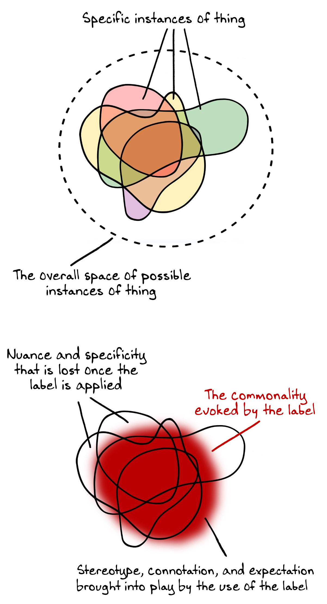

## **Introduction**

This post is meant to be a linkable resource. Its core is a [short list of guidelines](https://www.lesswrong.com/posts/XPv4sYrKnPzeJASuk/basics-of-rationalist-discourse-1#Guidelines__in_brief_) (you can link directly to the list) that are intended to be fairly straightforward and uncontroversial, for the purpose of nurturing and strengthening a culture of clear thinking, clear communication, and collaborative truth-seeking.  

这篇文章是一个可链接的资源。它的核心是一个简短的指南列表（您可以直接链接到列表），这些指南旨在相当直截了当且没有争议，目的是培养和加强清晰思考、清晰沟通和协作寻求真相的文化。

> "Alas," said Dumbledore, "we all know that what _should be_, and what _is_, are two different things.  Thank you for keeping this in mind."  
> 
> “唉，”邓布利多说，“我们都知道应该怎样和怎样，是两件不同的事情。谢谢你记住这一点。”

There is also (for those who want to read more than the simple list) substantial expansion/clarification of each specific guideline, along with justification for the overall philosophy behind the set.  

还有（对于那些想要阅读比简单列表更多内容的人）每条具体指南的实质性扩展/澄清，以及该指南背后的整体理念的理由。

___

## **Prelude: On Shorthand 前奏：速记**

Once someone has a deep, rich understanding of a complex topic, they are often able to refer to that topic with short, simple sentences that correctly convey the intended meaning to other people with similar context and expertise.  

一旦某人对一个复杂的主题有了深刻、丰富的理解，他们通常能够用简短的句子来引用该主题，这些句子将预期的含义正确地传达给具有相似背景和专业知识的其他人。

However, those same short, simple sentences are often _dangerously misleading,_ in the hands of a novice who lacks the proper background.  Dangerous precisely _because_ they seem straightforward and comprehensible, and thus the novice will confidently extrapolate outward from them in what feel like perfectly reasonable ways, unaware the whole time that the concept in their head bears little or no resemblance to the concept that lives in the expert's head.  

然而，那些同样简短的句子在缺乏适当背景的新手手中往往具有危险的误导性。之所以危险，恰恰是因为它们看起来直截了当且易于理解，因此新手会自信地从它们中以感觉完全合理的方式向外推断，而在整个过程中都没有意识到他们头脑中的概念与专家的概念几乎没有或根本没有相似之处头。

Good shorthand _in the hands of an experienced user_ need only be an accurate fit for the already-existing concept it refers to—it doesn't need the additional property of being an unmistakeable _non_\-fit for other nearby attractors.  It doesn't need to contain complexity or nuance—it just needs to remind the listener of the complexity already contained in their mental model.  

有经验的用户掌握的好速记只需要准确地适合它所指的已经存在的概念——它不需要明确无误地不适合其他附近的吸引子的附加属性。它不需要包含复杂性或细微差别——它只需要提醒听众他们的心智模型中已经包含的复杂性。  

 It's doing its job if it _efficiently evokes_ the understanding that already exists, independent of itself.  

如果它能有效地唤起已经存在的、独立于自身的理解，它就是在做它的工作。

This is important, because **what follows this introduction is a list of short, simple sentences comprising the basics of rationalist discourse**.  Each of those sentences is a solid fit for the more-complicated concept it's gesturing at, _provided you already understand that concept._  The short sentences are mnemonics, reminders, hyperlinks.  

这一点很重要，因为在这个介绍之后是一系列简短的句子，这些句子构成了理性主义话语的基础。如果您已经理解该概念，那么这些句子中的每一个都非常适合它所指的更复杂的概念。短句是助记符、提醒、超链接。

They are _not_ sufficient, on their own, to reliably cause a beginner to construct the proper concepts from the ground up, and they do _not,_ by themselves, rule out all likely misunderstandings.   

它们本身并不足以可靠地使初学者从头开始构建正确的概念，并且它们本身并不能排除所有可能的误解。

All things considered, it seems good to have a clear, concise list near the top of a post like this.  

综合考虑，在像这样的帖子顶部附近有一个清晰、简洁的列表似乎很好。  

 People should not have to scroll and scroll and sift through thousands of words when trying to refer back to these guidelines.  

人们在试图回顾这些指导方针时，不必滚动和滚动筛选数千个单词。

But each of the short, simple sentences below admits of multiple interpretations, some of which are intended and others of which are not.  They are _compressions_ of complex points, and compressions are inevitably lossy.  If a given guideline is new to you, check the in-depth explanation before reposing confidence in your understanding.  

但是下面每个简短的句子都允许有多种解释，其中一些是有意的，另一些则不是。它们是复杂点的压缩，压缩不可避免地有损。如果给定的指南对您来说是新的，请在对您的理解充满信心之前检查深入的解释。  

 And if a given guideline stated-in-brief seems to you to be flawed or misguided in some obvious way, check the expansion before spending a bunch of time marshaling objections that may well have already been answered.  

如果给定的简要说明在您看来有缺陷或以某种明显的方式被误导，请在花大量时间整理可能已经得到答复的反对意见之前检查扩展。

Further musing on this concept: [Sazen](https://www.lesswrong.com/posts/k9dsbn8LZ6tTesDS3/sazen)  

进一步思考这个概念：Sazen

___

## **Guidelines, in brief: 指南，简而言之：**

       0. Expect good discourse to require energy.  

0.期待好的话语需要能量。

1.  Don't say straightforwardly false things.   
    
    不要直截了当地说假话。
2.  Track (for yourself) and distinguish (for others) your inferences from your observations.  
    
    跟踪（为你自己）并区分（为他人）你的推论与你的观察。
4.  Estimate (for yourself) and make clear (for others) your rough level of confidence in your assertions.  
    
    估计（为你自己）并明确（为他人）你对你的断言的大致信心水平。
5.  Make your claims clear, explicit, and falsifiable, or explicitly acknowledge that you aren't doing so (or can't).  
    
    使您的声明清晰、明确且可证伪，或明确承认您没有这样做（或不能）。
6.  Aim for convergence on truth, and behave as if your interlocutors are also aiming for convergence on truth.  
    
    以真理为目标，表现得好像你的对话者也在以真理为目标。
7.  Don't jump to conclusions—maintain _at least_ two hypotheses consistent with the available information.  
    
    不要仓促下结论——至少保持两个与可用信息一致的假设。
8.  Be careful with extrapolation, interpretation, and summary/restatement—distinguish between _what was actually said,_ and what it sounds like/what it implies/what you think it looks like in practice/what it's tantamount to.  
    
    在推断、解释和总结/重述时要小心——区分实际所说的内容和它听起来像什么/它暗示什么/你认为它在实践中看起来像什么/它等同于什么。  
    
    If you believe that a statement A strongly implies B, and you are disagreeing with A _because_ you disagree with B, explicitly note that "A strongly implies B" is a part of your model.  
    
    如果您认为陈述 A 强烈暗示 B，并且您不同意 A 因为您不同意 B，请明确指出“A 强烈暗示 B”是您模型的一部分。
9.  Allow people to restate, clarify, retract, and redraft their points, if they say that their first attempt failed to convey their intended meaning; do not hold people to the first or worst version of their claim.  
    
    允许人们重申、澄清、撤回和重新起草他们的观点，如果他们说他们的第一次尝试未能传达他们的意图；不要让人们坚持他们主张的第一个或最坏的版本。
10.  Don't weaponize equivocation/don't abuse categories/don't engage in motte-and-bailey shenanigans.  
    
    不要将含糊其词作为武器/不要滥用类别/不要参与 motte-and-bailey 恶作剧。
11.  Hold yourself to the absolute highest standard when directly modeling or assessing others' internal states, values, and thought processes.  
    
    在直接建模或评估他人的内部状态、价值观和思维过程时，坚持绝对最高标准。

___

## **What does it mean for something to be a "guideline"?  

什么是“指南”？**

1.  It is a thing that rationalists should _try to do,_ to a substantially greater degree than random humans engaging in run-of-the-mill social interactions.  
    
    这是理性主义者应该尝试做的事情，比随机参与普通社会互动的人要大得多。  
    
    It's a place where it is usually correct and useful to put forth marginal intentional effort.  
    
    在这里，进行边际刻意努力通常是正确且有用的。
2.  It is a domain in which rationalists should be _open to requests._  If a given comment lacks or is low on a particular guidelined virtue, and someone else pops in to politely ask for a restatement or a clarification which more clearly expresses that virtue, the first speaker should by default receive that request as a friendly and cooperative act, and respond accordingly (as opposed to receiving it as e.g.  
    
    这是一个理性主义者应该对请求开放的领域。如果给定的评论缺乏或低估了特定的指导美德，并且其他人突然出现礼貌地要求重述或澄清以更清楚地表达该美德，则默认情况下，第一个发言者应该接受该请求作为友好和合作的行为，并做出相应的回应（而不是像  
    
    onerous, or presumptuous, or as a social attack).  
    
    繁重的，或冒昧的，或作为一种社会攻击）。
3.  It is an _approximation_ of good rationalist discourse.  
    
    它近似于良好的理性主义话语。  
    
     If a median member of the general population were to practice abiding by it for a month, their thinking would become clearer and their communication would improve.  
    
    如果一般人群中的中位成员练习遵守它一个月，他们的思维会变得更清晰，他们的沟通也会得到改善。  
    
     But that doesn't mean that perfect adherence is _sufficient_ to make discourse good, and it doesn't mean that breaking it is _necessarily_ bad.  
    
    但这并不意味着完美的遵守就足以使话语变好，也不意味着打破它就一定是坏的。

Think of the above, then, as a set of _priors._  If a guideline says "Do \[X\]," that is intended to convey that:  

那么，将以上内容视为一组先验。如果指南说“做\[X\]”，那是为了传达：

-   There will be better outcomes more frequently from people doing \[X\] than from people doing \[a neutral absence of X\], and similarly from \[a neutral absence of X\] than from \[anti-X\].  
    
    做 \[X\] 的人会比做 \[X 的中性缺失\] 的人更频繁地获得更好的结果，同样地，\[X 的中性缺失\] 比 \[anti-X\] 的结果更好。  
    
     In particular, the difference in outcomes is large enough and reliable enough to be generally worth the effort even if \[X\] is not especially natural for you, or if \[not X\] or \[anti-X\] would be convenient.  
    
    特别是，结果的差异足够大且足够可靠，通常值得付出努力，即使 \[X\] 对您来说不是特别自然，或者 \[not X\] 或 \[anti-X\] 会很方便。
-   Given a hundred instances of someone actively engaged in \[anti-X\], _most_ of them will be motivated by something _other than_ a desire to speak the truth, uncover the truth, or help others to understand the truth.  
    
    假设有人积极参与 \[anti-X\] 的一百个例子，他们中的大多数人的动机不是说出真相、揭露真相或帮助他人了解真相。

Thus, given the goals of clear thinking, clear communication, and collaborative truth-seeking, the _burden of proof_ is on a given guideline violation to justify itself.  **There will be many cases in which violating a guideline will in fact be exactly the right call,** just as the next marble drawn blindly from a bag of _mostly_ red marbles may nevertheless be green.  

因此，考虑到清晰的思维、清晰的沟通和协作寻求真相的目标，举证责任在于给定的指南违规行为本身辩护。在很多情况下，违反准则实际上是正确的选择，就像从一袋主要是红色弹珠中盲目抽取的下一颗弹珠可能仍然是绿色的一样。  

 But if you're doing something that's actively contra to one of the above, it should be for a specific, known reason, that you should be willing to discuss if asked (assuming you didn't already explain up front).  

但是，如果您正在做的事情与上述其中一项相反，那应该是出于特定的已知原因，如果被问到，您应该愿意讨论（假设您还没有事先解释）。

Which leads us to the Zeroth Guideline: **expect good discourse to (sometimes) require energy.**  

这将我们引向 Zeroth 准则：期望好的话语（有时）需要能量。

If it did not—if good discourse were a natural consequence of people following ordinary incentives and doing what they do by default—then it wouldn't be recognizable as the separate category of _good_ discourse.  

如果不是这样——如果好的话语是人们遵循普通动机并默认做他们所做的事情的自然结果——那么它就不会被识别为单独的良好话语类别。

A culture of (unusually) clear thinking, (unusually) clear communication, and (unusually) collaborative truth-seeking is _not_ the natural, default state of affairs.  It's _endothermic,_ requiring a regular influx of attention and effort to keep it from degrading back into a state more typical of the rest of the internet.  

一种（异常）清晰思维、（异常）清晰沟通和（异常）协作求真的文化并不是自然的、默认的事态。它是吸热的，需要定期投入注意力和努力，以防止它退化回互联网其他部分更典型的状态。

This doesn't mean that commentary must always be high effort.  Nor does it mean that any individual user is on the hook for doing a hard thing at any given moment.  

这并不意味着评论必须总是付出很大的努力。这也不意味着任何个人用户在任何特定时刻都会因为做一件困难的事情而上钩。

But it _does_ mean that, _in the moments_ where meeting the standards outlined above would take too much energy (as opposed to being locally unnecessary for some other, more fundamental reason), one should lean toward saying nothing, rather than actively eroding them.  

但这确实意味着，在满足上述标准需要太多精力的时候（而不是因为其他一些更根本的原因在当地没有必要），人们应该倾向于什么都不说，而不是积极地削弱它们。

Put another way: a frequent refrain is "well, if I have to put forth that much effort, I'll never say anything at all," to which the response is often "correct, thank you."  

换句话说：经常出现的副词是“好吧，如果我必须付出那么多努力，我什么也不会说”，对此的回应通常是“正确的，谢谢”。

It's analogous to a customer complaining "if Costco is going to require masks, then I'm boycotting Costco."  All else being equal, it would be nice for customers to not have to wear masks, and all else being equal, it would be nice to lower the barrier to communication such that more thoughts could be more easily included.  

这类似于顾客抱怨“如果 Costco 需要口罩，那我就抵制 Costco”。在其他条件相同的情况下，顾客不必戴口罩就好了，在其他条件相同的情况下，降低沟通的障碍，这样可以更容易地包含更多的想法，这将是很好的。

But all else is _not_ equal; there are large swaths of common human behavior that are corrosive or destructive to the collaborative search for truth.  

但其他一切都不平等；有大量常见的人类行为对协作寻找真相具有腐蚀性或破坏性。  

 No single contributor or contribution is worth sacrificing the overall structures which allow for high-quality conversation in the first place—if one _genuinely_ does not have the energy required to e.g.  

没有任何一个贡献者或贡献值得牺牲首先允许高质量对话的整体结构——如果一个人真的没有所需的能量，例如。  

put forth one's thoughts while avoiding straightforwardly false statements, or while distinguishing inference from observation (etc.), then one should simply disengage.  

提出自己的想法，同时避免直截了当的错误陈述，或同时区分推理和观察（等），那么一个人应该简单地脱离。

Note that there is always room for discussion on the meta level; it is not the case that there is universal consensus on every norm, nor on how each norm looks in practice (though the above list is trying pretty hard to limit itself to norms that are on firm footing).  

请注意，在元级别上始终存在讨论空间；并不是每个规范都存在普遍共识，也不是每个规范在实践中看起来如何（尽管上面的列表非常努力地试图将自己限制在稳固基础上的规范）。

Note also that there is a crucial distinction between \[fake/performative verbal gymnastics\], and \[sincere prioritization of truth and accuracy\]—more on this in [Sapir-Whorf for Rationalists](https://www.lesswrong.com/posts/PCrTQDbciG4oLgmQ5/sapir-whorf-for-rationalists).  

另请注意，\[虚假/表演性口头体操\] 与 \[真诚地优先考虑真理和准确性\] 之间存在重要区别——更多关于理性主义者的 Sapir-Whorf 中的内容。

___

For most practical purposes, **this is the end of the post**.  

All remaining sections are reference material, meant to be dug into only when there's a specific reason to; if you read further, please know that you are doing the equivalent of reading dictionary entries or encyclopedia entries and that  

出于最实际的目的，本文到此结束。**the remaining words are not optimized for being Generically Entertaining To Consume.**  

所有其余部分都是参考资料，只有在有特定原因时才需要挖掘；如果您进一步阅读，请知道您所做的相当于阅读字典条目或百科全书条目，并且剩余的单词并未针对一般娱乐消费进行优化。

___

## **Where did these come from? 这些是从哪里来的？**

I tinkered with drafts of this essay for over a year, trying to tease out something like an _a priori_ list of good discourse norms, and wrestling with various imagined subsets of the LessWrong audience and trying to predict what objections might arise, and the whole thing was fairly sprawling and I ultimately scrapped it in favor of just making a list of a dozen in-my-estimation unusually good rationalist communicators, and then writing down the things that made those people's discourse stand out to me in the first place, i.e.  

我花了一年多的时间修改这篇文章的草稿，试图梳理出一些类似良好话语规范的先验列表，并与 LessWrong 观众的各种想象子集搏斗，并试图预测可能会出现什么反对意见，以及整个事情相当庞大，我最终放弃了它，转而只列出了十几个我估计非常优秀的理性主义传播者，然后写下让这些人的话语首先让我脱颖而出的事情，即。  

the things it seems to me that they do a) 10-1000x more frequently than genpop, and b) 2-10x more frequently than the median LessWrong user.  

在我看来，他们做的事情 a) 比 genpop 的频率高 10-1000 倍，b) 比 LessWrong 用户的中位数高 2-10 倍。

That list comprised: 该清单包括：

-   Julia Galef
-   Anna Salamon
-   Rob Bensinger
-   Scott Garrabrant
-   Vaniver
-   Eliezer Yudkowsky
-   Logan Brienne Strohl 洛根·布蕾妮·斯特罗尔
-   Oliver Habryka
-   Kelsey Piper
-   Nate Soares
-   Eric Rogstad
-   Spencer Greenberg
-   Dan Keys (making it a baker's dozen)  
    
    Dan Keys（让它成为面包师的一打）

I claim that if you contrast the words produced by the above individuals with the words produced by the rest of the English-speaking population, what you find is approximately the above ten guidelines.  

我声称，如果你将上述个人说出的词与其他说英语的人说出的词进行对比，你会发现大约是上述十条准则。  

 

In other words, the guidelines are **de**scriptive of good discourse that already exists; here I am attempting to _convert_ them into **pre**scriptions, with some wiggle room and some caveats.  But they weren't made up from whole cloth; they are in fact an observable part of What Actually Works In Practice.  

换句话说，指南描述的是已经存在的好的话语；在这里，我试图将它们转化为处方，有一些回旋余地和一些注意事项。但是它们不是用整块布制成的；它们实际上是实际可行的方法的可观察部分。

Some of the above individuals have specific deficits in one or two places, perhaps, and there are some additional things that these individuals are doing which are _not_ basic, and _not_ found above.  But overall, the above is a solid 80/20 on How To Talk Like Those People Do, and sliding in that direction is going to be good for most of us.  

上述一些人可能在一两个地方有特定的缺陷，并且这些人正在做的一些额外的事情不是基本的，也没有在上面找到。但总的来说，以上是关于如何像那些人那样说话的可靠 80/20，朝这个方向滑动对我们大多数人都有好处。

___

## **Why does this matter? 为什么这很重要？**

In short: because the little things add up.  For more on this, take a look at [Draining the Swamp](https://www.lesswrong.com/posts/XmorxXbvQgr3foqoS/draining-the-swamp-1) as an excellent metaphor for how ambient hygiene influences overall health, or revisit [Concentration of Force](https://www.lesswrong.com/posts/rQKstXH8ZMAdN5iqD/concentration-of-force), in which I lay out my argument for why we should care about small deltas on second-to-second scales, or [Moderating LessWrong](https://medium.com/@ThingMaker/moderating-lesswrong-4de028808def), which is sort of a spiritual precursor to this post.  

简而言之：因为小事情加起来。有关这方面的更多信息，请看一下 Draining the Swamp 作为环境卫生如何影响整体健康的一个很好的比喻，或者重温 Concentration of Force，我在其中阐述了为什么我们应该关心秒到-的小三角洲的论点second scales，或 Moderating LessWrong，这是这篇文章的精神先驱。

___

## **Expansions**

### **1\. Don't say straightforwardly false things.  

1.不要直截了当地说假话。**

... and be ready and willing to explicitly walk back unintentional falsehoods, if asked or if it seems like it would help your conversational partner.  

... 并准备好并愿意明确地退回无意的谎言，如果被问到或者这似乎对您的对话伙伴有帮助。  

 

> "In reality, _everyone's_ morality is based on status games." → "As far as I can tell, the overwhelming majority of people have a morality that grounds out in social status."  
> 
> “实际上，每个人的道德都是建立在地位游戏上的。” → “据我所知，绝大多数人都有一种以社会地位为基础的道德。”

In normal social contexts, where few people are attending to or attempting to express precise truth, it's relatively costless to do things like:  

在正常的社会环境中，很少有人关注或试图表达准确的事实，做这样的事情相对没有成本：

-   Use hyperbole for emphasis 使用夸张来强调
-   Say a false thing, because approximately everyone will be able to intuit the nearby true thing that you're intending to convey  
    
    说假话，因为几乎每个人都能凭直觉知道你要传达的真实事物
-   Over-generalize; ignore edge cases and rounding errors (e.g. "Everybody has eyes.")  
    
    过度概括；忽略边缘情况和舍入错误（例如“每个人都有眼睛”。）

Most of the times that people end up saying straightforwardly false things, they are not _intending_ to lie or deceive, but rather following one of these incentives (or similar).  

大多数时候，人们最终直截了当地说出虚假的话，他们并不是要撒谎或欺骗，而是遵循其中一种（或类似的）动机。

However, if you are actively intending to create, support, and participate in a culture of clear thinking, clear communication, and collaborative truth-seeking, it becomes more important than usual to break out of those default patterns, as well as to pump against other sources of unintentional falsehood like the [typical mind fallacy](https://www.lesswrong.com/tag/typical-mind-fallacy).   

然而，如果您正积极地打算创造、支持和参与一种清晰思考、清晰沟通和协作寻求真相的文化，那么打破这些默认模式以及反对这种做法就变得比平时更重要了。无意的谎言的其他来源，如典型的思维谬误。

This becomes even more important when you consider that places like LessWrong are _cultural crossroads_—users come from a wide variety of cultures and cannot rely on other users sharing the same background assumptions or norms-of-speech.  

当你认为像 LessWrong 这样的地方是文化十字路口时，这一点就变得更加重要了——用户来自各种各样的文化，不能依赖其他用户共享相同的背景假设或语言规范。  

 It's necessary in such a multicultural environment to be slower, more careful, and more explicit, if one wants to avoid translation errors and illusions of transparency and various other traps and pitfalls.  

在这样一个多元文化的环境中，如果想避免翻译错误和透明幻觉以及其他各种陷阱和隐患，就必须更慢、更小心和更明确。

  

Some ways you might feel when you're about to break the First Guideline:  

当您即将违反第一条准则时，您可能会有一些感觉：

-   The thing you want to say is patently obvious or extremely simple  
    
    你想说的事情显而易见或极其简单
-   There's no reason to beat around the bush  
    
    没有理由拐弯抹角
-   It's really quite important that this point be heard above all the background noise  
    
    在所有背景噪音中听到这一点非常重要

Some ways a First Guideline _request_ might look:  

First Guideline 请求可能看起来的一些方式：

-   "Really?"
-   "Hang on—did you mean that literally?"  
    
    “等一下——你是字面上的意思吗？”
-   "I'm not sure whether or not you're exaggerating in the above claims, and want to double-check that you mean them straightforwardly."  
    
    “我不确定你是否夸大了上述说法，我想再次确认你的意思是否直截了当。”

___

### **2\. Track and distinguish your inferences from your observations.  

2\. 跟踪并区分您的推理与观察。**

... or be ready and willing to do so, if asked or if it seems like it would help your conversational partner (or the audience).  i.e.  

... 或者准备好并愿意这样做，如果被问到或者这似乎对您的对话伙伴（或听众）有帮助。 IE。  

build the habit of tracking the distinction between what something _looks like,_ and what it _definitely is._  

养成跟踪某事物的外观和它确实是什么之间的区别的习惯。  

 

> "Keto works" → "I did keto and it worked." → "I ate \[amounts\] of \[foods\] for \[duration\], and tracked whether or not I was in ketosis using \[method\].  
> 
> “Keto 有效”→“我做了 keto 并且有效。” → “我在 \[持续时间\] 内吃了 \[数量\] 的 \[食物\]，并使用 \[方法\] 追踪我是否处于酮症状态。  
> 
>  During that time, I lost eight pounds while not changing anything about my exercise or sleep or whatever."  
> 
> 在那段时间里，我减掉了八磅，而我的锻炼、睡眠或其他方面没有任何改变。”  
> 
>  
> 
> "That's propaganda." → "That's tripping my propaganda detectors." → "That sentence contains \[trait\] and \[trait\] and \[trait\] which, as far as I can tell, are false/vacuous/just there to cause the reader to feel a particular way."  
> 
> “那是宣传。” → “这触发了我的宣传探测器。” → “那句话包含 \[trait\] 和 \[trait\] 和 \[trait\]，据我所知，它们是错误的/空洞的/只是为了让读者有一种特殊的感觉。”  
> 
>  
> 
> "User buttface123 is a dirty liar." → "I've caught user buttface123 lying three times now." → "I've seen user buttface123 say false things in support of their point \[three\] \[times\] \[now\], and that last time was _after_ they'd responded to a comment thread containing accurate info, so it wasn't just simple ignorance.  They're doing it on purpose."  
> 
> “用户 buttface123 是个肮脏的骗子。” → “我已经抓到用户 buttface123 说谎 3 次了。” → “我看到用户 buttface123 \[三次\] \[次\] \[现在\] 说假话来支持他们的观点，最后一次是在他们回复包含准确信息的评论线程之后，所以这不仅仅是简单的无知。他们是故意的。”

The first and most fundamental question of rationality is "what do you think you know, and why do you think you know it?"  

理性的第一个也是最基本的问题是“你认为你知道什么，为什么你认为你知道？”

Many people struggle with this question.  Many people are _unaware_ of the processing that goes on in their brains, under the hood and in the blink of an eye.  

许多人都在为这个问题而苦苦挣扎。许多人都没有意识到大脑中、引擎盖下和眨眼之间进行的处理。  

 They see a fish, and gloss over the part where they saw various patches of shifting light and pattern-matched those patches to their preexisting concept of "fish."  Less trivially, they think that they _straightforwardly observe_ things like:  

他们看到一条鱼，并遮盖他们看到各种移动光斑的部分，并将这些光斑与他们先前存在的“鱼”概念相匹配。不那么琐碎的是，他们认为自己可以直接观察到以下事物：

-   Complex interventions in the world "working" or "not working"  
    
    世界“工作”或“不工作”的复杂干预
-   The people around them "being nice" or "being assholes"  
    
    他们周围的人“友善”或“混蛋”
-   Particular pieces of food or art or music or architecture "just being good"  
    
    特定的食物、艺术、音乐或建筑“只是好的”

... and they miss the fact that they were running a bunch of direct sensory data through a series of filters and interpreters that brought all sorts of other knowledge and assumptions and past experience and causal models into play.  

......他们错过了这样一个事实，即他们正在通过一系列过滤器和解释器运行大量直接感官数据，这些过滤器和解释器将各种其他知识和假设以及过去的经验和因果模型发挥作用。  

 The process is so easy and so habitual that they do not notice it is occurring at all.  

这个过程是如此简单和习惯，以至于他们根本没有注意到它正在发生。

(Where "they" is also meant to include "me" and "you," at least some of the time.)  

（至少在某些时候，“他们”也意味着包括“我”和“你”。）

Practice the skill of slowing down, and zooming in.  Practice asking yourself "why?" after the fashion of a curious toddler.  Practice answering the question "okay, but if there _were_ another step hiding in between these two, what would it be?"  Practice noticing even extremely basic assumptions that seem like they never need to be stated, such as "Oh! Right.  

练习放慢和放大的技巧。练习问自己“为什么？”模仿好奇的蹒跚学步的孩子。练习回答“好吧，但如果这两者之间隐藏着另一个步骤，那会是什么？”练习注意即使是极其基本的假设，这些假设似乎永远不需要陈述，例如“哦！对了。  

 I see the disconnect—the reason I think X is worse than Y is because as far as I can tell X causes _more suffering_ than Y, and I think that _suffering is bad."_  

我看到了这种脱节——我认为 X 比 Y 更糟糕的原因是因为据我所知，X 造成的痛苦比 Y 多，而且我认为痛苦是不好的。”

This is particularly useful because _different humans reason differently_, and that reasoning tends to be fairly opaque, and attempting to work backward from \[someone else's outputs\] to \[the sort of inputs _you_ would have needed, to output something similar\] is a recipe for large misunderstandings.    

这特别有用，因为不同的人推理不同，而且推理往往相当不透明，并且尝试从 \[其他人的输出\] 向后工作到 \[你需要的输入类型，以输出类似的东西\] 是一个秘诀很大的误会。

Wherever possible, try to _make explicit_ the causes of your beliefs, and to seek the causes underlying the beliefs of others, especially when you strongly disagree.  Work on improving your ability to tease out _what you observed_ separate from _what you interpreted it to mean,_ so that the conversation can track (e.g. "I saw A," "I think A implies B," and "I don't like B" as three separate objects_._  If you're unable to do so, for instance because you do not yet _know_ the source of your intuition, try to note out loud that that's what's happening.    

只要有可能，尽量明确你的信仰的原因，并寻找其他人信仰背后的原因，尤其是当你强烈反对时。努力提高你的能力，将你观察到的东西与你解释它的意思区分开来，以便对话可以追踪（例如“我看到 A”，“我认为 A 暗示 B”和“我不喜欢 B ” 作为三个独立的对象。如果你做不到，例如因为你还不知道直觉的来源，试着大声说出这就是正在发生的事情。

  

Some ways you might feel when you're about to break the Second Guideline:  

当您即将违反第二条准则时，您可能会有一些感觉：

-   Everybody knows that X implies Y; it's obvious/trivial.  
    
    每个人都知道 X 蕴含 Y；这很明显/微不足道。
-   The implications of what was just said are alarming, and _need_ to be responded to.  
    
    刚才所说的话的含义令人震惊，需要予以回应。
-   There's just no other explanation that fits the available data.  
    
    只是没有其他解释符合现有数据。

Some ways a Second Guideline request might look:  

Second Guideline 请求可能看起来的一些方式：

-   "Wait—can you tell me why you believe that?"  
    
    “等等——你能告诉我你为什么相信吗？”
-   "That doesn't sound observable to me. Would you mind saying what you _actually saw?"_  
    
    “这对我来说听起来不是可以观察到的。你介意说说你实际看到的吗？”
-   "Are you saying that it _seems_ like X, or that it _definitely is_ X?"  
    
    “你是说看起来像X，还是肯定是X？”

___

### **3\. Estimate and make clear your rough level of confidence in your assertions.  

3\. 估计并明确你对你的断言的粗略信心水平。**

... or be ready and willing to do so, if asked or if it seems like it would help another user.  

... 或准备好并愿意这样做，如果被问到或看起来它是否会帮助其他用户。  

 

Humans are notoriously overconfident in their beliefs, and furthermore, most human societies _reward people for visibly signaling confidence._  

众所周知，人类对自己的信仰过度自信，此外，大多数人类社会都会奖励那些表现出明显自信的人。  

Humans, in general, are meaningfully influenced by confidence/emphasis alone, separate from truth—probably not literally all humans all of the time, but at least in expectation and in the aggregate, either for a given individual across repeated exposures or for groups of individuals (more on this in [Overconfidence is Deceit](https://www.lesswrong.com/posts/WsvpkCekuxYSkwsuG/overconfidence-is-deceit)).  

总的来说，人类仅受信心/强调的有意义影响，与真相不同——可能并非所有时间都在字面上影响所有人类，但至少在预期和总体上，无论是对于重复接触的给定个体还是对于群体个人（更多关于过度自信是欺骗）。

Humans are social creatures who tend to be susceptible to things like halo effects, when not actively taking steps to defend against them, and who frequently delegate and defer and adopt others' beliefs as their own tentative positions, pending investigation, _especially_ if those others seem competent and confident and intelligent.  

人类是社会性动物，当不积极采取措施抵御光环效应时，他们往往容易受到光环效应等事物的影响，并且经常委派、推迟和采纳他人的信念作为他们自己的暂定立场，等待调查，特别是如果其他人似乎能干、自信和聪明。  

 If you expose 1000 randomly-selected humans to a debate between a quiet, reserved person outlining an objectively correct position and a confident, emphatic person insisting on an unfounded position, many in that audience will be net persuaded by the latter, and others will feel substantially more uncertainty and internal conflict than the plain facts of the matter would have left them feeling by default.  

如果你让 1000 名随机选择的人参与一场辩论，辩论的对象是一个安静、保守的人概述了一个客观正确的立场，而一个自信、强调的人坚持一个没有根据的立场，那么观众中的许多人会被后者完全说服，而其他人会觉得比事情的简单事实更多的不确定性和内部冲突会让他们默认感觉。

Thus, there is frequently an _incentive_ to misrepresent your confidence, for instrumental advantage, at the cost of our collective ability to think clearly, communicate clearly, and engage in collaborative truth-seeking.    

因此，为了获得工具优势，经常会出现歪曲您的信心的动机，而这会损害我们清晰思考、清晰沟通和协作寻求真相的集体能力。

Additionally, there is a tendency among humans to use vague and ambiguous language that is equally compatible with multiple interpretations, such as the time that a group converged on agreement that there was "a very real chance" of a certain outcome, only to discover later, in one-on-one interviews, that at least one person meant that outcome was 20% likely, and at least one other meant it was 80% likely (which are _exactly opposite claims_, in that 20% likely means 80% _un_likely).  

此外，人类倾向于使用与多种解释同样兼容的模糊和模棱两可的语言，例如某个群体一致同意某个结果“非常有可能”的时间，只是后来才发现，在一对一的访谈中，至少一个人意味着结果有 20% 的可能性，而至少另一个人意味着它有 80% 的可能性（这是完全相反的说法，因为 20% 可能意味着 80% 不可能） .

Thus, it behooves people who want to engage in and encourage better discourse to be _specific_ and _explicit_ about their confidence (i.e.  

因此，想要参与和鼓励更好的讨论的人应该具体和明确地表达他们的信心（即  

to use numbers, and to calibrate your use of numbers over time, or to flag tentative beliefs as tentative, or to be clear about the source of your belief and your credence in that source).  

使用数字，并随着时间的推移校准你对数字的使用，或者将暂定的信念标记为暂定的，或者清楚你的信念的来源和你对该来源的信任）。

> "That'll never happen." → "That seems really unlikely to me." → "I think the outcome you just described is ... I'm sort of making up numbers here but it feels like it's less than ten percent likely?"  
> 
> “那永远不会发生。” → “我觉得这不太可能。” → “我认为你刚才描述的结果是......我在这里编造数字但感觉它的可能性不到百分之十？”
> 
>   
> 
> "I don't care what Mark said; I _know_ they sell them at that store." → "Look, I'd bet you five to one that if we go there, we'll find them on the shelf."  
> 
> “我不在乎马克怎么说；我知道他们在那家商店卖。” → “看，我跟你打赌，如果我们去那里，我们会在架子上找到它们。”
> 
>   
> 
> "The number one predictor of mass violence is domestic violence." → "I'm pretty sure I recall seeing an article stating that the number one predictor of mass violence is domestic violence, and I'm pretty sure it was in a news source I thought was reputable." → "Here's the study, and here's the methodology, and here's the data."  
> 
> “大规模暴力的首要预测因素是家庭暴力。” → “我很确定我记得看到一篇文章说家庭暴力是大规模暴力的头号预测因素，而且我很确定它出现在我认为信誉良好的新闻来源中。” → “这是研究，这是方法，这是数据。”

  

Some ways you might feel when you're about to break the Third Guideline:  

当您即将违反第三条准则时，您可能会有一些感觉：

-   What was just said was _wrong;_ thankfully you're here to set the record straight.  
    
    刚刚说的是错的；谢天谢地，你是来澄清事实的。
-   Everybody knows that nobody _literally_ means "100% certain," so it's not really deceptive or misleading.  
    
    每个人都知道没有人字面上的意思是“100% 确定”，所以它并不是真的具有欺骗性或误导性。
-   There's no need to be super explicit; the person you're talking to is on the same wavelength and almost certainly "gets it."  
    
    没有必要非常明确；与您交谈的人处于相同的波长，几乎可以肯定“明白了”。

Some ways a Third Guideline request might look:  

第三条准则请求可能看起来的一些方式：

-   "I'm curious if you would be willing to bet some small amount of dollars on this, and if so, at what odds?"  
    
    “我很好奇你是否愿意为此赌一些小钱，如果愿意，赔率是多少？”
-   "Hey, that's a pretty strong statement—do you actually mean that there are _no_ exceptions?"  
    
    “嘿，这是一个相当强烈的声明——你的意思是没有例外吗？”
-   "If I told you I had proof you were wrong, how surprised would you be?"  
    
    “如果我告诉你我有证据证明你错了，你会有多惊讶？”

___

### **4\. Make your claims clear, explicit, and falsifiable, or explicitly acknowledge that you aren't doing so (or can't).  

4\. 使你的主张清晰、明确和可证伪，或明确承认你没有这样做（或不能）。**

... or at least be ready and willing to do so, if asked or if it seems like it would help make things more comprehensible.  

......或者至少准备好并愿意这样做，如果被问到或者这似乎有助于使事情更容易理解。  

 

It is, in fact, actually fine to be unsure, or to have a vague intuition, or to make an assertion without being able to provide cruxes or demonstrate how it could be proven/disproven.  

事实上，不确定，或者有一个模糊的直觉，或者在没有能够提供症结或证明它如何被证明/反驳的情况下做出断言实际上很好。  

None of these things are _disallowed_ in rational discourse.  

这些事情在理性话语中都没有被禁止。

But _noting aloud_ that you are self-aware about the incomplete nature of your argument is a highly valuable _social_ maneuver.  

但是大声指出你对你的论点的不完整性质的自我意识是一种非常有价值的社交策略。  

 It signals to your conversational partner "I am aware that there are flaws in what I am saying; I will not take it personally if you point at them and talk about them; I am taking my own position as object rather than being subject to it and tunnel-visioned on it."  

它向你的对话伙伴发出信号“我知道我所说的有缺陷；如果你指着他们谈论它们，我不会把它当成个人；我把我自己的立场当作客体而不是受制于它并且对它有远见。”

(This is a move that makes no sense in an antagonistic, zero-sum context, since you're just opening yourself up to attack.  

（此举在对立的零和环境中毫无意义，因为你只是在向攻击敞开心扉。  

 But in a culture of clear thinking, clear communication, and collaborative truth-seeking, contributing your incomplete _fragment_ of information, along with signaling that yes, the fragment is, indeed, a fragment, can be super productive.)  

但在清晰思考、清晰沟通和协作探求真相的文化中，贡献你不完整的信息片段，同时表明是的，这个片段确实是一个片段，可以产生超强的生产力。）

Much as we might _wish_ that everyone could take for granted that disagreement is prosocial and productive and not an attack, it is not _actually_ the case.  Some people do indeed launch attacks under the guise of disagreement; some people do indeed _respond_ to disagreement _as if_ it were an attack even if it is meant entirely cooperatively; some people, _fearing_ such a reaction, will be hesitant to note their disagreement in the first place, _especially_ if their conversational partner doesn't seem open to it.  

尽管我们可能希望每个人都理所当然地认为分歧是有利于社会和富有成效的，而不是攻击，但事实并非如此。有些人确实打着分歧的幌子发动攻击；有些人确实对分歧做出反应，就好像这是一次攻击，即使这完全是为了合作；有些人害怕这样的反应，会在一开始就犹豫要不要指出他们的分歧，尤其是当他们的对话伙伴似乎对此并不开放时。

> "Look, just trust me, that whole group is bad news." → "I had a bad experience with that group, and I know three other people who've each independently told me that they had bad experiences, too."  
> 
> “听着，相信我，整个团队都是坏消息。” → “我在那个小组有过糟糕的经历，而且我认识另外三个人，他们各自独立地告诉我他们也有过糟糕的经历。”
> 
> "\[Nation X\] is worse than \[Nation Y\]." → "I'm willing to bet that if we each independently made lists of what measurable stats makes a nation good, and then checked, \[Nation X\] would be worse on at least 60% of them."  
> 
> “\[X 国\] 比 \[Y 国\] 更糟糕。” → “我愿意打赌，如果我们每个人都独立列出哪些可衡量的统计数据使一个国家变得更好，然后进行检查，\[X 国家\] 至少有 60% 会变得更糟。”
> 
> "This is an outstanding investment." → "Look, I can't actually quite put my finger on what it is about this investment that stands out to me; I'm sort of running off an opaque intuition here.  
> 
> “这是一笔了不起的投资。” → “看，我真的不能完全确定这项投资对我来说突出的是什么；我在这里有点不透明的直觉。  
> 
>  But I can at least say that I feel _really_ confident about it—confident enough that I put in half my paycheck from last month.  
> 
> 但我至少可以说，我对此非常有信心——足够自信，我把上个月的一半工资都付了。  
> 
>  For calibration, the last time I felt this confident, I did indeed see a return of 300% in six months."  
> 
> 对于校准，上次我感到如此自信时，我确实在六个月内看到了 300% 的回报。”

The more clear it is what, exactly, you're trying to say, the easier it is for other people to _evaluate_ those claims, or to bring other information that's relevant to the issue at hand.  

你想说的内容越清楚，其他人就越容易评估这些主张，或带来与手头问题相关的其他信息。

The more your assertions manage to be _checkable,_ the easier it is for others to trust that you're not simply throwing spaghetti at the wall to see what sticks.  

你的断言越容易被检查，其他人就越容易相信你不是简单地把意大利面条扔到墙上看看有什么问题。

And the more you're willing to _flag_ your own commentary when it fails on either of the above, the easier it is to contribute to and strengthen norms of good discourse _even with what would otherwise be a counterexample._  Pointing out "this isn't great, but it's the best that I've got" lets you contribute what you _do_ have, without undermining the common standard of adequacy.  

当您的评论在上述任一方面失败时，您越愿意标记自己的评论，就越容易为良好话语的规范做出贡献和加强，即使在其他情况下会成为反例。指出“这不是很好，但这是我所拥有的最好的”让你贡献你所拥有的，而不会破坏通用的适当标准。

  

Some ways you might feel when you're about to break the Fourth Guideline:  

当您即将违反第四条准则时，您可能会有一些感觉：

-   It would be _scary,_ or otherwise somehow bad, if you were to turn out to be mistaken about X.  
    
    如果你被证明是对 X 的误解，那将是可怕的，或者在某种程度上是糟糕的。
-   There's too much going on; you have a pile of little intuitions that all add up in a way that is too tricky to try tracking or explaining.  
    
    发生的事情太多了；你有一堆小直觉，所有这些都以一种难以追踪或解释的方式加起来。
-   If you don't make it sound like you know what you're talking about, people might wrongly dismiss your true and valuable information/you don't want to get unfairly docked just because you can't shape your jargon to match the local lingo.  
    
    如果你不让人听起来知道自己在说什么，人们可能会错误地忽视你的真实和有价值的信息/你不想仅仅因为你不能塑造你的行话以符合当地的方式而被不公平地停靠行话。

Some ways a Fourth Guideline request might look:  

第四条准则请求可能看起来的一些方式：

-   "If for some reason this turned out to be false, how would we know?  What sorts of things would we see in the world where something else is going on?"  
    
    “如果出于某种原因这被证明是错误的，我们怎么知道？我们会在世界上看到什么样的事情发生？”
-   "I'm not sure I quite understand what you're predicting, here.  Can you list, like, three things you're claiming I will unambiguously see over the next month?"  
    
    “我不确定我是否完全理解你在这里的预测。你能列出，比如，你声称我将在下个月明确看到的三件事吗？”
-   "Hey, it sounds like you don't actually have legible cruxes.  Is that correct?"  
    
    “嘿，听起来你实际上并没有清晰的症结。对吗？”

___

### **5\. Aim for convergence on truth, and behave as if your interlocutors are also aiming for convergence on truth.  

5\. 以真理为目标，表现得好像你的对话者也在以真理为目标。**

... and be ready to _falsify_ your impression otherwise, if evidence starts to pile up.  

... 如果证据开始堆积，请准备好以其他方式伪造您的印象。  

 

The goal of rationalist discourse is to be _less wrong—_for each of us as individuals and all of us as a group to have more correct beliefs, and fewer incorrect beliefs.  

理性主义话语的目标是减少错误——让我们每个人作为个人和我们所有人作为一个群体拥有更多正确的信念，更少错误的信念。

If two people disagree, it's tempting for them to attempt to converge _with each other,_ but in fact the right move is for both of them to _try to see more of what's true._  

如果两个人意见不一致，他们很容易试图相互融合，但事实上，正确的做法是让他们双方都尝试更多地了解真实情况。 

If you are moving closer to truth—if you are seeking available information and updating on it to the best of your ability—then you will inevitably eventually move closer and closer to agreement _with all the other agents who are also seeking truth._  

如果你越来越接近真相——如果你正在寻找可用的信息并尽你最大的能力更新它——那么你最终将不可避免地越来越接近于与所有其他也在寻求真相的代理人达成一致。

However, when conversations get heated—when the stakes are high—when the other person not only appears to be wrong but also to be acting in poor faith—that's when it's the _most_ valuable to keep in touch with the possibility that you might be misunderstanding each other, or that the problem might be in _your_ models, or that there might be some simple cultural or norms mismatch, or that your conversational partner might simply be locally failing to live up to standards that they do, in fact, _generally_ hold dear, etc.  

然而，当谈话变得激烈时——当风险很高时——当对方不仅看起来是错误的，而且行事不诚实时——这就是保持联系最有价值的时候，因为你可能会误会彼此之间，或者问题可能出在您的模型中，或者可能存在一些简单的文化或规范不匹配，或者您的对话伙伴可能只是在当地未能达到他们所做的标准，事实上，通常是亲爱的， ETC。

It's very easy to observe another person's output, evaluate it according to your own norms and standards, and conclude that you understand their motives and that those motives are bad.  

很容易观察另一个人的输出，根据你自己的规范和标准对其进行评估，并得出你理解他们的动机并且这些动机是不好的结论。

It is not, in fact, the case that everyone you engage with is primarily motivated by truth-seeking!  

事实上，与您打交道的每个人都不是以寻求真相为主要动机的！  

 Even in enclaves like LessWrong, there are lots of people who are prioritizing other goals over that one a substantial chunk of the time.  

即使在像 LessWrong 这样的飞地，也有很多人在相当长的一段时间内将其他目标置于一个目标之上。

But simple misunderstandings, and small, forgivable, recoverable slips in mood or mental discipline outnumber genuine bad faith by a _large_ amount.  

但是简单的误解，以及小的、可以原谅的、可以恢复的情绪失误或精神纪律在很大程度上超过了真正的恶意。  

 If you are running a tit-for-tat algorithm in which you quickly respond to poor behavior by mirroring it back, you will frequently escalate a bad situation (and often appear, to the other person, like the _first_ one who broke cooperation).  

如果你正在运行一个以牙还牙的算法，在这个算法中你通过镜像来快速响应不良行为，你会经常升级一个糟糕的情况（并且经常出现，对另一个人来说，就像第一个破坏合作的人一样）。

Another way to think of this is: it pays to give people **two extra chances** to demonstrate that they are present in good faith and genuinely trying to cooperate, because if they _aren't,_ they'll usually prove it soon enough _anyway._  You don't have to turn the other cheek _repeatedly,_ but doing so once or twice more than you would by default goes a long way toward protecting against false positives on your bad-faith detector.  

另一种思考方式是：给人们两次额外的机会来证明他们是真诚地在场并真诚地尝试合作是值得的，因为如果他们不这样做，他们通常很快就会证明这一点。您不必反复转过另一边脸，但比默认情况下多转一两次对防止恶意检测器出现误报大有帮助。

> "You're clearly here in bad faith." → "In the past three comments, you said \[thing\], \[thing\], and \[thing\], all of which are false, and all of which it seems to me you must _know_ are false; you're clearly here in bad faith." → "Listen, as I look back over what's already been said, I'm seeing a _lot_ of stuff that really sets off my bad-faith detectors (such as \[thing\]).  Can we try slowing down, or maybe starting over?  
> 
> “你显然是出于恶意来到这里。” →“在过去的三个评论中，你说了\[thing\]、\[thing\]和\[thing\]，所有这些都是假的，在我看来你必须知道的所有这些都是假的；你显然在这里很糟糕信仰。” → “听着，当我回顾已经说过的内容时，我看到了很多真正触发我的恶意检测器的东西（例如 \[thing\]）。我们可以尝试放慢速度，或者重新开始吗？  
> 
>  Like, I'd have an easier time dropping back down from red alert if you engaged with my previous comment that you totally ignored, or if you were at least willing to give me some of your reasons for believing \[thing\]."  
> 
> 就像，如果你参与我之前完全忽略的评论，或者如果你至少愿意给我一些你相信\[事情\]的理由，我会更容易从红色警报中退出。”

This behavior can be _modeled,_ as well—the quickest way to get a half-derailed conversation back on track is to start sharing pairs of \[what you believe\] and \[why you believe it\].  To _demonstrate_ to your conversational partner that those two things go together, and _show_ them the kind of conversation you want to have.  

这种行为也可以被模仿——让半脱轨的谈话回到正轨的最快方法是开始分享成对的\[你相信什么\]和\[你为什么相信\]。向您的对话伙伴证明这两件事是相辅相成的，并向他们展示您想要进行的对话类型。

(This is especially useful on the meta level—if you are frustrated, it's much better to say "I'm seeing X, and interpreting it as meaning Y, and feeling frustrated about that!" than to just say "you're being infuriating.")  

（这在元层面上特别有用——如果你感到沮丧，最好说“我看到 X，并将其解释为 Y，并为此感到沮丧！”而不是仅仅说“你正在真气人。”）

You could think of the conversational environment as one in which defection strategies are rampant, and many would-be cooperators have been trained and traumatized into hair-trigger defection by repeated sad experience.  

您可以将对话环境视为背叛策略猖獗的环境，许多潜在的合作者已经被训练和创伤，因反复的悲伤经历而一触即发。

Taking that fact into account, it's worth asking "okay, how could I behave in such a way as to _invite_ would-be cooperators who are hair-trigger defecting back into a cooperative mode?  How could I _demonstrate_ to them, via my own behavior, that it's actually correct to treat me as a collaborative truth-seeker, and not as someone who will stab them as soon as I have the slightest pretext for writing them off?"  

考虑到这一事实，值得一问的是“好吧，我怎样才能邀请那些一触即发的合作者回到合作模式？我怎样才能通过我自己的行为向他们展示, 把我当作一个合作的真相寻求者实际上是正确的，而不是当我有丝毫借口注销他们时就会刺伤他们的人？”

  

Some ways you might feel when you're about to break the Fifth Guideline:  

当您即将违反第五准则时，您可能会有一些感觉：

-   It's more important to _settle_ this one than to get all of the little fiddly details right.  
    
    解决这个问题比正确处理所有繁琐的细节更重要。
-   There's _no way_ they could have been unaware of the implications of what they said.  
    
    他们不可能不知道他们所说的话的含义。
-   I'm going to write X, and if they respond with Y then I'll _know_ they're here in bad faith. (The giveaway here being the _desire to see them fail the test,_ versus a more dispassionate poking at various possibilities.)  
    
    我要写 X，如果他们回复 Y，那么我就知道他们是恶意的。 （这里的赠品是希望看到他们通过测试，而不是更冷静地探索各种可能性。）

Some ways a Fifth Guideline request might look:  

第五准则请求的一些方式可能看起来：

-   "Hey, sorry for the weirdly blunt request, but: I get the sense that you're not treating me as a cooperative partner in this conversation.  Is, uh.  Is that true?"  
    
    “嘿，很抱歉提出了一个奇怪的直截了当的要求，但是：我觉得你在这次谈话中没有把我当作合作伙伴。是，呃。这是真的吗？”
-   "I'm finding it pretty hard to stay in this back-and-forth.  Can you maybe pause and look back through what I've written and note _anything_ you agree with?  I'll do the same, e.g. you said X and I do think that's a piece of this puzzle."  
    
    “我发现很难保持这种来回的状态。你能不能停下来回顾一下我写的东西并记下你同意的任何地方？我会做同样的事情，例如你说 X 和我确实认为这是这个拼图的一部分。”
-   "What's your goal in this conversation?"  
    
    “你这次谈话的目的是什么？”

___

### **6\. Don't jump to conclusions—maintain** _**at least**_ **two hypotheses consistent with the available information.**  

6\. 不要仓促下结论——至少保持两个与可用信息一致的假设。

... or be ready and willing to generate a real alternative to your main hypothesis, if asked or if it seems like it would help another user.  

... 或者准备好并愿意为您的主要假设生成一个真正的替代方案，如果被问到或者它看起来是否会帮助其他用户。  

 

> "You're strawmanning me." → "It really seems like you're strawmanning me." → "I can't tell whether you're strawmanning me or whether there's some kind of communication breakdown." → "I can't tell whether you're strawmanning me or whether there's some kind of communication breakdown; my best guess is that you think that \[the phrase I wrote\] means \[some other thing\]."  
> 
> “你在欺负我。” → “你真的好像在欺负我。” → “我不知道你是在欺负我，还是存在某种沟通障碍。” → “我不知道你是在欺骗我还是存在某种沟通障碍；我最好的猜测是你认为 \[我写的短语\] 意味着 \[其他事情\]。”

There exists a full essay on this concept titled [Split and Commit](https://www.lesswrong.com/posts/t2LGSDwT7zSnAGybG/split-and-commit). The short version is that there is a large difference between a person who has a single theory (which they are nominally willing to concede _might_ be false), and a person who has two fully distinct possible explanations for their observations, and is looking for evidence to distinguish _between_ them.  

有一篇关于这个概念的完整文章，名为 Split and Commit。简而言之，拥有单一理论（他们名义上愿意承认可能是错误的）的人与对观察结果有两种完全不同的可能解释并正在寻找证据的人之间存在很大差异来区分它们。

Another way to point at this distinction is to remember that _bets_ are different from _beliefs._  

指出这种区别的另一种方法是记住赌注不同于信念。

Most of the time, you are forced to make some sort of implicit _bet._  For instance, you have to choose how to respond to your conversational partner, and responding-to-them-as-if-they-were-sincere is a different "bet" than responding-to-them-as-if-they-are-insincere.  

大多数时候，您被迫进行某种隐式下注。例如，你必须选择如何回应你的对话伙伴，并且像他们一样真诚地回应他们与像他们一样回应他们是不同的“赌注”是不真诚的。

And _because_ people are often converting their beliefs into bets, and because bets are often effectively binary, they often lose track of the more complicated thing that preceded the rounding-off.  

而且因为人们经常将他们的信念转化为赌注，而且因为赌注通常实际上是二元的，所以他们常常忘记四舍五入之前更复杂的事情。

If a bag of 100 marbles contains 70 red ones and 30 green ones, the best _bet_ for the first string of ten marbles out of the bag is RRRRRRRRRR. Any attempt to sprinkle some Gs into your prediction is more likely to be wrong than right, since any _single_ position is 70% likely to contain an R.  

如果一袋 100 颗弹珠包含 70 颗红色弹珠和 30 颗绿色弹珠，则从包中取出的第一串十颗弹珠的最佳赌注是 RRRRRRRRRR。任何试图在你的预测中加入一些 G 的尝试都更可能是错误的而不是正确的，因为任何一个位置都有 70% 的可能包含 R。

(There's less than a 3% chance of the string being RRRRRRRRRR, but the odds of any _other_ specific string are even _worse._)  

（该字符串为 RRRRRRRRRR 的可能性小于 3%，但任何其他特定字符串的可能性更小。）

But it would be silly to say that you _believe_ that the next ten marbles out of the bag will all be red.  _If forced,_ you will predict RRRRRRRRRR, because that's the least wrong prediction, but actually (hopefully) your belief is "for each marble, it's more likely to be red than green but it could pretty easily be green."  

但是如果说你相信袋子里接下来的十颗弹珠都是红色的，那就太傻了。如果被迫，你会预测 RRRRRRRRRR，因为这是错误最少的预测，但实际上（希望）你的信念是“对于每个弹珠，它更可能是红色而不是绿色，但它很容易是绿色的。”

In similar fashion, when you witness someone's behavior, and your best _bet_ is "this person is biased or has an unstated agenda," your _belief_ should ideally be something like "this behavior is most easily explained by an unstated agenda, but if I magically knew for a fact that that wasn't what was happening, the next most likely explanation would be \_\_\_\_\_\_\_\_\_\_\_\_\_\_."  

以类似的方式，当您目睹某人的行为时，您最好的选择是“此人有偏见或有未说明的议程”，理想情况下，您的信念应该类似于“这种行为很容易用未说明的议程来解释，但如果我神奇地知道事实并非如此，下一个最可能的解释是\_\_\_\_\_\_\_\_\_\_\_\_\_\_。”

That extra step—of pausing to consider what _else_ might explain your observations, besides your primary theory—is one that is extremely useful, and worth practicing until it becomes routine.  

这个额外的步骤——停下来考虑除了你的主要理论之外还有什么可以解释你的观察——是一个非常有用的步骤，值得练习直到它成为常规。  

 People who do not have this reflex tend to fall into many more pits/blindspots, and to have a much harder time bridging inferential gaps, especially with those they do not already agree with.  

没有这种反应的人往往会陷入更多的坑/盲点，并且更难弥合推理差距，尤其是对于那些他们不同意的人。

  

Some ways you might feel when you're about to break the Sixth Guideline:  

当您即将违反第六条准则时，您可能会有一些感觉：

-   You've seen this before; you know exactly what this is.  
    
    你以前见过这个；你很清楚这是什么。
-   X piece of evidence will be sufficient to prove or disprove your hypothesis.  
    
    X 件证据将足以证明或反驳你的假设。
-   It's really important that you respond to what's happening; the stakes are high and inaction would be problematic.  
    
    对正在发生的事情做出反应非常重要；事关重大，不作为会带来问题。

Some ways a Sixth Guideline request might look:  

第六条准则请求可能看起来的一些方式：

-   "Do you think that's the only explanation for these observations?"  
    
    “你认为这是对这些观察结果的唯一解释吗？”
-   "It sounds like you're trying to evaluate whether X is true or false. What's your next best theory if it turns out to be false?"  
    
    “听起来你在试图评估 X 是对还是错。如果它被证明是错的，你的下一个最佳理论是什么？”
-   "You're saying that A implies B.  How often would you say that's true?  Like, is A literally tantamount to B, or does A just lead to B 51% of the time, or ... ?"  
    
    “你是说 A 暗示 B。你多久会说这是真的？比如，A 真的等同于 B，还是 A 只是在 51% 的情况下导致 B，或者......？”

___

### **7\. Be careful with extrapolation, interpretation, and summary/restatement.  

7\. 小心外推、解释和总结/重述。**

Distinguish between _what was actually said_ and what it sounds like/what it implies/what you think it looks like in practice/what it's tantamount to, especially if another user asks you to pay more attention to this distinction than you were doing by default.  

区分实际所说的和听起来像什么/它暗示什么/你认为它在实践中看起来像什么/它等同于什么，特别是如果另一个用户要求你比默认情况下更多地注意这种区别。  

If you believe that a statement A strongly implies B, and you are disagreeing with A _because_ you disagree with B, explicitly note that "A strongly implies B" is a part of your model.  

如果您认为陈述 A 强烈暗示 B，并且您不同意 A 因为您不同意 B，请明确指出“A 强烈暗示 B”是您模型的一部分。  

 Be willing to do these things on request if another person asks you to, or if you notice that it will help move the conversation in a healthier direction.  

如果有人要求您做这些事情，或者如果您注意到这将有助于将谈话引向更健康的方向，请愿意应要求做这些事情。

Another way to put this guideline is "don't strawman," but it's important to note that, _from the inside,_ strawmanning doesn't typically _feel_ like strawmanning.  

这条准则的另一种说法是“不要稻草人”，但重要的是要注意，从内部看，稻草人通常不像稻草人。

"Strawmanning" is a term for situations in which:  

“Strawmanning”是指以下情况的术语：

-   Person A has a point or position that they are trying to express or argue for  
    
    A 有一个他们试图表达或争论的观点或立场
-   Person B misrepresents that position as being some _weaker_ or _more extreme_ position  
    
    B 将该职位错误地表述为更弱或更极端的职位
-   Person B then attacks, disparages, or disproves the worse version (which is presumably easier than addressing Person A's true argument)  
    
    B 然后攻击、贬低或反驳更糟糕的版本（这可能比解决 A 的真实论点更容易）

Person B _constructs a strawman,_ in other words, just so they can then knock it down.  

换句话说，B 构建了一个稻草人，这样他们就可以将其击倒。

... 

There's a problem with the definition above; readers are invited to pause and see if they can catch it.  

上面的定义有问题；请读者停下来，看看他们是否能抓住它。

...

If you'd like a hint: it's in the last line (the one beginning with "Person B constructs a strawman").  

如果你想要一个提示：它在最后一行（以“Person B constructs a strawman”开头的那一行）。

...

The problem is in the last clause.  

问题出在最后一条。

"Just so they can knock it down" presupposes purpose.  Not only is Person B engaging in misrepresentation, they're doing it _in order to_ _have some particular effect_ on the larger conflict, presumably in the eyes of an audience (since knocking over a strawman won't do much to influence Person A).  

“只是为了让他们能把它打倒”预设了目的。 B 不仅在进行虚假陈述，而且他们这样做是为了对更大的冲突产生某种特殊影响，大概是在观众的眼中（因为撞倒稻草人不会对 A 产生太大影响）。

It's a _conjunction_ of act and intent, implying that the vast majority of people engaging in strawmanning are doing so consciously, strategically, and in a knowingly disingenuous fashion—or, if they're not fully self-aware about it, they're nevertheless _subconsciously optimizing_ for making Person A's position _appear_ sillier or flimsier than it actually is.  

这是行为和意图的结合，暗示绝大多数从事吸管工作的人都是有意识地、有策略地、以一种明知故犯的方式这样做——或者，如果他们没有完全意识到这一点，他们仍然是下意识地优化，使 A 的职位看起来比实际情况更愚蠢或更脆弱。

This does not match how the term is used, out in the wild; it would be difficult to believe that even twenty percent of my own encounters with others using the term (let alone a majority, let alone _all_ of them) are downstream of someone being _purposefully deceptive._  Instead, the strawmanning usually seems to be "genuine," in that the other person _really thinks_ that the position being argued _actually is_ that dumb/bad/extreme.  

这与野外使用该术语的方式不符；很难相信我自己与他人使用该术语的遭遇中有百分之二十（更不用说大多数，更不用说所有人）都是故意欺骗的下游。相反，稻草人通常看起来是“真实的”，因为对方真的认为所争论的立场实际上是愚蠢的/糟糕的/极端的。

It's an artifact of [blind spots and color blindness](https://www.lesswrong.com/posts/7Pq9KwZhG6vejmYpo/the-metaphor-you-want-is-color-blindness-not-blind-spot); of people being unable-in-practice to _distinguish_ B from A, and therefore thinking that A _is_ B, and not realizing that "A implies B" is a step that they've taken inside their heads.  

这是盲点和色盲的产物；的人无法在实践中区分 B 和 A，因此认为 A 是 B，而没有意识到“A 暗示 B”是他们头脑中的一个步骤。  

 Different people find different implications to be more or less "obvious," given their own cultural background and unique experiences, and it's easy to typical-mind that the other relevant people in the conversation have approximately the same causal models/context/knowledge/anticipations.  

鉴于他们自己的文化背景和独特的经历，不同的人或多或少会发现不同的含义或多或少是“显而易见的”，并且很容易典型地认为对话中的其他相关人员具有大致相同的因果模型/背景/知识/预期.

If it's just _patently obvious_ to you that A strongly implies B, and someone else says A, it's very easy to assume that everyone else made the leap to B right along with you, and that the author intended that leap as well (or intended to hide it behind the technicality of not having _actually_ come out and said it).  It may feel extraneous or trivial, in the moment, to make that inference explicit—you can just push back on B, right?  

如果你很明显 A 强烈暗示 B，而其他人说 A，那么很容易假设其他人都和你一起跳到 B，并且作者也有意（或打算）把它隐藏在没有真正出来说出来的技术性背后）。此刻，将这个推论明确化可能会让人觉得无关紧要或微不足道——你可以直接推回 B，对吧？

Indeed, if the leap from A to B feels obvious _enough,_ you may _literally not even notice that you're making it._  From the inside, a blindspot doesn't feel like a blindspot—you may have [cup-stacked](https://www.lesswrong.com/posts/vQKbgEKjGZcpbCqDs/cup-stacking-skills-or-reflexive-involuntary-mental-motions) your way straight from A to B so quickly and effortlessly that your internal experience was that of _hearing them say B,_ meaning that you will feel bewildered yourself when what seems to you to be a perfectly on-topic reply _is responded to as though it were an adversarial non-sequitur._  

事实上，如果从 A 到 B 的飞跃感觉足够明显，你可能甚至没有注意到你正在实现它。从内部看，盲点并不像盲点——你可能从 A 到 B 如此快速、毫不费力地直接叠杯，以至于你的内在体验是听到他们说 B，这意味着你自己也会感到困惑当在您看来是一个完美的主题回复时，就好像它是一个对抗性的不合逻辑的回复一样。

(Which makes you feel as if _they_ broke cooperation first; see the sixth guideline.)  

（这让你觉得好像他们首先破坏了合作；参见第六条准则。）

People do, in fact, intend to imply things with their statements.  People's sentences are not contextless objects of unambiguous meanings.  It's entirely fine to _hazard a guess_ as to someone's intended implications, or to talk about what _most people_ would [interpret a given sentence to mean](https://www.lesswrong.com/posts/57sq9qA3wurjres4K/ruling-out-everything-else), or to state that \[what they wrote\] _landed with you_ as meaning \[something else\].  The point is not to pretend that all communication is clear and explicit; it's to stay in contact with the inherent _uncertainty_ in our reconstructions and extrapolations.  

事实上，人们确实有意在他们的陈述中暗示一些事情。人们的句子不是意义明确的无上下文对象。冒险猜测某人的意图是完全没问题的，或者谈论大多数人会解释给定句子的意思，或者说 \[他们写的\] 对你来说意味着 \[其他\]。关键不是要假装所有的沟通都是清晰明确的；这是为了与我们的重建和推断中固有的不确定性保持联系。

"What this looks like, in practice" or "what most people mean by statements of this form" are conversations that are often _skipped over,_ in which unanimous consensus is (erroneously) taken for granted, to everyone's detriment.  

“这在实践中看起来像什么”或“大多数人所说的这种形式的陈述是什么意思”是经常被跳过的对话，其中（错误地）认为一致的共识是理所当然的，这对每个人都不利。  

 A culture that seeks to promote clear thinking, clear communication, and collaborative truth-seeking benefits from a high percentage of people who are willing to slow down and make each step explicit, thereby figuring out where exactly shared understanding broke down.  

一种寻求促进清晰思维、清晰沟通和协作寻求真相的文化，从愿意放慢脚步并明确每一步的人中受益，从而找出确切的共同理解在哪里崩溃。

  

Some ways you might feel when you're about to break the Seventh Guideline:  

当您即将违反第七条准则时，您可能会有一些感觉：

-   Outraged, offended, insulted, or attacked.  
    
    愤怒、冒犯、侮辱或攻击。
-   Irritated at the other person's sneakiness or disingenuousness.  
    
    对对方的鬼鬼祟祟或虚伪感到恼怒。
-   Like you need to defend against a motte-and-bailey.  
    
    就像您需要防御 motte-and-bailey 一样。

Some ways a Seventh Guideline request might look:  

第七条准则请求可能看起来的一些方式：

-   "That's not what I wrote, though. Can you please engage with what I wrote?"  
    
    “不过那不是我写的。你能参与我写的东西吗？”
-   "Er, you seem to be putting a lot of words in my mouth."  
    
    “呃，你好像塞了很多话在我嘴里。”
-   "I feel like I'm being asked to defend a position I haven't taken. Can you point at what I said that made you think I think X?"  
    
    “我觉得我被要求捍卫一个我没有采取过的立场。你能指出我说的话让你认为我认为 X 吗？”

___

### **8\. Allow people to restate, clarify, retract, and redraft their points.  

8\. 允许人们重申、澄清、收回和重新起草他们的观点。**

Communication is difficult.  _Good_ communication is often _quite_ difficult.  

沟通困难。良好的沟通往往是相当困难的。

One of the simplest interventions for improving discourse is to _allow people to try again._  

改善话语的最简单的干预措施之一就是让人们再试一次。

Sometimes our first drafts are clumsy in their own right—we spoke too soon, or didn't think things through deeply enough.  

有时我们的初稿本身就很笨拙——我们说得太早了，或者没有深入思考问题。

Other times, we said words which would have caused a clone of ourselves to understand, but we failed to account for some crucial cultural difference or inferential gap with our non-clone audience, and our words caused them to construct a meaning that was very different than the meaning we intended.  

其他时候，我们说的话会让我们自己的克隆人理解，但我们没有考虑到一些关键的文化差异或与非克隆人听众的推理差距，我们的话语导致他们构建出截然不同的含义比我们想要的意思。

Also, sometimes we're just wrong!  

另外，有时我们只是错了！

It's quite common, on the broader internet and in difficult in-person conversations, for people's early rough-draft attempts to convey a thought to _haunt_ them.  People will relentlessly harp on some early, clumsy phrasing, or act as if some point with unpleasant ramifications (which the speaker failed to consider) _intended_ those ramifications.  

在更广泛的互联网上和困难的面对面对话中，人们早期草稿尝试传达一种困扰他们的想法是很常见的。人们会不懈地喋喋不休地重复一些早期笨拙的措辞，或者表现得好像某些具有令人不快的后果（演讲者没有考虑到）的观点是故意的。

What this results in is a chilling effect on speech (since you feel like you have to get everything right on your first try or face social punishment) and a disincentive for making updates and corrections (since those corrections will often simply be ignored and you'll be punished anyway as if you never made them, so why bother).  

这会导致对言论产生寒蝉效应（因为你觉得自己必须在第一次尝试时就把所有事情都做对，否则将面临社会惩罚），并且不鼓励进行更新和更正（因为这些更正通常会被忽略，而你无论如何都会受到惩罚，就好像你从来没有做过一样，所以何必呢）。

Part of the solution is to establish a culture of being forgiving of imperfect first drafts (and generous/light-touch in your interpretation of them), and of being open to walkbacks or restatements or clarifications.  

部分解决方案是建立一种文化，容忍不完美的初稿（并且在你对它们的解释中慷慨/轻描淡写），并对回话、重述或澄清持开放态度。

It's perfectly acceptable to say something like "This sounds crazy/abhorrent/wrong to me," or to note that what they wrote _seems to you_ to imply some statement B that is bad in some way.  

说“这对我来说听起来很疯狂/令人厌恶/不对”之类的话是完全可以接受的，或者注意到他们写的内容在你看来暗示了某些陈述 B 在某种程度上是不好的。

It's also perfectly reasonable to ask that people _demonstrate_ that they see what was wrong with their first draft, rather than just being able to say "no, I meant something subtly different" ad infinitum.  

要求人们证明他们看到了他们的初稿有什么问题，而不是无限期地说“不，我的意思略有不同”，这也是完全合理的。

But if your conversational partner replies with "oh, gosh, sorry, no, that is not what I'm trying to say," it's _generally_ best to take that assertion at face value, and let them start over.  

但是，如果您的对话伙伴回答“哦，天哪，对不起，不，那不是我想说的”，通常最好从表面上看这个断言，让他们重新开始。  

 As with the sixth guideline, this means that you will indeed sometimes be giving extra leeway to people who are actually being irrational/unreasonable/bad/wrong, but _most_ of the time, it means that you will be avoiding the failure mode of immediately leaping to a conclusion about what the other person meant _and then refusing to relinquish that assumption._  

与第六条准则一样，这意味着你有时确实会给那些实际上不合理/不合理/坏/错误的人额外的余地，但大多数时候，这意味着你将避免立即跳跃的失败模式就对方的意思得出结论，然后拒绝放弃该假设。

The claim is that the costs of letting a few more people "get away with it" a little longer is better than curtailing the whole population's ability to think out loud and update on the fly.  

声称让更多的人“侥幸逃脱”时间更长的成本比削弱整个人口大声思考和即时更新的能力要好。

  

Some ways you might feel when you're about to break the Eighth Guideline:  

当您即将违反第八条准则时，您可能会有一些感觉：

-   They really, really shouldn't have said that thing; they really should have known better.  
    
    他们真的，真的不应该说那样的话；他们真的应该知道得更多。
-   You can tell what they _really_ meant, and now they're just backpedaling.  
    
    你可以说出他们真正的意思，而现在他们只是在退缩。
-   Damage was done, and merely saying "I didn't mean it" doesn't undo the damage.  
    
    伤害已经造成，仅仅说“我不是故意的”并不能消除伤害。

Some ways an Eighth Guideline request might look:  

第八条准则请求可能看起来的一些方式：

-   "Oh, that word/phrase means something different to you than it does to me. Let me try again with different words, because the thing you heard is not the thing I was trying to say."  
    
    “哦，那个词/短语对你的意义与对我的意义不同。让我用不同的词再试一次，因为你听到的不是我想说的。”
-   "I hear that you have a pretty strong objection to what I said.  
    
    “我听说你对我说的话有相当强烈的反对意见。  
    
     I'm wondering if I could start over entirely, rather than saying a new thing and having you assume that what I meant is _in between_ the two versions of what I've said."  
    
    我想知道我是否可以完全重新开始，而不是说一个新的东西，让你假设我的意思介于我所说的两个版本之间。”
-   "Can you try passing my [ITT](https://www.lesswrong.com/tag/ideological-turing-tests), so that I can see where I've miscommunicated?"  
    
    “你能试着通过我的 ITT，这样我就可以看到我传达错误的地方吗？”

___

### **9\. Don't weaponize equivocation/abuse categories/engage in motte-and-bailey shenanigans.  

9\. 不要将模棱两可/滥用类别武器化/参与 motte-and-bailey 恶作剧。**

...and be open to eschewing/tabooing broad summary words and talking more about the details of your model, if another user asks for it or if you suspect it would lower the overall confusion in a given interaction.  

...并且愿意避免/禁忌宽泛的摘要词，并更多地谈论模型的细节，如果另一个用户要求它或者如果您怀疑它会降低给定交互中的整体混淆。  

 

Labels are [great](https://www.lesswrong.com/posts/PCrTQDbciG4oLgmQ5/sapir-whorf-for-rationalists). 标签很棒。

However, labels are a tool with some known failure modes.  

但是，标签是一种具有一些已知故障模式的工具。  

 When someone uses a conceptual handle like "marriage," "genocide," "fallacy of the grey," or "racist," they are staking a claim about the relationship between a specific instance of \[a thing in reality\], and a cluster of \[other things\] that all share some similar traits.  

当有人使用诸如“婚姻”、“种族灭绝”、“灰色谬误”或“种族主义”之类的概念句柄时，他们是在断言 \[现实中的事物\] 的特定实例与集群之间的关系\[其他事物\] 都具有一些相似的特征。

That leads to some fairly predictable misunderstandings.  

这会导致一些相当可预见的误解。

  

For instance, someone might notice that a situation has (e.g.) three out of seven salient markers of gaslighting (in their own personal understanding of gaslighting).  

例如，有人可能会注意到一种情况具有（例如）七分之三的煤气灯（根据他们自己对煤气灯的个人理解）。

Three out of seven is a lot, when most things have zero out of seven!  

七分之三很多，而大多数事情七分之零！  

 So it's reasonable for them to bring in the conceptual handle "gaslighting" as they begin to reason about and talk about the situation—to port in the intuitions and strategies that are generally useful for things in the category.  

因此，当他们开始推理和谈论情况时，引入概念句柄“gaslighting”是合理的——引入通常对类别中的事物有用的直觉和策略。

But it's very easy for people to _fail to make clear_ that they're using the term "gaslighting" _because_ it had specific markers X, Y, and Z, and that the situation doesn't seem to have markers T, U, V, or W _at all_, let alone considerations of whether or not their own idiosyncratic seven markers sync up with consensus understanding of gaslighting.  

但是人们很容易搞不清楚他们在使用“gaslighting”这个词，因为它有特定的标记 X、Y 和 Z，而这种情况似乎没有标记 T、U、V、或 W，更不用说考虑他们自己的特殊七个标记是否与煤气灯的共识理解同步。

And thus the _application_ of the term can easily cause other observers to implicitly conclude that all of T, U, V, W, X, Y, and Z are nonzero involved (and possibly also Q, R, and S that various other people bring to the table without realizing that they are non-universal).  

因此，该术语的应用很容易导致其他观察者隐含地得出结论，即所有 T、U、V、W、X、Y 和 Z 都涉及非零（可能还有其他人提出的 Q、R 和 S到桌子上，却没有意识到它们是非通用的）。

Done intentionally, we call this weaponized equivocation or motte-and-bailey, i.e.  

故意这样做，我们称这种武器化的模棱两可或 motte-and-bailey，即。  

"I can make the term gaslighting stick in a technically justified sense, and then abuse the connotation to make everybody think that you were doing _all_ of the bad things involved in gaslighting _on purpose_ and that you _are a gaslighter_, with all that entails."  

“我可以在技术上合理的意义上使用煤气灯这个词，然后滥用这个含义让每个人都认为你是故意做所有与煤气灯有关的坏事，你是一个煤气灯，所有这些都需要。”

But it also happens by accident, quite a lot.  

但它也是偶然发生的，相当多。  

 A conceptual handle makes sense to Person A, so they use it, and Person B both loses track of nuance and also injects additional preconceptions, based on their understanding of the conceptual handle.  

概念句柄对 A 来说有意义，所以他们使用它，而 B 既失去了对细微差别的追踪，也根据他们对概念句柄的理解注入了额外的先入之见。

The general prescription is to use categories and conceptual handles _as a starting point,_ and then carefully check one's understanding.    

一般处方是使用类别和概念句柄作为起点，然后仔细检查自己的理解。

> "This is just the concept of lossy compression." → "This is making me think of lossy compression; is there anything here that's not already covered by that concept?" → "What I'm hearing is A, B, C, and D, which happen to be exactly the same markers I have for 'lossy compression'.  
> 
> “这只是有损压缩的概念。” → “这让我想到了有损压缩；这里有什么东西没有被这个概念涵盖吗？” → “我听到的是 A、B、C 和 D，它们恰好与我用于‘有损压缩’的标记完全相同。  
> 
>  Are you in fact saying A, B, C, and D?  And are you in fact _not_ saying anything else?"  
> 
> 您实际上是在说 A、B、C 和 D 吗？而且你真的什么都没说吗？”

Another way to think of this prescription is to recognize that the use of categories and conceptual handles is _warping,_ in the sense that categories and conceptual handles are often like gravitational attractors pulling people's models toward a baseline archetype or stereotype.  

考虑这个处方的另一种方法是认识到类别和概念句柄的使用是扭曲的，因为类别和概念句柄通常像引力吸引子一样将人们的模型拉向基线原型或刻板印象。  

 They tend to loom large, and obscure away detail, and generate a kind of top-down smoothing consensus or simplification.  

它们往往显得很大，并掩盖了细节，并产生了一种自上而下的平滑共识或简化。

That's super useful when the alternative is having them be lost out in deep space, but it's also not as good as using the category to get them in the right general vicinity and then _deliberately_ not leaning on the category once they're close enough that you can talk about all of the relevant specifics in detail.  

当替代方案是让它们迷失在深空时，这非常有用，但它也不如使用类别将它们放在正确的一般附近，然后一旦它们足够接近你就故意不靠在类别上那么好可以详细讨论所有相关细节。

  

Some ways you might feel when you're about to break the Ninth Guideline:  

当您即将违反第九条准则时，您可能会有一些感觉：

-   The way in which the thing under discussion is an instance of X is the _most important_ factor, dwarfing all other considerations.  
    
    所讨论的事物是 X 实例的方式是最重要的因素，使所有其他考虑相形见绌。
-   The unique or non-typical aspects of the thing are obvious and go without saying.  
    
    事物的独特或非典型方面是显而易见的，不言而喻。
-   Everybody knows what X means. 每个人都知道 X 是什么意思。

Some ways a Ninth Guideline request might look:  

第九条准则请求可能看起来的一些方式：

-   "Hang on, you used a category word that covers a lot of ground.  Can you name, like, one or two other instances of X that are roughly on par?  
    
    “等一下，你使用了一个涵盖很多领域的类别词。你能说出一个或两个大致相同的 X 的其他实例吗？  
    
     I currently don't know if you mean bad-like-sunburns or bad-like-cancer."  
    
    我目前不知道你是说像晒伤一样糟糕还是像癌症一样糟糕。”
-   "What's the value of agreeing on this being an X?  Like, you're bidding for this label to be attached ... what comes out of that, if we all end up agreeing?"  
    
    “同意这是一个 X 的价值是什么？就像，你正在竞标附加这个标签......如果我们最终都同意，结果会怎样？”
-   "If I were to say that this isn't an X, it's actually a Y, what would you say to that?"  
    
    “如果我说这不是 X，实际上是 Y，你会怎么说？”

___

### **10\. Hold yourself to the absolute highest standard when directly modeling or assessing others' internal states, values, and thought processes.  

10\. 在直接建模或评估他人的内部状态、价值观和思维过程时，坚持绝对的最高标准。**

> "You're obviously crazy." → "This seems crazy to me." → "I'm having a hard time making this make sense, and I'm seriously considering the possibility that it just doesn't make sense, and you're confused/crazy." → "This really sounds to me like it's more likely to come from some disorganized or broken thought process than something that's grounded in reality.  
> 
> “你显然疯了。” → “这对我来说似乎很疯狂。” → “我很难理解这件事，我正在认真考虑它可能没有意义，而你感到困惑/疯狂。” → “在我看来，这更像是来自一些杂乱无章或支离破碎的思维过程，而不是基于现实的东西。  
> 
>  I apologize for that; I know the previous sentence is more than a little rude.  
> 
> 对此我深表歉意；我知道前一句话有点粗鲁。  
> 
>  I would have much less weight on that hypothesis if you could \[pass some kind of concrete test I propose that would demonstrate that you're not incapable of reason in this domain\]."  
> 
> 如果你能\[通过我建议的某种具体测试，证明你在这个领域并非没有推理能力\]，我对那个假设的重视程度就会低得多。”

Of the ten guidelines, this is the one which is the least about epistemic hygiene, and the most about social dynamics.  

在十项准则中，这是关于认知卫生最不重要的准则，也是关于社会动态的最重要准则。

(It's not _zero_ about epistemic hygiene, but it deserves extra emphasis for pragmatic reasons rather than philosophical ones.)  

（关于认知卫生不是零，但出于实用原因而不是哲学原因，它值得特别强调。）

In short:

If you believe that someone is being disingenuous or crazy or is in the grips of a blindspot—if you believe that you know, better than they know themselves, what's going on in their head (or perhaps that they are _lying_ about what's going on in their head)—then it is important to be extra cautious and principled about how you go about discussing this fact.  

如果你认为某人虚伪、疯狂或陷入盲点——如果你相信你比他们自己更了解他们脑子里在想什么（或者他们可能在谎言中正在发生什么）他们的头）——那么对于如何讨论这个事实要格外谨慎和有原则是很重要的。

This is important because it's _very easy_ for people to (reasonably) feel attacked or threatened or delegitimized when others are making bold or judgment-laden assertions about the internal contents of their mind/soul/values, and it's very hard for conversation to continue to be productive when one of the central participants is partially or fully focused on defending themselves from perceived social attack.  

这很重要，因为当其他人对他们的思想/灵魂/价值观的内在内容做出大胆或充满判断力的断言时，人们很容易（合理地）感到受到攻击或威胁或失去合法性，而且谈话很难继续下去当其中一位核心参与者部分或全部专注于保护自己免受感知到的社会攻击时，它就会变得富有成效。

It is **actually the case** that people are sometimes crazy.  It is actually the case that people are sometimes lying.  

事实上，人有时是疯狂的。事实上，人们有时会撒谎。  

 It is actually the case that people are sometimes mistaken about the contents of their own minds, and that other people, on the outside, can see this more clearly.  

事实上，人有时会误会自己的想法，而其他人在外面可以看得更清楚。  

 A blanket ban on hypotheses-about-others'-internals would be crippling to anyone trying to see clearly and understand the world; these things should, indeed, be thinkable and discussible, the fact that they are "rude" notwithstanding.  

全面禁止对他人的内在假设，对于任何试图看清和理解世界的人来说都是一种削弱；事实上，这些事情应该是可以思考和讨论的，尽管它们很"粗鲁"。

But by making those hypotheses a _part_ of an open conversation, you're adding a great deal of social and emotional strain to the already-difficult task of collaborative truth-seeking with a plausibly-compromised partner.  

但是，通过将这些假设作为公开对话的一部分，你会在与看似妥协的合作伙伴合作寻求真相的本已困难的任务中增加大量的社交和情感压力。  

 In many milieus, the airing of such a hypothesis _is_ an attack; there are not a lot of places where "you might be crazy" or "I know more than you about how your mind works" is a neutral or prosocial move.  

在许多环境中，传播这样的假设是一种攻击；在很多地方，“你可能疯了”或“我比你更了解你的思维方式”是中立或亲社会的举动。  

 If the situation is such that it feels _genuinely crucial_ for you to raise such a hypothesis out loud, then it should also be worth correspondingly greater effort and care.  

如果情况让你觉得大声提出这样的假设真的很重要，那么相应地也应该付出更多的努力和关心。

(See the zeroth guideline.) （参见第零条准则。）

Some simple actions that tend to make this sort of thing go less reliably badly:  

一些简单的操作往往会使这种事情变得不那么可靠：

-   Take the social hit onto your own shoulders.  
    
    将社会冲击放在自己的肩上。  
    
     Openly and explicitly acknowledge that you are, in fact, making assertions about the interior of another person's mind; openly and explicitly acknowledge that this is, in fact, nonzero rude and carries with it nonzero social threat.  
    
    公开而明确地承认你实际上是在对另一个人的内心深处做出断言；公开明确地承认，这实际上是非零的粗鲁行为，并带有非零的社会威胁。  
    
     Doing this gives the other person more space to be visibly shaken or upset without creating the appearance of proving your point; it helps defuse the threat vector by which one person provokes another into appearing unreasonable or hysterical and thereby delegitimizes them.  
    
    这样做会给对方更多的空间来明显地动摇或不安，而不会产生证明你的观点的表象；它有助于化解一个人激起另一个人显得不合理或歇斯底里从而使他们失去合法性的威胁载体。
-   State the _reasons_ for your belief.  Don't just assert that you think this is true; include quotes and references that show what led you to generate the hypothesis.  
    
    陈述你相信的理由。不要只是断言你认为这是真的；包括引述和参考资料，说明是什么导致您产生假设。  
    
     This grounds your assertions in reality rather than in your own personal assessment, allowing others to retrace and affirm/reject your own reasoning.  
    
    这使您的断言基于现实而不是基于您自己的个人评估，从而允许其他人追溯并肯定/拒绝您自己的推理。
-   Give the other person an out.  Try to state some things that would cause you to conclude that they are _not_ compromised in the way you fear they are (and do your best to make this a fair and reasonable test rather than a token impossibility).  
    
    给对方一个机会。尝试陈述一些事情，使您得出结论，认为它们并没有像您担心的那样受到损害（并尽最大努力使其成为公平合理的测试，而不是象征性的不可能）。  
    
    Imagine the world in which you are straightforwardly mistaken, and ask yourself how you would _distinguish_ that world from the world you think that you're in.  
    
    想象一下你完全错了的世界，问问自己如何区分那个世界和你认为自己所在的世界。

For more on this, see \[link to a future essay that is hopefully coming from either Ray Arnold or myself\].  

有关这方面的更多信息，请参阅 \[链接到希望来自 Ray Arnold 或我自己的未来文章\]。

  

Some ways you might feel when you're about to break the Tenth Guideline:  

当您即将违反第十条准则时，您可能会有一些感觉：

-   This person's conduct is clear; there's only one possible interpretation.  
    
    这个人的行为是明确的；只有一种可能的解释。
-   This person is threatening norms and standards that are super important for making any further conversation productive.  
    
    这个人正在威胁规范和标准，这些规范和标准对于使任何进一步的对话富有成效是非常重要的。
-   It's important that the _audience_ understand why they need to stop listening to this person immediately.  
    
    重要的是听众明白为什么他们需要立即停止听这个人说话。

Some ways a Tenth Guideline request might look:  

第十条准则请求可能看起来的一些方式：

-   "Please stop making assertions about the contents of my mind; you are not inside my head."  
    
    “请停止断言我的想法；你不在我的脑海里。”
-   "Do you have any alternative explanations for why a person might take the position I'm taking, that don't involve being badwrong dumbcrazy?"  
    
    “对于为什么一个人可能会采取我正在采取的立场，你有任何其他解释，而不涉及犯错误的愚蠢行为吗？”
-   "It feels like you're setting up a fully general argument against literally anything else I might say.  What, uh.  What do you think you know and why do you think you know it?"  
    
    “感觉就像你在建立一个完全笼统的论点来反对我可能会说的任何其他事情。什么，呃。你认为你知道什么，为什么你认为你知道？”
    
    (These requests deliberately written to appear somewhat triggered/hostile because that's the usual tone by the point such a request needs to be made, and a little bit of leeway on behalf of the beleaguered seems appropriate.)
    
      
    
    （这些请求故意写成显得有些触发/敌对，因为这是需要提出此类请求的通常语气，代表陷入困境的人有一点回旋余地似乎是合适的。）

___

## **Appendix: Miscellaneous Thoughts 附录：杂项思想**

This post was long, and was written over the course of many, many months.  

这篇文章很长，写了很多很多个月。  

 Below are some scattered, contextless snippets of thought that ended up not having a home in any of the sections above.  

以下是一些零散的、无上下文的思想片段，这些片段最终没有出现在上述任何部分中。

Some general red flags for poor discourse:  

一些不好的话语的一般危险信号：

-   Things are obvious, and the people who are not getting the obvious things are starting to get on your nerves.  
    
    事情是显而易见的，而那些没有得到显而易见的东西的人开始让你紧张。
-   You just can't _wait_ to hit "submit."  Words are effortlessly tumbling forth from your fingertips.  
    
    您迫不及待地想点击“提交”。文字毫不费力地从您的指尖翻滚而出。
-   You are exhausted, but also can't afford _not_ to respond.  
    
    你已经筋疲力尽，但也不能不回应。
-   You feel angry/hurt/filled with righteous indignation.  
    
    你感到愤怒/受伤/义愤填膺。
-   Your conversational partner has just clearly demonstrated that they're not there in good faith.  
    
    你的谈话伙伴刚刚清楚地表明他们不是真诚的。

Some sketchy conversational movements that don't fall neatly into the above:  

一些不完全属于上述内容的粗略对话动作：

-   Being much quieter in one's updates and oopses than one was in one's bold wrongness  
    
    在一个人的更新和 oopses 中比在一个人的大胆错误中安静得多
-   Treating a 70% probability of innocence and a 30% probability of guilt as a 100% chance that the person is 30% guilty (i.e. kinda guilty).  
    
    将 70% 的无罪概率和 30% 的有罪概率视为该人 30% 有罪（即有点有罪）的 100% 概率。
-   Pretending that your comment is speaking directly to a specific person while secretly spending the majority of your attention and optimization power on playing to some imagined larger audience.  
    
    假装你的评论是直接对特定的人说话，同时暗中将你的大部分注意力和优化能力花在向一些想象中的更多观众播放。
-   Generating interventions that will make you _feel better,_ regardless of whether or not they'll _solve the problem_ (and regardless of whether or not there even _is_ a real problem to be solved, versus an ungrounded anxiety/[imaginary injury](https://medium.com/@ThingMaker/invalidating-imaginary-injury-45e9a265e80)).  
    
    产生让你感觉更好的干预措施，不管他们是否能解决问题（也不管是否有真正的问题需要解决，而不是毫无根据的焦虑/想象的伤害）。
-   Generally, doing things which make it harder rather than easier for people to see clearly and think clearly and engage with your argument and move toward the truth.  
    
    一般来说，做一些让人们更难而不是更容易看清和思考、参与你的论点并走向真相的事情。

A skill not mentioned elsewhere in this post: the meta-skill of being willing to recognize, own up to, apologize for, and correct failings in any of the above, rather than hiding one's shame or doubling down or otherwise acting as if the problem is the mistake being _seen_ rather than the mistake being _made._  

本文其他地方未提及的一项技能：愿意承认、承认、道歉和纠正上述任何错误的元技能，而不是隐藏自己的耻辱或加倍努力或以其他方式表现得好像问题所在是看到的错误而不是正在犯的错误。

___

## **Appendix:** [**Sabien's Sins**](https://www.facebook.com/notes/2349781545147189) 附录：萨比恩的罪孽

The following is something of a precursor to the above list of basics; it was not intended to be as complete or foundational as the ten presented here but was more surgically targeting some of the most frustrating deltas between this subculture's revealed preferences and my own endorsed standards.  

以下是上述基础知识列表的前身；它并不打算像这里介绍的十个那样完整或基础，而是更外科手术地针对这种亚文化的显露偏好和我自己认可的标准之间的一些最令人沮丧的三角洲。  

 It was posted on Facebook several years ago; I include it here mostly as a historical curiosity.  

它是几年前发布在 Facebook 上的；我把它包括在这里主要是作为一种历史好奇心。

> We continue to creep closer to _actually sufficient_ discourse norms, as a culture, mostly via a sort of stepwise mutual disarmament. Modern Western discourse norms (e.g.  
> 
> 作为一种文化，我们继续接近实际上足够的话语规范，主要是通过一种逐步的相互裁军。现代西方话语规范（例如  
> 
> “don’t use ad hominem attacks”) got us something like seventy percent of the way there. Rationalist norms (e.g.  
> 
> “不要使用人身攻击”）让我们完成了百分之七十的事情。理性主义规范（例如  
> 
> “there’s no such thing as 100% sure”) got us maybe seventy percent of the remaining distance. The integration of Circling/NVC/Focusing/Belief Reporting frames (e.g.  
> 
> “没有 100% 的把握”）让我们完成了剩余距离的 70%。 Circling/NVC/Focusing/Belief Reporting 框架的整合（例如  
> 
> “I’m noticing that I have a story about you”) got us seventy percentish yet again.  
> 
> “我注意到我有一个关于你的故事”）再次让我们百分之七十。
> 
> This is an attempt to make another seventy percent patch. It is intended to _build upon_ the previous norms, not to replace them.  
> 
> 这是尝试制作另一个百分之七十的补丁。它旨在建立在以前的规范之上，而不是取代它们。  
> 
> It isn’t perfect or comprehensive by any means—it’s derived entirely from my own personal frustrations during the past three or four years of online interactions—but it closes a significant number of the remaining socially-tolerated loopholes that allow even self-identified rationalists to “win” based on factors other than discernible, defensible truth.  
> 
> 它无论如何都不完美或全面——它完全源于我个人在过去三四年在线互动中的挫败感——但它弥补了大量剩余的社会容忍漏洞，这些漏洞甚至允许自我认同的理性主义者根据可辨别的、可辩护的事实以外的因素“获胜”。  
> 
> Some of these “sins” are subsets of others, but each occurs often enough in my experience to merit its own standalone callout.  
> 
> 其中一些“罪过”是其他“罪过”的子集，但根据我的经验，每一个都经常发生，值得单独标注。
> 
> By taking the pledge, you commit to:  
> 
> 通过承诺，您承诺：
> 
> -   Following the below discourse norms to the best of your ability, especially with other signatories, and noting explicitly where you are deliberately departing from them.  
>     
>     尽你最大的能力遵循以下讨论规范，尤其是与其他签署人一起时，并明确指出你故意偏离它们的地方。
> -   Being open to feedback that you are _not_ following these norms, and taking such feedback as aid in adhering to your own values rather than as an attempt to impose values from without.  
>     
>     对您没有遵守这些规范的反馈持开放态度，并将此类反馈视为有助于坚持您自己的价值观，而不是试图从外部强加价值观。
> -   Doing your best to vocally, visibly, and actively support others who are following these norms, rather than leaving those people to fend for themselves against their interlocutors.  
>     
>     尽最大努力在口头上、明显地和积极地支持遵守这些规范的其他人，而不是让这些人自生自灭，反对他们的对话者。
> 
> By taking the pledge, you do _not_ commit to:  
> 
> 通过作出承诺，您不承诺：
> 
> -   Endless tolerance of sealioning, whataboutery, rules-lawyering, or other adversarial or disingenuous tactics that attempt to leverage the letter of the law in violation of its spirit.  
>     
>     无限容忍海豹捕猎、行贿、法律代理或其他试图利用法律条文违反法律精神的敌对或虚伪的策略。
> -   Adhering to the norms in contexts where no one else is, and where doing so therefore puts you at a critical disadvantage to no real benefit. **A peace treaty is not a suicide pact.**  
>     
>     在没有其他人的情况下遵守规范，因此这样做会使您处于严重劣势，没有任何实际好处。和平条约不是自杀协议。
> 
> **Until I state otherwise, I hereby pledge that I shall refrain from using the following tactics in discourse:  
> 
> 除非我另有说明，否则我特此保证我将避免在演讲中使用以下策略：**
> 
> 1.  **Asserting the unfounded.** I will not overstate my claims. I will exercise my right to form _hypotheses_ and _guesses,_ and to express those both with and without justification, but I will actively disambiguate between “I think or predict X” and “X is true.” I will keep my own limited perspective and experience in mind when making generalizations, and avoid universal statements unless I genuinely mean them.  
>     
>     断言毫无根据。我不会夸大我的主张。我会行使我的权利来形成假设和猜测，并在有理由和没有理由的情况下表达这些，但我会积极地消除“我认为或预测 X”和“X 是真实的”之间的歧义。在进行概括时，我会牢记自己有限的观点和经验，并避免普遍陈述，除非我是真心实意的。
> 2.  **Overlooking the inconvenient.** I will not focus _only_ on the places where my argument is strongest. I will not ghost from interactions in which I am losing the debate.  
>     
>     远眺不便。我不会只关注我的论点最强的地方。我不会从我输掉辩论的互动中消失。  
>     
>     I will do my best to respond to every point my interlocutors raise, or to explicitly acknowledge a refusal to do so (e.g.  
>     
>     我会尽我所能回应我的对话者提出的每一点，或者明确承认拒绝这样做（例如  
>     
>     “I’m not going to discuss your third or fourth points.”), rather than quietly steering the conversation in another direction.  
>     
>     “我不打算讨论你的第三点或第四点。”），而不是悄悄地把谈话转向另一个方向。  
>     
>     I will acknowledge and explicitly endorse the parts of my interlocutor’s argument that seem true and correct. I will not adversarially summarize my interlocutor.  
>     
>     我将承认并明确认可我的对话者论点中看似真实正确的部分。我不会敌对地总结我的对话者。  
>     
>     When wrong, I will correct my error and admit fault, and will strive to own and propagate my new position at least as effectively as I asserted, defended, and propagated the original claim.  
>     
>     当我犯错时，我会改正错误并承认错误，并将努力拥有和传播我的新立场，至少与我断言、捍卫和传播原始主张一样有效。
> 3.  **Eliding the investigation.** I will not equivocate between priors and posteriors. I will strive to maintain the distinction between what things _look like_ or _are likely to be,_ and what we _know with confidence that they are._ I will preserve the difference between expecting a marble to be red because it came from a bag labeled “red marbles,” and claiming that a marble _must be_ red because of the bag it came from. I will not assign, to a given member of a set, responsibility for every characteristic of that set.  
>     
>     排除调查。我不会在先验和后验之间模棱两可。我将努力保持事物看起来或可能是什么与我们有信心知道它们是什么之间的区别。我将保留因为弹珠来自标有“红色弹珠”的袋子而期望弹珠是红色与声称弹珠必须是红色因为它来自的袋子之间的区别。我不会将对该集合的每个特征的责任分配给集合中的给定成员。  
>     
>     I will honor and support both sensible priors _and_ defensible posteriors, and remember to reason about each separately.  
>     
>     我将尊重并支持明智的先验和可防御的后验，并记住分别对每一个进行推理。
> 4.  **Indulging in presumption.** I will not make authoritative claims about the contents of others’ thoughts, intentions, or experiences without explicit justification. I remain free to state my _suspicions_ and to make _predictions_ and to form _hypotheses,_ and to support those suspicions/predictions/hypotheses with _fact_ and _argument_, but I will keep the extreme variability of human experience in mind when attempting to deduce others’ inner workings from their visible outputs, and I will remember not to discount what others have to say about themselves without strong and compelling reason.  
>     
>     沉迷于推定。没有明确的理由，我不会对他人的思想、意图或经验的内容做出权威的断言。我仍然可以自由地陈述我的怀疑、做出预测和形成假设，并用事实和论据来支持这些怀疑/预测/假设，但在试图推断他人的内部运作时，我会牢记人类经验的极端可变性从他们可见的产出中，我会记住不要在没有强有力和令人信服的理由的情况下低估别人对自己的评价。  
>     
>     I will distinguish “these behaviors often correlate with these beliefs” from “you exhibited these behaviors with these results, therefore you _must believe_ these things.” I will keep even my _very high confidence_ hypotheses falsifiable. I will avoid sneers, insinuations, subtle put-downs, and all other manipulations-of-reputation that score points by painting someone else into a corner.  
>     
>     我会将“这些行为通常与这些信念相关”与“你表现出这些行为并产生这些结果，因此你必须相信这些事情”区分开来。即使是我非常自信的假设，我也会保持可证伪。我会避免冷笑、暗示、微妙的贬低，以及所有其他通过把别人逼到墙角来得分的名誉操纵。
> 5.  **Hiding in the grey.** I will not engage in motte-and-bailey shenanigans. I will not “play innocent” or otherwise pretend obliviousness to the obvious meanings or ramifications of my words.  
>     
>     隐藏在灰色中。我不会参与 motte-and-bailey 恶作剧。我不会“装无辜”或以其他方式假装忘记我的话的明显含义或后果。  
>     
>     I will attend carefully to context, and will be deliberate and explicit about my choice between contextualizing and decoupling norms, and not mischaracterize those who prefer the opposite of my own preference.  
>     
>     我会仔细注意语境，在语境化和脱钩规范之间进行慎重和明确的选择，并且不会错误地描述那些喜欢与我的偏好相反的人。  
>     
>     I will not make statement-X intending meaning-Y, if it is clear that a reasonable person employing common sense would take statement-X to mean something very different from Y.  
>     
>     如果很明显，一个理性的人运用常识会把陈述 X 理解为与 Y 截然不同的东西，那么我不会让陈述 X 意指意义 Y。  
>     
>     I will not fault others for reacting to what I _said_, even if it is not what I _meant_. I will uphold a norm of allowing all participants to _recant_ what they said, and try again, as long as they acknowledge explicitly that that is what they are doing.  
>     
>     我不会因为别人对我所说的话做出反应而责怪别人，即使那不是我的本意。我将坚持允许所有参与者放弃他们所说的话并再次尝试的规范，只要他们明确承认那是他们正在做的事情。
> 
> Public signatories: 公众签署人：  
> 
> Duncan Sabien  
> 
> Nick Faircloth  
> 
> Damon Pourtamahseb-Sasi 达蒙·波塔马赫塞布-萨西  
> 
> Rupert McCallum  
> 
> Melanie Heisey  
> 
> Chris Watkins  
> 
> Chad Groft  
> 
> Konrad Seifert  
> 
> Alex Rozenshteyn  
> 
> Rob Bensinger  
> 
> Glen Raphael  
> 
> Anton Dyudin  
> 
> Ryan Gauvreau  
> 
> Adele Lopez  
> 
> Abram Demski  
> 
> Jasper Götting 贾斯珀哥廷  
> 
> Max Ra
