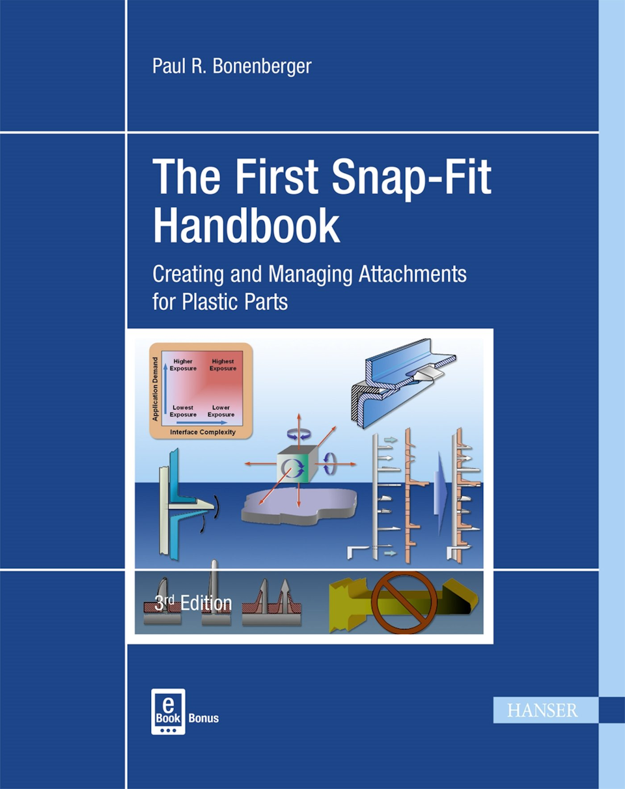
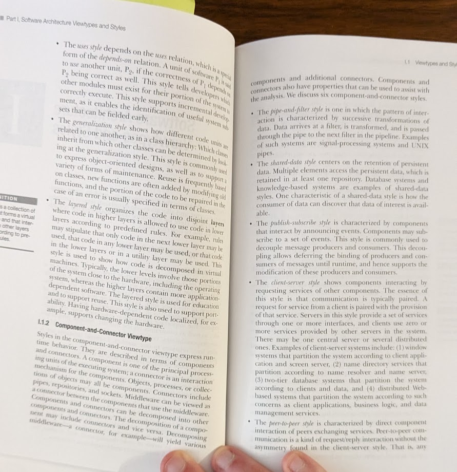
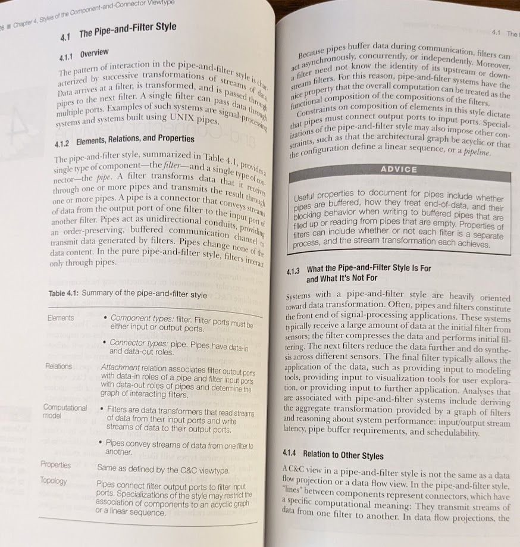

GOTO Chicago is over! My talk, “Is software engineering really engineering”, went over pretty well, and I’m happy with how it turned out.  

GOTO芝加哥结束了！我的演讲“软件工程真的是工程吗”进行得很好，我对结果很满意。  

I’m going to try submitting it to other conferences. Beyond that, [I have a TLA+ workshop I’m teaching on June 12th](https://www.eventbrite.com/e/software-modeling-with-tla-workshop-tickets-520033513237) and after that my next engagement is in September, so there’s a lot of time to take up with things.  

我将尝试将其提交给其他会议。除此之外，我在 6 月 12 日举办了一个 TLA+ 研讨会，之后我的下一次参与是在 9 月，所以有很多时间来处理事情。

(Use the code [C0MPUT3RTHINGS](https://www.eventbrite.com/e/software-modeling-with-tla-workshop-tickets-520033513237) for 10% off the TLA+ workshop! It’s a full day of hands-on experience, plus I give my students followup reviews on their specifications.)  

（使用代码 C0MPUT3RTHINGS 可在 TLA+ 研讨会上享受 10% 的折扣！这是一整天的实践经验，而且我会就他们的规格对我的学生进行后续评论。）

In the talk Q&A, one person disagreed with me with something I thought was really interesting and deserved a longer response.  

在谈话问答中，有一个人不同意我的观点，我认为这很有趣，值得更长的回应。

### My original claim 我的原始主张

As you may know, the talk was based on my [Crossover Project](https://www.hillelwayne.com/tags/crossover-project/), where I interviewed people who’ve done both tradition and software engineering.  

您可能知道，这次演讲是基于我的跨界项目，我采访了既从事传统工程又从事软件工程的人。  

I’m deeply interested in what’s needed to make our field more “engineering-like”, and the last part of the talk was about what the two worlds could learn from each other.  

我对使我们的领域更“像工程”所需要的东西非常感兴趣，谈话的最后一部分是关于两个世界可以相互学习的东西。  

We could say a lot about the high-level principles, like “community” or “responsibility”, but far more interesting is the _specifics_. It’s one thing to say that “traditional engineering needs more open conferences”, quite another to say “trad eng needs better version control!”  

关于高级原则，例如“社区”或“责任”，我们可以说很多，但更有趣的是细节。说“传统工程需要更多的开放会议”是一回事，说“传统工程需要更好的版本控制！”则是另一回事。

In the talk, I focused on one cool specific idea from trad engineering: hyperspecific learning material. I was inspired by this book an interviewee mentioned:  

在演讲中，我专注于传统工程中一个很酷的特定想法：超特定学习材料。我受到这本书的启发，一位受访者提到：

That’s a whole book on manufacturing snap fits! I said that there’s nothing like that in software: we talk about specific tools, but never about specific domains.  

这是一本关于制造按扣的整本书！我说过在软件中没有这样的东西：我们谈论特定的工具，但从不谈论特定的领域。  

What if we had a book on how to do versioning, or how to make a good plugin system! That’d go a long way to improving the state of our field.  

如果我们有一本关于如何进行版本控制或如何制作一个好的插件系统的书会怎样！这对改善我们领域的状况大有帮助。

### The Problem 问题

Someone objected to this. According to him, we’re not far along enough for these materials to be useful, and instead they’d ossify us. We don’t yet _know_ how to do versioning well in all cases, so a book on it would just get everybody to cargo cult a poor solution.  

有人对此表示反对。据他说，我们还远远不够让这些材料有用，相反它们会使我们僵化。我们还不知道如何在所有情况下都很好地进行版本控制，所以一本关于它的书只会让每个人都对货物崇拜一个糟糕的解决方案。

And he had a lot of experience backing this. He was an editor at a large software publisher and regularly sifts through _tons_ of low-quality “best-practices” submissions. He called them “summer projects”, like “what I did on my summer vacation”.  

他有很多经验支持这一点。他是一家大型软件出版商的编辑，经常筛选大量低质量的“最佳实践”提交。他称它们为“暑期项目”，就像“我在暑假做了什么”。  

Someone builds a system and decides to write a book saying “my is was the best way to make the system”.  

有人构建了一个系统并决定写一本书说“我的方法是构建系统的最佳方式”。  

Sometimes he’d get several books on the same topic, all saying “my way is the best way”, and they’d be different ways!  

有时他会得到几本关于同一主题的书，都说“我的方法是最好的方法”，而且它们的方法不同！

If it’s not clear already, this critique is coming from a person I deeply respect who’s done brilliant work in his field. It’s not something I can dismiss with “well why don’t _you_ interview 15 people”, and at the same time, I still disagree with this. Even if people aren’t doing this aggregation work well, it doesn’t mean the work isn’t worth doing!  

如果还不清楚，这个批评来自一个我非常尊敬的人，他在他的领域做了出色的工作。这不是我可以用“你为什么不采访 15 个人”来驳回的事情，与此同时，我仍然不同意这一点。即使人们没有做好这种聚合工作，也不意味着这项工作不值得做！

### My defense 我的辩护

#### The Research Process 研究过程

Let’s start by listing some of the things that we do in this kind of “survey chronicling”.<a href="https://buttondown.email/hillelwayne/archive/in-defense-of/#fn:chronicling">1</a> It’s hard to find material on this online, and none of my humanities books give it a definition, so I’m just going to invent my own process.<a href="https://buttondown.email/hillelwayne/archive/in-defense-of/#fn:own-process">2</a>  

让我们首先列出我们在这种“调查编年史”中所做的一些事情。 <a href="https://buttondown.email/hillelwayne/archive/in-defense-of/#fn:chronicling">1</a> 这个网上很难找到资料，而且我的人文书籍都没有给它一个定义，所以我只是想发明我自己的过程。 <a href="https://buttondown.email/hillelwayne/archive/in-defense-of/#fn:own-process">2</a>

1.  _Collection_: gathering material that’s out there and putting it in one place.  
    
    收集：收集外面的材料并将其放在一个地方。
2.  _Curation_: identifying which gathered material is useful for knowledge-building.  
    
    策展：确定哪些收集的材料对知识积累有用。
3.  _Analysis_: taking the curated material, breaking them down, and studying what they’re “saying”.  
    
    分析：获取精选材料，将它们分解，并研究它们在“说什么”。
4.  _Synthesis_: taking the analytic information and processing it into an overall idea.  
    
    综合：获取分析信息并将其处理成一个整体想法。

Synthesis is the stage that leads to “best practices”, under the process “projects that do X benefit and projects that don’t do X suffer.” The objection as I remember it is that there’s not enough material to collect, and we’ll do poor synthesis.  

综合是导致“最佳实践”的阶段，在“做 X 的项目受益，不做 X 的项目受损”的过程中。我记得反对意见是没有足够的材料可以收集，我们会做不好的综合。

What if we skip synthesis? If we don’t synthesize, we can’t synthesize _poorly_. And this is still useful! It’s even useful without the _analysis_:  

如果我们跳过合成怎么办？如果我们不综合，就不能综合得很差。这仍然有用！它甚至在没有分析的情况下也很有用：

1.  Just collection: The “awesome list of” repos on github that get a bazillion stars. People like these because collection is a long and tedious process.  
    
    Just collection：github 上获得无数星星的“很棒的”repos 列表。人们喜欢这些，因为收藏是一个漫长而乏味的过程。
2.  Collection + curation: Academic “survey papers”, or “literature reviews”. People like these because curation is a long and tedious process.  
    
    收藏+策展：学术“调查论文”，或“文献评论”。人们喜欢这些，因为策展是一个漫长而乏味的过程。

Analysis, too, is a long and tedious process, where you actually go into the details of your material.  

分析也是一个漫长而乏味的过程，您实际上需要深入研究材料的细节。  

Analysis without synthesis gives us a “snapshot of knowledge” at the time of research, a sense of what we already know without trying to create new knowledge.  

未经综合的分析为我们提供了研究时的“知识快照”，即在不尝试创造新知识的情况下了解我们已经知道的内容。  

Now this could quickly become outdated as we learn new things! But it accelerates the process of learning new things, as a lot of the long and tedious work is already done.  

现在，随着我们学习新事物，这可能很快就会过时！但它加速了学习新事物的过程，因为许多漫长而乏味的工作已经完成。

In contrast, a “summer project” resource _doesn’t_ do that tedious work for the user. I can’t pick up “The One True Plugin System” and get a sense of all of the plugin system landscape.  

相比之下，“暑期项目”资源不会为用户做那些乏味的工作。我无法选择“The One True Plugin System”并了解所有插件系统的概况。  

By doing analysis and synthesis from a single source, the writer skipped the necessary collection and curation, which is the bedrock of chronicling.  

通过从单一来源进行分析和综合，作者跳过了必要的收集和整理，这是编年史的基石。

#### An example of useful collection: connectors  

有用集合的示例：连接器

An example of this working properly is the book [Documenting Software Architectures](https://www.amazon.com/Documenting-Software-Architectures-Views-Beyond/dp/0321552687). They list six types of “connectors” between software components:  

一个正常工作的例子是 Documenting Software Architectures 一书。他们列出了软件组件之间的六种“连接器”：

You can tell the book is from the early 2000’s because it lists “peer-to-peer” as a major architectural motif. Napster and BitTorrent were Big Deals back then.  

你可以看出这本书是 2000 年代早期的，因为它将“点对点”列为主要的架构主题。 Napster 和 BitTorrent 是当时的 Big Deals。  

The list is only a snapshot of early 2000s architectural knowledge, and things have developed since then. Even so, reading it back in 2017 really helped me!  

该列表只是 2000 年代初期架构知识的一个缩影，从那时起事情就发生了变化。即便如此，在 2017 年阅读它确实对我有帮助！  

Having those six terms, with some discussion of tradeoffs and real-world examples, gave me a surer footing in talking about modern systems. Here’s what it says about “pipe-and-filter” architectures:  

有了这六个术语，再加上一些权衡取舍的讨论和现实世界的例子，让我在谈论现代系统时有了更坚实的基础。以下是它对“管道和过滤器”架构的描述：

That’s honestly not a huge amount of analysis right there, but it’s still more analysis of pipe-and-filter than I’d considered before, so it was a valuable read.  

老实说，这并不是大量的分析，但它对管道和过滤器的分析仍然比我之前考虑的要多，所以这是一本有价值的读物。

#### There’s plenty to collect  

有很多东西可以收集

The other objection is that there’s not enough material out there to collect: it took hundreds of years of doing civil and mechanical engineering to build up the body of knowledge necessary for chronicling.  

另一个反对意见是那里没有足够的材料可供收集：土木和机械工程需要数百年的时间才能建立编年史所需的知识体系。

I think this doesn’t hold for two reasons.  

我认为这不成立有两个原因。  

First of all, not all engineering fields took centuries: electrical engineering only got started in the 1800s and was fully mainstream as an “engineering discipline” by 1900. Second, we communicate with each other _much_ more than other fields do. There is no civil engineering equivalent of Github, or dev.to, or Strange Loop.  

首先，并非所有工程领域都经历了几个世纪：电气工程在 1800 年代才开始，到 1900 年才完全成为主流的“工程学科”。其次，我们彼此之间的交流比其他领域要多得多。没有土木工程等同于 Github、dev.to 或 Strange Loop。

Third, there _is_ enough material. To understand plugin systems better, here’s some potential projects we can look at:  

第三，材料充足。为了更好地理解插件系统，我们可以看看以下一些潜在的项目：

1.  WebExtensions, and the legacy addon system Firefox had before that  
    
    WebExtensions，以及 Firefox 之前的遗留插件系统
2.  Plugin systems for Eclipse, VSCode, Atom, Emacs, and Vim  
    
    Eclipse、VSCode、Atom、Emacs 和 Vim 的插件系统
3.  The six different Office plugin APIs, Google Workspace plugins, whatever Libreoffice does  
    
    六种不同的 Office 插件 API、Google Workspace 插件，无论 Libreoffice 做什么
4.  Sphinx, Jekyll, Wordpress, and Hugo plugins  
    
    Sphinx、Jekyll、Wordpress 和 Hugo 插件
5.  Plugins for game modding: Minecraft, Quake, Wesnoth, etc  
    
    游戏改装插件：Minecraft、Quake、Wesnoth 等

That’s five different _universes_ of plugin systems. Maybe, on aggregation, there’s some universal analysis you can do, or maybe you’ll have to approach each universe separately.  

这是五个不同的插件系统世界。也许，在聚合方面，您可以进行一些通用分析，或者您可能必须分别处理每个宇宙。  

The point is, there’s a lot of material out there!  

关键是，那里有很多材料！

Oh, and it’s _all open source_. We can see how the plugin systems are implemented! Many of the people who _built_ these systems have public emails and will answer questions! That’s crazy!  

哦，这都是开源的。我们可以看到插件系统是如何实现的！许多构建这些系统的人都有公共电子邮件，并且会回答问题！太疯狂了！

### What’s stopping us? 是什么阻止了我们？

This is always the question that kills my hopes and dreams, because it always has the same answer: the work is hard and unrewarding.  

这一直是扼杀我希望和梦想的问题，因为它总是有相同的答案：工作艰苦且没有回报。  

Nobody’s paying for it and it doesn’t lead to any academic prestige. I wonder how the “snap-fit handbook” happened. Shouldn’t it have had the same constraints?  

没有人为此付费，也不会带来任何学术声望。我想知道“snap-fit handbook”是怎么产生的。它不应该有同样的限制吗？

Okay, after a lot of searching, it seems that the author is someone who specializes in snap-fits, and has been specialized in that for over 40 years, so maybe it’s a “prestige” book.  

好吧，查了很多，好像作者是专门做卡扣的，而且做了40多年，应该是一本“威望”书吧。  

Lots of people write books (including me!) to establish themselves as an expert. Whoever makes the snapshot of knowledge can then be the Plugins Person.  

很多人写书（包括我！）来确立自己的专家地位。制作知识快照的人就可以成为插件人。  

So maybe the limiting factor is the market forces of consultancy.  

所以也许限制因素是咨询的市场力量。  

There’s lots of consulting shops for specific technologies, so they have incentives to write books on specific technologies, but I haven’t seen that many consulting shops for specific _problem domains_.  

有很多针对特定技术的咨询店，所以他们有动力写关于特定技术的书，但我还没有看到那么多针对特定问题领域的咨询店。
