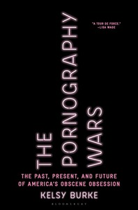

In the fictional world of the Broadway musical Avenue Q, Kate Monster is a puppet with a sweet demeanor, a lavender-colored turtleneck, and a bob hairstyle.  

在百老汇音乐剧 Q 大道的虚构世界中，Kate Monster 是一个举止甜美、身着淡紫色高领毛衣和波波头发型的木偶。  

She works as an assistant kindergarten teacher, and when she finally gets to teach a kindergarten lesson all by herself, she chooses to teach children about the wonders of the World Wide Web.  

她是一名幼儿园助理老师，当她终于可以独自教幼儿园课程时，她选择教孩子们了解万维网的奇妙之处。  

But when she describes her lesson to a reclusive, shaggy-haired neighbor named Trekkie Monster, he interrupts every line with what he says is the real reason for the Internet: porn.  

但当她向一位名叫 Trekkie Monster 的隐居、头发蓬松的邻居描述她的课程时，他打断了每一行，他说互联网的真正原因是：色情。

When Avenue Q premiered in 2003 with its song “The Internet is for Porn,” it became the first Broadway cast album to be released with a parental advisory label.  

当 Avenue Q 于 2003 年以其歌曲“The Internet is for Porn”首映时，它成为第一张带有家长咨询标签的百老汇演员专辑。  

At the time, a majority of American households, 62 million of them, owned a computer that connected to the internet.  

当时，大多数美国家庭（其中 6200 万）拥有一台连接到互联网的电脑。  

And when it came to its emergence, Trekkie Monster captured a widespread fear.  

当它出现时，Trekkie Monster 引起了广泛的恐惧。

“All-pornography, all-the-time,” is how Pamela Paul, the author of the 2005 book Pornified, put it.  

2005 年出版的 Pornified 一书的作者帕梅拉·保罗 (Pamela Paul) 是这么说的：“所有的色情内容，所有的时间。”  

According to her analysis, based on a number of internet polls not generalizable to the American population, virtually everyone had come across internet porn by the early aughts.  

根据她的分析，基于一些不能普遍适用于美国人口的互联网民意调查，几乎每个人都在早期接触过互联网色情内容。

But neither Trekkie Monster nor Paul quite captured the reality.  

但 Trekkie Monster 和 Paul 都没有完全捕捉到现实。  

The pornography industry’s profits at the turn of the century, with accurate estimates ranging from $2.6 billion to $10 billion annually, were far below those of other lucrative vices, such as the tobacco industry, with profits of around $45 billion, and gambling earning $50 billion.  

色情业在世纪之交的利润，准确估计在每年 26 亿美元到 100 亿美元之间，远低于其他利润丰厚的恶习，例如烟草业的利润约为 450 亿美元，赌博业的利润为 500 亿美元.

Most of the earliest online porn sites made money through paid subscriptions, in which users could tour for free but were forced to enter their credit card number to be charged for either a one-time pass or for various tiers of monthly memberships.  

大多数最早的在线色情网站都是通过付费订阅赚钱的，用户可以免费游览，但必须输入他们的信用卡号码才能获得一次性通行证或各种级别的月度会员资格。  

As early as 2000, owners of these sites were lamenting the decline in online profits, as those that were once able to charge $30 for a monthly membership were now charging $10 thanks to growing competition.  

早在 2000 年，这些网站的所有者就对在线利润的下降感到遗憾，因为那些曾经能够收取每月 30 美元会员费的网站现在由于竞争加剧而收取 10 美元。

Between 2000 and 2005, the Pew Research Center asked a national sample of American adults, “Do you ever visit an adult website?” and only 13 to 15 percent of respondents said yes.  

2000 年至 2005 年间，皮尤研究中心对美国成年人进行了全国抽样调查，“你是否访问过成人网站？”只有 13% 到 15% 的受访者表示是。  

This estimate is similar to data reported by the New York Times from the Juniper Media Metrix survey in 2001, which estimated 28 million users of pornographic websites that year.  

这一估计与《纽约时报》2001 年 Juniper Media Metrix 调查报告的数据相似，该调查估计当年有 2800 万色情网站用户。

This number sounds big, but comparing it to the total number Americans ages eighteen to sixty-four (just over 174 million in 2000) or the number of Americans with basic cable at the time (nearly 73 million households) suggests that internet porn was not quite the national epidemic that some assumed.  

这个数字听起来很大，但将其与 18 至 64 岁的美国人总数（2000 年刚好超过 1.74 亿）或当时拥有基本有线电视的美国人数量（近 7300 万户）相比，表明互联网色情不是完全是一些人认为的全国性流行病。

Porn viewership has steadily increased since the 1970s, especially among porn’s most loyal consumers, young adult men.  

自 1970 年代以来，色情收视率一直在稳步上升，尤其是在色情最忠实的消费者——年轻的成年男性中。  

Between 1973 and 1980, 45 percent of men ages 18 to 26 reported they had viewed porn in the past year, compared to 61 percent between 1999 and 2007. The internet did cause a jump in porn consumption, but for most Americans that increase was relatively small.  

1973 年至 1980 年间，45% 的 18 至 26 岁男性表示他们在过去一年中看过色情片，而 1999 年至 2007 年间这一比例为 61%。互联网确实导致了色情消费的激增，但对于大多数美国人来说，这种增长相对小的。  

In 1973, 31 percent of men across all ages reported that they had viewed porn, compared to 33 percent in 2000.  

1973 年，所有年龄段的男性中有 31% 表示他们看过色情片，而 2000 年这一比例为 33%。

These data come from the General Social Survey that tracks Americans’ reported consumption of porn, which may be different from their actual consumption.  

这些数据来自一般社会调查，该调查跟踪美国人报告的色情消费情况，这可能与他们的实际消费有所不同。  

Still, the authors of one study controlled for attitudes regarding pornography (that it should be illegal) and found that these attitudes remained relatively stable between the 1970s and early aughts, suggesting that people now are no more or less likely to report porn viewership honestly.  

尽管如此，一项研究的作者控制了人们对色情的态度（认为色情应该是非法的），发现这些态度在 1970 年代和早期事件之间保持相对稳定，这表明人们现在或多或少不太可能诚实地报告色情观看情况。

The internet did not cause a generation to suddenly become porn crazy.  

互联网并没有让一代人突然变得色情狂。  

We were already porn crazy, and men especially had long been exposed to dirty pictures through a variety of media prior to the World Wide Web.  

我们已经为色情片疯狂了，尤其是在万维网出现之前，男性早就通过各种媒体接触到色情图片。

John Stagliano, who produced the series _Adventures of Buttman_, reported to the New York Times that his production schedule had doubled between 1990 and 1993, along with his profits, which grew dramatically, from $34,000 to over $1 million.  

巴特曼历险记系列的制作人约翰·斯塔利亚诺向纽约时报报道说，他的制作计划在 1990 年到 1993 年间翻了一番，同时他的利润也从 34,000 美元急剧增长到超过 100 万美元。

Still, pornography by the turn of the twenty-first century had infiltrated virtually all forms of contemporary media: television, movies, magazines, and music.  

尽管如此，到 21 世纪之交，色情内容几乎已经渗透到所有形式的当代媒体：电视、电影、杂志和音乐。  

Commentators came up with various names to describe its impact; most agreed our society was “sexualized,” even “hypersexualized.”  

评论员想出了各种名称来描述它的影响；大多数人认为我们的社会已经“性化”，甚至是“过度性化”。

We lived in a “raunch culture,” said journalist Ariel Levy; in a “strip-tease culture,” according to journalism professor Brian McNair; and a “pornified culture,” a term bestowed by Pamela Paul.  

我们生活在一种“下流文化”中，记者 Ariel Levy 说；新闻学教授布赖恩·麦克奈尔 (Brian McNair) 表示，在“脱衣舞文化”中；和“色情文化”，这是帕梅拉·保罗（Pamela Paul）赋予的一个术语。

The growth of the pornography industry between 1998 and 2001 surpassed online shopping and other arts and entertainment industries.  

1998 年至 2001 年间色情行业的增长超过了在线购物和其他艺术和娱乐行业。  

Porn stars who were lucky enough to sign contracts with the two largest production companies, Vivid and Wicked Pictures, could make $10,000 a week by shooting two scenes.  

幸运地与两家最大的制作公司 Vivid 和 Wicked Pictures 签约的色情明星可以通过拍摄两个场景每周赚取 10,000 美元。  

Then they could go on to make even larger paydays from public appearances, like dancing at nightclubs.  

然后他们可以继续通过公开露面赚更多的钱，比如在夜总会跳舞。

Jenna Jameson, whom the New York Times called the “Julia Roberts of Straight Porn,” worked an exclusive contract with Wicked Pictures.  

珍娜·詹姆森 (Jenna Jameson) 被纽约时报称为“异性恋中的朱莉娅·罗伯茨 (Julia Roberts of Straight Porn)”，她与邪恶影业 (Wicked Pictures) 签订了独家合同。  

By 2001, she was earning around $60,000 per film.  

到 2001 年，她每部电影的收入约为 60,000 美元。  

She also appeared in mainstream Hollywood films and on television, was a regular on Howard Stern’s radio program, and wrote a bestselling memoir.  

她还出现在好莱坞主流电影和电视中，是霍华德斯特恩广播节目的常客，并撰写了畅销回忆录。

One porn industry mogul, John Stagliano, who produced the series _Adventures of Buttman_, reported to the _New York Times_ that his production schedule had doubled between 1990 and 1993, along with his profits, which grew dramatically, from $34,000 to over $1 million.  

制作了《屁屁人历险记》系列片的色情行业大亨约翰·斯塔利亚诺向《纽约时报》报告说，他的制作计划在 1990 年至 1993 年期间翻了一番，同时他的利润也从 34,000 美元急剧增长到超过 100 万美元。  

Not only was there the robust home video market, but there were also cable networks dedicated exclusively to adult entertainment, and the internet, which offered a new opportunity for paid home consumption.  

不仅有强劲的家庭视频市场，还有专门用于成人娱乐的有线网络和互联网，这为付费家庭消费提供了新的机会。

As David Marshlack, the founder of Entertainment Network, a company that owned thousands of pornographic websites, said at the end of the decade, “It’s as if I owned a bank and printed my own money.”  

正如拥有数千个色情网站的 Entertainment Network 的创始人大卫·马什拉克 (David Marshlack) 在十年末所说的那样，“就好像我拥有一家银行并印制自己的钱一样。”

In 1995, when only about one in four households had a computer and far fewer had an internet connection, the media was full of scary stories about the World Wide Web.  

1995 年，当时只有大约四分之一的家庭拥有计算机，而拥有互联网连接的家庭则少得多，媒体上充斥着有关万维网的恐怖故事。  

It was the year of the movie _The Net_, starring Sandra Bullock, a thriller whose villain was a contract killer hired by cyberterrorists. That July, the same month _The Net_ premiered in theaters, _Time_ magazine published an exclusive cover story featuring a “new study” by Marty Rimm on the startling dangers of internet pornography.  

那一年上映了由桑德拉·布洛克主演的惊悚片《网络》，这部惊悚片的反派是网络恐怖分子雇佣的合同杀手。那年 7 月，也就是《网络》在影院上映的同一个月，《时代》杂志发表了独家封面故事，刊登了马蒂·里姆 (Marty Rimm) 对网络色情的惊人危险进行的“新研究”。

In reality, the study was an 85-page undergraduate research paper, possibly partly plagiarized, that managed to get published in a law journal without undergoing any peer review.  

事实上，这项研究是一篇 85 页的本科生研究论文，可能部分被剽窃，但在没有经过任何同行评审的情况下成功发表在法律期刊上。  

With these delegitimizing details obscured at the time, the _Time_ story prompted coverage in news outlets around the country, including national television programs like Dateline.  

由于当时这些不合法的细节被掩盖了，《时代》杂志的故事引发了全国新闻媒体的报道，包括 Dateline 等国家电视节目。  

All discussed the so-called findings that 85 percent of images on the internet were pornographic, and many of those images would most certainly be judged obscene in the courts—images of children; of “deviant” behavior such as bestiality, urination, and defecation; and torture scenes.  

所有人都讨论了所谓的调查结果，即互联网上 85% 的图像是色情的，其中许多图像肯定会在法庭上被判定为淫秽图像——儿童图像；兽交、大小便等“越轨”行为；和酷刑场面。

In the weeks that followed, the internet fought back against its critic Mr. Rimm.  

在接下来的几周里，互联网对其批评者里姆先生进行了反击。  

Journalists, academics, and interested laypeople took to online message boards to tear apart the study’s findings, analysis, and conclusions and to ruin the reputation of Rimm, who was no social scientist but, rather, a scrappy entrepreneur who used his sensational writings for his own success.  

记者、学者和感兴趣的外行在网上留言板上撕毁研究的发现、分析和结论，并毁掉 Rimm 的声誉，Rimm 不是社会科学家，而是一个斗志旺盛的企业家，他利用他耸人听闻的著作为他的事业服务。自己的成功。

The proverbial final nail in the coffin came when the public learned that Rimm had, the year before, published _The Pornographer’s Handbook: How to Exploit Women, Dupe Men, and Make Lots of Money_.  

当公众得知 Rimm 在前一年出版了《色情作家手册：如何剥削女性、欺骗男性和赚大钱》时，棺材上的最后一颗钉子就敲响了。  

Rimm, it seemed, was trying on a variety of viewpoints when it came to porn, not based on conviction or science, but rather, to see what would most effectively lead to his fame and fortune.  

里姆似乎在尝试各种关于色情的观点，而不是基于信念或科学，而是想看看什么最能有效地让他名利双收。  

Now antipornography activists could hardly come to his defense.  

现在，反色情活动家几乎无法为他辩护。

Still, the dust that the Rimm study stirred was in the air.  

尽管如此，Rimm 研究激起的尘埃仍在空气中。  

Most politicians agreed that online content, especially pornography, needed regulations, but they faced a challenging puzzle over how to impose them.  

大多数政客都同意在线内容，尤其是色情内容需要监管，但他们面临着如何实施这些监管的难题。  

The internet was like the Wild West, a place where normal rules and expectations did not apply.  

互联网就像狂野的西部，一个正常规则和期望不适用的地方。  

The same year the Rimm study was debunked, Senator James Exon introduced his solution in the form of a Senate amendment, the Communications Decency Act (CDA).  

在 Rimm 研究被揭穿的同一年，参议员詹姆斯·埃克森以参议院修正案的形式介绍了他的解决方案，即《通信规范法》(CDA)。

The CDA was proposed as an amendment to the broader Telecommunications Act passed in 1996, which overhauled federal laws regulating telephone, television, and computer broadcast services for the first time in over 60 years.  

CDA 被提议作为对 1996 年通过的范围更广的电信法的修正案，该法案在 60 多年来首次全面修订了规范电话、电视和计算机广播服务的联邦法律。

Senator Exon, a conservative Democrat and former governor of Nebraska who never lost an election, made it his mission to ensure that, in his words, “the information superhighway should not become a red light district.” He proposed that the CDA explicitly prohibit using a telecommunications device to make or transmit obscene material.  

参议员埃克森是一位保守的民主党人和内布拉斯加州前州长，他从未在选举中失利，他的使命是确保用他的话说，“信息高速公路不应成为红灯区。”他建议 CDA 明确禁止使用电信设备制作或传输淫秽材料。  

Existing laws dating back to Comstock dealt only with transmission via the U.S. Postal Service.  

可追溯到康斯托克的现行法律仅涉及通过美国邮政服务的传输。

Another of the CDA’s explicit aims was to protect children as potential consumers of pornography.  

CDA 的另一个明确目标是保护儿童成为色情制品的潜在消费者。  

Throughout the 1980s, the relationship between kids and porn reflected a broader cultural panic over child sexual assault and abduction.  

在整个 1980 年代，儿童与色情片之间的关系反映了对儿童性侵犯和绑架的更广泛的文化恐慌。

In 1987, the FBI boasted 249 child pornography prosecutions, compared to only 3 in 1983. Prohibiting minors from consuming pornography had already been established through court precedent in 1968, when the Supreme Court ruled in Ginsberg v.  

1987 年，联邦调查局声称对儿童色情制品提起了 249 起诉讼，而 1983 年只有 3 起。禁止未成年人消费色情制品的规定早在 1968 年就已通过法院判例确立，当时最高法院在金斯伯格诉美国总统一案中作出裁决。  

New York that even if “material concerned with sex” could be legally sold to adults (i.e., was not deemed obscene), that material could not legally be sold to minors.  

纽约州认为，即使“与性有关的材料”可以合法地出售给成年人（即不被视为淫秽），该材料也不能合法地出售给未成年人。

The CDA articulated this precedent and applied it to the internet, criminalizing the use of “any interactive computer service to display in a manner available to a person under 18 years of age, any comment, request, suggestion, proposal, image, or other communication that, in context, depicts or describes, in terms patently offensive as measured by contemporary community standards.”  

CDA 阐述了这一先例并将其应用于互联网，将使用“任何交互式计算机服务以 18 岁以下人士可用的方式展示任何评论、请求、建议、提议、图像或其他通信”定为犯罪在上下文中，以当代社区标准衡量的明显冒犯性术语来描述或描述。”

Exon himself admitted that he had virtually no internet experience.  

埃克森本人承认他几乎没有互联网经验。  

A friend who was more technologically savvy than he downloaded and printed a series of pornography images, which Exon filed in a blue folder.  

一个比他更精通技术的朋友下载并打印了一系列色情图片，艾克森将其归档在一个蓝色文件夹中。  

Calling this the “blue book,” he stored it on his desk in Congress so that anyone could see the “filth” available online.  

他将其称为“蓝皮书”，并将其存放在国会的办公桌上，以便任何人都可以在网上看到“污秽”。

In Exon’s personal testimony, he implored Congress to pass the CDA.  

在埃克森的个人证词中，他恳求国会通过 CDA。  

“In my eight years as governor of Nebraska and my 17 years of having the great opportunity to serve my state in the Senate, there is nothing that I feel more strongly about than this piece of legislation,” he said.  

“在我担任内布拉斯加州州长的 8 年中，以及我有机会在参议院为本州服务的 17 年里，没有什么比这项立法让我感觉更强烈的了，”他说。

“The porn world was there for the taking,” Ronson reflects, “not by some gangster or some porn devotee, but by somebody techy.”  

“色情世界在那里，”Ronson 回忆道，“不是被某些黑帮或某些色情狂热分子所利用，而是被某些狡猾的人所利用。”

The CDA, as part of the Telecommunications Act, was passed by Congress with widespread support and signed into law by President Clinton.  

CDA 作为《电信法》的一部分，在国会获得广泛支持后获得通过，并由克林顿总统签署成为法律。  

One small provision of the Communications Decency Act that received little fanfare at the time was Section 230, which states that “no provider or user of an interactive computer service shall be treated as the publisher or speaker of any information provided by another information content provider.”  

当时很少有人大张旗鼓的《通信规范法》的一个小条款是第 230 条，其中规定“交互式计算机服务的提供者或用户不得被视为另一信息内容提供者提供的任何信息的发布者或发言人。 ”

In other words, website owners themselves were not to be held accountable for the content that others might post to their site.  

换句话说，网站所有者自己无需对其他人可能发布到其网站的内容负责。  

Thanks in part to the legal protection offered by this provision, three former PayPal employees started the video-sharing site YouTube in 2005. It was the first major online platform that made it easy for those with only basic computer skills to upload personal videos or recordings to share with other users.  

部分由于该条款提供的法律保护，三名前 PayPal 员工于 2005 年创办了视频共享网站 YouTube。这是第一个让只有基本计算机技能的人可以轻松上传个人视频或录音的主要在线平台与其他用户分享。  

The site, depicted with a computer whose screen was a mirror, was dubbed _Time_ magazine’s “Person of the Year” in 2006 and, by that time, had more than 25 million user-uploaded videos.  

该网站由一台屏幕为镜子的电脑描绘而成，在 2006 年被《时代》杂志评为“年度人物”，到那时，用户上传的视频已超过 2500 万。

Fabian Thylmann was a teenager living in Düsseldorf when the internet, and online porn along with it, was gaining momentum in the 1990s.  

法比安·蒂尔曼 (Fabian Thylmann) 还是个住在杜塞尔多夫 (Düsseldorf) 的少年，当时互联网和在线色情片在 1990 年代势头正盛。  

He wasn’t old enough to have a credit card, and so he found chat rooms where users traded passwords to get access to subscription sites.  

他还不够大，无法拥有信用卡，因此他找到了聊天室，用户可以在聊天室中交换密码以访问订阅网站。

With the benefit of hindsight, journalist Jon Ronson, who has written extensively about adult entertainment, names Thylmann’s early encounters bypassing porn sites’ paywalls as the beginning of a butterfly effect: the small and mundane choices made by a teenager that dramatically shaped internet pornography as we know it today.  

事后看来，撰写了大量关于成人娱乐的文章的记者乔恩·朗森 (Jon Ronson) 将 Thylmann 绕过色情网站付费墙的早期经历命名为蝴蝶效应的开始：一个青少年做出的微小而平凡的选择极大地塑造了互联网色情内容我们今天知道了。

“The porn world was there for the taking,” Ronson reflects, “not by some gangster or some porn devotee, but by somebody techy.” Thylmann, whom _New York_ magazine later referred to as among the geek-kings of smut (adding a technological adjective to a title adopted decades earlier by Larry Flynt), fit the bill.  

“色情世界在那里，”Ronson 回忆道，“不是被某些黑帮或某些色情狂热分子所利用，而是被某些狡猾的人所利用。” Thylmann，后来被《纽约》杂志称为色情极客之王（在拉里·弗林特几十年前采用的标题上加上一个技术形容词）符合要求。  

He became familiar with website production when he wrote code to track the traffic for a few online porn sites.  

当他编写代码来跟踪一些在线色情网站的流量时，他开始熟悉网站制作。  

By 2006, a handful of sites had emerged that followed the YouTube model. Thylmann managed to buy a small company called Mansef, which operated one of them. It was called Pornhub.  

到 2006 年，出现了一些遵循 YouTube 模式的网站。 Thylmann 设法收购了一家名为 Mansef 的小公司，该公司经营着其中一家公司。它被称为 Pornhub。

Thylmann changed the company name to Manwin and set out to convince investors to support his business, which he insisted was a technology company first and foremost.  

Thylmann 将公司名称更改为 Manwin，并着手说服投资者支持他的业务，他坚称这首先是一家科技公司。  

Its formal purpose, as agreed upon in a meeting of shareholders, was boring and nondescript: “the provision of technical services in the field of IT and website development as well as the associated administrative and organizational services of all kinds for affiliated companies as well as for other clients and third-party companies.”  

其在一次股东大会上商定的正式目的是乏味和难以描述的：“在 IT 和网站开发领域提供技术服务，以及为附属公司提供各种相关的行政和组织服务以及对于其他客户和第三方公司。”

Yet what this translated into in practice was buying up and overseeing the operation of porn sites.  

然而，这在实践中转化为收购和监督色情网站的运营。  

“I figured out that it seems to be an awfully good thing to buy adult websites in the current climate,” Thylmann told one reporter in 2011, “because you can get things cheap, and there are obvious ways to improve what they’re doing.”  

“我发现，在当前形势下，购买成人网站似乎是一件非常好的事情，”蒂尔曼在 2011 年对一位记者说，“因为你可以买到便宜的东西，而且有明显的方法可以改善他们正在做的事情”

\_\_\_\_\_\_\_\_\_\_\_\_\_\_\_\_\_\_\_\_\_\_\_\_\_\_\_\_\_\_\_\_\_\_

_From_ [THE PORNOGRAPHY WARS](https://www.bloomsbury.com/us/pornography-wars-9781635577365/)_. Used with the permission of the publisher, Bloomsbury. Copyright © 2023 by Kelsy Burke._  

来自色情战争。经出版商 Bloomsbury 许可使用。版权所有 © 2023 Kelsy Burke。

  

___
