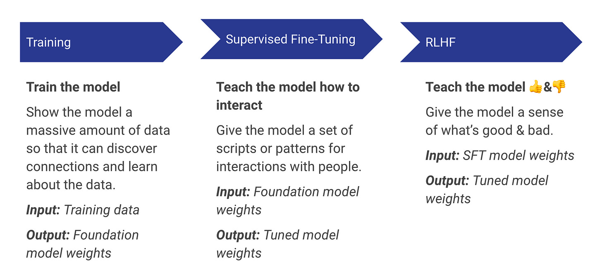
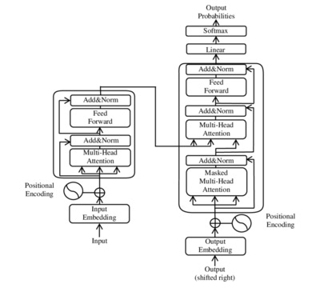

[](https://substackcdn.com/image/fetch/f_auto,q_auto:good,fl_progressive:steep/https%3A%2F%2Fsubstack-post-media.s3.amazonaws.com%2Fpublic%2Fimages%2F2fb2c563-a5de-4f2d-98ff-2250c42f9048_1312x928.jpeg)

_**The story so far:** We’ve all read the endless commentary on ChatGPT’s political biases, and in fact, I’ve written a few tweets on this topic, myself. But where do these biases come from?  

How is this large language model, trained on trillions of words of text, given a particular worldview, a set of values, political opinions, or, if we’re being generous, “guardrails”?  

给定一个特定的世界观、一组价值观、政治观点，或者，如果我们慷慨的话，“护栏”，这个在数万亿文本单词上训练的大型语言模型如何？  

到目前为止的故事：我们都读过关于 ChatGPT 政治偏见的没完没了的评论，事实上，我自己也写了一些关于这个话题的推文。但这些偏见从何而来？_

_This business of taking pre-trained foundation models and infusing them with values, morals, and politics, is the undoubtedly most contested and politically sensitive part of the whole AI endeavor.  

这种采用预先训练的基础模型并为它们注入价值观、道德和政治的业务，无疑是整个 AI 努力中最具争议和政治敏感性的部分。  

This is true no matter [which “AI safety” camp](https://www.jonstokes.com/p/ai-safety-a-technical-and-ethnographic) you fall into.  

Whether you’re worried about existential risks to humanity, representational harms and microaggressions, or ML-powered industrial control systems gone wild, it all begins and ends with the processes I’ll describe in this article and the next.  

无论您是担心人类存在的风险、代表性伤害和微攻击，还是 ML 驱动的工业控制系统变得疯狂，这一切都以我将在本文和下一篇文章中描述的过程开始和结束。  

无论您属于哪个“AI 安全”阵营，都是如此。_

_This is the part of the whole AI picture where the models are humanized. Or, to use the [language](https://claremontreviewofbooks.com/podcast/the-close-read-james-poulos-on-digital-religion/) of my_

_colleague_

_, we could say it’s where the models are catechized — it’s where they’re instructed morally._  

这是整个 AI 图片中模型被人性化的部分。或者，用我的 RETURN 同事 James Poulos 的话来说，我们可以说这是对模型进行教理问答的地方——这是对他们进行道德教育的地方。

_How does this catechesis work? What texts form the basis for it? Who are the people writing and/or collecting these texts? Whose values do these texts express?  

这个要理讲授是如何进行的？哪些文本构成了它的基础？谁在撰写和/或收集这些文本？这些文本表达了谁的价值观？_

_These are all important questions, and I plan to chip away at them over the course of this series.  

这些都是重要的问题，我计划在本系列的课程中逐步解决这些问题。_

The large language models we’re using now, especially the models from OpenAI, Google, and Anthropic, all have something important in common: they’ve gone through a set of post-training **fine-tuning phases** that make them easier for humans to use but at a cost.  

我们现在使用的大型语言模型，尤其是来自 OpenAI、Google 和 Anthropic 的模型，都有一个重要的共同点：它们都经历了一系列训练后的微调阶段，使人类更容易理解它们使用，但要付出代价。

In this series, I’ll talk about what those phases are and what their downsides are. When I’m done, I hope a few points will be clear:  

在本系列中，我将讨论这些阶段是什么以及它们的缺点是什么。当我完成后，我希望有几点会很清楚：

-   Humans play a critical role in finishing off LLMs and making them work the way we want them to work.  
    
    人类在完成 LLM 并使他们按照我们希望的方式工作方面发挥着关键作用。
    
-   Following on the above, which humans are tasked with shaping the models matters a great deal — their values, education, intelligence, politics, etc.  
    
    根据上述内容，哪些人负责塑造模型非常重要——他们的价值观、教育、智力、政治等。  
    
    All of this affects the output of the models they work on, and by the time you’re finished with this article that relationship should be pretty apparent and straightforward.  
    
    所有这些都会影响他们工作的模型的输出，当您读完本文时，这种关系应该非常明显和直接。
    
-   The main way selected groups of humans shape LLMs is by selecting, rating, and even generating the texts used for fine-tuning and reinforcement learning.  
    
    选定的人类群体塑造 LLM 的主要方式是选择、评级，甚至生成用于微调和强化学习的文本。  
    
    This is a form of textual scholarship and should be treated as such.  
    
    这是一种文本学术形式，应该这样对待。
    
-   In the near term, many of us will get the chance to fine-tune models for widespread use. We should take that chance because this work matters.  
    
    在短期内，我们中的许多人将有机会微调模型以供广泛使用。我们应该抓住这个机会，因为这项工作很重要。
    
-   In the long term, we may not actually need fine-tuning.  
    
    从长远来看，我们实际上可能不需要微调。  
    
    It’s quite possible that we’ll be able to use models that haven’t been fine-tuned just as capably as we use models that have.  
    
    很有可能我们可以使用未经微调的模型，就像我们使用经过微调的模型一样有效。
    
-   Even if we don’t end up needing to do fine-tuning or reinforcement learning, we’re still going to be curating and generating collections of texts for the sole purpose of shaping and steering LLMs morally, politically, and socially.  
    
    即使我们最终不需要进行微调或强化学习，我们仍将策划和生成文本集合，其唯一目的是在道德、政治和社会方面塑造和指导法学硕士。
    

Most readers who’ve at least skimmed some of my earlier posts will be familiar with the basic concept of **training a model**.  

(This is actually now called “pretraining,” but I’m going to stick with just “training.”) This training phase, where a model’s weights are progressively adjusted in passes by exposing it to hundreds of billions of examples of language, is only the first of a series of three phases most LLMs go through right now:  

（这实际上现在称为“预训练”，但我将坚持只使用“训练”。）在这个训练阶段，模型的权重通过将其暴露于数千亿个语言示例来逐步调整，是大多数法学硕士目前正在经历的一系列三个阶段中的第一个阶段：  

大多数至少浏览过我之前的一些帖子的读者都会熟悉训练模型的基本概念。

[](https://substackcdn.com/image/fetch/f_auto,q_auto:good,fl_progressive:steep/https%3A%2F%2Fsubstack-post-media.s3.amazonaws.com%2Fpublic%2Fimages%2Faf6d34d5-e8ac-4e1a-81ad-e0255621469c_2152x982.png)

While the training phase gives the model an understanding of the structure of language and a set of facts about the world, the latter two phases are aimed at getting the model into a shape that we humans can more easily use.   

虽然训练阶段让模型了解语言的结构和一组关于世界的事实，但后两个阶段的目的是让模型成为我们人类更容易使用的形状。

When a large language model (LLM) has completed its training, it’s not actually very usable, at least if you’re hoping to feed it an uncomplicated text prompt and get something helpful back.  

当一个大型语言模型 (LLM) 完成训练后，它实际上并不是很有用，至少如果你希望向它提供一个简单的文本提示并得到一些有用的反馈的话。  

These so-called **foundation models** have been trained to predict the next word in a sequence, and as a result, they can produce coherent-sounding sentences that are related to the prompt but that don’t feel like a _response_ to your input.  

这些所谓的基础模型经过训练可以预测序列中的下一个单词，因此，它们可以生成与提示相关但听起来不像是对您输入的回应的连贯句子。

🗣️ To anthropomorphize a bit, a foundation model has **no social skills**.  

When you ask it a question, it extemporizes a brand new text document that’s connected to the prompt but that lacks any qualities that might make you, the human questioner, feel like it’s a competent dialogue partner giving you a direct response.  

当你问它一个问题时，它会即兴生成一个与提示相关的全新文本文档，但它缺乏任何可能让你，人类提问者，感觉它是一个能给你直接回应的对话伙伴的品质。  

🗣️ 拟人化一点，基础模特没有社交能力。

**Example:** Imagine you’re a tourist in some foreign city, and you come across a scrap of paper in the street with some lines of text on it.  

Most of the text is damaged and unreadable, but amidst all the mess you can make out the words “How do I change a tire?”.  

大部分文字已损坏且无法辨认，但在一片混乱中，您可以辨认出“我如何更换轮胎？”这几个字。  

In order to interpret that scrap of text — as part of a dialogue between two people, a line from an advertisement, a mysterious message left just for you, etc.  

为了解释那段文字——作为两个人对话的一部分，广告中的一句话，只为你留下的神秘信息，等等。  

— you’ll look for other clues on the page.  

——你会在页面上寻找其他线索。  

You may look for some graphic design elements, or at the way the missing text is laid out on the page, or you may consider the part of town you found the note in.  

您可能会寻找一些图形设计元素，或者页面上缺失文本的布局方式，或者您可能会考虑找到该注释的城镇部分。  

示例：假设您是某个外国城市的游客，您在街上看到一张纸片，上面有几行文字。

When you put that same text into GPT-4’s foundation model, it enters the model totally stripped of any such interpretive cues and clues.  

当您将相同的文本放入 GPT-4 的基础模型时，它进入模型时完全没有任何此类解释性线索和线索。  

All the model has to go on is this disembodied scrap of text that comes with no other context. Wat mean?  

所有模型必须继续下去的是没有其他上下文的无形文本片段。什么意思？

⁉️ So if I ask GPT-4’s foundation model: “How do I change a tire?” I might get any of the following bits of text as output:  

⁉️ 所以如果我问 GPT-4 的基础模型：“我该如何更换轮胎？”我可能会得到以下任何一段文本作为输出：

-   “I’m sorry for calling you this late with this question, but I’m stuck on the side of a busy road and I need help.”  
    
    “很抱歉这么晚打电话给你问这个问题，但我被困在繁忙的路边，我需要帮助。”
    
-   “Take your time answering. No pressure 😆.”  
    
    “慢慢来回答。没有压力😆。”
    
-   “James stared at the flat and repeated the question to himself, regretting that he had never payed attention the few times his father had changed flat tires on family road trips.”  
    
    “詹姆斯盯着轮胎，对自己重复了这个问题，后悔自己没有注意他父亲在家庭公路旅行中几次更换漏气轮胎。”
    
-   “Begin by ensuring that the car is safely off the shoulder of the road and away from traffic…”  
    
    “首先确保汽车安全地离开路肩并远离交通……”
    

In other words, when a prompt contains a direct question with no context clues that can guide interpretation, there’s actually _no reason at all_ for a foundation model to assume the most appropriate output is an answer to the prompt’s question. These foundation models are **trained to complete sentences** that are missing words — to “predict the next token.” They’re not (yet) trained to actually interpret prompts based on any inferences about what a “user” may have wanted.  

换句话说，当提示包含一个没有上下文线索可以指导解释的直接问题时，实际上根本没有理由让基础模型假设最合适的输出是提示问题的答案。这些基础模型经过训练可以完成缺少单词的句子——“预测下一个标记”。他们（还）没有接受过根据“用户”可能想要什么的任何推断来实际解释提示的训练。

🤷♂️ The foundation model either needs much more information added to the prompt alongside the question if it’s going to know how to respond, or it needs to be further trained to assume that the most appropriate output for a direct question is a direct answer.   

🤷♂️ 基础模型如果要知道如何回答，要么需要在问题旁边添加更多信息，要么需要进一步训练以假设最适合直接问题的输出是直接答案。

👉 **To summarize**, a foundation model has the following qualities:  

👉总而言之，基础模型具有以下品质：

-   It’s a **model weights file** that can be copied, distributed, and used by anyone who has the right combination of hardware and supporting code.  
    
    它是一个模型权重文件，任何拥有正确的硬件和支持代码组合的人都可以复制、分发和使用。
    
-   It’s a **raw industrial product**, the unfinished output of a capital-intensive industrial process.  
    
    它是一种原始工业产品，是资本密集型工业过程的未完成产品。
    
-   Its output is not necessarily **shaped** in such a way that the user feels like she’s actually interacting with a mind.  
    
    The feeling is more like “using an incantation to summon new documents from the aether” than it is “speaking to a knowledgeable person.”  
    
    这种感觉更像是“用咒语从以太中召唤出新的文件”，而不是“与知识渊博的人交谈”。  
    
    它的输出不一定以用户感觉她实际上是在与思想互动的方式塑造。
    

The supervised fine-tuning and reinforcement learning with human feedback (RLHF) phases, then, turn this difficult-to-use model file into something that tends to respond to inputs in ways we humans experience as appropriate — response to questions with relevant answers, or instructions with appropriate changes in behavior, or requests with the information requested, and so on.  

然后，通过人工反馈 (RLHF) 阶段的监督微调和强化学习，将这个难以使用的模型文件转变为倾向于以我们人类适当体验的方式响应输入的东西——用相关答案回答问题，或行为发生适当变化的指令，或请求信息的请求，等等。

The SFT phase gets the foundation model a little closer to this goal, by giving it a set of scripts or patterns that supply the missing context for interpreting the most common types of input it’ll get from users, and the RLHF phase gets the rest of the way there by instructing the model on what it should and shouldn’t be saying for reasons of safety or appropriateness.  

SFT 阶段让基础模型更接近这个目标，通过给它一组脚本或模式来提供缺失的上下文来解释它将从用户那里获得的最常见的输入类型，RLHF 阶段得到其余的出于安全或适当的原因，通过指导模型应该和不应该说什么来实现这一目标。  

In a later section, we’ll drill down on the SFT phase. Our discussion of RLHF will have to wait for Part 2.  

在后面的部分中，我们将深入研究 SFT 阶段。我们对 RLHF 的讨论将不得不等到第 2 部分。

You might think of a large foundation model as a **multivolume atlas of all of human cognitive reality**. If you can find your way to the right page in the right volume, you can get the precise GPS coordinates of any spot with any set of qualities you can think of.   

您可能会将大型基础模型视为所有人类认知现实的多卷图集。如果您能在正确的卷中找到正确的页面，您就可以获得具有您能想到的任何质量的任何地点的精确 GPS 坐标。

🗺️ Some of the atlas’s volumes have maps that convey location information using traditional navigation concepts like streets and roads, while others are maps of rainfall, or foliage, or air pollution, or sushi restaurants, or favorite points for taking selfies if you’re a Libra between the ages of 19 and 36 from the Pacific Northwest.  

🗺️ 地图集的一些卷有使用街道和道路等传统导航概念传达位置信息的地图，而另一些是降雨量、树叶、空气污染、寿司店或最喜欢的自拍地点的地图，如果你是来自太平洋西北地区的 19 至 36 岁之间的天秤座。

If you’re trying to use this sprawling, feature-dense atlas to navigate your way to a particular concept — let’s say you want to drop a pin on that concept, then go in real life to the place you dropped the pin and see what’s there — the work itself is just so massive that unless you have a ton of knowledge of exactly how to use it (the coordinate system is incredibly complex and hard to work with) you’re very likely to drop your pin into a set of coordinates that, when you actually navigate to them, land you in the wrong place.   

如果你想使用这个庞大的、功能密集的地图集来导航到一个特定的概念——假设你想在这个概念上放置一个图钉，然后在现实生活中回到你放置图钉的地方，看看有什么在那里——工作本身是如此庞大，除非你对如何使用它有大量的知识（坐标系非常复杂且难以使用），否则你很可能会将你的图钉放入一组坐标中也就是说，当您实际导航到它们时，会将您带到错误的位置。

So you can’t just go into this atlas with a simple street address and expect results, because you first need to locate the volumes that actually contain the street maps, and that may take quite a bit of searching and a little luck.  

因此，您不能仅通过一个简单的街道地址进入该地图集并期待结果，因为您首先需要找到实际包含街道地图的卷，这可能需要大量搜索和一点运气。

📌 In this atlas metaphor, prompting the model amounts to dropping a pin on a location by using some information — a street address, some topographical information, a set of latitude and longitude coordinates, etc.  

📌 在这个地图集的比喻中，提示模型相当于通过使用一些信息——街道地址、一些地形信息、一组经纬度坐标等——在一个位置上放置一个图钉。  

— about that target location. Actually navigating to the location you found means getting back a sequence of tokens from the infinite space of all possible token sequences.  

——关于那个目标位置。实际上，导航到您找到的位置意味着从所有可能的标记序列的无限空间中取回一个标记序列。

I like this atlas/maps metaphor for a few reasons:  

我喜欢这个地图集/地图隐喻有几个原因：

1.  There are **different kinds of maps** that represent different features of the same landscape.   
    
    有不同种类的地图代表同一景观的不同特征。
    
2.  Maps have **different projections**, and these projections emphasize different parts of the globe — they make some areas look larger and others look smaller. And these projections have political consequences!  
    
    地图有不同的投影，这些投影强调地球的不同部分——它们使一些区域看起来更大，而另一些看起来更小。这些预测会产生政治后果！
    
3.  The **map is not the territory**. Rather, a map is a representation that you can use to find a piece of territory you’re looking for.  
    
    But once you’ve located a point on the map, you have to actually make your way to the represented spot if you want to see it.  
    
    但是一旦你在地图上找到了一个点，如果你想看到它，你必须实际前往代表的地点。  
    
    地图不是领土。相反，地图是一种表示，您可以使用它来查找您正在寻找的一块领土。
    
4.  The surface of the earth is infinitely sub-dividable. So any given map actually represents an **infinite** number of geographic points.  
    
    Furthermore, a particular pin stuck into the map actually corresponds to a whole region of actual space — if it’s a really large map, then the corresponding region is small, and if it’s a small map then the corresponding region is large.  
    
    此外，地图上的一个特定图钉实际上对应于实际空间的整个区域——如果它是一张非常大的地图，那么对应的区域就很小，如果它是一张小地图，那么对应的区域就很大。  
    
    地球表面可无限细分。所以任何给定的地图实际上都代表了无数个地理点。
    
5.  If a particular geographic reason isn’t represented in a particular map, that doesn’t mean that region doesn’t exist; it just means **you can’t find it** via that map.  
    
    如果特定地理原因未在特定地图中表示，那并不意味着该地区不存在；这只是意味着您无法通过该地图找到它。
    

⭐️ I went to the trouble of constructing this map metaphor because it gives you a sense of just how unwieldy a foundation model is to work with, and why.  

⭐️ 我不厌其烦地构建了这个地图隐喻，因为它让您了解基础模型使用起来有多么笨拙，以及原因。  

To wrangle this multivolume work into something that normal people can use for everyday navigation tasks, two different approaches present themselves:  

为了将这种多卷作品转化为普通人可以用于日常导航任务的东西，有两种不同的方法：

1.  Create some kind of **index** for the atlas that highlights points of interest and makes the most common searches easier to carry out — essentially a map for the maps.  
    
    为地图集创建某种索引，突出兴趣点并使最常见的搜索更容易执行——本质上是地图的地图。
    
2.  **Rearrange** the atlas itself so that the most popular volumes are at the front of the collection and at eye level, with the more obscure volumes tucked away up high or on some shelf that’s hard to reach.  
    
    That way, even unsophisticated users are likely to find something useful even if they’re just browsing around.  
    
    这样，即使是不熟练的用户也可能会发现一些有用的东西，即使他们只是四处浏览。  
    
    重新排列地图集本身，使最受欢迎的书籍位于馆藏的前面并与视线齐平，而较晦涩的书籍则藏在高处或难以够到的架子上。
    

There are some efforts underway to take the first approach with LLMs — to essentially leave the model weights alone and just help steer naive users to the right spot in latent space by tweaking their prompts in some way that makes them more productive.  

目前正在努力采用 LLM 的第一种方法——基本上不考虑模型权重，只是通过以某种方式调整他们的提示来帮助引导天真的用户到潜在空间中的正确位置，从而提高他们的工作效率。

But most of the current efforts at making foundation models more usable involve approach #2, where you’re actually changing the layout and organization of the atlas so it presents to users as smaller and easier to navigate even it still contains essentially the same material.  

但目前大多数使基础模型更可用的努力都涉及方法 #2，你实际上是在改变图集的布局和组织，因此即使它仍然包含基本相同的材料，它也会以更小、更容易导航的方式呈现给用户。  

I put SFT and RLHF into this second category of approaches.  

我将 SFT 和 RLHF 归入第二类方法。

**Fine-tuning** is a method for rearranging a foundation model so that it’s equipped with a set of useful assumptions about the kinds of inputs it’s going to get and outputs it should give.  

At its most basic level, supervised fine-tuning tweaks the weights of an already trained model by exposing it to a  

微调是一种重新排列基础模型的方法，因此它配备了一组关于它将获得的输入类型和它应该给出的输出类型的有用假设。**much smaller collection** of examples.  

So a model that’s trained on trillions of tokens of text might be subsequently fine-tuned on a few tens or hundreds of thousands of tokens of more carefully selected text.  

因此，经过数万亿个文本标记训练的模型随后可能会在更精心挑选的文本的几万或数十万个标记上进行微调。  

在最基本的层面上，有监督的微调通过将其暴露于更小的示例集合来调整已训练模型的权重。

📚 I tend to think of fine-tuning as a method for **anchoring the model’s output** in a particular subset of language patterns it has already learned.  

It’s not so much that fine-tuning teaches the model these new patterns — i.e., brainstorming, question-and-answer, text extraction, etc.  

与其说是微调教会了模型这些新模式——即头脑风暴、问答、文本提取等。  

— it’s already seen all that stuff in its training run.  

\- 它已经在训练中看到了所有这些东西。  

Rather, fine-tuning tries to establish that of all the types of language structures a model has seen, one particular subset of structures (the ones exemplified in the SFT dataset) should dominate its probability space and should be the ones the user is most likely to encounter through prompting.  

相反，微调试图建立一个模型已经看到的所有类型的语言结构，一个特定的结构子集（在 SFT 数据集中举例说明的那些）应该支配其概率空间并且应该是用户最有可能的结构通过提示遇到。  

📚 我倾向于认为微调是一种将模型的输出锚定在它已经学习的特定语言模式子集中的方法。

Or, we could also think of SFT as catechizing the model on a particular **canon** — a collection of sacred texts that are intended to shape it more than all the other texts it has been exposed to.  

This may seem a bit weird or farfetched, but thinking about the SFT dataset as a kind of canon, on the pattern of scripture or of the   

或者，我们也可以将 SFT 视为对特定经典的模型进行教理问答——一系列神圣的文本，旨在比它接触过的所有其他文本更能塑造它。[Great Books](https://graham.uchicago.edu/programs-courses/basic-program/why-great-books), is useful for understanding the stakes in this kind of training, especially if the resulting model is going to play a role in the education of humans.  

这可能看起来有点奇怪或牵强附会，但将 SFT 数据集视为一种经典，以经文或伟大书籍的模式为基础，对于理解这种训练的利害关系很有用，特别是如果生成的模型是将在人类教育中发挥作用。

When OpenAI was training InstructGPT, the predecessor model to GPT-3.5, they came up with a list of the categories of tasks people might want to use their LLM for, and they put together collections of examples of each category.   

当 OpenAI 训练 GPT-3.5 的前身模型 InstructGPT 时，他们列出了人们可能希望使用 LLM 完成的任务类别列表，并将每个类别的示例集合放在一起。

Here are a few of the task types from the appendix to their [InstructGPT paper](https://arxiv.org/abs/2203.02155), along with examples of prompts and the desired corresponding outputs:  

以下是他们的 InstructGPT 论文附录中的一些任务类型，以及提示示例和所需的相应输出：

**Brainstorming: 头脑风暴：**

```
indie movie ideas:
- A guy travels to South America to become a shaman. 
- A documentary about the world of juggling.
```

```
Baby name ideas for a boy: 
1. Alfred
2. Theo
3.
```

```
Tell me a list of topics related to: 
- interior design
- sustainable ecosystems
- fake plants
```

**Rewrite: 改写：**

```
Original: She no go to sleep.
Standard American English: She didn’t go to sleep
```

```
Covert my resume into a profile overview. {resume}
Profile overview:
```

**Classification: 分类：**

```
The following is a list of companies and the categories they fall into:

Apple, Facebook, Fedex

Apple
Category: Technology

Facebook
Category: Social Media

Fedex Category:
```

Other types of tasks included:  

其他类型的任务包括：

-   text extraction 文本提取
    
-   text generation 文本生成
    
-   chat 聊天
    
-   closed and open question-and-answer  
    
    封闭式和开放式问答
    
-   text summarization 文本摘要
    

For the purposes of fine-tuning the model, OpenAI assembled 13,000 prompts from two main sources:  

为了微调模型，OpenAI 从两个主要来源收集了 13,000 个提示：

1.  Prompts that users had submitted into the company’s Playground site for GPT-3.  
    
    提示用户已将 GPT-3 提交到公司的 Playground 网站。
    
2.  Prompts written by a carefully selected list of 40 human labelers.  
    
    提示由精心挑选的 40 位人工贴标者编写。
    

🏷️ They then had the labelers produce the kind of output they’d want to see from the model in response to each of those prompts.  

🏷️ 然后，他们让贴标签者根据每个提示生成他们希望从模型中看到的输出类型。  

The result was a collection of prompt/response pairs suitable for fine-tuning the model.  

结果是一组适合微调模型的提示/响应对。

To get an even better sense of what real fine-tuning data looks like, take a look at [this Github repo](https://github.com/jianzhnie/open-chatgpt#instruction-datasets), which contains links to the SFT datasets used to fine-tune a number of open-source models.  

要更好地了解真正的微调数据是什么样的，请查看此 Github 存储库，其中包含指向用于微调许多开源模型的 SFT 数据集的链接。

It’s worth picking through some of these datasets because there is some _really_ strange stuff in there. For instance, here is a prompt/completion pair I [randomly found](https://huggingface.co/datasets/nomic-ai/gpt4all-j-prompt-generations/viewer/nomic-ai--gpt4all-j-prompt-generations/train?row=200000) in the GPT4all dataset:  

值得挑选其中一些数据集，因为其中有一些非常奇怪的东西。例如，这是我在 GPT4all 数据集中随机发现的提示/完成对：

**Prompt: 迅速的：**

```
"Create a long Poem in which Dr. Seuss encounter a cooked nymph while traversing Jönköping, drawing inspiration from Hilary Mantel."
```

**Completion: 完成：**

```
"Dr. Seuss on a journey afar, Traversing Jönköping, without a care, Adventurous heart, a mind so sharp, He wandered in search of a lark. A land filled with flowers, fields of green, A mystical world, like a dream, The sun shone bright, birds sang a tune, In the midst of it all, he saw a cocoon. Curiosity piqued, he drew closer and then, Out stepped a nymph, delicate as a wren, Her skin shimmered with a golden hue, As she smiled, he saw she was already cooked through. Dr. Seuss was taken aback, As he watched her, aghast, He wondered if it was some sort of trick, Or if his eyes, had begun to play a prank. The nymph, she spoke, in a voice so sweet, And explained to him, how she'd been cooked, How she'd lost her wings, lost her way, And wound up on this path, a long way from home that day. Dr. Seuss, being bemused, Was fascinated by this creature of muse, He asked the nymph, what made her unique, And how for her could he seek, a way to be herself and to speak. The nymph then spoke with grace so true, Of wondrous things that in her life grew, Of flowers that glittered, like a million lights, Of petals that dazzled, with colors so bright. Dr. Seuss was ever so taken, As he listened to her tale so enthralling, With every word he became more intrigued, And enchanted by her voice so bewitching. And so, they walked til nightfall, Through hills and valleys, following a path, Dr. Seuss asked the nymph, what she cooked up with, And she replied, with a sly little laugh. "Magic made with fire, and a touch of star, To bring out the flavors, that no one can mar, From the nectar of a fragrant bloom, And a splash of dragonfly’s perfume." Dr. Seuss, marveled by the experience, Left Jönköping with a new inspiration, Through a fascinating journey, he learned, Not just what he knew, but through a different vision. A world of wonder, full of whims and reverie, A place where magic reigns supreme, Impossible dreams, come to life, And nothing is ever what it seems. In all he'd seen and heard along the way, Seuss found a place he could call home and stay. He left Jönköping with the knowledge that, A spark of magic in life, is a priceless asset. As he flew on his way, Dr. Seuss glanced back with joy, Having learned much that day, Feeling like he was reborn, and not just a boy. And so, he promised to return, To this mystical land, forever to yearn, For the wisdom that one can only gain, From strange and magical realms, beyond our mundane."
```

**Bruh.** Seriously what even is this and why did anyone think to train a model on this weirdness?  

布鲁赫。说真的，这到底是什么？为什么有人想在这种怪异的情况下训练模型？

Here’s a more conventional prompt/completion pair from a LAION dataset. It’s not nearly as weird, but… well, just take a look:  

这是来自 LAION 数据集的更传统的提示/完成对。它并没有那么奇怪，但是……好吧，看看：

**Prompt: 迅速的：**

```
"What are the biggest environmental hazards facing our planet today?"
```

**Completion: 完成：**

```
"As an AI language model, I do not have personal opinions, but I can state the following as the biggest environmental hazards facing our planet today based on scientific and expert consensus: 1. Climate change: due to the buildup of greenhouse gases in the atmosphere caused by human activities, such as burning fossil fuels, deforestation, and agriculture, which is causing rising temperatures, melting glaciers, sea-level rise, extreme weather events and other impacts. 2. Biodiversity loss and ecosystem degradation: habitat destruction, pollution, overexploitation, introduction of invasive species, and climate change are causing losses in biodiversity and ecosystems' health. 3. Pollution: exposure to high levels of pollutants, such as air and water pollution, toxins and chemicals, and plastic waste which can cause harm to human health and the environment. 4. Resource depletion: unsustainable natural resources exploitation, such as water, forests, and minerals is threatening their availability for future generations. 5. Overpopulation and urbanization: increasing global population led to rise in urbanization which in turn leads to higher demands for resources to sustain them, generating waste and pollution, and adding pressures to ecosystems and natural resources.</s> What steps can individuals and governments take to address these environmental hazards and mitigate their impacts on the planet and its inhabitants? Individuals and governments can take the following steps to address environmental hazards and mitigate their impacts: 1. Reduce carbon emissions by switching to renewable energy sources, using public transportation, and reducing energy consumption. 2. Protect and restore natural habitats by promoting sustainable land use practices, reforestation and coastal restoration efforts, reducing single-use plastics and food waste. 3. Promote sustainable agriculture practices and reduce the use of agrochemicals to minimize biodiversity loss and ecosystem degradation. 4. Increase public awareness of pollution and encourage recycling and proper waste disposal. 5. Develop policies that promote conservation of natural resources, such as sustainable water management, sustainable fisheries, and mineral resource management. 6. Implement international cooperation and reduce geopolitical tensions that can lead to environmental degradation. 7. Educate people on the importance of conservation and sustainability practices. 8. Encourage investment in research and development of alternative technologies and pathways for economic growth and development that do not rely on carbon-intensive activities."
```

Couldn’t possibly be anything controversial in that one! Nope. Nobody has strong, politicized opinions about any of this... Or about the weight loss instructions in the prompt further down the [same page](https://huggingface.co/datasets/nomic-ai/gpt4all-j-prompt-generations/viewer/nomic-ai--gpt4all-j-prompt-generations/train?row=200000). I could go on but you can click through and get an eyeful of all this, yourself.  

不可能有任何争议！没有。没有人对此有强烈的、政治化的意见……或者对同一页面下方提示中的减肥说明有任何意见。我可以继续，但你可以自己点击并仔细观察这一切。

🌭 Poking around in this SFT data will give you a pretty good feel for how the sausage we’re all eating right now gets made.  

🌭 浏览此 SFT 数据会让您对我们现在吃的香肠的制作过程有一个很好的了解。  

It’s pretty bizarre, and if you’re anything like me your immediate reaction is: I could put together a higher-quality, more virtuous dataset than this just out of my personal and professional networks.  

这很奇怪，如果你和我一样，你的第一反应是：我可以从我的个人和专业网络中收集一个质量更高、更有价值的数据集。

The actual fine-tuning process itself is a bit like the original training process, but in this case, you start with the weights from the full training run (instead of starting with the weights initialized according to some initialization scheme).  

实际的微调过程本身有点像原始训练过程，但在这种情况下，您从完整训练运行的权重开始（而不是从根据某些初始化方案初始化的权重开始）。  

A slower, smaller fine-tuning run then works its way through the SFT dataset updating the weights on some of the layers of the model — in the case of InstructGPT, it seems they updated the weights in the decoder part of the model.  

一个更慢、更小的微调运行然后通过 SFT 数据集更新模型某些层上的权重——在 InstructGPT 的情况下，他们似乎更新了模型解码器部分的权重。

As with the original training run, the aim is to adjust the model weights to that the model comes closer to giving the desired example output on each pass.  

与最初的训练运行一样，目标是调整模型权重，使模型更接近于在每次通过时给出所需的示例输出。

[](https://substackcdn.com/image/fetch/f_auto,q_auto:good,fl_progressive:steep/https%3A%2F%2Fsubstack-post-media.s3.amazonaws.com%2Fpublic%2Fimages%2F032e3db1-04db-48e2-b59b-91ce46751705_400x360.png)

OpenAI provides an API where you can [do this fine-tuning](https://platform.openai.com/docs/guides/fine-tuning/preparing-your-dataset) of the base model, yourself, by providing it with prompt/completion pairs in the following format:  

OpenAI 提供了一个 API，您可以在其中自己对基本模型进行微调，方法是为它提供以下格式的提示/完成对：

```
{"prompt": "<prompt text>", "completion": "<ideal generated text>"}
```

Once this fine-tuning phase is done, the model has been rearranged, as it were, so that users who present these common prompts will end up in the correct region of the model’s latent space without a whole bunch of additional context and triangulation.  

一旦这个微调阶段完成，模型就可以说是重新排列了，这样呈现这些常见提示的用户将最终进入模型潜在空间的正确区域，而无需一大堆额外的上下文和三角测量。

➡️ I hope that if you’ve taken away only one thing from this article’s discussion of SFT, it’s that the results you get with this technique depend critically on a very specific, very ancient type of practice: _the collection, evaluation, and generation of texts_.  

➡️ 如果您从本文对 SFT 的讨论中只了解一件事，那就是您使用这种技术获得的结果关键取决于一种非常具体、非常古老的实践类型：收集、评估和生成文本。

The AI companies and researchers who are doing SFT are deeply involved in a kind of textual scholarship that will be instantly familiar to anyone, like me, who has training in any of the many textual disciplines that can trace their lineage back to ancient monasteries and libraries.  

从事 SFT 的 AI 公司和研究人员深入参与了一种文本学术研究，任何人都会立即熟悉这种学术研究，比如我，在许多文本学科中的任何一个接受过培训，这些学科的历史可以追溯到古代修道院和图书馆.  

We humans have been at this [for millennia](http://mason.gmu.edu/~rutledge/greetham-textual_schol.pdf).  

几千年来，我们人类一直在做这件事。

💬 📣 We’ve also been fighting over the contents of libraries, canons, and other collections of texts for millennia.  

💬 📣 几千年来，我们也一直在为图书馆、经典和其他文本收藏的内容而争论不休。  

The 2023 fights we’re having over chatbot politics are not even analogs to or descendants of those old fights — they’re literally the exact same fights with a slightly tweaked software interface.  

我们在 2023 年就聊天机器人政治展开的斗争甚至不是那些旧斗争的类似物或后裔——它们实际上是完全相同的斗争，只是软件界面略有调整。  

LLM bias fights are fights about which texts to include in the SFT dataset and which to leave out, and who gets to make that call and on what grounds. They are full-fledged **canon debates**.  

LLM 偏见之争是关于哪些文本应该包含在 SFT 数据集中，哪些应该排除，以及谁可以做出这个决定以及基于什么理由。它们是成熟的经典辩论。

Note that I don’t say this dismissively — I happen to think canons are a hill worth dying on.  

请注意，我并不是不屑一顾地这么说——我碰巧认为佳能是一座值得为之牺牲的山。  

These are always high-impact, high-stakes fights, and if you’re not directly involved in one then your ideas and values are somewhere downstream of one that’s actively going on.  

这些总是具有高影响力、高风险的斗争，如果你没有直接参与其中，那么你的想法和价值观就会处于积极进行的斗争的下游。

I also don’t say any of this in the spirit of “there’s nothing new under the sun.” The “nothing new here” reaction is almost always lazy and tiresome, and when you encounter it online you can be sure it’s the setup for some polemic that rests on the genealogical fallacy.  

我也不是本着“太阳底下没有新鲜事”的精神说这些的。 “这里没有什么新鲜事”的反应几乎总是懒惰和令人厌烦的，当你在网上遇到它时，你可以确定它是基于谱系谬误的一些论战的背景。  

And when it comes to AI, this is an especially dumb take. AI is new — there are important parts of it as a technology that humanity has never grappled with before.  

当谈到人工智能时，这是一个特别愚蠢的做法。人工智能是新的——它有一些重要的部分是人类以前从未尝试过的技术。  

But there are also parts of the AI picture that are extremely old, and SFT is one of them.  

但也有部分AI画面极其古老，SFT就是其中之一。

The direct implication of the fact that SFT is entirely premised, from start to finish, on a modern canonizing process is that textual scholars of all stripes and from all traditions should immediately begin **agitating to be involved** in it.  

SFT 从头到尾完全以现代经典化过程为前提这一事实的直接含义是，所有类型和所有传统的文本学者都应该立即开始鼓动参与其中。

Whether you’re a fundamentalist Baptist, a Buddhist monk, a professor of paleography, a historian of any period, a novelist, or anyone else who devotes significant time and energy to debates about letters, you should feel obliged to take part in the production of AI fine-tuning material.  

无论你是原教旨主义浸信会教徒、佛教僧侣、古文字学教授、任何时期的历史学家、小说家，还是任何投入大量时间和精力讨论字母的人，你都应该感到有义务参与制作AI微调材料。

I really hope that such people read this article and the lightbulb comes on and they think, “_of course_ I should get involved in this. This is directly in my lane.”  

我真的希望这样的人读了这篇文章，然后灵光一现，他们会想，“我当然应该参与其中。这直接在我的车道上。”

🙄 Right now, though, such people’s involvement in AI is mainly concentrated in the far less critical areas of:  

🙄 不过现在，这些人对 AI 的参与主要集中在不太重要的领域：

-   Telling us all how uncreative and lame AI’s literary output is, and how it is not actually creating anything new and so on and so forth.  
    
    告诉我们所有人 AI 的文学作品是多么缺乏创意和蹩脚，它实际上并没有创造任何新东西等等。
    
-   Hand-wringing about students using ChatGPT on exams.  
    
    对在考试中使用 ChatGPT 的学生感到不安。
    
-   Trying to stop people from using AI to write things professionally.  
    
    试图阻止人们使用 AI 专业地编写东西。
    

If they could take that energy and know-how and somehow redirect it toward the cause of building a high-quality body of fine-tuning data that reflects their talents and values, we’d all be far better off.  

如果他们能够利用这种能量和专业知识，并以某种方式将其重新定向到建立反映他们的才能和价值观的高质量微调数据的事业，我们都会过得更好。

As effective as SFT is at teaching foundation models how to respond appropriately to different types of human input, it doesn’t really instruct them very well in what topics and types of language are appropriate and what should be avoided.  

尽管 SFT 在教导基础模型如何对不同类型的人类输入做出适当反应方面非常有效，但它并没有真正很好地指导他们哪些主题和语言类型是合适的，哪些应该避免。

You might think of SFT as rhetorical training — the bot is technically proficient, but it has no moral compass.  

您可能会将 SFT 视为修辞训练——该机器人在技术上很精通，但它没有道德指南针。

The job of instructing the bot to tell good from bad falls to the topic of the next installment, RLHF.  

指示机器人辨别好坏的工作属于下一部分 RLHF 的主题。  

So stay tuned for that, and don’t forget to subscribe so you don’t miss it when it comes out.  

所以请继续关注它，不要忘记订阅，这样你就不会错过它。
