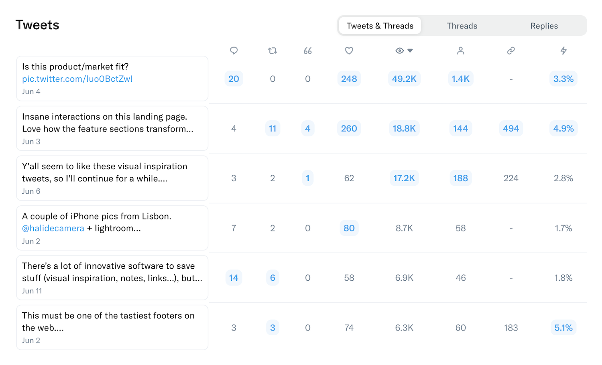

Build in public 公共建设

Share a recent learning with your followers.  

与您的关注者分享最近的学习。

Create engagement 创造参与度

Pose a thought-provoking question.  

提出一个发人深省的问题。

#### Curated writing prompts to never run out of ideas  

精心策划的写作提示永远不会用完想法

Get fresh prompts and ideas whenever you write - with examples of popular tweets.  

每当您写作时都会获得新鲜的提示和想法 - 包括流行推文的示例。

#### The best writing experience, with powerful scheduling  

最佳书写体验，强大调度

Create your content without distractions - where it's easier to write and organize threads.  

不受干扰地创建您的内容 - 在这里更容易编写和组织线程。

#### Cross-post to LinkedIn 交叉发布到 LinkedIn

NEW

Automatically add LinkedIn versions to your posts.  

自动将 LinkedIn 版本添加到您的帖子中。

#### Discover what works with powerful analytics  

发现什么与强大的分析一起工作

Easily track your engagement analytics to improve your content and grow faster.  

轻松跟踪您的参与度分析，以改进您的内容并加快发展速度。

@frankdilo

Feedback? 反馈？

@albigiu

Love it 🔥 喜欢它🔥

#### Collaborate on drafts and leave comments  

就草稿进行协作并发表评论

Write with your teammates and get feedback with comments.  

与您的队友一起写作并获得评论反馈。

🧵 🧵

Rewrite as thread start 重写为线程启动

🔥 🔥

Make it Punchier 让它更有冲击力

#### Improve your content with AI suggestions and rewrites  

通过 AI 建议和重写改进您的内容

Get suggestions, tweet ideas, and rewrites powered by AI.  

获取由 AI 提供支持的建议、推文想法和重写。

And much more: 以及更多：

Auto-Split Text in Tweets  

推文中的自动拆分文本

Thread Finisher 螺纹修整器

Tweet Numbering 推文编号

Pin Drafts 引脚草稿

Connect Multiple Accounts  

连接多个帐户

Automatic Backups 自动备份

Dark Mode 深色模式

Keyboard Shortcuts 键盘快捷键

## Top tweeters love Typefully  

顶级推特用户喜欢 Typefully

### 100,000+ creators and teams chose Typefully to curate their Twitter presence. Join them.  

超过 100,000 名创作者和团队选择 Typefully 来管理他们的 Twitter 形象。加入他们。

Santiago 圣地亚哥@svpino

For 24 months, I tried almost a dozen Twitter scheduling tools. Then I found [@typefully](https://twitter.com/typefully), and I've been using it for seven months straight. When it comes down to the experience of scheduling and long-form content writing, Typefully is in a league of its own.  

在 24 个月的时间里，我尝试了将近十几种 Twitter 日程安排工具。 然后我找到了@typefully，我已经连续使用它七个月了。 当谈到日程安排和长篇内容写作的经验时，Typefully 独树一帜。

Luke Beard 🇺🇦 卢克比尔德🇺🇦@LukesBeard

Good lord, [@typefully](https://twitter.com/typefully) is very good.  

上帝啊，@typefully 非常好。

Anna David 安娜大卫@annabdavid

I forgot about Twitter for 10 years. Now I'm remembering why I liked it in the first place. Huge part of my new love for it: [@typefully](https://twitter.com/typefully). It makes writing threads easy and oddly fun.  

我已经忘记 Twitter 10 年了。现在我想起来当初为什么喜欢它了。 我对它的新爱的很大一部分：@typefully。它使编写线程变得简单而有趣。

DHH@dhh

This is my new go-to writing environment for Twitter threads. They've built something wonderfully simple and distraction free with Typefully.  

这是我用于 Twitter 线程的新的首选写作环境。 他们使用 Typefully 构建了一些非常简单且不会分心的东西。

ian hollander 伊恩霍兰德@ianhollander

Such a huge fan of what [@typefully](https://twitter.com/typefully) has brought to the writing + publishing experience for Twitter. Easy, elegant and almost effortless threads - and a beautiful UX that feels intuitive for the task - and inviting to use.  

非常喜欢@typefully 为 Twitter 带来的写作和发布体验。 简单、优雅且几乎毫不费力的线程 - 以及对任务感觉直观的漂亮用户体验 - 并邀请使用。

Luca Rossi ꩜ 卢卡罗西꩜@lucaronin

After trying literally all the major Twitter scheduling tools, I settled with [@typefully](https://twitter.com/typefully). Kudos to [@frankdilo](https://twitter.com/frankdilo) and [@linuz90](https://twitter.com/linuz90) for building such a delightful experience. Killer feature to me is the native image editor — unique and super useful 🙏  

在尝试了所有主要的 Twitter 日程安排工具之后，我最终选择了@typefully。 感谢@frankdilo 和@linuz90 构建了如此愉快的体验。 对我来说，杀手级功能是原生图像编辑器——独特且超级有用🙏

Easlo 埃斯洛@heyeaslo

I recommend [@typefully](https://twitter.com/typefully), I use it to write all my tweets and threads, include posting schedule and analytics.  

我推荐@typefully，我用它来写我所有的推文和主题，包括发布时间表和分析。

Marc Köhlbrugge 马克·科尔布鲁格@marckohlbrugge

Tweeting more with [@typefully](https://twitter.com/typefully) these days. 🙈 Distraction-free ✍️ Write-only Twitter 🧵 Effortless threads 📈 Actionable metrics I recommend giving it a shot.  

这些天用@typefully 发了更多推文。 🙈 无干扰 ✍️ 只写推特 🧵 轻松线程 📈 可操作的指标 我建议试一试。

daws.eth@DawsonBotsford

Impressed with [@typefully](https://twitter.com/typefully). It's the editor you wish Twitter had. Saving multiple drafts, re-ordering tweets in a thread, and moving attached images around is EASY.  

@typefully 给我留下了深刻的印象。这是您希望 Twitter 拥有的编辑器。 保存多个草稿、在线程中重新排序推文以及四处移动附加图像都很容易。

## Queue your content in seconds  

在几秒钟内将您的内容排队

### Write, schedule and boost your tweets - with no need for extra apps.  

撰写、安排和推广您的推文 - 无需额外的应用程序。

#### Schedule with one click 一键安排

Queue your tweet with a single click - or pick a time manually.  

只需单击一下即可将您的推文加入队列 - 或手动选择时间。

#### Pick the perfect time 选择最佳时机

Time each tweet to perfection with Typefully's performance analytics.  

使用 Typefully 的性能分析为每条推文计时以达到完美。

#### Boost your content 提升您的内容

Retweet and plug your tweets for automated engagement.  

转推并插入您的推文以实现自动参与。

### Start creating a content queue.  

开始创建内容队列。

## Tweet with daily inspiration  

在推特上分享每日灵感

### Break through writer's block with great ideas and suggestions.  

用伟大的想法和建议突破作家的障碍。

#### Start with a fresh idea  

从一个新的想法开始

Enjoy daily prompts and ideas to inspire your writing.  

享受每天的提示和想法来激发您的写作灵感。

#### Check examples out 检查示例

Get inspiration from tweets that used these prompts and ideas.  

从使用这些提示和想法的推文中获取灵感。

#### Flick through topics 浏览主题

Or skim through curated collections of trending tweets for each topic.  

或者浏览每个主题的精选趋势推文集合。

## Check the analytics that matter  

检查重要的分析

### Build your audience with insights that make sense.  

通过有意义的见解建立您的受众群体。

## Write, edit, and track tweets together  

一起撰写、编辑和跟踪推文

### Write and publish with your teammates and friends.  

与您的队友和朋友一起写作和发表。

#### Share your drafts 分享你的草稿

Brainstorm and bounce ideas with your teammates.  

与您的队友集思广益并反复讨论想法。

@frankdilo

Feedback? 反馈？

@albigiu

Love it 🔥 喜欢它🔥

Get feedback from coworkers before you hit publish.  

在点击发布之前获得同事的反馈。

Read, Write, Publish 阅读、写作、发布

#### Control user access 控制用户访问

Decide who can view, edit, or publish your drafts.  

决定谁可以查看、编辑或发布您的草稿。

## Build an automated tweet machine  

构建自动推文机器

### Our Zapier integration enables countless no-code workflows.  

我们的 Zapier 集成支持无数无代码工作流程。

Share new drafts in Slack channel  

在 Slack 频道中分享新草稿

New draft from RSS feed item content  

RSS 提要项目内容的新草稿

New scheduled draft from Google Doc  

来自 Google Doc 的新预定草稿

New spreadsheet row from published tweet  

来自已发布推文的新电子表格行

Create new template draft every Monday  

每周一创建新的模板草稿

Send an email for every published thread  

为每个已发布的话题发送一封电子邮件

Create draft for new items in feeds folder  

为提要文件夹中的新项目创建草稿

Thank new followers with a tweet  

通过推文感谢新粉丝

Share new drafts in Slack channel  

在 Slack 频道中分享新草稿

New draft from RSS feed item content  

RSS 提要项目内容的新草稿

New scheduled draft from Google Doc  

来自 Google Doc 的新预定草稿

New spreadsheet row from published tweet  

来自已发布推文的新电子表格行

Create new template draft every Monday  

每周一创建新的模板草稿

Send an email for every published thread  

为每个已发布的话题发送一封电子邮件

Create draft for new items in feeds folder  

为提要文件夹中的新项目创建草稿

Thank new followers with a tweet  

通过推文感谢新粉丝

## Ready to write better tweets and grow your audience?  

准备好撰写更好的推文并扩大您的受众群体了吗？

Get started with our generous free plan.  

开始使用我们慷慨的免费计划。
