**Want to apply this essay to your work?** Watch a 40-minute self-paced workshop on writing with AI, and practice with custom exercises.  

想将这篇文章应用到您的工作中吗？观看 40 分钟的自定进度的 AI 写作研讨会，并通过自定义练习进行练习。

You'll learn how to use AI as a creative tool to help you do the best writing of your life.  

您将学习如何使用 AI 作为创意工具来帮助您完成人生中最好的写作。

Curious? Learn more: 好奇的？了解更多：

___

There’s a new writing technology that draws big crowds to see it used in eye-popping demonstrations.  

有一种新的书写技术吸引了大批观众观看它在令人大跌眼镜的演示中的应用。  

But while there’s excitement about it in some quarters, there aren’t many people actually _using_ it.  

但是，尽管某些方面对此感到兴奋，但实际使用它的人并不多。

Instead, there’s skepticism and even anger. Reading something written with it feels insulting. It’s too impersonal, and lacks a human touch.  

取而代之的是怀疑甚至愤怒。阅读用它写的东西感觉很侮辱。它太没有人情味了，缺乏人情味。  

It comes off like bland corporate marketing. Not only that, but using it is expensive, and it feels like an invasion of privacy.  

它就像平淡无奇的企业营销一样脱颖而出。不仅如此，使用它还很昂贵，而且感觉像是在侵犯隐私。

We’re talking about AI writing, right? No, we’re talking about typewriters.  

我们在谈论 AI 写作，对吧？不，我们说的是打字机。

If you read histories of typewriters, you’ll find that each one of these concerns—too impersonal, not private, too much like corporate marketing, too expensive, too much hype and not enough use cases—were brought up by people encountering them for the first time.  

如果你读过打字机的历史，你会发现这些问题中的每一个——太没有人情味、不够私密、太像企业营销、太贵、太过炒作和没有足够的用例——都是由遇到它们的人提出来的第一次。

In [_The Wonderful Writing Machine_](https://archive.org/details/wonderfulwriting00bliv), a 1954 history of the typewriter, Bruce Bliven writes that when these machines were first introduced, “one real difficulty…was the public’s feeling that typewriting, for private correspondence, was insulting, or confusing, or both.”  

在 1954 年的打字机历史 The Wonderful Writing Machine 中，布鲁斯·布利文 (Bruce Bliven) 写道，当这些机器首次问世时，“一个真正的困难……是公众觉得打字，私人通信，是侮辱性的，或令人困惑的，或两者兼而有之。”

Everyone was used to receiving letters from friends, colleagues, and acquaintances written in longhand.  

每个人都习惯于收到手写的朋友、同事和熟人的来信。  

Anything typewritten was reserved for handbills—literally, advertisements—and people who received letters written on early typewriters thought that’s what they’d gotten: “Handbills could be \[typewritten\] but, a good many persons felt, but letters were \[supposed to be\] written in longhand with a pen and ink.”  

任何打字的东西都是为传单保留的——从字面上看，广告——收到用早期打字机写的信件的人认为这就是他们得到的：“传单可以\[打字\]但是，很多人觉得，但是信件\[应该是\] 用钢笔和墨水手写的。

Other people were insulted to receive a typewritten letter because they thought it implied that the sender believed they were incapable of reading longhand: “A Texas insurance man, J.P.  

其他人收到一封打字的信件会感到侮辱，因为他们认为这暗示发件人认为他们无法手写阅读：“德克萨斯州的保险人，J.P.  

Johns, one of the early Type-Writer users, sent a typed note to one of his agents and got back an indignant reply:  

Johns 是 Type-Writer 的早期用户之一，他向他的一位代理人发送了一张打字的便条，并得到了愤怒的回复：

‘I do not think it was necessary then, nor will it be in the future, to have letters to me taken to the printers’ and set up like a handbill.  

“我认为当时没有必要，将来也没有必要让印刷商给我写信”并且像传单一样设置。  

I will be able to read your writing, and I am deeply chagrined to think you thought such a course necessary.’”  

我将能够阅读您的作品，想到您认为这样的课程是必要的，我深感懊恼。”

Still others felt that typewriters were an invasion of privacy: “No man was clever enough to run such a machine without a professional operator’s help, and that therefore a typewritten love letter must have been transcribed by a third person.”  

还有一些人认为打字机是对隐私的侵犯：“没有专业操作员的帮助，没有人会聪明到可以操作这样的机器，因此打字的情书一定是由第三者转录的。”

In [_Engines of Democracy_](https://archive.org/details/dli.ernet.5799/page/165/mode/2up), a study of the effect of technology on society in America, Roger Burlingame recounts how in 1876, the Remingtons—manufacturers of the first commercially successful typewriter—sent a machine to the Centennial Exhibition in Philadelphia.  

在研究技术对美国社会的影响的民主引擎中，罗杰·伯林盖姆 (Roger Burlingame) 讲述了 1876 年，雷明顿 (Remingtons) 公司——第一台商业上成功的打字机的制造商——如何将一台机器送往费城的百年纪念展。  

They wanted to get it in front of a crowd so they could sell more machines.  

他们想把它展示在人群面前，这样他们就可以卖出更多的机器。

Indeed, a crowd gathered to see this new piece of technology.  

事实上，一群人聚集在一起观看这项新技术。  

But instead of selling many machines, “the exhibit \[returned its investment\] chiefly by the sale of typewritten souvenirs at a quarter a piece.”  

但是，“展览并没有卖出很多机器，而是主要通过以四分之一的价格出售打字纪念品，\[收回了投资\]。”

People were happy to buy cheap pieces of paper with typewritten text on them—the modern equivalent of sharing [unhinged Bing screenshots](https://every.to/napkin-math/bada-bing-why-microsoft-wants-google-to-dance). But no one wanted to buy the typewriter itself—let alone use it for anything important.  

人们很乐意购买印有打字文字的廉价纸片——现代相当于分享精神错乱的 Bing 屏幕截图。但是没有人愿意购买打字机本身——更不用说用它来做任何重要的事情了。

Typewriters were bulky machines that violated people’s existing set of expectations about how writing was done and what it looked like. They completely changed how writing worked.  

打字机是一种笨重的机器，违反了人们对写作方式和外观的现有期望。他们彻底改变了写作的方式。  

They required new skills to operate, and they were expensive.  

他们需要新的技能来操作，而且价格昂贵。

In short, there were many good reasons to dismiss them, or be suspicious and angry about their use. But slowly they gained fans.  

简而言之，有很多很好的理由解雇它们，或者对它们的使用产生怀疑和愤怒。但慢慢地，他们获得了粉丝。

Mark Twain was one of the first to see their promise. We even have his first, faltering attempts to write a letter using a typewriter to his brother:  

马克吐温是最早看到他们承诺的人之一。我们甚至看到了他第一次尝试用打字机给他弟弟写一封信，但步履蹒跚：

[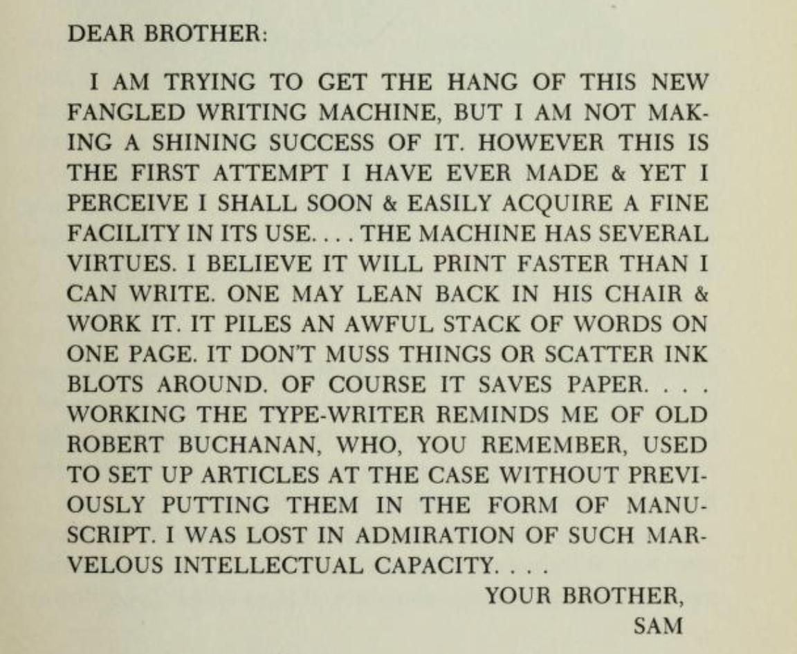](https://d24ovhgu8s7341.cloudfront.net/uploads/editor/posts/2499/optimized_c4XyOaH36lkmrUqrqE7p1lmJh-mkViiH5buFW2X7L-v4kk9ifeq2Lwv0a8F5ZFlCrRgz-zVKUzFqACUaSnmva3z4TmcCW0kxd-w1v-C-7ljKvkr00Z-TnyG0uiZXm4QIXBWC3q47KHMJdv3qTtWkCfA.png?link=true)

Over the next few decades, typewriters were everywhere. They transformed media and business, and became one of the first avenues for women to enter the workforce in large numbers.  

在接下来的几十年里，打字机无处不在。她们改变了媒体和商业，并成为女性大量进入劳动力市场的首要途径之一。

Today, the default way we send text to each other is through typing. Writing longhand is reserved for birthday cards, journaling, taking quick notes, and little else.  

今天，我们互相发送文本的默认方式是通过打字。手写是为生日贺卡、日记、快速做笔记和其他一些事情保留的。

I think something similar is going to happen with AI-assisted writing. Today it’s a novelty, a threat, or both.  

我认为人工智能辅助写作也会发生类似的事情。今天，它是一种新奇事物、一种威胁，或者两者兼而有之。  

But soon, I think (and hope) it will be regarded as a serious creative tool—not to replace writers, but to help us make great work.  

但很快，我认为（并希望）它会被视为一种严肃的创作工具——不是取代作家，而是帮助我们创作出伟大的作品。

Like Mark Twain, the writers who are prepared to embrace “this newfangled writing machine” will find that if they can learn to work around its limitations, they can already do incredible things with it.  

像马克吐温一样，准备拥抱“这种新型写作机器”的作家会发现，如果他们能够学会克服它的局限性，他们就已经可以用它做出不可思议的事情。

## AI has had a huge impact on my writing process  

人工智能对我的写作过程产生了巨大影响

I think AI writing gets a bad rap because there are a lot of misconceptions about what it means and how it should be used.  

我认为 AI 写作名声不好，因为人们对它的含义以及应该如何使用有很多误解。

The primary misconception is that its main use is to replace writing and writers.  

主要的误解是它的主要用途是代替写作和作家。  

The caricature of AI writing is that it’s supposed to let you click one button and churn out the next great American novel, or flood the internet with infinite amounts of terrible SEO farm-worthy content.  

AI 写作的讽刺意味在于，它应该让你点击一个按钮就可以创作出下一部伟大的美国小说，或者让互联网充斥着无穷无尽的可怕的 SEO 农场价值内容。

AI can certainly churn out terrible SEO content. A lot of what it creates is generic, or stupid, or false.   

AI 肯定会产生糟糕的 SEO 内容。它创造的很多东西都是通用的、愚蠢的或错误的。

But after my co-founder Nathan incubated [Lex](https://lex.page/), our AI-powered writing app, I’ve been using a whole host of AI tools to help me produce my writing.  

但在我的联合创始人 Nathan 孵化了我们的人工智能写作应用程序 Lex 之后，我一直在使用大量人工智能工具来帮助我写作。  

Sometimes I use Lex, sometimes I use ChatGPT, sometimes I use GPT-3, and sometimes I use something totally different like Otter.  

有时我使用 Lex，有时我使用 ChatGPT，有时我使用 GPT-3，有时我使用完全不同的东西，比如 Otter。

In that time AI has helped me write weekly to the almost 75,000 people on this email list. I’ve generated over 8 million impressions on Twitter. I’ve been [interviewed by the _Atlantic_](https://www.theatlantic.com/technology/archive/2023/02/openai-text-models-google-search-engine-bard-chatbot-chatgpt-prompt-writing/672991/) about how I use it in my writing process.  

在那段时间里，人工智能帮助我每周给这个电子邮件列表中的近 75,000 人写信。我在 Twitter 上产生了超过 800 万次展示。 Atlantic 就我在写作过程中如何使用它进行了采访。

And I can confidently say that rather than replace me, it’s _enabling_ me to create some of the best work I’ve ever done.  

我可以自信地说，它并没有取代我，而是让我能够创造一些我做过的最好的作品。  

I still spend large amounts of time and energy doing the writing that I do—but the writing is coming out better than it ever has before.  

我仍然花费大量时间和精力来写作，但写作比以往任何时候都好。

In that way, AI is a little like a mirror: it will reflect exactly what you put into it.  

这样一来，人工智能有点像一面镜子：它会准确地反映出你放入其中的内容。

If you type a few bland prompts, you’ll get bland completions.  

如果您键入一些乏味的提示，您将得到乏味的完成。

If you push it in a creative and interesting direction, you’ll get creative and interesting results.  

如果你把它推向有创意和有趣的方向，你会得到有创意和有趣的结果。  

It works best when it’s used by an experienced and talented writer as another tool in their tool belt.  

当经验丰富且才华横溢的作家将其用作工具带中的另一种工具时，效果最佳。

I want to spend the rest of this piece explaining how I use it, so that you can learn how to do it too.  

我想用这篇文章的其余部分来解释我如何使用它，以便您也可以学习如何使用它。

## How to incorporate AI into your writing practice  

如何将 AI 融入您的写作实践

If we map the writing process out from start to finish, there are a few obvious places where AI can be effectively incorporated. It can help you:  

如果我们将写作过程从头到尾绘制出来，就会发现有几个明显的地方可以有效地融入 AI。它可以帮助您：

-   **Get** your thoughts down when you want to  
    
    在你想的时候记下你的想法
-   **Organize** your thoughts before you get started on a piece  
    
    在开始创作之前组织好你的想法
-   **Capture** a voice when you want the flavor of a particular writer  
    
    当您想要特定作家的风格时捕捉声音
-   **Summarize** complex ideas when you’re trying to explain  
    
    尝试解释时总结复杂的想法
-   **Help** you when you get stuck  
    
    当你遇到困难时帮助你
-   **Evaluate** your writing when you need a fresh brain  
    
    当你需要一个新鲜的大脑时评估你的写作

Before we start, though, let’s get a few things straight.  

不过，在我们开始之前，让我们先弄清楚一些事情。

First, you don’t _have_ to incorporate AI into your writing practice. If you want to keep writing longhand, that’s both fine and preferable in certain cases.  

首先，您不必将 AI 纳入您的写作实践。如果您想继续手写，这在某些情况下既好又可取。  

The idea of this essay is to inspire you and help you experiment—not to give you the One True Way to write.  

这篇文章的想法是激励你并帮助你进行实验——而不是给你唯一正确的写作方式。

Second, you should know that everyone—including me—is making this up as we go. It’s a whole new frontier, so there isn’t any standard or accepted way to write with these tools.  

其次，你应该知道，包括我在内的每个人都在编造这个故事。这是一个全新的领域，因此没有任何标准或公认的方式来使用这些工具进行编写。  

All I can share is what I’ve seen work for me and other people.  

我所能分享的就是我所看到的对我和其他人有用的东西。

Third, there are many ways to misuse this tool to make crap. AI is not a panacea for lack of taste or bad intentions.  

第三，有很多方法可以滥用这个工具来制造垃圾。人工智能不是缺乏品位或恶意的灵丹妙药。  

If you’re skilled, though, you can use it to make stuff you love.  

不过，如果你技术娴熟，你可以用它来制作你喜欢的东西。

Ready? Let’s go. 准备好？我们走吧。

## Get your thoughts down when you want to  

在你想的时候记下你的想法

Thoughts, feelings, memories, and emotions are the raw material of writing. They pass through our consciousness moment to moment, and writing begins when we determine to note them.  

思想、感觉、记忆和情感是写作的原材料。它们时时刻刻从我们的意识中掠过，当我们决定记下它们时，书写就开始了。

There are many ways to do this in a pre-AI world. You can [keep a writer’s notebook in your pocket](https://every.to/superorganizers/tasting-notes-with-robin-sloan-25629085) or a running list in your Apple Notes. You can do [Morning Pages](https://every.to/superorganizers/dan-shipper-the-sultan-of-superorganizers-4345?sid=15413) every day to get all of your thoughts out and figure out what’s interesting to you.  

在人工智能出现之前的世界中，有很多方法可以做到这一点。您可以将作家的笔记本放在口袋里，或将跑步清单放在 Apple Notes 中。你可以每天做 Morning Pages 来整理你所有的想法，找出你感兴趣的东西。

These methods have their merits, but there are problems too. Sometimes I don’t want to carry around a notebook.  

这些方法有其优点，但也存在问题。有时我不想随身携带笔记本。  

And sometimes it feels like a drag to have to write everything out by hand, or type it.  

有时，必须手写或键入所有内容感觉很累。  

It feels like my mind could move more quickly if I could just talk through what’s going through my head.  

感觉如果我能直接说出我脑子里在想什么，我的思绪就会运转得更快。

That’s where you can use AI, if you want to.  

如果你愿意，那是你可以使用 AI 的地方。

What I’ve been doing recently is taking a walk and recording myself free-associating while I’m out. I say anything that comes to mind—good, bad, embarrassing, or otherwise.  

我最近一直在做的事情是在外出时散步并记录自己的自由联想。我想到什么就说什么——好的、坏的、令人尴尬的或其他。  

I feel like a loon while I’m doing it, but I gather a lot of raw material this way.  

我在做的时候感觉自己像个懒人，但我通过这种方式收集了很多原材料。

Then I have the AI transcribe the recording and summarize it into bullet points.  

然后我让 AI 转录录音并将其总结为要点。  

The bullet points give me a list of interesting thoughts and ideas I’ve had while I’m out—and often the best ones turn into ideas for a piece.  

这些要点为我列出了我外出时的有趣想法和想法——通常最好的想法会变成一篇文章的想法。

For recordings I sometimes use the Voice Memos app on my iPhone, or else [Otter](https://otter.ai/) or [Oasis AI](https://twitter.com/theoasisAI). It looks like this:  

对于录音，我有时会使用 iPhone 上的语音备忘录应用程序，或者使用 Otter 或 Oasis AI。它看起来像这样：

[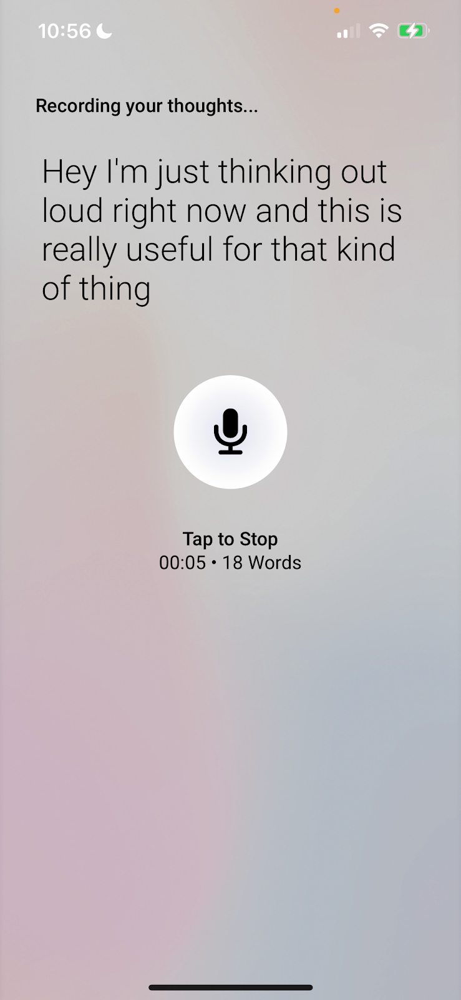](https://d24ovhgu8s7341.cloudfront.net/uploads/editor/posts/2499/optimized_7v4C6KES3q-KQuFfBjRkUKsH8U-5Eq4dw6juffhiVLg_lpchy7n5contmkBNzdUfE-Q2nnO_-lNqlMkloyvdGg_WhjmWIdI-3fjKwpbbRQQRcdT3pKE8DxGdLASNUnijjY4A3NZ4B5x5-uGQvJqx3Pk.png?link=true)

When I get home, I paste the transcript into ChatGPT and ask it to summarize the document into bullet points. Here’s a transcript from a 30-minute walk I took a few weeks ago:  

当我回到家时，我将成绩单粘贴到 ChatGPT 中，并要求它将文档总结为要点。这是我几周前进行的 30 分钟步行记录：

[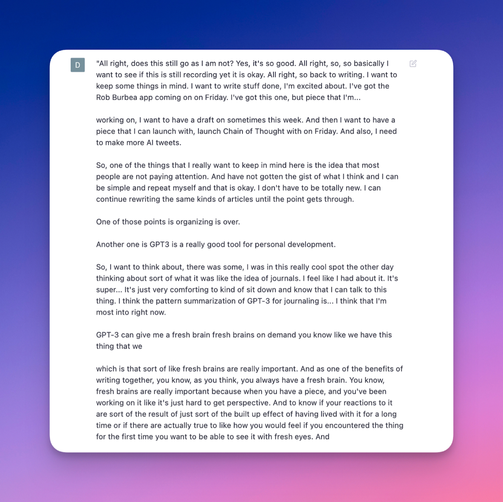](https://d24ovhgu8s7341.cloudfront.net/uploads/editor/posts/2499/optimized_pmKXCn4ztZmSN38Q17m23mRBJQdF_bdct5Y1-CjsCgLjpYI0c3-8T3gz_5Iov0Pes6Mv-FR9OqbqhId1CRH1djzagwQIj9S_LBWEo4TL01Ue7QaVFLUUnsRMoyRxBhu4gXziJ-rh8IRlbKqH1qAaP8U.png?link=true)

And here’s me telling ChatGPT to summarize it into bullet points:  

这是我告诉 ChatGPT 将其总结为要点：

[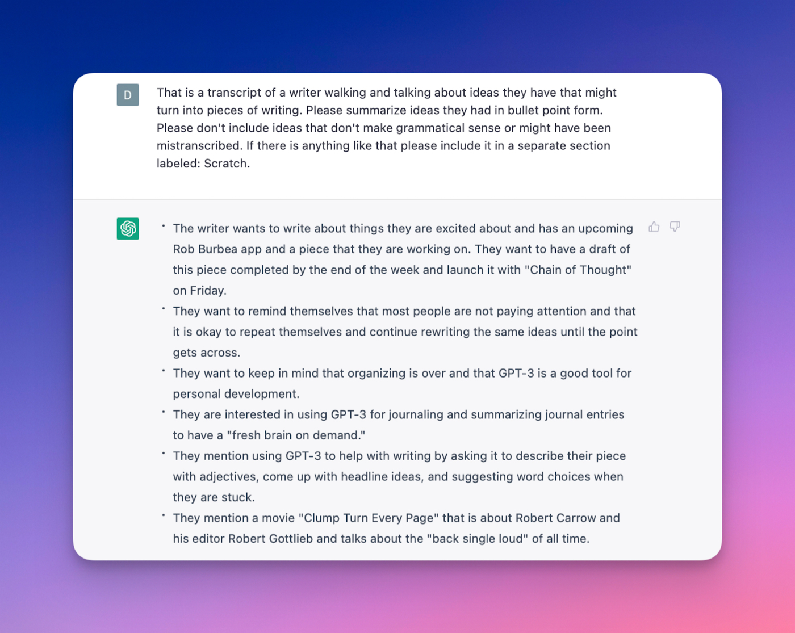](https://d24ovhgu8s7341.cloudfront.net/uploads/editor/posts/2499/optimized_uKYznaC0KZ4IQL93m7Z_Xi3-Xra2DFoRbM4G3Ti0xatfPKDm54csC2HtZuvlRX0Otlv1frzQYYPT_OxxV5zM3XR3KXZd6BM1XaJjKr7OLy-BIf9NE7jnSuG-xTjg5G8e7yo6I7RPEWJ3JGwwZzyGt4o.png?link=true)

Seeing a blob of your thoughts rearranged in this way makes things feel clearer and more concise. It makes it easy to pick out threads that are interesting.  

看到你的想法以这种方式重新排列，会让事情变得更清晰、更简洁。它可以很容易地挑选出有趣的线程。

If you read the screenshot above, you’ll see the third bullet point says that I “want to keep in mind that organizing is over.” When I read through these bullet points later on, that line stuck out at me, and it turned into one of my most popular pieces of late, “[The End of Organizing](https://every.to/chain-of-thought/the-end-of-organizing).”  

如果你阅读上面的截图，你会看到第三个要点说我“想记住组织已经结束”。后来当我通读这些要点时，那句话让我印象深刻，它变成了我最近最受欢迎的作品之一，“组织的终结”。

This step of the process is helpful for identifying interesting ideas and finding topics you want to write about.  

该过程的这一步有助于识别有趣的想法和找到您想写的主题。  

But AI is also helpful once you’ve begun organizing your notes into a piece.  

但是，一旦您开始将笔记整理成一个片段，人工智能也会有所帮助。

## Organizing your thoughts 组织你的想法

My essays often start off as a word salad of notes, quotes, and thoughts.  

我的文章通常以笔记、引语和想法的单词沙拉开头。  

I’ll have a long document with every idea I’ve ever had about a topic and then sit down in the morning and think to myself, “How the hell am I going to turn this into something readable?”  

我会有一份很长的文件，里面包含我对某个主题的每一个想法，然后在早上坐下来对自己想，“我到底要怎样才能把它变成可读的东西？”

This is especially true for important topics that I’ve thought about for a long time but have never written about because I _really_ want to get it right when I do. I call this _Magnum Opusing_.  

对于我已经考虑了很长时间但从未写过的重要主题尤其如此，因为我真的很想在写的时候把它做对。我称之为 Magnum Opusing。

You’re Magnum Opusing when you’re trying to write _the_ piece about a particular topic—so the scope keeps expanding, and the pressure keeps building, and you keep taking notes and procrastinating until you finally give up and move on to something easier.  

当你试图写关于特定主题的文章时，你就是 Magnum Opusing——所以范围不断扩大，压力不断增加，你不断做笔记和拖延，直到你最终放弃并转向更容易的事情。

When you’re staring at a long document of ideas with no idea how to find a through-line or identify the argument you want to make, AI can help.   

当你盯着一长串的想法文档，不知道如何找到一条主线或确定你想要提出的论点时，人工智能可以提供帮助。

“The End of Organizing” started like this. I built a document of assorted notes and ideas but was lost about where to start.  

《组织的终结》就这样开始了。我建立了一个包含各种笔记和想法的文档，但不知道从哪里开始。  

So I loaded the document into ChatGPT and asked it what to do:  

所以我将文档加载到 ChatGPT 并询问它要做什么：

[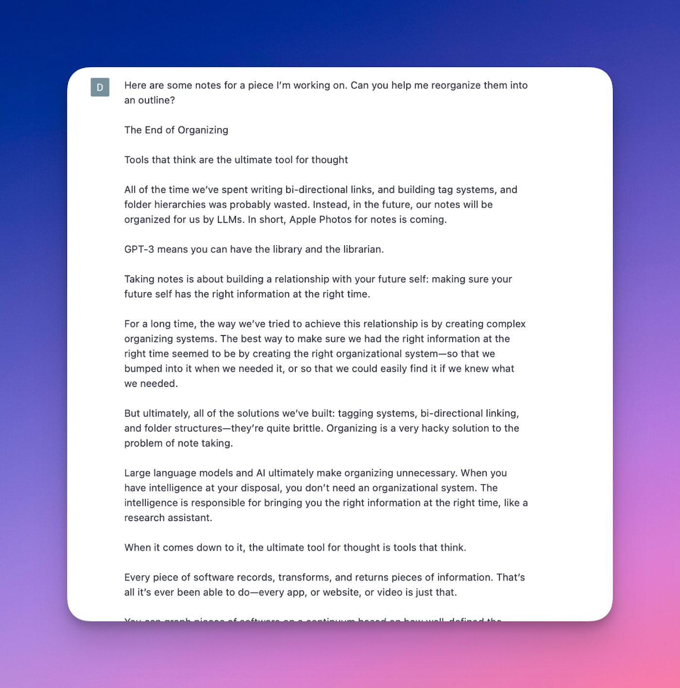](https://d24ovhgu8s7341.cloudfront.net/uploads/editor/posts/2499/optimized_upMJunr_sr_ezG3aSdG7BN3paUa2J3htFWEI6eq5AZIS1bF6KkY_IlZu-PAMu6VClOIAruhdFim7LEOkpo2EsJbS88YdLATVdO1U_g_93abKL7T_6XK1z0T7jHFZuFvmk-aBs18-81DzxSTLFZZnQpE.png?link=true)

And it gave me something that was…perfect:  

它给了我一些……完美的东西：

[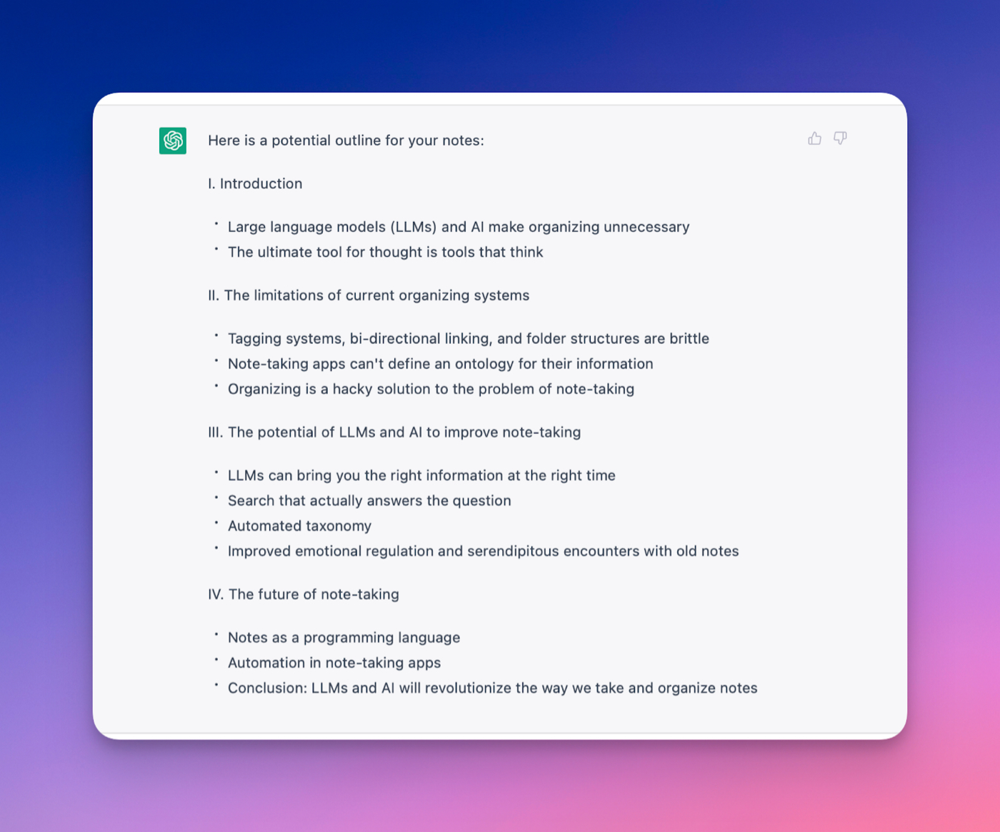](https://d24ovhgu8s7341.cloudfront.net/uploads/editor/posts/2499/optimized_MuUejtHLecIzGdJxJmpwnybxATAfhGxEV2Ed04V2W3jnIr_oasnl6anWTMRmQnz5XoGUro4TVTAmgh8XXxM_2IOtl2v-XIr2340Cv-349Iu3kh954l0jwQ6Crt_CviTViEnlNOS1LE6esl914jAUvlw.png?link=true)

You can see that the finished piece follows this structure almost exactly, with a much-expanded third section. The structure it suggested is simple:  

你可以看到完成的作品几乎完全遵循这个结构，第三部分扩展得更多。它建议的结构很简单：

-   Describe the problem 描述问题
-   Describe the solution 描述解决方案
-   Describe the future 描述未来

That’s an obvious way to go about writing the article I needed to write.  

这是写我需要写的文章的明显方法。  

But I was so lost in making it great and expressing all of my complicated ideas that I couldn’t discern the structure.  

但是我太迷失了让它变得伟大并表达了我所有复杂的想法，以至于我无法辨别结构。

That’s the nice thing about these technologies.  

这就是这些技术的好处。  

I probably would’ve gotten there on my own eventually, but spending 30 seconds in ChatGPT helped me move through the noise and find a solution that got me to the next step in my process.  

我可能最终会自己到达那里，但是在 ChatGPT 中花费 30 秒帮助我摆脱了噪音并找到了一个解决方案，让我进入了流程的下一步。  

AI helps me get out of my own way. Which brings me to my next point:  

人工智能帮助我摆脱困境。这让我想到了下一点：

Once you’ve figured out a structure for the thing you want to write and you’re getting into the writing, AI can be helpful there, too.  

一旦你想出了你想写的东西的结构并开始写作，人工智能也可以在那里提供帮助。

## Using AI to help you capture a voice  

使用 AI 帮助您捕捉声音

We all have writers we admire. One part of the process of learning to write well is identifying writers we like and trying to write in a way that sounds like them.  

我们都有我们敬佩的作家。学习写作的过程之一是确定我们喜欢的作家并尝试以听起来像他们的方式写作。

We always fail at this—obviously. Writing exactly like our heroes isn’t possible because we’re different from them.  

我们总是在这方面失败——很明显。完全像我们的英雄一样写作是不可能的，因为我们与他们不同。  

But in trying, and failing, we invent our own voice that’s nuanced, and rich, and inflected with the subtle flavor of the writers that we’ve tried to imitate.  

但在尝试和失败的过程中，我们发明了自己的声音，这种声音细腻、丰富，并带有我们试图模仿的作家的微妙风味。  

And that makes all the difference.  

这让一切变得不同。

The way most people accomplish this is to read writers we admire before we write—to get a hint of the kind of thing we’re going for before we sit down in front of the computer.  

大多数人实现这一目标的方法是在写作之前阅读我们欣赏的作家——在我们坐在电脑前之前获得我们想要做的事情的暗示。  

Another way we do this is to create a clip file of sentences and passages we like for inspiration.  

我们这样做的另一种方法是创建一个我们喜欢的句子和段落的剪辑文件以获取灵感。

We can also use AI for this.  

我们也可以为此使用人工智能。

You can fine-tune GPT-3 on your voice or the voice of another writer you admire, and use it to help you get the flavor of their words into your work.  

你可以根据你的声音或你欣赏的另一位作家的声音微调 GPT-3，并用它来帮助你将他们文字的味道融入你的作品中。  

A fine-tuned version of GPT-3 will output sentences that _are not_ exactly the sentences your hero would write, but they’re close enough to give you an idea of what you might want to go for.  

一个经过微调的 GPT-3 版本将输出与你的主人公会写的句子不完全相同的句子，但它们足够接近，可以让你知道你可能想要做什么。  

Once you have that tone in your ear, you can use it as a jumping off point for your writing.  

一旦你听到了那种语气，你就可以把它作为你写作的起点。

For example, I love Annie Dillard—her vivid descriptions of nature, and her poetic, surprising metaphors and similes. I often try to get some of that flavor in my own writing.  

例如，我喜欢安妮·迪拉德 (Annie Dillard)——她对自然的生动描述，以及她诗意的、令人惊讶的隐喻和明喻。我经常尝试在自己的作品中加入一些那种味道。  

So I fine-tuned GPT-3 on her work so that when I want some Dillard-esque passages in my writing, I can use it to help me get started.  

因此，我针对她的工作对 GPT-3 进行了微调，这样当我想要在我的写作中加入一些 Dillard 式的段落时，我可以用它来帮助我开始。

Let’s take a sentence that might call for something vivid:  

让我们来看一个可能需要生动的句子：

“When I breathe I feel…”  

“当我呼吸时，我感觉……”

You could imagine that being completed in a number of poetic, beautiful ways. If we run that through vanilla GPT-3, here’s the output:  

你可以想象它以多种诗意、美丽的方式完成。如果我们通过 vanilla GPT-3 运行它，输出如下：

[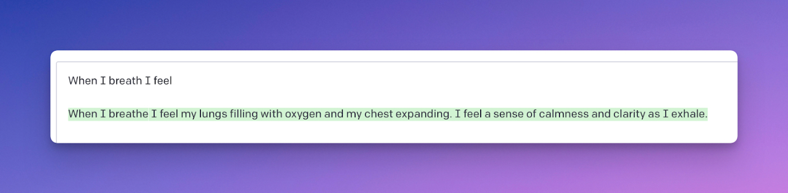](https://d24ovhgu8s7341.cloudfront.net/uploads/editor/posts/2499/optimized_VFrYsRQlT9UZ-SDTPTFKL24N3xXimjWYN2qtgWZRIc9gpctnUYIvqJOAJyjZUxJ5YhefYA7CLTavFYrVlW3L2L-WXg7xGeZo_ZRqN2Nh139AAu46ZeJjvpiFbHjAXm7wyeE1X827CZZanoLu1SimBP0.png?link=true)

That’s fine, but it’s also kind of generic. What if I want something more vivid? If I run it through my Annie Dillard-ified GPT-3, this is what I get:  

这很好，但它也有点通用。如果我想要更生动的东西怎么办？如果我通过我的 Annie Dillard 化 GPT-3 运行它，这就是我得到的：

[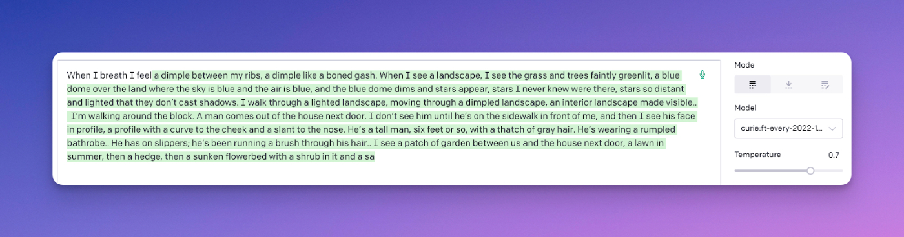](https://d24ovhgu8s7341.cloudfront.net/uploads/editor/posts/2499/optimized_xfeBD2tZEW1lSeT1YAaQ8LmXlp5fLJdo90vbPicGJq2iBvhfHHU_h8eCnDfEiMP6hXOLmxb58fy9Gd-C-GDNXobcGpO5nHpYwyhrWLgZvWexu-fX289_r9qPPcQgxaJu-Uhk922QEem96nEpLwCLD2w.png?link=true)

To be clear, this is not Annie Dillard—at all. But it certainly has a little of her poetic flavor. It’s in the right neighborhood of the English language. And I love this!  

需要明确的是，这根本不是安妮·迪拉德。但它肯定有一点她的诗意。它位于英语的右邻域。我喜欢这个！

Here are some lines that stand out:  

以下是一些突出的行：

-   A **dimple** between my ribs  
    
    我的肋骨之间有个酒窝
-   A **boned gash** 骨裂口
-   I see the grass and trees **faintly dimlit**  
    
    我看见一草一木隐隐约约
-   A **blue dome** over the land  
    
    大地上的蓝色圆顶
-   Stars so **distant and lighted that they don’t cast shadows**  
    
    遥远而明亮的星星不会投射阴影

I can’t copy this passage wholesale into what I’m writing. GPT-3 has no idea what I feel when I breathe.  

我无法将这段话全部复制到我正在写的内容中。 GPT-3 不知道我呼吸时的感受。  

But words like “dimple” and “blue dome” and “gash” and “dimlit” help put me in the right headspace to write my own version. This is very handy.  

但是像“dimple”和“blue dome”和“gash”和“dimlit”这样的词帮助我进入了正确的顶空来写我自己的版本。这非常方便。

In [“AI and the Age of the Individual](https://every.to/chain-of-thought/ai-and-the-age-of-the-individual),” I wrote that going back to unassisted writing will feel like “trying to hike a mountain in high heels.” I love that line—and it came from playing around with this fine-tuned model.  

在“AI 和个人时代”中，我写道，回到无辅助写作感觉就像“试图穿着高跟鞋爬山”。我喜欢那句台词——它来自于玩弄这个经过微调的模型。

AI is useful for helping you capture a voice you like. But it’s also useful for other parts of the process when you’re in the words of a piece.  

AI 可帮助您捕捉您喜欢的声音。但当你用一段话表达时，它对流程的其他部分也很有用。  

The next place I like to work with it is in summarizing ideas.  

我喜欢使用它的下一个地方是总结想法。

## Using AI to summarize complex ideas  

使用 AI 总结复杂的想法

If you write essays as much as I do, it’s often the case that you need to summarize a complex idea for the reader.  

如果你像我一样经常写论文，通常情况下你需要为读者总结一个复杂的想法。  

The idea is usually core to the argument you’re making, and that you already understand, and that needs to be expressed in clear, accurate terms in order for you to get on with the piece you’re writing.  

这个想法通常是你正在做的论点的核心，你已经理解了，并且需要用清晰、准确的术语表达出来，这样你才能继续你正在写的文章。

For example, I recently wrote a piece about [Sam Bankman-Fried and the collapse of FTX](https://every.to/superorganizers/the-end-of-effective-altruism). I was trying to examine how the philosophy of effective altruism and utilitarianism might have contributed to the fraud he allegedly perpetrated.  

例如，我最近写了一篇关于 Sam Bankman-Fried 和 FTX 崩溃的文章。我试图研究有效利他主义和功利主义的哲学是如何促成他据称犯下的欺诈行为的。

In order to do that, I needed to summarize the outlook of utilitarianism in simple terms. I studied philosophy in college, so I have a good grasp of the basics of utilitarian philosophy.  

为此，我需要用简单的语言概括功利主义的观点。我在大学学的是哲学，所以我对功利主义哲学的基础知识掌握得很好。  

But I hadn’t thought about it in a while.  

但是我有一段时间没有考虑过。

Normally to write this part of an essay I’d need to reread Wikipedia, the _Stanford Encyclopedia of Philosophy_, and some other things I read in college in order to prime my memory. Then I’d have to condense it into a few sentences.  

通常，要写这篇文章的这一部分，我需要重读维基百科、斯坦福哲学百科全书，以及我在大学读过的其他一些东西，以增强我的记忆力。然后我必须把它浓缩成几句话。

But AI makes this a lot easier. If I'm working in [Lex](http://lex.page/), I can just ask it: “Can you summarize utilitarianism in a few sentences?” and it will do it for me.  

但人工智能让这一切变得容易多了。如果我在 Lex 工作，我可以问它：“你能用几句话概括一下功利主义吗？”它会为我做的。

[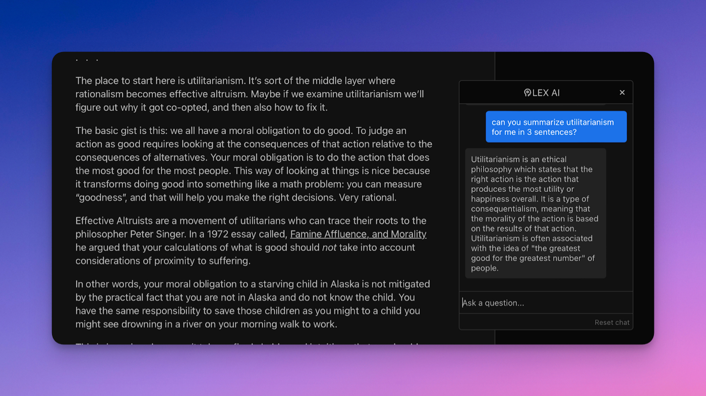](https://d24ovhgu8s7341.cloudfront.net/uploads/editor/posts/2499/optimized_EYSGPPHk1Hn44GeM0BBZIcZByFBiOVn78U2cgsnwfSihfG6-Mj1kli8ofVp_EC7Z8LL5tXsCwq9i8rsPpQil0tiw5wN4-ifaod2JeeDOsO3IGHFDwYa3rsJghs_BS1D_aXMwR0fVRdhzg6kYdXGzZRM.png?link=true)

Once I get the summary back, I will want to check it to make sure it’s accurate and then put it into my own words. This process is much faster than it would be otherwise.  

一旦我得到总结，我会想检查它以确保它是准确的，然后用我自己的话来表达。这个过程比其他方式要快得多。

Here’s me talking about this process in the _Atlantic_:  

这是我在大西洋谈论这个过程：

“Once the machine furnishes the text, Shipper reviews it, checks it to make sure it’s accurate, and then spruces it up with his own rhetorical flourishes.  

“一旦机器提供了文本，Shipper 就会对其进行审查、检查以确保其准确无误，然后用他自己的修辞手法来修饰它。  

‘It allows me to skip a step—but only if I know what I’m talking about so I can write a good prompt and then fact-check the output,’ he told me.”  

“它让我可以跳过一步——但前提是我知道我在说什么，这样我才能写出一个好的提示，然后对输出进行事实检查，”他告诉我。

AI is great for summaries, and it’s also useful when you get stuck.  

AI 非常适合做总结，当你遇到困难时它也很有用。

## Using AI to get unstuck  

使用人工智能摆脱困境

Every writer deals with writer’s block. It’s common to write half of a piece and get intractably flummoxed in the middle of a paragraph, and not know where to go next.  

每个作家都会遇到作家的瓶颈。一篇文章写了一半，在一段中间不知所措，不知下一步该何去何从，这是很常见的。

When this happens, AI can help. If I’m working in Lex, I’ll just hit command + Enter and ask it what I should write next.  

当发生这种情况时，AI 可以提供帮助。如果我在 Lex 中工作，我只需按下 command + Enter 并询问我接下来应该写什么。

The nice thing about AI is that it can generate ideas that might be off the wall and from out of nowhere, but that spark something in us and help us kickstart the flow of ideas.  

AI 的好处在于，它可以产生可能是无中生有的想法，但它会激发我们的灵感，帮助我们启动想法的流动。

(The preceding paragraph was written be Lex’s AI integration, and I think it fits nicely.) I also do this often in ChatGPT.  

（上一段写的是Lex的AI集成，我觉得很贴切。）我在ChatGPT中也经常这样做。  

Sometimes I’ll write the introduction to an article but have no idea where to take it. I ran into this problem recently with an article I wrote called “[Permission to Be Excited About AI](https://every.to/chain-of-thought/permission-to-be-excited).” So I fed the introduction into ChatGPT and asked it to help me think about what should come next:  

有时我会写一篇文章的介绍，但不知道该把它放在哪里。我最近在一篇名为“允许对 AI 感到兴奋”的文章中遇到了这个问题。所以我将介绍输入 ChatGPT 并请它帮助我思考接下来应该做什么：

[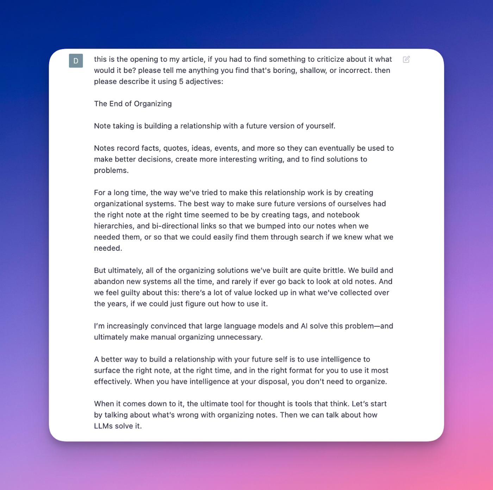](https://d24ovhgu8s7341.cloudfront.net/uploads/editor/posts/2499/optimized_g2GhgKT4zx0BiUXt5ysmWjM5S-pl0lO8DmBAFtPVYit5Nz4ibBGmLoW6gcPwpe580ikENPJtbyiOlKD0bw5sQXCLkH5zEFf1u86hqLNgloUomC7Zy8jZ1kZsSI4Yib4nTfQ12Pg-IMZdNqpOzw6Tc0A.png?link=true)

[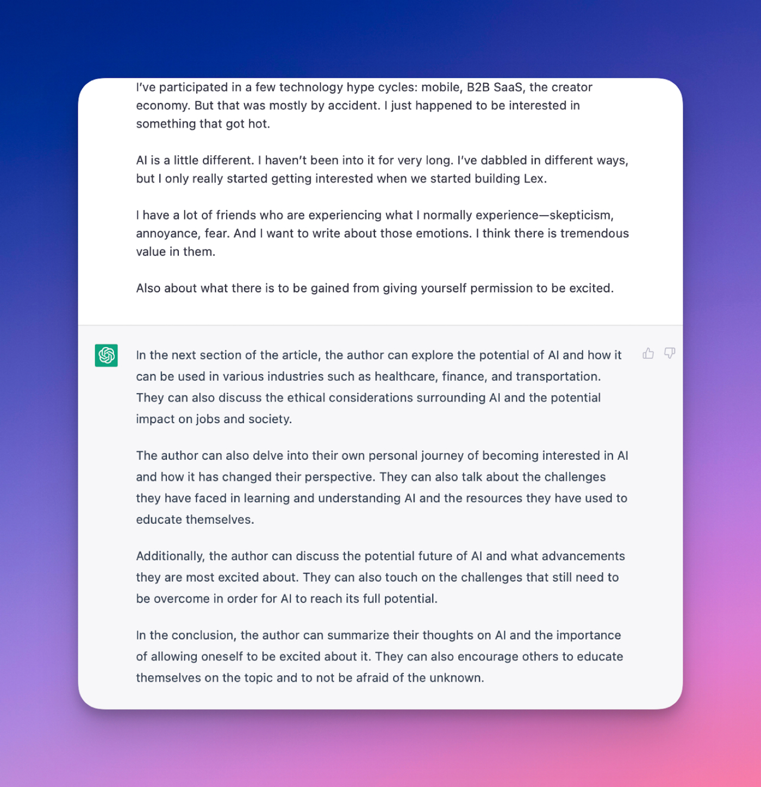](https://d24ovhgu8s7341.cloudfront.net/uploads/editor/posts/2499/optimized_pb_ySruCK93BzAUFFw2utLWk22cT2KS47BMfuztKCSNDDAR2lfaFMqUsRQLCGAA1hp-NQ2SI3bi8aAasUiVKCfU4XgqxclYBWpmgrViP_-zbJQ6qTEXtrt38ZkCgz87ZOXCWd5MWtgqhk1HFpicPKa0.png?link=true)

I didn’t take any of its ideas wholesale, but I did take its suggestions to track my own personal journey and ran with it.  

我没有全盘采纳它的任何想法，但我确实采纳了它的建议来追踪我自己的个人旅程并遵循它。

It’s another case of GPT-3 suggesting something that’s fairly obvious but that’s hard to see when you’re in the middle of a piece of work.  

这是 GPT-3 的另一个例子，它暗示了一些相当明显的东西，但当你在工作中时很难看到。

Once you’re finished with a draft, AI can also be useful in helping you evaluate your work.  

完成草稿后，人工智能还可以帮助您评估工作。

## Using AI to get a fresh brain  

使用人工智能获得新鲜大脑

At Every we talk a lot about the value of fresh brains for writing. It’s an idea from our former executive editor [Rachel Jepsen](https://practiceprocesscraft.substack.com/?utm_source=substack&utm_medium=web&utm_campaign=substack_profile).  

在 Every，我们经常谈论新鲜大脑对写作的价值。这是我们前执行编辑 Rachel Jepsen 的想法。

When you’ve been banging away on a piece for a long time, it’s hard to know if it’s good. You need a fresh brain to tell you what you have.  

当你长时间研究一件作品时，很难知道它是否好。你需要一个新鲜的大脑来告诉你你有什么。

You can get a fresh brain in different ways. You can stick the piece in a drawer and come back to it in a few days.  

您可以通过不同的方式获得新鲜的大脑。你可以把这件作品放在抽屉里，几天后再回来看。  

You can bring in a trusted colleague, an editor, or a friend to read it and tell you what they think.  

您可以请一位值得信赖的同事、编辑或朋友来阅读并告诉您他们的想法。

If none of those options are available to you, you can ask the AI.  

如果您没有这些选项，您可以询问 AI。

For example, when I was writing my “End of Organizing” piece, I wanted to know how well the introduction was working:  

例如，当我写我的“组织结束”文章时，我想知道引言的效果如何：

Here’s what ChatGPT had to say:  

这是 ChatGPT 不得不说的：

[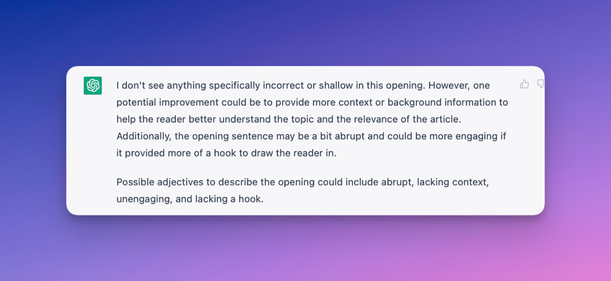](https://d24ovhgu8s7341.cloudfront.net/uploads/editor/posts/2499/optimized_HxqRMTCLIgvphUFOinkJl20fjpMfzcVCY402DS3XqHqD5LAAjdEaLrVBExlFCn4PgwOVirWYXlv8YzJ9CvDWn2xCfrhYHo6tWdplj4LvAp8WhuO7T8XJPrvvJE0YF5D8jWp_fpkWdx1blceukWO8WP0.png?link=true)

It’s feedback is great: it told me that the opening sentence was a bit abrupt, and it was right.  

它的反馈很好：它告诉我开头的句子有点生硬，而且是对的。

My original opening sentence to the article was: “Note-taking is building a relationship with a future version of yourself.” This is an important line, but it needs more context before you’re ready to read it.  

我最初对这篇文章的开头是：“记笔记是与未来版本的自己建立关系。”这是重要的一行，但在您准备好阅读之前需要更多上下文。  

It’s not an opening line.  

这不是开场白。

After I got this feedback from ChatGPT, I came up with a new opening:  

在收到 ChatGPT 的反馈后，我想出了一个新的开端：

“I hate to be the bearer of bad news, but all of the time we’ve spent organizing our notes was probably wasted.”  

“我讨厌成为坏消息的传播者，但我们花在整理笔记上的所有时间可能都被浪费了。”

Then I moved the original opening a few sentences down, and it all worked a lot better.   

然后我把原来的开场白往下移了几句，效果就好多了。

## Closing thoughts  结语

In _The Writing Life_, Annie Dillard says, “The painter…does not fit the paints to the world. He does not fit the world to himself. He fits himself to the paint.”  

在写作生活中，安妮迪拉德说，“画家......不适合这个世界。他不适合自己的世界。他很适合油漆区。”

Art, in other words, is the process of the artist learning to fit themselves to the tools they have to work with.  

换句话说，艺术是艺术家学习使自己适应他们必须使用的工具的过程。  

Our definition of what writing is, and what the job of the writer is, comes from the tools we use to make writing.  

我们对什么是写作以及作家的工作是什么的定义来自我们用来写作的工具。

AI changes the bundle of skills you can use to be a writer, but it doesn’t change the need for writing.  

人工智能改变了你可以用来成为一名作家的技能组合，但它并没有改变写作的需求。  

Learning to master it as a creative tool is a good way to create new kinds of writing than were possible before.  

学习将其作为一种创造性工具来掌握，是创造前所未有的新型写作的好方法。

And that’s a good thing for writers, and for the world.  

这对作家和整个世界来说都是一件好事。

___

**Want to apply this essay to your work?  

想将这篇文章应用到您的工作中吗？**Watch a 40-minute self-paced workshop on writing with AI, and practice with custom exercises.  

观看 40 分钟的自定进度的 AI 写作研讨会，并通过自定义练习进行练习。

You'll learn how to use AI as a creative tool to help you do the best writing of your life.  

您将学习如何使用 AI 作为创意工具来帮助您完成人生中最好的写作。

Curious? Learn more: 好奇的？了解更多：
