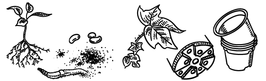
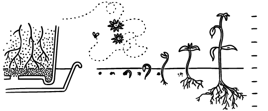
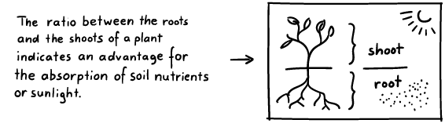
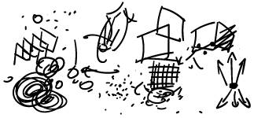
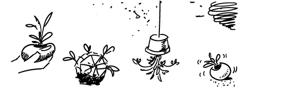
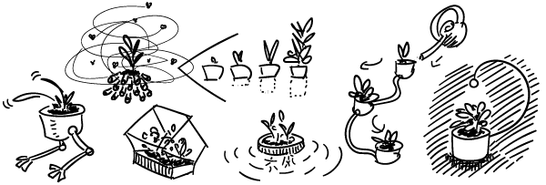
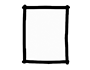
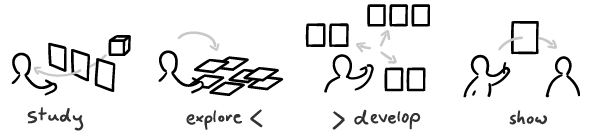

1\. December 2022 1.2022年12月47860 Views 47860次浏览

Great ideas are hard to find. Drawing makes it a lot easier. And fun. How?  

伟大的想法是很难找到的。绘画使它变得容易得多。而且很有趣。怎么做？

In a [creative process](https://ralphammer.com/the-creative-switch/) drawing can play **four different roles**.  

在一个创作过程中，绘画可以扮演四个不同的角色。

Let’s say, we want to come up with **ideas for a new flower pot**.  

比方说，我们想为一个新的花盆出谋划策。

## **1\. Study: Fill your mind  

1.学习：填充你的思想**

To **prepare** for our ideation we first draw what we want to think about. These **study drawings** are realistic images. They force us to **observe** our subject closely and absorb as much knowledge as possible.  

为了准备我们的构思，我们首先画出我们想要思考的东西。这些学习画是现实的图像。它们迫使我们仔细观察我们的主题，并尽可能多地吸收知识。

We clarify, pay attention to details, and make the invisible visible.  

我们澄清，关注细节，并使不可见的东西变得可见。

Illustrations [make abstract thoughts accessible](https://ralphammer.com/a-lightbulb-is-not-an-idea/) to our **emotional and bodily thinking**—to our **intuition**.  

插图使抽象的思想能够被我们的情感和身体思维所触及，成为我们的直觉。

So when we do text research, we add illustrations to make the new knowledge more **concrete** and **real**. Speaking of bodily **experience**: Don’t just look! If we want to learn about flower pots it helps to get our hands dirty and do some gardening. Hell, we might even try pottery!  

因此，当我们做文本研究时，我们会添加插图，使新知识更加具体和真实。说到身体的体验：不要只看不做!如果我们想了解花盆的情况，就应该弄脏我们的手，做一些园艺工作。该死的，我们甚至可以尝试陶艺  

And of course we make sketches of everything we learn along the way.  

当然，我们还把一路上学到的东西都画成草图。

The aim of the study phase is to understand **what is there** and **what is going on**. Since we can’t draw everything we are forced to make a choice. This helps us **clarify our interests** and what we actually want.   

研究阶段的目的是了解那里有什么，正在发生什么。由于我们不可能画出所有的东西，所以我们被迫做出选择。这有助于我们澄清我们的兴趣和我们实际上想要什么。

In our case, that means: what kind of flower pot we want to design.  

就我们而言，这意味着：我们要设计什么样的花盆。

## 2\. Explore: Let it happen  

2.探索：让它发生

After we have taken in as much information as possible, we now want to go “crazy” and **draw** as **many** **ideas** as possible.   

在我们吸收了尽可能多的信息后，我们现在要 "疯狂 "地画出尽可能多的想法。

But what if our mind goes blank and we don’t have any?   

但如果我们的大脑一片空白，没有任何东西怎么办？

Then we still need to draw.   

那么我们仍然需要画画。

Ok, but what? 好的，但是什么？

Anything! Just put that pen on the paper and **keep it moving**. Scribble, make random marks and shapes. This will kickstart our visual thinking process.  

任何事情都可以!只要把笔放在纸上并保持移动。乱涂乱画，做随机标记和形状。这将启动我们的视觉思维过程。

And what are we thinking about? New plant pots of course! We draw everything that comes to mind. Everything! Those drawings just keep pouring **from our mind through our hands on that sheet of paper**. We have created a **loop** where our imaginations turn into drawings and those drawings initiate new imaginations.  

我们在想什么呢？当然是新的植物盆栽！我们在想什么？我们把想到的一切都画出来。所有的东西!这些图画不断地从我们的脑海中通过我们的双手涌向那张纸。我们创造了一个循环，我们的想象力变成了图画，而这些图画又引发了新的想象力。

But these imaginations are fickle, they keep changing and might even disappear forever—if we don’t **catch them with our pen**. So we have to move **fast**! This is where all our hard work on those [drawing exercises](https://ralphammer.com/a-quick-beginners-guide-to-drawing/) pays off. The better trained our hands and eyes are, the more **spontaneous** is the flow of ideas.  

但这些想象力是善变的，它们不断变化，甚至可能永远消失--如果我们不用笔抓住它们。因此，我们必须快速行动!这就是我们在那些绘画练习上所做的努力得到了回报。我们的手和眼睛训练得越好，想法的流动就越自如。

And there is no need to worry about whether our drawings are ugly or unintelligible. At this point they are only here for us. We use drawing to have a **productive private monologue**, to think out loud on paper. The **exploration** phase is all about **spontaneous** drawings to **get going**, **stimulate** our imagination, and **fixate** all those ideas **rapidly**. It is not a beauty contest.  

而且没有必要担心我们的图画是否丑陋或不被人理解。在这一点上，它们只是为我们而存在。我们用绘画来进行富有成效的私人独白，在纸上大声思考。探索阶段都是自发的绘画，让我们开始行动，刺激我们的想象力，并将所有这些想法迅速固定下来。这不是一场选美比赛。

## 3\. Develop: See how it works  

3.开发：看看它是如何工作的

Once we get into “sober mode” it is time to figure out which idea might actually work. So we **arrange** our ideas spatially, **group them** into similar ideas, and maybe add some **annotations**.  

一旦我们进入 "清醒模式"，就是要弄清楚哪个想法可能真的可行。因此，我们在空间上安排我们的想法，把它们归类为类似的想法，也许再加上一些注释。

Then we make a selection and **clarify** what we are after. I decided to go for a plant pot that somehow supports the growth of the plant. These drawings are **cleaner** than our initial sketches.  

然后我们进行选择，明确我们的目标。我决定选择一个能以某种方式支持植物生长的花盆。这些图纸比我们最初的草图要干净。

They are also more precise, especially since we want to explore the **feasibility** of our ideas.  

它们也更精确，特别是由于我们想探索我们想法的可行性。

## 4\. Show: Share what matters  

4.展示：分享重要的东西

To share our ideas with others we must **focus on the essential**.  

为了与他人分享我们的想法，我们必须将注意力集中在本质上。

The look and level of detail depend on the context. Our sketch here is made for an informal critique among designers.  

外观和细节的程度取决于背景。我们这里的草图是为设计师之间的非正式批评而作的。  

In a final product presentation we would use a series of images to lead the audience from the initial problem to the solution.  

在最终的产品展示中，我们会用一系列的图像来引导观众从最初的问题到解决方案。

When ideas are still in their infancy—for example here I am not 100% sure we should go with the pot rings and want to discuss the idea with fellow designers—I recommend a very simple format:   

当想法还处于萌芽状态时--例如在这里，我并不100%确定我们应该采用锅圈，并希望与其他设计师讨论这个想法--我建议采用非常简单的格式：

-   one headline 一个头条新闻
-   one image 一幅图像
-   one written sentence 一句话

When we show an idea—as opposed to a final product—we usually want to **make room for debate**. The less we show, the more people can think and say. The drawing should be **clear** but **not too elaborated**. The text is kept **simple** and **short**. Too much information might suffocate precious feedback from others.  

当我们展示一个想法--相对于一个最终产品--我们通常希望为辩论留出空间。我们展示的越少，人们可以思考和发言的就越多。绘画应该是清晰的，但不要太精细。文字保持简单和简短。太多的信息可能会窒息他人的宝贵反馈。

## Drawing ideas as an extension of our mind  

作为我们思想的延伸的绘画创意

**Study** drawings are **rich with details** to make us familiar with our subject. In the **exploration** phase we fixate fleeting imaginations on paper. These sketches are **rough**, **spontaneous**, and above all: **fast**!  

研究性绘画有丰富的细节，使我们熟悉我们的主题。在探索阶段，我们把转瞬即逝的想象力固定在纸上。这些草图是粗略的、自发的，最重要的是：快速的

To make sense of these sketches we **clarify** our ideas using **elaborate clean** drawings. When we **show** an idea to other people we keep it **short** and **simple**, to make room for debate.  

为了使这些草图有意义，我们用精心设计的简洁图纸来澄清我们的想法。当我们向其他人展示一个想法时，我们保持它的简短和简单，以留出辩论的空间。

Drawing ideas with pen and paper can build a bridge between our imagination and the reality we want to create. So get started with [these little drawing exercises](https://ralphammer.com/a-quick-beginners-guide-to-drawing/)!  

用纸笔画出想法可以在我们的想象力和我们想要创造的现实之间建立一座桥梁。因此，从这些小小的绘画练习开始吧!

### Before you go 在你走之前

If you enjoyed this article, then **subscribe to my mailing list** to receive more animated stories!  

如果你喜欢这篇文章，那么请订阅我的邮件列表，以收到更多的动画故事!
