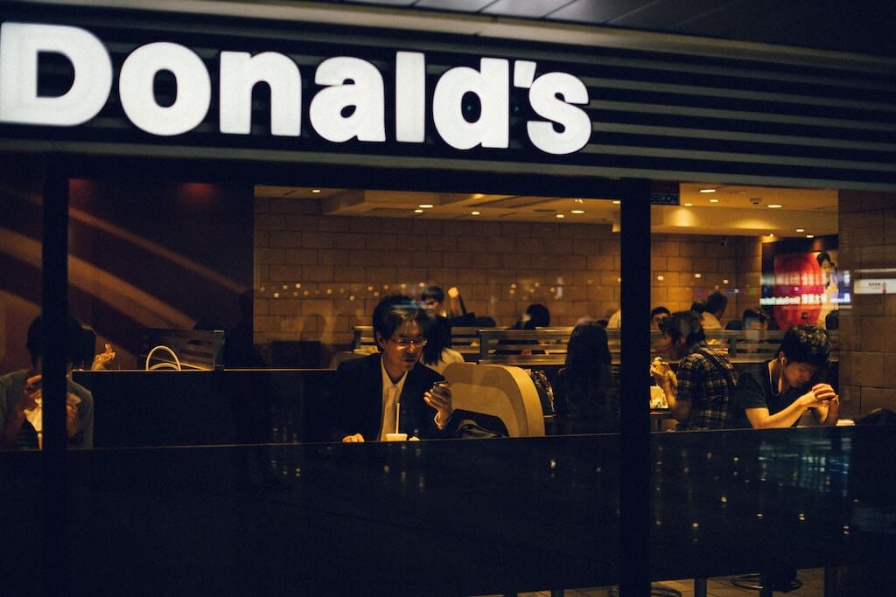

It’s a little funny that I’ve not talked about personal brand before, given Commonplace’s focus on building [career moats](https://commoncog.com/career-moats-101/). A reasonable reader might ask: “well, isn’t personal brand a strong type of a moat?”  

鉴于《通俗》杂志对建立职业护城河的关注，我之前没有谈及个人品牌，这有点可笑。有理智的读者可能会问："好吧，个人品牌不就是一种强大的护城河吗？"

The answer to that is yes, it certainly is.  

答案是：是的，当然是。  

But we must be careful about personal brands — the same way that we must be careful whenever we deal with career prestige, or status; personal brands are useful, but they hook into powerful psychological factors that [distort](https://commoncog.com/mungers-two-track-analysis/) their real value.  

但我们必须谨慎对待个人品牌--就像我们每次处理职业声望或地位时必须谨慎一样；个人品牌是有用的，但它们会勾起强大的心理因素，扭曲其真实价值。

Let’s back up a little.  

让我们倒退一下。

Longtime readers would know that my conception of a ‘career moat’ comes from Warren Buffett’s notion of an ‘economic moat’ — a term he uses to describe sustainable competitive advantages in business.  

长期的读者会知道，我对 "职业护城河 "的概念来自沃伦-巴菲特的 "经济护城河 "概念--他用这个词来描述企业的可持续竞争优势。  

Buffett favours companies with brands because a good brand is a powerful way to build a sustainable advantage.  

巴菲特青睐有品牌的公司，因为一个好的品牌是建立可持续优势的有力途径。

But there’s a caveat here: brands _alone_ don’t make a moat. The ownership of a powerful brand must [lead to sustained pricing power in order to be valuable](https://www.businessinsider.com/warren-buffett-pricing-power-beats-good-management-berkshire-hathaway-2011-2).  

但这里有一个警告：光有品牌并不能形成护城河。拥有一个强大的品牌必须导致持续的定价权，这样才有价值。

In other words, a company may have a great brand, but if it is unable to raise prices against its competitors … then the brand doesn’t count for very much.  

换句话说，一家公司可能有一个伟大的品牌，但如果它不能对其竞争对手提高价格......那么，品牌就没有什么意义了。

As it is for businesses, so it is for careers.  

对企业如此，对职业也是如此。

## Pricing Power in Careers 职业中的定价权

I think that if you’re building a personal brand for your career, then you should evaluate it based on the career benefits that it gives you.  

我认为，如果你要为你的职业生涯建立一个个人品牌，那么你应该根据它给你带来的职业利益来评估它。

(There are alternative reasons to build a personal brand, of course, such as to attract like-minded people on social media, or to expand your exposure to new friends and to new ideas — but I’m not talking about that here; this is a career blog, after all!)  

(当然，建立个人品牌还有其他原因，比如在社交媒体上吸引志同道合的人，或者扩大你对新朋友和新想法的接触面--但我在这里不谈这个，毕竟这是一个职业博客！)

So what _is_ a personal brand?  

那么，什么是个人品牌？

Let’s first talk about brands in general. People often confuse branding and brands for design, or marketing. Brands are _constructed_ using design, and _established_ using marketing, but they aren’t either things. The best definition I’ve seen on the topic is by businessman Brent Beshore, who [argues](https://www.collaborativefund.com/blog/the-making-of-a-brand/):  

首先我们来谈谈一般的品牌。人们经常把品牌和品牌与设计，或营销混为一谈。品牌是用设计来构建的，用营销来建立的，但它们都不是东西。我在这个话题上看到的最好的定义是由商人Brent Beshore提出的，他认为：

> “Brand is the distribution of likely outcomes that you can expect from any company or person.”  
> 
> "品牌是你可以从任何公司或个人那里期待的可能结果的分布。"

Morgan Housel [writes](https://www.collaborativefund.com/blog/the-making-of-a-brand/): 摩根-豪斯尔写道：

> Brand wasn’t about having the highest quality. It wasn’t even about building trust. “You don’t trust the Coca-Cola brand,” Beshore said. “You know what to expect from them.” _Knowing what to expect._ That’s the essence of a brand.  
> 
> 品牌并不是为了拥有最高的质量。它甚至不是关于建立信任。"你不相信可口可乐的品牌，"Beshore说。"你知道该从他们那里期待什么。"知道该期待什么。这就是品牌的本质。

A personal brand is therefore a set of expectations around your skills, your behaviour, your values and your worldview.  

因此，个人品牌是围绕你的技能、你的行为、你的价值观和你的世界观的一套期望。

It’s important to remember that _consistency_ is the key component of a strong brand, not excellence.  

重要的是要记住，一致性是一个强大品牌的关键组成部分，而不是卓越。  

As Housel notes in his piece, it’s entirely possible to build a great brand on a subpar experience — take McDonald burgers, for instance, which are consistent regardless of whether you eat them in Vienna or Vietnam.  

正如Housel在他的文章中所指出的，完全有可能在一个不合格的体验上建立一个伟大的品牌--以麦当劳汉堡为例，无论你在维也纳还是越南吃汉堡，它都是一致的。

The Big Mac: the same everywhere.  

巨无霸：到处都一样。

A strong business brand is one that delivers a consistent set of outcomes for the customer. A _good_ business brand is one that allows the business to exercise pricing power.  

一个强大的商业品牌是能够为客户提供一系列一致的结果。一个好的商业品牌是一个允许企业行使定价权的品牌。

In the context of a career, a strong personal brand is a repetitively consistent portrayal of your personality, your conduct, your skills, and your worldview. A _good_ personal brand translates to jobs and opportunities that you might not otherwise have access to.  

在职业生涯中，一个强大的个人品牌是对你的个性、你的行为、你的技能和你的世界观的重复一致的描述。一个好的个人品牌可以转换为你可能无法获得的工作和机会。  

In theory, a famous programmer commands a salary premium that a non-famous programmer does not. A marketer that’s known for good work gets hired at a higher rate.  

从理论上讲，一个著名的程序员可以获得比非著名程序员更高的薪水。一个因工作出色而闻名的营销人员会以更高的价格被雇用。  

A solopreneur with an audience is able to launch products to that audience. And so on — an infinite number of examples abound.  

一个有受众的独行侠能够向该受众推出产品。以此类推--无穷无尽的例子比比皆是。

I bring this up because it is entirely possible to build a brand that gives you little career benefit.  

我之所以提出这个问题，是因为完全有可能建立一个给你带来很少职业利益的品牌。  

If you’re reading this, it is likely that you are a career-oriented person, and you know me as the ‘career-moats’ guy. But my writing on Commonplace has little to no bearing to my [_actual_ career moat](https://commoncog.com/building-career-moats-a-confession/) — that is, my ability to grow and manage engineering teams in uncomfortable South East Asian countries.  

如果你正在读这篇文章，很可能你是一个以事业为导向的人，你知道我是 "事业护城河 "的人。但是，我在《天下》上的文章与我实际的职业护城河几乎没有关系--也就是我在不舒服的东南亚国家发展和管理工程团队的能力。  

My reputation around that moat is built through personal referrals in Singapore’s startup community.  

我在这条护城河周围的声誉是通过新加坡创业社区的个人推荐建立的。

## Do Impressive Things And Tell People About It  

做令人印象深刻的事情，并告诉人们这一点

Personal brands have existed for as long as careers have existed.  

只要有职业存在，个人品牌就一直存在。  

In the past, we used simpler words like ‘reputation’ … as in “wow Sally seems to be developing quite the reputation as a turnaround artist, hasn’t she!?” The fact that we use phrases like ‘personal brand’ today is a reflection of our media climate.  

在过去，我们使用的是 "声誉 "这样简单的词......就像 "哇，莎莉似乎正在发展作为一个周转艺术家的相当大的声誉，不是吗？"今天我们使用 "个人品牌 "这样的短语，是我们媒体环境的反映。  

The Internet has turned us all into publishers and broadcasters, and our language has adapted accordingly.  

互联网把我们都变成了出版商和广播员，我们的语言也相应地进行了调整。

This has several implications, ones that I’m uncomfortable with.  

这有几个含义，是我感到不舒服的。

There’s an old adage about careers that goes “to have a great career, go do impressive things, then tell people about it.” Presumably, the personal brand bit falls into the latter half of the sentence, the ‘tell people about it’ half.  

有一句关于职业的老话是这样说的："要想有一个伟大的职业生涯，就去做令人印象深刻的事情，然后告诉人们。"据推测，个人品牌属于这句话的后半部分，即 "告诉人们它 "的部分。  

This is sensible advice. 这是明智的建议。

My misgivings come from the observation that it _is_ possible to hack personal brands today in a way that was impossible for reputations a few years ago.  

我的疑虑来自于这样的观察：今天有可能以几年前声誉不可能达到的方式黑掉个人品牌。  

A good many people are able to build a following if they are sufficiently good at writing, marketing, or videography. These followings _do_ lead to increased career opportunities. But they don’t often last.  

好多人如果在写作、营销或摄像方面有足够的能力，就能建立一个追随者。这些追随者确实会带来更多的职业机会。但它们往往不能持久。

You see this the most clearly with venture capitalists. Brent Beshore [observes](http://investorfieldguide.com/adventures/) that the typical career path in venture capital today isn’t to build out a fund and to use its returns to justify raising future funds from limited partners.  

你在风险资本家身上最清楚地看到这一点。布伦特-贝索尔观察到，今天风险投资的典型职业道路并不是建立一个基金，并利用其回报来证明从有限合伙人那里筹集未来的资金。  

Investing is a difficult activity, and VC returns are generally terrible — the best firms have access to the best deals, leaving the scraps for everyone else to fight over.  

投资是一项艰难的活动，风险投资的回报一般都很糟糕--最好的公司可以获得最好的交易，而把残羹剩饭留给其他人去争夺。  

So instead of banking on good returns, the typical VC career path is to build up a personal brand on social media, and use this asset to soft-land into some other role in the (likely) event that their fund fails.  

因此，典型的风险投资职业道路不是依靠良好的回报，而是在社交媒体上建立个人品牌，并在他们的基金失败（很可能）的情况下，利用这一资产软着陆到其他角色。

The implication here is that the many thought leader VCs you see on social media today will go away in a decade or so when their funds close … or whenever it is that capital markets force them to change.  

这里的意思是，你今天在社交媒体上看到的许多思想领袖风险投资公司将在十年左右当他们的基金关闭时消失......或者当资本市场迫使他们改变时。  

The investors that stick around will be those who have mastered the extremely difficult art of investing in early-stage companies.  

坚持下来的投资者将是那些掌握了投资早期公司这一极其困难的艺术的人。

I remember hearing Beshore’s argument about brands and VCs, and then working through the second-order implications of his reply.  

我记得听到Beshore关于品牌和风险投资的论点，然后研究了他的回答的二阶含义。  

First: perhaps building personal brands in the way that VCs do (marketing, self-promotion, social media) is a good idea in the short term — say, if you want to parlay it into one or two career moves.  

第一：也许以风险投资人的方式建立个人品牌（营销、自我宣传、社交媒体）在短期内是个好主意--比如说，如果你想把它转化为一两个职业行动。  

But this then begs the question: why bother building a brand if it lasts only a decade? Most careers are four decades long. The peak of a typical career occurs in one’s 50s and 60s.  

但这又引出了一个问题：如果一个品牌只持续十年，为什么还要费力地建立它呢？大多数人的职业生涯有四十年之久。一个典型的职业生涯的高峰期发生在50和60年代。

A brand that lasts 10 years, built early in one’s career, seems like a waste of time in the grand scheme of things.

  

一个持续10年的品牌，在一个人的职业生涯早期建立，在大的计划中似乎是浪费时间。

The really difficult bit of ‘do impressive things and then tell people about it’ is the first part: the ‘do impressive things’ part. Don’t let anyone tell you otherwise: it is _incredibly_ difficult to build a set of [rare and valuable skills](https://commoncog.com/so-good-they-cant-ignore-you/). Chess players practice for a decade on average to reach grandmaster status; [Chinese businessmen](https://commoncog.com/chinese-businessmen-let-reality-be-the-teacher/) often take two to find their feet and reap the fruits of their businesses. There doesn't seem to be an easy way around it.  

真正困难的是 "做令人印象深刻的事情，然后告诉人们 "的第一部分："做令人印象深刻的事情 "的部分。不要让任何人告诉你：建立一套罕见和有价值的技能是非常困难的。国际象棋选手平均练习十年才能达到大师级水平；中国商人往往需要两年时间才能找到自己的立足点并收获他们的商业成果。似乎没有一个简单的方法可以解决这个问题。

It is for this reason that I am suspicious of people who have huge personal brands in their 20s and 30s, without the rare and valuable skills needed to justify them.  

正是由于这个原因，我对那些在20多岁和30多岁就拥有巨大个人品牌的人感到怀疑，因为他们没有证明这些品牌所需的稀有和宝贵的技能。  

My reasoning for this is that I look at people in their 40s and 50s today and find that very few of them built their brands in their 30s; nearly all of them spent that time building a rare and valuable _combination_ of skills.  

我的理由是，我看了看今天40多岁和50多岁的人，发现他们中很少有人在30多岁时就建立了自己的品牌；几乎所有的人都在那段时间里建立了一种罕见的、有价值的技能组合。

My primary takeaway from these people is that it is easier to build a personal brand by being impressive in the first place.  

我从这些人身上得到的主要启示是，首先要让人印象深刻，这样才更容易建立个人品牌。  

This may take a long while, as is the case with most things in one's career. But reputation flows downhill from impressiveness.  

这可能需要很长一段时间，就像一个人职业生涯中的大多数事情一样。但是，声誉是从令人印象深刻的地方流下来的。  

And brand building is relatively easy when compared to the grind of becoming impressive in the first place.  

与一开始就变得令人印象深刻的磨练相比，品牌建设是相对容易的。

You may argue that social media didn't exist in their generation, and that this has changed today. Your argument may well be true.  

你可能会说，在他们那一代，社交媒体并不存在，而今天这种情况已经改变。你的论点很可能是真的。

But the other perspective here is that perhaps reputation matters more than media-centric brand-building — and for many industries, such reputation networks remain unchanged.  

但这里的另一个观点是，也许声誉比以媒体为中心的品牌建设更重要--对许多行业来说，这种声誉网络仍然没有改变。  

You almost can’t help but build networks of fellow operators as you become better at some valuable skill; if you work in such industries, it’s probably better to focus on such networks than it is to build up your following on Twitter.  

当你在一些有价值的技能上变得更好时，你几乎不由自主地建立起同业的网络；如果你在这样的行业工作，关注这样的网络可能比在Twitter上建立你的粉丝更好。

## Closing Thoughts 闭幕感想

If I were to summarise the ideas in this piece, I’d argue the following:  

如果让我总结一下这篇文章中的观点，我会论证如下：

-   Like in business, personal brands (built for careers!) should be evaluated on pricing power.  
    
    就像在商业中，个人品牌（为职业而建！）应该根据定价能力进行评估。  
    
    If your industry is one in which a stronger personal brand leads to materially better career outcomes, then building a brand is worth it, and you should go for it.  
    
    如果你的行业是一个更强大的个人品牌会带来实质性的更好的职业结果，那么建立一个品牌是值得的，你应该去做。  
    
    Otherwise, it’s probably a distraction from the difficult task of getting good at something.  
    
    否则，它可能会分散人们的注意力，使其无法完成擅长的艰巨任务。
-   Even _if_ your industry is one in which a stronger personal brand matters, it’s worth it to periodically evaluate the relationship between the aggregation of attention you’ve gathered around yourself and the career outcomes that you want to achieve.  
    
    即使你所在的行业是一个个人品牌较强的行业，也值得定期评估你在自己周围聚集的注意力和你想实现的职业成果之间的关系。  
    
    Personal brand building is alluring because it appeals to your ego. It is terribly easy for this psychological effect to distort your evaluation of its value.  
    
    个人品牌建设是诱人的，因为它吸引了你的自我。这种心理效应非常容易扭曲你对其价值的评估。
-   Careers last a full four decades, on average. I think it’s worth it to evaluate people along this timescale.  
    
    职业生涯平均持续了整整四十年。我认为按照这个时间尺度评估人们是值得的。  
    
    If you know people with huge personal brands today, ask yourself: are their personal brands going to last a decade or more?  
    
    如果你认识今天拥有巨大个人品牌的人，请问你自己：他们的个人品牌是否会持续十年或更长时间？  
    
    And are they staking their reputation on market dynamics that will change beyond a decade?  
    
    他们是否将自己的声誉押在十年后会发生变化的市场动态上？  
    
    The people with the longest lasting and best performing personal brands — investors like Warren Buffett and Howard Marks; chefs like Wolfgang Puck, Alice Waters, Michael Romano and Danny Meyer — took a long time to build their skills, and usually staked their reputations on something that is unchanging and universally valuable (equity investing, distressed debt, and restauranting, in that order).  
    
    拥有最持久和表现最好的个人品牌的人--像沃伦-巴菲特和霍华德-马克斯这样的投资者；像沃尔夫冈-帕克、爱丽丝-沃特斯、迈克尔-罗曼诺和丹尼-梅耶这样的厨师--花了很长时间来建立他们的技能，并且通常将他们的声誉押在一些不变的、具有普遍价值的东西上（股权投资、不良债权和餐饮业，依次为股权投资）。

The most important takeaway is probably the last one, above. Much writing on personal brands today focus on tactical approaches to bend social media to one’s benefit.  

最重要的收获可能是上面的最后一条。今天，许多关于个人品牌的文章都集中在使社交媒体对个人有利的战术方法上。  

But I think it’s valuable to look at the bigger picture here. Most careers last four decades, not four years.  

但我认为，在这里从大处着眼是很有价值的。大多数职业生涯持续四十年，而不是四年。

We should act like this is the case.  

我们应该表现得像这样的情况。

Originally published 19 November 2019, last updated 20 November 2019.  

最初发表于2019年11月19日，最后更新于2019年11月20日。
