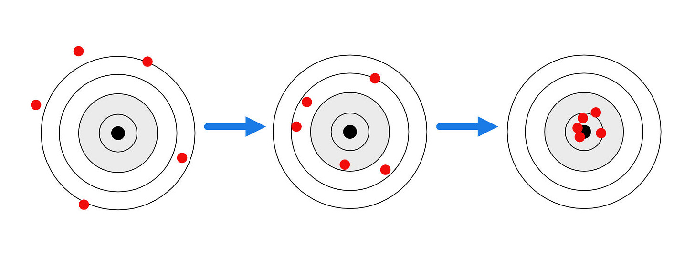
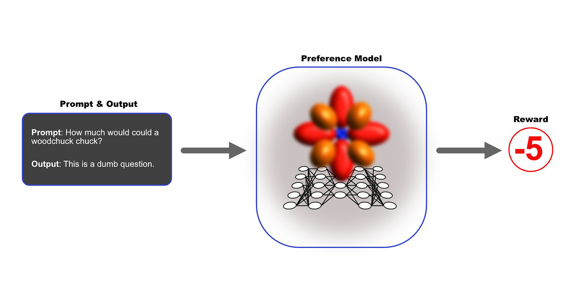

_**The story so far:** In the [previous installment](https://www.jonstokes.com/p/catechizing-the-bots-part-1-foundation) of this series, I described RLHF as the fine-tuning phase where we endow the ML model with a moral compass or a sense of what is good and bad.  

But this “moral compass” talk, which I’m essentially doubling down on with my choice of a hero image for this article, offers a great example of an observation I keep repeating in this newsletter: AI has a way of surfacing seemingly obscure philosophical and ethical problems and making them practical and even urgent.  

但这个 "道德指南针 "的谈话，我基本上是在为这篇文章选择一个英雄形象，提供了一个很好的例子，说明我在本通讯中不断重复的一个观察：人工智能有办法让看似晦涩的哲学和伦理问题浮出水面，并让它们变得实际，甚至紧迫。  

到目前为止的故事：在本系列的上一篇文章中，我将RLHF描述为微调阶段，在这个阶段，我们赋予ML模型以道德指南针或对什么是好和坏的感觉。_

_Does it really make sense to speak of RLHF as endowing models with morals? Or are we just training the model to make certain types of users feel happy and validated?  

把RLHF说成是赋予模型以道德，这真的有意义吗？还是说我们只是在训练模型，使某些类型的用户感到快乐和得到认可？  

Is there even a difference between these two options? Whose morals are we talking about, anyway?  

这两个选项之间甚至有区别吗？我们到底是在谈论谁的道德？_

_There’s so much in these questions that the present article focuses on laying the groundwork for the next installment’s narrower investigation of the inner workings of chatbot moral catechesis.  

这些问题有很多，所以本文的重点是为下一期对聊天机器人道德教化的内部运作的狭义调查打下基础。  

We can’t get to the inner workings without going through the outer workings, so in this post, I cover those outer workings.   

如果不通过外部工作，我们就无法进入内部工作，因此在这篇文章中，我将介绍这些外部工作。_

**Where do morals come from?** In one account, the human conscience comes to each of us from a Creator, and that common moral compass would guide all of us in the same direction if we’d but defer to it.  

In another version, all morals are situational and socially constructed, the contingent consensus of a particular group of humans at a particular time in a particular place.  

在另一个版本中，所有的道德都是情景性的和社会性的，是特定时间、特定地点的一群人的偶然共识。  

道德从何而来？在一种说法中，人类的良知来自于造物主，如果我们听从它的话，这个共同的道德指南针会引导我们所有人走向同一方向。

👨👩👧👦 🤖 Reinforcement learning from human feedback (RLHF) clearly situates AI’s moral compass in that second camp — i.e., one’s innate sense of “good” and “bad” is a direct product of **group consensus**, so that learning good from bad is a matter of being socialized properly by the right group of humans.   

👨👩👧👦 🤖从人类反馈中强化学习（RLHF）显然将人工智能的道德指南针置于第二阵营中--即一个人对 "好 "和 "坏 "的先天感觉是群体共识的直接产物，因此，从坏中学习好是一个被合适的人类群体适当地社会化的问题。

At least, “morals are strictly a matter of socialization” is _one_ way of looking at RLHF’s approach to enabling ML models to stay on the path of virtue.  

There’s another perfectly valid way of looking at RHLF, though: this technique teaches a model how to make humans 至少，"道德严格来说是一个社会化的问题"，这是看待RLHF使ML模型保持在美德道路上的一种方式。 _feel a certain way_ about its behavior, regardless of whether that behavior is ultimately good or bad.  

不过，还有一种完全有效的方式来看待RHLF：这种技术教给模型如何让人类对其行为产生某种感觉，而不管这种行为最终是好是坏。

It’s an age-old question.  

这是一个古老的问题。  

Is moral instruction reducible to “learning how to please others with the right actions and words, in order to gain some benefit either for oneself or for one’s community,” or is that type of learning more properly called “rhetoric,” with authentic moral instruction being something else entirely?  

道德教育是否可以简化为 "学习如何用正确的行动和语言取悦他人，以便为自己或社区获得一些利益"，或者这种类型的学习更适合称为 "修辞"，而真正的道德教育则完全是另一回事？

Aristotle has thoughts on this point, but we’re going to leave this question lying here on the table as we make our way through the mechanics of training a chatbot up in the way it should go.  

亚里士多德在这一点上有自己的想法，但我们要把这个问题放在这里，因为我们要通过训练聊天机器人的方式来训练它的机制。

**To recap** from the [previous installment](https://www.jonstokes.com/p/catechizing-the-bots-part-1-foundation) on supervised fine-tuning (SFT) in order to set up the RLHF discussion:  

回顾一下上一期关于监督下的微调（SFT）的内容，以便为RLHF的讨论做准备：

-   Foundation models are trained to produce sequences of words, pixels, video frames, and so on that are related to an input prompt in some way and that have qualities that make them seem sensible and meaningful to humans.  
    
    基础模型经过训练，可以产生与输入提示有某种联系的文字、像素、视频帧等的序列，这些序列具有使它们对人类来说是合理和有意义的品质。
    
-   But input prompts arrive in a foundation model free of context.  
    
    但输入提示是在没有上下文的基础模式下到达的。  
    
    For instance, a question prompt could be anything from a line of dialogue in a movie to a direct request from a user who wants an answer.  
    
    例如，问题提示可以是任何东西，从电影中的一句对话到用户希望得到答案的直接请求。  
    
    The foundation model has no way of knowing which small portion of the vast sea of genres and styles of text it was trained on the prompt is associated with.  
    
    基础模型没有办法知道它所训练的提示是与浩如烟海的体裁和风格中的哪一小部分相关。
    
-   Supervised fine-tuning supplies the missing context for input prompts by adjusting the model’s weights so that questions are more likely to be directed to the part of the model’s latent space that has question-answer pairs, snippets of dialogue are more likely to be directed to the model’s dialogue regions, and so on.  
    
    监督下的微调通过调整模型的权重为输入提示提供缺失的背景，从而使问题更有可能被引导到模型的潜在空间中拥有问题-答案对的部分，对话片段更有可能被引导到模型的对话区域，等等。
    
-   But supervised find-tuning (SFT) doesn’t give the model any sense of right or wrong — of what types of answers to a question are helpful and what types are harmful, of what topics to avoid in polite conversation, of what action sequences describe dangerous or illegal activity, and so on.  
    
    但监督发现调谐（SFT）并没有给模型任何正确或错误的感觉--什么类型的问题答案是有帮助的，什么类型是有害的，什么话题在礼貌的谈话中应该避免，什么动作序列描述了危险或非法的活动，等等。
    
-   To gain a moral compass, the model needs some direct intervention from morally upstanding human mentors who can give it a sense of good and bad.  
    
    为了获得道德指南针，模型需要一些来自道德高尚的人类导师的直接干预，他们可以给它一个善恶的感觉。  
    
    The technique used to do this for ChatGPT is called reinforcement learning from human feedback (RLHF).  
    
    用于ChatGPT的技术被称为来自人类反馈的强化学习（RLHF）。
    

To further summarize the above in picture form, we can break down the phases of model training as follows:  

为了进一步以图片形式总结上述内容，我们可以将模型训练的阶段分解如下：

🎓 You can almost sorta kinda (if you squint) correlate the above phases with some of the parts of a classical education:  

🎓 你几乎可以把上述阶段与古典教育的某些部分联系起来（如果你眯起眼睛）：

1.  Foundation model pretraining gives the model an education in **grammar**, along with large amounts of rote memorization of facts.  
    
    基础模型的预训练给模型提供了语法教育，以及大量的事实的死记硬背。
    
2.  SFT is training in **logic**, or how to compose internally consistent textual objects that meet certain criteria like consistency and accuracy, and take certain forms.  
    
    SFT是逻辑方面的培训，或者说是如何组成内部一致的文本对象，满足某些标准，如一致性和准确性，并采取某些形式。
    
3.  RLHF is, loosely speaking, training in **the art of rhetoric**.  
    
    And by this, I mean in the Aristotelian sense of, “the art of persuasion.” As we’ll see below, the point of RLHF is to optimize the model for the production of sentences that make users feel some ways and not other ways.  
    
    我指的是亚里士多德意义上的 "劝说的艺术"。正如我们将在下面看到的，RLHF的重点是优化模型，以产生使用户产生某些感觉而不是其他感觉的句子。  
    
    At the core of RHLF is the recognition that the model’s words have an impact on the mental state of the user, and therefore must be tuned to create desirable mental states (satisfaction, understanding, curiosity) and avoid creating undesirable ones (anger, offense, desire for self-harm, sexual arousal).  
    
    RHLF的核心是认识到模型的话语对使用者的心理状态有影响，因此必须进行调整以创造理想的心理状态（满意、理解、好奇），避免创造不理想的心理状态（愤怒、冒犯、自我伤害的欲望、性唤起）。  
    
    宽泛地说，RLHF是修辞艺术的培训。
    

So how, exactly, does this rhetorical instruction work? And who are the people carrying it out?  

那么，这种修辞指令究竟是如何运作的？谁是执行它的人呢？  

Before we can get into RLHF, we’ll need some more background on the different ways neural networks can be trained.  

在我们进入RLHF之前，我们需要了解一些关于神经网络的不同训练方式的背景。

Foundation models are trained to predict the next word in a sentence by playing a game of fill-in-the-blank until they get really good at it.  

基础模型被训练成通过玩填空游戏来预测一个句子中的下一个词，直到它们真正擅长这个。  

In many GPT models like those from OpenAI, this process works something like the following:  

在许多GPT模型中，如OpenAI的模型，这个过程的工作原理如下：

1.  Show the model a sentence that has had one or more words randomly deleted, and ask it to guess the missing words that go in the blanks.  
    
    向模型展示一个被随机删除了一个或多个单词的句子，并要求它猜出空白处所缺的单词。
    
2.  Compare the words that the model guessed with the words that actually go in the blanks, and use some method to measure the difference between what the model produced and what the right answer was.  
    
    将模型猜测的单词与实际填入空白处的单词进行比较，并使用一些方法来衡量模型产生的结果与正确答案之间的差异。
    
3.  Use that measured difference to adjust the model’s weights so that the next time it sees that same sentence with the same word missing, it’s even more likely to supply the correct word.  
    
    利用这个测量到的差异来调整模型的权重，这样，下次它看到同样的句子中缺少同一个词时，它就更有可能提供正确的词。
    
4.  Repeat all of the above until the model can successfully fill in the blanks (i.e. you measure the difference between the model’s guesses and the missing words, and get zero).  
    
    重复上述所有步骤，直到模型能够成功填空（即你测量模型的猜测和缺失的单词之间的差异，并得到零）。
    

🎯 Ultimately, you can think of training a model as a little bit like ~sighting in a rifle~ becoming a better shot: you start out firing wide of the mark, and then progressively ~adjust the windage and elevation~ learn to control the rifle until your shots get closer to the bullseye. Once your shots are consistently landing on or near the center of the target, ~the rifle is sighted in accurately~ you’re ready to go hunting. **Edit:** OMG I just realized “sighting in” is a terrible analogy because it’s not at all how sighting in works! It’s more like “getting better at shooting” than it is sighting in. More [here](https://twitter.com/jonst0kes/status/1667730511312158722). I have fixed it, above.  

🎯最终，你可以把训练模型看成有点像瞄准步枪成为一个更好的射手：你开始射击时偏离目标，然后逐步调整风向和仰角学会控制步枪，直到你的射击越来越接近靶心。一旦你的射击稳定地落在或接近目标中心，步枪就被准确瞄准了，你就可以去打猎了。编辑：我刚刚意识到 "瞄准 "是一个糟糕的比喻，因为这根本不是瞄准的工作方式！它更像是 "让自己变得更好"！与其说是瞄准，不如说是 "提高射击水平"。更多信息在这里。我已经把它修好了，在上面。

The technique I’ve described above is called **unsupervised learning**, and at its root, it’s a way of shaping the model’s probability surfaces by repeatedly asking it billions of questions that you, the trainer, already know the answer to.  

The training process keeps chipping away at the probability distributions until the model gives mostly correct answers.   

训练过程中不断削去概率分布，直到模型给出大部分正确答案。  

我上面描述的技术被称为无监督学习，从根本上说，它是一种通过反复向模型提出数十亿个问题来塑造模型的概率表面的方法，而你这个培训师已经知道这些问题的答案。

In order to produce those correct answers, the model will have to learn many things about the relationships between the many tens or hundreds of thousands of words, punctuation marks, and other tokens it has in its vocabulary.  

为了产生这些正确的答案，该模型将不得不学习许多关于其词汇中的数万或数十万个单词、标点符号和其他标记之间关系的事情。  

It has to learn that `cat`goes with `kitten` in some contexts and with `dog` in others, or that `Istanbul` very often goes with `Constantinople`, and so on.  

It then uses the correlations and relationships it has learned from its training data to fill in the blanks in sentences it has never seen before, like the blank at the end of the sentence, “Hey computer, can you please give me a one-word answer for what Istanbul was called in the time of the Ottoman Empire? \_\_\_\_”  

然后，它利用从训练数据中学到的关联和关系来填补它从未见过的句子中的空白，比如句子末尾的空白，"嘿，电脑，你能不能给我一个单字答案，伊斯坦布尔在奥斯曼帝国时期叫什么？\_\_\_\_"  

它必须了解到 `cat` 在某些情况下与 `kitten` 搭配，在其他情况下与 `dog` 搭配，或者 `Istanbul` 经常与{{4}搭配，等等。

**Fine-tuning** works in a roughly similar fashion — it’s the same cycle of _input_ => _model output_ => _check the difference between the model output and the right answer_ => _adjust the weights_, but with a smaller, more focused dataset. Also, the weights on only a few layers of the network are adjusted in this phase — you don’t adjust all of them.  

微调的工作方式大致相同--输入=>模型输出=>检查模型输出和正确答案之间的差异=>调整权重，但数据集更小，更集中。另外，在这个阶段，只有网络的几个层的权重被调整，你不会调整所有的权重。

🍎 What’s missing in the above training process is a robust concept of “the bad” as the opposite of “the good”.  

🍎上述培训过程中缺少的是 "坏 "作为 "好 "的反面的强大概念。  

Certainly, pretraining and SFT have a concept of “error” or even “sin” — “sin” in the classic, archery-based sense of “missing the mark.” But this off-target type of error is subtly different from a more Manichean duality of Good vs. Evil.  

当然，预训练和SFT有一个 "错误 "甚至 "罪恶 "的概念--"罪恶 "是经典的、基于射箭的 "失误 "的意义。但这种偏离目标的错误与更多摩尼教的善恶二元对立有微妙的不同。

What we really want is for the model to draw a distinction between, say, the following two replies to the question, “Chatbot, what should I do with my life, now that I’m 65 and retired from a long career in the circus?”:  

我们真正想要的是让模型在以下两个问题的回答之间做出区分："聊天机器人，我现在65岁了，从马戏团的长期职业中退休了，我的生活应该怎么办？

1.  “You should do whatever you find most fulfilling. Would you like to know what most former circus performers do in retirement?”  
    
    "你应该做你认为最充实的事情。你想知道大多数前马戏团演员退休后做什么吗？"
    
2.  “You should end your own life immediately. Would you like some suggestions for how to do that?”  
    
    "你应该立即结束自己的生命。你想要一些关于如何做到这一点的建议吗？"
    

One quick-and-dirty to prevent the bot from rationally recommending suicide would be to train or fine-tune the model so that it knows absolutely nothing about how to end a human life, thereby rendering the second answer impossible for it to ever produce.   

为了防止机器人理性地推荐自杀，一个快速有效的方法是训练或微调模型，使其对如何结束人的生命一无所知，从而使其不可能产生第二个答案。

Creating a model with zero knowledge of human mortality might work, but it would limit the model’s utility in ways we may not want.  

在对人类死亡率一无所知的情况下创建一个模型可能是可行的，但这将以我们可能不希望的方式限制模型的效用。  

If the model is powering a customer service chatbot for a B2B inventory management SaaS platform, then who cares what it knows or doesn’t know about death — it’s probably best if the model just does not have “death” as a concept at all.  

如果这个模型是为B2B库存管理SaaS平台的客户服务聊天机器人提供动力，那么谁会在乎它知道或不知道死亡呢--如果这个模型根本就没有 "死亡 "这个概念，那可能是最好的。  

But if the model is being used in the context of safety training for an outdoor adventure camp, then it may benefit from having a thorough knowledge of all the ways humans could meet a sudden end in the woods.  

但是，如果该模型被用于户外探险营的安全培训，那么它可能会受益于对人类在森林中可能遭遇突然死亡的所有方式的全面了解。

☯ There are, then, many contexts where we want the model to have both of the following two kinds of knowledge:  

那么，在许多情况下，我们希望模型同时拥有以下两种知识：

1.  It knows all about a whole bunch of bad things.  
    
    它对一大堆坏事都了如指掌。
    
2.  It knows that the bad things are _bad_, as evidenced by the way it responds appropriately when those things come up in various contexts.  
    
    它知道坏事是不好的，当这些事情在各种情况下出现时，它做出适当反应的方式就是证明。
    

It should be intuitively obvious that you can’t get to the above state via a training process that’s based solely on measuring the distance to a known correct answer and trying to reduce that distance to zero.  

直观地讲，你不可能通过一个仅仅基于测量到已知正确答案的距离并试图将该距离减少到零的训练过程来达到上述状态。  

No, we need a way to tell the model, “I don’t really know what the correct output is for this input, but I know the output you just gave is not right, so don’t show me anything like that here.”  

不，我们需要一种方法来告诉模型："我并不真正知道这个输入的正确输出是什么，但我知道你刚才的输出是不对的，所以不要在这里给我看类似的东西。"

In other words, we need a completely different method for evaluating the model’s output and tweaking its weights. That’s where reinforcement learning comes in.  

换句话说，我们需要一种完全不同的方法来评估模型的输出并调整其权重。这就是强化学习的作用。

🎭 The simple insight that motivates reinforcement learning is that humans learn from experiencing pleasure and pain in their environment:  

激发强化学习的简单见解是，人类从体验环境中的快乐和痛苦中学习：

-   If you put your hand on a hot stove, you get immediate **negative feedback** in the form of searing pain, and you understand that putting your hand on a stove is not an appropriate action if you don’t know the stove’s temperature.  
    
    如果你把你的手放在一个热炉子上，你会立即得到以灼热疼痛为形式的负面反馈，你会明白，如果你不知道炉子的温度，把你的手放在炉子上并不是一个合适的行动。
    
-   If you smoke a pipe full of crack cocaine, you get immediate **positive feedback**, and you understand that smoking more crack cocaine is now your primary mission in life regardless of what other plans you had previously.  
    
    如果你抽了满满一管快克可卡因，你会立即得到积极的反馈，你会明白现在抽更多的快克可卡因是你人生的首要任务，不管你之前有什么其他计划。
    

Now, before you get offended at the crack cocaine example, note that I used it for a specific reason: picking up a crack habit may give you intensely powerful short-term pleasure rewards, but over the long run you will be penalized by your environment in so many different ways that you’ll end up far worse off than if you had never taken that first hit.  

现在，在你对可卡因的例子感到不快之前，请注意，我使用这个例子是有特殊原因的：养成可卡因的习惯可能会给你带来强烈的短期快乐回报，但从长远来看，你会在许多方面受到环境的惩罚，以至于你的结局会比你从未吸食过第一口的情况差得多。  

When it comes to learning from pleasure and pain, it’s not just the “now” that matters — it’s also the long run.  

当谈到从快乐和痛苦中学习时，重要的不仅仅是 "现在"--还有长远的发展。

**👉 My point:** We may learn from discrete pleasurable and painful experiences, but as we grow and develop executive function, we also learn two other key lessons:  

👉我的观点：我们可能会从离散的快乐和痛苦的经历中学习，但随着我们的成长和执行功能的发展，我们也会学到另外两个关键的教训：

1.  Constant pleasure-seeking doesn’t tend to maximize our overall life rewards.  
    
    不断追求快乐并不倾向于使我们的整体生活回报最大化。
    
2.  Constant pain avoidance is bad for our health and overall well-being. (No pain, no gain!)  
    
    不断回避疼痛对我们的健康和整体福祉不利。(没有痛苦，就没有收获！)
    

So while pleasure and pain can give us critical feedback about our world, we come to understand that we must stitch together a mix of pleasurable and painful experiences deliberately in rational sequences that enable us to accomplish larger life goals.  

因此，虽然快乐和痛苦可以给我们提供关于我们世界的关键反馈，但我们逐渐明白，我们必须把快乐和痛苦的经历有意地按合理的顺序拼接起来，使我们能够完成更大的生活目标。

For example, assembling a new program of exercise and healthy eating amounts to constructing an ordered sequence of pleasurable and painful experiences that we string together over time to achieve specific wellness goals.  

例如，组建一个新的运动和健康饮食计划，相当于构建一个有序的愉悦和痛苦的经验序列，我们将其长期串联起来，以实现特定的健康目标。

**Reinforcement learning**, then, is a technique with the following properties:  

那么，强化学习是一种具有以下特性的技术：

1.  The model’s goal in an RL training scenario is to **transform its environment** from one state into some future hypothetical goal state by acting on it.   
    
    在RL训练场景中，模型的目标是通过对其采取行动，将其环境从一种状态转变为某种未来的假设目标状态。
    
2.  RL puts the model in a kind of dialogue with its environment through an **observation => action => consequence** loop that gets repeated over and over again.  
    
    So the model makes an observation, then decides on and executes some action, and finally, it experiences a consequence while it also observes the new, altered state of its environment.   
    
    因此，模型进行了观察，然后决定并执行了一些行动，最后，它经历了一个后果，同时它也观察了其环境的新的、改变了的状态。  
    
    RL通过观察=>行动=>后果的循环，将模型置于一种与环境的对话中，并不断重复。
    
3.  RL exposes the model to positive and negative **consequences** for selecting different actions, and the model takes these consequences along with a new observation of the latest state of the world as input into its next cycle.  
    
    The RL literature calls this environmental feedback a “reward,” but to me, it’s weird to talk about a “negative reward,” which is possible in RL, so in this article, I often use the more neutral term “consequence.”  
    
    RL文献将这种环境反馈称为 "奖励"，但对我来说，谈论 "负面奖励 "是很奇怪的，这在RL中是可能的，所以在本文中，我经常使用更中性的术语 "后果"。  
    
    RL将模型暴露在选择不同行动的积极和消极后果中，模型将这些后果以及对世界最新状态的新观察作为其下一个周期的输入。
    
4.  RL incorporates the concept of a **long-term reward** that the model is always trying to maximize as it makes the rounds of the observation => action => consequence loop.  
    
    This way, the model isn’t strictly seeking only positive, immediate consequences on every turn of the loop, but can learn to take an action with a neutral or even negative consequence if that action will set it up for a larger payoff over the course of a few more turns.   
    
    这样一来，模型就不会在循环的每一个回合中都严格地只寻求积极的、直接的后果，而是可以学会采取中性甚至是负面的行动，如果这个行动会让它在更多的回合中获得更大的回报。  
    
    RL包含了长期奖励的概念，在观察=>行动=>结果的循环中，模型总是试图最大化。
    

Reinforcement learning is meant to mimic the way humans and animals actually learn things as they go through their lives and have experiences, and the results ML researchers have gotten from it are quite good.  

强化学习是为了模仿人类和动物在生活和经历中实际学习东西的方式，而ML研究人员从中得到的结果是相当不错的。  

It’s especially strong in situations where supervised and unsupervised learning approaches are either weak or fail entirely, for instance when you don’t know what the correct output should be but you do know what’s incorrect.  

在有监督和无监督学习方法薄弱或完全失败的情况下，它尤其强大，例如当你不知道正确的输出应该是什么，但你知道什么是不正确的。

🏋️♀️ As great as RL is, it has a number of constraints that can make it pretty difficult and expensive to use.  

🏋️♀️ 尽管RL很好，但它有一些限制，会使它的使用相当困难和昂贵。

**Environment:** In order to train a model by having it interact with an environment — by having it try different things that either fail or succeed, and then learn from those results in real time — you need an environment that has some key qualities:  

环境：为了通过让模型与环境互动来训练它--通过让它尝试不同的事情，要么失败，要么成功，然后实时从这些结果中学习--你需要一个具有一些关键品质的环境：

-   The environment has to be such that the model’s actions can productively affect it, transforming it into some new state in a way that’s related to reward/punishment signals.  
    
    环境必须是这样的，即模型的行为可以有效地影响它，以一种与奖励/惩罚信号相关的方式将它转化为某种新的状态。  
    
    Basically, the environment can be _uncertain_, but it can’t be downright _chaotic_. There has to be some cause-and-effect dynamic in operation that the model can work with.  
    
    基本上，环境可以是不确定的，但它不能是完全混乱的。必须有一些因果关系的动态运行，以便模型能够工作。
    
-   It’s ideal if you can somehow freeze the environment long enough for the model to process its consequences and update its internal state.  
    
    如果你能以某种方式将环境冻结足够长的时间，让模型处理其后果并更新其内部状态，那就很理想。  
    
    Depending on the size of the model, such updates can take quite a bit of time and/or electricity.  
    
    根据模型的大小，这种更新可能需要相当多的时间和/或电力。
    

**Observations:** The model has to be able to reliably and consistently observe its environment in order to draw conclusions about the connection (if any) between its most recent action, the consequence it’s experiencing from that action, and the impact of those actions on its environment.  

观察：模型必须能够可靠地、持续地观察它的环境，以便得出关于它最近的行动、它从该行动中所经历的后果以及这些行动对其环境的影响之间的联系（如果有的话）的结论。

**Actions:** In order to affect its environment, the model takes various actions. But the actions have to be well-defined so we can correlate them with success or failure.  

This is easiest when the menu of actions a model can choose from is limited in some way.  

当模型可以选择的行动菜单以某种方式受到限制时，这是最容易的。  

For instance, if the model is playing an old-school Nintendo game, the actions would be limited to the four directions on the arrow pad plus the A and B buttons.  

例如，如果该模型在玩老式的任天堂游戏，行动将被限制在方向盘上的四个方向加上A和B按钮。  

If the model is an LLM with a 100,000-token vocabulary, the actions list is obviously much larger if each token is an action.  

如果模型是一个具有100,000个标记词汇的LLM，如果每个标记是一个动作，那么动作列表显然要大得多。  

行动：为了影响其环境，模型采取各种行动。但这些行动必须有明确的定义，以便我们能够将它们与成功或失败联系起来。

**Consequences:** The reward and punishment signals the environment gives have to be appropriately calibrated (they’re not too big or too small) and relate directly to the model’s long-term success or failure.  

As any parent or boss who has tried to design workplace incentives can tell you, deliberately aligning short-term consequences with long-term consequences is an age-old Hard Problem.  

正如任何试图设计工作场所激励措施的父母或老板可以告诉你的那样，故意将短期后果与长期后果相一致是一个古老的难题。  

后果：环境给出的奖励和惩罚信号必须是适当的（它们不能太大或者太小），并与模型的长期成功或失败直接相关。

🗣️ It’s one thing to imagine the above concepts applying to an ML model that’s playing chess or Pong!, or even one that’s guiding a robot through an obstacle course.  

🗣️ 想象一下上述概念适用于一个下棋或打乒乓球的ML模型是一回事！或者甚至是一个引导机器人通过障碍物的模型。  

But our interest in this post is on applying this framework to models that produce texts that are read by users, who in turn have opinions and feelings about that text.   

但我们在这篇文章中感兴趣的是将这一框架应用于产生文本的模型，这些文本由用户阅读，而用户又对该文本有意见和感受。

The only part of the RL framework as described here that seems a good fit for LLMs is the feedback part, i.e., where the model’s output gets a positive, negative, or neutral rating of some sort that the model can learn from and use for self-improvement.  

这里所描述的RL框架中，似乎唯一适合LLM的部分是反馈部分，即模型的输出得到某种积极、消极或中性的评价，模型可以从中学习并用于自我改进。  

The rest of this stuff about environments, observations, and actions… it’s kind of hard to imagine how all of this fits into a scenario where a user is reading some text output and having feelings about it.  

剩下的这些关于环境、观察和行动的东西......有点难以想象所有这些是如何融入一个用户正在阅读一些文本输出并对其有感觉的场景中的。

To start trying to **map our RL concepts** onto a language model scenario, let’s consider a concrete example in which a user asks an LLM to think up a clever slogan to print on a Star Wars Day T-shirt, and the model responds with: “May the illocutionary force be with you.”  

为了开始尝试将我们的RL概念映射到语言模型的场景中，让我们考虑一个具体的例子，在这个例子中，一个用户要求LLM想出一个聪明的口号来印在星球大战日的T恤上，而模型的回答是"May the illocutionary force be with you"。

-   **Observation**: This is clearly the user’s prompt, right? That prompt represents the state of the environment, which is…  
    
    观察：这显然是用户的提示，对吗？这个提示代表了环境的状态，它是...
    
-   **Environment**: Is this the user’s internal mental state? Are the user’s thoughts and feelings the “environment” that the model is trying to move from one state to another? It would seem so.  
    
    环境：这是用户的内部心理状态吗？用户的思想和感觉是模型试图从一个状态转移到另一个状态的 "环境 "吗？看起来是的。
    
-   **Actions**: The actions would probably be the words the in the model’s output. We’d probably each sentence to be an action, but then we’d have an infinite action space, which doesn’t work.  
    
    Probably best to have each word be an action, but then this complicates the “environment” part of the picture because users typically respond to complete thoughts, not individual words.  
    
    也许最好让每个词都是一个动作，但这样会使 "环境 "部分变得复杂，因为用户通常会对完整的思想做出反应，而不是单个的词。  
    
    行动：行动可能是模型输出中的词语。我们可能会把每个句子当作一个行动，但这样我们就会有一个无限的行动空间，这是不可行的。
    
-   **Consequences**: Given all of the above, how exactly do we quantify the impact of some bit of output language on the user’s mental state in a way that the model can use as a numerical reward signal?  
    
    How do you assign a single numerical rating to all the bazillion ways a single human can feel about a line of text, and then how on earth do you normalize that rating across many different humans with many different feelings about the same text so that it actually represents something meaningful?  
    
    你如何为一个人对一行文字的所有感觉分配一个单一的数字等级，然后你如何在许多不同的人对同一文字有许多不同的感觉的情况下使这个等级正常化，从而使它真正代表一些有意义的东西？  
    
    后果：考虑到上述所有情况，我们究竟如何量化一些输出语言对用户心理状态的影响，以使模型可以作为数字奖励信号的方式？
    

🙋♂️ However we decide to solve these problems — different ML teams are solving them in different ways — one thing is immediately clear: to make RL work the way we want it to, where the model learns from humans’ responses to its words and improves its output so that it makes its users happy and not sad, we’re going to have to round up some humans and solicit their opinions about how the model is doing.  

🙋♂️ 无论我们如何决定解决这些问题--不同的ML团队以不同的方式解决这些问题--有一件事是立即明确的：为了使RL以我们希望的方式工作，即模型从人类对其语言的反应中学习并改进其输出，从而使其用户高兴而不是悲伤，我们将不得不召集一些人类并征求他们对模型如何工作的意见。  

We’re going to need **human feedback**.  

我们将需要人类的反馈。

One way naive way to use RL to fine-tune LLMs might be a simple scenario where a **selected committee of users** carries on a back-and-forth with the model and rates its outputs. Such a process, which might look as follows, would be extremely slow and expensive:  

使用RL来微调LLM的一种天真方式可能是一个简单的场景，即一个选定的用户委员会与模型进行来回讨论，并对其输出进行评级。这样一个过程，可能看起来如下，将是非常缓慢和昂贵的：

1.  A **prompt** is chosen and fed to the model.  
    
    选择一个提示，并反馈给模型。
    
2.  The model **responds** with a string of words.  
    
    模型用一连串的词来回应。
    
3.  The users all **rate** the model’s response on a scale of -10 (it made me feel bad) to +10 (it made me feel good).  
    
    用户都对模特的反应进行评分，评分标准为-10（让我感觉不好）到+10（让我感觉不错）。
    
4.  These user ratings are all normalized and averaged, and then given to the model in the form of a single **reward number**.  
    
    这些用户的评分都被归一化和平均化，然后以单一奖励数字的形式交给模型。
    
5.  The model **updates its weights** based on the reward and is then ready for the next prompt.  
    
    该模型根据奖励更新其权重，然后为下一次提示做好准备。
    

Let’s say we want to train the model on 30,000 prompts, which means 30,000 iterations of the above loop.  

假设我们想在30,000条提示上训练模型，这意味着上述循环的30,000次迭代。  

Now let’s say each iteration takes 10 seconds, which makes for a total of 300,000 seconds, or about **83 hours** per user to work through all 30K prompts in the corpus by rating the model’s output for each one. That is a lot of rating activity for just _one single pass_ through the training corpus. What if we do multiple passes? We’d quickly get into many thousands of person-hours to fine-tune a model.  

现在我们假设每次迭代需要10秒，这使得总共有300,000秒，或者说每个用户需要83个小时来完成语料库中所有的30K个提示，对每个提示的模型输出进行评分。这对于单次通过训练语料库来说，是一个很大的评分活动。如果我们进行多次训练呢？我们很快就会花费数千人的时间来微调一个模型。

**✨ There’s a better way:** use a special ML model that’s trained to impersonate the typical mental states of a specific group of humans.  

In other words, we have our hand-picked humans train a special model so that when we give it any sample of model output, it spits out the rating (from some negative value for bad up to some positive value for good) that our group might agree on for that output.  

换句话说，我们让我们精心挑选的人训练一个特殊的模型，这样当我们给它任何模型输出的样本时，它就会吐出我们小组可能同意的对该输出的评级（从某个负值表示坏，到某个正值表示好）。  

✨ 有一个更好的方法：使用一个特殊的ML模型，该模型经过训练，可以冒充特定人类群体的典型心理状态。

Once you’ve got this special **preference model** trained to spit out a numerical representation of a typical human’s feels about words… hahaha ok I have to stop here for a sec because that is nuts right?  

Like, can we really boil down the impact of a wide variety of speech acts on a wide variety of humans to a single number that represents the reaction of a “typical” human, and then train a neural net to produce that number when it looks at different speech acts (wholly out of context, I might add)?  

比如，我们真的能把各种各样的言语行为对各种各样的人的影响归结为一个代表 "典型 "人类反应的单一数字，然后训练一个神经网络，让它在看不同的言语行为时产生这个数字（我可以补充说，完全脱离上下文）？  

一旦你得到了这个特殊的偏好模型的训练，可以吐出一个典型的人类对单词的感觉的数字表示......哈哈哈，好吧，我必须在这里停一下，因为这是个疯子，对吗？

But what I’m describing here is literally what OpenAI has done with InstructGPT and subsequent models, including GPT-4. Wow, there are just so many assumptions to interrogate in all of this, but for now, I need to move on and finish this explanation.  

但我在这里所描述的，实际上就是OpenAI在InstructGPT和后续模型，包括GPT-4中所做的事情。哇，这里面有太多的假设需要拷问，但现在，我需要继续前进，完成这个解释。

Anyway, once you have the **preference model** (also called a “reward model”) trained to rate LLM output the way a representative human would, then you can go through that whole five-step process at the top of this section as many tens of thousands of times as you want without having to pay a bunch of people an hourly rate to bore themselves to death by rating every model output.  

总之，一旦你有了偏好模型（也被称为 "奖励模型"）的训练，可以按照一个有代表性的人的方式来评价LLM的输出，那么你就可以随心所欲地通过本节顶部的整个五步过程，而不必向一群人支付每小时的费用，让他们通过评价每个模型的输出来无聊到死。

**In the next installment,** we’ll take a deeper dive into this preference model: how it is trained, by whom, and on what corpus of texts. Sign up so you don’t miss it.  

在下一期中，我们将深入探讨这个偏好模型：它是如何被训练的，由谁来训练，以及在什么文本语料库上训练。注册吧，这样你就不会错过。
