[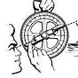](https://medium.com/@tfthacker?source=post_page-----20c077793356--------------------------------)[](https://medium.com/obsidian-observer?source=post_page-----20c077793356--------------------------------)

## An Obsidian Guide for the Outliner  

纲要》的黑曜石指南

In this article, we will explore the outliner features of Obsidian.  

在这篇文章中，我们将探讨Obsidian的outliner功能。

There are two types of people: _those who love Outliners and those who don't_. Joking aside, I am a long-time user and lover of outlining as a method of taking notes.  

有两种人：喜欢Outliners的人和不喜欢的人。撇开玩笑不谈，我是一个长期的使用者，也是一个喜欢用提纲做笔记的方法的爱好者。

However, ironically, I have for some time been extensively using Obsidian and Obsidian is not an outliner editor but a long-form markdown editor.  

然而，具有讽刺意味的是，一段时间以来，我一直在广泛地使用Obsidian，Obsidian不是一个大纲编辑器，而是一个长篇的markdown编辑器。  

Even so, you can achieve a comfortable “outliner-like” editing experience with Obsidian features and plugins.  

即便如此，你还是可以通过Obsidian的功能和插件实现舒适的 "类似大纲 "的编辑体验。

> **Caveat**: This approach still lacks many things for those with years of experience in using outliners.  
> 
> 注意：对于那些有多年使用纲要的人来说，这种方法仍然缺少很多东西。  
> 
> It is important to set expectations: we can have outliner like editing in Obsidian, but you will never be 100% satisfied, but you can be 60% to 80% satisfied.  
> 
> 设定期望值是很重要的：我们可以在黑曜石中进行类似大纲的编辑，但你永远不会100%满意，但你可以有60%到80%的满意度。

From time to time I see a question about outlining, such as this one from [Danny Hatcher](https://twitter.com/DannyHatcher):  

我不时地看到关于提纲的问题，例如丹尼-哈奇尔提出的这个问题：

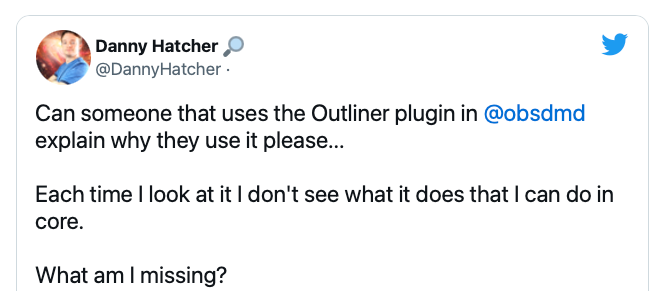

[https://twitter.com/DannyHatcher/status/1648241141970608130](https://twitter.com/DannyHatcher/status/1648241141970608130)

Good question Danny! 好问题，Danny!

In this article, I will explain what can be done with “native” Obsidian to accomplish outliner-like editing along with some plugins, which takes Obsidian outlining a few steps further.  

在这篇文章中，我将解释如何用 "原生 "的黑曜石来完成类似大纲的编辑，以及一些插件，使黑曜石的大纲更进一步。

This article will be especially useful to those coming to Obsidian from tools like Roam Research, Workflowy, Logseq, Remnote, and Tana.  

这篇文章对那些从Roam Research、Workflowy、Logseq、Remnote和Tana等工具来到Obsidian的人特别有用。

## Core Outlining Features of Obsidian  

黑曜石的核心概要功能

Obsidian has as a part of its core features a number of useful tools for outlining.  

黑曜石的核心功能之一是有许多有用的勾勒工具。

## Smart indent lists 智能缩进列表

In Settings, under Editor options tab, enable the Smart indent lists option.  

在 "设置 "中，在 "编辑器 "选项卡下，启用 "智能缩进列表 "选项。


Once this feature is turned on, you can create a bulleted item in your notes and Obsidian will continue to add new bullets to the list as you go to new lines.  

一旦这个功能被打开，你可以在笔记中创建一个子弹头项目，黑曜石会在你进入新行时继续为列表添加新的子弹头。

In other words, just like an outliner application, it allows you to create a list with bullets that expands as you create your notes and it also understands creating parent and child relationships by indenting a line with a Tab and unindenting a line with Shift-Tab.  

换句话说，就像一个大纲应用程序一样，它允许你创建一个带有子弹的列表，并在你创建笔记时展开，它还能理解通过用Tab缩进一行和用Shift-Tab取消缩进一行来创建父和子的关系。

This is a key aspect of outlining: creating structure through indentation levels of your notes.  

这是勾勒大纲的一个关键方面：通过缩进的层次创造你的笔记的结构。

This is easier to show than it is to explain, so please look at this next animated image closely:  

这一点展示起来比解释起来更容易，所以请仔细看下面这张动画图片：

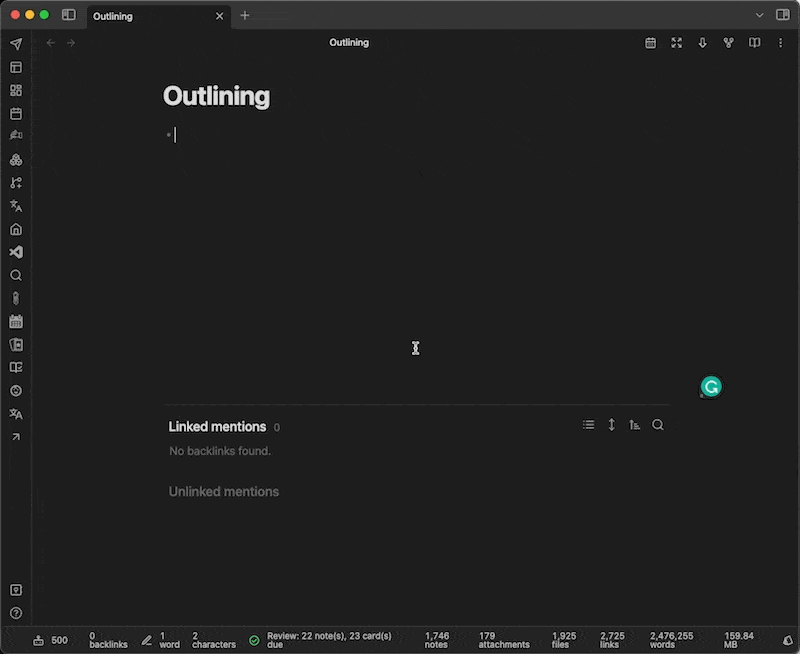

Smart indent lists in action  

智能缩进列表在行动

As you can see, as I type I am able to create new bulleted items and indent and unindent them all from the keyboard.  

正如你所看到的，当我打字时，我能够创建新的圆点项目，并通过键盘缩进和取消缩进。  

As I take notes, indenting and unindenting, the outline structure of my thoughts unfolds before me.  

当我做笔记时，缩进和不缩进，我思想的轮廓结构就在我面前展开了。

Under the hood, Obsidian is generating a standard markdown list. Here is what the plain-text file looks like:  

在引擎盖下，黑曜石正在生成一个标准的markdown列表。下面是纯文本文件的模样：

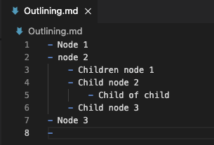

Outlines are output as standard markdown lists with tab indentation  

纲要是以标准的markdown列表的形式输出的，有tab缩进。

What I like about Obsidian’s approach is that we get a standard markdown file that we can use in any text editor, but it's visually presented as an outline with bullets in Obsidian’s Live Preview.  

我喜欢黑曜石的方法是，我们得到一个标准的markdown文件，我们可以在任何文本编辑器中使用，但在黑曜石的实时预览中，它被视觉化地呈现为一个带有子弹的大纲。

Also as the image shows, these commands are invoked through the keyboard.  

同样如图所示，这些命令是通过键盘调用的。

-   **Enter key** for a new bullet  
    
    输入键为新的子弹
-   **Tab key** for indented bullet (creating a parent-to-child node relationship)  
    
    Tab键用于缩进的子弹（创建父子节点关系）
-   **Shift-Tab** **key** for unindenting (promoting a child to a parent node)  
    
    Shift-Tab键用于取消缩进（将一个子节点提升为一个父节点）。

## Expanding and Collapsing with “Folding”  

用 "折叠 "扩大和缩小

Another important feature is Folding.  

另一个重要特点是折叠。

You might have to toggle this feature on. To do that, go into Obsidian’s Settings and view the Editor options tab and turn on **Fold Heading** and **Fold Indent**.  

你可能要把这个功能打开。要做到这一点，请进入黑曜石的设置，查看编辑器选项标签，打开折叠标题和折叠缩进。

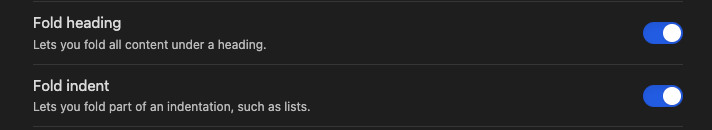

Those who love outlining appreciate the ability to expand and collapse the structure of the document’s outline.  

那些喜欢提纲挈领的人很欣赏扩大和缩小文件提纲结构的能力。  

This allows us to hide away details from the notes we don’t currently want to see and focus on what we are editing.  

这使我们能够隐藏我们目前不想看到的笔记的细节，而专注于我们正在编辑的内容。  

Outlines accomplish this by expanding or collapsing the structure of parent and child nodes.  

纲要通过扩展或折叠父节点和子节点的结构来实现这一目标。

Obsidian understands this concept as well. It might not be obvious on the surface, but Obsidian files have a lot of structure, just as outlines have structure.  

黑曜石也理解这个概念。表面上可能不明显，但黑曜石的文件有很多结构，就像大纲有结构一样。  

Structure in Obsidian is represented by Headings _(Heading level 1, Heading level 2, etc)_ and bulleted item lists that can have parent-child relationships.  

黑曜石的结构是由标题（标题级别1，标题级别2，等等）和可以有父子关系的项目列表来表示。

Folding allows us to expand and collapse these structures. Again, an animated image will make it clear. Notice how to fold in a bulleted list, using two different methods:  

折叠允许我们扩展和折叠这些结构。同样，一张动画图片会让我们明白。请注意如何使用两种不同的方法来折叠一个项目列表：

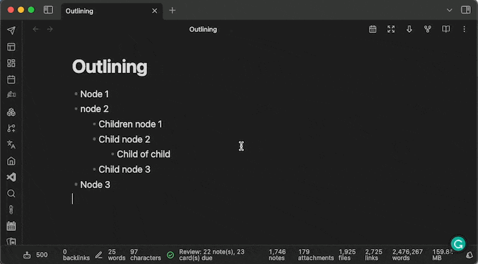

Folding and unfolding 折叠和展开

You’ll notice that we can fold the list at its parent levels using the command palette **Toggle Fold on Current line** command**.** This command can also be mapped to a keyboard hotkey to make it easy to frequently use.  

你会注意到，我们可以使用命令调板Toggle Fold on Current line命令在其父级层面上折叠列表。这个命令也可以映射到键盘热键上，以便于经常使用。

Additionally, Obsidian puts little arrows next to the bullets that have children.  

此外，黑曜石还在有孩子的子弹旁边放了小箭头。  

These arrows allow us to fold and unfold the document's structure, revealing or hiding content we don’t want to see.  

这些箭头允许我们折叠和展开文件的结构，显示或隐藏我们不希望看到的内容。

> **Note**: some Obsidian Themes hide the fold/unfold arrows, so if you don’t see them, you will need to see if your theme supports these arrows.  
> 
> 注意：有些黑曜石主题隐藏了折叠/展开的箭头，所以如果你没有看到它们，你需要看看你的主题是否支持这些箭头。

This feature is even more valuable as your documents get to be long. The ability to hide away elements of the document we don't need to see keeps the mind focused.  

当你的文件变得很长时，这个功能就更有价值了。隐藏文件中我们不需要看到的元素的能力可以使我们的思想保持集中。

## Searching with Children Nodes  

用子节点进行搜索

Obsidian also recognized children items in lists while doing searches. Notice the following image:  

黑曜石在进行搜索时也能识别列表中的儿童项目。注意下面的图片：

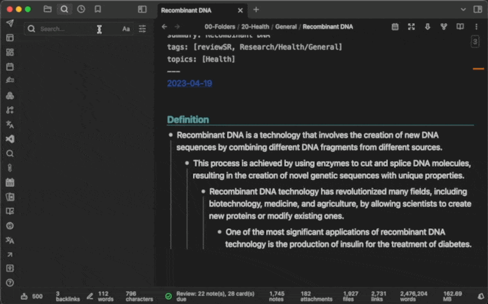

Searching and Showing more content  

搜索和显示更多内容

There is a lot going on here, but it's interesting. Let's break it down:  

这里发生了很多事情，但很有趣。让我们把它分解一下：

-   When you type a search term in the search box, Obsidian finds all matching results. Obsidian recognizes the results found in lists.  
    
    当你在搜索框中输入一个搜索词，Obsidian会找到所有匹配的结果。黑曜石能识别列表中找到的结果。
-   In the search pane, you can turn on “Show more content” which tells Obisidian to reveal more content related to search matches.  
    
    在搜索窗格中，你可以打开 "显示更多内容"，告诉Obisidian揭示更多与搜索匹配相关的内容。  
    
    In the case of this example, the children's items of the search match are shown.  
    
    在这个例子中，显示了搜索匹配的儿童项目。
-   You can see as I toggle the indentation of the level of the outline in the document, the search results show more or less information as the children of the search match come in and out of scope for the search.  
    
    你可以看到，当我在文档中切换大纲级别的缩进时，搜索结果显示的信息或多或少，因为搜索匹配的子女进入和退出了搜索范围。

In review, the search pane understands lists and their parent/children relationships. You can increase the amount of content displayed in the search results from lists.  

在回顾中，搜索窗格了解列表和它们的父/子关系。你可以增加搜索结果中显示的来自列表的内容数量。

## Transclusion 归纳

Transclusion is the ability to include information from one note in another note.  

归纳是将一个笔记的信息纳入另一个笔记的能力。  

While this is not directly related to outlining, it is an important feature that many outliners support.  

虽然这与提纲没有直接关系，但这是许多提纲作者支持的一个重要功能。

Obsidian also supports [transclusion](https://en.wikipedia.org/wiki/Help:Transclusion). Obsidian allows us to transclude an entire note into another note or also to include just specific sections of a note into another note.  

黑曜石还支持反包。黑曜石允许我们将整个笔记转入另一个笔记中，也可以将一个笔记的特定部分转入另一个笔记中。

In the following image, I am transcluding a list item and its children's items.  

在下面的图片中，我正在总结一个列表项和它的子项。

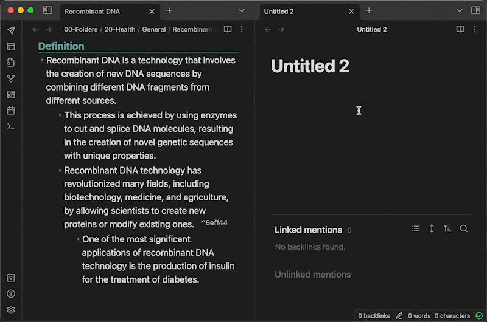

Transclusion is a powerful tool for reusing information from your notes in other notes.  

Transclusion是一个强大的工具，可以在其他笔记中重复使用你的笔记中的信息。  

This is especially helpful in writing projects where you have collected useful notes in various places in your vault and want to bring those thoughts together into another note.  

这在写作项目中特别有帮助，你在金库的不同地方收集了有用的笔记，想把这些想法汇集到另一个笔记中。

For more information, check out these Obsidian help resources:  

欲了解更多信息，请查看这些黑曜石帮助资源：

-   [Embedding Notes 嵌入说明](https://help.obsidian.md/Linking+notes+and+files/Embedding+files)
-   [Linking to Headings 链接到标题](https://help.obsidian.md/Linking+notes+and+files/Internal+links#Link+to+a+heading+in+a+note)
-   [Linking to Blocks 链接到区块](https://help.obsidian.md/Linking+notes+and+files/Internal+links#Link+to+a+block+in+a+note)

## Extending Obsidian Outlining with Plugins  

用插件扩展黑曜石的轮廓线

For many users, these core features just explained get us a lot closer to our outlining needs. However, with plugins, we can take this experience a few steps further.  

对于许多用户来说，这些核心功能只是说明让我们更接近我们的勾勒需求。然而，有了插件，我们可以把这种体验再向前推进几步。

## Outliner Plugin 纲要插件

The [Outliner Plugin](https://obsidian.md/plugins?id=obsidian-outliner) was designed to enhance the outlining experience of Obsidian.  

Outliner插件的设计是为了增强Obsidian的勾勒体验。

I think people get confused when using this plugin because they expect it to make Obsidian an Outliner.  

我认为人们在使用这个插件时感到困惑，因为他们希望它能使Obsidian成为Outliner。  

However, this plugin builds on the foundation of the core features already discussed in the previous section.  

然而，这个插件是建立在上一节已经讨论过的核心功能的基础上的。  

Without these other features enabled in Obsidian settings, the outlining experience is incomplete even with the Outliner plugin.  

如果没有在黑曜石设置中启用这些其他功能，即使使用Outliner插件，勾勒的体验也不完整。

The Outliner plugin introduces a number of useful features and I want to focus on four that I think are relevant to most outlining lovers.  

Outliner插件引入了许多有用的功能，我想重点介绍四个我认为与大多数大纲爱好者有关的功能。

First, please watch this brief video to see these features in action and then I will explain them in more detail.  

首先，请观看这个简短的视频，看看这些功能的运行情况，然后我将更详细地解释它们。

Video demonstrating these features in action  

演示这些功能的视频正在运行

Let's discuss these four points in detail.  

让我们详细讨论一下这四点。

## Moving lists up and down  

向上和向下移动列表

This feature when enabled allows you to move all the child nodes with their parent node as one group when the parent node is moved up and down in the list.  

启用该功能后，当父节点在列表中上下移动时，允许你将所有的子节点和它们的父节点作为一个组来移动。  

Without this option, Obsidian just moves the current line.  

如果没有这个选项，黑曜石只是移动当前行。

Outlining assumes that the relationship between a parent node and its children will be maintained, and this feature gives us that behavior in Obsidian.  

勾勒的前提是，父节点和它的子节点之间的关系将被保持，而这个功能在黑曜石中给了我们这样的行为。

> Sidebar: help feed the hungry writers. If you enjoy my writing, please give some thought to supporting my work.  
> 
> 旁白：帮助喂养饥饿的作家。如果你喜欢我的写作，请考虑一下支持我的工作。  
> 
> Follow me here on Medium, or better yet, sign up for a Medium membership and help support all your favorite writers using my referral link: [https://bit.ly/o42-medium](https://bit.ly/o42-medium) or if you literally want to feed me, buy me a coffee at: [https://bit.ly/o42-kofi](https://bit.ly/o42-kofi). Your support is appreciated!  
> 
> 在Medium上关注我，或者更好的是，注册一个Medium会员，使用我的推荐链接：https://bit.ly/o42-medium，帮助支持所有你喜欢的作家，或者如果你真的想养活我，请给我买杯咖啡：https://bit.ly/o42-kofi。我们非常感谢您的支持！

## Collapsing bar _(or Vertical indentation line click action)_  

折叠条（或垂直缩进线点击动作）

This is a feature I love. A vertical line appears along each bullet showing that it has children.  

这是我喜欢的一个功能。沿着每个子弹出现一条垂直线，显示它有孩子。  

Children can also have their own children, and this relationship is also shown with a vertical line.  

子女也可以有自己的孩子，这种关系也用竖线表示。

As already mentioned, since this structure shows relationships, it is helpful to quickly collapse child nodes and even children of children.  

正如已经提到的，由于这种结构显示的是关系，所以对快速折叠子节点甚至子节点的子节点很有帮助。

The Outliner plugin, if enabled, allows you to click on that vertical line and all children will be collapsed to their parent level.  

如果启用Outliner插件，你可以点击那条垂直线，所有的孩子都会被折叠到其父级。  

When clicked again, they will collapse to the next parent level.  

当再次点击时，它们将折叠到下一个父级。

This gives us a way to step through the structure of the outline, one level at a time.  

这给我们提供了一种方法，使我们能够一步一步地通过大纲的结构，一次一个层次。

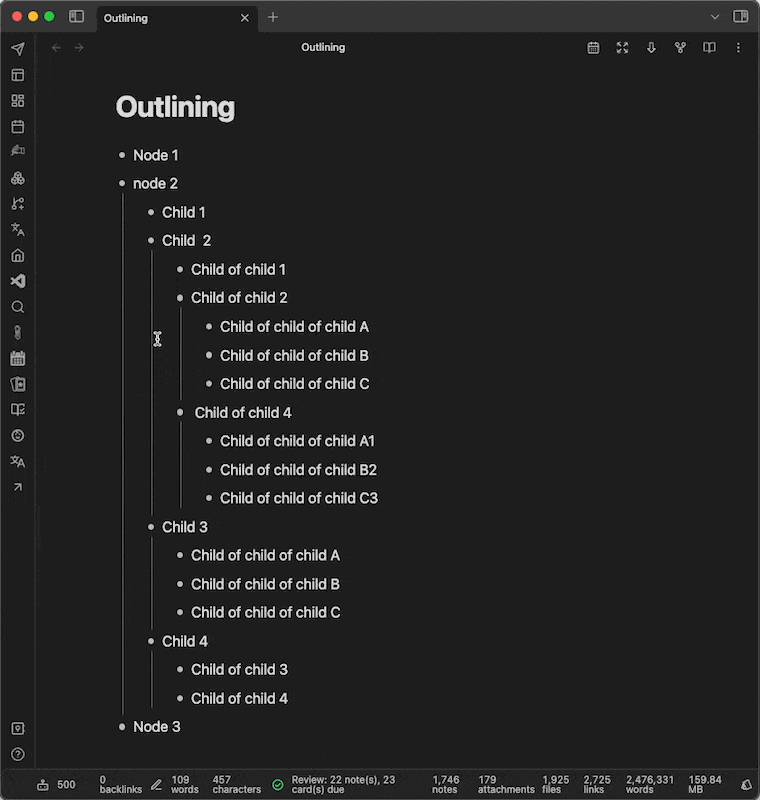

Collapse bar 折叠栏

## Styling 造型设计

The plugin can do some tweaking to how bulleted lists are presented. It makes the bullets a little more refined. This is important to some people, but not really to me.  

该插件可以对列举式清单的呈现方式做一些调整。它使子弹更精炼一些。这对一些人来说很重要，但对我来说并不重要。

## Stick the cursor to the content  

将光标贴在内容上

This is a difficult one to explain. When editing an item in a bulleted list, it is easy to erase the dash at the beginning of a line.  

这是一个很难解释的问题。在编辑项目列表中的一个项目时，很容易抹去行首的破折号。

```
- Bullet 1- Bullet 2
```

If you delete the dash, the list is broken.  

如果你删除了破折号，名单就会中断。  

This plugin feature prevents the cursor from moving into the area where the dash is so you don’t accidentally drop yourself out of outlining mode by breaking the list.  

这个插件功能可以防止光标移动到破折号所在的区域，这样你就不会因为破坏了列表而意外地把自己丢到勾勒模式中。

## Bonus: Ctrl/Cmd+A Select Current Item  

奖励：Ctrl/Cmd+A 选择当前项目

I mentioned I would highlight four important features, but here is one more, and perhaps this is one of the best.  

我提到我将强调四个重要功能，但这里还有一个，也许这是最好的一个。

In most outliners, you edit the node (or block) one line at a time. You can often press Ctrl/Cmd+A on the keyboard for all the text to be selected on that node.  

在大多数大纲软件中，你每次都是一行一行地编辑节点（或块）。你通常可以按键盘上的Ctrl/Cmd+A来选择该节点上的所有文本。

As can be seen in the next image, the default behavior of Obsidian when pressing this key combination is to select all the text of the entire document.  

从下一张图片中可以看出，当按下这个组合键时，黑曜石的默认行为是选择整个文档的所有文本。

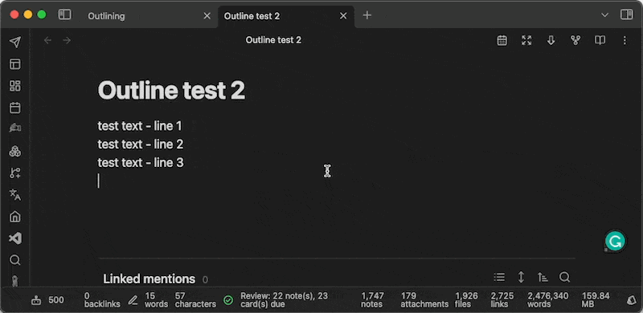

Ctrl/Cmd+A to select all contents in the current block  

Ctrl/Cmd+A选择当前区块中的所有内容

However, if you have turned on the select current item feature in this plugin, and you are editing a list, only the current item where your cursor is will be selected when pressing Ctrl/Cmd+a.  

但是，如果你在这个插件中打开了选择当前项目的功能，并且你正在编辑一个列表，当按下Ctrl/Cmd+a时，只有你的光标所在的当前项目会被选中。

If you love outlining, you’ll know this is an important keystroke that most of us have committed to memory, and it's very confusing not to have it in Obsidian while outlining.  

如果你喜欢画大纲，你会知道这是一个重要的按键，我们大多数人都把它记在了脑子里，如果在黑曜石中没有这个按键，在画大纲时就会非常混乱。  

This plugin saves the day!  

这个插件拯救了一天!

## **Zoom Plugin 缩放插件**

Let us go even a step further in making Obsidian a better tool for outlining.  

让我们更进一步，使黑曜石成为更好的勾勒工具。

There is another plugin called the [Zoom plugin](https://obsidian.md/plugins?id=obsidian-zoom) and it is made by the same developer as the Outliner plugin.  

还有一个插件叫做Zoom插件，它和Outliner插件是由同一个开发者制作的。

As mentioned earlier, one of our goals is to hide away parts of our outline that we don’t currently need to see, so that we can better focus our minds on the part of our outline that we are working on.  

如前所述，我们的目标之一是隐藏我们的大纲中目前不需要看到的部分，以便我们能更好地将我们的思想集中在我们正在工作的部分。  

The Folding feature helps us to collapse parts we don’t need to see.  

折叠功能帮助我们折叠我们不需要看的部分。

But we can do better: enter the _Zoom plugin_.  

但我们可以做得更好：进入Zoom插件。

The Zoom plugin understands that your document can be structured with the use of headings and bulleted lists. By using the command palette **“Zoom: Zoom In”** command, you can instruct the Zoom plugin to “zoom” into or show you just the contents of a document at a certain level and to hide the rest of the document above and below the area being zoomed.  

缩放插件理解你的文档可以通过使用标题和子弹头列表来进行结构化。通过使用命令调色板上的 "Zoom: Zoom In "命令，你可以指示Zoom插件 "放大 "或只显示某个级别的文档内容，并隐藏被放大区域上方和下方的其他文档。

This is illustrated in the next animated image:  

这在下一张动画图片中得到了说明：

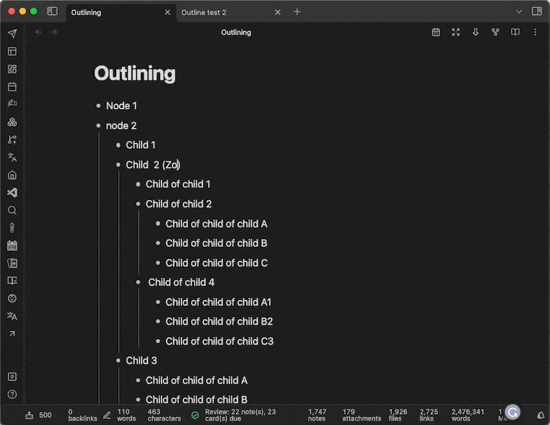

Zoom plugin “zooming” into a part of the document  

缩放插件 "缩放 "到文件的某个部分

When zoomed in on an area of your document, the breadcrumb trail of the structure is at the top of the window pane.  

当放大你的文件的一个区域时，结构的面包屑痕迹就在窗口窗格的顶部。  

This allows you to see the context of where you are editing your document. Also, you can click on various levels of the outline in the breadcrumbs to zoom to that level.  

这可以让你看到你正在编辑文件的背景。另外，你可以在面包屑中点击大纲的各个层次来放大到该层次。

Even if a person doesn’t use the outlining features of Obsidian, the Zoom plugin is very useful and worth installing.  

即使一个人不使用黑曜石的勾勒功能，缩放插件也非常有用，值得安装。

## Obsidian is NOT an Outliner, but it is  

黑曜石不是一个Outliner，但它是

As I mentioned earlier, the Obsidian outliner experience does not cover 100% of what we lovers of outliners desire.  

正如我之前提到的，黑曜石的勾画师经验并没有100%涵盖我们这些勾画师爱好者的愿望。  

However, it is important to understand that Obsidian is not an outliner.  

然而，重要的是要明白黑曜石并不是一个纲要性软件。

In fact, I don’t know if we will ever get native outlining features in Obsidian, as it is not really fundamental to the Obsidian team’s goals and design of the application.  

事实上，我不知道我们是否会在Obsidian中获得原生的概要功能，因为这对于Obsidian团队的目标和应用程序的设计来说并不是真正的基础。  

For me, this is ok. I am not disappointed. With all that I described so far in this article, we can do a lot of what is important to me.  

对我来说，这是好的。我并不感到失望。有了我在这篇文章中迄今为止描述的所有内容，我们可以做很多对我来说很重要的事情。

What is missing to give Obsidian a better outlining experience? In my opinion, I would add two things:  

要让黑曜石有更好的勾勒体验，还缺什么？在我看来，我想补充两点：

-   Better drag-and-drop support (drag a parent and all its children to a different point in the outline using the mouse)  
    
    更好的拖放支持（用鼠标将一个父代和它的所有子代拖到轮廓的不同点）。
-   Better support for inline rendering of block references (right now Obsidian’s rendering of block references is inconsistent with other tools. Complaints welcome about this at [this link](https://forum.obsidian.md/t/a-proposal-for-rendering-block-embeds-inline/27093) 🤓.)  
    
    更好地支持块引用的内联渲染（现在黑曜石的块引用渲染与其他工具不一致。欢迎在这个链接中对此进行投诉🤓。)

What would you change? Please share your thoughts in this article’s comment section of this article.  

你会改变什么？请在本文的评论区分享你的想法。

## Final Advice 最终建议

In conclusion, I appreciate that by combining core features and a few plugins, I can turn a long-form editor into a tool that gives me many of the benefits I miss from outlining tools.  

总之，我很欣赏通过结合核心功能和一些插件，我可以把一个长篇小说编辑器变成一个工具，给我带来许多我从大纲工具中错过的好处。

But I have to admit, when I first started using Obsidian and the features discussed in this article, it was not a natural experience for me after years of working with outliners.  

但我必须承认，当我第一次开始使用黑曜石和本文所讨论的功能时，对于使用了多年的outliner工作的我来说，这并不是一种自然的体验。

So my final advice to you is: _you need to be patient and give yourself time to get accustomed to using these tools to accomplish outlining tasks._ But I can promise that with a little time and effort, you will succeed and you will reap the benefits.  

因此，我给你的最后建议是：你需要有耐心，给自己一些时间来习惯于使用这些工具来完成提纲任务。但我可以保证，只要花点时间和精力，你就会成功，你就会获得收益。

_Help support all your favorite writers using my referral link:_ [_https://bit.ly/o42-medium_](https://bit.ly/o42-medium) _or buy me a coffee at:_ [_https://bit.ly/o42-kofi_](https://bit.ly/o42-kofi)_. Your support is appreciated!_  

使用我的推荐链接：https://bit.ly/o42-medium，或请我喝咖啡：https://bit.ly/o42-kofi，帮助支持所有你喜欢的作家。我们感谢您的支持!
