Hi friends 👋,  嗨，朋友们👋、

Happy Monday! Hope you had a refreshing weekend; now it’s time to talk about space factories.  

周一快乐!希望你有一个清爽的周末；现在是时候谈谈太空工厂了。

Varda is one of the most ambitious companies I’ve ever come across.  

瓦尔达是我遇到过的最有野心的公司之一。  

It’s a space company and a biotech company rolled into one, with a hypersonic testing service thrown in for good measure.  

它是一家太空公司和一家生物技术公司的合二为一，还加入了高超音速测试服务。  

Not Boring Capital is an investor in Varda, and I’ve been talking to Varda’s co-founders, Delian and Will, about writing a piece on the company for almost two years.  

Not Boring Capital是Varda的投资者，我与Varda的联合创始人Delian和Will讨论写一篇关于该公司的文章已有近两年时间。  

We decided to wait until the perfect time: launch day.  

我们决定等到完美的时机：发射日。

This afternoon, Varda is going to launch a drug manufacturing factory into space aboard a SpaceX Falcon 9 rocket.  

今天下午，瓦尔达将用SpaceX公司的猎鹰9号火箭将一个药物制造工厂发射到太空。  

The factory will orbit the earth for a little over a month, running tests on the spacecraft and its drug manufacturing capabilities, and then come hurling back down into the Utah desert in mid-July.  

该工厂将在地球轨道上运行一个多月，对航天器及其药物制造能力进行测试，然后在7月中旬飞回犹他州的沙漠。

Because Varda does both space and bio, I teamed up with [Elliot Hershberg](https://twitter.com/ElliotHershberg) to tell its story. In addition to being our biotech partner, Elliot writes [The Century of Biology](https://open.substack.com/pub/centuryofbio). Little did he know when he started writing that the Century of Biology would play out both on the earth and above it.  

因为瓦尔达既做太空又做生物，所以我与埃利奥特-赫斯伯格合作，讲述它的故事。除了是我们的生物技术合作伙伴外，埃利奥特还写了《生物学的世纪》。他在开始写作时并不知道，《生物世纪》将在地球上和地球上空同时上演。

I’ve told you that things were going to get really weird, and that the most interesting things were going to happen at the intersections. Varda is what I’m talking about.  

我已经告诉过你，事情会变得非常奇怪，而且最有趣的事情会发生在交叉路口。瓦尔达就是我所说的那样。

Let’s get to it.  

让我们开始吧。

[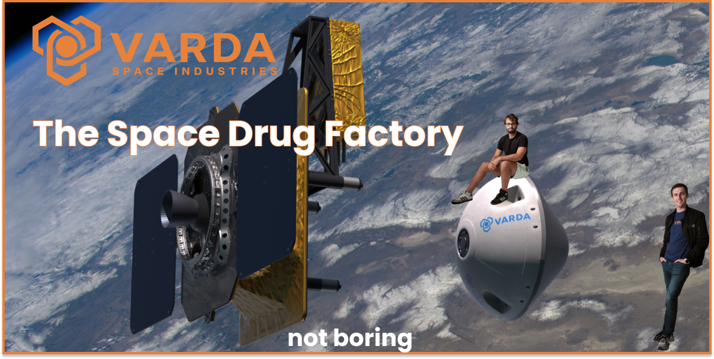](https://substackcdn.com/image/fetch/f_auto,q_auto:good,fl_progressive:steep/https%3A%2F%2Fsubstack-post-media.s3.amazonaws.com%2Fpublic%2Fimages%2Fe1d5b4b0-4d22-4d12-9694-5be12109426a_1208x608.png)

I was on a call with Varda co-founder and CEO [Will Bruey](https://twitter.com/WillBruey) the other day when, answering a question about how his company has been able to recruit so many SpaceX engineers, he said something that really helped put Varda in context:   

前几天，我与Varda联合创始人兼首席执行官威尔-布鲁伊(Will Bruey)进行了一次通话，在回答关于他的公司如何能够招募到这么多SpaceX工程师的问题时，他说了一句话，真正有助于将Varda置于背景之中：

> “For all of us who’ve been at SpaceX for the past decade working on how to get up to space cheaply, once we did that, the question became: what do we do up there? **Manufacturing was the obvious next step to a lot of us.**”   
> 
> "对于我们所有在过去十年中一直在SpaceX工作的人来说，一旦我们做到这一点，问题就变成了：我们在上面做什么？对我们很多人来说，制造是明显的下一步。"

No matter what happens next, where we currently stand in human history is marvelous in the original sense of the word. Going up to space is cheap!  

不管接下来会发生什么，我们目前在人类历史上所处的位置，在原来的意义上是令人惊叹的。上升到太空是很便宜的!  

Manufacturing things in space is an obvious next step! What a time to be alive.   

在太空中制造东西是一个明显的下一步!这是一个多么令人振奋的时代。

This afternoon, just 874 days into its existence, **[Varda](https://varda.com/)** will launch the world’s first commercial space factory into orbit.  

It’s the company’s first test flight en route to manufacturing drugs in space for use on earth, and a major milestone in humanity’s journey to expand our capabilities beyond our home planet.  

这是该公司在太空中制造药物供地球使用过程中的第一次试飞，也是人类将能力扩展到地球以外的旅程中的一个重要里程碑。  

今天下午，成立仅874天的瓦达公司将把世界上第一个商业太空工厂送入轨道。

<iframe src="https://www.youtube-nocookie.com/embed/4gz4_GRDut8?rel=0&amp;autoplay=0&amp;showinfo=0&amp;enablejsapi=0" loading="lazy" gesture="media" allow="autoplay; fullscreen" allowautoplay="true" allowfullscreen="true" width="728" height="409" frameborder="0"></iframe>

The video ends with a catchy line: “Getting to space is old news. Now, it’s what you do when you’re out there that counts.” Getting to space is old news! Wild.  

该视频以一句朗朗上口的话结束："进入太空已是旧闻。现在，重要的是你在那里做什么。"进入太空已经是旧闻了!野生。  

For most of our species’ existence, getting to space was unimaginable.  

在我们人类存在的大部分时间里，进入太空是不可想象的。

For the vast, vast, vast majority of human history, everything that our ancestors did and made remained on earth’s surface and within its atmosphere.  

在人类历史的绝大多数时间里，我们的祖先所做的一切和创造的一切都停留在地球的表面和大气层内。  

A picture of earth and all of the man-made things in the sky would have looked like this:   

一张地球和天空中所有人造事物的照片会是这样的：

[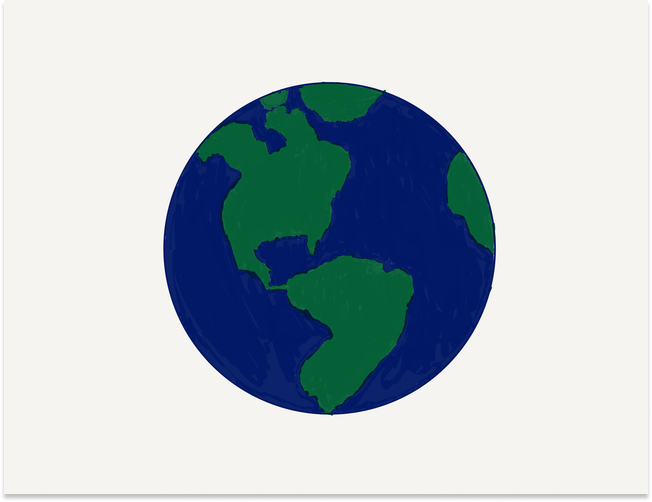](https://substackcdn.com/image/fetch/f_auto,q_auto:good,fl_progressive:steep/https%3A%2F%2Fsubstack-post-media.s3.amazonaws.com%2Fpublic%2Fimages%2Ff22dab6e-140d-4547-b324-e3ba86ab543d_652x502.png)

We became a spacefaring people in 1944, when Wernher von Braun and the Nazis sent the first human-made object beyond the 100 km boundary that defines space, the V-2 rocket.   

我们在1944年成为一个航天民族，当时沃纳-冯-布劳恩和纳粹将第一个人类制造的物体送出了定义空间的100公里边界，即V-2火箭。

[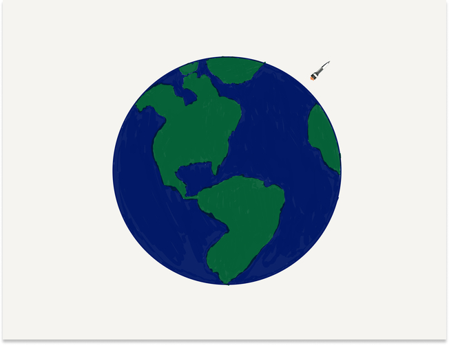](https://substackcdn.com/image/fetch/f_auto,q_auto:good,fl_progressive:steep/https%3A%2F%2Fsubstack-post-media.s3.amazonaws.com%2Fpublic%2Fimages%2Fe51beed7-83a7-4250-8766-3b9db5fbb5d0_652x502.png)

It would take another thirteen years for us to send something out to space and get it to stay there, in orbit around the earth.  

我们还需要十三年的时间才能把东西送上太空，并让它留在那里，在地球的轨道上。  

In 1957, the Soviet Union launched Sputnik, the first artificial satellite to orbit the earth.   

1957年，苏联发射了斯普特尼克号，这是第一颗环绕地球的人造卫星。

The Soviets struck again four years later, sending the first human, cosmonaut Yuri Gagarin, into space, where he orbited for 108 minutes on April 12, 1961 aboard the Vostok 1. Gagarin joined a small but growing number of satellites in low earth orbit (LEO), those little green dots.   

四年后，苏联人再次出击，将第一个人类--宇航员尤里-加加林送入太空，他于1961年4月12日乘坐 "东方一号 "在太空中运行了108分钟。加加林加入了少数但越来越多的低地球轨道（LEO）上的卫星，那些小绿点。

[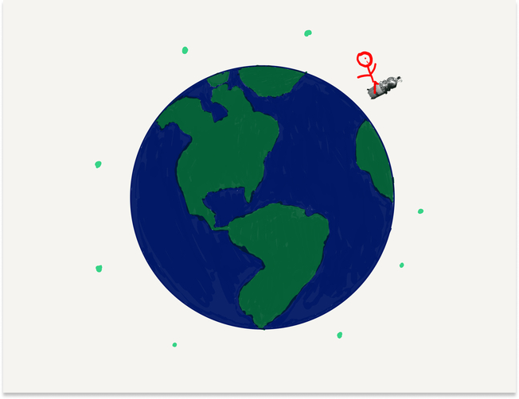](https://substackcdn.com/image/fetch/f_auto,q_auto:good,fl_progressive:steep/https%3A%2F%2Fsubstack-post-media.s3.amazonaws.com%2Fpublic%2Fimages%2F8ce7a40a-6f60-44b7-9562-fc28dc84cf1e_652x502.png)

The Soviets’ space supremacy spurred their Cold War rivals into action. In 1962, President John F. Kennedy “[chose to go to the moon in this decade](https://www.youtube.com/watch?v=th5A6ZQ28pE),” and in under seven years, NASA fulfilled his promise when Neil Armstrong took “one small step for man, one giant leap for mankind.”   

苏联人的太空优势刺激了他们的冷战对手采取行动。1962年，约翰-F-肯尼迪总统 "选择在这十年里登月"，在不到七年的时间里，美国国家航空航天局实现了他的承诺，尼尔-阿姆斯特朗迈出了 "人类的一小步，人类的一大步"。

[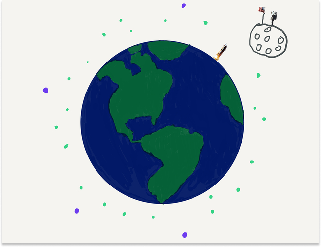](https://substackcdn.com/image/fetch/f_auto,q_auto:good,fl_progressive:steep/https%3A%2F%2Fsubstack-post-media.s3.amazonaws.com%2Fpublic%2Fimages%2F4c2f4ac6-296e-4b45-b1e7-12abed37623a_652x502.png)

The Americans had won the Space Race, but the Soviets continued on.  

美国人已经赢得了太空竞赛，但苏联人继续前进。  

In 1971, they launched the first space station, the Salyut 1, into orbit, marking the first time that humans could live and work in space for extended periods.  

1971年，他们将第一个空间站--礼炮1号送入轨道，标志着人类首次可以在太空中长期生活和工作。  

They joined a growing number of LEO satellites (the green dots) and newer satellites further out in geostationary orbit (GEO, the purple dots) in their journeys around the earth.   

它们加入了越来越多的低地轨道卫星（绿点）和更远的地球静止轨道（GEO，紫点）上的新卫星，在它们的旅程中围绕地球。

[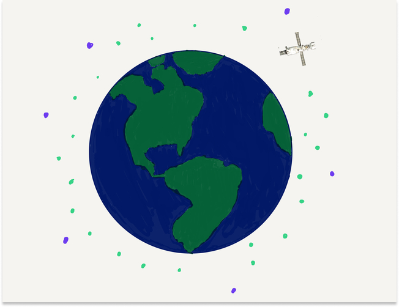](https://substackcdn.com/image/fetch/f_auto,q_auto:good,fl_progressive:steep/https%3A%2F%2Fsubstack-post-media.s3.amazonaws.com%2Fpublic%2Fimages%2F55e645e0-f891-48c2-a07a-afb303e90b0f_652x502.png)

NASA’s funding plummeted after the Space Race wrapped up, but it didn’t completely stop innovating.  

太空竞赛结束后，美国宇航局的资金急剧下降，但它并没有完全停止创新。  

In 1981, the US launched the Space Shuttle, the first partially reusable spacecraft.  

1981年，美国发射了航天飞机，这是第一个部分可重复使用的航天器。  

The rocket itself couldn’t be reused, but the Orbiter, the plane-looking thing strapped to it, carried astronauts back down to earth in relative comfort compared to splash-landing in capsules.   

火箭本身不能重复使用，但轨道器，即绑在上面的飞机，与在太空舱中飞溅着陆相比，可以相对舒适地将宇航员送回地球。

[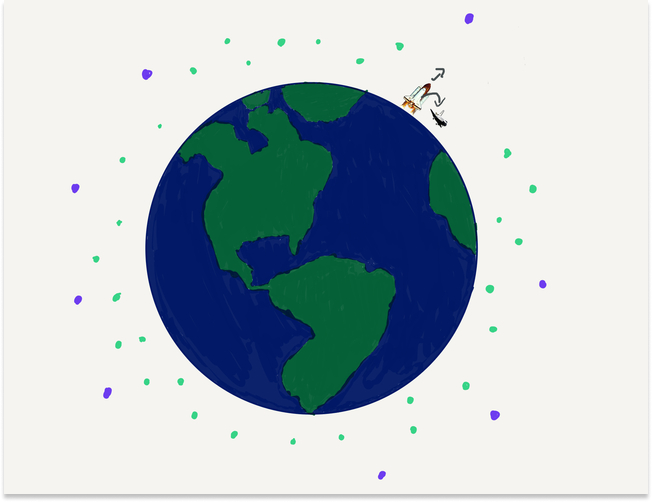](https://substackcdn.com/image/fetch/f_auto,q_auto:good,fl_progressive:steep/https%3A%2F%2Fsubstack-post-media.s3.amazonaws.com%2Fpublic%2Fimages%2F9e4347b8-f8a3-4619-9ef8-c107b8a60427_652x502.png)

The Space Shuttle would come in handy when, in 1998, construction began on the International Space Station, a cooperative effort between the US, Russia, Japan, Europe, and Canada.  

1998年，在美国、俄罗斯、日本、欧洲和加拿大的合作下，国际空间站开始建造，航天飞机将派上用场。  

Humans have continuously inhabited the ISS since its completion in 2000, where they’ve conducted scientific research in microgravity spanning biology, physics, astronomy, and meteorology.   

自2000年国际空间站建成以来，人类一直居住在这里，他们在微重力环境下进行科学研究，涉及生物学、物理学、天文学和气象学。

[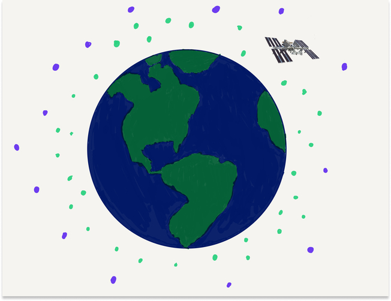](https://substackcdn.com/image/fetch/f_auto,q_auto:good,fl_progressive:steep/https%3A%2F%2Fsubstack-post-media.s3.amazonaws.com%2Fpublic%2Fimages%2F9d1283ea-680b-478d-959a-3ca29cb673f2_652x502.png)

While commercial enterprises launched communications satellites, space remained largely the domain of the governments who monopolized launch capabilities until 2003, when Elon Musk founded SpaceX with the goal of building reusable rockets in an effort to dramatically lower the cost of getting things and people into orbit and beyond.  

虽然商业企业发射了通信卫星，但空间在很大程度上仍然是政府的领域，他们垄断了发射能力，直到2003年，埃隆-马斯克成立了SpaceX公司，目标是建造可重复使用的火箭，努力大幅降低将东西和人送入轨道及以外的成本。  

In 2015, SpaceX successfully landed its Falcon 9 rocket for the first time, effectively firing the starting gun on the commercialization of space.   

2015年，SpaceX首次成功降落其猎鹰9号火箭，有效地打响了太空商业化的发令枪。

[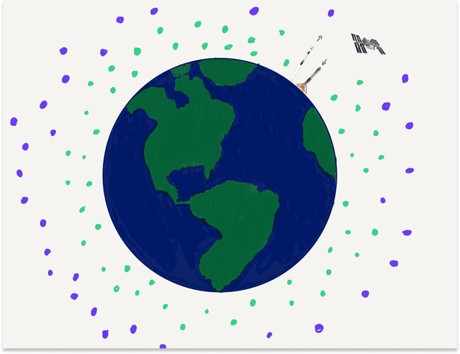](https://substackcdn.com/image/fetch/f_auto,q_auto:good,fl_progressive:steep/https%3A%2F%2Fsubstack-post-media.s3.amazonaws.com%2Fpublic%2Fimages%2F1df67e8f-950a-4dc1-bb26-f26d30480cb7_652x502.png)

Just seven years after the first successful landing, the [number of objects launched into space annually](https://ourworldindata.org/grapher/yearly-number-of-objects-launched-into-outer-space) has increased 10x, from 222 in 2015 to 2,163 in 2022. The ramp has been particularly steep since 2018, when SpaceX launched the Falcon Heavy, bringing launch costs down from 10x from the turn of the millennia, to $1,500/kg.  

On April 20 of this year, SpaceX launched its first orbital test flight of the tallest and most powerful rocket ever flown: Starship.  

今年4月20日，SpaceX公司发射了其有史以来最高和最强大的火箭的第一次轨道试飞：星际飞船。  

While the rocket exploded, getting that behemoth off the ground was another giant leap towards a future in which launch costs on Starship reach less than $100/kg.   

虽然火箭爆炸了，但让这个庞然大物离开地面是另一个巨大的飞跃，在未来，星际飞船的发射成本将达到每公斤100美元以下。  

在第一次成功着陆后仅七年，每年发射到太空的物体数量增加了10倍，从2015年的222个增加到2022年的2163个。自2018年以来，斜坡特别陡峭，当时SpaceX发射了猎鹰重型，使发射成本从千年之交的10倍下降到1500美元/公斤。

[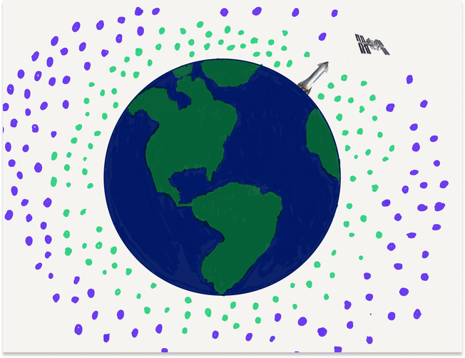](https://substackcdn.com/image/fetch/f_auto,q_auto:good,fl_progressive:steep/https%3A%2F%2Fsubstack-post-media.s3.amazonaws.com%2Fpublic%2Fimages%2F7f4ff52b-fdcd-4ec3-8c28-867d3204958b_652x502.png)

We’ve written about it before, but it takes a lot of repetition for it to sink it. We can’t quite grok it yet ourselves. **The existence of SpaceX and the dramatically cheaper and more frequent launches it offers makes space businesses not only possible, but economically viable.**   

我们以前写过这个问题，但需要大量的重复才能让它沉淀下来。我们自己还不能完全摸透它。SpaceX的存在，以及它提供的大幅廉价和更频繁的发射，使得太空业务不仅是可能的，而且是经济上可行的。

Satellites were the first step. Thousands of satellites, used primarily for earth observation and communication, dot the skies.  

卫星是第一步。数以千计的卫星，主要用于地球观测和通信，点缀在天空中。  

SpaceX’s Starlink satellites make up a huge chunk of the objects in space, and their number is set to grow dramatically with Starship.  

SpaceX的 "星链 "卫星在太空中的物体中占了一大块，而它们的数量将随着 "星舰 "的出现而急剧增长。  

In the coming years, cheap satellite internet will blanket the earth. Already, the [map of 8,315 active satellites](https://wayfinder.privateer.com/) orbiting our planet looks like this:   

在未来几年里，廉价的卫星互联网将覆盖整个地球。目前，围绕我们星球运行的8315颗活跃卫星的地图看起来是这样的：

[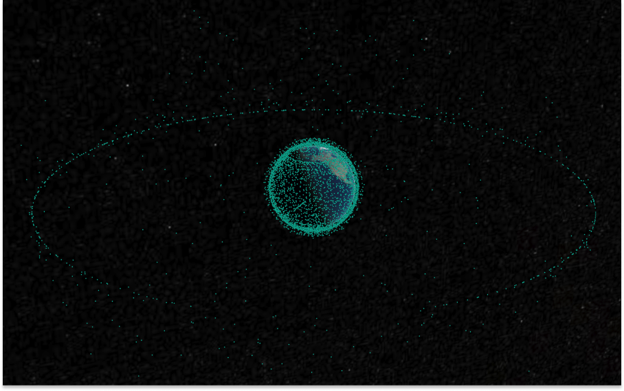](https://substackcdn.com/image/fetch/f_auto,q_auto:good,fl_progressive:steep/https%3A%2F%2Fsubstack-post-media.s3.amazonaws.com%2Fpublic%2Fimages%2F06760da1-c3c6-4be7-a4bd-ff922fccf937_908x569.png)

_Privateer Wayfinder 私营企业寻路者_

But if we are to **expand the economic bounds of humankind** _beyond_ our planet, the economy that evolves in space will need to mirror the one that’s developed on earth.   

但是，如果我们要将人类的经济范围扩大到我们的星球之外，在太空中发展的经济将需要反映在地球上发展的经济。

Today, we’re entering the next frontier on that journey. At 2:19pm PST this afternoon, **Varda is launching the world’s first commercial space factory** onboard a SpaceX rocket.   

今天，我们将进入这一旅程的下一个前沿领域。在北京时间今天下午2点19分，瓦尔达将在SpaceX火箭上发射世界上第一个商业太空工厂。

[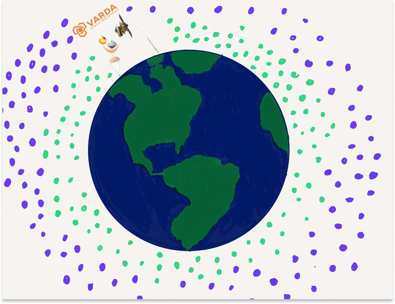](https://substackcdn.com/image/fetch/f_auto,q_auto:good,fl_progressive:steep/https%3A%2F%2Fsubstack-post-media.s3.amazonaws.com%2Fpublic%2Fimages%2Fe0c5ec8a-1de2-4e08-889e-2658078c77a1_652x502.png)

This first flight is mainly a test. Varda needs to prove, primarily, that it can send a factory to space, orbit it around the earth, and **send a capsule with a payload safely back down to the planet’s surface.**这次首次飞行主要是一次测试。瓦尔达需要证明，主要是它能够将工厂送入太空，围绕地球运行，并将带有有效载荷的太空舱安全送回地球表面。  

If things go really well, Varda will also showcase its ability to **manufacture drugs in space**. It will crystallize ritonavir in microgravity in order to explore how gravity influences the resulting crystal structure.  

Ritonavir is a famous example of polymorphism in pharmaceuticals, where differences in the symmetry and structures of the crystals lead to drastic changes in solubility and bioavailability.  

利托那韦是药品多态性的一个著名例子，晶体的对称性和结构的不同导致了溶解度和生物利用度的急剧变化。  

By crystallizing pharmaceuticals in low-earth orbit, Varda seeks to explore how microgravity can be used to drive novel polymorphic outcomes.  

通过在低地球轨道上结晶药物，瓦尔达试图探索如何利用微重力来推动新的多态性结果。  

如果事情进展得非常顺利，瓦尔达还将展示其在太空中制造药物的能力。它将在微重力条件下对利托那韦进行结晶，以探索重力如何影响所产生的晶体结构。

It’s one small step on a mission to manufacture things in space for use on earth as we learn to manufacture things in space for use throughout the Solar System.   

这是我们学习在太空中制造东西供地球使用的任务中的一小步，因为我们要在太空中制造东西供整个太阳系使用。

We’re lucky to be investors in Varda via Not Boring Capital and to have had an inside look at the company’s progress and future plans, and we can’t think of any better time to share them than right before the company’s potentially historic first launch.  

我们很幸运通过Not Boring Capital成为Varda的投资者，并对该公司的进展和未来计划有了内部了解，我们想不出有什么比在该公司可能具有历史意义的首次发布之前分享这些信息更好的时机。  

So today, we’ll cover:   

因此，今天，我们将介绍：

-   **The Varda Story 瓦尔达的故事**
    
-   **How to Build a Deeptech Company  
    
    如何建立一个深度技术公司**
    
-   **Varda Goes to Washington 瓦尔达去华盛顿**
    
-   **The Benefits of Dual Use   
    
    两用的好处**
    
-   **Manufacturing Drugs in Space  
    
    在太空中制造药物**
    
-   **What to Expect from the First Mission  
    
    第一个任务的预期结果是什么**
    
-   **Expanding the Economic Bounds of Humankind  
    
    拓展人类的经济边界**
    

When you say the Varda concept out loud – **space factories making drugs in orbit** – it sounds crazy, or at least sci-fi, like one of those things that could maybe happen in the future but surely not _now_.  

But when you break down all of the things that go into making Varda work, from launch rideshares to satellite manufacturing to pharmaceutical research in microgravity, it all snaps into place: this is a futuristic sci-fi capability that’s both possible and practical today.   

但是，当你把使Varda发挥作用的所有事情分解开来时，从发射共享到卫星制造到微重力下的药物研究，这一切都归结为：这是一种未来的科幻能力，今天既可能又实用。  

当你大声说出瓦尔达的概念--太空工厂在轨道上制造毒品--这听起来很疯狂，或者至少是科幻的，就像那些可能在未来发生的事情之一，但肯定不是现在。

If you’ve spent any time with **[Delian Asparouhov](https://twitter.com/zebulgar)**, the Founders Fund partner and Varda co-founder, it’s hard to imagine him locked inside with no outlet for his energy during COVID.  

Delian speaks so fast his words are measured in Machs. He dropped out of MIT with one course to go because they tried to make him sit through a CS class on a topic he already knew.  

德利安说话的速度非常快，他的话是以马赫为单位计算的。他从麻省理工学院退学，只剩下一门课程，因为他们试图让他参加一门关于他已经知道的主题的CS课程。  

I’m surprised the photographer was able to get him to stand still for this picture.   

我很惊讶摄影师能让他在这张照片上站稳。  

如果你和创始人基金合伙人、Varda联合创始人德利安-阿斯帕罗霍夫相处过，很难想象他在COVID期间把自己关在屋里，没有精力发泄。

[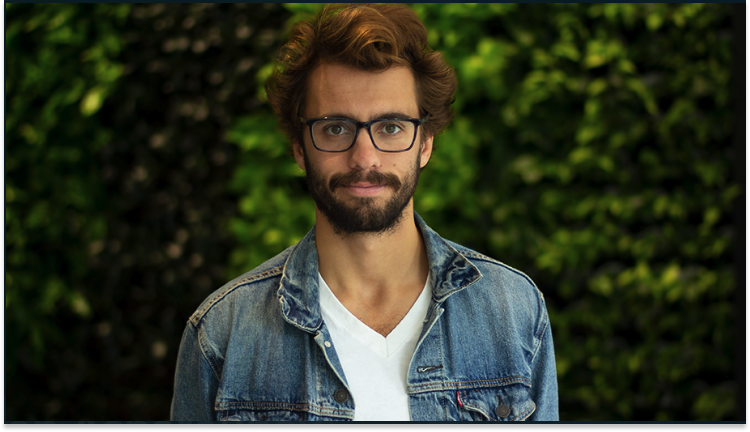](https://substackcdn.com/image/fetch/f_auto,q_auto:good,fl_progressive:steep/https%3A%2F%2Fsubstack-post-media.s3.amazonaws.com%2Fpublic%2Fimages%2Fe3765b4e-81e1-4763-8d51-9332bd5f5607_750x432.png)

_Varda Co-founder & Chairman, Delian Asparouhov, Founders Fund  

瓦尔达联合创始人兼主席，德利安-阿斯帕罗霍夫，创始人基金_

So when COVID lockdowns hit, and Delian was stuck at home with the venture market slowing and a bunch of free time, he started re-obsessing over an idea he’d been obsessing over for a long time: space.  

因此，当COVID锁定的时候，德利安被困在家里，风险市场放缓，有一堆空闲时间，他开始重新执着于一个他已经执着了很久的想法：太空。  

Specifically, Delian was interested in **space manufacturing**.   

具体而言，德利安对空间制造感兴趣。

Space manufacturing, even manufacturing drugs in space, had made sense from a technical perspective for a while.  

空间制造，甚至是在空间制造药物，从技术角度来看，有一段时间是有意义的。  

Astronauts have been doing research on protein crystallization for decades, first on SkyLab in the 1970s, and on the International Space Station since it went into orbit around the turn of the millennium.   

几十年来，宇航员一直在进行蛋白质结晶的研究，首先是在20世纪70年代的天空实验室，以及在千禧年前后进入轨道后的国际空间站。

[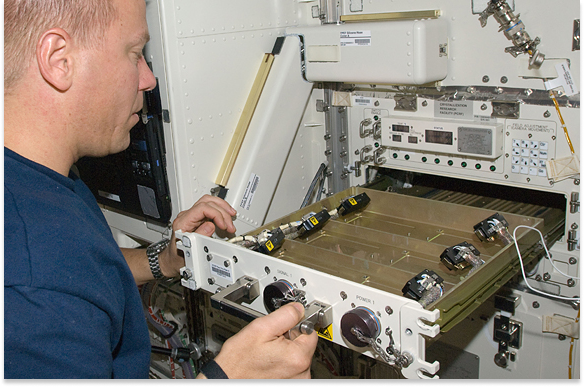](https://substackcdn.com/image/fetch/f_auto,q_auto:good,fl_progressive:steep/https%3A%2F%2Fsubstack-post-media.s3.amazonaws.com%2Fpublic%2Fimages%2F87ebc010-8221-4405-a3c6-0f155bc46753_584x387.png)

_Protein Crystallization Research Facility on the Kibo Laboratory of the ISS, [SpaceRef](https://spaceref.com/science-and-exploration/protein-crystallization-research-facility-in-use-on-orbit/)  

国际空间站基博实验室的蛋白质结晶研究设施，SpaceRef_

Shifting from research to manufacturing, and doing it economically and commercially, however, was still a moonshot.  

然而，从研究转向制造，并在经济上和商业上做到这一点，仍然是一个月球。  

A company called Made in Space, founded in 2010, had seen some success building on-orbit manufacturing capabilities for the ISS, but it didn’t reach serious scale or make much economic sense and was [acquired by Redwire in 2020](https://redwirespace.com/newsroom/redwire-acquires-made-in-space-the-leader-in-on-orbit-space-manufacturing-technologies/). So space manufacturing was kicked into the “sci-fi things to do one day” pile.   

一家名为 "太空制造 "的公司成立于2010年，在为国际空间站建立在轨制造能力方面取得了一些成功，但它没有达到严重的规模，也没有什么经济意义，在2020年被Redwire收购。因此，太空制造被踢到了 "有朝一日要做的科幻事情 "这一堆。

But by the start of COVID, the stars were starting to align, on the macro and micro levels.   

但是到了COVID开始的时候，在宏观和微观层面上，星星开始对齐。

On the macro, the ZIRP environment was fertile ground for capital intensive space companies, something Delian [noted on Twitter](https://twitter.com/zebulgar/status/1293742148865548288?s=20) as he was noodling on the idea for Varda.    

在宏观上，ZIRP环境是资本密集型太空公司的沃土，这是德利安在推特上指出的，因为他正在酝酿瓦尔达的想法。

[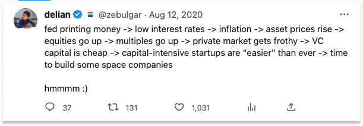](https://substackcdn.com/image/fetch/f_auto,q_auto:good,fl_progressive:steep/https%3A%2F%2Fsubstack-post-media.s3.amazonaws.com%2Fpublic%2Fimages%2F0c8c0256-0e11-441e-8ec0-602e30ba9081_611x212.png)

On the micro, space economics had shifted dramatically. **Declining launch costs could make the unit economics of space manufacturing pencil out for the first time**.   

从微观上看，空间经济已经发生了巨大的变化。发射成本的下降可以使空间制造的单位经济性首次得到平衡。

In 2019, author/astronautical engineer Robert Zubrin wrote a book called _[The Case for Space](https://www.amazon.com/Case-Space-Revolution-Spaceflight-Possibility/dp/1633885348)_[:](https://www.amazon.com/Case-Space-Revolution-Spaceflight-Possibility/dp/1633885348) _[How the Revolution in Spaceflight Opens Up a Future of Limitless Possibility](https://www.amazon.com/Case-Space-Revolution-Spaceflight-Possibility/dp/1633885348)._ Zubrin would know; he was partially responsible for the Revolution in Spaceflight. In 1996, he’d written _[The Case for Mars](https://www.amazon.com/Case-Mars-Plan-Settle-Planet/dp/145160811X)_, which inspired a young Elon Musk to start SpaceX.  

The 2019 installment took stock of the near-term implications of that company’s impact, and the long-term possibilities as we bumped into the limits of physics.   

2019年的分期付款评估了该公司的影响的近期影响，以及在我们碰上物理学的极限时的长期可能性。  

2019年，作家/航空工程师罗伯特-祖布林写了一本书，名为《太空的理由：航天革命如何开启无限可能的未来》。祖布林会知道；他对航天革命负有部分责任。1996年，他写了《火星案例》，这本书启发了年轻的埃隆-马斯克创办SpaceX。

[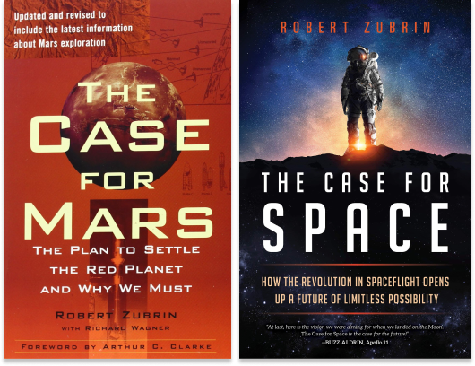](https://substackcdn.com/image/fetch/f_auto,q_auto:good,fl_progressive:steep/https%3A%2F%2Fsubstack-post-media.s3.amazonaws.com%2Fpublic%2Fimages%2F17c0d124-705b-421e-a1cd-b23eb50e7cd7_530x408.png)

Zubrin goes through the math on a number of soon-economical space verticals, including rapid passenger travel, space tourism, space business parks, on-orbit research, and **orbital industries**. Specifically, he writes:   

祖布林对一些即将产生经济效益的太空垂直行业进行了计算，包括快速客运、太空旅游、太空商业园、在轨研究和轨道工业。具体而言，他写道：

> _**Could profitable mass-production operations actually be initiated on orbit?   
> 
> 能否真正在轨道上启动有利可图的大规模生产作业？**_
> 
> _The answer to this question depends upon a variety of factors, chief among them the cost of space launch, which today stands at roughly $5,000 per kilogram to low Earth orbit.  
> 
> 这个问题的答案取决于各种因素，其中最主要的是空间发射的成本，今天每公斤到低地球轨道的成本大约为5,000美元。  
> 
> At such rates, creating orbital industries is out of the question. But at the $200/kg rate that now appears to be achievable, matters change radically. **In order for space-based manufacturing to be profitable, the value of the goods produced per unit weight must exceed this figure..**.  
> 
> 在这样的比率下，创建轨道工业是不可能的。但是在现在看来可以实现的200美元/公斤的比率下，事情就会发生根本性的变化。为了使基于空间的制造业有利可图，每单位重量生产的货物的价值必须超过这个数字......_
> 
> _Taken together, these factors would tend to rule out almost all alloy or other materials production operations, but **the production of advanced computer chips, unique pharmaceuticals, or lossless fiber-optic cables**.   
> 
> 综合来看，这些因素倾向于排除几乎所有的合金或其他材料生产业务，但先进的计算机芯片、独特的药品或无损光纤电缆的生产。_

Reading the book helped convince Delian that the time was right to take space manufacturing out of the “sci-fi things to do one day” pile and make it a reality.  

阅读这本书有助于说服德利安，现在是时候把太空制造从 "有一天要做的科幻事情 "堆中拿出来并使之成为现实。  

He’d seen SpaceX’s impact firsthand.   

他亲眼目睹了SpaceX的影响。

We’ve shown this graph a bunch, because it’s the most important one underpinning the explosion of activity in space:   

我们已经展示了很多这个图表，因为它是支撑太空活动爆炸的最重要的图表：

SpaceX’s impact extends beyond costs, though. Elon’s rocket company has also made getting to space more flexible and trained a new wave of space talent.   

不过，SpaceX的影响超出了成本范围。埃隆的火箭公司还使进入太空变得更加灵活，并培养了新一波太空人才。

To make space manufacturing work, Delian would need to leverage both of those opportunities.  

为了使空间制造发挥作用，德利安将需要利用这两个机会。  

Easily bookable (and moveable) ridesharing would mean more flexibility in product development and scheduling to meet customer needs.  

易于预订（和可移动）的共享汽车将意味着在产品开发和调度方面有更大的灵活性，以满足客户的需求。  

And the availability of SpaceX-trained talent – a rare group that possessed both rocket scientist smarts and Silicon Valley speed – would mean faster ramp times and a higher likelihood of success for the companies alluring enough to hire them.   

而经过SpaceX培训的人才--一个同时拥有火箭科学家的智慧和硅谷的速度的罕见群体--的出现将意味着更快的爬坡时间，以及对那些有足够诱惑力雇佣他们的公司来说更有可能取得成功。

That was the first thing Delian needed to prove to himself before starting the company: that he could get the right early people onboard. To be successful, **the company needed to excel at three key things - manufacturing in space, getting the payload back to Earth, and selling to both commercial and government customers**. He’d need leaders who were world-class in each of the three.   

这是德利安在创办公司之前需要向自己证明的第一件事：他可以让合适的早期人员加入。为了取得成功，公司需要在三个关键方面表现出色--在太空中制造，将有效载荷送回地球，以及向商业和政府客户销售。他需要在这三方面都是世界级的领导人。

[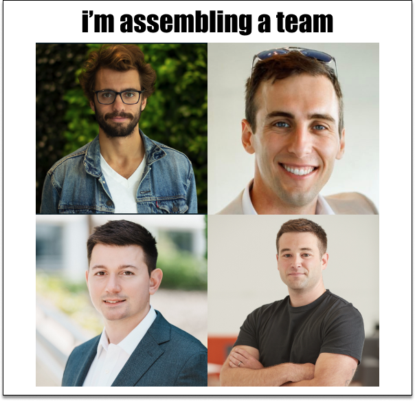](https://substackcdn.com/image/fetch/f_auto,q_auto:good,fl_progressive:steep/https%3A%2F%2Fsubstack-post-media.s3.amazonaws.com%2Fpublic%2Fimages%2Fac138a22-331b-4c53-ab70-b4e5b151a77a_604x583.png)

_Clockwise: Delian, Will, Eric, Adrian  

顺时针方向：德利安，威尔，埃里克，阿德里安_

**[Will Bruey](https://www.linkedin.com/in/will-bruey-8a2b5040/)**, Varda’s co-founder and CEO, is an **expert at getting things back to earth**. He spent over five years at SpaceX, where he **led hardware engineering on the Dragon** and was the **primary mission control operator for the spacecraft during flight**. There are very few people in the world who know reentry like Will does.   

瓦尔达的联合创始人兼首席执行官威尔-布鲁伊是一位将东西带回地球的专家。他在SpaceX工作了五年多，在那里他领导了龙飞船的硬件工程，并在飞行过程中担任飞船的主要任务控制操作员。世界上很少有人能像威尔那样了解重返地球。

SpaceX is one of only two private companies to successfully re-enter from orbit, and when they re-enter, they do it in the Dragon capsule on which Will led hardware engineering.  

SpaceX是仅有的两家成功从轨道上重返的私营公司之一，当他们重返时，他们是在威尔领导的硬件工程的龙舱中进行的。  

In March, four SpaceX astronauts splashed down in the Gulf of Mexico inside of a Dragon capsule. ([Video of Dragon test landings](https://youtu.be/ulVZds71CZQ).)   

3月，四名SpaceX宇航员在 "龙 "式太空舱内溅落在墨西哥湾。( 龙飞船测试降落的视频。)

[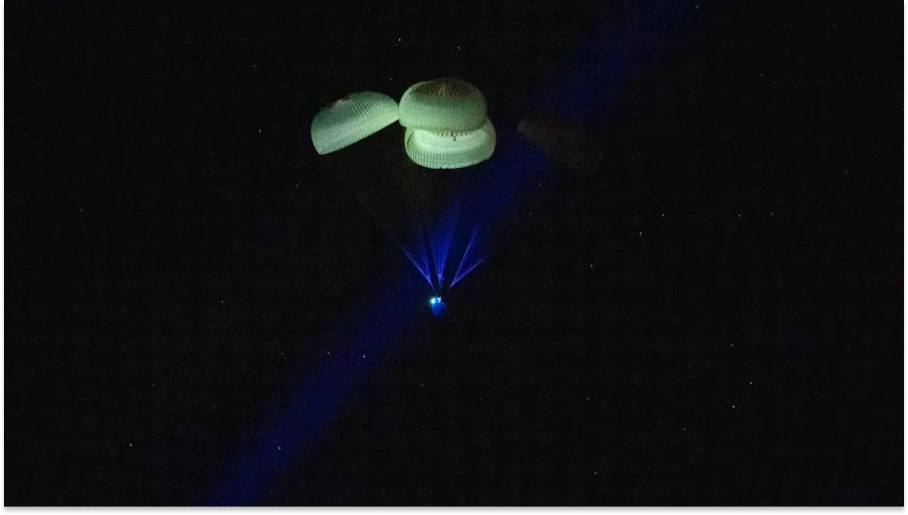](https://substackcdn.com/image/fetch/f_auto,q_auto:good,fl_progressive:steep/https%3A%2F%2Fsubstack-post-media.s3.amazonaws.com%2Fpublic%2Fimages%2F6e2a03ba-fdfc-42e6-8846-8fff39e6b21c_908x515.png)

_Parachutes Deploy on Dragon Capsule, Image Credit: NASA via Space.com  

降落伞在龙飞船上展开，图片来源：NASA via Space.com_

Will said that when Delian reached out, it didn’t take a lot of convincing to get him to join on as CEO.  

威尔说，当德利安伸出援手时，不需要很多说服力就能让他加入成为首席执行官。  

As he mentioned in the quote at the top of the piece, space manufacturing, while a wild futuristic idea to the rest of us, was something he and his fellow SpaceX engineers had been anticipating for a while.  

正如他在文章顶部提到的那样，虽然对我们其他人来说，太空制造是一个疯狂的未来主义想法，但他和他的SpaceX工程师同事已经期待了一段时间。  

And he thought the approach that Delian laid out was the right one.   

而且他认为德利安提出的方法是正确的。

Delian and Will incorporated **Varda Space Industries, Inc.** and incubated it out of Founders Fund. In the tradition of Founders Fund-founded aerospace and defense companies, the name Varda was plucked from the pages of J.R.R. Tolkien’s _The Lord of the Rings._  

德利安和威尔成立了瓦尔达太空工业公司，并将其从创始人基金中孵化出来。按照创始人基金创办的航空航天和国防公司的传统，瓦尔达这个名字是从J.R.R.托尔金的《指环王》中摘取的。

[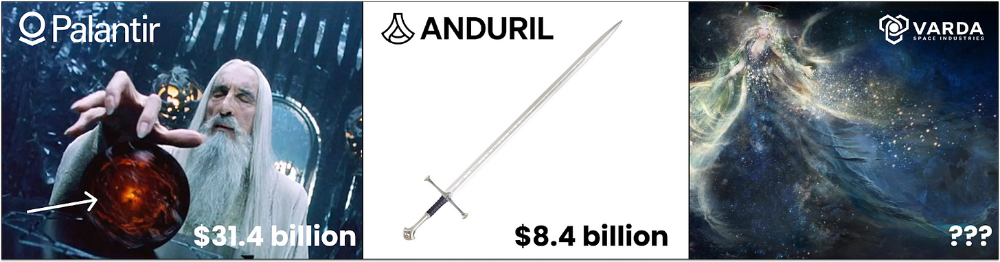](https://substackcdn.com/image/fetch/f_auto,q_auto:good,fl_progressive:steep/https%3A%2F%2Fsubstack-post-media.s3.amazonaws.com%2Fpublic%2Fimages%2F94c096e4-5915-49d5-8010-07d1967eff28_1600x420.png)

**[Palantir](https://www.palantir.com/)**, the $31 billion public company that helps government clients visualize and analyze data to make better decisions, is named after the book’s seeing stones that allow their users to communicate and view events over large distances.   

Palantir是一家价值310亿美元的上市公司，帮助政府客户可视化和分析数据以做出更好的决策，该公司以书中的看见石头命名，允许其用户在大范围内沟通和查看事件。

**[Anduril](https://www.anduril.com/)**, the $8.4 billion startup that “transforms defense capabilities with advanced technology” for western defense clients takes its name from the sword of Aragon whose name means “Flame of the West.”  

Anduril是一家价值84亿美元的初创公司，为西方国防客户 "用先进技术改变国防能力"，其名称来自阿拉贡的剑，其名字的意思是 "西方的火焰"。

The company that would bring manufacturing to space, then, would be named after **Varda,** the [Queen of Valar](https://lotr.fandom.com/wiki/Varda) who **made the stars**.  

那么，这家将制造业带入太空的公司将以制造星星的瓦拉女王瓦尔达的名字命名。

In December 2020, the newly formed Varda raised a $9 million Seed round co-led by Founders Fund and Lux Capital.   

2020年12月，新成立的Varda筹集了900万美元的种子轮融资，由Founders Fund和Lux Capital共同领导。

Varda now had the money and the expertise to send things from the heavens back down to earth, but they still needed to figure out how to make things up there.  

瓦尔达现在有了资金和专业知识，可以把东西从天上送回地球，但他们仍然需要弄清楚如何在上面制造东西。

When he was considering joining Varda, Will called his Cornell classmate, **[Adrian Radocea](https://www.linkedin.com/in/adrianradocea/)**, a materials science PhD who’d been working on materials for semiconductors, to ask a crucial question: “Does microgravity matter for materials?”   

当他考虑加入Varda时，Will给他的康奈尔大学同学Adrian Radocea打电话，他是一名材料科学博士，一直在研究半导体的材料，他问了一个关键问题："微重力对材料是否重要？"

Adrian was dismissive: “Absolutely not,” he told Will.  

阿德里安不屑一顾："绝对不行，"他告诉威尔。  

“At the atomic scale, the force of gravity is nothing compared to the electrostatic force.” (The electrostatic force between a proton and electron is 1036 more powerful than the gravitational force.)   

"在原子尺度上，与静电力相比，引力算不了什么。"(质子和电子之间的静电力比引力大10 36 。)

But it was COVID, and Adrian was stuck at home, too.  

但这是COVID，而阿德里安也被困在家里。  

So he started reading scientific articles on the question and came across literature on the effect of microgravity on protein crystallization. Turns out, microgravity _does_ matter at the mesoscopic scale, the length scale on which objects are larger than nanoscale (on the order of atoms and molecules) but still small enough that quantum mechanical or other non-trivial "microscopic" behavior becomes apparent.  

This is the scale at which protein crystallization occurs, which has important implications for pharmaceutical manufacturing.   

这是蛋白质结晶发生的规模，这对药品生产有重要影响。  

于是他开始阅读关于这个问题的科学文章，并看到了关于微重力对蛋白质结晶影响的文献。结果发现，微重力在中观尺度上确实很重要，这个长度尺度上的物体大于纳米尺度（原子和分子的数量级），但仍然小到足以使量子力学或其他非微观 "行为 "变得明显。

He called Will back to tell him that there might actually be something there, and that he wanted to come help figure it out. Adrian joined Varda as the Head of Product.   

他给威尔回了电话，告诉他那里可能真的有东西，他想来帮忙弄清楚。阿德里安加入瓦尔达，担任产品主管。

Now the only questions left were what exactly to make and who would be willing to buy it.   

现在唯一的问题是到底做什么，谁会愿意买它。

So Delian and Will tapped **[Eric Lasker](https://www.linkedin.com/in/ealasker/)**, a physicist by education who worked as a cook at Michelin Star restaurants before transitioning to the business side of startups.  

Eric worked in Enterprise Sales and Market Development at Stripe and then led US Federal Partnerships for因此，德利安和威尔找到了埃里克-拉斯克，他是一名物理学家，曾在米其林星级餐厅担任厨师，后来转型到创业公司的商业方面。 [Zipline](https://www.flyzipline.com/), the autonomous drone delivery company.   

埃里克曾在Stripe从事企业销售和市场开发工作，然后在自主无人机送货公司Zipline领导美国联邦合作伙伴关系。

They gave him his task: “Go build a business.”   

他们给他的任务是："去建立一个企业"。

They knew that they’d be able to launch factories into space, make things up there, and send them back down, and they had ideas about the types of things you could make up there and that a rare commercial reentry vehicle that didn’t have human cargo might be valuable to the DoD, but that was about it.  

他们知道他们将能够把工厂发射到太空，在那里制造东西，并把它们送回来，而且他们对你可以在那里制造的东西的类型有想法，而且一个罕见的没有载人货物的商业再入飞行器可能对国防部有价值，但这就是全部。  

There were no comps for a business like Varda.   

对于像瓦尔达这样的企业来说，没有任何竞争优势。

January 19, 2021 was Day 1 at Varda. Will, Delian, Adrian, Eric, COO Jon Barr, and a handful of aerospace engineers got to work.   

2021年1月19日是瓦尔达的第一天。威尔、德利安、阿德里安、埃里克、首席运营官乔恩-巴尔和少数几个航空航天工程师开始工作。

[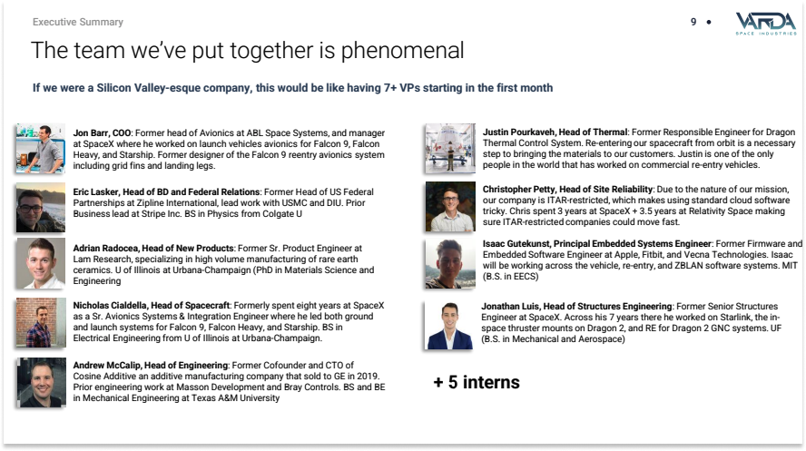](https://substackcdn.com/image/fetch/f_auto,q_auto:good,fl_progressive:steep/https%3A%2F%2Fsubstack-post-media.s3.amazonaws.com%2Fpublic%2Fimages%2F7e794794-a69a-4b63-8387-25bcaffdc375_888x497.png)

_Varda Q1 2021 Board Deck  

瓦尔达2021年第一季度董事会议程_

The engineers, many of whom Will had brought over from SpaceX, knew where to start. They’d need to figure out how to build their satellite factory and capsule.   

工程师们，其中许多人是威尔从SpaceX带过来的，知道从哪里开始。他们需要弄清楚如何建造他们的卫星工厂和太空舱。

Meanwhile, Eric and Adrian started figuring out which markets to attack first, and who would be willing to pay them for their out of this world capabilities, and quickly.  

与此同时，埃里克和阿德里安开始盘算首先攻击哪些市场，以及谁愿意为他们的超凡能力支付费用，而且要快。

Building deeptech companies is [Hard](https://www.notboring.co/p/the-good-thing-about-hard-things#:~:text=Not%20Boring's%20mission%20is%20to,pursue%20even%20bigger%2C%20harder%20challenges.). That’s why we like them so much at Not Boring.   

建立深度技术公司是困难的。这就是为什么我们在《不无聊》杂志上如此喜欢它们。

It’s hard for a number of reasons. There’s technical and/or scientific risk. You need to hire people with very specific, in-demand skills. Hardware is hard.  

这很难，原因有很多。有技术和/或科学风险。你需要雇用具有非常具体的、需要的技能的人。硬件是困难的。  

Buyers can be slow and stringent. R&D may eat up a lot of cash. The list goes on.   

买家可能是缓慢而严格的。研发可能会耗费大量现金。这样的例子不胜枚举。

Delian’s now seen this from both sides of the table, as a partner at Founders Fund and the founder of Varda, so we asked him what it takes to build a successful deeptech company.   

德利安作为创始人基金的合伙人和Varda的创始人，现在已经从两方面看到了这一点，所以我们问他建立一个成功的深度技术公司需要什么。

He said there are two main components: **balancing the stool** and **generating revenue quickly**.  

他说有两个主要部分：平衡凳子和快速创收。

The **first** is that “you need to know what milestones investors are going to be looking for at the Series B and operate to them.  

I don’t love the idea of operating companies on behalf of what investors want to see, but when you’re running a deeptech company, you have to do that.”   

我不喜欢以投资者希望看到的方式来经营公司，但当你在经营一家深度技术公司时，你必须这样做。"  

首先，"你需要知道投资者在B轮融资时将寻找哪些里程碑，并对其进行操作。

He describes the milestones as a three-legged stool that needs to be kept in balance at all times:   

他将里程碑描述为一个三条腿的凳子，需要一直保持平衡：

1.  Build a top-tier technical team.   
    
    建立一个顶级的技术团队。
    
2.  Achieve your technical milestones.   
    
    实现你的技术里程碑。
    
3.  Generate the appropriate level of BD and sales interest in what you’re building.   
    
    为你正在建造的东西产生适当水平的BD和销售兴趣。
    

Hire the technical talent you need to hit your technical milestones, hit them, raise capital, then freeze hiring while you gauge customer interest and continue to make technical progress with the team you have.  

雇用你所需要的技术人才，以达到你的技术里程碑，达到他们，筹集资金，然后冻结招聘，同时衡量客户的兴趣，并继续与你拥有的团队取得技术进展。  

When you find customer interest and approach further technical milestones that need new expertise, hire, raise, then freeze and do it again.  

当你发现客户的兴趣，并接近需要新的专业知识的进一步技术里程碑时，雇用，提高，然后冻结，再做一次。  

If a normal startup is like a street musician, he told us, then **a deeptech company needs to operate like an orchestra**.   

他告诉我们，如果一个普通的创业公司就像一个街头音乐家，那么一个深度技术公司就需要像一个管弦乐队一样运作。

Varda has balanced the stool extraordinarily well.   

瓦尔达把凳子平衡得特别好。

**1\. Top-tier technical team.** In just two and a half years, it’s hired a team of 70+ people, “at least 15 of whom would be very senior executives at other companies,” according to Delian, and many of whom have engineering experience at top space companies and drug manufacturing and BD experience at large pharmaceutical companies.   

1.一流的技术团队。在短短两年半的时间里，它雇用了一个由70多人组成的团队，"其中至少有15人在其他公司会是非常高级的管理人员，"德利安说，他们中的许多人都有在顶级航天公司的工程经验和在大型制药公司的药物制造和BD经验。

**2\. Technical milestones.** On the launch side, Varda has remained remarkably on-schedule, and the schedule was aggressive from the beginning, slipping on the first launch date by just one quarter.  

One of the company’s values is that2.技术上的里程碑。在发射方面，瓦尔达一直保持着明显的按期完成，而且时间表从一开始就很积极，在第一个发射日期上只推迟了一个季度。 **the trains run on time**. Going from founding to launch in under 2.5 years is no small feat.   

该公司的价值观之一是，火车要准时运行。在不到2.5年的时间里，从创立到推出，这不是一个小成就。

[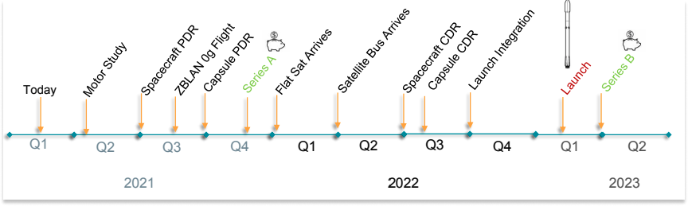](https://substackcdn.com/image/fetch/f_auto,q_auto:good,fl_progressive:steep/https%3A%2F%2Fsubstack-post-media.s3.amazonaws.com%2Fpublic%2Fimages%2F8802f64c-3abd-4df0-aae5-78654a81cdc6_864x259.png)

_Varda’s First Board Deck, Q1 2021  

瓦尔达的第一个董事会甲板，2021年第一季度_

On the manufacturing side, the Varda team has been hard at work defining their plan of attack for pharmaceutical manufacturing, [publishing early work](https://pubs.acs.org/doi/full/10.1021/acs.cgd.2c01017) on identifying new drug polymorphs.  

在制造方面，Varda团队一直在努力工作，确定他们在药品制造方面的攻击计划，发表了关于识别新药物多形态的早期工作。

**3\. BD and Sales Interest.** Varda has generated significant BD interest on both sides of the business, from both the DoD and some of the world’s largest pharmaceutical companies.  

The company is executing over $60 million in programs with the DoD, and is on the precipice of finalizing a contract with a top 20 biopharma company for its second mission.   

该公司正在与国防部执行超过6000万美元的项目，并即将与一家排名前20位的生物制药公司敲定第二项任务的合同。  

3.BD和销售兴趣。Varda在业务的两方面都产生了巨大的BD兴趣，来自国防部和一些世界上最大的制药公司。

The stool has remained balanced. That’s half the battle.   

凳子一直保持平衡。这就是战斗的一半。

The **second** component is that deeptech companies should begin generating revenue within three years.   

第二个组成部分是，深度技术公司应在三年内开始产生收入。

Venture capitalists have investors, too: their Limited Partners (LPs). LPs typically expect to get their cash back and more within ten years.  

风险资本家也有投资者：他们的有限合伙人（LPs）。有限合伙人通常期望在十年内收回他们的现金和更多。  

VCs typically invest each fund over two to three years, which means that once companies are funded, they have seven to eight years to return capital.  

风险投资公司通常在两到三年内投资每个基金，这意味着一旦公司获得资金，他们有七到八年的时间来回报资本。

“If you’re not making revenue in year three or four, the likelihood you’ll be able to return capital to investors by year seven is low,” Delian explained.  

"如果你在第三或第四年没有收入，那么到第七年你能够向投资者归还资本的可能性就很低，"德利安解释说。  

“It’s like a law of VC physics based on fund timeframes.”  

"这就像一个基于基金时限的风险投资物理学定律。"

Deeptech companies need to continuously raise capital to fund further milestones before they become profitable, so they need to continue to be an attractive investment for VCs.  

深度技术公司在实现盈利之前需要不断筹集资金，为进一步的里程碑提供资金，因此它们需要继续成为对风险投资商有吸引力的投资。  

Therefore, deeptech companies can’t wait around in the pre-revenue R&D phase for too long, because they need to show investors that they’ll generate a return within the life of the fund.   

因此，深科技公司不能在收入前的研发阶段等待太久，因为他们需要向投资者展示他们将在基金的生命周期内产生回报。

I bring this up for two reasons:   

我提出这个问题有两个原因：

1.  It’s potentially useful to those of you building deeptech companies (and I hope there are a lot of you reading this)   
    
    这对你们这些建立深度技术公司的人（我希望你们中有很多人在读这篇文章）有潜在的帮助。
    
2.  To highlight the urgency with which Eric and Adrian needed to find someone willing to pay Varda for its unique capabilities.   
    
    为了强调埃里克和阿德里安需要找到愿意为瓦尔达的独特能力付费的人的紧迫性。
    

So who was it going to be?  

那么会是谁呢？

Varda’s top priority is and always has been manufacturing things in space. The fact that its return capsule may also have value to certain customers is a valuable bonus.   

瓦尔达的首要任务是而且一直是在太空中制造东西。其返回舱可能对某些客户也有价值，这是一个宝贵的奖励。

But when Eric looked at the company’s technical timelines, with the mandate to start generating revenue as quickly as possible, he realized that Varda would have a reentry platform before it would be able to manufacture materials.  

但是，当埃里克看了公司的技术时间表，以尽快开始创造收入为任务时，他意识到瓦尔达在能够制造材料之前就会有一个再入平台。  

So he’d try to monetize the reentry platform first, and got to work figuring out who would be willing to pay for it.  

因此，他首先尝试将再就业平台货币化，并开始工作，找出谁愿意为其付费。  

The answer would emerge out of the engineering team’s work on how to make sure the capsule didn’t burn up as it re-entered the atmosphere.   

答案将从工程小组的工作中产生，即如何确保太空舱在重新进入大气层时不会燃烧。

While Eric was searching for the first platform customer, Will and the engineers – a growing group with backgrounds at SpaceX, Blue Origin, ABL, and Boeing – began building the spacecraft.   

在埃里克寻找第一个平台客户的同时，威尔和工程师们--一个不断壮大的具有SpaceX、Blue Origin、ABL和波音背景的团队--开始建造航天器。

Varda’s flight missions comprises of four major pieces of technology:  

瓦尔达的飞行任务包括四个主要技术：

1.  Launch vehicle  运载火箭
    
2.  Satellite bus 卫星巴士
    
3.  Manufacturing module  制造模块
    
4.  Reentry capsule 再入舱
    

[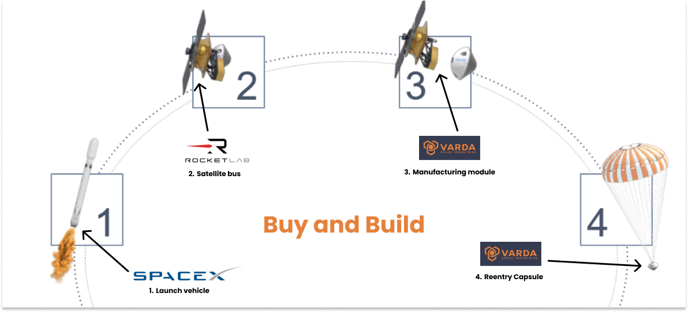](https://substackcdn.com/image/fetch/f_auto,q_auto:good,fl_progressive:steep/https%3A%2F%2Fsubstack-post-media.s3.amazonaws.com%2Fpublic%2Fimages%2F5339d3a9-3921-46cb-8a95-223d55293841_1192x542.png)

It’s a great time to be building a space company. As Will told us, “Each piece of what Varda does has been proven to work; what we’re building is only **novel in the aggregate**.”   

现在是建立一家太空公司的好时机。正如威尔告诉我们的那样，"瓦尔达所做的每一件事都已被证明是有效的；我们正在建立的只是总体上的创新。"

As discussed, it’s now possible to hitch a ride on a **SpaceX** rocket to get up to ~500km Sun Synchronous Orbit (SSO).  

But there’s a growing supply chain beyond launch that gives space companies buy versus build options for a growing number of the things they need to do.  

但是，在发射之外还有一个不断增长的供应链，为航天公司提供了越来越多他们需要做的事情的购买与建造选择。  

As with any traditional business, space startups can buy the commoditized pieces of their product so they can get to market faster and focus their efforts on what differentiates them.  

与任何传统企业一样，太空初创公司可以购买其产品的商品化部分，这样他们可以更快地进入市场，并将精力集中在他们的差异化上。  

Instead of building its own satellite buses, for example, Varda buys them from another space startup,正如所讨论的那样，现在有可能搭上SpaceX的火箭，升到约500公里的太阳同步轨道（SSO）。 [Rocket Lab](https://www.rocketlabusa.com/).   

例如，瓦尔达没有建造自己的卫星巴士，而是从另一家太空创业公司火箭实验室购买。

Varda buys space on the launch vehicle and its satellite buses so that it can focus on the reentry capsule and the manufacturing module within it.   

瓦尔达购买了运载火箭及其卫星总线上的空间，这样它就可以专注于再入舱和其中的制造模块。

The reentry capsule is fairly simple, or at least much simpler than the reentry capsule Will was used to working on at SpaceX.  

再入舱相当简单，或者至少比威尔在SpaceX工作时习惯的再入舱要简单得多。  

Those capsules needed to bring humans safely back down to earth, which meant that they needed to be overengineered at great expense to prevent any failures or even extreme roll.  

这些太空舱需要将人类安全地带回地球，这意味着它们需要花大价钱进行过度设计，以防止出现任何故障甚至是极端的滚动。  

As a result, the SpaceX Dragon capsule can cost around $50 million. Varda’s capsules don’t carry human cargo.  

因此，SpaceX的 "龙 "式太空舱的成本可能在5000万美元左右。瓦尔达的太空舱并不携带人类货物。  

That means they don’t have to be engineered to the same high tolerances as the Dragon, and that they can reenter the atmosphere at steeper angles and higher speeds.   

这意味着它们不必像 "飞龙 "号那样被设计成高公差，而且它们可以以更陡峭的角度和更高的速度重新进入大气。

Higher speeds mean more heat, so the most advanced technology on the reentry capsule are the thermal protection shields (TPS) that keep the capsule, and the valuable cargo inside, from burning up.  

更高的速度意味着更多的热量，因此返回舱上最先进的技术是热保护罩（TPS），它能使返回舱和里面的宝贵货物不被烧毁。  

Here, too, Varda was able to partner. Decades earlier, NASA had developed TPS using an ablative material called C PICA, or Conformal Phenolic-Impregnated Carbon Ablator.  

在这里，瓦尔达也能成为合作伙伴。几十年前，美国宇航局已经开发了TPS，使用一种叫做C PICA的烧蚀材料，即共形酚浸渍碳烧蚀剂。  

Ablative is a big word that means that the material burns off under high heat conditions, carrying the heat away with it.   

烧蚀是一个大词，意味着材料在高热条件下燃烧掉，将热量带离。

[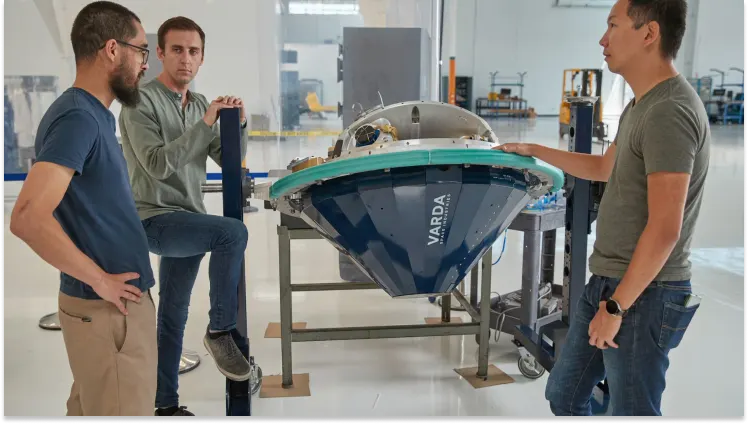](https://substackcdn.com/image/fetch/f_auto,q_auto:good,fl_progressive:steep/https%3A%2F%2Fsubstack-post-media.s3.amazonaws.com%2Fpublic%2Fimages%2F46843888-f727-4c1f-8e20-c64e3923b895_748x424.png)

_Will and Varda Engineers Work on a Prototype of the Reentry Capsule  

威尔和瓦尔达的工程师们正在制作重返大气层舱的原型_

In an interesting catch-22, however, NASA couldn’t use the material on a live mission since it hadn’t been flight tested on a prior mission.  

然而，在一个有趣的陷阱中，美国宇航局不能在一次实战任务中使用这种材料，因为它没有在以前的任务中进行过飞行测试。  

By using it on a Varda flight, NASA could get it flight rated and begin using it itself.  

通过在瓦尔达飞行中使用它，美国宇航局可以让它获得飞行等级，并开始自己使用它。  

As Eric was talking to NASA Ames about the TPS, he and Varda’s Head of Hypersonics dug up a paper that had proposed a capsule very similar to Varda’s to test it, and then discovered that the Air Force had discussed a similar project and even gotten through the early stages of the process.  

当埃里克与美国宇航局艾姆斯研究所讨论TPS时，他和瓦尔达的高超音速技术负责人挖出了一篇论文，该论文提出了一个与瓦尔达的太空舱非常相似的测试方法，然后发现空军已经讨论了一个类似的项目，甚至已经进入了早期阶段的程序。  

He had his first targets for the platform.   

他有了自己在平台上的第一个目标。

An even more urgent need quickly followed when China shocked the world, and surprised US intelligence, by [testing nuclear-capable hypersonic missiles](https://www.ft.com/content/ba0a3cde-719b-4040-93cb-a486e1f843fb) in August 2021.   

当中国在2021年8月测试了具有核能力的高超音速导弹，震惊了世界，也让美国的情报部门感到惊讶时，一个更加迫切的需求迅速随之而来。

Hypersonics, as the name implies, fly at hypersonic speeds, or greater than Mach 5. The slowest, hypersonic cruise missiles, can reach speeds of Mach 5 to Mach 10.   

高超音速导弹，顾名思义，以高超音速飞行，或大于5马赫。最慢的高超音速巡航导弹，速度可以达到5至10马赫。

The fastest, hypersonic boost glide vehicles, can fly as fast as Mach 25. Boost glides launch into space on a rocket before decoupling and orbiting the earth under their own momentum.  

最快的是高超音速助推滑翔飞行器，可以飞到25马赫。助推滑翔机在火箭上发射到太空，然后在自身的动力下脱钩并绕地球飞行。  

What makes them particularly fearsome is that they don’t follow a fixed trajectory and can be maneuvered, making them harder to track and destroy.   

使它们特别可怕的是，它们不遵循固定的轨迹，可以被操纵，使它们更难追踪和摧毁。

[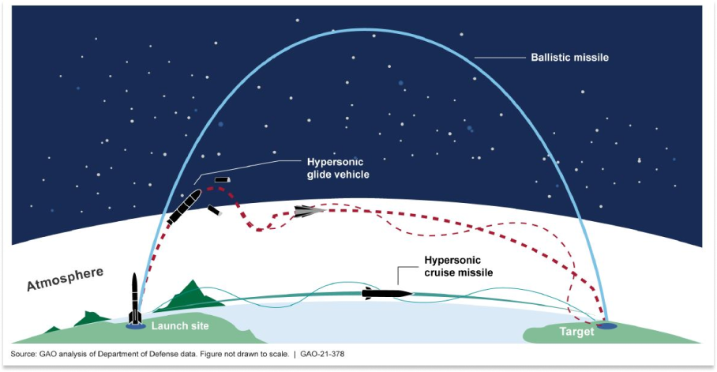](https://substackcdn.com/image/fetch/f_auto,q_auto:good,fl_progressive:steep/https%3A%2F%2Fsubstack-post-media.s3.amazonaws.com%2Fpublic%2Fimages%2F3fa5d922-5098-4295-9eeb-3215432408f0_908x471.png)

America’s missile defense systems are designed to protect against more predictable ballistic missiles, but our ability to defend against hypersonics is far less developed, in part because we didn’t believe they posed an imminent threat.  

美国的导弹防御系统被设计用来防止更可预测的弹道导弹，但我们防御高超音速导弹的能力却远没有那么发达，部分原因是我们不认为它们构成迫在眉睫的威胁。  

China’s revealed capabilities put the DoD on high alert.   

中国披露的能力使美国国防部处于高度警惕状态。

General Mark A. Milley, the chairman of the Joint Chiefs of Staff, [said in a TV interview](https://www.nytimes.com/2021/10/27/us/politics/china-hypersonic-missile.html), “I don’t know if it’s quite a **Sputnik moment**, but I think it’s very close to that,” adding, “It has all of our attention.”  

参谋长联席会议主席马克-A-米利将军在一次电视采访中说："我不知道这是否是一个相当的斯普特尼克时刻，但我认为它非常接近于此。"他补充说："它有我们所有的注意力。"

America needed to beef up both its defensive and offensive hypersonic capabilities, and quickly. The challenge was: there aren’t many good ways to simulate hypersonic flows.   

美国需要迅速加强其防御性和进攻性的高超音速能力。挑战是：没有许多模拟高超音速流动的好方法。

On earth, it’s possible to test components in blowdown tunnels – high speed wind tunnels – that can reach over Mach 15 for short periods of time.  

在地球上，有可能在吹风隧道--高速风洞--中测试组件，这些隧道可以在短时间内达到15马赫以上。  

Those speeds come at the expense of the correct flow enthalpy, pressure, and chemistry.  

这些速度是以正确的流动焓值、压力和化学成分为代价的。  

In other words, even if they can hit high speeds, tunnels can’t reproduce proper flight regimes to fully test hypersonic vehicles.   

换句话说，即使他们能达到高速，隧道也不能再现适当的飞行制度，以充分测试高超音速车辆。

In space, a dedicated mission on a human-rated capsule like the SpaceX Dragon could cost $200  million ($50 million to make the capsule, $150 million for the flight) since the capsule needs to be overengineered enough to fully protect humans.  

在太空中，乘坐像SpaceX Dragon这样的人类等级的太空舱进行专门的任务可能需要2亿美元（5000万美元用于制造太空舱，1.5亿美元用于飞行），因为太空舱需要有足够大的工程量来充分保护人类。  

Plus, Dragon is built primarily to protect the humans onboard.  

此外，"飞龙 "号的建造主要是为了保护船上的人类。  

Because of its blunter shape, it slows down at higher altitudes and therefore doesn’t go through the boost glide flight regimes, experiences lower heating, and doesn’t experience the same g-forces.   

由于其较钝的形状，它在更高的高度上减速，因此不经过助推滑翔飞行制度，经历较低的加热，并且不经历相同的g-force。

Those two options mean either frequent cheaper tests in unrealistic conditions, or infrequent expensive tests in closer-to realistic conditions, neither of which is ideal for understanding the unique dynamics of hypersonic vehicles in true flight environments.  

这两种选择意味着要么在不现实的条件下频繁进行便宜的测试，要么在接近现实的条件下不频繁地进行昂贵的测试，这两种选择对于了解高超音速飞行器在真正的飞行环境中的独特动力学都不理想。

Varda, the team realized, might be able to fill that huge gap in the middle, allowing the hypersonic community to test in a true flight environment “early and often.” To get the products it makes in space into the hands of customers on earth, it needs to send its relatively inexpensive (non-human-rated) capsule hurling back down to earth at Mach 25+ anyway.   

该团队意识到，Varda可能能够填补中间的巨大空白，使高超音速社区能够 "尽早并经常 "在真正的飞行环境中进行测试。为了把它在太空中制造的产品送到地球上的客户手中，它需要以25马赫以上的速度将其相对便宜的（非人类等级）太空舱扔回地球。

Eric had discovered the first customer, and one with an urgent enough need, and big enough budget, that they’d be willing and able to pay Varda meaningful revenue within that critical three year window.  

埃里克发现了第一个客户，而且这个客户有足够迫切的需求和足够大的预算，他们愿意并能够在那个关键的三年时间里向瓦尔达支付有意义的收入。  

So he dug into the US Budget and the Defense Authorization Act – “I ctrl+F’d through a lot of horrible documents” – figured out potential buyers in the government, and approached them with a clear idea of what Varda would be able to offer.   

因此，他钻研了美国预算和国防授权法案--"我在很多可怕的文件中ctrl+F"--找出了政府中的潜在买家，并带着对瓦尔达能够提供什么的明确想法与他们接触。

Turns out, they were very interested. In March, [Varda announced](https://twitter.com/VardaSpace/status/1636003065156313091) that it had been awarded a $60 million STRATFI program with the Air Force “to advance our nation’s hypersonic capabilities.”   

事实证明，他们非常感兴趣。3月，瓦尔达宣布它已经获得了与空军合作的6000万美元的STRATFI项目，"以推进我们国家的高超音速能力"。

[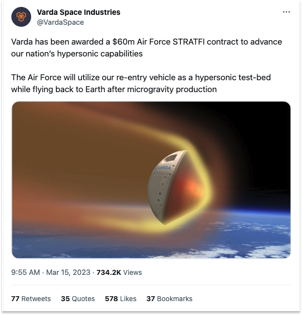](https://substackcdn.com/image/fetch/f_auto,q_auto:good,fl_progressive:steep/https%3A%2F%2Fsubstack-post-media.s3.amazonaws.com%2Fpublic%2Fimages%2Fed3f9400-6503-4360-a7cc-f133e0fefda9_611x636.png)

The contract, which is essentially half-revenue and half-funding, covers two flights: one rideshare flight at and one dedicated flight, and additional work to create an enduring capability.   

该合同实质上是一半收入和一半资金，包括两个航班：一个共享航班和一个专用航班，以及创造持久能力的额外工作。

It’s an important milestone on the path to [SBIR/Phase III contracting](https://business.defense.gov/Portals/57/Documents/SBIR%20Phase%20III%20Contracting.pdf), at which point the DoD will be able to more easily purchase further flights from Varda.  

In the near future, Varda could be doing 4-6 missions per year on hypersonics alone, before accounting for demand from the government’s efforts to modernize its hypersonic vehicle programs. The goal is to have a rideshare on every flight, and Varda is currently lining up and signing a deep manifest beyond its first two contracted missions.  

在不久的将来，仅在高超音速方面，Varda每年就可以完成4-6次任务，这还没有考虑到政府为实现高超音速飞行器项目的现代化所带来的需求。目标是在每次飞行中都有一个乘员，Varda目前正在排队，并在其最初的两个合同任务之外签署一个深度清单。

STRATFI is a springboard into larger DoD budgets. 

  

STRATFI是进入更大的国防部预算的一个跳板。  

这是通往SBIR/第三阶段合同的一个重要里程碑，届时国防部将能够更容易地从Varda公司购买更多的航班。

While space manufacturing is Varda’s top priority, securing government contracts so early in the company’s life actually gives the company more flexibility on the manufacturing side.  

虽然空间制造是Varda的首要任务，但在公司成立之初就获得政府合同，实际上给了公司在制造方面更多的灵活性。  

The government is able to get better pricing because Varda has to send drugs back to earth, pharmaceutical companies are able to pay lower upfront costs because the government is covering part of the flight’s costs.  

政府能够获得更好的定价，因为瓦尔达必须将药物送回地球，制药公司能够支付更低的前期成本，因为政府承担了部分飞行费用。

Nick Szabo’s 2006 blog post, _[How to succeed or fail on a frontier](http://unenumerated.blogspot.com/2006/10/how-to-succeed-or-fail-on-frontier.html)_, is one of my all-time favorites.  

In it, he tells the story of the early Chinese and Portuguese naval fleets and explains why, despite China’s far vaster wealth and far larger fleets, Portugal succeeded in conquering the world’s sea trade routes while China shut down its program and turned in on itself.   

在书中，他讲述了早期中国和葡萄牙海军舰队的故事，并解释了为什么尽管中国的财富要多得多，舰队也大得多，但葡萄牙却成功地征服了世界的海上贸易路线，而中国却关闭了它的计划并自食其力。  

尼克-萨博（Nick Szabo）在2006年发表的博文《如何在边疆获得成功或失败》是我一直以来的最爱之一。

The Chinese fleet set out primarily to show off the glory of China and secondarily to collect tributes, which weren’t nearly enough to fund itself.  

中国舰队出发主要是为了炫耀中国的荣耀，其次是为了收集贡品，这些贡品几乎不足以资助自己。  

When the Emperor realized that the expeditions were expensive and pointless, he killed both the government-funded “treasure fleets” _and_ the productive private merchant fleets that had successfully operated independently.   

当皇帝意识到这些探险活动既昂贵又毫无意义时，他把政府资助的 "宝藏船队 "和成功独立运作的生产性私人商船队都杀了。

The Portuguese fleet, on the other hand, paid for its own expansion. As Szabo explains (emphasis mine):   

另一方面，葡萄牙舰队则为自己的扩张付出了代价。正如萨博解释的那样（强调是我的）：

> _Assisted by navigators and investors from other parts of Europe, **the Portuguese embarked on a pay-as-you go path of conquest and trade**. They focused on conquering strategic points that allowed them to control, tax, protect, and enable trade.  
> 
> They enforced the property rights of their allied merchants and otherwise enabled the commercial institutions by which that trade could flourish.  
> 
> 他们执行其盟友商人的财产权，并以其他方式促成商业机构，使贸易得以蓬勃发展。  
> 
> 在来自欧洲其他地区的航海家和投资者的帮助下，葡萄牙人开始了征服和贸易的 "现收现付 "之路。他们专注于征服战略要地，使他们能够控制、征税、保护和促成贸易。_

Szabo told the centuries old story to highlight a more modern one:   

萨博讲述了这个几百年前的故事，以突出一个更现代的故事：

> _When it comes to the "final frontier" of space, it seems to be so far the West that has stepped into China's old shoes. What did Apollo return but glory and a handful of rocks?  
> 
> 谈到太空的 "最后疆域"，到目前为止，似乎是西方踏上了中国的旧鞋。阿波罗号除了荣耀和少量的石头之外，还返回了什么？  
> 
> We proved that our socialists, if funded by taxing capitalists, could beat their socialists funded by socialists.  
> 
> 我们证明了我们的社会主义者，如果由征税的资本家提供资金，可以打败他们由社会主义者资助的社会主义者。  
> 
> Did such proof of bureaucratic glory really require 1% of our GDP over several years?  
> 
> 这种官僚主义的荣耀证明真的需要在几年内将我们的GDP的1%拿出来吗？_

Like the Portuguese, Szabo argued that the West should engage in the “pay-as-you-go” flavor of space development.  

与葡萄牙人一样，萨博认为西方应该从事 "现收现付 "式的太空开发。  

Instead of the $1.5 billion-per-launch Space Shuttle and plans for Moon and Mars bases, he advocated for launching more satellites into orbit for communications and surveillance, which serve both military and commercial purposes.   

他不主张采用每次发射15亿美元的航天飞机以及月球和火星基地的计划，而是主张将更多的卫星发射到轨道上，用于通信和监视，这些都是为军事和商业目的服务。

As the drawings in the introduction show, Sazbo got his wish. The year prior to the post, 2005, marked a nadir in the number of objects sent into space.  

正如导言中的图画所示，Sazbo实现了他的愿望。帖子的前一年，即2005年，标志着送入太空的物体的数量达到了一个低谷。  

That number has rocketed from 72 in 2005 to 2,163 in 2022, thanks in very large part to a private company, SpaceX, and the dual-use nature of its technology.   

这个数字已经从2005年的72人飙升至2022年的2163人，这在很大程度上要归功于一家私营公司SpaceX，以及其技术的双重用途。

[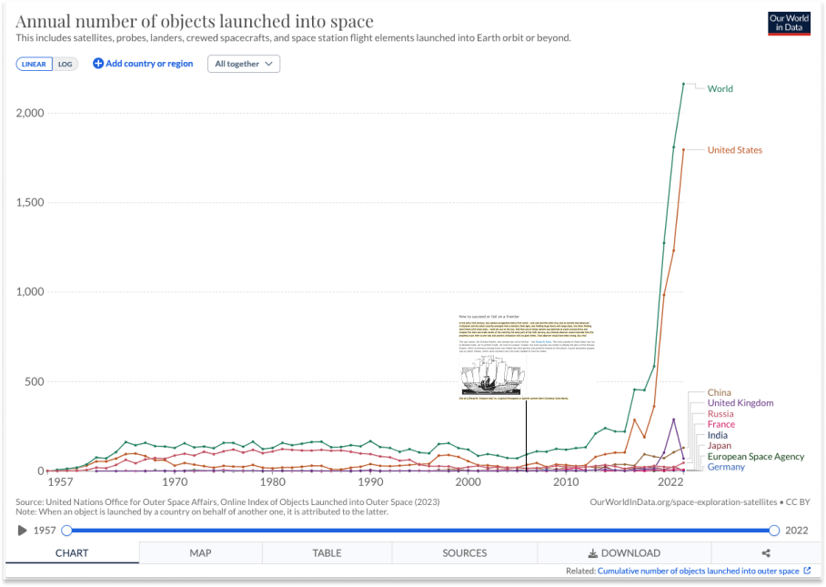](https://substackcdn.com/image/fetch/f_auto,q_auto:good,fl_progressive:steep/https%3A%2F%2Fsubstack-post-media.s3.amazonaws.com%2Fpublic%2Fimages%2F4404978b-dbc9-4671-8939-233130c0e40a_908x645.png)

_Our World in Data 我们的数据世界_

**Dual-use technology** is an important concept to understand. It refers to technology that can be used for both civilian and military purposes.  

Think nuclear fission, the internet, and GPS, or satellites that can be used for military reconnaissance and to deliver internet to off-the-grid customers.   

想想看，核裂变、互联网和GPS，或者可用于军事侦察和向离网客户提供互联网的卫星。  

两用技术是一个需要理解的重要概念。它指的是既可用于民用也可用于军用的技术。

The main benefit of dual use technologies is that they can command the government funding needed for the capital intensive early research and development (R&D) phase as well as the commercial market demand that incentivizes competition, cost improvements, and innovation.  

两用技术的主要好处是，它们可以获得资本密集型早期研究和开发（R&D）阶段所需的政府资金，以及激励竞争、成本改进和创新的商业市场需求。  

No private company could have funded the creation of GPS, and no government could have used it to create Uber.   

没有私人公司能资助GPS的创建，也没有政府能用它来创建Uber。

Similarly, SpaceX has benefited from $15.3 billion in government funding and contracts over the past two decades, which it has used to build a business that’s strong enough to both stand on its own and support a flourishing space economy.   

同样，SpaceX在过去20年中受益于153亿美元的政府资金和合同，它利用这些资金建立了一个强大的企业，既能自力更生，又能支持繁荣的太空经济。

Today, SpaceX has its own two uses which support each other: SpaceX and Starlink.  

今天，SpaceX有自己的两个用途，相互支持：SpaceX和Starlink。  

SpaceX is able to build bigger and bigger rockets, and fill them with revenue-generating cargo, because Starlink is able to sell into the practically bottomless market for communications.  

SpaceX能够建造越来越大的火箭，并装满创收的货物，因为Starlink能够向几乎无底的通信市场出售。  

Starlink is able to launch so many satellites because of the cheap launches provided by SpaceX’s bigger and bigger rockets.  

星联公司之所以能够发射这么多卫星，是因为SpaceX公司越来越大的火箭提供了廉价发射。  

Together, they’re spinning a flywheel that makes it exceedingly difficult for any launch or satellite company to catch up.   

他们一起转动着一个飞轮，使任何发射或卫星公司都极难追赶。

As Casey Handmer concludes at the end of his two-parter, _[The SpaceX Starship is a very big deal](https://caseyhandmer.wordpress.com/2019/10/29/the-spacex-starship-is-a-very-big-deal/)_ and _[Starlink is a very big deal](https://caseyhandmer.wordpress.com/2019/11/02/starlink-is-a-very-big-deal/)_, Starlink and Starship wouldn’t exist without each other, and our near-future spacefaring capabilities would be nowhere as ambitious without both of them. “A **ubiquitous, generic, and cheap Starlink is not possible without Starship**,” he wrote, and “**Starship, a launcher cheap enough to be interesting, is not possible without Starlink.”**  

正如凯西-汉德默在他的两篇文章的结尾所总结的那样，SpaceX的星舰是一个非常大的问题，而星联是一个非常大的问题，星联和星舰没有对方就不会存在，如果没有这两者，我们的近未来的航天能力就不会有什么雄心。他写道："如果没有星际飞船，一个无处不在的、通用的、廉价的星际链接是不可能的，"而 "星际飞船，一个廉价到有趣的发射器，没有星际链接也是不可能的。"

On the way to fully industrialized cities in deep space, SpaceX’s cheaper and more frequent launches make other on-orbit capabilities economically viable for the first time.   

在通往深空完全工业化城市的道路上，SpaceX公司更便宜、更频繁的发射使其他在轨能力首次具有经济可行性。

Varda is pursuing a similar strategy: building dual-use technology to make its offering more attractive to each of its customer bases in order to build up a lead that will be hard to catch up with.  

瓦尔达正在采取类似的战略：建立双重用途的技术，使其提供的产品对每一个客户群都更具吸引力，以便建立起难以追赶的领先优势。

The company has two business lines:   

该公司有两条业务线：

1.  **Pharmaceutical Manufacturing (Primary)**. Varda works with pharmaceutical companies to design and manufacture drugs by leveraging the unique characteristics of microgravity.   
    
    医药制造（初级）。瓦尔达与制药公司合作，利用微重力的独特特性来设计和制造药物。
    
2.  **Reentry-as-a-Service (Secondary)**. Varda’s reentry capsule is perfect for hypersonic testing because, without needing to carry humans, it can reach speeds of Mach 25+. The company **recently landed a $60 million STRATFI program with the Air Force**.   
    
    回归即服务（二级）。瓦尔达的再入舱是高超音速测试的完美选择，因为不需要载人，它可以达到25马赫以上的速度。该公司最近与空军达成了一项价值6000万美元的STRATFI项目。
    

The dual-use nature of the business allows Varda to gain advantages on both sides.   

业务的两用性使瓦尔达能够获得两方面的优势。

Recall that if the DoD wants to test its hypersonic capabilities, it has two main options: use wind tunnels on earth (which doesn’t fully simulate conditions) or do expensive dedicated flight testing (which costs upwards of $100 - 200 million per test).   

回顾一下，如果国防部想测试其高超音速能力，它有两个主要选择：使用地球上的风洞（不能完全模拟条件）或做昂贵的专门飞行测试（每次测试费用高达1-2亿美元）。

Because Varda is going up to space and reentering anyway in order to manufacture drugs, it’s able to sell “rideshares,” or “reentry-as-a-service,” that provide the DoD with a realistic testing environment for a fraction of the cost.   

因为瓦尔达无论如何都要上太空和重返大气层以制造药物，所以它能够出售 "乘坐共享"，或 "重返大气层即服务"，以极低的成本为国防部提供一个真实的测试环境。

On the commercial side, the DoD contracts can cover a large portion of the cost of the flight, which means that it’s able to offer pharma companies a lower upfront price and capture more of the value it creates in the form of milestone payments and royalties.  

在商业方面，国防部的合同可以覆盖很大一部分飞行成本，这意味着它能够为制药公司提供较低的预付价格，并以里程碑付款和特许权使用费的形式获取更多的创造价值。  

That makes working with Varda a lower-risk proposition, and the benefit is already showing up in the progress it's made with some of the world’s largest pharmaceutical companies.   

这使得与Varda合作成为一个风险较低的主张，其好处已经显示在它与一些世界上最大的制药公司取得的进展上。

Taken together, because it’s able to offer a valuable service to each side at a lower price than they would be able to without the other, Varda can fly more missions than it would be able to if it only worked with the DoD or pharma alone.  

综合来看，由于它能够以比没有对方的情况下更低的价格向双方提供有价值的服务，Varda可以比只与国防部或制药业合作的情况下飞行更多的任务。  

More missions means that Varda will be able to bring down its costs significantly over time through integration and volume, which should drive even more demand.  

更多的任务意味着，随着时间的推移，瓦尔达将能够通过整合和批量化来大幅降低其成本，这应该推动更多的需求。  

Varda is creating its own SpaceX-like flywheel.   

瓦尔达正在创造自己的类似SpaceX的飞轮。

The flywheel only spins because Varda is able to offer something valuable to pharmaceutical companies.  

飞轮的转动只是因为瓦尔达能够向制药公司提供有价值的东西。  

After decades of researching the effects of microgravity on drugs on the ISS, pharma will now be able to actually manufacture drugs in space.  

在国际空间站研究微重力对药物的影响数十年后，制药业现在将能够在太空中实际生产药物。

In _The Case for Space,_ Zubrin estimated that even with $200/kg launch costs, a space manufacturing company would need to generate at least $80 million in revenue, or 40 tons of product, to cover its costs.  

This economic reality is why Zubrin made the argument to focus on “advanced computer chips,在《太空案例》中，祖布林估计，即使发射成本为200美元/公斤，一家太空制造公司也需要产生至少8000万美元的收入，或40吨的产品，才能支付其成本。 **unique pharmaceuticals**, or lossless fiber-optic cables.” They’re the highest value-per-weight products that benefit from microgravity.   

这一经济现实就是为什么祖布林提出要把重点放在 "先进的计算机芯片、独特的药品或无损的光纤电缆 "上的理由。它们是受益于微重力的最高价值--每重量的产品。

It turns out that Zubrin was far too conservative, which we’ll address, but his larger point stands: **space manufacturing companies should start with the highest $/kg product they can make and sell.**  

事实证明，祖布林太保守了，我们将讨论这个问题，但他更大的观点是：太空制造公司应该从他们能够制造和销售的最高美元/公斤产品开始。

After deeper market research, it became clear to the Varda team that starting with drugs made the most sense.  

经过更深入的市场研究，瓦尔达团队清楚地认识到，从药物开始是最有意义的。

**The two products that have most reliably delivered venture-scale returns are drugs and software.  

最能可靠地带来风险规模回报的两种产品是药品和软件。**

Both assets have extremely unusual properties. Software benefits from extremely low capital requirements and absurd margins.  

这两种资产都有极不寻常的属性。软件得益于极低的资本要求和荒谬的利润率。  

A small team with a great startup idea can run the YC gauntlet and achieve Internet-scale product growth on a continually accelerating time scale.  

一个拥有伟大的创业理念的小团队可以在YC的考验下，以不断加速的时间尺度实现互联网规模的产品增长。

While drugs don’t pump out the steady Annual Recurring Revenue (ARR) streams that make SaaS VCs so happy, they have their own advantage—**they are the highest-margin physical product in the world.** Small molecules are incredibly cheap to produce, but are sold at extremely high prices during the life of their patent in order to recoup R&D costs and incentivize innovation.  

After the patent window expires, they are sold much closer to cost as虽然药物不能像SaaS风险投资公司那样产生稳定的年度经常性收入（ARR）流，但它们有自己的优势--它们是世界上利润率最高的实物产品。小分子药物的生产成本低得令人难以置信，但在其专利有效期内却以极高的价格出售，以便收回研发成本并激励创新。 [generics](https://en.wikipedia.org/wiki/Generic_drug).  

在专利窗口期过后，它们作为仿制药出售时更接近于成本。

**Drugs are actually an information product.** Massive businesses have been built around **platform technologies** for generating novel medicines. We’ve [already spilled a lot of ink](https://www.notboring.co/p/atomic-ai-unlocking-rna) explaining why we are so excited about investing in these types of businesses at Not Boring.  

The intellectual property of a successful drug can be well worth the initial capital requirements for platform creation.  

一个成功药物的知识产权可能非常值得为平台的创建提供初始资本要求。  

This is why it makes economic sense for Varda to offer the first药物实际上是一种信息产品。大量的业务已经围绕着产生新药的平台技术而建立。我们已经花了很多笔墨解释为什么我们在《不无聊》杂志上对投资这些类型的企业如此兴奋。 **microgravity platform** for therapeutic development.  

这就是为什么Varda提供第一个用于治疗开发的微重力平台具有经济意义。

While it sounds like science fiction, there is real demand for this platform.  

虽然这听起来像科幻小说，但对这个平台有真正的需求。  

As Adrian came to realize, chemical matter behaves very differently in microgravity at the mesoscopic scale—that goldilocks range between the world of atoms and the macroscopic objects we interact with.  

正如阿德里安意识到的那样，化学物质在微重力下的中观尺度上表现非常不同--那是原子世界和我们互动的宏观物体之间的黄金区间。  

One tangible example is the difference in natural convection, which is the process of heat transfer through the bulk movement of atoms together. Think of water, beginning to boil.  

一个具体的例子是自然对流的差异，自然对流是通过原子之间的大量运动进行热传递的过程。想想水，开始沸腾了。  

As a heat gradient emerges, a convective pattern emerges where the hotter liquid becomes buoyant, and the colder liquid replaces it.  

随着热梯的出现，出现了一种对流模式，较热的液体变得有浮力，而较冷的液体则取代了它。

[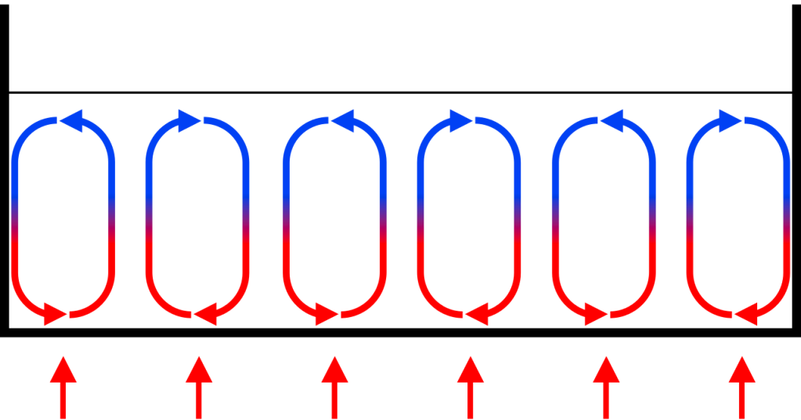](https://substackcdn.com/image/fetch/f_auto,q_auto:good,fl_progressive:steep/https%3A%2F%2Fsubstack-post-media.s3.amazonaws.com%2Fpublic%2Fimages%2F38a712f5-af96-4d8f-9f4d-5320809d23c0_1023x538.png)

In microgravity, there is no buoyancy to create this pattern. Similarly, particles don’t clump together and settle out of liquid in the same way.  

在微重力下，没有浮力来创造这种模式。同样，颗粒也不会以同样的方式聚集在一起并从液体中沉淀下来。  

Certain macroscopic physical processes are altered in ways that highlight these substantial mesoscopic differences.  

某些宏观物理过程的改变，突出了这些实质性的中观差异。  

Candles are a widely used example of this absence of natural convection—the height of a candle flame is a function of the convective processes that aren’t present in microgravity.  

蜡烛是这种缺乏自然对流的一个广泛使用的例子--蜡烛火焰的高度是微重力中不存在的对流过程的一个函数。

[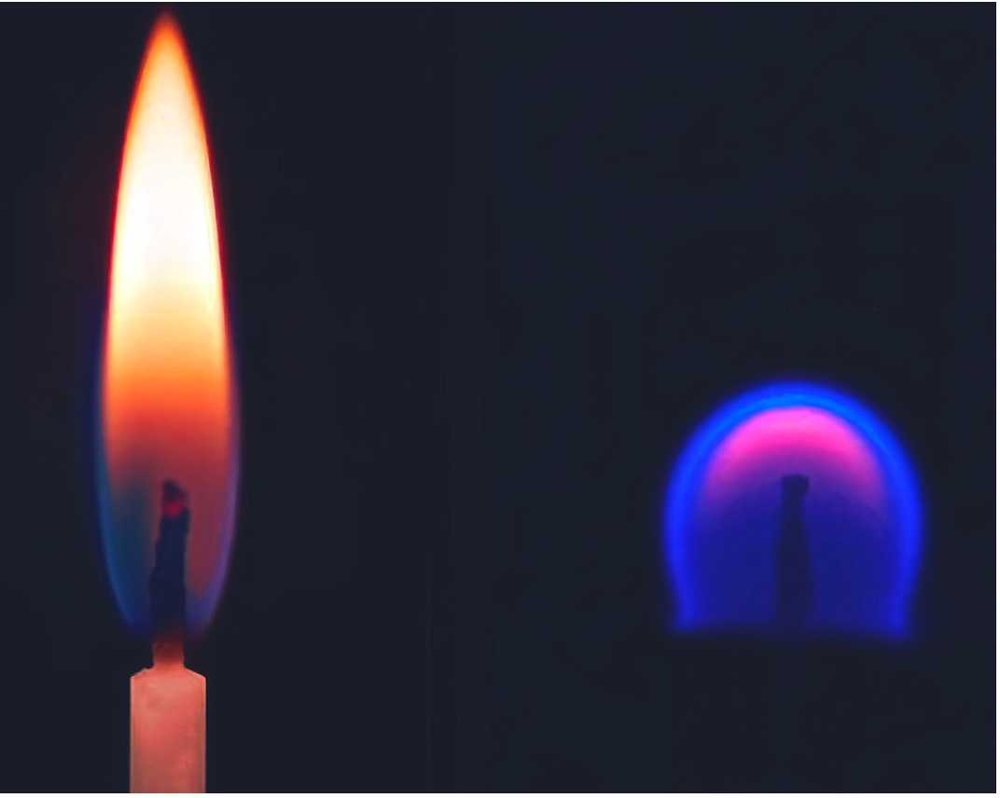](https://substackcdn.com/image/fetch/f_auto,q_auto:good,fl_progressive:steep/https%3A%2F%2Fsubstack-post-media.s3.amazonaws.com%2Fpublic%2Fimages%2Fe24f8073-9f27-4648-8c7a-f0c0691ae27b_1072x856.png)

_A flame in earth gravity (left) and microgravity (right)  

地球重力（左）和微重力（右）下的火焰_

Scientists have been taking advantage of these unique features of microgravity environments in space to create crystal structures of molecules.  

科学家们一直在利用太空中微重力环境的这些独特特征来创造分子的晶体结构。  

Crystallography is a central technique in the life sciences—it’s how we figured out the double helical structure of DNA and every single other molecular structure we’re currently aware of.  

晶体学是生命科学的一项核心技术--它是我们弄清DNA的双螺旋结构和我们目前所知的其他每一种分子结构的方式。  

Over the past few decades protein crystal growth (PCG) experiments have been “[by far the largest single category of experiments conducted on the orbiting lab](https://www.nasa.gov/mission_pages/station/research/station-science-101/Protein_Crystal_Growth_Experiments/)” of the ISS.  

在过去的几十年里，蛋白质晶体生长（PCG）实验是 "迄今为止在国际空间站的轨道实验室上进行的最大一类实验"。

_Current NASA Administrator checking the results of PCG experiments during his mission in 1986.  

美国国家航空航天局现任局长在1986年执行任务时检查PCG的实验结果。_

Early PCG experiments in space have produced remarkable results.  

早期的空间PCG实验已经产生了显著的结果。  

In 2017, Merck conducted a mission on the ISS to explore the crystal properties of Keytruda®, their blockbuster cancer drug, in microgravity.  

2017年，默克公司在国际空间站进行了一次任务，探索他们的大片癌症药物Keytruda®在微重力下的晶体特性。  

Whereas the drug crystallizes in a bimodal distribution of 13 and 102 μm particles in terrestrial gravity, it forms a homogeneous distribution of 39 μm particles in space.  The tight distribution of smaller particle sizes means that dosing patients correctly is much easier, so you can send them home with syringes they can self-administer, versus having to do IV dosing at the clinic every day.  

虽然药物在陆地重力下以13和102微米颗粒的双峰分布结晶，但它在太空中形成39微米颗粒的均匀分布。较小颗粒的紧密分布意味着正确地给病人用药要容易得多，所以你可以用他们可以自我管理的注射器把他们送回家，而不是每天都要在诊所做静脉注射。

This is just one axis of improvement for one antibody. **Doing crystallization in space is like adding a gravity knob to your instrument**—it opens up regions of process design space that would otherwise be inaccessible.  

Importantly, after the crystallization occurs in space, the drug retains its solid state upon re-entry. Manufacture in space; use on earth.   

重要的是，在太空中发生结晶后，药物在重返大气层时仍保持其固体状态。在太空中制造；在地球上使用。  

这只是一种抗体的一个改进轴。在太空中进行结晶就像在你的仪器上添加一个重力旋钮--它打开了否则无法进入的工艺设计空间。

This is why [pharma is going to space](https://cen.acs.org/pharmaceuticals/drug-development/Pharma-goes-space-drug-development/100/i40) to experiment with a wide range of medicines.  

Formulations made in microgravity could open the door to improvements in drug shelf life, bioavailability, IP expansion, and even better approaches to这就是为什么制药业要到太空中去试验各种药物。 [drug delivery](https://commons.erau.edu/space-congress-proceedings/proceedings-2003-40th/april-30-2003/13/).  

在微重力条件下制作的配方可以为药物保质期、生物利用度、IP扩展以及甚至更好的药物输送方法的改进打开大门。

For Paul Reichert at Merck, the [value proposition is clear](https://www.nasa.gov/mission_pages/station/research/benefits/crystallizing-proteins-helping-identify-treatments): “I think there are a lot of microgravity research opportunities and I am going to continue to try to encourage people in diverse scientific areas to think about how they could benefit and learn from doing microgravity research.”  

对于默克公司的Paul Reichert来说，价值主张很明确："我认为有很多微重力研究机会，我将继续努力鼓励不同科学领域的人思考他们如何从做微重力研究中获益和学习。"

To date, there has been a major disconnect between microgravity research and manufacturing.  

迄今为止，微重力研究和制造之间一直存在着重大的脱节。  

While it’s been possible to hitch a ride to the ISS and collaborate with NASA on PCG experiments, there is no existing commercial offering to actually manufacture drugs in space.  

虽然有可能搭上国际空间站的顺风车，并与美国宇航局合作进行PCG实验，但目前还没有在太空中实际制造药物的商业产品。  

Merck used their [research results](https://www.nature.com/articles/s41526-019-0090-3) on Keytruda® crystallization to tinker with their terrestrial approaches to formulation.  

What if they could actually just manufacture the crystals they discovered in microgravity at commercial scale?  

如果他们真的可以直接在商业规模上制造他们在微重力下发现的晶体呢？  

默克公司利用他们在Keytruda®结晶方面的研究成果来修补他们的陆上配方方法。

**This is Varda’s mission—to make widespread research and manufacturing in microgravity a reality.** Riding the wave of commoditized launches to space, Varda is building the infrastructure to manufacture valuable chemical matter in space in partnership with leading pharma companies, and solving the reentry problem needed to recover the results.  

这就是瓦尔达的使命--使微重力下的广泛研究和制造成为现实。乘着向太空发射商品的浪潮，瓦尔达正在建设基础设施，与领先的制药公司合作，在太空中制造有价值的化学物质，并解决回收成果所需的再入问题。

Between the plummeting launch costs and the dual-use nature of each mission, the actual cost of space manufacturing would pale in comparison to the revenue that could be generated from a very small amount of chemical matter.  

在急剧下降的发射成本和每项任务的双重用途之间，空间制造的实际成本与可以从极少量的化学物质中产生的收入相比，将显得微不足道。  

For context, the active pharmaceutical ingredient in most drugs—what Varda is focused on producing—is a miniscule proportion of the final drug product delivered to patients.   

就背景而言，大多数药物中的活性药物成分--瓦尔达专注于生产的东西--在交付给患者的最终药物产品中只占极小的一部分。

As Delian likes to point out, “**Two milk gallon jugs of mRNA would be sufficient for all of the Pfizer vaccine doses administered to date.**”   

正如德利安喜欢指出的那样，"两瓶牛奶加仑罐的mRNA将足以满足迄今为止所有辉瑞公司的疫苗剂量"。

Pfizer generated $76.4 billion in revenue from its COVID vaccine in 2021 and 2022. If you stacked all of that revenue in hundred dollar bills next to the milk jugs, they would reach 82 km above the earth’s surface, just below the Kàrmàn Line that marks the beginning of space.   

辉瑞公司在2021年和2022年从其COVID疫苗中获得了764亿美元的收入。如果你把所有这些收入用百元大钞堆放在牛奶罐旁边，它们将达到地球表面以上82公里，刚好低于标志着太空起点的卡姆线。

[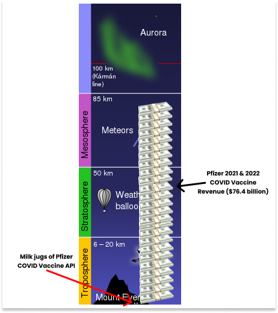](https://substackcdn.com/image/fetch/f_auto,q_auto:good,fl_progressive:steep/https%3A%2F%2Fsubstack-post-media.s3.amazonaws.com%2Fpublic%2Fimages%2Fdb7dce19-8fd5-4c53-9164-a230b50ada1a_462x519.png)

_Milk jugs not drawn to scale  

未按比例绘制的牛奶罐_

**With these characteristics, it’s hard to think of a better minimum viable product for space manufacturing.  

有了这些特点，很难想象有什么更好的最小可行产品可以用于空间制造。**

While _The Case for Space_ inspired Delian to start Varda, Zubrin was actually too conservative in his estimates around pharmaceutical manufacturing.  

Even at $5,000/kg launch costs, Varda can build a profitable business. Zubrin missed a few things.   

即使是5000美元/公斤的发射成本，瓦尔达也可以建立一个有利可图的业务。祖布林错过了一些事情。  

虽然《太空案例》启发了德利安创办瓦尔达公司，但祖布林围绕医药制造的估计实际上过于保守。

First, the **dual use** nature of the business means that the DoD will cover a healthy portion of the costs of each flight on which they rideshare, effectively bringing down Varda’s out-of-pocket cost to manufacture drugs.   

首先，该业务的双重用途性质意味着国防部将承担他们乘坐的每架航班的一部分费用，有效地降低了瓦尔达制造药物的自付费用。

Second, **the API in drugs can be much more valuable per kg than Zubrin gave them credit for**.  

Pfizer’s COVID vaccine is an extreme example, but there are a number of small molecules that fetch hundreds of thousands or millions of dollars per kg, more than covering all of the launch and manufacturing costs:  

辉瑞公司的COVID疫苗是一个极端的例子，但也有一些小分子药物每公斤能卖到几十万或几百万美元，超过了所有的上市和生产成本：  

第二，药物中的原料药每公斤的价值可能比祖布林给它们的评价要高得多。

To start, Varda is focusing on the identification of new polymorphs for small molecules. Over time, they are going to expand their [platform offerings](https://varda.com/wp-content/uploads/varda-info-sheet-mar23_pharmaceutical.pdf) to support microgravity crystallization of larger molecules like Keytruda®. These drugs can fetch even higher prices per kg, reaching into the **hundred-billion/kg range** in one example:   

开始时，Varda专注于识别小分子的新多晶体。随着时间的推移，他们将扩大其平台产品，以支持像Keytruda®这样的大分子的微重力结晶。这些药物可以获得更高的每公斤价格，在一个例子中达到了千亿/公斤的范围：

Zubrin’s 40 ton target of the API in Blincyto, a leukemia immunotherapy drug, would be worth **$4.5 quadrillion**.  

Obviously, that’s absurd – there isn’t demand for 40 tons of Blincyto and the world’s economy couldn’t support the cost if there were – but it serves to illustrate just how much value pharmaceutical APIs can pack into each kg.  

显然，这很荒谬--没有对40吨Blincyto的需求，如果有的话，世界经济也无法支持这一成本--但这可以说明，每一公斤的医药原料药可以包含多少价值。  

They can be worth far, far more than their weight in gold.  

它们的价值可能远远超过其黄金的重量。  

祖布林的40吨目标是白血病免疫治疗药物Blincyto中的原料药，这将价值4.5万亿美元。

Third, and critically, because Varda is the only company that can manufacture pharmaceuticals in microgravity, it can **command economics in-line with cutting-edge platform companies**, including upfront payments worth millions and “bio-bucks” – milestone payment and royalties – that **could reach tens or hundreds of millions of dollars depending on the success of the drug**.   

第三，也是最关键的一点，因为Varda是唯一一家能够在微重力条件下生产药品的公司，它可以获得与尖端平台公司一致的经济效益，包括价值数百万的预付款和 "生物钱"--里程碑付款和版税--根据药物的成功，可以达到数千或数亿美元。

[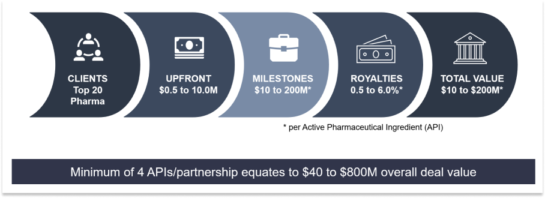](https://substackcdn.com/image/fetch/f_auto,q_auto:good,fl_progressive:steep/https%3A%2F%2Fsubstack-post-media.s3.amazonaws.com%2Fpublic%2Fimages%2F32597987-ff3d-4bb7-b0ba-0ad2bb9d6359_908x330.png)

_Varda Internal Deck 瓦尔达内部甲板_

Over time, as Varda scales and manufactures more drugs, it’s likely it will adopt a fee-for-service model that locks in significant upfront revenue at the expense of upside, but for now, it’s able to share in the success it helps create.  

随着时间的推移，随着Varda规模的扩大和生产更多的药物，它很可能会采用收费服务模式，以牺牲上升空间为代价锁定大量的前期收入，但现在，它能够分享它帮助创造的成功。  

And like a good platform company, Varda might one day decide to take advantage of its own technology and start bringing drugs to market itself.   

像一个好的平台公司一样，瓦尔达可能有一天会决定利用自己的技术优势，开始自己将药物推向市场。

Taken together, Varda has the ingredients to build a profitable business early in its life, which is insane when you remember that we’re talking about **manufacturing drugs in space**. But that’s the point.  

Delian has repeatedly stated that in order for humanity to expand beyond our planet, we need to do it like the Portuguese did, in a way that makes economic sense and incentivizes further expansion using the oldest trick in the book: money.   

德利安多次表示，为了让人类向地球以外的地方扩张，我们需要像葡萄牙人那样做，以一种具有经济意义的方式，利用书中最古老的伎俩激励进一步扩张：金钱。  

综合来看，瓦尔达具备了在其生命早期建立一个盈利企业的要素，当你记得我们正在谈论在太空中制造药物时，这是很疯狂的。但这就是问题的关键。

Start with high-value pharmaceuticals, then slowly expand as costs come down and space industrializes, until we can manufacture every material sensitive to the entropy caused by gravity in space.   

从高价值的药品开始，然后随着成本的降低和太空工业化而慢慢扩大，直到我们能够制造对太空中重力造成的熵敏感的每一种材料。

On paper, it makes a lot of sense. But first, Varda needs to prove it can do it.  

从纸面上看，它有很大的意义。但首先，瓦尔达需要证明它能做到这一点。

At 2:19pm PST this afternoon, a SpaceX Falcon 9 rocket will take off from Vandenberg Space Force Base in California. This isn’t so unique in and of itself.  

北京时间今天下午2点19分，SpaceX的猎鹰9号火箭将从加州范登堡空军基地起飞。这本身并不那么独特。  

SpaceX has completed 238 total launches to date, and these days, it does about two launches every week.   

迄今为止，SpaceX已经完成了238次总发射，这些天，它每周大约进行两次发射。

What’s unique about _this_ launch, the Transporter-8 Mission, is that for the first time, it will be bringing a standalone commercial space factory up with it.   

这次发射，即Transporter-8任务的独特之处在于，它将首次把一个独立的商业空间工厂带上去。

You can watch the launch live on YouTube this afternoon when the launch window opens at 2:19pm PT:   

今天下午，当发射窗口在太平洋时间下午2:19打开时，你可以在YouTube上观看发射实况：

<iframe src="https://www.youtube-nocookie.com/embed/zO3luySkHQU?rel=0&amp;autoplay=0&amp;showinfo=0&amp;enablejsapi=0" loading="lazy" gesture="media" allow="autoplay; fullscreen" allowautoplay="true" allowfullscreen="true" width="728" height="409" frameborder="0"></iframe>

**Varda’s focus for this first flight will be on successfully re-entering the atmosphere and deploying parachutes for a safe landing in the Utah desert.** Its second priority will be running tests on ritonavir, an HIV/AIDS treatment from the 1990s that needed to be reformulated because of stability issues related to the crystalline form of the drug.  

Showing that microgravity would have helped AbbVie avoid the need to reformulate Ritonavir would be a cherry on top, but as long as that capsule lands safely in Utah in mid-July, the first flight will be a success.   

显示微重力会帮助艾伯维公司避免重新配制利托那韦的需要，这将是一颗樱桃，但只要该太空舱在7月中旬安全降落在犹他州，首次飞行将是成功的。  

瓦尔达这次首次飞行的重点将是成功重返大气层并展开降落伞，在犹他州沙漠中安全着陆。它的第二个优先事项将是对利托那韦进行测试，这是一种20世纪90年代的艾滋病毒/艾滋病治疗药物，由于与药物的结晶形式有关的稳定性问题，需要重新配制。

Here’s what to expect between now and July.   

以下是从现在到7月之间的预期。

The launch window for SpaceX’s Transporter-8 million will open at 2:19pm PST this afternoon. The launch process will take 38 minutes total.  

SpaceX的Transporter-8百万的发射窗口将在北京时间今天下午2点19分打开。发射过程将总共需要38分钟。  

With 3 seconds left, the engine ignition sequence starts. Then… liftoff.   

还剩3秒时，发动机点火程序开始。然后...升空。

One hour and 22 minutes into the flight, the payload, including Varda’s satellite and capsule, separates and begins its orbit around planet earth.   

飞行1小时22分钟后，包括瓦尔达的卫星和太空舱在内的有效载荷分离，开始绕地球轨道飞行。

[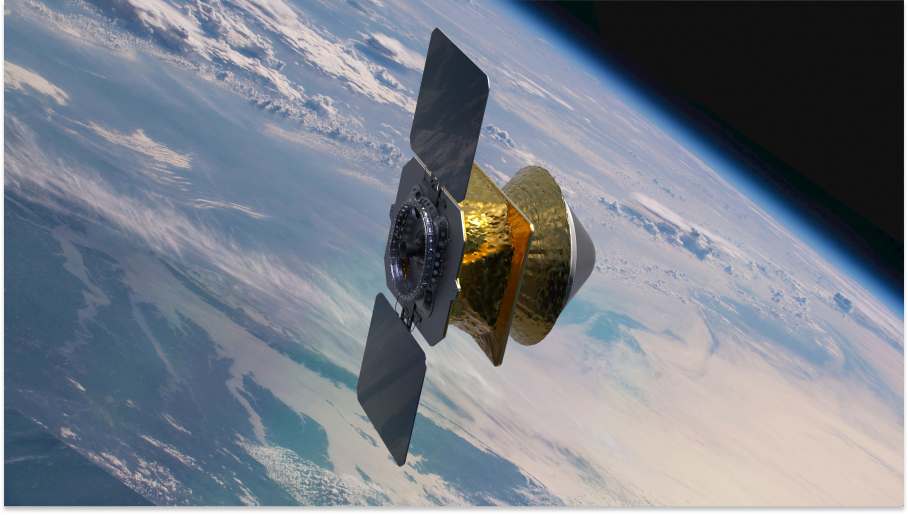](https://substackcdn.com/image/fetch/f_auto,q_auto:good,fl_progressive:steep/https%3A%2F%2Fsubstack-post-media.s3.amazonaws.com%2Fpublic%2Fimages%2Fbd51fcab-7dad-4f23-ac21-2cbdcf9c0bf5_908x515.png)

Varda’s spacecraft will orbit for a little over a month.  

瓦尔达的航天器将在轨道上运行一个多月。  

This orbit will be longer than future orbits because it will be testing its systems for the first time, which will take the first week or so.  

这条轨道将比未来的轨道更长，因为它将首次测试其系统，这将需要第一周左右的时间。  

It will then run tests on ritonavir for another week or so – heating it up and cooling it down to let the crystals snap into place.   

然后，它将对利托那韦再进行一周左右的测试--将其加热和冷却，以让晶体扣入。

[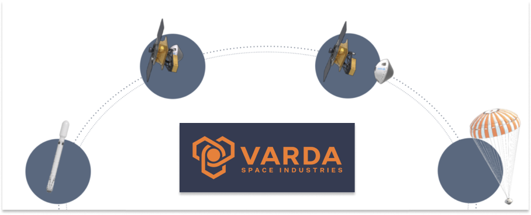](https://substackcdn.com/image/fetch/f_auto,q_auto:good,fl_progressive:steep/https%3A%2F%2Fsubstack-post-media.s3.amazonaws.com%2Fpublic%2Fimages%2F081e36f3-ccd5-44fb-8b15-6af83eaff466_908x369.png)

Once the tests are complete, the spacecraft will orbit the earth while it waits for its re-entry window, which begins on July 17th.  

一旦测试完成，航天器将在地球轨道上运行，同时等待7月17日开始的再入窗口。  

Re-entry is a complicated dance to orchestrate, involving the FAA, the US Air Force (on whose Utah Test and Training Range the capsule will land), and the spacecraft’s position in orbit.   

再入大气层是一个复杂的安排，涉及联邦航空局、美国空军（太空舱将在其犹他州测试和训练场降落）和航天器在轨道上的位置。

On re-entry day, when the spacecraft is 1,150 km above Greenland, it will ignite its booster in the opposite direction of its orbit in order to slow down enough to fall out of orbit, or “deorbit.” At 500 km above the earth, somewhere over Canada, the capsule will separate from the satellite bus and begin its rapid descent down to the earth’s surface.   

在重返大气层那天，当航天器在格陵兰岛上空1150公里处时，它将在与其轨道相反的方向点燃其助推器，以便减速到足以脱离轨道，或 "脱离轨道"。在地球上空500公里处，即加拿大上空某处，太空舱将与卫星总线分离，并开始快速下降到地球表面。

[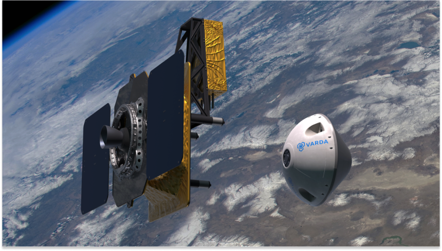](https://substackcdn.com/image/fetch/f_auto,q_auto:good,fl_progressive:steep/https%3A%2F%2Fsubstack-post-media.s3.amazonaws.com%2Fpublic%2Fimages%2F98001ae1-b6a7-4619-9e09-d7182f95460c_908x515.png)

As it tumbles from the sky, **it will reach speeds over Mach 25, or 19,000 miles per hour**. As it hits thicker and thicker atmosphere, the capsule will stabilize and decelerate. At its peak, it will experience a **12 g deceleration**.   

当它从空中翻滚时，它的速度将达到25马赫以上，或每小时19,000英里。当它遇到越来越厚的大气层时，太空舱将稳定下来并减速。在其高峰期，它将经历12克的减速。

The capsule will maintain hypersonic speeds (above Mach 5) until it’s 40 km above the earth and then slow to a leisurely 75 m/s at an altitude of 10 km.  

太空舱将保持高超音速（5马赫以上），直到离地球40公里，然后在10公里的高度放慢到75米/秒的休闲速度。  

Then it will deploy its parachutes and float down to the desert ground at 5 m/s until it lands safely on the Utah Test and Training Range.  

然后它将展开降落伞，以5米/秒的速度飘落到沙漠地面，直到安全降落在犹他州的测试和训练场。

[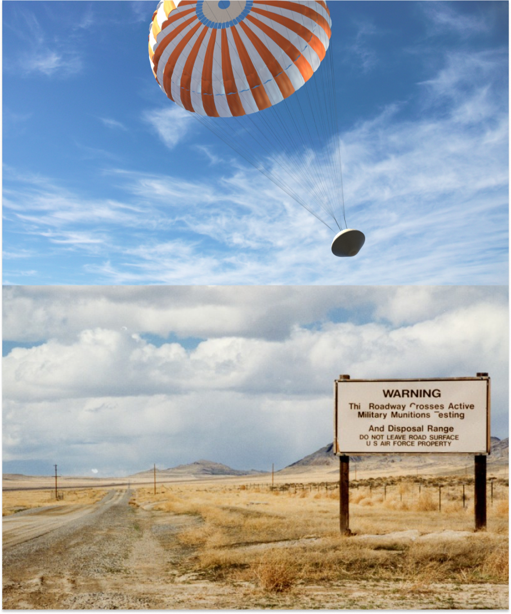](https://substackcdn.com/image/fetch/f_auto,q_auto:good,fl_progressive:steep/https%3A%2F%2Fsubstack-post-media.s3.amazonaws.com%2Fpublic%2Fimages%2F8c28f484-08d9-43f5-b205-74d7c50a198a_908x1090.png)

Once the capsule has landed, it will be recovered by military personnel and returned to Varda for post-flight testing and analysis.   

一旦太空舱着陆，它将由军事人员回收并返回瓦尔达进行飞行后的测试和分析。

If Varda is successful on this first mission, it will unlock the next stage of the company’s life.  

如果瓦尔达在这第一次任务中获得成功，它将开启公司的下一个阶段的生活。  

It is scheduled to fly its second mission later this year, and success in July would mean that it will be able to fly that mission with both commercial and government partners and begin generating real revenue.  

它计划在今年晚些时候进行第二次飞行任务，7月份的成功将意味着它将能够与商业和政府伙伴一起飞行该任务，并开始产生真正的收入。  

Failure on mission one would turn mission two into another demo mission.   

任务一的失败将使任务二变成另一个演示任务。

But let’s assume success for now. With a successful mission under its belt, what does the future hold for Varda and the space economy?  

但现在让我们假设成功。有了一次成功的任务，瓦尔达和太空经济的未来会怎样？

Today is **Day 874** in Varda’s journey, and it’s an incredibly important one.   

今天是瓦尔达旅程中的第874天，这是一个极其重要的日子。

In a few decades from now, we may look back on today as one of the key turning points in our species’ history in space.  

几十年后，我们可能会回顾今天，认为这是我们人类在太空历史上的关键转折点之一。  

By the time we go to sleep tonight, the world’s first commercial space factory will likely be orbiting around our planet.   

当我们今晚入睡时，世界上第一个商业太空工厂将可能围绕我们的星球运行。

But it’s just the first step in the pursuit of the company’s mission to **expand the economic bounds of humankind**.   

但这只是该公司追求扩大人类经济边界的使命的第一步。

Achieving that mission will take decades or longer. The universe is a very large place. But the company’s goal for the next few years is clear: make space manufacturing routine.   

实现这一任务将需要几十年或更长时间。宇宙是一个非常大的地方。但该公司未来几年的目标很明确：使太空制造成为常规。

Later this year, Varda plans to launch its first live mission with a pharma partner onboard.  

今年晚些时候，Varda计划启动其首个有制药业合作伙伴加入的实战任务。  

Next year, it will fly the first flight in its STRATFI program while continuing to sign pharma contracts and work with customers to identify which drugs to test and manufacture.  

明年，它将在其STRATFI计划中进行首次飞行，同时继续签署制药合同，并与客户合作，确定哪些药物需要测试和生产。  

The sweet spot is drugs that benefit the most from microgravity and have the highest commercial potential.   

甜蜜点是那些从微重力中受益最多且具有最高商业潜力的药物。

Certainly, Varda will face competition. As it stands today, there are companies [performing commercial pharmaceutical research on the ISS](https://cen.acs.org/pharmaceuticals/drug-development/Pharma-goes-space-drug-development/100/i40), and others, like Redwire, have plans to do large-scale manufacturing in microgravity.   

当然，瓦尔达将面临竞争。就目前而言，有公司在国际空间站上进行商业制药研究，还有一些公司，如Redwire，计划在微重力条件下进行大规模生产。

But if Varda is successful on this first mission, it’s going to have a very large head start.  

但是，如果瓦尔达在这第一次任务中获得成功，它将有一个非常大的先机。  

Already, it’s built the most sophisticated team in the space, hiring up one of the scarcest resources in the space: ex-SpaceX engineers.  

它已经建立了该领域最先进的团队，雇佣了该领域最稀缺的资源之一：前SpaceX的工程师。  

It would be very difficult for another company to build up the capabilities that Varda has in just over two years.   

其他公司很难在短短两年多的时间内建立起瓦尔达的能力。

So many companies will look to outsource certain capabilities by working with commercial stations that companies like Blue Origin, Northrop Grumman, and Nanoracks have in the works.  

因此，许多公司将通过与蓝色起源、诺斯罗普-格鲁曼和Nanoracks等公司的商业站合作，寻求外包某些能力。  

They’ll find challenges there, as well. Orbital Reef, a collaboration between Blue Origin, Sierra Space, Boeing, and Amazon, among others, will have capacity for up to ten crew.  

他们在那里也会发现挑战。轨道礁是蓝色起源、塞拉空间、波音和亚马逊等公司的合作项目，将有能力容纳多达10名船员。  

Because it’s important to keep them alive in the harsh conditions of space, astronauts are among the most expensive people in the world to employ.  

因为在恶劣的太空条件下保持他们的生命很重要，所以宇航员是世界上最昂贵的雇佣人员之一。  

It will be difficult for crewed commercial stations to compete with Varda on cost, although crewed stations will be excellent for research on humans.   

载人商业站将很难在成本上与瓦尔达竞争，尽管载人站对人类的研究是非常好的。

If competitors are able to successfully manufacture in space, they’ll run into the same speed bumps that Varda has in getting FAA approval for sending products back down.  

如果竞争者能够成功地在太空生产，他们将遇到瓦尔达在获得联邦航空局批准将产品送回地面时遇到的同样的障碍。  

Early in the company’s life, Varda hired Eric’s ex-Zipline colleague, [Dan Czerwonka](https://www.linkedin.com/in/dan-czerwonka-003b56135/), as General Counsel to head up regulatory affairs, and under his guidance, the company is likely to get through the FAA’s new reentry regime, [Part 450](https://www.ecfr.gov/current/title-14/chapter-III/subchapter-C/part-450). Here, too, the company has a head start.   

在公司成立之初，Varda聘请了Eric的前Zipline同事Dan Czerwonka担任总法律顾问，负责监管事务，在他的指导下，公司有可能通过FAA的新再入境制度，即第450部分。在这方面，该公司也有一个先机。

What Varda does with that head start will make all the difference. And given the architecture of Varda’s business – the fact that it works so well for both government _and_ commercial customers – Varda can build its lead with each flight.  

瓦尔达如何利用这一领先优势，将使一切变得不同。鉴于Varda业务的架构--它为政府和商业客户都能很好地工作--Varda可以在每次飞行中建立其领先地位。

As the pace of launches picks up, Varda will work to drive down the cost of each flight across a number of fronts:  

随着发射步伐的加快，瓦尔达将努力从多个方面降低每次飞行的成本：

-   **Vertical integration**. As Varda launches more frequent missions, it will make sense to leverage the skills of its engineering team and build more of the spacecraft’s components in-house.  
    
    垂直整合。随着瓦尔达发射更频繁的任务，利用其工程团队的技能并在内部建造更多的航天器部件将是有意义的。
    
-   **Reusable reentry capsules**. Varda will use the flight data it gets back on its first flights to make capsules that take down less product but are stronger and reusable.   
    
    可重复使用的再入舱。瓦尔达公司将利用它在首次飞行中得到的飞行数据，制造出拿下来的产品较少但更坚固和可重复使用的胶囊。
    
-   **More permanent manufacturing equipment.** Over time, Varda will develop manufacturing equipment that looks less like a satellite and more like a space station.  
    
    That will come with its own challenges – docking, maintenance, refueling, and propulsion among them – but can lower costs while allowing for more sophisticated manufacturing processes.  
    
    这将带来其自身的挑战--对接、维护、加油和推进等，但可以降低成本，同时允许更复杂的制造工艺。  
    
    更加永久性的制造设备。随着时间的推移，瓦尔达将开发出不像卫星而更像空间站的制造设备。
    
-   **Ride the launch cost curve**. As Starship comes online and Varda books rides in bulk, it should be able to dramatically lower its launch costs.   
    
    乘坐发射成本曲线。随着星际飞船的上线和瓦尔达大量预订乘务，它应该能够大幅降低发射成本。
    

All-in, Varda expects that it will be able to **decrease its bill of materials (BOM) by over 90% in the coming years**.   

综上所述，Varda预计在未来几年内，它将能够将材料清单（BOM）减少90%以上。

Lower costs and more frequent launches set Varda’s flywheel spinning even more rapidly. The DoD will be able to purchase more reentry-as-a-service rideshares.  

更低的成本和更频繁的发射使瓦尔达的飞轮旋转得更快。国防部将能够购买更多的重返大气层即服务的乘员。  

The number of pharmaceuticals that make economic sense in space will grow.  

在太空中具有经济意义的药品的数量将增加。  

When space manufacturing becomes cheap enough, pharma companies may opt to manufacture drugs for which the benefits of microgravity are moderate but non-negligible, even as Varda develops the capabilities to partner on higher-value large molecules and biologics.   

当太空制造变得足够便宜时，制药公司可能会选择制造微重力效益适中但不可忽视的药物，即使瓦尔达开发出合作生产更高价值的大分子和生物制品的能力。

At that point, Varda will start to resemble a mix between terrestrial contract manufacturing and platform companies, but in space, with satellites and permanent manufacturing facilities heating, cooling, and crystallizing all manner of drugs, practically on-demand.  

到那时，Varda将开始类似于陆地合同制造和平台公司之间的混合体，但在太空中，由卫星和永久性制造设施对各种药物进行加热、冷却和结晶，实际上是按需进行的。  

Like a fast-growing industrial town, the sky will be dotted with factories.   

就像一个快速发展的工业城市，天空中会有很多工厂。

[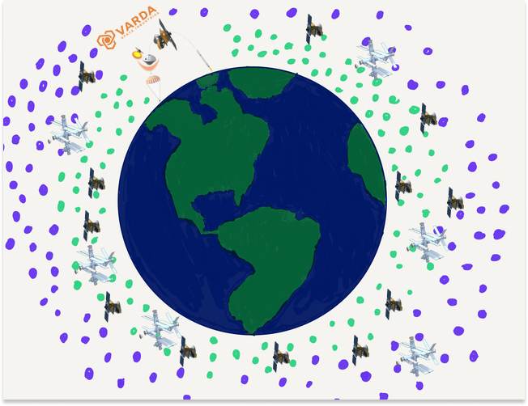](https://substackcdn.com/image/fetch/f_auto,q_auto:good,fl_progressive:steep/https%3A%2F%2Fsubstack-post-media.s3.amazonaws.com%2Fpublic%2Fimages%2Fd935aa5a-b387-4126-8191-71d2c380db24_652x502.png)

When the Portuguese first ventured out into the Atlantic Ocean during the Age of Discovery, they too dealt in items that packed a lot of value into each kg, trading beads, spices, textiles, and horses for gold.  

当葡萄牙人在 "大发现 "时代首次涉足大西洋时，他们也在交易每公斤价值不菲的物品，用珠子、香料、纺织品和马匹换取黄金。  

Today, six centuries later, even the least valuable trinkets travel across the seas on ships built to carry commerce across the globe.   

六个世纪后的今天，即使是最不值钱的小饰品也会在为运送全球商业而建造的船上漂洋过海。

If Varda is wildly successful, it too will facilitate the manufacture and trade of increasingly low-value-per-weight items as space manufacturing becomes just another thing that humans do.  

如果Varda取得了巨大的成功，它也将促进越来越多的低价值物品的制造和贸易，因为太空制造只是人类做的另一件事。  

Next up will likely be the other items on Zubrin’s list – fiber-optics and semiconductors made in space for use on earth.  

接下来可能是祖布林清单上的其他项目--在太空中制造的光纤和半导体在地球上使用。  

Advanced materials, organs, and all manner of things that inventive people dream up with a gravity knob at their disposal may come next.   

接下来可能会出现先进的材料、器官，以及富有创造力的人用一个重力旋钮所梦想的各种东西。

As humanity travels off of earth to Mars, asteroids, the moons of Jupiter and Saturn, and beyond, it will seem quaint and silly that for millennia, we only knew how to make things on our home planet’s surface.  

当人类离开地球前往火星、小行星、木星和土星的卫星以及更远的地方时，我们会发现，几千年来，我们只知道如何在我们的母星表面制造东西，这似乎很古怪和愚蠢。  

“Space manufacturing,” one day, will just be called “manufacturing.” Humanity’s economic bounds will be contained only by the percentage of light speed we’re able to capture.   

"太空制造"，有一天，将仅仅被称为 "制造"。人类的经济界限将只被我们能够捕获的光速的百分比所限制。

But that day is many years away. Today, let’s just marvel at the fact that we figured out how to fly and operate space factories. **Ad fabricas inter stellas.**  

但是那一天已经过去很多年了。今天，让我们赞叹一下我们想出了如何飞行和操作太空工厂的事实。Ad fabricas inter stellas.

_Thanks to [Elliot](https://twitter.com/ElliotHershberg) for writing this with me, to Delian, Will, Eric, Adrian, and the Varda team for helping us get up to speed, and to [Dan](https://twitter.com/damccormick13) for editing.  

感谢埃利奥特和我一起写这篇文章，感谢德利安、威尔、埃里克、阿德里安和瓦尔达团队帮助我们取得进展，并感谢丹的编辑。_

That’s all for today. We’ll be back in your inbox on Friday for the Weekly Dose and we’ll be back on the summer schedule next **Tuesday.**  

今天就到此为止。我们将于周五在您的收件箱中推出 "每周一剂"，我们将于下周二恢复夏季日程。

Thanks for reading, 谢谢你的阅读、

Packy  驮着的人
