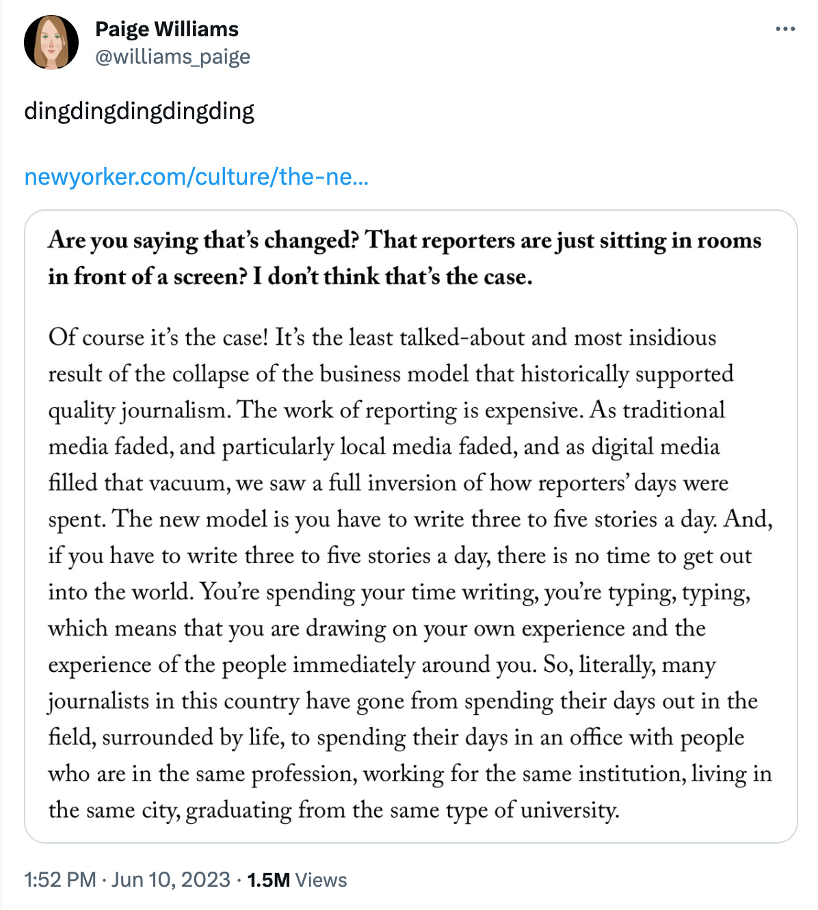
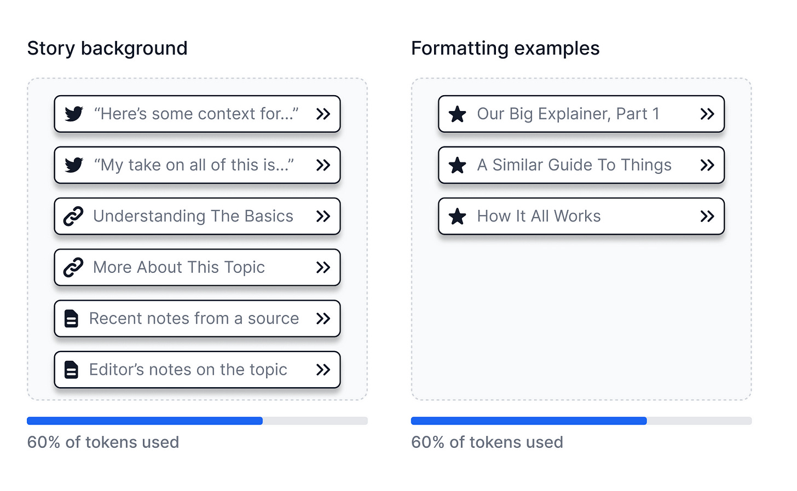
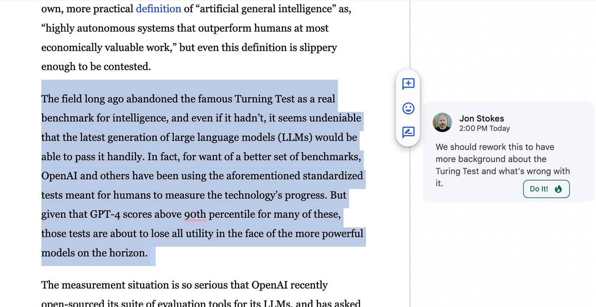
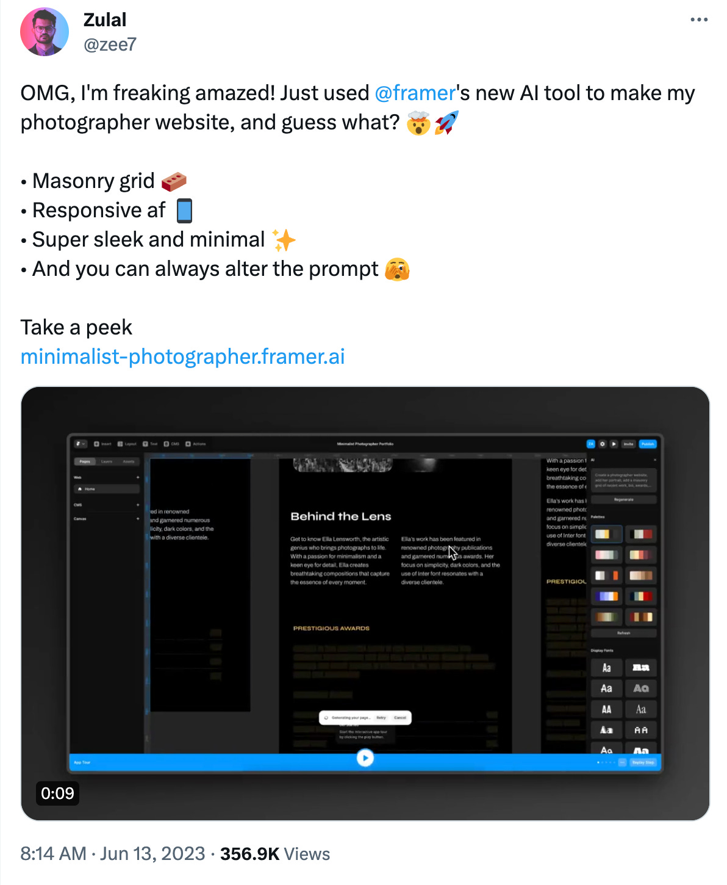

_**Housekeeping note:** I’m still working on the follow-up to my [most recent post on RLHF](https://www.jonstokes.com/p/catechizing-the-bots-part-2-reinforcement) — basically a close look at the **preference model** that acts as a proxy for the tastes and morals of a group of model humans.  

But instead of pushing that out, today, I want to pause for a brief rant about a topic I know well: the news.  

但是，今天我不想把这些东西推出去，而是想暂停一下，对一个我熟悉的话题进行简短的咆哮：新闻。  

内务说明：我仍在为我最近关于RLHF的帖子做后续工作--基本上是仔细研究作为一群模型人类的品味和道德的代表的偏好模型。_

_People think AI is going to destroy what’s left of the media. But I honestly think it could play a role in saving the media, and with it maybe even our civilization.  

人们认为人工智能会摧毁媒体的剩余部分。但我真诚地认为，它可以在拯救媒体方面发挥作用，甚至可以拯救我们的文明。  

What I describe in this piece won’t fix the [bad incentives](https://www.jonstokes.com/p/web3-the-rise-of-the-aligned-web) that are [destroying our ability](https://www.jonstokes.com/p/segmentation-faults-how-machine-learning) to do collective sense-making in the age of outrage, but it would open up the news reporting process to more people and improve the quality of the stories we’re able to tell given the current time and budget constraints the media operates under.  

我在这篇文章中所描述的，不会解决那些破坏我们在愤怒时代进行集体理智思考能力的不良激励机制，但它会向更多人开放新闻报道过程，并在目前媒体运作的时间和预算限制下，提高我们所能讲述的故事的质量。_

_I’ve found myself trying to make this “AI can save the news” pitch to people IRL, so here’s my attempt to get most of the ideas down in one place for future reference.  

我发现自己一直在努力向人们宣传 "人工智能可以拯救新闻"，所以我试图在这里把大部分的想法记录下来，供以后参考。_

➡️➡️➡️ _If you like this post & you’re on Substack,_ **please consider restacking it**_._ 🙏  

➡️➡️➡️ 如果你喜欢这个帖子并且你在Substack上，请考虑重新打包。🙏

There is a lot that AI can do for the teams of humans who make a living by helping the public maintain current, reasonably useful mental models of various corners of our collective reality.  

人工智能可以为那些以帮助公众维持我们集体现实的各个角落的现有的、合理有用的心理模型为生的人类团队做很多事情。  

I’m talking, of course, about the profession formerly known as “journalism,” a profession with origins in the era of print and broadcast that is lately in such sorry shape that it may be best if we just move on from it entirely and start thinking more abstractly in terms of a labor market for **real-time collaborative sense-making** labor.  

当然，我说的是以前被称为 "新闻 "的职业，这个职业起源于印刷和广播时代，最近的状况非常糟糕，我们最好是完全放弃它，开始更抽象地思考实时协作意义上的劳动市场。

There’s so much real-time sense-making tooling that needs to be built on top of the current generation of AI models, and I feel like I know what some of this tooling should look like, so in this piece, I’m going to describe it.  

有太多的实时感知工具需要建立在当前一代人工智能模型之上，我觉得我知道其中一些工具应该是什么样子的，所以在这篇文章中，我将描述它。  

If I could snap my fingers, I would have all of the things in this piece, and then I’d build a next-generation story factory out of them.  

如果我可以弹指一挥间，我就会拥有这篇作品中的所有东西，然后用它们建立一个下一代的故事工厂。

📜 In this post, I’ll walk you through the process of how our legacy sense-making apparatus gets its material (i.e. the “news story”) out to the public.  

在这篇文章中，我将带领大家了解我们的传统意义上的机器如何将其材料（即 "新闻故事"）传播给公众的过程。  

Then I’ll explain how a little soft prompting and some API calls can turn that whole process into something that’s far more accessible to non-specialists and more responsive to the needs of the digital era.  

然后，我将解释如何通过一点软提示和一些API调用，将整个过程变成非专业人士更容易获得的东西，并更能满足数字时代的需求。  

Finally, I’ll beg for people to put front-ends over these API calls so I can give them my money and start using this.  

最后，我将乞求人们在这些API调用上安装前端，这样我就可以把钱给他们，开始使用这个。

If you decide to build something based on any of the ideas in this piece, please get in touch with me. I may be working on some of it myself, so it’s possible we could collaborate.  

如果你决定根据这篇文章中的任何想法来建造一些东西，请与我联系。我自己可能也在做其中的一些工作，所以我们有可能进行合作。  

Or, I could potentially connect you with investment capital and potential cofounders and/or employees.  

或者，我有可能为你联系投资资本和潜在的联合创始人和/或雇员。

Before I can get into what an AI-powered sense-making hub (a “newsroom” in legacy speak) might look like, I need to provide some background knowledge on the process of taking a story from a pitch or assignment all the way to a finished product.  

在我讨论人工智能驱动的感知中心（用传统说法就是 "新闻编辑室"）可能是什么样子之前，我需要提供一些背景知识，说明把一个故事从投稿或任务一直带到成品的过程。

🗞️ What follows is the core process that most newsrooms take a story through, with the steps listed in roughly chronological order.  

🗞️ 以下是大多数新闻编辑室处理一个故事的核心过程，这些步骤大致按时间顺序排列。  

Sometimes this process plays out over weeks or months, or sometimes over mere tens of minutes. Some parts of this are skipped, or maybe they’re rolled into other parts.  

有时这个过程会持续数周或数月，有时只需数十分钟。其中有些部分被跳过，或者可能被卷进其他部分。  

But in general, news production in the age of the internet looks a lot like this:  

但一般来说，互联网时代的新闻生产看起来很像这样：

1.  **Reporting**: Gathering facts, working sources, understanding what’s going on and framing that as a story.  
    
    报道：收集事实，利用消息来源，了解正在发生的事情，并将其作为一个故事的框架。
    
2.  **Drafting**: Assembling the output of step 1 into a structured blob of text and images that readers can consume and that publishers can sell ads or subscriptions against.  
    
    起草：将第1步的输出组装成文本和图像的结构化圆球，让读者可以消费，让出版商可以出售广告或订阅。
    
3.  **Content edits**: Direction from an editor about what should and shouldn’t be in the draft, how the draft should be organized, the angle and positioning, voice, and other high-level feedback.  
    
    A story will often move back and forth between this step and the draft step as it gets iteratively refined.  
    
    一个故事往往会在这个步骤和草稿步骤之间来回移动，因为它得到了反复的完善。  
    
    内容编辑：编辑对草案中应该和不应该出现的内容进行指导，草案应该如何组织，角度和定位，声音和其他高级反馈。
    
4.  **Line edits**: Rewriting some of the language in the draft so that it flows better.  
    
    行文编辑：改写草案中的一些语言，使其更加流畅。
    
5.  **Copy edits**: Fixing typos, misspellings, and other minor errors.  
    
    文本编辑：修正错别字、拼写错误和其他小错误。
    
6.  **Art:** The main element added in this step is the hero image (or feature image) — that big image at the top of the article that’s featured in the social promo and that makes people click.  
    
    But many articles will have other art, like other images for specific sub-headings.  
    
    但许多文章会有其他艺术，如特定的小标题的其他图像。  
    
    艺术：这一步中添加的主要元素是英雄图（或特征图）--文章顶部的那张大图，它在社会宣传中占有重要地位，让人们点击。
    
7.  **Production**: Adding pull quotes, sidebars, special content units like spec/feature lists, and other formatting and visual elements.   
    
    生产：添加引言、侧边栏、特殊内容单元，如规格/功能列表，以及其他格式和视觉元素。
    
8.  **Headline** and excerpt: Every news org you’ve ever heard of has a dedicated process of some type for generating clickable headlines and excerpts that go in OpenGraph descriptions on social media, a process that may or may not even involve the reporter who wrote the story.  
    
    (If a news org doesn’t take this seriously enough to have resources dedicated to it, then that’s at least one reason you haven’t heard of them.)   
    
    (如果一个新闻机构没有认真对待这个问题，没有专门的资源，那么这至少是你没有听说过他们的一个原因）。  
    
    标题和摘录：你听说过的每一个新闻机构都有一个专门的流程，用于生成可点击的标题和摘录，并将其放在社交媒体的OpenGraph描述中，这个流程甚至可能不涉及撰写故事的记者。
    
9.  **Scheduling**: The story has to run at a certain time, depending on the news flow that day and what else is on the calendar. Timing is extremely critical for all stories.  
    
    Nailing a window of a few hours can make the difference between a viral grand slam and something nobody read.  
    
    钉住几个小时的窗口可以使病毒性大满贯和无人阅读的东西之间产生差异。  
    
    时间安排：报道必须在一定的时间内播出，这取决于当天的新闻流程和日历上的其他内容。时间安排对所有的报道都是非常关键的。
    
10.  **Promotion**: The author has to know the story went live so she can promote it on her socials, and there may be people mentioned in the story who would want to promote it.  
    
    There may also be people on the team who have lots of karma in some online venues like Reddit or Hacker News where they can get the story some exposure, or maybe they’re in Facebook groups or whatever.  
    
    团队中也可能有一些人在一些在线场所，如Reddit或Hacker News，有很多缘分，他们可以让故事得到一些曝光，或者也许他们在Facebook小组或其他地方。  
    
    宣传：作者必须知道故事上线了，这样她才能在她的社交网络上推广，而且故事中提到的人可能会想推广它。
    

As we’ll see below, there are many places in this storytelling process where a few API calls to an LLM could be a game-changer.  

正如我们将在下面看到的，在这个讲故事的过程中，有许多地方对LLM的几个API调用可能会改变游戏规则。

If you haven’t read my article that describes the new software paradigm that LLMs enable, you should stop and read it immediately.  

如果你还没有读过我那篇描述LLM所促成的新软件范式的文章，你应该立即停下来阅读。  

I can’t really recap any of that material in this piece, but I do have to presume you have at least some familiarity with it. So go ahead and check it out:  

我不能在这篇文章中真正回顾这些材料，但我必须假定你至少对它有一些熟悉。因此，请继续查看：

We could apply the CHAT stack described in that piece to the storytelling process described above in something like the following manner:  

我们可以把那篇文章中描述的CHAT堆栈应用到上面描述的讲故事的过程中，就像下面的方式：

1.  **Brain dump:** A reporter works on a story and files either written or voice notes (the latter would be transcribed by AI) describing what new facts he has learned, along with any relevant context he can think of.  
    
    In other words, this is a brain dump of everything that he thinks is important for the story.  
    
    换句话说，这是他认为对故事很重要的所有内容的大脑转储。  
    
    脑筋急转弯：记者在报道时，将书面或语音笔记（后者将由人工智能转录）存档，描述他所了解的新事实，以及他能想到的任何相关背景。
    
2.  **Context dump:** A reporting platform would use the brain dump, along with possibly a written pitch giving an overview of the story, and combine it with a bunch of other contextual material that I’ll describe in a moment.  
    
    情景转储：一个报道平台会使用大脑转储，以及可能的书面介绍，对故事进行概述，并将其与其他一些背景材料相结合，我将在稍后描述。
    
3.  **Drafting:** The platform places into the LLM’s token window all the material in the previous steps.  
    
    It also adds a number of other context objects that give the LLM guidance on format, style, voice, and the like. The output of this is a draft.  
    
    它还增加了一些其他的背景对象，给LLM提供格式、风格、语音等方面的指导。这方面的输出是一个草案。  
    
    起草：该平台将之前步骤中的所有材料放入法律硕士的象征性窗口。
    
4.  **Revisions:** The human editor and reporter work together to revise the draft in a collaborative, LLM-powered editor.  
    
    They highlight portions of the draft that need revision and add comments that act as prompts for the model to suggest revised text for that highlighted part.  
    
    他们强调草案中需要修改的部分，并添加评论，作为模型的提示，对强调的部分提出修改意见。  
    
    When they get revisions they like, they accept them and the model puts them in the draft.  
    
    当他们得到他们喜欢的修改时，他们就接受这些修改，然后模特就把它们放进草案。  
    
    修改：人工编辑和记者在一个协作的、由LLM驱动的编辑中共同修改草稿。
    
5.  **Art:** The model suggests places in the draft that could benefit from art, and uses the surrounding text to generate art options for the humans to choose from.  
    
    艺术：该模型建议草案中可以从艺术中受益的地方，并使用周围的文本来生成艺术选项，供人类选择。
    
6.  **Headline** and excerpt: The model suggests options for the headline and excerpt (or “hed” and “dek” in news lingo), maybe even ranked and scored by the amount of click juice the model thinks those options have.  
    
    标题和摘录：该模型为标题和摘录（或新闻术语中的 "hed "和 "dek"）提供建议，甚至可能根据该模型认为这些选项的点击率进行排名和打分。
    

🤔 If you scroll back up and look at my list of the steps a story goes through, you can probably spot even more obvious places where ML could have an impact than I’ve called out here.  

如果你回过头来看看我列出的一个故事所经历的步骤，你可能会发现比我在这里指出的更明显的ML可以产生影响的地方。  

But I want to focus on the parts above because these seem to me to be the ones where LLMs could have an immediate, dramatic, positive impact on the quality of the stories about the world that we all consume via our feeds.  

但我想把重点放在上述部分，因为在我看来，在这些部分中，法律硕士可以对我们通过饲料消费的关于世界的故事的质量产生直接的、巨大的、积极的影响。

I’ll expand on some of the above list items in the following sections.  

我将在以下章节中对上述清单中的一些项目进行扩展。

One of the bits of old-school media knowledge that has been lost over the past two decades, is that in the bygone era of print many great reporters at newspapers and magazines were _terrible_ at the craft of writing.  

They’d either relay a set of facts over the telephone to an “editor” who was going to actually write the piece, or they’d hand in a mess of a draft that had to be completely rewritten.  

他们要么通过电话将一系列事实转达给真正要写文章的 "编辑"，要么交上一份必须完全重写的混乱草稿。  

在过去20年里，老派媒体知识的一个部分已经丢失，那就是在过去的印刷时代，许多报纸和杂志的伟大记者在写作技巧方面很糟糕。

🦺 I personally came into the business at the tail end of the era when newspaper reporting was still kind of a blue-collar job in some places, at least in terms of the pay and the kinds of people who worked these gigs.  

我个人是在这个时代的尾声进入这个行业的，当时报纸报道在某些地方仍然是一种蓝领工作，至少在薪酬和从事这些工作的人的种类方面是这样。  

When I started writing about tech in the late ’90s, I was able to infer that there were many legacy media types who were bad at writing because, for most of the first decade and a half of my career, I’d get “thank you” emails from grateful editors who were pleasantly surprised at what good shape my drafts were in.   

当我在90年代末开始写科技文章时，我能够推断出有许多传统媒体人的写作能力很差，因为在我职业生涯的前十五年的大部分时间里，我都会收到来自感激的编辑的 "感谢 "邮件，他们对我的草稿的良好状态感到惊喜。

These nice emails stopped a few years ago, and I think that was because of two developments that are relevant to our discussion:  

这些漂亮的电子邮件几年前就停止了，我认为这是因为有两个与我们的讨论有关的发展：

1.  The people who submit work to most outlets are now a pretty culturally uniform set who hail from good schools and can grind out good copy, even if that copy doesn’t actually say much.  
    
    现在向大多数媒体提交作品的人都是文化上相当统一的一群人，他们来自好学校，能够磨出好的文案，即使这些文案实际上并没有说什么。
    
2.  Most outlets have just quit editing and are just publishing drafts that have barely been cleaned up. Seriously.  
    
    大多数媒体刚刚放弃了编辑工作，只是在发表几乎没有经过清理的草稿。认真地说。  
    
    You can submit copy to really big web outlets that still have TKs in them when they go live on the site. (Ask me how I know this.)  
    
    你可以向真正的大网站提交副本，这些网站在上线时仍然有TK。(问我怎么知道的）。
    

Neither one of these developments is positive for news consumers.   

这些发展对新闻消费者来说都不是积极的。

First, we were all better off when a reporter was someone with some hustle, deep connections in a community, and an ability to sniff out and piece together stories — especially stories that powerful people don’t want told.  

首先，当一个记者是一个有一些喧嚣的人，在一个社区有很深的关系，并且有能力嗅出和拼凑故事--特别是那些有权势的人不希望的故事，我们都会更好。  

People who have those qualities should be able to be reporters regardless of whether they can even spell, much less reliably manifest 800 words in a classic inverse pyramid with a clear nut graf and a memorable kicker.  

具备这些素质的人应该能够成为记者，无论他们是否能够拼写，更不用说可靠地表现出800字的经典反金字塔，并有一个清晰的坚果抓手和一个令人难忘的开场。  

It would be better for all of us if reporting turned back into the type of work that people of a wide range of backgrounds, education levels, values, and language proficiencies can do.  

如果报告重新变成具有广泛背景、教育水平、价值观和语言能力的人都能做的那种工作，对我们所有人都会更好。

As for editors, if outlets aren’t going to pay people to edit — and believe me I get it, it’s grim out there — then maybe we can find some way to cheaply reintroduce a little of the lost polish back into the process.  

至于编辑，如果媒体不打算付钱给人做编辑--相信我，我明白，外面的情况很严峻--那么，也许我们可以找到一些方法，以廉价的方式将失去的抛光重新引入这一过程。  

That would be a win for audiences.  

这对观众来说将是一个胜利。

**🔧 LLMs can fix this.  

🔧法律硕士可以解决这个问题。**

An LLM could do much or all of the drafting and editing work that sits in between the ground-level legwork of reporting and the high-level strategic work of content edits.  

法学硕士可以从事大部分或全部起草和编辑工作，这些工作介于报告的基础工作和内容编辑的高级战略工作之间。  

Indeed, it’s very easy to imagine that an LLM could turn a reporter’s verbally transmitted brain dump into a solid draft with a bit of context and clever prompting.  

事实上，我们很容易想象，一个法学硕士可以通过一点背景和巧妙的提示，将记者口头传播的大脑垃圾变成一份可靠的草稿。

👉The equation for getting a high-quality draft of a story out should be: `brain dump + context dump = draft`.  

👉拿出高质量的故事草稿的方程式应该是： `brain dump + context dump = draft` .

Right now, already on this very day in 2023, currently deployed LLMs are _already_ capable of taking us back to the era where a reporter can tell a story by narrating a brain dump into a microphone and then iteratively giving feedback on draft versions.  

There is truly no need for reporters to have writing chops anymore, and in fact, we’d probably all be far better off if most reporters were from the kinds of educational and cultural backgrounds that tend to produce unskillful writers.  

现在确实不需要记者有写作能力了，事实上，如果大多数记者都来自那种容易产生不熟练的作家的教育和文化背景，我们可能都会好得多。  

现在，就在2023年的这一天，目前部署的法律硕士已经有能力将我们带回到这样一个时代：记者可以通过对着麦克风叙述脑筋急转弯，然后反复对草稿进行反馈来讲述一个故事。

🧠→📰 Turning a brain dump into a finished story is about much more than machine transcription and naive next-token prediction.  

🧠→📰将大脑转储的内容变成一个完整的故事，其意义远远超过机器转录和天真的下一个标记预测。  

The best stories are able to place new information in a proper interpretive context.  

最好的故事能够将新的信息放在一个适当的解释背景中。  

To that end, there are three categories of context tokens that we’ll want to combine with the brain dump in order to make this plan work:  

为此，有三类上下文标记，我们要将其与大脑转储结合起来，以使这一计划发挥作用：

1.  Story background 故事背景
    
2.  Format examples 格式示例
    
3.  Style examples 风格实例
    

**Story background** can come from three places:  

故事背景可以来自三个地方：

1.  Sources, links, Twitter threads, and similar that the writer and/or editor want to supply as relevant context for the article.  
    
    作者和/或编辑想为文章提供相关背景的来源、链接、Twitter线程和类似内容。
    
2.  Documents that have been surfaced via a relevance search in some datastore like Chroma as described in my CHAT stack post.  
    
    在一些数据存储中通过相关性搜索浮出水面的文件，如我的CHAT堆栈帖子中描述的Chroma。  
    
    This is most likely going to be previous articles from the same publication on that topic, company, technology, geography, or whatever.  
    
    这很可能是同一出版物中关于该主题、公司、技术、地理或其他方面的以往文章。
    
3.  Parts of source documents that have been marked up as important to this particular story.  
    
    源文件中被标记为对这个特定故事很重要的部分。
    

The first two types of background above should be self-explanatory — I’m basically talking about both manual and automated methods for telling the LLM what material is important for the story.  

上面的前两种背景应该是不言自明的--我基本上是在说人工和自动的方法，告诉LLM什么材料对故事是重要的。  

On that third point, I want to be able to highlight the parts of a particular document that are most salient, so that the LLM knows “these bits are important, so find a way to work them into the output.”  

关于第三点，我希望能够突出某份文件中最突出的部分，这样法律硕士就知道 "这些部分很重要，所以要想办法把它们纳入输出"。

**Formatting examples** give the LLM a sense of the structure of the type of article I’m trying to produce — an explainer, a product launch, a breaking news announcement, etc.  

These story formats are all pretty heavily formulaic at most shops, so having marked-up templates and examples for the LLM to work from should be easy.  

这些故事的格式在大多数商店里都是相当严重的公式化的，所以有标记的模板和例子供法律硕士使用应该很容易。  

格式化的例子让法律硕士了解我所要制作的文章类型的结构--解释者、产品发布、突发新闻公告等。

**Style examples** are pieces of writing done in a certain voice or tone, probably mainly consisting of past work from the reporter who’s filing the story.  

Or, there may be examples of a house style that can be used for certain stories.  

或者，可能会有一些可以用于某些故事的房屋风格的例子。  

风格的例子是以某种声音或语气完成的写作作品，可能主要是由提交故事的记者过去的作品组成。

These three types of background can be assembled in a single interface and can guide the LLM’s generation of a draft from the brain dump material.  

这三种类型的背景可以集合在一个界面上，并可以指导LLM从大脑转储材料中生成一个草稿。

📝 I can easily imagine a UI that has some sliders or dials for the various context token types that I can operate in real-time as the LLM runs and see their impact on the output.  

我可以很容易地想象出一个用户界面，它有一些滑块或转盘来控制各种上下文标记类型，我可以在LLM运行时实时操作，看到它们对输出的影响。  

Maybe I’m dialing in more style tokens and checking the results, or dialing back the style and pulling in more background tokens, or maybe boosting the amount of formatting guidance in the mix.  

也许我正在拨入更多的样式令牌并检查结果，或者拨回样式并拉入更多的背景令牌，或者也许提升混合中的格式化指导的数量。  

However it looks, the UI will need to support playing with options and iterative tweaking.  

无论它看起来如何，用户界面将需要支持玩弄选项和迭代调整。

The UI will also need affordances to support **token and cost management** when filling the context window. I’ll want to be able to budget my tokens on-the-fly so that I know how much each type is contributing to filling the finite token window.  

UI还需要在填充上下文窗口时支持代币和成本管理。我希望能够对我的令牌进行实时预算，以便我知道每种类型对填充有限的令牌窗口有多大贡献。

I’ll want a Google Docs-like real-time editor interface where I can collaborate with other writers and **with the LLM**.  

I want to be able to highlight some text, add a string of comments (maybe some back-and-forth with writers, editors, and pre-readers), and then turn those comments into changes in the file in an automated fashion.  

我希望能够突出一些文字，添加一串评论（也许是与作家、编辑和预审员的一些来回交流），然后以自动的方式将这些评论变成文件中的修改。  

我希望有一个类似Google Docs的实时编辑界面，我可以与其他作家和法律硕士合作。

Finally, the drafting engine should know what’s hot and how to include that material in a draft. See this article for more:  

最后，起草引擎应该知道什么是热点，以及如何将这些材料纳入草案。更多信息见本文：

I like [PlaygroundAI.com](https://playgroundai.com/) a lot, but right now, its social aspects are a long way from adding up to the tool that I need to run a content shop with.  

I need to be able to generate and manage art assets, prompts, templates, and customized models in a collaborative fashion with role-based access controls, rich metadata, version histories, and the works.  

我需要能够以协作的方式生成和管理艺术资产、提示、模板和自定义模型，并具有基于角色的访问控制、丰富的元数据、版本历史和作品。  

我很喜欢PlaygroundAI.com，但现在，它的社交方面离我需要的经营内容商店的工具还有很长一段距离。

🎨 In short, I need an art platform that lets a team do the following:  

🎨 简而言之，我需要一个艺术平台，让一个团队做以下事情：

1.  **Generate assets** collaboratively by tossing prompt variations back and forth in real time and commenting on the results.  
    
    (I can do a little of this in Discord with Midjourney, but there’s no team billing, yet.)  
    
    (我可以在Discord与Midjourney做一点这样的事，但还没有团队计费，)。  
    
    通过实时地来回抛出提示性的变化，并对结果进行评论，从而协作地生成资产。
    
2.  **Share and organize** an internal library of generations, source images, prompts, filters, and customized checkpoint files.  
    
    分享和组织一个内部的世代库、源图像、提示、过滤器和自定义检查点文件。
    
3.  **Control** who can see and do what internally based on roles.  
    
    An admin should be able to add new model checkpoints or filters, while a freelance writer might only get access to certain proprietary filters or models.  
    
    管理员应该能够添加新的模型检查点或过滤器，而自由撰稿人可能只能接触到某些专有的过滤器或模型。  
    
    根据角色控制谁能在内部看到和做什么。
    
4.  **Manage a budget** by deciding how many generations can be done per story or per writer.  
    
    I really do need visibility into and control over the platform resources my team is using to make image generations for articles.  
    
    我确实需要对我的团队用来为文章制作图片的平台资源进行了解和控制。  
    
    通过决定每个故事或每个作家可以做多少代来管理预算。
    

The right CMS could plug into this art platform by auto-generating prompts in the right places in the article for relevant artwork and then rendering a few options for the team to look at right in the document view.  

合适的CMS可以插入这个艺术平台，在文章的适当位置自动生成相关艺术作品的提示，然后在文档视图中呈现一些选项供团队查看。

🔎 A preview function in an editor with the right integrations would support the ability to preview how the article would look on the site with different image generations in it, even going so far as letting me generate new options from within the preview interface and see the page change.  

🔎 带有正确集成的编辑器中的预览功能将支持预览文章在网站上有不同的图像生成时的样子，甚至可以让我在预览界面中生成新的选项并看到页面的变化。

Stories need to be laid out, with all of the art appropriately sized and positioned, pull quotes added to break up long blocks of text, subheadings and bullet lists used appropriately, and so on.  

故事需要被安排好，所有的艺术作品都要有适当的大小和位置，添加引号以打破长的文本块，适当地使用小标题和项目表，等等。  

There’s just a ton of cleanup and tweaking that has to be done in order to match the story’s presentation to some house visual style and to optimize it for engagement.  

只是有大量的清理和调整工作要做，以使故事的表现形式与一些房屋的视觉风格相匹配，并优化它的参与度。

A lot of this production work can and should be automated by LLMs based on prompting. There are tools like [Framer](https://twitter.com/framer) that can turn a text prompt into a fully realized web page layout, so I can easily imagine tools that take prompts like “educate all the quotes,” “check all the block quotes for source links,” “make sure all the links in the piece work and are correct,” “add a features list widget by pulling specs from this press kit I just uploaded,” “check the photos for attribution,” and turn them into staged changes that can be accepted or rejected after a brief preview or diff screen.  

大量的生产工作可以而且应该由法律硕士根据提示自动完成。有像Framer这样的工具可以把文本提示变成一个完全实现的网页布局，所以我可以很容易地想象出这样的工具："教育所有的引语"、"检查所有块状引语的来源链接"、"确保作品中的所有链接都是有效的和正确的"、"通过从我刚刚上传的新闻资料中提取规格添加一个功能列表部件"、"检查照片的属性"，并把它们变成阶段性的变化，在简短的预览或差异屏幕后可以接受或拒绝。

➡️ Most of the production tasks I can think of could actually be reduced to a single prompt: “Go through the production checklist in Notion and make sure everything’s in order.”  

➡️ 我能想到的大多数生产任务实际上都可以简化为一个提示："通过Notion中的生产检查表，确保一切正常。"

Many of the context tokens used in the reporting and editing phase — background, style, current materials like Twitter threads and sources — can and should be used as **inputs** in the promotion step.  

在报告和编辑阶段使用的许多上下文标记--背景、风格、当前的材料，如Twitter线程和来源--可以而且应该被用作推广步骤的输入。

✍️ A properly tuned promotion engine could go back to the brain dump and context dump to produce **novel summaries** of the source article suited for Twitter threads, Reddit and FB posts, email blasts, and the like.  

✍️ 一个经过适当调整的推广引擎可以回到大脑转储和上下文转储，以产生适合Twitter线程、Reddit和FB帖子、电子邮件爆炸等的源文章的新颖摘要。

I could even see the model taking what it knows about my followers and what they’re currently tweeting about, and optimizing a suggested Twitter promo thread for maximum viral potential in the current nanosecond on my TL.  

我甚至可以看到这个模型利用它对我的追随者和他们目前在推特上发表的内容的了解，在我的TL上优化一个建议的推特宣传线，以便在当前的纳秒内发挥最大的病毒潜力。

📈 At every step of the process I’ve described here, an integrated suite of real-time storytelling tools should be using traffic data, click data, heat map data, and so on, to learn what’s working and what isn’t, and then that information can be fed back into the storytelling process at every step.   

📈在我这里描述的过程中的每一步，一套综合的实时讲故事工具应该使用流量数据、点击数据、热图数据等等，以了解哪些是有效的，哪些是无效的，然后这些信息可以反馈到每一步的讲故事过程中。

-   I want the context token results to improve as the tool I’m using to gather and store context learns about my audience.  
    
    我希望随着我用来收集和存储上下文的工具对受众的了解，上下文标记的结果会有所改善。
    
-   I want the drafting engine to know what’s hot on my TL right now, so it can throw in [the kinds of color](https://www.jonstokes.com/p/why-im-a-better-editor-than-gpt-4) that give stories viral juice.   
    
    我希望起草引擎知道现在我的TL上有什么热点，这样它就能把那些能给故事带来病毒汁液的颜色扔进去。
    
-   The art generator should draw on historical click-through data when suggesting prompts, filters, and models for the current piece.  
    
    艺术生成器在建议当前作品的提示、过滤器和模型时，应借鉴历史点击数据。
    
-   The production tool should know from past heatmap and scroll metrics what kinds of formatting are working best at the moment for which layout elements.  
    
    生产工具应该从过去的热图和滚动指标中知道哪种格式在目前对哪些布局元素最有效。
    

I could probably keep filling out this bullet list, but a whole marketplace of LLM-powered tools and platforms could do an even better job of dreaming up ways to merge metrics into every stage of the storytelling process.  

我也许可以继续填写这个列表，但整个市场上由LLM驱动的工具和平台可以做得更好，梦想着如何将指标合并到讲故事过程的每个阶段。

What I’ve described here is not a single news platform. Rather, it’s a **composable ecosystem** of AI-based products for editing, production, art, and promotion.  

There are multiple startups in the above sections — I think it would be a mistake to try to roll all of this into one monolith.  

上述部分有多个初创企业--我认为试图将所有这些都卷进一个单体是个错误。  

我在这里所描述的不是一个单一的新闻平台。相反，它是一个基于人工智能的编辑、制作、艺术和推广产品的可组合生态系统。

If it does end up as a monolith, though, probably “[Replit](https://replit.com/), but for the future of news” would be the one-line pitch.  

如果它最终成为一个整体，可能 "Replit, but for the future of news "会是一个单行的宣传。

🙋♂️ I truly believe a set of tools like I’ve described here would make “the news” more democratic by bringing this critical sense-making and storytelling work within reach of many more people who could do it on a higher level of quality and on a smaller scale than anything the rapidly collapsing legacy news business could imagine.  

🙋♂️，我真的相信一套像我在这里描述的工具将使 "新闻 "更加民主，因为它使更多的人能够接触到这种关键的感觉和讲故事的工作，他们能够以更高的质量水平和更小的规模来做这件事，而不是迅速崩溃的传统新闻业务所能想象的。  

The stories will be of higher quality and people who want to read them will pay for them.  

这些故事将具有更高的质量，想要阅读这些故事的人将为其付费。

We can and should build this stuff. It’s time to quit fear-mongering about AI doom and hand-wringing about the death of journalism, and just **create what’s next**. Who’s with me?  

我们可以而且应该建造这些东西。现在是时候放弃对人工智能末日的恐惧和对新闻业死亡的担忧了，而是要创造下一个目标。谁支持我？
