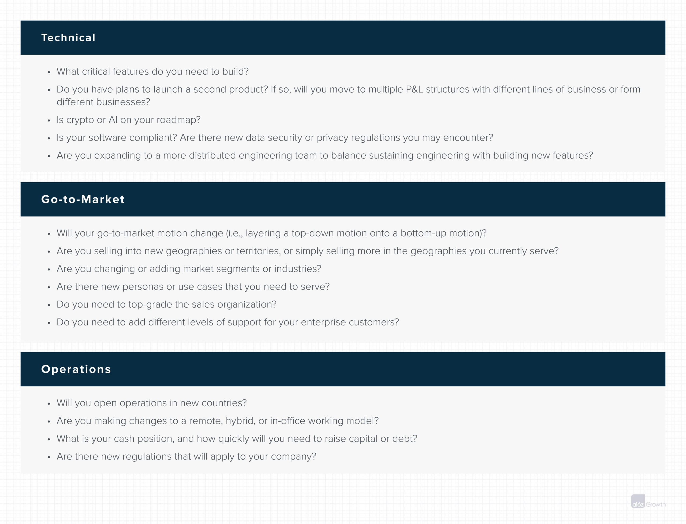

**_How do you scale from a scrappy, early-stage startup with a handful of employees to a growth-stage company with hundreds, or even thousands, of employees? Hire the right executives.  

你如何从一个只有几名员工的潦倒的早期创业公司扩展到拥有数百甚至数千名员工的成长阶段公司？雇用合适的高管。  

These first principles lay the foundation for making those key hires.  

这些首要原则为进行这些关键的招聘奠定了基础。_**

Once your company has a product that customers want and a go-to-market strategy to get it to them, you’ll face a new set of challenges: scaling operations.  

一旦你的公司有了客户需要的产品，有了把产品送到客户手中的市场战略，你将面临一系列新的挑战：扩大运营规模。

Finding product-market fit in the early stages of a company’s development usually comes from the vision, creativity, scrappiness, and resilience of the founders and first employees.  

在公司发展的早期阶段找到产品与市场的契合点，通常来自于创始人和第一批员工的远见、创造力、拼搏精神和应变能力。  

Founders are involved in most hiring decisions, and the organization tends to grow linearly.  

创始人参与了大部分的招聘决策，而组织则倾向于线性增长。  

Once a company finds product-market fit, however, you’ll often need to ramp up business and operations _exponentially_ to continue delivering value to customers.  

然而，一旦公司找到产品与市场的契合点，你往往需要成倍地增加业务和运营，以继续向客户提供价值。

Building your executive team is one of the most important elements of effectively scaling in the growth stages.  

建立你的执行团队是在成长阶段有效扩大规模的最重要因素之一。  

People often talk about growth-stage companies in the context of pre-IPO companies.  

人们经常在上市前公司的背景下谈论成长阶段的公司。  

While this guide does cover IPO considerations, it defines growth-stage companies more broadly as companies who have found product-market fit and are now scaling.  

虽然本指南确实涵盖了IPO的考虑因素，但它更广泛地将成长阶段的公司定义为已经找到产品-市场契合点并正在扩大规模的公司。  

The limiting factor in how quickly you can scale is typically how quickly you can ramp up hiring. The best growth-stage executives serve as beacons for talent.  

你能多快地扩大规模的限制因素通常是你能多快地增加招聘。最好的成长阶段的高管是人才的灯塔。  

They quickly tap their networks to build out entire teams and functions, and then they help develop the organizational processes and structure to effectively lead those teams.  

他们迅速利用自己的网络来建立整个团队和功能，然后帮助开发组织流程和结构，以有效地领导这些团队。

While hiring new executives is almost always necessary during the growth stage, that doesn’t mean you’ll up-level your entire leadership team once you find product-market fit.  

虽然在成长阶段雇用新的高管几乎总是必要的，但这并不意味着一旦你找到产品与市场的契合点，你就会提升整个领导团队的水平。  

Your existing team has often built the company and its culture from the early stages, and some of these leaders will be able to grow with the company, helping to scale that original culture by building loyalty and providing continuity and organizational context as you grow.  

你现有的团队往往从早期阶段就建立了公司及其文化，其中一些领导人将能够与公司一起成长，通过建立忠诚度和在你成长过程中提供连续性和组织背景来帮助扩大这种原始文化。

**How, then, do you figure out which executives you need to hire, and how do you make the right hires?** It’s not an easy question to answer. Even when you know the hire you want to make, you still have to recruit and retain an executive who is very likely in high demand.  

那么，你如何确定你需要雇用哪些高管，以及你如何做出正确的雇用？这不是一个容易回答的问题。即使你知道你要雇用的人，你仍然要招聘和留住一个很可能是很需要的高管。  

Not surprisingly, executive hiring takes up a significant amount of most CEOs’ time. Even so, almost every growth-stage company will hire executives who don’t work out.  

毫不奇怪，高管的招聘占据了大多数CEO的大量时间。即便如此，几乎每个处于成长阶段的公司都会雇用那些不合适的高管。  

Mishires usually result from misdiagnosing what’s needed from an executive, and they’re costly mistakes to correct.  

误判通常是由于误判了行政人员的需求，而且是代价高昂的错误，需要纠正。

**We put together this playbook—based on decades of Andreessen Horowitz operating team expertise—to share the best processes and tools for hiring executives to scale your company from product-market fit through IPO.** In later sections, we’ll cover the executive hiring process, executive compensation at growth-stage private companies, and tips and best practices for hiring and onboarding some of the most common executive roles.  

我们将这本基于Andreessen Horowitz运营团队数十年经验的游戏手册放在一起，与大家分享招聘高管的最佳流程和工具，以便将你的公司从产品-市场契合度提高到IPO。在后面的章节中，我们将介绍高管招聘过程，成长阶段的私营公司的高管薪酬，以及一些最常见的高管职位的招聘和入职的技巧和最佳实践。

First, though, we lay out our first principles for executive hiring.  

不过，首先，我们列出了高管招聘的首要原则。

## Conduct no more than 2 executive searches at a time  

每次进行不超过2次的行政人员搜索

In our experience, the average executive search takes 130 days. **Though a good hiring process can expedite this timeframe, hiring a top-tier executive will still take substantial time and resources.** A CEO can only effectively conduct 2 executive searches at the same time.  

根据我们的经验，寻找高管平均需要130天。尽管一个好的招聘程序可以加快这个时间框架，但招聘一个顶级高管仍然需要大量的时间和资源。一位首席执行官只能在同一时间有效地进行两次高管搜寻。  

In some scenarios layering on a third might be necessary, but only if 1 of the other 2 searches is in good standing or coming to a close.  

在某些情况下，增加第三个可能是必要的，但只有在其他两个搜索中的一个处于良好状态或即将结束的情况下。  

You may have 7 hires you want to make, but you simply can’t run multiple executive searches at one time without grinding other work to a halt or setting yourself up to make suboptimal hires.  

你可能有7个你想雇用的人，但你根本不可能在同一时间进行多个高管的搜寻，否则会使其他工作陷于停顿，或使你自己做出次优的雇用。

## Hire for what you want to accomplish in the next 12–18 months  

为你在未来12-18个月内想要完成的任务而雇用人员

> People often think about the executives they’re hiring and is this person going to do anything for 4 years, or 5 years, or 6 years; I think that’s not always the right question to ask.  
> 
> 人们经常考虑他们所雇用的高管，这个人是否会在4年，或5年，或6年内做任何事情；我认为这并不总是正确的问题。  
> 
> In fact, I had a board member once—Dave Strohm, who was a mentor to me, I think of him as the Yoda in my life—and he once said an expression that I’d never heard before, ‘horses for courses.’ It’s sort of an archaic expression.  
> 
> 事实上，我曾经有一个董事会成员--戴夫-斯特罗姆，他是我的导师，我认为他是我生命中的尤达--他曾经说过一个我以前从未听说过的说法，"马到成功"。这是一种古老的说法。  
> 
> In horse-track racing, there’s like dirt courses, there’s grass courses… And you want to run the right horse for the right course.  
> 
> 在赛马场上，有土路，也有草路......而你想在正确的赛道上跑正确的马。  
> 
> —David Ulevitch on the [a16z Podcast: What Time Is It? From Technical to Product to Sales CEO](https://future.com/podcasts/technical-product-sales-opendns-david-ulevitch/)  
> 
> \-David Ulevitch在a16z播客中：现在是什么时候？从技术到产品到销售的CEO

While executive hiring follows some general patterns,\* those patterns are more useful for understanding the broader talent landscape than for figuring out your specific hiring priorities.  

虽然高管招聘遵循一些一般的模式，\*但这些模式对于了解更广泛的人才状况比确定你的具体招聘重点更有用。  

Your hiring priorities will depend on the strengths and weaknesses of the current leadership team and your goals for the next 12–18 months, not on hitting a particular revenue milestone or fundraising series.  

你的招聘重点将取决于当前领导团队的优势和劣势，以及你未来12-18个月的目标，而不是为了达到某个特定的收入里程碑或筹款系列。

**Sometimes figuring out the gaps in your business may mean realizing that someone else is better equipped to own a particular function than you are.** That may be easy to stomach when you’re a technical founder hiring a finance leader—but harder if you’re a technical founder bringing in a product leader.  

有时，找出你业务中的差距可能意味着意识到别人比你更有能力拥有某项职能。当你是一个技术创始人雇用一个财务主管时，这可能很容易接受，但如果你是一个技术创始人雇用一个产品主管，这就比较困难了。

We recommend that the CEO update the board on the health of the executive team and organization at least annually.  

我们建议首席执行官至少每年向董事会汇报执行团队和组织的健康状况。  

This will help establish a cadence of reflection about what is and isn’t working and inform your hiring priorities.  

这将有助于建立一个反思什么是有效和无效的节奏，并告知你的招聘优先事项。  

When looking at your current executive team, it can help to articulate: What are your business priorities in the next 12–18 months?  

在审视你目前的执行团队时，可以帮助阐明：在未来12-18个月，你的业务重点是什么？  

What are the critical gaps or needs that you have around those priorities? And what executive roles might be most helpful in addressing those gaps?  

围绕这些优先事项，你有哪些关键的差距或需求？哪些行政角色可能对解决这些差距最有帮助？

**Moreover, different executives often excel at different stages of growth. A common failure mode is hiring a great executive at the wrong stage.** For instance, in the early stages of growth, you may need a head of engineering who can rapidly scale hiring for work on a single product.  

此外，不同的高管往往在不同的成长阶段表现出色。一个常见的失败模式是在错误的阶段雇佣了一个伟大的高管。例如，在增长的早期阶段，你可能需要一个工程主管，他可以迅速扩大招聘范围，为单一产品工作。  

By the later stages, you may need an engineering leader who can manage a series of director-level reports and engineering efforts across multiple products.  

到了后期，你可能需要一个能够管理一系列总监级报告和多个产品的工程工作的工程领导。  

The more precisely you can identify your needs for the next 12–18 months, the more likely you are to hire the right executive at the right time.  

你越能准确地确定你未来12-18个月的需求，你就越有可能在正确的时间雇用正确的管理人员。

## Organizational structure and executive hiring go hand in hand  

组织结构和行政人员的聘用是相辅相成的

To level-set about organizational structures more broadly: the bigger your company gets, the more difficult it becomes to maintain close communication, establish a shared context, and facilitate quick decision making.  

更广泛地平视组织结构：你的公司越大，就越难保持密切的沟通，建立一个共同的背景，并促进快速决策。  

Your organizational structure is the communications architecture of your company, and getting the right structure in the right place at the right time gives your teams the resources and context they need to make good decisions.  

你的组织结构是你公司的通信架构，在正确的时间把正确的结构放在正确的位置，给你的团队提供他们做出正确决定所需的资源和背景。  

Org structures evolve as companies scale, and by the time you’re bringing on C-suite executives at the growth stage, chances are you’ve cycled through a few different structures.  

组织结构随着公司规模的扩大而发展，当你在成长阶段引进C-suite高管的时候，你很可能已经在几个不同的结构中循环了。  

As new executives come on board to help the company reach new levels of scale, you might need to adjust your existing org structure in order to set up those new executives to tackle whatever problems they need to.  

随着新高管的加入，以帮助公司达到新的规模水平，你可能需要调整现有的组织结构，以便为这些新高管解决他们需要的任何问题。

But there’s no silver bullet to designing org structures. To quote [Ben Horowitz](https://a16z.com/2010/08/02/taking-the-mystery-out-of-scaling-a-company/): “the first rule of organizational design is that all organizational designs are bad.  

但在设计组织结构方面没有银弹。引用本-霍洛维茨的话"组织设计的第一条规则是，所有的组织设计都是坏的。  

With any design, you’ll optimize communication among some parts of the organization at the expense of others.” **As a CEO, then, your job is to understand who needs to communicate and what decisions need to be made in order to address the particular problem you’re trying to solve.** This generally involves making some tough tradeoffs.  

在任何设计中，你都会优化组织中某些部分的沟通，而牺牲其他部分"。那么，作为一个CEO，你的工作就是要了解谁需要沟通，需要做出什么样的决定，以解决你要解决的特定问题。这通常涉及到做出一些艰难的权衡。  

For instance, let’s say you’re bringing on a senior vice president of engineering to lead your move to a multiproduct structure.  

例如，假设你要请一位工程部的高级副总裁来领导你向多产品结构的转变。  

This raises the question: do you organize your technical teams as business units with separate P&Ls or as functional teams? The former allows those teams to move quickly but can often result in a disjointed experience for the customer, whereas the latter can make it easier for the entire team to understand what they’re building and why—but can also require teams to get buy-in from more cross-functional teams, which, in turn, slows down shipping rates.  

这就提出了一个问题：你是把你的技术团队组织成具有独立损益的业务单位，还是作为职能团队？前者允许这些团队快速行动，但往往会给客户带来不连贯的体验，而后者可以使整个团队更容易理解他们正在构建的内容和原因，但也可能要求团队从更多的跨职能团队中获得认同，这反过来又会减慢运输速度。

In some cases, shifting the org structure when a new leader comes on board can be relatively simple.  

在某些情况下，在新领导上任时转变组织结构可能相对简单。  

In an effort to move your legal function in house, for instance, you might bring on a general counsel and create a net-new legal team or department.  

例如，为了将你的法律职能转移到内部，你可能会引进一名总法律顾问，并创建一个新的法律团队或部门。  

In other cases, however, you may up-level a role, and the functions that currently sit with other leaders may now report to someone new.  

然而，在其他情况下，你可能会提高一个角色的级别，目前由其他领导负责的职能现在可能向新的人汇报。  

For example, if you have a COO who currently oversees legal, finance, and customer success, but you decide you need to bring on an experienced CRO to help ramp up top-down sales, you may need to prepare the COO that customer success will report into the new CRO.  

例如，如果你有一个目前负责监督法律、财务和客户成功的首席运营官，但你决定需要引进一个有经验的首席执行官来帮助提升自上而下的销售，你可能需要让首席运营官准备好，客户成功将向新的首席执行官报告。

### Artificial intelligence and org structures  

人工智能和组织结构

With the unprecedented rise of ChatGPT, generative artificial intelligence, and AI more broadly, many companies are figuring out how to best implement these tools in their company.  

随着ChatGPT、生成性人工智能和更广泛的人工智能的空前兴起，许多公司正在弄清楚如何在其公司中最好地实施这些工具。  

Even if you aren’t building an AI product, AI is likely to have an impact on how your teams work.  

即使你没有建立一个人工智能产品，人工智能也可能对你的团队工作方式产生影响。  

An emerging consideration for effective org design is where and how to integrate AI to both augment and automate how humans work.   

有效的组织设计的一个新的考虑因素是在哪里以及如何整合人工智能，以增强和自动化人类的工作方式。

The biggest gains won’t come from simply using AI, but by designing org for human-plus-AI workflows.  

最大的收益不会来自于简单地使用人工智能，而是通过为人类加人工智能的工作流程设计高潮。  

As of this writing, we’ve heard from growth CEOs who have already started to see massive gains in engineering productivity and automated portions of customer support by effectively architecting AI into their org structure.  

截至目前，我们已经听到一些增长型CEO说，通过有效地将人工智能架构到他们的组织结构中，他们已经开始看到工程生产力和客户支持的自动化部分的巨大收益。  

However, these use cases aren’t simply about giving ChatGPT to your engineering or support teams. In some cases, companies are building their own language learning models (LLMs).  

然而，这些用例并不仅仅是把ChatGPT交给你的工程或支持团队。在某些情况下，公司正在建立自己的语言学习模型（LLMs）。  

In others, they’re fine tuning existing LLMs for their use cases, with an eye to AI architecture that effectively puts humans in the loop and org structures that effectively integrate AI.   

在其他情况下，他们正在为他们的用例微调现有的LLM，着眼于有效地将人类置于循环中的AI架构和有效整合AI的组织结构。

### Let go or level? 放手还是放平？

Sometimes the organizational changes that come with an executive hire will require letting go or leveling a current leader. **In the best-case scenario, an early-stage leader will recognize that working for a more senior executive is an opportunity to learn from a tried-and-tested operator at the next level of scale.** However, even if you outline your reasoning perfectly, an existing leader may opt to leave rather than be leveled.  

有时，随着高管招聘带来的组织变化，需要让现任领导离职或平调。在最好的情况下，早期阶段的领导者会认识到，为更高级的高管工作是一个机会，可以向下一级规模的、久经考验的经营者学习。然而，即使你完美地阐述了你的理由，现有的领导者可能会选择离开，而不是被平调。

Letting people go who helped you build the company is hard, but keeping people around to manage teams beyond their current skill level is one of the worst things you can do for your company.  

让那些帮助你建立公司的人离开是很难的，但让他们留在身边管理超出其现有技能水平的团队是你能为公司做的最糟糕的事情之一。  

It may be tempting to think that you can mentor an existing leader who isn’t cutting it and help them grow into the role, but [the sad truth](https://a16z.com/2015/03/16/the-sad-truth-about-developing-executives-2/) is that it’s a bad use of your time and theirs.  

你可能会认为，你可以指导一个不称职的现有领导，帮助他们成长为这个角色，但可悲的是，这是对你和他们的时间的糟糕利用。

Keeping a leader who isn’t cutting it risks diminishing the quality of their team’s work, increasing attrition, and establishing a pattern of people circumventing the substandard leader to get work done.  

留住一个不合格的领导者，有可能降低其团队的工作质量，增加流失率，并建立一种人们绕过不合格的领导者来完成工作的模式。  

At the very least, these leaders slow your growth. In the worst cases, these leaders take a negative toll on the broader culture and become an existential risk to the company.  

至少，这些领导人会减缓你的成长。在最坏的情况下，这些领导人会对更广泛的文化造成负面影响，成为公司的生存风险。  

When your company has outgrown a leader, you owe it to your company to bring in the leadership you need.  

当你的公司已经超过了一个领导者，你应该为你的公司引进你所需要的领导。

## The CEO should lead the hiring process  

首席执行官应领导招聘过程

While you will work with a human resources team and possibly a search firm to build out your talent pipeline, you can’t outsource your role as the company’s leader in attracting, vetting, and ultimately deciding on new leadership because:  

虽然你将与人力资源团队合作，也可能与猎头公司合作，以建立你的人才管道，但你不能将你作为公司的领导者在吸引、审查和最终决定新的领导层方面的作用外包出去，因为：

1.  **No one knows your company better than you do.** The initial conversations with a potential hire set the tone and scope of their role.  
    
    没有人比你更了解你的公司。与潜在雇员的最初对话确定了他们的角色基调和范围。  
    
    If you aren’t involved in actively leading that conversation, you risk misdefining or miscommunicating the company’s needs and hiring someone who is the wrong fit.  
    
    如果你不参与积极引导这种对话，你就有可能错误地定义或误传公司的需求，并雇用到不适合的人。
2.  **No one will sell a company to a tier 1 executive better than you, the CEO, will.** Top candidates have plenty of options, and hearing directly from the CEO signals to them how important the role is to you and to the company.  
    
    没有人会比你这个首席执行官更好地将公司推销给一级主管。顶级候选人有很多选择，而直接从首席执行官那里听到的信息，向他们表明这个角色对你和公司有多么重要。
3.  **You signal the importance of the role to the rest of your organization.** Internally, your involvement signals the executive’s role and function as an important priority.  
    
    你向你的组织的其他成员发出了这个角色的重要性。在内部，你的参与表明高管的角色和职能是一个重要的优先事项。  
    
    Especially when an executive role comes with org changes, this primes the org for change and makes it easier for a new executive to ramp up.  
    
    特别是当一个高管的角色伴随着组织的变化时，这为组织的变化做了准备，使新的高管更容易上手。

Change is unavoidable when a company seeks to scale.  

当一个公司试图扩大规模时，变化是不可避免的。  

As Peter Senge, a senior lecturer at the MIT Sloan School of Management and founder of the Society for Organizational Learning, puts it: “Leadership in a learning organization starts with the principle of creative tension.  

正如麻省理工学院斯隆管理学院的高级讲师、组织学习协会的创始人彼得-圣吉所说："学习型组织的领导力始于创造性紧张的原则。  

Creative tension comes from seeing clearly where we want to be, our _vision_, and then telling the truth about where we are, our current _reality_. The gap between the two generates a natural tension.”  

创造性的张力来自于清楚地看到我们想要的地方，即我们的愿景，然后说出我们所在的地方，即我们目前的现实的真相。两者之间的差距产生了一种自然的张力。

Provided there is a great vision, as a company enters the growth stages, the CEO must set a clear direction with objectives and measurable or quantifiable outcomes.  

只要有一个伟大的愿景，当公司进入成长阶段时，首席执行官必须设定一个明确的方向，并设定目标和可衡量或可量化的结果。  

Taking the company from early-stage vision to growth-stage reality requires hiring functional leaders who come equipped with a talent network as well as proven processes and systems to help build and measure results.  

将公司从早期阶段的愿景转变为成长阶段的现实，需要雇用配备人才网络以及成熟的流程和系统的职能领导，以帮助建立和衡量结果。  

These leaders will ultimately carry the company through the transition.  

这些领导人将最终带领公司完成过渡。

Building this executive team and navigating the resulting change is one of the most important—and often one of the [loneliest](https://a16z.com/2010/10/13/hiring-executives-if-youve-never-done-the-job-how-do-you-hire-somebody-good/)—parts of the CEO job. But as tough as some of the decisions may be, hiring the right executives at the right time can transform your company.  

建立这个高管团队并驾驭由此产生的变化，是首席执行官工作中最重要的部分之一，也往往是最孤独的部分之一。但是，尽管有些决定可能很艰难，但在正确的时间雇用正确的高管可以改变你的公司。

Next, let’s look at [The Hiring Process](https://a16z.com/2023/06/14/the-hiring-process/).  

接下来，让我们看一下招聘过程。

## Further reading 进一步阅读

_We’ve drawn insights from some of our previously published content and other sources, listed below.  

我们从以前发表的一些内容和其他来源中汲取了一些见解，列举如下。  

In some instances, we’ve repurposed the most compelling or useful advice from a16z posts directly into this guide.   

在某些情况下，我们将a16z帖子中最有说服力或最有用的建议直接改编为本指南。_

[_Hiring Executives: If You’ve Never Done the Job, How Do You Hire Somebody Good?_](https://a16z.com/2010/10/13/hiring-executives-if-youve-never-done-the-job-how-do-you-hire-somebody-good/)_, Ben Horowitz  

_  

雇用高管：如果你从来没有做过这个工作，你怎么能雇用到好的人？ Ben HorowitzHow do you hire people who are better at their jobs than you are?  

你如何雇用那些比你更擅长工作的人呢？  

Know what you want, run the right process, ask the right questions, assemble the right interview team, and do your due diligence when it comes to reference checks.   

了解你想要什么，执行正确的程序，提出正确的问题，组建正确的面试团队，并在推荐人调查方面尽职尽责。

[_What Time Is It? From Technical to Product to Sales CEO_](https://future.com/podcasts/technical-product-sales-opendns-david-ulevitch/)_, a16z podcast with David Ulevitch and Sonal Chokshi  

_  

现在是什么时候？从技术到产品到销售的CEO，a16z播客与David Ulevitch和Sonal Chokshi合作Nothing is straightforward about running a company. Any change you make will inevitably affect something else. So how do you know which knob to turn and at what time?  

经营一家公司没有什么是直截了当的。你所做的任何改变都将不可避免地影响其他方面。那么，你如何知道该在什么时候转动哪个旋钮？  

Here, Ulevitch offers insights into building the right team for your stage of growth.   

在这里，Ulevitch提供了关于为你的成长阶段建立正确的团队的见解。

[_The Sad Truth About Developing Executives_](https://a16z.com/2015/03/16/the-sad-truth-about-developing-executives-2/)_, Ben Horowitz  

_  

培养高管的可悲真相》，本-霍洛维茨Is it your job as a CEO to develop your executives? According to Horowitz, the answer is a resounding no.  

作为CEO，你的工作是培养你的高管吗？根据霍洛维茨的说法，答案是一个响亮的否定。  

Here, he outlines 6 reasons why being a functional manager can be detrimental to your job as well as ways that you, as a manager, can help your executives succeed.  

在这里，他概述了成为职能型经理人会对你的工作造成损害的6个原因，以及作为经理人的你可以帮助你的高管取得成功的方法。

_\*_[_A Practical Framework for Scaling Your Executive Bench_](https://www.felicis.com/news/a-practical-framework-for-scaling-your-executive-bench)_, Michelle Delcambre  

_  

\*扩大行政人员队伍的实用框架，Michelle DelcambreThis is one of the better breakdowns we’ve seen about scaling your executive bench.  

这是我们看到的关于扩大行政人员队伍的更好的分析之一。  

This article maps out data points from 30 outlier companies’ executive benches after each funding round over a period of 10 years.  

这篇文章描绘了10年内每轮融资后30家离群索居公司高管席上的数据点。

\* \* \*  

_The views expressed here are those of the individual AH Capital Management, L.L.C. (“a16z”) personnel quoted and are not the views of a16z or its affiliates.  

这里所表达的观点是AH Capital Management, L.L.C.（"a16z"）人员个人的观点，并不代表a16z或其附属机构的观点。  

Certain information contained in here has been obtained from third-party sources, including from portfolio companies of funds managed by a16z.  

这里包含的某些信息是从第三方来源获得的，包括从a16z管理的基金的投资组合公司获得。  

While taken from sources believed to be reliable, a16z has not independently verified such information and makes no representations about the enduring accuracy of the information or its appropriateness for a given situation.  

虽然信息来源被认为是可靠的，但a16z并没有独立核实这些信息，也不对信息的持久准确性或其对特定情况的适当性做出任何陈述。  

In addition, this content may include third-party advertisements; a16z has not reviewed such advertisements and does not endorse any advertising content contained therein.  

此外，这些内容可能包括第三方广告；a16z没有审查这些广告，也不认可其中的任何广告内容。_

_This content is provided for informational purposes only, and should not be relied upon as legal, business, investment, or tax advice.  

本内容仅用于提供信息，不应作为法律、商业、投资或税务建议而加以依赖。  

You should consult your own advisers as to those matters.  

你应该就这些问题咨询你自己的顾问。  

References to any securities or digital assets are for illustrative purposes only, and do not constitute an investment recommendation or offer to provide investment advisory services.  

对任何证券或数字资产的提及仅用于说明目的，并不构成投资建议或提供投资咨询服务。  

Furthermore, this content is not directed at nor intended for use by any investors or prospective investors, and may not under any circumstances be relied upon when making a decision to invest in any fund managed by a16z.  

此外，这些内容不针对也不打算供任何投资者或潜在投资者使用，在任何情况下，在作出投资于a16z管理的任何基金的决定时，不得依赖这些内容。_

_(An offering to invest in an a16z fund will be made only by the private placement memorandum, subscription agreement, and other relevant documentation of any such fund and should be read in their entirety.) Any investments or portfolio companies mentioned, referred to, or described are not representative of all investments in vehicles managed by a16z, and there can be no assurance that the investments will be profitable or that other investments made in the future will have similar characteristics or results._

_(投资于a16z基金的要约将仅由任何此类基金的私募备忘录、认购协议和其他相关文件作出，并应阅读其全部内容)。所提到、提及或描述的任何投资或投资组合公司并不代表A16Z管理的所有投资，而且不能保证这些投资将是有利可图的，也不能保证未来进行的其他投资将有类似的特点或结果。  

A list of investments made by funds managed by Andreessen Horowitz (excluding investments for which the issuer has not provided permission for a16z to disclose publicly as well as unannounced investments in publicly traded digital assets) is available at_ _[https://a16z.com/investments/](https://a16z.com/investments/)__._  

Andreessen Horowitz管理的基金所做的投资清单（不包括发行人未允许a16z公开披露的投资以及对公开交易的数字资产的未宣布的投资），可在https://a16z.com/investments/。

_Charts and graphs provided within are for informational purposes solely and should not be relied upon when making any investment decision.  

其中提供的图表仅用于提供信息，在做出任何投资决定时不应依赖这些图表。  

Past performance is not indicative of future results. The content speaks only as of the date indicated.  

过去的业绩并不代表未来的结果。该内容仅代表截至所示日期的情况。  

Any projections, estimates, forecasts, targets, prospects, and/or opinions expressed in these materials are subject to change without notice and may differ or be contrary to opinions expressed by others. Please see_ _[https://a16z.com/disclosures](https://a16z.com/disclosures)_ _for additional important information._  

这些材料中表达的任何预测、估计、预报、目标、前景和/或意见都可能在没有通知的情况下发生变化，并可能与其他人表达的意见不同或相反。请参阅https://a16z.com/disclosures，了解更多重要信息。
