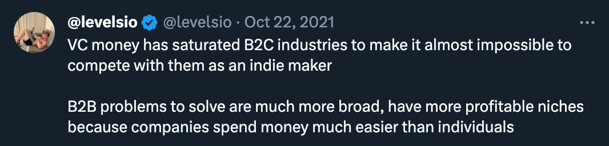
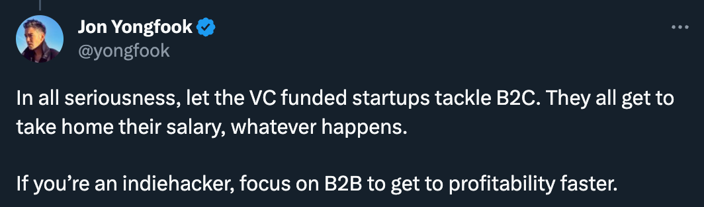
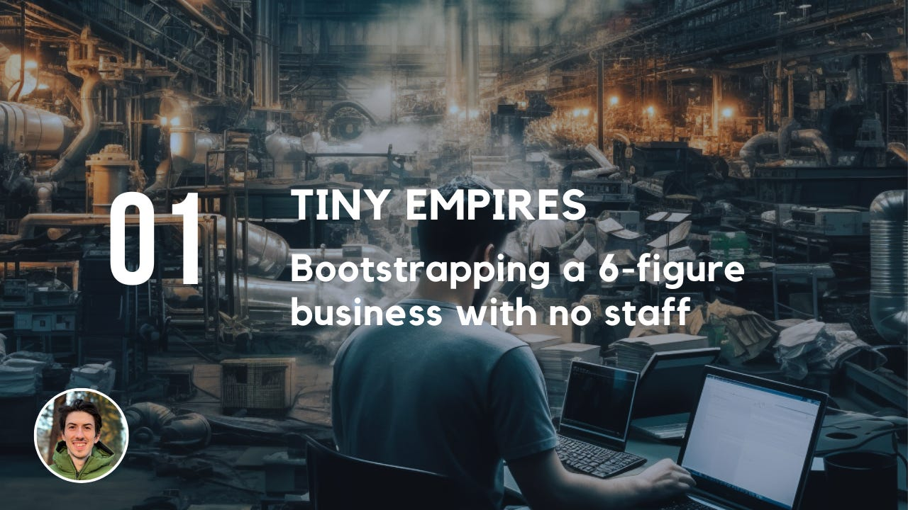

Not all businesses are good choices for solo-founders. Some are almost impossible to grow when you're a business of one.  

并非所有的企业都是独资企业的好选择。当你是一个人的企业时，有些企业几乎不可能发展。  

But how can you find a business that you can easily grow as a solo-founder or small team?  

但是，你如何才能找到一个你可以作为单独创始人或小团队轻松发展的企业？

Understanding the types of business that are most suited to being a solo-founder can save years of frustration.  

了解最适合作为个人创始人的业务类型，可以节省多年的挫折。  

Understanding the markets that are suited to small self-funded businesses, will shorten your road to success from years to months.  

了解适合小型自筹资金企业的市场，将使你的成功之路从几年缩短到几个月。

Unfortunately I spent a decade learning this the hard way. Every day I see people making the same mistakes, mainly because we naturally copy what big companies do.  

不幸的是，我花了十年的时间，以艰难的方式学习这一点。我每天都看到人们犯同样的错误，主要是因为我们自然而然地模仿大公司的做法。

We're unconsciously influenced by companies that we use ourselves. Think Netflix, Notion, Twitter, Gmail. These companies all have a few things in common:  

我们会不自觉地受到我们自己使用的公司的影响。想想Netflix, Notion, Twitter, Gmail.这些公司都有一些共同点：

1.  They require scale (lots of customers)  
    
    他们需要规模（大量的客户）。
    
2.  They target consumers for a major part of their business  
    
    他们的业务的主要部分是针对消费者的。
    
3.  They charge a low price (or are free)  
    
    他们收费低廉（或免费）。
    
4.  They exist in large markets  
    
    它们存在于大型市场中
    
5.  They have a lot of money to spend  
    
    他们有很多钱可以花
    

But don't worry. As a small business, we can craft an offering that avoids all these points and is much more likely to succeed.  

但不要担心。作为一个小企业，我们可以精心设计一个产品，避免所有这些要点，更有可能取得成功。

Here's how to do it, step by step:  

下面是如何一步步做的：

As a solo-founder or small bootstrapped business, any type of product/service that requires a massive number of users is best to avoid.  

作为一个单独的创始人或小型自营企业，任何类型的产品/服务都需要大量的用户，最好避免。

I discovered this the hard way with one of my early startup attempts.  

我在早期的一次创业尝试中艰难地发现了这一点。  

The idea was a wedding directory that I was positioning as "TripAdvisor for weddings" (this was in TripAdvisor's heyday).  

这个想法是一个婚礼目录，我将其定位为 "婚礼的TripAdvisor"（这是在TripAdvisor的全盛时期）。  

It was a 2-sided marketplace and targeted the entire UK wedding market. The market I chose was too big.  

这是一个双面市场，针对整个英国的婚礼市场。我选择的市场太大。  

The business required network effects on a massive scale to work, and trying to attract engaged couples and wedding vendors on this scale, with no budget, was basically impossible.  

这项业务需要大规模的网络效应才能发挥作用，在没有预算的情况下，试图在这种规模上吸引订婚的夫妇和婚礼供应商，基本上是不可能的。  

As a result, I was forced to keep changing the focus of the business, making it constantly more niche, in an attempt to have a small enough market where the network effects could take over.  

结果，我被迫不断改变业务的重点，使其不断变得更加小众，试图拥有一个足够小的市场，使网络效应能够接管。  

Ultimately I couldn't build those effects quick enough, in such a transient market as weddings. I shut it down. It failed.  

最终，在婚礼这样一个瞬息万变的市场中，我无法快速建立这些效果。我把它关掉了。它失败了。  

It's very hard to create network effects when you're the only one working on it. You don't have the time or money to make it work.  

当你是唯一一个致力于此的人时，创造网络效应是非常困难的。你没有时间或金钱来使它发挥作用。

Have a think about other businesses that require network effects. For example, social networks.  

想一想其他需要网络效应的业务。例如，社会网络。  

All the major social networks were funded early and were typically unprofitable for a long time before they reached scale that allowed them to monetize effectively.  

所有主要的社交网络都是在早期得到资助的，而且在达到允许它们有效盈利的规模之前，通常有很长一段时间是不盈利的。  

As a small-business, you can't compete against the spending, or sustain losses for a prolonged period.  

作为一个小企业，你无法与消费竞争，也无法长期维持损失。

The other thing to avoid is charging low prices. Why? Because getting customers is hard! Sales and marketing are both major time drains and you can't spend all your time doing them.  

另一件要避免的事情是收取低价。为什么？因为获得客户是很难的！销售和营销都是耗费时间的大事！销售和营销都是主要的时间消耗，你不能把所有的时间都花在这上面。  

Again, if you have low prices, you need to reach hundreds or thousands of customers (that scale problem again).  

同样，如果你的价格低，你需要接触数百或数千名客户（又是那个规模问题）。

I see a lot of people starting a subscription business and charging "Netflix style" prices. e.g $10/month.  

我看到很多人开始做订阅业务，并收取 "Netflix式 "的价格，例如10美元/月。  

We are so conditioned to these types of pricing, that we naturally want to replicate them.  

我们对这些类型的定价如此有条件，以至于我们自然想要复制它们。  

But converting consumers to a $10 month subscription is much more difficult than you might imagine.  

但是，将消费者转化为每月10美元的订阅，比你想象的要困难得多。  

If you work really hard and get up to 100 users, you're still only at $1k per month and that doesn't take into account running costs and users cancelling.  

如果你非常努力地工作，并获得了100个用户，你仍然只有每月1千美元的收入，这还没有考虑到运行成本和用户的取消。  

You need to constantly bring on more users to replace those who leave.  

你需要不断引进更多的用户来取代那些离开的用户。

On the flip-side, you could just have 1 single B2B client paying $10k per month for a service and make 10x the amount, with lower running costs and no churn. 1 sale vs 100. 10x revenue vs 1x.  

反过来说，你可以只让一个单一的B2B客户每月为一项服务支付1万美元，并赚取10倍的金额，而且运行成本更低，没有流失。1次销售对100次。10倍收入对1倍。

The easiest way to avoid the challenges of scale and low prices is to target businesses, rather than consumers.  

避免规模和低价挑战的最简单方法是针对企业，而不是消费者。  

Not only does it allow you to sell at higher prices (so you don't need scale), it 's also a much easier sell. Here are a few reasons why:  

它不仅允许你以更高的价格出售（所以你不需要规模），它's也更容易销售。这里有几个原因：

1.  Businesses are happy to spend money on things that help them grow. It increases revenue.  
    
    企业很乐意把钱花在帮助他们成长的事情上。这可以增加收入。
    
2.  Business expenses reduce profits and therefore taxes on those profits. The expense is offset against future taxes.  
    
    商业支出减少了利润，因此也减少了这些利润的税收。该费用可以抵扣未来的税款。
    
3.  Businesses allocate money for training, marketing etc. They are literally looking to spend the money.  
    
    企业为培训、营销等分配资金。他们从字面上看是想把钱花出去。
    
4.  It's often part of somebody's job description to spend that money, so you can find out what role within the company spends the money and sell to them directly.  
    
    花费这些钱往往是某人工作描述的一部分，所以你可以找出公司内花钱的角色，直接向他们销售。
    

This is not true in the consumer world. Consumers are very cautious with spending. A $49 subscription to a consumer is a lot, whereas a business wouldn't bat an eyelid.  

在消费领域，情况并非如此。消费者对消费非常谨慎。对消费者来说，49美元的订阅费用是一个很大的数目，而企业则不会眨一下眼睛。

Here are a couple of examples of the difference between consumer and business mentality with spending:  

下面是几个例子，说明消费者和企业在消费方面的心态差异：

1.  Twitter Blue caused outrage in the Twitter community when they started charging £6 per month.  
    
    当Twitter Blue开始每月收费6英镑时，在Twitter社区引起了愤怒。  
    
    They charge organizations £1,140 a month, for that same tick in a different color and Organizations are happy to pay.  
    
    他们每月向各组织收取1140英镑的费用，用于购买不同颜色的同样的勾子，各组织很乐意支付。
    
2.  Gmail is one of the most popular email tools ever created. If they started charging $1 a month, they would lose 90+% of their users to a free alternative.  
    
    Gmail是有史以来最受欢迎的电子邮件工具之一。如果他们开始每月收费1美元，他们将失去90％以上的用户，转而使用免费的替代品。  
    
    Meanwhile, Superhuman email launched a couple of years ago and targeted business users exclusively. They shook the market by charging $30 per month for an email client.  
    
    同时，超人电子邮件在几年前推出，专门针对企业用户。他们通过每月收取30美元的电子邮件客户端费用震撼了市场。  
    
    This is a service we are conditioned to expect to be free.  
    
    这是一项我们有条件期待的免费服务。  
    
    But the product was great and helped business users save time on emails, and therefore allocate their time elsewhere and make more money. It grew like wildfire.  
    
    但该产品非常好，帮助企业用户节省了处理电子邮件的时间，从而将他们的时间分配到其他地方，赚取更多的钱。它像野火一样增长。
    

If you're a solo-founder, you need to minimize your time spent on attracting customers (because it's just you) and maximize your product price.  

如果你是一个单打独斗的创始人，你需要尽量减少花在吸引客户上的时间（因为只有你一个人），并尽量提高你的产品价格。  

Selling B2B solves both of these problems.  

销售B2B解决了这两个问题。

The larger the market, the bigger the competition. If you were a goldfish, would you rather live in an ocean, or a garden pond? Probably the pond.  

市场越大，竞争就越大。如果你是一条金鱼，你愿意生活在海洋，还是花园的池塘里？可能是池塘。  

In the ocean, you are competing with millions of other fish, most of whom are much bigger than you, and will ultimately eat you. In a pond, you might be the biggest fish.  

在海洋中，你是在与数以百万计的其他鱼竞争，其中大多数人比你大得多，最终会吃掉你。在一个池塘里，你可能是最大的鱼。  

This is exactly how you want to think about your business. Choose a market where you can be the biggest fish.  

这正是你要思考你的业务的方式。选择一个你可以成为最大鱼的市场。  

If you decide to start a sports shoe brand, you'll be competing with Nike, Adidas and countless others.  

如果你决定创办一个运动鞋品牌，你将与耐克、阿迪达斯和无数的其他品牌竞争。  

Niche that down and make it a Pickleball shoe brand and suddenly you're the only player in the market. You're the biggest fish.  

缩小范围，使其成为一个皮克尔球鞋品牌，突然间你就成了市场上唯一的玩家。你是最大的鱼。  

You can hone in specifically on that customer's needs and take the entire pickle ball shoe market.  

你可以专门针对该客户的需求进行磨练，并占领整个泡菜球鞋市场。

Swap scale for small and charge higher prices to businesses.  

以大换小，向企业收取更高的价格。

-   Instead of a social network, build a niche professional community  
    
    与其说是社交网络，不如说是建立一个小众的专业社区
    
-   Instead of an AI blog, write an AI image-generation newsletter for social media managers  
    
    不要写AI博客，而是为社交媒体经理写一份AI图像生成通讯
    
-   Instead of a general web-design agency, start a web agency targeting Logistics companies in the UK  
    
    不做一般的网页设计公司，而做一个针对英国物流公司的网络机构
    

Think smaller markets with bigger budgets. The opportunities are endless.  

想一想有更大预算的小市场。机会是无穷无尽的。

I hope this guide was helpful.  

我希望这个指南对你有帮助。  

Next week I'll be posting a continuation of this guide on choosing a business that suits your personality and skill sets, which makes it exponentially more likely to grow.  

下周我将继续发布关于选择适合你的个性和技能的业务的指南，这将使其成倍地增长。  

Subscribe to get that guide sent to your inbox next week.  

订阅后，下周将该指南发送到你的收件箱。

I'm also running a free class at the beginning of July where I'll go through my best tips on running a small(but mighty) tiny empire. Join us there:  

我还将在7月初举办一个免费课程，届时我将介绍我在经营一个小型（但强大）的小帝国方面的最佳技巧。在那里加入我们：

**UK / EU / AU / AS times - 221 registrants - [register](https://lu.ma/08kr3eus)  

英国/欧盟/澳大利亚/AS时间 - 221名注册者 - 注册**

**US / CAN / SA times - 71 registrants - [register](https://lu.ma/drfn6ysj)  

美国/加拿大/南非时间 - 71名注册者 - 注册**
