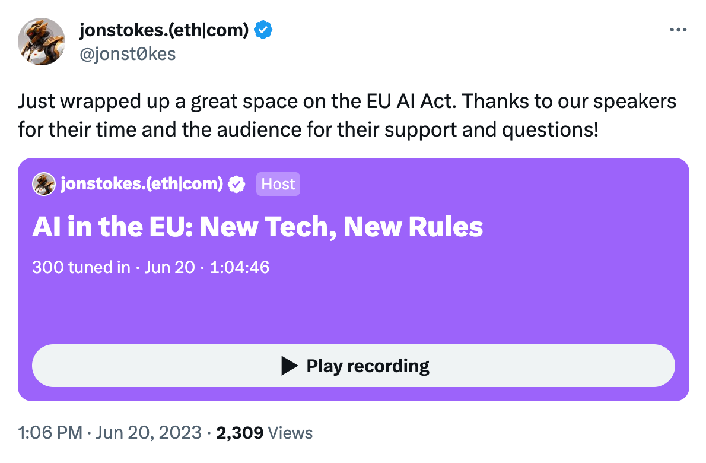

## How To Regulate AI, If You Must  

如何监管人工智能，如果你必须这样做的话

### The rules are definitely coming, so let's make sure they lead to a future we want.  

规则肯定会到来，所以让我们确保它们导致一个我们想要的未来。

AI is both extremely powerful and entirely new to the human experience.  

人工智能既非常强大，又是人类经验中的全新事物。  

Its power means that we are definitely going to make rules about it, and its novelty means those rules will initially be of the “fighting the last war” variety and we will mostly regret them.  

它的力量意味着我们肯定会制定有关它的规则，而它的新颖性意味着这些规则最初将是 "打最后一仗 "的类型，而且我们大多会后悔。

While we do not get to pick whether or not AI rules will exist (a certainty) or whether our first, clumsy stab at them will be a backward-looking, misguided net negative for humanity (also certain), the news isn’t all bad.  

虽然我们无法选择人工智能规则是否会存在（这是肯定的），或者我们第一次笨拙的尝试是否会对人类造成落后的、误导的净负值（也是肯定的），但新闻并不全是坏事。  

In fact, we’re in a moment of incredible opportunity that comes around rarely in human history: those of us building in and writing about AI right now get to set the terms of the unfolding multi-generational debate over what this new thing is and what it should be.  

事实上，我们正处于一个人类历史上很少出现的令人难以置信的机会时刻：我们这些人现在正在建设人工智能和撰写关于人工智能的文章，可以为正在展开的关于这个新事物是什么以及它应该是什么的多代人辩论设定条件。

But as much as I’d like to ramble on about LLMs as a type of [can-opener problem](https://www.jonstokes.com/p/the-can-opener-problem), and explore what it would look like to develop a new companion discipline to hermeneutics that’s aimed at theorizing about text generation, the rule-making around AI has already started in earnest, and I am by and large not a fan of the people who are making the rules and I am not expecting good results.  

但是，尽管我很想把法律硕士作为一种开罐器的问题喋喋不休，并探索发展一门旨在对文本生成进行理论研究的解释学的新伙伴学科会是什么样子，但围绕人工智能的规则制定工作已经认真开始了，而我基本上不喜欢制定规则的人，我对结果也不抱期望。

⚔️ So this post is aimed at people who, like me, are eyeing most of the would-be AI rule-makers with extreme suspicion and a sense that they are up to no good.  

⚔️ 所以这篇文章是针对那些像我一样，对大多数可能的人工智能规则制定者抱有极度怀疑和感觉他们不怀好意的人。  

Those of us who are aligned on the answers to some key questions around technology, society, and human flourishing must immediately start talking about how we can wrest control of the rule-making process from **the safety-industrial complex** that is already dominating it.  

我们中那些对围绕技术、社会和人类繁荣的一些关键问题的答案保持一致的人，必须立即开始讨论我们如何能够从已经主导规则制定过程的安全工业综合体手中夺回控制权。

Notice how in the opener to this post, I said “rules” and not “laws.” In the network era, there are many more effective ways to enact rules that govern the lives of billions than the old paradigm of governments passing laws.  

注意到在这篇文章的开头，我说的是 "规则 "而不是 "法律"。在网络时代，与政府通过法律的旧模式相比，有许多更有效的方法来制定规则，管理数十亿人的生活。  

Moderation rules, terms of service, and the private arrangements that structure network architectures are examples of rules that touch more people on a visible, day-to-day level than most laws on the books.  

管理规则、服务条款以及构建网络架构的私人安排，都是在可见的、日常的层面上接触到的规则的例子，比书本上的大多数法律更多。  

The more generalized term here is **governance**, a term that covers all the different kinds of rules at different layers of the stack.  

这里更概括的术语是治理，这个术语涵盖了堆栈中不同层次的所有不同种类的规则。

So as I said, we’re going to have rules about AI, but many of those rules may not take the form of laws passed by legacy nation-states.  

因此，正如我所说，我们将有关于人工智能的规则，但其中许多规则可能不会采取传统民族国家通过的法律形式。  

But I do want to focus narrowly on the “laws” part of the picture because I think this is the type of AI governance that’s in the most danger of going seriously sideways in short order.  

但我确实想狭隘地关注 "法律 "部分，因为我认为这是人工智能治理中最危险的类型，会在短期内严重偏离方向。

🤦♂️ Why do I think that our legal process is about to mangle this whole AI thing? Two reasons:  

🤦♂️ 为什么我认为我们的法律程序即将把整个人工智能的事情弄糟？有两个原因：

1.  Who is working on the problem of AI governance right now  
    
    现在谁在研究人工智能治理的问题
    
2.  Who is **not** working on the problem of AI governance right now  
    
    谁现在没有在研究人工智能治理的问题
    

### **Who is working on AI governance  

谁在从事人工智能治理工作**

🚔 Per my contacts in policy circles and my own observation in my network, the burgeoning AI policy debate is presently dominated by the same **safety-industrial complex** that has come to dominate platform governance conversations in the social media era.  

根据我在政策圈子里的接触和我自己在网络中的观察，正在兴起的人工智能政策辩论目前是由安全-工业综合体主导的，这种综合体已经主导了社交媒体时代的平台治理对话。

I’ll say more about this group’s tactics below in the section on social engineering, but my point here is that this safety-industrial complex was already fully mature and dug in at large companies and in universities and policy shops when AI cropped up as an apparently adjacent issue that they could all seamlessly expand their “watchdog” franchise into.  

我将在下面关于社会工程的章节中详细介绍这个团体的策略，但我想说的是，当人工智能作为一个明显相邻的问题出现时，这个安全工业综合体已经完全成熟，并在大公司、大学和政策机构中深耕细作，他们都可以无缝地将他们的 "监督 "特许权扩展到其中。  

And expand it they have, with the result that everyone (like myself) who is opposed to this safeyist network will have to scramble to catch up to it if we want to save AI from it.  

而且他们已经扩大了，结果是每个反对这个安全主义网络的人（比如我）都不得不争先恐后地追赶它，如果我们想从它那里拯救人工智能的话。

In the US, my impression is that the two main camps in the safety-industrial complex are what I’ve [previously called](https://www.jonstokes.com/p/ai-safety-a-technical-and-ethnographic) the **X-riskers** and the **language police**. Europe appears to be more dominated by **Chernobylists**.   

在美国，我的印象是，安全工业综合体的两个主要阵营是我之前所说的X-风险者和语言警察。欧洲的切尔诺贝利主义者似乎更占优势。

Here’s my earlier piece’s characterization of these camps:  

以下是我之前的文章对这些阵营的描述：

> _**The language police**: Worried that LLMs will say mean words, be used to spread disinformation, or be used for phishing attempts or other social manipulation on a large scale.  
> 
> AI ethicist Gary Marcus is in this camp, as are most “disinfo” and DEI advocacy types in the media and academia who are not deep into AI professionally but are opining about it.  
> 
> 人工智能伦理学家加里-马库斯就在这个阵营中，媒体和学术界中的大多数 "假情报 "和DEI倡导者也是如此，他们在专业上没有深入研究人工智能，但却对其发表意见。  
> 
> 语言警察：担心法律硕士会说刻薄的话，被用来传播虚假信息，或被用来进行网络钓鱼或其他大规模的社会操纵。_
> 
> _**The Chernobylists**: Worried about what will happen if we hook ML models we don’t fully understand to real-life systems, especially critical ones or ones with weapons on them.  
> 
> David Chapman is in this camp, as am I.   
> 
> 大卫-查普曼是这个阵营的，我也是。  
> 
> 切尔诺贝利主义者：担心如果我们将我们不完全理解的ML模型与现实生活中的系统挂钩，特别是关键系统或有武器的系统，会发生什么。_
> 
> _**The x-riskers**: Absolutely convinced that the moment an AGI comes on the scene, humanity is doomed.  
> 
> Eliezer Yudkowsky is the most prominent person in this camp, but there are many others in rationalist and EA circles who fall into it.  
> 
> Eliezer Yudkowsky是这个阵营中最突出的人，但在理性主义和EA圈子里还有很多人属于这个阵营。  
> 
> 冒风险者：他们绝对相信，一旦AGI出现，人类就注定要失败。_

I think the above description is still pretty accurate, but it is interesting to me to see the difference in who dominates the debate in which part of the world.  

我认为上述描述仍然相当准确，但对我来说，看到谁在世界哪个地方的辩论中占主导地位的差异是很有趣的。  

There’s something about the X-risk and language police camps that feel particularly American, to me, so it sort of scans that those are our main options while the Europeans are taking a more sensible (IMO) “product safety” approach — but more on that in a moment.  

对我来说，X-风险和语言警察阵营有一种特别的美国感觉，所以这有点像扫描，这些是我们的主要选择，而欧洲人正在采取一种更明智的（IMO）"产品安全 "方法--但一会儿会有更多关于这个问题的信息。

### **Who is not working on AI governance?  

谁没有在从事人工智能治理工作？**

In the US, every industry has a trade association that typically lobbies Congress for favorable regulatory treatment.  

在美国，每个行业都有一个行业协会，通常会游说国会，争取有利的监管待遇。  

From advertisers to builders to Catholic colleges and universities — you name it, there’s a trade association for it.  

从广告商到建筑商，再到天主教学院和大学--你的名字，都有一个贸易协会。

**Except for AI.** When it comes to AI, we have the exceedingly bizarre spectacle of prominent industry figures approaching Congress and asking for some kind of regulation, all without any apparent coordinating or governing body that speaks for the industry as a whole.  

除了人工智能。谈到人工智能，我们有一个极其奇怪的景象，即知名的行业人士接近国会，要求进行某种监管，而所有这些都没有任何明显的协调或管理机构来代表整个行业。

<iframe src="https://www.youtube-nocookie.com/embed/iqVxOZuqiSg?rel=0&amp;autoplay=0&amp;showinfo=0&amp;enablejsapi=0" loading="lazy" gesture="media" allow="autoplay; fullscreen" allowautoplay="true" allowfullscreen="true" width="728" height="409" frameborder="0"></iframe>

There is no **trade group** that most AI-focused funds and startups belong to and that is tirelessly working to ensure that startups can do basic things like buy or rent GPUs, train foundation models, launch new products based on new foundation models, and generally operate and iterate without an army of lawyers approving every code deploy.  

没有一个贸易集团是大多数专注于人工智能的基金和初创公司的成员，他们不知疲倦地工作，以确保初创公司可以做一些基本的事情，如购买或租用GPU，训练基础模型，推出基于新基础模型的新产品，以及一般的操作和迭代，而无需律师大军批准每一个代码部署。

This is weird and bad, and it must be remedied **ASAP**.  

这很奇怪，也很糟糕，必须尽快补救。

Here are the frameworks that I see emerging for AI regs, frameworks that map pretty directly onto the aforementioned three main AI safety camps:  

以下是我看到的人工智能法规的框架，这些框架非常直接地映射到上述三个主要的人工智能安全阵营：

1.  **Existential risk**: This is the bucket things like nuclear weapons technology goes under.  
    
    存在的风险：这就是像核武器技术这样的桶状物的下场。
    
2.  **Product safety**: This is where the bulk of industry regulation has historically lived both in the US and Europe, and includes things like seatbelt laws, building standards, and other regulations meant to keep consumers physically safe.  
    
    产品安全：这是美国和欧洲历史上大部分行业监管的地方，包括像安全带法、建筑标准和其他旨在保证消费者身体安全的法规。
    
3.  **Social engineering**: This category contains laws like the Community Reinvestment Act, various affirmative action laws, and other laws aimed at changing society in a certain way by engineering certain types of outcomes.  
    
    社会工程：这类法律包括《社区再投资法》、各种平等权利行动法以及其他旨在通过设计某些类型的结果以某种方式改变社会的法律。
    

I’ll take the last two in reverse order, ignoring x-risks entirely because the Europeans are ignoring that issue and that is great.  

我将按相反的顺序采取后两者，完全忽略X-风险，因为欧洲人正在忽略这个问题，这很好。  

I wish we could ignore them here in the US, but unfortunately, we can’t. We still have to fight them.  

我希望我们在美国可以无视他们，但不幸的是，我们不能。我们仍然必须与他们斗争。  

(First, we fight the doomers, then we laugh at them, then we ignore them, then we win.) I have fought them in other articles, though, so I [refer you](https://www.jonstokes.com/p/ai-safety-a-technical-and-ethnographic) to [those](https://www.jonstokes.com/p/heres-what-it-would-take-to-slow).  

(首先，我们与厄运者斗争，然后我们嘲笑他们，然后我们无视他们，然后我们赢了）。不过，我在其他文章中与他们进行了斗争，所以我请你看那些文章。

### **Social engineering 社会工程**

There’s a lot of potential slippage between categories two and three, especially in the post-COVID era. It’s worth unpacking why this is the case.  

第二类和第三类之间有很多潜在的滑坡，特别是在后COVID时代。值得解读的是，为什么会出现这种情况。

**Threat inflation** is a core tactic of the safety-industrial complex, and this is mainly accomplished by discovering new types of “harms” that can be framed as “violence” or otherwise “trauma-inducing” and therefore placed under the banner of “safety.” This threat inflation has the effect of raising the status (and typically the funding) of people doing the “harms” or “violence” identification, and it also gives them more leverage in arguments by raising the stakes so that literal lives are on the line because whatever dispute we’re trying to adjudicate is _really_ a life-or-death struggle between a clear hero and a clear villain.  

威胁膨胀是安全工业综合体的核心策略，主要是通过发现新的 "伤害 "类型来实现的，这些伤害可以被定义为 "暴力 "或其他 "诱发创伤"，从而被置于 "安全 "的旗帜下。这种威胁膨胀的效果是提高了进行 "伤害 "或 "暴力 "鉴定的人的地位（通常是资金），而且还通过提高赌注使他们在争论中拥有更多的筹码，因为无论我们要裁决的是什么争端，都是一场明显的英雄和明显的恶棍之间的生死之战。

The end result of threat inflation is that anyone trying to enforce a distinction between **physical harm** or violence and **psychological harm** or efforts to address historical inequities (which are said to lead directly to physical harm) does so in the face of increasing opposition from the safety-industrial complex.  

威胁膨胀的最终结果是，任何试图在身体伤害或暴力与心理伤害或解决历史不平等（据说直接导致身体伤害）的努力之间实施区分的人，都会面临来自安全工业综合体越来越多的反对。

✋ But I think we have to **insist on this line** so that we can actually find a reasonable basis for doing basic product safety regulation, because if every product safety regulation discussion turns into a shouting match over “equity” then we will end up with the worst possible outcome, i.e., no actual product safety but a thicket of tyrannical, dysfunctional rules that makes a few activists and consultants happy and everyone else miserable.  

(The term “anarcho-tyranny” is relevant, here.)   

(在这里，"无政府主义者 "一词是相关的）。  

但我认为我们必须坚持这条路线，这样我们才能真正找到一个合理的基础来进行基本的产品安全监管，因为如果每一次产品安全监管的讨论都变成了一场关于 "公平 "的大喊大叫，那么我们最终会得到最坏的结果，即没有实际的产品安全，而是一丛暴虐的、功能失调的规则，让少数活动家和顾问高兴，而其他人则很痛苦。

I should note that I’m **not actually opposed** to social engineering — I’m just going to insist that when we do it, it’s under two conditions:  

我应该指出，我实际上并不反对社会工程--我只是要坚持，当我们这样做的时候，是在两个条件下：

1.  It’s clearly marked as social engineering, and is not conflated with “safety.”  
    
    它被清楚地标记为社会工程，并没有与 "安全 "混为一谈。
    
2.  It’s in the service of engineering the kinds of outcomes _I_ want and not the kinds of outcomes my culture war opponents want.  
    
    For instance, social engineering that protects kids from algorithmic manipulation is good, as is pro-natalist social engineering that encourages families to stay together and to have children.  
    
    例如，保护孩子不受算法操纵的社会工程是好的，鼓励家庭呆在一起和生孩子的亲产主义社会工程也是好的。  
    
    这是在为我想要的那种结果而不是我的文化战争对手想要的那种结果服务。
    

So if in the name of “progress,” you want to require AI models to promote some specific vision of how society should be ordered that is different from the way it is presently ordered, I am gonna give that the big old Chad “Yes” because I have my own opinions about how everything should go and if I’m going to have to hear yours then **you’re going to have to hear mine**.   

因此，如果以 "进步 "的名义，你想要求人工智能模型促进一些特定的愿景，即社会应该如何排序，与目前的排序方式不同，我会给这个大的老乍得 "是"，因为我有自己的意见，关于一切应该如何进行，如果我不得不听你的，那么你将不得不听我的。

If there’s social engineering to be done, then I, my co-religionists, and anyone willing to make common cause with us are going to form a coalition and use every means at our disposal to ensure that _our_ values and mores are the ones enshrined in the models that everyone else has to use.  

如果有社会工程要做，那么我、我的共同宗教信仰者以及任何愿意与我们建立共同事业的人都将组成一个联盟，并利用我们所掌握的一切手段来确保我们的价值观和道德观被载入其他人必须使用的模式中。

I actually tend to think that social engineering efforts should be confined to the extralegal parts of the governance stack, i.e., terms of service, moderation, and the like.  

实际上，我倾向于认为社会工程的努力应该局限于治理堆栈的法律之外的部分，即服务条款、审核，以及类似内容。  

The one place it seems obvious to me that **the law** should play a role in social engineering is in ensuring that each group has a representative on the social engineering committee.  

在我看来，法律应该在社会工程中发挥作用的一个明显的地方是，确保每个群体在社会工程委员会中有一个代表。

**Here’s the TL;DR of this section:  

这里是本节的TL;DR：**

-   Social engineering is **good**, actually.  
    
    社会工程是好的，实际上。
    
-   When we do social engineering, we have to **be clear** that this is what we’re doing, and that it’s different from product safety.  
    
    当我们做社会工程时，我们必须清楚这就是我们正在做的事情，而且它与产品安全不同。
    
-   If we’re doing social engineering, then the law should ensure that **all the stakeholders** must be represented.  
    
    Not just technocrats from a certain set of schools and institutions, but everybody, including many groups that the legacy media and the SPLC are trying really hard to unperson.   
    
    不仅仅是来自某一套学校和机构的技术官僚，而是所有人，包括传统媒体和SPLC非常努力地想要消除的许多群体。  
    
    如果我们在做社会工程，那么法律应该确保所有的利益相关者都必须得到代表。
    
-   In cases there’s **only one** widely deployed model and one possible set of socially engineered outcomes that this model can be tuned for, then you should expect me to stop at nothing to ensure that we to tune it for _my_ preferred outcomes and not yours. If this attitude shocks you, then you should ask yourself why you were expecting me to just roll over and let you have your way.  
    
    如果只有一个广泛部署的模型和一套可能的社会工程结果，这个模型可以被调整，那么你应该期望我不惜一切代价，确保我们把它调整为我喜欢的结果，而不是你的。如果这种态度让你感到震惊，那么你应该问问自己，为什么你期望我只是翻身，让你得逞。
    
-   My instinct is that we should prefer to do social engineering via governance methods that **don’t require passing** **laws** but that are overseen by the law. I may change my mind on this, though, as I think about it more.  
    
    我的直觉是，我们应该更倾向于通过不需要通过法律但受法律监督的治理方法来进行社会工程。不过，随着我的深入思考，我可能会改变我的想法。
    

### **Product safety 产品安全**

I’ve [written quite a bit](https://www.jonstokes.com/p/ai-safety-is-ai-the-genie-or-the) recently on the necessity of treating AI as a software tool and not as an agent or a coworker.  

I harp on this distinction for a practical reason: the tool framework for AI naturally lends itself to a product safety-based governance regime, and the coworker framework naturally lends itself to a social engineering-based governance regime, and I prefer the former to the latter.  

我强调这一区别是出于一个实际原因：人工智能的工具框架自然适合基于产品安全的治理制度，而同事框架自然适合基于社会工程的治理制度，我更喜欢前者而不是后者。  

我最近写了不少关于把人工智能当作软件工具而不是代理或同事的必要性。

The essence of the “product safety” approach is to stay away from making too many rules about “AI” in the abstract, or even about foundation models, and to focus on **validating specific implementations** of machine learning models. In other words, focus on the products and services that are in the market, not the tech that is in the lab.  

"产品安全 "方法的本质是远离对抽象的 "人工智能"，甚至对基础模型制定过多的规则，而专注于验证机器学习模型的具体实现。换句话说，专注于市场上的产品和服务，而不是实验室里的技术。

The [concept of scope](https://www.jonstokes.com/i/118247675/ai-safety-and-the-concept-of-scope) that I’ve previously written about applies here.  

我以前写过的范围的概念在这里也适用。

> _So in this example, I’m taking into account the specific use case to which I plan to put the model, and then trying to adapt the model so that its performance in that use case meets my needs.  
> 
> 因此，在这个例子中，我考虑到了我计划将模型用于的具体用例，然后试图调整模型，使其在该用例中的性能满足我的需求。  
> 
> I’ve defined a project scope, I’ve developed a solution, and I’ve validated that solution based on some predefined acceptance criteria.  
> 
> 我已经定义了一个项目范围，开发了一个解决方案，并根据一些预定的验收标准验证了该解决方案。_

With this in mind, I was encouraged to learn that the Europeans are taking a product safety approach with their recently announced EU AI Act.  

考虑到这一点，我很受鼓舞地了解到，欧洲人正在通过他们最近宣布的《欧盟人工智能法案》采取产品安全的方法。  

I hosted a Twitter space on this with two of the people working on this law, and it left me feeling a lot less panicked about the state of AI law in the EU.  

我与从事这项法律工作的两个人一起主持了一个Twitter空间，它让我对欧盟的人工智能法律状况感到不那么惊慌。

🦺 It sounds like the Europeans are going to focus their rule-making efforts on specific AI implementations, not so much on the underlying tech.  

听起来，欧洲人将把制定规则的努力集中在具体的人工智能实施上，而不是在底层技术上。  

This is good because the right way to regulate AI under a product safety regime is not to regulate “AI” in the abstract but to **regulate specific products**, in the same way we already do. Is the product itself safe and does it do what it’s supposed to do when it’s being used the way it was designed to be used?  

If the answer to both those questions is “yes,” then who cares what state the underlying model is in?  

如果这两个问题的答案都是 "是"，那么谁会关心底层模型处于什么状态？  

这是好事，因为在产品安全制度下监管人工智能的正确方式不是抽象地监管 "人工智能"，而是以我们已经做的同样方式来监管具体产品。产品本身是否安全，当它以其设计的方式被使用时，它是否做了它应该做的事？

As I said in the Twitter Space if a model is being used in the very narrow context of, say, product support, it’s properly sandboxed so that users can’t interact with it on out-of-scope topics, then what does it matter if the model is on one side or the other of some hot-button issue?  

正如我在Twitter空间中所说的，如果一个模型被用在非常狭窄的范围内，比如说，产品支持，它被适当地沙盒化，使用户不能在范围外的话题上与之互动，那么，如果这个模型在某些热点问题上站在一边，又有什么关系呢？  

The answer is that it shouldn’t matter to anyone who isn’t trying to do backdoor social engineering by trying to limit the market for “problematic” models.  

答案是，对于那些不是试图通过限制 "有问题 "车型的市场来进行后门社会工程的人来说，这不应该是问题。

On a practical level, a product safety approach to AI regulation would mainly consist of **updating existing product safety laws** to take into account possible ML integrations.  

在实践层面上，人工智能监管的产品安全方法主要包括更新现有的产品安全法，以考虑到可能的ML整合。

And sure, we can worry a little about out-of-scope uses for products, but worrying too much is bad.  

当然，我们可以为产品的超范围使用担心一下，但担心得太多就不好了。  

If you murder someone with a kitchen knife, that is an out-of-scope use that in America (in contrast to the UK) we don’t tend to try and address with regulation.  

如果你用菜刀杀人，这是一种超出范围的使用，在美国（与英国相反），我们不倾向于尝试用监管来解决。  

It’s good that we treat kitchen knives this way in America, and we should treat models this way, as well. I hope the Europeans adopt this approach to AI (and to kitchen knives).  

在美国，我们这样对待菜刀是件好事，我们也应该这样对待模型。我希望欧洲人对人工智能（以及对厨房刀具）采取这种做法。

🤝 One thing it does sound like the EU is worried about with the AI Act is **industry capture**.  

They’ve apparently learned some hard lessons from GDPR, and the fact that this legislation favors deep-pocketed incumbents who can hire armies of compliance lawyers was brought up repeatedly in the space as an example of what the EU wants to avoid with AI.  

他们显然已经从GDPR中吸取了一些惨痛的教训，这项立法有利于那些可以雇佣合规律师大军的财大气粗的现有企业，这一事实在该领域被反复提起，作为欧盟想要避免人工智能的一个例子。  

Again, this is encouraging.  

同样，这也是令人鼓舞的。  

🤝 听起来欧盟对《人工智能法》所担心的一件事是产业俘获。

The US should definitely adopt this approach from the EU. Regulatory capture should come up constantly at AI-related congressional hearings.  

美国肯定应该采用欧盟的这种方法。在与人工智能相关的国会听证会上，应该不断提出监管的问题。  

Unfortunately, I’ve yet to hear the term brought up by lawmakers in the hearings I’ve watched, though I have heard a lot from them about China, bias, and other hot topics.  

不幸的是，在我观看的听证会上，我还没有听到立法者提出这个词，尽管我从他们那里听到了很多关于中国、偏见和其他热门话题。

The other positive thing about the EU approach that’s worth imitating is the specific carve-outs for **open-source models**.  

The Eurocrats seem to be bullish on open-source AI, and as well they should be because it’s Europe’s best hope for transitioning to a world that’s no longer dominated by US-based Big Tech platforms.  

欧洲官僚似乎看好开源人工智能，他们也应该这样做，因为这是欧洲过渡到一个不再由美国大科技平台主导的世界的最大希望。  

欧盟的做法值得模仿的另一个积极方面是对开源模式的具体划分。

### **Other product safety laws that might be good  

其他可能有好处的产品安全法**

If I were to tweak my libertarian readers by proposing some laws that might place positive obligations on companies, then in the spirit of **transparency** I might suggest we require product makers to disclose where they’re using ML in their products, and to what end.   

如果我对我的自由主义读者进行调整，提出一些可能给公司带来积极义务的法律，那么本着透明的精神，我可能建议我们要求产品制造商披露他们在产品中使用ML的地方，以及为了什么目的。

🪪 I’d also suggest that Congress find ways to support the development of open-source, interoperable **licensure and credentialing** protocols for data labelers and RLHF preference model trainers. The idea here is that the public should be able to see who is [catechizing the bots](https://www.jonstokes.com/p/catechizing-the-bots-part-1-foundation) they’re using, and what those bot trainers’ backgrounds, credentials, and values are.  

We can do this in either a maximally privacy-preserving way with crypto or a minimally privacy-preserving way with a network of centralized authorities.  

我们可以用加密的方式最大限度地保护隐私，也可以用集中式机构网络的方式最小限度地保护隐私。  

我还建议国会想办法支持为数据标注者和RLHF偏好模型培训者制定开源的、可互操作的许可和认证协议。这里的想法是，公众应该能够看到谁在为他们正在使用的机器人提供辅导，以及这些机器人培训师的背景、证书和价值观是什么。

These product safety ideas aren’t the only thing we should be doing as far as AI governance.  

就人工智能治理而言，这些产品安全理念并不是我们唯一应该做的事情。  

We also should do things that are outside the “safety” framework entirely but that will still make upstream contributions to AI safety efforts. For instance, we should:  

我们还应该做一些完全在 "安全 "框架之外的事情，但这些事情仍然会对人工智能安全工作做出上游贡献。例如，我们应该：

-   Create a positive right to buy/rent GPUs and train foundation models.  
    
    创造一个购买/租用GPU和训练基础模型的积极权利。
    
-   Follow [Japan’s lead](https://decrypt.co/143461/ai-art-wars-japan-says-ai-model-training-doesnt-violate-copyright) and declare all copyrighted material available for model training.  
    
    跟随日本的步伐，宣布所有受版权保护的材料可用于模型培训。
    
-   Support the development of control surfaces (RLHF, soft prompting, editing correlations and concepts out of models) that make it easier to fit models to specific applications.  
    
    支持开发控制面（RLHF、软提示、编辑关联和概念出模型），使之更容易适合模型的具体应用。
    
-   Support explainability research.  
    
    支持可解释性研究。
    
-   Support the development of deployment environments that sandbox the model in such a way that its inputs and outputs are narrowly constrained at can easily be scoped to a specific application, with the user being unable to use the model out-of-scope.  
    
    支持部署环境的发展，使模型的输入和输出受到严格的限制，可以很容易地扩展到一个特定的应用，而用户无法在范围之外使用模型。
    

Silicon Valley in general, and especially startups, don’t like to really think about Washington DC until something happens that brings regulations down on them.  

一般来说，硅谷，特别是初创企业，不喜欢真正考虑华盛顿特区，直到发生了一些事情，使他们的法规下降。

But in the case of AI, that something has _already_ happened: OpenAI’s Sam Altman has gone to Congress and invited that body to regulate this technology (with his input and on his terms, of course).  

So generative AI is already not going to play out like crypto, where the technology had over a decade to get big enough for regulators to care about.  

因此，生成性人工智能已经不会像加密货币那样发展，在那里，该技术有超过十年的时间变得足够大，让监管机构关注。  

但就人工智能而言，这种情况已经发生了：OpenAI的萨姆-奥特曼（Sam Altman）已经前往国会，邀请该机构对这项技术进行监管（当然是在他的意见和条件下）。

It’s also the case that “AI” is the slowest-moving sudden revolution anyone has ever seen.  

还有一种情况是，"人工智能 "是人们所见过的进展最慢的突然革命。  

The big breakthrough moment for this tech, which some would put at ChatGPT but I personally would put earlier at the public launch of DALL-E, was decades in the making even if all the pieces haven’t come together fully until the last two years.  

这项技术的重大突破时刻，有些人认为是在ChatGPT，但我个人认为是在DALL-E的公开发布之前，即使所有的碎片直到最近两年才完全组合起来，也已经有几十年的时间了。

**My point:** Those of us investing and building in AI need to start acting like we’re in a mature industry that everyone can plainly see is a Very Big Deal and is imminently coming under regulatory scrutiny.  

Whatever off-the-radar “move fast and break things” grace period AI had is over.  

无论人工智能有什么不引人注目的 "快速行动并打破东西 "的宽限期，都已经结束。  

我的观点：我们这些投资和建设人工智能的人需要开始表现得像我们身处一个成熟的行业，每个人都可以清楚地看到这是一个非常大的问题，并且很快就会受到监管部门的审查。

✊ Those of us who are optimistic about AI and who don’t want to see this new technology suffocated in the cradle by self-appointed safety tzars have a lot of catching up to do.  

我们这些对人工智能持乐观态度的人，以及不希望看到这项新技术被自封的安全专家扼杀在摇篮里的人，还有很多事情要做。  

It’s time we started to organize and maybe even produce some open letters of our own.  

现在是我们开始组织起来的时候了，也许甚至可以制作一些我们自己的公开信。

As the anti-safety-industrial-complex coalition develops, I’ll keep my readers apprised of next steps and concrete ways to get involved.  

随着反安全工业综合体联盟的发展，我将向我的读者通报下一步行动和参与的具体方法。
