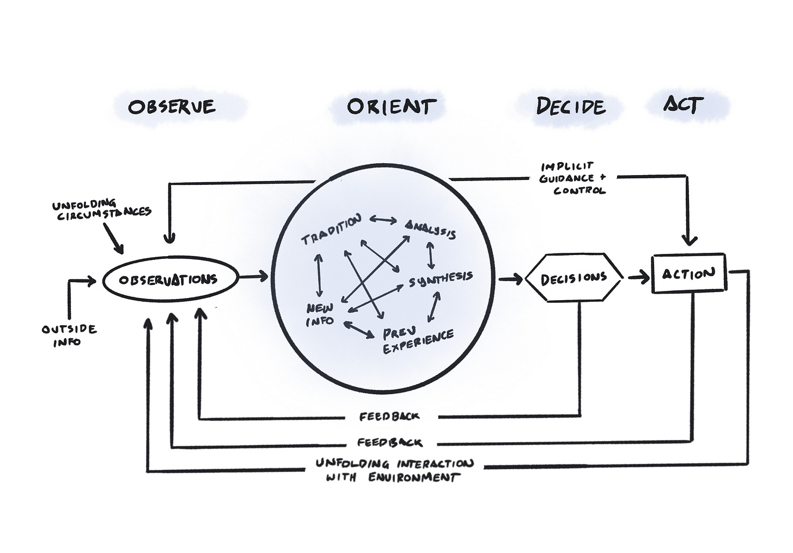
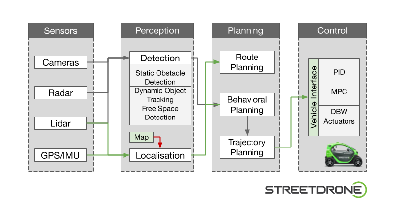
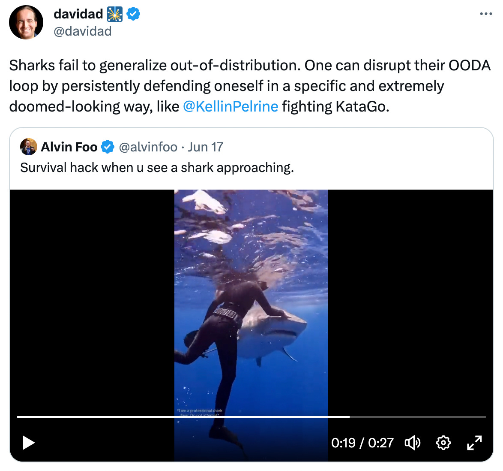

How does a fighter pilot win a dogfight? If you’re the world’s best dogfighter, you do it like this:  

战斗机飞行员如何赢得一场斗狗比赛？如果你是世界上最好的狗仔队，你是这样做的：

[Boyd’s OODA loop](https://en.wikipedia.org/wiki/OODA_loop). This diagram is how [John Boyd](https://en.wikipedia.org/wiki/John_Boyd_(military_strategist)) explained his ability to [win any dogfight in under 40 seconds](https://www.nytimes.com/2003/03/09/books/40-second-man.html#:~:text=An%20F%2D86%20pilot%20in%20the%20Korean%20War%2C%20he%20earned%20the%20nickname%20%27%2740%2DSecond%20Boyd%27%27%20as%20an%20instructor%20at%20the%20Fighter%20Weapons%20School%20at%20Nellis%20Air%20Force%20Base%2C%20where%2C%20according%20to%20legend%2C%20he%20could%20defeat%20any%20pilot%20who%20took%20him%20on%20in%20less%20than%2040%20seconds.).  

博伊德的OODA循环。这张图是约翰-博伊德解释他在40秒内赢得任何狗斗的能力。

-   Observe: sense your environment  
    
    观察：感知你的环境
    
-   Orient: make sense of your senses by constructing a world-model  
    
    东方：通过构建一个世界模型来理解你的感官
    
-   Decide: translate your model into a plan  
    
    决定：将你的模型转化为一个计划
    
-   Act: do something to effect a change  
    
    行动：做一些事情来实现改变
    

…Your actions cause direct changes to your environment, and ripple effects too. This feeds back into observation. A loop.  

......你的行为会给你的环境带来直接的变化，也会产生涟漪效应。这又反馈到观察中。一个循环。

There are other loops in this diagram, too. Your mental model—how you orient—effects what you observe, and how you act.  

这张图中还有其他的循环。你的心智模式--你的方向会影响你的观察，以及你的行为方式。  

Through Boyd’s lens, we begin to see a dogfight as a cybernetic system.  

通过博伊德的镜头，我们开始把斗犬看作是一个控制论系统。

Boyd developed the OODA loop framework to explain how fighter pilots win in a conflict.  

博伊德开发了OODA循环框架来解释战斗机飞行员如何在冲突中获胜。  

He drew from many unexpected sources—cybernetics, eastern philosophy, cognitive science, game theory, physics.  

他从许多意想不到的来源--网络学、东方哲学、认知科学、博弈论、物理学中汲取了营养。  

The resulting framework turns out to have broad applicability beyond conflict. It’s no accident, for example, that the OODA loop is almost identical to the sense-plan-act loop of [the robotic paradigm](https://en.wikipedia.org/wiki/Sense_Plan_Act).  

由此产生的框架被证明具有超越冲突的广泛适用性。例如，OODA循环与机器人范式的感知-计划-行动循环几乎相同，这并非偶然。

A sense-plan-act loop for a drone. This example has a two-pass planning process, first synthesizing sensors into higher-level perception, then planning actions.  

无人机的感知-计划-行动循环。这个例子有一个两段式的计划过程，首先将传感器综合为更高层次的感知，然后计划行动。

What we’re looking at is a general model for how an organism dances within its environment. The OODA loop is a framework for agency.  

我们正在看的是一个关于生物体如何在其环境中跳舞的一般模型。OODA循环是一个机构的框架。

For Boyd, the most important factor for survival is your sense-making system. This is the thing that keeps you oriented.  

对博伊德来说，生存的最重要因素是你的感觉系统。这是使你保持方向的东西。  

There’s a reason that “orient” is the biggest circle on the OODA diagram. We survive by making sense.  

方向 "是OODA图上最大的圆圈，这是有原因的。我们的生存方式是有意义的。

> Orientation is an ancient idea, embodied in the concept of mindfulness, but it is as modern as fighter pilots, who talk about maintaining “situation awareness.” What this emphasis on orientation does is make conflict into a learning contest to better maintain awareness of the world.  
> 
> 定向是一个古老的想法，体现在正念的概念中，但它和战斗机飞行员一样现代，他们谈论保持 "情况意识"。这种对定位的强调所做的是将冲突变成一场学习竞赛，以更好地保持对世界的认识。  
> 
> _(Richards, 2012. “[Boyd’s OODA Loop](https://www.agileleanhouse.com/lib/lib/Topics/OODALoop/Boyds_OODA_Loop_Its_Not_What_You_Think_I%20(1).pdf)”)  
> 
> (Richards, 2012. " Boyd's OODA Loop")_

When orientation breaks down—when you are _disoriented_—you lose your agency. Your model is wrong. You pay attention to the wrong things, your actions stop making sense, you flail.  

当定位出现问题时--当你迷失方向时--你就失去了你的机构。你的模式是错误的。你注意到了错误的事情，你的行动不再有意义，你摇摆不定。

In a dogfight, a pilot will try to disorient the adversary through “[fast transients](https://fasttransients.files.wordpress.com/2010/03/newconception.pdf)”, acting with unexpected tempo shifts, at faster timescales than the opponent.  

在一场斗狗比赛中，飞行员将试图通过 "快速瞬变 "使对手迷失方向，以出乎意料的节奏变化行事，时间尺度比对手快。

> Idea of fast transients suggests that, in order to win, we should operate at a faster tempo or rhythm than our adversaries—or, better yet, get inside adversary’s Observation–Orientation–Decision–Action time cycle or loop.  
> 
> 快速瞬变的概念表明，为了取胜，我们应该以比对手更快的速度或节奏运作，或者，更好的是，进入对手的观察-定位-决策-行动的时间周期或循环。  
> 
> Why?  为什么？  
> 
> Such activity will make us appear ambiguous (unpredictable) thereby generate confusion and disorder among our adversaries—since our adversaries will be unable to generate mental images or pictures that agree with the menacing as well as faster transient rhythm or patterns they are competing against.  
> 
> 这种活动将使我们显得模棱两可（不可预测），从而在我们的对手中产生混乱和无序--因为我们的对手将无法产生与他们正在竞争的威胁性以及更快的瞬时节奏或模式相一致的精神图像或图片。  
> 
> _(Boyd, 1981. [Patterns of Conflict](https://www.airuniversity.af.edu/Portals/10/AUPress/Books/B_0151_Boyd_Discourse_Winning_Losing.pdf))  
> 
> (Boyd, 1981. 冲突模式)_

> By maintaining better awareness, one can create opportunities to act in ways that opponents will see as highly irregular and disorienting.  
> 
> 通过保持更好的意识，人们可以创造机会，以对手认为非常不规范和混乱的方式行事。  
> 
> Boyd based much of his strategy on one of these, Sun Tzu’s “cheng ch’i”.  
> 
> 博伊德的大部分战略都是基于其中的一个，即孙子的 "程咬金"。  
> 
> _(Richards, 2012. “[Boyd’s OODA Loop](https://www.agileleanhouse.com/lib/lib/Topics/OODALoop/Boyds_OODA_Loop_Its_Not_What_You_Think_I%20(1).pdf)”)  
> 
> (Richards, 2012. " Boyd's OODA Loop")_

The timescale at which you can make sense is the timescale in which you have agency. When something acts faster than you can make sense of it, it _gets into_ your OODA loop. It unravels your ability to orient to what’s happening to you.  

你能理解的时间尺度就是你有机构的时间尺度。当某些东西的行动比你能理解它的速度快时，它就会进入你的OODA循环。它破坏了你对发生在你身上的事情的定向能力。

If it gets into your OODA loop, it’s game over. This insight goes way beyond player-vs-player conflict. Anything can get into your OODA loop. The _environment_ can get into your OODA loop.  

如果它进入了你的OODA循环，那么游戏就结束了。这种洞察力远远超出了玩家与玩家之间的冲突。任何东西都可以进入你的OODA循环。环境可以进入你的OODA循环。

Remember the period immediately after 2016, [The Great Weirding](https://studio.ribbonfarm.com/p/the-great-weirding)? That sense of dislocation was reality getting into the OODA loop of our institutions.  

All of us depend on institutions as part of our sense-making system, and so, to varying degrees, we all became disoriented. Remember the early stages of COVID,还记得2016年之后的那段时间吗？"大错特错"？那种错位感是现实进入了我们机构的OODA循环。 [all those explanations of the human inability to intuit exponential processes](https://twitter.com/search?q=virus%20intuition%20exponential%20since%3A2019-12-12%20until%3A2020-06-01)? A virus got into civilization’s OODA loop.  

我们所有人都依赖机构作为我们感觉系统的一部分，因此，在不同程度上，我们都变得无所适从。还记得COVID的早期阶段，所有那些关于人类无法直觉指数过程的解释吗？一种病毒进入了文明的OODA循环。

To maintain agency, an organism must orient to the tempo of its environment.  

为了保持代理权，生物体必须适应其环境的节奏。

> The mystery of life isn't a problem to solve, but a reality to experience. A process that cannot be understood by stopping it. We must move with the flow of the process.  
> 
> 生命的奥秘不是一个需要解决的问题，而是一个需要体验的现实。一个无法通过阻止它来理解的过程。我们必须随着过程的流动而移动。  
> 
> We must join it. 我们必须加入它。  
> 
> _([Dune, 2021](https://www.youtube.com/watch?v=0RNG8ujLmVk)) ( 《沙丘》，2021年)_

The tempo of our environment has accelerated. [We’ve hit an information scaling threshold](https://subconscious.substack.com/i/79213755/weve-hit-an-information-scaling-threshold), and the internet has gotten into everyone’s OODA loop.  

我们环境的节奏加快了。我们已经达到了一个信息缩放的门槛，互联网已经进入了每个人的OODA循环。

From _[Thinking Together](https://subconscious.substack.com/p/thinking-together):_ 摘自《共同思考》：

> The internet has massively increased the complexity of our information environment, but hasn’t yet produced the tools to make sense of it.  
> 
> 互联网极大地增加了我们信息环境的复杂性，但还没有产生使其合理化的工具。  
> 
> Old forms of social sensemaking—institutions, universities, democracy, tradition—all seem to be DDOS’d by the new information environment. They can’t keep up!  
> 
> 旧的社会感觉形式--机构、大学、民主、传统--似乎都被新的信息环境DDOS了。他们无法跟上!
> 
> The cost of forking realities has dropped below the Coasean floor, and there’s little incentive to merge realities.  
> 
> 分叉现实的成本已经降到了科斯的底线以下，而且没有什么动力去合并现实。  
> 
> We fractally fragment understandings, then algorithmically amplify the confusion to maximize engagement.  
> 
> 我们将理解碎片化，然后通过算法将混乱放大，使参与度最大化。  
> 
> The most effective coordination mechanisms left seem to be memes and conspiracy theories.  
> 
> 剩下最有效的协调机制似乎是备忘录和阴谋论。
> 
> Philosopher Paul Tillich posits that when social sensemaking fails to keep up with reality, we experience it as a kind of mass neurosis.  
> 
> 哲学家保罗-蒂利希（Paul Tillich）认为，当社会感性认识跟不上现实时，我们就会体验到它是一种大众神经症。  
> 
> Everybody has a crisis of meaning at the same time. Life stops making sense.  
> 
> 每个人都在同一时间出现了意义危机。生活不再有意义。

To have agency in this new environment, we must construct sense-making systems that can orient at the speed of the network. We must move with the flow of the process.  

为了在这个新环境中拥有代理权，我们必须构建能够以网络的速度定位的感知系统。我们必须随着进程的流动而移动。

> It's the law of requisite variety, which says that if you want to make sense of a complex world, you've got to have an internal system that is equally complex.  
> 
> 这是必要的多样性法则，它说如果你想让一个复杂的世界变得有意义，你必须有一个同样复杂的内部系统。  
> 
> _(Weick, 1996, [Complicate Yourself](https://www.wired.com/1996/04/weick/))  
> 
> (Weick, 1996, Complicate Yourself)_

Tools for thought are **tools for orientation**. They’re the big circle in the OODA diagram. A tool for thought…  

思考的工具是定位的工具。它们是OODA图中的大圆圈。思考的工具...

-   **Expands your awareness**. The more you sense, the broader your ability to orient in your environment.  
    
    拓展你的意识。你感知的越多，你在环境中定位的能力就越广泛。
    
-   **[Builds up a memory across time](https://subconscious.substack.com/p/notes-are-conversations-across-time)**. Expanding your time horizon into a long now lets you act across broader timescales, lets you [generalize across wider distributions](https://twitter.com/davidad/status/1670231999762792453?s=20), and avoid [fat tailed risks](https://codowd.com/bigdata/misc/Taleb_Statistical_Consequences_of_Fat_Tails.pdf).  
    
    建立一个跨时间的记忆。将你的时间范围扩大到现在，可以让你在更广泛的时间尺度上采取行动，让你在更广泛的分布中进行归纳，并避免肥尾风险。
    
-   **Broadens the surface area for luck to strike**, by [collecting stepping stones that expand your adjacent possible](https://subconscious.substack.com/p/stepping-stones-in-possibility-space).  
    
    扩大运气的表面积，通过收集垫脚石来扩大你邻近的可能。
    
-   **Increases your bandwidth for synthesis** by [augmenting our intellect](https://www.dougengelbart.org/pubs/augment-3906.html), and [provoking creative insights](https://subconscious.substack.com/p/creativity-can-be-provoked-on-demand).  
    
    通过增强我们的智力和激发创造性的洞察力，增加你的综合带宽。
    
-   **Evolves the complexity of your world-model**. [The bigger the memes, the complex-er your thoughts](https://subconscious.substack.com/p/ideas-procreate-through-citation).  
    
    演化出你的世界模型的复杂性。记忆体越大，你的思想就越复杂。
    

There is too much complexity out there for one brain to handle. It’s time to build a second brain.  

外面有太多的复杂性，一个大脑无法处理。现在是建立第二个大脑的时候了。  

Tools for thought give us the requisite variety for agency in complex environments.  

思考的工具给了我们在复杂环境中进行代理的必要的多样性。

Better yet, we can share our second brains, combine insights, expand our ability to orient together.  

更好的是，我们可以分享我们的第二大脑，结合洞察力，扩大我们共同的定向能力。

That’s what we’re building toward. [Subconscious is a tool for thought](https://subconscious.substack.com/p/subconscious-raises-a-seed). It’s enchanted with AI agents that help you orient, and powered by [Noosphere](https://subconscious.substack.com/p/noosphere-a-protocol-for-thought), a worldwide decentralized knowledge graph. Share your thoughts, follow others. Every follow is a new synapse in your second brain.  

这就是我们的建设方向。潜意识是一个思考的工具。它被帮助你确定方向的人工智能代理所迷惑，并由世界范围内的分散知识图谱Noosphere提供动力。分享你的想法，关注他人。每一个关注都是你第二大脑中的一个新的突触。

_Come [join the Subconscious Discord](https://discord.gg/wyHPzGraBh) community.  

来加入潜意识 Discord 社区。_

### Subscribe to Subconscious  

订阅《潜意识》杂志

The web began as a tool for thought  

网络开始是一种思想的工具
