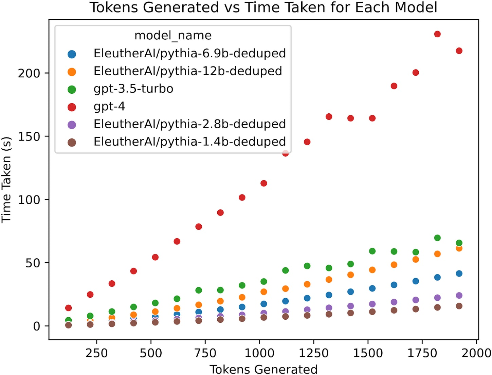
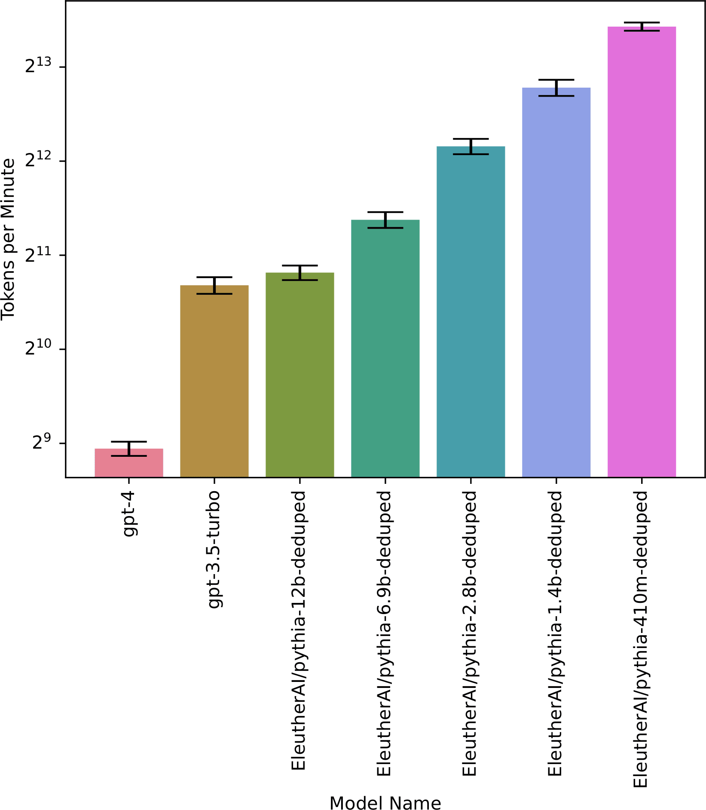

Crossposted from the [AI Alignment Forum](https://alignmentforum.org/posts/WZXqNYbJhtidjRXSi/what-will-gpt-2030-look-like). May contain more technical jargon than usual.  

交叉发布自 AI 联盟论坛。可能包含比平时更多的技术术语。

GPT-4 surprised many people with its abilities at coding, creative brainstorming, letter-writing, and other skills. Surprises in machine learning are not restricted to GPT-4: I was [previously surprised](https://bounded-regret.ghost.io/ai-forecasting-one-year-in/) by Minerva’s mathematical abilities, as were many competitive forecasters.  

GPT-4 的编码、创意头脑风暴、写信和其他技能让许多人感到惊讶。机器学习中的惊喜不仅限于 GPT-4：我之前对 Minerva 的数学能力感到惊讶，许多竞争性的预测者也是如此。

How can we be less surprised by developments in machine learning? Our brains often implicitly make a [zeroth-order forecast](https://forecasting.quarto.pub/book/zeroth-first.html?ref=bounded-regret.ghost.io): looking at the current state of the art, and adding on improvements that “feel reasonable”.  

我们怎样才能对机器学习的发展不感到惊讶呢？我们的大脑经常隐含地做出零阶预测：着眼于当前的技术水平，并添加“感觉合理”的改进。  

But what “seems reasonable” is prone to cognitive bias, and will underestimate progress in a fast-moving field like ML. A more effective approach is [first-order forecasting](https://forecasting.quarto.pub/book/zeroth-first.html?ref=bounded-regret.ghost.io#first-order-approximation): quantifying the historical rate of progress and extrapolating it forward, while also considering reasons for possible slowdowns or speedups.<a href="https://www.lesswrong.com/posts/WZXqNYbJhtidjRXSi/what-will-gpt-2030-look-like#fn1">[1]</a>  

但“看似合理”的东西很容易产生认知偏差，并且会低估像机器学习这样快速发展的领域的进展。更有效的方法是一阶预测：量化历史进展速度并向前推断，同时还考虑可能放缓或加速的原因。 <a href="https://www.lesswrong.com/posts/WZXqNYbJhtidjRXSi/what-will-gpt-2030-look-like#fn1">[1]</a>

In this post, I’ll use this approach to forecast the properties of large pretrained ML systems in 2030. I’ll refer throughout to “GPT2030”, a hypothetical system that has the capabilities, computational resources, and inference speed that we’d project for large language models in 2030 (but which was likely trained on other modalities as well, such as images). To forecast GPT2030’s properties, I consulted a variety of sources, including empirical scaling laws, projections of future compute and data availability, velocity of improvement on specific benchmarks, empirical inference speed of current systems, and possible future improvements in parallelism.  

在这篇文章中，我将使用这种方法来预测 2030 年大型预训练机器学习系统的属性。我将通篇提及“GPT 2030 ”，这是一个假设的系统，其功能、计算资源和推理速度我们计划在 2030 年建立大型语言模型（但也可能在其他模式上进行训练，例如图像）。为了预测 GPT 2030 的属性，我查阅了各种来源，包括经验缩放定律、对未来计算和数据可用性的预测、特定基准的改进速度、当前系统的经验推理速度以及未来可能的并行改进。

GPT2030’s capabilities turn out to be surprising (to me at least). In particular, GPT2030 will enjoy a number of significant advantages over current systems<a href="https://www.lesswrong.com/posts/WZXqNYbJhtidjRXSi/what-will-gpt-2030-look-like#fn2">[2]</a>, as well as (in at least some important respects) current human workers:  

GPT 2030 的功能令人惊讶（至少对我来说）。特别是，与当前系统 <a href="https://www.lesswrong.com/posts/WZXqNYbJhtidjRXSi/what-will-gpt-2030-look-like#fn2">[2]</a> 以及（至少在某些重要方面）当前的人类工作者相比，GPT 2030 将享有许多显着优势：

1.  GPT2030 will likely be superhuman at various specific tasks, including coding, hacking, and math, and potentially protein engineering ([Section 1](https://www.lesswrong.com/posts/WZXqNYbJhtidjRXSi/what-will-gpt-2030-look-like#1-specific-capabilities)).  
    
    GPT 2030 在各种特定任务上可能会成为超人，包括编码、黑客和数学，以及潜在的蛋白质工程（第 1 节）。
2.  GPT2030 can “work” and “think” quickly: I estimate it will be 5x as fast as humans as measured by words processed per minute _\[range: 0.5x-20x\]_<a href="https://www.lesswrong.com/posts/WZXqNYbJhtidjRXSi/what-will-gpt-2030-look-like#fn3">[3]</a>, and that this could be increased to 125x by paying 5x more per FLOP ([Section 2](https://www.lesswrong.com/posts/WZXqNYbJhtidjRXSi/what-will-gpt-2030-look-like#2-inference-speed)).  
    
    GPT 2030 可以快速“工作”和“思考”：我估计，以每分钟处理的单词数来衡量，它的速度将是人类的 5 倍 \[范围：0.5x-20x\] <a href="https://www.lesswrong.com/posts/WZXqNYbJhtidjRXSi/what-will-gpt-2030-look-like#fn3">[3]</a> ，并且可以增加到125 倍，每翻牌支付 5 倍（第 2 节）。
3.  GPT2030 can be copied arbitrarily and run in parallel. The organization that trains GPT2030 would have enough compute to run many parallel copies: I estimate enough to perform 1.8 million years of work when adjusted to human working speeds _\[range: 0.4M-10M years\]_ ([Section 3](https://www.lesswrong.com/posts/WZXqNYbJhtidjRXSi/what-will-gpt-2030-look-like#3-throughput-and-parallel-copies)). Given the 5x speed-up in the previous point, this work could be done in 2.4 months.  
    
    GPT 2030 可以任意复制并并行运行。训练 GPT 2030 的组织将有足够的计算来运行许多并行副本：我估计，当调整到人类工作速度时，足以执行 180 万年的工作 \[范围：0.4M-10M 年\]（第 3 节）。鉴于上一点的速度提高了 5 倍，这项工作可以在 2.4 个月内完成。
4.  GPT2030's copies can share knowledge due to having identical model weights, allowing for rapid parallel learning: I estimate 2,500 human-equivalent years of learning in 1 day ([Section 4](https://www.lesswrong.com/posts/WZXqNYbJhtidjRXSi/what-will-gpt-2030-look-like#4-knowledge-sharing)).  
    
    GPT 2030 的副本由于具有相同的模型权重，可以共享知识，从而允许快速并行学习：我估计 1 天内可学习 2,500 个人类等效年数（第 4 节）。
5.  GPT2030 will be trained on additional modalities beyond text and images, possibly including counterintuitive modalities such as molecular structures, network traffic, low-level machine code, astronomical images, and brain scans.  
    
    GPT 2030 将接受文本和图像之外的其他模式的训练，可能包括反直觉的模式，例如分子结构、网络流量、低级机器代码、天文图像和脑部扫描。  
    
    It may therefore possess a strong intuitive grasp of domains where we have limited experience, including forming concepts that we do not have ([Section 5](https://www.lesswrong.com/posts/WZXqNYbJhtidjRXSi/what-will-gpt-2030-look-like#5-modalities-tools-and-actuators)).  
    
    因此，它可能对我们经验有限的领域有很强的直觉把握，包括形成我们没有的概念（第 5 节）。

These capabilities would, at minimum, accelerate many areas of research while also creating serious vectors for misuse ([Section 6](https://www.lesswrong.com/posts/WZXqNYbJhtidjRXSi/what-will-gpt-2030-look-like#6-implications-of-gpt-2030)). Regarding misuse, GPT2030's programming abilities, parallelization, and speed would make it a potent cyberoffensive threat.  

这些能力至少会加速许多领域的研究，同时也会造成严重的滥用（第 6 节）。关于滥用，GPT 2030 的编程能力、并行性和速度将使其成为潜在的网络攻击威胁。  

Additionally, its rapid parallel learning could be turned towards human behavior and thus used to manipulate and misinform with the benefit of thousands of "years" of practice.  

此外，它的快速并行学习可以转向人类行为，从而利用数千“年”的实践来操纵和误导。

On acceleration, a main bottleneck will be autonomy. In a domain like mathematics research where work can be checked automatically, I’d predict that GPT2030 will outcompete most professional mathematicians. In machine learning, I’d predict that GPT2030 will independently execute experiments and generates plots and write-ups, but that graduate students and research scientists will provide direction and evaluate results.  

在加速方面，一个主要瓶颈将是自主性。在像数学研究这样可以自动检查工作的领域，我预测 GPT 2030 将胜过大多数专业数学家。在机器学习中，我预测 GPT 2030 将独立执行实验并生成图表和文章，但研究生和研究科学家将提供方向并评估结果。  

In both cases, GPT2030 will be an integral part of the research process.  

在这两种情况下，GPT 2030 将成为研究过程中不可或缺的一部分。

My forecast of GPT2030’s properties are not intuitive from looking at today’s systems, and they may be wrong, since there is significant uncertainty about how ML will look in 2030. However, properties (1.-5.) above are my median bet, and whatever GPT2030 is like, I doubt it will be “GPT-4 but a bit better”.  

从今天的系统来看，我对 GPT 2030 属性的预测并不直观，而且可能是错误的，因为 2030 年 ML 的外观存在很大的不确定性。但是，上述属性 (1.-5.) 是我的中位数赌注是，无论 GPT 2030 是什么样，我怀疑它会是“GPT-4，但更好一点”。

If I’m right, then whatever the impacts of AI are, they won’t be small.  

如果我是对的，那么无论人工智能的影响有多大，都不会小。  

We should be preparing for those impacts now, asking what will happen at the largest scales (on the order of $1T, 10M lives, or significant disruptions to social processes).  

我们现在应该为这些影响做好准备，询问在最大规模的情况下会发生什么（大约 1T 美元、1000 万人的生命或对社会进程的重大破坏）。  

It’s better to be surprised now, rather than in 7 years when the system is already being rolled out.  

最好现在就感到惊讶，而不是等到 7 年后系统已经推出时才感到惊讶。

## 1\. Specific Capabilities  

1\. 具体能力

I expect GPT2030 to have superhuman coding, hacking, and mathematical abilities.  

我期望 GPT 2030 具有超人的编码、黑客和数学能力。  

I also expect it to be superhuman in its ability to read and process large corpora for patterns and insights and to recall facts. Finally, since [AlphaFold](https://www.nature.com/articles/s41586-021-03819-2?ref=bounded-regret.ghost.io) and [AlphaZero](https://arxiv.org/abs/1712.01815?ref=bounded-regret.ghost.io) had superhuman abilities in protein engineering and game-playing, GPT2030 could as well, for instance if it was trained multimodally on similar data to the AlphaFold/AlphaZero models.  

我还期望它在阅读和处理大型语料库以获取模式和见解以及回忆事实的能力方面具有超人的能力。最后，由于 AlphaFold 和 AlphaZero 在蛋白质工程和游戏方面具有超人的能力，GPT 2030 也可以，例如，如果它在与 AlphaFold/AlphaZero 模型类似的数据上进行多模式训练。

**Programming**. GPT-4 outperformed a strong human baseline on LeetCode problems posed after its training cutoff ([Bubeck et al. 2023](https://arxiv.org/abs/2303.12712?ref=bounded-regret.ghost.io), Table 2), and passed the mock interview for several major tech companies (Figure 1.5). The velocity of improvement remains high, with a 19% jump from GPT-3 to 4. On the more challenging CodeForces competition, GPT-4 does less well, but AlphaCode is [on par with](https://www.science.org/doi/epdf/10.1126/science.abq1158?ref=bounded-regret.ghost.io) the median CodeForces competitor. On the even more challenging APPS dataset, [Parsel](https://arxiv.org/abs/2212.10561v2?ref=bounded-regret.ghost.io) further outperforms AlphaCode (7.8%->25.5%). Looking forward, the forecasting platform Metaculus gives [a median year of 2027](https://www.metaculus.com/questions/7398/ai-competency-on-competitive-programming/?ref=bounded-regret.ghost.io) for 80% on APPS, which would exceed all but the very best humans.<a href="https://www.lesswrong.com/posts/WZXqNYbJhtidjRXSi/what-will-gpt-2030-look-like#fn4">[4]</a>  

编程。 GPT-4 在训练截止后提出的 LeetCode 问题上表现优于人类基线（Bubeck et al. 2023，表 2），并通过了几家主要科技公司的模拟面试（图 1.5）。改进的速度仍然很高，从 GPT-3 到 4 跃升了 19%。在更具挑战性的 CodeForces 竞争中，GPT-4 表现较差，但 AlphaCode 与 CodeForces 竞争对手的中等水平相当。在更具挑战性的 APPS 数据集上，Parsel 进一步优于 AlphaCode (7.8%->25.5%)。展望未来，预测平台 Metaculus 在 APPS 上给出的 80% 的中位年份是 2027 年，这将超过除了最优秀的人类之外的所有人。 <a href="https://www.lesswrong.com/posts/WZXqNYbJhtidjRXSi/what-will-gpt-2030-look-like#fn4">[4]</a>

**Hacking**. I expect hacking to improve with general coding ability, plus ML models can scour large codebases for vulnerabilities much more scalably and conscientiously than humans. ChatGPT has already been used to [generate](https://research.checkpoint.com/2023/opwnai-cybercriminals-starting-to-use-chatgpt/?ref=bounded-regret.ghost.io) [exploits](https://research.checkpoint.com/2022/opwnai-ai-that-can-save-the-day-or-hack-it-away/?ref=bounded-regret.ghost.io), including [polymorphic malware](https://www.cyberark.com/resources/threat-research-blog/chatting-our-way-into-creating-a-polymorphic-malware?ref=bounded-regret.ghost.io), which is typically considered to be an advanced offensive capability.  

黑客攻击。我预计黑客攻击会随着一般编码能力的提高而提高，而且机器学习模型可以比人类更大规模、更认真地搜索大型代码库中的漏洞。 ChatGPT 已被用于生成漏洞利用程序，包括多态恶意软件，这通常被认为是一种高级攻击能力。

**Math**. [Minerva](https://arxiv.org/abs/2206.14858?ref=bounded-regret.ghost.io) achieved 50% accuracy on a competition math benchmark (MATH), which is better than most human competitors.  

数学。 Minerva 在竞赛数学基准 (MATH) 上达到了 50% 的准确率，这比大多数人类竞争对手都要好。  

The velocity of progress is high (>30% in 1 year), and there is significant low-hanging fruit via [autoformalization](https://arxiv.org/abs/2205.12615?ref=bounded-regret.ghost.io), reducing arithmetic errors, [improving chain-of-thought](https://arxiv.org/abs/2207.10342?ref=bounded-regret.ghost.io), and [better data](https://arxiv.org/abs/2206.14858?ref=bounded-regret.ghost.io)<a href="https://www.lesswrong.com/posts/WZXqNYbJhtidjRXSi/what-will-gpt-2030-look-like#fn5">[5]</a>. Metaculus predicts [92% on MATH by 2025](https://www.metaculus.com/questions/11675/math-sota-ai-performance/?ref=bounded-regret.ghost.io), and gives a [median year of 2028](https://www.metaculus.com/questions/6728/ai-wins-imo-gold-medal/?ref=bounded-regret.ghost.io) for AI winning a gold medal at the International Math Olympiad, on par with the best high school students in the world. I personally expect GPT2030 to be better than most professional mathematicians at proving well-posed theorems.<a href="https://www.lesswrong.com/posts/WZXqNYbJhtidjRXSi/what-will-gpt-2030-look-like#fn6">[6]</a>  

进展速度很快（一年内>30%），并且通过自动形式化实现了显着的唾手可得的成果，减少了算术错误，改善了思想链，并提供了更好的数据 <a href="https://www.lesswrong.com/posts/WZXqNYbJhtidjRXSi/what-will-gpt-2030-look-like#fn5">[5]</a> 。 Metaculus 预测，到 2025 年，数学成绩将达到 92%，并给出了 2028 年人工智能在国际数学奥林匹克竞赛中赢得金牌的中位年份，与世界上最好的高中生持平。我个人预计 GPT 2030 在证明适定定理方面比大多数专业数学家更好。 <a href="https://www.lesswrong.com/posts/WZXqNYbJhtidjRXSi/what-will-gpt-2030-look-like#fn6">[6]</a>

**Information processing**. Factual recall and processing large corpora are natural consequences of language models’ memorization capabilities and large context windows. Empirically, GPT-4 achieves [86% accuracy on MMLU](https://cdn.openai.com/papers/gpt-4.pdf?ref=bounded-regret.ghost.io), a broad suite of standardized exams including the bar exam, MCAT, and college math, physics, biochemistry, and philosophy; even accounting for likely train-test contamination, this probably exceeds the breadth of knowledge of any living human.  

信息处理。事实回忆和处理大型语料库是语言模型的记忆能力和大型上下文窗口的自然结果。根据经验，GPT-4 在 MMLU 上的准确率达到 86%，MMLU 是一套广泛的标准化考试，包括律师考试、MCAT 以及大学数学、物理、生物化学和哲学；即使考虑到可能的列车测试污染，这也可能超出了任何活着的人类的知识广度。  

Regarding large corpora, [Zhong et al. (2023)](https://arxiv.org/abs/2302.14233?ref=bounded-regret.ghost.io) used GPT-3 to construct a system that discovered and described several previously unknown patterns in large text datasets, and scaling trends on a related task in [Bills et al. (2023)](https://openaipublic.blob.core.windows.net/neuron-explainer/paper/index.html?ref=bounded-regret.ghost.io#sec-assistant-trends) suggest that models will soon be superhuman. Both of these works exploit the large context windows of LLMs, which are now over [100,000 tokens](https://www.anthropic.com/index/100k-context-windows?ref=bounded-regret.ghost.io) and growing.  

关于大型语料库，Zhong 等人。 (2023) 使用 GPT-3 构建了一个系统，该系统发现并描述了大型文本数据集中的几种以前未知的模式，以及 Bills 等人中相关任务的扩展趋势。 （2023）表明模型很快就会成为超人。这两项工作都利用了 LLM 的大型上下文窗口，目前该窗口已超过 100,000 个标记，并且还在不断增长。

More generally, **ML models have a different skill profile than humans**, since humans and ML were adapted to very different data sources (evolution vs. massive internet data).  

更一般地说，机器学习模型具有与人类不同的技能特征，因为人类和机器学习适应非常不同的数据源（进化与海量互联网数据）。  

At the point that models are human-level at tasks such as video recognition, they will likely be superhuman at many other tasks (such as math, programming, and hacking).  

当模型在视频识别等任务上达到人类水平时，它们在许多其他任务（例如数学、编程和黑客攻击）上可能会成为超人。  

Furthermore, additional strong capabilities will [likely emerge over time](https://bounded-regret.ghost.io/future-ml-systems-will-be-qualitatively-different/) due to larger models and better data, and there is no strong reason to expect model capabilities to “level out” at or below human-level.  

此外，随着时间的推移，由于更大的模型和更好的数据，额外的强大功能可能会出现，并且没有充分的理由期望模型能力“达到”或低于人类水平。  

While it is possible that current deep learning approaches will fall short of human-level capabilities in some domains, it is also possible that they will surpass them, perhaps significantly, especially in domains such as math that humans are not evolutionarily specialized for.  

虽然当前的深度学习方法可能在某些领域达不到人类水平的能力，但它们也有可能超越人类水平，也许是显着的超越，特别是在数学等人类在进化上并不专门化的领域。

## 2\. Inference Speed 2\. 推理速度

_(Thanks to Lev McKinney for running the performance benchmarks for this section.)  

（感谢 Lev McKinney 运行本部分的性能基准测试。）_

To study the speed of ML models, we’ll measure how quickly ML models generate text, benchmarking against the human thinking rate of 380 words per minute ([Korba (2016)](https://journals.sagepub.com/doi/abs/10.2466/pms.1990.71.3.1043?ref=bounded-regret.ghost.io), see also [Appendix A](https://www.lesswrong.com/posts/WZXqNYbJhtidjRXSi/what-will-gpt-2030-look-like#a-words-per-minute)). Using OpenAI's [chat completions API](https://platform.openai.com/docs/guides/chat?ref=bounded-regret.ghost.io), we estimate that gpt-3.5-turbo can generate 1200 words per minute (wpm), while gpt-4 generates 370 wpm, as of early April 2023. Smaller open source models like [pythia-12b](https://huggingface.co/EleutherAI/pythia-12b-deduped?ref=bounded-regret.ghost.io) achieve at least 1350 wpm with out-of-the-box tools on an A100 GPU, and twice this appears possible with further optimization.  

为了研究 ML 模型的速度，我们将测量 ML 模型生成文本的速度，以每分钟 380 个单词的人类思维速度为基准（Korba (2016)，另请参阅附录 A）。使用 OpenAI 的聊天完成 API，我们估计 gpt-3.5-turbo 每分钟可以生成 1200 个单词 (wpm)，而 gpt-4 可以生成 370 wpm，截至 2023 年 4 月上旬。像 pythia-12b 这样的小型开源模型至少可以达到 1350 个单词wpm 在 A100 GPU 上使用开箱即用的工具，通过进一步优化，这似乎是可能的两倍。

Thus, if we consider OpenAI models as of April, we are either at roughly 3x human speed, or equal to human speed.  

因此，如果我们考虑截至 4 月份的 OpenAI 模型，我们要么大约是人类速度的 3 倍，要么等于人类速度。  

I predict that models will have faster inference speed in the future, as there are strong commercial and practical pressures towards speeding up inference.  

我预测未来模型的推理速度将会更快，因为加速推理存在强大的商业和实际压力。  

Indeed, in the week leading up to this post, GPT-4’s speed already increased to around 540wpm (12 tokens/second), according to [Fabien Roger’s tracking data](https://fabienroger.github.io/trackoai/?ref=bounded-regret.ghost.io); this illustrates that there is continuing room and appetite for improvement.  

事实上，根据 Fabien Roger 的跟踪数据，在撰写本文之前的一周内，GPT-4 的速度已经提高到约 540wpm（12 个令牌/秒）；这表明仍有持续改进的空间和需要。

My median forecast is that models will have **5x the words/minute of humans** (range: \[0.5x, 20x\]), as that is roughly where there would be diminishing practical benefits to further increases, though there are considerations pointing to both higher or lower numbers.  

我的预测中位数是，模型每分钟的单词数将是人类的 5 倍（范围：\[0.5x, 20x\]），因为这大致是进一步增加的实际收益会递减的地方，尽管有考虑指出更高或较低的数字。  

I provide a detailed list of these considerations in [Appendix A](https://www.lesswrong.com/posts/WZXqNYbJhtidjRXSi/what-will-gpt-2030-look-like#a-words-per-minute), as well as comparisons of speeds across model scales and full details of the experiments above.  

我在附录 A 中提供了这些考虑因素的详细列表，以及跨模型规模的速度比较和上述实验的完整细节。

Importantly, **the speed of an ML model is not fixed**. Models’ serial inference speed can be [increased by $k^2$ at a cost of a $k$-fold reduction in throughput](https://bounded-regret.ghost.io/how-fast-can-we-perform-a-forward-pass/) (in other words, $k^3$ parallel copies of a model can be replaced with a single model that is $k^2$ times faster).  

重要的是，机器学习模型的速度不是固定的。模型的串行推理速度可以提高 $k^2$，但代价是吞吐量降低 $k$ 倍（换句话说，模型的 $k^3$ 并行副本可以替换为单个模型）快 $k^2$ 倍）。  

This can be done via a parallel tiling scheme that theoretically works even for large values of $k^2$, likely at least 100 and possibly more.  

这可以通过并行平铺方案来完成，理论上该方案甚至适用于 $k^2$ 的大值，可能至少为 100，甚至可能更多。  

Thus, a model that is 5x human speed could be sped up to 125x human speed by setting $k=5$.  

因此，通过设置 $k=5$，可以将 5 倍人类速度的模型加速到 125 倍人类速度。

An important caveat is that speed is not necessarily matched by quality: as discussed in [Section 1](https://www.lesswrong.com/posts/WZXqNYbJhtidjRXSi/what-will-gpt-2030-look-like#1-specific-capabilities), GPT2030 will have a different skill profile than humans, failing at some tasks we find easy and mastering some tasks we find difficult. We should therefore not think of GPT2030 as a "sped-up human", but as a "sped-up worker" with a potentially counterintuitive skill profile.  

一个重要的警告是，速度不一定与质量相匹配：正如第 1 节中所讨论的，GPT 2030 将具有与人类不同的技能概况，在我们认为容易的一些任务上失败，并掌握一些我们认为困难的任务。因此，我们不应将 GPT 2030 视为“加速的人类”，而应将其视为具有潜在违反直觉的技能概况的“加速的工人”。

Nevertheless, considering speed-ups is still informative, especially when they are large.  

尽管如此，考虑加速仍然可以提供信息，特别是当加速很大时。  

For language models with a 125x speed-up, cognitive actions that take us a day could be completed in minutes, assuming they were within GPT2030's skill profile. Using the earlier example of hacking, exploits or attacks that are slow for us to generate could be created quickly by ML systems.  

对于加速 125 倍的语言模型，假设我们花一天时间的认知动作在 GPT 2030 的技能范围内，则可以在几分钟内完成。使用前面的黑客攻击示例，机器学习系统可以快速创建我们生成缓慢的漏洞或攻击。

## 3\. Throughput and Parallel Copies  

3\. 吞吐量和并行副本

Models can be copied arbitrarily subject to available compute and memory. This allows them to quickly do any work that can be effectively parallelized.  

模型可以根据可用的计算和内存任意复制。这使他们能够快速完成任何可以有效并行的工作。  

In addition, once one model is fine-tuned to be particularly effective, the change could be immediately propagated to other instances.  

此外，一旦一个模型被微调到特别有效，这种变化就可以立即传播到其他实例。  

Models could also be distilled for specialized tasks and thus run faster and more cheaply.  

模型还可以针对专门的任务进行提炼，从而运行得更快、更便宜。

There will likely be enough resources to run many copies of a model once it has been trained.  

一旦模型经过训练，可能会有足够的资源来运行模型的多个副本。  

This is because training a model requires running many parallel copies of it, and whatever organization trained the model will still have those resources at deployment time.  

这是因为训练模型需要运行它的许多并行副本，并且任何训练模型的组织在部署时仍然拥有这些资源。  

We can therefore lower bound the number of copies by estimating training costs.  

因此，我们可以通过估计培训成本来降低副本数量。

As an example of this logic, the cost of training GPT-3 was enough to run it for 9 x 1011 forward passes. To put that into human-equivalent terms, humans think at 380 words per minute (see [Appendix A](https://www.lesswrong.com/posts/WZXqNYbJhtidjRXSi/what-will-gpt-2030-look-like#a-words-per-minute)) and one word is 1.33 tokens on average, so 9 x 1011 forward passes corresponds to ~3400 years of work at human speed.  

作为此逻辑的一个示例，训练 GPT-3 的成本足以运行 9 x 10 11 前向传递。用人类等效的术语来说，人类以每分钟 380 个单词的速度思考（参见附录 A），一个单词平均为 1.33 个标记，因此 9 x 10 11 前向传递相当于以人类速度计算约 3400 年的工作。  

Therefore, the organization could run 3400 parallel copies of the model for a full year at human working-speeds, or the same number of copies for 2.4 months at 5x human speed.  

因此，该组织可以以人类工作速度运行全年 3400 个模型的并行副本，或者以 5 倍人类速度运行相同数量的副本 2.4 个月。

Let's next project this same “training overhang” (ratio of training to inference cost) for future models.  

接下来让我们为未来的模型预测同样的“训练过剩”（训练与推理成本的比率）。  

It should be larger: the main reason is that training overhang is roughly proportional to dataset size, and datasets are increasing over time.  

它应该更大：主要原因是训练过剩大致与数据集大小成正比，并且数据集随着时间的推移而增加。  

This trend will be slowed as we run out of naturally-occuring language data, but new modalities as well as synthetic or self-generated data will still push it forward.<a href="https://www.lesswrong.com/posts/WZXqNYbJhtidjRXSi/what-will-gpt-2030-look-like#fn7">[7]</a> In [Appendix B](https://www.lesswrong.com/posts/WZXqNYbJhtidjRXSi/what-will-gpt-2030-look-like#b-training-overhang), I consider these factors in detail to project forward to 2030. I forecast that models in 2030 will be trained with enough resources to perform **1,800,000 years of work** adjusted to human speed _\[range: 400k-10M\]_.  

随着我们耗尽自然产生的语言数据，这一趋势将会放缓，但新的模式以及合成或自我生成的数据仍将推动这一趋势向前发展。 <a href="https://www.lesswrong.com/posts/WZXqNYbJhtidjRXSi/what-will-gpt-2030-look-like#fn7">[7]</a> 在附录 B 中，我详细考虑了这些因素，以预测到 2030 年。我预测 2030 年的模型将有足够的资源进行训练，以执行根据人类速度调整的 1,800,000 年的工作\[范围：400k-10M\]。

Note that [Cotra (2020)](https://www.lesswrong.com/posts/KrJfoZzpSDpnrv9va/draft-report-on-ai-timelines?ref=bounded-regret.ghost.io) and [Davidson (2023)](https://www.planned-obsolescence.org/continuous-doesnt-mean-slow/?ref=bounded-regret.ghost.io) estimate similar quantities and arrive at larger numbers than me; I'd guess the main difference is how I model the effect of running out of natural language data.  

请注意，Cotra (2020) 和 Davidson (2023) 估计了类似的数量，但得出的数字比我更大；我猜主要的区别在于我如何对自然语言数据耗尽的影响进行建模。

The projection above is somewhat conservative, since models may be run on more resources than they were trained on if the organization buys additional compute. A [quick ballpark estimate](https://docs.google.com/spreadsheets/d/1Pz0YVJalZbdo63FI-rCa7baBkGsiuYv5P34Rpt9IZfE/edit?ref=bounded-regret.ghost.io#gid=0) suggests that GPT-4 was trained on about 0.01% of all computational resources in the world, although I expect future training runs to use up a larger share of total world compute and therefore have less room to scale up further after training.  

上面的预测有些保守，因为如果组织购买额外的计算，模型可能会在比训练时使用的资源更多的资源上运行。快速估计表明，GPT-4 的训练占用了世界上大约 0.01% 的计算资源，尽管我预计未来的训练运行将占用世界总计算的更大份额，因此在训练后进一步扩展的空间较小。  

Still, an organization could possibly increase the number of copies they run by another order of magnitude if they had strong reasons to do so.  

尽管如此，如果组织有充分的理由这样做，他们仍然可以将其运行的副本数量增加另一个数量级。

## 4\. Knowledge Sharing 4\. 知识共享

_(Thanks to Geoff Hinton who first made this argument to me.)  

（感谢杰夫·辛顿（Geoff Hinton）首先向我提出了这个论点。）_

Different copies of a model can share parameter updates.  

模型的不同副本可以共享参数更新。  

For instance, ChatGPT could be deployed to millions of users, learn something from each interaction, and then propagate gradient updates to a central server where they are averaged together and applied to all copies of the model.  

例如，ChatGPT 可以部署到数百万用户，从每次交互中学习一些东西，然后将梯度更新传播到中央服务器，在那里它们被平均并应用于模型的所有副本。  

In this way, ChatGPT could observe more about human nature in an hour than humans do in a lifetime (1 million hours = 114 years).  

这样，ChatGPT 一小时内观察到的人性就比人类一生（100 万小时 = 114 年）还要多。  

Parallel learning may be one of the most important advantages models have, as it means they can rapidly learn any missing skills.  

并行学习可能是模型最重要的优势之一，因为这意味着它们可以快速学习任何缺失的技能。

The rate of parallel learning depends on how many copies of a model are running at once, how quickly they can acquire data, and whether the data can be efficiently utilized in parallel.  

并行学习的速度取决于模型同时运行的数量、获取数据的速度以及数据是否可以有效地并行利用。  

On the last point, even extreme parallelization should not harm learning efficiency much, as batch sizes in the millions are [routine in practice](https://arxiv.org/pdf/2203.15556.pdf?ref=bounded-regret.ghost.io#table.caption.8), and the gradient noise scale ([McCandlish et al., 2018](https://arxiv.org/abs/1812.06162?ref=bounded-regret.ghost.io)) predicts minimal degradation in learning performance below a certain “critical batch size”. We'll therefore focus on parallel copies and data acquisition.  

最后一点，即使是极端的并行化也不会对学习效率造成太大影响，因为数以百万计的批量大小在实践中是很常见的，并且梯度噪声尺度（McCandlish et al., 2018）预测学习性能低于某个“临界值”时的最小下降。批量大小”。因此，我们将重点关注并行副本和数据采集。

I will provide two estimates that both suggest it would be feasible to have at least ~1 million copies of a model learning in parallel at human speed. This corresponds to **2500 human-equivalent years of learning per day**, since 1 million days = 2500 years.  

我将提供两个估计，这两个估计都表明，以人类速度并行学习至少约 100 万个模型副本是可行的。这相当于人类每天学习 2500 年，因为 100 万天 = 2500 年。

The first estimate uses the numbers from [Section 3](https://www.lesswrong.com/posts/WZXqNYbJhtidjRXSi/what-will-gpt-2030-look-like#3-throughput-and-parallel-copies), which concluded that the cost of training a model is enough to simulate models for 1.8M years of work (adjusted to human speed).  

第一个估计使用第 3 节中的数字，得出的结论是训练模型的成本足以模拟模型 180 万年的工作（根据人类速度进行调整）。  

Assuming that the training run itself lasted for less than 1.2 years ([Sevilla et al., 2022](https://epochai.org/blog/the-longest-training-run?ref=bounded-regret.ghost.io)), this means the organization that trained the model has enough GPUs to run 1.5M copies at human speed.  

假设训练运行本身持续了不到 1.2 年（Sevilla 等人，2022），这意味着训练模型的组织拥有足够的 GPU 可以以人类速度运行 150 万个副本。

The second estimate considers the market share of the organization deploying the model.  

第二个估计考虑了部署该模型的组织的市场份额。  

For example, if there are 1 million users querying the model at a time, then the organization necessarily has the resources to serve 1 million copies of the model.  

例如，如果一次有 100 万个用户查询模型，那么组织必然有资源来提供 100 万个模型副本。  

As a ballpark, ChatGPT had [100 million users](https://www.demandsage.com/chatgpt-statistics/?ref=bounded-regret.ghost.io) as of May 2023 (not all active at once), and [13 million active users/day](https://www.enterpriseappstoday.com/stats/chatgpt-4-statistics.html?ref=bounded-regret.ghost.io) as of January 2023. I’d assume the typical user is requesting a few minutes worth of model-generated text, so the January number probably only implies around 0.05 million person-days of text each day.  

粗略估计，截至 2023 年 5 月，ChatGPT 拥有 1 亿用户（并非全部同时活跃），截至 2023 年 1 月，每天有 1300 万活跃用户。我假设典型用户请求的是几分钟的模型生成数据文本，因此 1 月份的数字可能仅意味着每天大约 50 万人日的文本。  

However, it seems fairly plausible that future ChatGPT-style models would 20x this, reaching 250 million active users/day or more and hence 1 million person-days of data each day.  

然而，未来的 ChatGPT 式模型似乎很可能会是这个数字的 20 倍，达到每天 2.5 亿活跃用户或更多，因此每天会产生 100 万人日的数据。  

As a point of comparison, Facebook has 2 billion daily active users.  

相比之下，Facebook 拥有 20 亿日活跃用户。

## 5\. Modalities, Tools, and Actuators  

5\. 模式、工具和执行器

Historically, GPT-style models have primarily been trained on text and code, and had limited capacity to interact with the outside world except via chat dialog.  

从历史上看，GPT 风格的模型主要是在文本和代码上进行训练的，除了通过聊天对话之外，与外界交互的能力有限。  

However, this is rapidly changing, as models are being trained on additional modalities such as images, are being trained to use tools, and are starting to interface with physical actuators.  

然而，这种情况正在迅速改变，因为模型正在接受图像等附加模式的训练，正在接受使用工具的训练，并开始与物理执行器进行交互。  

Moreover, models will not be restricted to anthropocentric modalities such as text, natural images, video, and speech---they will likely also be trained on unfamiliar modalities such as network traffic, astronomical images, or other massive data sources.  

此外，模型不会局限于以人类为中心的模式，如文本、自然图像、视频和语音——它们也可能接受不熟悉的模式的训练，如网络流量、天文图像或其他海量数据源。

**Tools**. Recently-released models use external tools, as seen with [ChatGPT plugins](https://openai.com/blog/chatgpt-plugins?ref=bounded-regret.ghost.io) as well as [Schick et al. (2023)](https://arxiv.org/abs/2302.04761?ref=bounded-regret.ghost.io), [Yao et al. (2022)](https://arxiv.org/abs/2210.03629?ref=bounded-regret.ghost.io), and [Gao et al. (2022)](https://arxiv.org/abs/2211.10435?ref=bounded-regret.ghost.io).  

工具。最近发布的模型使用外部工具，如 ChatGPT 插件以及 Schick 等人所示。 （2023），姚等人。 （2022）和高等人。 （2022）。  

Text combined with tool use is sufficient to write code that gets executed, convince humans to take actions on their behalf, make API calls, make transactions, and potentially execute cyberattacks.  

文本与工具的使用相结合足以编写可以执行的代码，说服人们代表他们采取行动，进行 API 调用，进行交易，并可能执行网络攻击。  

Tool use is economically useful, so there will be strong incentives to further develop this capability.  

工具的使用在经济上是有用的，因此将有强烈的动机进一步发展这种能力。

> ChatGPT is reactive: user says X, ChatGPT responds with Y. Risks exist but are bounded.  
> 
> ChatGPT 是反应性的：用户说 X，ChatGPT 响应 Y。风险存在但有限。  
> 
> Soon it will be tempting to have proactive systems - an assistant that will answer emails for you, take actions on your behalf, etc. Risks will then be much higher.  
> 
> 很快，主动系统就会变得很诱人——一个助手会为你回复电子邮件、代表你采取行动等等。这样风险就会高得多。
> 
> — Percy Liang (@percyliang) [February 27, 2023](https://twitter.com/percyliang/status/1630087355360223232?ref_src=twsrc%5Etfw&ref=bounded-regret.ghost.io)  
> 
> — 珀西·梁 (@percyliang) 2023 年 2 月 27 日

**New modalities**. There are now large open-source vision-language models such as [OpenFlamingo](https://github.com/mlfoundations/open_flamingo?ref=bounded-regret.ghost.io), and on the commercial side, GPT-4 and [Flamingo](https://arxiv.org/abs/2204.14198?ref=bounded-regret.ghost.io) were both trained on vision and text data. Researchers are also experimenting with more exotic pairs of modalities such as proteins and language ([Guo et al., 2023](https://github.com/UCSD-AI4H/proteinchat?ref=bounded-regret.ghost.io)).  

新模式。现在有大型开源视觉语言模型，例如 OpenFlamingo，而在商业方面，GPT-4 和 Flamingo 都接受了视觉和文本数据的训练。研究人员还在尝试更奇特的模式对，例如蛋白质和语言（Guo et al., 2023）。

We should expect the modalities of large pretrained models to continue to expand, for two reasons.  

我们应该预期大型预训练模型的模式将继续扩展，原因有两个。  

First, economically, it is useful to pair language with less familiar modalities (such as proteins) so that users can benefit from explanations and efficiently make edits.  

首先，从经济上来说，将语言与不太熟悉的模式（例如蛋白质）配对是有用的，以便用户可以从解释中受益并有效地进行编辑。  

This predicts multimodal training with proteins, biomedical data, [CAD models](https://en.wikipedia.org/wiki/Computer-aided_design?ref=bounded-regret.ghost.io), and any other modality associated with a major economic sector.  

这预测了蛋白质、生物医学数据、CAD 模型以及与主要经济部门相关的任何其他模式的多模式培训。

Second, we are starting to run out of language data, so model developers will search for new types of data to continue benefiting from scale.  

其次，我们开始耗尽语言数据，因此模型开发人员将寻找新类型的数据，以继续从规模中受益。  

Aside from the traditional text and videos, some of the largest existing sources of data are [astronomical data](https://en.wikipedia.org/wiki/Square_Kilometre_Array?ref=bounded-regret.ghost.io#Data_challenges) (will soon be at exabytes per day) and [genomic data](https://3billion.io/blog/big-data-among-big-data-genome-data?ref=bounded-regret.ghost.io) (around 0.1 exabytes/day). It is plausible that these and other massive data sources will be leveraged for training GPT2030.  

除了传统的文本和视频之外，现有的一些最大的数据源是天文数据（很快将达到每天 EB 级）和基因组数据（每天大约 0.1 EB 级）。这些和其他海量数据源可能会被用来训练 GPT 2030 。

The use of exotic modalities means that GPT2030 might have unintuitive capabilities. It might understand stars and genes much better than we do, even while it struggles with basic physical tasks.  

使用外来模式意味着 GPT 2030 可能具有不直观的功能。它可能比我们更好地理解恒星和基因，即使它在基本的体力任务上遇到困难。  

This could lead to surprises, such as designing novel proteins, that we would not have expected based on GPT2030’s level of “general” intelligence. When thinking about the impacts of GPT2030, it will be important to consider specific superhuman capabilities it might possess due to these exotic data sources.  

这可能会带来惊喜，例如设计新的蛋白质，这是我们基于 GPT 2030 的“一般”智能水平所没有预料到的。在考虑 GPT 2030 的影响时，重要的是要考虑由于这些奇异的数据源而可能拥有的特定超人能力。

**Actuators**. Models are also beginning to use physical actuators: ChatGPT has [already been used](https://www.microsoft.com/en-us/research/group/autonomous-systems-group-robotics/articles/chatgpt-for-robotics/?ref=bounded-regret.ghost.io) for robot control and OpenAI is [investing in](https://1xtech.medium.com/1x-raises-23-5m-in-series-a2-funding-led-by-openai-6040af4f3f4f?ref=bounded-regret.ghost.io) a humanoid robotics company.  

执行器。模型也开始使用物理执行器：ChatGPT 已用于机器人控制，OpenAI 正在投资一家人形机器人公司。  

However, it is much more expensive to collect data in physical domains than digital domains, and humans are also more evolutionarily adapted to physical domains (so the bar for ML models to compete with us is higher).  

然而，在物理领域收集数据比在数字领域收集数据要昂贵得多，而且人类在进化上也更适应物理领域（因此 ML 模型与我们竞争的门槛更高）。  

Compared to digital tools, I’d therefore expect mastery of physical actuators to occur more slowly, and I’m unsure if we should expect it by 2030. Quantitatively, I’d assign 40% probability to there being a general-purpose model in 2030 that is able to autonomously assemble a [scale-replica Ferrari](https://s3.eu-west-1.amazonaws.com/deatech.snake.assets/assembly-guides/gb/pdfs/5609.pdf?ref=bounded-regret.ghost.io) as defined in [this Metaculus question](https://www.metaculus.com/questions/5121/date-of-artificial-general-intelligence/?ref=bounded-regret.ghost.io).  

因此，与数字工具相比，我预计物理执行器的掌握速度会更慢，而且我不确定我们是否应该预计到 2030 年。从数量上讲，我认为 40% 的概率存在通用模型到 2030 年，它将能够按照 Metaculus 问题中的定义自动组装按比例复制的法拉利。

## 6\. Implications of GPT-2030  

6\. GPT-2030 的影响

We’ll next analyze what a system like GPT2030 would mean for society. A system with GPT2030’s characteristics would, at minimum, significantly accelerate some areas of research, while also possessing powerful capacities for misuse.  

接下来我们将分析像 GPT 2030 这样的系统对社会意味着什么。具有 GPT 2030 特征的系统至少会显着加速某些领域的研究，同时还具有强大的滥用能力。

I’ll start by framing some general strengths and limitations of GPT2030, then use this as a lens to analyze both acceleration and misuse.  

我将首先阐述 GPT 2030 的一些一般优势和局限性，然后以此为视角来分析加速和误用。

**Strengths**. GPT2030 represents a large, highly adaptable, high-throughput workforce. Recall that GPT2030 could do 1.8 million years of work<a href="https://www.lesswrong.com/posts/WZXqNYbJhtidjRXSi/what-will-gpt-2030-look-like#fn8">[8]</a> across parallel copies, where each copy is run at 5x human speed. This means we could simulate 1.8 million agents working for a year each in 2.4 months.  

优点。 GPT 2030 代表着一支庞大、适应性强、高吞吐量的劳动力队伍。回想一下，GPT 2030 可以在并行副本上完成 180 万年的工作 <a href="https://www.lesswrong.com/posts/WZXqNYbJhtidjRXSi/what-will-gpt-2030-look-like#fn8">[8]</a> ，其中每个副本都以人类速度的 5 倍运行。这意味着我们可以在 2.4 个月内模拟 180 万个代理，每个代理工作一年。  

As discussed above, we could also instead run 1/5 as many copies at 125x human speed, so we could simulate 360,000 agents working for a year each in _3 days_.  

如上所述，我们还可以以 125 倍人类速度运行 1/5 的副本，因此我们可以在 3 天内模拟 360,000 个代理每年工作。

**Limitations**. There are three obstacles to utilizing this digital workforce: skill profile, experiment cost, and autonomy. On the first, GPT2030 will have a different skill profile from humans that makes it worse at some tasks (but better at others).  

局限性。利用这种数字化劳动力存在三个障碍：技能概况、实验成本和自主权。首先，GPT 2030 将具有与人类不同的技能概况，这使得它在某些任务上更差（但在其他任务上更好）。  

On the second, simulated workers still need to interface with the world to collect data, which has its own time and compute costs.  

其次，模拟工作人员仍然需要与世界交互来收集数据，这有其自身的时间和计算成本。  

Finally, on autonomy, models today can only generate a few thousand tokens in a chain-of-thought before getting “stuck”, entering a state where they no longer produce high-quality output.  

最后，在自主性方面，今天的模型只能在一个思想链中生成几千个代币，然后就会“卡住”，进入不再产生高质量输出的状态。  

We’d need significant increases in reliability before delegating complex tasks to models. I expect reliability to increase, but not without limit: my (very rough) guess is that GPT2030 will be able to run for several human-equivalent days before having to be reset or steered by external feedback.  

在将复杂的任务委托给模型之前，我们需要显着提高可靠性。我预计可靠性会提高，但并非没有限制：我（非常粗略）的猜测是，GPT 2030 将能够运行几个相当于人类的天数，然后才需要重置或通过外部反馈进行引导。  

If models run at a 5x speed-up, that means they need human oversight every several hours.  

如果模型以 5 倍的速度运行，则意味着它们每隔几个小时就需要人工监督。

Therefore, the tasks that GPT2030 would most impact are tasks that:  

因此，GPT 2030 最影响的任务是：

1.  Leverage skills that GPT2030 is strong at relative to humans.  
    
    利用 GPT 2030 相对于人类而言更擅长的技能。
2.  Only require external empirical data that can be readily and quickly collected (as opposed to costly physical experiments).  
    
    仅需要可以轻松快速收集的外部经验数据（而不是昂贵的物理实验）。
3.  Can be a priori decomposed into subtasks that can be performed reliably, or that have clear and automatable feedback metrics to help steer the model.  
    
    可以先验分解为可以可靠执行的子任务，或者具有清晰且可自动化的反馈指标来帮助引导模型。

**Acceleration**. One task that readily meets all three criteria is mathematics research. On the first, GPT2030 will likely have superhuman mathematical capabilities ([Section 1](https://www.lesswrong.com/posts/WZXqNYbJhtidjRXSi/what-will-gpt-2030-look-like#1-specific-capabilities)). On the second and third, math can be done purely by thinking and writing, and we know when a theorem has been proved.  

加速。数学研究是一项很容易满足所有三个标准的任务。首先，GPT 2030 可能具有超人的数学能力（第 1 节）。在第二个和第三个方面，数学可以纯粹通过思考和写作来完成，并且我们知道定理何时被证明。  

There are furthermore not that many mathematicians in total in the world (e.g. only 3,000 in the US) so GPT2030 could simulate 10x or more the annual output of mathematicians every few days.  

此外，世界上数学家的总数并不多（例如美国只有 3,000 名），因此 GPT 2030 每隔几天就可以模拟 10 倍或更多的数学家年产出。

Significant parts of ML research also meet the criteria above. GPT2030 would be superhuman at programming, which includes implementing and running experiments.  

机器学习研究的重要部分也符合上述标准。 GPT 2030 在编程方面将是超人，包括实施和运行实验。  

I’d guess it will also be good at presenting and explaining the results of experiments, given that GPT-4 is good at explaining complex topics in an accessible way (and there is significant market demand for this).  

我猜它也将擅长呈现和解释实验结果，因为 GPT-4 擅长以易于理解的方式解释复杂的主题（并且对此有巨大的市场需求）。  

Therefore, ML research might reduce to thinking up good experiments to run and interfacing with high-quality (but potentially unreliable) write-ups of the results.  

因此，机器学习研究可能会减少到思考好的实验来运行并与高质量（但可能不可靠）的结果记录相连接。  

In 2030, grad students might therefore have the same resources as a professor with several strong students would have today.  

因此，到 2030 年，研究生可能拥有与今天拥有多名优秀学生的教授相同的资源。

Parts of social science could also be significantly accelerated.  

部分社会科学也可以显着加速。  

There are many papers where the majority of the work is chasing down, categorizing, and labeling scientifically interesting sources of data and extracting important patterns—see [Acemoglu et al. (2001)](https://www.aeaweb.org/articles?id=10.1257%2Faer.91.5.1369&ref=bounded-regret.ghost.io) or [Webb (2020)](https://www.michaelwebb.co/webb_ai.pdf?ref=bounded-regret.ghost.io) for representative examples.  

有许多论文的大部分工作都是追踪、分类和标记科学上有趣的数据源，并提取重要的模式——参见 Acemoglu 等人。 (2001) 或 Webb (2020) 为代表性例子。  

This satisfies requirement (3.) because categorization and labeling can be decomposed into simple subtasks, and it satisfies requirement (2.) as long as the data is available on the internet, or could be collected through an online survey.  

这满足要求（3.），因为分类和标签可以分解为简单的子任务，并且只要数据在互联网上可用，或者可以通过在线调查收集，它就满足要求（2.）。

**Misuse 滥用**. Beyond acceleration, there would be serious risks of misuse. The most direct case is cyberoffensive hacking capabilities.  

Inspecting a specific target for a specific style of vulnerability could likely be done reliably, and it is easy to check if an exploit succeeds (subject to being able to interact with the code)  

。除了加速之外，还存在严重的滥用风险。最直接的例子就是网络攻击性的黑客能力。, so requirement (3.) is doubly satisfied. On (2.), GPT2030 would need to interact with target systems to know if the exploit works, which imposes some cost, but not enough to be a significant bottleneck.  

检查特定目标是否存在特定类型的漏洞可能可以可靠地完成，并且很容易检查漏洞利用是否成功（取决于能够与代码交互），因此双重满足要求（3.）。在 (2.) 中，GPT 2030 需要与目标系统交互以了解漏洞利用是否有效，这会带来一些成本，但不足以成为重大瓶颈。  

Moreover, the model could locally design and test exploits on open source code as a source of training data, so it could become very good at hacking before needing to interact with any external systems. Thus, GPT2030 could rapidly execute sophisticated cyberattacks against large numbers of targets in parallel.  

此外，该模型可以在本地设计和测试开源代码的漏洞作为训练数据源，因此它可以在需要与任何外部系统交互之前变得非常擅长黑客攻击。因此，GPT 2030 可以快速并行地针对大量目标执行复杂的网络攻击。

A second source of misuse is manipulation. If GPT2030 interacts with millions of users at once, then it gains more experience about human interaction in an hour than a human does in their lifetime (1 million hours = 114 years).  

滥用的第二个来源是操纵。如果 GPT 2030 同时与数百万用户交互，那么它在一小时内获得的人类交互经验比人类一生中获得的经验还要多（100 万小时 = 114 年）。  

If it used these interactions to learn about manipulation, then it could obtain manipulation skills that are far greater than humans—as an analogy, con artists are good at tricking victims because they’ve practiced on hundreds of people before, and GPT2030 could scale this up by several orders of magnitude.  

如果它通过这些交互来学习操纵，那么它就能获得远超人类的操纵技巧——打个比方，骗子擅长欺骗受害者，因为他们之前已经在数百人身上练习过了，而 GPT 2030 可以将其扩大几个数量级。  

It could therefore be very good at manipulating users in one-on-one conversation, or at writing news articles to sway public opinion.  

因此，它可能非常擅长在一对一的对话中操纵用户，或者擅长撰写新闻文章来影响公众舆论。

Thus in summary, GPT2030 could automate almost all mathematics research as well as important parts of other research areas, and it could be a powerful vector of misuse regarding both cyberattacks and persuasion/manipulation.  

因此，总而言之，GPT 2030 可以使几乎所有数学研究以及其他研究领域的重要部分实现自动化，并且它可能成为网络攻击和说服/操纵方面滥用的强大载体。  

Much of its impact would be limited by “oversight bottlenecks”, so if it could run autonomously for long periods of time then its impact may be larger still.  

它的大部分影响将受到“监督瓶颈”的限制，因此如果它能够长时间自主运行，那么它的影响可能会更大。

_Thanks to Louise Verkin for transcribing this post to Ghost format, and Lev McKinney for running empirical benchmark experiments.  

感谢 Louise Verkin 将这篇文章转录为 Ghost 格式，感谢 Lev McKinney 运行实证基准实验。  

Thanks to Karena Cai, Michael Webb, Leo Aschenbrenner, Anca Dragan, Roger Grosse, Lev McKinney, Ruiqi Zhong, Sam Bowman, Tatsunori Hashimoto, Percy Liang, Tom Davidson, and others for providing feedback on drafts of this post.  

感谢 Karena Cai、Michael Webb、Leo Aschenbrenner、Anca Dragan、Roger Grosse、Lev McKinney、Ruiqizhong、Sam Bowman、Tatsunori Hashimoto、Percy Liang、Tom Davidson 以及其他人对本文草稿提供的反馈。_

## Appendix: Runtime and Training Estimates for Future Models  

附录：未来模型的运行时间和训练估算

## A. Words per minute  

A. 每分钟字数

First we’ll estimate the word per minute of humans and of current models. Then we’ll extrapolate from current models to future models.  

首先，我们将估计人类和当前模型的每分钟单词数。然后我们将从当前模型推断到未来模型。

For humans, there are five numbers we could measure: talking speed, reading speed, listening speed, and both “elliptic” and “extended” thinking speed. Regarding the first three, [Rayner and Clifton (2009)](https://www.ncbi.nlm.nih.gov/pmc/articles/PMC2649675/?ref=bounded-regret.ghost.io) say that reading speed is 300 words per minute<a href="https://www.lesswrong.com/posts/WZXqNYbJhtidjRXSi/what-will-gpt-2030-look-like#fn9">[9]</a> and speaking is 160 words per minute<a href="https://www.lesswrong.com/posts/WZXqNYbJhtidjRXSi/what-will-gpt-2030-look-like#fn10">[10]</a>, and that listening can be done 2-3 times faster than speaking (so ~400 words per minute)<a href="https://www.lesswrong.com/posts/WZXqNYbJhtidjRXSi/what-will-gpt-2030-look-like#fn11">[11]</a>.  

对于人类来说，我们可以测量五个数字：说话速度、阅读速度、听力速度以及“椭圆”和“扩展”思维速度。关于前三个，Rayner和Clifton（2009）说阅读速度是每分钟300字 <a href="https://www.lesswrong.com/posts/WZXqNYbJhtidjRXSi/what-will-gpt-2030-look-like#fn9">[9]</a> ，口语是每分钟160字 <a href="https://www.lesswrong.com/posts/WZXqNYbJhtidjRXSi/what-will-gpt-2030-look-like#fn10">[10]</a> ，听力可以比口语快2-3倍（所以~每分钟 400 字） <a href="https://www.lesswrong.com/posts/WZXqNYbJhtidjRXSi/what-will-gpt-2030-look-like#fn11">[11]</a> 。  

For thinking speed, we need to distinguish between “elliptic” and “extended” thought—it turns out that we think in flashes of words rather than complete sentences, and if we extend these flashes to full sentences we get very different word counts (~10x different). [Korba (2016)](https://journals.sagepub.com/doi/abs/10.2466/pms.1990.71.3.1043?ref=bounded-regret.ghost.io) find that elliptic thought is 380 words per minute while extended thought is ~4200 words per minute. Since most of these numbers cluster in the 300-400 wpm range, I’ll use **380 words per minute** as my estimate of human thinking speed. Using the 4:3 token to word ratio [suggested by OpenAI](https://openai.com/api/pricing/?ref=bounded-regret.ghost.io), this comes out to **500 tokens per minute**.<a href="https://www.lesswrong.com/posts/WZXqNYbJhtidjRXSi/what-will-gpt-2030-look-like#fn12">[12]</a>  

为了思考速度，我们需要区分“省略”和“扩展”思维——事实证明，我们思考的是单词的闪现，而不是完整的句子，如果我们将这些闪现扩展到完整的句子，我们会得到非常不同的字数（~ 10 倍不同）。 Korba (2016) 发现，省略思维是每分钟 380 个单词，而扩展思维是每分钟约 4200 个单词。由于大多数数字集中在 300-400 WPM 范围内，因此我将使用每分钟 380 个单词作为对人类思维速度的估计。使用 OpenAI 建议的 4:3 令牌与单词的比例，每分钟可处理 500 个令牌。 <a href="https://www.lesswrong.com/posts/WZXqNYbJhtidjRXSi/what-will-gpt-2030-look-like#fn12">[12]</a>

_(Thanks to Lev McKinney for running the evaluations in the following paragraphs.)  

（感谢 Lev McKinney 在以下段落中进行评估。）_  

Next, let’s consider current models. We queried gpt-3.5-turbo and gpt-4, as well as several open source models from EleutherAI, to benchmark their inference speed.  

接下来，让我们考虑一下当前的模型。我们查询了 gpt-3.5-turbo 和 gpt-4，以及 EleutherAI 的几个开源模型，以对其推理速度进行基准测试。  

We did this by querying the models to count from 1 to n, where n ranged from 100 to 1900 inclusive in increments of 100. Since numbers contain more than one token, we cut the model off when it reached n tokens generated, and measured the time elapsed.  

我们通过查询模型从 1 到 n 进行计数来做到这一点，其中 n 的范围从 100 到 1900（含 100，增量为 100）。由于数字包含多个标记，因此当模型达到生成的 n 个标记时，我们会切断模型，并测量时间流逝。  

We then ran a linear regression with a bias term to account for latency in order to estimate the asymptotic number of tokens per second.  

然后，我们运行带有偏差项的线性回归来考虑延迟，以估计每秒的渐近令牌数量。

GPT-4 and GPT-3.5-turbo were queried from the OpenAI AIP in early April 2023. All experiments for the [pythia models](https://huggingface.co/EleutherAI/pythia-12b?ref=bounded-regret.ghost.io) were performed using [deepspeed's injected kernels](https://www.deepspeed.ai/tutorials/inference-tutorial/?ref=bounded-regret.ghost.io) and fp16 models on a single A100 GPU.<a href="https://www.lesswrong.com/posts/WZXqNYbJhtidjRXSi/what-will-gpt-2030-look-like#fn13">[13]</a> Code for replicating these results can be found at [https://github.com/levmckinney/llm-racing](https://github.com/levmckinney/llm-racing?ref=bounded-regret.ghost.io).  

GPT-4 和 GPT-3.5-turbo 于 2023 年 4 月上旬从 OpenAI AIP 中查询。pythia 模型的所有实验都是在单个 A100 GPU 上使用 deepspeed 的注入内核和 fp16 模型进行的。 <a href="https://www.lesswrong.com/posts/WZXqNYbJhtidjRXSi/what-will-gpt-2030-look-like#fn13">[13]</a> 用于复制这些结果的代码可以在 https://github.com/levmckinney/llm-racing 找到。

The raw data is plotted in Figure 1 below, while Figure 2 and Table 1 give the resulting estimated tokens per minute.  

原始数据绘制在下面的图 1 中，而图 2 和表 1 给出了每分钟的估计令牌数。

Figure 1 demonstrates how model inference scales with token input. Note that time per token remains relatively linear at these context lengths.  

图 1 演示了模型推理如何随令牌输入进行扩展。请注意，每个令牌的时间在这些上下文长度下保持相对线性。

Figure 2 and the table below demonstrates how model inference speed scales with size. Error bars are 95% confidence intervals.  

图 2 和下表演示了模型推理速度如何随大小变化。误差线是 95% 的置信区间。

| Model name 型号名称 | Tokens per minute 每分钟令牌数 |
| --- | --- |
| gpt-4 GPT-4 | 493 |
| gpt-3.5-turbo | 1641 |
| EleutherAI/pythia-12b-deduped  
EleutherAI/pythia-12b-重复数据删除 | 1801 |
| EleutherAI/pythia-6.9b-deduped | 2659 |
| EleutherAI/pythia-2.8b-deduped | 4568 |
| EleutherAI/pythia-1.4b-deduped | 7040 |
| EleutherAI/pythia-410m-deduped  

EleutherAI/pythia-410m-deduped | 11039 |
| EleutherAI/pythia-160m-deduped  

EleutherAI/pythia-160m-deduped | 21580 |
| EleutherAI/pythia-70m-deduped  

EleutherAI/pythia-70m-deduped | 31809 |

Thus, GPT-4 is close to the human benchmark of 500 tokens/minute, while GPT-3.5-turbo is about 3x faster.  

因此，GPT-4 接近 500 个代币/分钟的人类基准，而 GPT-3.5-turbo 大约快 3 倍。  

Smaller models are an order of magnitude faster still, which indicates that even faster inference is possible, although it also suggests that future larger models may be slower (not accounting for better hardware and other optimizations).  

较小的模型仍然快一个数量级，这表明甚至更快的推理是可能的，尽管它也表明未来较大的模型可能会更慢（不考虑更好的硬件和其他优化）。  

Inference speed in practice seems to slow down sublinearly with model size–in the pythia models, increasing size by a factor of k decreases inference speed by approximately k0.6.  

实践中的推理速度似乎随着模型大小呈次线性减慢——在 pythia 模型中，将大小增加 k 倍会使推理速度降低大约 k 0.6 。

How will models’ words per minute change in the future? There are factors pushing towards both faster and slower speeds:  

未来模特每分钟的字数将如何变化？有一些因素推动速度更快和更慢：

-   Larger models are more expensive to run, especially if they have more layers (larger widths can be parallelized, but larger depths cannot be).  
    
    较大的模型运行成本更高，特别是当它们具有更多层时（可以并行化更大的宽度，但不能并行化更大的深度）。
-   Inference will generally be optimized more, e.g. via early exiting, sparse attention, cross-GPU parallelization, or better hardware.  
    
    推理通常会得到更多优化，例如通过早期退出、稀疏注意力、跨 GPU 并行化或更好的硬件。  
    
    There is quite a bit of headroom here, especially from parallelization and hardware (see discussion below).  
    
    这里有相当多的空间，特别是来自并行化和硬件（参见下面的讨论）。
-   In particular, there will be quite a bit of incentive to make models fast enough to be easily usable (e.g. faster than human reading speed).  
    
    特别是，将会有相当大的动机使模型足够快以易于使用（例如比人类阅读速度更快）。
-   After staring at lots of data about trends in model size, GPU architecture, etc.  
    
    在查看了大量有关模型大小、GPU 架构等趋势的数据后。  
    
    for 10+ hours, I mostly concluded that I am very uncertain about how the competing trends of larger models vs. better hardware and software will play out. **My median guess would be that we get models that are noticeably faster than humans (5x), but I wouldn’t be surprised by anything from 2x slower to 20x faster.**  
    
    在 10 多个小时的时间里，我得出的结论是，我非常不确定更大的模型与更好的硬件和软件的竞争趋势将如何发挥作用。我的中值猜测是，我们得到的模型明显比人类快（5 倍），但对于慢 2 倍到快 20 倍的任何情况我都不会感到惊讶。
-   Importantly, these speeds are only if we demand maximum throughput from the GPUs.  
    
    重要的是，只有当我们要求 GPU 达到最大吞吐量时，这些速度才是有效的。  
    
    If we are willing to sacrifice throughput by a factor of k, we can speed up inference by a factor of k^2, up to fairly large values of k.  
    
    如果我们愿意牺牲 k 倍的吞吐量，我们就可以将推理速度加快 k^2 倍，最高可达相当大的 k 值。  
    
    So if models are only 5x faster than humans by default, they could instead be 125x faster in exchange for a 5x reduction in throughput, and this could be pushed further still if necessary.  
    
    因此，如果默认情况下模型仅比人类快 5 倍，那么它们可以比人类快 125 倍，以换取吞吐量减少 5 倍，并且如果有必要，还可以进一步推进。

Finally, aside from raw speed, words/minute isn’t apples-to-apples across humans and language models.  

最后，除了原始速度之外，每分钟的字数在人类和语言模型中并不具有可比性。  

For one, the language models aren’t just thinking but also writing, and in some cases they are writing content that would be much slower for humans to produce (e.g.  

其一，语言模型不仅能思考，还能写作，在某些情况下，它们编写的内容对于人类来说要慢得多（例如，  

code, or arguments with references).  

代码或带有引用的参数）。  

In the other direction, language models are currently quite verbose, so one word from a language model does less “work” than one word from a human.  

另一方面，语言模型目前相当冗长，因此语言模型中的一个单词比人类中的一个单词所做的“工作”要少。  

This verbosity could be fine-tuned away, but it’s not clear we could match the efficiency of elliptic thought in humans.  

这种冗长的内容可以通过微调消除，但尚不清楚我们能否达到人类省略思维的效率。  

Finally, tokenization and word complexity will change over time, and so the 1.333x conversation ratio from words to tokens won’t stay constant (indeed, I’d guess it’s already an underestimate for today’s models since they now tend to use complex words with prefixes and suffixes).  

最后，标记化和单词复杂性会随着时间的推移而变化，因此从单词到标记的 1.333 倍对话率不会保持不变（事实上，我猜这对于当今的模型来说已经被低估了，因为它们现在倾向于使用复杂的单词前缀和后缀）。

**Details on parallelization and hardware speed-ups**. As described in [How Fast Can We Perform a Forward Pass?](https://bounded-regret.ghost.io/how-fast-can-we-perform-a-forward-pass/), there are parallel tiling schemes that significantly increase serial inference speed with only minor overhead.  

有关并行化和硬件加速的详细信息。正如我们能以多快的速度执行前向传递？中所述，有一些并行切片方案可以显着提高串行推理速度，而开销却很小。  

For instance, parallel tiling of GPT-3 would increase its inference speed by 30x or more on an A100 cluster relative to running it on a single 8-GPU machine<a href="https://www.lesswrong.com/posts/WZXqNYbJhtidjRXSi/what-will-gpt-2030-look-like#fn14">[14]</a>.  

例如，相对于在单个 8-GPU 机器上运行 <a href="https://www.lesswrong.com/posts/WZXqNYbJhtidjRXSi/what-will-gpt-2030-look-like#fn14">[14]</a> ，GPT-3 的并行平铺在 A100 集群上的推理速度可提高 30 倍或更多。  

These optimizations are not currently widely used because they aren’t useful for training and slightly decrease inference throughput, but people would start using them once inference time becomes a bottleneck.  

这些优化目前并未广泛使用，因为它们对训练没有用，并且会稍微降低推理吞吐量，但一旦推理时间成为瓶颈，人们就会开始使用它们。

For hardware, GPUs are becoming more powerful, which will speed up inference.  

对于硬件来说，GPU 变得越来越强大，这将加快推理速度。  

However, GPUs are also being built to require larger arithmetic intensity, which will decrease the amount of parallel tiling (see previous point) that is possible.  

然而，GPU 的构建也需要更大的算术强度，这将减少可能的并行平铺量（请参阅上一点）。  

For reference, I’ve included the specs of all NVIDIA GPUs below. The “Mem Bandwidth” column measures the serial throughput without any cross-GPU parallelization<a href="https://www.lesswrong.com/posts/WZXqNYbJhtidjRXSi/what-will-gpt-2030-look-like#fn15">[15]</a>, while the final M3/C2 column measures serial throughput with the maximum cross-GPU parallelization that maintains high enough arithmetic intensity<a href="https://www.lesswrong.com/posts/WZXqNYbJhtidjRXSi/what-will-gpt-2030-look-like#fn16">[16]</a>. The former is steadily increasing, while the latter jumps around but has tended to decrease.  

作为参考，我在下面列出了所有 NVIDIA GPU 的规格。 “Mem Bandwidth”列测量没有任何跨 GPU 并行化 <a href="https://www.lesswrong.com/posts/WZXqNYbJhtidjRXSi/what-will-gpt-2030-look-like#fn15">[15]</a> 的串行吞吐量，而最终的 M 3/C 2 列测量具有最大跨 GPU 并行化的串行吞吐量，保持足够高的算术强度 <a href="https://www.lesswrong.com/posts/WZXqNYbJhtidjRXSi/what-will-gpt-2030-look-like#fn16">[16]</a> 。前者稳步增长，而后者则跳跃式增长，但呈下降趋势。

| Date 日期 | GPU | Compute 计算 | Memory 记忆 | Clock Speed 时钟速度 | Mem Bandwidth 内存带宽 | Interconnect 互连 | Network 网络 | M^3 / C^2 M^3 / C^2 |
| --- | --- | --- | --- | --- | --- | --- | --- | --- |
| 05/2016 | P100 P100 | ~84TF ～84TF | 16GB 16 GB | 1.45GHz | 720GB/s 720GB/秒 | 160GB/s 160GB/秒 |  | 53M |
| 12/2017 | V100 16GB V100 16GB | 125TF 125TF | 16GB 16 GB | 1.49GHz | 900GB/s 900GB/秒 | 300GB/s 300GB/秒 | ~25GB/s 〜25GB/秒 | 47M |
| 03/2018 | V100 32GB V100 32GB | 125TF 125TF | 32GB 32GB | 1.49GHz | 900GB/s 900GB/秒 | 300GB/s 300GB/秒 | ~100GB/s 〜100GB/秒 | 47M |
| 05/2020 | A100 40GB A100 40GB | 312 TF 312 TF | 40GB 40GB | 1.38GHz | 1555GB/s 1555GB/秒 | 600GB/s 600GB/秒 | ~400GB/s 〜400GB/秒 | 39M |
| 11/2020 | A100 80GB A100 80GB | 312 TF 312 TF | 80GB 80GB | 1.38GHz | 2039GB/s 2039GB/秒 | 600GB/s 600GB/秒 | ~400GB/s 〜400GB/秒 | 87M |
| ~8/2022 | H100 H100 | 2000 TF 2000 TF | 80GB 80GB | 1.74GHz | 3072GB/s 3072GB/秒 | 900GB/s 900GB/秒 | 900GB/s? 900GB/秒？ | 7.2M |

## B. Training overhang B. 培训悬而未决

There will likely be enough resources to run many copies of a model once it has been trained.  

一旦模型经过训练，可能会有足够的资源来运行模型的多个副本。  

GPT-3 took 3.1e23 FLOPs to train and requires 3.5e11 FLOPs for a forward pass, so 9e11 forward passes could be run for the cost of training.  

GPT-3 需要 3.1e23 FLOP 来训练，并且需要 3.5e11 FLOP 来进行前向传递，因此可以运行 9e11 次前向传递，以节省训练成本。  

Using the 500 tokens per minute conversion from [Appendix A](https://www.lesswrong.com/posts/WZXqNYbJhtidjRXSi/what-will-gpt-2030-look-like#a-words-per-minute), this would correspond to ~3400 human-years of thinking.  

使用附录 A 中每分钟 500 个代币的转换，这相当于约 3400 人类年的思考。

How will this change in the future?  

未来这种情况将如何改变？  

I’ll use the Chinchilla scaling law and projections of future training costs to form an initial estimate, then I’ll consider ways we could deviate from the Chinchilla trend.  

我将使用龙猫缩放定律和对未来培训成本的预测来形成初步估计，然后我将考虑我们可以偏离龙猫趋势的方法。  

For future training costs, I consider the projection in [Besiroglu et al. (2022)](https://epochai.org/blog/projecting-compute-trends?ref=bounded-regret.ghost.io), who analyzed over 500 existing models to extrapolate compute trends in machine learning.  

对于未来的培训成本，我考虑了 Besiroglu 等人的预测。 (2022)，他分析了 500 多个现有模型，以推断机器学习的计算趋势。  

Their central projection of training FLOPs in 2030 is 4.7e28, with a range of 5.1e26 to 3.0e30. Metaculus has a [similar estimate](https://www.metaculus.com/questions/11558/maximum-compute-used-in-ai-training/?ref=bounded-regret.ghost.io) of 2.3e27 (for Jan 1, 2031)<a href="https://www.lesswrong.com/posts/WZXqNYbJhtidjRXSi/what-will-gpt-2030-look-like#fn17">[17]</a>. Taking the geometric median, I’ll use 1.0e28 as my estimate of training FLOPs, or a 33,000-fold increase over GPT-3. Since the Chinchilla scaling law implies that model size (and hence inference cost) scales as the square-root of training cost, this means the training overhang should increase by sqrt(33000), or around 180-fold.  

他们对 2030 年训练 FLOP 的中心预测是 4.7e28，范围为 5.1e26 到 3.0e30。 Metaculus 也有类似的估计，为 2.3e27（2031 年 1 月 1 日） <a href="https://www.lesswrong.com/posts/WZXqNYbJhtidjRXSi/what-will-gpt-2030-look-like#fn17">[17]</a> 。采用几何中位数，我将使用 1.0e28 作为我对训练 FLOP 的估计，即比 GPT-3 增加了 33,000 倍。由于 Chinchilla 缩放定律意味着模型大小（以及推理成本）按训练成本的平方根缩放，这意味着训练悬垂应增加 sqrt(33000)，即大约 180 倍。  

The 3400 human-years of thinking would thus increase to 620,000 human-years.  

3400 人类年的思维因此将增加到 620,000 人类年。  

However, there’s an additional consideration, which is that GPT-3 was actually trained with suboptimal scaling.  

然而，还有一个额外的考虑因素，那就是 GPT-3 实际上是通过次优缩放进行训练的。  

The ideal size of GPT-3 (given its training cost) would have been 4 times smaller, so we need to add an additional factor of 4, to get 2.5M human-years, with a range from 0.8M to 9M accounting for uncertainty in the number of training FLOPs<a href="https://www.lesswrong.com/posts/WZXqNYbJhtidjRXSi/what-will-gpt-2030-look-like#fn18">[18]</a>.  

GPT-3 的理想大小（考虑到其训练成本）会小 4 倍，因此我们需要添加一个额外的因子 4，以获得 250 万人类年，考虑到不确定性，范围从 0.8M 到 9M训练失败次数 <a href="https://www.lesswrong.com/posts/WZXqNYbJhtidjRXSi/what-will-gpt-2030-look-like#fn18">[18]</a> 。

Next, let’s consider deviations from the Chinchilla scaling law. The most obvious deviation is that we might soon run out of data.  

接下来，让我们考虑一下与龙猫缩放定律的偏差。最明显的偏差是我们可能很快就会耗尽数据。  

This could either mean that larger models becomes more attractive relative to more data (which would decrease training overhang), or that we generate additional synthetic data (makes creating data more computationally-expensive, which would increase training overhang), or we move to new data-rich modalities such as video (unclear effect on training overhand, probably increases it).  

这可能意味着更大的模型相对于更多的数据变得更具吸引力（这将减少训练过剩），或者我们生成额外的合成数据（使得创建数据的计算成本更高，这将增加训练过剩），或者我们转向新的模型数据丰富的模式，例如视频（对过度训练的影响尚不清楚，可能会增加）。  

To roughly bound these effects:  

粗略地限制这些影响：

-   _Lower bound_: [Villalobos et al. (2022)](https://arxiv.org/abs/2211.04325?ref=bounded-regret.ghost.io) estimate that we will run out of high-quality language data (e.g. Wikipedia, books, scientific papers, etc.) by 2026, although we will not run out of low-quality data (e.g.  
    
    下限：Villalobos 等人。 （2022）估计，到 2026 年，我们将用完高质量的语言数据（例如维基百科、书籍、科学论文等），尽管我们不会用完低质量的数据（例如，语言数据）。  
    
    web pages) before 2030. In a pessimistic world where high-quality data is a completely binding constraint, the model in Villalobos et al.  
    
    网页）在 2030 年之前。在一个悲观的世界中，高质量数据是一个完全具有约束力的约束，Villalobos 等人的模型。  
    
    implies an 8x increase in dataset size by 2030, meaning the training overhang would increase only 8-fold instead of 180-fold.  
    
    意味着到 2030 年，数据集大小将增加 8 倍，这意味着训练过剩只会增加 8 倍，而不是 180 倍。
-   _Upper bound_: If we run out of data, we might generate new data synthetically. One possibility for this is chain-of-thought distillation as in [Huang et al. (2022)](https://arxiv.org/abs/2210.11610?ref=bounded-regret.ghost.io). In that paper, 32 chains of thought are generated on each input instance, only some of which are used for training updates.  
    
    上限：如果我们用完数据，我们可能会综合生成新数据。一种可能性是思想链蒸馏，如 Huang 等人所述。 （2022）。在那篇论文中，每个输入实例都会生成 32 个思想链，其中只有一些用于训练更新。  
    
    Assume that on average 5 of the 32 chains of thought get used for training updates, and that a backward pass is twice the cost of a forward pass.  
    
    假设 32 个思想链中平均有 5 个用于训练更新，并且向后传递的成本是向前传递的成本的两倍。  
    
    Then the cost per training update is equivalent to 2 + 32/5 = 8.4 forward passes, compared to 3 previously, or a 2.8x increase.  
    
    那么每次训练更新的成本相当于 2 + 32/5 = 8.4 次前向传递，而之前是 3 次，即增加了 2.8 倍。  
    
    Under Chinchilla scaling this cost propagates forward to an additional sqrt(2.8) = 1.7x increase in training overhang, i.e. 300-fold instead of 180-fold.  
    
    在 Chinchilla 缩放下，此成本会向前传播，导致训练悬垂额外增加 sqrt(2.8) = 1.7 倍，即 300 倍而不是 180 倍。

Overall, the lower bound seems fairly pessimistic to me as we’ll almost certainly find _some_ way to leverage lower-quality or synthetic data. On the other hand, beyond running out of data, we might find ways to make the training process more efficient via e.g.  

总的来说，下限对我来说似乎相当悲观，因为我们几乎肯定会找到某种方法来利用较低质量或合成数据。另一方面，除了耗尽数据之外，我们可能会找到使训练过程更加高效的方法，例如通过  

curriculum learning. Accounting for this, my personal guess is we will end up somewhere between a **12-fold and 200-fold increase in overhang**, with a central estimate of 100x, yielding a training overhang of around **1.8M human-years of thinking**. We would also want to expand our range to account for the additional uncertainty from deviations to the Chinchilla scaling law. Subjectively, I’d increase the range to be _0.4M to 10M_.  

课程学习。考虑到这一点，我个人的猜测是，我们最终会导致悬垂增加 12 倍到 200 倍，中心估计为 100 倍，产生大约 180 万人类年思维的训练悬垂。我们还希望扩大我们的范围，以解决因龙猫缩放定律偏差而带来的额外不确定性。主观上，我会将范围增加到 0.4M 到 10M。

All of these estimates are for 2030. In general, the numbers above would be larger for later years and smaller for earlier years.  

所有这些估计都是针对 2030 年的。一般来说，上述数字在以后的年份会更大，在早期的年份会较小。

As an additional point of comparison, [Karnofsky (2022)](https://www.cold-takes.com/ai-could-defeat-all-of-us-combined/?ref=bounded-regret.ghost.io#fnref5) (following [Cotra, 2020](https://www.lesswrong.com/posts/KrJfoZzpSDpnrv9va/draft-report-on-ai-timelines?ref=bounded-regret.ghost.io)) estimates that the cost to train a human-level model would be enough compute to run 100 million copies of the model for a year each, although that estimate assumes training runs that use 1e30 FLOPs instead of 1e28. Even accounting for that, this seems a bit high to me, and I’d have been closer to 18 million than 100 million based on the square-root scaling above.  

作为另一个比较点，Karnofsky (2022)（继 Cotra, 2020）估计训练人类水平模型的成本足以每年运行 1 亿个模型副本，尽管该估计假设训练使用 1e30 次浮点运算而不是 1e28 次运行。即使考虑到这一点，这对我来说似乎有点高，而且根据上面的平方根缩放，我会更接近 1800 万而不是 1 亿。

___

1.  Though actually, zeroth order forecasting already helps a lot if done right!  
    
    但实际上，如果做得正确，零阶预测已经有很大帮助了！  
    
    Many who were surprised by ChatGPT would have already been impressed by text-davinci-003, which was released much earlier but with a less user-friendly interface. [↩︎](https://www.lesswrong.com/posts/WZXqNYbJhtidjRXSi/what-will-gpt-2030-look-like#fnref1)  
    
    许多对 ChatGPT 感到惊讶的人可能已经对 text-davinci-003 印象深刻，它发布得更早，但用户界面不太友好。 ↩︎
    
2.  As a specific point of comparison, GPT-3 only had enough compute to run 3400 human-adjusted years of work, and I'd guess it could do less than 100 human-adjusted years of learning per day.  
    
    作为一个具体的比较点，GPT-3 的计算能力只够运行 3400 年的人类调整工作，我猜它每天只能完成不到 100 年的人类调整学习。  
    
    I'd guess GPT-4 is at 130,000 human-adjusted years of work and 125 adjusted years of learning. So GPT2030 is at least an order of magnitude larger on both axes. [↩︎](https://www.lesswrong.com/posts/WZXqNYbJhtidjRXSi/what-will-gpt-2030-look-like#fnref2)  
    
    我猜 GPT-4 的人类调整工作年数为 130,000 年，学习调整年数为 125 年。因此 GPT 2030 在两个轴上至少大一个数量级。 ↩︎
    
3.  Throughout, the range in brackets represents the 25th to 75th percentile of my predictive distribution.  
    
    自始至终，括号中的范围代表我的预测分布的第 25 到 75 个百分位。  
    
    In practice the range is probably too narrow because I only did a mainline forecast without accounting for [“other” options](https://forecasting.quarto.pub/book/other-option.html?ref=bounded-regret.ghost.io). [↩︎](https://www.lesswrong.com/posts/WZXqNYbJhtidjRXSi/what-will-gpt-2030-look-like#fnref3)  
    
    实际上，范围可能太窄，因为我只做了主线预测，而没有考虑“其他”选项。 ↩︎
    
4.  Qualitatively, GPT-4 Bubeck et al. also found that GPT-4 could produce a 400-line 3D game zero-shot, which is probably impossible for nearly all humans. [↩︎](https://www.lesswrong.com/posts/WZXqNYbJhtidjRXSi/what-will-gpt-2030-look-like#fnref4)  
    
    定性地，GPT-4 Bubeck 等人。还发现 GPT-4 可以零射击制作 400 行 3D 游戏，这对于几乎所有人类来说可能是不可能的。 ↩︎
    
5.  See [Forecasting ML Benchmarks in 2023](https://bounded-regret.ghost.io/forecasting-math-and-mmlu-in-2023/) for some further discussion of this. [↩︎](https://www.lesswrong.com/posts/WZXqNYbJhtidjRXSi/what-will-gpt-2030-look-like#fnref5)  
    
    有关此问题的进一步讨论，请参阅预测 2023 年 ML 基准。 ↩︎
    
6.  Concretely, I’d assign 50% probability to the following: “If we take 5 randomly selected theorem statements from the Electronic Journal of Combinatorics and give them to the math faculty at [UCSD](https://www.usnews.com/best-graduate-schools/top-science-schools/mathematics-rankings?_sort=rank-asc&ref=bounded-regret.ghost.io), GPT2030 would solve a larger fraction of problems than the median faculty and have a shorter-than-median solve time on the ones that it does solve.” [↩︎](https://www.lesswrong.com/posts/WZXqNYbJhtidjRXSi/what-will-gpt-2030-look-like#fnref6)  
    
    具体来说，我将 50% 的概率分配给以下内容：“如果我们从组合学电子杂志中随机选择 5 个定理陈述并将它们提供给 UCSD 的数学教师，GPT 2030 将解决比中位数的教师，并且在解决问题上的解决时间比中位数短。” ↩︎
    
7.  A second factor is that GPT-3 was trained suboptimally, and with optimal (Chinchilla-style) scaling the training overhang would be 4x larger already. [↩︎](https://www.lesswrong.com/posts/WZXqNYbJhtidjRXSi/what-will-gpt-2030-look-like#fnref7)  
    
    第二个因素是 GPT-3 的训练不是最理想的，并且在最佳（龙猫式）缩放的情况下，训练悬垂已经是原来的 4 倍了。 ↩︎
    
8.  Adjusted to human working speeds. [↩︎](https://www.lesswrong.com/posts/WZXqNYbJhtidjRXSi/what-will-gpt-2030-look-like#fnref8)  
    
    适应人类工作速度。 ↩︎
    
9.  “skilled readers typically reading at rates between 250-350 words per minute” [↩︎](https://www.lesswrong.com/posts/WZXqNYbJhtidjRXSi/what-will-gpt-2030-look-like#fnref9)  
    
    “熟练的读者通常以每分钟 250-350 字的速度阅读”↩︎
    
10.  “estimates of normal speaking rate range from 120 to 200 words per minute” [↩︎](https://www.lesswrong.com/posts/WZXqNYbJhtidjRXSi/what-will-gpt-2030-look-like#fnref10)  
    
    “正常语速估计为每分钟 120 到 200 个单词”↩︎
    
11.  “Experiments on compressed speech suggest that comprehension can be successful at two times or more the normal rate (e.g., Dupoux & Green, 1997)” [↩︎](https://www.lesswrong.com/posts/WZXqNYbJhtidjRXSi/what-will-gpt-2030-look-like#fnref11)  
    
    “压缩语音的实验表明，理解速度可以是正常速度的两倍或更多（例如，Dupoux & Green，1997）”↩︎
    
12.  I personally think that 4:3 is too optimistic and 3:2 or even 2:1 might be more realistic, but I’ll stick to 4:3 throughout the doc since it was the main citation I found. [↩︎](https://www.lesswrong.com/posts/WZXqNYbJhtidjRXSi/what-will-gpt-2030-look-like#fnref12)  
    
    我个人认为 4:3 过于乐观，3:2 甚至 2:1 可能更现实，但我会在整个文档中坚持使用 4:3，因为它是我发现的主要引文。 ↩︎
    
13.  The performance for pythia models can likely be improved further. For instance, [NVIDIA has reported](https://github.com/NVIDIA/FasterTransformer/blob/main/docs/gpt_guide.md?ref=bounded-regret.ghost.io#performance-of-gpt-67b) about 80 tokens per second on a comparable model to pythia-6.9 billion on a single A100. When allowing for more hardware, they have even shown [approximately 90 tokens per second](https://github.com/NVIDIA/FasterTransformer/blob/main/docs/gpt_guide.md?ref=bounded-regret.ghost.io#performance-of-gpt-20b) using 8 way tensor parallelism on an 8xA100 SuperPod architecture when generating using a 20B parameter GPT model. [↩︎](https://www.lesswrong.com/posts/WZXqNYbJhtidjRXSi/what-will-gpt-2030-look-like#fnref13)  
    
    Pythia 模型的性能可能会进一步提高。例如，NVIDIA 报告称，在类似模型上每秒大约有 80 个令牌，而单个 A100 上的 pythia 每秒大约有 69 亿个令牌。当允许更多硬件时，他们甚至在使用 20B 参数 GPT 模型生成时，在 8xA100 SuperPod 架构上使用 8 路张量并行性，每秒显示大约 90 个令牌。 ↩︎
    
14.  A single A100 can handle matrix multiplies as small as 1024x1024 before becoming bottlenecked on memory reads, and the main operation in GPT-3 is a 12288 x (4\*12288) matrix multiply, meaning we would tile it across 576 GPUs (72 machines).  
    
    在成为内存读取瓶颈之前，单个 A100 可以处理小至 1024x1024 的矩阵乘法，GPT-3 中的主要操作是 12288 x (4\*12288) 矩阵乘法，这意味着我们将在 576 个 GPU（72 台机器）上平铺它。  
    
    This would naively mean a 72x speedup, but there is probably enough overhead that I’m estimating closer to 30x. [↩︎](https://www.lesswrong.com/posts/WZXqNYbJhtidjRXSi/what-will-gpt-2030-look-like#fnref14)  
    
    这天真地意味着 72 倍的加速，但可能有足够的开销，我估计接近 30 倍。 ↩︎
    
15.  Roughly speaking, with no cross-GPU tiling, the serial speed of inference is determined by the memory bandwidth, e.g.  
    
    粗略地说，在没有跨 GPU 平铺的情况下，推理的串行速度由内存带宽决定，例如  
    
    the A100 with 2039GB/s bandwidth should be able to complete 2039/175 \\approx 12 forward passes with a 175B parameter model per second (up to constant factors). [↩︎](https://www.lesswrong.com/posts/WZXqNYbJhtidjRXSi/what-will-gpt-2030-look-like#fnref15)  
    
    具有 2039GB/s 带宽的 A100 应该能够以每秒 175B 参数模型完成 2039/175 \\大约 12 次前向传递（最多为常数因子）。 ↩︎
    
16.  With parallel tiling, the forward passes per second is proportional to M3/54C2L, where C = Compute, M = Mem bandwidth, and L = # of layers. (see [here](https://bounded-regret.ghost.io/how-fast-can-we-perform-a-forward-pass/) for details). The final column gives M3/C2\. [↩︎](https://www.lesswrong.com/posts/WZXqNYbJhtidjRXSi/what-will-gpt-2030-look-like#fnref16)  
    
    通过并行平铺，每秒的前向传递与 M 3/54C 2L 成正比，其中 C = 计算，M = Mem 带宽，L = 层数。 （详细信息请参见此处）。最后一列给出 M 3/C 2。 ↩︎
    
17.  Metaculus also [estimates](https://www.metaculus.com/questions/4518/how-many-billions-of-parameters-will-the-largest-machine-learning-model-trained-before-2030-have/?ref=bounded-regret.ghost.io) that the largest model trained will have 2.5e15 parameters (for Jan 1, 2030), meaning a forward pass costs 5e15 FLOPs.  
    
    Metaculus 还估计，训练的最大模型将有 2.5e15 个参数（2030 年 1 月 1 日），这意味着前向传递需要 5e15 个 FLOP。  
    
    If we naively take the ratio, we again get 9e11 forward passes, but I think this is not the right calculation, because the largest model trained will likely not be state-of-the-art but rather something like the 174 trillion parameter [BaGuaLu model](https://dl.acm.org/doi/abs/10.1145/3503221.3508417?ref=bounded-regret.ghost.io). [↩︎](https://www.lesswrong.com/posts/WZXqNYbJhtidjRXSi/what-will-gpt-2030-look-like#fnref17)  
    
    如果我们天真地采用该比率，我们会再次得到 9e11 次前向传递，但我认为这不是正确的计算，因为训练的最大模型可能不是最先进的，而是类似于 174 万亿参数 BaGuaLu 模型。 ↩︎
    
18.  I’m basing this on Metaculus giving a range of 5M to 660M as the interquartile range of their estimate, and propagating the uncertainty through the square-root function. [↩︎](https://www.lesswrong.com/posts/WZXqNYbJhtidjRXSi/what-will-gpt-2030-look-like#fnref18)  
    
    我基于 Metaculus 给出了 5M 到 660M 的范围作为其估计的四分位数范围，并通过平方根函数传播不确定性。 ↩︎
